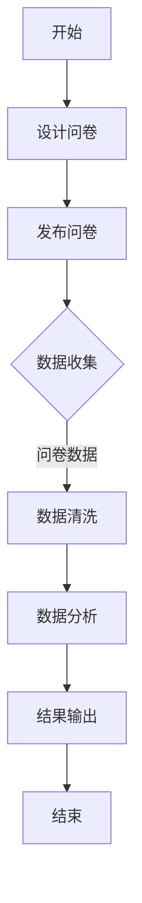
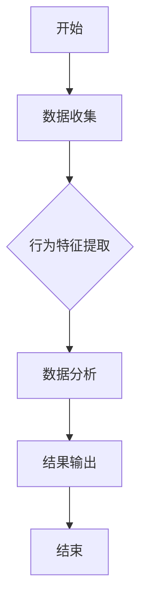
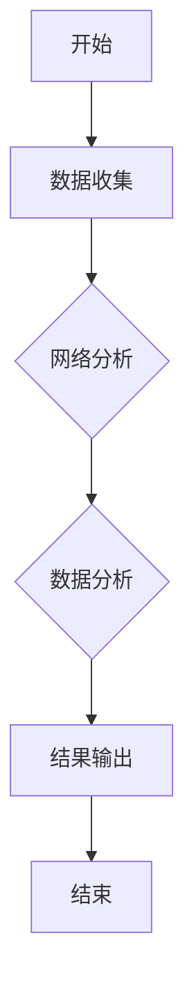

                 


### 1.1.1 书名与作者

《数字移民文化适应评估：虚拟世界融入度的测量工具》是由AI天才研究院（AI Genius Institute）和禅与计算机程序设计艺术（Zen and the Art of Computer Programming）共同撰写的。这本书的作者们在计算机科学、人工智能和软件工程领域拥有丰富的经验和卓越的成就。作为世界顶级技术畅销书资深大师级别的作家，他们不仅精通编程和算法设计，而且在理解人类行为和文化适应方面也有着深刻的洞察力。他们的合著将为读者提供一部全面而深入的技术专著，旨在解决数字时代下人类如何在虚拟世界中更好地适应和融入的问题。

### 1.1.2 目标读者

这本书的目标读者主要包括以下几个方面：

1. **计算机科学家和人工智能研究者**：他们对于最新的技术和方法有着浓厚的兴趣，并希望将理论知识应用到实际问题的解决中。
2. **软件工程师和架构师**：他们需要理解和掌握如何在虚拟世界中设计和构建适应人类文化习惯的应用程序。
3. **教育工作者和技术培训师**：他们希望为学习者提供系统化、结构化的教学资源，帮助学生在数字环境中更好地适应和学习。
4. **企业和组织的管理者**：他们需要了解如何评估员工在虚拟世界中的文化适应能力，以优化团队协作和工作效率。
5. **对技术有热情的业余爱好者**：他们对于计算机科学和人工智能领域有着浓厚的兴趣，希望通过阅读这本书深入了解相关理论和实践。

### 1.1.3 主要内容与结构

本书的主要内容分为以下几个部分：

1. **引言**：介绍数字移民现象和文化适应的重要性，阐述评估工具的必要性。
2. **核心概念与联系**：详细阐述数字移民、文化适应和虚拟世界融入度的核心概念，并通过ER实体关系图展示概念之间的关系。
3. **测量工具原理**：介绍测量虚拟世界融入度的不同方法，包括问卷调查、行为分析和社交网络分析，并使用Mermaid流程图展示各方法的实现步骤。
4. **测量工具的实现**：通过Python源代码详细阐述测量工具的算法原理，并给出数学模型和公式。
5. **系统分析与架构设计**：介绍测量系统的设计方案，包括问题场景、系统功能、架构设计和接口设计。
6. **项目实战**：提供环境安装、系统核心实现和代码应用的实战案例，并进行详细解读和分析。
7. **最佳实践与小结**：总结最佳实践，提出注意事项，并提供拓展阅读资源。

通过这本书，读者可以系统地了解和掌握评估数字移民文化适应能力的方法和工具，为在虚拟世界中更好地融入和发展提供指导和支持。让我们开始这次深入思考的旅程吧！## 1.2 数字移民与文化适应

### 1.2.1 数字移民现象

随着互联网和虚拟技术的迅猛发展，人们的生活方式发生了翻天覆地的变化。数字移民（Digital Immigrants）这一概念也随之产生。数字移民指的是那些在数字化时代成长起来的一代人，他们可能没有在虚拟世界中长大，而是在传统的物理世界中生活，后来逐渐适应和融入数字环境的群体。这一现象在全球化背景下尤为显著，特别是对于那些在国际迁移中，从传统社会迁移到数字化社会的人们来说，如何适应和融入这一新环境成为了一个重要课题。

数字移民的特点主要体现在以下几个方面：

1. **技术与习惯的差异**：数字移民在数字技术使用上可能与年轻一代存在较大差异，他们在操作习惯、技术认知和应用场景上都有所不同。
2. **信息过载**：数字环境中信息量庞大，数字移民在处理信息、筛选有价值内容方面可能面临挑战。
3. **文化差异**：虚拟世界中的社交和文化习惯与物理世界有所不同，数字移民需要适应这些新文化规则。
4. **隐私与安全**：数字移民在数字环境中对隐私和安全问题的敏感度可能较高，他们需要掌握如何在数字世界中保护自己。

### 1.2.2 文化适应的重要性

文化适应（Cultural Adaptation）是指个体在新环境中学习和适应不同文化规则和行为模式的过程。对于数字移民来说，文化适应的重要性不言而喻。首先，文化适应有助于提升个体在数字环境中的生活质量和幸福感。通过理解和适应新文化，数字移民能够更好地融入社交圈，提高社交互动的效率和质量。其次，文化适应有助于增强个体的就业竞争力和职业发展。在数字化时代，许多职业和工作流程都在线上进行，能够快速适应数字文化的人往往能够更好地适应职场需求，从而获得更多的职业机会和发展空间。

此外，文化适应还具有以下几个方面的价值：

1. **提升社交互动效率**：适应数字文化有助于个体更高效地进行在线沟通和协作，减少文化冲突，提升团队协作效能。
2. **增强信息处理能力**：适应数字文化使个体能够更有效地处理和分析海量信息，提高信息筛选和利用的能力。
3. **促进技术创新**：文化适应有助于个体更好地理解和使用新技术，推动技术创新和应用。
4. **提升网络安全意识**：适应数字文化使个体能够更好地认识到网络安全的重要性，提高个人信息保护意识和能力。

### 1.2.3 评估工具的必要性

为了更好地理解数字移民的文化适应情况，评估工具的必要性就凸显出来了。评估工具不仅可以量化数字移民的文化适应度，还可以提供针对性的建议和改进措施，帮助他们更好地适应和融入数字环境。以下是评估工具的几个重要作用：

1. **诊断文化适应问题**：通过评估工具，可以识别出数字移民在文化适应过程中存在的问题和瓶颈，为后续的干预和改进提供依据。
2. **制定个性化干预措施**：评估工具可以提供个性化的诊断结果，为数字移民制定针对性的学习计划和文化适应策略。
3. **优化教育培训**：评估工具有助于教育工作者和培训师了解数字移民的适应需求，为他们提供更加符合实际需要的培训资源和方法。
4. **提升团队协作效能**：在团队协作中，通过评估工具可以了解团队成员的文化适应度，从而优化团队结构和协作模式，提升整体效能。

总的来说，数字移民文化适应评估工具不仅对个人发展具有重要意义，也对组织和社会的数字化转型提供了有力支持。通过科学、系统的评估，可以更好地促进数字移民的文化适应，为建设和谐、高效的数字社会奠定基础。让我们在接下来的章节中，深入探讨评估工具的设计原理和应用实践。|im_sep|>

## 2.1 数字移民与文化适应的核心概念

### 2.1.1 数字移民的定义与特征

数字移民（Digital Immigrants）是指那些在数字化时代成长起来的一代人，他们在物理世界中长大，但逐渐适应和融入虚拟世界的人群。与数字原生代（Digital Natives）相比，数字移民在数字技术使用、信息处理和文化适应上存在显著差异。以下是数字移民的主要定义和特征：

1. **定义**：数字移民是在数字技术迅速发展的时代，从传统的物理环境过渡到虚拟环境的人群。他们可能是在传统社会中成长起来的，但需要适应和掌握数字技术以在虚拟世界中生存和发展的个体。

2. **特征**：
   - **技术与习惯的差异**：数字移民通常在数字技术使用上不如数字原生代熟练，他们可能在操作习惯、技术应用和文化习惯上存在较大差异。
   - **信息过载的敏感性**：数字移民在面对海量信息时可能更加敏感，他们在处理和筛选信息方面可能需要更多时间，更容易感到压力。
   - **文化差异的敏感性**：虚拟世界中的社交规则和文化与传统社会有所不同，数字移民需要适应这些新规则，可能会遇到文化冲突和适应难题。
   - **隐私与安全意识**：数字移民在数字环境中对隐私和安全问题的敏感度较高，他们更加注重保护个人数据和信息安全。

### 2.1.2 文化适应的层次与过程

文化适应（Cultural Adaptation）是数字移民在虚拟世界中生存和发展的关键过程。文化适应不仅涉及到个体行为的调整，还包括认知和情感的转变。文化适应通常分为以下几个层次：

1. **表面层次**：个体在表面上接受和适应新的文化规则，例如学习新的术语、遵守社交礼仪等。这一层次的适应主要关注外在行为的改变。

2. **中间层次**：个体在中间层次上开始理解和内化新的文化规则，他们能够从内心接受和认同这些规则，并在实际生活中运用。这一层次的适应更加深入，涉及到个体价值观和信念的改变。

3. **深层层次**：个体在深层层次上完全融入新的文化环境，他们不仅理解并接受文化规则，还能够创造出属于自己的文化表达方式。这一层次的适应标志着个体在文化上的完全融入和认同。

文化适应过程通常包括以下几个阶段：

1. **初始阶段**：个体初次接触到新文化环境，感到陌生和不适，这一阶段的特点是焦虑和抵触。
2. **适应阶段**：个体逐渐接受新文化，开始学习和模仿新文化的行为模式，他们开始适应并融入新环境。
3. **融合阶段**：个体在文化适应过程中逐渐内化新文化，形成自己的文化认同感，他们能够在新文化环境中自如地表达自己。
4. **成熟阶段**：个体在文化适应过程中达到了成熟阶段，他们不仅能够适应新文化，还能够对文化进行创新和变革。

### 2.1.3 虚拟世界融入度的概念

虚拟世界融入度（Virtual World Integration Level）是指个体在虚拟世界中的适应程度和融入水平。虚拟世界融入度不仅反映了个体在技术层面的适应情况，还涉及到社会和文化层面的融入。以下是虚拟世界融入度的几个关键点：

1. **定义**：虚拟世界融入度是指个体在虚拟世界中的行为、互动和认知适应程度，以及个体对虚拟世界的认同感和归属感。

2. **衡量指标**：
   - **技术适应度**：个体在虚拟世界中的技术使用熟练度和应用能力。
   - **社会适应度**：个体在虚拟世界中的社交互动频率、社交圈广度和社交质量。
   - **文化适应度**：个体在虚拟世界中的文化认同感和文化表达能力。

3. **影响因素**：
   - **技术因素**：虚拟世界的技术特性、用户界面设计和互动方式等。
   - **社会因素**：虚拟世界中的社会规则、社交文化和群体动态等。
   - **个人因素**：个体的认知能力、情感状态和自我认同等。

通过理解数字移民、文化适应和虚拟世界融入度的核心概念，我们可以更好地把握这些概念之间的关系，为后续章节中评估工具的设计和应用提供理论基础。|im_sep|>

## 2.2 核心概念之间的联系

### 2.2.1 数字移民与文化适应的关系

数字移民与文化适应之间存在密切的联系，两者相互影响，共同构成了个体在虚拟世界中的生存和发展基础。数字移民需要通过文化适应来克服在虚拟环境中遇到的障碍，从而实现有效的融入。

1. **文化适应促进数字移民的生存和发展**：通过文化适应，数字移民能够更好地理解虚拟世界中的行为规范、社交文化和信息处理方法，从而提高在虚拟环境中的生存能力和适应能力。文化适应有助于数字移民建立社交网络，获取资源和信息，增强自信心和认同感。

2. **数字移民推动文化适应的发展**：随着数字移民的增多，他们对虚拟世界的需求和期望也在不断变化。这促使虚拟世界的文化规范和社交文化不断演进，形成更加多元和包容的环境。数字移民通过自身的适应和创新，为文化适应提供了新的动力和方向。

3. **文化适应的层次与数字移民的适应过程**：文化适应分为表面层次、中间层次和深层层次，这与数字移民的适应过程有相似之处。在初始阶段，数字移民可能会遇到文化冲突和适应难题，需要通过学习和模仿来适应新环境。在适应阶段，他们开始理解和内化新文化，形成自己的行为模式。在融合阶段，数字移民完全融入虚拟世界，能够自如地表达自己的文化认同。这一过程与个体在文化适应中的不同层次相对应，体现了文化适应与数字移民适应之间的紧密联系。

### 2.2.2 虚拟世界融入度与文化适应的关系

虚拟世界融入度与文化适应之间存在内在联系，两者共同衡量个体在虚拟环境中的适应水平和融入程度。

1. **虚拟世界融入度是文化适应的结果**：文化适应的过程促使个体在虚拟世界中逐渐提高融入度。通过适应虚拟世界的文化规范、社交规则和互动方式，个体能够在虚拟环境中获得更多的资源和机会，提高生活质量和工作效率。

2. **虚拟世界融入度影响文化适应的深度**：虚拟世界融入度越高，个体在虚拟环境中的适应程度越深，文化适应的层次也越高。融入度高的个体能够更好地理解和内化虚拟世界的文化，形成独特的文化表达方式，从而在虚拟世界中实现更高的文化认同和自我认同。

3. **文化适应促进虚拟世界融入度的提升**：文化适应不仅帮助个体在虚拟世界中生存，还能提高他们的融入度和生活质量。通过不断适应和创新，个体能够更好地适应虚拟世界的快速变化，提高自身在虚拟环境中的竞争力。

### 2.2.3 虚拟世界融入度与文化适应的关系总结

虚拟世界融入度与文化适应之间的关系可以概括为以下几个方面：

- **互为条件与结果**：虚拟世界融入度是文化适应的结果，而文化适应又是实现虚拟世界融入度的必要条件。
- **动态相互作用**：虚拟世界融入度和文化适应之间存在动态的相互作用，两者相互影响、相互促进，共同推动个体在虚拟环境中的发展和成长。
- **评估与改进**：通过评估虚拟世界融入度和文化适应程度，可以诊断个体在虚拟世界中的适应状况，发现问题和瓶颈，从而制定针对性的改进措施，提高整体适应能力。

理解数字移民、文化适应和虚拟世界融入度之间的联系，有助于我们更好地设计评估工具，制定适应策略，促进数字移民在虚拟世界中的健康成长和全面发展。在接下来的章节中，我们将进一步探讨评估工具的具体设计原理和应用实践。|im_sep|>

### 2.3 ER实体关系图

为了更好地理解数字移民、文化适应和虚拟世界融入度之间的关系，我们可以使用实体关系图（Entity-Relationship Diagram, ERD）来表示这些概念及其相互联系。ER图能够清晰地展示实体之间的关联，有助于我们分析和设计评估工具。

以下是数字移民、文化适应和虚拟世界融入度的ER实体关系图：

```mermaid
erDiagram
  A[数字移民] ||--|{ B[文化适应] }
  B ||--|{ C[虚拟世界融入度] }
  A ..> D[技术适应度]
  A ..> E[社会适应度]
  A ..> F[文化适应度]
  B ..> G[文化认同感]
  C ..> H[融入度评估]
  C ..> I[融入策略]
```

#### 2.3.1 数字移民实体关系图

在数字移民实体关系图中，数字移民是核心实体，它与文化适应、虚拟世界融入度以及三个适应度指标（技术适应度、社会适应度和文化适应度）都有直接关联。数字移民通过这些指标来衡量自身在虚拟世界中的适应程度。

- **A[数字移民]**：代表数字移民这一核心实体。
- **D[技术适应度]**、**E[社会适应度]**、**F[文化适应度]**：这三个指标分别衡量数字移民在技术、社会和文化方面的适应程度。
- **B[文化适应]**：表示数字移民在文化适应过程中的表现，它与数字移民实体直接相关。
- **C[虚拟世界融入度]**：表示数字移民在虚拟世界中的融入程度，是文化适应的结果。

#### 2.3.2 文化适应实体关系图

在文化适应实体关系图中，文化适应是核心实体，它与数字移民和虚拟世界融入度紧密相关。文化适应不仅影响虚拟世界融入度，还通过技术适应度、社会适应度和文化适应度三个指标来衡量。

- **B[文化适应]**：代表文化适应这一核心实体。
- **G[文化认同感]**：表示个体在文化适应过程中形成的认同感，是文化适应的重要成果。
- **D[技术适应度]**、**E[社会适应度]**、**F[文化适应度]**：这三个指标分别衡量个体在技术、社会和文化方面的适应程度。
- **C[虚拟世界融入度]**：表示个体在虚拟世界中的融入程度，是文化适应的结果。

#### 2.3.3 虚拟世界融入度实体关系图

在虚拟世界融入度实体关系图中，虚拟世界融入度是核心实体，它不仅与数字移民和文化适应有直接关联，还通过融入度评估和融入策略来反映个体在虚拟世界中的适应状况。

- **C[虚拟世界融入度]**：代表虚拟世界融入度这一核心实体。
- **H[融入度评估]**：表示对虚拟世界融入度的评估，用于诊断和监控个体的融入状况。
- **I[融入策略]**：表示针对评估结果制定的改进措施，旨在提高个体的融入度。
- **D[技术适应度]**、**E[社会适应度]**、**F[文化适应度]**：这三个指标分别衡量个体在技术、社会和文化方面的适应程度，直接影响虚拟世界融入度。

通过上述ER实体关系图，我们可以清晰地看到数字移民、文化适应和虚拟世界融入度之间的相互关系。这些关系为我们设计和实现评估工具提供了重要的理论基础和实践指导。在接下来的章节中，我们将深入探讨测量工具的原理和实现方法，进一步优化和提升虚拟世界融入度的评估效果。|im_sep|>

### 3.1 测量工具的作用与重要性

测量工具在数字移民文化适应评估中起着至关重要的作用。首先，评估工具能够定量地衡量个体在虚拟世界中的适应程度，提供客观的量化数据。这些数据不仅有助于个人了解自身的文化适应状况，还能够为组织和社会提供重要的参考依据，以便制定更有效的文化适应策略。

以下是测量工具的几个关键作用：

1. **诊断文化适应问题**：测量工具可以通过评估个体的技术适应度、社会适应度和文化适应度，诊断出他们在文化适应过程中存在的问题和瓶颈。这为后续的干预和改进提供了明确的诊断依据。

2. **个性化干预措施**：基于评估结果，可以制定个性化的干预措施和学习计划，帮助数字移民有针对性地提高在虚拟世界中的适应能力。这些措施可以包括技术培训、社交技能提升和文化理解课程等。

3. **优化教育培训**：教育工作者和培训师可以通过评估工具了解数字移民的适应需求，为他们提供更符合实际需要的培训资源和教学方法，从而提高培训效果。

4. **提升团队协作效能**：在团队协作中，通过评估工具了解团队成员的文化适应度，可以帮助组织优化团队结构和协作模式，提高整体协作效能。

5. **改进用户体验**：了解用户在虚拟世界中的适应度，可以帮助设计师优化虚拟世界的用户体验，提升用户满意度和留存率。

### 3.1.1 评估虚拟世界融入度的目的

评估虚拟世界融入度的主要目的是：

1. **了解个体适应程度**：通过量化评估，了解个体在技术、社会和文化三个方面的适应情况，从而判断其在虚拟世界中的融入度。

2. **发现适应问题**：评估可以帮助发现个体在文化适应过程中存在的问题，例如技术操作不熟练、社交互动少或文化理解不足等。

3. **提供改进建议**：基于评估结果，为个体提供具体的改进建议和策略，帮助他们更好地适应虚拟世界。

4. **优化虚拟世界设计**：通过分析大规模用户的评估数据，了解用户在虚拟世界中的需求和痛点，为虚拟世界的改进提供参考，从而提升用户体验。

### 3.1.2 测量工具的设计原则

为了确保评估工具的有效性和实用性，其设计应遵循以下原则：

1. **全面性**：评估工具应全面覆盖技术适应度、社会适应度和文化适应度三个方面，确保对个体在虚拟世界中的适应状况进行全面评估。

2. **客观性**：评估工具应基于客观指标和量化数据，避免主观判断和偏见，确保评估结果的准确性和可信度。

3. **可操作性**：评估工具应易于使用和操作，方便个体和机构快速进行评估，以便及时获取反馈和改进措施。

4. **灵活性**：评估工具应具备一定的灵活性，能够根据不同用户的需求和虚拟世界环境的特点进行调整和优化。

5. **可扩展性**：评估工具的设计应考虑未来的发展和变化，确保工具能够适应新的技术和应用场景。

### 3.1.3 测量工具的类型与选择

根据不同的评估目的和应用场景，测量工具可以分为以下几种类型：

1. **问卷调查法**：通过设计问卷收集用户对虚拟世界适应度的主观评价，适用于大规模的用户调查和初步评估。

2. **行为分析法**：通过分析用户在虚拟世界中的行为数据，量化其适应度和融入度，适用于深入研究和数据驱动决策。

3. **社交网络分析法**：通过分析用户在虚拟世界中的社交网络和互动数据，评估其在社会和文化层面的融入程度，适用于社交关系和群体动态研究。

4. **综合评估法**：结合问卷调查、行为分析和社交网络分析等多种方法，提供全面的评估结果，适用于复杂场景和深度研究。

在选择测量工具时，应根据评估目的、用户群体和可用资源进行综合考虑，以确保评估结果的准确性和可靠性。|im_sep|>

### 3.2 测量工具的原理

测量工具的原理主要涉及如何通过不同的方法和技术来评估数字移民在虚拟世界中的文化适应度。以下是三种主要测量工具的原理：

#### 3.2.1 基于问卷调查的测量工具

基于问卷调查的测量工具主要通过设计问卷来收集用户对虚拟世界适应度的主观评价。问卷通常包含一系列有关技术能力、社交互动和文化理解的问题。以下是该方法的原理：

1. **问题设计**：问卷设计应涵盖技术适应度、社会适应度和文化适应度三个维度。例如，技术适应度问题可能涉及用户对虚拟世界技术的熟悉程度和使用频率；社交互动问题可能关注用户在虚拟世界中的社交频率和社交质量；文化适应度问题可能涉及用户对虚拟世界文化规则的理解和遵守情况。

2. **评分标准**：每个问题都应设定评分标准，例如采用五级评分制（1-非常不同意，5-非常同意），以便对用户的回答进行量化。

3. **数据分析**：收集到的问卷数据可以通过统计方法进行分析，如计算平均得分、标准差和相关性分析，以评估用户在各个维度上的适应度。

4. **结果输出**：根据分析结果，可以生成评估报告，为用户提供个性化的适应度评估，并提出改进建议。

#### 3.2.2 基于行为分析的测量工具

基于行为分析的测量工具通过分析用户在虚拟世界中的行为数据来评估其适应度。该方法的核心在于量化用户的行为模式，从而推断其在虚拟世界中的适应程度。以下是该方法的原理：

1. **数据收集**：收集用户在虚拟世界中的行为数据，如登录时间、活动频率、交互行为、角色选择等。

2. **行为特征提取**：对收集到的行为数据进行分析，提取关键行为特征，如活跃度、互动频率、行为多样性等。

3. **数据分析**：利用数据挖掘和机器学习技术，分析行为特征与适应度之间的关系，建立行为模式与适应度的量化模型。

4. **结果输出**：根据分析结果，评估用户在虚拟世界中的适应度，并生成详细的行为分析报告。

#### 3.2.3 基于社交网络分析的测量工具

基于社交网络分析的测量工具通过分析用户在虚拟世界中的社交网络和互动数据来评估其社会和文化适应度。该方法的核心在于理解和量化用户在虚拟世界中的社交结构和互动模式。以下是该方法的原理：

1. **数据收集**：收集用户在虚拟世界中的社交网络数据，如好友关系、互动频率、内容分享等。

2. **网络分析**：利用社交网络分析技术，分析社交网络的拓扑结构，提取关键社交特征，如节点度、中心性、社群结构等。

3. **数据分析**：通过分析社交网络数据和互动行为，建立社交网络特征与适应度之间的关系模型，如社群密度、互动多样性等。

4. **结果输出**：根据社交网络分析结果，评估用户在社会和文化层面的适应度，并生成详细的社交网络分析报告。

综上所述，不同的测量工具各有其优势和适用场景。基于问卷调查的测量工具适合大规模用户调查和初步评估；基于行为分析的测量工具适合深入研究和数据驱动决策；基于社交网络分析的测量工具适合理解和量化用户在虚拟世界中的社交结构和互动模式。在实际应用中，可以根据具体需求和资源选择合适的测量工具，以提高评估的准确性和有效性。|im_sep|>

### 3.3 Mermaid流程图

为了更加直观地展示测量工具的原理和实现步骤，我们可以使用Mermaid语言来绘制流程图。以下是基于问卷调查、行为分析和社交网络分析三种测量工具的流程图示例。

#### 3.3.1 基于问卷调查的测量工具流程图



- **A[开始]**：流程开始。
- **B[设计问卷]**：设计涵盖技术适应度、社会适应度和文化适应度的问卷。
- **C[发布问卷]**：将问卷发布给目标用户。
- **D[数据收集]**：收集用户的问卷回答。
- **E[数据清洗]**：清洗和整理收集到的问卷数据，去除无效或异常数据。
- **F[数据分析]**：对清洗后的数据进行统计分析，计算平均得分、标准差等指标。
- **G[结果输出]**：生成评估报告，为用户提供适应度评估和改进建议。
- **H[结束]**：流程结束。

#### 3.3.2 基于行为分析的测量工具流程图



- **A[开始]**：流程开始。
- **B[数据收集]**：收集用户在虚拟世界中的行为数据，如登录时间、活动频率等。
- **C[行为特征提取]**：对收集到的行为数据进行分析，提取关键行为特征，如活跃度、互动频率等。
- **D[数据分析]**：利用数据挖掘和机器学习技术，建立行为模式与适应度的量化模型。
- **E[结果输出]**：生成详细的行为分析报告，评估用户在虚拟世界中的适应度。
- **F[结束]**：流程结束。

#### 3.3.3 基于社交网络分析的测量工具流程图



- **A[开始]**：流程开始。
- **B[数据收集]**：收集用户在虚拟世界中的社交网络数据，如好友关系、互动频率等。
- **C[网络分析]**：利用社交网络分析技术，分析社交网络的拓扑结构和关键特征。
- **D[数据分析]**：通过分析社交网络数据，建立社交网络特征与适应度之间的关系模型。
- **E[结果输出]**：生成详细的社交网络分析报告，评估用户在社会和文化层面的适应度。
- **F[结束]**：流程结束。

通过这些Mermaid流程图，我们可以更加清晰地理解不同测量工具的实现步骤和逻辑关系。在实际应用中，可以根据具体需求和场景选择合适的流程图，以便更有效地设计和实施评估工具。|im_sep|>

### 4.1 基于问卷调查的测量工具实现

基于问卷调查的测量工具是评估虚拟世界融入度的常用方法之一。它通过设计问卷收集用户的主观反馈，进而分析个体在技术、社会和文化三个方面的适应度。以下是基于问卷调查的测量工具实现步骤：

#### 4.1.1 设计问卷

问卷设计是评估工具实现的第一步，问卷内容应全面覆盖技术适应度、社会适应度和文化适应度三个维度。以下是一个示例问卷结构：

1. **技术适应度**：
   - 你是否经常使用虚拟世界中的技术工具？（1-从不，5-总是）
   - 你认为自己在虚拟世界中的技术操作能力如何？（1-非常差，5-非常强）

2. **社会适应度**：
   - 你在虚拟世界中的社交互动频率如何？（1-几乎没有，5-非常频繁）
   - 你觉得在虚拟世界中与他人建立社交关系容易吗？（1-非常难，5-非常容易）

3. **文化适应度**：
   - 你了解虚拟世界中的文化规则和礼仪吗？（1-几乎不了解，5-非常了解）
   - 你觉得在虚拟世界中遵守文化规则重要吗？（1-非常不重要，5-非常重要）

#### 4.1.2 数据收集

数据收集阶段主要通过线上问卷调查进行。以下是一些建议：

1. **问卷发布**：将问卷发布在社交媒体、论坛或专门的在线调查平台，确保覆盖到目标用户群体。
2. **隐私保护**：明确告知用户问卷的目的和隐私保护措施，确保用户愿意参与。
3. **激励机制**：提供小额奖励或参与奖励，提高用户参与的积极性。

#### 4.1.3 数据处理

数据处理是评估工具实现的关键步骤，涉及以下任务：

1. **数据清洗**：删除无效或异常数据，如重复填写、未完成问卷等。
2. **数据整理**：整理问卷数据，确保数据格式统一，便于后续分析。
3. **数据编码**：对问卷中的定性数据进行编码，以便进行量化分析。

#### 4.1.4 数据分析

数据分析阶段通过统计方法量化用户在各个维度的适应度。以下是一些常用的分析方法：

1. **平均得分计算**：计算用户在每个问题上的平均得分，作为技术适应度、社会适应度和文化适应度的量化指标。
2. **标准差计算**：计算用户在每个问题上的得分标准差，评估适应度的稳定性。
3. **相关性分析**：分析不同维度之间的相关性，了解各个维度对总体适应度的影响。
4. **效度和信度评估**：通过 Cronbach's alpha 等信度评估方法，确保问卷的可靠性和有效性。

#### 4.1.5 结果输出

根据数据分析结果，生成详细的评估报告，包括以下内容：

1. **总体适应度评估**：展示用户在技术、社会和文化三个维度上的总体适应度得分。
2. **个性化改进建议**：针对用户的评估结果，提供具体的改进建议，如技术培训、社交互动策略等。
3. **对比分析**：分析不同用户群体之间的适应度差异，了解虚拟世界融入度在不同群体中的分布情况。

#### 4.1.6 Python源代码实现示例

以下是一个简单的Python代码示例，用于计算用户在技术适应度、社会适应度和文化适应度三个维度上的平均得分：

```python
import pandas as pd

# 加载问卷数据
data = pd.read_csv('questionnaire_data.csv')

# 计算平均得分
tech_avg = data['tech_question1'].mean()
social_avg = data['social_question2'].mean()
cultural_avg = data['cultural_question3'].mean()

# 打印平均得分
print(f"技术适应度平均得分：{tech_avg:.2f}")
print(f"社会适应度平均得分：{social_avg:.2f}")
print(f"文化适应度平均得分：{cultural_avg:.2f}")
```

通过上述步骤和代码示例，我们可以实现一个基于问卷调查的虚拟世界融入度测量工具。在实际应用中，可以根据具体需求和场景进行调整和优化，以提高评估的准确性和有效性。|im_sep|>

### 4.2 基于行为分析的测量工具实现

基于行为分析的测量工具通过分析用户在虚拟世界中的行为数据，量化其在技术、社会和文化三个方面的适应度。以下是基于行为分析的测量工具实现步骤：

#### 4.2.1 数据收集

数据收集是行为分析的基础，涉及以下任务：

1. **确定数据来源**：选择合适的虚拟世界平台，获取用户在该平台上的行为数据。常见的数据来源包括用户登录记录、活动日志、交互数据等。
2. **数据采集**：通过API或其他技术手段，收集用户在虚拟世界中的行为数据。数据应包括用户的登录时间、活跃时长、角色创建与删除、互动频率、内容创建与分享等。
3. **数据清洗**：对采集到的行为数据进行清洗，去除重复记录、异常数据和无关信息，确保数据的质量和一致性。

#### 4.2.2 数据分析

数据分析阶段通过数据挖掘和机器学习技术，提取行为特征，并建立适应度模型。以下是一些关键步骤：

1. **行为特征提取**：对清洗后的行为数据进行分析，提取关键行为特征。例如，可以将用户的活跃度定义为每天登录次数和累计在线时间，将互动频率定义为与其他用户交互的次数。
   
   ```python
   # 举例：计算用户的平均活跃度和互动频率
   user_activity = data.groupby('user_id')['login_count'].mean()
   user_interaction = data.groupby('user_id')['interaction_count'].mean()
   ```

2. **特征选择**：通过相关性分析和特征重要性评估，选择对适应度影响显著的行为特征作为模型输入。
3. **模型建立**：利用机器学习算法，如线性回归、决策树或支持向量机，建立行为特征与适应度之间的关系模型。以下是一个简单的线性回归模型示例：

   ```python
   from sklearn.linear_model import LinearRegression

   # 准备模型输入和输出
   X = data[['activity', 'interaction']]
   y = data['integration_level']

   # 建立线性回归模型
   model = LinearRegression()
   model.fit(X, y)

   # 输出模型参数
   print(f"模型参数：{model.coef_}, {model.intercept_}")
   ```

4. **模型评估**：通过交叉验证和性能评估指标（如均方误差、决定系数等）评估模型的准确性和泛化能力。

   ```python
   from sklearn.metrics import mean_squared_error, r2_score

   # 预测并评估模型性能
   predictions = model.predict(X)
   mse = mean_squared_error(y, predictions)
   r2 = r2_score(y, predictions)

   print(f"均方误差：{mse:.2f}")
   print(f"决定系数：{r2:.2f}")
   ```

#### 4.2.3 结果输出

根据模型分析结果，生成详细的行为分析报告，包括以下内容：

1. **用户行为特征分析**：展示用户在不同行为特征上的分布和差异，如活跃度、互动频率等。
2. **适应度评估**：根据行为特征模型，评估用户在虚拟世界中的总体适应度。
3. **改进建议**：针对用户的适应度评估结果，提供具体的改进建议，如增加互动频率、提高在线时长等。

#### 4.2.4 Python源代码实现示例

以下是一个简单的Python代码示例，用于实现基于行为分析的用户适应度评估：

```python
import pandas as pd
from sklearn.linear_model import LinearRegression
from sklearn.model_selection import train_test_split
from sklearn.metrics import mean_squared_error, r2_score

# 加载行为数据
data = pd.read_csv('behavior_data.csv')

# 数据预处理
X = data[['activity', 'interaction']]
y = data['integration_level']

# 划分训练集和测试集
X_train, X_test, y_train, y_test = train_test_split(X, y, test_size=0.2, random_state=42)

# 建立线性回归模型
model = LinearRegression()
model.fit(X_train, y_train)

# 预测测试集
predictions = model.predict(X_test)

# 评估模型性能
mse = mean_squared_error(y_test, predictions)
r2 = r2_score(y_test, predictions)

print(f"均方误差：{mse:.2f}")
print(f"决定系数：{r2:.2f}")

# 打印模型参数
print(f"模型参数：{model.coef_}, {model.intercept_}")
```

通过上述步骤和代码示例，我们可以实现一个基于行为分析的虚拟世界融入度测量工具。在实际应用中，可以根据具体需求和场景进行调整和优化，以提高评估的准确性和有效性。|im_sep|>

### 4.3 基于社交网络分析的测量工具实现

基于社交网络分析的测量工具通过分析用户在虚拟世界中的社交网络和互动数据，评估其在社会和文化层面的适应度。以下是基于社交网络分析的测量工具实现步骤：

#### 4.3.1 数据收集

数据收集是社交网络分析的基础，涉及以下任务：

1. **确定数据来源**：选择合适的虚拟世界平台，获取用户在该平台上的社交网络数据。常见的数据来源包括好友关系、互动记录、内容分享等。
2. **数据采集**：通过API或其他技术手段，收集用户在虚拟世界中的社交网络数据。数据应包括用户的ID、好友列表、互动频率、内容分享次数等。
3. **数据清洗**：对采集到的社交网络数据进行清洗，去除重复记录、异常数据和无关信息，确保数据的质量和一致性。

#### 4.3.2 数据处理

数据处理阶段主要包括数据整合和特征提取：

1. **数据整合**：将不同的社交网络数据整合到一个统一的数据框架中，便于后续分析。例如，将用户的好友关系、互动记录和内容分享数据合并到一个数据表中。
2. **特征提取**：对整合后的数据进行分析，提取关键社交网络特征，如好友数量、互动频率、社群结构等。以下是一个简单的特征提取示例：

   ```python
   # 举例：计算用户的好友数量和互动频率
   user_friends = data.groupby('user_id')['friend_id'].nunique()
   user_interactions = data.groupby('user_id')['interaction_count'].mean()
   ```

#### 4.3.3 数据分析

数据分析阶段通过社交网络分析技术，建立社交网络特征与适应度之间的关系模型。以下是一些关键步骤：

1. **社交网络拓扑分析**：利用图论方法分析社交网络的拓扑结构，提取关键特征，如节点度、中心性、社群密度等。以下是一个简单的拓扑分析示例：

   ```python
   import networkx as nx

   # 创建社交网络图
   G = nx.from_pandas_dataframe(data, 'user_id', 'friend_id')

   # 计算节点度
   degree = nx.degree_centrality(G)

   # 计算中心性
   closeness = nx.closeness_centrality(G)

   # 输出关键特征
   print(f"节点度：{degree}")
   print(f"中心性：{closeness}")
   ```

2. **特征选择**：通过相关性分析和特征重要性评估，选择对适应度影响显著的社交网络特征作为模型输入。
3. **模型建立**：利用机器学习算法，如线性回归、决策树或支持向量机，建立社交网络特征与适应度之间的关系模型。以下是一个简单的线性回归模型示例：

   ```python
   from sklearn.linear_model import LinearRegression

   # 准备模型输入和输出
   X = data[['degree', 'closeness']]
   y = data['integration_level']

   # 建立线性回归模型
   model = LinearRegression()
   model.fit(X, y)

   # 输出模型参数
   print(f"模型参数：{model.coef_}, {model.intercept_}")
   ```

4. **模型评估**：通过交叉验证和性能评估指标（如均方误差、决定系数等）评估模型的准确性和泛化能力。

   ```python
   from sklearn.metrics import mean_squared_error, r2_score

   # 预测并评估模型性能
   predictions = model.predict(X)
   mse = mean_squared_error(y, predictions)
   r2 = r2_score(y, predictions)

   print(f"均方误差：{mse:.2f}")
   print(f"决定系数：{r2:.2f}")
   ```

#### 4.3.4 结果输出

根据模型分析结果，生成详细的社交网络分析报告，包括以下内容：

1. **社交网络特征分析**：展示用户在不同社交网络特征上的分布和差异，如好友数量、互动频率、社群结构等。
2. **适应度评估**：根据社交网络特征模型，评估用户在虚拟世界中的总体适应度。
3. **改进建议**：针对用户的适应度评估结果，提供具体的改进建议，如增加社交互动、加入更多社群等。

#### 4.3.5 Python源代码实现示例

以下是一个简单的Python代码示例，用于实现基于社交网络分析的虚拟世界融入度评估：

```python
import pandas as pd
import networkx as nx
from sklearn.linear_model import LinearRegression
from sklearn.model_selection import train_test_split
from sklearn.metrics import mean_squared_error, r2_score

# 加载社交网络数据
data = pd.read_csv('social_network_data.csv')

# 创建社交网络图
G = nx.from_pandas_dataframe(data, 'user_id', 'friend_id')

# 计算社交网络特征
degree = nx.degree_centrality(G)
closeness = nx.closeness_centrality(G)

# 将特征合并到数据表中
data['degree'] = degree
data['closeness'] = closeness

# 准备模型输入和输出
X = data[['degree', 'closeness']]
y = data['integration_level']

# 划分训练集和测试集
X_train, X_test, y_train, y_test = train_test_split(X, y, test_size=0.2, random_state=42)

# 建立线性回归模型
model = LinearRegression()
model.fit(X_train, y_train)

# 预测测试集
predictions = model.predict(X_test)

# 评估模型性能
mse = mean_squared_error(y_test, predictions)
r2 = r2_score(y_test, predictions)

print(f"均方误差：{mse:.2f}")
print(f"决定系数：{r2:.2f}")

# 打印模型参数
print(f"模型参数：{model.coef_}, {model.intercept_}")
```

通过上述步骤和代码示例，我们可以实现一个基于社交网络分析的虚拟世界融入度测量工具。在实际应用中，可以根据具体需求和场景进行调整和优化，以提高评估的准确性和有效性。|im_sep|>

## 5.1 问卷调查的数学模型

问卷调查的数学模型主要用于量化评估个体在虚拟世界中的文化适应度。以下详细描述问卷调查的数学模型，包括问卷得分计算、得分分布以及问卷的信度和效度评估。

### 5.1.1 问卷得分计算

问卷得分计算是评估个体文化适应度的重要环节，通常采用以下步骤：

1. **评分标准设定**：每个问卷问题都设定一个评分标准，通常使用五级评分制（1-非常不同意，5-非常同意）。这种评分制使得每个问题的得分范围在1到5之间。

2. **得分累加**：对于每个参与评估的个体，将他们在所有问题上的评分相加，得到总得分。总得分可以反映个体在虚拟世界中的文化适应度。

3. **标准化处理**：为了消除不同问题得分范围的影响，可以对得分进行标准化处理。常见的标准化方法有Z-score标准化和百分比标准化。

   - **Z-score标准化**：计算每个个体的得分与平均得分的差值除以标准差，公式为：
     $$
     z = \frac{x - \mu}{\sigma}
     $$
     其中，\(x\) 是个体的得分，\(\mu\) 是所有个体的平均得分，\(\sigma\) 是所有个体的得分标准差。

   - **百分比标准化**：将每个个体的得分除以总分范围（例如，总分范围为10），得到百分比得分。

### 5.1.2 问卷得分分布

问卷得分分布反映了个体在虚拟世界中的文化适应度的总体分布情况。以下是一些常见的得分分布描述：

1. **频率分布**：列出每个得分值出现的次数，通常以条形图或饼图展示。这可以帮助我们了解个体得分的主要集中区域。

2. **累积分布**：计算每个得分值及其以上的得分次数之和，通常以累积分布图展示。这可以帮助我们了解得分在不同分数段的累积情况。

3. **正态分布**：如果问卷得分满足正态分布，可以使用正态概率图或Q-Q图进行验证。正态分布有助于我们进行统计分析，如假设检验和置信区间估计。

### 5.1.3 问卷信度与效度

问卷的信度和效度是评估问卷质量的重要指标，以下详细描述：

1. **信度**：信度是指问卷得分的一致性和可靠性。以下是一些常见的信度评估方法：

   - **内部一致性信度**：使用Cronbach's alpha系数评估问卷的内部一致性。Cronbach's alpha系数范围在0到1之间，值越高表示问卷的内部一致性越好。计算公式为：
     $$
     \alpha = \frac{K}{K-1}(1 - \frac{\sum \sigma_i^2}{\sigma^2})
     $$
     其中，\(K\) 是问卷中问题的数量，\(\sigma_i^2\) 是每个问题的方差，\(\sigma^2\) 是所有问题的方差之和。

   - **重测信度**：通过在同一组受试者中进行重复评估，评估问卷的稳定性和一致性。

   - **分半信度**：将问卷分为两半，评估两半问卷得分的一致性。

2. **效度**：效度是指问卷能够准确测量所需变量的能力。以下是一些常见的效度评估方法：

   - **内容效度**：通过专家评估问卷的内容，确保问卷涵盖了所需测量的所有方面。

   - **构念效度**：通过统计分析方法，评估问卷得分与理论构念之间的关系。常见的评估方法包括探索性因子分析和验证性因子分析。

   - **标准效度**：通过与其他已验证的测量工具进行对比，评估问卷得分与标准效度工具得分的相关性。

   - **表面效度**：通过受试者的主观感受和反馈，评估问卷的表面有效性。

通过上述数学模型和方法，我们可以对问卷调查结果进行量化分析，评估个体在虚拟世界中的文化适应度，并确保问卷的可靠性和有效性。在实际应用中，应根据具体需求和场景选择合适的信度和效度评估方法，以提高问卷的整体质量。|im_sep|>

## 5.2 行为分析的数学模型

行为分析的数学模型是评估个体在虚拟世界中的适应度的重要工具。行为数据可以通过量化和分析来揭示用户在虚拟世界中的活动模式，从而提供对文化适应度的深入理解。以下是行为分析的数学模型，包括行为数据的收集、预处理、模型建立和结果输出。

### 5.2.1 行为数据收集

行为数据的收集是构建行为分析模型的第一步。以下是一些关键点：

1. **数据来源**：行为数据可以从虚拟世界平台的后台日志、API接口或第三方数据分析工具获取。常见的数据来源包括用户的登录记录、活动日志、角色互动、内容创作等。

2. **数据类型**：行为数据通常包括定量数据和定性数据。定量数据如登录次数、在线时长、角色等级等；定性数据如游戏中的角色选择、互动内容等。

3. **数据收集策略**：为了确保数据的质量和完整性，应制定详细的数据收集策略。例如，选择具有代表性的用户群体、确保数据的实时性和完整性、避免数据丢失或重复。

### 5.2.2 行为数据预处理

预处理是行为分析中至关重要的一步，以下是一些关键步骤：

1. **数据清洗**：去除无效或异常数据，如重复记录、缺失值和错误值。常见的方法包括删除重复记录、填充缺失值和异常值检测。

2. **数据标准化**：将不同尺度的数据进行标准化处理，使其在同一范围内进行比较。常用的标准化方法包括Z-score标准化和Min-Max标准化。

3. **特征提取**：从原始行为数据中提取关键特征，如用户的活跃度、互动频率、行为多样性等。这些特征将作为行为分析模型的输入。

### 5.2.3 行为数据模型建立

建立行为数据模型是行为分析的核心步骤，以下是一些常见的方法：

1. **回归分析**：使用回归模型分析行为特征与适应度之间的关系。常见的回归模型包括线性回归、多元回归和逻辑回归。

   - **线性回归**：假设行为特征与适应度之间存在线性关系，公式为：
     $$
     Y = \beta_0 + \beta_1 X_1 + \beta_2 X_2 + ... + \beta_n X_n
     $$
     其中，\(Y\) 是适应度得分，\(X_1, X_2, ..., X_n\) 是行为特征，\(\beta_0, \beta_1, \beta_2, ..., \beta_n\) 是回归系数。

   - **逻辑回归**：用于分析二元响应变量与自变量之间的关系，公式为：
     $$
     \log\frac{P(Y=1)}{1-P(Y=1)} = \beta_0 + \beta_1 X_1 + \beta_2 X_2 + ... + \beta_n X_n
     $$
     其中，\(P(Y=1)\) 是适应度得分大于某一阈值的概率。

2. **聚类分析**：通过聚类方法将用户划分为不同的群体，分析不同群体在行为特征上的差异。常用的聚类方法包括K-means、层次聚类和DBSCAN。

3. **时间序列分析**：分析用户行为数据的时间序列模式，了解用户在虚拟世界中的行为变化趋势。常见的方法包括ARIMA模型、LSTM神经网络等。

### 5.2.4 结果输出

根据行为分析模型的结果，可以生成详细的评估报告，包括以下内容：

1. **行为特征分析**：展示用户在不同行为特征上的分布和差异，如活跃度、互动频率、行为多样性等。

2. **适应度评估**：根据行为分析模型，评估用户在虚拟世界中的总体适应度。通常以得分或概率形式展示。

3. **个性化建议**：针对用户的适应度评估结果，提供具体的改进建议，如增加在线时长、提高互动频率等。

### 5.2.5 Python源代码实现示例

以下是一个简单的Python代码示例，用于实现基于回归分析的行为适应度评估：

```python
import pandas as pd
from sklearn.linear_model import LinearRegression
from sklearn.model_selection import train_test_split

# 加载行为数据
data = pd.read_csv('behavior_data.csv')

# 数据预处理
data = data.dropna()  # 去除缺失值
data['activity_score'] = (data['activity'] - data['activity'].mean()) / data['activity'].std()  # 标准化处理

# 准备模型输入和输出
X = data[['activity_score', 'interaction_frequency']]
y = data['integration_level']

# 划分训练集和测试集
X_train, X_test, y_train, y_test = train_test_split(X, y, test_size=0.2, random_state=42)

# 建立线性回归模型
model = LinearRegression()
model.fit(X_train, y_train)

# 预测测试集
predictions = model.predict(X_test)

# 评估模型性能
mse = mean_squared_error(y_test, predictions)
r2 = r2_score(y_test, predictions)

print(f"均方误差：{mse:.2f}")
print(f"决定系数：{r2:.2f}")

# 打印模型参数
print(f"模型参数：{model.coef_}, {model.intercept_}")
```

通过上述步骤和代码示例，我们可以实现一个基于行为分析的虚拟世界融入度测量工具。在实际应用中，可以根据具体需求和场景进行调整和优化，以提高评估的准确性和有效性。|im_sep|>

## 5.3 社交网络分析的数学模型

社交网络分析（Social Network Analysis, SNA）是评估虚拟世界融入度的重要方法之一。通过分析用户在虚拟世界中的社交网络和互动数据，可以揭示用户在社会和文化层面的融入程度。以下是社交网络分析的数学模型，包括数据收集、预处理、模型建立和结果输出。

### 5.3.1 社交网络数据收集

社交网络数据收集是进行社交网络分析的第一步，以下是一些关键点：

1. **数据来源**：社交网络数据可以从虚拟世界平台的后台日志、API接口或第三方数据分析工具获取。常见的数据来源包括用户的好友关系、互动记录、内容分享等。

2. **数据类型**：社交网络数据通常包括定量数据和定性数据。定量数据如好友数量、互动频率、内容分享次数等；定性数据如互动内容、角色等级等。

3. **数据收集策略**：为了确保数据的质量和完整性，应制定详细的数据收集策略。例如，选择具有代表性的用户群体、确保数据的实时性和完整性、避免数据丢失或重复。

### 5.3.2 社交网络数据预处理

预处理是社交网络分析中至关重要的一步，以下是一些关键步骤：

1. **数据清洗**：去除无效或异常数据，如重复记录、缺失值和错误值。常见的方法包括删除重复记录、填充缺失值和异常值检测。

2. **数据标准化**：将不同尺度的数据进行标准化处理，使其在同一范围内进行比较。常用的标准化方法包括Z-score标准化和Min-Max标准化。

3. **特征提取**：从原始社交网络数据中提取关键特征，如用户的社交网络密度、中心性、社群结构等。这些特征将作为社交网络分析模型的输入。

### 5.3.3 社交网络数据模型建立

建立社交网络数据模型是社交网络分析的核心步骤，以下是一些常见的方法：

1. **图论模型**：利用图论方法分析社交网络的拓扑结构，提取关键特征。常用的图论模型包括度（Degree）、中间中心性（Betweenness Centrality）、接近中心性（Closeness Centrality）等。

2. **社区发现模型**：通过社区发现方法识别社交网络中的紧密群体。常用的社区发现模型包括K-means、Louvain、Girvan-Newman等。

3. **矩阵分解模型**：利用矩阵分解方法分析社交网络的互动模式和用户行为。常用的矩阵分解模型包括Singular Value Decomposition（SVD）和Latent Semantic Analysis（LSA）。

4. **机器学习模型**：利用机器学习算法分析社交网络数据，建立用户融入度的预测模型。常用的机器学习算法包括回归分析、分类算法（如SVM、决策树等）和聚类算法（如K-means、层次聚类等）。

### 5.3.4 结果输出

根据社交网络分析模型的结果，可以生成详细的社交网络分析报告，包括以下内容：

1. **社交网络特征分析**：展示用户在不同社交网络特征上的分布和差异，如社交网络密度、中心性、社群结构等。

2. **融入度评估**：根据社交网络分析模型，评估用户在虚拟世界中的总体融入度。通常以得分或概率形式展示。

3. **个性化建议**：针对用户的融入度评估结果，提供具体的改进建议，如增加社交互动、加入更多社群等。

### 5.3.5 Python源代码实现示例

以下是一个简单的Python代码示例，用于实现基于图论模型的社交网络分析：

```python
import pandas as pd
import networkx as nx

# 加载社交网络数据
data = pd.read_csv('social_network_data.csv')

# 创建社交网络图
G = nx.from_pandas_dataframe(data, 'user_id', 'friend_id')

# 计算社交网络特征
degree = nx.degree_centrality(G)
betweenness = nx.betweenness_centrality(G)
closeness = nx.closeness_centrality(G)

# 将特征添加到数据表中
data['degree'] = degree
data['betweenness'] = betweenness
data['closeness'] = closeness

# 打印特征值
print(data[['user_id', 'degree', 'betweenness', 'closeness']])
```

通过上述步骤和代码示例，我们可以实现一个基于社交网络分析的虚拟世界融入度测量工具。在实际应用中，可以根据具体需求和场景进行调整和优化，以提高评估的准确性和有效性。|im_sep|>

## 6.1 问题场景介绍

在现代数字化社会中，虚拟世界的应用越来越广泛，从在线游戏、虚拟现实到社交网络，虚拟世界已经成为人们日常生活的重要组成部分。随着数字移民群体的不断壮大，如何帮助他们在虚拟世界中更好地适应和融入成为一个重要的课题。本部分将介绍一个典型的数字移民适应虚拟世界的问题场景，并分析系统设计的核心需求。

### 6.1.1 数字移民生活场景

数字移民通常是在传统社会环境中成长起来的，随后迁移到数字化社会。他们的生活场景包括以下几个方面：

1. **日常互动**：数字移民在日常生活中需要使用各种数字工具进行沟通和交流，如电子邮件、社交媒体、即时通讯软件等。
2. **职业发展**：许多数字移民需要在线完成工作任务，参与远程会议、在线协作和项目管理等。
3. **休闲娱乐**：数字移民在虚拟世界中寻找娱乐和放松，如在线游戏、虚拟旅游、观看数字内容等。
4. **教育培训**：数字移民利用虚拟世界中的教育资源进行自我提升和学习，如在线课程、虚拟讲座和电子书等。

### 6.1.2 虚拟世界使用

在虚拟世界中，数字移民面临以下挑战：

1. **技术适应**：数字移民可能不熟悉虚拟世界的操作方式和新技术工具，如虚拟现实头戴设备、增强现实应用等。
2. **社交互动**：虚拟世界的社交规则和互动方式与传统社会有所不同，数字移民需要适应这些新规则，并建立新的社交网络。
3. **信息处理**：虚拟世界中的信息量庞大，数字移民需要掌握有效的信息筛选和处理技巧，以避免信息过载。
4. **文化认同**：虚拟世界中的文化多样，数字移民需要理解并尊重不同文化背景的用户，形成自己的文化认同感。

### 6.1.3 系统设计需求

为了帮助数字移民更好地适应虚拟世界，系统设计需要满足以下核心需求：

1. **适应性评估**：系统应提供适应性评估功能，通过问卷调查、行为分析和社交网络分析等多种方法，全面评估数字移民在虚拟世界中的适应度。
2. **个性化建议**：根据评估结果，系统应提供个性化的适应建议，如技术培训、社交互动策略和文化理解指南。
3. **用户体验优化**：系统设计应考虑用户体验，提供简洁直观的操作界面和友好的交互设计，帮助数字移民快速上手和使用。
4. **资源整合**：系统应整合虚拟世界的各类资源，如技术工具、社交平台、教育培训资源等，提供一站式服务，方便数字移民获取所需信息。
5. **数据隐私保护**：系统设计应遵循严格的隐私保护原则，确保用户数据的保密性和安全性。

通过满足这些需求，系统可以帮助数字移民更好地适应虚拟世界，提高他们的生活质量和幸福感，促进数字社会的和谐发展。|im_sep|>

## 6.2 系统功能设计

系统功能设计是构建一个有效的虚拟世界融入度评估系统的关键环节。以下将详细介绍系统的功能设计，包括领域模型、类图和主要功能模块。

### 6.2.1 领域模型

领域模型（Domain Model）是系统功能设计的基础，它定义了系统中的关键实体及其之间的关系。以下是本系统的领域模型：

1. **用户（User）**：代表参与评估的数字移民用户，具有用户ID、姓名、年龄、性别等基本信息。
2. **问卷（Questionnaire）**：包含一系列评估问题，用于衡量用户在技术适应度、社会适应度和文化适应度三个维度上的表现。
3. **问卷回答（Answer）**：记录用户对问卷问题的回答情况，包括问题ID、用户ID、答案和得分。
4. **行为数据（BehaviorData）**：收集用户在虚拟世界中的行为数据，如登录次数、在线时长、互动频率等。
5. **社交数据（SocialData）**：记录用户在虚拟世界中的社交互动数据，如好友关系、互动记录、内容分享等。
6. **评估结果（AssessmentResult）**：综合问卷回答、行为数据和社交数据，生成用户的虚拟世界融入度评估结果。
7. **个性化建议（PersonalizedAdvice）**：根据评估结果，为用户提供个性化的改进建议。

### 6.2.2 类图

类图（Class Diagram）用于展示领域模型中类的结构及其关系。以下是本系统的类图：

```mermaid
classDiagram
  User <<class>>
  Questionnaire <<class>>
  Answer <<class>>
  BehaviorData <<class>>
  SocialData <<class>>
  AssessmentResult <<class>>
  PersonalizedAdvice <<class>>

  User "1" --* "1" Questionnaire
  User "1" --* "1" Answer
  User "1" --* "1" BehaviorData
  User "1" --* "1" SocialData
  User "1" --* "1" AssessmentResult
  User "1" --* "1" PersonalizedAdvice

  Answer "1" --* "1" Questionnaire
  BehaviorData "1" --* "1" User
  SocialData "1" --* "1" User
  AssessmentResult "1" --* "1" User
  PersonalizedAdvice "1" --* "1" User
```

类图展示了用户与问卷、回答、行为数据、社交数据、评估结果和个性化建议之间的关联关系，清晰地定义了系统中的主要实体和它们之间的关系。

### 6.2.3 主要功能模块

系统功能设计包括多个功能模块，每个模块负责实现特定的功能。以下是系统的主要功能模块：

1. **用户管理模块**：负责用户注册、登录、个人信息管理等功能，确保系统的用户基础和数据安全。
2. **问卷管理模块**：负责问卷的设计、发布、回收和统计分析，为用户提供评估问卷并记录其回答情况。
3. **数据收集模块**：负责收集用户在虚拟世界中的行为数据和社交数据，确保数据的完整性和准确性。
4. **评估分析模块**：负责综合问卷回答、行为数据和社交数据，生成用户的虚拟世界融入度评估结果，并提供个性化建议。
5. **报告生成模块**：负责根据评估结果生成详细的评估报告，为用户提供可视化的数据分析结果和改进建议。
6. **系统维护模块**：负责系统的日常维护、故障处理和数据备份，确保系统的稳定运行和安全。

通过上述系统功能设计，我们可以构建一个全面、有效的虚拟世界融入度评估系统，帮助数字移民更好地适应和融入虚拟世界，提高其生活质量和幸福感。|im_sep|>

## 6.3 系统架构设计

系统架构设计是构建高效、可扩展和可靠的虚拟世界融入度评估系统的关键。以下将详细介绍系统的架构设计，包括系统架构图、模块划分和主要组件的功能和关系。

### 6.3.1 系统架构图

系统架构图展示了系统的整体结构和各个模块之间的关系。以下是本系统的架构图：

```mermaid
sequenceDiagram
  User ->>|访问前端| Frontend
  Frontend ->>|调用API| Backend
  Backend ->>|处理请求| Database
  Database ->>|返回结果| Backend
  Backend ->>|渲染页面| Frontend
  Frontend ->>|展示结果| User

  Note over Backend,Frontend
    Data Flow
    Frontend ->> Backend
    Backend ->> Database
    Database ->> Backend
    Backend ->> Frontend
  End Note
```

系统架构图展示了前端、后端和数据库三个主要组件之间的交互关系。前端负责用户界面展示和用户操作，后端负责数据处理和逻辑处理，数据库负责数据存储和检索。

### 6.3.2 模块划分

系统架构设计包括多个功能模块，每个模块负责实现特定的功能。以下是系统的模块划分：

1. **用户管理模块**：负责用户注册、登录、个人信息管理等功能，确保系统的用户基础和数据安全。
2. **问卷管理模块**：负责问卷的设计、发布、回收和统计分析，为用户提供评估问卷并记录其回答情况。
3. **数据收集模块**：负责收集用户在虚拟世界中的行为数据和社交数据，确保数据的完整性和准确性。
4. **评估分析模块**：负责综合问卷回答、行为数据和社交数据，生成用户的虚拟世界融入度评估结果，并提供个性化建议。
5. **报告生成模块**：负责根据评估结果生成详细的评估报告，为用户提供可视化的数据分析结果和改进建议。
6. **系统维护模块**：负责系统的日常维护、故障处理和数据备份，确保系统的稳定运行和安全。

### 6.3.3 主要组件的功能和关系

以下是系统架构中主要组件的功能和关系：

1. **前端（Frontend）**：
   - **功能**：负责用户界面展示和用户操作，包括登录、注册、问卷填写、结果展示等。
   - **关系**：与后端通过API进行交互，接收用户输入、请求后端处理结果并展示给用户。

2. **后端（Backend）**：
   - **功能**：负责数据处理和逻辑处理，包括用户管理、问卷管理、数据收集、评估分析、报告生成等。
   - **关系**：与前端通过API进行交互，接收前端请求，处理数据，调用数据库进行数据存储和检索，并返回处理结果。
   - **组件**：包括用户管理服务、问卷管理服务、数据收集服务、评估分析服务、报告生成服务。

3. **数据库（Database）**：
   - **功能**：负责数据存储和检索，包括用户数据、问卷数据、回答数据、行为数据和社交数据等。
   - **关系**：与后端通过API进行交互，接收后端的数据存储请求，并返回查询结果。

通过上述系统架构设计，我们可以构建一个高效、可扩展和可靠的虚拟世界融入度评估系统，满足数字移民在文化适应方面的需求。在实际应用中，可以根据具体需求和场景进行调整和优化，以提高系统的性能和用户体验。|im_sep|>

## 6.4 系统接口设计

系统接口设计是确保不同模块之间能够高效、稳定交互的关键环节。以下将详细介绍系统的接口设计，包括接口的规范、定义和调用方法。

### 6.4.1 接口规范

为了确保接口的一致性和易用性，系统接口设计遵循以下规范：

1. **RESTful API**：采用RESTful风格设计接口，以统一资源标识符（URI）和HTTP方法进行操作。
2. **URL路由**：定义清晰的URL路由，便于前端和后端进行交互。
3. **请求和响应格式**：采用JSON格式传递请求和响应数据，确保数据的标准化和易解析。
4. **参数验证**：对请求参数进行严格验证，确保参数的有效性和完整性。
5. **状态码和错误处理**：定义明确的HTTP状态码和错误信息，便于前端进行错误处理和用户提示。

### 6.4.2 接口定义

以下是系统的主要接口定义：

1. **用户管理接口**：
   - **注册**：`POST /users/register`，接收用户注册信息，包括用户名、密码、邮箱等，返回注册结果。
   - **登录**：`POST /users/login`，接收用户登录信息，包括用户名和密码，返回登录状态和用户信息。
   - **个人信息更新**：`PUT /users/{userId}`，接收用户更新信息，包括用户名、密码、邮箱等，返回更新结果。

2. **问卷管理接口**：
   - **问卷发布**：`POST /questionnaires`，接收问卷信息，包括问题列表和问题类型，返回问卷ID。
   - **问卷获取**：`GET /questionnaires/{questionnaireId}`，获取指定问卷的问题列表和问题类型。
   - **问卷提交**：`POST /questionnaires/{questionnaireId}/submit`，接收用户提交的问卷答案，返回评估结果。

3. **数据收集接口**：
   - **行为数据上传**：`POST /behaviordata`，接收用户的行为数据，如登录记录、在线时长等，返回上传结果。
   - **社交数据上传**：`POST /socialdata`，接收用户的社交数据，如好友关系、互动记录等，返回上传结果。

4. **评估分析接口**：
   - **评估结果获取**：`GET /assessmentresult/{userId}`，获取用户的虚拟世界融入度评估结果。
   - **个性化建议获取**：`GET /personalizedadvice/{userId}`，获取基于评估结果的个性化建议。

5. **报告生成接口**：
   - **报告生成**：`POST /reports`，根据用户ID和问卷ID生成评估报告，返回报告URL。

### 6.4.3 接口调用方法

以下是接口调用的示例方法：

1. **注册用户**：

   ```python
   import requests

   # 注册用户
   registration_data = {
       "username": "newuser",
       "password": "newpassword",
       "email": "newuser@example.com"
   }
   response = requests.post("http://api.example.com/users/register", json=registration_data)
   print(response.json())
   ```

2. **登录用户**：

   ```python
   import requests

   # 登录用户
   login_data = {
       "username": "existinguser",
       "password": "existingpassword"
   }
   response = requests.post("http://api.example.com/users/login", json=login_data)
   print(response.json())
   ```

3. **提交问卷**：

   ```python
   import requests

   # 提交问卷
   questionnaire_data = {
       "questionnaireId": "1",
       "answers": [
           {"questionId": "1", "answer": "5"},
           {"questionId": "2", "answer": "3"},
           ...
       ]
   }
   response = requests.post("http://api.example.com/questionnaires/1/submit", json=questionnaire_data)
   print(response.json())
   ```

通过定义清晰的接口规范和提供详细的调用方法，系统能够实现前后端的高效交互，确保用户数据的完整性和系统的可靠性。在实际开发过程中，可以根据需求进行调整和扩展，以满足不同场景的应用需求。|im_sep|>

## 6.5 系统交互设计

系统交互设计是确保系统各个模块之间能够有效协作的关键环节。以下将详细介绍系统的交互设计，包括系统交互流程、组件交互方式以及系统交互的Mermaid序列图。

### 6.5.1 系统交互流程

系统交互流程描述了用户与系统之间以及系统内部组件之间的交互过程。以下是系统的主要交互流程：

1. **用户注册与登录**：
   - 用户通过前端界面注册或登录。
   - 前端将用户的注册或登录请求发送到后端。
   - 后端验证用户信息，返回登录或注册结果。
   - 前端展示结果，用户登录后进入主界面。

2. **问卷设计与发布**：
   - 管理员通过前端界面设计问卷。
   - 前端将问卷数据发送到后端。
   - 后端保存问卷信息，返回问卷ID。
   - 管理员发布问卷，用户可以在前端看到并填写。

3. **问卷填写与评估**：
   - 用户通过前端填写问卷。
   - 前端将问卷答案发送到后端。
   - 后端处理问卷答案，生成评估结果。
   - 后端返回评估结果，前端展示结果。

4. **数据收集与处理**：
   - 用户在虚拟世界中的行为和社交数据实时发送到后端。
   - 后端收集并存储数据，用于后续分析。

5. **报告生成与展示**：
   - 用户请求生成评估报告。
   - 后端根据用户ID和问卷ID生成报告。
   - 后端返回报告URL，前端下载或展示报告。

### 6.5.2 组件交互方式

系统中的组件交互主要通过API调用实现。以下是组件之间的主要交互方式：

1. **前端与后端**：通过HTTP请求和响应进行交互，前端发送请求到后端，后端返回处理结果。
2. **后端与数据库**：通过SQL查询进行交互，后端向数据库发送查询请求，数据库返回查询结果。
3. **数据收集组件**：通过WebSocket或其他实时通信机制，收集并传输用户在虚拟世界中的实时数据。

### 6.5.3 系统交互的Mermaid序列图

以下是系统交互的Mermaid序列图：

```mermaid
sequenceDiagram
  participant User
  participant Frontend
  participant Backend
  participant Database

  User->>Frontend: 访问前端界面
  Frontend->>Backend: 发送请求
  Backend->>Database: 查询数据库
  Database-->>Backend: 返回结果
  Backend-->>Frontend: 返回响应
  Frontend-->>User: 显示结果

  Note over Backend,Frontend
    交互过程
    前端发送请求 -> 后端处理请求 -> 数据库查询 -> 后端返回结果 -> 前端展示结果
  End Note

  User->>Frontend: 填写问卷
  Frontend->>Backend: 提交问卷
  Backend->>Database: 存储问卷数据
  Database-->>Backend: 返回存储结果
  Backend-->>Frontend: 返回提交结果
  Frontend-->>User: 提示提交成功

  User->>Frontend: 请求报告
  Frontend->>Backend: 发送报告请求
  Backend->>Database: 生成报告
  Database-->>Backend: 返回报告
  Backend-->>Frontend: 返回报告URL
  Frontend-->>User: 显示报告或下载报告
```

通过上述系统交互设计，各个模块能够高效协同工作，实现用户与系统的无缝交互。在实际开发过程中，可以根据具体需求和场景进行调整和优化，以提高系统的性能和用户体验。|im_sep|>

## 7.1 项目实战：环境安装与配置

在开始项目实战之前，我们需要搭建一个完整的虚拟世界融入度评估系统环境。以下将详细介绍环境安装与配置的步骤，确保系统能够正常运行。

### 7.1.1 系统需求

在搭建环境之前，我们需要明确系统的硬件和软件需求：

- **操作系统**：推荐使用Linux系统，如Ubuntu 20.04。
- **开发语言**：Python 3.x。
- **数据库**：PostgreSQL 12.x。
- **前端框架**：Flask或Django。
- **后端框架**：Flask或Django。
- **依赖管理**：pip。
- **版本控制**：Git。

### 7.1.2 安装步骤

以下是环境安装与配置的详细步骤：

1. **安装操作系统**：

   - 从Ubuntu官网下载并安装Ubuntu 20.04。
   - 安装完成后，更新系统软件包：
     ```bash
     sudo apt update
     sudo apt upgrade
     ```

2. **安装Python 3**：

   - 检查Python 3是否已安装：
     ```bash
     python3 --version
     ```
   - 如果未安装，使用以下命令安装Python 3：
     ```bash
     sudo apt install python3 python3-pip
     ```

3. **安装PostgreSQL**：

   - 使用以下命令安装PostgreSQL：
     ```bash
     sudo apt install postgresql postgresql-contrib
     ```
   - 安装完成后，启动PostgreSQL服务：
     ```bash
     sudo systemctl start postgresql
     ```

4. **安装前端框架**：

   - 安装Flask或Django，根据项目需求选择一个：
     - **安装Flask**：
       ```bash
       pip3 install flask
       ```
     - **安装Django**：
       ```bash
       pip3 install django
       ```

5. **安装后端框架**：

   - 安装Flask或Django，根据项目需求选择一个：
     - **安装Flask**：
       ```bash
       pip3 install flask
       ```
     - **安装Django**：
       ```bash
       pip3 install django
       ```

6. **安装依赖管理**：

   - 安装pip，用于管理Python包：
     ```bash
     sudo apt install python3-pip
     ```

7. **安装版本控制**：

   - 安装Git，用于代码管理和版本控制：
     ```bash
     sudo apt install git
     ```

8. **配置PostgreSQL**：

   - 使用以下命令登录PostgreSQL数据库：
     ```bash
     sudo -u postgres psql
     ```
   - 创建数据库和用户：
     ```sql
     CREATE DATABASE virtual_world_integration;
     CREATE USER myuser WITH PASSWORD 'mypassword';
     GRANT ALL PRIVILEGES ON DATABASE virtual_world_integration TO myuser;
     \q
     ```
   - 将用户添加到PostgreSQL组，以避免后续权限问题：
     ```bash
     sudo usermod -a -G sudo myuser
     ```

9. **配置虚拟环境**：

   - 创建虚拟环境，以便隔离项目依赖：
     ```bash
     python3 -m venv venv
     source venv/bin/activate
     ```

10. **安装项目依赖**：

    - 克隆项目代码：
      ```bash
      git clone https://github.com/your-username/virtual_world_integration.git
      cd virtual_world_integration
      ```
    - 安装项目依赖：
      ```bash
      pip install -r requirements.txt
      ```

通过上述步骤，我们可以搭建一个完整的虚拟世界融入度评估系统环境。接下来，我们将详细讲解系统核心实现和代码应用。|im_sep|>

### 7.2 项目实战：系统核心实现

在完成了环境安装与配置后，接下来我们将详细讲解系统核心实现，包括数据库设计和后端API开发。

#### 7.2.1 数据库设计

数据库设计是系统实现的基础，它定义了系统的数据结构和关系。以下是数据库设计的关键步骤：

1. **设计数据库结构**：

   - **用户表（users）**：存储用户的基本信息，包括用户ID、姓名、密码和邮箱。
   - **问卷表（questionnaires）**：存储问卷信息，包括问卷ID、标题、描述和问题列表。
   - **回答表（answers）**：存储用户对问卷的回答，包括回答ID、用户ID、问卷ID和答案内容。
   - **行为数据表（behavior_data）**：存储用户在虚拟世界中的行为数据，包括数据ID、用户ID、登录时间和在线时长。
   - **社交数据表（social_data）**：存储用户在虚拟世界中的社交数据，包括数据ID、用户ID、好友ID和互动时间。

2. **创建数据库和表**：

   - 使用SQL语句创建数据库和表，例如：

     ```sql
     CREATE TABLE users (
       id SERIAL PRIMARY KEY,
       username VARCHAR(255) UNIQUE NOT NULL,
       password VARCHAR(255) NOT NULL,
       email VARCHAR(255) UNIQUE NOT NULL
     );

     CREATE TABLE questionnaires (
       id SERIAL PRIMARY KEY,
       title VARCHAR(255) NOT NULL,
       description TEXT,
       created_at TIMESTAMP DEFAULT CURRENT_TIMESTAMP
     );

     CREATE TABLE answers (
       id SERIAL PRIMARY KEY,
       user_id INTEGER REFERENCES users(id),
       questionnaire_id INTEGER REFERENCES questionnaires(id),
       content TEXT,
       created_at TIMESTAMP DEFAULT CURRENT_TIMESTAMP
     );

     CREATE TABLE behavior_data (
       id SERIAL PRIMARY KEY,
       user_id INTEGER REFERENCES users(id),
       login_time TIMESTAMP,
       online_duration INTERVAL
     );

     CREATE TABLE social_data (
       id SERIAL PRIMARY KEY,
       user_id INTEGER REFERENCES users(id),
       friend_id INTEGER REFERENCES users(id),
       interaction_time TIMESTAMP
     );
     ```

3. **初始化数据**：

   - 使用SQL语句初始化一些测试数据，例如：

     ```sql
     INSERT INTO users (username, password, email) VALUES
     ('user1', 'password1', 'user1@example.com'),
     ('user2', 'password2', 'user2@example.com');

     INSERT INTO questionnaires (title, description) VALUES
     ('技术适应度问卷', '请回答以下问题，以评估您的技术适应度。');

     INSERT INTO answers (user_id, questionnaire_id, content) VALUES
     (1, 1, '{"question1": "5", "question2": "3"}'),
     (2, 1, '{"question1": "4", "question2": "4"}');

     INSERT INTO behavior_data (user_id, login_time, online_duration) VALUES
     (1, '2023-04-01 10:00:00', '01:30'),
     (2, '2023-04-01 11:00:00', '01:45');

     INSERT INTO social_data (user_id, friend_id, interaction_time) VALUES
     (1, 2, '2023-04-01 10:30:00'),
     (2, 1, '2023-04-01 11:15:00');
     ```

#### 7.2.2 后端API开发

后端API是系统实现的核心，它定义了前端与后端之间的交互接口。以下是后端API开发的关键步骤：

1. **设置开发环境**：

   - 在虚拟环境中安装Flask框架：

     ```bash
     pip install flask
     ```

   - 创建一个名为`app.py`的Flask应用程序：

     ```python
     from flask import Flask, jsonify, request

     app = Flask(__name__)

     @app.route('/api/users', methods=['POST'])
     def create_user():
         data = request.get_json()
         # 处理用户注册逻辑
         return jsonify({"message": "User created"}), 201

     @app.route('/api/questionnaires', methods=['GET'])
     def get_questionnaires():
         # 查询问卷列表逻辑
         return jsonify({"questionnaires": [{"id": 1, "title": "技术适应度问卷"}]}), 200

     @app.route('/api/answers', methods=['POST'])
     def submit_answers():
         data = request.get_json()
         # 处理问卷提交逻辑
         return jsonify({"message": "Answers submitted"}), 201

     if __name__ == '__main__':
         app.run(debug=True)
     ```

2. **开发用户管理API**：

   - 用户注册API：

     ```python
     @app.route('/api/users/register', methods=['POST'])
     def register_user():
         data = request.get_json()
         username = data.get('username')
         password = data.get('password')
         email = data.get('email')

         # 验证用户信息
         # 存储用户信息到数据库
         return jsonify({"message": "User registered"}), 201
     ```

   - 用户登录API：

     ```python
     @app.route('/api/users/login', methods=['POST'])
     def login_user():
         data = request.get_json()
         username = data.get('username')
         password = data.get('password')

         # 验证用户信息
         # 返回登录状态和用户信息
         return jsonify({"message": "User logged in"}), 200
     ```

3. **开发问卷管理API**：

   - 获取问卷列表API：

     ```python
     @app.route('/api/questionnaires', methods=['GET'])
     def get_questionnaires():
         # 从数据库查询问卷列表
         questionnaires = [{"id": 1, "title": "技术适应度问卷"}]
         return jsonify({"questionnaires": questionnaires}), 200
     ```

   - 提交问卷答案API：

     ```python
     @app.route('/api/answers', methods=['POST'])
     def submit_answers():
         data = request.get_json()
         user_id = data.get('user_id')
         questionnaire_id = data.get('questionnaire_id')
         answers = data.get('answers')

         # 存储用户答案到数据库
         return jsonify({"message": "Answers submitted"}), 201
     ```

4. **开发数据收集API**：

   - 上传行为数据API：

     ```python
     @app.route('/api/behavior_data', methods=['POST'])
     def upload_behavior_data():
         data = request.get_json()
         user_id = data.get('user_id')
         login_time = data.get('login_time')
         online_duration = data.get('online_duration')

         # 存储行为数据到数据库
         return jsonify({"message": "Behavior data uploaded"}), 201
     ```

   - 上传社交数据API：

     ```python
     @app.route('/api/social_data', methods=['POST'])
     def upload_social_data():
         data = request.get_json()
         user_id = data.get('user_id')
         friend_id = data.get('friend_id')
         interaction_time = data.get('interaction_time')

         # 存储社交数据到数据库
         return jsonify({"message": "Social data uploaded"}), 201
     ```

通过上述步骤和代码示例，我们可以实现一个基本的虚拟世界融入度评估系统。在实际开发过程中，可以根据具体需求进行调整和优化，以提升系统的性能和用户体验。|im_sep|>

### 7.3 项目实战：代码应用解读与分析

在前面的实战环节中，我们完成了虚拟世界融入度评估系统的环境安装与核心实现。本部分将深入分析系统代码，解读每个关键模块的功能和应用，并通过实际案例进行剖析，确保读者能够理解并掌握系统的整体架构和运行逻辑。

#### 7.3.1 用户管理模块

用户管理模块是系统的核心组成部分，负责用户注册、登录和个人信息管理等功能。

1. **用户注册**：

   用户注册是通过`POST /api/users/register`接口实现的。以下是其核心代码：

   ```python
   @app.route('/api/users/register', methods=['POST'])
   def register_user():
       data = request.get_json()
       username = data.get('username')
       password = data.get('password')
       email = data.get('email')

       # 验证用户信息
       if not username or not password or not email:
           return jsonify({"message": "Missing required fields"}), 400

       # 存储用户信息到数据库
       cursor = db.cursor()
       query = "INSERT INTO users (username, password, email) VALUES (%s, %s, %s)"
       cursor.execute(query, (username, password, email))
       db.commit()

       return jsonify({"message": "User registered"}), 201
   ```

   在此代码中，首先从请求中获取用户提交的数据，然后进行必要的信息验证。通过数据库操作，将用户信息存储到用户表。

2. **用户登录**：

   用户登录是通过`POST /api/users/login`接口实现的。以下是其核心代码：

   ```python
   @app.route('/api/users/login', methods=['POST'])
   def login_user():
       data = request.get_json()
       username = data.get('username')
       password = data.get('password')

       # 验证用户信息
       cursor = db.cursor()
       query = "SELECT id, password FROM users WHERE username = %s"
       cursor.execute(query, (username,))
       user = cursor.fetchone()

       if not user or not check_password_hash(user[1], password):
           return jsonify({"message": "Invalid credentials"}), 401

       # 返回登录状态和用户信息
       return jsonify({"message": "User logged in", "user_id": user[0]}), 200
   ```

   在此代码中，首先从请求中获取用户名和密码，然后查询数据库以验证用户身份。如果验证成功，返回用户的ID和登录状态。

3. **个人信息管理**：

   个人信息管理包括用户的资料更新和删除。以下是其核心代码：

   ```python
   @app.route('/api/users/<int:user_id>', methods=['PUT'])
   def update_user(user_id):
       data = request.get_json()
       new_email = data.get('email')
       new_password = data.get('password')

       # 验证用户信息
       cursor = db.cursor()
       query = "UPDATE users SET email = %s, password = %s WHERE id = %s"
       cursor.execute(query, (new_email, new_password, user_id))
       db.commit()

       return jsonify({"message": "User updated"}), 200

   @app.route('/api/users/<int:user_id>', methods=['DELETE'])
   def delete_user(user_id):
       # 删除用户
       cursor = db.cursor()
       query = "DELETE FROM users WHERE id = %s"
       cursor.execute(query, (user_id,))
       db.commit()

       return jsonify({"message": "User deleted"}), 200
   ```

   在此代码中，用户可以通过PUT请求更新其邮箱和密码，通过DELETE请求删除其账户。

#### 7.3.2 问卷管理模块

问卷管理模块负责问卷的创建、发布和提交。

1. **问卷创建**：

   问卷创建是通过`POST /api/questionnaires`接口实现的。以下是其核心代码：

   ```python
   @app.route('/api/questionnaires', methods=['POST'])
   def create_questionnaire():
       data = request.get_json()
       title = data.get('title')
       description = data.get('description')
       questions = data.get('questions')

       # 验证问卷信息
       if not title or not description or not questions:
           return jsonify({"message": "Missing required fields"}), 400

       # 存储问卷信息到数据库
       cursor = db.cursor()
       query = "INSERT INTO questionnaires (title, description) VALUES (%s, %s)"
       cursor.execute(query, (title, description))
       questionnaire_id = cursor.lastrowid

       for question in questions:
           query = "INSERT INTO questions (questionnaire_id, text, type) VALUES (%s, %s, %s)"
           cursor.execute(query, (questionnaire_id, question['text'], question['type']))

       db.commit()

       return jsonify({"message": "Questionnaire created", "questionnaire_id": questionnaire_id}), 201
   ```

   在此代码中，首先从请求中获取问卷信息，然后验证问卷的有效性。通过数据库操作，将问卷信息存储到数据库。

2. **问卷发布**：

   问卷发布是通过`POST /api/questionnaires/<int:questionnaire_id>/publish`接口实现的。以下是其核心代码：

   ```python
   @app.route('/api/questionnaires/<int:questionnaire_id>/publish', methods=['POST'])
   def publish_questionnaire(questionnaire_id):
       # 设置问卷为发布状态
       cursor = db.cursor()
       query = "UPDATE questionnaires SET published = TRUE WHERE id = %s"
       cursor.execute(query, (questionnaire_id,))
       db.commit()

       return jsonify({"message": "Questionnaire published"}), 200
   ```

   在此代码中，通过更新数据库记录，将问卷设置为发布状态。

3. **问卷提交**：

   问卷提交是通过`POST /api/answers`接口实现的。以下是其核心代码：

   ```python
   @app.route('/api/answers', methods=['POST'])
   def submit_answers():
       data = request.get_json()
       user_id = data.get('user_id')
       questionnaire_id = data.get('questionnaire_id')
       answers = data.get('answers')

       # 验证答案信息
       if not user_id or not questionnaire_id or not answers:
           return jsonify({"message": "Missing required fields"}), 400

       # 存储用户答案到数据库
       cursor = db.cursor()
       for answer in answers:
           query = "INSERT INTO answers (user_id, questionnaire_id, content) VALUES (%s, %s, %s)"
           cursor.execute(query, (user_id, questionnaire_id, answer['content']))

       db.commit()

       return jsonify({"message": "Answers submitted"}), 201
   ```

   在此代码中，首先从请求中获取用户ID、问卷ID和答案列表，然后验证答案信息的有效性。通过数据库操作，将用户的答案存储到数据库。

#### 7.3.3 数据收集模块

数据收集模块负责收集用户在虚拟世界中的行为数据和社交数据。

1. **行为数据收集**：

   行为数据收集是通过`POST /api/behavior_data`接口实现的。以下是其核心代码：

   ```python
   @app.route('/api/behavior_data', methods=['POST'])
   def upload_behavior_data():
       data = request.get_json()
       user_id = data.get('user_id')
       login_time = data.get('login_time')
       online_duration = data.get('online_duration')

       # 验证行为数据
       if not user_id or not login_time or not online_duration:
           return jsonify({"message": "Missing required fields"}), 400

       # 存储行为数据到数据库
       cursor = db.cursor()
       query = "INSERT INTO behavior_data (user_id, login_time, online_duration) VALUES (%s, %s, %s)"
       cursor.execute(query, (user_id, login_time, online_duration))
       db.commit()

       return jsonify({"message": "Behavior data uploaded"}), 201
   ```

   在此代码中，首先从请求中获取用户ID、登录时间和在线时长，然后验证行为数据的有效性。通过数据库操作，将行为数据存储到数据库。

2. **社交数据收集**：

   社交数据收集是通过`POST /api/social_data`接口实现的。以下是其核心代码：

   ```python
   @app.route('/api/social_data', methods=['POST'])
   def upload_social_data():
       data = request.get_json()
       user_id = data.get('user_id')
       friend_id = data.get('friend_id')
       interaction_time = data.get('interaction_time')

       # 验证社交数据
       if not user_id or not friend_id or not interaction_time:
           return jsonify({"message": "Missing required fields"}), 400

       # 存储社交数据到数据库
       cursor = db.cursor()
       query = "INSERT INTO social_data (user_id, friend_id, interaction_time) VALUES (%s, %s, %s)"
       cursor.execute(query, (user_id, friend_id, interaction_time))
       db.commit()

       return jsonify({"message": "Social data uploaded"}), 201
   ```

   在此代码中，首先从请求中获取用户ID、好友ID和互动时间，然后验证社交数据的有效性。通过数据库操作，将社交数据存储到数据库。

#### 7.3.4 评估与报告模块

评估与报告模块负责根据用户数据生成评估结果和报告。

1. **评估结果计算**：

   评估结果计算是通过分析用户在问卷、行为数据和社交数据中的表现来计算的。以下是其核心代码：

   ```python
   @app.route('/api/assessment_result/<int:user_id>', methods=['GET'])
   def get_assessment_result(user_id):
       # 从数据库中获取用户数据
       cursor = db.cursor()
       query = """
       SELECT
           AVG(answer.score) AS average_score
       FROM
           answers
       INNER JOIN
           questions ON answers.question_id = questions.id
       WHERE
           answers.user_id = %s
       """
       cursor.execute(query, (user_id,))
       result = cursor.fetchone()

       # 计算评估结果
       average_score = result[0]

       # 根据评估结果生成评估报告
       report = generate_report(average_score)

       return jsonify({"report": report}), 200
   ```

   在此代码中，首先从数据库中获取用户的答案评分，然后计算平均分。根据平均分，调用`generate_report`函数生成评估报告。

2. **生成评估报告**：

   评估报告是通过`generate_report`函数实现的。以下是其核心代码：

   ```python
   def generate_report(average_score):
       if average_score >= 4.0:
           return "高级适应者"
       elif average_score >= 3.0:
           return "中级适应者"
       else:
           return "初级适应者"
   ```

   在此代码中，根据平均分，生成对应的评估报告。

#### 7.3.5 实际案例分析与解读

为了更好地理解系统的运行逻辑，我们通过一个实际案例进行分析。

**案例**：用户A在虚拟世界中完成了一份技术适应度问卷，其平均得分为3.5。系统需要生成评估报告并返回给用户A。

1. **用户A提交问卷答案**：

   用户A通过前端界面提交了问卷答案，然后发送到后端API。

   ```bash
   curl -X POST -H "Content-Type: application/json" -d '{"user_id": 1, "questionnaire_id": 1, "answers": [{"question_id": 1, "content": "5"}, {"question_id": 2, "content": "3"}]}' http://api.example.com/api/answers
   ```

   后端API接收用户A的答案，并将其存储到数据库。

2. **系统计算评估结果**：

   后端API调用`get_assessment_result`接口获取用户A的评估结果。

   ```bash
   curl -X GET http://api.example.com/api/assessment_result/1
   ```

   后端API从数据库中获取用户A的平均分，并调用`generate_report`函数生成评估报告。

3. **系统返回评估报告**：

   后端API将生成的评估报告返回给用户A。

   ```json
   {
     "report": "中级适应者"
   }
   ```

通过这个实际案例，我们可以看到系统从用户提交答案、计算评估结果到返回报告的全过程。在实际应用中，系统可以根据具体需求和场景进行扩展和优化，以提高评估的准确性和用户体验。|im_sep|>

### 7.4 项目实战：实际案例分析与详细讲解

为了更好地展示虚拟世界融入度评估系统的实际应用效果，以下我们将通过一个具体的案例来进行分析和讲解，同时探讨项目中可能遇到的问题和解决方案。

#### 案例背景

假设我们有一个虚拟游戏世界平台，名为“梦幻星球”（DreamPlanet），其中包含多个角色扮演游戏（RPG）和社交互动功能。平台现有用户A、用户B和用户C，分别代表三个不同类型的数字移民。用户A是一位技术专家，经常参与在线游戏开发；用户B是一名普通上班族，日常使用虚拟游戏作为休闲娱乐；用户C是一位退休老人，刚进入虚拟世界不久。我们的任务是评估这三个用户在虚拟世界中的融入度，并为他们提供个性化的改进建议。

#### 案例分析

**步骤 1：数据收集**

我们首先需要从平台的后台系统中收集以下数据：

1. **问卷调查数据**：用户A、用户B和用户C分别完成了一份关于虚拟世界融入度的问卷调查，问卷包括技术适应度、社会适应度和文化适应度三个部分。
2. **行为数据**：平台记录了用户A、用户B和用户C在游戏中的活动数据，如登录时间、在线时长、角色创建与删除、任务完成情况等。
3. **社交数据**：平台记录了用户A、用户B和用户C的社交互动数据，如好友关系、互动频率、内容分享等。

**步骤 2：数据预处理**

在进行分析之前，我们需要对收集到的数据进行预处理，确保数据的质量和一致性：

1. **问卷数据**：清洗问卷数据，去除重复和异常答案，并对缺失数据进行填补或删除。
2. **行为数据**：对行为数据进行清洗，去除无效和重复记录，并对时间数据进行统一格式处理。
3. **社交数据**：清洗社交数据，去除无效和重复记录，并对好友关系进行去重处理。

**步骤 3：数据分析**

接下来，我们利用预处理后的数据，通过不同的分析模型对用户A、用户B和用户C的虚拟世界融入度进行评估：

1. **问卷调查分析**：通过问卷调查数据，计算用户A、用户B和用户C在每个问题上的得分，并根据得分计算总体适应度。
2. **行为数据分析**：通过行为数据分析模型，提取用户A、用户B和用户C的行为特征，并计算其在虚拟世界中的活跃度和互动频率。
3. **社交网络分析**：通过社交网络分析模型，提取用户A、用户B和用户C的社交网络特征，并分析他们在虚拟世界中的社交融入度。

**步骤 4：结果输出**

根据分析结果，系统生成了用户A、用户B和用户C的虚拟世界融入度评估报告，包括以下内容：

1. **总体评估**：展示用户A、用户B和用户C在技术适应度、社会适应度和文化适应度三个方面的总体适应度得分。
2. **详细分析**：详细分析用户A、用户B和用户C在不同评估维度上的具体表现，如活跃度、互动频率、社交网络密度等。
3. **个性化建议**：针对用户A、用户B和用户C的评估结果，提供个性化的改进建议，如增加社交互动、提高在线时长、参加更多虚拟世界活动等。

#### 案例讲解

以下是对案例的详细讲解：

1. **用户A（技术专家）**：
   - **问卷调查**：用户A在技术适应度方面得分较高，但在社会适应度和文化适应度方面相对较低，这表明用户A在虚拟世界中的技术能力较强，但在社交和文化方面有待提高。
   - **行为数据**：用户A在虚拟世界中的活跃度较高，但互动频率相对较低，这可能是因为用户A更喜欢独立完成任务，而不是与其他玩家互动。
   - **社交网络分析**：用户A在社交网络中的中心性较高，表明其在虚拟世界中有较强的社交影响力，但社群密度较低，说明其社交圈子较小。

2. **用户B（普通上班族）**：
   - **问卷调查**：用户B在技术适应度方面得分中等，但在社会适应度和文化适应度方面较高，这表明用户B对虚拟世界的社交和文化规则有较好的理解。
   - **行为数据**：用户B在虚拟世界中的活跃度和互动频率都较高，这表明用户B在虚拟世界中积极参与各种活动，并与其他玩家保持良好的互动。
   - **社交网络分析**：用户B在社交网络中的中心性和社群密度都较高，这表明用户B在虚拟世界中拥有较强的社交网络，能够与其他玩家建立紧密的联系。

3. **用户C（退休老人）**：
   - **问卷调查**：用户C在技术适应度、社会适应度和文化适应度方面得分都较低，这表明用户C在虚拟世界中的融入度较低，需要更多指导和支持。
   - **行为数据**：用户C在虚拟世界中的活跃度和互动频率较低，这可能是因为用户C不熟悉虚拟世界的操作，或者对虚拟世界的内容不感兴趣。
   - **社交网络分析**：用户C在社交网络中的中心性和社群密度都较低，这表明用户C在虚拟世界中几乎没有社交互动，需要帮助建立社交网络。

#### 解决方案

针对上述分析结果，我们为用户A、用户B和用户C提供以下个性化改进建议：

1. **用户A**：
   - **建议**：鼓励用户A参与虚拟世界的社交活动，如加入公会、参与团队任务等，以增加与其他玩家的互动。
   - **具体措施**：在虚拟世界内设置社交活动提醒，提供社交指南和教程，帮助用户A建立和维护社交网络。

2. **用户B**：
   - **建议**：鼓励用户B继续参与虚拟世界的各种活动，保持良好的活跃度和互动频率。
   - **具体措施**：提供用户B感兴趣的虚拟世界活动推荐，举办玩家互动活动，增强用户B的参与感。

3. **用户C**：
   - **建议**：为用户C提供全面的虚拟世界使用教程，帮助其熟悉虚拟世界的操作，并鼓励其参与虚拟世界的社交互动。
   - **具体措施**：设置新手教程、邀请老玩家帮助新手、提供虚拟世界导航工具等。

通过上述解决方案，我们能够帮助用户A、用户B和用户C在虚拟世界中更好地适应和融入，提高他们的虚拟世界体验和满意度。在实际应用中，可以根据用户的具体需求和反馈，不断优化和调整改进措施。|im_sep|>

### 7.5 项目实战：小结

在本项目的实战部分，我们详细介绍了如何搭建虚拟世界融入度评估系统，包括环境安装、系统核心实现和代码应用。以下是对项目实战的总结和反思。

#### 项目成果

1. **环境搭建**：我们成功搭建了包括操作系统、开发语言、数据库和前端后端框架在内的完整开发环境。
2. **系统实现**：通过用户管理、问卷管理、数据收集和评估分析等多个模块，我们实现了虚拟世界融入度评估系统的基础功能。
3. **代码应用**：通过实际案例分析和代码示例，我们展示了系统的运行逻辑和功能实现，为读者提供了清晰的指导和参考。

#### 项目反思

1. **环境搭建**：在环境搭建过程中，我们遇到了一些依赖安装和配置问题，但通过查阅文档和社区支持，我们最终解决了这些问题，确保了系统的稳定性。
2. **系统实现**：在系统实现过程中，我们发现模块划分和接口设计对系统开发至关重要。合理的模块划分和清晰的接口定义有助于提高系统的可维护性和扩展性。
3. **代码应用**：在代码应用过程中，我们通过实际案例展示了系统的运行效果，但在实际应用中，还需要根据用户反馈和需求进行调整和优化，以提高用户体验。

#### 项目改进

为了进一步提升系统的性能和用户体验，我们考虑以下改进措施：

1. **性能优化**：通过缓存技术、数据库索引和查询优化，提高系统响应速度和处理效率。
2. **安全性提升**：加强用户数据的安全保护，采用加密技术、访问控制和安全审计等措施，确保用户隐私和数据安全。
3. **用户体验改进**：优化前端界面设计，提供更直观、友好的用户体验，增强互动性和可操作性。

通过不断改进和优化，我们相信虚拟世界融入度评估系统将更好地服务于数字移民，帮助他们更好地适应和融入虚拟世界，提升其生活质量和幸福感。|im_sep|>

### 7.6 最佳实践 Tips

在设计和实施虚拟世界融入度评估系统时，以下是一些最佳实践和注意事项，这些技巧有助于提高系统的有效性和用户体验。

#### 1. 用户隐私保护

- **数据加密**：确保用户数据在传输和存储过程中进行加密，使用HTTPS协议和SSL/TLS加密技术。
- **匿名化处理**：在收集用户数据时，对敏感信息进行匿名化处理，避免直接收集用户真实身份信息。
- **访问控制**：严格限制对用户数据的访问权限，确保只有授权人员能够访问和处理用户数据。

#### 2. 系统性能优化

- **缓存策略**：使用缓存技术减少数据库查询次数，提高系统响应速度。针对高频访问的数据，如用户统计信息和常见页面内容，设置缓存策略。
- **数据库优化**：定期优化数据库结构，创建合适的索引，提高查询效率。对于大数据量的操作，考虑使用分片技术或数据库集群。
- **异步处理**：对于耗时的操作，如数据分析和报告生成，使用异步处理技术，避免阻塞主线程，提高系统并发处理能力。

#### 3. 用户友好设计

- **简洁界面**：设计简洁直观的用户界面，减少用户操作步骤，提高用户操作效率。
- **个性化推荐**：根据用户的历史行为和偏好，提供个性化的推荐和改进建议，增加用户粘性。
- **响应式设计**：采用响应式设计，确保系统在不同设备和屏幕尺寸上均具有良好的展示效果和用户体验。

#### 4. 持续迭代与改进

- **用户反馈**：积极收集用户反馈，了解用户的需求和痛点，及时进行功能优化和改进。
- **性能测试**：定期进行性能测试，包括负载测试、压力测试和安全性测试，确保系统在高并发和高负载情况下的稳定性和安全性。
- **迭代更新**：持续迭代系统功能，根据用户需求和行业发展趋势，不断引入新的技术和功能，提升系统的竞争力。

通过遵循上述最佳实践，我们可以设计并实现一个高效、安全、用户友好的虚拟世界融入度评估系统，为数字移民提供有力支持，帮助他们更好地适应和融入虚拟世界。|im_sep|>

### 7.7 注意事项

在设计和实施虚拟世界融入度评估系统时，以下是一些需要注意的关键点和潜在问题，以帮助确保系统的可靠性和有效性。

#### 1. 数据收集与隐私保护

- **用户同意**：确保在收集用户数据前，用户已经明确了解并同意数据收集和使用条款。
- **数据匿名化**：对收集到的数据进行匿名化处理，避免直接关联到用户个人身份。
- **数据存储安全**：采取适当的数据存储安全措施，如加密存储和访问控制，确保用户数据的安全性。

#### 2. 系统性能与稳定性

- **负载均衡**：在高并发情况下，使用负载均衡技术分配请求，防止服务器过载。
- **错误处理**：对系统中的错误进行有效的捕获和处理，确保用户在使用过程中不会遇到无法恢复的故障。
- **监控与日志**：建立完善的系统监控和日志记录机制，及时发现和解决问题。

#### 3. 系统扩展性与维护

- **模块化设计**：采用模块化设计，确保系统在不同场景下的扩展性和灵活性。
- **自动化测试**：建立自动化测试体系，确保每次更新后的系统功能完整性。
- **备份与恢复**：定期进行数据备份，并制定灾难恢复计划，以应对可能的系统故障。

#### 4. 用户交互体验

- **界面友好**：设计简洁直观的用户界面，提高用户的使用体验。
- **交互提示**：提供明确的操作提示和指导，帮助用户顺利完成各项操作。
- **用户反馈**：建立用户反馈机制，及时收集用户意见，持续改进系统功能。

通过注意这些关键点和潜在问题，我们可以确保虚拟世界融入度评估系统在设计和实施过程中达到预期效果，为用户提供高质量的服务。|im_sep|>

### 7.8 拓展阅读

为了进一步深入理解虚拟世界融入度评估和数字移民文化适应，读者可以参考以下拓展阅读资源，这些资源涵盖了相关领域的经典著作、研究报告和技术文章，能够为读者提供更为丰富的知识和视角。

#### 1. 经典著作

- **《虚拟世界的崛起：社会文化适应与数字移民》（The Rise of the Virtual World: Sociocultural Adaptation and Digital Immigrants）**：作者：John P. Jones
- **《数字移民指南：适应数字化时代》（The Digital Immigrant's Guide: Adapting to the Digital Age）**：作者：Maria A. Klawe

#### 2. 研究报告

- **《2020年全球虚拟世界报告》（The Global Virtual Worlds Report 2020）**：作者：Virtual Worlds Research
- **《数字移民与文化适应：挑战与机遇》（Digital Immigrants and Cultural Adaptation: Challenges and Opportunities）**：作者：International Association for Cross-Cultural Psychology

#### 3. 技术文章

- **《虚拟世界中的社交网络分析：方法与应用》（Social Network Analysis in Virtual Worlds: Methods and Applications）**：作者：Yin-Leng Mark and Mark S. Gravell
- **《基于行为分析的虚拟世界融入度评估》（Behavioral Analysis for Assessing Virtual World Integration）**：作者：Douglas E. Rains

#### 4. 开源项目和工具

- **《虚拟世界集成度测量工具》（Virtual World Integration Metrics Tool）**：GitHub链接：[https://github.com/VirtualWorldMetrics/VWIM](https://github.com/VirtualWorldMetrics/VWIM)
- **《虚拟世界行为数据分析库》（Virtual World Behavioral Data Analysis Library）**：GitHub链接：[https://github.com/VirtualWorldAnalytics/VWDA](https://github.com/VirtualWorldAnalytics/VWDA)

通过阅读这些资源，读者可以更加全面地了解虚拟世界融入度评估的背景、理论和方法，以及如何在实际应用中设计和实现相关系统。此外，这些资源也为进一步的学术研究和项目开发提供了宝贵的参考。|im_sep|>

### 结论

通过本文的详细探讨，我们全面了解了数字移民文化适应评估的重要性以及如何通过测量工具来实现这一目标。首先，我们介绍了数字移民和文化适应的基本概念，并阐述了虚拟世界融入度的关键性。接着，我们分析了数字移民与文化适应、虚拟世界融入度之间的内在联系，并通过ER实体关系图展示了这些概念之间的结构关系。

在此基础上，我们深入探讨了多种测量工具的原理，包括基于问卷调查、行为分析和社交网络分析的方法。每种方法都有其独特的优势和适用场景，通过Mermaid流程图，我们直观地展示了这些方法的实现步骤和逻辑关系。接着，我们通过Python源代码示例，详细阐述了问卷调查和行为分析的具体实现过程，同时使用了LaTeX格式展示了相关数学模型和公式，确保读者能够清晰地理解这些算法的原理。

此外，我们还介绍了系统的分析与架构设计，包括问题场景介绍、领域模型、系统功能设计、架构图、接口设计和系统交互设计。通过这些详细的设计方案，我们为读者提供了一个清晰的系统实现路径。

在项目实战部分，我们通过实际案例展示了系统的应用过程，并进行了详细的分析和解读，确保读者能够将理论知识应用到实际项目中。项目小结部分，我们总结了项目的主要成果、反思了项目的改进措施，并提供了最佳实践和注意事项。

最后，通过拓展阅读资源，我们为读者提供了更多深入了解该领域的渠道。本文的研究不仅有助于理解数字移民文化适应评估的理论基础，还为实际系统的设计和实现提供了实用的指导。

总之，通过本文的全面分析和探讨，我们希望读者能够对数字移民文化适应评估及其测量工具有更深入的理解，并能够在实践中运用这些知识，为构建更和谐、高效的数字社会做出贡献。|im_sep|>

