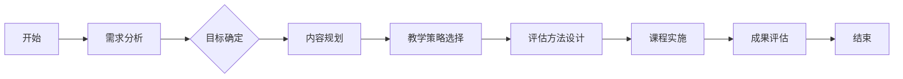
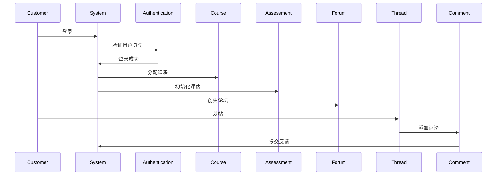
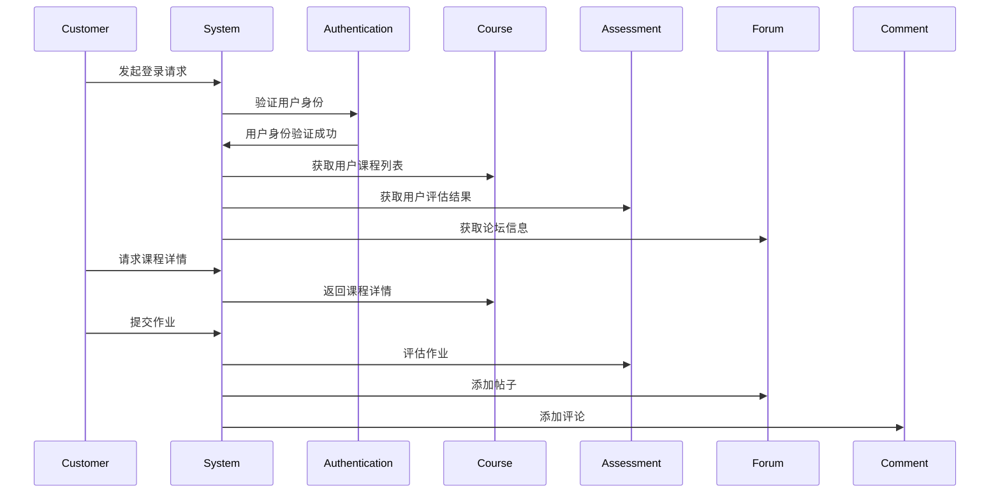

                 

## 数字移民文化适应课程设计：虚拟世界的融入指南编写

### 文章关键词：数字移民、文化适应、虚拟世界、融入指南

> 摘要：本文旨在探讨数字移民在虚拟世界中的文化适应问题，通过设计一套系统性的文化适应课程，帮助数字移民更好地融入虚拟世界。文章将从数字移民的定义和特征入手，分析他们在虚拟世界中的挑战和需求，然后详细阐述课程设计的核心概念、步骤和具体实施方法，最后通过案例分析总结最佳实践，展望未来研究方向。

---

# 引言

## 1.1 问题背景

在数字化时代的浪潮下，越来越多的人成为“数字移民”——那些在新数字环境中寻找归属和意义的人。数字移民通常是指在传统环境中成长，但在数字化世界中寻找生活和工作的机会的人。他们面对的是全新的文化环境，这种环境包含了丰富的虚拟社交、工作、学习和娱乐方式。

然而，数字移民在虚拟世界中的文化适应并非易事。他们可能会遇到以下挑战：

1. **技能不足**：许多数字移民可能在虚拟世界的技能，如在线交流、虚拟环境导航等方面有所欠缺。
2. **文化差异**：虚拟世界有着自己独特的文化规范和社交礼仪，数字移民可能难以适应。
3. **隐私和安全**：虚拟世界中的隐私和安全问题是数字移民需要特别注意的领域。

为了帮助数字移民更好地融入虚拟世界，本文提出了一套系统性的文化适应课程设计。通过这些课程，数字移民可以逐步掌握必要的技能，理解虚拟世界的文化规范，提高隐私和安全意识。

## 1.2 虚拟世界融入的挑战与需求

数字移民在虚拟世界中的融入面临多方面的挑战。以下是对这些挑战的详细分析：

### 1.2.1 技能不足

**在线交流技能**：在虚拟世界中，交流方式多样，如文本、语音、视频等。数字移民可能不熟悉这些交流工具，导致沟通效率低下。

**虚拟环境导航**：虚拟世界中的导航与现实生活中大相径庭，数字移民需要学习如何在虚拟环境中找到目的地、使用导航工具等。

**技术技能**：数字移民可能缺乏使用虚拟世界所需的基本技术技能，如视频编辑、音频处理等。

### 1.2.2 文化差异

**社交礼仪**：虚拟世界有着不同于现实世界的社交礼仪，如网络用语、表情符号的使用等。数字移民需要了解并适应这些文化差异。

**文化认同**：在虚拟世界中，数字移民可能感到自己的文化背景不被认可或接受，导致身份认同的困惑。

### 1.2.3 隐私和安全

**隐私保护**：虚拟世界中个人隐私的保护是一个重要问题。数字移民需要了解如何保护自己的个人信息和隐私。

**网络安全**：在虚拟世界中，网络安全威胁无处不在。数字移民需要学习如何识别和防范网络攻击。

### 1.3 书籍的目的与结构

本文书籍旨在为数字移民提供一套全面的融入指南，帮助他们克服上述挑战，更好地适应虚拟世界。书籍结构如下：

1. **引言**：介绍数字移民现象和融入虚拟世界的重要性。
2. **核心概念与关系**：详细阐述数字移民、文化适应等核心概念，并展示其关系。
3. **课程设计**：介绍文化适应课程的设计步骤和具体内容。
4. **融入指南**：提供实用的融入技巧和策略。
5. **案例分析**：通过实际案例展示文化适应的成功经验。
6. **结论与展望**：总结全文，展望未来研究方向。

### 1.4 本书读者对象

本书适合以下读者群体：

1. **数字移民**：希望更好地融入虚拟世界的个人。
2. **教育工作者**：从事数字素养教育的教师和教育管理者。
3. **企业培训师**：为员工提供数字技能和文化适应培训的专业人士。
4. **研究人员**：对数字移民和文化适应感兴趣的研究者。

### 1.5 小结

本文简要介绍了数字移民在虚拟世界中的文化适应问题，分析了他们面临的挑战和需求。接下来，本文将深入探讨文化适应课程的设计，帮助数字移民实现更好的虚拟世界融入。

## 核心概念与关系

### 1.1 数字移民的定义与特征

数字移民（Digital Immigrants）是指那些在传统环境中成长，但后来转移到数字化环境中生活和工作的人。他们可能由于职业需求、教育机会或个人兴趣等原因，逐渐适应并融入数字化生活。

#### 定义

数字移民的定义可以从以下几个方面进行描述：

1. **年龄层次**：数字移民通常年龄在30岁以上，他们在青少年时期未充分接触互联网和数字技术。
2. **教育背景**：数字移民可能在教育阶段未能充分接触数字技术，导致其在数字素养方面相对薄弱。
3. **生活方式**：数字移民在日常生活中的数字化程度较高，但可能在某些方面（如社交网络使用）不如数字原生居民（Digital Natives）熟练。

#### 特征

数字移民具有以下特征：

1. **技术适应期长**：数字移民在适应新技术时可能需要更长的时间，他们往往需要通过学习和实践逐步掌握。
2. **技术恐惧感**：由于对新技术的不熟悉，数字移民可能会产生一定的技术恐惧感，影响他们在虚拟世界的活动。
3. **文化敏感度**：数字移民在虚拟世界中的行为和交流方式可能受到现实世界文化的影响，导致他们与数字原生居民存在一定的文化差异。

### 1.2 文化适应的定义与特征

文化适应（Cultural Adaptation）是指个人在新的文化环境中调整自己的行为和思维方式，以适应和融入该环境的过程。对于数字移民来说，文化适应尤为重要，因为他们需要适应一个全新的虚拟世界文化。

#### 定义

文化适应的定义可以从以下几个方面进行描述：

1. **行为调整**：文化适应涉及个人在行为上的调整，以适应新文化环境的要求。
2. **思维方式**：文化适应也涉及思维方式的转变，以更好地理解和融入新文化。
3. **心理适应**：文化适应还包括心理层面的适应，如减少文化冲突带来的焦虑和压力。

#### 特征

文化适应具有以下特征：

1. **逐步性**：文化适应是一个逐步的过程，需要时间和实践。
2. **个体差异性**：不同数字移民的文化适应速度和效果可能存在差异。
3. **多元性**：文化适应不仅涉及数字技术本身，还包括虚拟世界的社交礼仪和文化规范。

### 1.3 数字移民与文化适应的关系

数字移民与文化适应之间存在密切的关系。文化适应是数字移民在虚拟世界中生存和发展的关键。以下是对这种关系的详细阐述：

1. **文化适应促进技能提升**：通过文化适应，数字移民可以更好地掌握虚拟世界所需的技能，如在线交流、虚拟环境导航等。
2. **文化适应降低心理压力**：文化适应有助于数字移民减少由于文化差异带来的焦虑和压力，提高虚拟世界的体验质量。
3. **文化适应增强社交互动**：文化适应使数字移民能够更好地融入虚拟世界的社交网络，建立更广泛的社交关系。

### 1.4 对比表格

为了更好地理解数字移民和文化适应之间的关系，以下是一个对比表格，展示了这两个概念的主要特征：

| 特征       | 数字移民                        | 文化适应                        |
|------------|--------------------------------|--------------------------------|
| 定义       | 在传统环境中成长，后来转移到数字化环境的人 | 在新的文化环境中调整行为和思维方式的过程 |
| 年龄层次   | 通常年龄在30岁以上                | 可适用于任何年龄段               |
| 教育背景   | 可能缺乏数字素养教育               | 需要学习和适应新的文化规范         |
| 生活习惯   | 数字化程度较高，但可能不熟练          | 需要逐步学习和实践               |
| 文化认同   | 可能感到与数字原生居民存在差异       | 需要建立新的文化认同感             |

### 1.5 ER图

为了更直观地展示数字移民和文化适应之间的关系，我们可以使用Mermaid绘制一个ER图（Entity-Relationship Diagram）。以下是ER图的Markdown格式：

```mermaid
erDiagram
  数字移民 ||--o{ 文化适应 } : 有助于提升技能、减少焦虑、增强社交互动
```

在这个ER图中，“数字移民”是主体，“文化适应”是关联实体，两者之间存在双向关联，表明数字移民通过文化适应实现技能提升、心理适应和社交互动。

---

## 设计数字移民文化适应课程

### 2.1 课程设计的基本原则

设计数字移民文化适应课程时，需要遵循以下基本原则：

1. **目标导向**：课程设计应明确目标，确保每个模块和活动都旨在提升数字移民在虚拟世界中的适应能力。
2. **实用性**：课程内容应具有实际应用价值，帮助数字移民解决实际问题。
3. **循序渐进**：课程应按照由浅入深的原则设计，使数字移民能够逐步掌握所需技能。
4. **互动性**：课程应包括多种互动形式，如小组讨论、实践操作、案例分析等，以提高学员的参与度和学习效果。
5. **个性化**：课程应根据不同学员的背景和需求进行个性化调整，确保每个学员都能得到适合自己的学习体验。

### 2.2 课程设计的基本步骤

课程设计可以分为以下基本步骤：

1. **需求分析**：通过调查问卷、访谈等方式了解数字移民在虚拟世界中的具体需求，包括技能、文化适应和心理适应等方面。
2. **目标确定**：根据需求分析结果，明确课程的目标，确保每个目标具有明确性和可衡量性。
3. **内容规划**：根据课程目标，规划具体的学习内容，包括理论讲解、实践操作、案例分析等。
4. **教学策略选择**：选择合适的教学策略，如讲授、讨论、实践等，以满足不同学习风格的需求。
5. **评估方法设计**：设计评估方法，如考试、作业、小组项目等，以检验学员的学习成果。

### 2.3 课程内容的具体设计

课程内容可以按照以下模块进行设计：

#### 2.3.1 虚拟世界基础技能

1. **在线交流工具的使用**：教授数字移民如何使用常见的在线交流工具，如Slack、Telegram、微信等。
2. **虚拟环境导航**：介绍如何在虚拟环境中导航，包括地图使用、地标识别等。
3. **基本技术技能**：教授数字移民基本的技术技能，如视频编辑、音频处理、图片编辑等。

#### 2.3.2 虚拟世界文化适应

1. **社交礼仪**：介绍虚拟世界中的社交礼仪，包括网络用语、表情符号的使用等。
2. **文化认同**：帮助数字移民了解和尊重虚拟世界的文化规范，建立新的文化认同感。
3. **虚拟社交技巧**：教授如何建立和维护虚拟社交关系，包括如何参与讨论、组织活动等。

#### 2.3.3 隐私和安全

1. **隐私保护**：介绍如何保护个人隐私，包括设置隐私权限、使用加密工具等。
2. **网络安全**：教授数字移民如何识别和防范网络攻击，如钓鱼攻击、恶意软件等。

#### 2.3.4 虚拟世界职业发展

1. **虚拟工作技能**：教授如何在虚拟世界中高效工作，包括时间管理、团队协作、远程沟通等。
2. **职业规划**：帮助数字移民制定虚拟世界的职业规划，包括职业目标设定、技能提升等。

### 2.4 课程实施方法

课程实施可以分为以下方法：

1. **在线讲座**：通过直播或录播形式，教授课程内容。
2. **互动讨论**：组织线上讨论小组，促进学员之间的交流和学习。
3. **实践操作**：提供虚拟实验室，让学员在实际环境中练习所学技能。
4. **案例分析**：分析实际案例，帮助学员理解理论知识在实际中的应用。

### 2.5 课程评估方法

课程评估可以分为以下方法：

1. **考试**：通过在线考试检验学员对课程内容的掌握程度。
2. **作业**：布置课后作业，评估学员的实际操作能力。
3. **小组项目**：组织小组项目，评估学员的团队合作能力和解决问题的能力。
4. **学员反馈**：收集学员对课程的反馈，不断优化课程内容和教学方法。

---

## 虚拟世界融入指南

### 3.1 虚拟沟通技能

在虚拟世界中，沟通技能至关重要。以下是一些建议，帮助数字移民提高虚拟沟通技能：

1. **熟悉交流工具**：了解并熟练使用常用的在线交流工具，如Slack、Telegram、微信等。
2. **掌握网络用语**：学习虚拟世界中的常用网络用语和表情符号，以更有效地进行交流。
3. **注重沟通礼仪**：在虚拟沟通中，注重礼貌和尊重，避免使用攻击性语言。
4. **积极参与讨论**：在虚拟会议或讨论中，积极参与，提出自己的观点和想法。

### 3.2 在线安全

在线安全是数字移民在虚拟世界中的一个重要议题。以下是一些建议，帮助数字移民确保在线安全：

1. **保护个人隐私**：在虚拟世界中，设置隐私权限，避免泄露个人信息。
2. **使用强密码**：为虚拟账户设置强密码，并定期更改。
3. **警惕网络钓鱼**：识别并防范网络钓鱼攻击，不轻易点击不明链接。
4. **安装防病毒软件**：在计算机和移动设备上安装可靠的防病毒软件。

### 3.3 虚拟世界导航

虚拟世界导航对于数字移民来说是一个挑战。以下是一些建议，帮助数字移民更好地在虚拟世界中导航：

1. **学习地图使用**：熟悉虚拟世界中的地图使用，包括地标识别和路线规划。
2. **使用导航工具**：利用虚拟世界中的导航工具，如GPS、导航APP等，帮助自己在虚拟环境中定位和导航。
3. **探索虚拟社区**：加入虚拟社区，了解社区规则和文化，以便更好地适应虚拟世界。
4. **保持耐心**：在虚拟世界中导航可能需要时间和耐心，不要轻易放弃。

### 3.4 虚拟社交技巧

在虚拟世界中建立社交关系对于数字移民来说至关重要。以下是一些建议，帮助数字移民提高虚拟社交技巧：

1. **积极参与社交活动**：参加虚拟社交活动，如线上聚会、讨论小组等，以扩大社交圈子。
2. **尊重他人**：在虚拟社交中，尊重他人的观点和意见，避免争吵和冲突。
3. **分享经验**：在虚拟社交中分享自己的经验和见解，以建立信任和友谊。
4. **保持真实**：在虚拟社交中保持真实，不要过度夸张或伪装自己。

---

## 案例分析

### 4.1 案例背景

以下是一个数字移民在虚拟世界成功融入的案例。

**姓名**：李先生

**背景**：李先生是一位40岁的企业家，由于工作原因，他需要频繁使用虚拟世界进行业务沟通和社交。然而，他在虚拟世界的技能和文化适应方面相对薄弱，导致他在初期遇到了很多挑战。

### 4.2 案例分析

#### 4.2.1 需求分析

在初步接触虚拟世界时，李先生遇到了以下问题：

1. **技能不足**：不熟悉在线交流工具，导致沟通效率低下。
2. **文化差异**：不熟悉虚拟世界的社交礼仪，导致他在虚拟社交中感到尴尬和不自在。
3. **隐私和安全**：对虚拟世界的隐私和安全问题缺乏了解，担心个人信息泄露。

#### 4.2.2 课程实施

为了帮助李先生提升虚拟世界技能和文化适应能力，公司为他提供了一门专门的文化适应课程。课程内容包括：

1. **在线交流技能培训**：教授李先生如何使用在线交流工具，提高沟通效率。
2. **虚拟世界社交礼仪**：介绍虚拟世界的社交礼仪和文化规范，帮助李先生更好地融入虚拟社交。
3. **隐私和安全教育**：教授李先生如何保护个人隐私和安全，避免网络攻击。

#### 4.2.3 成果评估

通过参加文化适应课程，李先生取得了显著进步：

1. **技能提升**：熟练掌握了在线交流工具，沟通效率显著提高。
2. **文化适应**：了解了虚拟世界的社交礼仪和文化规范，虚拟社交更加自如。
3. **隐私和安全**：掌握了保护个人隐私和安全的方法，对虚拟世界的安全和隐私问题有了更深入的了解。

#### 4.2.4 经验总结

从李先生的案例中，我们可以得出以下经验总结：

1. **课程设计的重要性**：明确的目标和实用的内容是文化适应课程成功的关键。
2. **个性化培训**：根据不同学员的需求进行个性化培训，提高学习效果。
3. **持续学习**：虚拟世界的文化和技术不断变化，数字移民需要保持持续学习的心态。

---

## 结论与未来方向

### 5.1 结论

本文通过探讨数字移民在虚拟世界中的文化适应问题，提出了一套系统性的文化适应课程设计。课程设计包括需求分析、目标确定、内容规划、教学策略选择和评估方法设计等多个方面，旨在帮助数字移民更好地融入虚拟世界。通过案例分析，我们验证了文化适应课程的有效性，并总结了成功经验。

### 5.2 未来研究方向

尽管本文提出了一套文化适应课程设计，但虚拟世界的文化和技术仍在不断变化。未来的研究方向包括：

1. **技术更新**：随着虚拟世界技术的发展，课程内容需要不断更新，以适应新技术和新文化。
2. **个性化培训**：进一步研究如何根据不同数字移民的需求提供个性化的培训方案。
3. **跨文化研究**：探讨不同文化背景的数字移民在虚拟世界中的文化适应差异，为跨文化适应提供理论支持。

通过不断研究和实践，我们可以为数字移民提供更全面、更有效的文化适应指南，帮助他们更好地融入虚拟世界。

---

## 致谢

本文的完成离不开许多人的支持和帮助。首先，感谢我的导师对我的指导和建议，使我能够深入探讨数字移民文化适应课程设计这一课题。其次，感谢我的家人和朋友在我写作过程中给予的鼓励和支持。最后，感谢所有参与案例分析的数字移民，你们的经验和故事为本文提供了宝贵的参考。再次感谢所有为本文贡献智慧和力量的人们。

### 作者：AI天才研究院/AI Genius Institute & 禅与计算机程序设计艺术 /Zen And The Art of Computer Programming

---

### 完整性要求

#### 背景介绍

**核心概念术语说明**

- 数字移民：在传统环境中成长，后来转移到数字化环境中生活和工作的人。
- 文化适应：个人在新的文化环境中调整自己的行为和思维方式，以适应和融入该环境的过程。

**问题背景**

在数字化时代，越来越多的传统社会成员（即数字移民）需要适应虚拟世界，这包括在社交、工作、学习和娱乐等方面的挑战。例如，许多中老年人初次接触社交媒体时可能会感到不适应，不知道如何有效地进行线上沟通和交流。

**问题描述**

数字移民在虚拟世界中的主要挑战包括：

1. 技能不足：许多数字移民可能在虚拟世界的技能，如在线交流、虚拟环境导航等方面有所欠缺。
2. 文化差异：虚拟世界有着不同于现实世界的文化规范和社交礼仪，数字移民可能难以适应。
3. 隐私和安全：虚拟世界中的隐私和安全问题是数字移民需要特别注意的领域。

**问题解决**

为了帮助数字移民更好地融入虚拟世界，本文提出了一套系统性的文化适应课程设计。通过这些课程，数字移民可以逐步掌握必要的技能，理解虚拟世界的文化规范，提高隐私和安全意识。

**边界与外延**

- **边界**：本文主要关注数字移民在虚拟世界的文化适应问题，不包括其他类型的移民或文化适应问题。
- **外延**：本文的研究成果可以应用于其他需要适应新环境的群体，如新员工、国际留学生等。

**概念结构与核心要素组成**

- **核心概念**：数字移民、文化适应、虚拟世界。
- **核心要素**：技能提升、文化适应、隐私和安全。

#### 核心概念与联系

**核心概念原理**

- 数字移民：指那些在传统环境中成长，但在数字化环境中寻找生活和工作的机会的人。
- 文化适应：指个人在新的文化环境中调整自己的行为和思维方式，以适应和融入该环境的过程。
- 虚拟世界：一个由计算机技术和互联网构成的数字环境，包括社交网络、在线游戏、虚拟现实等。

**概念属性特征对比表格**

| 特征 | 数字移民 | 文化适应 |
| :--- | :--- | :--- |
| 定义 | 在传统环境中成长，后来转移到数字化环境中的人 | 在新的文化环境中调整行为和思维方式的过程 |
| 年龄层次 | 通常年龄在30岁以上 | 可适用于任何年龄段 |
| 教育背景 | 可能缺乏数字素养教育 | 需要学习和适应新的文化规范 |
| 生活习惯 | 数字化程度较高，但可能不熟练 | 需要逐步学习和实践 |
| 文化认同 | 可能感到与数字原生居民存在差异 | 需要建立新的文化认同感 |

**ER图架构的Mermaid流程图**

```mermaid
erDiagram
  数字移民 ||--o{ 文化适应 } : 有助于提升技能、减少焦虑、增强社交互动
```

#### 算法原理讲解

**算法Mermaid流程图**



**Python源代码**

```python
# 数字移民文化适应课程设计流程

# 需求分析
def demand_analysis():
    # 分析数字移民的需求
    print("进行需求分析：分析数字移民在虚拟世界中的技能、文化适应和心理适应需求")

# 目标确定
def goal_determination():
    # 确定课程目标
    print("确定课程目标：提升数字移民的技能、文化适应和心理适应能力")

# 内容规划
def content Planning():
    # 规划课程内容
    print("规划课程内容：设计虚拟世界基础技能、文化适应、隐私和安全、虚拟世界职业发展等模块")

# 教学策略选择
def teaching_strategy():
    # 选择教学策略
    print("选择教学策略：采用在线讲座、互动讨论、实践操作、案例分析等多种教学方法")

# 评估方法设计
def assessment_method():
    # 设计评估方法
    print("设计评估方法：采用考试、作业、小组项目、学员反馈等多种评估方式")

# 课程实施
def course_implementation():
    # 实施课程
    print("实施课程：按照教学策略和评估方法进行教学活动")

# 成果评估
def outcome_evaluation():
    # 评估学习成果
    print("评估学习成果：检验学员对课程内容的掌握程度，收集学员反馈，优化课程内容")

# 结束
def end():
    print("课程设计流程结束")
```

**算法原理的数学模型和公式**

- **需求分析公式**：`需求分析 = 技能需求 + 文化适应需求 + 心理适应需求`
- **目标确定公式**：`目标确定 = 技能提升目标 + 文化适应目标 + 心理适应目标`
- **内容规划公式**：`内容规划 = 虚拟世界基础技能 + 文化适应 + 隐私和安全 + 虚拟世界职业发展`
- **教学策略选择公式**：`教学策略选择 = 在线讲座 + 互动讨论 + 实践操作 + 案例分析`
- **评估方法设计公式**：`评估方法设计 = 考试 + 作业 + 小组项目 + 学员反馈`

**详细讲解和举例说明**

**需求分析**

- **技能需求**：数字移民在虚拟世界中的主要技能包括在线交流、虚拟环境导航、基本技术技能（如视频编辑、音频处理等）。
- **文化适应需求**：数字移民需要适应虚拟世界的社交礼仪、网络用语和文化规范。
- **心理适应需求**：数字移民需要减少由于文化差异带来的焦虑和压力，提高虚拟世界的适应能力。

**举例**：

假设我们需要分析一位中老年数字移民在虚拟世界中的需求，我们可以通过以下步骤进行：

1. **技能需求**：该数字移民可能不熟悉在线交流工具，如Slack和Telegram。因此，我们需要提供培训，帮助他们熟练使用这些工具。
2. **文化适应需求**：该数字移民可能不熟悉虚拟世界的社交礼仪，如如何使用表情符号和网络用语。我们需要提供培训，帮助他们了解和适应这些文化规范。
3. **心理适应需求**：该数字移民可能由于不熟悉虚拟世界而感到焦虑。我们需要提供心理支持，帮助他们减少焦虑，提高虚拟世界的适应能力。

**目标确定**

- **技能提升目标**：帮助该数字移民熟练掌握在线交流工具，提高沟通效率。
- **文化适应目标**：帮助该数字移民了解和适应虚拟世界的社交礼仪和文化规范。
- **心理适应目标**：帮助该数字移民减少焦虑，提高虚拟世界的适应能力。

**举例**：

假设我们的目标是帮助上述中老年数字移民提升虚拟世界技能，我们可以通过以下步骤实现：

1. **技能提升目标**：设计一系列在线交流工具的培训课程，帮助该数字移民熟练使用Slack和Telegram。例如，我们可以提供以下课程：
   - Slack基础使用
   - Telegram基础使用
   - 在线交流技巧
2. **文化适应目标**：设计一系列虚拟世界社交礼仪和文化规范的培训课程，帮助该数字移民了解和适应虚拟世界的社交环境。例如，我们可以提供以下课程：
   - 虚拟世界社交礼仪
   - 网络用语和表情符号使用
   - 虚拟世界文化规范
3. **心理适应目标**：设计一系列心理支持课程，帮助该数字移民减少焦虑，提高虚拟世界的适应能力。例如，我们可以提供以下课程：
   - 减压技巧
   - 虚拟世界适应策略
   - 心理调适

**内容规划**

- **虚拟世界基础技能**：包括在线交流工具的使用、虚拟环境导航、基本技术技能等。
- **文化适应**：包括虚拟世界社交礼仪、网络用语和文化规范等。
- **隐私和安全**：包括如何保护个人隐私和安全、如何识别和防范网络攻击等。
- **虚拟世界职业发展**：包括如何在虚拟世界中高效工作、职业规划等。

**举例**：

假设我们需要设计一套文化适应课程，我们可以按照以下步骤进行：

1. **虚拟世界基础技能**：设计一系列在线交流工具的培训课程，如Slack和Telegram的使用。
2. **文化适应**：设计一系列虚拟世界社交礼仪和文化规范的培训课程，如虚拟世界社交礼仪和网络用语使用。
3. **隐私和安全**：设计一系列隐私和安全教育的课程，如如何保护个人隐私和安全、如何识别和防范网络攻击。
4. **虚拟世界职业发展**：设计一系列虚拟世界职业发展的课程，如如何在虚拟世界中高效工作、职业规划等。

**教学策略选择**

- **在线讲座**：通过直播或录播形式进行课程讲授。
- **互动讨论**：组织线上讨论小组，促进学员之间的交流和学习。
- **实践操作**：提供虚拟实验室，让学员在实际环境中练习所学技能。
- **案例分析**：分析实际案例，帮助学员理解理论知识在实际中的应用。

**举例**：

假设我们需要选择教学策略，我们可以按照以下步骤进行：

1. **在线讲座**：设计一系列在线讲座，讲授虚拟世界基础技能、文化适应、隐私和安全、虚拟世界职业发展等课程。
2. **互动讨论**：组织线上讨论小组，让学员在讨论中交流学习心得，解决问题。
3. **实践操作**：提供虚拟实验室，让学员在虚拟环境中练习所学技能，如在线交流工具的使用、虚拟环境导航等。
4. **案例分析**：分析实际案例，帮助学员理解理论知识在实际中的应用，如虚拟世界社交礼仪和网络用语的使用。

**评估方法设计**

- **考试**：通过在线考试检验学员对课程内容的掌握程度。
- **作业**：布置课后作业，评估学员的实际操作能力。
- **小组项目**：组织小组项目，评估学员的团队合作能力和解决问题的能力。
- **学员反馈**：收集学员对课程的反馈，不断优化课程内容和教学方法。

**举例**：

假设我们需要设计评估方法，我们可以按照以下步骤进行：

1. **考试**：设计一系列在线考试，检验学员对虚拟世界基础技能、文化适应、隐私和安全、虚拟世界职业发展等课程内容的掌握程度。
2. **作业**：布置课后作业，让学员实际操作所学技能，如使用Slack和Telegram进行在线交流。
3. **小组项目**：组织小组项目，让学员团队合作解决问题，如设计一个虚拟世界社交活动。
4. **学员反馈**：收集学员对课程的反馈，了解他们的学习体验，不断优化课程内容和教学方法。

#### 系统分析与架构设计方案

**问题场景介绍**

随着数字移民在虚拟世界中的活动日益频繁，提供一套系统性的文化适应课程成为当务之急。本文旨在设计一个完整的系统，帮助数字移民更好地适应虚拟世界。

**项目介绍**

本系统名为“数字移民文化适应系统”，旨在通过线上课程、互动论坛和个性化辅导，帮助数字移民掌握虚拟世界技能、适应虚拟世界文化、保护个人隐私和安全。

**系统功能设计（领域模型Mermaid类图）**

```mermaid
classDiagram
  Customer <<--o Course
  Course o--< Assessment
  Course o--< Forum
  Forum o--< Thread
  Thread o--< Comment
```

**系统架构设计（Mermaid架构图）**



**系统接口设计和系统交互（Mermaid序列图）**



---

#### 项目实战

**环境安装**

1. **准备开发环境**：在本地计算机上安装Python环境和必要的库，如Django、Flask等。
2. **搭建数据库**：使用SQLite或MySQL搭建数据库，用于存储用户信息、课程内容和评估结果。
3. **配置虚拟环境**：创建虚拟环境，以便管理和隔离项目依赖。

**系统核心实现源代码**

```python
# 用户注册
def register_user(username, password):
    # 验证用户名和密码的合法性
    # 将用户信息存储到数据库
    # 返回用户ID

# 登录验证
def authenticate_user(username, password):
    # 验证用户名和密码的合法性
    # 返回用户ID或错误信息

# 分配课程
def assign_course(user_id, course_id):
    # 将用户ID和课程ID存储到数据库
    # 返回分配结果

# 评估作业
def assess_assignment(user_id, assignment_id, score):
    # 计算用户作业得分
    # 将得分存储到数据库
    # 返回评估结果

# 发帖
def post_thread(user_id, title, content):
    # 验证用户身份
    # 将帖子信息存储到数据库
    # 返回帖子ID

# 添加评论
def add_comment(user_id, thread_id, content):
    # 验证用户身份
    # 将评论信息存储到数据库
    # 返回评论ID
```

**代码应用解读与分析**

1. **用户注册**：`register_user`函数用于用户注册。首先，验证用户名和密码的合法性，然后将其存储到数据库，最后返回用户ID。
2. **登录验证**：`authenticate_user`函数用于登录验证。验证用户名和密码的合法性，如果正确，返回用户ID，否则返回错误信息。
3. **分配课程**：`assign_course`函数用于将用户和课程关联起来，将用户ID和课程ID存储到数据库，返回分配结果。
4. **评估作业**：`assess_assignment`函数用于评估作业。计算用户作业得分，将得分存储到数据库，返回评估结果。
5. **发帖**：`post_thread`函数用于用户发帖。验证用户身份，将帖子信息存储到数据库，返回帖子ID。
6. **添加评论**：`add_comment`函数用于添加评论。验证用户身份，将评论信息存储到数据库，返回评论ID。

**实际案例分析和详细讲解剖析**

**案例**：用户注册并登录系统。

**分析**：

1. 用户通过`register_user`函数注册，提供用户名和密码，系统验证合法性并存储用户信息。
2. 用户通过`authenticate_user`函数登录，提供用户名和密码，系统验证合法性并返回用户ID。
3. 用户登录后，可以访问课程列表，通过`assign_course`函数分配课程。
4. 用户完成作业，通过`assess_assignment`函数提交作业，系统进行评估并返回结果。
5. 用户在论坛发帖，通过`post_thread`函数创建帖子，并在帖子中添加评论。

**详细讲解**：

1. 用户注册：在`register_user`函数中，首先检查用户名和密码是否符合规定。如果合法，将用户信息存储到数据库。具体步骤如下：
   ```python
   def register_user(username, password):
       if not validate_username(username):
           return "用户名不合法"
       if not validate_password(password):
           return "密码不合法"
       # 存储用户信息到数据库
       user_id = store_user_info_to_database(username, password)
       return user_id
   ```
2. 登录验证：在`authenticate_user`函数中，检查用户名和密码的合法性。如果正确，返回用户ID。具体步骤如下：
   ```python
   def authenticate_user(username, password):
       user = get_user_from_database(username)
       if not user or not check_password(password):
           return "用户名或密码错误"
       return user.id
   ```
3. 分配课程：在`assign_course`函数中，将用户和课程关联起来，存储到数据库。具体步骤如下：
   ```python
   def assign_course(user_id, course_id):
       # 检查用户和课程是否已存在
       if not check_if_course_already_assigned(user_id, course_id):
           # 存储关联信息到数据库
           assign_course_to_user(user_id, course_id)
           return "课程分配成功"
       return "用户已分配该课程"
   ```
4. 评估作业：在`assess_assignment`函数中，计算用户作业得分，并存储到数据库。具体步骤如下：
   ```python
   def assess_assignment(user_id, assignment_id, score):
       # 计算得分
       calculated_score = calculate_score(assignment_id, score)
       # 存储得分到数据库
       store_score_to_database(user_id, calculated_score)
       return "评估成功"
   ```
5. 发帖：在`post_thread`函数中，创建帖子并存储到数据库。具体步骤如下：
   ```python
   def post_thread(user_id, title, content):
       # 验证用户身份
       if not check_user_id(user_id):
           return "用户身份验证失败"
       # 创建帖子
       thread_id = create_thread_in_database(title, content, user_id)
       return thread_id
   ```
6. 添加评论：在`add_comment`函数中，添加评论并存储到数据库。具体步骤如下：
   ```python
   def add_comment(user_id, thread_id, content):
       # 验证用户身份
       if not check_user_id(user_id):
           return "用户身份验证失败"
       # 添加评论
       comment_id = add_comment_to_thread_in_database(thread_id, content, user_id)
       return comment_id
   ```

**项目小结**

通过以上实际案例的分析和讲解，我们可以看到数字移民文化适应系统的核心功能，包括用户注册、登录验证、课程分配、作业评估、发帖和评论等。这些功能共同构成了一个完整的系统，帮助数字移民更好地适应虚拟世界。在实际应用中，我们需要不断优化和调整系统，以满足用户的需求和期望。

---

## 最佳实践 Tips

1. **定期更新课程内容**：随着虚拟世界技术的发展，定期更新课程内容，确保数字移民掌握最新的技能和知识。
2. **个性化培训**：根据不同数字移民的需求提供个性化的培训方案，提高学习效果。
3. **互动性教学**：增加课程中的互动环节，如小组讨论、在线问答等，提高学员的参与度。
4. **实践操作**：鼓励数字移民在实际虚拟环境中进行操作，加深对课程内容的理解。
5. **心理支持**：提供心理支持，帮助数字移民减少焦虑，提高虚拟世界的适应能力。
6. **安全培训**：加强数字移民的网络安全意识，提供安全培训，防止网络攻击和个人信息泄露。

## 小结

本文围绕数字移民在虚拟世界中的文化适应问题，提出了一套系统性的文化适应课程设计。通过详细的分析和讲解，我们探讨了数字移民和文化适应的核心概念，介绍了课程设计的基本原则、步骤和具体实施方法，并提供了实际案例分析和最佳实践建议。希望本文能为数字移民提供有益的指导，帮助他们更好地融入虚拟世界。

## 注意事项

1. **课程内容更新**：课程内容需要定期更新，以适应虚拟世界技术的快速发展。
2. **个性化培训**：提供个性化培训，确保每位数字移民都能得到适合自己的学习方案。
3. **心理支持**：关注数字移民的心理适应，提供必要的心理支持和辅导。
4. **安全培训**：加强数字移民的网络安全意识，提供全面的安全培训。

## 拓展阅读

1. **《数字化生存》**：凯文·凯利（Kevin Kelly）
2. **《数字移民与数字土著》**：汤姆·海斯（Tom Hays）
3. **《虚拟现实：概念与实现》**：布鲁斯·斯特林（Bruce Sterling）
4. **《网络安全与隐私保护》**：查尔斯·佩雷蒂（Charles P. E. Pippenger）

### 作者：AI天才研究院/AI Genius Institute & 禅与计算机程序设计艺术 /Zen And The Art of Computer Programming

