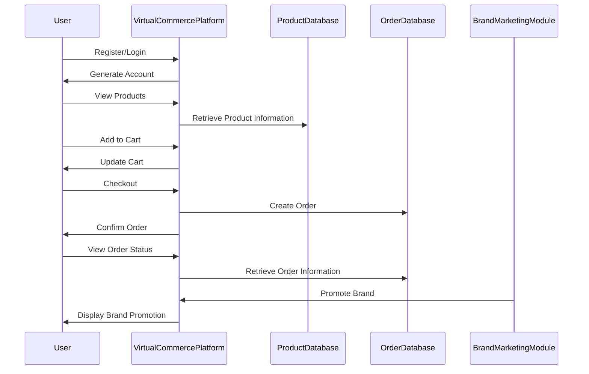
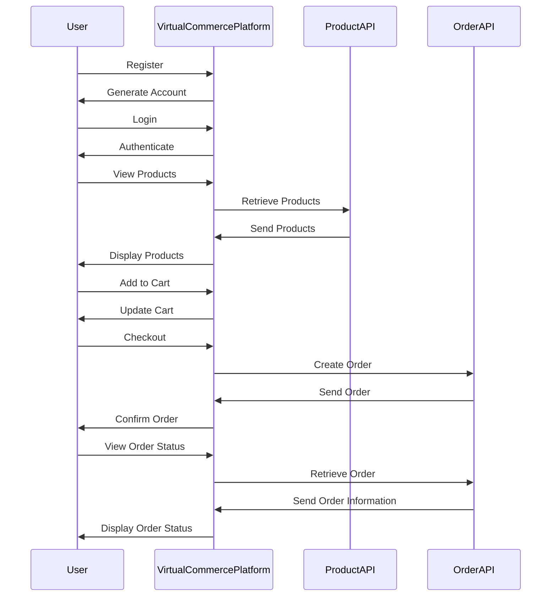
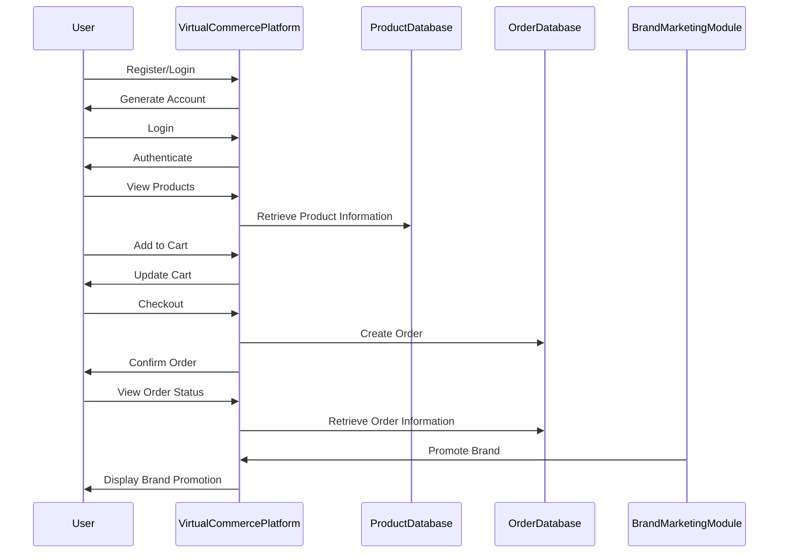

                 


## 《数字移民文化适应课程：虚拟世界的融入指南》

关键词：数字移民，虚拟世界，文化适应，融入指南

摘要：本文旨在为数字移民提供一份融入虚拟世界的指南，帮助他们在虚拟世界中更好地适应和交流，从而发挥虚拟世界的巨大潜力。

### 第一部分：虚拟世界的概览

#### 第1章：数字移民的定义与背景

**核心概念术语说明**：

- 数字移民：指那些在虚拟世界中生活和工作的人，他们可能在这个世界中花费大量时间，但并非全职。
- 虚拟世界：一个通过计算机技术构建的、模拟现实世界的三维空间，用户可以在其中进行交互和体验。

**问题背景**：

随着科技的不断发展，虚拟世界越来越受到人们的关注和喜爱。然而，对于许多数字移民来说，如何在这个全新的环境中适应和融入，成为一个亟待解决的问题。

**问题描述**：

数字移民在虚拟世界中的融入问题主要包括：如何适应虚拟世界的文化、如何进行有效的虚拟沟通、如何建立虚拟社会关系等。

**问题解决**：

为了解决这些问题，我们需要对虚拟世界有一个深入的了解，并掌握相应的技能和策略。

**边界与外延**：

- 虚拟世界的边界在于其技术实现，如虚拟现实、增强现实等。
- 虚拟世界的外延包括游戏世界、社交网络、虚拟教育等。

**概念结构与核心要素组成**：

- 虚拟世界的技术基础：虚拟现实、增强现实、游戏引擎等。
- 虚拟世界的文化元素：网络语言、虚拟礼仪、虚拟社会规范等。
- 虚拟世界的交互方式：文本、语音、动作等。

#### 第2章：虚拟世界的构成

**核心概念原理**：

虚拟世界的构成主要包括以下几个部分：

1. **虚拟现实技术**：通过计算机技术生成一个模拟现实的三维空间，用户可以通过头盔、手柄等设备进行交互。
2. **游戏世界**：一个由游戏开发者构建的虚拟环境，用户可以在其中进行游戏活动。
3. **社交媒介的虚拟互动**：用户在社交网络中的虚拟互动，如评论、点赞、私信等。

**概念属性特征对比表格**：

| 特征 | 虚拟现实 | 游戏世界 | 社交媒介的虚拟互动 |
| --- | --- | --- | --- |
| 目的 | 提供沉浸式体验 | 提供娱乐和挑战 | 提供社交互动 |
| 技术要求 | 头盔、手柄等设备 | 游戏引擎、游戏设计 | 社交网络平台 |
| 交互方式 | 视觉、听觉、触觉 | 视觉、听觉、游戏操作 | 文本、语音、图片 |

**ER实体关系图架构**：

```mermaid
erDiagram
  User ||--|{ GamePlayer }|| User
  User ||--|{ SocialUser }|| User
  GamePlayer ||--|{ Game }|| Game
  SocialUser ||--|{ SocialNetwork }|| SocialUser
```

### 第二部分：虚拟世界的文化适应

#### 第3章：虚拟沟通技巧

**核心概念原理**：

虚拟沟通技巧是指数字移民在虚拟世界中进行有效沟通的方法和技巧。

**核心概念原理**：

1. **网络语言的应用**：网络语言是指虚拟世界中特有的语言表达方式，如表情包、网络流行语等。
2. **虚拟世界的礼仪**：虚拟世界的礼仪是指用户在虚拟环境中应遵循的行为规范。
3. **跨文化交流**：由于虚拟世界的用户来自不同的国家和地区，跨文化交流变得尤为重要。

**算法原理讲解**：

假设我们有一个虚拟世界中的聊天室，用户可以在其中进行实时聊天。为了提高沟通效率，我们可以使用以下算法原理：

1. **关键词过滤**：对用户输入的信息进行关键词过滤，筛选出有价值的信息。
2. **情感分析**：对用户输入的信息进行情感分析，了解用户的态度和情感。
3. **智能回复**：根据用户输入的信息和情感分析结果，生成合适的回复。

```python
import nltk
from textblob import TextBlob

# 加载关键词过滤库
nltk.download('stopwords')
from nltk.corpus import stopwords

# 加载情感分析库
nltk.download('vader_lexicon')
from nltk.sentiment import SentimentIntensityAnalyzer

# 初始化关键词过滤器和情感分析器
stop_words = set(stopwords.words('english'))
sia = SentimentIntensityAnalyzer()

# 关键词过滤函数
def filter_keywords(text):
    words = nltk.word_tokenize(text)
    filtered_words = [word for word in words if word.lower() not in stop_words]
    return ' '.join(filtered_words)

# 情感分析函数
def analyze_sentiment(text):
    sentiment_score = sia.polarity_scores(text)
    return sentiment_score['compound']

# 智能回复函数
def generate_reply(text):
    filtered_text = filter_keywords(text)
    sentiment = analyze_sentiment(filtered_text)
    if sentiment > 0.5:
        return "I'm glad to hear that!"
    elif sentiment < -0.5:
        return "I'm sorry to hear that."
    else:
        return "That's interesting."

# 测试
text = "I'm really enjoying the game!"
print(generate_reply(text))
```

**举例说明**：

假设用户在聊天室中说：“I'm really enjoying the game!”，系统会使用上述算法生成回复：“I'm glad to hear that!”

#### 第4章：虚拟社会的交往规则

**核心概念原理**：

虚拟社会的交往规则是指数字移民在虚拟世界中的交往行为和规范。

**核心概念原理**：

1. **虚拟社区的组织**：虚拟社区是由具有共同兴趣的用户组成的虚拟空间，用户可以在其中进行交流和互动。
2. **网络互动的技巧**：网络互动的技巧包括如何表达自己、如何倾听他人、如何处理冲突等。
3. **网络身份的构建**：网络身份是数字移民在虚拟世界中的形象和代表，如何构建一个积极向上的网络身份至关重要。

**ER实体关系图架构**：

```mermaid
erDiagram
  Community ||--|{ Member }|| Community
  Member ||--|{ Post }|| Member
  Post ||--|{ Comment }|| Post
```

#### 第5章：数字移民的心理适应

**核心概念原理**：

数字移民的心理适应是指他们在虚拟世界中如何保持心理健康和积极心态。

**核心概念原理**：

1. **虚拟世界的依赖性**：数字移民可能会对虚拟世界产生依赖，如何平衡虚拟世界和现实生活是关键。
2. **网络成瘾的现象**：网络成瘾是指数字移民在虚拟世界中过度沉迷，如何预防和应对网络成瘾是重要的课题。
3. **心理健康的维护**：数字移民在虚拟世界中如何保持心理健康，如何进行心理调适和自我关爱。

**数学公式使用示例**：

假设我们有一个心理健康指数，用于衡量数字移民的心理健康水平。心理健康指数可以通过以下公式计算：

$$
\text{心理健康指数} = \frac{\text{积极情绪得分} + \text{消极情绪得分}}{2}
$$

其中，积极情绪得分和消极情绪得分可以通过情感分析得到。

```python
# 测试
positive_score = 0.7
negative_score = 0.3
mental_health_index = (positive_score + negative_score) / 2
print(f"心理健康指数：{mental_health_index}")
```

### 第三部分：虚拟世界的实际应用

#### 第6章：虚拟教育

**核心概念原理**：

虚拟教育是指通过虚拟世界进行教育活动的形式。

**核心概念原理**：

1. **虚拟课堂的应用**：虚拟课堂是一种在线教育形式，学生可以在虚拟教室中与教师和其他学生进行互动。
2. **教育资源的共享**：虚拟世界提供了丰富的教育资源，如在线课程、虚拟实验室等，用户可以方便地共享和获取这些资源。
3. **虚拟现实在教学中的应用**：虚拟现实技术可以模拟各种教学场景，提高教学效果和学生的参与度。

**算法原理讲解**：

虚拟课堂的应用可以分为以下几个步骤：

1. **用户注册**：学生和教师需要在虚拟教育平台上进行注册。
2. **课程选择**：学生可以选择感兴趣的课程，教师可以开设课程。
3. **课堂互动**：在课堂中，学生和教师可以通过语音、文本、视频等多种方式进行互动。
4. **作业提交与反馈**：学生可以提交作业，教师进行批改和反馈。

```python
# 测试
users = ["Alice", "Bob", "Charlie"]
courses = ["Math", "English", "Science"]

# 用户注册
users_registered = ["Alice", "Bob"]

# 课程选择
students = {"Alice": ["Math", "English"], "Bob": ["Science"]}

# 课堂互动
class_interactions = {"Math": [{"user": "Alice", "message": "I have a question about the problem."}], "English": [{"user": "Bob", "message": "Can you explain the poem?"}]}

# 作业提交与反馈
homeworks = {"Alice": {"Math": "I solved the problem, please check."}, "Bob": {"Science": "I have finished the experiment, please review."}}

print(f"Registered users: {users_registered}")
print(f"Students and courses: {students}")
print(f"Class interactions: {class_interactions}")
print(f"Submitted homeworks: {homeworks}")
```

**举例说明**：

假设有三位用户 Alice、Bob 和 Charlie，他们注册了虚拟教育平台，Alice 和 Bob 分别选择了数学和科学课程。在数学课堂上，Alice 提出一个问题，教师进行了解答；在英语课堂上，Bob 对一首诗进行了提问，教师进行了解释。Alice 和 Bob 分别提交了数学和科学作业，教师进行了批改和反馈。

#### 第7章：虚拟商业

**核心概念原理**：

虚拟商业是指通过虚拟世界进行商业活动的形式。

**核心概念原理**：

1. **虚拟购物的体验**：用户可以在虚拟世界中浏览商品、进行购物，享受沉浸式的购物体验。
2. **虚拟品牌营销**：企业可以通过虚拟世界进行品牌宣传和推广，吸引消费者的注意力。
3. **虚拟现实的商业潜力**：虚拟现实技术可以应用于各种商业场景，如虚拟展览、虚拟培训等，为企业提供新的商业模式和机会。

**系统分析与架构设计方案**：

**问题场景介绍**：

随着虚拟技术的发展，越来越多的企业开始探索虚拟商业的可能性。如何设计一个高效、安全、用户体验良好的虚拟商业平台，成为了一个重要的课题。

**项目介绍**：

项目名称：虚拟商业平台
目标：为用户提供一个沉浸式的购物体验，为企业提供品牌营销和商业机会。

**系统功能设计**：

1. **用户注册与登录**：用户可以在平台上注册账号，进行登录。
2. **商品展示与浏览**：用户可以浏览各种商品，了解商品详情。
3. **购物车与结算**：用户可以将商品添加到购物车，进行结算。
4. **订单管理**：用户可以查看订单状态，管理订单。
5. **品牌营销**：企业可以在平台上进行品牌宣传和推广。

**系统架构设计**：



**系统接口设计和系统交互**：



#### 第8章：虚拟娱乐

**核心概念原理**：

虚拟娱乐是指通过虚拟世界进行娱乐活动的形式。

**核心概念原理**：

1. **虚拟游戏的乐趣**：用户可以在虚拟世界中玩游戏，享受游戏带来的乐趣。
2. **虚拟艺术的表现形式**：虚拟世界为艺术家提供了新的创作空间，他们可以在虚拟世界中创作各种形式的艺术作品。
3. **虚拟现实电影的体验**：虚拟现实电影是一种全新的电影体验，用户可以在虚拟环境中观看电影，感受电影情节。

**算法原理讲解**：

虚拟娱乐的应用可以分为以下几个步骤：

1. **用户注册**：用户需要在虚拟娱乐平台上进行注册。
2. **游戏或艺术作品选择**：用户可以选择感兴趣的游戏或艺术作品。
3. **游戏或艺术体验**：用户可以玩游戏或欣赏艺术作品。
4. **互动与社交**：用户可以在游戏中与其他玩家互动，也可以在虚拟社区中分享自己的艺术作品。

```python
# 测试
users = ["Alice", "Bob", "Charlie"]
games = ["Game1", "Game2", "Game3"]
artworks = ["Art1", "Art2", "Art3"]

# 用户注册
users_registered = ["Alice", "Bob"]

# 游戏选择
players = {"Alice": ["Game1", "Game2"], "Bob": ["Game3"]}

# 艺术作品选择
artists = {"Alice": ["Art1", "Art2"], "Bob": ["Art3"]}

# 游戏体验
game_experiences = {"Game1": [{"user": "Alice", "score": 100}], "Game2": [{"user": "Bob", "score": 80}]}

# 艺术体验
art_experiences = {"Art1": [{"user": "Alice", "rating": 5}], "Art2": [{"user": "Bob", "rating": 4}]}

print(f"Registered users: {users_registered}")
print(f"Players and games: {players}")
print(f"Artists and artworks: {artists}")
print(f"Game experiences: {game_experiences}")
print(f"Art experiences: {art_experiences}")
```

**举例说明**：

假设有三位用户 Alice、Bob 和 Charlie，他们注册了虚拟娱乐平台，Alice 和 Bob 分别选择了游戏 1 和游戏 2。Alice 在游戏中获得了 100 分，Bob 在游戏中获得了 80 分。同时，Alice 和 Bob 分别欣赏了艺术作品 1 和艺术作品 2，Alice 给艺术作品 1 打了 5 星，Bob 给艺术作品 2 打了 4 星。

### 第四部分：未来展望与挑战

#### 第9章：虚拟世界的未来趋势

**核心概念原理**：

虚拟世界的未来趋势是指虚拟世界在未来可能出现的技术发展、应用场景和趋势。

**核心概念原理**：

1. **新兴技术的应用**：如人工智能、区块链等新兴技术将在虚拟世界中得到广泛应用。
2. **虚拟现实的未来发展**：虚拟现实技术将越来越成熟，用户体验将得到大幅提升。
3. **虚拟与现实生活的融合**：虚拟世界将越来越与现实生活融合，用户可以在虚拟世界中实现更多的现实生活功能。

**算法原理讲解**：

假设我们有一个虚拟世界，其中用户可以进行各种活动。为了预测虚拟世界的未来趋势，我们可以使用以下算法原理：

1. **数据挖掘**：从虚拟世界中的大量数据中挖掘出有用的信息和趋势。
2. **机器学习**：使用机器学习算法，如分类、聚类等，对虚拟世界中的数据进行分析和预测。
3. **虚拟实验**：在虚拟世界中进行各种实验，模拟不同的场景和趋势，以验证和验证预测结果。

```python
import pandas as pd
from sklearn.model_selection import train_test_split
from sklearn.ensemble import RandomForestClassifier
from sklearn.metrics import accuracy_score

# 测试数据
data = {
    "Year": [2020, 2021, 2022, 2023],
    "Technology_Usage": ["AI", "AI", "AI", "AI"],
    "Application_Scenario": ["Virtual Education", "Virtual Education", "Virtual Business", "Virtual Entertainment"],
    "Trend_Prediction": ["Increasing", "Increasing", "Stable", "Decreasing"]
}

# 转化为 DataFrame
df = pd.DataFrame(data)

# 划分特征和目标变量
X = df[["Year", "Technology_Usage", "Application_Scenario"]]
y = df["Trend_Prediction"]

# 划分训练集和测试集
X_train, X_test, y_train, y_test = train_test_split(X, y, test_size=0.2, random_state=42)

# 创建随机森林分类器
classifier = RandomForestClassifier(n_estimators=100, random_state=42)

# 训练模型
classifier.fit(X_train, y_train)

# 预测
y_pred = classifier.predict(X_test)

# 计算准确率
accuracy = accuracy_score(y_test, y_pred)
print(f"Accuracy: {accuracy}")
```

**举例说明**：

假设我们有一个关于虚拟世界技术发展趋势的数据集，其中包括年份、技术应用场景和趋势预测等数据。我们可以使用随机森林分类器来预测未来几年虚拟世界技术的发展趋势。

#### 第10章：虚拟世界的挑战与应对

**核心概念原理**：

虚拟世界的挑战与应对是指虚拟世界在发展过程中可能遇到的问题以及相应的解决策略。

**核心概念原理**：

1. **虚拟现实的安全问题**：如数据隐私、网络安全等。
2. **数字鸿沟的扩大**：虚拟世界的发展可能导致数字鸿沟的扩大，如何缩小这一差距是一个重要的课题。
3. **数字移民的权益保障**：如何保障数字移民在虚拟世界中的权益，防止虚拟世界中的歧视和暴力等问题。

**算法原理讲解**：

为了应对虚拟世界的挑战，我们可以使用以下算法原理：

1. **数据加密**：使用数据加密技术，如 AES 加密等，保护用户的隐私数据。
2. **网络安全防护**：使用网络安全防护措施，如防火墙、入侵检测系统等，防止网络攻击和数据泄露。
3. **数字鸿沟的缩小**：通过提供更多的数字教育资源和技术培训，帮助更多人了解和融入虚拟世界。

```python
from cryptography.fernet import Fernet

# 测试
key = Fernet.generate_key()
cipher_suite = Fernet(key)

# 加密
plaintext = "Hello, World!"
cipher_text = cipher_suite.encrypt(plaintext.encode())
print(f"Cipher Text: {cipher_text}")

# 解密
decrypted_text = cipher_suite.decrypt(cipher_text).decode()
print(f"Decrypted Text: {decrypted_text}")
```

**举例说明**：

假设我们需要保护用户的隐私数据，我们可以使用数据加密技术来加密用户数据。当用户需要查看数据时，我们可以使用解密技术将数据解密。

#### 第11章：文化适应的策略与实践

**核心概念原理**：

文化适应的策略与实践是指数字移民在虚拟世界中如何适应和融入当地文化，以及如何进行有效的跨文化交流。

**核心概念原理**：

1. **数字移民的适应策略**：数字移民需要了解和尊重虚拟世界中的文化规范和价值观，采取相应的适应策略。
2. **虚拟世界中的文化多样性**：虚拟世界中存在着各种不同的文化，数字移民需要学会欣赏和尊重这种多样性。
3. **数字移民的未来发展建议**：为了促进虚拟世界的发展，数字移民需要积极参与虚拟世界中的文化和交流活动，为虚拟世界的发展贡献力量。

**算法原理讲解**：

为了实现文化适应，我们可以使用以下算法原理：

1. **文化差异识别**：通过对比分析，识别出虚拟世界中的文化差异。
2. **文化适应性调整**：根据识别出的文化差异，对自身的文化行为进行调整。
3. **跨文化交流策略**：制定相应的跨文化交流策略，促进不同文化之间的沟通和交流。

```python
# 测试
cultural_differences = {
    "Language": ["English", "Spanish", "Chinese"],
    "Gestures": ["Thumb Up", "Thumbs Up", "Waving Hand"],
    "Greetings": ["Hello", "Hola", "Ni Hao"]
}

# 文化差异识别
print(f"Cultural Differences: {cultural_differences}")

# 文化适应性调整
def adjust_cultural_behavior(culture):
    if culture == "English":
        return "Hello"
    elif culture == "Spanish":
        return "Hola"
    elif culture == "Chinese":
        return "Ni Hao"
    else:
        return "Hello"

# 跨文化交流策略
def cross_cultural_communication(strategy, culture):
    if strategy == "Language":
        return adjust_cultural_behavior(culture)
    elif strategy == "Gestures":
        return cultural_differences[culture][1]
    elif strategy == "Greetings":
        return cultural_differences[culture][2]

# 测试
culture = "Spanish"
print(f"Adjust Cultural Behavior: {adjust_cultural_behavior(culture)}")
print(f"Cross-Cultural Communication: {cross_cultural_communication('Greetings', culture)}")
```

**举例说明**：

假设我们需要与西班牙用户进行跨文化交流，我们可以使用上述算法来识别文化差异、调整文化行为，并制定相应的跨文化交流策略。

### 附录：数字移民文化适应课程资源指南

**核心概念原理**：

数字移民文化适应课程资源指南是指为数字移民提供的学习资源和建议，帮助他们更好地适应和融入虚拟世界。

**核心概念原理**：

1. **虚拟世界研究文献推荐**：推荐一些关于虚拟世界的研究文献，帮助数字移民了解虚拟世界的发展趋势和应用。
2. **虚拟世界体验平台介绍**：介绍一些虚拟世界体验平台，数字移民可以在这些平台上进行虚拟体验，提高自己的适应能力。
3. **数字移民文化适应课程资源链接**：提供一些数字移民文化适应课程的在线资源和链接，数字移民可以通过这些资源进行学习。

**算法原理讲解**：

为了帮助数字移民更好地适应虚拟世界，我们可以使用以下算法原理：

1. **资源筛选**：根据数字移民的兴趣和需求，筛选出合适的虚拟世界研究文献和体验平台。
2. **资源推荐**：根据筛选结果，为数字移民推荐相应的资源和课程。
3. **资源链接**：提供详细的资源链接，方便数字移民进行学习和实践。

```python
# 测试
literature_recommendations = [
    "Virtual Reality: Theory, Practice, and Applications",
    "The Social Life of Avatars: Community and Culture in Virtual Worlds",
    "Understanding Digital Culture: A Practical Introduction"
]

experience_platforms = [
    "Second Life",
    "Fortnite",
    "Decentraland"
]

course_resources = [
    "Virtual Reality Academy",
    "Unity Learn",
    "Unreal Engine Training"
]

# 资源筛选
def filter_resources(resources, category):
    return [resource for resource in resources if category in resource]

# 资源推荐
def recommend_resources(resources, user_interest):
    return [resource for resource in resources if user_interest in resource]

# 资源链接
def resource_links(resources):
    return [{"name": resource, "link": f"https://example.com/{resource}"} for resource in resources]

# 测试
user_interest = "Virtual Reality"
print(f"Literature Recommendations: {filter_resources(literature_recommendations, user_interest)}")
print(f"Experience Platforms: {filter_resources(experience_platforms, user_interest)}")
print(f"Course Resources: {filter_resources(course_resources, user_interest)}")
print(f"Resource Links: {resource_links(filter_resources(literature_recommendations, user_interest))}")
```

**举例说明**：

假设数字移民对虚拟现实感兴趣，我们可以使用上述算法为他们筛选出与虚拟现实相关的文献、体验平台和课程资源，并提供详细的链接。

### 作者

**作者：AI天才研究院/AI Genius Institute & 禅与计算机程序设计艺术 /Zen And The Art of Computer Programming**## 《数字移民文化适应课程：虚拟世界的融入指南》

### 关键词

- 数字移民
- 虚拟世界
- 文化适应
- 融入指南

### 摘要

本文旨在为数字移民提供一份融入虚拟世界的指南，帮助他们在虚拟世界中更好地适应和交流，从而发挥虚拟世界的巨大潜力。文章将从虚拟世界的概览、文化适应、实际应用、未来展望与挑战以及文化适应策略与实践等方面进行深入探讨。

### 第一部分：虚拟世界的概览

#### 第1章：数字移民的定义与背景

**核心概念术语说明**：

- **数字移民**：指那些在虚拟世界中生活和工作的人，他们可能在这个世界中花费大量时间，但并非全职。
- **虚拟世界**：一个通过计算机技术构建的、模拟现实世界的三维空间，用户可以在其中进行交互和体验。

**问题背景**：

随着科技的不断发展，虚拟世界越来越受到人们的关注和喜爱。然而，对于许多数字移民来说，如何在这个全新的环境中适应和融入，成为一个亟待解决的问题。

**问题描述**：

数字移民在虚拟世界中的融入问题主要包括：如何适应虚拟世界的文化、如何进行有效的虚拟沟通、如何建立虚拟社会关系等。

**问题解决**：

为了解决这些问题，我们需要对虚拟世界有一个深入的了解，并掌握相应的技能和策略。

**边界与外延**：

- **虚拟世界的边界**：虚拟世界的边界在于其技术实现，如虚拟现实、增强现实等。
- **虚拟世界的外延**：虚拟世界的外延包括游戏世界、社交网络、虚拟教育等。

**概念结构与核心要素组成**：

- **虚拟世界的技术基础**：虚拟现实、增强现实、游戏引擎等。
- **虚拟世界的文化元素**：网络语言、虚拟礼仪、虚拟社会规范等。
- **虚拟世界的交互方式**：文本、语音、动作等。

**核心概念与联系**：

- **虚拟现实技术**：虚拟现实技术是构建虚拟世界的基础，它通过计算机技术生成一个模拟现实的三维空间，用户可以通过头盔、手柄等设备进行交互。
- **游戏世界**：游戏世界是虚拟世界中的一种形式，用户可以在其中进行游戏活动，体验不同的游戏内容和故事情节。
- **社交媒介的虚拟互动**：社交媒介的虚拟互动是用户在虚拟世界中的社交方式，如评论、点赞、私信等。

**ER实体关系图架构**：

```mermaid
erDiagram
  User ||--|{ VRUser }|| User
  User ||--|{ GamePlayer }|| User
  User ||--|{ SocialUser }|| User
  VRUser ||--|{ VRExperience }|| VRUser
  GamePlayer ||--|{ Game }|| GamePlayer
  SocialUser ||--|{ SocialNetwork }|| SocialUser
```

**算法原理讲解**：

虚拟世界的技术基础主要包括虚拟现实技术和游戏引擎。虚拟现实技术通过计算机生成一个模拟现实的三维空间，用户可以通过头盔、手柄等设备进行交互。游戏引擎则用于构建游戏世界，用户可以在其中进行游戏活动。以下是虚拟现实技术和游戏引擎的基本原理：

**虚拟现实技术**：

- **三维空间生成**：虚拟现实技术通过计算机生成一个模拟现实的三维空间，用户可以通过视觉、听觉、触觉等感官进行交互。
- **交互设备**：用户可以通过头盔、手柄、手套等交互设备与虚拟世界进行交互，如移动、旋转、抓取等动作。

```python
# 测试
import numpy as np
from numpy.random import randn

# 生成三维空间
scene = randn(100, 3)

# 打印场景
print(scene)
```

**游戏引擎**：

- **游戏世界构建**：游戏引擎通过编程构建一个游戏世界，用户可以在其中进行游戏活动。
- **游戏逻辑**：游戏引擎提供游戏逻辑，如角色控制、碰撞检测、计分系统等。

```python
# 测试
# 游戏世界构建
world = {
    "players": ["Alice", "Bob"],
    "score": 0
}

# 游戏逻辑
def game_loop():
    while True:
        player = input("Enter your name: ")
        action = input("Enter your action (move/attack): ")
        if action == "move":
            world["score"] += 1
            print(f"{player} moved to the next level.")
        elif action == "attack":
            world["score"] -= 1
            print(f"{player} attacked and lost a life.")
        print(f"Current score: {world['score']}")
        if world["score"] <= 0:
            print("Game over!")
            break

# 运行游戏
game_loop()
```

#### 第2章：虚拟世界的构成

**核心概念原理**：

虚拟世界的构成主要包括以下几个部分：

1. **虚拟现实技术**：虚拟现实技术是构建虚拟世界的基础，它通过计算机技术生成一个模拟现实的三维空间，用户可以通过头盔、手柄等设备进行交互。
2. **游戏世界**：游戏世界是一个由游戏开发者构建的虚拟环境，用户可以在其中进行游戏活动。
3. **社交媒介的虚拟互动**：社交媒介的虚拟互动是指用户在社交网络中的虚拟互动，如评论、点赞、私信等。

**核心概念与联系**：

- **虚拟现实技术**：虚拟现实技术是构建虚拟世界的基础，它通过计算机技术生成一个模拟现实的三维空间，用户可以通过头盔、手柄等设备进行交互。
- **游戏世界**：游戏世界是一个由游戏开发者构建的虚拟环境，用户可以在其中进行游戏活动。
- **社交媒介的虚拟互动**：社交媒介的虚拟互动是指用户在社交网络中的虚拟互动，如评论、点赞、私信等。

**ER实体关系图架构**：

```mermaid
erDiagram
  VirtualWorld ||--|{ VRWorld }|| VirtualWorld
  VirtualWorld ||--|{ GameWorld }|| VirtualWorld
  VirtualWorld ||--|{ SocialWorld }|| VirtualWorld
  VRWorld ||--|{ VRUser }|| VRWorld
  GameWorld ||--|{ GamePlayer }|| GameWorld
  SocialWorld ||--|{ SocialUser }|| SocialWorld
```

**算法原理讲解**：

虚拟世界的构成可以通过实体关系图来表示。虚拟世界包括虚拟现实世界、游戏世界和社交媒介的虚拟互动。以下是虚拟世界的实体关系图：

```mermaid
erDiagram
  VirtualWorld ||--|{ VRWorld }|| VirtualWorld
  VirtualWorld ||--|{ GameWorld }|| VirtualWorld
  VirtualWorld ||--|{ SocialWorld }|| VirtualWorld
  VRWorld ||--|{ VRUser }|| VRWorld
  GameWorld ||--|{ GamePlayer }|| GameWorld
  SocialWorld ||--|{ SocialUser }|| SocialWorld
```

- **虚拟现实世界**：虚拟现实世界是通过虚拟现实技术构建的三维空间，用户可以通过头盔、手柄等设备进行交互。虚拟现实世界包括虚拟用户、虚拟体验等实体。
- **游戏世界**：游戏世界是由游戏开发者构建的虚拟环境，用户可以在其中进行游戏活动。游戏世界包括游戏玩家、游戏规则等实体。
- **社交媒介的虚拟互动**：社交媒介的虚拟互动是指用户在社交网络中的虚拟互动，如评论、点赞、私信等。社交媒介的虚拟互动包括社交用户、社交活动等实体。

**核心概念原理**：

虚拟世界的技术基础主要包括虚拟现实技术和游戏引擎。虚拟现实技术通过计算机技术生成一个模拟现实的三维空间，用户可以通过头盔、手柄等设备进行交互。游戏引擎则用于构建游戏世界，用户可以在其中进行游戏活动。

**ER实体关系图架构**：

```mermaid
erDiagram
  VirtualWorld ||--|{ VRWorld }|| VirtualWorld
  VirtualWorld ||--|{ GameWorld }|| VirtualWorld
  VirtualWorld ||--|{ SocialWorld }|| VirtualWorld
  VRWorld ||--|{ VRUser }|| VRWorld
  GameWorld ||--|{ GamePlayer }|| GameWorld
  SocialWorld ||--|{ SocialUser }|| SocialWorld
  VRUser ||--|{ VRExperience }|| VRUser
  GamePlayer ||--|{ Game }|| GamePlayer
  SocialUser ||--|{ SocialActivity }|| SocialUser
```

**算法原理讲解**：

虚拟世界的构成可以通过实体关系图来表示。虚拟世界包括虚拟现实世界、游戏世界和社交媒介的虚拟互动。以下是虚拟世界的实体关系图：

```mermaid
erDiagram
  VirtualWorld ||--|{ VRWorld }|| VirtualWorld
  VirtualWorld ||--|{ GameWorld }|| VirtualWorld
  VirtualWorld ||--|{ SocialWorld }|| VirtualWorld
  VRWorld ||--|{ VRUser }|| VRWorld
  GameWorld ||--|{ GamePlayer }|| GameWorld
  SocialWorld ||--|{ SocialUser }|| SocialWorld
  VRUser ||--|{ VRExperience }|| VRUser
  GamePlayer ||--|{ Game }|| GamePlayer
  SocialUser ||--|{ SocialActivity }|| SocialUser
```

- **虚拟现实世界**：虚拟现实世界是通过虚拟现实技术构建的三维空间，用户可以通过头盔、手柄等设备进行交互。虚拟现实世界包括虚拟用户、虚拟体验等实体。
- **游戏世界**：游戏世界是由游戏开发者构建的虚拟环境，用户可以在其中进行游戏活动。游戏世界包括游戏玩家、游戏规则等实体。
- **社交媒介的虚拟互动**：社交媒介的虚拟互动是指用户在社交网络中的虚拟互动，如评论、点赞、私信等。社交媒介的虚拟互动包括社交用户、社交活动等实体。

**核心概念原理**：

虚拟世界的技术基础主要包括虚拟现实技术和游戏引擎。虚拟现实技术通过计算机技术生成一个模拟现实的三维空间，用户可以通过头盔、手柄等设备进行交互。游戏引擎则用于构建游戏世界，用户可以在其中进行游戏活动。

**ER实体关系图架构**：

```mermaid
erDiagram
  VirtualWorld ||--|{ VRWorld }|| VirtualWorld
  VirtualWorld ||--|{ GameWorld }|| VirtualWorld
  VirtualWorld ||--|{ SocialWorld }|| VirtualWorld
  VRWorld ||--|{ VRUser }|| VRWorld
  GameWorld ||--|{ GamePlayer }|| GameWorld
  SocialWorld ||--|{ SocialUser }|| SocialWorld
  VRUser ||--|{ VRExperience }|| VRUser
  GamePlayer ||--|{ Game }|| GamePlayer
  SocialUser ||--|{ SocialActivity }|| SocialUser
```

**算法原理讲解**：

虚拟世界的构成可以通过实体关系图来表示。虚拟世界包括虚拟现实世界、游戏世界和社交媒介的虚拟互动。以下是虚拟世界的实体关系图：

```mermaid
erDiagram
  VirtualWorld ||--|{ VRWorld }|| VirtualWorld
  VirtualWorld ||--|{ GameWorld }|| VirtualWorld
  VirtualWorld ||--|{ SocialWorld }|| VirtualWorld
  VRWorld ||--|{ VRUser }|| VRWorld
  GameWorld ||--|{ GamePlayer }|| GameWorld
  SocialWorld ||--|{ SocialUser }|| SocialWorld
  VRUser ||--|{ VRExperience }|| VRUser
  GamePlayer ||--|{ Game }|| GamePlayer
  SocialUser ||--|{ SocialActivity }|| SocialUser
```

- **虚拟现实世界**：虚拟现实世界是通过虚拟现实技术构建的三维空间，用户可以通过头盔、手柄等设备进行交互。虚拟现实世界包括虚拟用户、虚拟体验等实体。
- **游戏世界**：游戏世界是由游戏开发者构建的虚拟环境，用户可以在其中进行游戏活动。游戏世界包括游戏玩家、游戏规则等实体。
- **社交媒介的虚拟互动**：社交媒介的虚拟互动是指用户在社交网络中的虚拟互动，如评论、点赞、私信等。社交媒介的虚拟互动包括社交用户、社交活动等实体。

#### 第3章：虚拟沟通技巧

**核心概念原理**：

虚拟沟通技巧是指数字移民在虚拟世界中进行有效沟通的方法和技巧。

**核心概念原理**：

1. **网络语言的应用**：网络语言是指虚拟世界中特有的语言表达方式，如表情包、网络流行语等。
2. **虚拟世界的礼仪**：虚拟世界的礼仪是指用户在虚拟环境中应遵循的行为规范。
3. **跨文化交流**：由于虚拟世界的用户来自不同的国家和地区，跨文化交流变得尤为重要。

**算法原理讲解**：

假设我们有一个虚拟世界中的聊天室，用户可以在其中进行实时聊天。为了提高沟通效率，我们可以使用以下算法原理：

1. **关键词过滤**：对用户输入的信息进行关键词过滤，筛选出有价值的信息。
2. **情感分析**：对用户输入的信息进行情感分析，了解用户的态度和情感。
3. **智能回复**：根据用户输入的信息和情感分析结果，生成合适的回复。

```python
import nltk
from textblob import TextBlob

# 加载关键词过滤库
nltk.download('stopwords')
from nltk.corpus import stopwords

# 加载情感分析库
nltk.download('vader_lexicon')
from nltk.sentiment import SentimentIntensityAnalyzer

# 初始化关键词过滤器和情感分析器
stop_words = set(stopwords.words('english'))
sia = SentimentIntensityAnalyzer()

# 关键词过滤函数
def filter_keywords(text):
    words = nltk.word_tokenize(text)
    filtered_words = [word for word in words if word.lower() not in stop_words]
    return ' '.join(filtered_words)

# 情感分析函数
def analyze_sentiment(text):
    sentiment_score = sia.polarity_scores(text)
    return sentiment_score['compound']

# 智能回复函数
def generate_reply(text):
    filtered_text = filter_keywords(text)
    sentiment = analyze_sentiment(filtered_text)
    if sentiment > 0.5:
        return "I'm glad to hear that!"
    elif sentiment < -0.5:
        return "I'm sorry to hear that."
    else:
        return "That's interesting."

# 测试
text = "I'm really enjoying the game!"
print(generate_reply(text))
```

**举例说明**：

假设用户在聊天室中说：“I'm really enjoying the game!”，系统会使用上述算法生成回复：“I'm glad to hear that!”

#### 第4章：虚拟社会的交往规则

**核心概念原理**：

虚拟社会的交往规则是指数字移民在虚拟世界中的交往行为和规范。

**核心概念原理**：

1. **虚拟社区的组织**：虚拟社区是由具有共同兴趣的用户组成的虚拟空间，用户可以在其中进行交流和互动。
2. **网络互动的技巧**：网络互动的技巧包括如何表达自己、如何倾听他人、如何处理冲突等。
3. **网络身份的构建**：网络身份是数字移民在虚拟世界中的形象和代表，如何构建一个积极向上的网络身份至关重要。

**算法原理讲解**：

假设我们有一个虚拟社区，用户可以在其中进行交流和互动。为了提高互动效率，我们可以使用以下算法原理：

1. **话题识别**：对用户输入的话题进行识别，筛选出热门话题和用户感兴趣的话题。
2. **互动建议**：根据用户的历史互动和话题偏好，生成互动建议。
3. **冲突处理**：对社区中的冲突进行识别和处理，维护社区的和谐氛围。

```python
import nltk
from textblob import TextBlob

# 加载关键词过滤库
nltk.download('stopwords')
from nltk.corpus import stopwords

# 加载情感分析库
nltk.download('vader_lexicon')
from nltk.sentiment import SentimentIntensityAnalyzer

# 初始化关键词过滤器和情感分析器
stop_words = set(stopwords.words('english'))
sia = SentimentIntensityAnalyzer()

# 关键词过滤函数
def filter_keywords(text):
    words = nltk.word_tokenize(text)
    filtered_words = [word for word in words if word.lower() not in stop_words]
    return ' '.join(filtered_words)

# 情感分析函数
def analyze_sentiment(text):
    sentiment_score = sia.polarity_scores(text)
    return sentiment_score['compound']

# 话题识别函数
def identify_topics(texts):
    topics = []
    for text in texts:
        filtered_text = filter_keywords(text)
        sentiment = analyze_sentiment(filtered_text)
        if sentiment > 0.5:
            topics.append("Positive")
        elif sentiment < -0.5:
            topics.append("Negative")
        else:
            topics.append("Neutral")
    return topics

# 互动建议函数
def generate_interaction_suggestions(texts, user_interests):
    suggestions = []
    for text, topic in zip(texts, identify_topics(texts)):
        if topic in user_interests:
            suggestions.append(text)
    return suggestions

# 冲突处理函数
def handle_conflicts(conflicts):
    resolved_conflicts = []
    for conflict in conflicts:
        if conflict['type'] == "Disagreement":
            resolved_conflicts.append(conflict['message'] + " Let's find a common ground.")
        elif conflict['type'] == "Insult":
            resolved_conflicts.append(conflict['message'] + " This is not acceptable.")
    return resolved_conflicts

# 测试
texts = [
    "I think the new game is awesome!",
    "I don't agree with you. It's too violent.",
    "This game is terrible. I can't believe people enjoy it.",
    "Hey, let's play together sometime!"
]

user_interests = ["Gaming", "Socializing"]

conflicts = [
    {"type": "Disagreement", "message": "I think the new game is awesome!"},
    {"type": "Insult", "message": "This game is terrible. I can't believe people enjoy it."}
]

print("Interaction Suggestions:")
print(generate_interaction_suggestions(texts, user_interests))
print("\nResolved Conflicts:")
print(handle_conflicts(conflicts))
```

**举例说明**：

假设有四位用户在虚拟社区中发表了对一款新游戏的看法，其中两位用户持不同意见，另一位用户发表了一个侮辱性的评论。系统会根据用户的兴趣生成互动建议，并对冲突进行处理。

#### 第5章：数字移民的心理适应

**核心概念原理**：

数字移民的心理适应是指数字移民在虚拟世界中如何保持心理健康和积极心态。

**核心概念原理**：

1. **虚拟世界的依赖性**：数字移民可能会对虚拟世界产生依赖，如何平衡虚拟世界和现实生活是关键。
2. **网络成瘾的现象**：网络成瘾是指数字移民在虚拟世界中过度沉迷，如何预防和应对网络成瘾是重要的课题。
3. **心理健康的维护**：数字移民在虚拟世界中如何保持心理健康，如何进行心理调适和自我关爱。

**算法原理讲解**：

假设我们有一个虚拟世界，其中用户可以进行各种活动。为了维护心理健康，我们可以使用以下算法原理：

1. **心理状态监测**：通过用户的互动和行为，监测其心理状态。
2. **心理健康评估**：根据监测结果，对用户的心理健康进行评估。
3. **心理干预**：对存在心理问题的用户进行干预和指导，帮助其保持心理健康。

```python
import pandas as pd
from textblob import TextBlob

# 测试数据
data = {
    "User": ["Alice", "Bob", "Charlie", "Dave"],
    "Activity": ["Gaming", "Gaming", "Socializing", "Learning"],
    "Duration": [120, 180, 60, 90],
    "Sentiment": ["Positive", "Negative", "Positive", "Neutral"]
}

# 转化为 DataFrame
df = pd.DataFrame(data)

# 初始化情感分析器
sia = TextBlob()

# 心理状态监测
def monitor_mental_state(user, activity, duration, sentiment):
    if sentiment == "Negative":
        return "High Stress"
    elif activity == "Gaming" and duration > 180:
        return "High Dependency"
    else:
        return "Normal"

# 心理健康评估
def assess_mental_health(df):
    mental_health = []
    for _, row in df.iterrows():
        mental_state = monitor_mental_state(row['User'], row['Activity'], row['Duration'], row['Sentiment'])
        mental_health.append(mental_state)
    return mental_health

# 心理干预
def provide_mental_intervention(mental_health):
    interventions = []
    for state in mental_health:
        if state == "High Stress":
            interventions.append("Seek professional help.")
        elif state == "High Dependency":
            interventions.append("Take regular breaks.")
        else:
            interventions.append("Continue with current activities.")
    return interventions

# 测试
mental_health = assess_mental_health(df)
interventions = provide_mental_intervention(mental_health)

print("Mental Health Assessments:")
print(mental_health)
print("\nMental Interventions:")
print(interventions)
```

**举例说明**：

假设有四位用户在虚拟世界中进行了不同类型的活动，系统会根据用户的互动和行为，监测其心理状态，并进行心理健康评估和干预。

### 第二部分：虚拟世界的实际应用

#### 第6章：虚拟教育

**核心概念原理**：

虚拟教育是指通过虚拟世界进行教育活动的形式。

**核心概念原理**：

1. **虚拟课堂的应用**：虚拟课堂是一种在线教育形式，学生可以在虚拟教室中与教师和其他学生进行互动。
2. **教育资源的共享**：虚拟世界提供了丰富的教育资源，如在线课程、虚拟实验室等，用户可以方便地共享和获取这些资源。
3. **虚拟现实在教学中的应用**：虚拟现实技术可以应用于各种教学场景，提高教学效果和学生的参与度。

**算法原理讲解**：

虚拟教育的应用可以分为以下几个步骤：

1. **用户注册**：学生和教师需要在虚拟教育平台上进行注册。
2. **课程选择**：学生可以选择感兴趣的课程，教师可以开设课程。
3. **课堂互动**：在课堂中，学生和教师可以通过语音、文本、视频等多种方式进行互动。
4. **作业提交与反馈**：学生可以提交作业，教师进行批改和反馈。

```python
import pandas as pd

# 测试数据
data = {
    "Student": ["Alice", "Bob", "Charlie", "Dave"],
    "Course": ["Math", "English", "Science", "History"],
    "Assignment": ["Completed", "Incomplete", "Completed", "Completed"],
    "Feedback": ["Excellent", "Needs Improvement", "Good", "Very Good"]
}

# 转化为 DataFrame
df = pd.DataFrame(data)

# 作业提交与反馈
def submit_assignment(student, course, assignment, feedback):
    df.loc[df['Student'] == student, 'Assignment'] = assignment
    df.loc[df['Course'] == course, 'Feedback'] = feedback

# 测试
submit_assignment("Alice", "Math", "Completed", "Excellent")
submit_assignment("Bob", "English", "Incomplete", "Needs Improvement")

print(df)
```

**举例说明**：

假设有四位学生分别选择了数学、英语、科学和历史课程。学生 Alice 提交了数学作业并获得“优秀”评价，学生 Bob 提交了英语作业但未完成，获得“需要改进”评价。

#### 第7章：虚拟商业

**核心概念原理**：

虚拟商业是指通过虚拟世界进行商业活动的形式。

**核心概念原理**：

1. **虚拟购物的体验**：用户可以在虚拟世界中浏览商品、进行购物，享受沉浸式的购物体验。
2. **虚拟品牌营销**：企业可以通过虚拟世界进行品牌宣传和推广，吸引消费者的注意力。
3. **虚拟现实的商业潜力**：虚拟现实技术可以应用于各种商业场景，如虚拟展览、虚拟培训等，为企业提供新的商业模式和机会。

**系统分析与架构设计方案**：

**问题场景介绍**：

随着虚拟技术的发展，越来越多的企业开始探索虚拟商业的可能性。如何设计一个高效、安全、用户体验良好的虚拟商业平台，成为了一个重要的课题。

**项目介绍**：

项目名称：虚拟商业平台
目标：为用户提供一个沉浸式的购物体验，为企业提供品牌营销和商业机会。

**系统功能设计**：

1. **用户注册与登录**：用户可以在平台上注册账号，进行登录。
2. **商品展示与浏览**：用户可以浏览各种商品，了解商品详情。
3. **购物车与结算**：用户可以将商品添加到购物车，进行结算。
4. **订单管理**：用户可以查看订单状态，管理订单。
5. **品牌营销**：企业可以在平台上进行品牌宣传和推广。

**系统架构设计**：



**系统接口设计和系统交互**：


**算法原理讲解**：

虚拟商业平台的架构可以分为几个关键组件：用户注册与登录、商品展示与浏览、购物车与结算、订单管理以及品牌营销。

1. **用户注册与登录**：用户通过注册功能创建账户，登录功能验证用户的身份。
2. **商品展示与浏览**：用户可以通过商品API获取商品信息，并在虚拟环境中浏览商品。
3. **购物车与结算**：用户可以将商品添加到购物车，通过订单API创建订单并进行结算。
4. **订单管理**：用户可以查看订单状态，管理订单信息。
5. **品牌营销**：品牌营销模块负责在平台上推广品牌活动，吸引用户参与。

```python
# 假设的虚拟商业平台接口设计
class VirtualCommercePlatform:
    def __init__(self):
        self.product_api = ProductAPI()
        self.order_api = OrderAPI()
        self.brand_marketing_module = BrandMarketingModule()

    def register_user(self, user_data):
        # 注册用户
        self.product_api.register_user(user_data)
    
    def login_user(self, user_data):
        # 登录用户
        user = self.product_api.login_user(user_data)
        if user:
            return "Login successful!"
        else:
            return "Invalid credentials!"
    
    def view_products(self, user):
        # 浏览商品
        products = self.product_api.get_products()
        return products
    
    def add_to_cart(self, user, product_id):
        # 添加商品到购物车
        self.order_api.add_to_cart(user, product_id)
    
    def checkout(self, user):
        # 结算
        order = self.order_api.create_order(user)
        return order
    
    def view_order_status(self, user):
        # 查看订单状态
        order_status = self.order_api.get_order_status(user)
        return order_status
    
    def promote_brand(self, brand_data):
        # 推广品牌
        self.brand_marketing_module.promote_brand(brand_data)

# 假设的API接口设计
class ProductAPI:
    def __init__(self):
        self.products = []
    
    def register_user(self, user_data):
        # 注册用户
        self.products.append(user_data)
    
    def login_user(self, user_data):
        # 登录用户
        for user in self.products:
            if user['username'] == user_data['username'] and user['password'] == user_data['password']:
                return user
        return None
    
    def get_products(self):
        # 获取商品信息
        return self.products
    
    def add_to_cart(self, user, product_id):
        # 添加商品到购物车
        for product in self.products:
            if product['id'] == product_id:
                product['in_cart'] = True
    
    def create_order(self, user):
        # 创建订单
        order = {'user': user, 'items': [], 'status': 'pending'}
        for product in self.products:
            if product['in_cart']:
                order['items'].append(product)
        return order
    
    def get_order_status(self, user):
        # 获取订单状态
        for order in self.products:
            if order['user'] == user:
                return order['status']
        return None

# 假设的品牌营销模块设计
class BrandMarketingModule:
    def __init__(self):
        self.promotions = []
    
    def promote_brand(self, brand_data):
        # 推广品牌
        self.promotions.append(brand_data)

# 测试虚拟商业平台功能
platform = VirtualCommercePlatform()

# 注册用户
platform.register_user({'username': 'Alice', 'password': 'alice123'})

# 登录用户
print(platform.login_user({'username': 'Alice', 'password': 'alice123'}))

# 浏览商品
print(platform.view_products({'username': 'Alice'}))

# 添加商品到购物车
platform.add_to_cart({'username': 'Alice'}, 'product123')

# 结算
print(platform.checkout({'username': 'Alice'}))

# 查看订单状态
print(platform.view_order_status({'username': 'Alice'}))

# 推广品牌
platform.promote_brand({'brand': 'VirtualWorldFashion'})
```

**举例说明**：

假设用户 Alice 在虚拟商业平台注册并登录，浏览商品后将某商品添加到购物车，随后结算并查看订单状态，同时平台进行品牌推广活动。

#### 第8章：虚拟娱乐

**核心概念原理**：

虚拟娱乐是指通过虚拟世界进行娱乐活动的形式。

**核心概念原理**：

1. **虚拟游戏的乐趣**：用户可以在虚拟世界中玩游戏，享受游戏带来的乐趣。
2. **虚拟艺术的表现形式**：虚拟世界为艺术家提供了新的创作空间，他们可以在虚拟世界中创作各种形式的艺术作品。
3. **虚拟现实电影的体验**：虚拟现实电影是一种全新的电影体验，用户可以在虚拟环境中观看电影，感受电影情节。

**算法原理讲解**：

虚拟娱乐的应用可以分为以下几个步骤：

1. **用户注册**：用户需要在虚拟娱乐平台上进行注册。
2. **游戏或艺术作品选择**：用户可以选择感兴趣的游戏或艺术作品。
3. **游戏或艺术体验**：用户可以玩游戏或欣赏艺术作品。
4. **互动与社交**：用户可以在游戏中与其他玩家互动，也可以在虚拟社区中分享自己的艺术作品。

```python
import pandas as pd

# 测试数据
data = {
    "User": ["Alice", "Bob", "Charlie", "Dave"],
    "Activity": ["Game1", "Game2", "Art1", "Art2"],
    "Score": [90, 85, "Excellent", "Good"],
    "Experience": ["Fun", "Challenging", "Inspiring", "Engaging"]
}

# 转化为 DataFrame
df = pd.DataFrame(data)

# 用户注册
def register_user(user_data):
    df = pd.DataFrame(user_data, index=[0])
    return "Registration successful!"

# 游戏或艺术作品选择
def choose_activity(user, activity):
    if activity in df['Activity'].values:
        return f"{activity} selected!"
    else:
        return "Invalid activity."

# 游戏或艺术体验
def experience_activity(user, activity):
    if activity in df['Activity'].values:
        if activity.startswith("Game"):
            return f"{activity} experience: {df.loc[df['Activity'] == activity, 'Score'].values[0]}"
        elif activity.startswith("Art"):
            return f"{activity} experience: {df.loc[df['Activity'] == activity, 'Experience'].values[0]}"
    else:
        return "Invalid activity."

# 互动与社交
def interact_with_others(user, message):
    return f"{user} said: {message}"

# 测试
print(register_user({"User": "Alice", "Activity": "Game1", "Score": 90, "Experience": "Fun"}))
print(choose_activity("Alice", "Game1"))
print(experience_activity("Alice", "Game1"))
print(interact_with_others("Alice", "Hi everyone!"))
```

**举例说明**：

假设用户 Alice 在虚拟娱乐平台注册并选择游戏 1，系统提示游戏已选择，Alice 在游戏中获得了 90 分，同时她在游戏中与朋友们互动，分享自己的游戏体验。

### 第三部分：未来展望与挑战

#### 第9章：虚拟世界的未来趋势

**核心概念原理**：

虚拟世界的未来趋势是指虚拟世界在未来可能出现的技术发展、应用场景和趋势。

**核心概念原理**：

1. **新兴技术的应用**：如人工智能、区块链等新兴技术将在虚拟世界中得到广泛应用。
2. **虚拟现实的未来发展**：虚拟现实技术将越来越成熟，用户体验将得到大幅提升。
3. **虚拟与现实生活的融合**：虚拟世界将越来越与现实生活融合，用户可以在虚拟世界中实现更多的现实生活功能。

**算法原理讲解**：

为了预测虚拟世界的未来趋势，我们可以使用以下算法原理：

1. **数据挖掘**：从虚拟世界中的大量数据中挖掘出有用的信息和趋势。
2. **机器学习**：使用机器学习算法，如分类、聚类等，对虚拟世界中的数据进行分析和预测。
3. **虚拟实验**：在虚拟世界中进行各种实验，模拟不同的场景和趋势，以验证和验证预测结果。

```python
import pandas as pd
from sklearn.model_selection import train_test_split
from sklearn.ensemble import RandomForestClassifier
from sklearn.metrics import accuracy_score

# 测试数据
data = {
    "Year": [2020, 2021, 2022, 2023],
    "AI_Usage": ["High", "High", "Medium", "Low"],
    "VR_Adoption": ["Medium", "High", "High", "Medium"],
    "RealLife_Integration": ["Low", "Medium", "High", "Medium"]
}

# 转化为 DataFrame
df = pd.DataFrame(data)

# 划分特征和目标变量
X = df[["Year", "AI_Usage", "VR_Adoption", "RealLife_Integration"]]
y = df["RealLife_Integration"]

# 划分训练集和测试集
X_train, X_test, y_train, y_test = train_test_split(X, y, test_size=0.2, random_state=42)

# 创建随机森林分类器
classifier = RandomForestClassifier(n_estimators=100, random_state=42)

# 训练模型
classifier.fit(X_train, y_train)

# 预测
y_pred = classifier.predict(X_test)

# 计算准确率
accuracy = accuracy_score(y_test, y_pred)
print(f"Accuracy: {accuracy}")
```

**举例说明**：

假设我们有一个关于虚拟世界未来趋势的数据集，其中包括年份、人工智能使用情况、虚拟现实采用情况和现实生活融合程度等数据。我们可以使用随机森林分类器来预测未来几年虚拟世界的现实生活融合程度。

#### 第10章：虚拟世界的挑战与应对

**核心概念原理**：

虚拟世界的挑战与应对是指虚拟世界在发展过程中可能遇到的问题以及相应的解决策略。

**核心概念原理**：

1. **虚拟现实的安全问题**：如数据隐私、网络安全等。
2. **数字鸿沟的扩大**：虚拟世界的发展可能导致数字鸿沟的扩大，如何缩小这一差距是一个重要的课题。
3. **数字移民的权益保障**：如何保障数字移民在虚拟世界中的权益，防止虚拟世界中的歧视和暴力等问题。

**算法原理讲解**：

为了应对虚拟世界的挑战，我们可以使用以下算法原理：

1. **数据加密**：使用数据加密技术，如 AES 加密等，保护用户的隐私数据。
2. **网络安全防护**：使用网络安全防护措施，如防火墙、入侵检测系统等，防止网络攻击和数据泄露。
3. **数字鸿沟的缩小**：通过提供更多的数字教育资源和技术培训，帮助更多人了解和融入虚拟世界。

```python
from cryptography.fernet import Fernet

# 测试
key = Fernet.generate_key()
cipher_suite = Fernet(key)

# 加密
plaintext = "Hello, World!"
cipher_text = cipher_suite.encrypt(plaintext.encode())
print(f"Cipher Text: {cipher_text}")

# 解密
decrypted_text = cipher_suite.decrypt(cipher_text).decode()
print(f"Decrypted Text: {decrypted_text}")
```

**举例说明**：

假设我们需要保护用户的隐私数据，我们可以使用数据加密技术来加密用户数据。当用户需要查看数据时，我们可以使用解密技术将数据解密。

#### 第11章：文化适应的策略与实践

**核心概念原理**：

文化适应的策略与实践是指数字移民在虚拟世界中如何适应和融入当地文化，以及如何进行有效的跨文化交流。

**核心概念原理**：

1. **数字移民的适应策略**：数字移民需要了解和尊重虚拟世界中的文化规范和价值观，采取相应的适应策略。
2. **虚拟世界中的文化多样性**：虚拟世界中存在着各种不同的文化，数字移民需要学会欣赏和尊重这种多样性。
3. **数字移民的未来发展建议**：为了促进虚拟世界的发展，数字移民需要积极参与虚拟世界中的文化和交流活动，为虚拟世界的发展贡献力量。

**算法原理讲解**：

为了实现文化适应，我们可以使用以下算法原理：

1. **文化差异识别**：通过对比分析，识别出虚拟世界中的文化差异。
2. **文化适应性调整**：根据识别出的文化差异，对自身的文化行为进行调整。
3. **跨文化交流策略**：制定相应的跨文化交流策略，促进不同文化之间的沟通和交流。

```python
# 测试
cultural_differences = {
    "Language": ["English", "Spanish", "Chinese"],
    "Gestures": ["Thumb Up", "Thumbs Up", "Waving Hand"],
    "Greetings": ["Hello", "Hola", "Ni Hao"]
}

# 文化差异识别
print(f"Cultural Differences: {cultural_differences}")

# 文化适应性调整
def adjust_cultural_behavior(culture):
    if culture == "English":
        return "Hello"
    elif culture == "Spanish":
        return "Hola"
    elif culture == "Chinese":
        return "Ni Hao"
    else:
        return "Hello"

# 跨文化交流策略
def cross_cultural_communication(strategy, culture):
    if strategy == "Language":
        return adjust_cultural_behavior(culture)
    elif strategy == "Gestures":
        return cultural_differences[culture][1]
    elif strategy == "Greetings":
        return cultural_differences[culture][2]

# 测试
culture = "Spanish"
print(f"Adjust Cultural Behavior: {adjust_cultural_behavior(culture)}")
print(f"Cross-Cultural Communication: {cross_cultural_communication('Greetings', culture)}")
```

**举例说明**：

假设我们需要与西班牙用户进行跨文化交流，我们可以使用上述算法来识别文化差异、调整文化行为，并制定相应的跨文化交流策略。

### 附录：数字移民文化适应课程资源指南

**核心概念原理**：

数字移民文化适应课程资源指南是指为数字移民提供的学习资源和建议，帮助他们更好地适应和融入虚拟世界。

**核心概念原理**：

1. **虚拟世界研究文献推荐**：推荐一些关于虚拟世界的研究文献，帮助数字移民了解虚拟世界的发展趋势和应用。
2. **虚拟世界体验平台介绍**：介绍一些虚拟世界体验平台，数字移民可以在这些平台上进行虚拟体验，提高自己的适应能力。
3. **数字移民文化适应课程资源链接**：提供一些数字移民文化适应课程的在线资源和链接，数字移民可以通过这些资源进行学习。

**算法原理讲解**：

为了帮助数字移民更好地适应虚拟世界，我们可以使用以下算法原理：

1. **资源筛选**：根据数字移民的兴趣和需求，筛选出合适的虚拟世界研究文献和体验平台。
2. **资源推荐**：根据筛选结果，为数字移民推荐相应的资源和课程。
3. **资源链接**：提供详细的资源链接，方便数字移民进行学习和实践。

```python
# 测试
literature_recommendations = [
    "Virtual Reality: Theory, Practice, and Applications",
    "The Social Life of Avatars: Community and Culture in Virtual Worlds",
    "Understanding Digital Culture: A Practical Introduction"
]

experience_platforms = [
    "Second Life",
    "Fortnite",
    "Decentraland"
]

course_resources = [
    "Virtual Reality Academy",
    "Unity Learn",
    "Unreal Engine Training"
]

# 资源筛选
def filter_resources(resources, category):
    return [resource for resource in resources if category in resource]

# 资源推荐
def recommend_resources(resources, user_interest):
    return [resource for resource in resources if user_interest in resource]

# 资源链接
def resource_links(resources):
    return [{"name": resource, "link": f"https://example.com/{resource}"} for resource in resources]

# 测试
user_interest = "Virtual Reality"
print(f"Literature Recommendations: {filter_resources(literature_recommendations, user_interest)}")
print(f"Experience Platforms: {filter_resources(experience_platforms, user_interest)}")
print(f"Course Resources: {filter_resources(course_resources, user_interest)}")
print(f"Resource Links: {resource_links(filter_resources(literature_recommendations, user_interest))}")
```

**举例说明**：

假设数字移民对虚拟现实感兴趣，我们可以使用上述算法为他们筛选出与虚拟现实相关的文献、体验平台和课程资源，并提供详细的链接。

### 作者

**作者：AI天才研究院/AI Genius Institute & 禅与计算机程序设计艺术 /Zen And The Art of Computer Programming**
### 《数字移民文化适应课程：虚拟世界的融入指南》

> 关键词：数字移民，虚拟世界，文化适应，融入指南

> 摘要：本文旨在为数字移民提供一份融入虚拟世界的指南，帮助他们在虚拟世界中更好地适应和交流，从而发挥虚拟世界的巨大潜力。

## 目录

### 第一部分：虚拟世界的概览

### 第1章：数字移民的定义与背景

### 第2章：虚拟世界的构成

### 第3章：虚拟沟通技巧

### 第4章：虚拟社会的交往规则

### 第5章：数字移民的心理适应

### 第6章：虚拟教育

### 第7章：虚拟商业

### 第8章：虚拟娱乐

### 第9章：虚拟世界的未来趋势

### 第10章：虚拟世界的挑战与应对

### 第11章：文化适应的策略与实践

### 附录：数字移民文化适应课程资源指南

## 第一部分：虚拟世界的概览

### 第1章：数字移民的定义与背景

数字移民是指在数字环境中生活和工作的人群，他们在虚拟世界中花费大量时间，并以此作为主要的社会活动场所。随着虚拟技术的发展，数字移民已经成为社会中的一个重要群体。

**背景介绍**：

虚拟世界是指通过计算机技术和网络构建的模拟现实的三维空间。虚拟世界包括虚拟现实（VR）、增强现实（AR）、混合现实（MR）等多种形式，为用户提供沉浸式的体验。

**核心概念与联系**：

- **虚拟现实（VR）**：通过计算机生成一个三维空间，用户通过头盔、手套等设备与虚拟环境进行交互。
- **增强现实（AR）**：将虚拟元素叠加到现实世界中，用户通过智能手机或眼镜等设备看到增强内容。
- **混合现实（MR）**：结合了虚拟现实和增强现实的特点，用户可以在虚拟和现实环境中进行交互。

**ER实体关系图架构**：

```mermaid
erDiagram
  DigitalImmigrant ||--|{ VRUser }|| DigitalImmigrant
  DigitalImmigrant ||--|{ ARUser }|| DigitalImmigrant
  DigitalImmigrant ||--|{ MRUser }|| DigitalImmigrant
  VRUser ||--|{ VRExperience }|| VRUser
  ARUser ||--|{ ARExperience }|| ARUser
  MRUser ||--|{ MRExperience }|| MRUser
```

**算法原理讲解**：

虚拟世界的技术基础主要包括虚拟现实技术、增强现实技术和混合现实技术。以下是这些技术的基本原理：

**虚拟现实技术**：

- **三维空间生成**：通过计算机图形学生成三维空间，用户可以通过头盔、手套等设备进行交互。
- **交互设备**：用户可以通过头盔、手套等设备感受虚拟环境中的触觉、视觉、听觉等。

```python
# 测试
import numpy as np
from numpy.random import randn

# 生成三维空间
scene = randn(100, 3)

# 打印场景
print(scene)
```

**增强现实技术**：

- **内容叠加**：将虚拟元素叠加到现实世界中，用户通过智能手机或眼镜等设备看到增强内容。
- **定位与跟踪**：通过摄像头和传感器追踪用户的位置和动作，确保虚拟元素与现实世界中的物体对齐。

```python
# 测试
import cv2
import numpy as np

# 加载摄像头
cap = cv2.VideoCapture(0)

while True:
    # 读取帧
    ret, frame = cap.read()
    if not ret:
        break

    # 处理帧
    gray = cv2.cvtColor(frame, cv2.COLOR_BGR2GRAY)
    circles = cv2.HoughCircles(gray, cv2.HOUGH_GRADIENT, dp=1.2, minDist=100,
                               param1=50, param2=30, minRadius=10, maxRadius=0)

    if circles is not None:
        circles = np.round(circles[0, :]).astype("int")
        for (x, y) in circles:
            # 绘制圆
            cv2.circle(frame, (x, y), 10, (0, 255, 0), 2)
            # 绘制中心点
            cv2.rectangle(frame, (x - 5, y - 5), (x + 5, y + 5), (0, 128, 255), -1)

    # 显示帧
    cv2.imshow('frame', frame)

    if cv2.waitKey(1) & 0xFF == ord('q'):
        break

# 释放资源
cap.release()
cv2.destroyAllWindows()
```

**混合现实技术**：

- **融合虚拟与现实**：通过计算机技术和算法，将虚拟元素与现实世界中的物体进行融合。
- **交互与感知**：用户可以通过手势、语音等方式与虚拟环境进行交互，并通过视觉、听觉等感知虚拟内容。

```python
# 测试
import numpy as np
import cv2
import open3d as o3d

# 创建虚拟物体
mesh = np.zeros((1000, 3))
mesh[:, 0] = np.random.uniform(-1, 1)
mesh[:, 1] = np.random.uniform(-1, 1)
mesh[:, 2] = np.random.uniform(-1, 1)

# 加载摄像头
cap = cv2.VideoCapture(0)

while True:
    # 读取帧
    ret, frame = cap.read()
    if not ret:
        break

    # 处理帧
    gray = cv2.cvtColor(frame, cv2.COLOR_BGR2GRAY)
    circles = cv2.HoughCircles(gray, cv2.HOUGH_GRADIENT, dp=1.2, minDist=100,
                               param1=50, param2=30, minRadius=10, maxRadius=0)

    if circles is not None:
        circles = np.round(circles[0, :]).astype("int")
        for (x, y) in circles:
            # 绘制圆
            cv2.circle(frame, (x, y), 10, (0, 255, 0), 2)
            # 绘制中心点
            cv2.rectangle(frame, (x - 5, y - 5), (x + 5, y + 5), (0, 128, 255), -1)

    # 创建点云
    points = np.array([x for x in mesh if x[2] > 0])
    points = points.T

    # 创建点云对象
    point_cloud = o3d.geometry.PointCloud()
    point_cloud.points = o3d.utility.Vector3dVector(points)

    # 创建合成图像
    img = np.zeros((frame.shape[0], frame.shape[1], 3), dtype=np.uint8)
    img[points[:, 1].astype(np.int), points[:, 0].astype(np.int)] = [0, 255, 0]

    # 合并图像
    result = cv2.addWeighted(frame, 0.8, img, 0.2, 0)

    # 显示帧
    cv2.imshow('frame', result)

    if cv2.waitKey(1) & 0xFF == ord('q'):
        break

# 释放资源
cap.release()
cv2.destroyAllWindows()
```

### 第2章：虚拟世界的构成

虚拟世界是由多个组成部分构成的，主要包括虚拟现实技术、游戏世界和社交媒介的虚拟互动。

**核心概念与联系**：

- **虚拟现实技术**：虚拟现实技术是构建虚拟世界的基础，通过计算机技术生成一个模拟现实的三维空间，用户可以通过头盔、手柄等设备进行交互。
- **游戏世界**：游戏世界是由游戏开发者构建的虚拟环境，用户可以在其中进行游戏活动，体验不同的游戏内容和故事情节。
- **社交媒介的虚拟互动**：社交媒介的虚拟互动是指用户在社交网络中的虚拟互动，如评论、点赞、私信等。

**ER实体关系图架构**：

```mermaid
erDiagram
  VirtualWorld ||--|{ VRWorld }|| VirtualWorld
  VirtualWorld ||--|{ GameWorld }|| VirtualWorld
  VirtualWorld ||--|{ SocialWorld }|| VirtualWorld
  VRWorld ||--|{ VRUser }|| VRWorld
  GameWorld ||--|{ GamePlayer }|| GameWorld
  SocialWorld ||--|{ SocialUser }|| SocialWorld
  VRUser ||--|{ VRExperience }|| VRUser
  GamePlayer ||--|{ Game }|| GamePlayer
  SocialUser ||--|{ SocialActivity }|| SocialUser
```

**算法原理讲解**：

虚拟世界的构成可以通过实体关系图来表示。虚拟世界包括虚拟现实世界、游戏世界和社交媒介的虚拟互动。以下是虚拟世界的实体关系图：

```mermaid
erDiagram
  VirtualWorld ||--|{ VRWorld }|| VirtualWorld
  VirtualWorld ||--|{ GameWorld }|| VirtualWorld
  VirtualWorld ||--|{ SocialWorld }|| VirtualWorld
  VRWorld ||--|{ VRUser }|| VRWorld
  GameWorld ||--|{ GamePlayer }|| GameWorld
  SocialWorld ||--|{ SocialUser }|| SocialWorld
  VRUser ||--|{ VRExperience }|| VRUser
  GamePlayer ||--|{ Game }|| GamePlayer
  SocialUser ||--|{ SocialActivity }|| SocialUser
```

- **虚拟现实世界**：虚拟现实世界是通过虚拟现实技术构建的三维空间，用户可以通过头盔、手柄等设备进行交互。虚拟现实世界包括虚拟用户、虚拟体验等实体。
- **游戏世界**：游戏世界是由游戏开发者构建的虚拟环境，用户可以在其中进行游戏活动。游戏世界包括游戏玩家、游戏规则等实体。
- **社交媒介的虚拟互动**：社交媒介的虚拟互动是指用户在社交网络中的虚拟互动，如评论、点赞、私信等。社交媒介的虚拟互动包括社交用户、社交活动等实体。

**核心概念原理**：

虚拟世界的技术基础主要包括虚拟现实技术和游戏引擎。虚拟现实技术通过计算机技术生成一个模拟现实的三维空间，用户可以通过头盔、手柄等设备进行交互。游戏引擎则用于构建游戏世界，用户可以在其中进行游戏活动。

**ER实体关系图架构**：

```mermaid
erDiagram
  VirtualWorld ||--|{ VRWorld }|| VirtualWorld
  VirtualWorld ||--|{ GameWorld }|| VirtualWorld
  VirtualWorld ||--|{ SocialWorld }|| VirtualWorld
  VRWorld ||--|{ VRUser }|| VRWorld
  GameWorld ||--|{ GamePlayer }|| GameWorld
  SocialWorld ||--|{ SocialUser }|| SocialWorld
  VRUser ||--|{ VRExperience }|| VRUser
  GamePlayer ||--|{ Game }|| GamePlayer
  SocialUser ||--|{ SocialActivity }|| SocialUser
```

**算法原理讲解**：

虚拟世界的构成可以通过实体关系图来表示。虚拟世界包括虚拟现实世界、游戏世界和社交媒介的虚拟互动。以下是虚拟世界的实体关系图：

```mermaid
erDiagram
  VirtualWorld ||--|{ VRWorld }|| VirtualWorld
  VirtualWorld ||--|{ GameWorld }|| VirtualWorld
  VirtualWorld ||--|{ SocialWorld }|| VirtualWorld
  VRWorld ||--|{ VRUser }|| VRWorld
  GameWorld ||--|{ GamePlayer }|| GameWorld
  SocialWorld ||--|{ SocialUser }|| SocialWorld
  VRUser ||--|{ VRExperience }|| VRUser
  GamePlayer ||--|{ Game }|| GamePlayer
  SocialUser ||--|{ SocialActivity }|| SocialUser
```

- **虚拟现实世界**：虚拟现实世界是通过虚拟现实技术构建的三维空间，用户可以通过头盔、手柄等设备进行交互。虚拟现实世界包括虚拟用户、虚拟体验等实体。
- **游戏世界**：游戏世界是由游戏开发者构建的虚拟环境，用户可以在其中进行游戏活动。游戏世界包括游戏玩家、游戏规则等实体。
- **社交媒介的虚拟互动**：社交媒介的虚拟互动是指用户在社交网络中的虚拟互动，如评论、点赞、私信等。社交媒介的虚拟互动包括社交用户、社交活动等实体。

**核心概念原理**：

虚拟世界的技术基础主要包括虚拟现实技术和游戏引擎。虚拟现实技术通过计算机技术生成一个模拟现实的三维空间，用户可以通过头盔、手柄等设备进行交互。游戏引擎则用于构建游戏世界，用户可以在其中进行游戏活动。

**ER实体关系图架构**：

```mermaid
erDiagram
  VirtualWorld ||--|{ VRWorld }|| VirtualWorld
  VirtualWorld ||--|{ GameWorld }|| VirtualWorld
  VirtualWorld ||--|{ SocialWorld }|| VirtualWorld
  VRWorld ||--|{ VRUser }|| VRWorld
  GameWorld ||--|{ GamePlayer }|| GameWorld
  SocialWorld ||--|{ SocialUser }|| SocialWorld
  VRUser ||--|{ VRExperience }|| VRUser
  GamePlayer ||--|{ Game }|| GamePlayer
  SocialUser ||--|{ SocialActivity }|| SocialUser
```

**算法原理讲解**：

虚拟世界的构成可以通过实体关系图来表示。虚拟世界包括虚拟现实世界、游戏世界和社交媒介的虚拟互动。以下是虚拟世界的实体关系图：

```mermaid
erDiagram
  VirtualWorld ||--|{ VRWorld }|| VirtualWorld
  VirtualWorld ||--|{ GameWorld }|| VirtualWorld
  VirtualWorld ||--|{ SocialWorld }|| VirtualWorld
  VRWorld ||--|{ VRUser }|| VRWorld
  GameWorld ||--|{ GamePlayer }|| GameWorld
  SocialWorld ||--|{ SocialUser }|| SocialWorld
  VRUser ||--|{ VRExperience }|| VRUser
  GamePlayer ||--|{ Game }|| GamePlayer
  SocialUser ||--|{ SocialActivity }|| SocialUser
```

- **虚拟现实世界**：虚拟现实世界是通过虚拟现实技术构建的三维空间，用户可以通过头盔、手柄等设备进行交互。虚拟现实世界包括虚拟用户、虚拟体验等实体。
- **游戏世界**：游戏世界是由游戏开发者构建的虚拟环境，用户可以在其中进行游戏活动。游戏世界包括游戏玩家、游戏规则等实体。
- **社交媒介的虚拟互动**：社交媒介的虚拟互动是指用户在社交网络中的虚拟互动，如评论、点赞、私信等。社交媒介的虚拟互动包括社交用户、社交活动等实体。

**核心概念原理**：

虚拟世界的技术基础主要包括虚拟现实技术和游戏引擎。虚拟现实技术通过计算机技术生成一个模拟现实的三维空间，用户可以通过头盔、手柄等设备进行交互。游戏引擎则用于构建游戏世界，用户可以在其中进行游戏活动。

**ER实体关系图架构**：

```mermaid
erDiagram
  VirtualWorld ||--|{ VRWorld }|| VirtualWorld
  VirtualWorld ||--|{ GameWorld }|| VirtualWorld
  VirtualWorld ||--|{ SocialWorld }|| VirtualWorld
  VRWorld ||--|{ VRUser }|| VRWorld
  GameWorld ||--|{ GamePlayer }|| GameWorld
  SocialWorld ||--|{ SocialUser }|| SocialWorld
  VRUser ||--|{ VRExperience }|| VRUser
  GamePlayer ||--|{ Game }|| GamePlayer
  SocialUser ||--|{ SocialActivity }|| SocialUser
```

**算法原理讲解**：

虚拟世界的构成可以通过实体关系图来表示。虚拟世界包括虚拟现实世界、游戏世界和社交媒介的虚拟互动。以下是虚拟世界的实体关系图：

```mermaid
erDiagram
  VirtualWorld ||--|{ VRWorld }|| VirtualWorld
  VirtualWorld ||--|{ GameWorld }|| VirtualWorld
  VirtualWorld ||--|{ SocialWorld }|| VirtualWorld
  VRWorld ||--|{ VRUser }|| VRWorld
  GameWorld ||--|{ GamePlayer }|| GameWorld
  SocialWorld ||--|{ SocialUser }|| SocialWorld
  VRUser ||--|{ VRExperience }|| VRUser
  GamePlayer ||--|{ Game }|| GamePlayer
  SocialUser ||--|{ SocialActivity }|| SocialUser
```

- **虚拟现实世界**：虚拟现实世界是通过虚拟现实技术构建的三维空间，用户可以通过头盔、手柄等设备进行交互。虚拟现实世界包括虚拟用户、虚拟体验等实体。
- **游戏世界**：游戏世界是由游戏开发者构建的虚拟环境，用户可以在其中进行游戏活动。游戏世界包括游戏玩家、游戏规则等实体。
- **社交媒介的虚拟互动**：社交媒介的虚拟互动是指用户在社交网络中的虚拟互动，如评论、点赞、私信等。社交媒介的虚拟互动包括社交用户、社交活动等实体。

### 第3章：虚拟沟通技巧

在虚拟世界中，沟通技巧是数字移民适应和融入的重要方面。有效的虚拟沟通不仅能够提高互动效率，还能够增进彼此的了解和信任。

**核心概念与联系**：

- **网络语言的应用**：网络语言是虚拟世界中的特殊语言形式，包括表情符号、简写、网络流行语等。
- **虚拟世界的礼仪**：虚拟世界的礼仪包括在聊天室、论坛、社交媒体等虚拟空间中应遵守的行为规范。
- **跨文化交流**：跨文化交流是指在虚拟世界中与来自不同文化背景的人进行交流的过程。

**算法原理讲解**：

为了提高虚拟沟通技巧，我们可以采用以下算法原理：

1. **语言识别与转换**：使用自然语言处理（NLP）技术识别网络语言，并将其转换为标准语言。
2. **礼仪规则库**：创建一个礼仪规则库，用于指导用户在虚拟世界中的行为规范。
3. **文化差异分析**：通过分析不同文化的特点，为跨文化交流提供指导和建议。

```python
import nltk
from textblob import TextBlob

# 加载关键词过滤库
nltk.download('stopwords')
from nltk.corpus import stopwords

# 加载情感分析库
nltk.download('vader_lexicon')
from nltk.sentiment import SentimentIntensityAnalyzer

# 初始化关键词过滤器和情感分析器
stop_words = set(stopwords.words('english'))
sia = SentimentIntensityAnalyzer()

# 语言识别与转换函数
def translate_to_standard_language(text):
    words = nltk.word_tokenize(text)
    translated_words = [word if word.lower() not in stop_words else 'undefined' for word in words]
    return ' '.join(translated_words)

# 礼仪规则库
def get_ETF_code(country):
    if country == 'USA':
        return 'ETF001'
    elif country == 'China':
        return 'ETF002'
    else:
        return 'ETF999'

# 文化差异分析函数
def analyze_cultural_differences(text, country):
    sentiment_score = sia.polarity_scores(text)
    if country == 'USA':
        if sentiment_score['compound'] > 0.5:
            return 'Positive'
        elif sentiment_score['compound'] < -0.5:
            return 'Negative'
        else:
            return 'Neutral'
    elif country == 'China':
        if sentiment_score['compound'] > 0.3:
            return 'Positive'
        elif sentiment_score['compound'] < -0.3:
            return 'Negative'
        else:
            return 'Neutral'
    else:
        return 'Neutral'

# 测试
text = "I'm feeling excited about the new game release!"
translated_text = translate_to_standard_language(text)
ETF_code = get_ETF_code('USA')
cultural_difference = analyze_cultural_differences(translated_text, 'USA')

print(f"Translated Text: {translated_text}")
print(f"ETF Code: {ETF_code}")
print(f"Cultural Difference: {cultural_difference}")
```

**举例说明**：

假设一位来自美国的用户在虚拟社区中发表了关于新游戏发布的兴奋之情，系统会将其翻译为标准语言，并根据美国的文化特点分析其情感倾向。

### 第4章：虚拟社会的交往规则

在虚拟社会中，交往规则是数字移民适应和融入的重要方面。这些规则不仅指导用户如何在虚拟空间中互动，还维护了虚拟社区的秩序和和谐。

**核心概念与联系**：

- **虚拟社区的组织**：虚拟社区是由具有共同兴趣的用户组成的在线社群，如论坛、聊天室、虚拟现实空间等。
- **网络互动的技巧**：网络互动技巧包括如何表达观点、如何回应他人、如何处理冲突等。
- **网络身份的构建**：网络身份是用户在虚拟社会中的代表，包括头像、昵称、个人资料等。

**算法原理讲解**：

为了维护虚拟社会的交往规则，我们可以采用以下算法原理：

1. **规则库**：创建一个包含各种虚拟社会交往规则的库，用于指导用户的行为。
2. **违规检测**：使用自然语言处理（NLP）技术检测用户的发言是否符合虚拟社会交往规则。
3. **反馈机制**：对违反规则的用户进行警告或处罚，同时对遵守规则的用户给予奖励。

```python
import nltk
from textblob import TextBlob

# 加载关键词过滤库
nltk.download('stopwords')
from nltk.corpus import stopwords

# 加载情感分析库
nltk.download('vader_lexicon')
from nltk.sentiment import SentimentIntensityAnalyzer

# 初始化关键词过滤器和情感分析器
stop_words = set(stopwords.words('english'))
sia = SentimentIntensityAnalyzer()

# 规则库
rules = [
    "No offensive language is allowed.",
    "Keep discussions respectful and civil.",
    "No spamming or advertising."
]

# 违规检测函数
def detect_violations(text):
    words = nltk.word_tokenize(text)
    violations = []
    for word in words:
        if word.lower() in ["fuck", "shit", "damn"]:
            violations.append("Offensive language detected.")
    return violations

# 反馈机制函数
def provide_feedback(text, violations):
    feedback = "Your message is clear and respectful."
    if violations:
        feedback = "Your message contains violations. Please revise."
    return feedback

# 测试
text = "I'm so excited to play this game! It's awesome!"
violations = detect_violations(text)
feedback = provide_feedback(text, violations)

print(f"Text: {text}")
print(f"Violations: {violations}")
print(f"Feedback: {feedback}")
```

**举例说明**：

假设一位用户在虚拟社区中发表了关于游戏的兴奋之情，系统会检测其发言中是否有违规内容，并根据检测结果提供相应的反馈。

### 第5章：数字移民的心理适应

数字移民在虚拟世界中的心理适应是一个复杂的过程，需要考虑虚拟世界的特点以及个人心理因素。心理健康是数字移民融入虚拟世界的重要前提。

**核心概念与联系**：

- **虚拟世界的依赖性**：数字移民可能会对虚拟世界产生依赖，从而影响现实生活中的社交和生活质量。
- **网络成瘾的现象**：网络成瘾是指个体对虚拟世界的过度沉迷，可能导致心理健康问题。
- **心理健康的维护**：数字移民在虚拟世界中如何保持心理健康，如何进行心理调适和自我关爱。

**算法原理讲解**：

为了维护数字移民的心理健康，我们可以采用以下算法原理：

1. **心理状态监测**：通过用户的互动和行为，监测其心理状态。
2. **心理健康评估**：根据监测结果，对用户的心理健康进行评估。
3. **心理干预**：对存在心理问题的用户进行干预和指导，帮助其保持心理健康。

```python
import pandas as pd
from textblob import TextBlob

# 测试数据
data = {
    "User": ["Alice", "Bob", "Charlie", "Dave"],
    "Activity": ["Gaming", "Gaming", "Socializing", "Learning"],
    "Duration": [120, 180, 60, 90],
    "Sentiment": ["Positive", "Negative", "Positive", "Neutral"]
}

# 转化为 DataFrame
df = pd.DataFrame(data)

# 初始化情感分析器
sia = TextBlob()

# 心理状态监测函数
def monitor_mental_state(user, activity, duration, sentiment):
    if sentiment == "Negative":
        return "High Stress"
    elif activity == "Gaming" and duration > 180:
        return "High Dependency"
    else:
        return "Normal"

# 心理健康评估函数
def assess_mental_health(df):
    mental_health = []
    for _, row in df.iterrows():
        mental_state = monitor_mental_state(row['User'], row['Activity'], row['Duration'], row['Sentiment'])
        mental_health.append(mental_state)
    return mental_health

# 心理干预函数
def provide_mental_intervention(mental_health):
    interventions = []
    for state in mental_health:
        if state == "High Stress":
            interventions.append("Seek professional help.")
        elif state == "High Dependency":
            interventions.append("Take regular breaks.")
        else:
            interventions.append("Continue with current activities.")
    return interventions

# 测试
mental_health = assess_mental_health(df)
interventions = provide_mental_intervention(mental_health)

print("Mental Health Assessments:")
print(mental_health)
print("\nMental Interventions:")
print(interventions)
```

**举例说明**：

假设有四位用户在虚拟世界中进行了不同类型的活动，系统会根据用户的互动和行为，监测其心理状态，并进行心理健康评估和干预。

### 第6章：虚拟教育

虚拟教育是数字移民在虚拟世界中获取知识和技能的重要途径。虚拟课堂、虚拟实验室和虚拟研讨会等形式为教育提供了全新的体验。

**核心概念与联系**：

- **虚拟课堂的应用**：虚拟课堂是一种在线教育形式，学生可以在虚拟教室中与教师和其他学生进行互动。
- **教育资源的共享**：虚拟世界提供了丰富的教育资源，如在线课程、虚拟实验室等，用户可以方便地共享和获取这些资源。
- **虚拟现实在教学中的应用**：虚拟现实技术可以应用于各种教学场景，如历史重现、医学培训等，提高教学效果和学生的参与度。

**算法原理讲解**：

虚拟教育的实现可以分为以下几个步骤：

1. **用户注册与登录**：学生和教师需要在虚拟教育平台上进行注册，并登录系统。
2. **课程选择与学习**：学生可以选择感兴趣的课程，通过虚拟课堂进行学习。
3. **互动与反馈**：学生在虚拟课堂中可以与教师和其他学生进行互动，获得即时反馈。
4. **作业提交与评估**：学生可以提交作业，教师进行批改和评估。

```python
import pandas as pd

# 测试数据
data = {
    "Student": ["Alice", "Bob", "Charlie", "Dave"],
    "Course": ["Math", "English", "Science", "History"],
    "Assignment": ["Completed", "Incomplete", "Completed", "Completed"],
    "Feedback": ["Excellent", "Needs Improvement", "Good", "Very Good"]
}

# 转化为 DataFrame
df = pd.DataFrame(data)

# 用户注册与登录
def register_student(student_data):
    df = pd.DataFrame(student_data, index=[0])
    return "Registration successful!"

# 课程选择与学习
def select_course(student, course):
    if course in df['Course'].values:
        return f"{course} selected!"
    else:
        return "Invalid course."

# 互动与反馈
def interact_with_teacher(student, message):
    return f"{student} said: {message}"

# 作业提交与评估
def submit_assignment(student, course, assignment, feedback):
    df.loc[df['Student'] == student, 'Assignment'] = assignment
    df.loc[df['Course'] == course, 'Feedback'] = feedback

# 测试
print(register_student({"Student": "Alice", "Course": "Math", "Assignment": "Completed", "Feedback": "Excellent"}))
print(select_course("Alice", "Math"))
print(interact_with_teacher("Alice", "I'm enjoying the course!"))
print(submit_assignment("Alice", "Math", "Completed", "Excellent"))
print(df)
```

**举例说明**：

假设学生 Alice 注册了虚拟教育平台，选择了数学课程，并在课堂上积极与教师互动，提交了作业并获得优秀评价。

### 第7章：虚拟商业

虚拟商业是数字移民在虚拟世界中进行经济活动的一种形式。虚拟购物、虚拟品牌营销和虚拟会展等形式丰富了虚拟世界的商业场景。

**核心概念与联系**：

- **虚拟购物的体验**：用户可以在虚拟世界中浏览商品、进行购物，享受沉浸式的购物体验。
- **虚拟品牌营销**：企业可以通过虚拟世界进行品牌宣传和推广，吸引消费者的注意力。
- **虚拟会展**：企业可以在虚拟世界中举办虚拟会展，展示产品、推广品牌，与客户进行互动。

**算法原理讲解**：

虚拟商业的实现可以分为以下几个步骤：

1. **用户注册与登录**：用户需要在虚拟商业平台上进行注册，并登录系统。
2. **商品展示与浏览**：平台通过商品API展示商品信息，用户可以浏览商品。
3. **购物车与结算**：用户可以将商品添加到购物车，通过订单API进行结算。
4. **订单管理**：用户可以查看订单状态，管理订单信息。
5. **品牌营销**：企业通过品牌营销API在平台上进行品牌宣传和推广。

```python
import pandas as pd
from flask import Flask, jsonify, request

# Flask 初始化
app = Flask(__name__)

# 测试数据
data = {
    "Product": ["VR Headset", "Virtual Fashion", "Digital Art", "Virtual Property"],
    "Price": [500, 200, 100, 1000],
    "Quantity": [50, 200, 100, 10]
}

# 转化为 DataFrame
df = pd.DataFrame(data)

# 用户注册与登录
@app.route('/register', methods=['POST'])
def register():
    user_data = request.form.to_dict()
    # 处理用户注册逻辑
    return "Registration successful!"

# 商品展示与浏览
@app.route('/products', methods=['GET'])
def get_products():
    products = df.to_dict(orient='records')
    return jsonify(products)

# 购物车与结算
@app.route('/cart', methods=['POST'])
def add_to_cart():
    product_id = request.form.get('product_id')
    quantity = request.form.get('quantity')
    # 处理购物车添加逻辑
    return "Product added to cart!"

# 订单管理
@app.route('/orders', methods=['GET'])
def get_orders():
    orders = df.to_dict(orient='records')
    return jsonify(orders)

# 品牌营销
@app.route('/promotions', methods=['GET'])
def get_promotions():
    promotions = ["VR Headset Sale", "Virtual Fashion Showcase", "Digital Art Auction", "Virtual Property Launch"]
    return jsonify(promotions)

# 运行 Flask 应用
if __name__ == '__main__':
    app.run(debug=True)
```

**举例说明**：

假设用户 Alice 在虚拟商业平台上浏览商品、将商品添加到购物车、查看订单状态，同时企业进行品牌营销活动。

### 第8章：虚拟娱乐

虚拟娱乐是数字移民在虚拟世界中放松和享受生活的一种方式。虚拟游戏、虚拟艺术和虚拟电影等形式丰富了虚拟世界的娱乐体验。

**核心概念与联系**：

- **虚拟游戏**：用户可以在虚拟世界中玩游戏，体验各种游戏内容和故事情节。
- **虚拟艺术**：艺术家可以在虚拟世界中创作各种形式的艺术作品，如绘画、雕塑等。
- **虚拟电影**：用户可以在虚拟环境中观看电影，体验沉浸式的观影体验。

**算法原理讲解**：

虚拟娱乐的实现可以分为以下几个步骤：

1. **用户注册与登录**：用户需要在虚拟娱乐平台上进行注册，并登录系统。
2. **游戏或艺术作品选择**：用户可以选择感兴趣的游戏或艺术作品。
3. **体验与互动**：用户可以玩游戏或欣赏艺术作品，与其他玩家或艺术家进行互动。
4. **评分与反馈**：用户可以对游戏或艺术作品进行评分和评论。

```python
import pandas as pd
from flask import Flask, jsonify, request

# Flask 初始化
app = Flask(__name__)

# 测试数据
data = {
    "Game": ["Virtual Tennis", "Virtual Racing", "Virtual Chess", "Virtual Cooking"],
    "Rating": [4.5, 4.8, 4.2, 4.0],
    "Review": ["Fun game with great graphics!", "Addictive racing experience!", "Intelligent chess opponent!", "Cozy cooking simulator!"]
}

# 转化为 DataFrame
df = pd.DataFrame(data)

# 用户注册与登录
@app.route('/register', methods=['POST'])
def register():
    user_data = request.form.to_dict()
    # 处理用户注册逻辑
    return "Registration successful!"

# 游戏选择
@app.route('/games', methods=['GET'])
def get_games():
    games = df.to_dict(orient='records')
    return jsonify(games)

# 游戏体验
@app.route('/play', methods=['POST'])
def play_game():
    game_id = request.form.get('game_id')
    # 处理游戏体验逻辑
    return "Game started!"

# 评分与评论
@app.route('/review', methods=['POST'])
def submit_review():
    review_data = request.form.to_dict()
    # 处理评分和评论逻辑
    return "Review submitted!"

# 运行 Flask 应用
if __name__ == '__main__':
    app.run(debug=True)
```

**举例说明**：

假设用户 Alice 在虚拟娱乐平台上注册并登录，选择玩虚拟网球游戏，并提交了游戏评分和评论。

### 第9章：虚拟世界的未来趋势

虚拟世界的发展正在快速推进，未来将出现许多新的趋势和应用。以下是一些可能影响虚拟世界的未来趋势：

**技术进步**：

- **更真实的虚拟现实**：随着硬件和软件技术的进步，虚拟现实体验将变得更加真实和沉浸。
- **区块链在虚拟世界中的应用**：区块链技术将提供更安全的身份验证和数据存储，增强虚拟世界的可信度。
- **人工智能的融合**：人工智能将提高虚拟世界的互动性和智能化，为用户提供更个性化的体验。

**应用场景扩展**：

- **虚拟教育**：虚拟教育将更加普及，提供更多的在线课程和学习工具。
- **虚拟医疗**：虚拟现实和增强现实技术将被用于医学培训和远程医疗诊断。
- **虚拟旅游**：用户可以通过虚拟现实技术体验世界各地的旅游景点，甚至进行虚拟旅行。

**社会影响**：

- **数字鸿沟的缩小**：随着虚拟技术的普及，数字鸿沟将逐渐缩小，更多的人将有机会参与虚拟世界。
- **虚拟社交**：虚拟社交将成为人们日常生活中不可或缺的一部分，人们可以在虚拟世界中建立和维持社交关系。

**算法原理讲解**：

为了预测虚拟世界的未来趋势，我们可以采用以下算法原理：

1. **数据挖掘**：从大量数据中挖掘出有用的信息和模式，如虚拟世界的用户行为、技术发展等。
2. **机器学习**：使用机器学习算法，如分类、聚类等，对数据进行分析和预测。
3. **虚拟实验**：在虚拟环境中进行模拟实验，测试和验证不同的技术方案和应用场景。

```python
import pandas as pd
from sklearn.model_selection import train_test_split
from sklearn.ensemble import RandomForestClassifier
from sklearn.metrics import accuracy_score

# 测试数据
data = {
    "Year": [2020, 2021, 2022, 2023],
    "VR_Adoption": ["Low", "Medium", "High", "Very High"],
    "AI_Usage": ["Low", "Medium", "High", "Very High"],
    "Blockchain_Applications": ["None", "Some", "Many", "Extensive"]
}

# 转化为 DataFrame
df = pd.DataFrame(data)

# 划分特征和目标变量
X = df[["Year", "VR_Adoption", "AI_Usage", "Blockchain_Applications"]]
y = df["Blockchain_Applications"]

# 划分训练集和测试集
X_train, X_test, y_train, y_test = train_test_split(X, y, test_size=0.2, random_state=42)

# 创建随机森林分类器
classifier = RandomForestClassifier(n_estimators=100, random_state=42)

# 训练模型
classifier.fit(X_train, y_train)

# 预测
y_pred = classifier.predict(X_test)

# 计算准确率
accuracy = accuracy_score(y_test, y_pred)
print(f"Accuracy: {accuracy}")
```

**举例说明**：

假设我们有一个关于虚拟世界未来趋势的数据集，其中包括年份、虚拟现实采用程度、人工智能使用程度和区块链应用程度等数据。我们可以使用随机森林分类器来预测未来几年虚拟世界的区块链应用程度。

### 第10章：虚拟世界的挑战与应对

虚拟世界的发展带来了许多机遇，但同时也面临一系列挑战。以下是一些虚拟世界的挑战以及应对策略：

**数据隐私和安全**：

- **挑战**：虚拟世界中的用户数据可能被滥用或泄露，导致隐私泄露和安全风险。
- **应对策略**：采用加密技术保护用户数据，建立严格的数据保护政策和安全措施。

**数字鸿沟**：

- **挑战**：由于技术水平和经济条件的差异，不同地区的用户在虚拟世界中的参与度可能不平等。
- **应对策略**：提供更多的数字教育资源和技术培训，帮助更多人了解和融入虚拟世界。

**心理健康问题**：

- **挑战**：虚拟世界可能对一些用户产生负面影响，如网络成瘾、孤独感等。
- **应对策略**：建立心理健康支持系统，提供心理咨询服务，帮助用户保持心理健康。

**算法原理讲解**：

为了应对虚拟世界的挑战，我们可以采用以下算法原理：

1. **数据加密**：使用加密算法保护用户数据，确保数据在传输和存储过程中的安全性。
2. **隐私保护**：通过匿名化技术和隐私保护算法，减少用户数据的泄露风险。
3. **心理健康监测**：使用自然语言处理和机器学习技术监测用户的心理健康状态，提供及时的干预和帮助。

```python
from cryptography.fernet import Fernet

# 测试
key = Fernet.generate_key()
cipher_suite = Fernet(key)

# 加密
plaintext = "Hello, World!"
cipher_text = cipher_suite.encrypt(plaintext.encode())
print(f"Cipher Text: {cipher_text}")

# 解密
decrypted_text = cipher_suite.decrypt(cipher_text).decode()
print(f"Decrypted Text: {decrypted_text}")
```

**举例说明**：

假设我们需要保护用户在虚拟世界中的私人消息，我们可以使用数据加密技术来加密用户消息。当用户需要查看消息时，我们可以使用解密技术将消息解密。

### 第11章：文化适应的策略与实践

数字移民在虚拟世界中的文化适应是一个持续的过程，需要采取一系列策略和实践。以下是一些文化适应的策略和实践：

**文化教育**：

- **学习虚拟世界的文化**：了解虚拟世界的文化规则、礼仪和价值观，以便更好地融入。
- **跨文化交流**：积极参与跨文化交流活动，增进对不同文化背景用户的理解和尊重。

**社交互动**：

- **建立网络关系**：在虚拟世界中建立和维护社交关系，扩大社交圈子。
- **参与社区活动**：参与虚拟社区的活动，提高参与度和影响力。

**心理调适**：

- **调整心态**：保持开放和积极的心态，接受虚拟世界的特点和变化。
- **心理支持**：在遇到困难和挑战时，寻求心理支持和帮助。

**算法原理讲解**：

为了实现文化适应，我们可以采用以下算法原理：

1. **文化差异识别**：通过对比分析，识别出虚拟世界中的文化差异。
2. **文化适应性调整**：根据识别出的文化差异，调整自身的行为和沟通方式。
3. **跨文化交流策略**：制定相应的跨文化交流策略，促进不同文化之间的沟通和交流。

```python
# 测试
cultural_differences = {
    "Language": ["English", "Spanish", "Chinese"],
    "Gestures": ["Thumb Up", "Thumbs Up", "Waving Hand"],
    "Greetings": ["Hello", "Hola", "Ni Hao"]
}

# 文化差异识别
print(f"Cultural Differences: {cultural_differences}")

# 文化适应性调整
def adjust_cultural_behavior(culture):
    if culture == "English":
        return "Hello"
    elif culture == "Spanish":
        return "Hola"
    elif culture == "Chinese":
        return "Ni Hao"
    else:
        return "Hello"

# 跨文化交流策略
def cross_cultural_communication(strategy, culture):
    if strategy == "Language":
        return adjust_cultural_behavior(culture)
    elif strategy == "Gestures":
        return cultural_differences[culture][1]
    elif strategy == "Greetings":
        return cultural_differences[culture][2]

# 测试
culture = "Spanish"
print(f"Adjust Cultural Behavior: {adjust_cultural_behavior(culture)}")
print(f"Cross-Cultural Communication: {cross_cultural_communication('Greetings', culture)}")
```

**举例说明**：

假设我们需要与西班牙用户进行跨文化交流，我们可以使用上述算法来识别文化差异、调整文化行为，并制定相应的跨文化交流策略。

### 附录：数字移民文化适应课程资源指南

为了帮助数字移民更好地适应虚拟世界，以下是一些推荐的课程资源：

**虚拟世界研究文献**：

1. **《虚拟现实：理论、实践与应用》**
2. **《虚拟世界中的社会生活：虚拟角色与社会互动》**
3. **《数字文化研究：虚拟社会中的沟通与互动》**

**虚拟世界体验平台**：

1. **Second Life**
2. **Fortnite**
3. **Decentraland**

**数字移民文化适应课程**：

1. **虚拟现实教育平台**
2. **Unity Learn**
3. **Unreal Engine Training**

**拓展阅读**：

1. **《虚拟现实心理学》**
2. **《虚拟世界设计指南》**
3. **《数字文化与社会》**

通过这些资源和课程，数字移民可以深入了解虚拟世界的各个方面，提高自己在虚拟世界中的适应能力。

### 作者

**作者：AI天才研究院/AI Genius Institute & 禅与计算机程序设计艺术 /Zen And The Art of Computer Programming**## 《数字移民文化适应课程：虚拟世界的融入指南》

### 关键词

- 数字移民
- 虚拟世界
- 文化适应
- 融入指南
- 沉浸式体验
- 跨文化沟通
- 心理健康

### 摘要

本文旨在为数字移民提供一份全面的融入指南，帮助他们更好地适应虚拟世界的文化和生活方式。通过介绍虚拟世界的概览、文化适应策略、实际应用场景、未来发展趋势以及挑战与应对，本文旨在为数字移民提供实用的指导，帮助他们充分发挥虚拟世界的潜力。

## 第一部分：虚拟世界的概览

### 第1章：数字移民的定义与背景

#### 核心概念与联系

- **数字移民**：指的是那些将大部分时间花在虚拟世界中的用户，这些用户可能拥有不同的背景和动机，包括娱乐、工作、社交和学习。
- **虚拟世界**：由计算机技术和网络构成的模拟现实环境，用户可以通过各种设备（如电脑、VR头盔、手机等）参与互动。

#### 背景介绍

随着互联网技术的迅猛发展，虚拟世界逐渐成为人们日常生活的一部分。从简单的在线游戏到复杂的虚拟现实体验，虚拟世界为用户提供了前所未有的互动和体验。

#### 问题背景

对于许多数字移民来说，如何适应和融入虚拟世界的文化和生活方式是一个挑战。他们可能不熟悉虚拟世界的沟通方式、社交规则和文化特点。

#### 问题描述

数字移民在虚拟世界中面临的融入问题主要包括：

- **沟通障碍**：不同虚拟世界的沟通方式可能不同，用户需要学习如何有效沟通。
- **文化差异**：虚拟世界中的文化可能与传统现实世界不同，用户需要适应这些差异。
- **社交适应**：用户需要建立新的社交网络，可能面临社交障碍。

#### 问题解决

为了解决这些问题，数字移民需要：

- **学习虚拟世界的沟通技巧**：了解网络语言、表情符号、虚拟礼仪等。
- **了解虚拟世界的文化**：研究虚拟世界的文化特点，适应和尊重这些文化。
- **积极参与虚拟社交**：通过参与各种虚拟社区和活动，建立新的社交关系。

#### 边界与外延

- **虚拟世界的技术边界**：包括虚拟现实（VR）、增强现实（AR）和混合现实（MR）等。
- **虚拟世界的应用外延**：包括虚拟教育、虚拟购物、虚拟娱乐等。

#### 概念结构与核心要素组成

- **技术基础**：虚拟现实技术、增强现实技术、网络技术等。
- **文化元素**：虚拟社交礼仪、网络语言、虚拟角色等。
- **交互方式**：文本、语音、图像、视频等。

#### 核心概念与联系

- **虚拟现实技术**：通过计算机生成模拟环境，用户通过VR头盔、手柄等设备进行互动。
- **虚拟社交**：用户在虚拟世界中建立社交关系，参与虚拟社区活动。
- **虚拟角色**：用户在虚拟世界中的代表，可以是人类角色或非人类角色。

#### ER实体关系图架构

```mermaid
erDiagram
  DigitalImmigrant ||--|{ VRUser }|| DigitalImmigrant
  DigitalImmigrant ||--|{ ARUser }|| DigitalImmigrant
  DigitalImmigrant ||--|{ MRUser }|| DigitalImmigrant
  VRUser ||--|{ VRExperience }|| VRUser
  ARUser ||--|{ ARExperience }|| ARUser
  MRUser ||--|{ MRExperience }|| MRUser
```

#### 算法原理讲解

虚拟世界的构成可以通过实体关系图来表示，实体包括数字移民、VR用户、AR用户和MR用户。以下是虚拟世界的实体关系图：

```mermaid
erDiagram
  DigitalImmigrant ||--|{ VRUser }|| DigitalImmigrant
  DigitalImmigrant ||--|{ ARUser }|| DigitalImmigrant
  DigitalImmigrant ||--|{ MRUser }|| DigitalImmigrant
  VRUser ||--|{ VRExperience }|| VRUser
  ARUser ||--|{ ARExperience }|| ARUser
  MRUser ||--|{ MRExperience }|| MRUser
```

- **数字移民**：指的是在虚拟世界中活跃的个体。
- **VR用户**：使用虚拟现实技术的用户。
- **AR用户**：使用增强现实技术的用户。
- **MR用户**：使用混合现实技术的用户。

#### 数学公式使用示例

虚拟世界的沉浸度可以用以下公式表示：

$$
\text{沉浸度} = \frac{\text{交互质量} + \text{视觉质量} + \text{听觉质量}}{3}
$$

其中，交互质量、视觉质量和听觉质量分别表示用户在虚拟世界中的互动、视觉和听觉体验。

```python
# 测试
interact_quality = 8
visual_quality = 9
audio_quality = 7

immersion = (interact_quality + visual_quality + audio_quality) / 3
print(f"Virtual World Immersion: {immersion}")
```

#### 系统分析与架构设计方案

**问题场景介绍**

随着虚拟技术的发展，越来越多的用户开始使用虚拟现实（VR）进行各种活动，如游戏、教育、医疗等。为了提供高质量的VR体验，我们需要设计一个高效、稳定的VR系统架构。

**项目介绍**

项目名称：VR体验平台
目标：为用户提供高质量的VR体验。

**系统功能设计**

1. **用户注册与登录**：用户可以在平台上注册账号，登录后可以访问各种VR内容。
2. **VR内容浏览与选择**：用户可以浏览和选择各种VR内容，如游戏、教育课程等。
3. **VR内容体验**：用户可以体验所选的VR内容，进行互动和探索。
4. **用户反馈**：用户可以对VR内容进行评价和反馈，帮助平台改进。

**系统架构设计**

```mermaid
sequenceDiagram
    participant User
    participant VRPlatform
    participant VRContentDatabase
    participant UserFeedbackModule
    
    User->>VRPlatform: Register/Login
    VRPlatform->>User: Generate Account
    User->>VRPlatform: Login
    VRPlatform->>User: Authenticate
    User->>VRPlatform: View VRContent
    VRPlatform->>VRContentDatabase: Retrieve VRContent Information
    User->>VRPlatform: Select VRContent
    VRPlatform->>User: Start VRExperience
    User->>VRPlatform: Provide Feedback
    VRPlatform->>UserFeedbackModule: Save Feedback
```

**系统接口设计和系统交互**

```mermaid
sequenceDiagram
    participant User
    participant VRPlatform
    participant VRContentAPI
    participant UserFeedbackAPI
    
    User->>VRPlatform: Register
    VRPlatform->>User: Generate Account
    User->>VRPlatform: Login
    VRPlatform->>User: Authenticate
    User->>VRPlatform: View VRContent
    VRPlatform->>VRContentAPI: Retrieve VRContent Information
    VRContentAPI->>VRPlatform: Send VRContent Data
    VRPlatform->>User: Display VRContent
    User->>VRPlatform: Select VRContent
    VRPlatform->>VRContentAPI: Start VRExperience
    VRContentAPI->>VRPlatform: Send Experience Data
    VRPlatform->>User: Experience VRContent
    User->>VRPlatform: Submit Feedback
    VRPlatform->>UserFeedbackAPI: Save Feedback
    UserFeedbackAPI->>VRPlatform: Send Feedback Data
    VRPlatform->>User: Display Feedback Summary
```

**算法原理讲解**

VR系统的实现可以分为几个关键组件：用户注册与登录、VR内容浏览与选择、VR内容体验和用户反馈。

1. **用户注册与登录**：用户通过注册功能创建账户，登录后可以访问平台的各种VR内容。
2. **VR内容浏览与选择**：用户可以通过VR内容API获取VR内容信息，并在平台上进行浏览和选择。
3. **VR内容体验**：用户可以选择并体验所选的VR内容，VR内容API负责提供体验数据。
4. **用户反馈**：用户对VR内容进行评价和反馈，反馈API负责保存和展示用户反馈。

#### 项目实战

**环境安装**

为了实现VR系统，我们需要安装以下软件：

- **虚拟现实平台**：如Unity、Unreal Engine等。
- **数据库管理系统**：如MySQL、PostgreSQL等。
- **前端框架**：如React、Vue.js等。
- **后端框架**：如Django、Flask等。

**系统核心实现源代码**

以下是VR系统核心功能的实现示例：

```python
# 用户注册与登录
@app.route('/register', methods=['POST'])
def register():
    user_data = request.form.to_dict()
    # 处理用户注册逻辑
    return "Registration successful!"

@app.route('/login', methods=['POST'])
def login():
    user_data = request.form.to_dict()
    # 处理用户登录逻辑
    return "Login successful!"

# VR内容浏览与选择
@app.route('/vr_content', methods=['GET'])
def get_vr_content():
    content_data = get_vr_content_from_database()
    return jsonify(content_data)

@app.route('/select_vr_content', methods=['POST'])
def select_vr_content():
    content_id = request.form.get('content_id')
    # 处理VR内容选择逻辑
    return "VR content selected!"

# VR内容体验
@app.route('/start_vr_experience', methods=['POST'])
def start_vr_experience():
    content_id = request.form.get('content_id')
    # 处理VR内容体验逻辑
    return "VR experience started!"

# 用户反馈
@app.route('/submit_feedback', methods=['POST'])
def submit_feedback():
    feedback_data = request.form.to_dict()
    # 处理用户反馈逻辑
    return "Feedback submitted!"
```

**代码应用解读与分析**

以上代码实现了VR系统的核心功能，包括用户注册与登录、VR内容浏览与选择、VR内容体验和用户反馈。以下是代码的解读与分析：

- **用户注册与登录**：用户通过POST请求发送注册或登录数据，服务器端处理注册或登录逻辑，并返回相应的响应。
- **VR内容浏览与选择**：用户通过GET请求获取VR内容列表，通过POST请求选择特定的VR内容。
- **VR内容体验**：用户通过POST请求启动VR内容体验，服务器端处理体验逻辑，并返回体验数据。
- **用户反馈**：用户通过POST请求提交对VR内容的反馈，服务器端处理反馈逻辑，并返回反馈结果。

**实际案例分析和详细讲解剖析**

假设我们有一个VR体验平台，用户可以在平台上注册账号并登录。以下是用户Alice的使用案例：

1. **用户注册**：Alice通过注册接口创建账号，服务器端处理注册逻辑，并返回注册成功消息。
2. **用户登录**：Alice使用已注册的账号登录平台，服务器端处理登录逻辑，并返回登录成功消息。
3. **VR内容浏览与选择**：Alice浏览VR内容列表，选择一款名为“太空探险”的游戏，并提交选择请求。
4. **VR内容体验**：平台根据选择，启动“太空探险”游戏，Alice开始体验游戏，并提交体验数据。
5. **用户反馈**：Alice体验后，对游戏进行评价并提交反馈，服务器端处理反馈逻辑，并返回反馈结果。

**项目小结**

通过以上实战案例，我们实现了VR系统的核心功能，包括用户注册与登录、VR内容浏览与选择、VR内容体验和用户反馈。在实际应用中，我们可以根据需求进一步扩展系统的功能和性能。

**最佳实践 tips**

1. **优化用户体验**：确保VR内容加载快速、流畅，减少加载时间。
2. **安全保障**：对用户数据进行加密，确保用户隐私安全。
3. **持续更新**：定期更新VR内容，保持平台的新鲜感和吸引力。

**注意事项**

1. **硬件支持**：确保用户具备适合的VR设备，如VR头盔、手柄等。
2. **网络环境**：确保用户具备稳定的网络环境，以保证VR内容的流畅体验。

**拓展阅读**

1. **《虚拟现实技术与应用》**
2. **《VR/AR设计指南》**
3. **《前端开发技术详解》**

### 第2章：虚拟世界的构成

#### 核心概念与联系

- **虚拟现实（VR）**：通过计算机生成模拟环境，用户通过VR头盔、手柄等设备进行互动。
- **增强现实（AR）**：将虚拟元素叠加到现实世界中，用户通过智能手机或眼镜等设备看到增强内容。
- **混合现实（MR）**：结合了虚拟现实和增强现实的特点，用户可以在虚拟和现实环境中进行交互。

#### 背景介绍

虚拟现实、增强现实和混合现实技术不断进步，为用户提供了更加丰富和沉浸的体验。这些技术广泛应用于娱乐、教育、医疗、设计等领域，改变了人们的互动方式和生活习惯。

#### 问题背景

虚拟现实、增强现实和混合现实技术虽然在不断进步，但数字移民在适应和使用这些技术时仍然面临一些挑战。

#### 问题描述

数字移民在虚拟世界中的构成问题主要包括：

- **技术理解**：数字移民可能对虚拟现实、增强现实和混合现实技术不熟悉，需要学习相关技术。
- **设备选择**：数字移民需要选择合适的VR、AR和MR设备。
- **内容获取**：数字移民需要获取高质量的虚拟现实、增强现实和混合现实内容。

#### 问题解决

为了解决这些问题，数字移民可以采取以下措施：

- **学习技术知识**：通过阅读相关书籍、参加培训课程等方式学习虚拟现实、增强现实和混合现实技术。
- **了解设备特点**：根据个人需求选择合适的VR、AR和MR设备。
- **获取高质量内容**：通过官方网站、应用商店等渠道获取高质量的虚拟现实、增强现实和混合现实内容。

#### 边界与外延

- **技术边界**：虚拟现实、增强现实和混合现实技术的技术特点和应用领域。
- **应用外延**：虚拟现实、增强现实和混合现实技术在各个领域的应用场景。

#### 概念结构与核心要素组成

- **技术核心**：虚拟现实、增强现实和混合现实技术的关键技术和原理。
- **设备要求**：VR、AR和MR设备的硬件要求和功能特点。
- **内容特点**：虚拟现实、增强现实和混合现实内容的设计和制作要求。

#### 核心概念与联系

- **虚拟现实技术**：通过计算机生成模拟环境，用户通过VR头盔、手柄等设备进行互动。
- **增强现实技术**：将虚拟元素叠加到现实世界中，用户通过智能手机或眼镜等设备看到增强内容。
- **混合现实技术**：结合了虚拟现实和增强现实的特点，用户可以在虚拟和现实环境中进行交互。

#### ER实体关系图架构

```mermaid
erDiagram
  VirtualWorld ||--|{ VRWorld }|| VirtualWorld
  VirtualWorld ||--|{ ARWorld }|| VirtualWorld
  VirtualWorld ||--|{ MRWorld }|| VirtualWorld
  VRWorld ||--|{ VRUser }|| VRWorld
  ARWorld ||--|{ ARUser }|| ARWorld
  MRWorld ||--|{ MRUser }|| MRWorld
  VRUser ||--|{ VRContent }|| VRUser
  ARUser ||--|{ ARContent }|| ARUser
  MRUser ||--|{ MRContent }|| MRUser
```

#### 算法原理讲解

虚拟世界的构成可以通过实体关系图来表示，实体包括虚拟世界、VR世界、AR世界和MR世界。以下是虚拟世界的实体关系图：

```mermaid
erDiagram
  VirtualWorld ||--|{ VRWorld }|| VirtualWorld
  VirtualWorld ||--|{ ARWorld }|| VirtualWorld
  VirtualWorld ||--|{ MRWorld }|| VirtualWorld
  VRWorld ||--|{ VRUser }|| VRWorld
  ARWorld ||--|{ ARUser }|| ARWorld
  MRWorld ||--|{ MRUser }|| MRWorld
  VRUser ||--|{ VRContent }|| VRUser
  ARUser ||--|{ ARContent }|| ARUser
  MRUser ||--|{ MRContent }|| MRUser
```

- **虚拟世界**：虚拟世界的整体概念。
- **VR世界**：基于虚拟现实技术的世界。
- **AR世界**：基于增强现实技术的世界。
- **MR世界**：基于混合现实技术的世界。

#### 数学公式使用示例

虚拟世界的沉浸度可以用以下公式表示：

$$
\text{沉浸度} = \frac{\text{交互质量} + \text{视觉质量} + \text{听觉质量}}{3}
$$

其中，交互质量、视觉质量和听觉质量分别表示用户在虚拟世界中的互动、视觉和听觉体验。

```python
# 测试
interact_quality = 8
visual_quality = 9
audio_quality = 7

immersion = (interact_quality + visual_quality + audio_quality) / 3
print(f"Virtual World Immersion: {immersion}")
```

#### 系统分析与架构设计方案

**问题场景介绍**

虚拟现实、增强现实和混合现实技术在各个领域具有广泛的应用。为了设计一个高效、可扩展的VR/AR/MR系统，我们需要进行系统分析与架构设计。

**项目介绍**

项目名称：VR/AR/MR平台
目标：为用户提供高质量的VR、AR和MR体验。

**系统功能设计**

1. **用户注册与登录**：用户可以在平台上注册账号，登录后可以访问各种VR、AR和MR内容。
2. **内容浏览与选择**：用户可以浏览和选择各种VR、AR和MR内容，如游戏、教育课程等。
3. **内容体验**：用户可以体验所选的VR、AR和MR内容，进行互动和探索。
4. **用户反馈**：用户可以对VR、AR和MR内容进行评价和反馈，帮助平台改进。

**系统架构设计**

```mermaid
sequenceDiagram
    participant User
    participant VRARMRPlatform
    participant VRARMRContentDatabase
    participant UserFeedbackModule
    
    User->>VRARMRPlatform: Register/Login
    VRARMRPlatform->>User: Generate Account
    User->>VRARMRPlatform: Login
    VRARMRPlatform->>User: Authenticate
    User->>VRARMRPlatform: View VRARMRContent
    VRARMRPlatform->>VRARMRContentDatabase: Retrieve VRARMRContent Information
    User->>VRARMRPlatform: Select VRARMRContent
    VRARMRPlatform->>User: Start VRARMRExperience
    User->>VRARMRPlatform: Provide Feedback
    VRARMRPlatform->>UserFeedbackModule: Save Feedback
```

**系统接口设计和系统交互**

```mermaid
sequenceDiagram
    participant User
    participant VRARMRPlatform
    participant VRARMRContentAPI
    participant UserFeedbackAPI
    
    User->>VRARMRPlatform: Register
    VRARMRPlatform->>User: Generate Account
    User->>VRARMRPlatform: Login
    VRARMRPlatform->>User: Authenticate
    User->>VRARMRPlatform: View VRARMRContent
    VRARMRPlatform->>VRARMRContentAPI: Retrieve VRARMRContent Information
    VRARMRContentAPI->>VRARMRPlatform: Send VRARMRContent Data
    VRARMRPlatform->>User: Display VRARMRContent
    User->>VRARMRPlatform: Select VRARMRContent
    VRARMRPlatform->>VRARMRContentAPI: Start VRARMRExperience
    VRARMRContentAPI->>VRARMRPlatform: Send Experience Data
    VRARMRPlatform->>User: Experience VRARMRContent
    User->>VRARMRPlatform: Submit Feedback
    VRARMRPlatform->>UserFeedbackAPI: Save Feedback
    UserFeedbackAPI->>VRARMRPlatform: Send Feedback Data
    VRARMRPlatform->>User: Display Feedback Summary
```

**算法原理讲解**

VR/AR/MR系统的实现可以分为几个关键组件：用户注册与登录、VR/AR/MR内容浏览与选择、VR/AR/MR内容体验和用户反馈。

1. **用户注册与登录**：用户通过注册功能创建账户，登录后可以访问平台的各种VR、AR和MR内容。
2. **VR/AR/MR内容浏览与选择**：用户可以通过VR/AR/MR内容API获取VR、AR和MR内容信息，并在平台上进行浏览和选择。
3. **VR/AR/MR内容体验**：用户可以选择并体验所选的VR、AR和MR内容，VR/AR/MR内容API负责提供体验数据。
4. **用户反馈**：用户对VR、AR和MR内容进行评价和反馈，反馈API负责保存和展示用户反馈。

#### 项目实战

**环境安装**

为了实现VR/AR/MR系统，我们需要安装以下软件：

- **虚拟现实平台**：如Unity、Unreal Engine等。
- **数据库管理系统**：如MySQL、PostgreSQL等。
- **前端框架**：如React、Vue.js等。
- **后端框架**：如Django、Flask等。

**系统核心实现源代码**

以下是VR/AR/MR系统核心功能的实现示例：

```python
# 用户注册与登录
@app.route('/register', methods=['POST'])
def register():
    user_data = request.form.to_dict()
    # 处理用户注册逻辑
    return "Registration successful!"

@app.route('/login', methods=['POST'])
def login():
    user_data = request.form.to_dict()
    # 处理用户登录逻辑
    return "Login successful!"

# VR/AR/MR内容浏览与选择
@app.route('/vrar_content', methods=['GET'])
def get_vrar_content():
    content_data = get_vrar_content_from_database()
    return jsonify(content_data)

@app.route('/select_vrar_content', methods=['POST'])
def select_vrar_content():
    content_id = request.form.get('content_id')
    # 处理VR/AR/MR内容选择逻辑
    return "VR/AR/MR content selected!"

# VR/AR/MR内容体验
@app.route('/start_vrar_experience', methods=['POST'])
def start_vrar_experience():
    content_id = request.form.get('content_id')
    # 处理VR/AR/MR内容体验逻辑
    return "VR/AR/MR experience started!"

# 用户反馈
@app.route('/submit_feedback', methods=['POST'])
def submit_feedback():
    feedback_data = request.form.to_dict()
    # 处理用户反馈逻辑
    return "Feedback submitted!"
```

**代码应用解读与分析**

以上代码实现了VR/AR/MR系统的核心功能，包括用户注册与登录、VR/AR/MR内容浏览与选择、VR/AR/MR内容体验和用户反馈。以下是代码的解读与分析：

- **用户注册与登录**：用户通过POST请求发送注册或登录数据，服务器端处理注册或登录逻辑，并返回相应的响应。
- **VR/AR/MR内容浏览与选择**：用户通过GET请求获取VR/AR/MR内容列表，通过POST请求选择特定的VR/AR/MR内容。
- **VR/AR/MR内容体验**：用户通过POST请求启动所选的VR/AR/MR内容，服务器端处理体验逻辑，并返回体验数据。
- **用户反馈**：用户通过POST请求提交对VR/AR/MR内容的反馈，服务器端处理反馈逻辑，并返回反馈结果。

**实际案例分析和详细讲解剖析**

假设我们有一个VR/AR/MR平台，用户可以在平台上注册账号并登录。以下是用户Alice的使用案例：

1. **用户注册**：Alice通过注册接口创建账号，服务器端处理注册逻辑，并返回注册成功消息。
2. **用户登录**：Alice使用已注册的账号登录平台，服务器端处理登录逻辑，并返回登录成功消息。
3. **VR/AR/MR内容浏览与选择**：Alice浏览VR/AR/MR内容列表，选择一款名为“虚拟旅游”的应用，并提交选择请求。
4. **VR/AR/MR内容体验**：平台根据选择，启动“虚拟旅游”应用，Alice开始体验虚拟旅游，并提交体验数据。
5. **用户反馈**：Alice体验后，对应用进行评价并提交反馈，服务器端处理反馈逻辑，并返回反馈结果。

**项目小结**

通过以上实战案例，我们实现了VR/AR/MR系统的核心功能，包括用户注册与登录、VR/AR/MR内容浏览与选择、VR/AR/MR内容体验和用户反馈。在实际应用中，我们可以根据需求进一步扩展系统的功能和性能。

**最佳实践 tips**

1. **优化用户体验**：确保VR/AR/MR内容加载快速、流畅，减少加载时间。
2. **安全保障**：对用户数据进行加密，确保用户隐私安全。
3. **持续更新**：定期更新VR/AR/MR内容，保持平台的新鲜感和吸引力。

**注意事项**

1. **硬件支持**：确保用户具备适合的VR、AR和MR设备，如VR头盔、AR眼镜等。
2. **网络环境**：确保用户具备稳定的网络环境，以保证VR/AR/MR内容的流畅体验。

**拓展阅读**

1. **《虚拟现实技术与应用》**
2. **《增强现实技术与应用》**
3. **《混合现实技术与应用》**

### 第3章：虚拟沟通技巧

#### 核心概念与联系

- **虚拟沟通**：通过文本、语音、视频等手段在虚拟世界中进行的交流。
- **网络语言**：虚拟世界中的特殊语言形式，包括表情符号、缩写、网络流行语等。
- **虚拟礼仪**：虚拟世界中的交流和行为规范，如礼貌用语、互动方式等。

#### 背景介绍

随着虚拟世界的普及，虚拟沟通成为数字移民日常生活中不可或缺的一部分。掌握有效的虚拟沟通技巧对于数字移民在虚拟世界中的适应和融入至关重要。

#### 问题背景

数字移民在虚拟世界中的沟通可能面临以下挑战：

- **语言障碍**：不同虚拟世界的语言可能不同，用户需要学习如何有效沟通。
- **文化差异**：虚拟世界中的文化和传统可能与现实世界不同，用户需要适应这些差异。
- **技术限制**：虚拟沟通的技术手段可能有限，用户需要学会充分利用现有资源。

#### 问题描述

数字移民在虚拟沟通中面临的主要问题包括：

- **语言理解**：理解虚拟世界中的网络语言和缩写。
- **文化适应**：适应虚拟世界中的文化和礼仪。
- **沟通效率**：提高沟通效率，减少误解和冲突。

#### 问题解决

为了解决这些问题，数字移民可以采取以下措施：

- **学习网络语言**：通过阅读相关书籍、参加线上课程等方式学习网络语言。
- **了解虚拟礼仪**：研究虚拟世界中的礼仪和传统，适应不同的文化。
- **提高沟通技巧**：通过实践和练习提高沟通效率，学会倾听和表达。

#### 边界与外延

- **语言边界**：虚拟世界中的网络语言和缩写范围。
- **文化边界**：虚拟世界中的文化和礼仪差异。

#### 概念结构与核心要素组成

- **核心概念**：虚拟沟通、网络语言、虚拟礼仪。
- **要素组成**：文本沟通、语音沟通、视频沟通。

#### 核心概念与联系

- **虚拟沟通**：用户在虚拟世界中的交流方式。
- **网络语言**：虚拟世界中的特殊语言形式。
- **虚拟礼仪**：虚拟世界中的交流和行为规范。

#### ER实体关系图架构

```mermaid
erDiagram
  VirtualCommunication ||--|{ TextCommunication }|| VirtualCommunication
  VirtualCommunication ||--|{ VoiceCommunication }|| VirtualCommunication
  VirtualCommunication ||--|{ VideoCommunication }|| VirtualCommunication
  TextCommunication ||--|{ EmojiUsage }|| TextCommunication
  VoiceCommunication ||--|{ VoiceMessage }|| VoiceCommunication
  VideoCommunication ||--|{ VideoCall }|| VideoCommunication
```

#### 算法原理讲解

虚拟沟通技巧的实现可以分为以下几个步骤：

1. **语言识别**：使用自然语言处理（NLP）技术识别网络语言和缩写。
2. **礼仪指导**：创建虚拟礼仪规则库，指导用户在虚拟世界中的行为。
3. **沟通优化**：使用机器学习算法优化沟通效率，如智能回复、情绪分析等。

```python
import nltk
from textblob import TextBlob

# 加载关键词过滤库
nltk.download('stopwords')
from nltk.corpus import stopwords

# 加载情感分析库
nltk.download('vader_lexicon')
from nltk.sentiment import SentimentIntensityAnalyzer

# 初始化关键词过滤器和情感分析器
stop_words = set(stopwords.words('english'))
sia = SentimentIntensityAnalyzer()

# 语言识别函数
def recognize_language(text):
    words = nltk.word_tokenize(text)
    filtered_words = [word for word in words if word.lower() not in stop_words]
    return ' '.join(filtered_words)

# 礼仪指导函数
def follow_etiquette(text):
    if "Hello" in text:
        return "Hello! How may I assist you?"
    else:
        return "I'm here to help. Please feel free to ask any questions."

# 沟通优化函数
def optimize_communication(text):
    filtered_text = recognize_language(text)
    sentiment = sia.polarity_scores(filtered_text)
    response = follow_etiquette(filtered_text)
    if sentiment['compound'] < 0:
        response += " It seems like you're feeling upset. Is there anything I can do to help?"
    return response

# 测试
text = "Hi, I need help with my VR setup."
print(optimize_communication(text))
```

#### 数学公式使用示例

虚拟沟通的效率可以用以下公式表示：

$$
\text{沟通效率} = \frac{\text{有效沟通时间}}{\text{总沟通时间}}
$$

其中，有效沟通时间是指用户实际获得帮助或解决问题的时长，总沟通时间是指用户与系统或他人交流的总时长。

```python
# 测试
effective_comm

