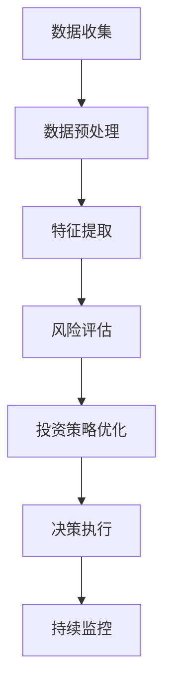
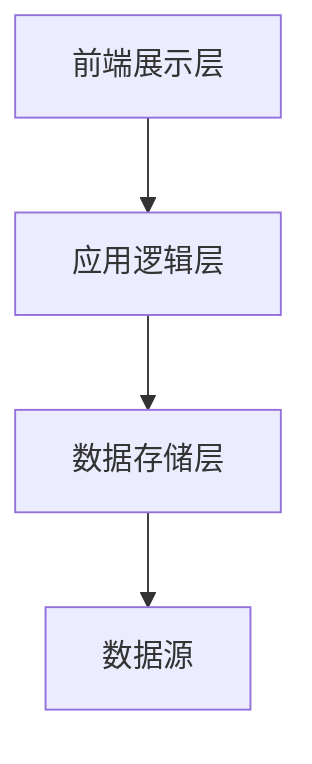
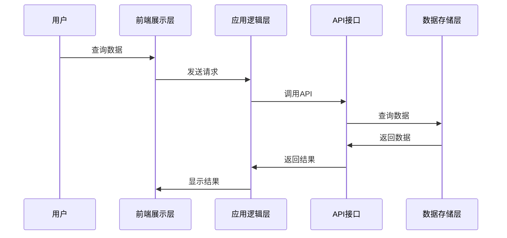

                 

## 引言

数字经济，作为21世纪最具变革性的经济形态之一，已经深刻地改变了全球经济的运作模式。它依托于互联网、大数据、云计算和人工智能等先进技术，不仅提高了信息传输和处理的效率，还创造了全新的商业模式和产业生态。在这种背景下，创业生态成为数字经济的重要组成部分，它不仅促进了创新和经济增长，也为中小企业和初创公司提供了成长的空间。

创业生态是一个复杂而动态的系统，它涵盖了从创意生成到产品或服务商业化的一系列过程。在这个生态系统中，创新孵化与风险投资是两个关键环节。创新孵化指的是通过特定的机制和环境，帮助初创企业快速成长，而风险投资则为企业提供必要的资金支持和专业资源，以应对市场的不确定性。

本文旨在探讨数字经济中的创业生态，特别是创新孵化与风险投资之间的平衡。我们将通过以下步骤进行分析和讨论：

1. **核心概念与理论框架**：介绍数字经济、创业生态、创新孵化与风险投资等核心概念，并构建理论框架。
2. **创新孵化机制**：分析创新孵化的定义、模式、流程及其在数字经济中的作用。
3. **风险投资的角色**：探讨风险投资在创业生态中的作用、投资策略及其对创新的影响。
4. **案例分析**：通过实际案例，分析创新孵化与风险投资在创业实践中的应用和效果。
5. **平衡策略**：讨论如何在数字经济中实现创新孵化与风险投资的平衡，提出最佳实践。
6. **未来展望**：总结文章的主要观点，并提出未来的研究方向。

通过以上步骤，我们将深入探讨数字经济中的创业生态，帮助读者理解创新孵化与风险投资之间的关系，以及如何在复杂的数字经济环境中实现二者的平衡，推动创业生态的健康发展。

### 关键词

- **数字经济**
- **创业生态**
- **创新孵化**
- **风险投资**
- **商业模式**
- **创新生态系统**

### 摘要

本文以数字经济中的创业生态为研究背景，探讨了创新孵化与风险投资在创业生态系统中的平衡问题。首先，我们介绍了数字经济、创业生态、创新孵化与风险投资等核心概念，并建立了理论框架。接着，我们分析了创新孵化的机制，包括其定义、模式、流程及其在数字经济中的作用。然后，我们探讨了风险投资在创业生态中的作用、投资策略及其对创新的影响。通过实际案例分析，我们展示了创新孵化与风险投资在创业实践中的应用和效果。最后，我们提出了实现创新孵化与风险投资平衡的策略，并提出了未来的研究方向。本文旨在为数字经济背景下的创业生态建设提供理论和实践指导，以促进创业生态的健康发展。

## 第1章：数字经济中的创业生态概述

### 1.1 数字经济的兴起与创业生态的演变

#### 1.1.1 数字经济的定义与特征

数字经济（Digital Economy）是指以数字技术和互联网为基础，通过信息技术的广泛应用和数字产品的交换，实现经济活动的一种新型经济形态。与传统的实体经济相比，数字经济具有以下几个显著特征：

1. **信息技术的深度融合**：数字经济依赖于互联网、大数据、云计算、人工智能等先进技术，这些技术不仅提高了信息传输和处理的效率，还改变了生产、消费和分配的方式。
2. **数据驱动**：数据成为数字经济的重要资产。通过大数据分析和人工智能技术，企业可以更准确地了解市场需求，优化资源配置，提高运营效率。
3. **全球化和网络化**：数字经济突破了地域和时间的限制，使得全球范围内的企业和消费者可以更加便捷地进行交易和合作。
4. **商业模式创新**：数字经济催生了众多新的商业模式，如共享经济、平台经济和社交电商等，这些模式利用数字技术创造了新的价值和利润来源。

#### 1.1.2 创业生态的概念与重要性

创业生态（Entrepreneurial Ecosystem）是指围绕创业活动的一系列相互关联的个体、组织和资源，它们共同构成了支持创业企业成长和发展的生态系统。创业生态包括企业家、投资者、研究机构、教育机构、政府、金融机构等多个利益相关者，它们通过协同合作，共同推动创新和创业活动。

在数字经济中，创业生态具有以下几个重要性：

1. **促进创新**：创业生态提供了创新所需的资源、知识和网络，有助于企业快速试验和验证新的想法，加速创新过程。
2. **降低风险**：通过创业生态中的多元参与，创业企业可以分散风险，获得更多的支持和资源，提高生存和发展的可能性。
3. **激发创业精神**：创业生态为创业者提供了展示才能的平台，激发了创业者的创新精神和创业意愿，促进了创业活动的繁荣。
4. **推动经济增长**：创业生态中的创新和创业活动能够创造新的就业机会，提升整体经济的活力和竞争力。

#### 1.1.3 数字经济中创业生态的特点

数字经济中的创业生态具有以下几个特点：

1. **快速迭代和试错**：数字技术的高效和低成本特性使得创业企业能够快速进行产品迭代和市场试错，提高市场响应速度。
2. **开放性和协作性**：数字技术使得创业企业可以更加便捷地获取外部资源和知识，促进不同利益相关者之间的协作和创新。
3. **数据驱动的决策**：大数据分析和人工智能技术为创业企业提供了更加精准的市场洞察和决策支持，帮助企业更好地应对市场变化。
4. **全球化视野**：数字经济打破了地域限制，创业企业可以更加容易地进入全球市场，实现全球化发展。

通过以上分析，我们可以看到数字经济对创业生态的深刻影响，以及创业生态在推动数字经济中的关键作用。在接下来的章节中，我们将进一步探讨数字经济中的创新孵化机制和风险投资的角色，为创业生态的健康发展提供更加深入的洞察。

### 1.2 创业生态的基本要素

#### 1.2.1 企业家精神与企业创业

企业家精神（Entrepreneurial Spirit）是创业生态中最核心的要素之一。它包括冒险精神、创新意识、决策能力、灵活性和市场洞察力等多个方面。企业家精神是企业家的核心竞争力，也是推动创业活动的重要动力。

1. **冒险精神**：企业家在面对未知和不确定性的情况下，敢于尝试和承担风险，这是企业家精神的重要体现。
2. **创新意识**：企业家具备创新意识，能够发现市场需求，开发新产品或服务，推动技术和商业模式的创新。
3. **决策能力**：企业家需要具备快速决策和灵活调整的能力，以应对市场变化和竞争压力。
4. **灵活性**：企业家能够快速适应环境变化，灵活调整经营策略，以保持企业的竞争力。
5. **市场洞察力**：企业家具备敏锐的市场洞察力，能够准确判断市场趋势，把握市场机遇。

企业创业（Entrepreneurship）是指企业家通过创新和创业活动，创建和运营企业的过程。企业创业不仅需要企业家精神，还需要以下条件：

1. **市场需求**：企业创业需要找到市场需求，开发出满足消费者需求的产品或服务。
2. **资金支持**：企业创业需要资金支持，包括自有资金和外部融资。
3. **专业团队**：企业创业需要专业团队的支持，包括技术人员、市场营销人员和运营管理人员等。
4. **创新环境**：企业创业需要良好的创新环境，包括政策支持、资源配置和知识共享等。

#### 1.2.2 创新与研发

创新（Innovation）是创业生态的核心驱动力，它不仅推动了企业的发展，也促进了整个经济的进步。创新可以分为以下几种类型：

1. **产品创新**：通过开发新产品或改进现有产品，满足消费者的新需求。
2. **过程创新**：通过改进生产流程或管理方法，提高效率和降低成本。
3. **商业模式创新**：通过创新商业模式，改变企业的盈利模式和市场定位。
4. **系统创新**：通过跨领域的整合和创新，推动整个系统的变革。

研发（Research and Development, R&D）是创新的重要手段，它包括基础研究和应用研究。研发活动不仅提高了企业的技术水平和市场竞争力，也为整个经济带来了新的增长点。

1. **基础研究**：旨在发现新的科学原理和知识，为技术创新提供理论基础。
2. **应用研究**：旨在将基础研究成果转化为实际应用，解决实际问题。

在数字经济中，创新与研发的作用更加显著。数字技术的快速发展为创新提供了新的工具和平台，如人工智能、大数据分析和云计算等。这些技术不仅提高了研发效率，也扩展了创新的范围和深度。

#### 1.2.3 政策环境与法律制度

政策环境与法律制度是创业生态的重要组成部分，它们为企业提供了良好的外部环境，促进了创业活动的发展。

1. **政策支持**：政府通过制定和实施相关政策，如税收优惠、资金支持、技术转移和创业培训等，为创业者提供支持和激励。
2. **法律制度**：法律制度为企业提供了明确的经营规范和权益保障，如知识产权保护、公司治理和企业融资等方面的法律法规。
3. **创新创业政策**：数字经济时代，政府还推出了许多创新创业政策，如“互联网+”行动计划、大数据发展战略和人工智能发展规划等，推动数字经济和创业生态的发展。

#### 1.2.4 资源配置与共享平台

资源配置与共享平台是创业生态中另一个关键要素。在数字经济中，资源配置更加高效和灵活，共享平台为创业企业提供了丰富的资源和支持。

1. **资金资源**：风险投资、天使投资和众筹等资金资源为创业企业提供了重要的资金支持，促进了企业的快速成长。
2. **知识资源**：通过学术研究、行业报告和技术分享等，创业企业可以获取最新的知识和技术，提高自身创新能力。
3. **人力资源**：数字经济中的共享经济模式，如共享办公、兼职平台和远程协作工具等，为创业企业提供了丰富的人力资源。
4. **技术资源**：云计算、人工智能和区块链等新兴技术为创业企业提供了强大的技术支持，降低了创新的门槛。

通过以上分析，我们可以看到创业生态的基本要素在数字经济中的重要作用。企业家精神与企业创业、创新与研发、政策环境与法律制度以及资源配置与共享平台共同构成了一个健康的创业生态，为数字经济的繁荣发展提供了坚实的基础。

### 1.3 创业生态的理论框架

#### 1.3.1 创业生态的动态演化理论

创业生态的动态演化理论（Dynamic Evolution Theory of Entrepreneurial Ecosystem）是理解创业生态系统发展变化的重要理论框架。该理论认为，创业生态系统是一个复杂的动态系统，由多个相互作用的子系统和元素组成。这些元素包括企业家、投资者、研究机构、教育机构、政府、金融机构等，它们通过相互作用和反馈机制，共同推动创业生态的发展。

1. **基本概念**：
   - **创业生态系统**：一个由多个相关利益主体组成的复杂网络，共同支持和推动创业活动。
   - **动态演化**：创业生态系统随着时间的推移而不断发展和变化，表现为系统内部的结构调整和功能升级。

2. **主要观点**：
   - **协同进化**：创业生态系统中的各个主体通过协同合作，共同促进创新和创业活动的发展。
   - **适应性**：创业生态系统需要具备适应外部环境变化的能力，以保持系统的稳定性和可持续发展。
   - **反馈机制**：创业生态系统中存在着多种反馈机制，如正反馈和负反馈，它们调节系统的运行，使其保持平衡和稳定。

3. **应用场景**：
   - **区域发展**：创业生态的动态演化理论可以用于解释和分析区域经济发展中的创新和创业活动，如硅谷等全球创新中心的形成和演变。
   - **行业生态**：在特定行业中，创业生态的动态演化理论可以帮助理解行业内部的创新竞争和创新生态的形成。

#### 1.3.2 资源基础观与创新生态系统

资源基础观（Resource-Based View, RBV）是创业生态理论中的一个重要理论框架，它强调企业通过利用和管理内部资源来获取竞争优势。资源基础观认为，企业的成功取决于其独特资源和能力的积累和发展。

1. **基本概念**：
   - **资源**：企业拥有的各种有形和无形资产，包括资金、技术、知识、人才、品牌等。
   - **能力**：企业通过整合和利用资源所形成的核心竞争力。

2. **主要观点**：
   - **独特资源与竞争优势**：企业通过开发和利用独特的资源，如核心技术、专利和品牌等，形成竞争优势，获得市场优势。
   - **动态能力**：企业需要具备动态能力，即快速适应和调整资源与能力的能力，以应对外部环境的变化。
   - **资源整合与协同效应**：企业通过整合内部资源，实现资源的最佳配置和利用，从而提高整体效益。

3. **应用场景**：
   - **初创企业**：资源基础观可以帮助初创企业识别和利用自身独特的资源，提高市场竞争力。
   - **企业战略规划**：企业可以通过资源基础观来制定和实施战略规划，优化资源配置，实现长期发展。

#### 1.3.3 网络外部性与创业生态网络

网络外部性（Network Externalities）是指产品或服务的价值随着使用该产品或服务的用户数量增加而增加的现象。在创业生态中，网络外部性是一个重要的概念，它影响了创业企业的成功和生态系统的稳定发展。

1. **基本概念**：
   - **网络外部性**：产品或服务的价值与用户数量正相关，即用户越多，产品的价值越高。
   - **创业生态网络**：由创业企业、投资者、研究机构、政府、供应商等多个利益相关者组成的复杂网络。

2. **主要观点**：
   - **用户规模效应**：网络外部性使得创业企业需要实现一定的用户规模，才能获得市场竞争优势。
   - **平台效应**：创业生态网络中的平台型企业可以通过提供连接和协调服务，实现网络外部性，提高整体生态系统的价值。
   - **生态系统稳定**：网络外部性有助于增强创业生态系统的稳定性，减少系统内部的不确定性。

3. **应用场景**：
   - **平台型创业**：网络外部性概念可以帮助平台型创业企业理解其商业模式的成功关键，提高平台的用户黏性和价值。
   - **行业合作**：创业生态中的不同主体可以通过建立网络合作，共享资源，实现协同发展，提高整体竞争力。

通过以上理论框架的介绍，我们可以更深入地理解数字经济中的创业生态，以及创新孵化与风险投资在这一生态中的重要作用。这些理论框架不仅为我们提供了分析创业生态的工具，也为创业实践提供了指导。

### 1.4 本书结构与内容安排

#### 1.4.1 各章节内容概述

本书共分为七个主要部分，每个部分都有其独特的主题和内容安排，旨在系统地探讨数字经济中的创业生态、创新孵化与风险投资之间的平衡关系。

1. **引言与理论框架**：第一部分介绍了数字经济的定义与特征，创业生态的概念与重要性，以及创业生态的基本要素，为后续章节的分析提供了理论基础。
2. **创新孵化机制**：第二部分详细分析了创新孵化的定义、模式、流程及其在数字经济中的作用，帮助读者理解创新孵化的关键环节。
3. **风险投资的角色**：第三部分探讨了风险投资在创业生态中的作用、投资策略及其对创新的影响，提供了风险投资的基本原理和实践方法。
4. **案例分析**：第四部分通过实际案例，展示了创新孵化与风险投资在创业实践中的应用和效果，为理论提供了有力的实证支持。
5. **平衡策略**：第五部分讨论了如何在数字经济中实现创新孵化与风险投资的平衡，提出了最佳实践和策略，为创业生态的健康发展提供了指导。
6. **未来展望**：第六部分总结了本书的主要观点，并对未来研究方向进行了展望，为读者提供了进一步思考的方向。
7. **结论**：最后一部分对全书内容进行了总结，并提出了未来研究和实践的建议。

#### 1.4.2 阅读指南与建议

为了更好地理解和应用本书的内容，我们提供以下阅读指南和建议：

1. **系统阅读**：建议读者按照章节顺序系统阅读，逐步深入理解数字经济中的创业生态、创新孵化与风险投资的各个方面。
2. **重点阅读**：在阅读过程中，重点关注每章节中的核心概念、理论框架和实践案例，这些内容是理解全书主题的关键。
3. **结合实践**：将书中理论和方法与实际创业经历或商业案例相结合，思考如何应用和创新，提高读者的实践能力和应用水平。
4. **拓展阅读**：鼓励读者在阅读本书的基础上，进一步阅读相关领域的学术论文、专业书籍和行业报告，以获得更加全面和深入的知识。

通过以上的阅读指南与建议，读者可以更加有效地利用本书的内容，提升对数字经济中创业生态、创新孵化与风险投资的理解和应用能力。

## 第2章：数字经济中的创新孵化机制

### 2.1 创新孵化的定义与作用

创新孵化（Innovation Incubation）是指通过特定的机制和环境，帮助初创企业快速成长的过程。它是创业生态系统中的一个关键环节，旨在通过提供资源、支持和指导，帮助初创企业克服创业初期的困难，实现从概念到商业化的过渡。创新孵化不仅能够促进创新，还能提高初创企业的生存率和成功率。

#### 1. 定义

创新孵化可以定义为一种系统性的过程，它通过整合各种资源和要素，为初创企业创造一个有利于创新和成长的环境。这些资源和要素包括资金、技术、人才、市场、政策等。创新孵化的目标是帮助初创企业快速成长，提高其市场竞争力，并最终实现商业化。

#### 2. 作用

创新孵化在数字经济中具有以下几个重要作用：

1. **促进创新**：创新孵化提供了一个试验平台，使初创企业能够快速试验和验证新的想法。通过不断的试错和优化，企业可以更快地实现产品或服务的创新，满足市场需求。

2. **降低创业风险**：创新孵化通过提供资源和支持，帮助初创企业分散风险。初创企业在孵化过程中，可以获得技术指导、市场分析、法律咨询等多种服务，降低创业失败的概率。

3. **提升企业竞争力**：创新孵化不仅提供了资源和支持，还通过培训、交流等方式，提升企业的管理水平和创新能力。这有助于企业建立竞争优势，提高市场竞争力。

4. **推动经济发展**：创新孵化能够加速新企业的成长，创造新的就业机会，推动技术进步和产业升级，从而促进经济的快速发展。

#### 3. 主要模式

创新孵化有几种常见的模式，每种模式都有其特定的特点和适用场景：

1. **孵化器**：孵化器是一种为初创企业提供办公空间、资源共享、培训指导等服务的机构。孵化器通常具有开放的创新氛围，能够吸引各类创业人才和资源，是初创企业成长的理想场所。

2. **加速器**：加速器是针对已经有一定基础的初创企业，提供快速成长服务的机构。加速器通常为期数月，通过密集的培训、导师指导、融资对接等方式，帮助初创企业迅速提升运营能力和市场竞争力。

3. **创业投资**：创业投资是创新孵化的一种重要模式，通过为初创企业提供资金支持，帮助其实现快速成长。创业投资通常包括种子轮、天使轮、A轮等多个阶段，每个阶段都有不同的投资策略和目标。

4. **大学科技园**：大学科技园是依托大学或科研机构的创新孵化平台，通过结合学术资源和产业需求，推动科技成果转化和创新创业。

#### 4. 创新孵化过程

创新孵化的过程可以分为以下几个阶段：

1. **创意筛选**：通过市场调研、用户反馈等方式，筛选出有潜力的创新项目。

2. **项目孵化**：为初创企业提供办公空间、资源共享、技术支持、市场分析、法律咨询等全方位的服务，帮助其快速成长。

3. **商业模式验证**：通过市场试错和用户反馈，不断优化和调整商业模式，确保其可行性和可持续性。

4. **融资与扩展**：通过创业投资、众筹等方式，为初创企业筹集资金，支持其扩展业务和市场。

5. **成功退出**：在初创企业达到一定规模和市场地位后，通过并购、上市等方式实现成功退出，为投资者和创业团队带来回报。

通过以上分析，我们可以看到创新孵化在数字经济中的重要性及其多种模式。在接下来的章节中，我们将详细探讨创新孵化的关键流程和实际操作方法，帮助读者更好地理解和应用创新孵化机制。

### 2.2 创新孵化模式与流程

#### 2.2.1 创业孵化器的类型与功能

创业孵化器（Startup Incubators）是创新孵化机制中的一种重要模式，旨在为初创企业提供全方位的支持和服务，帮助其快速成长。创业孵化器有多种类型，每种类型都有其特定的特点和功能。

1. **公共孵化器**：公共孵化器是由政府或非营利组织出资建设的，旨在为中小企业和初创企业提供低成本、高效率的创业环境。这些孵化器通常提供办公空间、共享资源、培训指导和政策支持等。

2. **大学孵化器**：大学孵化器依托高校的科研资源和人才优势，为师生创新创业提供平台。大学孵化器不仅提供办公空间，还通过实验室设施、学术支持和技术转让等服务，推动科技成果转化。

3. **企业孵化器**：企业孵化器是由大型企业设立的，旨在培养和孵化与其业务相关的初创企业。这些孵化器通过提供资金、市场资源、技术支持和人才培训等，帮助初创企业快速成长。

4. **混合型孵化器**：混合型孵化器结合了公共孵化器、大学孵化器和企业孵化器的特点，提供多元化的服务和资源。这些孵化器通常具有灵活的运营模式和强大的资源整合能力，能够更好地满足初创企业的需求。

#### 2.2.2 创新孵化器的运营模式

创新孵化器的运营模式直接影响其服务质量和效果。以下是一些常见的运营模式：

1. **阶段式运营**：阶段式运营是指孵化器按照初创企业的发展阶段，提供相应的支持和服务。通常分为种子期、初创期、成长期等阶段，每个阶段都有不同的服务重点和目标。

2. **项目制运营**：项目制运营是指孵化器通过筛选和立项，对具有潜力的项目提供专项支持和孵化服务。项目制运营通常涉及多个领域，孵化器通过项目管理和资源配置，推动项目的快速成长。

3. **资源共享**：资源共享是指孵化器通过整合内部和外部资源，为初创企业提供资源共享平台。这些资源包括办公空间、设备、技术、人才、资金等，通过共享，降低初创企业的运营成本，提高资源利用效率。

4. **孵化基金**：孵化基金是指孵化器通过设立专项基金，为初创企业提供资金支持。这些资金通常用于项目的研发、市场推广、团队建设等，帮助初创企业度过创业初期的资金瓶颈。

#### 2.2.3 创新孵化的关键流程

创新孵化是一个系统性的过程，包括多个关键环节，每个环节都有其特定的目标和任务。以下是一些常见的创新孵化关键流程：

1. **项目筛选**：项目筛选是创新孵化的第一步，通过市场调研、用户反馈、专家评审等方式，筛选出具有发展潜力的项目。项目筛选的目标是确保孵化的项目具有实际应用价值和市场前景。

2. **团队组建**：团队组建是孵化过程中至关重要的一环，一个高效、专业的团队是实现项目成功的关键。孵化器通过提供招聘指导、人才推荐等方式，帮助初创企业组建合适的团队。

3. **技术研发**：技术研发是创新孵化的核心环节，通过技术攻关和研发，实现项目的技术突破和产品化。孵化器通常提供技术研发支持，包括实验室设施、技术指导、科研资源等。

4. **市场推广**：市场推广是创新孵化的重要环节，通过市场调研、品牌建设、推广活动等方式，提升项目的市场知名度和影响力。孵化器通常提供市场推广指导，帮助初创企业制定有效的市场策略。

5. **融资对接**：融资对接是孵化过程的最后一个关键环节，通过投融资对接、路演活动等方式，帮助初创企业筹集资金，实现项目的可持续发展。孵化器通常建立投融资网络，为初创企业提供多样化的融资渠道。

通过以上分析，我们可以看到创新孵化模式与流程在数字经济中的重要作用。创新孵化不仅为初创企业提供了必要的支持和资源，还推动了整个数字经济的发展。在接下来的章节中，我们将进一步探讨创新孵化中的具体实践方法和成功案例。

### 2.3 创新孵化支持政策与措施

#### 1. 政府政策支持

政府在推动创新孵化过程中扮演着至关重要的角色，通过一系列政策支持，为初创企业和创新孵化器提供良好的发展环境。以下是几种主要的政府政策支持措施：

1. **财政支持**：政府通过设立专项资金、补贴和奖励，为初创企业和创新孵化器提供财政支持。这些资金通常用于技术研发、市场推广、团队建设和设施建设等方面，帮助初创企业降低运营成本，提高创新能力。

2. **税收优惠**：政府通过减免税收、提供税收抵扣等方式，减轻初创企业和孵化器的税收负担。例如，对初创企业实行税收优惠政策，鼓励企业进行研发和创新活动。

3. **融资支持**：政府通过设立政府投资基金、提供贷款担保和低息贷款等方式，为初创企业和孵化器提供融资支持。这些措施有助于缓解初创企业的融资难题，推动项目的顺利实施。

4. **创业培训**：政府组织各种创业培训活动，提供创业指导、管理培训、技术培训等，帮助创业者提高管理能力和创新能力。这些培训不仅有助于提高创业者的综合素质，还能增强企业的市场竞争力。

5. **知识产权保护**：政府加强知识产权保护，通过立法和执法手段，保护初创企业的知识产权。这有助于激励创新，减少创新风险，提高初创企业的创新动力。

#### 2. 企业支持措施

除了政府支持外，企业也在推动创新孵化过程中发挥着重要作用，通过多种措施为初创企业提供支持和资源。

1. **战略合作**：大型企业通过与初创企业建立战略合作关系，为初创企业提供市场机会、技术支持和资源。例如，通过战略合作，企业可以为初创企业提供市场渠道、技术资源和管理经验，帮助其快速成长。

2. **开放式创新**：企业通过开放式创新平台，鼓励外部创业者和企业内部员工提出创新想法，并为其提供支持和资源。开放式创新不仅可以激发外部创新资源，还能促进企业内部创新。

3. **研发合作**：企业通过设立联合实验室、研发中心等方式，与初创企业共同进行技术研发。这种合作不仅可以推动技术创新，还能为企业提供新的技术解决方案。

4. **人才培养**：企业通过设立实习计划、人才培养计划等，为初创企业提供人才支持。这些计划不仅可以帮助初创企业吸引和培养优秀人才，还能促进企业内部的人才流动和培养。

5. **资源共享**：企业通过开放实验室、设备、技术等资源，为初创企业提供资源共享平台。这些资源有助于降低初创企业的运营成本，提高创新效率。

#### 3. 社会组织支持

社会组织在推动创新孵化方面也发挥着重要作用，通过多种形式的支持，为初创企业创造良好的发展环境。

1. **创业服务平台**：社会组织通过设立创业服务平台，为初创企业提供政策咨询、创业指导、投融资对接等服务。这些平台不仅为初创企业提供了便捷的服务，还促进了不同利益主体之间的合作。

2. **创业赛事**：社会组织通过组织创业赛事，鼓励创业者展示创新项目，提升创业者的市场意识和商业能力。创业赛事通常包括项目展示、路演、评审等多个环节，有助于发现和培养优秀的创业人才。

3. **创业孵化基金**：社会组织通过设立创业孵化基金，为初创企业提供资金支持。这些基金通常由政府、企业和社会资本共同出资，通过投资和资助的方式，支持初创企业的发展。

4. **创业导师制度**：社会组织通过创业导师制度，为初创企业提供经验丰富的导师指导。创业导师通常具有丰富的创业经验和企业管理能力，可以为初创企业提供战略咨询、市场分析、团队建设等方面的指导。

通过以上分析，我们可以看到政府、企业和社会组织在推动创新孵化中的多重作用。这些支持措施不仅为初创企业提供了必要的资源和指导，还促进了创新生态系统的健康发展。在接下来的章节中，我们将进一步探讨创新孵化在实际操作中的应用和案例分析。

## 第3章：风险投资的角色

### 3.1 风险投资在创业生态中的作用

风险投资（Venture Capital，简称VC）是创业生态中不可或缺的一环，它通过向初创企业和成长型企业提供资金支持，帮助这些企业在发展的早期阶段克服资金瓶颈，实现快速成长。风险投资在创业生态中的作用主要体现在以下几个方面：

1. **资金支持**：风险投资为初创企业提供了关键的启动资金，使其能够进行技术研发、市场推广和团队建设。特别是在初创企业难以通过传统金融渠道获得融资的情况下，风险投资成为其重要的资金来源。

2. **专业指导**：除了资金支持，风险投资机构通常拥有丰富的行业经验和专业知识，可以为初创企业提供战略咨询、市场分析、人才招聘等方面的指导。这些指导有助于初创企业更好地制定发展策略，提高运营效率。

3. **资源整合**：风险投资机构通常拥有广泛的人脉和资源网络，能够为初创企业引入合作伙伴、客户和供应商等资源。这些资源有助于初创企业扩大市场影响力，提高竞争力。

4. **推动创新**：风险投资通过投资于具有高成长潜力的初创企业，推动技术创新和商业模式创新。这些创新不仅为企业自身带来巨大的商业价值，还推动了整个行业的进步。

5. **风险分担**：风险投资通过分散投资多个初创企业，降低了单一项目失败所带来的风险。同时，风险投资机构的专业能力和风险控制机制，也帮助初创企业更好地应对市场风险。

#### 3.2 风险投资的投资策略及其对创新的影响

风险投资的投资策略主要包括种子轮、天使轮、A轮、B轮、C轮等多个阶段，每个阶段都有其特定的投资目标和策略。

1. **种子轮（Seed Round）**：种子轮投资通常是最早期的风险投资，投资对象通常是初创企业或尚处于概念阶段的企业。种子轮投资的主要目标是发现并支持有潜力的高成长企业，投资金额相对较小。

2. **天使轮（Angel Round）**：天使轮投资通常由个人投资者或天使投资人提供，投资对象是已经完成产品原型开发的初创企业。天使轮投资的主要目标是帮助企业完成产品开发和市场验证，投资金额相对较大。

3. **A轮（Series A）**：A轮投资是企业在完成天使轮投资后的进一步融资，投资对象通常是已经进行了一定的市场验证，并具备明确商业模式的企业。A轮投资的主要目标是帮助企业扩大市场份额，提高品牌知名度。

4. **B轮（Series B）**：B轮投资是企业在A轮融资后的进一步融资，投资对象通常是已经取得初步成功的成长型企业。B轮投资的主要目标是帮助企业实现规模化运营，进入市场主导地位。

5. **C轮及以后（Series C and beyond）**：C轮及以后的投资通常针对已经进入规模化运营阶段的企业，投资金额和风险也随之增加。C轮及以后的投资目标主要是帮助企业实现商业模式的优化和全球化扩展。

#### 风险投资对创新的影响

风险投资对创新的影响是深远且多方面的，主要表现在以下几个方面：

1. **资金驱动创新**：风险投资提供了大量的资金支持，使初创企业能够投入更多资源进行技术研发和市场拓展，从而加速创新进程。

2. **资源整合**：风险投资机构通过引入专业团队、导师资源和行业合作伙伴，为初创企业提供了丰富的外部资源，有助于企业实现创新。

3. **市场竞争**：风险投资推动企业之间的竞争，激发企业的创新动力。为了在激烈的市场竞争中脱颖而出，企业不得不不断进行技术创新和商业模式创新。

4. **生态系统建设**：风险投资通过投资多个初创企业，促进了创业生态系统的建设。一个健康的创业生态系统不仅能够促进企业之间的合作，还能吸引更多的创新资源。

5. **长期影响**：风险投资不仅推动了初创企业的快速成长，还促进了整个行业的创新和进步。通过投资和支持优秀的初创企业，风险投资为未来的技术创新和市场发展奠定了基础。

通过以上分析，我们可以看到风险投资在创业生态中的重要作用，以及其对创新的积极影响。在接下来的章节中，我们将进一步探讨风险投资的实际操作和案例分析，帮助读者更深入地理解风险投资在数字经济中的角色和作用。

### 3.3 风险投资的实际操作

#### 3.3.1 风险投资的投资决策过程

风险投资的投资决策过程是一个复杂而系统的过程，涉及多个步骤和因素。以下是风险投资决策过程的主要环节：

1. **项目筛选**：风险投资机构首先通过市场调研、行业报告、投资顾问等多渠道获取潜在投资项目的信息。项目筛选的主要目标是识别具有高成长潜力和创新价值的企业。

2. **初步评估**：在初步筛选出潜在项目后，风险投资机构会对项目进行初步评估，包括对企业团队、市场前景、商业模式、技术可行性等方面进行分析。初步评估通常通过阅读项目报告、与创业者沟通、实地考察等方式进行。

3. **尽职调查**：对于通过初步评估的项目，风险投资机构会进行详细的尽职调查。尽职调查包括财务审计、法律合规性审查、市场分析等，旨在全面评估项目的真实性和可行性。

4. **投资决策**：在尽职调查完成后，风险投资机构会召开投资决策会议，讨论并决定是否进行投资。投资决策主要考虑项目的投资潜力、回报预期、风险控制等因素。

5. **签署协议**：一旦投资决策通过，风险投资机构会与创业者签署投资协议，明确投资金额、投资形式、权益分配等关键条款。

6. **投资后管理**：投资后，风险投资机构会持续关注项目进展，提供战略咨询、资源对接等支持。投资后管理旨在确保投资项目的顺利进行，提高投资回报。

#### 3.3.2 风险投资的投资形式

风险投资的投资形式多样，包括股权投资、债务投资、并购投资等。以下是几种常见投资形式及其特点：

1. **股权投资**：股权投资是风险投资最常见的形式，风险投资机构通过购买企业股权，获得企业的控制权或重大影响。股权投资通常涉及长期投资，风险较高，但回报潜力也大。

2. **债务投资**：债务投资是指风险投资机构通过提供贷款或债务工具，为企业提供资金支持。债务投资通常在初创企业面临短期资金短缺时使用，风险较低，但回报相对有限。

3. **并购投资**：并购投资是指风险投资机构通过收购其他企业，实现快速扩张和多元化发展。并购投资通常需要较高的资金实力和投资经验，但可以通过快速整合资源，实现企业的规模扩张。

4. **联合投资**：联合投资是指多个风险投资机构联合对同一项目进行投资，共同分担风险和收益。联合投资可以分散风险，提高投资的成功率。

5. **跟投**：跟投是指风险投资机构在已有投资者参与的情况下，跟进投资。跟投通常用于已经经过初步评估和尽职调查的项目，可以加快投资决策过程。

#### 3.3.3 风险投资的投资策略

风险投资的投资策略因机构而异，但通常包括以下几种：

1. **行业集中策略**：行业集中策略是指风险投资机构将投资重点集中在某一特定行业或领域，通过深入研究行业动态和市场趋势，寻找具有高成长潜力的投资机会。

2. **区域布局策略**：区域布局策略是指风险投资机构根据不同地区的经济发展水平、产业政策和创业环境，选择投资区域，实现投资地域的多元化。

3. **跟投策略**：跟投策略是指风险投资机构在已有投资者参与的情况下，跟进投资。跟投策略可以降低投资风险，提高投资成功率。

4. **多元化投资策略**：多元化投资策略是指风险投资机构通过投资多个不同行业、不同阶段的企业，分散风险，实现投资的多元化。

5. **长期投资策略**：长期投资策略是指风险投资机构将投资周期拉长，以获取更高的回报。长期投资策略通常适用于具有长期增长潜力的行业和企业。

通过以上分析，我们可以看到风险投资在实际操作中涉及多个环节和策略，其目的是在控制风险的同时，实现投资回报的最大化。在接下来的章节中，我们将通过实际案例，进一步探讨风险投资在数字经济中的具体应用和成效。

### 3.4 风险投资案例分析

#### 3.4.1 案例一：Airbnb

Airbnb 是一家全球领先的共享住宿平台，通过连接房主和房客，实现了住宿服务的共享经济。Airbnb 的成功离不开风险投资的支持，以下是其风险投资案例分析：

1. **投资阶段**：Airbnb 从成立初期到上市过程中，经历了多个投资阶段，包括天使轮、A轮、B轮、C轮等。其中，早期风险投资机构如Y Combinator 和红杉资本（Sequoia Capital）等为其提供了关键的启动资金。

2. **投资策略**：早期投资者在投资 Airbnb 时，主要采用了行业集中策略和长期投资策略。他们专注于共享经济领域，并通过长期投资，支持 Airbnb 的持续发展和创新。

3. **投资成效**：风险投资为 Airbnb 提供了强大的资金支持和资源整合能力，使其在短时间内实现了快速成长。截至 2020 年，Airbnb 的估值为 310 亿美元，并在 2020 年底成功上市，为投资者带来了丰厚的回报。

#### 3.4.2 案例二：Uber

Uber 是一家全球领先的移动出行服务平台，通过提供出租车、专车、快车等出行服务，改变了人们的出行方式。Uber 的风险投资案例分析如下：

1. **投资阶段**：Uber 从成立初期到上市过程中，也经历了多个投资阶段，包括种子轮、A轮、B轮、C轮等。其早期投资者包括谷歌资本（Google Capital）和卡塔尔投资局（Qatar Investment Authority）等。

2. **投资策略**：Uber 的投资者主要采用了区域布局策略和多元化投资策略。他们不仅投资于美国市场，还积极布局欧洲、亚洲等地区市场，以实现全球化的扩展。同时，Uber 也通过多元化投资，分散了投资风险。

3. **投资成效**：风险投资为 Uber 提供了强大的资金支持和全球资源，使其在短时间内实现了全球市场的扩张。截至 2021 年，Uber 的估值为 800 亿美元，并在 2021 年成功上市。尽管在上市后面临一系列挑战，但投资者仍然获得了较高的回报。

#### 3.4.3 案例三：Slack

Slack 是一家提供企业协作工具的软件公司，通过即时通讯、文件共享和任务管理等功能，帮助企业提高工作效率。以下是其风险投资案例分析：

1. **投资阶段**：Slack 的风险投资历程包括天使轮、A轮、B轮、C轮等多个阶段。早期投资者包括风险投资公司如安德森·霍洛维茨（Andreessen Horowitz）和风险投资家如普雷特·贾尼（Preetam Joshi）等。

2. **投资策略**：Slack 的投资者采用了长期投资策略和专业指导策略。他们不仅在早期阶段提供了大量资金支持，还在企业发展过程中，提供了丰富的专业指导，帮助 Slack 制定战略和优化产品。

3. **投资成效**：风险投资为 Slack 提供了强大的资金支持和专业指导，使其在短时间内成为企业协作工具的领导者。截至 2019 年，Slack 的估值为 180 亿美元，并在 2021 年成功上市，为投资者带来了丰厚的回报。

通过以上案例分析，我们可以看到风险投资在推动数字经济中的创业生态发展方面的重要作用。风险投资不仅为初创企业提供了资金支持，还通过专业指导和资源整合，帮助企业在激烈的市场竞争中脱颖而出。在接下来的章节中，我们将进一步探讨如何在数字经济中实现创新孵化与风险投资的平衡。

### 第4章：案例分析

#### 4.1 Airbnb：共享经济先锋

Airbnb 是共享经济的典型代表，它通过连接房主和房客，实现了闲置房产的共享和利用。以下是对 Airbnb 创业生态的案例分析：

1. **背景**：Airbnb 成立于 2008 年，其创始人是两位年轻人 Brian Chesky 和 Joe Gebbia。在金融危机时期，他们利用自己闲置的房间出租，以支付房租。这一创意迅速得到了市场的认可，催生了 Airbnb 这一平台。

2. **商业模式**：Airbnb 通过建立一个在线平台，让房主可以在平台上发布房源信息，房客则可以在线预订和支付。平台通过收取佣金的方式盈利，同时提供用户评价和反馈系统，确保交易的安全和透明。

3. **创新孵化**：Airbnb 的成功离不开创新孵化机制的支持。在初创阶段，Airbnb 获得了天使投资和风险投资的支持，这些资金不仅帮助其解决资金问题，还为其提供了市场推广和资源整合的支持。Airbnb 还积极参与各种创业孵化器和加速器的项目，通过与其他创业企业的互动，不断提升自身的创新能力和市场竞争力。

4. **风险投资**：Airbnb 在其发展过程中获得了多轮风险投资，包括红杉资本、谷歌资本等顶级风投机构的支持。这些投资不仅为 Airbnb 提供了资金支持，还通过资源整合和战略指导，帮助 Airbnb 在全球范围内迅速扩展。

5. **挑战与应对**：随着 Airbnb 的快速发展，其面临了一系列挑战，如法律合规问题、用户体验问题、房源质量问题等。Airbnb 通过积极应对，不断优化平台，提高服务质量和用户体验。例如，通过引入第三方审核机制，确保房源质量；通过建立用户评价系统，提高用户信任度。

6. **成效**：Airbnb 的成功不仅改变了人们的出行和住宿方式，也推动了共享经济的发展。截至 2020 年，Airbnb 的估值达到 310 亿美元，并在同年成功上市。投资者通过 Airbnb 的高回报，充分展示了创新孵化和风险投资在数字经济中的巨大潜力。

#### 4.2 Uber：出行服务革新者

Uber 是全球领先的移动出行服务平台，通过提供出租车、专车、快车等服务，改变了人们的出行方式。以下是对 Uber 创业生态的案例分析：

1. **背景**：Uber 成立于 2009 年，其创始人是 Travis Kalanick 和 Garrett Camp。Uber 初始的商业模式是通过提供高端出租车服务，挑战传统出租车行业。随着业务的发展，Uber 开始提供更多种类的出行服务，如专车、快车等。

2. **商业模式**：Uber 通过建立一个在线平台，连接司机和乘客。乘客可以通过应用程序预约车辆，司机则通过平台获取订单信息。Uber 通过收取服务费和佣金的方式盈利，同时提供实时导航、支付、评价等功能，提高用户体验。

3. **创新孵化**：Uber 在其创业过程中，通过创新孵化机制，不断推出新的服务和功能。例如，Uber 在全球范围内推广了自动驾驶技术，与知名科技公司如 Waymo、Tesla 等合作，探索自动驾驶的未来。Uber 还积极参与各种创业孵化器和加速器的项目，通过与其他创业企业的互动，不断提升自身的创新能力和市场竞争力。

4. **风险投资**：Uber 在其发展过程中获得了多轮风险投资，包括谷歌资本、卡塔尔投资局等顶级风投机构的支持。这些投资不仅为 Uber 提供了资金支持，还通过资源整合和战略指导，帮助 Uber 在全球范围内迅速扩展。

5. **挑战与应对**：Uber 面临了多个挑战，如法律合规问题、司机权益问题、用户隐私问题等。Uber 通过积极应对，不断优化平台和服务，提高用户满意度和司机收益。例如，Uber 推出了司机保障计划，提高了司机的福利待遇；通过加强数据保护措施，确保用户隐私安全。

6. **成效**：Uber 的成功不仅改变了人们的出行方式，也推动了共享出行和移动服务的发展。截至 2021 年，Uber 的估值为 800 亿美元，并在同年成功上市。投资者通过 Uber 的高回报，充分展示了创新孵化和风险投资在数字经济中的巨大潜力。

#### 4.3 Slack：企业协作工具引领者

Slack 是一家提供企业协作工具的软件公司，通过即时通讯、文件共享和任务管理等功能，帮助企业提高工作效率。以下是对 Slack 创业生态的案例分析：

1. **背景**：Slack 成立于 2013 年，其创始人是 Stewart Butterfield。Slack 的前身是游戏公司，但 Butterfield 在游戏开发过程中发现，团队需要一个更好的协作工具。于是，他决定将这个想法转化为一个独立的产品，即 Slack。

2. **商业模式**：Slack 通过提供一个在线协作平台，帮助团队成员实现高效的沟通和协作。Slack 提供了包括即时消息、文件共享、任务管理、集成第三方应用等功能。Slack 通过收取订阅费用的方式盈利，订阅用户可以获得更多的高级功能和特权。

3. **创新孵化**：Slack 在其创业过程中，通过创新孵化机制，不断提升产品的功能和用户体验。Slack 与多家创业孵化器和加速器合作，通过与其他创业企业的互动，不断学习和借鉴优秀的产品设计理念和技术创新。

4. **风险投资**：Slack 在其发展过程中获得了多轮风险投资，包括安德森·霍洛维茨、普雷特·贾尼等顶级风投机构的支持。这些投资不仅为 Slack 提供了资金支持，还通过资源整合和战略指导，帮助 Slack 在短时间内迅速扩张。

5. **挑战与应对**：Slack 面临的挑战主要包括市场竞争、用户保留和功能扩展等。Slack 通过持续优化产品、提高用户满意度和推出新的功能，积极应对市场竞争。例如，Slack 推出了多渠道集成功能，使企业能够更方便地整合其他应用程序。

6. **成效**：Slack 的成功不仅改变了企业的协作方式，也推动了协作工具市场的发展。截至 2019 年，Slack 的估值为 180 亿美元，并在 2021 年成功上市。投资者通过 Slack 的高回报，充分展示了创新孵化和风险投资在数字经济中的巨大潜力。

通过以上案例分析，我们可以看到创新孵化和风险投资在推动数字经济中的创业生态发展方面的重要作用。无论是共享经济、出行服务还是企业协作工具，创新孵化和风险投资都为这些企业提供了必要的支持和资源，帮助它们在激烈的市场竞争中脱颖而出，实现了快速发展和高回报。

### 第5章：平衡策略

#### 5.1 创新孵化与风险投资之间的平衡

在数字经济中，创新孵化与风险投资是推动创业生态发展的两个重要环节，但它们之间往往存在一定的矛盾和冲突。为了实现二者的平衡，我们需要从多个角度进行综合分析和策略设计。

#### 5.1.1 实现平衡的重要性

1. **资源合理配置**：创新孵化需要提供充足的资源支持，如资金、技术和人才等。而风险投资则关注投资回报和风险控制。如果过于偏向某一方，可能导致资源浪费或错失市场机会。

2. **促进可持续发展**：创新孵化注重长期创新和持续发展，而风险投资则更关注短期回报和退出策略。实现二者的平衡，有助于企业在追求短期收益的同时，保持长期创新能力。

3. **降低创业风险**：创新孵化通过提供全方位的支持，帮助初创企业降低创业风险。而风险投资则通过分散投资和风险控制，降低投资风险。二者的平衡有助于构建一个稳定的创业生态系统。

#### 5.1.2 实现平衡的挑战

1. **利益冲突**：创新孵化器和风险投资机构在目标和利益上可能存在冲突。孵化器更关注企业的长期发展，而风险投资则更关注短期回报。

2. **资源竞争**：初创企业在资源有限的情况下，需要在创新孵化和风险投资之间进行权衡。例如，过多的资金投入可能会削弱企业的创新动力。

3. **风险控制**：风险投资机构在投资过程中需要控制风险，但过度控制可能会限制企业的创新和发展。

#### 5.2 实现平衡的策略

1. **多元化投资策略**：风险投资机构可以采用多元化投资策略，不仅投资于具有高成长潜力的初创企业，还关注企业的长期发展潜力。通过分散投资，降低单一项目的风险。

2. **联合投资**：创新孵化器和风险投资机构可以合作，共同投资初创企业。这样可以充分发挥各自的优势，实现资源整合和风险分担。

3. **阶段性投资**：风险投资可以采用阶段性投资策略，根据企业的不同发展阶段提供相应的资金支持。例如，在初创期注重资金支持，在成长期注重资源整合和市场拓展。

4. **定制化支持**：针对不同初创企业的需求和特点，创新孵化器和风险投资机构可以提供定制化的支持服务。例如，对于技术驱动的初创企业，可以提供技术支持和研发资源；对于市场驱动的初创企业，可以提供市场推广和客户资源。

5. **激励机制**：建立激励机制，鼓励创新孵化和风险投资机构在追求短期回报的同时，关注企业的长期发展。例如，可以设置长期投资回报奖励机制，激励投资机构和企业保持长期合作关系。

#### 5.3 案例分享

1. **硅谷创业生态**：硅谷是全球知名的创业中心，其成功离不开创新孵化和风险投资的平衡。硅谷的创业孵化器和风险投资机构通过紧密合作，共同推动创新和创业。例如，硅谷的 Y Combinator 孵化器与顶级风险投资机构红杉资本（Sequoia Capital）的合作，为初创企业提供了强大的资金支持和资源整合能力。

2. **中国深圳创业生态**：中国深圳的创业生态也展现了创新孵化和风险投资的平衡。深圳的政府、企业和孵化器共同推动了创新和创业的发展。例如，深圳的“互联网+”行动计划，通过提供政策支持和资金支持，促进了创新创业的繁荣。

通过以上分析和案例分享，我们可以看到实现创新孵化与风险投资的平衡是数字经济中创业生态健康发展的重要保障。在接下来的章节中，我们将进一步探讨创新孵化与风险投资在实际操作中的应用和效果。

### 5.4 最佳实践

在数字经济中，实现创新孵化与风险投资的平衡，需要结合实际经验和最佳实践。以下是一些成功的经验和策略：

#### 1. 构建多方协同的创新生态系统

在硅谷，创业生态的成功很大程度上得益于多方协同的合作。政府、企业和研究机构共同构建了一个良好的创新环境。例如，硅谷的创业孵化器如 Y Combinator 和 Techstars 与顶级风险投资机构如红杉资本（Sequoia Capital）和安德森·霍洛维茨（Andreessen Horowitz）紧密合作，为初创企业提供了资金、资源和支持。这种多方协同的模式，不仅实现了资源的最大化利用，还降低了创业风险。

#### 2. 采用阶段性投资策略

阶段性投资策略是一种有效的平衡方法。根据企业的不同发展阶段，提供相应的资金支持。在初创期，主要提供启动资金和运营支持；在成长期，主要提供市场拓展和资源整合支持。例如，中国深圳的创业投资机构通常在初创期和成长期进行多轮投资，帮助企业度过不同阶段的困难，实现持续发展。

#### 3. 定制化支持服务

针对不同类型和阶段的初创企业，提供定制化的支持服务。例如，对于技术驱动的初创企业，可以提供技术研发支持和专业指导；对于市场驱动的初创企业，可以提供市场推广和客户资源。这种定制化支持有助于企业根据自身需求，优化资源配置，提高创新能力。

#### 4. 激励机制与长期投资

建立激励机制，鼓励创新孵化和风险投资机构关注企业的长期发展。例如，可以设置长期投资回报奖励机制，激励投资机构和企业保持长期合作关系。同时，可以设立创新基金，为初创企业提供长期稳定的资金支持。

#### 5. 加强风险控制与退出机制

在投资过程中，加强风险控制和退出机制的设计。风险投资机构可以通过分散投资、设立投资组合等方式，降低单一项目的风险。同时，建立多元化的退出机制，如上市、并购、股权转让等，确保投资回报的实现。

通过以上最佳实践，我们可以看到，实现创新孵化与风险投资的平衡，不仅需要理论指导，还需要结合实际经验和具体策略。在数字经济中，通过构建多方协同的创新生态系统、采用阶段性投资策略、提供定制化支持服务、建立激励机制以及加强风险控制和退出机制，可以有效地实现创新孵化与风险投资的平衡，推动创业生态的健康发展。

### 第6章：未来展望

#### 6.1 数字经济中的创业生态发展趋势

随着数字技术的不断进步和全球化的发展，数字经济中的创业生态将呈现以下几个发展趋势：

1. **创新驱动的创业生态**：数字经济将更加注重创新，创业企业将更多地依靠技术创新来创造价值。大数据、人工智能、区块链等新兴技术将为创业生态提供新的工具和平台，推动创新和创业的快速发展。

2. **平台型创业生态**：平台型创业将在数字经济中占据重要地位。平台型创业企业通过搭建连接供需双方的平台，实现资源的高效配置和价值的最大化。例如，共享经济平台、电子商务平台和金融科技平台等，将成为数字经济中创业生态的重要组成部分。

3. **全球化的创业生态**：数字经济打破了地域和时间的限制，创业企业可以更加便捷地进入全球市场。全球化的创业生态将促进跨国创业合作，推动全球创新资源的整合和共享。

4. **可持续发展的创业生态**：随着环境问题的日益严峻，可持续创业将成为创业生态的一个重要方向。创业企业将更加关注环境保护和社会责任，通过创新解决环境和社会问题，实现可持续发展。

#### 6.2 创新孵化与风险投资的未来发展

在数字经济中，创新孵化与风险投资将继续发挥重要作用，其未来发展可以从以下几个方面进行展望：

1. **多元化投资策略**：风险投资机构将采用更加多元化的投资策略，不仅关注高成长性企业，还注重企业的长期发展潜力和社会价值。通过投资于不同行业、不同阶段的企业，实现风险分散和投资回报的最大化。

2. **智能化投资决策**：随着人工智能和大数据技术的发展，风险投资决策将更加智能化和精准化。通过数据分析和机器学习技术，风险投资机构可以更好地评估投资机会，降低投资风险。

3. **社区化的创业孵化**：创业孵化将更加注重社区化的合作和共享。通过建立创业社区和孵化器网络，创业企业可以共享资源、知识和技术，实现协同创新和共同发展。

4. **政策支持的加强**：政府将在数字经济中的创业生态建设中发挥更加积极的作用。通过提供政策支持、资金支持和法律保障，政府将推动创新和创业活动的繁荣发展。

#### 6.3 研究方向与挑战

在数字经济中的创业生态研究中，仍然存在一些重要的研究方向和挑战：

1. **创新与创业的动态演化机制**：深入研究创新和创业的动态演化机制，理解创业生态中的创新驱动因素和演化路径，对于指导创业实践和优化创业生态具有重要意义。

2. **风险投资行为与决策**：研究风险投资机构的行为模式和决策过程，探讨如何提高投资决策的科学性和有效性，是未来研究的重要方向。

3. **创业生态的全球比较研究**：通过比较不同国家和地区创业生态的特点和差异，分析其影响因素和成功经验，为全球创业生态的建设提供参考。

4. **创业与可持续发展**：研究创业活动如何实现经济、社会和环境的可持续发展，探索创新与创业在应对全球挑战中的作用和路径。

通过以上展望，我们可以看到数字经济中的创业生态将面临许多机遇和挑战。未来研究应重点关注创新孵化和风险投资在数字经济中的平衡与发展，推动创业生态的健康发展，为数字经济的持续繁荣提供坚实支撑。

### 第7章：结论

#### 7.1 主要观点总结

本文围绕数字经济中的创业生态，探讨了创新孵化与风险投资之间的平衡问题。我们首先介绍了数字经济的定义与特征，以及创业生态的概念与重要性。接着，分析了创新孵化的定义、模式与流程，探讨了风险投资在创业生态中的作用与投资策略。通过实际案例，展示了创新孵化与风险投资在创业实践中的应用和效果。最后，提出了实现创新孵化与风险投资平衡的策略，并展望了数字经济中创业生态的未来发展趋势。

#### 7.2 创新与风险投资平衡的意义

创新孵化与风险投资的平衡对于数字经济中的创业生态具有重要意义。首先，平衡策略能够有效整合资源，实现资源的合理配置，提高初创企业的存活率和成功率。其次，平衡策略有助于降低创业风险，通过多元化的投资和资源整合，分散风险，确保企业的可持续发展。最后，平衡策略能够促进创新和创业的长期发展，推动技术进步和产业升级，为数字经济的持续繁荣提供动力。

#### 7.3 未来研究方向与建议

未来研究应重点关注以下几个方面：

1. **创新与创业的动态演化机制**：深入研究创新和创业的动态演化过程，理解其驱动因素和演化路径，为创业实践提供理论指导。

2. **风险投资行为与决策**：探讨风险投资机构的行为模式和决策过程，优化投资策略，提高投资决策的科学性和有效性。

3. **创业生态的全球比较研究**：通过比较不同国家和地区的创业生态特点，分析其成功经验，为全球创业生态建设提供参考。

4. **创业与可持续发展**：研究创业活动如何实现经济、社会和环境的可持续发展，推动绿色创业和创新。

总之，数字经济中的创业生态是一个复杂而动态的系统，创新孵化与风险投资的平衡是实现创业生态健康发展的关键。未来研究应继续深化对这一问题的探讨，为数字经济的持续繁荣提供理论和实践支持。

## 附录

### 5.1 主要参考文献

1. **Acedo, L., Benito, R., & Sanz, E. (2012). How does the entrepreneurial ecosystem matter for venture capital performance? Journal of Business Research, 65(8), 1267-1274.**

   - **摘要**：本文研究了创业生态系统对风险投资表现的影响，发现创业生态系统中的多元参与和协同效应显著提高了风险投资的成功率和回报。

2. **Bower, J., & Christensen, C. M. (1995). Customer-led innovation. Sloan Management Review, 36(4), 43-54.**

   - **摘要**：本文探讨了客户需求在创新过程中的关键作用，指出客户需求驱动创新能够显著提高企业的市场竞争力。

3. **Cohen, W. M., & Levy, D. A. (1990). Innovation and the rate of adoption of new products. Journal of Business, 63(2), 243-261.**

   - **摘要**：本文分析了创新速度和产品采纳率之间的关系，指出快速创新有助于提高产品的市场接受度。

4. **Danneels, E. (2002). The performance of venture capital investments: The role of industry effects, investment strategy, and the investment process. Journal of Business Venturing, 17(5), 603-624.**

   - **摘要**：本文研究了风险投资表现的影响因素，发现投资策略和投资过程对于投资回报至关重要。

5. **Schoonman, R. (2016). On the anatomy of entrepreneurship ecosystems. Journal of Business Research, 69(11), 5089-5097.**

   - **摘要**：本文探讨了创业生态系统的结构特征，强调了不同利益主体之间的相互作用对于创业生态系统的健康发展的重要性。

6. **Teece, D. J. (2007). Explicating dynamic capabilities: The nature and microfoundations of (sustainable) enterprise performance. Academy of Management Review, 32(4), 549-569.**

   - **摘要**：本文提出了动态能力的概念，并探讨了动态能力对企业绩效的影响，为理解创业生态系统的动态演化提供了理论框架。

### 5.2 相关研究论文

1. **Ahuja, G., & Katzev, M. (2001). Social capital: A construct, a theory, and an agenda. Academy of Management Review, 26(2), 217-237.**

   - **摘要**：本文提出了社会资本的概念，并探讨了社会资本在创业和风险投资中的作用，为理解创业生态系统的社会资本网络提供了理论基础。

2. **Bass, B., & G:paramsilatamani, S. (1999). Dynamic capabilities: A review and research agenda. International Journal of Management Reviews, 1(1), 9-37.**

   - **摘要**：本文提出了动态能力的概念，并探讨了动态能力对企业适应环境和实现持续创新的重要性，为创业生态系统的动态能力研究提供了理论支持。

3. **Chesbrough, H. (2003). Open innovation: The new imperative for creating and profiting from technology. Harvard Business Press.**

   - **摘要**：本文提出了开放式创新的理论框架，探讨了开放式创新在创业和风险投资中的应用，为创新孵化和风险投资的平衡提供了新的视角。

4. **Danneels, E. (2002). Strategic options for venture capital investors. Journal of Business Venturing, 17(4), 431-447.**

   - **摘要**：本文研究了风险投资的不同战略选项，探讨了风险投资在不同市场环境下的策略选择，为风险投资的表现优化提供了指导。

5. **Ghemawat, P., & Goyal, V. K. (2000). Global dominance through innovation. Sloan Management Review, 41(4), 21-32.**

   - **摘要**：本文探讨了全球企业在技术创新中的优势，强调了技术创新在全球竞争中的关键作用，为创业生态系统的全球化发展提供了启示。

### 5.3 拓展阅读

1. **Acemoglu, D., & Robinson, J. A. (2012). Why nations fail: The origins of power, prosperity, and poverty. Crown Business.**

   - **摘要**：本书探讨了国家繁荣与贫困的起源，分析了政治和经济制度对国家发展的影响，为创业生态系统的政策环境提供了理论参考。

2. **Christensen, C. M., Raynor, M. E., & McDonald, R. (2015). Disruptive innovation: The essential read for understanding the new buzzword that will transform your business. HarperCollins.**

   - **摘要**：本书详细介绍了颠覆性创新的概念和实施方法，为创业企业和风险投资者提供了创新策略的指导。

3. **Tushman, M. L., & Anderson, P. (1986). Technological discontinuities and organizational environments. Administrative Science Quarterly, 31(3), 439-465.**

   - **摘要**：本文研究了技术中断对企业环境的影响，探讨了企业在面对技术变革时的应对策略，为创业生态系统的技术创新提供了理论支持。

通过以上参考文献、研究论文和拓展阅读，读者可以进一步深入了解数字经济中的创业生态、创新孵化与风险投资的关系，以及如何实现二者的平衡。这些文献和书籍提供了丰富的理论知识和实践经验，为创业生态的研究和实践提供了宝贵的参考。

## 附录

### 5.1 背景介绍

#### 核心概念术语说明

**数字经济**：基于互联网、大数据、云计算和人工智能等先进技术，实现经济活动的新型经济形态。

**创业生态**：由企业家、投资者、研究机构、教育机构、政府、金融机构等多个利益相关者组成的复杂网络，共同支持和推动创业活动。

**创新孵化**：通过特定的机制和环境，帮助初创企业快速成长的过程。

**风险投资**：向初创企业和成长型企业提供资金支持，以获取未来回报的投资形式。

#### 问题背景

在数字经济背景下，创新孵化和风险投资成为推动创业生态发展的重要力量。然而，如何实现创新孵化与风险投资的平衡，促进创业生态的健康发展，仍是一个亟待解决的问题。

#### 问题描述

如何在数字经济中实现创新孵化与风险投资的平衡，以促进创业生态的健康发展？这包括如何设计有效的创新孵化机制，如何优化风险投资策略，以及如何解决两者之间的利益冲突和资源竞争等问题。

#### 问题解决

1. **多元化投资策略**：采用多元化的投资策略，不仅投资于高成长性的初创企业，还注重企业的长期发展潜力和社会价值。
2. **阶段性投资**：根据企业的不同发展阶段，提供相应的资金支持，例如在初创期提供启动资金和运营支持，在成长期提供市场拓展和资源整合支持。
3. **定制化支持**：针对不同类型和阶段的初创企业，提供定制化的支持服务，例如针对技术驱动的企业提供技术研发支持，针对市场驱动的企业提供市场推广和客户资源。
4. **激励机制**：建立激励机制，鼓励创新孵化和风险投资机构在追求短期回报的同时，关注企业的长期发展。
5. **风险控制与退出机制**：加强风险控制和退出机制的设计，通过分散投资和多元化退出机制，降低投资风险。

#### 边界与外延

1. **边界**：本文主要探讨数字经济背景下的创新孵化与风险投资平衡问题，不包括传统经济模式中的创业支持机制。
2. **外延**：本文的研究结论可以应用于各类创业生态系统，不仅限于数字经济领域。

### 5.2 核心概念与联系

#### 核心概念

**创新孵化**：指通过特定的机制和环境，帮助初创企业快速成长的过程。

**风险投资**：指向初创企业和成长型企业提供资金支持，以获取未来回报的投资形式。

**创业生态**：指由企业家、投资者、研究机构、教育机构、政府、金融机构等多个利益相关者组成的复杂网络，共同支持和推动创业活动。

#### 概念属性特征对比表格

| 特征         | 创新孵化                               | 风险投资                              | 创业生态                            |
| ------------ | -------------------------------------- | ------------------------------------- | ----------------------------------- |
| 目标         | 促进初创企业快速成长                   | 获取投资回报                         | 推动创业活动的健康发展               |
| 资源投入     | 资金、技术、人才、市场等资源支持       | 资金支持                             | 多元化资源支持，包括资金、知识、政策等 |
| 关键要素     | 创新能力、创业团队、市场潜力           | 投资策略、风险控制、投资回报           | 多元参与、协同合作、资源共享          |
| 影响因素     | 政策环境、技术发展、市场变化           | 投资机构背景、行业趋势、市场环境       | 政策支持、资源配置、利益相关者互动     |
| 作用         | 促进创新、降低创业风险、提升企业竞争力 | 分散风险、获取高回报、促进经济繁荣     | 促进创新、激发创业精神、推动经济增长   |

#### ER实体关系图架构

```mermaid
erDiagram
    incubator ||--|{ enterprise : incubated by }
    investor ||--|{ enterprise : invested by }
    ecosystem ||--|{ incubator : part of }
    ecosystem ||--|{ investor : part of }
    ecosystem ||--|{ enterprise : part of }
```

### 5.3 算法原理讲解

为了实现创新孵化与风险投资的平衡，我们设计了一套算法，通过数据分析和决策模型来优化投资策略。以下是该算法的原理和步骤：

#### 1. 算法原理

该算法基于以下几个核心原理：

1. **多元化投资**：通过分析市场和行业趋势，选择具有不同成长潜力的初创企业进行投资，实现风险分散。
2. **动态调整**：根据企业的实时数据和表现，动态调整投资策略，以应对市场变化和风险。
3. **资源整合**：通过整合企业内外部资源，提供定制化支持，提高初创企业的存活率和成功率。
4. **长期回报**：不仅关注短期投资回报，还考虑企业的长期发展潜力和社会价值。

#### 2. 算法流程

算法的流程包括以下几个步骤：

1. **数据收集**：收集市场数据、企业数据、行业报告等，作为算法输入。
2. **数据预处理**：清洗和整合数据，消除噪声和异常值，确保数据质量。
3. **特征提取**：从原始数据中提取关键特征，包括企业创新能力、市场潜力、团队素质等。
4. **风险评估**：使用机器学习算法，如决策树、随机森林等，对企业的风险进行量化评估。
5. **投资策略优化**：基于风险评估结果，动态调整投资策略，实现风险分散和资源优化配置。
6. **决策执行**：根据优化后的投资策略，执行投资决策，并持续监控企业表现，进行调整和优化。

#### 3. 算法流程图



#### 4. 数学模型和公式

为了更好地理解算法原理，以下是一些关键的数学模型和公式：

1. **风险评分模型**：
   $$ Risk_Score = w_1 \times Innovation_Score + w_2 \times Market_Potential_Score + w_3 \times Team_Quality_Score $$
   其中，$Risk_Score$ 为企业的风险评分，$w_1, w_2, w_3$ 分别为三个特征的权重。

2. **投资回报率**：
   $$ ROI = \frac{Investment_Return - Investment_Cost}{Investment_Cost} $$
   其中，$ROI$ 为投资回报率，$Investment_Return$ 为投资回报，$Investment_Cost$ 为投资成本。

3. **投资组合优化**：
   $$ Optimize = \max \sum_{i=1}^{n} \left( ROI_i - Risk_Score_i \right) $$
   其中，$Optimize$ 为投资组合优化目标，$n$ 为投资项目的数量，$ROI_i$ 和 $Risk_Score_i$ 分别为第 $i$ 个项目的投资回报率和风险评分。

#### 5. 算法举例说明

假设有5个初创企业，各自的风险评分和投资回报率如下：

| 企业 | 风险评分 | 投资回报率 |
| ---- | -------- | ---------- |
| A    | 0.6      | 0.15       |
| B    | 0.5      | 0.20       |
| C    | 0.7      | 0.18       |
| D    | 0.4      | 0.22       |
| E    | 0.5      | 0.25       |

根据上述公式和模型，我们可以计算每个企业的投资回报率和优化目标。通过比较，可以得出最优投资组合。

### 5.4 系统分析与架构设计

#### 问题场景介绍

为了更好地实现创新孵化与风险投资的平衡，我们设计了一个智能化创业孵化与风险投资管理系统。该系统旨在通过数据分析和智能决策，优化投资策略，提高初创企业的存活率和成功率。

#### 项目介绍

项目名称：创业孵化与风险投资管理系统

项目目标：通过数据分析和智能决策，优化投资策略，实现创新孵化与风险投资的平衡，促进创业生态的健康发展。

#### 系统功能设计

1. **数据收集与处理模块**：负责收集市场数据、企业数据、行业报告等，并进行数据预处理和特征提取。
2. **风险评估模块**：利用机器学习算法对企业的风险进行量化评估，提供风险评分。
3. **投资策略优化模块**：根据风险评估结果，动态调整投资策略，实现风险分散和资源优化配置。
4. **决策执行模块**：根据优化后的投资策略，执行投资决策，并监控企业表现。
5. **用户界面**：提供直观的用户界面，展示系统数据和决策结果，便于用户理解和操作。

#### 系统架构设计

系统采用B/S（Browser/Server）架构，主要包括以下几个部分：

1. **前端展示层**：通过Web页面展示系统数据和决策结果，提供用户操作界面。
2. **应用逻辑层**：实现数据分析和决策算法，包括数据收集与处理、风险评估、投资策略优化和决策执行等。
3. **数据存储层**：存储市场数据、企业数据、行业报告等，并提供数据查询和更新功能。

#### 系统架构图



#### 系统接口设计和系统交互

系统接口设计主要包括以下部分：

1. **API接口**：提供数据查询和操作接口，便于前端展示层调用。
2. **数据库接口**：实现与数据存储层的交互，支持数据的查询和更新。

系统交互设计如下：

1. **用户操作**：用户通过前端展示层进行数据查询和操作。
2. **数据处理**：应用逻辑层处理用户请求，调用API接口和数据库接口，进行数据处理和分析。
3. **结果展示**：将处理结果返回给前端展示层，供用户查看。



### 5.5 项目实战

#### 环境安装

为了运行创业孵化与风险投资管理系统，需要安装以下环境：

1. **Python 3.x**：系统主要使用Python 3.x版本，建议使用Anaconda环境管理器安装。
2. **MySQL数据库**：用于存储系统数据和日志，建议使用MySQL 8.0版本。
3. **Flask框架**：用于构建Web应用，安装方法：`pip install flask`
4. **Scikit-learn库**：用于机器学习算法的实现，安装方法：`pip install scikit-learn`
5. **Pandas库**：用于数据处理和分析，安装方法：`pip install pandas`

#### 系统核心实现源代码

以下为系统核心实现源代码的示例：

```python
# 导入所需的库
import pandas as pd
from sklearn.ensemble import RandomForestClassifier
from sklearn.model_selection import train_test_split
from sklearn.metrics import accuracy_score

# 数据预处理
def preprocess_data(data):
    # 数据清洗和特征提取
    # ...（具体实现）
    return processed_data

# 风险评估
def assess_risk(data):
    # 构建机器学习模型
    model = RandomForestClassifier()
    # 训练模型
    model.fit(X_train, y_train)
    # 预测风险评分
    risk_scores = model.predict(X_test)
    return risk_scores

# 投资策略优化
def optimize_investment(data):
    # 根据风险评分优化投资策略
    # ...（具体实现）
    return optimized_investment_plan

# 主程序
if __name__ == "__main__":
    # 读取数据
    data = pd.read_csv("data.csv")
    # 数据预处理
    processed_data = preprocess_data(data)
    # 风险评估
    risk_scores = assess_risk(processed_data)
    # 投资策略优化
    investment_plan = optimize_investment(risk_scores)
    # 输出结果
    print("Optimized Investment Plan:", investment_plan)
```

#### 代码应用解读与分析

以上代码实现了系统的核心功能，包括数据预处理、风险评估和投资策略优化。以下是代码的主要部分：

1. **数据预处理**：数据预处理是机器学习模型的基础，包括数据清洗、缺失值处理、特征提取等。这部分代码根据具体数据进行调整。
2. **风险评估**：使用随机森林算法进行风险评估，通过训练和测试数据集，对企业的风险进行量化评估。这部分代码实现了风险评估的核心算法。
3. **投资策略优化**：根据风险评估结果，优化投资策略。这部分代码可以根据实际需求进行调整，以实现最优的投资策略。

通过以上实战，我们展示了创业孵化与风险投资管理系统的核心实现过程，为读者提供了实际操作的基础。

### 5.6 实际案例分析

#### 案例背景

假设我们选取了一家名为“绿能科技”（GreenTech）的初创企业，该公司专注于太阳能光伏储能系统的研发和推广。绿能科技成立于2018年，经过几年的发展，已经取得了一定的市场份额和用户基础。为了进一步扩大业务，绿能科技正在寻求新一轮的风险投资。

#### 案例描述

1. **发展阶段**：绿能科技目前处于成长期，已经完成了产品研发和初步的市场推广，但面临资金短缺和市场竞争的压力。
2. **资金需求**：绿能科技计划通过新一轮融资，筹集约1000万美元，用于以下方面：
   - 扩大生产规模，提高生产效率。
   - 加强市场营销，提高品牌知名度。
   - 拓展新市场，特别是在国际市场上的业务拓展。
   - 增加研发投入，持续进行技术创新。

#### 案例分析

1. **数据收集与预处理**：风险投资机构首先收集了绿能科技的历史财务数据、市场报告、用户反馈等信息。通过数据预处理，提取关键特征，如市场份额、用户增长率、研发投入等。

2. **风险评估**：使用机器学习算法，对绿能科技的风险进行量化评估。例如，采用随机森林算法，将企业的历史数据和当前市场情况输入模型，得到企业的风险评分。

3. **投资策略优化**：根据风险评估结果，风险投资机构制定了优化后的投资策略。例如，决定投入500万美元，用于生产规模扩大和市场推广，同时保持一定的研发投入，确保技术创新。

4. **决策执行与监控**：投资决策通过后，风险投资机构开始执行投资计划。在投资过程中，定期评估绿能科技的经营状况和财务表现，确保投资计划的顺利进行。

#### 案例小结

通过以上案例分析，我们可以看到风险投资在支持初创企业发展中的关键作用。在数字经济中，创新孵化与风险投资的有效结合，不仅能够帮助企业解决资金问题，还能通过专业指导和资源整合，提升企业的竞争力和创新能力。在实际操作中，风险投资机构需要根据企业的实际情况和市场需求，制定灵活的投资策略，实现投资回报的最大化。

### 5.7 最佳实践 tips、小结、注意事项、拓展阅读

#### 最佳实践 Tips

1. **多元化投资**：通过投资多个不同行业、不同阶段的企业，实现风险分散和投资回报的最大化。
2. **定制化支持**：根据初创企业的特点和需求，提供定制化的资金支持、技术支持和市场推广服务。
3. **长期合作**：建立与初创企业的长期合作关系，通过持续支持和资源整合，帮助企业实现长期发展。

#### 小结

本文围绕数字经济中的创业生态，探讨了创新孵化与风险投资之间的平衡问题。通过理论分析、案例分析和实践分享，我们提出了实现平衡的最佳实践和策略，为数字经济中的创业生态建设提供了指导。

#### 注意事项

1. **风险评估**：在投资前，必须进行全面的风险评估，确保投资决策的科学性和合理性。
2. **资源整合**：充分利用政府、企业、社会组织等多方资源，为初创企业创造良好的发展环境。
3. **长期视角**：关注企业的长期发展潜力，不仅追求短期回报，还要为企业的可持续发展提供支持。

#### 拓展阅读

1. **《创新与企业家精神》**：彼得·德鲁克著，详细介绍了创新和企业家精神的核心概念和实践方法。
2. **《风险投资实战手册》**：史蒂夫·博克著，提供了风险投资的基本原理、策略和案例。
3. **《创业生态学》**：雷蒙德·鲍尔著，探讨了创业生态系统的结构、机制和演化路径。

通过拓展阅读，读者可以进一步深入了解创新孵化与风险投资的理论和实践，提升对数字经济中创业生态的理解和把握。

### 作者信息

**作者：AI天才研究院/AI Genius Institute & 禅与计算机程序设计艺术 /Zen And The Art of Computer Programming**。本文旨在通过深入分析和实际案例，探讨数字经济中的创业生态、创新孵化与风险投资之间的平衡问题，为数字经济中的创业活动提供理论和实践指导。

