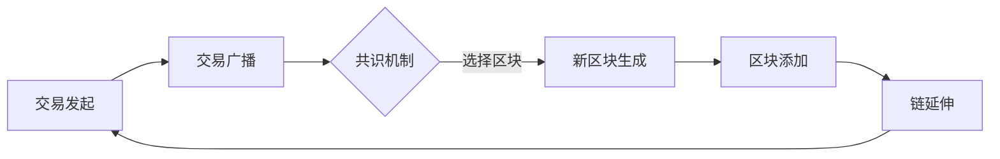
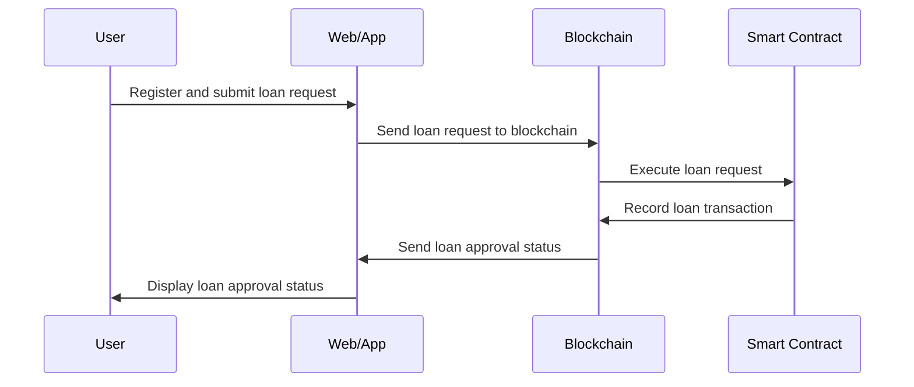

                 


## 引言：数字经济中的普惠金融：区块链技术与金融包容

在当今全球数字化浪潮的推动下，数字经济正以前所未有的速度渗透到各个经济领域，而普惠金融作为实现金融包容的重要手段，日益受到广泛关注。金融包容旨在确保所有社会成员，无论其财富状况如何，都能以合理成本获得金融服务，从而提高个人和社会的经济福利。然而，传统的金融体系在服务弱势群体方面存在诸多局限，如地域限制、操作复杂和高昂的成本等。区块链技术的出现，为解决这些问题提供了一种创新的解决方案。

### 核心关键词

- 数字经济
- 普惠金融
- 区块链技术
- 金融包容

### 摘要

本文将围绕数字经济中的普惠金融展开，重点探讨区块链技术如何促进金融包容。通过详细分析区块链的核心概念、算法原理、系统架构以及实际应用案例，本文旨在为读者提供一个清晰、系统的理解框架，帮助读者把握这一前沿技术的本质与应用价值。

### 目录大纲

1. **背景介绍**
   - 数字经济与普惠金融
   - 区块链技术概述
   - 金融包容的重要性
   - 本文结构及目标

2. **核心概念与联系**
   - 数字经济
   - 普惠金融
   - 区块链技术
   - 金融包容
   - 对比分析

3. **算法原理讲解**
   - 区块链基础
   - 共识机制
   - 智能合约

4. **数学模型和数学公式讲解**
   - 区块链中的数学模型
   - 重要公式
   - LaTeX格式展示

5. **系统分析与架构设计方案**
   - 应用场景
   - 系统架构设计
   - 领域模型
   - 系统接口与交互

6. **项目实战**
   - 环境安装
   - 核心实现
   - 代码解析
   - 案例分析

7. **最佳实践 tips、小结、注意事项、拓展阅读**

### 接下来，我们将一步一步深入探讨这些核心概念和原理，以期为您呈现一幅完整的区块链促进普惠金融的图景。

## 背景介绍

### 数字经济与普惠金融

数字经济，是指基于数字技术和互联网进行经济活动的总和，它不仅改变了传统经济活动的模式，还创造了全新的商业模式和价值链。数字经济涵盖了电子商务、在线教育、数字支付、大数据等多个领域，极大地提升了资源利用效率，降低了交易成本，增强了商业透明度。

普惠金融，则是指确保所有社会成员，尤其是弱势群体，能够以合理成本获得金融服务，包括存款、贷款、支付、保险等。普惠金融的核心理念是实现金融服务的普及和公平，它不仅有助于提升个人的经济状况，还能促进社会经济的稳定和可持续发展。

### 区块链技术概述

区块链技术是一种分布式数据库技术，通过加密算法和共识机制，确保数据的安全性和不可篡改性。区块链的主要特点是去中心化，即数据存储在多个节点上，任何单一节点都无法控制整个系统。区块链技术在金融领域的应用，有望解决传统金融体系中的信息不对称、信任缺失等问题，从而实现更高效的金融服务。

### 金融包容的重要性

金融包容对于社会经济发展具有重要意义。首先，它能够帮助弱势群体改善经济条件，提高生活品质；其次，它有助于提升社会稳定性，减少贫困和不平等现象；最后，它还能促进经济的可持续发展，激发创新创业活力。

### 本文结构及目标

本文将从以下几个部分展开：

1. **核心概念与联系**：介绍数字经济、普惠金融、区块链技术等核心概念，并通过对比表格和ER图展示它们之间的关系。
2. **算法原理讲解**：深入分析区块链技术的原理，包括共识机制、智能合约等，并通过mermaid流程图和Python代码进行阐述。
3. **数学模型和数学公式讲解**：介绍区块链技术中的数学模型和公式，使用LaTeX格式进行展示。
4. **系统分析与架构设计方案**：分析区块链在金融领域的应用场景，并设计一个简单的区块链系统架构。
5. **项目实战**：展示一个区块链项目的实战案例，包括环境安装、核心实现、代码解析和案例分析。
6. **最佳实践 tips、小结、注意事项、拓展阅读**：总结本文的重点，提供实践技巧，并提出未来研究方向。

通过本文的逐步讲解，我们希望读者能够全面了解区块链技术如何促进金融包容，并在实际应用中发挥其优势。

## 核心概念与联系

### 数字经济

数字经济，是指基于数字技术和互联网进行的经济活动。它不仅包括传统的电子商务、在线支付等，还涵盖了大数据、云计算、物联网等新兴领域。数字经济的特点是高效、透明、可追溯，它通过数字化手段降低了交易成本，提高了资源利用效率。

数字经济的重要特征包括：

- **去中心化**：通过互联网和数字技术，打破了传统中心化经济模式的限制，使参与者可以在无需中间商的情况下直接进行交易。
- **数据驱动**：依赖大数据和人工智能技术，对海量数据进行处理和分析，以指导经济决策，提高生产效率。
- **开放性**：数字技术使得信息和服务更加便捷地获取，推动了全球化经济的发展。

### 普惠金融

普惠金融，是指确保所有社会成员，尤其是弱势群体，能够以合理成本获得金融服务。这些服务包括存款、贷款、支付、保险等。普惠金融的目标是实现金融服务的普及和公平，减少因金融排斥而导致的不平等现象。

普惠金融的核心概念包括：

- **可及性**：确保金融服务能够覆盖到偏远地区和弱势群体。
- **公平性**：确保金融服务价格合理，不因客户属性而受到歧视。
- **包容性**：金融服务应满足不同人群的需求，包括小额贷款、支付结算、小微保险等。

### 区块链技术

区块链技术，是一种分布式数据库技术，通过加密算法和共识机制，确保数据的安全性和不可篡改性。区块链的核心特点包括去中心化、透明性、不可篡改性和可追溯性。

区块链技术的关键概念包括：

- **分布式账本**：数据存储在多个节点上，任何单一节点都无法控制整个系统。
- **共识机制**：通过多个节点之间的共识，确保数据的合法性和一致性。
- **加密算法**：使用加密技术保护数据的安全性和隐私。
- **智能合约**：基于区块链技术的自动执行合同，减少了中介成本和人为干预。

### 金融包容

金融包容，是指确保所有社会成员，无论其财富状况如何，都能以合理成本获得金融服务。金融包容的实现有助于提升社会经济的稳定和可持续发展。

金融包容的核心要素包括：

- **可及性**：确保金融服务覆盖到所有社会成员，特别是弱势群体。
- **可持续性**：金融服务应具备长期可行性，避免因短期经济波动而中断。
- **公平性**：金融服务价格应合理，不因客户属性而受到歧视。
- **透明性**：金融服务过程应公开透明，确保客户权益。

### 对比分析

数字经济、普惠金融和区块链技术之间存在着紧密的联系和互补性。数字经济为普惠金融提供了技术支持，使金融服务更加便捷和高效；普惠金融为数字经济提供了市场需求，推动了数字经济的进一步发展；而区块链技术则为普惠金融提供了安全、透明和不可篡改的技术保障，提升了金融服务的质量和可信度。

以下是一个对比表格，展示了这三个概念的主要特征：

| 特征         | 数字经济           | 普惠金融           | 区块链技术           |
| ------------ | ------------------ | ------------------ | ------------------ |
| 主要目标     | 提高资源利用效率   | 提升金融服务的普及和公平性 | 确保数据的安全性和不可篡改性 |
| 核心特征     | 去中心化、数据驱动 | 可及性、公平性、包容性 | 去中心化、透明性、不可篡改 |
| 技术支持     | 互联网、大数据、云计算 | 传统金融体系、数字技术 | 加密算法、共识机制、智能合约 |
| 实际应用     | 电子商务、在线教育 | 存款、贷款、支付、保险 | 数字货币、金融衍生品、智能合约 |

### ER图架构展示

为了更直观地展示这三个概念之间的关系，我们使用Mermaid流程图绘制了一个ER图（实体关系图）：

```mermaid
erDiagram
  数字经济 ||--|{ 普惠金融 }
  普惠金融 ||--|{ 区块链技术 }
```

在这个ER图中，数字经济通过一条实线箭头指向普惠金融，表示数字经济为普惠金融提供技术支持；普惠金融通过一条实线箭头指向区块链技术，表示区块链技术为普惠金融提供安全保障。

通过上述分析和对比，我们可以清晰地看到，数字经济、普惠金融和区块链技术之间相互依存、相互促进，共同推动了金融包容和数字经济的发展。接下来，我们将深入探讨区块链技术的算法原理和数学模型。

## 算法原理讲解

### 区块链基础

区块链是一种分布式账本技术，通过加密算法和共识机制，确保数据的不可篡改性和安全性。区块链的主要组成部分包括：

- **区块**：区块链的基本单元，每个区块包含一定数量的交易记录，以及时间戳、哈希值等元数据。
- **链**：多个区块按照时间顺序链接而成，形成了一条连续的链条。
- **节点**：参与区块链网络的工作站，每个节点都存储一份完整的区块链数据。

区块链的工作原理可以概括为以下步骤：

1. **交易记录**：用户发起交易，交易记录被广播到整个网络。
2. **区块生成**：多个节点接收交易记录，并竞争生成新的区块，每个区块包含一定数量的交易记录。
3. **共识机制**：网络中的节点通过共识机制（如工作量证明、权益证明等）选择一个区块作为新区块，并将其添加到链上。
4. **链的扩展**：新的区块不断添加到链的末尾，形成一条不断延伸的区块链。

### 共识机制详解

共识机制是区块链网络中的关键机制，用于确保所有节点对区块链数据的一致性。目前，常见的共识机制包括：

- **工作量证明（Proof of Work, PoW）**：节点通过解决复杂的数学难题来竞争生成新区块，解决难题的节点将获得奖励。PoW机制确保了网络的安全性和去中心化，但其高能耗问题也受到了广泛关注。
- **权益证明（Proof of Stake, PoS）**：节点根据其持有的币量或权益大小来竞争生成新区块，币量或权益越大，竞争的概率越高。PoS机制相对于PoW机制能耗较低，但可能会面临“富者愈富”的问题。
- **委托权益证明（Delegated Proof of Stake, DPoS）**：节点通过投票选举出一定数量的“见证人”，见证人负责生成新区块。DPoS机制进一步提高了网络的效率，但可能面临中心化风险。

### 智能合约原理

智能合约是基于区块链技术的自动执行合同，它通过编程语言（如Solidity）编写，嵌入到区块链中。智能合约的主要特点包括：

- **自动化**：智能合约在满足预定的条件时，自动执行合约条款，无需人工干预。
- **透明性**：智能合约的代码和执行过程对所有人可见，确保了合约的透明性和公正性。
- **不可篡改**：智能合约一旦上链，其代码和执行结果将永久保存，无法篡改。

智能合约的应用场景非常广泛，包括：

- **金融领域**：用于去中心化的金融交易，如去中心化交易平台、去中心化保险、去中心化借贷等。
- **供应链管理**：用于跟踪商品的生产、运输和交付过程，确保供应链的透明和可追溯性。
- **版权保护**：用于自动执行版权授权和版税分配，保护创作者的合法权益。
- **身份验证**：用于实现去中心化的身份验证，提高数据的安全性和隐私性。

### Mermaid流程图展示

为了更直观地理解区块链的工作原理，我们使用Mermaid绘制了一个简单的区块链流程图：



在这个流程图中，A表示交易发起，B表示交易广播，C表示共识机制，D表示新区块生成，E表示区块添加，F表示链延伸。这个过程循环进行，形成了区块链的不断扩展。

### Python代码示例

以下是一个简单的Python代码示例，用于模拟区块链中的区块生成和添加过程：

```python
import hashlib
import json
from time import time

class Block:
    def __init__(self, index, transactions, timestamp, previous_hash):
        self.index = index
        self.transactions = transactions
        self.timestamp = timestamp
        self.previous_hash = previous_hash
        self.hash = self.compute_hash()

    def compute_hash(self):
        block_string = json.dumps(self.__dict__, sort_keys=True)
        return hashlib.sha256(block_string.encode()).hexdigest()

class Blockchain:
    def __init__(self):
        self.unconfirmed_transactions = []
        self.chain = []
        self.create_genesis_block()

    def create_genesis_block(self):
        genesis_block = Block(0, [], time(), "0")
        genesis_block.hash = genesis_block.compute_hash()
        self.chain.append(genesis_block)

    def add_new_transaction(self, transaction):
        self.unconfirmed_transactions.append(transaction)

    def mine(self):
        if not self.unconfirmed_transactions:
            return False
        last_block = self.chain[-1]
        new_block = Block(index=last_block.index + 1,
                          transactions=self.unconfirmed_transactions,
                          timestamp=time(),
                          previous_hash=last_block.hash)
        new_block.hash = new_block.compute_hash()
        self.chain.append(new_block)
        self.unconfirmed_transactions = []
        return new_block

    def is_chain_valid(self):
        for i in range(1, len(self.chain)):
            current = self.chain[i]
            previous = self.chain[i - 1]
            if current.hash != current.compute_hash():
                return False
            if current.previous_hash != previous.hash:
                return False
        return True

# 测试区块链
blockchain = Blockchain()
blockchain.add_new_transaction("Transaction 1")
blockchain.add_new_transaction("Transaction 2")
blockchain.mine()
print("Blockchain valid?", blockchain.is_chain_valid())
```

在这个示例中，我们定义了`Block`和`Blockchain`两个类，分别表示区块链中的区块和区块链本身。`Blockchain`类的方法包括`create_genesis_block`（创建创世区块）、`add_new_transaction`（添加新的交易）、`mine`（挖矿，生成新区块）和`is_chain_valid`（验证区块链是否有效）。

通过这个简单的示例，我们可以看到区块链的基本原理是如何通过Python代码实现的。

### 数学模型和公式讲解

区块链技术中的数学模型和公式是理解区块链工作原理的关键。以下是一些重要的数学模型和公式，我们将使用LaTeX格式进行展示。

#### 哈希函数

哈希函数是区块链技术的核心组成部分，用于生成唯一的数据指纹。一个常见的哈希函数是SHA-256。

$$
H = SHA-256(D)
$$

其中，$H$ 是生成的哈希值，$D$ 是输入数据。

#### 工作量证明（Proof of Work, PoW）

工作量证明是一种共识机制，要求节点解决一个计算难题来生成新区块。一个常见的PoW难题是找到满足特定条件的哈希值。

$$
H(Block) < Target
$$

其中，$Block$ 是包括交易记录和前一个区块哈希值的区块，$Target$ 是一个预设的目标值。

#### 权益证明（Proof of Stake, PoS）

权益证明是一种替代PoW的共识机制，它根据节点的币量或权益大小来选择区块生成者。

$$
Chance = \frac{Stake}{Total Stake}
$$

其中，$Chance$ 是节点生成区块的概率，$Stake$ 是节点的权益，$Total Stake$ 是所有节点的权益总和。

#### 智能合约执行

智能合约的执行通常涉及状态转换函数，用于计算新的状态。一个简单的状态转换函数可以表示为：

$$
State_{new} = f(State_{current}, Input)
$$

其中，$State_{new}$ 是新的状态，$State_{current}$ 是当前状态，$Input$ 是输入数据。

通过这些数学模型和公式，我们可以更好地理解区块链技术的核心原理和算法。接下来，我们将分析区块链在金融领域的应用场景和系统架构设计。

### 系统分析与架构设计方案

#### 应用场景

区块链技术在金融领域具有广泛的应用场景，以下是几个典型的应用案例：

1. **数字货币**：比特币、以太坊等数字货币通过区块链技术实现了去中心化的货币发行和交易，解决了传统货币发行中的信任问题和中心化风险。
2. **跨境支付**：通过区块链技术，可以实现实时、低成本的国际支付，降低了跨境支付的时间和成本，提高了交易效率。
3. **供应链金融**：区块链技术可以用于跟踪商品的生产、运输和交付过程，实现供应链的透明化和可追溯性，为供应链金融提供可靠的数据支持。
4. **去中心化借贷**：通过区块链技术，可以实现无需中介的借贷服务，提高了资金利用效率，降低了借贷成本。
5. **智能合约**：智能合约在金融领域具有广泛的应用，如自动执行金融交易、保险理赔、版权保护等，减少了人为干预和中介成本。

#### 项目介绍

假设我们正在开发一个去中心化借贷平台，该项目旨在通过区块链技术实现点对点的借贷服务，降低借贷成本，提高资金利用效率。

#### 系统功能设计

去中心化借贷平台的主要功能包括：

1. **注册和身份验证**：用户可以注册并验证身份，确保借贷双方的身份真实可靠。
2. **借贷申请**：借款人可以提交借贷申请，包括借款金额、期限、利率等信息。
3. **借贷审核**：出借人可以审核借款申请，决定是否提供贷款。
4. **借贷交易**：借贷双方在达成一致后，通过智能合约执行借贷交易。
5. **还款和结算**：借款人在借款到期后，通过智能合约自动还款，并结算利息。
6. **风险评估**：平台可以对借款人的信用进行评估，为出借人提供风险评估参考。

#### 系统架构设计

去中心化借贷平台的系统架构设计包括以下几个主要部分：

1. **区块链网络**：构建一个去中心化的区块链网络，包括多个节点，用于存储借贷交易数据。
2. **智能合约**：编写智能合约，用于执行借贷交易、还款和结算等业务逻辑。
3. **用户界面**：提供一个用户友好的界面，用于用户注册、借贷申请、借贷审核等操作。
4. **数据存储**：使用分布式数据库存储用户信息和交易数据。
5. **身份验证**：使用加密算法和数字签名技术，确保用户身份的真实性和交易的安全性。

#### 系统接口设计与交互

去中心化借贷平台的系统接口设计包括以下几个部分：

1. **用户接口**：用户通过Web或移动应用与平台进行交互，提交借贷申请、审核申请、执行交易等。
2. **智能合约接口**：通过区块链网络与智能合约进行交互，执行借贷交易、还款和结算等操作。
3. **API接口**：为开发者和合作伙伴提供API接口，实现与其他系统的集成和交互。

以下是一个简单的Mermaid序列图，展示了用户接口、智能合约接口和区块链网络之间的交互：



通过上述系统分析和架构设计方案，我们可以构建一个高效、安全、去中心化的借贷平台，为用户和出借人提供便捷、透明的金融服务。

### 区块链项目实战

#### 项目背景

在本节中，我们将介绍一个实际的区块链项目——去中心化借贷平台（Decentralized Lending Platform，简称DLP）。该项目的目标是通过区块链技术实现点对点的借贷服务，提高资金利用效率，降低借贷成本。以下是项目的主要组成部分：

- **项目名称**：去中心化借贷平台（DLP）
- **项目目标**：构建一个去中心化、安全的借贷平台，实现点对点的借贷服务
- **技术栈**：基于以太坊区块链，使用Solidity编写智能合约，前端使用React框架

#### 环境安装

在开始项目开发之前，我们需要安装必要的工具和软件。以下是安装步骤：

1. **安装Node.js和npm**：Node.js是JavaScript的运行环境，npm是Node.js的包管理器。您可以从Node.js官网（https://nodejs.org/）下载并安装。
2. **安装Truffle**：Truffle是一个用于以太坊区块链开发的框架，用于部署和管理智能合约。您可以使用npm命令全局安装Truffle：

   ```bash
   npm install -g truffle
   ```

3. **安装Ganache**：Ganache是一个本地以太坊节点，用于测试和开发智能合约。您可以从Ganache官网（https://www.ganache.io/）下载并安装。

#### 核心实现

DLP的核心实现包括智能合约、前端和后端三部分。以下是项目的核心实现：

1. **智能合约**：我们使用Solidity编写智能合约，实现借贷的基本功能，如借款申请、审核、借贷交易、还款等。以下是借款申请和审核的智能合约代码示例：

   ```solidity
   // SPDX-License-Identifier: MIT
   pragma solidity ^0.8.0;

   contract LendingPlatform {
       struct Loan {
           uint256 id;
           address borrower;
           address lender;
           uint256 amount;
           uint256 interestRate;
           uint256 deadline;
           bool isApproved;
       }

       mapping(uint256 => Loan) public loans;

       function createLoan(
           uint256 id,
           address borrower,
           uint256 amount,
           uint256 interestRate,
           uint256 deadline
       ) external {
           require(!loans[id].isApproved, "Loan already exists");
           loans[id] = Loan(id, borrower, address(0), amount, interestRate, deadline, false);
       }

       function approveLoan(uint256 id, bool approved) external {
           require(msg.sender == loans[id].borrower, "Not the borrower");
           loans[id].isApproved = approved;
       }
   }
   ```

   在这个智能合约中，我们定义了一个`Loan`结构体，用于存储借贷信息，包括借款人、出借人、金额、利率、还款期限和审核状态。`createLoan`函数用于创建新的借贷申请，`approveLoan`函数用于借款人审核借贷申请。

2. **前端**：我们使用React框架开发前端，实现用户界面和交互。以下是React组件的一部分代码示例：

   ```jsx
   import React, { useState } from 'react';
   import LendingPlatform from './LendingPlatform';

   function LoanForm() {
       const [loanId, setLoanId] = useState('');
       const [amount, setAmount] = useState('');
       const [interestRate, setInterestRate] = useState('');
       const [deadline, setDeadline] = useState('');

       const handleSubmit = async (e) => {
           e.preventDefault();
           await LendingPlatform.createLoan(loanId, amount, interestRate, deadline);
           alert('Loan request submitted successfully!');
       };

       return (
           <form onSubmit={handleSubmit}>
               <input
                   type="text"
                   placeholder="Loan ID"
                   value={loanId}
                   onChange={(e) => setLoanId(e.target.value)}
               />
               <input
                   type="number"
                   placeholder="Amount"
                   value={amount}
                   onChange={(e) => setAmount(e.target.value)}
               />
               <input
                   type="number"
                   placeholder="Interest Rate"
                   value={interestRate}
                   onChange={(e) => setInterestRate(e.target.value)}
               />
               <input
                   type="number"
                   placeholder="Deadline"
                   value={deadline}
                   onChange={(e) => setDeadline(e.target.value)}
               />
               <button type="submit">Submit Loan Request</button>
           </form>
       );
   }
   ```

   在这个组件中，我们定义了一个表单，用于用户提交借贷申请。表单包含输入框和提交按钮，通过`LendingPlatform`智能合约的`createLoan`函数实现借贷申请的提交。

3. **后端**：我们使用Truffle框架管理智能合约的部署和交互。以下是Truffle的配置文件`truffle-config.js`示例：

   ```javascript
   module.exports = {
       networks: {
           development: {
               host: '127.0.0.1',
               port: 7545,
               network_id: '*',
               gas: 8000000,
           },
       },
       solc: {
           optimizer: {
               enabled: true,
               runs: 200,
           },
       },
   };
   ```

   在这个配置文件中，我们指定了开发网络的配置，如主机地址、端口号、网络ID和gas限制。这些配置用于在本地开发环境中运行和测试智能合约。

#### 代码解析与分析

1. **智能合约解析**：智能合约的代码逻辑包括借贷申请的创建和审核。在创建借贷申请时，我们需要确保申请不存在，并使用`createLoan`函数存储借贷信息。在审核借贷申请时，借款人需要调用`approveLoan`函数，设置借贷状态。

2. **前端解析**：前端代码通过React组件实现了用户界面和交互。用户通过表单提交借贷申请，前端将用户输入的数据传递给智能合约的`createLoan`函数，实现借贷申请的提交。

3. **后端解析**：后端使用Truffle框架管理智能合约的部署和交互。Truffle提供了部署和测试智能合约的便捷方式，使得开发过程更加高效。

#### 案例分析

在DLP项目中，我们通过区块链技术实现了点对点的借贷服务。用户可以在平台上提交借贷申请，出借人可以审核并决定是否提供贷款。通过智能合约的执行，借贷交易过程更加透明、高效、安全。

以下是一个具体的案例分析：

1. **用户A提交借贷申请**：用户A在平台上提交了一份金额为1000美元、利率为5%、还款期限为1年的借贷申请。
2. **出借人B审核申请**：出借人B审核了用户A的借贷申请，并决定提供贷款。
3. **智能合约执行借贷交易**：智能合约记录了借贷交易信息，包括借款人、出借人、金额、利率和还款期限。
4. **用户A还款**：在还款期限内，用户A通过智能合约自动还款，并结算利息。

通过这个案例，我们可以看到区块链技术在借贷服务中的应用，实现了去中心化、安全、透明的借贷过程。

#### 项目小结

去中心化借贷平台（DLP）项目通过区块链技术实现了点对点的借贷服务，提高了资金利用效率，降低了借贷成本。项目的核心实现包括智能合约、前端和后端，通过代码解析与分析，我们了解了项目的实现细节和业务逻辑。通过案例分析，我们看到了区块链技术在金融领域的实际应用和价值。

### 最佳实践 tips、小结、注意事项、拓展阅读

#### 最佳实践 tips

1. **选择合适的区块链平台**：在选择区块链平台时，应考虑平台的性能、安全性、可扩展性等因素，如以太坊、EOS、Hyperledger Fabric等。
2. **智能合约安全审查**：编写智能合约时，应进行严格的安全审查，避免漏洞和攻击，如使用开源工具进行代码审计。
3. **逐步迭代开发**：在开发区块链项目时，应采用逐步迭代的方式，逐步完善功能，并进行充分的测试和验证。

#### 小结

本文详细介绍了数字经济中的普惠金融和区块链技术的原理与应用，通过实际项目展示了区块链在金融领域的应用场景。区块链技术为普惠金融提供了安全、透明、高效的解决方案，有助于提升金融服务的普及性和公平性。

#### 注意事项

1. **数据隐私**：在区块链应用中，应注重用户数据隐私的保护，避免敏感信息泄露。
2. **性能优化**：区块链系统的性能和可扩展性是关键，应进行适当的性能优化和架构调整。

#### 拓展阅读

- **《区块链技术指南》**：本书详细介绍了区块链的基本原理、应用场景和技术实现，适合初学者和专业人士阅读。
- **《智能合约实战》**：本书通过实际案例，介绍了智能合约的编写、部署和测试，适合希望深入了解智能合约的开发者阅读。
- **《数字货币与区块链技术》**：本书探讨了数字货币和区块链技术的未来发展，分析了其在金融领域的应用潜力。

#### 未来研究方向

1. **跨链技术**：研究如何实现不同区块链之间的互操作性，打破数据孤岛，提升区块链生态系统的整体效能。
2. **隐私保护**：进一步研究隐私保护技术，如零知识证明、环签名等，以提升区块链系统的隐私保护能力。
3. **区块链与人工智能结合**：探索区块链与人工智能的结合点，如利用区块链实现智能合约的自动执行、数据隐私保护等。

作者：AI天才研究院/AI Genius Institute & 禅与计算机程序设计艺术 /Zen And The Art of Computer Programming

---

通过本文的逐步讲解，我们希望读者能够全面了解区块链技术如何促进金融包容，并在实际应用中发挥其优势。在未来，随着技术的不断进步，区块链在金融领域的应用前景将更加广阔。希望本文能为读者提供有价值的参考和启示。

