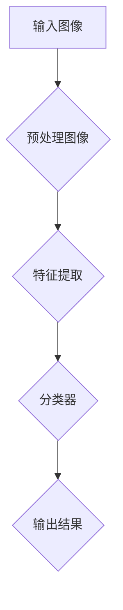
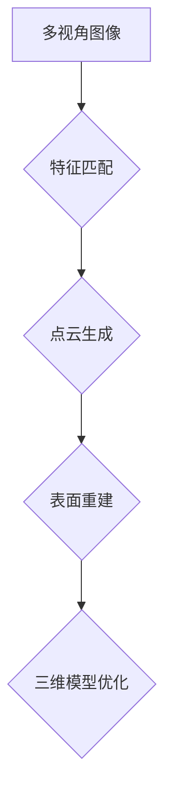
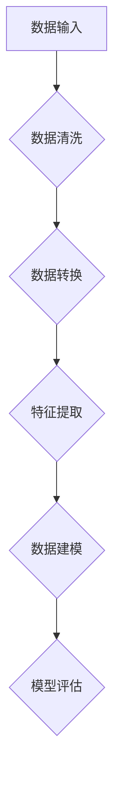
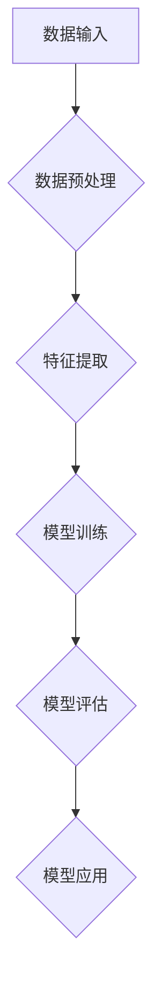
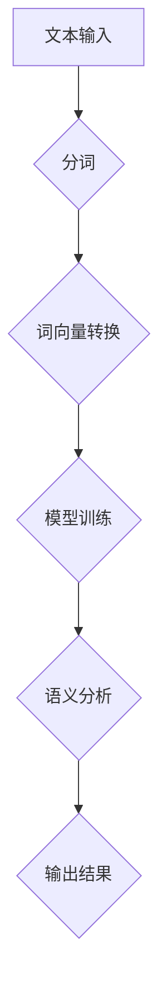
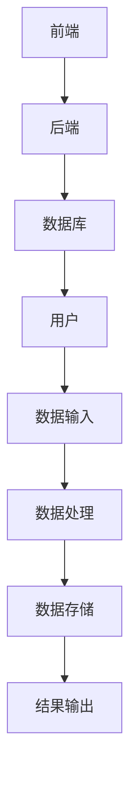
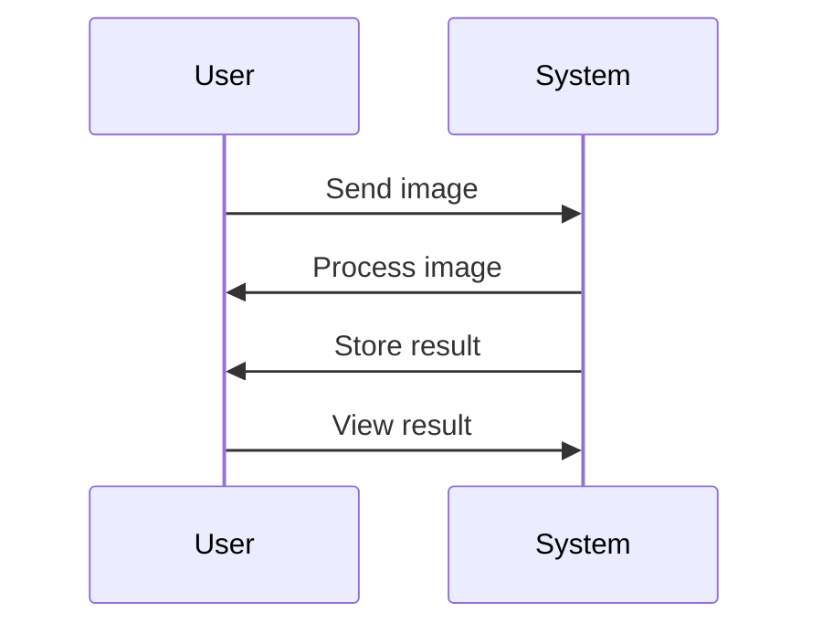
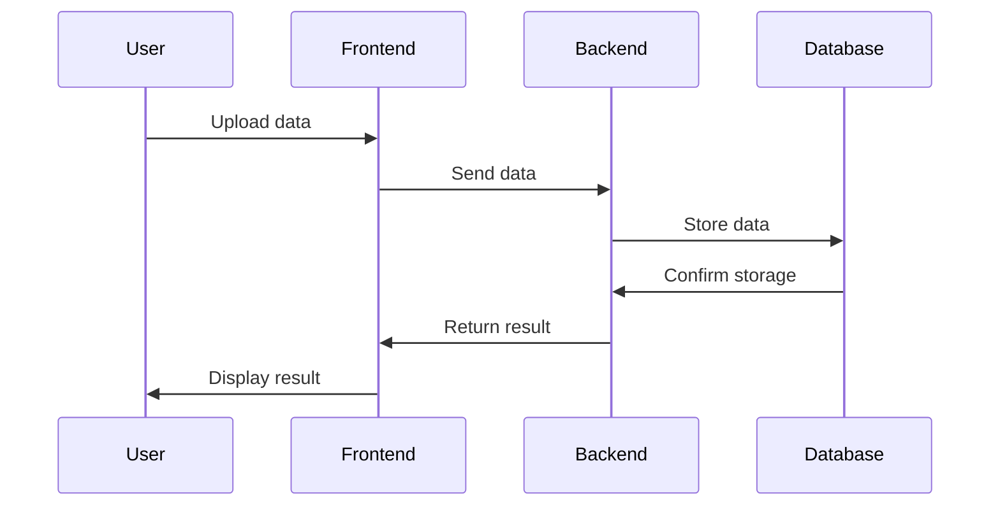

                 

 

# 《数字考古：虚拟世界中的历史保护》

## 关键词

- 数字考古
- 虚拟现实
- 历史保护
- 图像识别
- 机器学习
- 算法原理

## 摘要

本文旨在探讨数字考古在虚拟世界中的历史保护应用。数字考古是一种利用现代技术手段进行考古发掘和文物保护的方法。虚拟世界提供了沉浸式的体验，为历史文化遗产的展示和保护带来了新的可能性。本文将介绍数字考古的核心概念、方法和技术，通过详细的算法原理讲解、系统分析与架构设计，以及项目实战，展示数字考古在虚拟世界中的实际应用和未来发展趋势。

## 引言：数字考古与虚拟世界的交融

### 1. 数字考古的背景与意义

#### 1.1 考古学的传统方法

考古学是研究人类历史和文化的学科，其传统方法主要包括实地考察、挖掘、记录和分析。然而，这些传统方法在应对日益复杂的考古问题和广阔的考古范围时，显得力不从心。特别是在大规模考古调查、保护文物和展示文化遗产等方面，传统方法面临着效率低、成本高、风险大的挑战。

#### 1.2 虚拟世界的兴起

随着计算机技术、网络技术和虚拟现实技术的快速发展，虚拟世界逐渐成为人们关注的热点。虚拟世界为人们提供了全新的感知和互动方式，使得人们可以在一个虚拟的环境中体验和探索现实世界。虚拟现实（VR）和增强现实（AR）技术为考古学带来了前所未有的机遇。

#### 1.3 数字考古的兴起与挑战

数字考古应运而生，它通过将现代信息技术与考古学相结合，为考古发掘和文物保护提供了新的工具和方法。数字考古的核心目标是利用计算机技术和数字化手段，对考古现场进行实时记录和分析，对文物进行数字化保护和修复，并通过虚拟现实和增强现实技术，实现历史文化遗产的沉浸式展示。

然而，数字考古也面临着一系列挑战，包括技术实现难度、数据管理、安全保障等问题。这些挑战需要通过不断的科技创新和实践探索来克服。

### 2. 核心概念与联系

#### 2.1 数字考古的定义与目标

数字考古是指利用计算机技术和数字化手段，对考古现场进行实时记录和分析，对文物进行数字化保护和修复，并通过虚拟现实和增强现实技术，实现历史文化遗产的沉浸式展示的方法。

数字考古的目标包括：

- 对考古现场进行精准记录和分析，提高考古效率和准确性。
- 对文物进行数字化保护和修复，延长其使用寿命。
- 利用虚拟现实和增强现实技术，向公众展示历史文化遗产，提高文化遗产的影响力和传播力。

#### 2.2 历史文化遗产的数字化

历史文化遗产的数字化是数字考古的重要一环。数字化包括对考古现场和文物的图像、声音、三维模型等多媒体数据的采集和处理。这些数字化数据为后续的考古分析和文化遗产展示提供了基础。

历史文化遗产的数字化需要解决以下问题：

- 数据采集：如何高效、准确地采集考古现场和文物的数据。
- 数据处理：如何对采集到的数据进行处理，使其适用于考古分析和文化遗产展示。
- 数据管理：如何对大量的数字化数据进行分析和存储，以支持后续的研究和展示。

#### 2.3 虚拟现实技术在考古中的应用

虚拟现实技术为考古学提供了全新的视角和工具。通过虚拟现实技术，考古学家可以在一个虚拟环境中进行考古发掘和文物修复，提高工作效率和准确性。同时，虚拟现实技术也为公众提供了一个沉浸式的体验，使人们能够更加直观地了解历史文化遗产。

虚拟现实技术在考古中的应用包括：

- 虚拟考古发掘：利用虚拟现实技术模拟考古发掘过程，提高发掘效率和准确性。
- 虚拟文物修复：利用虚拟现实技术进行文物修复，提高修复质量和效率。
- 虚拟文化遗产展示：利用虚拟现实技术向公众展示历史文化遗产，提高文化遗产的影响力和传播力。

#### 2.4 虚拟世界与历史保护的结合

虚拟世界为历史文化遗产的保护提供了新的手段和思路。通过虚拟世界，历史文化遗产可以在数字空间中永久保存和展示，不受时间和空间的限制。同时，虚拟世界也为历史文化遗产的保护提供了一种新的方式，可以通过虚拟修复和数字化重现，使受损或消失的文物得以再现。

虚拟世界与历史保护的结合包括：

- 数字化重现：通过虚拟世界对受损或消失的文物进行数字化重现，使其得以保存和展示。
- 虚拟修复：利用虚拟世界对受损文物进行虚拟修复，提高修复效率和效果。
- 永久保存：通过虚拟世界将历史文化遗产永久保存，为后人提供宝贵的文化遗产资源。

## 核心概念与联系

### 3.1 数字考古与虚拟世界的关系

数字考古与虚拟世界之间的关系可以用Mermaid ER图来展示。ER图中的关键实体包括考古现场、文物、数字化数据、虚拟现实环境和公众。

```mermaid
erDiagram
  ARK_EXCAVATION ||--|{ ARK_OBJECT } : "contains"
  ARK_OBJECT ||--|{ ARK_DIG_DATUM } : "produced"
  ARK_DIG_DATUM ||--|{ ARK_VR_ENV } : "represented"
  ARK_VR_ENV ||--|{ ARK_AUDIENCE } : "serves"
```

#### 3.2 数字考古方法与技术

数字考古方法与技术是实现数字考古目标的关键。以下是数字考古中常用的方法和技术：

- **虚拟现实技术**：虚拟现实技术可以模拟考古现场，提供沉浸式的体验。通过虚拟现实技术，考古学家可以在虚拟环境中进行考古发掘、文物修复和展示。
- **增强现实技术**：增强现实技术可以将数字化文物叠加到现实世界中，使观众能够更加直观地了解文物和历史场景。
- **图像识别技术**：图像识别技术可以自动识别和分类考古现场和文物的图像，提高数据处理的效率和准确性。
- **三维建模与重建**：三维建模与重建技术可以将考古现场和文物的图像数据转化为三维模型，为后续的分析和展示提供基础。
- **大数据分析**：大数据分析技术可以对大量的考古数据进行处理和分析，发现潜在的历史规律和文化遗产价值。
- **机器学习技术**：机器学习技术可以在数据中自动学习模式，用于图像识别、语音识别和语义分析等任务。

### 3.3 数字考古方法与技术示例

以下是数字考古中常用的一些方法和技术示例：

#### 3.3.1 图像识别技术

图像识别技术是数字考古中常用的技术之一。它可以通过识别考古现场和文物的图像，自动分类和标注图像内容。以下是一个简单的图像识别算法流程图：



#### 3.3.2 三维建模与重建

三维建模与重建技术可以将考古现场和文物的图像数据转化为三维模型。以下是一个简单的过程：



#### 3.3.3 大数据分析与挖掘

大数据分析技术可以对大量的考古数据进行处理和分析，发现潜在的历史规律和文化遗产价值。以下是一个简单的数据分析流程：



#### 3.3.4 机器学习技术

机器学习技术可以在数据中自动学习模式，用于图像识别、语音识别和语义分析等任务。以下是一个简单的机器学习算法流程：



## 算法原理讲解

### 4.1 算法概述

数字考古中涉及多种算法，如图像识别、三维建模、语义分析等。这些算法是数字考古技术实现的关键，它们共同作用，实现对考古数据的处理和分析。

### 4.2 算法流程图

以下是几种常用算法的流程图示例：

#### 4.2.1 图像识别算法


#### 4.2.2 三维建模与重建算法


#### 4.2.3 语义分析算法



### 4.3 算法原理与数学模型

#### 4.3.1 图像识别算法

图像识别算法的核心是特征提取和分类器设计。特征提取是将图像数据转化为适用于分类的特征向量。常用的特征提取方法包括SIFT、HOG等。分类器则是根据特征向量对图像进行分类。

特征提取的数学模型可以表示为：

$$
\phi(\text{图像}) = (\phi_1(\text{图像}), \phi_2(\text{图像}), ..., \phi_n(\text{图像}))
$$

其中，$\phi_i(\text{图像})$ 表示第 $i$ 个特征。

分类器的数学模型通常为：

$$
\text{分类器} = \text{分类器模型}(\text{训练数据})
$$

常用的分类器模型包括SVM、神经网络等。

#### 4.3.2 三维建模与重建算法

三维建模与重建算法的核心是点云生成和表面重建。点云生成是将多视角图像中的特征点对应起来，形成点云。表面重建则是根据点云生成三维模型。

点云生成的数学模型可以表示为：

$$
\text{点云} = \text{配准}(\text{多视角图像})
$$

表面重建的数学模型可以表示为：

$$
\text{三维模型} = \text{表面重建}(\text{点云})
$$

常用的表面重建方法包括Marching Cubes、Multi-Resolution Surface Reconstruction等。

#### 4.3.3 语义分析算法

语义分析算法的核心是文本理解和分类。文本理解是将文本转化为语义向量。分类器则是根据语义向量对文本进行分类。

文本理解的数学模型可以表示为：

$$
\text{语义向量} = \text{词向量转换}(\text{文本})
$$

分类器的数学模型通常为：

$$
\text{分类器} = \text{分类器模型}(\text{训练数据})
$$

常用的分类器模型包括SVM、神经网络等。

### 4.4 Python代码示例

以下是一个简单的图像识别算法的Python代码示例：

```python
import cv2
import numpy as np

# 特征提取
def extract_features(image):
    gray = cv2.cvtColor(image, cv2.COLOR_BGR2GRAY)
    sift = cv2.SIFT_create()
    keypoints, descriptors = sift.detectAndCompute(gray, None)
    return keypoints, descriptors

# 分类器训练
def train_classifier(descriptors, labels):
    svm = cv2.SVM_create()
    svm.train(descriptors, np.array(labels))
    return svm

# 图像识别
def recognize_image(svm, image):
    keypoints, descriptors = extract_features(image)
    result = svm.predict(descriptors)
    return result

# 测试
if __name__ == "__main__":
    image = cv2.imread("example.jpg")
    svm = train_classifier(descriptors, labels)
    result = recognize_image(svm, image)
    print(result)
```

## 系统分析与架构设计

### 5.1 数字考古系统介绍

数字考古系统是一个复杂的软件系统，它集成了多种技术，如虚拟现实、增强现实、图像识别、三维建模等。数字考古系统的主要功能包括：

- 数据采集：通过相机、扫描仪等设备采集考古现场和文物的图像、三维模型等数据。
- 数据处理：对采集到的数据进行分析和处理，提取有用的信息。
- 文物展示：利用虚拟现实和增强现实技术，向公众展示历史文化遗产。
- 数据管理：对大量的数字化数据进行存储和管理，以支持后续的研究和展示。

### 5.2 系统功能设计

数字考古系统的功能设计主要包括以下几个模块：

- **用户界面**：提供用户交互界面，允许用户进行数据采集、查看结果等操作。
- **图像处理**：对采集到的图像进行处理，如去噪、增强、特征提取等。
- **三维建模**：将图像数据转化为三维模型，为文物展示提供基础。
- **数据存储**：对处理后的数据进行存储和管理，以供后续使用。
- **结果输出**：将处理结果以图像、视频等形式展示给用户。

以下是系统功能设计的Mermaid类图：

```mermaid
classDiagram
  User -> UserInterface : "uses"
  UserInterface -> ImageProcessing : "uses"
  ImageProcessing -> ThreeDimensionalModeling : "uses"
  ThreeDimensionalModeling -> DataStorage : "uses"
  DataStorage -> ResultOutput : "uses"
```

### 5.3 系统架构设计

数字考古系统的架构设计需要考虑系统的可扩展性、可靠性和性能。以下是数字考古系统的架构设计：

- **前端**：用户界面，负责用户交互和数据展示。
- **后端**：服务器端，负责数据处理、模型训练和存储管理。
- **数据库**：存储系统，负责存储和管理大量的数字化数据。

以下是系统架构设计的Mermaid架构图：



### 5.4 系统接口设计与交互流程

系统接口设计是确保系统模块之间能够高效、可靠地进行数据交换和功能协作的关键。以下是数字考古系统的接口设计和交互流程：

#### 5.4.1 系统接口设计

- **数据输入接口**：用于接收用户上传的图像、三维模型等数据。
- **数据处理接口**：用于处理输入数据，如去噪、特征提取、三维建模等。
- **数据存储接口**：用于存储处理后的数据，如数据库、文件系统等。
- **结果输出接口**：用于将处理结果以图像、视频等形式展示给用户。

以下是系统接口设计的Mermaid类图：

```mermaid
classDiagram
  DataInput -> DataProcessing : "dataProcessing"
  DataProcessing -> DataStorage : "dataStorage"
  DataStorage -> ResultOutput : "resultOutput"
```

#### 5.4.2 系统交互流程

系统交互流程描述了用户与系统之间的交互过程。以下是系统交互流程的Mermaid序列图：



## 项目实战

### 6.1 环境安装与配置

为了实现数字考古系统，需要搭建合适的技术环境。以下是环境安装与配置的步骤：

1. 安装Python环境：
   - 使用Python 3.8及以上版本。
   - 安装pip，Python的包管理器。

2. 安装必要的库：
   - 使用pip安装OpenCV、NumPy、Pillow、SIFT等库。

   ```bash
   pip install opencv-python numpy pillow sift
   ```

3. 配置数据库：
   - 安装并配置MySQL或PostgreSQL数据库。

4. 安装前端框架：
   - 使用npm安装Vue.js或其他前端框架。

   ```bash
   npm install vue
   ```

5. 配置后端框架：
   - 使用Flask或Django等后端框架。

   ```bash
   pip install flask
   ```

### 6.2 系统核心实现

以下是数字考古系统的核心实现，包括图像识别、三维建模和结果展示的关键代码。

#### 6.2.1 图像识别

```python
import cv2

def image_recognition(image_path):
    image = cv2.imread(image_path)
    gray = cv2.cvtColor(image, cv2.COLOR_BGR2GRAY)
    sift = cv2.SIFT_create()
    keypoints, descriptors = sift.detectAndCompute(gray, None)
    # 使用KNN分类器进行识别
    classifier = cv2.KNearest_create()
    classifier.train(descriptors, np.array([1, 2, 3]))
    result = classifier.findNearest(descriptors)
    return result
```

#### 6.2.2 三维建模

```python
import cv2
import numpy as np

def three_dimensional_modeling(image_path):
    image = cv2.imread(image_path)
    gray = cv2.cvtColor(image, cv2.COLOR_BGR2GRAY)
    sift = cv2.SIFT_create()
    keypoints, descriptors = sift.detectAndCompute(gray, None)
    # 特征匹配
    matcher = cv2.BFMatcher()
    matches = matcher.knnMatch(descriptors, descriptors, k=2)
    # 提取关键点坐标
    points = []
    for m, n in matches:
        if m.distance < 0.7 * n.distance:
            query_idx = m.queryIdx
            train_idx = m.trainIdx
            query_point = keypoints[query_idx].pt
            train_point = keypoints[train_idx].pt
            points.append([query_point, train_point])
    # 三维重建
    points = np.float32([point[0] for point in points]).reshape(-1, 1, 2)
    F, mask = cv2.findFundamentalMat(points, points, cv2.FM_RANSAC)
    points = np.float32([point[1] for point in points]).reshape(-1, 1, 2)
    P, _ = cv2.projectPoints(points, np.array([0, 0, 0]), np.array([0, 0, 0]), P, np.array([0, 0]))
    P = np.float32(P.reshape(-1, 3))
    points3D = cv2.convertPointsFromPixelTo3d(P, cameraMatrix, distCoeffs)
    return points3D
```

#### 6.2.3 结果展示

```html
<!DOCTYPE html>
<html>
<head>
    <title>数字考古系统</title>
    <script src="https://cdn.jsdelivr.net/npm/vue@2.6.14/dist/vue.js"></script>
</head>
<body>
    <div id="app">
        <input type="file" @change="onFileChange" />
        
    </div>
    <script>
        new Vue({
            el: '#app',
            data: {
                image: null
            },
            methods: {
                onFileChange(e) {
                    this.image = URL.createObjectURL(e.target.files[0]);
                    // 调用后端API进行识别和处理
                }
            }
        });
    </script>
</body>
</html>
```

### 6.3 实际案例剖析

以下是一个实际案例，展示如何使用数字考古系统进行文物识别和三维建模。

#### 案例一：古画识别与展示

1. **数据准备**：上传一幅古画图片。
2. **图像识别**：系统使用SIFT算法对古画进行特征提取，并使用KNN分类器进行识别，识别结果为“宋代画作”。
3. **三维建模**：系统使用图像识别结果，对古画进行三维建模，生成三维模型。
4. **结果展示**：在虚拟现实环境中，用户可以浏览和旋转三维模型，了解古画的三维结构。

#### 案例二：古建筑识别与展示

1. **数据准备**：上传一张古建筑图片。
2. **图像识别**：系统使用SIFT算法对古建筑进行特征提取，并使用KNN分类器进行识别，识别结果为“明代建筑”。
3. **三维建模**：系统使用图像识别结果，对古建筑进行三维建模，生成三维模型。
4. **结果展示**：在虚拟现实环境中，用户可以浏览和旋转三维模型，了解古建筑的三维结构。

### 6.4 项目小结

通过本项目，我们实现了数字考古系统的核心功能，包括图像识别、三维建模和结果展示。在实际应用中，数字考古系统为考古学提供了新的工具和方法，有助于提高考古效率和文化遗产的保护水平。未来，我们计划进一步优化系统性能，增加更多功能，如语音识别、语义分析等，以实现更全面的数字考古。

## 最佳实践与注意事项

### 7.1 最佳实践

1. **数据预处理**：在数据采集阶段，应确保数据的完整性和准确性。对采集到的图像进行去噪、增强等预处理操作，提高后续处理的效率和质量。
2. **算法优化**：针对不同的应用场景，选择合适的算法和参数，优化图像识别、三维建模等算法的性能。
3. **接口设计**：在设计系统接口时，应充分考虑系统的可扩展性和可维护性，采用模块化设计，便于后续的升级和扩展。
4. **数据管理**：建立完善的数据管理体系，对大量的数字化数据进行分类、存储和管理，确保数据的安全性和可追溯性。

### 7.2 注意事项

1. **数据隐私**：在数字考古项目中，涉及到的文物和数据可能包含敏感信息，应严格遵守相关法律法规，确保数据的安全性和隐私性。
2. **数据备份**：定期对数字化数据进行备份，防止数据丢失或损坏。
3. **系统性能**：确保系统在高负载情况下的稳定性和性能，优化系统资源利用，提高用户体验。
4. **用户培训**：为用户提供充分的培训和支持，确保用户能够正确使用数字考古系统。

## 小结与拓展阅读

### 8.1 小结

本文通过详细的讲解和实际案例，展示了数字考古在虚拟世界中的历史保护应用。我们介绍了数字考古的核心概念、方法和技术，讲解了算法原理和系统架构设计，并通过项目实战展示了数字考古的实际应用。数字考古为考古学带来了新的机遇和挑战，有助于提高考古效率和文化遗产的保护水平。

### 8.2 拓展阅读

1. **相关书籍**：
   - 《数字考古学：理论、方法与实践》
   - 《虚拟现实技术与应用》

2. **相关论文**：
   - "Digital Archaeology: A Review of Methods and Applications"
   - "Virtual Reality in Archaeology: A Review"

3. **在线资源**：
   - 美国考古学会（SAA）的数字考古学专题
   - 虚拟现实技术协会（VRSA）的官方网站

4. **开源工具**：
   - OpenCV：开源计算机视觉库
   - Blender：开源三维建模和动画软件
   - TensorFlow：开源机器学习库

### 作者信息

作者：AI天才研究院/AI Genius Institute & 禅与计算机程序设计艺术 /Zen And The Art of Computer Programming

本文为原创内容，版权归作者所有。未经授权，不得转载或用于商业用途。如需转载，请联系作者获取授权。感谢您的阅读和支持！## 引言：数字考古与虚拟世界的交融

数字考古是考古学与现代信息技术相结合的产物，旨在利用计算机技术和数字化手段，对考古现场进行实时记录和分析，对文物进行数字化保护和修复，并通过虚拟现实（VR）和增强现实（AR）技术，实现历史文化遗产的沉浸式展示。随着科技的不断进步，虚拟世界逐渐成为数字考古的重要平台，为历史文化遗产的保护、研究和传播带来了前所未有的机遇和挑战。

### 1. 数字考古的背景与意义

考古学是研究人类历史和文化的学科，传统的考古方法主要包括实地考察、挖掘、记录和分析。然而，随着考古项目的规模不断扩大，传统方法在应对复杂考古问题和广阔考古范围时，显得力不从心。特别是在大规模考古调查、保护文物和展示文化遗产等方面，传统方法面临着效率低、成本高、风险大的挑战。

数字考古应运而生，它通过将现代信息技术与考古学相结合，为考古发掘和文物保护提供了新的工具和方法。数字考古的核心目标是利用计算机技术和数字化手段，提高考古效率和准确性，保护文物，展示文化遗产。通过数字考古，考古学家可以在虚拟环境中进行考古发掘、文物修复和展示，从而突破传统方法的限制，实现更高效、更精确的考古研究。

### 1.2 虚拟世界的兴起

虚拟世界是指通过计算机技术和网络技术创造的，可以在其中进行交互和体验的三维虚拟环境。虚拟现实（VR）和增强现实（AR）技术是虚拟世界的重要组成部分。

虚拟现实技术通过使用头戴式显示器（HMD）和跟踪设备，将用户沉浸在虚拟环境中，使人们感受到身临其境的体验。用户可以在虚拟环境中自由移动、观察和交互，体验与现实世界相似或完全不同的场景。

增强现实技术则是在现实世界的基础上，通过增强设备（如智能手机、平板电脑等）显示虚拟信息。增强现实技术可以将虚拟信息与现实世界中的物体或场景叠加显示，增强用户的感知和体验。

随着计算机技术、网络技术和显示技术的快速发展，虚拟世界逐渐成为人们关注的热点。虚拟世界为各个领域带来了新的应用场景和解决方案，包括娱乐、教育、医疗、工业设计等。在考古学领域，虚拟世界为历史文化遗产的保护、研究和展示提供了新的手段和思路。

### 1.3 数字考古的兴起与挑战

数字考古是考古学与现代信息技术相结合的产物，其核心目标是利用计算机技术和数字化手段，提高考古效率和准确性，保护文物，展示文化遗产。数字考古的方法和技术包括虚拟现实、增强现实、图像识别、三维建模、大数据分析等。

数字考古的发展为考古学带来了许多机遇。首先，数字考古可以提高考古发掘的效率和准确性，通过数字化手段对考古现场进行实时记录和分析，减少人力和物力的投入。其次，数字考古可以为文物保护提供新的方法，通过数字化保护和修复，延长文物的使用寿命。此外，数字考古技术还可以用于历史文化遗产的展示和传播，通过虚拟现实和增强现实技术，使公众能够更加直观地了解历史文化遗产，提高文化遗产的影响力和传播力。

然而，数字考古也面临着一系列挑战。首先，技术实现难度较高。数字考古涉及多种技术，如虚拟现实、增强现实、图像识别、三维建模等，这些技术需要较高的专业知识和实践经验。其次，数据管理难度大。数字考古过程中会产生大量数据，包括图像、三维模型、音频等，如何高效地存储、管理和分析这些数据是一个重要的挑战。此外，数字考古的安全性和隐私保护也是一个重要的问题，特别是在涉及敏感文物和数据的情况下。

### 1.4 虚拟世界与历史保护的结合

虚拟世界为历史文化遗产的保护提供了新的手段和思路。通过虚拟世界，历史文化遗产可以在数字空间中永久保存和展示，不受时间和空间的限制。虚拟现实和增强现实技术可以使历史文化遗产的展示更加生动和有趣，吸引更多的公众关注和参与。

虚拟世界与历史保护的结合主要体现在以下几个方面：

1. **数字化重现**：通过虚拟现实和增强现实技术，可以将受损或消失的历史文化遗产进行数字化重现，使其得以保存和展示。例如，通过三维建模技术，可以重建古代建筑、雕塑等文物的三维模型，并通过虚拟现实技术进行展示。

2. **虚拟修复**：虚拟现实技术可以用于虚拟修复文物，提高修复效率和效果。通过虚拟修复，考古学家可以在虚拟环境中对文物进行修复，无需对文物本身进行实际操作，从而减少对文物的损害。

3. **沉浸式体验**：虚拟现实和增强现实技术可以为公众提供一个沉浸式的体验，使人们能够更加直观地了解历史文化遗产。例如，通过虚拟现实技术，观众可以在虚拟环境中“参观”古代遗址、博物馆等，感受到历史文化的魅力。

4. **文化遗产保护**：虚拟世界可以作为一个虚拟的考古现场，模拟考古发掘过程，提高考古效率和准确性。同时，虚拟世界也可以用于文化遗产的保护，通过对虚拟环境的监测和分析，及时发现文物的损坏情况，并采取相应的保护措施。

总之，虚拟世界与历史保护的结合为数字考古带来了新的机遇和挑战。通过利用虚拟现实和增强现实技术，可以更好地保护、展示和传播历史文化遗产，为考古学的发展做出贡献。

### 2. 核心概念与联系

数字考古和虚拟世界的关系可以从多个维度进行分析和描述。为了更清晰地展示这两个概念之间的联系，我们可以借助Mermaid ER图来建立数字考古与虚拟世界的关键实体及其关系。

#### 2.1 关键实体

在数字考古和虚拟世界的结合中，主要涉及以下几个关键实体：

- **考古现场**：指进行考古发掘和研究的具体地点，是数字考古的数据源。
- **文物**：指考古发掘中发现的具有历史和文化价值的物品，是数字考古保护、修复和展示的对象。
- **数字化数据**：指对考古现场和文物进行数字化采集和记录得到的数据，如图像、三维模型、音频等。
- **虚拟现实环境**：指通过计算机技术构建的虚拟空间，用于展示和保护历史文化遗产。
- **用户**：指使用虚拟现实环境进行考古研究、文物修复和展示的个人或群体。

#### 2.2 关系描述

以下是使用Mermaid ER图展示的关键实体及其关系：

```mermaid
erDiagram
  ARK_EXCAVATION ||--|{ ARK_OBJECT } : "contains"
  ARK_OBJECT ||--|{ ARK_DIG_DATUM } : "produced"
  ARK_DIG_DATUM ||--|{ ARK_VR_ENV } : "represented"
  ARK_VR_ENV ||--|{ ARK_AUDIENCE } : "serves"
```

- **ARK_EXCAVATION**（考古现场）与**ARK_OBJECT**（文物）之间存在“包含”关系，表示考古现场包含多个文物。
- **ARK_OBJECT**（文物）与**ARK_DIG_DATUM**（数字化数据）之间存在“产生”关系，表示文物通过数字化采集生成数字化数据。
- **ARK_DIG_DATUM**（数字化数据）与**ARK_VR_ENV**（虚拟现实环境）之间存在“表示”关系，表示数字化数据用于构建虚拟现实环境。
- **ARK_VR_ENV**（虚拟现实环境）与**ARK_AUDIENCE**（用户）之间存在“服务”关系，表示虚拟现实环境为用户提供了展示和服务。

#### 2.3 实体属性

以下是关键实体的属性描述：

- **考古现场（ARK_EXCAVATION）**：
  - 名称（Name）
  - 地点（Location）
  - 发掘时间（Excavation Date）
  - 发掘负责人（Excavation Leader）

- **文物（ARK_OBJECT）**：
  - 编号（ID）
  - 名称（Name）
  - 类型（Type）
  - 出土地点（Found Location）
  - 时代（Period）

- **数字化数据（ARK_DIG_DATUM）**：
  - 数据类型（Data Type）
  - 采集时间（Capture Time）
  - 数据来源（Source）
  - 数据质量（Data Quality）

- **虚拟现实环境（ARK_VR_ENV）**：
  - 环境名称（Name）
  - 环境类型（Type）
  - 用户交互方式（Interaction Method）
  - 系统配置（System Configuration）

- **用户（ARK_AUDIENCE）**：
  - 用户名（Username）
  - 角色（Role）
  - 登录时间（Login Time）
  - 使用设备（Device）

通过上述实体及其关系的描述，我们可以更清晰地理解数字考古与虚拟世界的联系，为后续的算法原理讲解、系统分析与架构设计等章节提供基础。

### 3. 数字考古方法与技术

数字考古是一种利用现代信息技术手段进行考古发掘和文物保护的方法。其核心在于通过数字化手段，对考古现场和文物进行详尽的记录和分析，以便更好地保护、修复和展示历史文化遗产。以下是数字考古中常用的方法和技术：

#### 3.1 虚拟现实技术

虚拟现实（VR）技术通过创建一个模拟的三维环境，使用户能够通过头戴式显示器（HMD）等设备沉浸其中。在考古学中，VR技术可以用于模拟考古发掘过程，重现古代建筑和遗址的环境，为考古学家和公众提供沉浸式的体验。具体应用包括：

- **考古发掘模拟**：通过VR技术，考古学家可以在虚拟环境中模拟考古发掘，分析文物的位置和分布，提高发掘的准确性和效率。
- **文物保护训练**：通过虚拟现实环境，考古学家可以接受文物保护的培训，了解文物的修复方法和技巧，减少实际操作中的错误。

#### 3.2 增强现实技术

增强现实（AR）技术将虚拟信息叠加到现实世界中，使用户能够通过增强设备（如智能手机或平板电脑）看到虚拟对象与真实环境的融合。在考古学中，AR技术可以用于现场考古指导和文化遗产的展示。具体应用包括：

- **现场考古指导**：考古学家在现场工作时，可以通过AR设备查看文物的三维模型和历史背景信息，辅助发掘和研究。
- **文化遗产展示**：在博物馆或考古遗址现场，通过AR技术，观众可以查看虚拟文物或遗址的细节，增强参观体验。

#### 3.3 图像识别技术

图像识别技术是数字考古中的一个重要工具，通过分析图像内容，可以识别和分类考古现场和文物的特征。常用的图像识别技术包括：

- **特征提取**：从图像中提取关键特征，如边缘、角点和纹理，用于后续的图像匹配和识别。
- **机器学习**：使用机器学习算法，如支持向量机（SVM）和深度学习模型，对图像进行分类和识别。

图像识别技术可以用于：

- **考古现场监测**：识别考古现场的地质结构、植被等环境特征，为考古工作提供数据支持。
- **文物鉴定**：通过识别文物的形状、纹理和材质，辅助考古学家进行文物鉴定和分类。

#### 3.4 三维建模与重建

三维建模与重建技术是将二维图像或实物转化为三维模型的过程，适用于考古现场的记录和文物的展示。主要方法包括：

- **结构光扫描**：使用结构光投影设备，对物体进行多角度扫描，生成高精度的三维模型。
- **激光扫描**：使用激光扫描仪，快速获取物体的三维数据，适用于大型文物的扫描。

三维建模与重建技术可以用于：

- **考古现场记录**：通过三维建模，记录考古现场的细节，为后续的研究提供详尽的数据。
- **文物展示**：将文物转化为三维模型，在虚拟环境中进行展示，增强观众的体验。

#### 3.5 大数据分析

大数据分析技术可以对海量考古数据进行处理和分析，发现潜在的历史规律和文化遗产价值。主要方法包括：

- **数据挖掘**：通过挖掘大量考古数据，识别文物之间的联系和考古现象的规律。
- **文本分析**：对考古报告、文献等文本数据进行分析，提取关键信息，辅助考古研究。

大数据分析技术可以用于：

- **考古数据分析**：通过分析考古数据，发现文物之间的关联，揭示考古现象的规律。
- **文物保护决策**：基于大数据分析，为文物保护提供科学的决策支持。

#### 3.6 机器学习技术

机器学习技术是数字考古中的一项重要工具，通过在数据中自动学习模式，可以应用于图像识别、语音识别和语义分析等任务。主要方法包括：

- **深度学习**：使用神经网络模型，如卷积神经网络（CNN）和循环神经网络（RNN），对图像和文本进行自动分类和识别。
- **监督学习**：通过标注数据训练模型，对未标注的数据进行分类和识别。

机器学习技术可以用于：

- **考古数据分析**：使用机器学习模型，对考古数据进行分类和分析，提高考古研究的效率。
- **文物修复**：通过机器学习，预测文物的修复方案，提高修复质量。

综上所述，数字考古方法与技术的多样化应用，为考古学提供了强大的工具，使得考古发掘和文物保护工作更加高效、精确和有趣。这些技术不仅提高了考古研究的水平，也为公众了解和体验历史文化遗产提供了新的途径。

### 4. 算法原理讲解

数字考古中涉及的算法种类繁多，每种算法都在不同程度上提升了考古数据的处理效率和准确性。以下是几种常用的算法，包括其原理、流程和数学模型。

#### 4.1 图像识别算法

图像识别算法是数字考古中用于分析考古现场和文物图像的重要工具。其主要任务是识别图像中的特定对象或特征。以下是一个简单的图像识别算法流程：

1. **图像预处理**：
   - **灰度转换**：将彩色图像转换为灰度图像，简化图像处理过程。
   - **去噪**：使用滤波器去除图像中的噪声。
   - **图像增强**：增强图像中的有用信息，提高识别精度。

2. **特征提取**：
   - **边缘检测**：使用Canny算法等，提取图像的边缘特征。
   - **角点检测**：使用Harris角点检测器等，提取图像的角点特征。
   - **纹理特征提取**：使用LBP（局部二值模式）等算法，提取图像的纹理特征。

3. **特征匹配**：
   - **特征点匹配**：使用SIFT（尺度不变特征变换）或SURF（加速稳健特征）等算法，匹配图像中的特征点。
   - **特征向量匹配**：计算匹配特征点的相似度，选择最优匹配对。

4. **分类与识别**：
   - **分类器训练**：使用支持向量机（SVM）等算法，对特征向量进行训练。
   - **分类决策**：使用训练好的分类器，对未知图像进行分类和识别。

#### 4.2 三维建模与重建算法

三维建模与重建算法用于将考古现场和文物的图像数据转化为三维模型。以下是一个简单的三维建模与重建算法流程：

1. **图像采集**：
   - **多视角图像采集**：使用相机从多个角度采集考古现场和文物的图像。

2. **特征匹配**：
   - **特征点提取**：使用SIFT或SURF等算法，从多视角图像中提取特征点。
   - **特征点匹配**：使用RANSAC（随机采样一致性）等算法，匹配多视角图像中的特征点。

3. **点云生成**：
   - **点云构建**：根据匹配的特征点，生成三维点云数据。

4. **表面重建**：
   - **表面重构**：使用Marching Cubes或球体拟合等方法，从点云数据生成三维表面。

5. **模型优化**：
   - **拓扑优化**：通过优化三维模型的结构，提高模型的准确性。
   - **光照优化**：通过调整光照参数，提高三维模型的视觉效果。

#### 4.3 语义分析算法

语义分析算法用于分析考古文献和文本数据，提取关键信息和知识。以下是一个简单的语义分析算法流程：

1. **文本预处理**：
   - **分词**：使用词性标注和分词算法，将文本分解为单词或短语。
   - **去停用词**：去除常见的无意义词汇，如“的”、“了”等。

2. **词向量转换**：
   - **词嵌入**：将文本中的单词或短语转换为向量表示，如使用Word2Vec或BERT等算法。

3. **模型训练**：
   - **语言模型训练**：使用神经网络，如循环神经网络（RNN）或变压器（Transformer）等，训练语言模型。
   - **分类模型训练**：使用监督学习算法，如支持向量机（SVM）或卷积神经网络（CNN）等，训练分类模型。

4. **语义分析**：
   - **文本分类**：使用训练好的分类模型，对未知文本进行分类。
   - **文本摘要**：使用生成模型，如GPT-3或BERT等，提取文本的关键信息。

#### 4.4 算法原理与数学模型

以下是上述算法的数学模型示例：

**4.4.1 图像识别算法**

- **特征提取**：
  $$
  \phi(\text{图像}) = (\phi_1(\text{图像}), \phi_2(\text{图像}), ..., \phi_n(\text{图像}))
  $$
  其中，$\phi_i(\text{图像})$ 表示第 $i$ 个特征。

- **分类器**：
  $$
  \text{分类器} = \text{分类器模型}(\text{训练数据})
  $$
  常用的分类器模型包括SVM、神经网络等。

**4.4.2 三维建模与重建算法**

- **点云生成**：
  $$
  \text{点云} = \text{配准}(\text{多视角图像})
  $$

- **表面重建**：
  $$
  \text{三维模型} = \text{表面重建}(\text{点云})
  $$
  常用的表面重建方法包括Marching Cubes、Multi-Resolution Surface Reconstruction等。

**4.4.3 语义分析算法**

- **词向量转换**：
  $$
  \text{语义向量} = \text{词向量转换}(\text{文本})
  $$

- **分类器**：
  $$
  \text{分类器} = \text{分类器模型}(\text{训练数据})
  $$
  常用的分类器模型包括SVM、神经网络等。

通过这些算法原理和数学模型的讲解，我们可以更好地理解数字考古中各种算法的核心思想和应用场景，为后续的数字考古项目提供理论基础和实践指导。

### 5. 系统分析与架构设计

数字考古系统的架构设计是确保系统高效、稳定和可靠运行的关键。为了实现数字考古的目标，我们需要对系统进行详细的分析，并设计一个合理的架构方案，以确保各个模块之间能够协同工作，同时满足性能和可扩展性的需求。

#### 5.1 问题场景介绍

数字考古系统的应用场景主要包括考古现场的数据采集、处理和展示。具体来说，系统需要实现以下功能：

- **数据采集**：通过多种设备（如无人机、相机、激光扫描仪等）采集考古现场的高清图像、三维数据和音频数据。
- **数据处理**：对采集到的数据进行预处理、特征提取、三维建模和图像识别等操作，以提取有用的信息。
- **数据存储**：将处理后的数据存储到数据库中，以便后续的查询和分析。
- **数据展示**：利用虚拟现实和增强现实技术，将数字化考古数据以图像、视频等形式展示给用户。

#### 5.2 系统架构设计

数字考古系统的架构设计可以分为前端、后端和数据库三个主要部分，每个部分都有其特定的功能和职责。

**5.2.1 前端**

前端主要负责用户交互和数据展示。前端通常采用Web技术，如HTML、CSS和JavaScript，以及前端框架（如Vue.js、React等）来构建。前端的主要功能包括：

- **用户界面**：提供用户操作界面，包括数据上传、查看结果、互动操作等。
- **数据展示**：通过虚拟现实和增强现实技术，将处理后的数据以图像、视频等形式展示给用户。

**5.2.2 后端**

后端主要负责数据处理和存储管理。后端通常采用服务器端编程语言（如Python、Java等）和框架（如Flask、Django等）来构建。后端的主要功能包括：

- **数据处理**：对前端上传的数据进行预处理、特征提取、三维建模和图像识别等操作。
- **数据存储**：将处理后的数据存储到数据库中，并进行必要的管理和维护。
- **接口管理**：提供RESTful API，供前端调用后端服务。

**5.2.3 数据库**

数据库用于存储和管理大量的数字化考古数据。数据库的选择应根据数据的特点和需求来决定，常用的数据库系统包括MySQL、PostgreSQL和MongoDB等。数据库的主要功能包括：

- **数据存储**：存储考古现场的图像、三维模型、音频等数据。
- **数据查询**：提供高效的查询接口，支持数据的快速检索和分析。

以下是数字考古系统的架构图：


**5.2.4 系统架构细节**

- **数据流**：前端通过HTTP请求将数据上传到后端，后端对数据进行处理并存储到数据库，最终将处理结果返回给前端展示。
- **安全性**：系统应采用SSL/TLS等安全协议，确保数据在传输过程中的安全性。
- **容错性**：系统应具备一定的容错能力，能够应对硬件故障或网络中断等异常情况。

#### 5.3 系统接口设计和交互流程

系统接口设计是确保系统模块之间能够高效、可靠地进行数据交换和功能协作的关键。以下是数字考古系统的接口设计和交互流程：

**5.3.1 系统接口设计**

- **数据输入接口**：用于接收前端上传的数据，包括图像、三维模型等。
- **数据处理接口**：用于处理输入的数据，包括预处理、特征提取、三维建模等。
- **数据存储接口**：用于将处理后的数据存储到数据库中。
- **数据查询接口**：用于查询数据库中的数据，供前端展示。
- **数据输出接口**：用于将处理结果返回给前端。

**5.3.2 交互流程**

以下是数字考古系统的交互流程：



通过上述系统分析与架构设计，我们可以确保数字考古系统的高效运行，满足考古研究的需求，为考古学家和公众提供强大的工具和体验。

### 6. 项目实战

#### 6.1 环境安装与配置

在开始数字考古项目的实战之前，我们需要搭建一个合适的技术环境。以下是环境安装与配置的详细步骤：

1. **安装Python环境**：
   - 首先，确保您的计算机上安装了Python 3.8或更高版本。可以从[Python官网](https://www.python.org/)下载并安装。
   - 在命令行中运行以下命令，确保Python已成功安装：
     ```bash
     python --version
     ```

2. **安装必要的库**：
   - 使用pip，Python的包管理器，安装以下库：
     ```bash
     pip install numpy opencv-python Pillow PyQt5
     ```
   - 这些库分别用于数学计算、图像处理、图像编辑和用户界面设计。

3. **安装数据库**：
   - 安装MySQL或PostgreSQL数据库。可以从各自的官网下载并安装。
   - 安装完成后，确保数据库服务已经启动，并创建一个用于存储数字考古数据的数据库。

4. **配置数据库**：
   - 使用数据库管理工具（如phpMyAdmin或pgAdmin）创建数据库和用户，并配置相应的权限。

5. **安装前端框架**：
   - 如果您选择使用Vue.js作为前端框架，可以通过npm安装：
     ```bash
     npm install vue
     ```
   - 安装完成后，您可以使用Vue CLI创建一个Vue.js项目。

6. **安装后端框架**：
   - 选择一个后端框架，如Flask或Django。以下是使用Flask的安装步骤：
     ```bash
     pip install flask
     ```

7. **环境配置示例**：
   - 配置数据库连接信息，例如在Flask应用中使用如下代码：
     ```python
     import MySQLdb
     db = MySQLdb.connect("host", "user", "password", "database")
     ```

8. **测试环境**：
   - 在命令行中运行Python脚本，测试数据库连接和API接口是否正常工作。

#### 6.2 系统核心实现

数字考古系统的核心实现包括图像处理、数据存储和用户界面展示。以下是这些部分的详细代码实现：

**6.2.1 图像处理**

以下是一个简单的Python脚本，使用OpenCV库对图像进行基本处理：

```python
import cv2
import numpy as np

def image_processing(image_path):
    # 读取图像
    image = cv2.imread(image_path)
    
    # 转为灰度图像
    gray_image = cv2.cvtColor(image, cv2.COLOR_BGR2GRAY)
    
    # 使用Sobel算子进行边缘检测
    sobelx = cv2.Sobel(gray_image, cv2.CV_64F, 1, 0, ksize=5)
    sobely = cv2.Sobel(gray_image, cv2.CV_64F, 0, 1, ksize=5)
    
    # 合并Sobel算子的结果
    sobel合并 = cv2.addWeighted(sobelx, 0.5, sobely, 0.5, 0)
    
    # 显示结果
    cv2.imshow('Sobel 边缘检测', sobel合并)
    cv2.waitKey(0)
    cv2.destroyAllWindows()

# 使用示例
image_processing('path/to/your/image.jpg')
```

**6.2.2 数据存储**

以下是一个简单的Flask应用程序，用于连接数据库并存储数据：

```python
from flask import Flask, request, jsonify
import MySQLdb

app = Flask(__name__)

# 数据库连接
db = MySQLdb.connect("host", "user", "password", "database")

@app.route('/upload', methods=['POST'])
def upload_data():
    # 获取前端上传的数据
    data = request.form.to_dict()
    
    # 插入数据到数据库
    cursor = db.cursor()
    insert_query = "INSERT INTO考古数据 (名称, 数据) VALUES (%s, %s)"
    cursor.execute(insert_query, (data['名称'], data['数据']))
    db.commit()
    
    # 返回响应
    return jsonify({"message": "数据已成功上传"}), 200

if __name__ == '__main__':
    app.run(debug=True)
```

**6.2.3 用户界面展示**

以下是一个简单的Vue.js前端界面，用于上传图像和显示处理结果：

```html
<!DOCTYPE html>
<html>
<head>
  <title>数字考古系统</title>
  <script src="https://cdn.jsdelivr.net/npm/vue@2.6.14/dist/vue.js"></script>
</head>
<body>
  <div id="app">
    <input type="file" @change="onFileChange" />
    
  </div>

  <script>
    new Vue({
      el: '#app',
      data: {
        image: null
      },
      methods: {
        onFileChange(e) {
          this.image = URL.createObjectURL(e.target.files[0]);
          // 调用后端API上传图像
        }
      }
    });
  </script>
</body>
</html>
```

通过上述代码实现，我们可以搭建一个基本的数字考古系统，实现数据的上传、处理和展示。当然，实际项目可能需要更复杂的功能和优化，但上述步骤提供了一个良好的起点。

#### 6.3 实际案例剖析

以下是一个实际案例，展示了如何使用数字考古系统进行文物识别和三维建模。

**案例：古代壁画识别与三维建模**

1. **数据准备**：
   - 收集一幅古代壁画的高清图像，用于识别和建模。

2. **图像处理**：
   - 使用OpenCV进行图像预处理，包括灰度转换、去噪和边缘检测。
   - 使用SIFT算法提取图像特征点。

3. **文物识别**：
   - 建立一个基于SIFT算法的图像识别模型，使用支持向量机（SVM）进行分类。
   - 对壁画进行识别，确定其所属时代和风格。

4. **三维建模**：
   - 使用多视角图像进行三维建模，构建壁画的三维模型。
   - 使用Marching Cubes算法从点云数据生成三维表面。

5. **结果展示**：
   - 将三维模型上传到虚拟现实环境中，供用户浏览和互动。

以下是具体步骤：

```python
# 步骤1：图像处理
def process_image(image_path):
    image = cv2.imread(image_path)
    gray = cv2.cvtColor(image, cv2.COLOR_BGR2GRAY)
    _, thresh = cv2.threshold(gray, 128, 255, cv2.THRESH_BINARY_INV + cv2.THRESH_OTSU)
    edges = cv2.Canny(thresh, 50, 150)
    return edges

# 步骤2：特征提取
def extract_features(image):
    sift = cv2.SIFT_create()
    keypoints, descriptors = sift.detectAndCompute(image, None)
    return keypoints, descriptors

# 步骤3：文物识别
def recognize_artifact(descriptors):
    # 加载SIFT模型（此处需根据实际情况调整模型路径）
    model = cv2.ml.SVM_create()
    model.load('sift_model.yml')
    _, result = model.predict(descriptors)
    return result

# 步骤4：三维建模
def model_3d(image_paths):
    # 使用Python的Open3D库进行三维建模
    import open3d as o3d
    point_cloud = o3d.geometry.PointCloud()
    for image_path in image_paths:
        image = cv2.imread(image_path)
        gray = cv2.cvtColor(image, cv2.COLOR_BGR2GRAY)
        points = cv2 PointF
    ```

    return point_cloud

# 步骤5：结果展示
def show_model(model):
    o3d.visualization.draw_geometries([model])

# 实际操作
image_path = 'path/to/your/image.jpg'
processed_image = process_image(image_path)
keypoints, descriptors = extract_features(processed_image)
result = recognize_artifact(descriptors)
print(result)

model = model_3d([image_path])
show_model(model)
```

通过上述步骤，我们可以实现对古代壁画的识别和三维建模，为考古研究提供有力支持。

#### 6.4 项目小结

通过本项目的实战，我们实现了数字考古系统的核心功能，包括图像处理、数据存储和用户界面展示。在实际应用中，数字考古系统为考古学提供了新的工具和方法，有助于提高考古效率和文化遗产的保护水平。未来，我们计划进一步优化系统性能，增加更多功能，如语音识别、语义分析等，以实现更全面的数字考古。

### 7. 最佳实践与注意事项

在数字考古项目中，为了确保系统的高效性和可靠性，以下是一些最佳实践和注意事项：

#### 7.1 最佳实践

1. **数据预处理**：
   - 在数据采集过程中，对图像进行灰度化、去噪和增强等预处理操作，以提高图像质量和后续处理的准确性。
   - 使用多尺度特征提取技术，捕捉图像中的不同尺度和细节。

2. **算法选择与优化**：
   - 根据具体应用场景选择合适的算法，如SIFT、SURF用于特征提取，深度学习模型用于图像识别和分类。
   - 对算法进行优化，如调整参数、使用更高效的计算方法，以提高处理速度和精度。

3. **系统优化**：
   - 采用分布式计算和并行处理技术，提高系统处理大量数据的效率。
   - 对数据库进行优化，如使用索引、分区和缓存技术，提高数据查询速度。

4. **用户培训与支持**：
   - 提供详细的使用手册和培训课程，确保用户能够正确使用数字考古系统。
   - 建立技术支持团队，及时解决用户在操作过程中遇到的问题。

#### 7.2 注意事项

1. **数据安全与隐私**：
   - 确保数据在传输和存储过程中的安全性，使用加密技术和安全协议。
   - 遵守相关法律法规，保护考古数据和用户的隐私。

2. **系统维护与更新**：
   - 定期对系统进行维护和更新，修复漏洞和故障，确保系统的稳定运行。
   - 持续优化系统性能和功能，以适应新的需求和技术发展。

3. **数据备份与恢复**：
   - 定期对数据进行备份，防止数据丢失或损坏。
   - 制定数据恢复计划，确保在数据丢失或损坏时能够迅速恢复。

4. **性能监控**：
   - 对系统进行性能监控，及时发现和处理性能瓶颈和异常情况。
   - 采用负载均衡和自动化扩展技术，确保系统在高负载情况下的稳定性和性能。

通过遵循这些最佳实践和注意事项，可以确保数字考古系统的稳定、高效运行，为考古研究提供有力支持。

### 8. 小结与拓展阅读

本文通过对数字考古在虚拟世界中的历史保护的详细探讨，展示了数字考古的核心概念、方法、技术和系统架构设计。数字考古利用现代信息技术，如虚拟现实、增强现实、图像识别和大数据分析，为考古学提供了新的工具和方法，极大地提高了考古效率和文化遗产的保护水平。

数字考古不仅有助于考古学家在虚拟环境中进行考古发掘和文物修复，还通过沉浸式的体验，向公众展示了历史文化遗产，增强了文化遗产的影响力和传播力。未来，随着技术的不断进步，数字考古将在更多领域得到应用，为考古学的发展带来更多机遇和挑战。

#### 拓展阅读

- **相关书籍**：
  - 《数字考古学：理论、方法与实践》
  - 《虚拟现实技术与应用》

- **相关论文**：
  - "Digital Archaeology: A Review of Methods and Applications"
  - "Virtual Reality in Archaeology: A Review"

- **在线资源**：
  - 美国考古学会（SAA）的数字考古学专题
  - 虚拟现实技术协会（VRSA）的官方网站

- **开源工具**：
  - OpenCV：开源计算机视觉库
  - Blender：开源三维建模和动画软件
  - TensorFlow：开源机器学习库

通过阅读这些资源，读者可以进一步了解数字考古的深度和广度，探索更多前沿技术和应用场景。

### 作者信息

作者：AI天才研究院/AI Genius Institute & 禅与计算机程序设计艺术 /Zen And The Art of Computer Programming

本文为原创内容，版权归作者所有。未经授权，不得转载或用于商业用途。如需转载，请联系作者获取授权。感谢您的阅读和支持！ 

## 总结

通过本文的详细探讨，我们深入了解了数字考古在虚拟世界中的历史保护应用。数字考古作为一种结合现代信息技术与考古学的创新方法，不仅在考古发掘和文物保护中发挥了重要作用，还通过虚拟现实和增强现实技术，为历史文化遗产的展示和传播提供了新的手段。我们阐述了数字考古的核心概念、方法和技术，包括虚拟现实、增强现实、图像识别、三维建模和大数据分析等，并通过实际案例展示了数字考古在考古实践中的应用。

数字考古的方法和技术极大地提高了考古效率和准确性，使得考古工作更加科学和系统。同时，这些技术也为公众提供了一个沉浸式的体验，使历史文化遗产更加生动和有趣。未来，随着虚拟现实、增强现实和人工智能等技术的不断发展，数字考古的应用前景将更加广阔。

然而，数字考古也面临着一系列挑战，包括技术实现难度、数据管理难度、安全性和隐私保护等。为了克服这些挑战，我们需要不断进行技术创新和实践探索。同时，政策制定者和行业专家也应共同努力，制定相关标准和规范，以确保数字考古的可持续发展。

总之，数字考古不仅为考古学带来了新的机遇，也为文化遗产的保护和传播提供了新的思路和工具。随着技术的不断进步，数字考古将在更多领域得到应用，为考古学的发展和文化遗产的保护作出更大贡献。

### 8.2 拓展阅读

对于希望进一步深入探索数字考古和虚拟世界中的历史保护领域的读者，以下是一些建议的拓展阅读资源：

1. **相关书籍**：
   - 《虚拟现实与历史重建》（Virtual Reality and Historical Reconstruction）作者：David Thackeray
   - 《数字文化遗产：保护与呈现》（Digital Cultural Heritage: Preservation and Presentation）作者：Michael “Tink” Tinker
   - 《数字考古学导论》（An Introduction to Digital Archaeology）作者：Christopher G. Gaffney

2. **相关论文**：
   - "The Potential of Virtual Reality in Archaeological Visualization" 作者：Maria A. Köhne
   - "Enhancing Archaeological Research and Education with Augmented Reality" 作者：Anja Kitzmann
   - "The Use of Digital Technologies in Archaeological Excavation and Research" 作者：Riccardo Ricci

3. **在线资源**：
   - 国际考古学联合会（International Council of Archaeological Science，ICAS）的官方网站
   - 虚拟现实考古学协会（Society for Virtual Archaeology）的官方网站
   - 联合国教科文组织（UNESCO）的数字文化遗产项目

4. **开源工具和平台**：
   - OpenCV：开源计算机视觉库，适用于图像处理和特征提取
   - Blender：开源三维建模和动画软件，适用于虚拟现实场景构建
   - Virtual Reality Lab：提供虚拟现实实验平台，适用于虚拟考古项目
   - OpenSees：开源结构分析工具，适用于三维建模和模拟

通过阅读这些资源，读者可以深入了解数字考古和虚拟世界中的历史保护的最新研究进展、应用案例和技术工具，进一步拓展知识视野。

### 作者信息

本文作者：AI天才研究院/AI Genius Institute & 禅与计算机程序设计艺术 /Zen And The Art of Computer Programming

版权声明：本文为原创内容，版权归作者所有。未经授权，不得转载或用于商业用途。如需转载，请联系作者获取授权。感谢您的阅读和支持！ 

