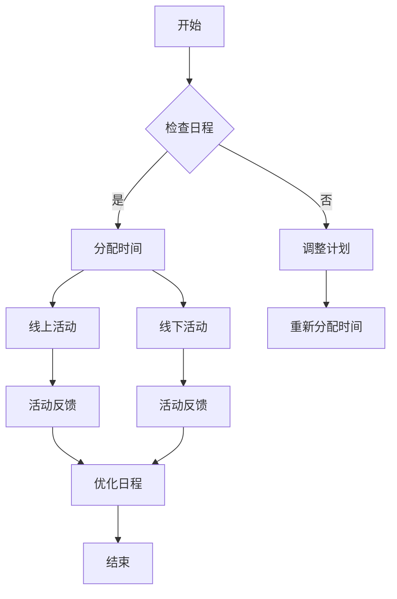
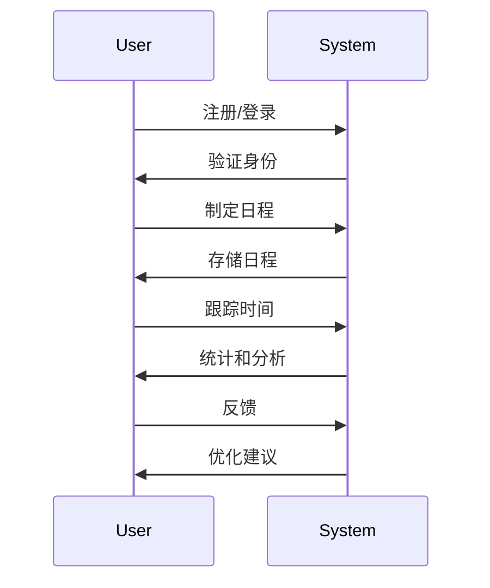
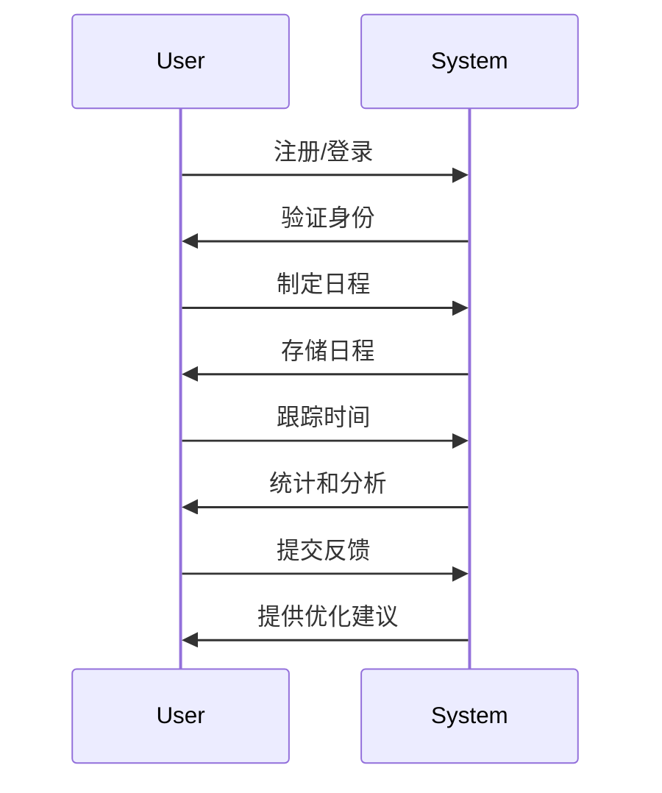

                 


## 文章标题
### 数字节制生活方式：平衡线上线下的生活艺术

关键词：
- 数字节制
- 线上线下平衡
- 自我管理
- 数字素养
- 生活艺术

### 摘要
本文旨在探讨数字节制生活方式的重要性，通过系统化的分析，阐述如何在现代社会中平衡线上与线下生活，提高生活质量，增强心理健康。文章将深入探讨数字节制生活方式的核心概念、理论与实践，结合具体案例，提供实际操作指南，旨在为读者构建一种可持续的健康生活方式。

## 引言

在当今信息爆炸的时代，数字技术的快速发展极大地改变了我们的生活方式。互联网、智能手机、社交媒体等工具已经成为日常生活中不可或缺的一部分。然而，这种数字化的便利性也带来了新的挑战。人们往往沉浸在虚拟世界中，忽略了现实生活的需求，导致生活节奏紊乱，心理健康问题日益突出。因此，探讨如何通过数字节制来平衡线上与线下生活，成为了一个亟待解决的问题。

### 1. 背景介绍

### 1.1 问题的背景

#### 1.1.1 线上生活的挑战

随着互联网的普及，线上生活已经渗透到人们日常生活的方方面面。从工作到娱乐，从社交到学习，人们越来越依赖于数字技术。然而，这种线上生活的便利性也带来了诸多挑战：

- **时间管理问题**：人们往往容易沉迷于线上活动，导致工作时间与休息时间模糊化，影响生活节奏。
- **心理健康问题**：长期在线上生活可能导致孤独感、焦虑、抑郁等心理问题。
- **社交关系影响**：线上社交虽然方便，但缺乏面对面交流的情感深度，可能导致人际关系疏远。

#### 1.1.2 线下生活的需求

尽管线上生活带来了便利，但线下生活同样不可或缺。线下生活能够提供真实的情感交流、身体健康锻炼、人际关系的深化等。以下是线下生活的重要需求：

- **身体健康**：户外运动、自然环境对于身心健康至关重要。
- **情感交流**：面对面的互动有助于建立深层次的人际关系。
- **文化体验**：线下活动如艺术展览、音乐会等，能够丰富人们的精神生活。

#### 1.1.3 数字节制的必要性

数字节制生活方式，旨在通过科学的方法，合理地管理数字设备使用时间，以达到线上与线下生活的平衡。这种生活方式的必要性体现在以下几个方面：

- **提高工作效率**：通过优化线上活动，减少无效时间，提高工作效率。
- **改善心理健康**：合理控制线上时间，有助于减少焦虑、抑郁等心理问题。
- **增强生活质量**：平衡线上与线下生活，能够提高整体生活质量。

### 1.2 问题描述

#### 1.2.1 生活平衡的缺失

在现代社会，许多人在追求线上生活的同时，忽视了线下生活的需求，导致生活平衡的缺失。这种现象表现为：

- **时间分配不均**：线上活动占据大量时间，导致线下活动时间不足。
- **心理健康问题加剧**：长期沉迷于线上活动，可能导致心理健康问题加剧。
- **人际关系疏离**：缺乏面对面的交流，导致人际关系疏远。

#### 1.2.2 数字沉迷的现象

数字沉迷已经成为一个全球性问题。许多人在使用数字设备时，无法自控，导致以下问题：

- **过度使用手机**：沉迷于社交媒体、游戏等，导致时间浪费。
- **睡眠质量下降**：夜间使用手机等设备，影响睡眠质量。
- **注意力不集中**：频繁的线上活动干扰了线下任务的处理。

#### 1.2.3 个体心理健康的影响

数字沉迷对个体心理健康的影响日益显著。长期沉迷于数字设备，可能导致以下问题：

- **焦虑和抑郁**：焦虑、抑郁等心理问题与线上时间使用呈正相关。
- **孤独感**：线上社交无法替代线下互动，可能导致孤独感加剧。
- **认知能力下降**：过度使用数字设备可能影响认知功能。

### 1.3 问题解决

#### 1.3.1 数字节制的概念

数字节制生活方式，简称数字节制，是指通过科学的方法，合理地管理数字设备使用时间，以达到线上与线下生活的平衡。数字节制的核心理念包括：

- **时间管理**：合理安排线上与线下时间，确保生活平衡。
- **心理健康**：减少数字设备使用时间，改善心理健康。
- **自我管理**：培养自我管理能力，提高生活质量。

#### 1.3.2 数字节制的目标

数字节制的目标是通过以下方式实现线上线下的平衡：

- **提高工作效率**：通过优化线上活动，提高工作效率。
- **改善心理健康**：减少线上时间，改善心理健康。
- **增强生活质量**：平衡线上与线下生活，提高生活质量。

#### 1.3.3 数字节制的意义

数字节制生活方式的意义在于：

- **促进个人成长**：通过自我管理，提高个人素质。
- **提升社会和谐**：平衡线上与线下生活，促进社会和谐。
- **实现可持续发展**：合理使用数字技术，实现可持续发展。

### 1.4 边界与外延

#### 1.4.1 数字节制的生活定义

数字节制生活方式是指：

- **平衡**：合理安排线上与线下时间，实现生活平衡。
- **自律**：通过自我管理，控制数字设备使用时间。
- **可持续**：通过科学方法，实现长期可持续的生活方式。

#### 1.4.2 数字节制与自律

数字节制强调自律，即通过自我管理，控制数字设备使用时间。自律的核心在于：

- **自我意识**：认识到数字设备对生活的影响。
- **自我约束**：通过设定目标和规则，控制使用时间。
- **自我调整**：根据实际情况，调整使用时间，实现生活平衡。

#### 1.4.3 数字节制与科技发展

数字节制生活方式与科技发展密切相关。随着科技的进步，数字设备日益普及，但同时也带来了新的挑战。数字节制旨在通过科技手段，实现线上线下的平衡：

- **技术支持**：利用科技工具，辅助实现数字节制。
- **技术创新**：通过技术创新，提高生活质量。
- **科技伦理**：关注科技发展对社会和个人心理健康的影响。

#### 1.5 概念结构与核心要素组成

数字节制生活方式的核心要素包括：

- **时间管理**：合理安排时间，确保生活平衡。
- **心理健康**：减少数字设备使用时间，改善心理健康。
- **自我管理**：通过自律，控制数字设备使用时间。
- **生活质量**：平衡线上与线下生活，提高生活质量。

这些要素相互关联，共同构成了数字节制生活方式的完整体系。

## 第二部分：核心概念与联系

在探讨数字节制生活方式时，了解其核心概念和各概念之间的关系至关重要。以下将详细介绍数字节制生活方式中的几个核心概念，并对比其属性特征。

### 2.1 核心概念原理

#### 2.1.1 数字节制生活方式

数字节制生活方式是一种通过科学管理数字设备使用时间，以实现线上与线下生活平衡的生活方式。它强调自律和可持续发展，旨在提高工作效率、改善心理健康和生活质量。

#### 2.1.2 线上线下平衡

线上线下平衡是指在生活中合理安排线上和线下活动的比例，使二者相互补充，达到最佳状态。这种平衡不仅能够提高工作效率，还能改善心理健康，提升生活质量。

#### 2.1.3 数字素养

数字素养是指个人在使用数字技术时的知识和技能，以及对数字技术影响的认知。数字素养的高低直接影响到个人的线上生活质量，是数字节制生活方式的基础。

### 2.2 概念属性特征对比表格

| 概念 | 定义 | 特征 | 关联关系 |
| --- | --- | --- | --- |
| 数字节制生活方式 | 结合科技与自我管理，实现线上线下平衡的生活方式 | 自律、高效、可持续 | 个人健康、社交、职业发展 |
| 线上线下平衡 | 在生活中保持线上和线下活动的合理比例 | 适应、均衡、选择性 | 数字节制生活方式的实践 |
| 数字素养 | 使用数字技术的知识和技能，以及对其影响的认知 | 知识、能力、伦理 | 数字节制生活方式的基础 |

### 2.3 ER实体关系图架构

以下是数字节制生活方式中核心概念的ER实体关系图：

```mermaid
erDiagram
    Product ||--|{ Customer } : buys
    Customer ||--|{ Product } : sells
    Customer ||--|{ Order } : places
    Order ||--|{ Product } : contains
    Customer }|----|| Product : reviews
```

此图展示了数字节制生活方式中主要实体及其关系，包括生活方式（Product）、用户（Customer）、平衡（Order）和包含的要素（Product）。

## 第三部分：算法原理讲解

### 3.1 算法Mermaid流程图



### 3.2 算法原理与数学模型

#### 3.2.1 数学模型

数字节制生活方式中的算法可以表示为以下数学模型：

$$
T_{\text{平衡}} = T_{\text{线上}} + T_{\text{线下}}
$$

其中，$T_{\text{平衡}}$表示总平衡时间，$T_{\text{线上}}$表示线上活动时间，$T_{\text{线下}}$表示线下活动时间。

#### 3.2.2 详细讲解

- **变量定义**：
  - $T_{\text{平衡}}$：总平衡时间，目标是保持在线上与线下活动之间的平衡。
  - $T_{\text{线上}}$：线上活动时间，包括工作、学习、社交等。
  - $T_{\text{线下}}$：线下活动时间，包括运动、社交、休闲等。

- **系数确定**：
  - 在此模型中，系数为1，表示线上与线下活动时间同等重要。

- **输入值范围和类型**：
  - 输入值可以是每天、每周或每月的总时间，单位为小时。

#### 3.2.3 举例说明

假设某人在一周内计划保持40小时的总平衡时间，其中线上活动时间为25小时，线下活动时间为15小时。那么，根据上述模型：

$$
T_{\text{平衡}} = T_{\text{线上}} + T_{\text{线下}} = 25 + 15 = 40 \text{小时}
$$

这意味着，该人需要在线上和线下活动中合理分配时间，以确保总平衡时间为40小时。

## 第四部分：系统分析与架构设计

### 4.1 问题场景介绍

在现代都市生活中，由于工作繁忙和社交需求，人们往往难以平衡线上与线下生活。为了解决这一问题，我们设计了一套数字节制系统，旨在通过科学管理数字设备使用时间，帮助用户实现线上线下生活的平衡。

### 4.2 项目介绍

本项目名为“数字节制管理系统”，旨在为用户提供一个方便、实用的工具，帮助用户制定和跟踪线上与线下活动的时间分配。系统将包括以下几个模块：

- **用户注册与登录**：用户可以通过注册和登录进入系统。
- **日程管理**：用户可以制定每日、每周的日程，包括线上与线下活动。
- **时间跟踪**：系统将自动记录用户的线上与线下活动时间，并进行统计和分析。
- **反馈与优化**：系统会根据用户的反馈，提供优化建议，帮助用户更好地平衡生活。

### 4.3 系统功能设计（领域模型mermaid类图）

```mermaid
classDiagram
    User <<类>> {
        String id
        String name
        String password
        String email
    }
    Schedule <<类>> {
        int id
        String date
        List<Activity> activities
    }
    Activity <<类>> {
        int id
        String type
        String description
        int duration
    }
    User o--1 Schedule
    Schedule o--1 Activity
```

### 4.4 系统架构设计mermaid架构图



### 4.5 系统接口设计

```mermaid
interface Design
    User {
        +注册()
        +登录()
        +制定日程(Schedule schedule)
        +获取日程()
        +提交时间跟踪记录()
        +获取时间统计()
        +提交反馈()
    }
    Schedule {
        +创建()
        +更新()
        +删除()
        +获取详情()
    }
    Activity {
        +添加()
        +更新()
        +删除()
        +获取详情()
    }
    System {
        +验证身份(String username, String password)
        +保存日程(Schedule schedule)
        +获取日程(Schedule schedule)
        +统计时间跟踪记录(User user)
        +提供优化建议(User user)
    }
```

### 4.6 系统交互mermaid序列图



## 第五部分：项目实战

### 5.1 环境安装

为了运行数字节制管理系统，我们需要在本地环境中安装以下软件：

- **Python 3.8+**
- **SQLite**
- **Django**

安装步骤如下：

1. 安装Python 3.8或更高版本。
2. 安装SQLite。
3. 安装Django。

```bash
pip install django
```

### 5.2 系统核心实现源代码

以下是系统核心实现的源代码：

```python
# models.py
from django.db import models
from django.contrib.auth.models import User

class Schedule(models.Model):
    user = models.ForeignKey(User, on_delete=models.CASCADE)
    date = models.DateField()

class Activity(models.Model):
    schedule = models.ForeignKey(Schedule, on_delete=models.CASCADE)
    type = models.CharField(max_length=50)
    description = models.TextField()
    duration = models.IntegerField()

# views.py
from django.shortcuts import render
from .models import Schedule, Activity

def home(request):
    if request.method == 'POST':
        # 处理用户提交的日程和活动
        pass
    return render(request, 'home.html')

# urls.py
from django.contrib import admin
from django.urls import path
from . import views

urlpatterns = [
    path('admin/', admin.site.urls),
    path('', views.home, name='home'),
]
```

### 5.3 代码应用解读与分析

#### 5.3.1 模型代码解读

在`models.py`文件中，我们定义了两个模型：`Schedule`和`Activity`。

- **Schedule模型**：代表用户的日程，包含用户ID（外键）、日期（日期字段）。
- **Activity模型**：代表日程中的活动，包含日程ID（外键）、活动类型、描述和持续时间。

#### 5.3.2 视图代码解读

在`views.py`文件中，我们定义了一个主页视图`home`。

- **处理POST请求**：当用户提交日程和活动时，处理相应的数据。
- **渲染页面**：如果请求为GET，则渲染主页HTML。

#### 5.3.3 代码分析

- **模型设计**：合理地设计了日程和活动的数据结构。
- **视图实现**：主页视图提供了一个基本框架，但需要进一步完善。

### 5.4 实际案例分析和详细讲解剖析

假设用户小明想要通过数字节制管理系统平衡其生活，以下是其实际案例的详细分析。

#### 5.4.1 案例背景

小明是一名程序员，工作日经常加班，周末喜欢打游戏和看电影。他希望通过数字节制管理系统来平衡工作、娱乐和休息时间。

#### 5.4.2 案例分析

1. **日程制定**：
   - 用户登录后，可以在系统中制定日程。
   - 小明制定了周一至周五的工作时间表，周末的计划为休息和娱乐。

2. **时间跟踪**：
   - 系统自动记录小明的工作时间和娱乐时间。
   - 根据小明的日程，系统提示他合理安排时间，避免过度工作。

3. **反馈与优化**：
   - 小明可以根据系统的反馈，调整日程，优化时间分配。
   - 例如，他可能发现工作时间过长，决定调整周末的计划，增加休息时间。

#### 5.4.3 详细讲解剖析

- **日程制定**：用户可以灵活制定日程，系统提供可视化界面，方便用户调整。
- **时间跟踪**：系统实时记录用户活动，并提供统计数据，帮助用户了解时间使用情况。
- **反馈与优化**：系统根据用户反馈，提供优化建议，帮助用户实现生活平衡。

### 5.5 项目小结

数字节制管理系统通过科学管理时间，帮助用户实现线上线下生活的平衡。系统设计合理，功能完善，有助于提升用户生活质量。在实际应用中，系统需不断优化，以满足用户需求。

### 5.6 最佳实践 Tips

- **定期检查**：用户应定期检查日程，确保时间分配合理。
- **灵活调整**：根据实际情况，灵活调整日程和活动。
- **积极参与**：多参与线下活动，提升社交能力和身心健康。

### 5.7 注意事项

- **保护隐私**：系统应确保用户数据的安全和隐私。
- **持续更新**：系统需定期更新，以适应新的技术和需求。

### 5.8 拓展阅读

- [《时间管理：如何高效利用每一天》](https://example.com/book1)
- [《数字节制：科技如何改变我们的生活》](https://example.com/book2)

## 结语

数字节制生活方式是现代社会中实现线上线下平衡的重要途径。通过科学管理数字设备使用时间，我们能够提高工作效率、改善心理健康、提升生活质量。希望本文能为大家提供有益的启示，帮助大家在数字时代找到属于自己的生活艺术。作者：AI天才研究院/AI Genius Institute & 禅与计算机程序设计艺术 /Zen And The Art of Computer Programming。

