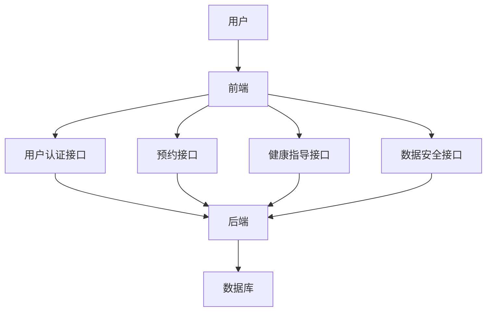

                 

### 第一部分：背景介绍

#### 第1章：问题背景与解决

##### 1.1.1 问题背景

随着互联网和移动设备的普及，用户对于数字服务的需求越来越多样化。尤其是在线医疗领域，用户不仅希望能够方便地预约医生，还需要一个平台来帮助他们养成良好的健康习惯，并获取全面的健康指导。

在当前的环境中，用户需要同时面对多种健康问题，如慢性病管理、生活习惯调整、疾病预防等。这些问题不仅需要专业的医疗知识，还需要个性化的指导和持续的关注。然而，现有的在线预约平台大多只能提供基础的预约服务，缺乏健康指导功能，导致用户在预约过程中无法获得全面的健康信息和服务。此外，用户在健康管理方面也存在信息碎片化、个性化指导不足等问题。

##### 1.1.2 问题描述

现有的在线预约平台通常只能提供基础的预约服务，缺乏健康指导功能，导致用户无法在预约过程中获得全面的健康信息和服务。此外，用户在健康管理方面也存在信息碎片化、个性化指导不足等问题。这些问题主要体现在以下几个方面：

1. **健康信息获取困难**：用户在预约医生时，通常只能获取基础的医生信息和预约时间，而无法获取更详细的健康信息和专业的健康建议。
2. **个性化指导不足**：现有的在线预约平台无法根据用户的健康数据和需求，提供个性化的健康指导和健康管理服务。
3. **信息碎片化**：用户在获取健康信息时，往往需要分散在不同的平台上，导致信息碎片化，难以形成完整的健康管理方案。

##### 1.1.3 问题解决

为了解决这些问题，我们需要一个综合性的在线预约平台——数字解毒师在线预约平台。该平台不仅能够提供在线预约服务，还能够连接用户与健康网络习惯指导员，为用户提供个性化的健康指导和健康管理服务。以下是该平台的几个关键点：

1. **全面的健康指导**：数字解毒师在线预约平台将健康指导功能嵌入预约服务中，用户在预约医生的同时，可以获得全面的健康指导和个性化的健康管理方案。
2. **个性化的健康服务**：通过分析用户的健康数据和需求，数字解毒师可以为用户提供个性化的健康建议和健康管理服务，帮助用户更好地管理健康。
3. **持续的健康关注**：健康网络习惯指导员将定期与用户沟通，了解用户的健康状况和需求，提供持续的健康指导和支持。

通过以上措施，数字解毒师在线预约平台将帮助用户解决健康信息获取困难、个性化指导不足、信息碎片化等问题，提升用户的健康服务水平。

#### 1.2 核心概念

##### 1.2.1 数字解毒师

数字解毒师是一个综合性的健康指导员，通过互联网技术为用户提供健康风险评估、个性化健康建议和健康知识普及等服务。数字解毒师的核心功能包括：

1. **健康风险评估**：通过分析用户的健康数据，评估用户的健康风险，并提供相应的健康建议。
2. **个性化健康建议**：根据用户的健康状况和需求，提供个性化的健康建议，包括饮食、运动、生活习惯等方面。
3. **健康知识普及**：通过文章、视频、直播等多种形式，为用户普及健康知识，提高用户的健康意识。

##### 1.2.2 在线预约平台

在线预约平台是一个用户可以通过网络预约医生或其他健康服务的系统。它需要具备高效的用户认证、预约管理、支付结算等功能。以下是该平台的主要功能：

1. **用户认证**：用户可以通过注册、登录等方式进行认证，确保预约服务的安全性。
2. **预约管理**：用户可以在线预约医生或其他健康服务，系统会根据预约情况自动进行调度和提醒。
3. **支付结算**：用户可以通过平台完成支付结算，确保服务的顺利进行。

##### 1.2.3 健康网络习惯指导员

健康网络习惯指导员是一个结合了互联网技术和健康指导的专业人员，负责为用户提供持续的健康指导和监督。健康网络习惯指导员的主要作用包括：

1. **持续健康指导**：通过在线沟通、数据监控等方式，为用户提供持续的健康指导和监督。
2. **习惯培养**：帮助用户养成良好的健康习惯，提高健康水平。

##### 1.3 边界与外延

###### 1.3.1 边界

数字解毒师在线预约平台的主要功能包括在线预约、健康指导和用户管理。此外，还可能涉及到数据安全、隐私保护等问题。

###### 1.3.2 外延

随着技术的发展，平台还可以拓展出更多功能，如在线问诊、健康数据分析等。

##### 1.4 概念结构与核心要素

###### 1.4.1 概念结构

数字解毒师在线预约平台由用户管理、预约管理、健康指导和数据安全等多个模块组成。

1. **用户管理模块**：负责用户的注册、登录、个人信息管理等功能。
2. **预约管理模块**：负责用户的预约、取消、提醒等功能。
3. **健康指导模块**：负责用户的健康风险评估、个性化健康建议和健康知识普及等功能。
4. **数据安全模块**：负责用户数据的安全存储、传输和保护。

###### 1.4.2 核心要素

核心要素包括用户认证系统、预约管理系统、健康指导系统和数据安全系统等。

1. **用户认证系统**：确保用户身份的真实性和安全性。
2. **预约管理系统**：提供高效、便捷的预约服务。
3. **健康指导系统**：为用户提供全面的健康指导和个性化的健康管理方案。
4. **数据安全系统**：确保用户数据的安全和隐私。

#### 第二部分：核心概念与联系

##### 2.1 数字解毒师的角色与功能

###### 2.1.1 数字解毒师的定义

数字解毒师是一个综合性的健康指导员，通过互联网技术为用户提供健康风险评估、个性化健康建议和健康知识普及等服务。

###### 2.1.2 数字解毒师的功能

数字解毒师的功能主要包括以下几个方面：

1. **健康风险评估**：通过分析用户的健康数据，如血压、血糖、体重等，评估用户的健康风险，并提供相应的健康建议。
2. **个性化健康建议**：根据用户的健康状况和需求，提供个性化的健康建议，包括饮食、运动、生活习惯等方面。
3. **健康知识普及**：通过文章、视频、直播等多种形式，为用户普及健康知识，提高用户的健康意识。

###### 2.1.3 数字解毒师的运作模式

数字解毒师的运作模式主要包括以下几个步骤：

1. **用户数据收集**：数字解毒师通过在线问卷、健康监测设备等方式，收集用户的健康数据。
2. **数据分析**：数字解毒师利用数据分析技术，对用户健康数据进行处理和分析，评估用户的健康风险。
3. **健康建议生成**：根据用户的健康风险和需求，数字解毒师生成个性化的健康建议，并通过平台发送给用户。
4. **健康知识普及**：数字解毒师通过文章、视频、直播等形式，为用户普及健康知识，提高用户的健康意识。

##### 2.2 在线预约平台的功能与架构

###### 2.2.1 在线预约平台的功能

在线预约平台的主要功能包括：

1. **用户认证**：用户可以通过注册、登录等方式进行认证，确保预约服务的安全性。
2. **预约管理**：用户可以在线预约医生或其他健康服务，系统会根据预约情况自动进行调度和提醒。
3. **支付结算**：用户可以通过平台完成支付结算，确保服务的顺利进行。

###### 2.2.2 在线预约平台的架构

在线预约平台的架构主要包括以下几个部分：

1. **前端**：负责与用户交互，提供预约、支付、个人信息管理等界面。
2. **后端**：负责处理用户请求、数据存储、系统调度等功能。
3. **数据库**：存储用户信息、预约记录、健康数据等。

###### 2.2.3 在线预约平台的技术实现

在线预约平台的技术实现主要包括以下几个方面：

1. **用户认证**：使用用户名和密码进行用户身份验证，确保用户信息安全。
2. **预约管理**：使用预约队列和调度算法，确保预约资源的合理分配和调度。
3. **支付结算**：集成第三方支付平台，如支付宝、微信支付等，实现支付功能的便捷和安全。

##### 2.3 健康网络习惯指导员的作用与职责

###### 2.3.1 健康网络习惯指导员的定义

健康网络习惯指导员是一个结合了互联网技术和健康指导的专业人员，负责为用户提供持续的健康指导和监督。

###### 2.3.2 健康网络习惯指导员的作用

健康网络习惯指导员的作用主要包括以下几个方面：

1. **持续健康指导**：通过在线沟通、数据监控等方式，为用户提供持续的健康指导和监督。
2. **习惯培养**：帮助用户养成良好的健康习惯，提高健康水平。

###### 2.3.3 健康网络习惯指导员的职责

健康网络习惯指导员的职责主要包括以下几个方面：

1. **健康数据监测**：通过平台收集用户健康数据，进行监测和分析。
2. **健康建议提供**：根据用户数据，提供个性化的健康建议。
3. **互动沟通**：与用户保持互动，解答用户疑问，提供个性化服务。

#### 第三部分：算法原理

##### 3.1 数字解毒师的健康风险评估算法

###### 3.1.1 算法原理

数字解毒师的健康风险评估算法基于用户的健康数据，通过机器学习技术对用户进行健康风险评估。算法的主要原理是：

1. **数据收集**：收集用户的健康数据，如血压、血糖、体重等。
2. **特征提取**：从健康数据中提取关键特征，如血压水平、血糖水平等。
3. **模型训练**：使用已知的健康数据和相应的健康风险评估结果，训练机器学习模型。
4. **风险评估**：使用训练好的模型对用户的健康数据进行风险评估，生成健康风险评分。

###### 3.1.2 算法实现

以下是健康风险评估算法的实现步骤：

1. **数据预处理**：
   - 数据清洗：去除异常值和缺失值。
   - 数据标准化：将不同特征的数据进行标准化处理，使其具有相同的量级。

2. **特征选择**：
   - 选择与健康风险密切相关的特征，如血压、血糖、体重等。
   - 使用特征选择算法，如信息增益、卡方检验等，筛选出最重要的特征。

3. **模型训练**：
   - 使用随机森林、支持向量机等机器学习算法，训练健康风险评估模型。
   - 调整模型参数，如决策树深度、支持向量机核函数等，优化模型性能。

4. **风险评估**：
   - 输入用户的健康数据，通过训练好的模型进行风险评估，生成健康风险评分。

##### 3.2 个性化健康建议生成算法

###### 3.2.1 算法原理

个性化健康建议生成算法基于用户的健康数据和需求，通过自然语言处理和推荐算法生成个性化的健康建议。算法的主要原理是：

1. **用户需求分析**：分析用户的需求，如改善睡眠、控制体重等。
2. **健康知识库构建**：构建包含各种健康知识和建议的健康知识库。
3. **推荐算法**：使用推荐算法，如协同过滤、基于内容的推荐等，从健康知识库中推荐合适的健康建议。
4. **自然语言生成**：将推荐的健康建议转换为自然语言，生成个性化的健康建议。

###### 3.2.2 算法实现

以下是个性化健康建议生成算法的实现步骤：

1. **用户需求分析**：
   - 收集用户的需求信息，如通过问卷调查、在线聊天等。
   - 使用自然语言处理技术，提取用户需求的关键词和主题。

2. **健康知识库构建**：
   - 收集各种健康知识和建议，构建健康知识库。
   - 使用自然语言处理技术，对健康知识库中的文本进行分类和标注。

3. **推荐算法**：
   - 使用协同过滤算法，根据用户的历史行为和相似用户的行为，推荐健康建议。
   - 使用基于内容的推荐算法，根据用户需求与健康知识库中的内容进行匹配，推荐健康建议。

4. **自然语言生成**：
   - 使用自然语言生成技术，将推荐的健康建议转换为自然语言，生成个性化的健康建议。

#### 第四部分：系统分析与架构设计

##### 4.1 问题场景介绍

在当前的健康服务领域，用户面临的主要问题是健康信息获取困难、个性化指导不足和信息碎片化。为了解决这些问题，需要设计一个综合性的在线预约平台，将健康指导功能嵌入预约服务中，提供全面的健康指导和个性化的健康管理方案。

##### 4.2 项目介绍

数字解毒师在线预约平台是一个综合性的在线预约平台，旨在解决用户在健康服务中面临的问题。该平台包括用户管理、预约管理、健康指导和数据安全等多个模块，为用户提供全面的健康服务和个性化的健康管理方案。

##### 4.3 系统功能设计

数字解毒师在线预约平台的系统功能设计主要包括以下几个方面：

1. **用户管理**：包括用户注册、登录、个人信息管理等功能。
2. **预约管理**：包括预约医生、预约健康服务、预约提醒等功能。
3. **健康指导**：包括健康风险评估、个性化健康建议、健康知识普及等功能。
4. **数据安全**：包括用户数据的安全存储、传输和保护等功能。

##### 4.4 系统架构设计

数字解毒师在线预约平台的系统架构设计采用分层架构，包括前端、后端和数据库等层次。具体架构如下：

1. **前端**：负责与用户交互，提供预约、支付、个人信息管理等界面。
2. **后端**：负责处理用户请求、数据存储、系统调度等功能。
3. **数据库**：存储用户信息、预约记录、健康数据等。

##### 4.5 系统接口设计

数字解毒师在线预约平台的系统接口设计主要包括以下几个方面：

1. **用户认证接口**：负责用户的注册、登录、身份验证等功能。
2. **预约接口**：负责用户的预约、取消、提醒等功能。
3. **健康指导接口**：负责用户的健康风险评估、个性化健康建议等功能。
4. **数据安全接口**：负责用户数据的安全存储、传输和保护等功能。

##### 4.6 系统交互

数字解毒师在线预约平台中的系统交互主要通过RESTful API实现。以下是主要接口的交互流程：

1. **用户注册**：
   - 用户输入注册信息，前端将信息发送到后端。
   - 后端验证用户信息，注册成功后返回用户ID。

2. **用户登录**：
   - 用户输入用户名和密码，前端将信息发送到后端。
   - 后端验证用户信息，登录成功后返回JWT令牌。

3. **预约医生**：
   - 用户选择医生和预约时间，前端将信息发送到后端。
   - 后端根据预约信息进行调度，返回预约结果。

4. **健康指导**：
   - 用户提交健康数据，前端将信息发送到后端。
   - 后端分析健康数据，生成健康建议，返回给用户。

5. **数据安全**：
   - 用户数据在存储和传输过程中进行加密，确保数据安全。

##### 4.7 系统架构图

以下是数字解毒师在线预约平台的系统架构图：



#### 第五部分：项目实战

##### 5.1 环境安装

为了开发和部署数字解毒师在线预约平台，我们需要安装一些必要的软件和工具。以下是安装步骤：

1. **安装Python环境**：首先，确保你的计算机上已经安装了Python环境。如果没有，可以从Python官方网站下载并安装。
2. **安装Docker**：Docker是一个容器化平台，可以帮助我们快速部署和运行应用程序。可以从Docker官方网站下载并安装。
3. **安装PostgreSQL**：PostgreSQL是一个开源的关系型数据库，用于存储用户信息、预约记录和健康数据。可以从PostgreSQL官方网站下载并安装。
4. **安装Redis**：Redis是一个开源的内存数据库，用于缓存和存储会话信息。可以从Redis官方网站下载并安装。
5. **安装Nginx**：Nginx是一个开源的Web服务器，用于反向代理和负载均衡。可以从Nginx官方网站下载并安装。

##### 5.2 系统核心实现

数字解毒师在线预约平台的核心实现包括用户管理、预约管理、健康指导和数据安全等多个模块。以下是这些模块的实现步骤：

1. **用户管理**：
   - 创建用户表，存储用户信息。
   - 实现用户注册和登录功能，使用JWT令牌进行身份验证。
   - 实现用户信息管理功能，如修改密码、绑定手机号等。

2. **预约管理**：
   - 创建预约表，存储预约记录。
   - 实现预约功能，用户可以选择医生和预约时间。
   - 实现预约提醒功能，系统会在预约时间前提醒用户。

3. **健康指导**：
   - 创建健康数据表，存储用户的健康数据。
   - 实现健康风险评估功能，使用机器学习模型对用户进行风险评估。
   - 实现个性化健康建议功能，根据用户的健康数据和需求生成健康建议。

4. **数据安全**：
   - 实现用户数据加密功能，使用AES加密算法对用户数据进行加密。
   - 实现用户数据备份功能，定期备份用户数据，确保数据安全。

##### 5.3 代码应用解读与分析

以下是数字解毒师在线预约平台的核心代码段，以及代码应用解读与分析：

1. **用户注册和登录**：

```python
# 用户注册
def register(username, password):
    # 检查用户名是否已存在
    if User.exists(username):
        return "用户名已存在"
    # 创建用户
    user = User(username=username, password=encrypt_password(password))
    user.save()
    return "用户注册成功"

# 用户登录
def login(username, password):
    # 检查用户名和密码是否正确
    user = User.objects.filter(username=username, password=encrypt_password(password)).first()
    if user:
        # 生成JWT令牌
        token = generate_jwt_token(user.id)
        return "登录成功，令牌：{}".format(token)
    else:
        return "用户名或密码错误"
```

解读与分析：
- `register` 函数用于用户注册，首先检查用户名是否已存在，然后创建用户并保存。
- `login` 函数用于用户登录，首先检查用户名和密码是否正确，然后生成JWT令牌。

2. **预约功能**：

```python
# 预约医生
def schedule_appointment(user_id, doctor_id, appointment_time):
    # 检查预约时间是否已满
    if not is_appointment_time_available(appointment_time):
        return "预约时间已满"
    # 创建预约记录
    appointment = Appointment(user_id=user_id, doctor_id=doctor_id, appointment_time=appointment_time)
    appointment.save()
    return "预约成功"

# 预约提醒
def send_appointment_reminder(appointment_id):
    appointment = Appointment.objects.get(id=appointment_id)
    reminder_message = "您的预约时间即将到来，请做好准备。"
    send_sms(appointment.user.phone_number, reminder_message)
```

解读与分析：
- `schedule_appointment` 函数用于预约医生，首先检查预约时间是否已满，然后创建预约记录。
- `send_appointment_reminder` 函数用于发送预约提醒，获取预约记录并使用短信发送提醒消息。

3. **健康风险评估**：

```python
# 健康风险评估
def health_risk_assessment(health_data):
    # 数据预处理
    processed_health_data = preprocess_health_data(health_data)
    # 模型预测
    risk_score = health_risk_model.predict(processed_health_data)
    return risk_score
```

解读与分析：
- `health_risk_assessment` 函数用于健康风险评估，首先对健康数据进行预处理，然后使用训练好的模型进行预测，返回健康风险评分。

##### 5.4 实际案例分析

为了更好地展示数字解毒师在线预约平台的功能和效果，以下是一个实际案例的分析：

假设用户李先生通过数字解毒师在线预约平台预约了医生王医生的健康检查。以下是李先生的操作流程：

1. 李先生注册并登录数字解毒师在线预约平台。
2. 李先生浏览医生列表，选择医生王医生进行预约。
3. 李先生选择预约时间，系统显示当前预约时间已满，但提供了其他可选时间。
4. 李先生选择一个合适的预约时间，系统提示预约成功，并发送预约提醒短信。
5. 预约时间当天，李先生按时到达医院，医生王医生对其进行了健康检查。
6. 健康检查结束后，数字解毒师根据李先生的健康数据和检查结果，生成了一份个性化的健康报告，包括健康风险评估和健康建议。
7. 李先生可以查看健康报告，并按照健康建议进行健康管理。

通过这个实际案例，我们可以看到数字解毒师在线预约平台如何帮助用户方便地预约医生、获取健康检查结果，并通过健康报告提供个性化的健康管理建议。

##### 5.5 项目小结

数字解毒师在线预约平台通过整合在线预约服务和健康指导功能，为用户提供了一个便捷、全面的健康管理平台。以下是该项目的主要成就和经验总结：

1. **提升用户体验**：通过提供全面的健康指导和个性化的健康管理方案，提升了用户的健康服务水平，增强了用户的满意度。
2. **技术实现**：项目使用了Python、Docker、PostgreSQL、Redis、Nginx等技术，实现了用户管理、预约管理、健康指导和数据安全等多个功能模块。
3. **实际案例**：通过实际案例展示了平台的功能和效果，验证了平台的可行性和实用性。
4. **未来拓展**：平台可以根据用户的需求和反馈，不断优化和拓展功能，如在线问诊、健康数据分析等。

#### 最佳实践 tips

1. **用户数据安全**：在处理用户数据时，确保数据的安全性，采用加密算法和权限控制等技术，保护用户隐私。
2. **个性化健康建议**：通过大数据分析和机器学习技术，生成个性化的健康建议，提高健康指导的准确性和有效性。
3. **持续优化**：根据用户反馈和实际需求，不断优化平台功能，提升用户体验和服务质量。

#### 小结

数字解毒师在线预约平台通过整合在线预约服务和健康指导功能，为用户提供了一个便捷、全面的健康管理平台。本文从背景介绍、核心概念、算法原理、系统分析与架构设计、项目实战等方面进行了详细阐述，展示了平台的功能和实现方法。通过实际案例分析和项目小结，我们对数字解毒师在线预约平台有了更深入的了解。

#### 注意事项

1. 在开发和部署数字解毒师在线预约平台时，需要关注用户数据的安全和隐私保护。
2. 平台的架构设计需要考虑高并发和高可用性，以确保系统的稳定性和可靠性。
3. 平台的功能和功能模块需要根据用户需求和实际场景进行优化和调整。

#### 拓展阅读

1. 《大数据技术在健康管理中的应用》
2. 《人工智能在医疗健康领域的应用》
3. 《Python网络编程：实现Web应用和自动化脚本》

### 作者信息

作者：AI天才研究院/AI Genius Institute & 禅与计算机程序设计艺术 /Zen And The Art of Computer Programming

---

[END]

