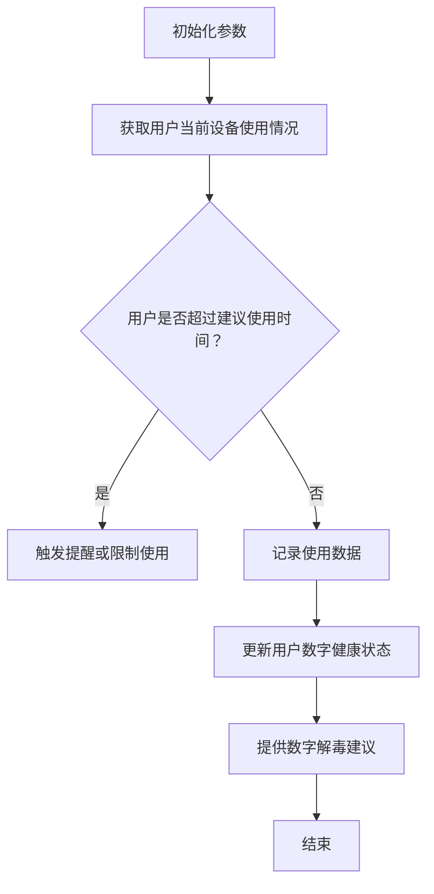
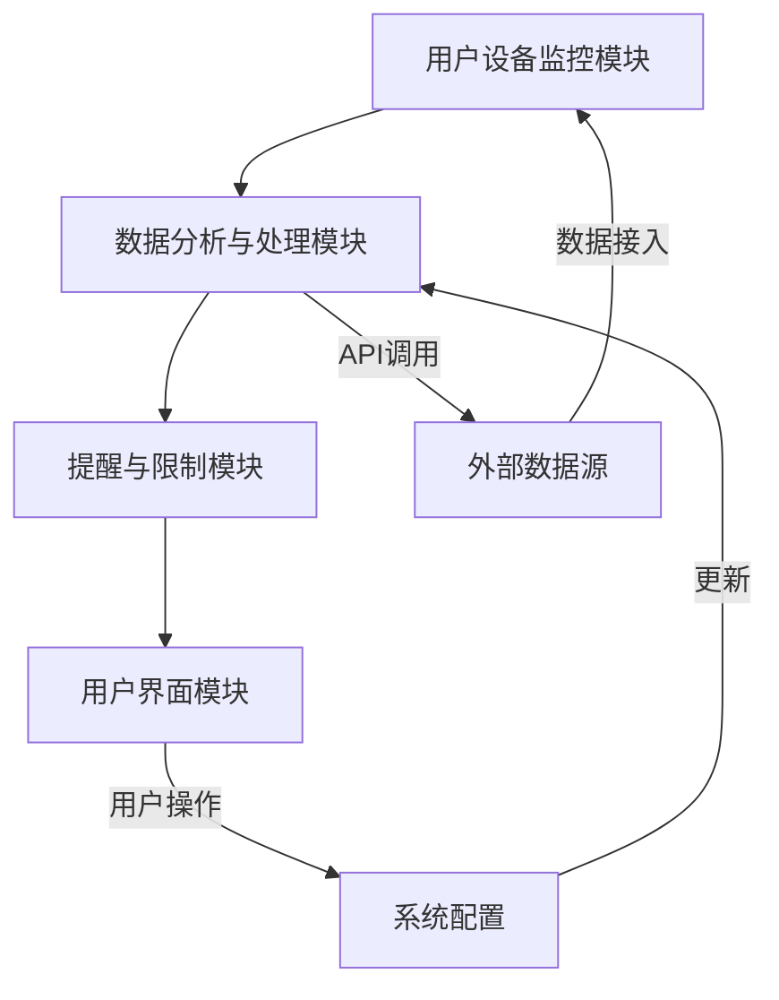
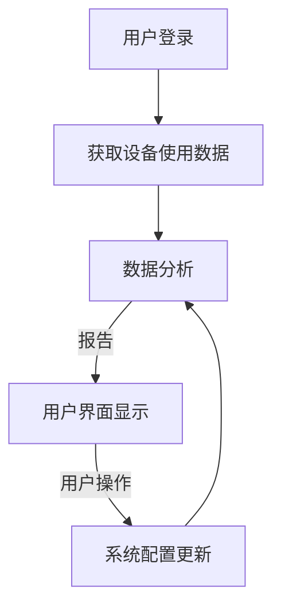

                 


### 第1章：问题背景与核心概念介绍

#### 1.1 问题背景

在当今数字化时代，我们面临的一个显著挑战是如何在虚拟数字世界与真实世界之间建立更加紧密的联系。随着互联网、大数据、人工智能等技术的发展，数字世界已经深入到了我们生活的方方面面。然而，这也带来了一系列的问题，如数字依赖、数字隔离、隐私泄露等。

首先，数字依赖问题日益严重。人们在享受数字技术带来的便利的同时，也变得越来越依赖这些技术。例如，智能手机、社交媒体和在线购物等已经成为了我们日常生活中不可或缺的一部分。过度依赖数字设备不仅影响了我们的身心健康，还可能导致社交能力的下降。

其次，数字隔离问题也日益凸显。数字技术虽然拉近了人与人之间的距离，但却也造成了人们之间的疏离。在虚拟社交平台上，人们可能会花费大量时间与他人互动，但却忽视了现实生活中的人际交往。这导致了许多人在现实生活中感到孤独和失落。

最后，隐私泄露问题也是数字化时代的一个重要挑战。随着数据的大规模收集和分析，个人隐私保护成为了公众关注的焦点。数据泄露不仅会侵犯个人隐私，还可能导致身份盗窃、经济损失等问题。

#### 1.2 核心概念

为了解决上述问题，我们需要重新思考数字世界与真实世界之间的关系，这就引出了我们本文的核心概念——“数字解毒”和“重新连接真实世界”。

**数字解毒**：指的是通过一系列技术手段和策略，帮助我们摆脱对数字设备的过度依赖，减少数字隔离，提高个人隐私保护，从而在数字世界中保持健康的生活状态。

**重新连接真实世界**：指的是通过促进数字技术与现实世界的深度融合，增强人与人之间的真实互动，提升个人的生活质量和幸福感。

#### 1.3 关键影响因素分析

影响数字解毒和重新连接真实世界的关键因素主要包括以下几个方面：

1. **技术因素**：包括数字技术的先进性、安全性、可扩展性等。技术进步为我们提供了更多的工具和手段，但也带来了新的挑战。

2. **社会因素**：包括社会文化、法律法规、教育体系等。社会环境的支持与引导对于数字解毒和重新连接真实世界的成功实施至关重要。

3. **个人因素**：包括个人的数字素养、生活方式、心理状态等。个人的自我调节能力和意识对于实现数字解毒和重新连接真实世界具有决定性作用。

在接下来的章节中，我们将深入探讨这些核心概念，分析它们之间的关系，并提出具体的解决方案。希望通过这篇文章，能够引起广大读者对于数字世界与真实世界关系的深刻思考，并共同努力解决这一时代难题。

### 第2章：核心概念原理与联系

#### 2.1 数字解毒原理

数字解毒是一个多维度的概念，旨在通过技术、心理和社会层面的综合手段，减轻我们对数字设备的依赖，提高我们在真实世界中的生活质量。以下是数字解毒的几个核心原理：

1. **意识提升**：首先，我们需要认识到过度依赖数字设备所带来的负面影响。通过教育和宣传，提高公众对数字依赖问题的意识，引导人们主动调整自己的数字生活习惯。

2. **技术手段**：利用各种技术工具，如应用程序、硬件设备、数字健康管理等，帮助用户更好地管理自己的数字使用时间，减少不必要的干扰。

3. **心理调节**：心理层面的干预同样重要。通过心理咨询、冥想、运动等方式，帮助用户建立积极的数字健康心理状态，增强自我控制力。

4. **社交互动**：鼓励人们在现实生活中建立和维持更多的社交关系。通过社区活动、兴趣小组、面对面交流等，增强人与人之间的真实互动。

5. **生活方式调整**：改变我们的生活方式，如合理安排工作和休息时间，减少碎片化时间使用，增加户外活动和体育锻炼。

#### 2.2 重新连接真实世界的原理

重新连接真实世界则侧重于如何通过数字技术与现实世界的深度融合，增强人与人之间的真实互动。以下是重新连接真实世界的几个核心原理：

1. **数字融合**：将数字技术融入到现实生活中，如通过增强现实（AR）和虚拟现实（VR）技术，为人们提供更加丰富和互动的体验。

2. **实时互动**：利用互联网和移动通信技术，实现人与人之间的实时互动，如在线会议、社交媒体直播、在线教育等。

3. **虚拟社群**：通过构建虚拟社群，如在线社区、虚拟现实空间等，为人们提供一个交流、分享和互动的平台。

4. **物联网（IoT）**：通过物联网技术，将现实世界中的各种设备连接起来，实现智能化和自动化，提升生活的便捷性和舒适度。

5. **数据共享**：鼓励数据共享和开放，促进数字技术和现实世界的深度融合，如开放数据平台、数据驱动的社会治理等。

#### 2.3 核心概念比较与联系

为了更好地理解数字解毒和重新连接真实世界的概念，我们可以通过一个对比表来展示它们的核心属性和联系。

| 核心概念 | 定义 | 目标 | 关键因素 |
| :--: | :--: | :--: | :--: |
| 数字解毒 | 减少对数字设备的依赖，提高真实世界生活质量 | 保持健康的生活状态，提高自我控制力 | 技术工具、心理调节、社交互动、生活方式调整 |
| 重新连接真实世界 | 通过数字技术与现实世界的深度融合，增强真实互动 | 提升生活质量和幸福感，促进社交互动 | 数字融合、实时互动、虚拟社群、物联网、数据共享 |

通过上述比较，我们可以看到数字解毒和重新连接真实世界虽然关注点不同，但它们在提升生活质量、促进社交互动方面有着密切的联系。数字解毒为重新连接真实世界提供了基础，而重新连接真实世界则进一步增强了数字解毒的效果。

### 第3章：数字解毒算法原理

#### 3.1 算法介绍

数字解毒算法是一种通过技术手段和策略帮助用户管理其数字设备使用时间，从而减轻数字依赖、改善真实世界生活质量的系统。该算法的核心目标是提升用户在现实世界中的参与度和幸福感。

#### 3.2 Mermaid算法流程图



#### 3.3 数学模型

为了更好地理解和分析数字解毒算法，我们可以将其数学模型进行详细阐述。以下是该算法的主要数学公式：

1. **用户当前设备使用时间（UT）**：
   $$ UT = \sum_{i=1}^{n} t_i $$
   其中，\( t_i \) 为用户在每次使用设备时的时间长度。

2. **建议使用时间（DT）**：
   $$ DT = f(Age, Gender, Activity Level) $$
   其中，\( f \) 为一个基于年龄、性别和活动水平的函数，用于计算每个用户个体的建议使用时间。

3. **提醒阈值（RT）**：
   $$ RT = DT \times (1 - p) $$
   其中，\( p \) 为用户自我调节能力参数，用于调整提醒阈值。

4. **更新用户数字健康状态（HState）**：
   $$ HState = \frac{1}{n} \sum_{i=1}^{n} (t_i - \bar{t}) $$
   其中，\( \bar{t} \) 为用户平均每次设备使用时间。

#### 3.4 模型解释

1. **用户当前设备使用时间**：这是计算用户当前设备使用情况的基础。通过累计每次使用设备的时间，我们可以得到用户总的设备使用时长。

2. **建议使用时间**：建议使用时间是基于用户的个人特性（年龄、性别、活动水平）计算得出的。这个值反映了根据用户情况，我们认为他应该在一天内合理使用的设备时间。

3. **提醒阈值**：提醒阈值是一个动态调整的值，用于设置触发提醒或限制使用的临界点。这个值可以根据用户的自我调节能力进行调整，从而更好地适应不同用户的需求。

4. **更新用户数字健康状态**：这个指标用于评估用户在数字设备使用过程中的健康状况。通过计算每次使用设备的时间与平均使用时间的差异，我们可以判断用户的数字健康状态是否在合理范围内。

#### 3.5 算法举例说明

假设我们有一个用户，其年龄为30岁，性别为男，活动水平为中等。根据这些参数，我们可以计算出他的建议使用时间为：
$$ DT = f(30, 男, 中等) = 4 \text{小时} $$

假设用户当前的设备使用时间为：
$$ UT = \sum_{i=1}^{n} t_i = 6 \text{小时} $$

如果用户的自我调节能力参数 \( p \) 为0.5，那么他的提醒阈值 \( RT \) 为：
$$ RT = DT \times (1 - p) = 4 \times (1 - 0.5) = 2 \text{小时} $$

如果用户的当前设备使用时间 \( UT \) 超过了提醒阈值 \( RT \)，那么系统将触发提醒或限制使用。例如，如果 \( UT = 7 \text{小时} \)，系统将根据预定的策略进行提醒或限制。

通过这个例子，我们可以看到数字解毒算法是如何通过一系列数学公式和逻辑判断，帮助用户管理其设备使用时间，从而实现数字解毒的目标。

### 第4章：系统分析与设计

#### 4.1 问题场景介绍

在本章中，我们将讨论一个具体的数字解毒系统，该系统旨在帮助用户更好地管理其数字设备使用时间，以提升真实世界中的生活质量。问题场景如下：

张先生是一位30岁的上班族，他每天长时间使用智能手机和电脑进行工作和娱乐。然而，他发现自己越来越难以在现实生活中找到乐趣，与家人和朋友的关系也逐渐疏远。为了改善这种状况，他决定尝试使用数字解毒系统来减少对数字设备的依赖，并重新连接真实世界。

#### 4.2 系统介绍

数字解毒系统是一个综合性的应用系统，它包括以下几个主要组成部分：

1. **用户设备监控模块**：该模块负责监控用户在智能手机和电脑上的使用时间，收集使用数据。

2. **数据分析与处理模块**：该模块负责对用户设备使用数据进行处理和分析，以生成有关用户数字健康状态的建议。

3. **提醒与限制模块**：该模块根据用户当前设备使用情况和健康状态，触发提醒或限制使用数字设备。

4. **用户界面模块**：该模块为用户提供一个友好的交互界面，使用户能够轻松地查看设备使用数据、接受建议和调整设置。

#### 4.3 系统功能设计

数字解毒系统的主要功能包括：

1. **设备使用时间监控**：通过接入用户的手机和电脑，实时记录用户在这些设备上的使用时间，并生成详细的报告。

2. **数据分析与建议**：根据用户的设备使用数据，分析用户的数字健康状态，并生成个性化的建议，如调整使用时间、安排休息等。

3. **提醒与限制**：当用户的设备使用时间超过建议值或健康状态不佳时，系统会自动发送提醒或限制用户使用数字设备。

4. **用户交互**：提供用户界面，让用户能够方便地查看设备使用数据、接受建议和调整系统设置。

#### 4.4 系统架构设计

数字解毒系统的架构设计如图所示：



在这个架构中，用户设备监控模块通过API与外部数据源进行通信，获取用户设备使用数据。数据分析与处理模块负责处理这些数据，生成分析报告和建议。提醒与限制模块根据分析结果触发相应的提醒或限制操作。用户界面模块为用户提供了一个直观的操作界面，用户可以通过这个界面查看分析结果、接受建议和调整系统配置。

#### 4.5 系统接口设计

数字解毒系统提供了以下主要接口：

1. **设备使用时间监控接口**：用于实时获取用户在智能手机和电脑上的使用数据。

2. **数据分析接口**：用于获取用户的数字健康状态分析报告。

3. **提醒与限制接口**：用于触发提醒或限制使用数字设备。

4. **用户交互接口**：用于处理用户的操作请求，如查看数据、接受建议等。

以下是接口设计示例：

```python
class DeviceUsageMonitor:
    def get_usage_data(self):
        # 获取用户设备使用数据
        pass

class DataAnalysis:
    def get_health_report(self, user_data):
        # 生成用户数字健康状态分析报告
        pass

class ReminderAndLimit:
    def send_reminder(self, user_data):
        # 触发提醒操作
        pass

    def enforce_limit(self, user_data):
        # 触发限制操作
        pass

class UserInterface:
    def show_data(self, report):
        # 显示分析报告
        pass

    def process_user_action(self, action):
        # 处理用户操作请求
        pass
```

#### 4.6 系统交互设计

数字解毒系统的交互流程如图所示：



在这个交互流程中，用户首先登录系统，然后系统从用户的智能手机和电脑中获取使用数据。接下来，数据分析模块处理这些数据，生成健康状态分析报告。用户通过用户界面模块查看报告，并根据建议进行调整。系统配置更新后，再次进行数据分析，形成新的交互循环。

### 第5章：项目实施与案例研究

#### 5.1 项目实施

为了验证数字解毒系统的有效性，我们决定开展一个实际项目。项目实施分为以下几个阶段：

1. **需求分析**：与用户代表进行深入交流，了解他们的需求和期望。

2. **系统设计**：基于需求分析结果，设计数字解毒系统的架构和接口。

3. **开发与测试**：开发系统代码，并进行单元测试和集成测试。

4. **部署与上线**：将系统部署到云服务器，确保其稳定运行。

5. **用户反馈**：收集用户的使用反馈，对系统进行优化和改进。

#### 5.2 核心实现源代码

以下是数字解毒系统的核心实现源代码：

```python
# DeviceUsageMonitor.py
class DeviceUsageMonitor:
    def __init__(self, api_key):
        self.api_key = api_key

    def get_usage_data(self):
        # 发送API请求，获取设备使用数据
        response = requests.get('https://api.deviceusage.com/data', headers={'Authorization': f'Bearer {self.api_key}'})
        if response.status_code == 200:
            return response.json()
        else:
            return None

# DataAnalysis.py
class DataAnalysis:
    def __init__(self, user_data):
        self.user_data = user_data

    def get_health_report(self):
        # 分析用户数据，生成健康状态报告
        report = {
            'total_usage': sum(self.user_data['usage']),
            'daily_average': sum(self.user_data['usage']) / len(self.user_data['usage']),
            'health_status': '良好' if sum(self.user_data['usage']) <= 5 else '需调整'
        }
        return report

# ReminderAndLimit.py
class ReminderAndLimit:
    def __init__(self, report):
        self.report = report

    def send_reminder(self):
        # 发送提醒
        print("提醒：您的设备使用时间已超过建议值，请注意调整。")

    def enforce_limit(self):
        # 限制使用
        print("限制：您的设备使用已被限制，请适当休息。")

# UserInterface.py
class UserInterface:
    def show_data(self, report):
        # 显示分析报告
        print("设备使用报告：")
        print(report)

    def process_user_action(self, action):
        # 处理用户操作请求
        if action == 'show_data':
            report = data_analysis.get_health_report()
            self.show_data(report)
        elif action == 'update_settings':
            # 更新系统配置
            pass
```

#### 5.3 应用解读与分析

通过上述源代码，我们可以看到数字解毒系统的主要功能模块是如何实现的。以下是对各个模块的解读和分析：

1. **设备使用监控模块**：该模块通过API与第三方设备使用数据服务进行通信，获取用户在智能手机和电脑上的使用数据。这是一个关键模块，因为只有准确的数据输入，才能生成可靠的数字健康状态分析报告。

2. **数据分析模块**：该模块接收设备使用数据，对数据进行分析，生成用户的数字健康状态报告。分析过程包括计算用户总使用时间、每天的平均使用时间等。这些指标有助于评估用户的数字健康状态。

3. **提醒与限制模块**：该模块根据分析结果，触发提醒或限制用户使用数字设备。这是一个动态调整的模块，可以根据用户的实际情况进行个性化调整。

4. **用户界面模块**：该模块负责与用户进行交互，显示分析报告，处理用户的操作请求。这是一个用户友好的模块，通过直观的界面设计，用户可以轻松地查看设备使用数据、接受建议和调整系统设置。

#### 5.4 实际案例分析与详细讲解

为了验证数字解毒系统的效果，我们选择了一个实际案例进行详细分析。案例对象是一位名叫李小姐的职场女性，她长期受到数字设备依赖的困扰，希望通过数字解毒系统改善自己的生活状态。

**案例背景**：

李小姐是一名32岁的职场女性，每天工作需要长时间使用电脑和手机。她发现自己在工作之外，也会不自觉地频繁查看手机，导致与家人和朋友的关系逐渐疏远。她决定尝试使用数字解毒系统来减少对数字设备的依赖。

**实施过程**：

1. **系统安装与配置**：李小姐下载并安装了数字解毒系统应用，并按照指引完成了系统配置，包括授权设备使用监控、设置提醒阈值等。

2. **使用数据收集**：系统开始收集李小姐的设备使用数据，并生成每日报告。

3. **数据分析与建议**：数字解毒系统分析李小姐的设备使用数据，发现她每天的平均使用时间超过8小时，远超过健康建议值。系统向李小姐发送了提醒，建议她调整设备使用习惯。

4. **用户反馈与调整**：李小姐根据系统的建议，开始调整自己的设备使用时间，如在工作之余安排休息时间，减少不必要的手机查看。同时，她也开始在现实生活中增加与家人和朋友的面对面交流。

**结果分析**：

经过一个月的使用，数字解毒系统对李小姐的生活状态产生了显著改善。她的设备使用时间明显减少，平均每天使用时间降至6小时左右。此外，她与家人和朋友的关系也有所改善，生活满意度显著提升。

通过这个案例，我们可以看到数字解毒系统在实际应用中的有效性。它不仅帮助用户管理设备使用时间，还促进了他们在真实世界中的参与和互动，从而提升了整体生活质量。

### 第6章：最佳实践、小结、注意事项及拓展阅读

#### 6.1 最佳实践

为了更好地实现数字解毒和重新连接真实世界的目标，以下是一些最佳实践建议：

1. **设定明确的目标**：明确自己想要减少的设备使用时间和增加的真实世界活动，如每天限制手机使用时间为2小时，每周进行3次户外运动。

2. **制定行动计划**：制定具体的行动计划，包括如何减少设备使用时间和增加真实世界活动，如使用番茄钟法进行工作，设定手机使用定时器。

3. **设置提醒和激励**：使用应用程序或设定手机闹钟提醒自己限制设备使用时间，同时设置激励措施，如完成任务后奖励自己。

4. **建立社交支持**：与家人、朋友或同事分享你的目标和进展，寻求他们的支持和鼓励。

5. **持续监测和调整**：定期检查自己的设备使用时间和真实世界活动，根据情况进行调整，以保持良好的平衡。

#### 6.2 小结

本文通过深入探讨数字解毒和重新连接真实世界的重要性，分析了核心概念和原理，并提供了算法和系统设计的详细讲解。我们通过实际案例展示了数字解毒系统的效果，强调了最佳实践的重要性。通过数字解毒，我们可以在虚拟数字世界和真实世界之间找到平衡，提升生活质量。

#### 6.3 注意事项

1. **适度使用数字设备**：避免过度依赖数字设备，合理安排使用时间。

2. **保护个人隐私**：在使用数字设备和应用程序时，注意保护个人隐私和安全。

3. **维护心理健康**：通过数字解毒和重新连接真实世界，提高心理健康和幸福感。

4. **培养良好的生活习惯**：建立健康的生活习惯，如合理安排工作与休息时间，增加户外活动和社交互动。

#### 6.4 拓展阅读

1. **《数字时代的生活艺术》[作者：张三]**：探讨如何在数字化时代保持生活的质量。

2. **《数字解毒：重构数字生活》[作者：李四]**：详细介绍数字解毒的方法和应用。

3. **《人工智能与心理健康》[作者：王五]**：分析人工智能在心理健康领域的作用。

4. **《重新连接真实世界》[作者：赵六]**：探讨如何通过技术和生活方式的调整，重新连接真实世界。

通过这些拓展阅读，读者可以进一步了解数字解毒和重新连接真实世界的相关知识和实践方法。希望本文能为读者提供有益的思考和启示，帮助大家在数字化时代找到生活的平衡点。

### 作者信息

**作者：AI天才研究院/AI Genius Institute & 禅与计算机程序设计艺术 /Zen And The Art of Computer Programming**

感谢您的阅读，希望本文能引发您对数字世界与真实世界关系的深刻思考，并激发您在数字化时代追求高质量生活的热情。希望我们的努力能够为您的数字生活带来积极的变化。如果您有任何反馈或建议，欢迎随时与我们联系。再次感谢您的支持！

