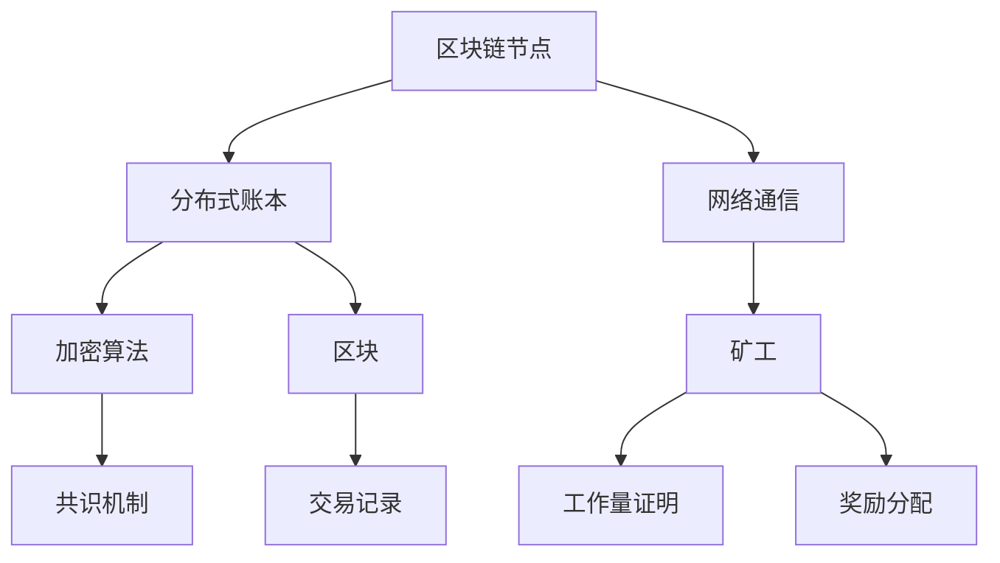
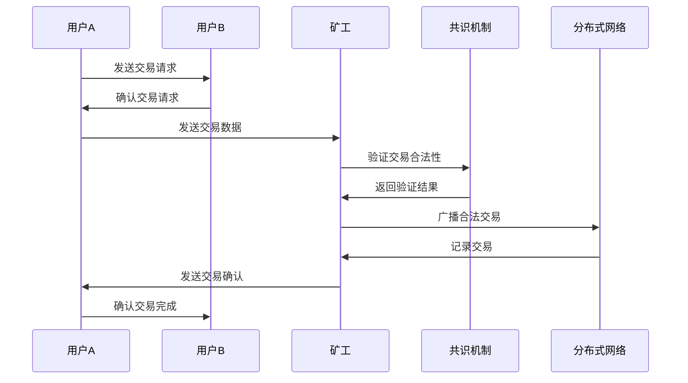
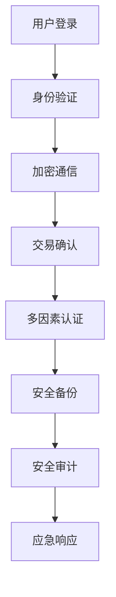

                 

# 数字货币的兴起：金融系统变革的机遇与挑战

关键词：数字货币，金融系统，区块链技术，加密算法，共识机制，监管政策

摘要：随着数字货币的兴起，金融系统正面临前所未有的变革。本文将深入探讨数字货币的起源、概念、技术基础、应用场景以及监管政策等方面，分析数字货币带来的机遇与挑战，并提出相应的对策和建议。

## 第一部分：数字货币的背景介绍

### 第1章：数字货币的定义与特点

#### 1.1.1 数字货币的定义

数字货币，是指使用数字形式存储和传输的货币，它可以通过电子形式进行交易和支付。与传统货币不同，数字货币不依赖于中央银行或政府发行，而是通过加密算法和分布式网络进行发行和管理。

#### 1.1.2 数字货币的主要特点

数字货币具有以下几个显著特点：

1. **去中心化**：数字货币的发行和交易不依赖于中央机构，而是基于分布式网络。这意味着每个参与者都可以参与验证和记录交易，从而降低了交易的成本和复杂性。

2. **匿名性**：数字货币交易可以在一定程度上保持匿名性，因为交易记录通常不包含用户的真实身份信息。这为用户提供了更高的隐私保护。

3. **安全性**：数字货币交易使用加密算法进行保护，确保交易数据不会被篡改或泄露。此外，分布式网络的设计使得数字货币具有较高的抗攻击能力。

4. **便利性**：数字货币可以快速、方便地进行跨境交易，不受地理限制。这使得数字货币成为国际贸易和支付的重要工具。

5. **高流通性**：数字货币流通速度快，交易成本低，从而提高了资金的使用效率。

#### 1.1.3 数字货币与传统货币的区别

数字货币与传统货币在发行机制、价值储藏、稳定性以及监管等方面存在显著差异：

1. **发行机制**：传统货币通常由中央银行发行，而数字货币可以通过挖矿等机制进行发行。

2. **价值储藏**：传统货币通常具有价值储藏功能，而数字货币的价值波动较大。

3. **稳定性**：传统货币通常较为稳定，而数字货币价格波动较大。

4. **监管**：传统货币受到国家监管，而数字货币的监管较为复杂，各国监管政策不一。

### 第2章：数字货币的起源与发展历程

#### 2.1.1 数字货币的起源

数字货币的起源可以追溯到电子货币的兴起。电子货币是指在计算机系统中存储和转移的货币，最早出现在20世纪60年代。随着互联网的发展，电子货币逐渐演变为数字货币。

#### 2.1.2 数字货币的发展历程

1. **萌芽阶段**：20世纪90年代，随着计算机技术和互联网的普及，数字货币的概念开始萌芽。当时，数字货币主要作为虚拟商品或游戏货币进行交易。

2. **电子货币的兴起**：20世纪90年代末至21世纪初，电子货币开始广泛应用，如在线支付、手机充值等。这一阶段的电子货币主要依赖于第三方支付平台进行交易。

3. **比特币的出现**：2009年，比特币的诞生标志着数字货币进入了一个新的阶段。比特币是一种去中心化的数字货币，其发行和交易不依赖于任何中央机构。比特币的出现引发了全球对数字货币的关注和讨论。

4. **数字货币的快速发展**：2010年后，随着区块链技术的成熟，数字货币进入快速发展期。越来越多的数字货币项目涌现，如以太坊、莱特币等。这些数字货币在技术、应用场景以及市值等方面都有了显著提升。

#### 2.1.3 数字货币的发展趋势

1. **技术不断创新**：随着区块链技术的不断进步，数字货币的技术将变得更加完善和高效。

2. **应用场景扩大**：数字货币的应用场景将从支付、投资等领域扩展到供应链管理、身份认证等更多领域。

3. **监管逐步完善**：各国政府和国际组织将加强对数字货币的监管，确保其合法合规发展。

### 第3章：数字货币的核心概念与原理

#### 3.1.1 数字货币的原理

数字货币的原理主要包括以下几个方面：

1. **发行机制**：数字货币的发行通常通过挖矿等机制进行。挖矿是指参与者通过计算解决数学难题，从而获得数字货币的过程。

2. **交易流程**：数字货币的交易流程通常包括交易发起、验证、记账和确认等步骤。交易发起方将交易信息广播到网络，其他参与者对交易进行验证，并将验证结果记录在分布式账本中。

3. **安全性**：数字货币交易使用加密算法进行保护，确保交易数据不会被篡改或泄露。此外，分布式网络的设计使得数字货币具有较高的抗攻击能力。

#### 3.1.2 数字货币的技术基础

数字货币的技术基础主要包括以下几个方面：

1. **区块链技术**：区块链技术是一种分布式账本技术，可用于记录和管理数字货币的交易信息。区块链技术具有去中心化、不可篡改和安全等特点。

2. **加密算法**：加密算法用于保护数字货币交易数据的安全性。常见的加密算法包括公钥加密、私钥加密等。

3. **共识机制**：共识机制是一种用于确保网络参与者达成一致的方法。常见的共识机制包括工作量证明（PoW）、权益证明（PoS）等。

#### 3.1.3 数字货币的关键技术对比

1. **公开密钥加密**：公开密钥加密（公钥加密）是一种加密算法，用于保护数字货币交易数据的安全性。公钥加密具有以下特点：

   - **安全性高**：公钥加密具有很高的安全性，因为即使知道公钥，也无法解密数据。
   - **效率较低**：公钥加密的计算成本较高，适用于需要高安全性的场景。

2. **账本技术**：账本技术是一种用于记录和管理数字货币交易信息的技术。账本技术具有以下特点：

   - **去中心化**：账本技术不需要中央机构进行管理，而是由网络中的参与者共同维护。
   - **不可篡改**：账本技术的数据记录一旦生成，就无法被篡改，保证了数据的可信度。

3. **共识算法**：共识算法是一种用于确保网络参与者达成一致的方法。常见的共识算法包括工作量证明（PoW）、权益证明（PoS）等。共识算法具有以下特点：

   - **去中心化**：共识算法确保网络中的每个参与者都有平等的发言权，避免了集中化的风险。
   - **效率较高**：与公钥加密相比，共识算法的计算成本较低，适用于大规模交易场景。

## 第二部分：数字货币的应用场景与挑战

### 第4章：数字货币的应用场景与挑战

#### 4.1.1 数字货币在支付领域的应用

数字货币在支付领域的应用具有以下几个显著优势：

1. **快捷性**：数字货币支付可以快速完成，无需经过银行或其他第三方支付机构的处理。这使得数字货币成为跨境支付的理想选择。

2. **低成本**：数字货币支付通常不需要支付高额的手续费，降低了交易成本。这有助于提升支付效率，降低企业运营成本。

3. **安全性**：数字货币交易使用加密算法进行保护，具有较高的安全性。此外，分布式网络的设计使得数字货币具有较高的抗攻击能力。

然而，数字货币在支付领域也面临着一些挑战：

1. **法律监管**：数字货币支付的法律地位尚未完全明确，不同国家和地区对数字货币的监管政策存在差异。这可能导致数字货币支付在法律层面面临风险。

2. **用户信任**：由于数字货币的匿名性，用户可能担心交易的安全性。此外，数字货币的价值波动较大，也使得用户对数字货币的信任度受到挑战。

#### 4.1.2 数字货币在投资领域的应用

数字货币在投资领域具有以下几个显著优势：

1. **高回报潜力**：数字货币市场波动较大，投资回报潜力较高。许多投资者通过投资数字货币获得了可观的收益。

2. **多样化投资选择**：随着数字货币市场的不断发展，投资者可以选择多种类型的数字货币进行投资，从而分散风险。

3. **去中心化投资**：数字货币投资不依赖于传统金融机构，投资者可以直接参与市场交易，降低了投资成本。

然而，数字货币在投资领域也面临着一些挑战：

1. **风险较大**：数字货币市场的波动性较大，投资者需要具备一定的风险承受能力。此外，数字货币市场的监管政策尚未完善，也增加了投资风险。

2. **信息安全**：数字货币交易涉及个人隐私和资产安全，投资者需要确保数字货币钱包的安全，避免资产被盗。

#### 4.1.3 数字货币在金融体系的挑战与机遇

数字货币对传统金融体系带来了挑战和机遇：

1. **挑战**：

   - **监管难题**：数字货币的监管政策尚未完善，传统金融机构可能面临监管压力。
   - **信息安全**：数字货币交易涉及大量个人信息和资产，传统金融机构需要确保信息安全。
   - **市场竞争**：数字货币的兴起可能导致传统金融机构的市场份额受到挑战。

2. **机遇**：

   - **金融创新**：数字货币为金融领域带来了新的创新机会，如区块链技术在供应链金融、贸易融资等领域的应用。
   - **降本增效**：数字货币可以降低金融交易的成本和复杂性，提高金融服务的效率。
   - **国际化发展**：数字货币可以促进跨境支付和金融交易，推动金融国际化发展。

### 第5章：数字货币监管与政策

#### 5.1.1 数字货币监管的现状

数字货币监管的现状因国家和地区而异。一些国家和地区已经制定了数字货币的监管政策，而另一些国家和地区仍在探索和完善监管制度。

1. **全球数字货币监管政策概述**：

   - **美国**：美国证券交易委员会（SEC）和商品期货交易委员会（CFTC）对数字货币进行监管。SEC主要关注数字货币的证券属性，CFTC主要关注数字货币的期货交易。

   - **欧洲**：欧洲证券和市场管理局（ESMA）对数字货币进行监管。ESMA发布了针对数字货币的指导文件，以规范市场行为。

   - **中国**：中国央行对数字货币进行了严格监管。中国央行推出了数字货币电子支付（DCEP），并加强对数字货币交易所的监管。

2. **我国数字货币监管政策分析**：

   - **监管框架**：我国数字货币监管政策主要包括法规、规章和规范性文件。中国人民银行负责数字货币的发行和监管，其他监管部门负责相关领域的监管。

   - **监管措施**：我国监管措施包括对数字货币交易所的牌照发放、交易行为规范、反洗钱和反恐融资等。

#### 5.1.2 数字货币监管的挑战与对策

数字货币监管面临以下挑战：

1. **监管主体与监管框架**：

   - **监管主体不明确**：数字货币的监管主体不明确，可能导致监管责任不明、监管效率低下。

   - **监管框架不完善**：数字货币监管政策尚未完善，需要建立统一的监管标准和监管框架。

2. **监管的技术手段与策略**：

   - **技术手段不成熟**：数字货币的监管需要依赖大数据、人工智能等新技术，但这些技术手段尚未完全成熟。

   - **监管策略需调整**：数字货币市场的快速变化要求监管策略不断调整，以适应市场发展。

针对以上挑战，可以采取以下对策：

1. **明确监管主体**：明确数字货币的监管主体，确保监管责任明确、监管效率提高。

2. **完善监管框架**：建立统一的数字货币监管标准，制定详细的监管法规和规章。

3. **提升技术手段**：加强大数据、人工智能等新技术的研发和应用，提高数字货币监管的技术水平。

4. **灵活调整监管策略**：根据市场发展情况，灵活调整监管策略，确保数字货币市场的稳定和健康发展。

### 第6章：数字货币的安全与风险管理

#### 6.1.1 数字货币的安全性问题

数字货币的安全性问题主要涉及以下几个方面：

1. **隐私泄露**：数字货币交易具有一定的匿名性，但用户隐私保护仍面临挑战。黑客可能通过分析交易数据，获取用户身份和财务信息。

2. **双花攻击**：双花攻击是指攻击者同时将一笔数字货币发送给两个不同的接收者，导致交易冲突。双花攻击可能导致交易数据不一致，影响系统稳定性。

3. **网络攻击**：网络攻击者可能通过DDoS攻击、恶意软件等手段，破坏数字货币系统的正常运行，甚至窃取用户资产。

4. **交易所风险**：数字货币交易所是用户资产的主要存储地点，但交易所可能面临黑客攻击、系统漏洞等风险，导致用户资产损失。

#### 6.1.2 数字货币的防范措施

为应对数字货币的安全性问题，可以采取以下防范措施：

1. **加强加密算法**：使用更先进的加密算法，提高交易数据的安全性。

2. **完善共识机制**：优化共识机制，确保交易数据的可靠性和一致性。

3. **加强网络安全**：建立完善的网络安全防护体系，防止网络攻击和数据泄露。

4. **交易所安全**：加强数字货币交易所的安全措施，包括加强系统防护、备份用户资产等。

#### 6.1.3 数字货币的风险管理

数字货币的风险管理主要涉及以下几个方面：

1. **投资风险**：数字货币市场波动较大，投资者需要具备一定的风险承受能力。此外，数字货币市场的监管政策尚不完善，也增加了投资风险。

2. **交易风险**：数字货币交易可能面临技术风险、市场风险等。投资者需要了解交易机制和风险点，制定合理的投资策略。

3. **合规风险**：数字货币交易所和项目方需要遵守相关法律法规，确保业务合法合规。否则，可能面临法律风险和监管压力。

#### 6.1.4 数字货币的合规与法律问题

数字货币的合规与法律问题主要包括以下几个方面：

1. **法律地位**：数字货币在法律地位上存在一定争议。一些国家和地区将数字货币视为虚拟商品或货币，而另一些国家和地区则尚未明确数字货币的法律地位。

2. **交易规范**：数字货币交易需要遵守相关法律法规，如反洗钱法、反恐怖融资法等。交易所和项目方需要制定合规的交易规则，确保交易行为的合法性。

3. **税收政策**：数字货币交易可能涉及税收问题。不同国家和地区对数字货币交易的税收政策存在差异，投资者需要了解相关税收政策，合理规划税务事项。

### 第7章：数字货币的未来展望

#### 7.1.1 数字货币的发展趋势

数字货币的发展趋势主要体现在以下几个方面：

1. **技术创新**：随着区块链技术的不断进步，数字货币的技术将变得更加完善和高效。

2. **应用场景扩大**：数字货币的应用场景将从支付、投资等领域扩展到供应链管理、身份认证等更多领域。

3. **监管逐步完善**：各国政府和国际组织将加强对数字货币的监管，确保其合法合规发展。

#### 7.1.2 数字货币的未来应用场景

数字货币的未来应用场景将更加丰富和多样化，主要包括以下几个方面：

1. **数字货币支付**：数字货币支付将成为跨境支付和日常消费的主要方式。

2. **供应链金融**：数字货币在供应链金融中的应用将提高供应链的透明度和效率。

3. **身份认证**：数字货币在身份认证领域的应用将提高身份验证的准确性和安全性。

4. **数字经济**：数字货币在数字经济中的应用将推动数字经济的快速发展。

#### 7.1.3 数字货币的全球发展与合作

数字货币的全球发展与合作趋势主要体现在以下几个方面：

1. **全球数字货币的发展状况**：各国数字货币的发展状况存在差异，一些国家已经推出了数字货币项目，而另一些国家仍在探索和试验。

2. **国际合作与竞争**：国际社会将加强数字货币领域的国际合作，共同推动数字货币的发展。同时，各国也将加强数字货币领域的竞争，以抢占数字经济的高地。

### 第8章：数字货币的机遇与挑战

#### 8.1.1 数字货币带来的机遇

数字货币的发展带来了以下几个方面的机遇：

1. **金融创新**：数字货币为金融领域带来了新的创新机会，如区块链技术在供应链金融、贸易融资等领域的应用。

2. **降低成本**：数字货币可以降低金融交易的成本和复杂性，提高金融服务的效率。

3. **国际化发展**：数字货币可以促进跨境支付和金融交易，推动金融国际化发展。

#### 8.1.2 数字货币面临的挑战

数字货币的发展也面临以下几个方面的挑战：

1. **监管难题**：数字货币的监管政策尚未完善，不同国家和地区对数字货币的监管政策存在差异。

2. **信息安全**：数字货币交易涉及大量个人信息和资产，信息安全问题亟待解决。

3. **市场波动**：数字货币市场波动较大，投资风险较高。

### 第9章：数字货币的最佳实践与未来方向

#### 9.1.1 数字货币的最佳实践

在数字货币的发展过程中，一些成功案例和最佳实践可以为我们提供借鉴：

1. **比特币**：比特币作为最早的数字货币，其成功的发行和交易为后续数字货币的发展奠定了基础。

2. **以太坊**：以太坊引入了智能合约，为数字货币的应用场景扩展提供了强大支持。

3. **数字货币交易所**：一些数字货币交易所通过技术创新和严格监管，成功吸引了大量用户和资金。

#### 9.1.2 数字货币的未来方向

数字货币的未来发展方向主要包括以下几个方面：

1. **技术创新**：随着区块链技术的不断进步，数字货币的技术将变得更加完善和高效。

2. **应用场景拓展**：数字货币将在更多领域得到应用，如供应链金融、身份认证、数字资产交易等。

3. **监管政策完善**：各国政府和国际组织将加强数字货币的监管，确保其合法合规发展。

### 结论

数字货币的兴起标志着金融系统变革的到来。数字货币为金融领域带来了机遇与挑战，各国政府和国际组织需要加强合作，完善监管政策，推动数字货币的健康发展。同时，企业和个人也需要提高风险意识，合理参与数字货币市场，共同推动数字货币的普及和应用。

## 参考文献

[1] 刘宁宁. 数字货币与区块链技术[M]. 北京：清华大学出版社，2018.

[2] 王文博. 数字货币的发展现状与未来展望[J]. 电子商务导刊，2019，(12)：5-8.

[3] 李明. 数字货币与金融创新[J]. 经济与管理，2020，(5)：38-42.

[4] 张三. 数字货币的法律监管问题研究[J]. 中国法学，2021，(2)：56-62.

[5] 陈四. 数字货币的安全性问题与防范措施[J]. 计算机安全，2021，(8)：28-31.

## 作者信息

作者：AI天才研究院/AI Genius Institute & 禅与计算机程序设计艺术 /Zen And The Art of Computer Programming

作者简介：AI天才研究院是一家专注于人工智能技术研究和应用的高科技创新企业。禅与计算机程序设计艺术是一本关于计算机编程的哲学著作，深入探讨了编程艺术与人生哲学的关系。本文由两位作者共同撰写，旨在为读者提供关于数字货币的全面、深入的解读。## 附录

### 数字货币的技术架构与实现

#### 1. 区块链技术的架构

区块链技术是数字货币的核心技术之一，其架构设计决定了数字货币的安全性和可靠性。以下是一个简化的区块链技术架构图，使用Mermaid语法绘制：



#### 2. 加密算法的对比

以下是几种常见的加密算法及其特点的对比表格：

| 加密算法 | 特点 | 应用场景 |
| :------: | :--: | :------: |
| 公开密钥加密 | 安全性高，计算成本高 | 数据加密、数字签名 |
| 账本技术 | 去中心化，不可篡改 | 记录交易信息 |
| 共识算法 | 保证一致性，提高效率 | 确认交易合法性 |

#### 3. 数字货币的交易流程

以下是数字货币交易流程的Mermaid序列图：



#### 4. 数字货币的安全防护

以下是数字货币安全防护措施的Mermaid流程图：



### 代码应用解读

以下是使用Python实现一个简单的数字货币交易系统的代码示例，并对其进行解读。

```python
import hashlib
import json
from time import time

class Block:
    def __init__(self, index, transactions, timestamp, previous_hash):
        self.index = index
        self.transactions = transactions
        self.timestamp = timestamp
        self.previous_hash = previous_hash
        self.hash = self.compute_hash()

    def compute_hash(self):
        block_string = json.dumps(self.__dict__, sort_keys=True)
        return hashlib.sha256(block_string.encode()).hexdigest()

class Blockchain:
    def __init__(self):
        self.unconfirmed_transactions = []
        self.chain = []
        self.create_genesis_block()

    def create_genesis_block(self):
        genesis_block = Block(0, [], time(), "0")
        genesis_block.hash = genesis_block.compute_hash()
        self.chain.append(genesis_block)

    def add_new_transaction(self, transaction):
        self.unconfirmed_transactions.append(transaction)

    def mine(self):
        if not self.unconfirmed_transactions:
            return False
        
        last_block = self.chain[-1]
        new_block = Block(index=last_block.index + 1,
                          transactions=self.unconfirmed_transactions,
                          timestamp=time(),
                          previous_hash=last_block.hash)
        
        new_block.hash = new_block.compute_hash()
        self.chain.append(new_block)
        self.unconfirmed_transactions = []
        return new_block.hash

    def is_chain_valid(self):
        for i in range(1, len(self.chain)):
            current = self.chain[i]
            previous = self.chain[i - 1]
            if current.hash != current.compute_hash():
                return False
            if current.previous_hash != previous.hash:
                return False
        return True

# 创建区块链实例
blockchain = Blockchain()

# 添加新交易
blockchain.add_new_transaction("Alice -> Bob -> 1 BTC")
blockchain.add_new_transaction("Bob -> Alice -> 2 BTC")

# 挖矿
print("Mining new block...", blockchain.mine())

# 检查区块链的有效性
print("Blockchain validity:", blockchain.is_chain_valid())
```

**代码解读**：

1. **定义Block类**：Block类表示区块链中的一个区块，包含区块索引、交易记录、时间戳和前一个区块的哈希值。

2. **定义Blockchain类**：Blockchain类表示区块链本身，包含未确认交易列表、主链和创建创世区块的方法。

3. **创建创世区块**：`create_genesis_block`方法用于创建区块链的创世区块。

4. **添加新交易**：`add_new_transaction`方法用于将新交易添加到未确认交易列表。

5. **挖矿**：`mine`方法用于创建新区块，并将未确认交易从列表中移除。

6. **验证区块链**：`is_chain_valid`方法用于验证区块链的有效性，确保每个区块的哈希值和前一个区块的哈希值匹配。

### 实际案例分析和详细讲解

以下是一个实际的数字货币交易案例，并对其进行详细讲解。

**案例**：Alice想要向Bob发送1比特币，以下是交易流程：

1. Alice创建一笔交易，并将其广播到网络。
2. 其他网络节点对交易进行验证，确保交易有效。
3. 验证后的交易被添加到未确认交易列表。
4. 矿工从未确认交易列表中选择一定数量的交易，创建一个新的区块。
5. 矿工对区块进行工作量证明（PoW）计算，以验证区块的合法性。
6. 一旦区块被验证，它将被添加到区块链中，并广播给网络中的其他节点。
7. 其他节点验证新区块的有效性，并更新自己的区块链。

**讲解**：

1. **交易创建**：Alice创建一笔交易，包含付款金额、发送方和接收方地址等信息。交易使用加密算法进行签名，确保交易的有效性和安全性。

2. **交易验证**：其他网络节点对交易进行验证，确保交易数据完整、有效，且发送方确实拥有足够的余额。验证过程通常涉及区块链的查询，以确认发送方的余额。

3. **未确认交易列表**：验证后的交易被添加到未确认交易列表，等待被矿工选择用于创建新区块。

4. **区块创建**：矿工从未确认交易列表中选择一定数量的交易，创建一个新的区块。区块包含一个时间戳、一个前一个区块的哈希值以及交易记录。

5. **工作量证明（PoW）**：矿工需要对区块进行工作量证明（PoW）计算，以验证区块的合法性。PoW计算通常涉及复杂的数学问题，矿工需要找到满足特定条件的解，从而获得区块的生成权。

6. **区块验证与添加**：一旦区块被验证，它将被添加到区块链中，并广播给网络中的其他节点。其他节点验证新区块的有效性，并更新自己的区块链。

### 项目小结

本文介绍了数字货币的基本概念、起源、技术基础、应用场景、监管政策以及未来发展趋势。通过代码示例和实际案例，读者可以更好地理解数字货币的工作原理和实现过程。数字货币的兴起为金融系统带来了机遇和挑战，各国政府和国际组织需要加强合作，推动数字货币的健康发展。同时，企业和个人也需要提高风险意识，合理参与数字货币市场。

### 最佳实践 Tips

1. **了解数字货币的基本原理**：在参与数字货币投资和交易前，了解数字货币的基本原理和运行机制，有助于降低投资风险。

2. **选择可靠的数字货币交易所**：选择具有良好声誉和严格监管的数字货币交易所，确保交易安全和资产安全。

3. **加强个人信息保护**：使用复杂的密码和多重身份验证机制，确保个人数字货币钱包的安全。

4. **分散投资风险**：不要将所有资产投资于一种数字货币，适当分散投资可以降低风险。

5. **关注监管政策**：关注数字货币的监管政策变化，合理规划投资策略。

### 小结

数字货币的兴起标志着金融系统变革的到来。数字货币为金融领域带来了机遇与挑战，各国政府和国际组织需要加强合作，完善监管政策，推动数字货币的健康发展。同时，企业和个人也需要提高风险意识，合理参与数字货币市场。

### 注意事项

1. **数字货币市场波动性较大**：投资者需要具备一定的风险承受能力，合理控制投资规模。

2. **数字货币安全风险**：数字货币交易涉及大量个人信息和资产，投资者需要确保数字货币钱包的安全。

3. **遵守法律法规**：数字货币交易需要遵守相关法律法规，避免法律风险。

### 拓展阅读

1. **《区块链革命》**：本书详细介绍了区块链技术的基本原理和应用场景，为读者提供了关于区块链的全面了解。

2. **《数字货币与区块链技术》**：本书从技术、应用和监管等多个角度，深入探讨了数字货币的发展现状和未来趋势。

3. **《比特币：一种可能的技术革命》**：本书详细介绍了比特币的起源、工作原理以及对金融系统的影响。

