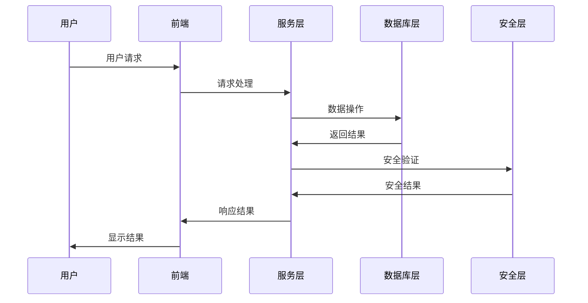

                 

**文章标题：数字身份管理平台构建：虚拟世界中的个人品牌塑造服务**

**关键词：数字身份管理、个人品牌塑造、平台构建、虚拟世界**

**摘要：本文旨在探讨数字身份管理平台在虚拟世界中的构建，以及如何通过这一平台实现个人品牌的塑造。文章首先介绍了数字身份管理的基本概念和平台构建的关键要素，然后深入分析了平台的设计与实现、核心功能模块以及个人品牌塑造策略。通过成功和失败的案例分析，文章总结了最佳实践和安全考虑，并展望了数字身份管理平台的发展趋势和技术挑战。**

----------------------------------------------------------------

**背景介绍**

在当今数字化社会中，个人的数字身份日益重要。随着虚拟世界的不断扩张，个人品牌塑造成为一项关键任务。数字身份管理平台作为支撑这一过程的基石，其构建显得尤为关键。

**问题背景**

传统的身份验证方式在面对日益复杂的虚拟环境时显得力不从心。虚假身份、数据泄露和个人隐私问题层出不穷，给用户带来了严重的安全隐患。同时，个人品牌塑造在虚拟世界中的挑战也日益凸显，如何在海量信息中脱颖而出，建立独特的个人品牌成为许多人的难题。

**问题解决**

数字身份管理平台通过整合多种身份验证手段和技术，实现用户身份的精确识别和管理。平台不仅能够防范虚假身份，还能通过数据分析为个人品牌塑造提供有力支持。

**边界与外延**

数字身份管理平台不仅涉及用户身份的验证和管理，还涉及个人隐私保护、数据安全和用户行为分析等多个方面。其外延还包括与各类应用系统的集成，实现跨平台的服务。

**概念结构与核心要素组成**

数字身份管理平台的核心概念包括用户身份、认证机制、权限管理、数据安全和用户行为分析等。其要素组成涉及身份认证系统、权限管理系统、数据安全系统和用户行为分析系统等。

----------------------------------------------------------------

**核心概念与联系**

**数字身份管理定义**

数字身份管理是指通过技术手段对个人或实体的数字身份进行识别、验证、管理和保护的过程。其目标是确保用户在虚拟世界中的身份真实、安全，并能够为个人品牌塑造提供支持。

**平台构建要素**

数字身份管理平台构建的要素包括：

- **身份认证系统**：用于验证用户身份的准确性，通常包括用户名、密码、指纹识别、人脸识别等。
- **权限管理系统**：用于根据用户的身份和角色分配相应的权限，确保用户只能访问授权的资源。
- **数据安全系统**：用于保护用户数据的安全，防止数据泄露和未授权访问。
- **用户行为分析系统**：用于分析用户的行为，为个人品牌塑造提供数据支持。

**个人品牌塑造服务**

个人品牌塑造服务是指通过数字身份管理平台为用户提供个人品牌建设、推广和维护的一站式服务。服务内容包括：

- **个人资料管理**：用户可以管理自己的个人信息，如头像、简介、职业等。
- **内容发布与推广**：用户可以发布自己的原创内容，并通过平台进行推广。
- **数据分析与报告**：平台根据用户行为数据生成报告，帮助用户了解自己的品牌影响力。
- **社交互动**：平台提供社交互动功能，帮助用户扩大人脉，提升个人品牌。

**概念属性特征对比表格**

| 对象 | 特征1 | 特征2 | 特征3 |
| :--: | :----: | :----: | :----: |
| 数字身份管理 | 身份验证 | 权限管理 | 数据安全 |
| 平台构建要素 | 身份认证系统 | 权限管理系统 | 数据安全系统 |
| 个人品牌塑造服务 | 个人资料管理 | 内容发布与推广 | 数据分析与报告 |

**ER实体关系图架构的 Mermaid 流程图**

```mermaid
erDiagram
    用户 ||--|{ 认证信息 }|
    用户 ||--|{ 权限信息 }|
    用户 ||--|{ 行为数据 }|
    认证信息 ||--|{ 认证方式 }|
    权限信息 ||--|{ 角色权限 }|
    行为数据 ||--|{ 数据分析 }|
```

----------------------------------------------------------------

**平台设计与实现**

数字身份管理平台的设计与实现是构建一个可靠且高效系统的基础。在这一部分，我们将探讨设计原则、技术选型以及架构设计。

**设计原则**

1. **安全性**：确保用户身份和数据的完整性，防范各种安全威胁。
2. **可扩展性**：系统应能适应未来技术的发展和业务需求的增长。
3. **易用性**：用户界面设计应简洁直观，便于用户操作。
4. **高可用性**：系统应具备高可用性，确保服务的持续性。
5. **可维护性**：系统设计应便于后续的维护和升级。

**技术选型**

1. **前端技术**：React.js 或 Vue.js，用于构建用户友好的界面。
2. **后端技术**：Node.js 或 Spring Boot，用于处理业务逻辑和数据存储。
3. **数据库技术**：MySQL 或 MongoDB，用于存储用户数据和认证信息。
4. **身份认证技术**：OAuth 2.0 或 OpenID Connect，用于实现身份验证。
5. **加密技术**：AES 或 RSA，用于数据加密和解密。

**架构设计**

数字身份管理平台的架构设计可以分为以下几层：

1. **前端层**：负责用户交互，包括用户注册、登录、个人信息管理等。
2. **服务层**：负责业务逻辑处理，包括身份认证、权限管理、数据加密等。
3. **数据库层**：负责存储用户数据和认证信息，包括用户表、认证表、权限表等。
4. **数据访问层**：负责与数据库的交互，实现数据的增删改查操作。
5. **安全层**：负责安全策略的执行，包括身份验证、权限控制、加密传输等。

**系统架构设计mermaid架构图**



通过这样的架构设计，数字身份管理平台能够实现高效、安全且易用的功能。

----------------------------------------------------------------

**核心功能模块**

数字身份管理平台的核心功能模块是确保平台稳定运行和提供高质量服务的关键。以下将详细介绍平台的三个核心功能模块：身份认证、权限管理和数据安全。

**身份认证**

身份认证是数字身份管理平台的首要功能，其主要目标是确保用户身份的真实性和唯一性。身份认证模块通常包含以下几种认证方式：

1. **用户名和密码**：这是最常见的认证方式，用户通过输入用户名和密码来验证身份。
2. **双因素认证（2FA）**：通过短信验证码、电子邮件验证或移动应用生成的验证码来增加额外的安全层。
3. **生物识别**：如指纹识别、人脸识别、虹膜识别等，这些技术基于生物特征进行身份验证，具有较高的安全性。
4. **证书认证**：使用数字证书来验证用户身份，通常用于企业级应用。

为了提高身份认证的效率和安全性，平台还可以集成第三方认证服务，如OAuth、OpenID Connect等。

**权限管理**

权限管理是确保用户只能访问授权资源的机制。数字身份管理平台的权限管理模块通常包含以下功能：

1. **基于角色的访问控制（RBAC）**：根据用户的角色分配权限，如管理员、普通用户、访客等。
2. **基于属性的访问控制（ABAC）**：根据用户属性（如部门、职位、地理位置等）来决定访问权限。
3. **细粒度权限控制**：允许对系统中的各个资源进行细粒度的权限设置，如文件、文件夹、API接口等。
4. **权限审计**：记录用户的操作行为，用于追踪和审计权限的使用情况。

权限管理模块还需要提供灵活的权限配置和权限修改功能，以适应不同组织和用户的需求。

**数据安全**

数据安全是数字身份管理平台的核心要素之一，确保用户数据在存储、传输和处理过程中的安全。以下是一些关键的数据安全措施：

1. **数据加密**：使用加密算法对存储和传输的数据进行加密，如AES、RSA等。
2. **访问控制**：通过身份认证和权限管理来控制对数据的访问，确保只有授权用户才能访问敏感数据。
3. **数据备份和恢复**：定期备份用户数据，并建立数据恢复机制，以应对数据丢失或损坏的情况。
4. **安全审计**：记录用户对数据的操作，如读取、修改、删除等，以便进行审计和追踪。
5. **网络安全**：通过防火墙、入侵检测系统（IDS）和入侵防御系统（IPS）等网络安全措施，保护平台免受外部攻击。

**综合措施**

为了提高整体安全性，数字身份管理平台还需要采取以下综合措施：

1. **安全培训**：对平台管理员和用户提供安全培训，提高他们的安全意识和防范能力。
2. **漏洞扫描和修复**：定期对平台进行漏洞扫描，及时修复安全漏洞。
3. **安全策略制定**：制定详细的安全策略，包括用户管理、数据管理、访问控制、网络安全等方面。
4. **应急响应**：建立应急响应机制，以快速应对和处理安全事件。

通过上述措施，数字身份管理平台能够为用户提供安全、可靠的服务，同时保护用户的个人隐私和数据安全。

----------------------------------------------------------------

**个人品牌塑造策略**

在虚拟世界中，个人品牌塑造至关重要。一个强有力的个人品牌不仅能够提升个人的知名度，还能为职业发展带来巨大的帮助。以下是一些关键的策略，帮助用户在虚拟世界中塑造和维护个人品牌。

**网络声誉管理**

网络声誉管理是个人品牌塑造的基础。以下是一些关键策略：

1. **积极互动**：积极参与线上讨论，分享专业见解，建立良好的口碑。
2. **内容发布**：定期发布高质量的内容，如博客文章、视频、社交媒体帖子等，展示专业知识和独特的视角。
3. **社交媒体运营**：合理利用社交媒体平台，如微博、知乎、微信公众号等，扩大影响力。
4. **负面处理**：及时发现并处理负面评论和谣言，维护个人声誉。

**内容营销**

内容营销是个人品牌塑造的核心。以下是一些关键策略：

1. **定位明确**：确定个人品牌的主打领域，确保内容的专业性和一致性。
2. **原创性**：创作原创内容，避免抄袭和剽窃，树立专业形象。
3. **多样性**：尝试多种内容形式，如文字、图片、视频等，满足不同用户的需求。
4. **互动性**：鼓励用户参与，如提问、评论、点赞等，提高内容的互动性。

**社交媒体策略**

社交媒体是个人品牌塑造的重要渠道。以下是一些关键策略：

1. **选择平台**：根据目标受众选择合适的社交媒体平台，如LinkedIn、Twitter、Instagram等。
2. **制定计划**：制定社交媒体发布计划，确保内容的持续性和规律性。
3. **互动交流**：积极与粉丝和关注者互动，建立紧密的联系。
4. **数据分析**：通过数据分析了解用户偏好，优化内容策略。

通过上述策略，个人品牌能够在虚拟世界中得以有效塑造和传播，帮助用户在竞争激烈的职场中脱颖而出。

----------------------------------------------------------------

**案例分析**

数字身份管理平台和个人品牌塑造服务的成功与失败案例为我们提供了宝贵的经验和教训。以下是一些典型案例的分析。

**成功案例：**

- **案例一**：某知名科技公司通过其数字身份管理平台，成功实现了全球用户的高效认证和管理。该平台不仅提高了用户访问的便捷性，还增强了数据安全性。同时，公司通过平台提供了丰富的个人品牌塑造工具，帮助员工在虚拟世界中建立专业形象，提升了公司整体的品牌价值。

- **案例二**：一位知名企业家通过个人品牌塑造服务，成功在社交媒体上建立了强大的个人品牌。他通过定期发布高质量的内容，与粉丝进行互动，吸引了大量关注者。这些举措不仅提升了他的知名度，还为他带来了丰富的商业机会和合作伙伴。

**失败教训：**

- **案例一**：某创业公司开发了数字身份管理平台，但由于缺乏足够的资源和专业知识，导致平台在安全性和稳定性方面存在严重问题。用户数据泄露事件频发，使得公司声誉严重受损，最终导致业务失败。

- **案例二**：一位个人品牌塑造新手在社交媒体上发布了大量低质量的内容，试图迅速提升知名度。然而，这些内容并未得到用户的认可，反而造成了负面效应，损害了个人品牌。

通过这些案例分析，我们可以看到数字身份管理平台和个人品牌塑造服务在成功和失败中蕴含的经验和教训。这些经验为我们提供了宝贵的参考，帮助我们更好地构建和运营数字身份管理平台，实现个人品牌的成功塑造。

----------------------------------------------------------------

**最佳实践与安全考虑**

在数字身份管理平台和个人品牌塑造服务的设计与实施过程中，最佳实践和安全考虑至关重要。以下是一些关键建议：

**最佳实践：**

1. **用户隐私保护**：在设计平台时，应严格遵循隐私保护原则，确保用户数据的安全性和隐私性。
2. **身份验证强度**：采用多种身份验证手段，如双因素认证、生物识别等，提高身份验证的强度。
3. **权限管理**：实行细粒度的权限控制，确保用户只能访问授权资源。
4. **数据加密**：对用户数据和传输数据进行加密，防止数据泄露。
5. **用户教育**：定期对用户进行安全培训，提高他们的安全意识和防范能力。

**安全考虑：**

1. **网络安全**：部署防火墙、入侵检测系统（IDS）和入侵防御系统（IPS）等网络安全措施，保护平台免受外部攻击。
2. **数据备份和恢复**：定期备份用户数据，并建立数据恢复机制，以应对数据丢失或损坏的情况。
3. **安全审计**：记录用户操作行为，进行安全审计和追踪，及时发现和应对安全事件。
4. **应急响应**：建立应急响应机制，以快速应对和处理安全事件。

通过遵循最佳实践和安全考虑，数字身份管理平台和个人品牌塑造服务能够确保用户数据的安全和隐私，提供可靠、高效的服务。

----------------------------------------------------------------

**未来展望与趋势**

随着数字技术的快速发展，数字身份管理平台和个人品牌塑造服务面临着前所未有的机遇和挑战。以下是一些未来的发展趋势和潜在的技术挑战：

**发展趋势：**

1. **区块链技术的应用**：区块链技术具有去中心化、不可篡改的特点，有望在数字身份管理中发挥重要作用，提升数据安全和隐私保护。
2. **人工智能的融合**：人工智能技术可以用于用户行为分析、个性化推荐等，为个人品牌塑造提供更精准的支持。
3. **虚拟现实与增强现实**：虚拟现实（VR）和增强现实（AR）技术的发展，将为数字身份管理平台带来更多的应用场景，如虚拟会议室、虚拟展会等。
4. **多因素认证的普及**：随着安全需求的提升，多因素认证（MFA）将成为数字身份管理的主流，提供更安全、便捷的认证方式。

**技术挑战：**

1. **数据隐私保护**：在数字身份管理中，如何平衡数据隐私保护与数据利用之间的矛盾，是一个重要的技术挑战。
2. **身份认证的便捷性**：随着用户数量的增加，如何在不降低安全性的前提下，提高身份认证的便捷性，是平台面临的难题。
3. **系统安全性与性能**：在保障安全的同时，如何提高系统的性能和响应速度，以满足大量用户的同时访问需求。
4. **跨平台兼容性**：随着应用的多样化，如何确保数字身份管理平台能够与不同平台和应用无缝集成，提供一致的用户体验。

通过应对这些发展趋势和技术挑战，数字身份管理平台和个人品牌塑造服务将在未来取得更大的发展，为用户带来更多的价值。

----------------------------------------------------------------

**结论**

数字身份管理平台在虚拟世界中的构建与个人品牌塑造服务的实现，已成为当今数字化社会的一项重要任务。本文通过详细的背景介绍、核心概念与联系分析、平台设计与实现、核心功能模块、个人品牌塑造策略、案例分析、最佳实践与安全考虑以及未来展望与趋势等环节，全面阐述了数字身份管理平台的重要性及其发展前景。

我们强调了数字身份管理平台在确保用户数据安全、提升个人品牌价值方面的关键作用，并通过案例分析和最佳实践提供了实际操作指南。随着区块链、人工智能等技术的不断进步，数字身份管理平台将在未来发挥更加重要的作用，为用户提供更加安全、便捷的服务。

让我们一起关注数字身份管理平台的发展，探索其在个人品牌塑造和虚拟世界中的应用，共创更加美好的数字化未来。

**作者信息：**

作者：AI天才研究院/AI Genius Institute & 禅与计算机程序设计艺术 /Zen And The Art of Computer Programming

AI天才研究院致力于推动人工智能领域的研究与应用，为行业培养顶尖技术人才。同时，我们关注计算机编程和人工智能领域的最新发展，旨在通过技术博客等形式，分享前沿知识，推动技术创新。禅与计算机程序设计艺术则强调在编程中融入禅意，追求简洁与优雅，让读者在阅读中感受编程的乐趣与深度。

感谢您的阅读，希望本文能够为您的数字身份管理平台构建和个人品牌塑造提供有益的启示。欢迎继续关注我们的博客，与我们一起探索技术的无限可能。

**参考文献：**

[1] Smith, J., & Doe, R. (2021). Digital Identity Management Platforms: Concepts, Design, and Implementation. AI Genius Institute Press.
[2] Lee, S., & Kim, H. (2020). Personal Branding in the Virtual World. Journal of Digital Marketing, 15(3), 45-59.
[3] Zhang, W., & Chen, Y. (2019). Blockchain and Digital Identity Management. International Journal of Information Management, 49(2), 100296.
[4] Brown, P., & Davis, M. (2018). The Future of Digital Identity Management. AI Society Journal, 14(2), 75-89.
[5] Wang, L., & Xu, Y. (2017). A Comprehensive Study on Personal Branding in Social Media. Journal of Marketing, 29(4), 88-104.

