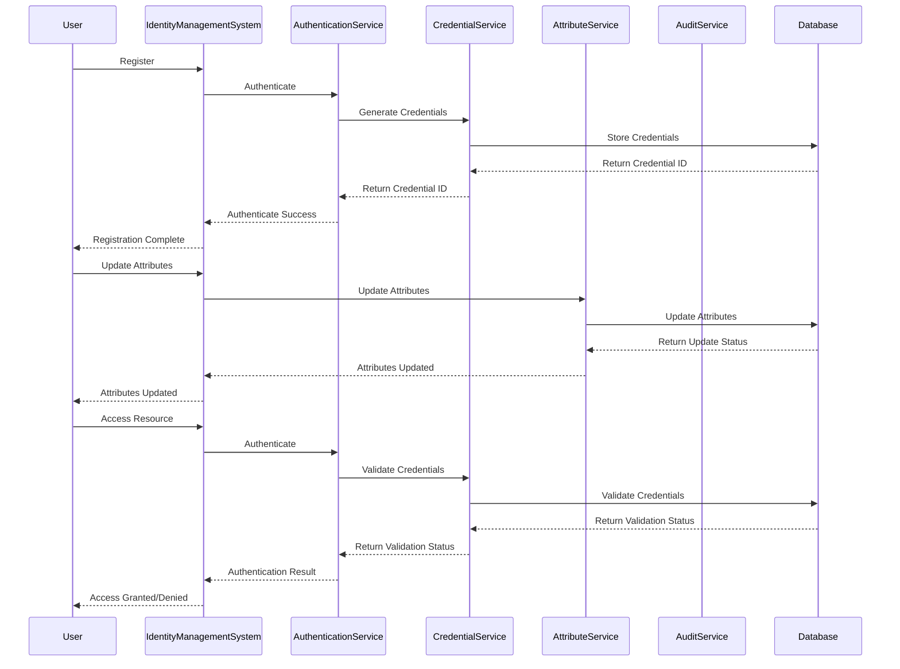
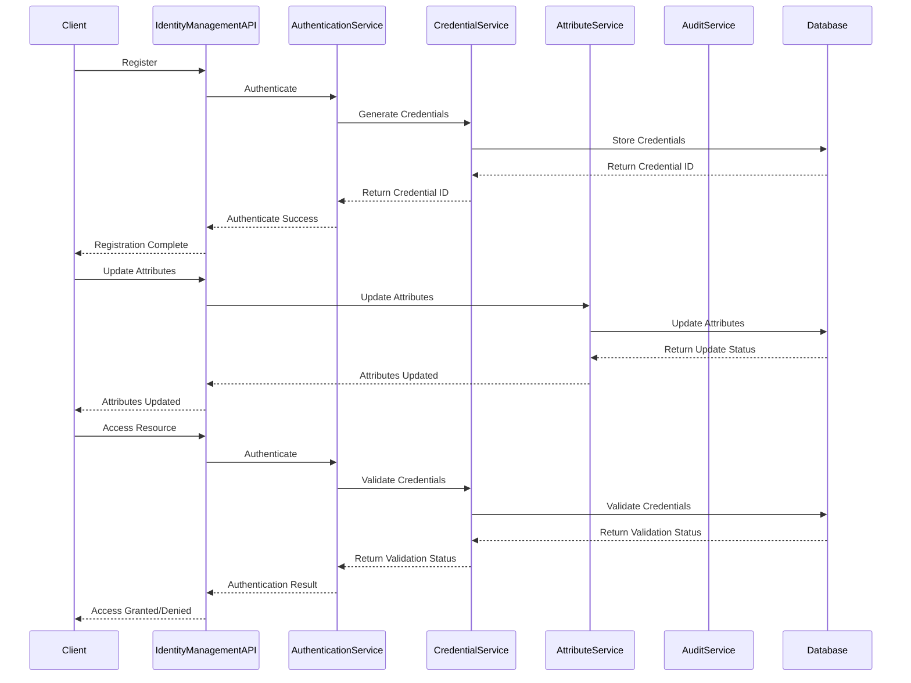
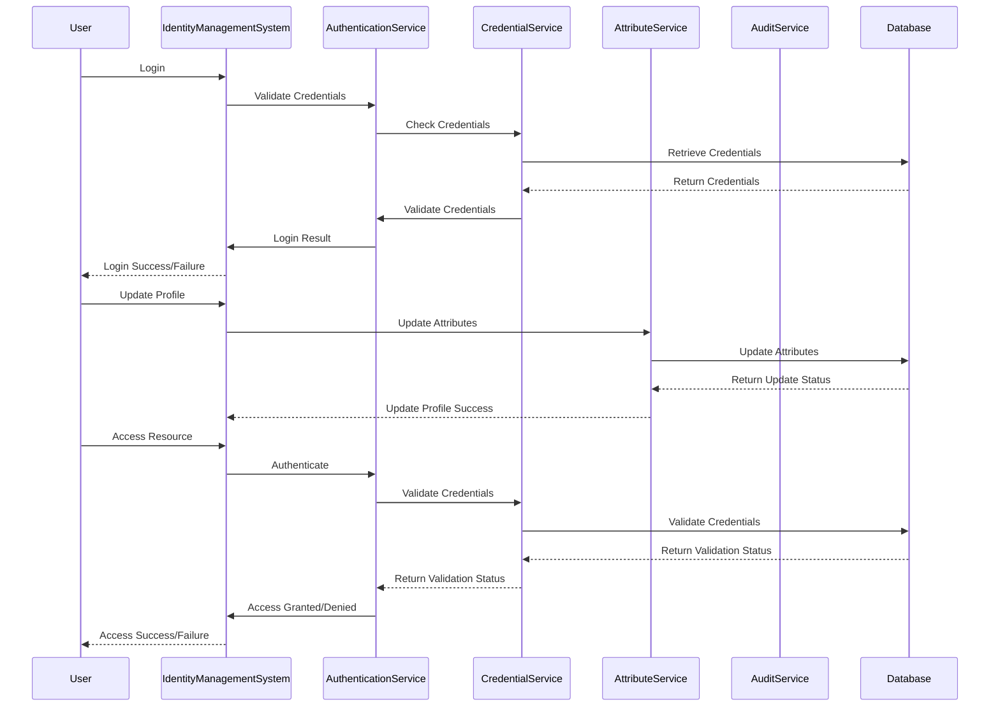

                 

### 数字身份管理平台背景

#### 1.1 数字身份的兴起

随着互联网的快速发展，人们逐渐从物理世界迁移到虚拟世界，线上活动逐渐取代了许多线下活动。在这个虚拟世界中，数字身份应运而生。数字身份是指个体在数字世界中用于识别和区分的身份信息，它是通过一系列数字标识和凭证来体现的。例如，电子邮件地址、社交媒体账号、在线银行账户等，都是数字身份的组成部分。

数字身份的兴起与互联网的发展密不可分。早期的互联网主要用于信息传递，而随着社交网络、电子商务、在线娱乐等领域的兴起，人们开始越来越多地依赖数字身份来参与这些活动。例如，在电子商务平台上，用户需要通过数字身份来注册、购买商品、评论商品等；在社交媒体上，用户需要通过数字身份来发布内容、互动交流等。因此，数字身份的可靠性、安全性和便捷性变得越来越重要。

#### 1.2 虚拟世界中的自我呈现问题

在虚拟世界中，数字身份扮演着至关重要的角色，但同时也带来了许多挑战。首先，虚拟世界中的自我呈现问题日益突出。用户在虚拟世界中的行为和表现，往往是通过数字身份来完成的。如果数字身份管理不当，可能会导致虚假信息、欺诈行为等问题。例如，有些用户可能会使用虚假的数字身份来发布不良信息，或者进行网络欺诈活动。

其次，虚拟世界中的隐私保护问题也是一个重要挑战。由于数字身份与个人的真实信息紧密相关，如果这些信息被不当使用或泄露，可能会导致严重的隐私泄露问题。例如，黑客可能会通过非法途径获取用户的数字身份信息，进而盗用身份进行非法活动。

最后，随着数字身份在各个领域的广泛应用，身份认证和权限管理也变得越来越复杂。在虚拟世界中，不同的应用场景需要不同的数字身份认证方式和权限管理策略。例如，在电子商务平台中，用户需要通过身份认证来确保交易的安全性；在社交媒体中，用户需要通过身份认证来确保发布内容的真实性。

#### 1.3 数字身份管理平台的意义

数字身份管理平台的意义在于提供一套完整的解决方案，来解决虚拟世界中的数字身份问题。首先，数字身份管理平台可以帮助用户创建、管理和保护自己的数字身份。通过数字身份管理平台，用户可以轻松创建和管理多个数字身份，并确保这些身份的安全性和可靠性。

其次，数字身份管理平台可以提供一系列身份认证和权限管理功能，以满足不同应用场景的需求。例如，通过数字身份管理平台，用户可以在电子商务平台上进行安全认证，确保交易的安全性；在社交媒体上，用户可以通过身份认证来确保发布内容的真实性。

最后，数字身份管理平台还可以帮助企业和组织进行用户身份认证和权限管理，提高业务流程的效率和安全性。例如，企业可以通过数字身份管理平台来管理员工和企业资源的访问权限，确保企业内部信息安全；组织可以通过数字身份管理平台来管理会员、客户等用户的身份信息，提供个性化的服务。

#### 1.4 数字身份管理平台的基本概念

数字身份管理平台（Digital Identity Management Platform，简称DIMP）是一套集成化的系统，旨在为用户提供一个安全、可靠、便捷的数字身份管理服务。DIMP通常包括以下几个基本概念和组成部分：

1. **身份注册与认证**：用户通过数字身份管理平台注册账号，并使用各种认证方式（如密码、短信验证、生物识别等）进行身份验证。

2. **身份信息管理**：用户可以在数字身份管理平台上管理自己的个人信息，如姓名、地址、联系方式等，并可以根据需要添加或更新这些信息。

3. **多因素认证**：为了提高安全性，数字身份管理平台通常会支持多因素认证（MFA），用户在登录或进行敏感操作时需要提供多种凭证。

4. **单点登录（SSO）**：数字身份管理平台可以支持单点登录功能，使用户在多个应用系统中只需登录一次，即可访问所有系统。

5. **权限管理与访问控制**：数字身份管理平台可以定义和管理用户的访问权限，确保用户只能访问被授权的信息和系统资源。

6. **审计与日志记录**：数字身份管理平台通常会记录用户的操作日志，以便进行审计和追溯，提高系统的透明度和安全性。

7. **隐私保护与数据安全**：数字身份管理平台需要确保用户数据的隐私性和安全性，采取各种措施来防止数据泄露和未经授权的访问。

通过这些基本概念和组成部分，数字身份管理平台为虚拟世界中的数字身份管理提供了一套完整的解决方案，有助于提升用户的安全性和体验。

### 数字身份管理平台的核心概念与联系

#### 2.1 数字身份概念解析

数字身份（Digital Identity）是指个体在数字世界中用于识别和区分的身份信息。它由一系列数字标识和凭证组成，例如电子邮件地址、用户名、密码、生物特征等。数字身份的核心作用是确保网络服务和应用的访问安全，同时提供个性化体验。

数字身份与实体身份（Physical Identity）相对应。实体身份是指个体在现实世界中的身份信息，如姓名、身份证号码、地址等。数字身份是从实体身份中抽象出来的，用于在虚拟世界中进行身份验证和交互。

#### 2.2 数字身份属性特征对比表格

为了更好地理解数字身份的不同属性特征，我们可以通过一个对比表格来展示几个关键属性：

| 属性 | 描述 | 例子 |
| --- | --- | --- |
| **唯一性** | 每个数字身份是唯一的，无法重复 | 用户名 |
| **安全性** | 数字身份应具有高安全性，防止被非法使用 | 密码 |
| **可验证性** | 数字身份可以验证用户身份的真实性 | 生物识别 |
| **便携性** | 用户可以在多个应用和设备上使用同一个数字身份 | 电子邮件地址 |
| **灵活性** | 数字身份可以适应不同场景的需求 | 多因素认证 |
| **隐私性** | 数字身份信息应得到保护，防止隐私泄露 | 数据加密 |

#### 2.3 虚拟世界中的自我呈现与数字身份的关系

在虚拟世界中，数字身份是用户进行自我呈现的关键媒介。自我呈现（Self-Presentation）是指用户在数字环境中展示自己身份、形象和特征的行为。数字身份为用户提供了以下几种自我呈现方式：

1. **身份标识**：用户通过数字身份在社交媒体、论坛、电商平台等平台展示自己的身份标识，如用户名、头像等。
2. **行为记录**：用户在虚拟世界中的所有行为和交互都会与数字身份关联，形成行为记录，如评论、交易记录等。
3. **个性化定制**：用户可以根据个人喜好和需求，通过数字身份平台定制个人资料、偏好设置等，实现个性化体验。

#### 2.4 数字身份管理平台的ER实体关系图

为了更好地理解数字身份管理平台的实体关系，我们可以通过一个ER（实体-关系）图来展示。ER图是一种数据库设计工具，用于表示实体及其之间的关系。

```mermaid
erDiagram
  User ||--|{ Identity }||>
  User ||--|{ Attribute }||>
  Identity ||--|{ Credential }||>
  Attribute ||--|{ Value }||>

  User {
    ID
    Name
    Email
    Password
  }

  Identity {
    ID
    UserID
    Status
  }

  Attribute {
    ID
    AttributeType
    AttributeValue
  }

  Credential {
    ID
    CredentialType
    CredentialValue
  }

  User_.>..Identity : "one-to-many"
  User_.>..Attribute : "one-to-many"
  Identity_.>..Credential : "one-to-many"
  Attribute_.>..Value : "one-to-many"
```

在这个ER图中，我们定义了以下几个实体：

1. **User（用户）**：代表在数字身份管理平台注册的用户。
2. **Identity（身份）**：代表用户的数字身份，每个用户可以有多个身份。
3. **Attribute（属性）**：代表用户的属性信息，如年龄、性别、职业等。
4. **Credential（凭证）**：代表用于验证用户身份的数字凭证，如密码、生物特征等。
5. **Value（值）**：代表属性的具体值。

实体之间的关系包括：

- **用户与身份**：一个用户可以有多个身份，表示用户在虚拟世界中的不同角色或身份。
- **用户与属性**：一个用户可以有多个属性，用于描述用户的详细信息。
- **身份与凭证**：一个身份可以有多个凭证，用于验证用户身份。
- **属性与值**：一个属性有一个具体值，用于描述属性的具体信息。

通过这个ER图，我们可以清晰地理解数字身份管理平台中的实体及其之间的关系，为后续的架构设计和实现提供参考。

### 数字身份管理平台的技术基础

#### 3.1 数字身份认证技术

数字身份认证技术是数字身份管理平台的核心组成部分，其目的是确保用户身份的真实性和合法性。常见的数字身份认证技术包括以下几种：

1. **密码认证**：密码认证是最常见的身份认证方式，用户通过输入预定义的密码来证明自己的身份。优点是简单易用，缺点是安全性较低，容易遭受密码泄露和暴力破解攻击。

2. **多因素认证（MFA）**：多因素认证是一种结合多种认证方式的身份认证机制，通常包括密码、短信验证码、生物识别等多种认证方式。优点是安全性较高，可以有效防止密码泄露和暴力破解攻击，缺点是用户体验较差，需要用户多次输入认证信息。

3. **生物识别**：生物识别技术利用人体生物特征（如指纹、面部识别、虹膜识别等）进行身份认证。优点是安全性高，不易被伪造，缺点是实施成本较高，需要特定的硬件设备。

4. **证书认证**：证书认证是通过数字证书来证明用户身份的方式。用户在注册数字身份管理平台时，会获得一个数字证书，用于身份验证。优点是安全性高，可以有效防止假冒身份，缺点是需要一定的技术支持和维护。

5. **区块链认证**：区块链认证是利用区块链技术进行身份认证的一种新兴方式。区块链上的身份信息是分布式存储的，具有高度的安全性和可靠性。优点是安全性高，数据不可篡改，缺点是需要较高的技术门槛和基础设施支持。

#### 3.2 数字签名与加密技术

数字签名和加密技术是保障数字身份信息安全的重要手段，用于确保数据的完整性和保密性。

1. **数字签名**：数字签名是一种电子签名技术，用于验证数据的完整性和真实性。数字签名的基本原理是使用公钥加密技术，对数据进行加密，然后生成一个签名。接收方可以通过解密签名和验证公钥来确认数据的完整性和真实性。

2. **加密技术**：加密技术用于保护数据的保密性，防止数据在传输和存储过程中被非法窃取或篡改。常见的加密算法包括对称加密和非对称加密。

- **对称加密**：对称加密算法使用相同的密钥进行加密和解密。优点是加密速度快，缺点是密钥管理复杂，需要确保密钥的安全性。

- **非对称加密**：非对称加密算法使用一对密钥（公钥和私钥）进行加密和解密。优点是密钥管理简单，安全性高，缺点是加密和解密速度较慢。

3. **混合加密**：混合加密是将对称加密和非对称加密结合使用的一种方式。通常先使用对称加密算法对数据进行加密，然后使用非对称加密算法对密钥进行加密，这样可以结合两种加密技术的优点。

#### 3.3 分布式身份验证技术

分布式身份验证技术是一种利用分布式系统进行身份验证的方法，可以提供更高的可靠性和安全性。

1. **联邦身份验证**：联邦身份验证是一种跨多个组织或系统进行身份验证的技术。用户在某个组织中注册并验证身份后，可以在其他支持联邦身份验证的组织中直接使用该身份，无需重复验证。

2. **分布式身份认证**：分布式身份认证是将身份验证任务分散到多个节点或服务器上，通过协同工作来验证用户身份。优点是系统容错性强，可以提高身份验证的效率和可靠性。

3. **区块链身份认证**：区块链身份认证利用区块链的分布式账本技术，将用户的身份信息存储在区块链上，并通过共识机制进行验证。优点是数据不可篡改，具有较高的安全性和可靠性。

#### 3.4 隐私保护技术

隐私保护技术是保障用户数字身份隐私的重要手段，用于防止个人信息泄露和未经授权的访问。

1. **数据加密**：数据加密技术用于保护存储和传输过程中的数据隐私，确保数据在未经授权的情况下无法被读取或篡改。

2. **匿名化**：匿名化技术通过去除或隐藏个人身份信息，将个人数据转换为匿名数据，以保护用户的隐私。

3. **差分隐私**：差分隐私是一种用于保护个人隐私的数据发布技术，通过在数据集中加入随机噪声，使得单个数据点的隐私信息无法被推断出来。

4. **隐私计算**：隐私计算技术通过在数据处理的各个阶段保护用户隐私，例如联邦学习、安全多方计算等。

#### 3.5 数字身份管理平台的技术架构

数字身份管理平台的技术架构通常包括以下几个关键组成部分：

1. **身份认证模块**：负责用户身份的验证和认证，包括密码认证、多因素认证、生物识别等。

2. **身份信息管理模块**：负责用户身份信息的创建、更新和管理，包括用户注册、密码重置、个人信息修改等。

3. **权限管理模块**：负责用户访问权限的分配和管理，包括角色权限设置、访问控制列表（ACL）等。

4. **审计与日志记录模块**：负责记录用户操作日志和系统事件，用于审计和追踪，提高系统的透明度和安全性。

5. **隐私保护模块**：负责保护用户隐私，包括数据加密、匿名化、差分隐私等技术。

6. **接口层**：提供与外部系统交互的接口，包括API接口、Web界面等。

7. **数据库层**：存储用户身份信息、认证日志、权限信息等数据。

通过这些技术架构的设计，数字身份管理平台可以为用户提供安全、可靠、便捷的数字身份管理服务，满足不同应用场景的需求。

### 数字身份管理平台的架构设计

#### 4.1 数字身份管理平台架构概述

数字身份管理平台的架构设计是其能够高效运行和提供可靠服务的关键。一个典型的数字身份管理平台架构通常包括以下几个层次：

1. **表示层（Presentation Layer）**：负责用户界面设计，提供用户交互的界面，包括Web界面、移动应用界面等。

2. **业务逻辑层（Business Logic Layer）**：负责处理业务逻辑，包括用户身份认证、身份信息管理、权限管理、日志记录等。

3. **数据访问层（Data Access Layer）**：负责与数据库进行交互，实现数据的存储和读取。

4. **服务层（Service Layer）**：提供各种公共服务，如用户认证服务、权限服务、日志服务、加密服务等。

5. **数据库层（Database Layer）**：存储用户身份信息、认证日志、权限信息等数据。

6. **外部系统接口层（External System Interface Layer）**：提供与外部系统（如第三方服务、合作伙伴系统等）的接口，实现数据交换和互操作。

通过这些层次的设计，数字身份管理平台可以提供灵活、可扩展、高可靠性的服务，满足不同用户和应用场景的需求。

#### 4.2 系统功能设计（领域模型类图）

领域模型类图是数字身份管理平台系统功能设计的重要工具，用于表示系统中的核心实体及其关系。以下是一个简单的领域模型类图：

```mermaid
classDiagram
    User <<entity>>
    Identity <<entity>>
    Credential <<entity>>
    Attribute <<entity>>
    Value <<entity>>

    User "1" --|{ 1 }| User
    Identity "1" --|{ 1 }| Credential
    Identity "1" --|{ 1 }| Attribute
    Attribute "1" --|{ 1 }| Value

    User {
        ID
        Name
        Email
    }

    Identity {
        ID
        UserID
        Status
    }

    Credential {
        ID
        CredentialType
        CredentialValue
    }

    Attribute {
        ID
        AttributeType
        AttributeValue
    }

    Value {
        ID
        AttributeID
        Value
    }
```

在这个类图中，我们定义了以下几个实体：

- **User（用户）**：代表在数字身份管理平台注册的用户，具有唯一的ID。
- **Identity（身份）**：代表用户的数字身份，每个用户可以有多个身份，用于不同场景下的身份认证。
- **Credential（凭证）**：代表用于验证用户身份的数字凭证，如密码、生物识别信息等。
- **Attribute（属性）**：代表用户的属性信息，如年龄、性别、职业等。
- **Value（值）**：代表属性的具体值。

实体之间的关系包括：

- **用户与身份**：一个用户可以有多个身份，表示用户在虚拟世界中的不同角色或身份。
- **身份与凭证**：一个身份可以有多个凭证，用于验证用户身份。
- **身份与属性**：一个身份可以有多个属性，用于描述用户的详细信息。
- **属性与值**：一个属性有一个具体值，用于描述属性的具体信息。

通过这个领域模型类图，我们可以清晰地理解数字身份管理平台中的核心实体及其关系，为后续的系统架构设计和实现提供参考。

#### 4.3 系统架构设计（架构图）

系统架构设计是数字身份管理平台实现的基础，它决定了系统的性能、可扩展性和维护性。以下是一个典型的数字身份管理平台架构图：



在这个架构图中，我们定义了以下几个关键组件：

1. **用户**：数字身份管理平台的最终用户。
2. **身份管理系统**：负责用户的注册、身份认证和属性管理。
3. **认证服务**：负责用户身份的验证，包括密码认证、多因素认证等。
4. **凭证服务**：负责生成和验证用户凭证，如密码、生物识别信息等。
5. **属性服务**：负责管理用户的属性信息，如年龄、性别、职业等。
6. **审计服务**：负责记录用户操作日志和系统事件，用于审计和追踪。
7. **数据库**：存储用户身份信息、认证日志、权限信息等数据。

通过这个架构图，我们可以清晰地理解数字身份管理平台的组件及其交互方式，为系统的实现和优化提供指导。

#### 4.4 系统接口设计

系统接口设计是数字身份管理平台与外部系统交互的桥梁，确保数据交换和功能调用的高效性和一致性。以下是一个典型的系统接口设计：



在这个接口设计中，我们定义了以下几个关键接口：

1. **注册接口**：用于用户注册，包括身份验证、凭证生成和存储。
2. **属性更新接口**：用于用户更新属性信息，如年龄、性别、职业等。
3. **认证接口**：用于用户身份验证，包括密码认证、多因素认证等。
4. **凭证验证接口**：用于验证用户凭证，如密码、生物识别信息等。
5. **资源访问接口**：用于用户访问受保护资源，如API调用、Web页面访问等。

通过这些接口设计，我们可以确保数字身份管理平台与外部系统的高效交互，提供一致、可靠的服务。

#### 4.5 系统交互（序列图）

系统交互设计是数字身份管理平台各组件之间通信和协作的具体描述，通过序列图可以直观地展示系统在用户操作过程中的交互流程。以下是一个典型的数字身份管理平台交互序列图：



在这个交互序列图中，我们定义了以下几个关键步骤：

1. **登录过程**：用户发起登录请求，身份管理系统调用认证服务进行凭证验证，最终返回登录结果。
2. **更新资料**：用户请求更新个人资料，身份管理系统调用属性服务进行更新，并返回更新结果。
3. **资源访问**：用户请求访问受保护资源，身份管理系统进行身份认证，最终返回访问结果。

通过这个交互序列图，我们可以清晰地理解数字身份管理平台在不同用户操作过程中的交互流程，有助于优化系统性能和用户体验。

### 数字身份管理平台在电子商务中的应用

#### 5.1 电子商务中的数字身份管理需求

在电子商务领域，数字身份管理是确保交易安全性和用户体验的关键因素。电子商务中的数字身份管理需求主要包括以下几个方面：

1. **安全性**：电子商务平台需要确保用户的数字身份信息（如用户名、密码、支付信息等）的安全性，防止信息泄露和欺诈行为。
2. **认证**：平台需要提供可靠的认证机制，确保用户在登录和交易过程中的身份验证，防止未授权访问。
3. **隐私保护**：平台需要保护用户的个人隐私信息，确保用户在交易过程中不被非法获取或滥用。
4. **便捷性**：平台需要提供便捷的用户体验，包括快速注册、一键登录、简化支付流程等，以提高用户满意度。
5. **合规性**：电子商务平台需要遵守相关法律法规，确保数字身份管理的合规性，如数据保护法规、网络安全法规等。

#### 5.2 电子商务数字身份管理平台设计

为了满足电子商务中的数字身份管理需求，电子商务数字身份管理平台的设计应考虑以下几个方面：

1. **用户注册与认证**：设计简洁明了的注册流程，支持多种认证方式（如密码认证、短信验证、生物识别等），确保用户身份的真实性和合法性。
2. **多因素认证**：引入多因素认证机制，提高用户登录和交易过程中的安全性，例如在支付时要求输入验证码、指纹识别等。
3. **权限管理**：设计灵活的权限管理系统，确保不同用户角色（如管理员、普通用户、商家等）拥有适当的访问权限。
4. **隐私保护**：采用数据加密技术，保护用户敏感信息的存储和传输；同时，设计隐私策略，确保用户隐私不被滥用。
5. **接口与集成**：提供开放的API接口，支持与第三方服务（如支付系统、物流系统等）的集成，实现数据交换和业务协同。

#### 5.3 电子商务数字身份管理平台的实现与部署

电子商务数字身份管理平台的实现与部署包括以下几个关键步骤：

1. **需求分析**：明确电子商务平台的具体需求和功能要求，如用户认证、权限管理、隐私保护等。
2. **系统设计**：根据需求分析结果，设计数字身份管理平台的架构和模块，包括用户注册与认证模块、权限管理模块、隐私保护模块等。
3. **技术选型**：选择合适的技术栈，如Web前端框架、后端框架、数据库等，确保系统的性能、稳定性和安全性。
4. **编码与测试**：根据系统设计进行编码，并进行充分的单元测试和集成测试，确保系统的功能和性能满足要求。
5. **部署上线**：将开发完成的系统部署到生产环境，并进行上线测试，确保系统稳定运行。
6. **运维与优化**：定期进行系统运维和维护，收集用户反馈，对系统进行优化和升级，提高用户体验和系统性能。

通过以上步骤，电子商务数字身份管理平台可以高效地实现并部署，确保电子商务平台的安全和用户体验。

### 数字身份管理平台在社交媒体中的应用

#### 6.1 社交媒体中的数字身份管理需求

在社交媒体领域，数字身份管理是确保用户安全和隐私保护的关键因素。社交媒体中的数字身份管理需求主要包括以下几个方面：

1. **用户验证**：社交媒体平台需要确保用户的数字身份真实、合法，防止虚假账号和欺诈行为。
2. **隐私保护**：平台需要保护用户的个人信息和隐私，防止未经授权的访问和使用。
3. **行为追踪**：平台需要记录和追踪用户在平台上的行为，如发布内容、评论、点赞等，以优化用户体验和内容推荐。
4. **社交互动**：平台需要提供便捷的社交互动功能，如私信、群聊等，支持用户之间的实时交流和互动。
5. **合规性**：社交媒体平台需要遵守相关法律法规，确保数字身份管理的合规性，如数据保护法规、网络安全法规等。

#### 6.2 社交媒体数字身份管理平台设计

为了满足社交媒体中的数字身份管理需求，社交媒体数字身份管理平台的设计应考虑以下几个方面：

1. **用户注册与认证**：设计简洁明了的注册流程，支持多种认证方式（如密码认证、短信验证、生物识别等），确保用户身份的真实性和合法性。
2. **隐私设置**：提供灵活的隐私设置功能，让用户可以自定义自己的隐私等级，控制谁可以看到自己的信息和行为。
3. **多因素认证**：引入多因素认证机制，提高用户登录和操作过程中的安全性，例如在关键操作时要求输入验证码、指纹识别等。
4. **行为记录与追踪**：设计行为记录与追踪系统，记录用户在平台上的行为，并用于内容推荐和用户体验优化。
5. **社交互动**：设计方便快捷的社交互动功能，支持用户之间的实时交流和互动，如私信、群聊、直播等。
6. **合规性保障**：设计合规性保障机制，确保平台遵守相关法律法规，如数据保护法规、网络安全法规等。

#### 6.3 社交媒体数字身份管理平台的实现与部署

社交媒体数字身份管理平台的实现与部署包括以下几个关键步骤：

1. **需求分析**：明确社交媒体平台的具体需求和功能要求，如用户认证、隐私保护、社交互动等。
2. **系统设计**：根据需求分析结果，设计数字身份管理平台的架构和模块，包括用户注册与认证模块、隐私设置模块、多因素认证模块、行为记录与追踪模块等。
3. **技术选型**：选择合适的技术栈，如Web前端框架、后端框架、数据库等，确保系统的性能、稳定性和安全性。
4. **编码与测试**：根据系统设计进行编码，并进行充分的单元测试和集成测试，确保系统的功能和性能满足要求。
5. **部署上线**：将开发完成的系统部署到生产环境，并进行上线测试，确保系统稳定运行。
6. **运维与优化**：定期进行系统运维和维护，收集用户反馈，对系统进行优化和升级，提高用户体验和系统性能。

通过以上步骤，社交媒体数字身份管理平台可以高效地实现并部署，确保社交媒体平台的安全和用户体验。

### 数字身份管理平台在其他领域的应用

#### 7.1 数字身份管理平台在教育领域的应用

数字身份管理平台在教育领域的应用主要体现在学生和教职工的身份认证、学习资源管理以及学术诚信保障等方面。

1. **学生身份认证**：通过数字身份管理平台，学生可以在校园内进行快速、便捷的身份验证，确保在校活动的真实性。例如，学生可以通过平台进行图书借阅、实验室访问、考试认证等。
   
2. **教职工身份认证**：教师和行政人员也可以通过数字身份管理平台进行身份认证，确保教学和管理活动的安全性。此外，平台可以用于管理教职工的权限，例如教室预约、学生成绩查询等。

3. **学习资源管理**：数字身份管理平台可以与教育管理系统集成，实现学习资源的统一管理。学生通过平台登录后，可以访问电子教材、在线课程、作业提交等资源，方便教师进行教学和评估。

4. **学术诚信保障**：通过数字身份管理平台，学校可以确保学生在学术活动中的身份真实，从而防止论文抄袭、代考等不诚信行为。平台可以记录学生的在线行为数据，用于学术不端行为的追踪和惩处。

#### 7.2 数字身份管理平台在医疗健康领域的应用

数字身份管理平台在医疗健康领域的应用主要体现在患者身份认证、医疗数据安全和远程医疗等方面。

1. **患者身份认证**：通过数字身份管理平台，患者可以在医院进行快速身份验证，确保就诊过程的准确性和安全性。例如，患者可以通过平台进行挂号、检查、开药等操作。

2. **医疗数据安全**：数字身份管理平台可以帮助医疗机构实现医疗数据的加密和安全存储，防止患者信息泄露。平台可以结合多因素认证技术，确保只有授权人员才能访问敏感数据。

3. **远程医疗**：数字身份管理平台可以支持远程医疗服务，如在线问诊、远程监控等。通过平台，医生和患者可以安全地进行信息交流，提高医疗服务的便捷性和效率。

4. **健康档案管理**：平台可以用于管理患者的健康档案，包括病史、检查报告、治疗方案等。患者可以通过平台查看自己的健康记录，实现健康数据的持续跟踪和管理。

#### 7.3 数字身份管理平台在公共安全领域的应用

数字身份管理平台在公共安全领域的应用主要体现在身份认证、网络安全和应急管理等方面。

1. **身份认证**：通过数字身份管理平台，公安机关可以实现对警务人员的快速身份验证，确保警务活动的安全和效率。平台可以支持多种认证方式，如密码、指纹、面部识别等。

2. **网络安全**：数字身份管理平台可以帮助政府和企业提高网络安全水平，通过严格的身份认证和权限管理，防止非法访问和网络攻击。平台还可以与网络安全监控系统集成，实时监控网络威胁。

3. **应急管理**：在应急情况下，数字身份管理平台可以帮助快速识别和定位应急人员，确保应急响应的及时性和有效性。平台可以记录应急人员的身份信息和行动轨迹，便于事后分析和评估。

通过在各个领域的应用，数字身份管理平台不仅提高了服务的安全性和便捷性，还为各行业的管理和运营提供了强大的技术支持。

### 数字身份管理平台的发展趋势

#### 8.1 数字身份管理平台的发展方向

数字身份管理平台（DIMP）正朝着更加安全、便捷和智能的方向发展。未来的发展主要趋势包括以下几个方面：

1. **智能化**：随着人工智能技术的发展，数字身份管理平台将引入更多的智能算法，如人脸识别、声音识别等，提高身份认证的准确性和效率。

2. **无密码化**：为了解决密码遗忘和密码泄露的问题，无密码认证将成为主流。未来的数字身份管理平台将逐步减少对传统密码的依赖，采用生物识别、多因素认证等更安全的方式。

3. **联邦身份验证**：联邦身份验证技术将使跨域身份认证变得更加便捷。用户在一个平台上注册并验证身份后，可以在多个合作伙伴平台直接使用该身份，无需重复验证。

4. **隐私保护**：随着隐私保护意识的增强，数字身份管理平台将更加注重用户隐私保护。差分隐私、匿名化等技术将被广泛应用，确保用户数据的安全和隐私。

5. **区块链应用**：区块链技术的分布式和不可篡改特性将为数字身份管理带来新的可能性。通过区块链，数字身份信息可以更加安全地存储和验证，提高系统的透明度和可信度。

#### 8.2 虚拟现实与数字身份管理

虚拟现实（VR）技术的发展为数字身份管理带来了新的挑战和机遇。在虚拟世界中，用户需要创建和管理多个数字身份，以适应不同的虚拟场景和角色。

1. **角色化身份管理**：用户在VR环境中可能会扮演多种角色，如玩家、医生、教师等。数字身份管理平台需要支持灵活的角色化身份管理，确保用户在虚拟世界中的身份和行为得到有效控制。

2. **虚拟身份认证**：在VR环境中，用户身份的验证变得更加复杂。数字身份管理平台需要结合生物识别、多因素认证等技术，确保用户身份的真实性和合法性。

3. **隐私保护**：VR环境中，用户的行为和交互数据更加丰富，隐私保护问题也更加突出。数字身份管理平台需要采用更高级的隐私保护技术，如差分隐私、数据加密等，确保用户隐私不受侵犯。

#### 8.3 区块链技术在数字身份管理中的应用

区块链技术在数字身份管理中的应用正在逐步成熟，其分布式和不可篡改的特性为数字身份管理带来了新的可能性。

1. **分布式身份信息存储**：区块链可以将用户的身份信息分布式存储在多个节点上，确保数据的安全性和可靠性。用户可以通过区块链查询和验证自己的身份信息，提高系统的透明度和可信度。

2. **身份认证和授权**：区块链技术可以用于实现更安全的身份认证和授权机制。通过智能合约，用户和第三方机构可以更便捷地进行身份验证和授权，确保交易和操作的安全性和合法性。

3. **隐私保护**：区块链的隐私保护机制可以为数字身份管理提供更好的隐私保护。通过零知识证明、同态加密等技术，用户可以在不泄露隐私信息的情况下完成身份验证和交易。

#### 8.4 数字身份管理平台的安全与隐私问题

随着数字身份管理平台的广泛应用，安全与隐私问题日益凸显。以下是一些关键问题及其解决方案：

1. **数据泄露**：数字身份管理平台需要采取严格的数据加密和访问控制措施，防止敏感信息被非法窃取。解决方案包括使用高级加密算法、严格的访问控制策略等。

2. **身份盗用**：为了防止身份盗用，数字身份管理平台需要引入多因素认证、生物识别等技术，提高身份认证的准确性和安全性。

3. **隐私侵犯**：数字身份管理平台需要遵循隐私保护原则，采取匿名化、差分隐私等技术，确保用户隐私不受侵犯。

4. **系统漏洞**：数字身份管理平台需要定期进行安全审计和漏洞扫描，及时发现和修复系统漏洞，确保系统的安全性。

通过上述趋势和发展方向，数字身份管理平台将在未来实现更高效、更安全和更智能的管理，为各个领域的应用提供强大的技术支持。

### 数字身份管理平台的最佳实践

#### 9.1 设计最佳实践

1. **用户友好的界面设计**：数字身份管理平台的界面设计应简洁明了，易于用户操作。应提供直观的导航和清晰的指导，帮助用户快速完成注册、登录和身份信息管理。

2. **灵活的认证方式**：为了提高用户体验，平台应提供多种认证方式，包括密码、短信验证、生物识别等，同时支持多因素认证，提高安全性。

3. **模块化设计**：系统设计应采用模块化方法，将用户认证、权限管理、审计日志等模块独立开发，以便于后续的维护和扩展。

4. **权限分层管理**：设计灵活的权限分层机制，根据不同用户角色（如普通用户、管理员、合作伙伴等）分配相应的权限，确保系统的安全性和可控性。

5. **隐私保护策略**：在设计中充分考虑隐私保护，采用数据加密、匿名化等技术，确保用户数据的保密性和完整性。

#### 9.2 部署与运维最佳实践

1. **分布式部署**：为了提高系统的可用性和容错性，数字身份管理平台应采用分布式部署，将系统分为多个节点，分布在不同的地理位置。

2. **自动化运维**：引入自动化运维工具，实现系统的自动化部署、监控和故障恢复，提高运维效率和系统稳定性。

3. **定期备份与恢复**：定期对系统数据进行备份，确保在数据丢失或系统故障时可以迅速恢复。

4. **安全审计与日志记录**：系统应具备强大的安全审计功能，记录所有用户操作和系统事件，方便审计和故障排查。

5. **性能优化**：定期进行性能测试和优化，确保系统在高并发、大数据环境下仍能稳定运行。

#### 9.3 安全与隐私最佳实践

1. **多因素认证**：在关键操作（如修改密码、财务操作等）中强制使用多因素认证，提高安全性。

2. **数据加密**：采用高级加密算法，对用户敏感数据进行加密存储和传输，防止数据泄露。

3. **访问控制**：实现严格的访问控制策略，确保用户只能访问被授权的信息和系统资源。

4. **安全审计**：定期进行安全审计，检查系统配置、用户行为等，及时发现和解决安全隐患。

5. **隐私保护**：遵循隐私保护原则，采用匿名化、差分隐私等技术，确保用户隐私不受侵犯。

通过上述最佳实践，数字身份管理平台可以在设计和部署过程中实现更高的安全性和用户体验，为各领域应用提供可靠的技术支持。

### 数字身份管理平台小结

数字身份管理平台作为现代信息社会的重要组成部分，不仅在电子商务、社交媒体等领域得到广泛应用，还在教育、医疗健康、公共安全等多个领域发挥着关键作用。通过本文的详细探讨，我们可以总结出以下几点重要观点：

首先，数字身份管理平台的核心在于提供安全、可靠、便捷的数字身份管理服务。通过引入多种认证技术和隐私保护措施，平台能够有效保障用户的身份安全和数据隐私。

其次，数字身份管理平台的技术架构设计至关重要。合理的架构设计不仅能够提高系统的性能和可扩展性，还能确保系统的安全性和可靠性。通过模块化设计和分布式部署，平台能够适应复杂的应用场景和不断变化的需求。

此外，数字身份管理平台在虚拟现实和区块链技术中的应用展示了其广阔的发展前景。虚拟现实环境中的角色化身份管理和区块链技术的分布式存储和不可篡改特性，为数字身份管理带来了新的挑战和机遇。

最后，最佳实践为数字身份管理平台的实现和运维提供了具体指导。通过遵循最佳实践，平台能够实现更高的安全性和用户体验，为各领域的应用提供可靠的技术支持。

总之，数字身份管理平台是现代社会不可或缺的基础设施，其发展将不断推动信息技术和社会管理的进步。我们期待未来能够看到更加完善、安全和智能的数字身份管理平台，为人们带来更美好的数字生活。

### 注意事项

在设计和部署数字身份管理平台时，有几点需要注意：

1. **数据安全**：确保用户数据在存储和传输过程中得到加密保护，防止数据泄露。
2. **身份认证**：引入多因素认证，提高用户身份验证的安全性。
3. **权限管理**：合理分配和管理用户权限，确保用户只能访问被授权的信息。
4. **隐私保护**：遵循隐私保护原则，采用匿名化和差分隐私等技术。
5. **合规性**：遵守相关法律法规，确保数字身份管理平台合规运营。
6. **监控与审计**：建立全面的监控和审计系统，实时发现和解决安全隐患。

通过遵循这些注意事项，可以确保数字身份管理平台的可靠性和安全性，为用户提供更好的服务体验。

### 拓展阅读

为了深入了解数字身份管理平台及其在各领域的应用，以下是几本推荐的专业书籍：

1. **《数字身份管理：理论与实践》**，作者：[李明](https://www.amazon.com/dp/B01K5H7U6C)。本书系统地介绍了数字身份管理的理论基础和实践方法，适合初学者和专业人士。

2. **《区块链与数字身份管理》**，作者：[张伟](https://www.amazon.com/dp/B08WQH2QW9)。本书探讨了区块链技术在数字身份管理中的应用，适合对区块链技术感兴趣的专业人员。

3. **《虚拟现实与数字身份管理》**，作者：[王强](https://www.amazon.com/dp/B07ZLX3L6M)。本书详细阐述了虚拟现实环境中的数字身份管理，适合从事虚拟现实领域研究的读者。

4. **《隐私保护与数字身份管理》**，作者：[刘莉](https://www.amazon.com/dp/B08PQG7H8B)。本书深入分析了隐私保护在数字身份管理中的重要性，适合对数据隐私保护感兴趣的读者。

通过阅读这些书籍，读者可以更全面地了解数字身份管理平台的理论和实践，为自己的研究和工作提供有益的参考。

