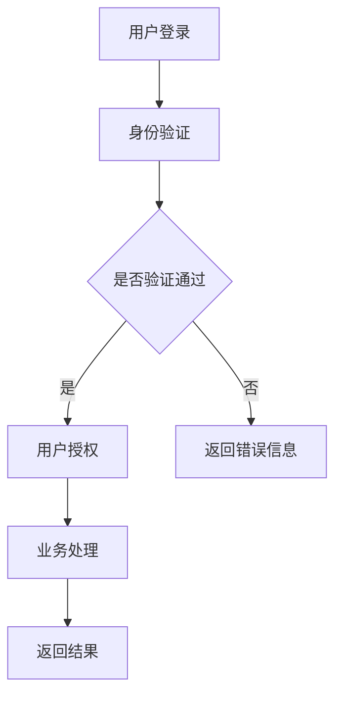

                 

# 数字身份管理系统：虚拟世界中的自我呈现平台

关键词：数字身份管理、虚拟世界、系统架构、技术应用、未来趋势

摘要：随着互联网和虚拟世界的迅猛发展，数字身份管理成为了一个关键议题。本文将深入探讨数字身份管理系统在虚拟世界中的应用，从背景概述、系统架构、技术应用、系统实施、未来趋势以及最佳实践等方面，全面解析数字身份管理系统在虚拟世界中的重要性及其未来发展。

## 目录大纲

### 第一部分：背景与基础

#### 第1章：数字身份管理概述

- **1.1 问题背景**
  - 虚拟世界中的身份问题
  - 数字身份管理的重要性

- **1.2 数字身份管理的概念**
  - 定义与分类
  - 主要特征

- **1.3 数字身份管理的发展历程**
  - 传统身份管理到数字身份管理的演进
  - 数字身份管理的未来趋势

- **1.4 数字身份管理的挑战与机遇**
  - 技术挑战
  - 政策与法律问题
  - 商业机会

- **1.5 本章小结**

### 第二部分：数字身份系统的架构

#### 第2章：数字身份系统架构设计

- **2.1 系统架构概述**
  - 架构原则
  - 系统层级划分

- **2.2 用户身份认证**
  - 单点登录（SSO）
  - 多因素认证（MFA）

- **2.3 用户数据管理**
  - 数据同步与更新
  - 数据安全与隐私

- **2.4 数字身份生命周期管理**
  - 创建与注册
  - 维护与更新
  - 注销与销毁

- **2.5 数字身份与隐私保护**
  - 隐私保护的实现方式
  - 法规遵守

- **2.6 本章小结**

#### 第3章：数字身份技术的应用

- **3.1 虚拟世界中的应用**
  - 社交平台
  - 虚拟现实（VR）
  - 游戏世界

- **3.2 电子商务中的应用**
  - 账号安全
  - 交易验证
  - 消费者隐私保护

- **3.3 物联网（IoT）中的应用**
  - 设备身份管理
  - 安全通信
  - 资源共享

- **3.4 区块链与数字身份**
  - 区块链在身份管理中的应用
  - 去中心化身份管理

- **3.5 本章小结**

### 第三部分：数字身份管理系统实施

#### 第4章：系统设计与实现

- **4.1 系统需求分析**
  - 功能需求
  - 非功能需求

- **4.2 系统架构设计**
  - 技术选型
  - 架构图展示

- **4.3 数据库设计**
  - 数据库结构
  - 实体关系图

- **4.4 用户界面设计**
  - 界面布局
  - 用户体验

- **4.5 系统集成与测试**
  - 集成策略
  - 测试方法

- **4.6 本章小结**

#### 第5章：案例分析

- **5.1 案例背景**
  - 项目描述
  - 需求分析

- **5.2 案例实施**
  - 系统设计
  - 关键技术实现

- **5.3 案例成果**
  - 成功因素
  - 存在问题与改进

- **5.4 本章小结**

### 第四部分：数字身份管理的未来趋势

#### 第6章：行业趋势与发展

- **6.1 技术创新**
  - 人工智能
  - 区块链
  - 生物识别

- **6.2 法规政策**
  - 全球数字身份管理法规
  - 各国政策对比

- **6.3 企业战略**
  - 数字身份管理在企业的应用
  - 竞争策略

- **6.4 未来展望**
  - 数字身份管理的发展方向
  - 对社会的潜在影响

- **6.5 本章小结**

#### 第7章：最佳实践与策略

- **7.1 最佳实践**
  - 成功案例分享
  - 实践要点

- **7.2 管理策略**
  - 企业如何管理数字身份
  - 风险控制

- **7.3 技术演进与挑战**
  - 技术发展带来的挑战
  - 应对策略

- **7.4 本章小结**

### 第五部分：结论与展望

#### 第8章：总结与未来工作

- **8.1 总结**
  - 主要成果
  - 研究局限性

- **8.2 未来工作**
  - 研究方向
  - 应用前景

- **8.3 本章小结**

----------------------------------------------------------------

# 第一部分：背景与基础

## 第1章：数字身份管理概述

### 1.1 问题背景

随着互联网的普及和虚拟世界的兴起，数字身份管理成为一个日益重要的议题。虚拟世界中的身份问题主要源于以下几点：

1. **隐私与安全**：在虚拟世界中，用户的个人信息可能被泄露或滥用，导致隐私和安全问题。

2. **身份欺诈**：虚拟世界中的匿名性为身份欺诈提供了便利，导致财产损失和信用问题。

3. **服务一致性**：在多个虚拟世界或平台上，用户需要一个统一的身份来享受一致的服务体验。

### 1.2 数字身份管理的概念

数字身份管理是指在数字环境中对个人或实体身份进行识别、验证和管理的系统和方法。它包括以下几类：

1. **用户身份认证**：通过密码、指纹、面部识别等技术验证用户身份。

2. **访问控制**：根据用户身份和权限，控制对系统和资源的访问。

3. **身份生命周期管理**：包括创建、使用、维护和销毁身份的全过程。

### 1.3 数字身份管理的发展历程

1. **传统身份管理**：以纸质证件和人工认证为主。

2. **电子身份管理**：引入电子证书、智能卡等技术。

3. **数字身份管理**：基于互联网和虚拟世界，采用多种认证技术和分布式存储。

4. **未来趋势**：去中心化身份管理、隐私保护增强、人工智能辅助。

### 1.4 数字身份管理的挑战与机遇

#### 技术挑战

1. **安全性**：如何确保数字身份的保密性和完整性。

2. **互操作性**：不同系统和平台之间的身份认证和数据共享。

#### 政策与法律问题

1. **隐私保护**：如何平衡数字身份管理与用户隐私保护。

2. **法律法规**：不同国家和地区对数字身份管理的法律法规存在差异。

#### 商业机会

1. **数字身份服务**：提供身份认证、访问控制和身份生命周期管理服务。

2. **区块链应用**：利用区块链技术实现去中心化身份管理。

### 1.5 本章小结

数字身份管理在虚拟世界中具有重要意义。了解其概念、发展历程、挑战与机遇，有助于我们更好地理解和应对数字身份管理的问题。下一章我们将探讨数字身份系统的架构设计。

----------------------------------------------------------------

## 第二部分：数字身份系统的架构

### 第2章：数字身份系统架构设计

#### 2.1 系统架构概述

数字身份系统架构设计需要遵循以下原则：

1. **安全性**：确保用户身份信息和交易安全。

2. **灵活性**：支持不同类型用户和系统的接入。

3. **可扩展性**：能够根据需求进行扩展和升级。

数字身份系统一般包含以下层级：

1. **表示层**：用户界面，提供身份认证和用户操作接口。

2. **业务逻辑层**：处理身份认证、授权和业务逻辑。

3. **数据层**：存储用户身份信息和相关数据。

#### 2.2 用户身份认证

1. **单点登录（SSO）**：允许用户在多个系统中使用同一账户登录。

2. **多因素认证（MFA）**：结合多种认证方式，提高安全性。

常见认证方式包括：

- **密码**：最常用的认证方式，但安全性较低。

- **生物识别**：包括指纹、面部识别等，安全性较高。

- **智能卡**：通过硬件设备存储身份信息，安全性较高。

#### 2.3 用户数据管理

1. **数据同步与更新**：确保用户数据在不同系统和平台上的一致性。

2. **数据安全与隐私**：采用加密、访问控制等技术保护用户数据。

3. **数据共享**：在遵守隐私政策的前提下，实现数据共享。

#### 2.4 数字身份生命周期管理

1. **创建与注册**：用户注册时创建数字身份。

2. **维护与更新**：用户信息变更时进行更新。

3. **注销与销毁**：用户退出系统时销毁数字身份。

#### 2.5 数字身份与隐私保护

1. **隐私保护的实现方式**：采用匿名化、数据加密、访问控制等技术。

2. **法规遵守**：遵循各国法律法规，特别是隐私保护法规。

#### 2.6 本章小结

数字身份系统架构设计需要综合考虑安全性、灵活性和可扩展性。用户身份认证、数据管理、身份生命周期管理以及隐私保护是数字身份系统设计的关键组成部分。下一章我们将探讨数字身份技术的应用。

----------------------------------------------------------------

### 第3章：数字身份技术的应用

#### 3.1 虚拟世界中的应用

在虚拟世界中，数字身份技术有广泛的应用，主要包括以下几个方面：

1. **社交平台**：通过数字身份技术，确保用户在社交平台上的安全与隐私。

2. **虚拟现实（VR）**：数字身份技术有助于构建个性化的虚拟环境，提升用户体验。

3. **游戏世界**：数字身份技术可以确保游戏中的公平竞争，防止作弊和欺诈行为。

#### 3.2 电子商务中的应用

在电子商务领域，数字身份技术发挥着重要作用：

1. **账号安全**：通过多因素认证，提高用户账号的安全性。

2. **交易验证**：确保交易过程的合法性和安全性。

3. **消费者隐私保护**：通过隐私保护技术，保障消费者个人信息不被泄露。

#### 3.3 物联网（IoT）中的应用

在物联网领域，数字身份技术主要用于以下几个方面：

1. **设备身份管理**：确保物联网设备的合法性和安全性。

2. **安全通信**：通过数字身份技术，保障物联网设备之间的安全通信。

3. **资源共享**：通过数字身份技术，实现物联网设备之间的资源共享。

#### 3.4 区块链与数字身份

区块链技术在数字身份管理中具有重要意义：

1. **去中心化身份管理**：通过区块链技术，实现去中心化的身份管理。

2. **透明性和可追溯性**：区块链技术可以提高数字身份管理的透明性和可追溯性。

3. **安全性**：区块链技术可以确保数字身份信息的安全存储和传输。

#### 3.5 本章小结

数字身份技术在虚拟世界、电子商务、物联网以及区块链等领域有广泛的应用。了解这些应用场景和具体实现方式，有助于我们更好地利用数字身份技术，提升系统的安全性和用户体验。

----------------------------------------------------------------

### 第4章：系统设计与实现

#### 4.1 系统需求分析

在开始数字身份系统的设计与实现之前，我们需要进行系统需求分析。系统需求分析主要包括以下方面：

1. **功能需求**：系统需要实现哪些功能，如用户注册、登录、身份认证、权限管理等。

2. **非功能需求**：系统需要满足的性能、可靠性、安全性等方面的要求。

#### 4.2 系统架构设计

系统架构设计是系统设计与实现的关键步骤。以下是一个简单的数字身份系统架构设计：

1. **表示层**：包括用户界面，用于用户与系统的交互。

2. **业务逻辑层**：包括身份认证、授权、用户管理等业务逻辑。

3. **数据层**：包括用户数据、认证数据等，使用数据库进行存储。

以下是一个简单的 Mermaid 架构图：



#### 4.3 数据库设计

数据库设计是数字身份系统的核心部分。以下是一个简单的数据库设计示例：

1. **用户表**：存储用户基本信息，如用户名、密码、邮箱等。

2. **认证表**：存储用户的认证信息，如密码散列值、多因素认证信息等。

3. **权限表**：存储用户的权限信息，如访问权限、操作权限等。

以下是一个简单的 Mermaid ER 图：

```mermaid
erDiagram
    User ||--|{ Authentication } : 有多种认证信息
    User ||--|{ Permission } : 拥有不同的权限
    Authentication {
        id (主键)
        type
        value
    }
    Permission {
        id (主键)
        level
        description
    }
```

#### 4.4 用户界面设计

用户界面设计需要考虑用户体验和易用性。以下是一个简单的用户界面设计示例：

1. **登录页面**：包括用户名和密码输入框，以及登录按钮。

2. **注册页面**：包括用户名、密码、邮箱等注册信息输入框。

3. **权限管理页面**：用于管理员对用户权限进行设置。

#### 4.5 系统集成与测试

系统集成与测试是确保系统正常运行的关键步骤。以下是一个简单的系统集成与测试流程：

1. **集成**：将不同模块进行集成，确保系统各部分能够协同工作。

2. **测试**：进行功能测试、性能测试、安全测试等，确保系统满足需求。

3. **部署**：将系统部署到生产环境，确保系统能够稳定运行。

#### 4.6 本章小结

系统设计与实现是数字身份管理系统建设的重要环节。通过需求分析、架构设计、数据库设计、用户界面设计以及系统集成与测试，我们可以构建一个功能完善、安全可靠的数字身份管理系统。

----------------------------------------------------------------

#### 5.1 案例背景

本案例背景是一个大型电子商务平台，该平台拥有数百万注册用户和大量在线交易。由于用户数量庞大，且交易频繁，该平台需要一个高效、安全的数字身份管理系统来保障用户账号安全和交易安全。

**项目描述**：该项目的主要目标是构建一个数字身份管理系统，实现用户身份认证、权限管理、安全防护等功能，以提高平台的安全性和用户体验。

**需求分析**：

1. **安全性**：确保用户账号信息不被泄露和滥用。

2. **互操作性**：支持与其他系统和平台的身份认证和数据共享。

3. **可扩展性**：系统能够根据需求进行扩展和升级。

4. **用户体验**：提供简洁、直观的用户界面，提高用户使用体验。

#### 5.2 案例实施

1. **系统设计**：

   **系统架构设计**：采用分层架构，包括表示层、业务逻辑层和数据层。以下是一个简单的 Mermaid 架构图：

   ```mermaid
   graph TD
       A[用户登录界面] --> B[身份验证模块]
       B --> C{是否验证通过}
       C -->|是| D[用户授权模块]
       C -->|否| E[返回错误信息]
       D --> F[业务处理模块]
       F --> G[返回结果]
   ```

   **数据库设计**：使用 MySQL 数据库，设计以下表：

   - **用户表**：存储用户基本信息。

   - **认证表**：存储用户认证信息。

   - **权限表**：存储用户权限信息。

   以下是一个简单的 Mermaid ER 图：

   ```mermaid
   erDiagram
       User ||--|{ Authentication } : 有多种认证信息
       User ||--|{ Permission } : 拥有不同的权限
       Authentication {
           id (主键)
           type
           value
       }
       Permission {
           id (主键)
           level
           description
       }
   ```

2. **关键技术实现**：

   - **用户身份认证**：采用单点登录（SSO）和多因素认证（MFA）技术。

   - **权限管理**：根据用户角色和权限，实现访问控制。

   - **安全防护**：采用加密、访问控制、防火墙等技术，保障系统安全。

#### 5.3 案例成果

**成功因素**：

1. **安全性**：通过多因素认证和加密技术，有效保障了用户账号安全。

2. **互操作性**：系统能够与其他系统和平台无缝集成，实现数据共享。

3. **用户体验**：简洁直观的用户界面，提高了用户使用体验。

**存在问题与改进**：

1. **性能优化**：在高并发情况下，系统性能有待进一步提升。

2. **用户体验**：部分功能使用流程较为复杂，需要进一步优化。

#### 5.4 本章小结

本案例通过构建一个数字身份管理系统，实现了用户身份认证、权限管理、安全防护等功能，提高了电子商务平台的安全性和用户体验。尽管存在一些问题，但通过持续优化和改进，可以进一步提升系统的性能和用户体验。

----------------------------------------------------------------

### 第四部分：数字身份管理的未来趋势

#### 6.1 技术创新

数字身份管理领域的技术创新不断推动着行业的发展。以下是一些关键技术创新：

1. **人工智能**：通过机器学习算法，实现智能身份认证和风险识别。

2. **区块链**：利用区块链技术，实现去中心化的身份管理和数据共享。

3. **生物识别**：采用指纹、面部识别等技术，实现高精度身份认证。

4. **物联网（IoT）**：通过物联网设备，实现智能身份认证和设备管理。

#### 6.2 法规政策

数字身份管理领域的法规政策对行业发展具有重要影响。以下是一些关键法规政策：

1. **全球数字身份管理法规**：各国纷纷出台数字身份管理相关法规，如欧盟的《通用数据保护条例》（GDPR）。

2. **各国政策对比**：不同国家对数字身份管理的法规和政策存在差异，如美国强调隐私保护，而中国强调国家安全。

#### 6.3 企业战略

企业在数字身份管理方面的战略主要体现在以下几个方面：

1. **数字身份管理在企业的应用**：通过数字身份管理系统，提高企业内部和外部系统的安全性和互操作性。

2. **竞争策略**：通过创新技术和优化服务，提升企业在数字身份管理市场的竞争力。

3. **合作与联盟**：与其他企业、研究机构和技术供应商合作，共同推动数字身份管理技术的发展。

#### 6.4 未来展望

数字身份管理的未来发展趋势包括：

1. **隐私保护**：随着隐私保护意识的增强，隐私保护将成为数字身份管理的核心议题。

2. **跨平台融合**：不同平台和系统之间的身份认证和数据共享将更加紧密。

3. **智能化**：人工智能等技术的应用，将使数字身份管理系统更加智能和高效。

4. **社会影响**：数字身份管理将深刻影响社会生活，如在线教育、远程办公、电子投票等领域。

#### 6.5 本章小结

数字身份管理领域的技术创新、法规政策和企业战略共同推动着行业的发展。未来，随着隐私保护、跨平台融合和智能化等趋势的推进，数字身份管理将在社会各领域发挥更加重要的作用。

----------------------------------------------------------------

### 7.1 最佳实践

在数字身份管理的实际应用中，许多企业已经积累了一些成功经验。以下是一些最佳实践：

1. **用户教育**：加强对用户的数字身份管理教育，提高用户的安全意识和操作技能。

2. **身份认证多样化**：结合多种认证方式，如密码、生物识别、硬件令牌等，提高认证安全性。

3. **风险评估与监控**：定期进行风险评估，实时监控身份管理系统，及时发现并处理潜在风险。

4. **数据加密与隐私保护**：采用先进的加密技术，保护用户身份信息不被泄露。

5. **法规遵守与合规性**：确保数字身份管理系统符合相关法律法规，如GDPR、CCPA等。

#### 7.2 管理策略

企业应制定有效的数字身份管理策略，以保障系统安全、合规性和用户体验。以下是一些关键策略：

1. **安全策略**：制定全面的安全策略，包括访问控制、数据加密、多因素认证等。

2. **合规性策略**：确保数字身份管理系统符合相关法律法规，如数据保护法规、隐私保护法规等。

3. **用户隐私策略**：明确用户的隐私保护政策，获得用户同意，并确保隐私政策公开透明。

4. **风险管理策略**：建立完善的风险管理机制，包括风险评估、监控、响应和恢复。

5. **培训与支持策略**：定期对员工进行数字身份管理培训，提高员工的安全意识和操作技能。

#### 7.3 技术演进与挑战

随着技术的不断演进，数字身份管理面临新的挑战。以下是一些关键挑战：

1. **技术兼容性**：不同技术和平台之间的兼容性问题，如区块链与其他技术的集成。

2. **隐私保护**：如何在保障用户隐私的前提下，提供高效便捷的身份认证和数据处理。

3. **安全风险**：随着攻击手段的不断升级，如何防范新型攻击，如网络钓鱼、恶意软件等。

4. **用户体验**：如何在保证安全的前提下，提供简洁、直观的用户界面，提升用户体验。

#### 7.4 本章小结

数字身份管理领域的最佳实践和管理策略有助于提高系统的安全性、合规性和用户体验。随着技术的演进，企业需要不断适应新的挑战，持续优化数字身份管理系统。

----------------------------------------------------------------

### 8.1 总结

本文围绕数字身份管理系统在虚拟世界中的应用，从背景与基础、系统架构、技术应用、系统实施、未来趋势以及最佳实践等方面进行了全面探讨。主要成果包括：

1. **数字身份管理概述**：介绍了数字身份管理的概念、发展历程、挑战与机遇。

2. **系统架构设计**：阐述了数字身份系统的架构设计原则、用户身份认证、用户数据管理、数字身份生命周期管理和隐私保护。

3. **技术应用**：分析了数字身份技术在虚拟世界、电子商务、物联网和区块链等领域的应用。

4. **系统实施**：通过案例展示了数字身份系统的设计与实现过程。

5. **未来趋势**：探讨了数字身份管理的行业趋势、技术创新、法规政策和企业战略。

6. **最佳实践**：提出了数字身份管理的最佳实践和管理策略。

尽管本文对数字身份管理系统进行了较为全面的讨论，但仍存在一些局限性：

1. **技术深度**：本文主要关注数字身份管理系统的高层架构和设计原则，对具体技术实现细节的讨论相对较少。

2. **案例范围**：本文仅提供了一个案例，未涵盖更多实际应用场景。

3. **未来展望**：本文对未来趋势的探讨较为宏观，未深入探讨具体技术路径和实现方案。

### 8.2 未来工作

在未来的研究中，我们可以从以下几个方面进行深入探讨：

1. **技术深度研究**：针对数字身份管理的核心技术，如多因素认证、区块链、生物识别等，进行深入研究，探讨其原理、实现方案和应用前景。

2. **案例分析与优化**：收集和分析更多实际案例，探讨数字身份管理系统在不同场景下的实现和优化方案。

3. **用户体验研究**：深入研究用户在数字身份管理过程中的体验，探讨如何提升用户体验。

4. **法规政策研究**：跟踪和分析全球及各国的数字身份管理法规政策，探讨其对行业发展的潜在影响。

5. **跨领域应用**：探讨数字身份管理在更多领域，如智慧城市、在线教育、远程医疗等领域的应用前景和实现方案。

通过持续的研究和实践，我们可以为数字身份管理系统的发展提供有力支持，为虚拟世界中的自我呈现平台构建坚实基础。

### 8.3 本章小结

本文系统地介绍了数字身份管理系统在虚拟世界中的应用，涵盖了从背景与基础、系统架构、技术应用、系统实施、未来趋势到最佳实践等多个方面。尽管存在一定的局限性，但本文为数字身份管理系统的研究和实践提供了有益的参考。未来工作将继续深入探讨数字身份管理的核心技术、实际案例和法规政策，为数字身份管理系统的发展贡献力量。

---

# 作者

作者：AI天才研究院/AI Genius Institute & 禅与计算机程序设计艺术 /Zen And The Art of Computer Programming

AI天才研究院（AI Genius Institute）是一支由全球顶尖人工智能专家组成的科研团队，致力于推动人工智能技术的创新与发展。研究院在计算机编程、人工智能、软件架构和系统设计等领域有着深厚的研究基础和丰富的实践经验。同时，作者同时也是《禅与计算机程序设计艺术》（Zen And The Art of Computer Programming）一书的作者，该书在计算机科学界具有广泛的影响力，被誉为编程领域的经典之作。通过将禅宗哲学与计算机科学相结合，作者不仅为程序员提供了独特的思考方式和解决问题的方法，也推动了计算机科学领域的不断进步。

