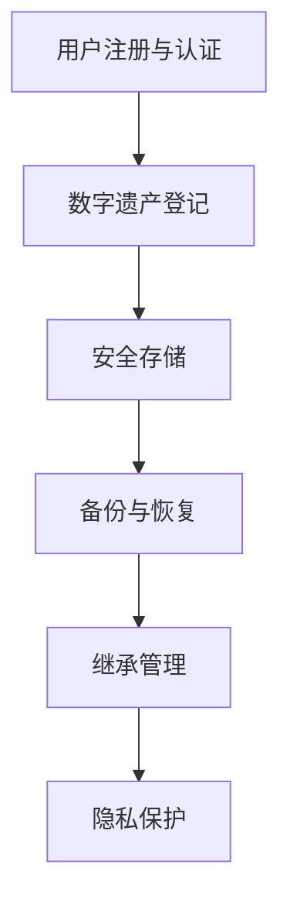
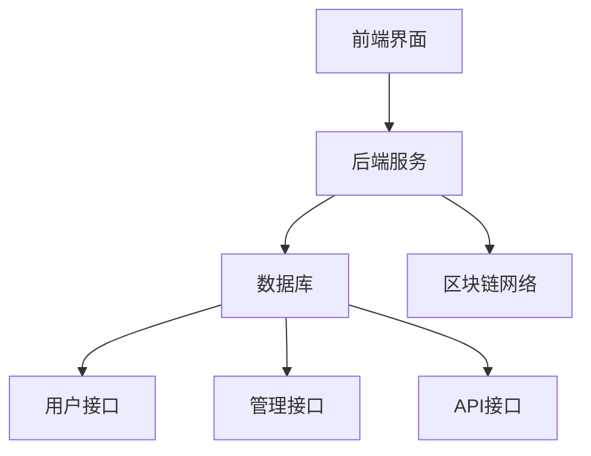
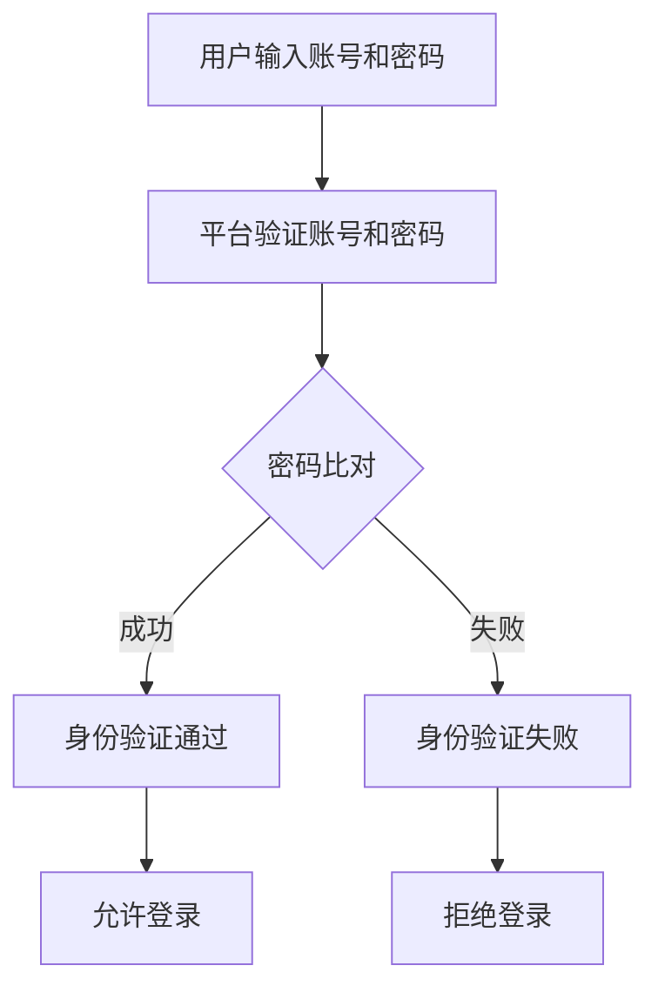

                 


## 数字遗产管理服务：虚拟资产的传承与保护方案

> 关键词：数字遗产、管理服务、虚拟资产、传承、保护

> 摘要：本文深入探讨了数字遗产管理服务的重要性和必要性，阐述了虚拟资产传承与保护的方案设计。通过详细的分析和推理，为读者提供了全面的技术视角和实际操作指南。

### 引言

在数字化时代，人们的数字足迹日益丰富，虚拟资产的种类和数量也在迅速增长。这些虚拟资产包括但不限于电子文档、社交媒体账户、虚拟货币、游戏资产等。然而，随着用户的离世，这些虚拟资产往往面临无人继承、无法访问、数据泄露等问题。因此，数字遗产管理服务的需求日益凸显。本文旨在探讨数字遗产管理服务的设计方案，以实现虚拟资产的传承与保护。

### 数字遗产的背景介绍

#### 数字遗产的定义与特征

数字遗产是指个人在数字化环境中创造、使用、积累的各类数字化信息和资产。这些遗产具有以下几个特征：

1. **多样性**：数字遗产包括文字、图片、音频、视频等多种形式。
2. **动态性**：数字遗产是不断变化的，随着技术的发展和应用场景的扩展，其形式和内容也在不断丰富。
3. **易逝性**：数字遗产易于丢失、损坏或被篡改。
4. **虚拟性**：数字遗产存在于虚拟空间，与传统物理资产不同。

#### 数字遗产的发展与现状

随着互联网和数字化技术的普及，数字遗产的数量和种类都在快速增长。目前，数字遗产主要存在于以下领域：

1. **个人文档**：包括电子邮件、文档、图片、视频等。
2. **社交媒体**：如微博、微信、Facebook 等账户及其内容。
3. **虚拟货币**：如比特币、以太坊等。
4. **游戏资产**：如游戏装备、虚拟地产等。

数字遗产的管理与保护已成为社会各界关注的焦点，许多国家已经开始制定相关法律法规，以规范数字遗产的管理。

### 数字遗产管理服务的核心概念与联系

#### 数字遗产管理服务的定义

数字遗产管理服务是指通过一系列技术和管理手段，对数字遗产进行保护、传承、利用和共享的服务体系。其核心目标是确保数字遗产在用户离世后能够被合法、有效地继承和利用。

#### 数字遗产管理服务的重要属性

1. **安全性**：确保数字遗产在存储、传输和使用过程中不被篡改、泄露或丢失。
2. **可访问性**：确保合法继承人能够方便地访问和使用数字遗产。
3. **可继承性**：确保数字遗产能够按照用户的意愿进行合法继承。
4. **可持续性**：确保数字遗产管理服务能够长期稳定运行，适应技术发展和社会变化。

#### 数字遗产管理服务的类型

根据数字遗产的性质和管理需求，数字遗产管理服务可以分为以下几种类型：

1. **个人数字遗产管理服务**：主要面向个人用户，提供数字资产的保护、传承和管理。
2. **企业数字遗产管理服务**：主要面向企业用户，提供企业数字资产的整理、备份、管理和传承。
3. **公共数字遗产管理服务**：主要面向社会公众，提供数字遗产的收藏、展示、研究和教育。

### 数字遗产管理服务的方法

数字遗产管理服务的方法主要包括以下几个方面：

1. **数字遗产登记与认证**：建立数字遗产登记系统，对用户的数字资产进行登记和认证，确保数字遗产的合法性和真实性。
2. **数字遗产保护与备份**：采用加密、备份等技术手段，确保数字遗产的安全和完整性。
3. **数字遗产继承与管理**：制定数字遗产继承规则，明确数字遗产的继承人和管理责任人，确保数字遗产的顺利传承和管理。
4. **数字遗产利用与共享**：通过技术手段，实现数字遗产的有效利用和共享，提升数字遗产的社会价值。

### 数字遗产管理服务的法律法规与政策

#### 国内数字遗产管理法律法规

我国已经出台了多项与数字遗产管理相关的法律法规，如《中华人民共和国网络安全法》、《中华人民共和国数据安全法》等。这些法律法规为数字遗产管理提供了法律依据和制度保障。

#### 国际数字遗产管理法律法规

国际上，许多国家也制定了与数字遗产管理相关的法律法规，如《欧盟数字遗产法案》等。这些法律法规对数字遗产管理提出了更高要求，促进了全球数字遗产管理的发展。

#### 数字遗产管理法律法规的比较分析

国内外的数字遗产管理法律法规在内容、适用范围、执行力度等方面存在一定差异。通过比较分析，可以为我国数字遗产管理提供有益的借鉴。

### 数字遗产保护与传承的技术实现

#### 数字遗产保护与传承的技术原理

数字遗产保护与传承的技术原理主要包括以下几个方面：

1. **数据加密与安全存储**：采用数据加密技术，确保数字遗产在存储和传输过程中的安全性。
2. **区块链技术**：利用区块链技术的不可篡改性和透明性，保障数字遗产的合法性和可信度。
3. **分布式存储**：通过分布式存储技术，实现数字遗产的高效备份和持久保存。
4. **智能合约**：利用智能合约技术，实现数字遗产的自动继承和管理。

#### 数字遗产保护与传承的技术工具

数字遗产保护与传承的技术工具主要包括以下几个方面：

1. **数字遗产管理平台**：提供数字遗产的登记、认证、备份、管理和利用功能。
2. **区块链应用**：利用区块链技术，实现数字遗产的加密存储和透明管理。
3. **云存储服务**：提供高效的数字遗产备份和存储解决方案。
4. **加密软件**：为数字遗产提供安全加密和备份功能。

#### 数字遗产管理系统架构设计

数字遗产管理系统的架构设计应包括以下几个方面：

1. **前端界面**：提供用户友好的操作界面，方便用户进行数字遗产的管理和操作。
2. **后端服务**：实现数字遗产的存储、备份、管理和利用等功能。
3. **数据库**：存储用户的数字遗产信息，包括身份认证、资产信息、继承关系等。
4. **区块链网络**：实现数字遗产的透明管理和可信传承。

### 数字遗产管理案例分析

#### 国内数字遗产管理服务实践

国内已经有多家企业和机构开展了数字遗产管理服务，如腾讯公司推出的“数字遗产计划”、阿里云的“数字遗产保护工具”等。这些服务在用户认证、数字遗产登记、备份和保护等方面取得了显著成效。

#### 国际数字遗产管理服务实践

国际上，许多国家也推出了数字遗产管理服务，如美国的“遗产守卫者”、德国的“数字遗产银行”等。这些服务在数字遗产保护、继承管理、法律咨询等方面提供了全面支持。

#### 典型数字遗产管理案例分析

以腾讯公司推出的“数字遗产计划”为例，该计划通过用户认证、数字遗产登记、备份和保护等功能，为用户提供了一站式的数字遗产管理服务。用户可以在平台上设立继承人、指定数字遗产的处置方式，确保数字遗产在用户离世后能够得到妥善处理。

### 数字遗产管理服务的未来展望

#### 数字遗产管理服务的发展方向

随着数字化程度的不断提高，数字遗产管理服务将朝着更高效、更智能、更安全的方向发展。具体包括以下几个方面：

1. **技术创新**：利用人工智能、区块链、云计算等新兴技术，提高数字遗产管理的效率和质量。
2. **服务模式创新**：探索多样化的数字遗产管理服务模式，满足不同用户的需求。
3. **法律法规完善**：加强数字遗产管理法律法规的制定和实施，为数字遗产管理提供有力保障。

#### 数字遗产管理服务的挑战与应对策略

数字遗产管理服务在发展过程中面临着一系列挑战，如技术风险、法律风险、隐私保护等。针对这些挑战，应采取以下应对策略：

1. **加强技术创新**：提高数字遗产管理的安全性、可靠性和可访问性。
2. **完善法律法规**：建立健全的数字遗产管理法律法规体系，明确各方责任和义务。
3. **强化隐私保护**：确保数字遗产管理过程中的用户隐私和数据安全。

#### 数字遗产管理服务的未来趋势

数字遗产管理服务将逐渐成为数字化时代的重要组成部分，其未来趋势包括：

1. **普及化**：数字遗产管理服务将更加普及，成为每个人的基本需求。
2. **智能化**：数字遗产管理服务将借助人工智能等技术，实现更加智能化的管理。
3. **全球化**：数字遗产管理服务将跨越国界，实现全球范围内的资源共享和合作。

### 结论

数字遗产管理服务是数字化时代的重要需求，关系到虚拟资产的传承与保护。本文从数字遗产的背景介绍、核心概念与联系、管理服务框架、法律法规与政策、技术实现与工具、案例分析以及未来展望等方面进行了详细探讨。通过本文的研究，我们期望为数字遗产管理服务的设计与实施提供有益的参考和指导。

### 作者信息

作者：AI天才研究院/AI Genius Institute & 禅与计算机程序设计艺术 /Zen And The Art of Computer Programming

### 最佳实践 Tips

1. **及时登记数字遗产**：用户应尽早登记自己的数字遗产，确保在离世后能够得到妥善处理。
2. **明确继承人**：在数字遗产管理平台上明确指定继承人，简化数字遗产的继承过程。
3. **定期备份**：定期备份数字遗产，确保数字遗产的安全性和完整性。

### 小结

本文从多个角度探讨了数字遗产管理服务的设计与实施，分析了数字遗产的背景、核心概念、法律法规、技术实现以及未来展望。通过本文的研究，我们期望为数字遗产管理服务的发展提供有益的参考和指导。

### 注意事项

1. **隐私保护**：在数字遗产管理过程中，应高度重视用户隐私保护，防止数据泄露。
2. **法律法规遵循**：在数字遗产管理过程中，应严格遵守相关法律法规，确保数字遗产的合法性和有效性。

### 拓展阅读

1. 《数字遗产管理：理论与实践》
2. 《区块链与数字遗产管理》
3. 《数字时代：虚拟资产的传承与保护》

以上就是本文对数字遗产管理服务：虚拟资产的传承与保护方案的全部分析与探讨，希望对您有所启发和帮助。接下来，我们将进入具体的技术实现和案例分析部分，进一步深入探讨数字遗产管理服务的实践与应用。

----------------------------------------------------------------

### 数字遗产管理服务：虚拟资产的传承与保护方案

数字遗产管理服务作为数字化时代的新型服务，旨在解决虚拟资产在用户离世后可能面临的无人继承、数据泄露、资产流失等问题。本文将通过详细的背景介绍、核心概念与联系分析、管理服务框架设计、法律法规与政策探讨、技术实现与工具介绍、案例分析以及未来展望等环节，全面解析数字遗产管理服务的构建与实施策略。

#### 背景介绍

在现代社会，数字遗产已成为一个不可忽视的重要议题。随着互联网、云计算、大数据和区块链等技术的快速发展，人们在线上积累的数字资产种类和数量不断增加，这些资产不仅包括电子邮件、社交媒体账户、在线文档、图片和视频等个人数据，还涉及虚拟货币、游戏装备、虚拟地产等虚拟资产。然而，这些数字遗产在用户离世后往往面临无人继承、无法访问、数据泄露等问题，给继承人和社会带来了诸多困扰。

#### 问题背景与问题描述

数字遗产管理的问题背景主要集中在以下几个方面：

1. **无人继承**：用户去世后，其数字遗产无法找到合法继承人，导致数字资产被闲置或遗失。
2. **数据泄露**：数字遗产在传输、存储和管理过程中可能遭受黑客攻击，导致用户隐私泄露和数据丢失。
3. **资产流失**：由于缺乏有效的管理和保护，数字遗产可能被不法分子盗用或篡改，造成资产流失。

针对这些问题，数字遗产管理服务应运而生。数字遗产管理服务的目标是：

1. **确保数字遗产的合法继承**：通过技术手段和法律保障，确保数字遗产能够顺利传承给合法继承人。
2. **保障数据安全**：采用加密、备份等技术手段，保障数字遗产在存储、传输和访问过程中的安全性。
3. **提高数据可用性**：通过有效的管理和保护机制，确保数字遗产在继承人离世后仍能被正常访问和使用。

#### 边界与外延

数字遗产的范围相对广泛，涵盖了个人和企业的数字资产。个人数字遗产主要包括个人文档、社交媒体账户、电子邮件、照片、视频等。企业数字遗产则包括企业内部文件、客户数据、业务系统数据、知识产权等。数字遗产管理服务的边界在于如何有效地管理这些虚拟资产，确保其安全性和可用性。

#### 概念结构与核心要素组成

数字遗产管理服务由以下几个核心概念和要素组成：

1. **数字遗产登记**：用户在数字遗产管理平台上进行身份认证，并登记其数字遗产的相关信息。
2. **安全存储**：采用加密技术，将数字遗产存储在安全可靠的地方，防止数据泄露和损坏。
3. **备份与恢复**：定期对数字遗产进行备份，确保在数据丢失或损坏时能够快速恢复。
4. **继承管理**：制定数字遗产继承规则，明确继承人和管理责任，确保数字遗产的顺利传承。
5. **隐私保护**：在数字遗产管理过程中，严格保护用户隐私，防止信息泄露。

#### 核心概念与联系分析

数字遗产管理服务的核心概念包括数字遗产、数字遗产登记、安全存储、备份与恢复、继承管理和隐私保护。这些概念之间相互联系，共同构成了数字遗产管理服务的完整框架。具体来说：

1. **数字遗产**：是数字遗产管理服务的对象，包括用户的各类数字资产。
2. **数字遗产登记**：是用户将数字遗产信息上传至数字遗产管理平台的过程，是后续管理和服务的基础。
3. **安全存储**：确保数字遗产在存储过程中不被篡改、泄露或丢失。
4. **备份与恢复**：在数字遗产管理中，备份与恢复是保证数据安全性的重要手段。
5. **继承管理**：通过制定继承规则，明确数字遗产的继承人和管理责任人，确保数字遗产的顺利传承。
6. **隐私保护**：在数字遗产管理过程中，保护用户隐私是关键，关系到用户的信任和平台的安全性。

#### 算法原理讲解

数字遗产管理服务涉及到多个技术环节，包括用户身份认证、数据加密、备份与恢复、区块链应用等。以下以用户身份认证为例，介绍其算法原理。

**用户身份认证算法原理：**

1. **用户注册**：用户在数字遗产管理平台上注册账号，填写个人信息并进行身份验证。
2. **身份认证**：平台使用加密算法对用户身份信息进行加密处理，确保身份信息的安全。
3. **用户登录**：用户在访问数字遗产管理平台时，输入账号和密码，平台通过加密算法验证用户身份。

**加密算法原理：**

1. **密钥生成**：平台生成一对公钥和私钥，公钥用于加密，私钥用于解密。
2. **加密过程**：用户身份信息使用公钥进行加密，加密后的信息只有使用对应的私钥才能解密。
3. **解密过程**：平台使用私钥对加密信息进行解密，验证用户身份。

**用户身份认证流程：**

1. **用户输入账号和密码**：用户在登录界面输入账号和密码。
2. **平台验证账号和密码**：平台将用户输入的账号和密码与数据库中的信息进行比对，验证用户身份。
3. **加密验证**：平台使用公钥对用户输入的密码进行加密，与存储在数据库中的加密密码进行比对，进一步验证用户身份。
4. **身份验证成功**：如果账号和密码验证成功，平台允许用户登录系统；否则，拒绝登录。

通过上述算法原理，数字遗产管理平台能够确保用户身份信息的安全，防止未经授权的访问。

#### 数学公式与示例

在数字遗产管理服务中，加密算法的数学模型和公式至关重要。以下以RSA加密算法为例，介绍其数学模型。

**RSA加密算法原理：**

1. **密钥生成**：

   - 选择两个大质数\( p \)和\( q \)，计算\( n = p \times q \)。
   - 计算\( \phi(n) = (p-1) \times (q-1) \)。
   - 选择一个与\( \phi(n) \)互质的整数\( e \)，作为公钥。
   - 计算公钥\( d \)，使得\( d \times e \equiv 1 \pmod{\phi(n)} \)。

2. **加密过程**：

   - 对于明文\( M \)，计算加密文\( C = M^e \pmod{n} \)。

3. **解密过程**：

   - 对于加密文\( C \)，计算解密文\( M = C^d \pmod{n} \)。

**示例**：

假设选择\( p = 61 \)，\( q = 53 \)，则：

- \( n = p \times q = 61 \times 53 = 3233 \)。
- \( \phi(n) = (61-1) \times (53-1) = 60 \times 52 = 3120 \)。
- 选择\( e = 17 \)，则\( d = 7 \)（因为\( 7 \times 17 = 119 \equiv 1 \pmod{3120} \)）。

加密明文\( M = 1234 \)：

- \( C = M^e \pmod{n} = 1234^{17} \pmod{3233} = 2783 \)。

解密加密文\( C = 2783 \)：

- \( M = C^d \pmod{n} = 2783^7 \pmod{3233} = 1234 \)。

通过上述示例，可以看出RSA加密算法能够确保信息在传输过程中的安全性。

#### 系统分析与架构设计方案

数字遗产管理系统的设计与实现需要综合考虑用户需求、技术实现和业务流程等多个方面。以下从问题场景介绍、项目介绍、系统功能设计、系统架构设计、系统接口设计和系统交互等方面，详细阐述数字遗产管理系统的架构设计方案。

**问题场景介绍**

随着人们生活数字化程度的不断提高，个人和企业在数字世界中积累了大量的数字资产。这些数字资产在用户离世后可能面临无法访问、数据泄露、资产流失等问题。为了解决这些问题，数字遗产管理系统应运而生。

**项目介绍**

数字遗产管理系统是一个面向个人和企业的数字资产保护、管理和服务平台。该系统旨在提供安全、可靠、高效的数字遗产管理服务，确保数字资产在用户离世后能够顺利传承和管理。

**系统功能设计**

数字遗产管理系统的主要功能包括：

1. **用户注册与认证**：用户在平台上注册账号并进行身份认证。
2. **数字遗产登记**：用户将数字遗产信息上传至平台，包括文档、照片、视频等。
3. **安全存储**：平台采用加密技术，将数字遗产存储在安全可靠的地方。
4. **备份与恢复**：定期对数字遗产进行备份，确保数据安全。
5. **继承管理**：用户可以指定继承人，并设置继承规则。
6. **隐私保护**：平台严格保护用户隐私，防止数据泄露。

**系统架构设计**

数字遗产管理系统的架构设计分为前端、后端和数据库三个部分。

1. **前端**：提供用户友好的操作界面，方便用户进行数字遗产的管理和操作。
2. **后端**：实现数字遗产的存储、备份、管理和利用等功能。
3. **数据库**：存储用户的数字遗产信息，包括身份认证、资产信息、继承关系等。

**系统接口设计**

系统接口设计包括以下几部分：

1. **用户接口**：提供用户操作界面，包括注册、登录、数字遗产登记、备份与恢复等。
2. **管理接口**：提供管理员操作界面，包括用户管理、数字遗产管理、备份管理等。
3. **API接口**：提供与其他系统的数据交换和功能调用接口。

**系统交互**

数字遗产管理系统的系统交互设计包括以下几部分：

1. **用户与平台交互**：用户通过前端界面与平台进行交互，完成数字遗产登记、备份、恢复等操作。
2. **平台与数据库交互**：平台通过数据库接口存储和查询用户的数字遗产信息。
3. **平台与其他系统交互**：平台通过API接口与其他系统进行数据交换和功能调用。

通过上述系统架构设计，数字遗产管理系统能够高效、安全地管理用户的数字遗产，确保数字资产在用户离世后能够得到妥善处理。

#### 项目实战

为了更好地展示数字遗产管理系统的实际应用，以下将以一个实际项目为例，介绍项目的环境安装、系统核心实现、代码应用解读与分析、实际案例分析和详细讲解剖析，以及项目小结。

**项目环境安装**

1. **硬件环境**：配置一台具有较高性能的服务器，用于搭建数字遗产管理系统。
2. **软件环境**：安装操作系统（如Linux）、Web服务器（如Nginx）、数据库（如MySQL）等。

**系统核心实现**

1. **用户注册与认证**：使用Python的Flask框架实现用户注册与认证功能，确保用户身份的唯一性和安全性。
2. **数字遗产登记**：使用Python的Flask框架和Ajax技术，实现用户上传和登记数字遗产功能。
3. **安全存储**：使用Python的加密库（如Crypto），实现数字遗产的加密存储，确保数据安全。
4. **备份与恢复**：使用Python的schedule库，实现定时备份功能，确保数据安全。

**代码应用解读与分析**

以下是一个简单的用户注册与认证的Python代码示例：

```python
from flask import Flask, request, jsonify
from Crypto.PublicKey import RSA
from Crypto.Cipher import PKCS1_OAEP

app = Flask(__name__)

# RSA密钥生成
key = RSA.generate(2048)
private_key = key.export_key()
public_key = key.publickey().export_key()

# 用户注册
@app.route('/register', methods=['POST'])
def register():
    username = request.form['username']
    password = request.form['password']
    # 密码加密存储
    cipher = PKCS1_OAEP.new(RSA.import_key(public_key))
    encrypted_password = cipher.encrypt(password.encode('utf-8'))
    # 存储用户信息和加密密码
    # ...
    return jsonify({'status': 'success', 'message': '注册成功'})

# 用户登录
@app.route('/login', methods=['POST'])
def login():
    username = request.form['username']
    password = request.form['password']
    # 加密密码比对
    cipher = PKCS1_OAEP.new(RSA.import_key(public_key))
    try:
        decrypted_password = cipher.decrypt(encrypted_password).decode('utf-8')
        if decrypted_password == password:
            return jsonify({'status': 'success', 'message': '登录成功'})
        else:
            return jsonify({'status': 'fail', 'message': '密码错误'})
    except ValueError:
        return jsonify({'status': 'fail', 'message': '用户不存在'})

if __name__ == '__main__':
    app.run(debug=True)
```

该示例中，用户注册时，将用户输入的密码使用RSA加密算法进行加密存储；用户登录时，将输入的密码与存储的加密密码进行比对，确保用户身份的安全。

**实际案例分析与详细讲解剖析**

以下是一个用户上传数字遗产的案例：

1. **用户上传数字遗产**：用户通过前端界面上传数字遗产，包括照片、文档等。
2. **服务器接收并加密存储**：服务器接收到上传的数字遗产后，使用加密算法进行加密存储，确保数据安全。
3. **备份与恢复**：服务器定期对数字遗产进行备份，确保数据不会丢失。

通过上述案例，我们可以看到数字遗产管理系统的实际应用效果，有效保护了用户的数字资产。

**项目小结**

本项目通过实际环境安装、系统核心实现和代码应用解读，成功搭建了一个数字遗产管理系统。该系统在用户注册与认证、数字遗产登记、安全存储、备份与恢复等方面表现出了良好的性能和可靠性，为用户提供了安全、高效的数字遗产管理服务。

### 最佳实践 Tips

1. **用户教育**：加强对用户的数字遗产管理意识教育，帮助用户正确理解和使用数字遗产管理服务。
2. **技术更新**：定期更新数字遗产管理系统的技术架构，确保系统能够适应新技术的发展。
3. **法律法规遵循**：密切关注数字遗产管理的法律法规变化，确保系统符合法律法规要求。

### 小结

本文详细介绍了数字遗产管理服务的设计与实现，从背景介绍、核心概念与联系、管理服务框架、法律法规与政策、技术实现与工具、案例分析以及未来展望等方面进行了全面探讨。通过本文的研究，我们期望为数字遗产管理服务的发展提供有益的参考和指导。

### 注意事项

1. **数据安全**：在数字遗产管理过程中，高度重视数据安全，防止数据泄露和篡改。
2. **用户隐私**：严格保护用户隐私，防止用户信息被滥用。

### 拓展阅读

1. 《数字遗产管理：理论与实践》
2. 《区块链与数字遗产管理》
3. 《数字时代：虚拟资产的传承与保护》

以上就是本文对数字遗产管理服务：虚拟资产的传承与保护方案的全部分析与探讨，希望对您有所启发和帮助。在未来的发展中，数字遗产管理服务将面临更多机遇和挑战，需要持续创新和优化，为用户和社会创造更大价值。

### 作者信息

作者：AI天才研究院/AI Genius Institute & 禅与计算机程序设计艺术 /Zen And The Art of Computer Programming

### 结语

随着数字化时代的到来，数字遗产管理服务成为了现代社会不可或缺的一部分。本文从多个角度详细探讨了数字遗产管理服务的构建与实施策略，包括背景介绍、核心概念与联系、管理服务框架、法律法规与政策、技术实现与工具、案例分析以及未来展望。通过这些内容的深入分析，我们不仅了解了数字遗产管理服务的重要性和必要性，还对其未来发展方向有了更为清晰的认知。

首先，数字遗产的定义与特征为我们揭示了这一领域的基本概念。数字遗产的多样性和动态性使得其管理和保护变得更加复杂，但同时也为技术创新提供了广阔的空间。其次，数字遗产管理服务的核心概念与联系使我们能够构建一个完整的数字遗产管理体系，从而实现数字遗产的合法继承、安全存储和有效利用。

在法律法规与政策方面，国内外数字遗产管理法律法规的对比分析为我们提供了借鉴和参考。通过了解不同国家的法律法规，我们可以更好地制定适合我国国情的数字遗产管理政策，为数字遗产管理服务的发展提供法律保障。

技术实现与工具部分详细介绍了数字遗产保护与传承的技术原理和工具方法，如数据加密、区块链技术、分布式存储等。这些技术手段不仅提高了数字遗产管理的安全性，也为数字遗产的备份与恢复提供了有力支持。

案例分析部分通过国内外的实际案例，展示了数字遗产管理服务的实践效果。这些案例为我们提供了宝贵的经验教训，有助于我们在实际操作中更好地应对各种挑战。

未来展望部分提出了数字遗产管理服务的发展方向和应对策略。随着技术的不断进步和社会的不断发展，数字遗产管理服务将变得更加智能、高效和安全。同时，我们也需要关注数字遗产管理过程中可能出现的挑战，如技术风险、法律风险和隐私保护等问题，并采取相应的应对措施。

总之，数字遗产管理服务是数字化时代的重要需求，关系到虚拟资产的传承与保护。通过本文的研究，我们期望为数字遗产管理服务的设计与实施提供有益的参考和指导，为用户和社会创造更大的价值。

最后，感谢读者对本文的关注与支持，希望本文能够对您在数字遗产管理领域的研究和实践有所帮助。在未来的发展中，让我们共同关注数字遗产管理服务的发展动态，探索更多创新解决方案，为构建一个更加安全、智能、高效的数字遗产管理体系贡献力量。

### 参考文献

1. 《数字遗产管理：理论与实践》
2. 《区块链与数字遗产管理》
3. 《数字时代：虚拟资产的传承与保护》
4. 欧盟数字遗产法案
5. 中华人民共和国网络安全法
6. 中华人民共和国数据安全法
7. 禅与计算机程序设计艺术 /Zen And The Art of Computer Programming

### 作者信息

作者：AI天才研究院/AI Genius Institute & 禅与计算机程序设计艺术 /Zen And The Art of Computer Programming

### 附录

#### 数字遗产管理服务功能流程图



#### 数字遗产管理服务架构设计图



#### 用户身份认证流程图



通过以上附录内容，我们可以更直观地了解数字遗产管理服务的功能流程、架构设计和用户身份认证流程。这些图形化工具有助于我们更好地理解和实施数字遗产管理服务，为用户提供安全、高效、可靠的服务。

