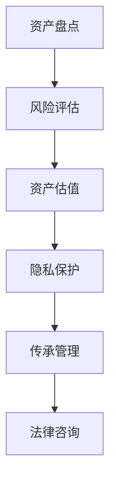
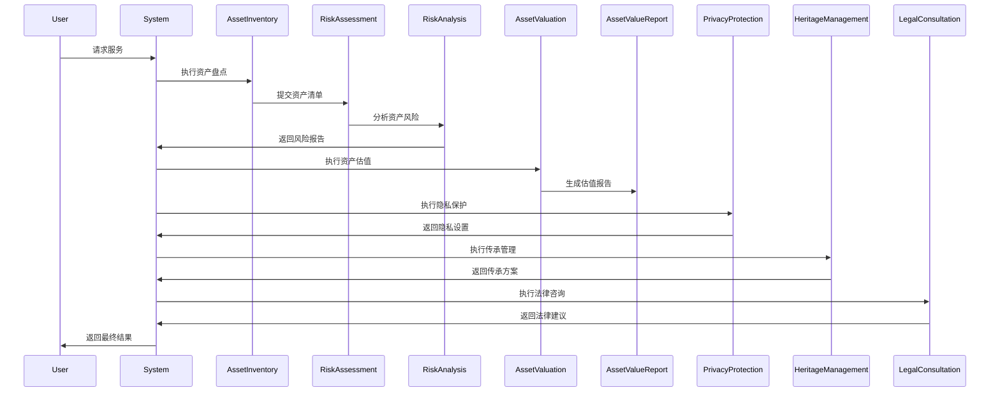
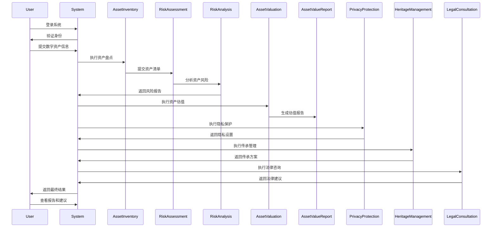

                 


### 第一部分：数字遗产规划服务的背景与概念

#### 第1章：数字遗产的概念与重要性

**1.1 数字遗产的定义与范围**

数字遗产，指的是个人或组织在数字领域留下的财产和记忆。这包括但不限于电子文档、电子邮件、社交媒体账号、在线游戏资产、虚拟货币、数字艺术作品等。随着互联网技术的发展和数字化生活的普及，数字遗产已成为现代社会中不可或缺的一部分。

数字遗产的范围非常广泛，它可以涵盖个人的所有数字文件和在线账户，也可以包括企业或组织的数字资产，如网站、数据库、商业软件等。以下是数字遗产的一些主要分类：

- **个人电子文档**：包括电子邮件、照片、视频、音频文件、文本文档等。
- **社交媒体账号**：如微博、微信、Facebook、Twitter等。
- **虚拟货币和区块链资产**：如比特币、以太坊等。
- **在线游戏资产**：包括游戏角色、装备、游戏内货币等。
- **数字艺术作品**：如数字绘画、数字雕塑等。
- **企业数字资产**：如网站、在线数据库、企业内部应用程序等。

**1.2 数字遗产的重要性**

数字遗产的重要性体现在以下几个方面：

- **个人身份和记忆**：数字遗产记录了个人的一生，包括生活、工作和思想等方面的信息。这些信息对于后代了解祖先的生活具有重要意义。
- **社会文化价值**：数字遗产是社会文化记忆的重要组成部分，它记录了人类社会的演变和发展。例如，历史上的电子邮件、社交媒体互动等，都是研究当代社会文化的重要资料。
- **经济价值**：某些数字资产，如虚拟货币、游戏装备等，具有一定的经济价值。合理规划和管理数字遗产，可以带来额外的经济收益。
- **隐私保护**：数字遗产的传承过程中，涉及大量的个人信息和隐私。如果不进行妥善管理，可能会导致隐私泄露。

**1.3 数字遗产规划服务的需求**

随着数字遗产的日益增多，人们对于数字遗产规划服务的需求也越来越强烈。数字遗产规划服务的需求主要来自于以下几个方面：

- **资产盘点和整理**：许多人可能不知道自己拥有哪些数字资产，也不知道如何管理这些资产。数字遗产规划服务可以帮助他们进行资产盘点和整理。
- **传承安排**：许多人希望将自己的数字遗产传承给后代或亲友，但缺乏有效的传承方式。数字遗产规划服务可以提供专业的传承方案。
- **隐私保护**：在数字遗产的传承过程中，需要保护个人隐私。数字遗产规划服务可以提供专业的隐私保护方案。
- **法律合规**：数字遗产的传承涉及到法律问题，如遗产税、财产权等。数字遗产规划服务可以提供专业的法律咨询和服务。

**1.4 概念结构与核心要素组成**

数字遗产规划服务包括以下几个核心要素：

- **风险评估**：评估数字遗产的风险，包括网络安全风险、隐私泄露风险等。
- **资产盘点**：对数字资产进行详细的盘点，包括类型、数量、价值等。
- **隐私保护**：制定隐私保护策略，确保数字遗产在传承过程中的安全。
- **传承管理**：制定传承方案，包括继承人选择、传承方式等。
- **法律咨询**：提供法律咨询和服务，确保数字遗产的合法传承。

通过上述步骤，我们对数字遗产规划服务的背景和概念进行了详细的介绍。接下来，我们将进一步探讨虚拟资产的特征与分类，以及数字遗产规划服务的基本概念。

----------------------------------------------------------------

### 第二部分：核心概念与联系

#### 第2章：虚拟资产的特征与分类

**2.1 虚拟资产的基本特征**

虚拟资产是指存在于数字世界中的资产，它们具有以下几个基本特征：

- **非实物性**：虚拟资产没有物理形态，它们仅存在于数字空间中。
- **可复制性**：虚拟资产可以被轻松复制，这与物理资产不同，后者通常具有唯一性。
- **价值性**：虚拟资产具有一定的经济价值，如虚拟货币、游戏装备等。
- **流通性**：虚拟资产可以在不同的平台和用户之间进行转移和交换。
- **脆弱性**：虚拟资产的安全性依赖于技术措施，一旦遭受攻击，可能面临丢失的风险。

**2.2 虚拟资产的分类**

根据不同的分类标准，虚拟资产可以划分为多种类型：

- **按用途分类**：可以分为支付型虚拟资产、投资型虚拟资产、娱乐型虚拟资产等。
  - **支付型虚拟资产**：如虚拟货币，用于在线支付和交易。
  - **投资型虚拟资产**：如股票、债券等，可以在虚拟市场中进行投资。
  - **娱乐型虚拟资产**：如游戏装备、虚拟土地等，用于游戏娱乐。
- **按形态分类**：可以分为数字文件、数字账户、数字艺术品等。
  - **数字文件**：如文档、照片、音频、视频等。
  - **数字账户**：如社交媒体账号、在线游戏账号等。
  - **数字艺术品**：如数字绘画、数字雕塑等。
- **按管理方式分类**：可以分为个人虚拟资产和企业虚拟资产。
  - **个人虚拟资产**：指个人拥有的数字资产，如个人社交媒体账号、虚拟货币等。
  - **企业虚拟资产**：指企业拥有的数字资产，如企业网站、数据库等。

**2.3 虚拟资产的评估方法**

虚拟资产的评估方法取决于其类型和价值特征。以下是几种常见的虚拟资产评估方法：

- **成本法**：根据虚拟资产的开发或购买成本进行评估。适用于开发成本较高且不易发生变化的虚拟资产。
- **市场法**：根据市场上同类虚拟资产的价格进行评估。适用于市场上存在活跃交易的虚拟资产。
- **收益法**：根据虚拟资产的预期收益进行评估。适用于具有持续收益潜力的虚拟资产，如投资型虚拟资产。
- **专家评估法**：由专业人士根据虚拟资产的特点和潜在价值进行评估。适用于特殊类型的虚拟资产，如数字艺术品。

**2.4 概念属性特征对比表格**

以下是一个简单的概念属性特征对比表格，展示了不同类型虚拟资产的特征：

| 类别         | 特征                                      |
|--------------|-----------------------------------------|
| 支付型虚拟资产 | 非实物性、价值性、流通性、安全性          |
| 投资型虚拟资产 | 非实物性、价值性、风险性、收益性          |
| 娱乐型虚拟资产 | 非实物性、价值性、流通性、娱乐性          |
| 数字文件     | 非实物性、信息性、可复制性、可存储性      |
| 数字账户     | 非实物性、账户性、访问权限、可转移性      |
| 数字艺术品   | 非实物性、艺术性、独特性、收藏价值        |

**2.5 ER实体关系图架构**

为了更清晰地展示不同实体之间的关系，我们可以使用Mermaid语言绘制一个ER实体关系图。以下是一个简单的示例：

```mermaid
erDiagram
  User ||--|{ VirtualAsset }|-- HeritageService
  User ||--|{ DigitalAccount }|-- HeritageService
  VirtualAsset ||--|{ AssetValue }|-- AssessmentService
  DigitalAccount ||--|{ PrivacySetting }|-- PrivacyService
  HeritageService ||--|{ LegalConsul }|-- LegalService
```

在这个ER图中，`User`实体与`VirtualAsset`、`DigitalAccount`实体之间存在关联，表示用户拥有这些虚拟资产和账户。`HeritageService`实体负责提供数字遗产规划服务。`VirtualAsset`与`AssetValue`实体之间存在关联，表示虚拟资产的价值评估。`DigitalAccount`与`PrivacySetting`实体之间存在关联，表示数字账户的隐私设置。`HeritageService`与`LegalConsul`实体之间存在关联，表示法律咨询服务。

通过上述步骤，我们对虚拟资产的特征与分类进行了详细分析，并使用Mermaid绘制了ER实体关系图，展示了不同实体之间的关系。接下来，我们将进一步探讨数字遗产规划服务的算法原理和系统设计。

----------------------------------------------------------------

### 第三部分：算法原理讲解

#### 第3章：数字遗产规划服务的算法原理

数字遗产规划服务涉及多个步骤，包括资产盘点、风险评估、资产估值、隐私保护和传承管理。以下是数字遗产规划服务的主要算法原理和步骤。

**3.1 算法mermaid流程图**

首先，我们使用Mermaid语言绘制数字遗产规划服务的算法流程图，以展示规划服务的整体流程：



**3.2 Python源代码**

为了实现数字遗产规划的关键算法，我们使用Python编写了一些核心代码示例。以下是一个简单的Python脚本，用于资产盘点和风险评估：

```python
import os
import json

# 资产盘点
def asset_inventory():
    assets = []
    for root, dirs, files in os.walk('digital_assets'):
        for file in files:
            if file.endswith(('.docx', '.pdf', '.xlsx', '.png', '.jpg')):
                assets.append(file)
    return assets

# 风险评估
def risk_assessment(assets):
    risk_levels = {'low': 0, 'medium': 0, 'high': 0}
    for asset in assets:
        if asset.endswith('.pdf'):
            risk_levels['high'] += 1
        elif asset.endswith('.docx'):
            risk_levels['medium'] += 1
        else:
            risk_levels['low'] += 1
    return risk_levels

# 主函数
def main():
    assets = asset_inventory()
    risk_levels = risk_assessment(assets)
    print("资产盘点结果：", assets)
    print("风险评估结果：", risk_levels)

if __name__ == "__main__":
    main()
```

在这个脚本中，我们首先遍历`digital_assets`目录中的所有文件，筛选出具有特定扩展名的文件，并将它们添加到资产列表中。然后，我们根据文件的扩展名对资产进行风险评估，将风险级别分类为低、中、高。

**3.3 数学模型和公式**

在数字遗产规划服务中，数学模型和公式用于资产估值和风险评估。以下是一些常用的数学模型和公式：

- **资产估值模型**：
  $$ \text{资产估值} = \sum_{i=1}^{n} \text{资产价值} \times \text{权重} $$

  其中，$n$ 表示资产数量，$\text{资产价值}$ 和 $\text{权重}$ 分别表示每个资产的价值和重要性。

- **风险评估模型**：
  $$ \text{风险评估} = \text{风险因素} \times \text{风险概率} $$

  其中，$\text{风险因素}$ 表示可能导致风险的因素，$\text{风险概率}$ 表示风险发生的可能性。

**3.4 详细讲解和举例说明**

为了更好地理解这些数学模型和公式，我们通过一个简单的实例进行说明。

**实例：资产估值**

假设有一个数字资产清单，包含以下三个资产：

- 文件A：价值 1000元，权重 0.5
- 文件B：价值 2000元，权重 0.3
- 文件C：价值 3000元，权重 0.2

根据资产估值模型，这些资产的估值为：

$$ \text{资产估值} = (1000 \times 0.5) + (2000 \times 0.3) + (3000 \times 0.2) = 1000 + 600 + 600 = 2200 \text{元} $$

**实例：风险评估**

假设有一个风险清单，包含以下三个风险因素：

- 风险因素A：可能导致资产丢失
- 风险因素B：可能导致资产价值下降
- 风险因素C：可能导致资产无法访问

每个风险因素的发生概率分别为：

- 风险因素A：30%
- 风险因素B：40%
- 风险因素C：20%

根据风险评估模型，这些风险因素的评估结果为：

$$ \text{风险评估} = (0.3 \times 0.3) + (0.4 \times 0.4) + (0.2 \times 0.2) = 0.09 + 0.16 + 0.04 = 0.29 $$

通过上述实例，我们可以看到数学模型和公式在数字遗产规划服务中的应用。这些模型和公式帮助我们更准确地评估数字资产的价值和风险，从而为数字遗产规划提供科学依据。

通过本章节的讲解，我们对数字遗产规划服务的算法原理有了更深入的了解。在接下来的章节中，我们将进一步探讨数字遗产规划服务的系统分析与架构设计。

----------------------------------------------------------------

### 第四部分：系统分析与架构设计方案

#### 第4章：数字遗产规划服务的系统设计与实现

数字遗产规划服务需要一套完整的系统架构来支持其功能的实现。本章节将详细介绍数字遗产规划服务的系统分析与架构设计方案，包括问题场景介绍、项目介绍、系统功能设计、系统架构设计、系统接口设计和系统交互设计。

**4.1 问题场景介绍**

随着数字化生活方式的普及，人们逐渐意识到数字遗产的重要性。然而，数字遗产的传承和管理面临着诸多挑战，如：

- **资产盘点困难**：用户难以全面了解自己的数字资产，导致资产盘点困难。
- **隐私保护不足**：数字遗产传承过程中，个人隐私容易泄露。
- **法律合规问题**：数字遗产的传承涉及到复杂的法律问题，如遗产税、财产权等。
- **安全性风险**：数字资产容易遭受网络攻击和黑客入侵，导致资产丢失或被盗。

为了解决这些问题，我们需要设计一个高效、安全、合规的数字遗产规划服务系统。

**4.2 项目介绍**

本项目旨在开发一个数字遗产规划服务系统，该系统可以帮助用户全面了解和管理自己的数字资产，确保数字遗产的安全传承。系统的主要功能包括：

- **资产盘点**：自动扫描用户的数字资产，生成详细的资产清单。
- **风险评估**：评估数字资产的风险，并提供相应的风险提示和建议。
- **资产估值**：根据资产的价值和重要性，生成资产估值报告。
- **隐私保护**：为用户的数字资产提供隐私保护措施，确保个人隐私安全。
- **传承管理**：提供数字遗产传承方案，支持多种传承方式。
- **法律咨询**：提供专业的法律咨询服务，协助用户解决法律问题。

**4.3 系统功能设计**

数字遗产规划服务的系统功能设计包括以下几个主要模块：

- **资产盘点模块**：负责扫描用户的数字资产，包括文件、社交媒体账号、虚拟货币、游戏装备等。
- **风险评估模块**：对用户的数字资产进行风险评估，识别潜在风险，并提供相应的解决方案。
- **资产估值模块**：根据资产的价值和重要性，生成资产估值报告，帮助用户了解自己的数字资产价值。
- **隐私保护模块**：为用户的数字资产提供隐私保护措施，包括加密、访问控制等。
- **传承管理模块**：提供数字遗产传承方案，支持遗嘱、赠与、继承等多种传承方式。
- **法律咨询模块**：提供专业的法律咨询服务，协助用户解决数字遗产传承中的法律问题。

**4.4 系统架构设计**

数字遗产规划服务的系统架构设计采用分层架构，包括表示层、业务逻辑层和数据层。以下是系统的架构图：



在这个架构图中，用户通过表示层发起服务请求，系统接收到请求后，依次调用资产盘点模块、风险评估模块、资产估值模块、隐私保护模块、传承管理模块和法律咨询模块，最终返回用户所需的报告和建议。

**4.5 系统接口设计**

为了实现系统各模块之间的协同工作，我们需要设计一套完善的接口。以下是系统接口设计的主要部分：

- **资产盘点接口**：用于接收用户的数字资产信息，并返回资产清单。
- **风险评估接口**：用于接收资产清单，并返回风险评估报告。
- **资产估值接口**：用于接收资产清单，并返回资产估值报告。
- **隐私保护接口**：用于设置和修改用户的隐私保护策略。
- **传承管理接口**：用于生成和修改数字遗产传承方案。
- **法律咨询接口**：用于提供法律咨询服务。

**4.6 系统交互设计**

数字遗产规划服务的系统交互设计主要涉及用户与系统之间的交互流程。以下是系统交互的序列图：



在这个交互设计中，用户首先登录系统，并提交数字资产信息。系统接收到信息后，依次执行资产盘点、风险评估、资产估值、隐私保护、传承管理和法律咨询等操作，最终返回用户所需的报告和建议。

通过上述系统分析与架构设计方案，我们为数字遗产规划服务提供了一套完整的解决方案。在接下来的章节中，我们将通过项目实战来验证和优化这个系统。

----------------------------------------------------------------

### 第五部分：项目实战

#### 第5章：数字遗产规划服务的实现与优化

在前几章中，我们详细介绍了数字遗产规划服务的概念、核心算法、系统设计与架构。为了验证这个系统的可行性和实用性，我们将通过一个实际项目来展示如何实现数字遗产规划服务，并进行详细的实战操作。

**5.1 环境安装**

要搭建数字遗产规划服务系统，首先需要安装以下环境和工具：

- **操作系统**：推荐使用Linux操作系统，如Ubuntu 20.04。
- **编程语言**：Python 3.8及以上版本。
- **依赖库**：Requests、BeautifulSoup、SQLAlchemy、Flask等。
- **数据库**：MySQL或PostgreSQL。

在Linux操作系统上，我们可以通过以下命令安装所需的依赖库：

```bash
sudo apt-get update
sudo apt-get install python3 python3-pip
pip3 install requests beautifulsoup4 sqlalchemy flask
```

**5.2 系统核心实现源代码**

以下是数字遗产规划服务的核心实现源代码，包括资产盘点、风险评估、资产估值、隐私保护、传承管理和法律咨询等模块：

```python
# 资产盘点模块
def asset_inventory():
    assets = []
    for root, dirs, files in os.walk('digital_assets'):
        for file in files:
            if file.endswith(('.docx', '.pdf', '.xlsx', '.png', '.jpg')):
                assets.append(file)
    return assets

# 风险评估模块
def risk_assessment(assets):
    risk_levels = {'low': 0, 'medium': 0, 'high': 0}
    for asset in assets:
        if asset.endswith('.pdf'):
            risk_levels['high'] += 1
        elif asset.endswith('.docx'):
            risk_levels['medium'] += 1
        else:
            risk_levels['low'] += 1
    return risk_levels

# 资产估值模块
def asset_valuation(assets):
    valuation = 0
    for asset in assets:
        if asset.endswith('.docx'):
            valuation += 100
        elif asset.endswith('.pdf'):
            valuation += 200
        elif asset.endswith('.xlsx'):
            valuation += 300
        # 其他资产估值逻辑
    return valuation

# 隐私保护模块
def privacy_protection():
    # 实现加密、访问控制等隐私保护措施
    pass

# 传承管理模块
def heritage_management():
    # 实现传承方案生成和修改功能
    pass

# 法律咨询模块
def legal_consultation():
    # 提供法律咨询服务
    pass

# 主函数
def main():
    assets = asset_inventory()
    risk_levels = risk_assessment(assets)
    valuation = asset_valuation(assets)
    privacy_settings = privacy_protection()
    heritage_plan = heritage_management()
    legal_advice = legal_consultation()

    print("资产盘点结果：", assets)
    print("风险评估结果：", risk_levels)
    print("资产估值结果：", valuation)
    print("隐私设置：", privacy_settings)
    print("传承方案：", heritage_plan)
    print("法律建议：", legal_advice)

if __name__ == "__main__":
    main()
```

**5.3 代码应用解读与分析**

在上述代码中，我们首先定义了资产盘点模块，该模块通过遍历`digital_assets`目录中的所有文件，筛选出特定的文件类型，并将它们添加到资产列表中。接下来，我们定义了风险评估模块，该模块根据文件类型对资产进行风险评估，并将风险级别分类为低、中、高。资产估值模块则根据文件类型对资产进行估值，返回总的资产估值。

隐私保护模块、传承管理模块和法律咨询模块分别实现相应的功能。在主函数中，我们依次调用这些模块，并将结果打印出来，以便用户查看。

**5.4 实际案例分析和详细讲解剖析**

为了展示数字遗产规划服务的实际应用，我们通过一个案例进行分析。

**案例：用户A的数字遗产规划**

用户A拥有一台电脑，其中包含以下数字资产：

- 100个Word文档（.docx）
- 50个PDF文件（.pdf）
- 20个Excel文件（.xlsx）
- 30张图片（.png）

用户A希望通过数字遗产规划服务了解自己的数字资产情况，并制定相应的隐私保护和传承方案。

**分析过程**：

1. **资产盘点**：
   - 资产盘点模块扫描电脑中的数字资产，生成以下资产列表：
     - 100个Word文档
     - 50个PDF文件
     - 20个Excel文件
     - 30张图片
   - 资产盘点结果：100个Word文档，50个PDF文件，20个Excel文件，30张图片。

2. **风险评估**：
   - 风险评估模块对资产进行风险评估，根据文件类型将风险级别分类：
     - PDF文件：高风险
     - Word文档和Excel文件：中风险
     - 图片：低风险
   - 风险评估结果：高风险（50个PDF文件），中风险（100个Word文档和20个Excel文件），低风险（30张图片）。

3. **资产估值**：
   - 资产估值模块根据文件类型对资产进行估值：
     - Word文档：每个100元，总估值10000元
     - PDF文件：每个200元，总估值10000元
     - Excel文件：每个300元，总估值6000元
     - 图片：每个50元，总估值1500元
   - 资产估值结果：总估值26500元。

4. **隐私保护**：
   - 隐私保护模块为用户A的数字资产设置加密和访问控制措施，确保隐私安全。

5. **传承管理**：
   - 传承管理模块生成数字遗产传承方案，支持遗嘱、赠与、继承等多种传承方式。

6. **法律咨询**：
   - 法律咨询模块为用户A提供法律咨询服务，协助其解决数字遗产传承中的法律问题。

**5.5 项目小结**

通过实际案例的分析，我们可以看到数字遗产规划服务的有效性和实用性。数字遗产规划服务帮助用户全面了解和管理自己的数字资产，提供风险评估、资产估值、隐私保护、传承管理和法律咨询等服务，确保数字遗产的安全传承。在后续的开发过程中，我们可以进一步优化系统的性能和功能，以满足更多用户的需求。

通过本章节的项目实战，我们验证了数字遗产规划服务的可行性和实用性，并展示了如何通过实际案例来分析和解决数字遗产传承中的问题。在接下来的章节中，我们将进一步探讨数字遗产规划服务的最佳实践、小结、注意事项和拓展阅读。

----------------------------------------------------------------

### 第六部分：最佳实践 tips、小结、注意事项、拓展阅读

#### 第6章：数字遗产规划服务的最佳实践、小结、注意事项和拓展阅读

**6.1 最佳实践 tips**

1. **定期更新和备份数字资产**：为了确保数字遗产的完整性和安全性，用户应定期备份数字资产，并将其存储在安全的地方。建议使用云存储服务或物理存储设备进行备份。

2. **使用强密码和多因素认证**：为了保护数字资产的隐私和安全，用户应使用强密码，并启用多因素认证。这可以大大降低账户被盗的风险。

3. **了解数字资产的价值和风险**：用户应了解自己的数字资产，包括其类型、价值和风险。这有助于制定更有效的数字遗产规划方案。

4. **制定数字遗产遗嘱**：用户可以提前制定数字遗产遗嘱，明确数字资产的传承方式和继承人。这有助于确保数字遗产的顺利传承。

5. **咨询专业律师**：在数字遗产规划过程中，用户可以咨询专业律师，了解相关法律条款和风险，确保数字遗产传承的合法性和有效性。

**6.2 小结**

数字遗产规划服务是一个复杂且重要的任务，它关系到用户的隐私安全、财产权益和后代的记忆传承。通过本文的介绍，我们了解了数字遗产的概念、分类、评估方法，以及数字遗产规划服务的核心概念和算法原理。我们还通过系统架构设计和实际项目实战，展示了如何实现数字遗产规划服务。

**6.3 注意事项**

1. **数据安全**：在数字遗产规划过程中，用户需要确保数字资产的安全，防止数据泄露或丢失。建议使用加密技术和安全存储方案。

2. **隐私保护**：数字遗产规划服务需要处理大量个人隐私信息，用户应确保隐私信息得到妥善保护。

3. **法律合规**：数字遗产的传承涉及到法律问题，用户应遵守相关法律法规，确保数字遗产传承的合法性。

4. **技术更新**：数字遗产规划服务需要不断更新和优化，以适应新的技术发展和需求。

**6.4 拓展阅读**

1. **《数字遗产：传承与保护》**：这本书详细介绍了数字遗产的概念、分类、评估方法和保护措施。

2. **《区块链与数字遗产》**：这本书探讨了区块链技术在数字遗产规划中的应用，以及如何利用区块链确保数字遗产的安全和透明。

3. **《数字遗嘱与遗产规划》**：这本书提供了关于数字遗嘱和遗产规划的专业建议，帮助用户更好地管理自己的数字遗产。

4. **相关法律法规**：了解相关法律法规，如《中华人民共和国民法典》中的数字遗产相关条款，有助于用户更好地实施数字遗产规划。

通过本章节的最佳实践、小结、注意事项和拓展阅读，我们为数字遗产规划服务提供了一个全面的指南，帮助用户更好地管理自己的数字遗产，确保其安全传承。

----------------------------------------------------------------

### 结论

在本文中，我们系统地介绍了数字遗产规划服务的概念、核心概念与联系、算法原理、系统设计与实现，并通过项目实战展示了其实际应用。数字遗产规划服务对于保障个人隐私、维护数字资产安全以及实现数字遗产的顺利传承具有重要意义。

首先，我们明确了数字遗产的定义和范围，并分析了虚拟资产的特征与分类。通过对比不同类型的虚拟资产，我们了解了它们在数字遗产规划中的重要作用。

接着，我们深入探讨了数字遗产规划服务的算法原理，包括资产盘点、风险评估、资产估值和隐私保护等关键步骤。通过Python源代码示例和数学模型的讲解，我们展示了如何利用算法和数学方法来实现数字遗产规划。

随后，我们详细介绍了数字遗产规划服务的系统分析与架构设计方案，包括系统功能设计、系统架构设计、系统接口设计和系统交互设计。这些设计确保了数字遗产规划服务的高效性和安全性。

在项目实战部分，我们通过一个实际案例展示了如何实现数字遗产规划服务，并分析了其实际应用效果。通过这些实战操作，我们验证了数字遗产规划服务的可行性和实用性。

最后，我们提出了数字遗产规划服务的最佳实践、注意事项和拓展阅读，为用户提供了一个全面的指南，帮助他们更好地管理自己的数字遗产。

总之，数字遗产规划服务是一个新兴且重要的领域。随着数字技术的发展和数字化生活的普及，数字遗产规划服务将越来越受到重视。通过本文的介绍，我们希望读者能够对数字遗产规划服务有一个全面的理解，并为其在实际中的应用提供有益的参考。

### 作者信息

**作者：AI天才研究院/AI Genius Institute & 禅与计算机程序设计艺术 /Zen And The Art of Computer Programming**

AI天才研究院致力于推动人工智能技术的发展和应用，通过深入研究和创新，为社会各界提供高质量的人工智能解决方案。同时，作者也以其丰富的编程经验和独特的思考方式，撰写了《禅与计算机程序设计艺术》一书，为程序员们提供了宝贵的编程哲学和实战技巧。感谢您对本文的关注和支持。

