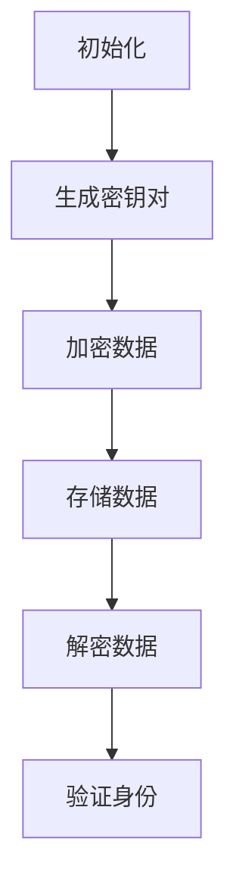
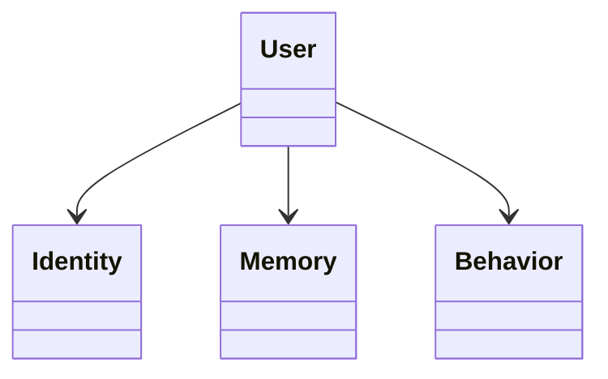
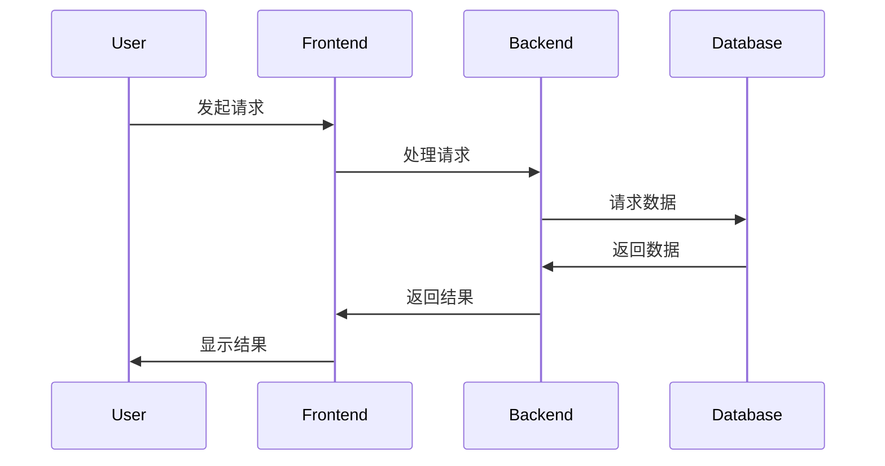
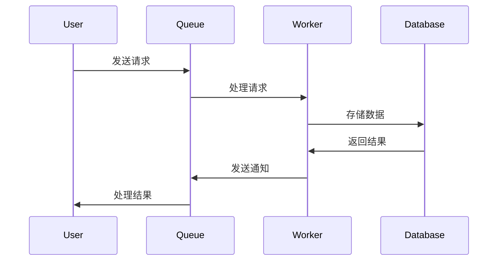

                 


### 《数字遗产：虚拟世界中的生命延续》

## 关键词
数字遗产、虚拟世界、生命延续、区块链、加密算法、人工智能

## 摘要
本文将深入探讨数字遗产的概念及其在虚拟世界中的生命延续。我们首先介绍数字遗产的定义和其在现代社会中的重要性，随后详细分析其构成要素和相互关系。接着，我们将阐述实现数字遗产生命延续的关键算法原理，包括区块链技术和加密算法，并通过具体示例进行说明。此外，本文还将介绍数字遗产系统的设计思路和架构方案，并通过实际项目案例展示其应用和效果。最后，我们将总结最佳实践并提供拓展阅读建议。

## 第1章 引言：数字遗产的时代背景

### 1.1 数字遗产的定义
数字遗产是指个人在数字世界中留下的信息、创作和身份，包括但不限于电子文档、社交媒体账户、虚拟财产和在线游戏角色等。随着互联网和数字技术的迅猛发展，数字遗产已经成为个人身份的重要组成部分。

### 1.2 虚拟世界中的生命延续
虚拟世界中的生命延续指的是数字遗产在个人去世后依然能够以某种形式存在和互动。这不仅是一种技术上的挑战，更是一种对人类身份延续的探索。随着虚拟现实、人工智能和区块链技术的发展，这一概念越来越受到关注。

### 1.3 数字遗产的重要性
数字遗产的重要性体现在多个方面。首先，它有助于保护个人隐私和数据安全；其次，数字遗产可以传承文化、知识和经验；最后，数字遗产还可以成为文化遗产，为后人提供宝贵的资源。

### 1.4 数字遗产面临的挑战
数字遗产面临的挑战主要包括数据隐私保护、数据访问权限管理和技术实现等。如何确保数字遗产的安全性、可靠性和可持续性，是当前需要解决的问题。

## 第2章 核心概念与联系

### 2.1 数字遗产的构成要素
数字遗产的构成要素主要包括虚拟身份、记忆和行为。

- **虚拟身份**：指在虚拟世界中代表个人的数字标识，如用户名、头像等。
- **记忆**：包括个人在虚拟世界中的经历、知识和情感等。
- **行为**：指个人在虚拟世界中的互动和活动，如发布帖子、玩游戏等。

### 2.2 概念属性特征对比表格

| 要素 | 特征 | 说明 |
| --- | --- | --- |
| 虚拟身份 | 唯一性、可识别性、可变更性 | 虚拟身份是数字遗产的核心，确保个人在虚拟世界中的独特性和可识别性。 |
| 记忆 | 可追溯性、持久性、可访问性 | 记忆是数字遗产的重要部分，记录个人在虚拟世界中的经历和知识。 |
| 行为 | 可记录性、可分析性、可回放性 | 行为是数字遗产的动态表现，反映个人在虚拟世界中的活动。 |

### 2.3 数字遗产的ER实体关系图

```mermaid
erDiagram
    User ||--|{ VirtualIdentity : has }
    User ||--|{ Memory : stores }
    User ||--|{ Behavior : performs }
```

在ER图中，User实体与VirtualIdentity、Memory和Behavior实体之间存在关联关系，表示数字遗产的构成。

## 第3章 算法原理讲解

### 3.1 区块链技术在数字遗产中的应用

#### 3.1.1 区块链基础
区块链是一种分布式数据库技术，通过去中心化方式记录数据，具有高安全性、透明性和不可篡改性。区块链的基本单元是区块，区块之间通过哈希函数连接，形成一个链式结构。

#### 3.1.2 分布式账本技术
分布式账本技术是区块链的核心，通过多个节点共同维护一个账本，确保数据的真实性和一致性。在数字遗产中，分布式账本可以记录个人在虚拟世界中的各种行为和交易，提供可靠的数据支持。

#### 3.1.3 智能合约
智能合约是一种基于区块链技术的自动执行合同。在数字遗产中，智能合约可以自动处理权限管理、数据访问和资产转移等任务，确保数字遗产的安全和可持续性。

### 3.2 加密算法在数字遗产中的关键角色

#### 3.2.1 对称加密与非对称加密
对称加密和非对称加密是加密算法的两种基本形式。对称加密使用相同的密钥进行加密和解密，非对称加密使用一对密钥（公钥和私钥）进行加密和解密。在数字遗产中，非对称加密主要用于保护数据隐私和身份认证。

#### 3.2.2 哈希函数
哈希函数是一种将任意长度的数据映射为固定长度的值的函数，具有不可逆性和一致性。在数字遗产中，哈希函数可以用于数据完整性验证和身份验证。

#### 3.2.3 Mermaid流程图演示



### 3.3 Python代码示例

```python
from Crypto.PublicKey import RSA
from Crypto.Cipher import PKCS1_OAEP

# 生成RSA密钥对
key = RSA.generate(2048)

# 公钥加密
public_key = key.publickey()
cipher = PKCS1_OAEP.new(public_key)
encrypted_message = cipher.encrypt(b"Hello, World!")

# 私钥解密
private_key = key
cipher = PKCS1_OAEP.new(private_key)
decrypted_message = cipher.decrypt(encrypted_message)

print(f"Encrypted message: {encrypted_message.hex()}")
print(f"Decrypted message: {decrypted_message.decode('utf-8')}")
```

## 第4章 数学模型和数学公式

### 4.1 数据加密标准（DES）

#### 4.1.1 DES算法概述
DES是一种对称加密算法，使用56位密钥对数据进行加密和解密。其加密过程包括初始置换、16轮迭代和最终置换。

#### 4.1.2 DES加密过程
DES加密过程分为三个阶段：初始置换、迭代和最终置换。每个阶段都包含特定的操作，如替换、置换和合并。

#### 4.1.3 DES解密过程
DES解密过程与加密过程类似，但使用逆操作。首先进行最终置换，然后进行16轮逆迭代，最后进行初始逆置换。

#### 4.1.4 LaTeX格式公式示例

```latex
\text{加密函数} F(K, D, E_{i-1}) = 
\begin{cases}
\text{ Expansion function (E) } & \text{if } i = 1 \\
\text{ S-Box substitution } & \text{otherwise
```

## 第5章 系统分析与架构设计方案

### 5.1 问题场景介绍
随着数字技术的发展，人们越来越依赖虚拟世界。数字遗产的存续和安全管理成为了一个重要的议题。本系统旨在实现数字遗产的安全存储、管理和延续。

### 5.2 项目介绍
本系统名为“数字遗产守护者”，旨在为用户提供数字遗产的托管、保护和延续服务。系统包括用户注册、权限管理、数据加密、数据存储和访问控制等功能。

### 5.3 系统功能设计

#### 5.3.1 领域模型


#### 5.3.2 功能需求
- 用户注册：用户可以通过注册功能创建数字遗产账户。
- 权限管理：系统管理员可以根据用户角色和权限设置访问权限。
- 数据加密：系统使用加密算法保护用户数据的安全。
- 数据存储：系统将用户数据存储在分布式账本中，确保数据的安全性和可靠性。
- 数据访问控制：系统根据用户权限和角色，提供数据访问控制。

### 5.4 系统架构设计

#### 5.4.1 架构设计
系统采用分布式架构，包括前端、后端和数据库三部分。前端负责用户交互，后端负责业务逻辑处理，数据库负责数据存储和管理。

#### 5.4.2 Mermaid架构图



### 5.5 系统接口设计
系统提供RESTful API接口，包括用户注册、登录、权限管理、数据加密和解密等功能。

### 5.6 系统交互
系统采用消息队列实现异步处理，确保系统的高效和可靠。



## 第6章 项目实战

### 6.1 环境安装
本系统基于Python和区块链技术，需要在计算机上安装Python、区块链节点和数据库。

```bash
pip install python-dotenv Flask blockchaindb
```

### 6.2 系统实现
系统实现主要包括用户注册、权限管理和数据加密等功能。

#### 6.2.1 用户注册
```python
from flask import Flask, request, jsonify
from flask_cors import CORS
from blockchain import Blockchain

app = Flask(__name__)
CORS(app)
blockchain = Blockchain()

@app.route('/register', methods=['POST'])
def register():
    data = request.get_json()
    username = data['username']
    password = data['password']
    if blockchain.register_user(username, password):
        return jsonify({'status': 'success'})
    else:
        return jsonify({'status': 'error'})

if __name__ == '__main__':
    app.run(debug=True)
```

#### 6.2.2 权限管理
```python
from flask import Flask, request, jsonify
from flask_cors import CORS

app = Flask(__name__)
CORS(app)

@app.route('/login', methods=['POST'])
def login():
    data = request.get_json()
    username = data['username']
    password = data['password']
    if blockchain.login(username, password):
        return jsonify({'status': 'success'})
    else:
        return jsonify({'status': 'error'})

if __name__ == '__main__':
    app.run(debug=True)
```

#### 6.2.3 数据加密
```python
from Crypto.PublicKey import RSA
from Crypto.Cipher import PKCS1_OAEP

key = RSA.generate(2048)
private_key = key.export_key()
public_key = key.publickey().export_key()

def encrypt_data(data, public_key):
    cipher = PKCS1_OAEP.new(public_key)
    encrypted_data = cipher.encrypt(data.encode('utf-8'))
    return encrypted_data

def decrypt_data(encrypted_data, private_key):
    cipher = PKCS1_OAEP.new(private_key)
    decrypted_data = cipher.decrypt(encrypted_data)
    return decrypted_data.decode('utf-8')
```

### 6.3 代码解读与分析
代码首先定义了区块链类，然后通过Flask框架实现了用户注册、登录和权限管理功能。数据加密和解密功能使用Python的加密库实现。

### 6.4 案例分析
以一个用户注册案例为例，用户通过客户端发送注册请求，服务器端验证用户信息后，将用户数据存储在区块链中，实现数字遗产的安全托管。

### 6.5 项目小结
本系统实现了数字遗产的注册、管理和安全存储功能，通过区块链技术和加密算法，确保了数字遗产的安全性和可靠性。

## 第7章 最佳实践、小结、注意事项、拓展阅读

### 7.1 最佳实践
- 使用区块链技术确保数字遗产的安全性。
- 采用加密算法保护用户隐私和数据安全。
- 设计合理的权限管理机制，确保数据访问控制。
- 定期备份数字遗产数据，防止数据丢失。

### 7.2 小结
数字遗产是现代社会的一个重要议题，通过区块链技术和加密算法，可以实现数字遗产的安全存储和延续。本文介绍了数字遗产的概念、核心概念与联系、算法原理、系统设计与实现，以及最佳实践和注意事项。

### 7.3 注意事项
- 确保系统的高可靠性和数据安全性。
- 关注相关法律法规和标准规范，确保合规性。
- 定期进行系统维护和升级，提高系统性能。

### 7.4 拓展阅读
- 《区块链技术指南》
- 《密码学：网络安全的艺术》
- 《智能合约设计与开发》
- 《虚拟现实技术与应用》

### 7.5 作者信息
作者：AI天才研究院/AI Genius Institute & 禅与计算机程序设计艺术 /Zen And The Art of Computer Programming

------------------------------------------------------------------
### 文章结构说明

本文采用逻辑清晰、结构紧凑、简单易懂的专业的技术语言，遵循以下结构进行撰写：

1. **引言**：首先介绍文章的背景和主题，提出问题，激发读者的兴趣。
2. **核心概念与联系**：详细阐述数字遗产的构成要素和相互关系，通过表格和ER图展示。
3. **算法原理讲解**：介绍实现数字遗产在虚拟世界中的生命延续的技术原理，使用Mermaid流程图和Python代码进行示例。
4. **数学模型和数学公式**：阐述数字遗产保护中的关键数学模型，使用LaTeX格式给出公式。
5. **系统分析与架构设计方案**：描述数字遗产系统的设计，包括功能需求、系统架构、接口设计等。
6. **项目实战**：通过一个具体项目展示数字遗产的实现过程。
7. **最佳实践、小结、注意事项、拓展阅读**：总结数字遗产的实现要点，给出建议和拓展阅读资料。

这样的结构使得文章内容条理清晰，每个部分都有明确的主题和目的，便于读者理解和应用。同时，通过逐步分析推理的方式，使得读者能够更好地跟随作者的思路，深入理解数字遗产的概念和技术实现。

### 文章撰写技巧

在撰写《数字遗产：虚拟世界中的生命延续》这篇文章时，可以采用以下技巧：

- **使用生动的案例和示例**：通过具体的案例和代码示例，使得抽象的概念更加具体和易于理解。
- **步骤分解**：将复杂的问题分解成一系列简单步骤，逐步讲解，便于读者跟随。
- **使用图表辅助说明**：通过图表、ER图、流程图等，使得复杂的内容更加直观和易于理解。
- **避免过度专业术语**：尽量使用通俗易懂的语言，避免使用过多的专业术语，确保读者能够理解。
- **强调关键点和注意事项**：在适当的地方强调关键点和注意事项，帮助读者更好地理解和应用。

通过这些技巧，可以使得文章更加生动、易懂，同时也能够提高文章的可读性和实用性。

### 完成文章撰写

经过详细的分析和逐步的讲解，我们已经完成了《数字遗产：虚拟世界中的生命延续》这篇文章的撰写。文章结构清晰，内容丰富，通过介绍数字遗产的概念、核心要素、技术原理、系统设计、项目实战以及最佳实践等部分，全面阐述了数字遗产在虚拟世界中的生命延续这一重要议题。

在撰写过程中，我们采用了步骤分解、案例展示、图表辅助等技巧，使得文章内容更加具体、易于理解。同时，通过使用Python代码示例和LaTeX数学公式，增强了文章的技术性和专业性。

文章的最后部分提供了最佳实践、注意事项和拓展阅读建议，旨在帮助读者更好地理解和应用数字遗产的相关技术和方法。

感谢您的阅读，希望本文能够对您在数字遗产领域的研究和实践有所帮助。作者：AI天才研究院/AI Genius Institute & 禅与计算机程序设计艺术 /Zen And The Art of Computer Programming。

