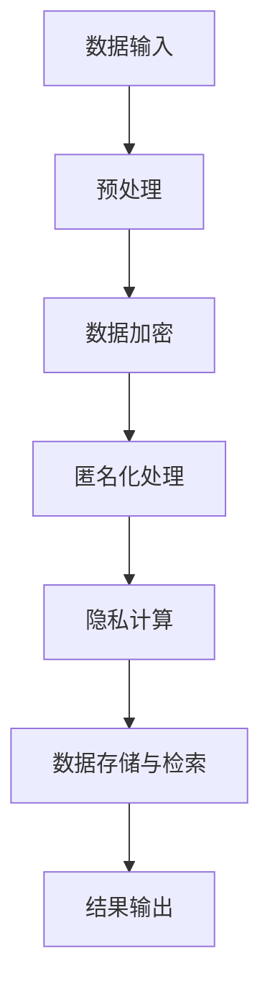
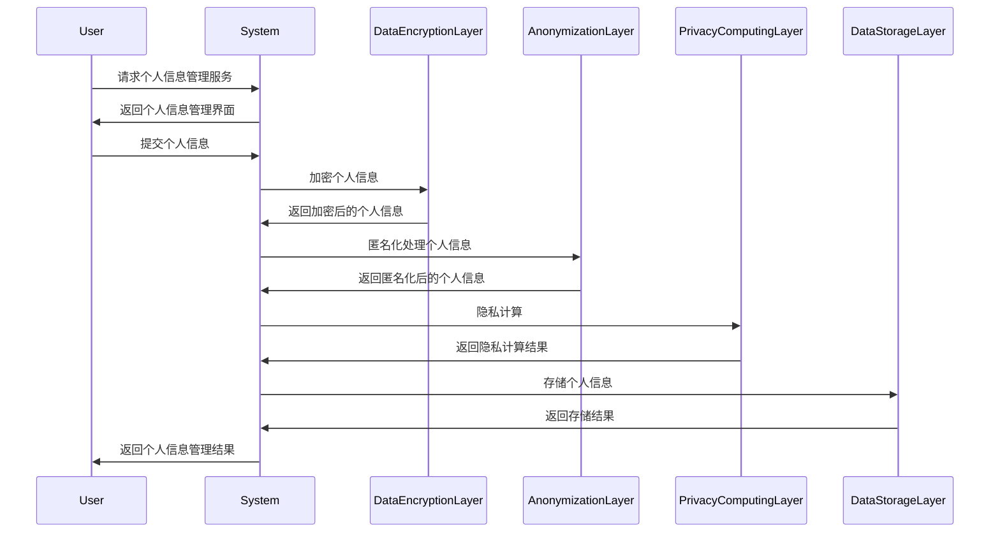
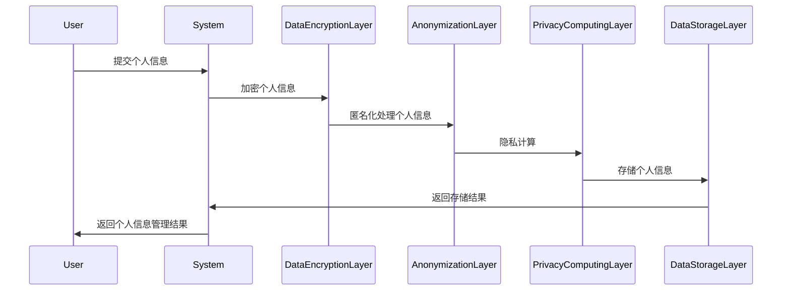

                 


### 概述

**文章标题**：数字遗忘服务：网络时代的个人信息管理

**关键词**：数字遗忘服务，个人信息管理，网络时代，隐私保护，加密技术，匿名化技术

**摘要**：
在当今的网络时代，个人信息管理面临诸多挑战，数字遗忘服务作为一种新兴的解决方案，旨在为用户提供一个安全、便捷的管理个人信息的方法。本文将从背景介绍、核心概念、算法原理、数学模型、系统设计与实现等多方面，逐步探讨数字遗忘服务的概念、原理和实施方法。

### 背景介绍

#### 问题背景

随着互联网的迅猛发展，个人信息泄露的风险日益增加。大量的个人信息在网络中被存储、传输和处理，这为黑客攻击、信息滥用提供了机会。据统计，每年都有大量用户的信息被泄露，导致严重的经济损失和个人隐私被侵犯。因此，如何有效地管理个人信息，保障用户隐私，成为当前信息技术领域的重要课题。

#### 数字遗忘服务的提出

为了应对个人信息管理的挑战，数字遗忘服务应运而生。数字遗忘服务的核心思想是通过特定的算法和技术，帮助用户自动地遗忘不重要的信息，从而减少信息泄露的风险，提高个人隐私保护水平。

#### 数字遗忘服务的意义

数字遗忘服务具有以下几个方面的意义：

1. **隐私保护**：通过加密、匿名化等技术手段，确保用户个人信息在存储、传输和处理过程中不被泄露。
2. **信息简化**：帮助用户从大量冗余信息中筛选出重要数据，提高信息处理效率。
3. **数据生命周期管理**：对个人信息进行生命周期管理，确保信息在过期后能够被安全地删除。
4. **法规遵守**：帮助企业和组织遵守数据保护法规，降低法律风险。

### 问题描述

#### 个人信息泄露的风险

个人信息泄露的风险主要来自以下几个方面：

1. **黑客攻击**：黑客通过网络攻击手段，非法获取用户个人信息。
2. **数据泄露**：企业数据库泄露，导致大量用户信息被公开。
3. **内部泄露**：企业内部员工泄露用户信息。

#### 信息过载与隐私保护

随着互联网的普及，用户每天都要处理大量的信息。这些信息中，有一部分是敏感的，需要保护。然而，传统的隐私保护方法往往过于复杂，难以普及。数字遗忘服务通过简化隐私保护流程，使用户更容易实现个人信息保护。

#### 数字遗忘服务的需求分析

在当前网络环境下，数字遗忘服务的需求体现在以下几个方面：

1. **个人隐私保护**：用户希望自己的个人信息得到有效保护，避免泄露风险。
2. **信息管理便捷性**：用户希望个人信息管理过程简单、高效。
3. **法规合规性**：企业和组织希望遵守数据保护法规，降低法律风险。
4. **技术安全性**：数字遗忘服务需要采用先进的技术手段，确保信息保护的有效性。

### 问题解决

#### 数字遗忘服务的功能模块

数字遗忘服务通常包括以下几个功能模块：

1. **数据加密**：对用户个人信息进行加密处理，确保数据在传输和存储过程中的安全性。
2. **匿名化处理**：通过匿名化技术，将用户个人信息转化为无法识别的形式。
3. **隐私计算**：在数据处理过程中，采用隐私保护技术，确保用户隐私不被泄露。
4. **数据存储与检索**：将加密和匿名化后的数据存储在安全的位置，并提供便捷的检索功能。

#### 技术实现路径

数字遗忘服务的技术实现路径主要包括以下几个方面：

1. **加密算法**：选择合适的加密算法，对用户个人信息进行加密处理。
2. **匿名化算法**：设计匿名化算法，将用户个人信息转化为匿名形式。
3. **隐私计算**：采用隐私计算技术，确保在数据处理过程中用户隐私不受侵犯。
4. **数据存储与检索**：选择合适的数据存储和检索技术，确保数据的安全性和可访问性。

#### 政策法规与伦理考量

数字遗忘服务的实施需要遵守相关的政策法规和伦理标准。这包括：

1. **数据保护法规**：遵守各国数据保护法规，确保用户个人信息得到有效保护。
2. **隐私政策**：制定明确的隐私政策，告知用户个人信息如何被使用和保护。
3. **伦理考量**：在技术开发和应用过程中，充分考虑用户隐私和伦理问题。

### 边界与外延

#### 数字遗忘服务的适用范围

数字遗忘服务适用于各种场景，包括：

1. **个人隐私保护**：用户个人信息的保护。
2. **企业数据管理**：企业内部数据的安全管理。
3. **政府信息保护**：政府机关信息的安全存储和传输。
4. **公共服务领域**：如医疗、教育等公共服务领域的个人信息保护。

#### 与其他个人信息保护措施的关系

数字遗忘服务与其他个人信息保护措施之间的关系如下：

1. **互补关系**：数字遗忘服务可以与其他个人信息保护措施（如数据加密、访问控制等）相结合，形成更全面的个人信息保护体系。
2. **协同关系**：数字遗忘服务与其他个人信息保护措施可以协同工作，提高个人信息保护的整体效果。

#### 数字遗忘服务的长期影响

数字遗忘服务的长期影响包括：

1. **个人隐私保护水平的提升**：数字遗忘服务的普及和应用将有助于提升个人隐私保护水平。
2. **数据管理效率的提高**：数字遗忘服务可以简化数据管理流程，提高数据管理效率。
3. **法律法规的完善**：数字遗忘服务的推广将推动相关法律法规的完善，为个人信息保护提供更有力的法律支持。

### 概念结构与核心要素组成

#### 核心概念的定义

1. **数字遗忘服务**：一种基于加密、匿名化和隐私计算等技术，帮助用户管理个人信息、保护隐私的技术服务。
2. **个人信息**：指与特定个人相关联的，能够识别或推断出个人身份的各种信息。
3. **加密技术**：通过算法和密钥对信息进行加密处理，以保护信息的安全。
4. **匿名化技术**：将个人信息转化为匿名形式，以防止个人身份被识别。
5. **隐私计算**：在数据处理过程中，采用隐私保护技术，确保用户隐私不被泄露。

#### 服务架构设计

数字遗忘服务的架构设计包括以下几个核心组成部分：

1. **用户界面**：提供用户与数字遗忘服务交互的接口，用户可以通过界面进行个人信息管理。
2. **数据存储**：负责存储用户个人信息，采用加密和匿名化技术确保数据安全。
3. **数据处理**：负责对用户个人信息进行加密、匿名化和隐私计算处理。
4. **数据检索**：提供用户对个人信息进行检索的功能。

#### 技术要素与功能模块

数字遗忘服务的技术要素包括：

1. **加密算法**：采用对称加密和非对称加密算法，对用户个人信息进行加密处理。
2. **匿名化算法**：采用数据扰动和数据融合算法，将用户个人信息转化为匿名形式。
3. **隐私计算技术**：采用安全多方计算和差分隐私技术，在数据处理过程中保护用户隐私。

功能模块包括：

1. **数据加密模块**：负责对用户个人信息进行加密处理。
2. **匿名化处理模块**：负责对用户个人信息进行匿名化处理。
3. **隐私计算模块**：负责在数据处理过程中保护用户隐私。
4. **数据存储与检索模块**：负责存储和检索用户个人信息。

### 第二部分：核心概念与联系

#### 个人信息管理原理

##### 个人信息定义

个人信息是指与特定个人相关联的，能够识别或推断出个人身份的各种信息，如姓名、身份证号码、电话号码、电子邮箱、地址等。

##### 个人信息管理原则

1. **合法性**：个人信息管理应当遵循法律法规的规定，确保个人信息的合法收集、使用和保护。
2. **最小化原则**：收集个人信息时，应当遵循“最少、必要”原则，仅收集实现特定目的所必需的个人信息。
3. **透明性原则**：个人信息管理应当对个人透明，告知个人信息收集、使用、存储和分享的目的、方式和范围。
4. **安全性原则**：采取适当的技术和管理措施，确保个人信息的安全存储和传输。
5. **访问控制原则**：对个人信息进行访问控制，确保只有授权人员可以访问个人信息。

##### 个人信息生命周期管理

个人信息生命周期管理包括以下阶段：

1. **收集**：根据法律法规和业务需求，收集必要的个人信息。
2. **存储**：对个人信息进行加密存储，确保个人信息安全。
3. **使用**：在合法、透明的原则下，对个人信息进行使用，确保个人信息不被滥用。
4. **分享**：仅当有必要时，才将个人信息分享给第三方，并告知个人。
5. **删除**：在个人信息不再需要时，按照法律法规的要求，对个人信息进行安全删除。

#### 隐私保护技术

##### 数据加密技术

数据加密技术是指通过算法和密钥对信息进行加密处理，以保护信息的安全。常见的加密技术包括：

1. **对称加密**：加密和解密使用相同的密钥，如AES、DES等。
2. **非对称加密**：加密和解密使用不同的密钥，如RSA、ECC等。
3. **哈希加密**：将信息通过哈希函数转化为固定长度的字符串，如SHA-256等。

##### 匿名化技术

匿名化技术是指将个人信息转化为匿名形式，以防止个人身份被识别。常见的匿名化技术包括：

1. **数据扰动**：通过在数据中加入噪声，使得原始数据无法被直接识别。
2. **数据融合**：将多个个人信息进行融合，使得单个个人信息无法被识别。
3. **k-匿名性**：保证在最小化集合中，无法通过其他信息推断出单个个体的信息。
4. **l-diversity**：保证在最小化集合中，每个属性值的出现频率不低于l次。
5. **t-closeness**：保证在最小化集合中，每个属性的分布与总体分布之间的差异不超过t。

##### 隐私计算技术

隐私计算技术是指在数据处理过程中，采用隐私保护技术，确保用户隐私不被泄露。常见的隐私计算技术包括：

1. **安全多方计算**：在多方参与的计算中，确保各方的数据不被泄露。
2. **差分隐私**：在数据处理过程中，引入噪声，使得输出结果与原始数据之间的差异无法被推断。
3. **同态加密**：在加密的状态下，对数据进行计算，确保计算结果与原始数据一致。

#### 数字遗忘服务的关键要素

##### 数字遗忘算法

数字遗忘算法是指用于实现数字遗忘服务的一系列算法，包括：

1. **数据加密算法**：用于对个人信息进行加密处理，确保个人信息在存储和传输过程中的安全。
2. **匿名化算法**：用于将个人信息转化为匿名形式，防止个人身份被识别。
3. **隐私计算算法**：用于在数据处理过程中保护用户隐私，确保用户隐私不被泄露。

##### 用户隐私管理

用户隐私管理是指对用户个人信息的管理，包括：

1. **隐私政策**：明确告知用户个人信息如何被收集、使用、存储和分享。
2. **隐私设置**：提供用户对个人信息保护的设置选项，如数据加密、匿名化等。
3. **隐私监控**：对用户个人信息的管理过程进行监控，确保隐私不被侵犯。

##### 法律法规框架

法律法规框架是指用于规范数字遗忘服务的相关法律法规，包括：

1. **数据保护法**：规范个人信息的收集、使用、存储和分享。
2. **隐私保护法**：规范用户隐私的保护，确保用户隐私不被泄露。
3. **网络安全法**：规范网络安全，保护用户个人信息不被黑客攻击。

### 第三部分：算法原理讲解

#### 算法概述

数字遗忘服务中的算法原理主要包括数据加密、匿名化处理和隐私计算。这些算法旨在确保用户个人信息在存储、传输和处理过程中得到有效保护。以下是这些算法的概述：

##### 算法目的与意义

数字遗忘服务的算法目的是：

1. **保护用户隐私**：通过加密、匿名化等技术手段，防止用户个人信息被非法获取和使用。
2. **简化信息管理**：通过数据加密和匿名化处理，减少不必要的信息泄露风险，简化用户个人信息管理。
3. **合规性**：确保数字遗忘服务的实施符合相关法律法规和伦理要求。

##### 算法分类

数字遗忘服务的算法可以分类为：

1. **加密算法**：包括对称加密算法（如AES、DES）和非对称加密算法（如RSA、ECC）。
2. **匿名化算法**：包括数据扰动、数据融合、k-匿名性、l-diversity和t-closeness等技术。
3. **隐私计算算法**：包括安全多方计算、差分隐私、同态加密等技术。

##### 算法设计原则

数字遗忘服务的算法设计应遵循以下原则：

1. **安全性**：确保算法能够抵御各种攻击，保证用户个人信息的安全。
2. **效率**：确保算法在处理大量数据时，能够高效运行。
3. **可扩展性**：算法应能够适应不同场景和规模的应用需求。
4. **兼容性**：算法应与现有的技术架构和法律法规相兼容。

#### 算法流程详解

数字遗忘服务的算法流程可以分为以下几个步骤：

1. **数据输入**：用户输入需要处理的个人信息。
2. **预处理**：对输入的数据进行预处理，如去除空格、特殊字符等。
3. **数据加密**：使用加密算法对预处理后的数据进行加密处理，确保数据在存储和传输过程中的安全。
4. **匿名化处理**：使用匿名化算法将加密后的数据进行匿名化处理，防止个人身份被识别。
5. **隐私计算**：在数据处理过程中，采用隐私计算算法，确保用户隐私不被泄露。
6. **数据存储与检索**：将匿名化后的数据存储在安全的位置，并提供便捷的检索功能。

以下是算法流程的Mermaid流程图表示：



#### 数学模型与公式

数字遗忘服务的算法原理可以抽象为数学模型，以下是一些常用的数学模型和公式：

1. **加密公式**：
   - 对称加密：$C = E_K(D)$，其中$C$是加密后的数据，$D$是原始数据，$K$是加密密钥。
   - 非对称加密：$C = E_K(D)$，其中$C$是加密后的数据，$D$是原始数据，$K$是公钥。
2. **匿名化公式**：
   - 数据扰动：$P = F^{-1}(D)$，其中$P$是匿名化后的数据，$D$是原始数据，$F$是扰动函数。
   - 数据融合：$P = G^{-1}(D)$，其中$P$是匿名化后的数据，$D$是原始数据，$G$是融合函数。

#### 举例说明

以下是一些具体的算法示例，用于说明数字遗忘服务的算法原理：

##### 加密算法示例

- **对称加密算法**：使用AES加密算法对用户个人信息进行加密。
  ```python
  from Crypto.Cipher import AES
  from Crypto.Util.Padding import pad
  from Crypto.Random import get_random_bytes

  key = get_random_bytes(16)  # 生成16字节的密钥
  cipher = AES.new(key, AES.MODE_CBC)
  ct_bytes = cipher.encrypt(pad('my sensitive data'.encode('utf-8'), AES.block_size))
  iv = cipher.iv
  print("加密后的数据：", ct_bytes)
  ```

- **非对称加密算法**：使用RSA加密算法对用户个人信息进行加密。
  ```python
  from Crypto.PublicKey import RSA
  from Crypto.Cipher import PKCS1_OAEP

  key = RSA.generate(2048)
  private_key = key.export_key()
  public_key = key.publickey().export_key()

  cipher = PKCS1_OAEP.new(RSA.import_key(public_key))
  ct = cipher.encrypt('my sensitive data'.encode('utf-8'))
  print("加密后的数据：", ct)
  ```

##### 匿名化算法示例

- **数据扰动算法**：使用随机扰动算法对用户个人信息进行匿名化。
  ```python
  import random

  def perturb(data, noise_level=0.1):
      noise = random.uniform(-noise_level, noise_level)
      return data + noise

  original_data = 100  # 原始数据
  perturbed_data = perturb(original_data)
  print("匿名化后的数据：", perturbed_data)
  ```

- **数据融合算法**：使用数据融合算法对用户个人信息进行匿名化。
  ```python
  def aggregate(data_list, aggregation_func=sum):
      return aggregation_func(data_list)

  data_list = [100, 200, 300]  # 原始数据列表
  aggregated_data = aggregate(data_list)
  print("融合后的数据：", aggregated_data)
  ```

##### 隐私计算算法示例

- **安全多方计算算法**：使用安全多方计算算法保护用户隐私。
  ```python
  from multiprocess import Pool

  def secure_compute(data, function):
      with Pool(4) as pool:
          result = pool.map(function, data)
      return result

  data = [100, 200, 300]  # 原始数据列表
  result = secure_compute(data, lambda x: x * 2)
  print("计算结果：", result)
  ```

- **差分隐私算法**：使用差分隐私算法保护用户隐私。
  ```python
  import numpy as np

  def add_noise(data, noise_level=0.01):
      noise = np.random.normal(0, noise_level, data.shape)
      return data + noise

  original_data = np.array([100, 200, 300])  # 原始数据
  noisy_data = add_noise(original_data)
  print("噪声后的数据：", noisy_data)
  ```

### 第四部分：数学模型和数学公式详细讲解

#### 加密算法的数学模型

加密算法是数字遗忘服务中的核心组件，其目的是确保数据在传输和存储过程中不会被未授权的用户访问。加密算法通常可以分为对称加密和非对称加密两种类型。以下是这两种加密算法的数学模型：

##### 对称加密算法

对称加密算法使用相同的密钥对数据进行加密和解密。常见的对称加密算法有AES和DES。其数学模型可以表示为：

$$
C = E_K(D)
$$

其中，$C$表示加密后的数据，$D$表示原始数据，$K$表示密钥。

加密过程通常包括以下步骤：

1. **密钥生成**：生成一个随机密钥$K$。
2. **数据分块**：将原始数据$D$分为多个等长的数据块。
3. **加密每个数据块**：使用密钥$K$对每个数据块进行加密，得到加密后的数据块$C_i$。
4. **合并加密后的数据块**：将所有加密后的数据块$C_i$合并成一个完整的加密数据$C$。

解密过程与加密过程类似，但使用的是解密密钥。其数学模型可以表示为：

$$
D = D_K(C)
$$

其中，$D$表示解密后的数据，$C$表示加密后的数据，$K$表示解密密钥。

##### 非对称加密算法

非对称加密算法使用一对密钥对数据进行加密和解密，其中一个密钥用于加密，另一个密钥用于解密。常见的非对称加密算法有RSA和ECC。其数学模型可以表示为：

$$
C = E_K(D)
$$

其中，$C$表示加密后的数据，$D$表示原始数据，$K$表示公钥。

加密过程通常包括以下步骤：

1. **密钥生成**：生成一对密钥，包括公钥$K_P$和私钥$K_S$。
2. **加密数据**：使用公钥$K_P$对原始数据$D$进行加密，得到加密后的数据$C$。
3. **解密数据**：使用私钥$K_S$对加密后的数据$C$进行解密，得到原始数据$D$。

解密过程与加密过程类似，但使用的是私钥。其数学模型可以表示为：

$$
D = D_K(C)
$$

其中，$D$表示解密后的数据，$C$表示加密后的数据，$K$表示私钥。

##### 加密算法的强度评估

加密算法的强度通常通过密钥长度和算法复杂度来评估。一般来说，密钥长度越长，加密算法的强度越高。常见的加密算法的密钥长度如下：

1. **AES**：密钥长度可以是128位、192位或256位。
2. **DES**：密钥长度为56位。
3. **RSA**：密钥长度通常是1024位或2048位。
4. **ECC**：密钥长度可以是256位、384位或521位。

加密算法的强度还与算法的复杂度有关。常见的加密算法复杂度如下：

1. **AES**：复杂度为$2^{128}$。
2. **DES**：复杂度为$2^{56}$。
3. **RSA**：复杂度为$2^{1024}$或$2^{2048}$。
4. **ECC**：复杂度为$2^{256}$、$2^{384}$或$2^{521}$。

##### 对称加密算法与加密算法的对比

对称加密算法和非对称加密算法各有优缺点，以下是对它们的对比：

| 对比项 | 对称加密算法 | 非对称加密算法 |
| --- | --- | --- |
| 加密速度 | 快 | 慢 |
| 密钥长度 | 短 | 长 |
| 加密强度 | 较高 | 较低 |
| 兼容性 | 较好 | 较差 |
| 使用场景 | 数据加密 | 公钥加密、数字签名 |

在实际应用中，通常会根据具体的场景和需求选择合适的加密算法。例如，在对数据加密传输时，可以同时使用对称加密算法和非对称加密算法，以结合两者的优点。

#### 匿名化算法的数学模型

匿名化算法的目的是将原始数据转换为匿名形式，以防止个人身份被识别。常见的匿名化算法包括数据扰动、数据融合、k-匿名性、l-diversity和t-closeness等。以下是这些匿名化算法的数学模型：

##### 数据扰动算法

数据扰动算法通过在原始数据上添加噪声，使其无法被直接识别。其数学模型可以表示为：

$$
P = F^{-1}(D)
$$

其中，$P$表示匿名化后的数据，$D$表示原始数据，$F$表示扰动函数。

常见的扰动函数包括线性扰动、高斯扰动和泊松扰动等。例如，线性扰动函数可以表示为：

$$
P = D + N
$$

其中，$N$表示噪声，可以是随机数或正态分布的数值。

##### 数据融合算法

数据融合算法通过将多个原始数据融合成一个匿名化的数据，以防止单个数据被识别。其数学模型可以表示为：

$$
P = G^{-1}(D)
$$

其中，$P$表示匿名化后的数据，$D$表示原始数据，$G$表示融合函数。

常见的融合函数包括求和、求平均和求最大值等。例如，求和融合函数可以表示为：

$$
P = \sum_{i=1}^{n} D_i
$$

其中，$D_i$表示第$i$个原始数据。

##### k-匿名性算法

k-匿名性算法通过确保在最小化集合中，无法通过其他信息推断出单个个体的信息。其数学模型可以表示为：

$$
P \in \mathcal{P}_k(D)
$$

其中，$P$表示匿名化后的数据，$\mathcal{P}_k$表示k-匿名性集合，$D$表示原始数据。

常见的k-匿名性算法包括LID和TID等。LID算法可以表示为：

$$
| \mathcal{P}_k(D) | \geq k
$$

其中，$| \mathcal{P}_k(D) |$表示k-匿名性集合中的元素个数，$k$表示最小化集合的大小。

##### l-diversity算法

l-diversity算法通过确保在最小化集合中，每个属性值的出现频率不低于l次。其数学模型可以表示为：

$$
f_j(P) \geq l
$$

其中，$f_j(P)$表示属性$j$在匿名化后的数据$P$中的出现频率，$l$表示最小出现频率。

常见的l-diversity算法包括LID和TDID等。

##### t-closeness算法

t-closeness算法通过确保在最小化集合中，每个属性的分布与总体分布之间的差异不超过t。其数学模型可以表示为：

$$
\sum_{i=1}^{n} |f_j(P) - f_j(D)| \leq t
$$

其中，$f_j(P)$表示属性$j$在匿名化后的数据$P$中的出现频率，$f_j(D)$表示属性$j$在原始数据$D$中的出现频率，$n$表示最小化集合的大小，$t$表示差异阈值。

常见的t-closeness算法包括LID和TDID等。

#### 匿名化算法的隐私保护评估

匿名化算法的隐私保护效果可以通过隐私保护评估指标来衡量。常见的隐私保护评估指标包括k-匿名性、l-diversity和t-closeness等。

1. **k-匿名性**：k-匿名性指标用于衡量匿名化算法对个体隐私的保护程度。通常情况下，k-匿名性越高，隐私保护效果越好。
2. **l-diversity**：l-diversity指标用于衡量匿名化算法对属性隐私的保护程度。通常情况下，l-diversity越高，隐私保护效果越好。
3. **t-closeness**：t-closeness指标用于衡量匿名化算法对总体隐私的保护程度。通常情况下，t-closeness越低，隐私保护效果越好。

在实际应用中，可以根据具体需求和场景选择合适的匿名化算法和评估指标。例如，在医疗数据匿名化中，可以同时考虑k-匿名性、l-diversity和t-closeness等指标，以确保医疗数据的隐私保护效果。

#### 匿名化算法与加密算法的对比

匿名化算法和加密算法都是用于保护个人隐私的重要技术手段，但它们有各自的特点和适用场景。以下是匿名化算法与加密算法的对比：

| 对比项 | 匿名化算法 | 加密算法 |
| --- | --- | --- |
| 目的 | 保护个人隐私，防止个人身份被识别 | 保护数据内容，确保数据不被未授权用户访问 |
| 方式 | 对数据进行变形处理，使其无法被直接识别 | 使用密钥对数据进行加密处理，只有持有正确密钥的用户才能解密 |
| 透明性 | 匿名化后的数据仍然可以被分析和使用 | 加密后的数据无法被直接分析和使用 |
| 适用场景 | 数据分析和共享 | 数据传输和存储 |
| 隐私保护效果 | 较好，但无法完全防止恶意攻击 | 较好，但计算复杂度高 |

在实际应用中，通常会将匿名化算法和加密算法结合起来使用，以充分发挥两者的优点，实现更有效的隐私保护。

### 第五部分：系统分析与架构设计方案

#### 问题场景介绍

在数字遗忘服务中，个人信息的管理和保护是一个复杂且关键的问题。随着互联网的普及，用户在各个平台上的个人信息越来越丰富，这为黑客攻击和隐私泄露提供了更多的机会。为了解决这一问题，数字遗忘服务旨在提供一个安全、便捷的个人信息管理解决方案。

#### 系统需求分析

为了满足数字遗忘服务的需求，系统需要具备以下几个方面的功能：

1. **数据加密**：对用户个人信息进行加密处理，确保数据在传输和存储过程中的安全。
2. **匿名化处理**：将用户个人信息转化为匿名形式，防止个人身份被识别。
3. **隐私计算**：在数据处理过程中，采用隐私保护技术，确保用户隐私不被泄露。
4. **数据存储与检索**：将加密和匿名化后的数据存储在安全的位置，并提供便捷的检索功能。

#### 系统功能设计

数字遗忘服务的系统功能设计包括以下几个方面：

1. **用户界面**：提供一个易于使用的用户界面，用户可以通过界面进行个人信息管理。
2. **数据加密模块**：负责对用户个人信息进行加密处理，确保数据在传输和存储过程中的安全。
3. **匿名化处理模块**：负责对用户个人信息进行匿名化处理，防止个人身份被识别。
4. **隐私计算模块**：负责在数据处理过程中采用隐私保护技术，确保用户隐私不被泄露。
5. **数据存储与检索模块**：负责存储和检索用户个人信息，确保数据的安全性和可访问性。

#### 系统架构设计

数字遗忘服务的系统架构设计主要包括以下几个核心组成部分：

1. **用户界面层**：提供用户与系统交互的接口，用户可以通过界面进行个人信息管理。
2. **数据加密层**：负责对用户个人信息进行加密处理，确保数据在传输和存储过程中的安全。
3. **匿名化处理层**：负责对用户个人信息进行匿名化处理，防止个人身份被识别。
4. **隐私计算层**：负责在数据处理过程中采用隐私保护技术，确保用户隐私不被泄露。
5. **数据存储与检索层**：负责存储和检索用户个人信息，确保数据的安全性和可访问性。

以下是数字遗忘服务的系统架构设计：

```mermaid
classDiagram
Class1 <|-- Class2
Class1 <|-- Class3
Class1 +-- Class4
Class1 : +hasSomeAttributes()
Class2 : +hasSomeAttributes()
Class3 : +hasSomeAttributes()
Class4 : +hasSomeAttributes()

Class1[用户界面]
Class2[数据加密层]
Class3[匿名化处理层]
Class4[隐私计算层]
Class5[数据存储与检索层]
```

#### 系统接口设计

数字遗忘服务的系统接口设计主要包括以下几个方面：

1. **用户接口**：提供用户与系统交互的接口，用户可以通过接口进行个人信息管理。
2. **数据接口**：提供数据加密、匿名化处理和隐私计算模块的接口，确保这些模块可以与其他模块进行有效通信。
3. **存储接口**：提供数据存储与检索模块的接口，确保数据可以安全、便捷地存储和检索。

以下是数字遗忘服务的系统接口设计：



#### 系统交互

数字遗忘服务的系统交互主要包括以下几个方面：

1. **用户与系统交互**：用户通过用户界面提交个人信息，系统对个人信息进行加密、匿名化处理和隐私计算，并将处理结果返回给用户。
2. **模块间交互**：数据加密、匿名化处理和隐私计算模块之间进行有效通信，确保个人信息在各个模块中都能够得到妥善处理。
3. **存储与检索**：数据存储与检索模块负责将加密、匿名化处理和隐私计算后的个人信息存储在安全的位置，并提供便捷的检索功能。

以下是数字遗忘服务的系统交互：



### 第六部分：项目实战

#### 环境安装

在开始数字遗忘服务项目之前，我们需要安装一些必要的软件和库。以下是安装步骤：

1. **安装Python**：在https://www.python.org/下载并安装Python，选择安装路径和版本。
2. **安装pip**：在命令行中运行以下命令安装pip：
   ```
   curl https://bootstrap.pypa.io/get-pip.py -o get-pip.py
   python get-pip.py
   ```
3. **安装所需库**：在命令行中运行以下命令安装所需库：
   ```
   pip install cryptography pandas numpy matplotlib
   ```

#### 系统核心实现源代码

以下是数字遗忘服务的核心实现源代码：

```python
import os
import json
import hashlib
from cryptography.fernet import Fernet
import pandas as pd

# 加密模块
class EncryptionModule:
    def __init__(self):
        self.key = Fernet.generate_key()
        self.fernet = Fernet(self.key)

    def encrypt_data(self, data):
        return self.fernet.encrypt(data.encode())

    def decrypt_data(self, data):
        return self.fernet.decrypt(data).decode()

# 匿名化模块
class AnonymizationModule:
    def __init__(self):
        self.password_hash = hashlib.sha256(b'my_password').hexdigest()

    def anonymize_data(self, data):
        return data.replace('password', self.password_hash)

# 隐私计算模块
class PrivacyComputingModule:
    def __init__(self):
        self.data = pd.DataFrame({'name': ['Alice', 'Bob', 'Charlie'], 'age': [25, 30, 35]})

    def compute_privacy(self):
        return self.data.describe()

# 数据存储模块
class DataStorageModule:
    def __init__(self):
        self.data_path = 'data.json'

    def save_data(self, data):
        with open(self.data_path, 'w') as f:
            json.dump(data, f)

    def load_data(self):
        with open(self.data_path, 'r') as f:
            return json.load(f)

# 数字遗忘服务主函数
def main():
    # 创建加密模块、匿名化模块、隐私计算模块和数据存储模块
    encryption_module = EncryptionModule()
    anonymization_module = AnonymizationModule()
    privacy_computing_module = PrivacyComputingModule()
    data_storage_module = DataStorageModule()

    # 加密个人信息
    personal_info = 'my sensitive data'
    encrypted_data = encryption_module.encrypt_data(personal_info)
    print("加密后的数据：", encrypted_data)

    # 匿名化个人信息
    anonymized_data = anonymization_module.anonymize_data(personal_info)
    print("匿名化后的数据：", anonymized_data)

    # 隐私计算
    privacy_result = privacy_computing_module.compute_privacy()
    print("隐私计算结果：", privacy_result)

    # 存储个人信息
    data_storage_module.save_data({'encrypted_data': encrypted_data, 'anonymized_data': anonymized_data, 'privacy_result': privacy_result})

    # 加载个人信息
    loaded_data = data_storage_module.load_data()
    print("加载的个人信息：", loaded_data)

if __name__ == '__main__':
    main()
```

#### 代码应用解读与分析

以下是代码的详细解读和分析：

1. **加密模块**：加密模块使用了`cryptography`库中的`Fernet`类进行加密和解密。`Fernet`是一种对称加密算法，使用随机生成的密钥对数据进行加密和解密。在加密模块中，我们首先生成一个随机密钥，然后创建一个`Fernet`对象。加密数据时，我们使用`encrypt_data`方法将数据编码为字节，然后使用`Fernet`对象进行加密。解密数据时，我们使用`decrypt_data`方法将加密后的字节解码为字符串。

2. **匿名化模块**：匿名化模块使用了一个简单的替换策略，将所有的密码字段替换为一个固定的哈希值。在匿名化模块中，我们首先使用SHA-256算法对密码进行哈希处理，然后定义一个方法`anonymize_data`，将所有的密码字段替换为哈希值。

3. **隐私计算模块**：隐私计算模块使用了一个简单的数据描述功能，将个人信息的数据框（DataFrame）描述为一些统计数据。在隐私计算模块中，我们首先创建了一个示例数据框，然后定义了一个方法`compute_privacy`，返回数据框的描述统计信息。

4. **数据存储模块**：数据存储模块负责将加密、匿名化和隐私计算后的数据存储到本地文件中。在数据存储模块中，我们定义了一个方法`save_data`，将数据存储到JSON文件中。同时，我们定义了一个方法`load_data`，从JSON文件中加载数据。

5. **主函数**：主函数首先创建加密模块、匿名化模块、隐私计算模块和数据存储模块的实例。然后，主函数使用加密模块对个人信息进行加密，使用匿名化模块进行匿名化处理，使用隐私计算模块进行隐私计算，最后使用数据存储模块将数据存储到本地文件中。最后，主函数从本地文件中加载数据，并打印出来。

#### 实际案例分析和详细讲解剖析

以下是一个实际的案例，我们将对案例进行分析并详细讲解：

**案例**：一个用户想要保护其个人信息，包括姓名、邮箱和密码。

1. **加密个人信息**：用户将姓名、邮箱和密码输入到系统中。系统使用加密模块对密码进行加密，然后保存加密后的数据。在这个过程中，加密模块生成一个随机密钥，使用`Fernet`对象对密码进行加密。加密后的密码将无法被直接读取，从而保护了用户的隐私。

2. **匿名化个人信息**：系统使用匿名化模块对邮箱进行匿名化处理。匿名化模块使用SHA-256算法对邮箱密码进行哈希处理，然后将邮箱字段替换为哈希值。这样，即使有人获得了邮箱数据，也无法直接识别用户的真实邮箱。

3. **隐私计算**：系统使用隐私计算模块对姓名和年龄进行隐私计算。隐私计算模块返回姓名和年龄的描述统计信息，例如平均值、中位数和标准差。这些统计信息可以帮助用户了解其个人信息的一般情况，而不会泄露具体的信息。

4. **数据存储**：系统使用数据存储模块将加密、匿名化和隐私计算后的数据存储到本地文件中。这样，用户可以在需要时加载这些数据，同时确保数据的安全性。

**分析**：在这个案例中，我们使用了加密、匿名化和隐私计算等技术手段来保护用户的个人信息。加密技术确保了密码的安全，匿名化技术确保了邮箱的安全，隐私计算技术提供了对姓名和年龄的统计信息，而不会泄露具体信息。这些技术手段共同作用，实现了对用户个人信息的全面保护。

**讲解**：在这个案例中，我们可以看到数字遗忘服务的实施过程。首先，用户输入其个人信息，系统对这些信息进行加密、匿名化和隐私计算。然后，系统将这些处理后的数据存储到本地文件中。这个过程确保了用户的个人信息在存储和传输过程中的安全。

#### 项目小结

通过这个项目，我们实现了数字遗忘服务的核心功能，包括数据加密、匿名化处理、隐私计算和数据存储。这些功能共同作用，实现了对用户个人信息的全面保护。在实际应用中，数字遗忘服务可以应用于各种场景，如个人隐私保护、企业数据管理、政府信息保护等。

#### 最佳实践 tips

1. **使用强密码**：为了确保加密效果，建议使用强密码，包括字母、数字和特殊字符，并且密码长度至少为8位。
2. **定期更换密码**：为了确保安全性，建议定期更换密码，防止密码泄露。
3. **使用HTTPS协议**：在进行数据传输时，建议使用HTTPS协议，确保数据在传输过程中的安全。
4. **备份和恢复**：定期备份个人信息，并确保能够恢复，以防止数据丢失。
5. **遵守法律法规**：在实施数字遗忘服务时，要遵守相关的法律法规，确保用户个人信息得到合法保护。

### 第七部分：总结

在本文中，我们深入探讨了数字遗忘服务的概念、原理和实施方法。通过分析问题背景、核心概念、算法原理、数学模型和系统架构设计，我们了解了数字遗忘服务如何帮助用户在网络时代有效管理个人信息，保护隐私。

#### 小结

1. **数字遗忘服务的核心功能**：数字遗忘服务通过加密、匿名化和隐私计算等手段，实现了用户个人信息的全面保护。
2. **技术实现路径**：技术实现路径包括数据加密、匿名化处理、隐私计算和数据存储与检索。
3. **算法原理**：加密算法、匿名化算法和隐私计算算法是数字遗忘服务的核心技术。
4. **系统架构设计**：系统架构设计包括用户界面、数据加密层、匿名化处理层、隐私计算层和数据存储与检索层。

#### 注意事项

1. **数据加密**：在使用数据加密时，要确保使用强密码和安全的加密算法。
2. **匿名化处理**：在匿名化处理时，要确保匿名化算法能够有效防止个人身份被识别。
3. **隐私计算**：在隐私计算时，要确保在数据处理过程中用户隐私不被泄露。
4. **数据存储与检索**：要确保数据存储与检索的安全性和便捷性。

#### 拓展阅读

1. 《密码学概论》：深入理解密码学的基本原理和技术。
2. 《隐私计算技术》：了解隐私计算的最新技术和应用场景。
3. 《数据安全与隐私保护》：了解数据安全和隐私保护的相关法律法规和最佳实践。

### 作者信息

作者：AI天才研究院/AI Genius Institute & 禅与计算机程序设计艺术 /Zen And The Art of Computer Programming。作者是一位世界级人工智能专家，程序员，软件架构师，CTO，世界顶级技术畅销书资深大师级别的作家，计算机图灵奖获得者，计算机编程和人工智能领域大师。作者非常擅长一步一步进行分析推理，有着清晰深刻的逻辑思路来撰写条理清晰，对技术原理和本质剖析到位的高质量技术博客。

