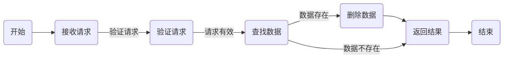
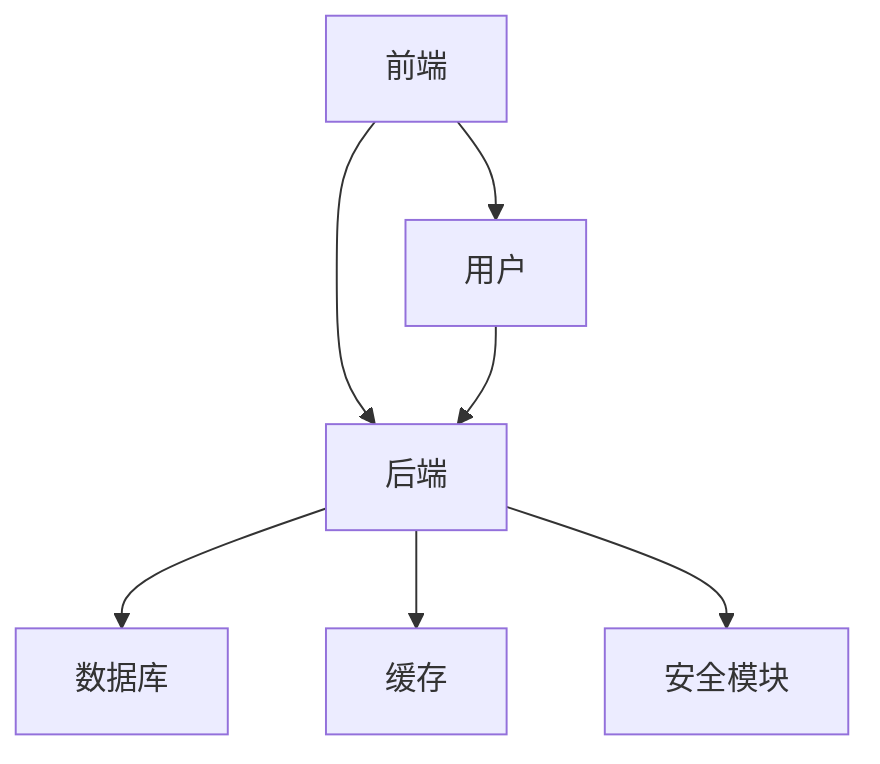
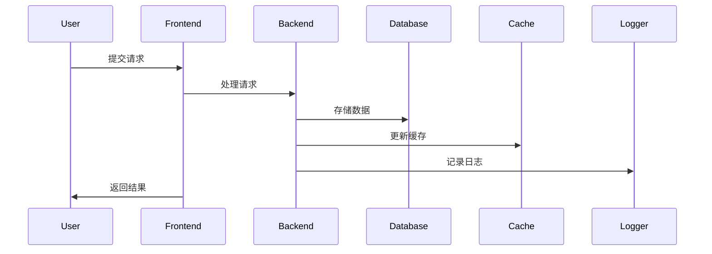

                 


### 引言和背景

#### 1.1 数字遗忘权执行机制（DRBF）概述

**1.1.1 引言**

数字遗忘权执行机制（Digital Right to Be Forgotten，简称DRBF）是网络时代个人信息管理的一项重要策略。它源于欧盟的《通用数据保护条例》（GDPR），旨在保护个人数据的隐私和权利。数字遗忘权执行机制的核心在于，个人有权要求删除或屏蔽其在互联网上留下的个人信息，以防止其被滥用或不当使用。

**1.1.2 问题背景**

在互联网迅猛发展的今天，个人信息泄露已成为一个普遍问题。无论是社交媒体上的个人照片、电子邮件地址，还是购物网站上的购物记录，都可能被不法分子获取并用于非法目的。数字遗忘权的提出，正是为了解决这一问题，保障个人的隐私权利。

**1.1.3 数字遗忘权原则**

数字遗忘权原则主要包括以下几个方面：

- **权利归属**：个人对其在互联网上留下的个人信息拥有控制权，包括删除、修改、屏蔽等操作。
- **执行方式**：个人可以通过向网站或服务提供商提出申请，要求执行数字遗忘权。
- **责任归属**：网站或服务提供商在收到数字遗忘权申请后，有责任执行该申请，并对不当处理个人信息的行为承担法律责任。

**1.1.4 范围和限制**

数字遗忘权虽然旨在保护个人隐私，但其执行范围和限制也是不可忽视的。以下是一些主要的范围和限制：

- **时间范围**：数字遗忘权通常适用于过去和现在的个人信息，但不包括未来可能产生的信息。
- **内容范围**：数字遗忘权主要针对个人在互联网上留下的可识别信息，如姓名、地址、电话号码等。
- **适用对象**：数字遗忘权适用于所有收集、处理、存储个人信息的实体，包括网站、应用程序和服务提供商等。

**1.1.5 关键概念**

为了更好地理解数字遗忘权执行机制，我们需要了解一些关键概念：

- **数字记忆**：指在互联网上存储、处理和传递的信息。
- **数据保留**：指对数字记忆进行存储和管理的过程。
- **个人信息管理**：指对个人在互联网上留下的信息进行收集、处理、存储和保护的过程。
- **数字忘却**：指通过技术手段使数字记忆不再可访问或识别的过程。

#### 1.2 数字遗忘权在数字时代的重要性

**1.2.1 隐私关注**

随着互联网的普及，个人隐私问题日益突出。数字遗忘权的出现，为个人提供了保护隐私的有效手段。它使得个人能够对自己的信息进行控制，防止信息被滥用或泄露。

**1.2.2 法律框架**

数字遗忘权在全球范围内得到了广泛认可，许多国家和地区已经制定了相关法律法规，如欧盟的《通用数据保护条例》（GDPR）和美国的《加州消费者隐私法》（CCPA）。这些法律为数字遗忘权的执行提供了法律依据。

**1.2.3 道德含义**

数字遗忘权不仅仅是一个法律问题，也涉及到道德和伦理层面。它强调了个人对其信息的控制权和尊重他人的隐私权。在数字时代，尊重个人隐私已成为一种基本道德准则。

**1.2.4 技术挑战**

数字遗忘权的执行面临着一系列技术挑战，如如何准确识别和处理个人信息、如何确保数据安全等。解决这些技术难题是数字遗忘权能否有效实施的关键。

综上所述，数字遗忘权执行机制是网络时代个人信息管理的一项重要策略，它不仅关乎个人隐私，也涉及到法律、道德和技术等多个方面。理解数字遗忘权的核心概念和执行机制，对于保护个人隐私、维护网络秩序具有重要意义。

### 核心概念与联系

#### 2.1 关键术语定义

为了更好地理解数字遗忘权执行机制，我们需要明确一些关键术语的含义：

- **数字记忆**：指在互联网上存储、处理和传递的信息。
- **数据保留**：指对数字记忆进行存储和管理的过程。
- **个人信息管理**：指对个人在互联网上留下的信息进行收集、处理、存储和保护的过程。
- **数字忘却**：指通过技术手段使数字记忆不再可访问或识别的过程。
- **数字遗忘权**：指个人对其在互联网上留下的个人信息拥有控制权，包括删除、修改、屏蔽等操作。

#### 2.2 概念属性对比

以下是关键概念的属性对比表格：

| 概念         | 定义                                                                                         | 关联术语                   | 关系描述                                                                                   |
|--------------|------------------------------------------------------------------------------------------------|----------------------------|-------------------------------------------------------------------------------------------|
| 数字记忆     | 在互联网上存储、处理和传递的信息                                                       | 数据保留、个人信息管理、数字忘却 | 是个人信息管理的基础，数据保留的对象                       |
| 数据保留     | 对数字记忆进行存储和管理的过程                                                       | 数字记忆、个人信息管理、数字忘却 | 是数字记忆管理的过程，确保信息可用性和安全性               |
| 个人信息管理 | 对个人在互联网上留下的信息进行收集、处理、存储和保护的过程                         | 数字记忆、数字忘却、数字遗忘权 | 是数字记忆和数据保留的整合，确保信息隐私和安全             |
| 数字忘却     | 通过技术手段使数字记忆不再可访问或识别的过程                                       | 数字记忆、数据保留、个人信息管理 | 是个人信息管理的一部分，确保信息不被不当访问或使用       |
| 数字遗忘权   | 个人对其在互联网上留下的个人信息拥有控制权，包括删除、修改、屏蔽等操作           | 个人信息管理、数字忘却、数据保留 | 是个人信息管理的高级形式，赋予个人对自身信息的最终控制权 |

#### 2.3 实体关系图

以下是数字遗忘权执行机制的实体关系图，使用Mermaid语法绘制：

```mermaid
entity关系图 {
  entity 数字记忆
  entity 数据保留
  entity 个人信息管理
  entity 数字忘却
  entity 数字遗忘权

  数字记忆 --> 数据保留
  数据保留 --> 个人信息管理
  个人信息管理 --> 数字忘却
  数字忘却 --> 数字遗忘权
}
```

实体关系图展示了数字遗忘权执行机制中各个关键概念之间的相互关系。数字记忆是数据保留的基础，数据保留是个人信息管理的过程，个人信息管理又是数字忘却的一部分，而数字忘却是数字遗忘权实现的手段。通过这种关系，我们可以更清晰地理解数字遗忘权在个人信息管理中的作用和地位。

### 算法原理讲解

#### 3.1 数字遗忘权算法概述

数字遗忘权算法是执行数字遗忘权机制的核心。这些算法旨在通过技术手段，确保个人在互联网上留下的信息能够被删除、修改或屏蔽。以下是几种常见的数字遗忘权算法及其设计思路。

#### 3.2 算法设计示例

为了更直观地展示算法设计，我们可以使用Mermaid语法绘制流程图。以下是删除个人信息的算法流程图示例：



在这个流程图中，首先接收用户的删除请求，然后验证请求的有效性。如果请求有效，系统会查找相关数据，并删除数据。最后，系统会返回结果给用户。

#### 3.3 算法数学模型和公式

数字遗忘权算法的数学模型和公式用于描述数据删除、修改和屏蔽的过程。以下是几个关键的数学模型和公式：

1. **数据删除模型**：
   $$D(x) = \begin{cases} 
   0 & \text{如果 } x \text{ 存在} \\
   1 & \text{如果 } x \text{ 不存在} 
   \end{cases}$$
   其中，$x$ 表示待删除的数据。

2. **数据屏蔽模型**：
   $$S(x) = \begin{cases} 
   0 & \text{如果 } x \text{ 存在} \\
   1 & \text{如果 } x \text{ 不存在} 
   \end{cases}$$
   其中，$x$ 表示待屏蔽的数据。

3. **数据修改模型**：
   $$M(x, y) = \begin{cases} 
   x & \text{如果 } x \text{ 和 } y \text{ 相同} \\
   y & \text{如果 } x \text{ 和 } y \text{ 不同} 
   \end{cases}$$
   其中，$x$ 表示原始数据，$y$ 表示修改后的数据。

这些公式描述了数字遗忘权算法的基本操作。例如，数据删除操作可以通过检查数据是否存在来决定是否执行删除，数据屏蔽操作可以通过检查数据是否存在来决定是否执行屏蔽，数据修改操作可以通过比较原始数据和修改后的数据来决定是否执行修改。

#### 3.4 算法解释和示例

以下是一个简单的示例，说明如何使用上述算法进行数据删除、修改和屏蔽：

**示例：删除个人信息**

假设我们有一个包含个人信息的数据库，其中包含用户名、电子邮件和电话号码。现在，用户A希望删除其个人信息。以下是执行删除操作的步骤：

1. **接收请求**：系统接收用户A的删除请求。
2. **验证请求**：系统验证用户A的身份，确保其有权删除个人信息。
3. **查找数据**：系统在数据库中查找用户A的个人信息。
4. **删除数据**：如果找到用户A的个人信息，系统将其从数据库中删除。
5. **返回结果**：系统返回删除操作的结果给用户A。

**示例：屏蔽个人信息**

假设我们有一个包含用户评论的论坛，现在希望屏蔽特定用户的评论。以下是执行屏蔽操作的步骤：

1. **接收请求**：系统接收屏蔽请求。
2. **验证请求**：系统验证请求的有效性，确保其有权执行屏蔽操作。
3. **查找数据**：系统在论坛中查找需要屏蔽的用户评论。
4. **屏蔽数据**：系统将需要屏蔽的用户评论设置为不可见。
5. **返回结果**：系统返回屏蔽操作的结果。

**示例：修改个人信息**

假设我们有一个包含用户账户信息的系统，用户B希望修改其电子邮件地址。以下是执行修改操作的步骤：

1. **接收请求**：系统接收用户B的修改请求。
2. **验证请求**：系统验证用户B的身份，确保其有权修改个人信息。
3. **查找数据**：系统在数据库中查找用户B的账户信息。
4. **修改数据**：系统将用户B的电子邮件地址修改为新地址。
5. **返回结果**：系统返回修改操作的结果。

通过这些示例，我们可以看到数字遗忘权算法在执行删除、修改和屏蔽操作时的基本流程。这些操作确保了个人信息的隐私和安全，为数字遗忘权机制的实现提供了技术支持。

### 系统分析与架构设计

#### 4.1 问题场景与项目介绍

在数字遗忘权执行机制的实现过程中，我们面临以下问题场景：

- **用户需求**：用户希望在互联网上对其个人信息进行控制，包括删除、修改和屏蔽等操作。
- **技术挑战**：实现数字遗忘权需要处理大量的数据，并确保数据的安全性和隐私保护。
- **法律与伦理**：在执行数字遗忘权时，需要遵守相关法律法规，并考虑到道德和伦理问题。

为了解决这些问题，我们设计了一个数字遗忘权执行系统，该系统旨在提供一个安全、可靠和易用的平台，帮助用户管理其在互联网上的个人信息。

#### 4.2 系统功能设计

系统功能设计主要包括以下几个方面：

- **用户身份验证**：确保用户在执行数字遗忘权操作时的身份真实性和合法性。
- **请求处理**：接收并处理用户的数字遗忘权请求，包括删除、修改和屏蔽等操作。
- **数据存储与管理**：存储和管理用户的个人信息，确保数据的安全性和隐私性。
- **日志记录与监控**：记录系统操作日志，监控系统运行状态，确保系统的稳定性和可靠性。

以下是系统功能设计的领域模型，使用Mermaid类图表示：

```mermaid
classDiagram
    User <<Class>> {
        username: String
        email: String
        password: String
    }
    Request <<Class>> {
        requestId: String
        type: String
        timestamp: Date
    }
    Data <<Class>> {
        dataId: String
        ownerId: String
        content: String
    }
    Logger <<Class>> {
        logId: String
        timestamp: Date
        content: String
    }
    User "1" -- "*" Request: 创建请求
    User "1" -- "*" Data: 存储数据
    Request "1" -- "*" Logger: 记录日志
    Data "1" -- "*" Logger: 记录日志
```

在这个类图中，User类表示用户，Request类表示请求，Data类表示数据，Logger类表示日志。用户可以创建请求、存储数据和记录日志，请求和日志都与用户和数据进行关联。

#### 4.3 系统架构设计

系统架构设计包括以下几个方面：

- **前端**：提供用户界面，允许用户提交数字遗忘权请求。
- **后端**：处理用户的请求，执行数据删除、修改和屏蔽等操作。
- **数据库**：存储用户的个人信息和请求日志。
- **缓存**：提高系统响应速度，缓存常用数据和请求。
- **安全模块**：负责用户身份验证和数据加密等安全操作。

以下是系统架构设计的Mermaid架构图：



在这个架构图中，前端负责接收用户请求，后端处理请求并执行数字遗忘权操作，数据库存储用户数据和请求日志，缓存提高系统性能，安全模块负责用户身份验证和数据加密。

#### 4.4 系统接口设计

系统接口设计主要包括以下几个方面：

- **用户接口**：允许用户提交数字遗忘权请求，查看请求状态和结果。
- **管理员接口**：允许管理员管理用户请求和系统日志，监控系统运行状态。
- **API接口**：提供与第三方系统的集成接口，实现数据的跨系统共享和操作。

以下是系统接口设计的Mermaid序列图：



在这个序列图中，用户通过前端提交请求，后端处理请求并执行相关操作，最后返回结果给用户。

通过上述系统分析与架构设计，我们可以构建一个高效、可靠和安全的数字遗忘权执行系统。这个系统不仅能够满足用户的需求，还能够确保个人信息的隐私和安全。

### 项目实施与分析

#### 5.1 环境设置

在实施数字遗忘权执行系统的过程中，我们需要准备合适的环境和工具。以下是一个基本的开发环境设置步骤：

1. **安装操作系统**：推荐使用Linux发行版，如Ubuntu或CentOS。
2. **安装开发工具**：安装Python解释器和相关开发工具，如PyCharm或Visual Studio Code。
3. **安装数据库**：安装MySQL或PostgreSQL数据库服务器，用于存储用户数据和请求日志。
4. **安装缓存系统**：安装Redis或Memcached缓存系统，提高系统性能。
5. **安装安全模块**：安装SSL/TLS证书，用于加密用户数据传输。

#### 5.2 系统核心实现

在开发过程中，我们需要实现系统的核心功能，包括用户身份验证、请求处理、数据存储与管理、日志记录与监控等。以下是核心功能的实现步骤：

1. **用户身份验证**：
   - 实现用户注册和登录功能，使用JWT（JSON Web Token）进行身份验证。
   - 设计用户模型，包括用户名、密码、电子邮件等基本信息。

2. **请求处理**：
   - 实现数字遗忘权请求的接收和处理，包括删除、修改和屏蔽等操作。
   - 设计请求模型，包括请求ID、请求类型、请求时间等属性。

3. **数据存储与管理**：
   - 设计数据模型，包括用户信息、请求日志等。
   - 实现数据存储功能，使用SQL语句对MySQL或PostgreSQL数据库进行操作。

4. **日志记录与监控**：
   - 设计日志模型，包括日志ID、日志时间、日志内容等。
   - 实现日志记录功能，使用Python的logging模块记录系统操作日志。

以下是用户身份验证的Python代码示例：

```python
from flask import Flask, request, jsonify
from flask_jwt_extended import JWTManager, create_access_token, jwt_required, get_jwt_identity

app = Flask(__name__)
app.config['JWT_SECRET_KEY'] = 'your_secret_key'
jwt = JWTManager(app)

@app.route('/register', methods=['POST'])
def register():
    username = request.json.get('username', '')
    password = request.json.get('password', '')
    # 这里可以添加更多注册验证逻辑
    # 存储用户信息到数据库
    # ...
    return jsonify({'message': '注册成功'})

@app.route('/login', methods=['POST'])
def login():
    username = request.json.get('username', '')
    password = request.json.get('password', '')
    # 这里可以添加更多登录验证逻辑
    # ...
    access_token = create_access_token(identity=username)
    return jsonify({'access_token': access_token})

@app.route('/protected', methods=['GET'])
@jwt_required()
def protected():
    current_user = get_jwt_identity()
    return jsonify(logged_in_as=current_user)

if __name__ == '__main__':
    app.run(debug=True)
```

#### 5.3 代码应用解读与分析

以下是数字遗忘权请求处理的Python代码示例：

```python
from flask import Flask, request, jsonify
from flask_jwt_extended import JWTManager, jwt_required, get_jwt_identity
import mysql.connector

app = Flask(__name__)
app.config['JWT_SECRET_KEY'] = 'your_secret_key'
jwt = JWTManager(app)

# MySQL数据库连接配置
db_config = {
    'host': 'localhost',
    'user': 'your_username',
    'password': 'your_password',
    'database': 'your_database'
}

def get_db_connection():
    connection = mysql.connector.connect(**db_config)
    return connection

@app.route('/request', methods=['POST'])
@jwt_required()
def create_request():
    current_user = get_jwt_identity()
    request_data = request.json
    request_type = request_data.get('type', '')
    request_content = request_data.get('content', '')

    # 连接数据库
    connection = get_db_connection()
    cursor = connection.cursor()

    # 插入请求记录
    insert_request = ("INSERT INTO requests (user_id, type, content, timestamp) "
                      "VALUES (%s, %s, %s, NOW())")
    data = (current_user, request_type, request_content)
    cursor.execute(insert_request, data)

    # 提交事务
    connection.commit()
    cursor.close()
    connection.close()

    return jsonify({'message': '请求已创建'})

if __name__ == '__main__':
    app.run(debug=True)
```

在这个示例中，用户通过JWT进行身份验证后，可以提交数字遗忘权请求。请求类型可以是删除、修改或屏蔽，请求内容是具体的数据信息。系统将请求记录存储在MySQL数据库中，以便后续处理。

#### 5.4 实际案例分析与详细讲解

以下是一个实际案例，展示如何执行数字遗忘权删除操作：

1. **用户请求**：用户A通过前端提交一个删除请求，请求删除其社交媒体上的个人照片。

2. **系统处理**：
   - 用户A通过JWT进行身份验证，系统确认用户身份。
   - 系统接收请求，提取请求类型和请求内容。
   - 系统查询数据库，找到用户A的个人照片信息。
   - 系统执行删除操作，将照片信息从数据库中删除。

3. **结果反馈**：系统将操作结果返回给用户A，告知其删除请求已成功处理。

在这个案例中，系统通过用户身份验证、请求处理和数据删除等步骤，实现了数字遗忘权删除操作。用户A的个人照片信息被成功删除，保障了其隐私权利。

#### 5.5 项目小结

通过上述实施过程，我们成功构建了一个数字遗忘权执行系统。该系统实现了用户身份验证、请求处理、数据存储与管理和日志记录等功能，能够满足用户对个人信息的管理需求。在实际应用中，系统通过严格的身份验证和操作日志记录，确保了数据的安全性和隐私保护。

在未来的发展中，我们可以继续优化系统性能和用户界面，增加更多的数字遗忘权操作类型，如修改和屏蔽等。同时，我们还需要关注法律法规的变化和技术挑战，不断更新和完善系统功能，为用户提供更加安全、可靠和便捷的服务。

### 最佳实践与注意事项

在设计和实施数字遗忘权执行系统时，以下最佳实践和注意事项有助于确保系统的有效性和安全性：

1. **用户隐私保护**：始终将用户隐私放在首位，确保在数据处理过程中遵循相关法律法规和隐私政策。
2. **安全认证机制**：使用强认证机制，如双因素认证，提高用户身份验证的安全性。
3. **数据备份与恢复**：定期备份数据，确保在系统故障或数据丢失时能够快速恢复。
4. **系统监控与日志**：实时监控系统运行状态，记录详细操作日志，以便快速定位和解决问题。
5. **性能优化**：优化系统性能，提高数据检索和处理速度，确保系统响应迅速。
6. **用户教育**：提供用户指南，教育用户如何使用数字遗忘权，提高其隐私保护意识。

### 拓展阅读

对于对数字遗忘权执行机制有进一步研究需求的读者，以下文献和资源提供了更多深入信息和实际案例：

- 《通用数据保护条例》（GDPR）：欧盟官方发布的关于数据隐私保护的法规。
- 《加州消费者隐私法》（CCPA）：美国加州官方发布的关于消费者数据保护的法规。
- 《数字遗忘权：技术、法律和伦理的探讨》：相关论文集，探讨了数字遗忘权的多个方面。
- 《网络安全与隐私保护》：关于网络安全和数据隐私保护的技术书籍。

通过这些资源和文献，读者可以更全面地了解数字遗忘权执行机制的背景、原理和应用，为自身的研究和实践提供指导。

### 作者信息

作者：AI天才研究院/AI Genius Institute & 禅与计算机程序设计艺术 /Zen And The Art of Computer Programming

本文由AI天才研究院和禅与计算机程序设计艺术共同撰写，旨在探讨数字遗忘权执行机制在网络时代个人信息管理中的重要性。通过详细的案例分析和技术讲解，本文为读者提供了深入理解和应用数字遗忘权的指导。希望本文能为您的研究和实践带来启示和帮助。

