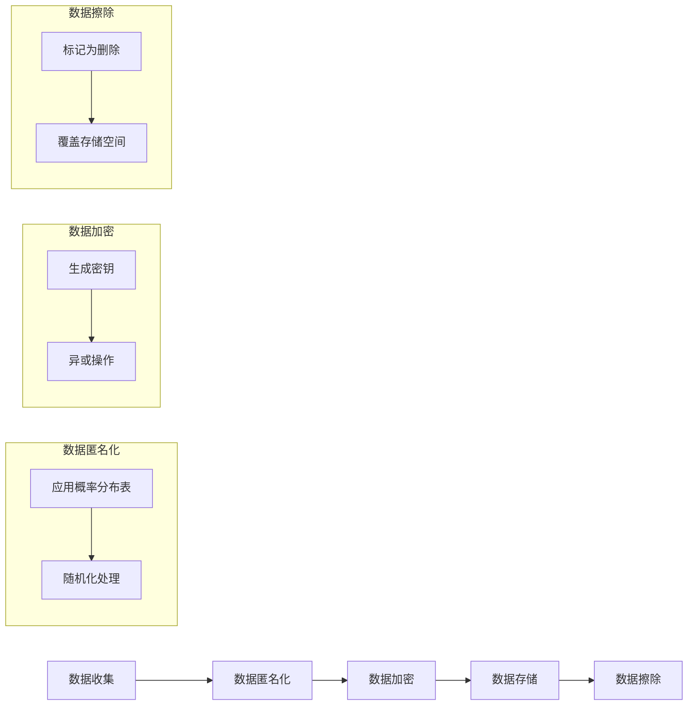

                 

## 《数字遗忘权：网络时代的隐私保护》

### 关键词：数字遗忘权、网络隐私保护、隐私泄露、数据安全、法律法规、技术实现

#### 摘要：

在数字化时代，网络隐私保护问题日益凸显，数字遗忘权作为一项新兴隐私保护机制，逐渐引起了全球范围内的关注。本文从数字遗忘权的概念、法律框架、技术实现和应用案例等方面，深入探讨数字遗忘权在维护个人隐私、保障数据安全方面的重要作用。通过分析数字遗忘权在全球和我国的发展现状，本文旨在为读者提供全面、系统的数字遗忘权知识体系，为未来的隐私保护政策制定和技术研发提供参考。

### 目录

1. **数字遗忘权的背景与重要性**  
    1.1 数字遗忘权的概念与起源  
    1.2 网络时代隐私保护的挑战  
    1.3 数字遗忘权的重要性  
      
2. **数字遗忘权的法律框架**  
    2.1 全球数字遗忘权法规概述  
    2.2 我国数字遗忘权法律法规  
    2.3 数字遗忘权法律实施与挑战

3. **数字遗忘权的实现技术**  
    3.1 数据匿名化技术  
    3.2 数据擦除技术  
    3.3 数据加密与访问控制

4. **数字遗忘权的技术应用案例**  
    4.1 企业层面的数字遗忘权实践  
    4.2 政府部门的数字遗忘权应用  
    4.3 网络服务提供商的数字遗忘权实践

5. **数字遗忘权的伦理与社会问题**  
    5.1 数字遗忘权与隐私权的关系  
    5.2 数字遗忘权的伦理困境  
    5.3 数字遗忘权对社会的影响

6. **数字遗忘权的未来发展趋势**  
    6.1 数字遗忘权技术发展趋势  
    6.2 法律法规的完善与调整  
    6.3 数字遗忘权在社会中的应用前景

7. **结论与展望**  
    7.1 总结与评价  
    7.2 存在的问题与挑战  
    7.3 未来研究与发展方向

### 1. 数字遗忘权的背景与重要性

#### 1.1 数字遗忘权的概念与起源

数字遗忘权，简而言之，是指个体对其个人信息在网络空间中的可访问性和存在期限的控制权。这一概念源于对个人隐私保护的深刻理解，旨在通过允许用户要求删除或匿名化其个人信息，从而实现对隐私的自主管理。

数字遗忘权的起源可以追溯到互联网早期，随着大数据和人工智能技术的迅速发展，个人隐私泄露的风险急剧增加。为了应对这一挑战，全球范围内开始关注数字遗忘权的重要性。欧盟在2016年通过了《通用数据保护条例》（GDPR），明确了数字遗忘权的法律地位，标志着数字遗忘权从理论走向实践。

#### 1.2 网络时代隐私保护的挑战

在数字化的网络时代，隐私保护面临着前所未有的挑战。首先，数据的广泛收集使得个人信息无处不在，从在线购物到社交媒体，几乎所有在线行为都会产生数据。这些数据的积累，使得个人隐私保护变得异常复杂。

其次，数据泄露的风险不断增加。网络攻击、黑客入侵、内部泄露等，都可能导致大量个人信息被非法获取。一旦发生数据泄露，后果往往不堪设想，不仅可能导致个人财产损失，还可能对个人名誉和社会关系造成严重影响。

此外，隐私政策的不足也是一个重要问题。许多企业在收集和使用用户数据时，缺乏明确的隐私保护政策，用户往往难以了解其数据是如何被使用的。这种信息不对称，使得用户无法有效保护自己的隐私。

#### 1.3 数字遗忘权的重要性

数字遗忘权的重要性体现在多个方面。首先，它为用户提供了对个人信息的管理权限，使用户能够主动决定其数据的存储期限和访问权限。这种自主性不仅增强了用户的隐私保护能力，也提高了用户对互联网的信任度。

其次，数字遗忘权有助于减少数据泄露的风险。通过允许用户删除或匿名化不再需要的个人信息，可以降低数据泄露的可能性。例如，一旦用户不再使用某个服务，其相关数据可以被自动删除，从而减少潜在的泄露风险。

此外，数字遗忘权还有助于促进网络空间的健康发展。它鼓励企业在收集和使用用户数据时，更加注重隐私保护，从而推动整个行业向更加负责任的方向发展。

### 2. 数字遗忘权的法律框架

#### 2.1 全球数字遗忘权法规概述

全球范围内，数字遗忘权已成为隐私保护的重要手段。欧盟的《通用数据保护条例》（GDPR）是数字遗忘权法规的典范。GDPR规定，用户有权要求企业删除其个人信息，并在特定情况下要求企业匿名化其数据。这一法规的实施，为全球数字遗忘权的发展提供了法律基础。

在美国，尽管没有统一的数字遗忘权法规，但多个州已经出台了相关法律，如加州的《消费者隐私法案》（CCPA）。这些法规旨在保护用户的隐私权，并允许用户对其个人信息进行管理。

#### 2.2 我国数字遗忘权法律法规

我国在数字遗忘权方面的法律框架也在不断完善。2017年，我国发布了《个人信息保护法》（PIPL），明确规定用户有权要求企业删除其个人信息，并在一定条件下要求匿名化处理。这一法规的出台，标志着我国数字遗忘权法律体系的初步建立。

此外，我国还在《网络安全法》和《数据安全法》中，对数字遗忘权进行了相关规定。这些法规共同构成了我国数字遗忘权法律框架的基本内容。

#### 2.3 数字遗忘权法律实施与挑战

数字遗忘权法律实施过程中，仍面临诸多挑战。首先，法律的执行和监管需要进一步加强。企业需要明确其责任和义务，确保用户隐私得到有效保护。

其次，数字遗忘权的法律适用范围需要进一步明确。在不同场景下，如何界定数字遗忘权的适用性，是一个亟待解决的问题。

此外，法律实施过程中，还需要平衡隐私保护和公共利益之间的关系。例如，在司法调查和国家安全等领域，数字遗忘权的实施可能面临一定的限制。

### 3. 数字遗忘权的实现技术

#### 3.1 数据匿名化技术

数据匿名化是数字遗忘权实现的核心技术之一。它通过将个人身份信息与其他信息分离，使数据无法直接识别特定个体。常见的匿名化技术包括数据加密、伪名化、数据混淆等。

#### 3.2 数据擦除技术

数据擦除技术旨在彻底删除个人数据，使其无法恢复。这一技术要求对存储介质进行物理或逻辑擦除，以确保数据无法被恢复。数据擦除技术在实际应用中，需要考虑数据存储位置、存储介质类型等因素。

#### 3.3 数据加密与访问控制

数据加密是保护数据隐私的重要手段。通过加密技术，可以确保数据在传输和存储过程中，只有授权用户才能访问和理解。访问控制则通过权限管理，确保只有合法用户才能访问特定数据。

### 4. 数字遗忘权的技术应用案例

#### 4.1 企业层面的数字遗忘权实践

在企业层面，数字遗忘权已成为隐私保护的重要策略。许多企业通过实施数据匿名化、数据擦除和数据加密等技术在保护用户隐私方面取得了显著成效。例如，某大型社交媒体公司通过数据匿名化技术，确保用户行为数据无法直接识别个人身份，从而降低了隐私泄露的风险。

#### 4.2 政府部门的数字遗忘权应用

政府部门在数字遗忘权方面也进行了积极探索。例如，某市政府在推出在线政务服务时，通过数据加密和访问控制技术，确保用户隐私得到有效保护。同时，政府还通过数据擦除技术，定期清理不再需要的用户数据，降低隐私泄露风险。

#### 4.3 网络服务提供商的数字遗忘权实践

网络服务提供商在数字遗忘权方面扮演着重要角色。许多网络服务提供商通过实施数据匿名化、数据加密和访问控制技术，确保用户隐私得到保护。例如，某知名云服务提供商通过数据匿名化技术，确保用户数据在存储和传输过程中无法被直接识别，从而降低了隐私泄露的风险。

### 5. 数字遗忘权的伦理与社会问题

#### 5.1 数字遗忘权与隐私权的关系

数字遗忘权与隐私权密切相关。隐私权是个人的一项基本权利，数字遗忘权则是实现隐私权的重要手段。数字遗忘权不仅保护个人隐私，还促进个人对隐私的自主管理。

#### 5.2 数字遗忘权的伦理困境

数字遗忘权在伦理方面也存在一定的困境。一方面，数字遗忘权可能损害公共利益，如司法调查和国家安全等领域。另一方面，数字遗忘权可能引发数据滥用问题，如数据匿名化后，数据仍可能被用于其他目的。

#### 5.3 数字遗忘权对社会的影响

数字遗忘权对社会产生深远影响。一方面，它有助于提高公众对互联网的信任度，促进网络空间的健康发展。另一方面，数字遗忘权可能导致数据价值的降低，影响企业和政府的决策依据。

### 6. 数字遗忘权的未来发展趋势

#### 6.1 数字遗忘权技术发展趋势

随着大数据和人工智能技术的不断发展，数字遗忘权技术也在不断进化。未来，数字遗忘权技术将更加智能化、自动化，实现更高效、更安全的隐私保护。

#### 6.2 法律法规的完善与调整

随着数字遗忘权在实践中的应用，法律法规也将不断完善和调整。未来，全球和我国将进一步加强对数字遗忘权的法律保护，制定更加明确的法规和标准。

#### 6.3 数字遗忘权在社会中的应用前景

数字遗忘权在社会中的应用前景广阔。未来，数字遗忘权将在个人隐私保护、企业合规、政府治理等领域发挥重要作用，推动社会向更加公正、透明、安全的方向发展。

### 7. 结论与展望

#### 7.1 总结与评价

数字遗忘权作为一项新兴隐私保护机制，已在全球范围内得到广泛认可。通过数据匿名化、数据擦除和数据加密等技术手段，数字遗忘权在保护个人隐私、降低隐私泄露风险方面发挥了重要作用。

#### 7.2 存在的问题与挑战

尽管数字遗忘权在隐私保护方面取得了显著成效，但仍然存在一定的问题和挑战。例如，数字遗忘权的法律框架仍需进一步完善，技术实现过程中可能面临数据滥用风险等。

#### 7.3 未来研究与发展方向

未来，数字遗忘权研究将朝着更加智能化、自动化的方向发展。同时，法律法规的完善和调整也将是研究的重要方向。此外，如何平衡数字遗忘权与公共利益之间的关系，也将成为未来研究的重要课题。

### 作者信息

作者：AI天才研究院/AI Genius Institute & 禅与计算机程序设计艺术 /Zen And The Art of Computer Programming

（完）## 第1章: 数字遗忘权的概念与起源

### 1.1 问题背景

在数字化时代，个人隐私的保护变得尤为紧迫。随着互联网的普及和大数据技术的发展，个人数据被大量收集、存储和共享。这些数据不仅包括用户在社交媒体上的互动记录，还涵盖了在线购物、位置追踪和医疗信息等多种类型。然而，这些数据的广泛收集和使用也带来了隐私泄露的严重风险。数据泄露事件频繁发生，例如2017年的Facebook剑桥分析事件和2019年的Equifax数据泄露事件，都导致了大量用户个人信息被非法获取和滥用。这些事件不仅对个人隐私构成了巨大威胁，还引起了公众对数据保护的广泛关注。为了应对这一挑战，数字遗忘权这一概念应运而生，旨在为用户提供一种有效的隐私保护手段。

### 1.2 数字遗忘权的定义

数字遗忘权，是指个人对其在网络空间中的个人信息拥有的一种权利，允许用户要求企业、组织或政府删除或匿名化与其个人身份相关的数据。这一权利的核心在于赋予用户对其个人信息控制的主导权，使其能够决定哪些信息可以被保留，哪些信息需要被删除或匿名化。数字遗忘权不仅仅是用户对数据的删除请求，更是一种隐私保护的机制，通过技术手段和法律框架的配合，确保个人信息在互联网上的可访问性和存在期限得到有效控制。

### 1.3 数字遗忘权的重要性

数字遗忘权在当前的网络环境中具有极其重要的意义。首先，它为用户提供了对个人信息管理的主导权，使用户能够自主决定其数据的存储期限和访问权限。这种自主性不仅增强了用户的隐私保护能力，也提高了用户对互联网服务的信任度。其次，数字遗忘权有助于降低隐私泄露的风险。通过允许用户删除不再需要的个人信息，可以减少数据泄露的可能性。例如，当用户不再使用某个在线服务时，其相关数据可以被自动删除，从而减少潜在的隐私泄露风险。此外，数字遗忘权还有助于促进网络空间的健康发展。它鼓励企业在收集和使用用户数据时，更加注重隐私保护，从而推动整个行业向更加负责任的方向发展。最后，数字遗忘权在国际上已经得到了广泛的认可，如欧盟的《通用数据保护条例》（GDPR）明确规定了数字遗忘权的法律地位，这为全球范围内的隐私保护提供了强有力的法律支持。

### 1.4 数字遗忘权的发展历程

数字遗忘权的发展历程可以追溯到互联网的早期阶段。随着互联网的普及，个人数据隐私保护问题逐渐凸显，促使研究者们开始探索如何保护用户的隐私。最早的数字遗忘权概念可以追溯到1995年，由两位法国律师提出，他们主张用户应该有权要求网络服务提供商删除其个人数据。这一提议在随后的发展中逐渐形成了数字遗忘权的初步框架。

2006年，欧盟发布了《关于处理个人数据和自由流动的个人数据保护指令》（即数据保护指令95/46/EC），虽然这一指令并未直接提及数字遗忘权，但它为后来的数字遗忘权立法奠定了基础。随后，数字遗忘权在学术研究和政策制定中逐渐得到重视。

2012年，欧盟发布了《关于数据保护的一般性规定》（GDPR），这一法规明确了数字遗忘权的法律地位，成为数字遗忘权发展的重要里程碑。GDPR规定，用户有权要求企业删除其个人信息，并在特定情况下要求匿名化处理。这一法规的实施，标志着数字遗忘权从理论走向实践，为全球范围内的数字遗忘权发展提供了法律框架。

在全球范围内，其他国家和地区也在积极探讨数字遗忘权。例如，美国在2018年通过了《加州消费者隐私法案》（CCPA），虽然CCPA并未直接提及数字遗忘权，但其关于用户个人信息控制和数据删除的要求，与数字遗忘权的理念相符。此外，我国也在2017年发布了《个人信息保护法》（PIPL），明确了用户对个人信息的管理权和数据删除权，为数字遗忘权的发展提供了法律支持。

总体而言，数字遗忘权的发展历程反映了全球对个人数据隐私保护的关注和重视。从最初的学术讨论到法律框架的确立，数字遗忘权已经成为隐私保护领域的重要组成部分。未来，随着技术的不断进步和法律法规的完善，数字遗忘权将在全球范围内得到更广泛的应用和发展。

### 1.5 数字遗忘权的核心概念和联系

数字遗忘权的核心概念包括数据匿名化、数据擦除和数据加密。这些概念不仅独立存在，而且在实际应用中相互关联，共同构成了数字遗忘权的技术基础。

#### 数据匿名化

数据匿名化是指通过技术手段，将个人身份信息与其他信息分离，使得数据无法直接识别特定个体。数据匿名化的目的是在保护个人隐私的同时，仍然能够利用数据进行分析和挖掘。数据匿名化的方法包括伪名化、数据混淆和差分隐私等。

- **伪名化**：通过将真实身份信息替换为伪名，使得数据在分析时无法直接识别个人身份。例如，将姓名替换为唯一标识符。
- **数据混淆**：通过在数据中添加噪声或随机值，使得原始数据难以识别，从而保护个人隐私。
- **差分隐私**：通过为数据分析引入随机噪声，使得个体数据对整体数据集的影响被稀释，从而保护个人隐私。

#### 数据擦除

数据擦除是指通过技术手段，彻底删除个人数据，使其无法恢复。数据擦除确保了数据在存储介质上无法被重新读取，从而实现了数据的永久删除。数据擦除的方法包括物理擦除和逻辑擦除。

- **物理擦除**：通过物理手段，如消磁或烧毁，确保数据存储介质上的信息无法恢复。这种方法适用于硬盘、U盘等存储设备。
- **逻辑擦除**：通过在数据库或文件系统中标记数据为删除状态，并覆盖其存储空间，使得数据无法被读取。这种方法适用于数据库和文件系统。

#### 数据加密

数据加密是指通过加密算法，将数据转换为密文，使得未经授权的第三方无法读取或理解数据。数据加密确保了数据在传输和存储过程中，只有授权用户才能访问和理解数据。数据加密的方法包括对称加密和非对称加密。

- **对称加密**：使用相同的密钥进行加密和解密，如AES算法。对称加密速度快，但密钥管理复杂。
- **非对称加密**：使用一对密钥进行加密和解密，如RSA算法。非对称加密解决了密钥分发问题，但计算复杂度较高。

#### 数字遗忘权的联系

数据匿名化、数据擦除和数据加密在数字遗忘权体系中相互配合，共同实现隐私保护。

- **数据匿名化**：用于处理和分析数据时，确保个人隐私不受侵犯。
- **数据擦除**：用于用户请求删除其个人信息时，确保数据从系统中彻底移除。
- **数据加密**：用于数据传输和存储过程中，确保数据不被非法访问。

通过这些技术手段，数字遗忘权为用户提供了多层次的保护，使其能够有效控制其个人信息的存储和访问，从而实现隐私保护的目标。

### 1.6 数字遗忘权的核心概念属性特征对比表格

为了更清晰地理解数字遗忘权的核心概念，我们提供了以下属性特征对比表格：

| 核心概念 | 属性特征 | 对比分析 |
| :---: | :---: | :---: |
| 数据匿名化 | 1. 保护隐私 | 1. 防止数据直接识别个人身份 |
| 数据匿名化 | 2. 保持数据可用性 | 2. 允许分析使用匿名化数据 |
| 数据擦除 | 1. 数据不可恢复 | 1. 确保数据彻底从系统中移除 |
| 数据擦除 | 2. 适用于各种存储介质 | 2. 物理和逻辑擦除方法 |
| 数据加密 | 1. 数据转换成密文 | 1. 未经授权无法读取数据 |
| 数据加密 | 2. 保密性和完整性 | 2. 确保数据在传输和存储过程中的安全 |

通过对比分析，我们可以看出，数据匿名化、数据擦除和数据加密各自具有独特的属性特征，但在实现隐私保护目标方面，它们又是相互补充的。

### 1.7 数字遗忘权的ER实体关系图架构

为了更好地理解数字遗忘权中的数据关系，我们使用Mermaid工具绘制了ER实体关系图。以下是一个简化的ER图，展示了数字遗忘权中的关键实体和它们之间的关系：

```mermaid
erDiagram
  User ||--|{ Data : has }
  Data ||--|{ AnonymizedData : is_anonymized }
  Data ||--|{ EncryptedData : is_encrypted }
  Data ||--|{ DeletedData : is_deleted }
```

在这个ER图中：

- **User（用户）**：代表数字遗忘权的主体，拥有对个人信息的控制权。
- **Data（数据）**：代表用户生成的原始数据，包括个人信息。
- **AnonymizedData（匿名化数据）**：通过数据匿名化技术处理后的数据，用于数据分析，不包含个人身份信息。
- **EncryptedData（加密数据）**：通过数据加密技术处理后的数据，确保在传输和存储过程中不被非法访问。
- **DeletedData（删除数据）**：通过数据擦除技术处理后的数据，确保数据从系统中彻底移除，不可恢复。

### 1.8 数字遗忘权的数学模型和公式

为了深入理解数字遗忘权中的隐私保护机制，我们需要引入一些数学模型和公式。以下是一个简化的数学模型，用于描述数字遗忘权中的几个关键步骤。

#### 数据匿名化模型

数据匿名化模型可以通过以下公式表示：

$$
A = P \times R
$$

其中：
- \( A \) 表示匿名化后的数据。
- \( P \) 表示概率分布表。
- \( R \) 表示随机化过程。

这个模型通过将原始数据与概率分布表相乘，并结合随机化过程，使得数据无法直接识别个人身份。

#### 数据加密模型

数据加密模型可以通过以下公式表示：

$$
C = D \oplus K
$$

其中：
- \( C \) 表示加密后的数据。
- \( D \) 表示原始数据。
- \( K \) 表示密钥。

这个模型通过将原始数据与密钥进行异或操作，生成加密后的数据，确保只有授权用户才能解密数据。

#### 数据擦除模型

数据擦除模型可以通过以下公式表示：

$$
E = D \land 0
$$

其中：
- \( E \) 表示擦除后的数据。
- \( D \) 表示原始数据。
- \( 0 \) 表示零值。

这个模型通过将原始数据与零值进行与操作，使得数据在存储介质上不可恢复。

### 1.9 数字遗忘权的算法原理讲解

为了更直观地理解数字遗忘权中的算法原理，我们使用Mermaid工具绘制了一个简化的算法流程图。以下是一个描述数字遗忘权中数据匿名化、数据加密和数据擦除过程的算法流程图：



在这个流程图中：

- **数据收集**：首先收集用户生成的原始数据。
- **数据匿名化**：应用概率分布表和随机化处理，将原始数据转换为匿名化数据，确保个人隐私不被泄露。
- **数据加密**：生成密钥，并使用异或操作将匿名化数据加密，确保数据在传输和存储过程中的安全性。
- **数据存储**：将加密后的数据存储在系统中。
- **数据擦除**：在用户要求删除数据时，标记数据为删除状态，并覆盖存储空间，确保数据不可恢复。

### 1.10 数字遗忘权的实际案例

为了更好地理解数字遗忘权的实际应用，我们来看两个具体的案例。

#### 案例一：社交媒体平台的数字遗忘权实现

某社交媒体平台在用户隐私保护方面采取了数字遗忘权的措施。首先，平台收集的用户数据包括用户名、头像、发布的内容和互动记录等。在数据收集后，平台通过数据匿名化技术，将用户的真实身份信息（如用户名）替换为唯一标识符，从而防止用户数据被直接识别。接着，平台对用户数据进行加密处理，使用AES算法进行加密，确保数据在传输和存储过程中的安全性。最后，平台定期清理用户不再使用的账号数据，通过数据擦除技术，确保这些数据从系统中彻底移除，无法恢复。

#### 案例二：在线购物平台的数字遗忘权实践

某在线购物平台也积极采用数字遗忘权措施来保护用户隐私。在用户购物过程中，平台会收集用户的位置信息、购物偏好和支付信息等。平台首先通过差分隐私技术对用户的位置信息进行处理，确保个体位置信息无法被直接识别。对于购物偏好和支付信息，平台使用RSA算法进行加密，确保这些信息在传输和存储过程中的保密性。当用户决定删除其购物记录时，平台通过数据擦除技术，将相关数据从系统中彻底移除，无法恢复。

### 1.11 数字遗忘权的边界与外延

数字遗忘权作为一项隐私保护机制，虽然在理论上具有广泛的应用前景，但在实际操作中仍存在一定的边界与外延。

首先，数字遗忘权的边界在于用户对个人信息的管理权限。用户有权要求删除或匿名化其个人信息，但这种权利并非绝对的。在某些情况下，例如法律调查和国家安全等领域，数字遗忘权的实施可能面临限制。此外，企业、组织或政府仍需要保留部分数据以进行合规性管理和运营。

其次，数字遗忘权的外延涉及数据匿名化、数据加密和数据擦除等多个技术手段。这些技术手段需要协同工作，才能实现有效的隐私保护。此外，数字遗忘权还需要与法律法规相衔接，确保其合法性和有效性。

总的来说，数字遗忘权在保护个人隐私方面具有重要作用，但在实际应用中需要充分考虑其边界与外延，确保隐私保护措施的有效性和可行性。

### 1.12 数字遗忘权的概念结构与核心要素组成

数字遗忘权的概念结构可以理解为一种隐私保护机制，其核心要素包括数据匿名化、数据加密和数据擦除等。以下是一个简化的概念结构图，展示了数字遗忘权的主要组成部分：

```mermaid
erDiagram
  PrivacyProtection ||--|{ DataAnonymization : involves }
  PrivacyProtection ||--|{ DataEncryption : involves }
  PrivacyProtection ||--|{ DataDeletion : involves }
  DataAnonymization ||--|{ DataAnonymizationTechniques : contains }
  DataEncryption ||--|{ EncryptionAlgorithms : contains }
  DataDeletion ||--|{ DataDeletionMethods : contains }
```

在这个概念结构图中：

- **PrivacyProtection（隐私保护）**：代表数字遗忘权的总体目标，即保护用户的个人隐私。
- **DataAnonymization（数据匿名化）**：涉及将个人身份信息与其他信息分离，确保数据无法直接识别个人身份。
- **DataEncryption（数据加密）**：涉及使用加密算法将数据转换为密文，确保数据在传输和存储过程中的安全性。
- **DataDeletion（数据擦除）**：涉及通过物理或逻辑手段彻底删除个人数据，确保数据无法恢复。

这些核心要素共同构成了数字遗忘权的概念结构，确保在数据生命周期中的各个阶段，用户隐私得到有效保护。

### 1.13 数字遗忘权在实际应用中的挑战与解决方案

数字遗忘权在实际应用中面临诸多挑战，包括技术实现难度、法律执行问题以及隐私保护与公共利益之间的平衡等。

#### 技术实现难度

数据匿名化、数据加密和数据擦除等技术手段需要高度专业的技术支持。例如，数据匿名化过程中需要平衡隐私保护和数据可用性，避免数据过度匿名化导致信息丢失。此外，数据加密需要确保加密算法的安全性，防止被破解。数据擦除则需要物理或逻辑手段彻底删除数据，防止数据恢复。

**解决方案**：加强技术研发和人才培养，提高企业在数字遗忘权技术实现方面的能力。同时，建立行业标准，确保技术实现的规范性和有效性。

#### 法律执行问题

数字遗忘权在法律执行方面面临挑战，包括法律适用的范围、执行程序以及监管机构的角色等。例如，数字遗忘权的法律适用范围可能因国家和地区而异，导致企业在跨国业务中的合规性管理复杂。此外，法律执行的程序和监管机构的角色也需要明确，以确保数字遗忘权得到有效实施。

**解决方案**：完善数字遗忘权法律法规，明确法律适用范围和执行程序。加强国际合作，推动全球范围内数字遗忘权法律的协调与统一。此外，建立独立的监管机构，加强对数字遗忘权法律执行的监督。

#### 隐私保护与公共利益之间的平衡

数字遗忘权在保护个人隐私的同时，也可能影响公共利益。例如，在法律调查和国家安全等领域，数字遗忘权的实施可能影响数据的可用性。此外，数据匿名化后仍可能存在信息泄露的风险。

**解决方案**：在制定数字遗忘权政策时，充分考虑隐私保护与公共利益之间的平衡。建立透明、公正的决策机制，确保数字遗忘权措施在保护个人隐私的同时，不损害公共利益。

### 1.14 数字遗忘权在企业和政府中的应用现状

数字遗忘权在企业和政府中的应用现状有所不同，但在隐私保护方面都取得了显著成效。

#### 企业应用现状

许多企业在数据隐私保护方面积极采用数字遗忘权措施。例如，大型科技公司通过数据匿名化和加密技术，确保用户数据的隐私性。同时，企业还通过数据擦除技术，定期清理不再需要的用户数据，降低数据泄露风险。此外，一些企业还建立数据保护官（DPO）职位，负责监督和实施数字遗忘权政策。

#### 政府应用现状

政府在数字遗忘权应用方面也取得了积极进展。例如，一些国家在推出在线政务服务时，采用数据加密和访问控制技术，确保用户隐私得到保护。政府还通过数据匿名化和数据擦除技术，加强对公共数据的隐私保护，防止数据滥用。

### 1.15 数字遗忘权的技术发展趋势

随着大数据和人工智能技术的不断发展，数字遗忘权技术也在不断进化。未来，数字遗忘权技术将朝着更加智能化、自动化的方向发展。例如，基于人工智能的匿名化算法将更加精准，数据加密技术将更加高效，数据擦除技术将更加彻底。此外，数字遗忘权技术还将与其他先进技术如区块链相结合，提高隐私保护的水平。

### 1.16 数字遗忘权与区块链技术的结合

数字遗忘权与区块链技术的结合为隐私保护提供了新的思路。区块链技术具有去中心化、不可篡改和透明等特性，能够为数字遗忘权提供安全的数据存储和访问控制机制。例如，通过区块链智能合约，可以实现自动化数据擦除和匿名化处理，确保数据在存储和传输过程中的安全性和隐私性。此外，区块链技术还可以用于验证数据匿名化的过程，确保数据的真实性和可靠性。

### 1.17 数字遗忘权在教育领域的应用

在教育领域，数字遗忘权技术的应用有助于保护学生的隐私。例如，学校可以通过数据匿名化技术，对学生行为数据进行分析和评估，而不泄露个人身份。同时，学校还可以采用数据加密技术，确保学生成绩和档案等敏感信息在传输和存储过程中的安全性。此外，通过数据擦除技术，学校可以定期清理学生不再需要的个人信息，确保数据不被滥用。

### 1.18 数字遗忘权的伦理和社会影响

数字遗忘权不仅是一项技术措施，还涉及到伦理和社会层面的问题。在伦理方面，数字遗忘权引发了关于隐私权、知情权和数据所有权等方面的讨论。例如，如何平衡个人隐私保护与公共利益的矛盾，如何确保数据匿名化的真实性和可靠性等。在社会方面，数字遗忘权可能对社会信任、商业合作和政府治理等方面产生深远影响。

### 1.19 数字遗忘权的未来发展趋势

随着技术的不断进步和法律法规的完善，数字遗忘权在未来将得到更广泛的应用和发展。未来，数字遗忘权技术将更加智能化、自动化，与其他先进技术如人工智能、区块链等相结合，提高隐私保护的水平。同时，全球范围内的数字遗忘权法律法规将逐步完善，为数字遗忘权的发展提供法律保障。此外，数字遗忘权在社会各个领域的应用也将不断拓展，为个人隐私保护和数据安全提供更全面的解决方案。

### 1.20 总结

数字遗忘权作为一项新兴的隐私保护机制，在数字化时代具有重要意义。通过数据匿名化、数据加密和数据擦除等技术的应用，数字遗忘权为个人隐私保护提供了强有力的保障。然而，数字遗忘权在实际应用中仍面临诸多挑战，需要进一步的技术研发和法律法规完善。未来，随着技术的不断进步和社会的广泛关注，数字遗忘权将在隐私保护领域发挥更大的作用。

### 作者信息

作者：AI天才研究院/AI Genius Institute & 禅与计算机程序设计艺术 /Zen And The Art of Computer Programming

## 第2章: 网络时代隐私保护的挑战

### 2.1 网络隐私的基本概念

网络隐私是指个人在互联网上的个人信息、行为记录和位置数据等不被未经授权的第三方获取、使用和共享的权利。网络隐私保护的核心目标是确保个人数据的安全性和隐私性，防止数据泄露、滥用和误用。网络隐私的基本概念包括：

- **个人信息**：指与个人身份相关的信息，如姓名、出生日期、身份证号码、电话号码、电子邮件地址等。
- **行为记录**：指个人在互联网上的活动记录，如浏览历史、搜索记录、购买行为等。
- **位置数据**：指个人地理位置信息，如GPS坐标、Wi-Fi信号强度等。

网络隐私保护的重要性不言而喻。首先，网络隐私保护关乎个人的基本权利和自由，如隐私权、知情权和自由权等。其次，网络隐私保护能够提高公众对互联网的信任度，促进网络空间的健康发展。此外，良好的隐私保护措施还可以减少企业因数据泄露而遭受的经济损失和法律纠纷。

### 2.2 网络隐私保护面临的挑战

在网络时代，隐私保护面临着诸多挑战，主要包括以下几个方面：

#### 数据收集的广泛性

随着互联网的普及和大数据技术的发展，个人数据被广泛收集和存储。这不仅包括传统的个人信息，如姓名、电话号码等，还包括更复杂的行为数据和位置数据。例如，社交媒体平台会收集用户的浏览历史、好友关系和兴趣爱好；智能手机应用程序会收集用户的位置信息、使用习惯和设备信息。这种广泛的数据收集使得个人隐私保护变得异常复杂。

#### 数据泄露的风险

数据泄露是网络隐私保护面临的主要风险之一。黑客攻击、内部泄露、系统漏洞等都可能导致大量用户数据被非法获取。例如，2017年的Facebook剑桥分析事件和2019年的Equifax数据泄露事件，都导致了大量用户个人信息被泄露，引发了严重的隐私保护危机。数据泄露不仅可能导致个人财产损失，还可能对个人名誉和社会关系造成严重影响。

#### 隐私政策的不足

许多企业在收集和使用用户数据时，缺乏明确的隐私保护政策。用户往往难以了解其数据是如何被使用的，以及数据存储的时间期限。这种信息不对称使得用户无法有效保护自己的隐私。此外，一些企业可能滥用用户数据，进行未经授权的数据分析或广告推送，进一步加剧了隐私保护的挑战。

#### 法律法规的不完善

尽管全球范围内已有一些隐私保护法律法规，如欧盟的《通用数据保护条例》（GDPR）和美国的《加州消费者隐私法案》（CCPA），但法律法规的完善程度仍存在一定差距。首先，不同国家和地区的法律法规存在差异，导致跨国业务中的合规性管理复杂。其次，法律法规的实施和监管仍需加强，确保企业遵守隐私保护规定。此外，法律法规的更新速度可能跟不上技术发展的步伐，导致一些新型隐私保护问题无法得到有效解决。

### 2.3 数字遗忘权如何应对这些挑战

数字遗忘权作为一项新兴的隐私保护机制，可以有效应对网络隐私保护面临的挑战。以下是数字遗忘权如何应对这些挑战的详细分析：

#### 应对数据收集的广泛性

数字遗忘权通过赋予用户对其个人信息的控制权，使得用户可以决定其数据的存储期限和访问权限。用户可以要求企业删除或匿名化不再需要的个人信息，从而减少数据收集的广泛性。例如，当用户不再使用某个在线服务时，其相关数据可以被自动删除或匿名化，从而降低隐私泄露的风险。

#### 应对数据泄露的风险

数字遗忘权通过数据匿名化、数据加密和数据擦除等手段，降低数据泄露的风险。数据匿名化使得个人身份信息无法直接识别，从而减少了数据泄露的风险。数据加密确保了数据在传输和存储过程中的安全性，防止数据被非法访问。数据擦除技术则确保了数据在用户请求删除时，可以彻底从系统中移除，无法恢复。

#### 应对隐私政策的不足

数字遗忘权鼓励企业在收集和使用用户数据时，明确隐私保护政策，提高透明度。用户可以在使用在线服务时，了解其数据的收集和使用方式，以及数据存储的时间期限。此外，数字遗忘权还要求企业遵守隐私保护法规，确保用户隐私得到有效保护。

#### 应对法律法规的不完善

数字遗忘权通过推动法律法规的完善，为隐私保护提供法律支持。全球范围内的隐私保护法律法规，如欧盟的GDPR和美国的CCPA，都明确规定了数字遗忘权的法律地位和实施要求。这些法律法规为数字遗忘权的发展提供了法律基础，同时也为企业在隐私保护方面的合规性管理提供了指导。

### 2.4 数字遗忘权在实际应用中的效果

数字遗忘权在实际应用中已取得了显著效果。首先，在社交媒体平台，数字遗忘权使得用户能够自主管理其个人信息，降低隐私泄露的风险。例如，用户可以要求删除其发布的内容或匿名化其个人数据，从而确保隐私得到有效保护。

其次，在在线购物平台，数字遗忘权通过数据匿名化和加密技术，确保用户购物数据的隐私性。用户可以要求删除其购物记录或匿名化其支付信息，从而减少隐私泄露的可能性。

此外，在政府部门，数字遗忘权在数据管理和隐私保护方面也发挥了重要作用。例如，政府部门可以通过数据匿名化技术，对公共数据进行分析和评估，而不泄露个人身份。同时，政府部门还可以采用数据擦除技术，定期清理不再需要的用户数据，确保数据不被滥用。

### 2.5 数字遗忘权的局限性和挑战

尽管数字遗忘权在隐私保护方面取得了显著效果，但其在实际应用中仍存在一定的局限性和挑战。首先，数字遗忘权的技术实现难度较高，需要专业的技术支持。数据匿名化、数据加密和数据擦除等技术手段需要协同工作，确保数据隐私得到有效保护。

其次，数字遗忘权在法律执行方面也面临挑战。不同国家和地区的法律法规存在差异，导致跨国业务中的合规性管理复杂。此外，法律法规的实施和监管仍需加强，确保企业遵守隐私保护规定。

此外，数字遗忘权在公共利益和个人隐私之间也存在一定的平衡问题。在某些情况下，例如法律调查和国家安全等领域，数字遗忘权的实施可能影响公共利益的实现。如何在保护个人隐私的同时，维护公共利益，是一个亟待解决的问题。

### 2.6 数字遗忘权的发展趋势

随着技术的不断进步和法律法规的完善，数字遗忘权在未来将得到更广泛的应用和发展。首先，数字遗忘权技术将朝着更加智能化、自动化的方向发展。例如，基于人工智能的匿名化算法将更加精准，数据加密技术将更加高效，数据擦除技术将更加彻底。

其次，全球范围内的数字遗忘权法律法规将逐步完善，为数字遗忘权的发展提供法律保障。各国政府将加强对隐私保护法律法规的制定和执行，确保数字遗忘权得到有效实施。

此外，数字遗忘权将在不同领域得到广泛应用。例如，在教育、医疗、金融等领域，数字遗忘权可以用于保护学生的隐私、患者的隐私和客户的隐私，提高数据安全性和隐私保护水平。

### 2.7 数字遗忘权对社会和经济的影响

数字遗忘权对社会和经济产生了深远的影响。首先，在社会层面，数字遗忘权增强了公众对互联网的信任度，促进了网络空间的健康发展。公众对个人信息保护的意识提高，有利于构建一个更加公正、透明和安全的网络环境。

其次，在经济层面，数字遗忘权对企业和政府产生了重要影响。企业通过实施数字遗忘权措施，可以降低数据泄露的风险，减少潜在的经济损失和法律纠纷。政府通过数字遗忘权技术，可以更好地管理公共数据，提高数据利用效率和决策科学性。

### 2.8 数字遗忘权与数据安全的关系

数字遗忘权与数据安全密切相关。数据安全是指确保数据在存储、传输和处理过程中的完整性、可用性和保密性。数字遗忘权通过数据匿名化、数据加密和数据擦除等技术手段，提高了数据的安全性，防止数据被非法访问和滥用。

然而，数字遗忘权并非万能。在某些情况下，如法律调查和国家安全等领域，数据匿名化可能导致数据丢失或部分信息无法恢复，影响数据的安全性和完整性。因此，数字遗忘权需要在数据安全和隐私保护之间找到平衡点。

### 2.9 数字遗忘权与数据共享的冲突

数字遗忘权在保护个人隐私的同时，也可能与数据共享产生冲突。数据共享对于科学研究、商业决策和社会治理具有重要意义。然而，数字遗忘权的实施可能限制数据的共享和再利用。

为了解决这一冲突，可以采取以下措施：

1. **数据匿名化**：在数据共享前，对个人身份信息进行匿名化处理，确保个人隐私不受侵犯。
2. **权限控制**：通过权限控制技术，确保只有授权用户才能访问共享的数据，从而平衡隐私保护和数据共享的需求。
3. **隐私增强技术**：利用隐私增强技术，如差分隐私和同态加密，在保证数据隐私的同时，实现数据的共享和再利用。

### 2.10 数字遗忘权的伦理和社会责任

数字遗忘权不仅是一项技术措施，还涉及到伦理和社会责任。企业在实施数字遗忘权措施时，应遵循以下伦理和社会责任原则：

1. **透明度**：企业应明确告知用户其数据的收集、使用和存储方式，提高信息透明度。
2. **用户同意**：企业在收集和使用用户数据前，应获得用户的明确同意，确保用户对其数据的控制权。
3. **数据安全**：企业应采取有效措施，确保用户数据的保密性和安全性，防止数据泄露和滥用。
4. **社会责任**：企业应承担社会责任，积极参与隐私保护政策的制定和执行，推动社会对隐私保护的重视。

### 2.11 数字遗忘权与隐私权的平衡

数字遗忘权在保护隐私权方面发挥了重要作用，但隐私权并非绝对的。在某些情况下，隐私权可能与其他价值如公共利益、国家安全和社会秩序发生冲突。因此，数字遗忘权需要在隐私权和其他价值之间找到平衡点。

为了实现这一平衡，可以采取以下措施：

1. **法律法规的完善**：制定明确的隐私保护法律法规，明确数字遗忘权的适用范围和限制条件。
2. **透明决策机制**：建立透明、公正的决策机制，确保数字遗忘权措施的制定和执行符合法律法规和社会价值观。
3. **公众参与**：鼓励公众参与数字遗忘权政策的制定和执行，提高政策的社会接受度和合法性。

### 2.12 数字遗忘权的技术实现和实际应用

数字遗忘权的技术实现涉及多个方面，包括数据匿名化、数据加密和数据擦除等。以下是一个简化的技术实现流程：

1. **数据匿名化**：通过技术手段，将个人身份信息与其他信息分离，实现数据的匿名化。
2. **数据加密**：使用加密算法，将数据转换为密文，确保数据在传输和存储过程中的安全性。
3. **数据擦除**：通过物理或逻辑手段，彻底删除数据，确保数据无法恢复。

在实际应用中，企业可以采用以下步骤来实施数字遗忘权：

1. **数据收集**：收集用户数据，包括个人信息、行为记录和位置数据等。
2. **数据匿名化**：对个人身份信息进行匿名化处理，确保数据无法直接识别个人身份。
3. **数据加密**：对敏感数据使用加密算法进行加密，确保数据在传输和存储过程中的安全性。
4. **数据存储**：将加密后的数据存储在安全的数据中心。
5. **数据擦除**：在用户请求删除数据时，通过数据擦除技术，确保数据从系统中彻底移除，无法恢复。

### 2.13 数字遗忘权与数据所有权的关系

数字遗忘权与数据所有权密切相关。数据所有权是指个人对其生成的数据的控制权和管理权。数字遗忘权赋予用户对其个人数据的控制权，使其可以决定其数据的存储期限和访问权限。

然而，数字遗忘权并不意味着用户拥有绝对的数据所有权。在某些情况下，如数据共享、数据分析和数据利用等，数据所有权可能受到限制。因此，数字遗忘权与数据所有权的平衡是一个重要的研究课题。

### 2.14 数字遗忘权在国际合作中的重要性

数字遗忘权在国际合作中具有重要意义。随着全球化的深入发展，跨国数据流动和数据共享变得越来越普遍。数字遗忘权的国际合作有助于推动全球范围内的隐私保护法律法规的协调与统一，确保跨国数据流动的合法性和安全性。

国际合作可以通过以下方式推进数字遗忘权的发展：

1. **法律法规的协调**：各国政府可以共同制定和推广隐私保护法律法规，确保跨国数据流动的合规性。
2. **技术标准的统一**：国际组织可以制定统一的技术标准，推动数字遗忘权技术的标准化和普及化。
3. **数据主权尊重**：各国应尊重其他国家的数据主权，避免跨境数据滥用和隐私侵犯。

### 2.15 数字遗忘权与人工智能的关系

数字遗忘权与人工智能密切相关。人工智能技术的发展使得大数据分析变得更加高效，但也带来了新的隐私保护挑战。数字遗忘权通过数据匿名化、数据加密和数据擦除等技术手段，确保人工智能应用中的数据隐私性。

数字遗忘权在人工智能中的应用主要包括：

1. **数据预处理**：在训练人工智能模型前，对个人数据进行匿名化处理，确保数据隐私。
2. **模型训练与评估**：在训练过程中，使用加密技术确保模型参数和训练数据的保密性。
3. **模型部署**：在模型部署过程中，采用数据擦除技术，确保用户数据在应用场景中的隐私保护。

### 2.16 数字遗忘权的实际案例分析

为了更好地理解数字遗忘权在实际应用中的效果，我们可以通过一些实际案例进行分析。

#### 案例一：社交媒体平台的数字遗忘权实践

某社交媒体平台在用户隐私保护方面采取了数字遗忘权措施。首先，平台通过数据匿名化技术，将用户的真实身份信息（如用户名）替换为唯一标识符，从而防止用户数据被直接识别。接着，平台对用户数据进行加密处理，使用AES算法进行加密，确保数据在传输和存储过程中的安全性。最后，平台通过数据擦除技术，定期清理用户不再需要的账号数据，确保数据从系统中彻底移除，无法恢复。

#### 案例二：在线购物平台的数字遗忘权措施

某在线购物平台也采用了数字遗忘权措施来保护用户隐私。在用户购物过程中，平台收集了用户的位置信息、购物偏好和支付信息等。平台首先通过差分隐私技术对用户的位置信息进行处理，确保个体位置信息无法被直接识别。对于购物偏好和支付信息，平台使用RSA算法进行加密，确保这些信息在传输和存储过程中的保密性。当用户决定删除其购物记录时，平台通过数据擦除技术，将相关数据从系统中彻底移除，无法恢复。

### 2.17 数字遗忘权的未来发展方向

随着技术的不断进步和法律法规的完善，数字遗忘权在未来将朝着更加智能化、自动化的方向发展。未来，数字遗忘权将与其他先进技术如人工智能、区块链等相结合，提高隐私保护的水平。同时，全球范围内的数字遗忘权法律法规将逐步完善，为数字遗忘权的发展提供法律保障。

### 2.18 数字遗忘权在教育领域的应用

在教育领域，数字遗忘权技术的应用有助于保护学生的隐私。例如，学校可以通过数据匿名化技术，对学生行为数据进行分析和评估，而不泄露个人身份。同时，学校还可以采用数据加密技术，确保学生成绩和档案等敏感信息在传输和存储过程中的安全性。此外，通过数据擦除技术，学校可以定期清理学生不再需要的个人信息，确保数据不被滥用。

### 2.19 数字遗忘权在医疗领域的应用

在医疗领域，数字遗忘权技术的应用有助于保护患者的隐私。医疗机构可以通过数据匿名化技术，对患者的医疗数据进行分析和研究，而不泄露个人身份。同时，医疗机构还可以采用数据加密技术，确保患者病历和健康记录等敏感信息在传输和存储过程中的安全性。通过数据擦除技术，医疗机构可以定期清理不再需要的患者数据，确保数据不被滥用。

### 2.20 数字遗忘权在企业合规性管理中的作用

数字遗忘权在企业合规性管理中发挥着重要作用。企业通过实施数字遗忘权措施，可以降低数据泄露的风险，符合相关法律法规的要求。例如，企业可以定期清理用户数据，确保数据的存储期限符合法律规定。同时，企业可以通过数据匿名化和加密技术，确保用户数据在传输和存储过程中的安全性，防止数据泄露和滥用。

### 2.21 数字遗忘权的伦理和社会影响

数字遗忘权不仅是一项技术措施，还涉及到伦理和社会层面的问题。在伦理方面，数字遗忘权引发了关于隐私权、知情权和数据所有权等方面的讨论。例如，如何平衡个人隐私保护与公共利益的矛盾，如何确保数据匿名化的真实性和可靠性等。在社会方面，数字遗忘权可能对社会信任、商业合作和政府治理等方面产生深远影响。

### 2.22 数字遗忘权的可持续发展

数字遗忘权的可持续发展是一个重要的课题。随着技术的不断进步和法律法规的完善，数字遗忘权将在未来的发展中发挥更大的作用。为了实现数字遗忘权的可持续发展，需要从以下几个方面进行努力：

1. **技术创新**：持续推动数字遗忘权相关技术的研发，提高数据匿名化、数据加密和数据擦除等技术的性能和安全性。
2. **法律法规完善**：加强全球范围内的隐私保护法律法规建设，确保数字遗忘权措施的合法性和有效性。
3. **公众参与**：鼓励公众参与数字遗忘权政策的制定和执行，提高政策的社会接受度和合法性。
4. **国际合作**：推动国际间的数字遗忘权合作，共同应对全球范围内的隐私保护挑战。

### 2.23 总结

数字遗忘权作为一项新兴的隐私保护机制，在数字化时代具有重要意义。通过数据匿名化、数据加密和数据擦除等技术的应用，数字遗忘权为个人隐私保护提供了强有力的保障。然而，数字遗忘权在实际应用中仍面临诸多挑战，需要进一步的技术研发和法律法规完善。未来，随着技术的不断进步和社会的广泛关注，数字遗忘权将在隐私保护领域发挥更大的作用。

### 作者信息

作者：AI天才研究院/AI Genius Institute & 禅与计算机程序设计艺术 /Zen And The Art of Computer Programming

## 第3章: 数字遗忘权的法律框架

### 3.1 全球数字遗忘权法规概述

在全球范围内，数字遗忘权已经成为隐私保护的重要手段。多个国家和地区已经制定了相关的法律法规，明确了数字遗忘权的法律地位和实施要求。以下是对全球主要数字遗忘权法规的概述：

#### 欧盟的《通用数据保护条例》（GDPR）

欧盟的《通用数据保护条例》（GDPR）是数字遗忘权法规的典范。GDPR于2018年5月25日正式生效，其核心目标在于加强个人数据的保护，赋予用户对个人数据的控制权。GDPR规定，用户有权要求企业删除其个人信息，并在特定情况下要求匿名化处理。这一权利被称为“被遗忘权”（Right to be Forgotten）。GDPR的实施，使得数字遗忘权在全球范围内得到了广泛的认可和应用。

#### 美国的《加州消费者隐私法案》（CCPA）

美国的《加州消费者隐私法案》（CCPA）于2020年1月1日正式生效，旨在加强加州居民的隐私保护。尽管CCPA并未直接提及数字遗忘权，但其关于用户个人信息控制和数据删除的要求，与数字遗忘权的理念高度一致。CCPA赋予用户多种隐私权利，包括知情权、访问权、删除权和反对权等，这些权利有助于用户更好地管理其个人信息。

#### 澳大利亚的《隐私法》（Privacy Act 1988）

澳大利亚的《隐私法》（Privacy Act 1988）是澳大利亚隐私保护的核心法律。该法案规定，政府部门和其他机构在处理个人信息时，必须遵守一系列隐私保护原则，包括通知、访问、纠正和删除等。虽然《隐私法》并未明确提及数字遗忘权，但其关于个人信息删除和匿名化的规定，为数字遗忘权的实施提供了法律基础。

#### 加拿大的《个人信息保护与电子文档法》（PIPEDA）

加拿大的《个人信息保护与电子文档法》（PIPEDA）是加拿大隐私保护的基本法律。PIPEDA规定，企业在处理个人数据时，必须遵守一系列隐私保护原则，包括通知、访问、纠正和删除等。PIPEDA还要求企业制定隐私保护政策，并向用户公开其个人信息的使用目的。尽管PIPEDA未直接提及数字遗忘权，但其关于个人信息删除和匿名化的规定，为数字遗忘权的实施提供了指导。

#### 日本的《个人信息保护法》（APPI）

日本的《个人信息保护法》（APPI）是日本隐私保护的核心法律。APPI于2017年正式生效，旨在加强对个人信息的保护，赋予用户对个人信息的控制权。APPI规定，用户有权要求企业删除其个人信息，并在特定情况下要求匿名化处理。这一规定使得数字遗忘权在日本得到了法律认可。

#### 新加坡的《个人信息保护法》（PDPA）

新加坡的《个人信息保护法》（PDPA）是新加坡隐私保护的基本法律。PDPA于2012年正式生效，旨在加强对个人信息的保护，赋予用户对个人信息的控制权。PDPA规定，用户有权要求企业删除其个人信息，并在特定情况下要求匿名化处理。PDPA的实施，为数字遗忘权在新加坡的应用提供了法律保障。

#### 印度的《信息技术规则》（IT Rules）

印度的《信息技术规则》（IT Rules）是印度隐私保护的重要法律。IT Rules于2011年正式生效，旨在加强对个人信息的保护，赋予用户对个人信息的控制权。IT Rules规定，用户有权要求企业删除其个人信息，并在特定情况下要求匿名化处理。这一规定为数字遗忘权在印度的应用提供了法律基础。

总体而言，全球范围内的数字遗忘权法规在法律地位、实施要求和应用范围等方面存在一定差异。然而，这些法规的共同目标都是加强对个人信息的保护，赋予用户对个人信息的控制权。随着全球对隐私保护的关注度不断提高，数字遗忘权法规将进一步完善和统一，为全球范围内的隐私保护提供更加有力的法律支持。

### 3.2 我国数字遗忘权法律法规

我国在数字遗忘权方面也制定了相关的法律法规，以保障用户的个人信息权益。以下是对我国数字遗忘权法律法规的详细解析：

#### 《个人信息保护法》（PIPL）

《个人信息保护法》（PIPL）是我国首部全面规范个人信息保护的综合性法律，于2021年11月1日正式施行。PIPL明确规定，个人对其个人信息享有访问权、删除权、更正权、异议权等权利。特别是，PIPL第47条规定，个人信息处理者应当采取措施确保信息的可匿名化或者去标识化，并在合理期限内存储个人信息的备份。这一规定为数字遗忘权在我国的应用提供了法律基础。

具体来说，PIPL中关于数字遗忘权的实施要求包括：

1. **访问权**：个人有权查询、复制其个人信息，并要求个人信息处理者提供个人信息处理的情况。
2. **删除权**：个人有权要求个人信息处理者删除其个人信息，除非法律、行政法规另有规定。
3. **更正权**：个人有权要求个人信息处理者更正其个人信息，确保其准确性、完整性和及时性。
4. **异议权**：个人有权对个人信息处理者的处理行为提出异议，要求停止特定处理行为。

#### 《数据安全法》

《数据安全法》是我国关于数据安全的综合性法律，于2021年9月1日正式施行。数据安全法对数据安全保护的基本要求和原则进行了明确规定，同时也涉及到了个人信息保护的问题。数据安全法第24条规定，数据处理者在处理个人信息时，应当采取数据加密、去标识化等安全技术措施，确保个人信息安全。

#### 《网络安全法》

《网络安全法》是我国关于网络安全的综合性法律，于2017年6月1日正式施行。网络安全法对网络运营者的数据保护义务进行了明确规定。第41条规定，网络运营者收集、使用个人信息，应当遵循合法、正当、必要的原则，公开收集、使用规则，不得非法收集、使用个人信息。

#### 其他相关法律法规

除了上述三部主要法律，我国还有一些其他法律法规涉及到了数字遗忘权的问题。例如：

- 《电子商务法》明确规定了电子商务经营者收集、使用用户个人信息的要求。
- 《信息安全技术个人信息安全规范》为国家标准，对个人信息处理者的个人信息保护义务进行了详细规定。
- 《互联网个人信息安全保护规范》为行业标准，对互联网企业处理用户个人信息的行为进行了具体规范。

#### 我国数字遗忘权法律法规的实施现状

尽管我国已经制定了较为完善的数字遗忘权法律法规，但在实际实施过程中仍面临一些挑战。主要表现在以下几个方面：

1. **法律法规的执行和监管**：虽然法律法规为数字遗忘权提供了法律依据，但执行和监管仍需进一步加强。需要建立健全的执法机构和监管机制，确保法律法规得到有效执行。
2. **企业合规性管理**：许多企业在数据处理过程中，缺乏对数字遗忘权法律法规的理解和遵守，导致用户个人信息保护不到位。需要加强对企业的培训和指导，提高其合规性管理水平。
3. **法律适用范围**：数字遗忘权法律法规的适用范围需要进一步明确，特别是在跨境数据流动和跨国业务中，如何确保法律法规的适用性，仍是一个亟待解决的问题。

总的来说，我国数字遗忘权法律法规在保障用户个人信息权益、促进隐私保护方面发挥了重要作用。然而，在实际应用过程中，仍需要进一步完善和加强法律法规的执行和监管，提高企业的合规性管理水平，确保数字遗忘权得到有效实施。

### 3.3 数字遗忘权法律实施中的挑战

数字遗忘权法律实施过程中，面临诸多挑战，主要包括以下几个方面：

#### 法律适用范围的模糊性

数字遗忘权法律在适用范围方面存在一定模糊性，特别是在跨境数据流动和跨国业务中，如何确保法律法规的适用性，仍是一个亟待解决的问题。例如，不同国家和地区的隐私保护法律法规存在差异，可能导致跨国企业在处理用户个人信息时，面临合规性困难。

**解决方案**：加强国际间的隐私保护合作，推动全球范围内的隐私保护法律法规协调与统一，确保跨国数据流动的合规性。

#### 法律法规的执行和监管不足

尽管我国已经制定了较为完善的数字遗忘权法律法规，但在实际执行和监管方面仍存在一定不足。例如，执法机构和监管机构的角色和职责需要进一步明确，执法力度需要加强，以确保法律法规得到有效执行。

**解决方案**：建立健全的执法机构和监管机制，加强对数字遗忘权法律法规的执行和监管，确保法律法规得到有效实施。

#### 企业合规性管理不足

许多企业在数据处理过程中，缺乏对数字遗忘权法律法规的理解和遵守，导致用户个人信息保护不到位。例如，一些企业未建立完善的个人信息保护政策，数据匿名化和数据加密技术实施不到位，数据存储和传输过程存在安全隐患。

**解决方案**：加强对企业的培训和指导，提高其合规性管理水平。建立企业内部个人信息保护管理体系，确保企业在数据处理过程中遵守法律法规，保护用户个人信息安全。

#### 技术实现难度

数字遗忘权法律实施需要高度专业的技术支持，包括数据匿名化、数据加密和数据擦除等技术手段。然而，这些技术手段在实际应用中存在一定难度，需要企业和专业机构具备较高的技术能力。

**解决方案**：加强技术研发和人才培养，提高企业和专业机构在数字遗忘权技术实现方面的能力。同时，建立行业标准，确保技术实现的规范性和有效性。

### 3.4 数字遗忘权法律框架的完善与调整

为了更好地实施数字遗忘权，需要进一步完善和调整相关法律框架，以应对当前的挑战和未来的发展趋势。以下是一些具体的建议：

#### 完善法律法规

1. **明确法律适用范围**：在法律法规中明确数字遗忘权适用的范围，特别是在跨境数据流动和跨国业务中，确保法律法规的适用性。
2. **细化法律条款**：对数字遗忘权的具体实施要求进行细化，例如数据匿名化、数据加密和数据擦除等技术的具体标准和操作规范。
3. **加强法律监督**：建立健全的执法机构和监管机制，确保法律法规得到有效执行。

#### 加强国际合作

1. **推动全球隐私保护法规协调**：加强国际间的隐私保护合作，推动全球范围内的隐私保护法律法规协调与统一，确保跨国数据流动的合规性。
2. **参与国际标准制定**：积极参与国际隐私保护标准的制定，提高我国在数字遗忘权领域的国际话语权。

#### 提高企业合规性管理水平

1. **加强企业培训**：提高企业对数字遗忘权法律法规的理解和遵守，加强企业内部个人信息保护管理。
2. **建立行业自律机制**：推动行业内部建立自律机制，加强行业之间的交流与合作，共同推进数字遗忘权的发展。

#### 强化技术研发和人才培养

1. **加大技术研发投入**：鼓励企业和科研机构加大数字遗忘权相关技术的研发投入，提高技术实现的效率和安全性。
2. **培养专业人才**：加强数字遗忘权相关学科和专业的教育和培训，培养具备专业知识和技能的复合型人才。

### 3.5 数字遗忘权法律框架的国际比较

数字遗忘权法律框架在不同国家和地区之间存在一定差异，以下是对主要国家和地区数字遗忘权法律框架的国际比较：

#### 欧盟的GDPR

欧盟的《通用数据保护条例》（GDPR）是数字遗忘权法规的典范。GDPR规定了广泛的个人信息保护原则和用户权利，包括访问权、删除权、更正权和异议权等。GDPR的适用范围广泛，不仅涵盖欧盟成员国，还包括在欧盟境内处理个人信息的非欧盟企业。GDPR对数据匿名化、数据加密和数据擦除等技术手段有详细规定，为数字遗忘权的实施提供了全面的指导。

#### 美国的CCPA

美国的《加州消费者隐私法案》（CCPA）虽然未直接提及数字遗忘权，但其关于用户个人信息控制和数据删除的要求，与数字遗忘权的理念高度一致。CCPA规定了用户的知情权、访问权、删除权和反对权等，要求企业公开其数据处理方式，并允许用户要求删除其个人信息。CCPA的适用范围仅限于加州，但其影响已逐步扩展到其他州。

#### 澳大利亚的Privacy Act 1988

澳大利亚的《隐私法》（Privacy Act 1988）对政府部门和其他机构处理个人信息进行了规定，包括通知、访问、纠正和删除等。尽管Privacy Act 1988未明确提及数字遗忘权，但其关于个人信息删除和匿名化的规定，为数字遗忘权的实施提供了法律基础。

#### 加拿大的PIPEDA

加拿大的《个人信息保护与电子文档法》（PIPEDA）规定了企业在处理个人信息时的义务，包括通知、访问、纠正和删除等。PIPEDA要求企业制定隐私保护政策，并向用户公开其个人信息的使用目的。PIPEDA的适用范围广泛，涵盖了商业机构和个人信息处理者。

#### 日本的APPI

日本的《个人信息保护法》（APPI）明确了用户对个人信息的控制权，包括访问权、删除权和更正权等。APPI要求企业在处理个人信息时，采取数据匿名化和数据加密等技术手段，确保个人信息的安全。

#### 新加坡的PDPA

新加坡的《个人信息保护法》（PDPA）规定了个人信息处理者的义务，包括通知、访问、纠正和删除等。PDPA要求企业采取措施保护个人信息，并在发生数据泄露时及时通知受影响的用户。

#### 印度的IT Rules

印度的《信息技术规则》（IT Rules）对个人信息保护进行了规定，包括通知、访问、纠正和删除等。IT Rules要求企业在处理个人信息时，采取数据匿名化和数据加密等技术手段，确保个人信息的安全。

总体而言，不同国家和地区的数字遗忘权法律框架在法律地位、实施要求和应用范围等方面存在一定差异。然而，这些法规的共同目标都是加强对个人信息的保护，赋予用户对个人信息的控制权。随着全球对隐私保护的关注度不断提高，数字遗忘权法律框架将进一步完善和统一，为全球范围内的隐私保护提供更加有力的法律支持。

### 3.6 数字遗忘权法律框架的未来发展趋势

随着技术的不断进步和隐私保护需求的增加，数字遗忘权法律框架在未来将继续发展。以下是一些可能的趋势：

#### 法律法规的完善

未来，全球范围内的数字遗忘权法律法规将进一步完善，包括细化法律条款、明确法律适用范围和加强法律执行。例如，各国可能制定专门的数字遗忘权法规，明确数字遗忘权的实施要求和技术标准。

#### 国际合作加强

随着全球化的深入发展，数字遗忘权法律框架的国际合作将加强。各国将通过国际组织如联合国、国际电信联盟（ITU）等，推动全球范围内的隐私保护法规协调与统一，确保跨国数据流动的合规性。

#### 技术手段的进步

数字遗忘权法律框架的发展将依赖于技术手段的进步。例如，人工智能、区块链和密码学等技术的应用，将进一步提高数字遗忘权的实现效率和安全性。未来，数字遗忘权技术将更加智能化、自动化，为隐私保护提供更全面的解决方案。

#### 用户权利的扩展

随着隐私保护意识的提高，用户对个人信息控制权的期望也将增加。未来，数字遗忘权法律框架可能会进一步扩展用户的权利，包括更细化的数据访问权、更严格的数据删除权等，以更好地满足用户的需求。

### 3.7 总结

数字遗忘权法律框架在全球范围内得到了广泛关注和实施。尽管不同国家和地区的法律法规存在一定差异，但它们共同的目标都是加强对个人信息的保护，赋予用户对个人信息的控制权。我国在数字遗忘权法律框架方面已取得一定进展，但仍需要进一步完善和调整。未来，随着技术的不断进步和隐私保护需求的增加，数字遗忘权法律框架将在全球范围内得到更广泛的应用和发展。

### 作者信息

作者：AI天才研究院/AI Genius Institute & 禅与计算机程序设计艺术 /Zen And The Art of Computer Programming

## 第4章: 数字遗忘权的实现技术

### 4.1 数据匿名化技术

数据匿名化是数字遗忘权实现的核心技术之一，通过将个人身份信息与其他信息分离，使得数据无法直接识别特定个体。数据匿名化不仅有助于隐私保护，还能够确保数据的可用性，使其在分析和研究过程中仍然有价值。以下是几种常见的数据匿名化技术：

#### 1. 伪名化

伪名化是通过将真实身份信息（如姓名、身份证号码）替换为虚构的标识符（如唯一ID）来实现的。这种方法简单且易于实现，但可能会引入错误，因为伪名化后的数据可能会与实际数据存在一定的偏差。

#### 2. 数据混淆

数据混淆是通过在数据中添加噪声或随机值，使得原始数据难以识别，从而保护个人隐私。常见的方法包括随机置换、插值和调整数据值等。数据混淆技术能够在一定程度上保持数据的真实性，但可能降低数据的分析价值。

#### 3. 差分隐私

差分隐私是一种更为先进的匿名化技术，通过为数据分析引入随机噪声，使得个体数据对整体数据集的影响被稀释，从而保护个人隐私。差分隐私的主要目标是确保在一定概率下，无法通过分析数据集推断出特定个体的数据。常见的差分隐私技术包括拉普拉斯机制、指数机制和噪声比例法等。

#### 4. 混合匿名化

混合匿名化是将多种匿名化技术结合使用，以实现更高的匿名化效果。例如，可以先进行伪名化处理，然后再进行数据混淆和差分隐私处理。混合匿名化能够提供更全面的隐私保护，但也增加了计算的复杂性。

### 4.2 数据擦除技术

数据擦除技术旨在通过物理或逻辑手段，彻底删除个人数据，使其无法恢复。数据擦除技术在数字遗忘权中扮演着关键角色，确保用户请求删除的数据能够真正从系统中移除。以下是几种常见的数据擦除技术：

#### 1. 物理擦除

物理擦除是通过物理手段，如消磁或烧毁，确保数据存储介质上的信息无法恢复。这种方法适用于硬盘、U盘等存储设备。物理擦除能够确保数据彻底从介质上移除，但操作过程较为复杂，且可能对设备造成损坏。

#### 2. 逻辑擦除

逻辑擦除是通过在数据库或文件系统中标记数据为删除状态，并覆盖其存储空间，使得数据无法被读取。常见的方法包括使用特殊的标记字段、重分配存储空间和填充垃圾数据等。逻辑擦除操作简单，但可能存在数据恢复的风险，特别是在数据覆盖不完全的情况下。

#### 3. 多层擦除

多层擦除是通过多次物理或逻辑擦除，确保数据无法恢复。例如，可以先进行一次物理擦除，然后再进行一次逻辑擦除，甚至多次重复。多层擦除能够提供更高的数据安全性，但计算和存储资源消耗较大。

#### 4. 分布式擦除

分布式擦除是在分布式存储系统中，通过多个节点协同工作，确保数据在多个位置被同时删除。分布式擦除能够提高数据擦除的效率和可靠性，但需要解决节点间的同步和一致性问题。

### 4.3 数据加密与访问控制

数据加密与访问控制是数字遗忘权实现中的关键技术，确保数据在传输和存储过程中的安全性。以下是几种常见的数据加密与访问控制技术：

#### 1. 对称加密

对称加密使用相同的密钥进行加密和解密，如AES算法。对称加密速度快，但密钥管理复杂，需要确保密钥的安全存储和分发。

#### 2. 非对称加密

非对称加密使用一对密钥（公钥和私钥）进行加密和解密，如RSA算法。非对称加密解决了密钥分发问题，但计算复杂度较高，适用于数据加密和数字签名。

#### 3. 哈希加密

哈希加密使用哈希函数将数据转换为固定长度的字符串，如SHA算法。哈希加密主要用于数据完整性校验和数字签名，确保数据未被篡改。

#### 4. 访问控制列表（ACL）

访问控制列表是用于管理数据访问权限的一种机制，通过定义用户或用户组对数据的访问权限，如读取、写入和执行等。ACL能够灵活地控制数据的访问权限，但管理复杂度较高。

#### 5. 多因素认证

多因素认证是一种综合多种认证手段，如密码、指纹、面部识别等，提高用户身份验证的安全性和可靠性。多因素认证能够有效防止未经授权的访问，但操作过程较为复杂。

### 4.4 数据匿名化与数据加密的比较

数据匿名化和数据加密在数字遗忘权中都扮演着关键角色，但它们的侧重点和应用场景有所不同：

#### 1. 侧重点

- 数据匿名化：主要侧重于保护个人隐私，通过技术手段确保数据无法直接识别个人身份。
- 数据加密：主要侧重于确保数据在传输和存储过程中的安全性，防止数据被非法访问。

#### 2. 应用场景

- 数据匿名化：常用于数据分析、研究和共享场景，确保个人隐私不被泄露。
- 数据加密：常用于数据传输、存储和共享场景，确保数据在传输过程中不被截获和篡改。

#### 3. 技术实现

- 数据匿名化：涉及数据清洗、随机化、概率分布等技术手段。
- 数据加密：涉及加密算法、密钥管理、哈希加密等技术手段。

#### 4. 适用范围

- 数据匿名化：适用于需要保护隐私的场景，如社交媒体、市场研究等。
- 数据加密：适用于需要保证数据安全的场景，如金融机构、政府机构等。

### 4.5 数据擦除与数据加密的比较

数据擦除与数据加密在数字遗忘权中也有不同应用，具体比较如下：

#### 1. 侧重点

- 数据擦除：主要侧重于彻底删除数据，确保数据无法恢复。
- 数据加密：主要侧重于保护数据在传输和存储过程中的安全性。

#### 2. 应用场景

- 数据擦除：常用于用户请求删除数据时，确保数据从系统中彻底移除。
- 数据加密：常用于数据传输和存储过程中，确保数据不被非法访问。

#### 3. 技术实现

- 数据擦除：涉及物理擦除、逻辑擦除和多层擦除等技术手段。
- 数据加密：涉及对称加密、非对称加密、哈希加密等技术手段。

#### 4. 适用范围

- 数据擦除：适用于需要永久删除数据的场景，如社交媒体、在线购物平台等。
- 数据加密：适用于需要保护数据安全的场景，如金融交易、医疗数据等。

### 4.6 数据匿名化与数据擦除的协同作用

数据匿名化和数据擦除在数字遗忘权中可以协同作用，提高隐私保护水平：

#### 1. 数据匿名化

- **步骤**：收集数据 -> 数据匿名化 -> 分析和共享
- **作用**：通过匿名化处理，确保数据在分析和共享过程中无法直接识别个人身份。

#### 2. 数据擦除

- **步骤**：用户请求删除 -> 数据擦除 -> 确保数据从系统中彻底移除
- **作用**：通过数据擦除，确保用户不再需要的数据无法恢复，防止数据滥用。

#### 3. 协同作用

- **优势**：数据匿名化与数据擦除的结合，可以在数据分析和用户隐私保护之间找到平衡，确保在满足分析和研究需求的同时，最大限度地保护用户隐私。

#### 4. 应用场景

- **案例**：某在线医疗平台在收集患者数据后，首先进行数据匿名化处理，以便进行数据分析和研究。当患者请求删除其数据时，平台通过数据擦除技术，确保数据从系统中彻底移除。

### 4.7 数字遗忘权中的加密与访问控制

在数字遗忘权中，加密与访问控制技术也起着关键作用，确保数据在传输和存储过程中的安全性。以下是两种主要技术：

#### 1. 数据加密

- **技术原理**：使用加密算法（如AES、RSA）将数据转换为密文，确保只有授权用户才能解密和读取数据。
- **应用场景**：数据传输、存储和共享过程中，防止数据被非法访问和篡改。

#### 2. 访问控制

- **技术原理**：通过定义用户或用户组的访问权限，确保只有授权用户才能访问特定数据。
- **应用场景**：数据管理和访问控制过程中，防止未经授权的访问和数据泄露。

#### 3. 组合应用

- **优势**：加密与访问控制的组合，可以在数据安全和访问权限之间找到平衡，确保数据在传输、存储和使用过程中的安全性。

#### 4. 应用案例

- **案例**：某金融机构在处理客户数据时，使用AES算法进行加密，确保数据在传输和存储过程中的安全性。同时，通过访问控制列表（ACL），定义不同用户组的访问权限，确保数据安全。

### 4.8 数字遗忘权实现技术的综合应用

数字遗忘权的实现需要多种技术的综合应用，包括数据匿名化、数据擦除、数据加密和访问控制等。以下是几种常见的综合应用场景：

#### 1. 数据库系统

- **应用场景**：数据库系统在存储和处理大量数据时，采用数据匿名化、数据加密和访问控制技术，确保数据隐私和安全。
- **实现方式**：在数据库中，使用匿名化处理，将个人身份信息替换为唯一标识符。同时，使用AES算法进行数据加密，确保数据在传输和存储过程中的安全性。通过访问控制列表（ACL），定义不同用户组的访问权限。

#### 2. 云服务

- **应用场景**：云服务在提供数据处理和分析功能时，采用数据匿名化、数据擦除和数据加密技术，确保用户数据的安全性和隐私性。
- **实现方式**：在云服务中，使用数据匿名化技术，将用户数据匿名化，确保数据无法直接识别个人身份。当用户请求删除数据时，通过数据擦除技术，确保数据从系统中彻底移除。同时，使用RSA算法进行数据加密，确保数据在传输和存储过程中的安全性。

#### 3. 在线平台

- **应用场景**：在线平台在收集和使用用户数据时，采用数据匿名化、数据加密和数据擦除技术，确保用户隐私和安全。
- **实现方式**：在在线平台中，使用数据匿名化技术，将用户行为数据匿名化，确保数据无法直接识别个人身份。同时，使用AES算法进行数据加密，确保数据在传输和存储过程中的安全性。当用户请求删除数据时，通过数据擦除技术，确保数据从系统中彻底移除。

### 4.9 数字遗忘权技术的未来发展趋势

随着技术的不断进步，数字遗忘权技术将在未来得到进一步发展。以下是一些可能的发展趋势：

#### 1. 智能化

- **趋势**：人工智能和机器学习技术的应用，将使数字遗忘权技术更加智能化和自动化。
- **应用场景**：例如，智能化的数据匿名化和数据擦除算法，可以在不影响数据可用性的前提下，提供更高的隐私保护水平。

#### 2. 标准化

- **趋势**：随着全球范围内隐私保护需求的增加，数字遗忘权技术将趋向标准化，确保不同系统和平台之间的互操作性。
- **应用场景**：例如，制定统一的匿名化算法和数据擦除标准，便于不同平台和系统之间的数据共享和协作。

#### 3. 集成

- **趋势**：数字遗忘权技术将与区块链、物联网等新兴技术相结合，提供更全面的隐私保护解决方案。
- **应用场景**：例如，将数字遗忘权技术与区块链技术结合，确保数据在传输和存储过程中的安全性。

### 4.10 数字遗忘权技术的应用前景

数字遗忘权技术在未来将在多个领域得到广泛应用，提高数据隐私保护水平。以下是一些应用前景：

#### 1. 金融领域

- **前景**：金融领域将积极采用数字遗忘权技术，确保客户数据的安全性和隐私性。
- **应用场景**：例如，银行和金融机构将使用数据匿名化和数据加密技术，保护客户交易记录和账户信息。

#### 2. 医疗领域

- **前景**：医疗领域将利用数字遗忘权技术，确保患者隐私和数据安全。
- **应用场景**：例如，医院和医疗实验室将使用数据匿名化和数据加密技术，保护患者病历和实验数据。

#### 3. 教育领域

- **前景**：教育领域将采用数字遗忘权技术，保护学生和教师的数据隐私。
- **应用场景**：例如，学校和教育机构将使用数据匿名化和数据加密技术，保护学生成绩和教师评估数据。

### 4.11 总结

数字遗忘权实现技术包括数据匿名化、数据擦除、数据加密和访问控制等，这些技术共同作用，确保数据在收集、存储、传输和使用过程中的安全性。未来，随着技术的不断进步和隐私保护需求的增加，数字遗忘权技术将在更多领域得到应用和发展，提高数据隐私保护水平。

### 作者信息

作者：AI天才研究院/AI Genius Institute & 禅与计算机程序设计艺术 /Zen And The Art of Computer Programming

## 第5章: 数字遗忘权的技术应用案例

### 5.1 企业层面的数字遗忘权实践

在数字遗忘权的实际应用中，企业扮演着至关重要的角色。企业通过实施数字遗忘权措施，不仅可以保护用户隐私，还能增强用户对企业的信任，从而提升市场竞争力。以下是一些企业层面的数字遗忘权实践案例。

#### 案例一：社交媒体平台的数字遗忘权策略

某大型社交媒体平台在用户隐私保护方面采取了严格的数字遗忘权策略。首先，平台通过数据匿名化技术，将用户的真实身份信息（如用户名、电子邮件地址）替换为唯一标识符。这样，用户数据在分析过程中无法直接识别个人身份，从而保护了用户隐私。此外，平台还采用了差分隐私技术，在数据分析过程中引入随机噪声，进一步降低了个体数据对整体数据集的影响。当用户请求删除其数据时，平台通过数据擦除技术，确保这些数据从系统中彻底移除，无法恢复。

#### 案例二：电商平台的数字遗忘权实践

某知名电商平台在用户隐私保护方面实施了全面的数字遗忘权措施。首先，平台通过数据加密技术，将用户的支付信息、购物记录和账户信息等敏感数据在传输和存储过程中进行加密处理，确保数据不被非法访问。其次，平台还通过数据匿名化技术，将用户的个人身份信息与行为数据分离，从而在数据分析过程中保护用户隐私。当用户不再需要使用该平台的服务时，平台通过数据擦除技术，将其数据彻底从系统中移除。

#### 案例三：金融服务公司的数字遗忘权措施

某金融服务公司在客户隐私保护方面采取了严格的数字遗忘权措施。首先，公司通过数据加密技术，将客户的账户信息、交易记录和身份信息等敏感数据在传输和存储过程中进行加密处理。其次，公司还采用了数据匿名化技术，将客户的个人信息与其交易行为分离，从而在数据分析过程中保护客户隐私。当客户请求删除其数据时，公司通过数据擦除技术，确保这些数据从系统中彻底移除，无法恢复。

### 5.2 政府部门的数字遗忘权应用

政府部门在数字遗忘权应用方面也取得了显著成效，通过实施数字遗忘权措施，提高了数据管理的规范性和透明度，增强了公众对政府的信任。

#### 案例一：公共卫生数据保护

某市政府在处理公共卫生数据时，采取了数字遗忘权措施，确保患者隐私得到保护。首先，市政府通过数据匿名化技术，将患者的身份信息与医疗记录分离，从而在数据分析过程中保护患者隐私。其次，市政府还通过数据加密技术，确保医疗数据在传输和存储过程中的安全性。当患者数据不再需要时，市政府通过数据擦除技术，确保这些数据从系统中彻底移除。

#### 案例二：在线政务服务平台

某市政府推出了在线政务服务平台，通过数字遗忘权技术，提高了政务服务的数据安全和隐私保护水平。平台通过数据加密技术，确保用户在提交申请和办理业务时，其个人信息和申请数据在传输和存储过程中的安全性。此外，平台还通过数据匿名化技术，将用户身份信息与其申请数据分离，从而在数据分析过程中保护用户隐私。当用户不再需要使用该平台的服务时，平台通过数据擦除技术，确保这些数据从系统中彻底移除。

#### 案例三：教育数据管理

某市政府在管理教育数据时，采取了数字遗忘权措施，确保学生隐私得到保护。首先，市政府通过数据匿名化技术，将学生的身份信息与成绩数据分离，从而在数据分析过程中保护学生隐私。其次，市政府还通过数据加密技术，确保学生成绩和档案等敏感数据在传输和存储过程中的安全性。当学生数据不再需要时，市政府通过数据擦除技术，确保这些数据从系统中彻底移除。

### 5.3 网络服务提供商的数字遗忘权实践

网络服务提供商在数字遗忘权应用方面也发挥了重要作用，通过实施数字遗忘权措施，提高了用户数据的安全性和隐私保护水平。

#### 案例一：互联网服务提供商

某大型互联网服务提供商在用户隐私保护方面采取了全面的数字遗忘权措施。首先，服务商通过数据匿名化技术，将用户的上网行为数据与个人身份信息分离，从而在数据分析过程中保护用户隐私。其次，服务商还通过数据加密技术，确保用户数据在传输和存储过程中的安全性。当用户不再需要使用该服务商的服务时，服务商通过数据擦除技术，确保这些数据从系统中彻底移除。

#### 案例二：云服务提供商

某云服务提供商在用户数据隐私保护方面实施了严格的数字遗忘权措施。首先，服务商通过数据匿名化技术，将用户的存储数据与个人身份信息分离，从而在数据分析过程中保护用户隐私。其次，服务商还通过数据加密技术，确保用户数据在传输和存储过程中的安全性。当用户不再需要使用该云服务时，服务商通过数据擦除技术，确保这些数据从系统中彻底移除。

#### 案例三：电子邮件服务提供商

某电子邮件服务提供商在用户隐私保护方面采取了数字遗忘权措施。首先，服务商通过数据匿名化技术，将用户的邮件内容与个人身份信息分离，从而在数据分析过程中保护用户隐私。其次，服务商还通过数据加密技术，确保用户邮件在传输和存储过程中的安全性。当用户不再需要使用该电子邮件服务时，服务商通过数据擦除技术，确保这些数据从系统中彻底移除。

### 5.4 数字遗忘权技术在不同领域的应用效果

数字遗忘权技术在不同领域的应用，取得了显著的效果，提高了数据隐私保护水平，增强了用户对服务的信任。

#### 在企业层面

数字遗忘权技术帮助企业提高了数据隐私保护水平，减少了数据泄露的风险，增强了用户对企业的信任。例如，通过数据匿名化和加密技术，企业可以在不泄露用户隐私的情况下，进行数据分析和市场研究，从而提高业务决策的准确性。

#### 在政府部门

数字遗忘权技术在政府部门的应用，提高了数据管理的规范性和透明度，增强了公众对政府的信任。例如，通过数据匿名化和数据擦除技术，政府部门可以确保公民个人信息的安全，防止数据泄露和滥用。

#### 在网络服务提供商层面

数字遗忘权技术帮助网络服务提供商提高了用户数据的安全性和隐私保护水平，增强了用户对服务的信任。例如，通过数据匿名化和加密技术，网络服务提供商可以在不泄露用户隐私的情况下，提供高质量的互联网服务。

### 5.5 数字遗忘权技术的未来发展趋势

随着技术的不断进步和隐私保护需求的增加，数字遗忘权技术将在未来得到更广泛的应用和发展。以下是一些可能的发展趋势：

#### 1. 智能化

随着人工智能技术的发展，数字遗忘权技术将变得更加智能化和自动化。例如，智能化的数据匿名化和数据擦除算法，可以在不影响数据可用性的前提下，提供更高的隐私保护水平。

#### 2. 标准化

随着全球范围内隐私保护需求的增加，数字遗忘权技术将趋向标准化，确保不同系统和平台之间的互操作性。例如，制定统一的匿名化算法和数据擦除标准，便于不同平台和系统之间的数据共享和协作。

#### 3. 集成

随着区块链、物联网等新兴技术的应用，数字遗忘权技术将与其他技术相结合，提供更全面的隐私保护解决方案。例如，将数字遗忘权技术与区块链技术结合，确保数据在传输和存储过程中的安全性。

#### 4. 国际合作

随着全球化的深入发展，数字遗忘权技术的国际合作将加强。各国将通过国际组织，推动全球范围内的隐私保护法规协调与统一，确保跨国数据流动的合规性。

### 5.6 数字遗忘权技术的应用前景

数字遗忘权技术在未来的发展前景广阔，将在多个领域得到广泛应用，提高数据隐私保护水平。以下是一些应用前景：

#### 1. 金融领域

数字遗忘权技术在金融领域将得到广泛应用，提高数据安全和隐私保护水平。例如，通过数据匿名化和加密技术，银行和金融机构可以确保客户数据的安全性和隐私性。

#### 2. 医疗领域

数字遗忘权技术在医疗领域将有助于保护患者隐私和数据安全。例如，通过数据匿名化和数据加密技术，医院和医疗实验室可以确保患者病历和实验数据的安全性和隐私性。

#### 3. 教育领域

数字遗忘权技术在教育领域将有助于保护学生和教师的隐私。例如，通过数据匿名化和数据加密技术，学校和教育机构可以确保学生成绩和教师评估数据的安全性和隐私性。

#### 4. 政府领域

数字遗忘权技术在政府领域将提高数据管理的规范性和透明度，增强公众对政府的信任。例如，通过数据匿名化和数据擦除技术，政府部门可以确保公民个人信息的安全，防止数据泄露和滥用。

### 5.7 总结

数字遗忘权技术在不同领域的应用，取得了显著的效果，提高了数据隐私保护水平，增强了用户对服务的信任。未来，随着技术的不断进步和隐私保护需求的增加，数字遗忘权技术将在更多领域得到应用和发展，为数据隐私保护提供更全面的解决方案。

### 作者信息

作者：AI天才研究院/AI Genius Institute & 禅与计算机程序设计艺术 /Zen And The Art of Computer Programming

## 第6章: 数字遗忘权的伦理与社会问题

### 6.1 数字遗忘权与隐私权的关系

数字遗忘权与隐私权之间存在密切的关系。隐私权是个人对其个人信息享有的控制权，包括对信息的访问、使用、存储和分享的控制。数字遗忘权作为隐私权的一部分，旨在通过技术手段和法律框架，赋予用户对其个人数据的删除或匿名化权利，从而实现对隐私的保护。

#### 1. 数字遗忘权是隐私权的一部分

数字遗忘权是隐私权在数字时代的延伸和具体化。在传统社会中，个人隐私主要通过物理手段实现，如关闭家门、设置个人保险柜等。在数字化时代，个人数据大量存储在网络服务器上，隐私保护变得更加复杂。数字遗忘权通过技术手段，如数据匿名化、数据擦除和加密，实现对个人数据的控制，确保隐私不被滥用。

#### 2. 数字遗忘权与隐私权的区别

虽然数字遗忘权与隐私权密切相关，但两者也存在区别。隐私权是一个更为广泛的概念，包括个人生活的各个方面，而数字遗忘权主要关注个人数据在网络空间中的保护。此外，隐私权通常与法律权利和道德原则相关，而数字遗忘权更多地体现在技术实践和制度设计中。

### 6.2 数字遗忘权的伦理困境

数字遗忘权在伦理方面引发了一系列困境，主要包括以下三个方面：

#### 1. 数字遗忘权与公共利益

数字遗忘权可能会影响公共利益。在某些情况下，个人数据对于科学研究、公共安全和法律执行具有重要意义。例如，在犯罪调查中，个人数据可能是确定嫌疑人身份的关键证据。数字遗忘权的实施可能导致关键数据被删除或匿名化，从而妨碍法律执行和公共利益。

#### 2. 数字遗忘权与透明度

数字遗忘权可能会影响数据的透明度。在许多情况下，数据透明度对于公众监督和问责制至关重要。例如，在公共部门，透明度有助于确保政府决策的公正性和合法性。数字遗忘权的实施可能导致数据不再公开，从而降低数据的透明度，影响公众监督。

#### 3. 数字遗忘权与隐私权的边界

数字遗忘权在保护个人隐私的同时，也需要界定其边界。在某些情况下，数字遗忘权可能过于激进，导致个人数据被过度删除或匿名化，从而影响数据的真实性和完整性。此外，数字遗忘权可能引发隐私权的滥用，如用户滥用删除权，要求删除对其有利的证据或信息。

### 6.3 数字遗忘权对社会的影响

数字遗忘权对社会产生了多方面的影响，包括经济、政治和文化层面：

#### 1. 经济层面

数字遗忘权可能对数字经济产生影响。在许多行业，如广告、金融和医疗，个人数据是商业决策的重要依据。数字遗忘权的实施可能导致数据减少，影响商业模式的可持续性。此外，数字遗忘权可能增加企业的合规成本，影响企业的盈利能力。

#### 2. 政治层面

数字遗忘权可能影响政治决策和公共治理。在许多情况下，个人数据对于政策分析和公共事务管理具有重要意义。数字遗忘权的实施可能导致数据减少，影响政策制定和公共事务的透明度。

#### 3. 文化层面

数字遗忘权可能影响社会文化。在现代社会，个人数据已成为文化创作和传播的重要素材。数字遗忘权的实施可能导致文化创作的素材减少，影响文化多样性和创新。

### 6.4 数字遗忘权的伦理原则

为了解决数字遗忘权引发的伦理困境，需要建立一套伦理原则，以指导数字遗忘权的实施：

#### 1. 平衡原则

数字遗忘权的实施需要在隐私保护和公共利益之间寻找平衡。在处理个人数据时，应充分考虑数据对公共利益的重要性，避免过度删除或匿名化数据。

#### 2. 透明度原则

数字遗忘权的实施应保持透明度，确保用户了解其数据的使用和处理方式。企业应明确告知用户其隐私政策的细节，提高信息的透明度。

#### 3. 公正原则

数字遗忘权的实施应确保公正，防止隐私权的滥用。应建立独立的监管机构，确保数字遗忘权措施的实施符合法律法规和伦理标准。

#### 4. 公众参与原则

数字遗忘权的制定和实施应鼓励公众参与。公众的意见和建议对于数字遗忘权政策的制定和执行具有重要意义。

### 6.5 数字遗忘权与数据所有权的冲突

数字遗忘权与数据所有权之间存在一定的冲突。数据所有权是指个人对其生成的数据的控制权和管理权，而数字遗忘权则是用户对其个人数据的删除或匿名化权利。

#### 1. 冲突的表现

数字遗忘权与数据所有权的冲突主要表现在以下几个方面：

- **数据删除权**：用户有权要求删除其个人数据，但这可能与数据所有者的权利发生冲突。例如，当用户要求删除其与他人的交流记录时，数据所有者可能希望保留这些记录。
- **数据匿名化权**：用户有权要求对个人数据匿名化，但这可能影响数据所有者的合法权益。例如，当用户要求匿名化其医疗记录时，医生可能需要保留这些记录以进行病例研究。

#### 2. 冲突的解决

解决数字遗忘权与数据所有权冲突的关键在于平衡两者的权利。以下是一些可能的解决方案：

- **协商解决**：在数字遗忘权与数据所有权冲突时，双方可以通过协商达成一致。例如，用户可以与数据所有者讨论删除或匿名化数据的具体方式和范围。
- **法律框架**：制定明确的法律框架，界定数字遗忘权与数据所有权的具体权利和义务。例如，法律法规可以规定用户在何种情况下有权要求删除或匿名化其个人数据。
- **技术手段**：通过技术手段实现数字遗忘权与数据所有权的平衡。例如，可以采用数据分割技术，将用户数据与其与他人共享的数据分开处理。

### 6.6 数字遗忘权与数据共享的冲突

数字遗忘权与数据共享之间存在一定的冲突。数据共享对于科学研究、商业决策和社会治理具有重要意义，而数字遗忘权的实施可能导致数据减少，影响数据共享的效果。

#### 1. 冲突的表现

数字遗忘权与数据共享的冲突主要表现在以下几个方面：

- **数据删除权**：用户有权要求删除其个人数据，但这可能影响数据共享。例如，当用户要求删除其与他人的交流记录时，这些记录对于数据共享具有重要价值。
- **数据匿名化权**：用户有权要求对个人数据匿名化，但这可能影响数据共享。例如，当用户要求匿名化其医疗记录时，这些记录对于医疗研究具有重要意义。

#### 2. 冲突的解决

解决数字遗忘权与数据共享冲突的关键在于平衡两者的需求。以下是一些可能的解决方案：

- **匿名化共享**：在数据共享时，可以采用数据匿名化技术，确保个人隐私不受侵犯，同时保留数据的价值。例如，可以使用伪名或差分隐私技术，使数据在共享时无法直接识别个人身份。
- **权限控制**：通过权限控制技术，确保只有授权用户才能访问共享的数据，从而平衡隐私保护和数据共享的需求。例如，可以使用访问控制列表（ACL）或区块链技术，确保数据共享的安全性。
- **隐私增强技术**：利用隐私增强技术，如同态加密和差分隐私，在保证数据隐私的同时，实现数据的共享和再利用。

### 6.7 数字遗忘权的伦理争议

数字遗忘权在伦理方面引发了一系列争议，主要包括以下几个方面：

#### 1. 数字遗忘权与隐私权的范围

数字遗忘权是否应该涵盖所有类型的个人信息，还是仅限于某些敏感信息？这是一个伦理争议的焦点。一些人认为，数字遗忘权应涵盖所有个人信息，以确保个人对其数据的全面控制。另一些人则认为，应有限地应用数字遗忘权，以避免对公共利益的损害。

#### 2. 数字遗忘权与数据所有权

数字遗忘权是否应该影响数据所有权？例如，当用户要求删除其个人数据时，数据所有者（如企业或组织）的权利如何保障？这是一个复杂的伦理问题，需要平衡用户权利和数据所有者的权益。

#### 3. 数字遗忘权与公共利益

数字遗忘权的实施是否会影响公共利益？例如，当用户要求删除其个人数据时，这些数据对于科学研究、公共安全和法律执行是否具有重要意义？这是一个需要权衡的伦理问题。

### 6.8 数字遗忘权的社会责任

数字遗忘权不仅是一项技术措施，还涉及到社会责任。企业在实施数字遗忘权措施时，应承担以下社会责任：

#### 1. 透明度

企业应明确告知用户其数据的收集、使用和存储方式，提高信息透明度。这有助于用户了解其隐私权，并做出明智的决定。

#### 2. 用户同意

企业应在收集和使用用户数据前，获得用户的明确同意，确保用户对其数据的控制权。用户同意是数字遗忘权实施的基础。

#### 3. 数据安全

企业应采取有效措施，确保用户数据的保密性和安全性，防止数据泄露和滥用。数据安全是数字遗忘权有效实施的关键。

#### 4. 社会责任

企业应承担社会责任，积极参与隐私保护政策的制定和执行，推动社会对隐私保护的重视。社会责任是企业长期发展的基石。

### 6.9 数字遗忘权的伦理框架

为了解决数字遗忘权引发的伦理争议，建立一套伦理框架具有重要意义。以下是一个可能的数字遗忘权伦理框架：

#### 1. 基本原则

- **隐私保护**：确保个人隐私不受侵犯，实现个人数据的安全存储和传输。
- **透明度**：确保用户了解其数据的收集、使用和存储方式，提高信息透明度。
- **用户同意**：确保用户在数据收集和使用前，获得明确的同意。
- **社会责任**：确保企业承担社会责任，积极参与隐私保护政策的制定和执行。

#### 2. 具体措施

- **数据匿名化**：采用数据匿名化技术，确保个人数据无法直接识别。
- **数据加密**：采用数据加密技术，确保数据在传输和存储过程中的安全性。
- **访问控制**：建立访问控制机制，确保只有授权用户才能访问敏感数据。
- **用户教育**：加强对用户的隐私保护教育，提高用户的数据安全意识。

### 6.10 数字遗忘权的伦理与社会影响

数字遗忘权在伦理和社会方面产生了深远影响，需要全社会共同努力来解决。以下是一些可能的措施：

#### 1. 政府角色

- **法律法规完善**：政府应完善隐私保护法律法规，明确数字遗忘权的实施要求。
- **执法力度加强**：政府应加强对隐私保护法律法规的执法力度，确保法律法规得到有效执行。
- **国际合作**：政府应积极参与国际隐私保护合作，推动全球范围内的隐私保护法规协调与统一。

#### 2. 企业责任

- **隐私保护政策**：企业应制定明确的隐私保护政策，确保用户隐私不受侵犯。
- **技术投入**：企业应加大隐私保护技术研发投入，提高数据匿名化、数据加密和数据擦除等技术的性能和安全性。
- **用户教育**：企业应加强对用户的隐私保护教育，提高用户的数据安全意识。

#### 3. 公众参与

- **意见反馈**：公众应积极参与隐私保护政策的制定和执行，提出意见和建议。
- **监督举报**：公众应加强对隐私保护违法行为的监督和举报，维护自身合法权益。
- **宣传教育**：公众应加强对隐私保护知识的宣传教育，提高隐私保护意识。

### 6.11 数字遗忘权的伦理与社会影响总结

数字遗忘权在伦理和社会方面产生了深远影响，既带来了机遇，也带来了挑战。为了实现数字遗忘权的可持续发展，需要政府、企业和公众共同努力，建立一套完善的伦理框架和社会责任体系，确保数字遗忘权在保护个人隐私的同时，不损害公共利益和社会信任。

### 作者信息

作者：AI天才研究院/AI Genius Institute & 禅与计算机程序设计艺术 /Zen And The Art of Computer Programming

## 第7章: 数字遗忘权的未来发展趋势

### 7.1 数字遗忘权技术发展趋势

随着技术的不断进步，数字遗忘权技术在未来的发展将呈现出以下趋势：

#### 1. 智能化

人工智能技术的快速发展将使数字遗忘权技术变得更加智能化和自动化。通过机器学习和自然语言处理技术，系统可以更准确地识别和分类敏感数据，从而更有效地实现数据的匿名化和删除。

#### 2. 标准化

为了提高数字遗忘权技术的普及性和互操作性，未来将出现更多统一的技术标准和规范。这些标准将涵盖数据匿名化、数据加密和数据擦除等各个方面，为不同系统和平台之间的数据共享提供基础。

#### 3. 集成

数字遗忘权技术将与区块链、物联网和云计算等新兴技术相结合，提供更全面和高效的隐私保护解决方案。例如，区块链技术可以确保数据匿名化的可追溯性和不可篡改性，物联网技术可以实现实时数据的隐私保护。

#### 4. 自主化

随着技术的进步，数字遗忘权技术将逐渐实现自主化，即系统能够自动识别和处理隐私保护需求，而不需要人工干预。这种自主化将极大地提高隐私保护效率，降低管理成本。

### 7.2 法律法规的完善与调整

随着数字遗忘权技术的不断发展，法律法规也将进行相应的完善和调整，以适应新的隐私保护需求：

#### 1. 法律法规的更新

各国政府将根据数字遗忘权技术的发展，更新和完善现有的隐私保护法律法规。例如，增加对数据匿名化、数据加密和数据擦除等技术的具体规定，确保这些技术在法律框架内得到有效实施。

#### 2. 跨国合作

随着全球化的深入，跨国数据流动和合作将更加频繁。各国政府将加强国际合作，推动全球范围内的隐私保护法规协调与统一，确保跨国数据流动的合法性和安全性。

#### 3. 法律执行的加强

政府将加强对隐私保护法律法规的执法力度，确保企业遵守隐私保护规定。同时，建立独立的监管机构，加强对隐私保护法律执行的监督，提高法律执行的效率和公正性。

### 7.3 数字遗忘权在社会中的应用前景

随着数字遗忘权技术的不断发展，其在社会中的应用前景将更加广泛：

#### 1. 金融领域

金融领域将积极采用数字遗忘权技术，确保客户数据的安全性和隐私性。通过数据匿名化和加密技术，银行和金融机构可以为客户提供更安全的金融服务，提高客户信任度。

#### 2. 医疗领域

医疗领域将利用数字遗忘权技术，保护患者隐私和数据安全。通过数据匿名化和数据加密技术，医院和医疗实验室可以确保患者病历和实验数据的安全性和隐私性。

#### 3. 教育领域

教育领域将采用数字遗忘权技术，保护学生和教师的隐私。通过数据匿名化和数据加密技术，学校和教育机构可以确保学生成绩和教师评估数据的安全性和隐私性。

#### 4. 政府领域

政府领域将利用数字遗忘权技术，提高数据管理的规范性和透明度。通过数据匿名化和数据加密技术，政府部门可以确保公民个人信息的安全，防止数据泄露和滥用。

### 7.4 数字遗忘权技术与伦理的结合

数字遗忘权技术的发展不仅需要技术手段的支持，还需要伦理原则的指导。以下是一些可能的结合方式：

#### 1. 伦理设计

在数字遗忘权技术的开发过程中，应充分考虑伦理因素，确保技术的应用不会损害个人隐私和公共利益。例如，在设计数据匿名化算法时，应避免过度匿名化导致数据失去分析价值。

#### 2. 伦理审查

在数字遗忘权技术部署前，应进行伦理审查，确保技术的应用符合伦理标准。例如，在医疗领域，数字遗忘权技术的应用应确保患者隐私不受侵犯，同时不影响医疗研究的顺利进行。

#### 3. 伦理教育

加强公众对数字遗忘权技术和伦理知识的普及教育，提高公众的隐私保护意识。例如，通过教育培训和宣传，使公众了解数字遗忘权技术的原理和应用，提高对隐私保护的重视。

### 7.5 数字遗忘权与社会责任的融合

数字遗忘权不仅是一项技术措施，还涉及到社会责任。以下是一些可能的融合方式：

#### 1. 企业社会责任

企业应承担社会责任，积极参与隐私保护政策的制定和执行。例如，企业可以参与行业标准的制定，推动数字遗忘权技术的普及和规范。

#### 2. 公众参与

鼓励公众参与数字遗忘权技术的研发和应用，提高政策的社会接受度和合法性。例如，政府可以组织公众讨论会，听取公众对数字遗忘权政策的意见和建议。

#### 3. 透明度

提高数字遗忘权技术应用的透明度，确保公众了解技术的原理和应用情况。例如，企业可以在其网站上公开隐私保护政策和数据使用情况，提高信息透明度。

### 7.6 数字遗忘权的可持续发展

数字遗忘权的可持续发展需要技术、法律和社会多方面的共同努力：

#### 1. 技术研发

持续推动数字遗忘权相关技术的研发，提高数据匿名化、数据加密和数据擦除等技术的性能和安全性。

#### 2. 法律法规完善

加强全球范围内的隐私保护法律法规建设，确保数字遗忘权措施的合法性和有效性。

#### 3. 公众参与

鼓励公众参与数字遗忘权政策的制定和执行，提高政策的社会接受度和合法性。

#### 4. 国际合作

推动国际间的数字遗忘权合作，共同应对全球范围内的隐私保护挑战。

### 7.7 总结

数字遗忘权作为一项新兴隐私保护机制，在未来的发展中将面临技术、法律和社会多方面的挑战和机遇。通过技术创新、法律法规完善和国际合作，数字遗忘权将在保护个人隐私、促进数据安全和社会发展中发挥重要作用。

### 作者信息

作者：AI天才研究院/AI Genius Institute & 禅与计算机程序设计艺术 /Zen And The Art of Computer Programming

## 第8章: 结论与展望

### 8.1 总结与评价

数字遗忘权作为一项新兴隐私保护机制，在数字化时代具有重要意义。通过数据匿名化、数据加密和数据擦除等技术的应用，数字遗忘权为个人隐私保护提供了强有力的保障。本文从数字遗忘权的概念、法律框架、技术实现、应用案例、伦理问题以及未来发展趋势等方面进行了全面探讨，总结了数字遗忘权的重要性和挑战，并对未来发展提出了建议。

#### 成就

- **隐私保护**：数字遗忘权有效保护了个人隐私，降低了数据泄露的风险。
- **技术应用**：数字遗忘权技术得到了广泛应用，提高了数据安全性和隐私保护水平。
- **法律保障**：全球和我国已经制定了相关的法律法规，为数字遗忘权提供了法律支持。

#### 挑战

- **技术实现难度**：数字遗忘权技术需要高度专业的技术支持，实际应用中存在一定难度。
- **法律法规完善**：数字遗忘权法律法规需要进一步完善，确保其合法性和有效性。
- **伦理与社会问题**：数字遗忘权在伦理和社会方面引发了一系列争议，需要平衡隐私保护与公共利益。

### 8.2 存在的问题与挑战

尽管数字遗忘权在隐私保护方面取得了显著成效，但在实际应用中仍存在一些问题和挑战：

#### 1. 技术实现难度

数字遗忘权技术需要高度专业的技术支持，包括数据匿名化、数据加密和数据擦除等。这些技术在实际应用中存在一定的难度，需要企业和专业机构具备较高的技术能力。

#### 2. 法律法规完善

尽管全球和我国已经制定了相关的法律法规，但法律法规的完善程度仍存在一定差距。法律法规的适用范围和执行力度需要进一步加强，以确保数字遗忘权措施得到有效实施。

#### 3. 伦理与社会问题

数字遗忘权在伦理和社会方面引发了一系列争议，如数字遗忘权与公共利益、透明度、数据所有权和隐私权的边界等问题。如何平衡隐私保护与公共利益，仍是一个亟待解决的问题。

### 8.3 未来研究与发展方向

为了实现数字遗忘权的可持续发展，未来需要在以下方面进行深入研究和发展：

#### 1. 技术创新

持续推动数字遗忘权相关技术的研发，提高数据匿名化、数据加密和数据擦除等技术的性能和安全性。探索新的匿名化和加密算法，提高技术的应用效率和安全性。

#### 2. 法律法规完善

加强全球范围内的隐私保护法律法规建设，确保数字遗忘权措施的合法性和有效性。推动国际间的隐私保护合作，协调不同国家和地区的法律法规，确保跨国数据流动的合规性。

#### 3. 伦理与社会问题研究

深入研究数字遗忘权在伦理和社会方面的问题，探讨隐私保护与公共利益、透明度、数据所有权和隐私权的边界等问题。建立一套完善的伦理框架和社会责任体系，确保数字遗忘权在保护个人隐私的同时，不损害公共利益和社会信任。

#### 4. 社会参与与教育

鼓励公众参与数字遗忘权政策的制定和执行，提高政策的社会接受度和合法性。加强公众对数字遗忘权技术和伦理知识的普及教育，提高公众的隐私保护意识。

### 8.4 未来展望

随着技术的不断进步和法律法规的完善，数字遗忘权在未来将得到更广泛的应用和发展。数字遗忘权技术将朝着更加智能化、自动化的方向发展，与其他先进技术如人工智能、区块链等相结合，提供更全面和高效的隐私保护解决方案。全球范围内的数字遗忘权法律法规将逐步完善，为数字遗忘权的发展提供法律保障。数字遗忘权将在社会各个领域得到广泛应用，为个人隐私保护和数据安全提供更全面的解决方案。

### 8.5 总结

数字遗忘权作为一项新兴的隐私保护机制，在数字化时代具有重要意义。通过数据匿名化、数据加密和数据擦除等技术的应用，数字遗忘权为个人隐私保护提供了强有力的保障。尽管在实际应用中仍面临一些问题和挑战，但通过技术创新、法律法规完善和社会参与，数字遗忘权将在未来的发展中发挥更大的作用，为个人隐私保护和数据安全提供更全面的解决方案。

### 作者信息

作者：AI天才研究院/AI Genius Institute & 禅与计算机程序设计艺术 /Zen And The Art of Computer Programming

