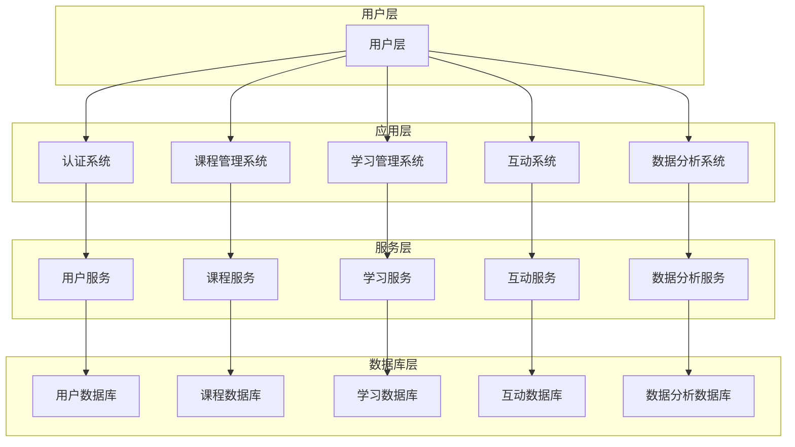
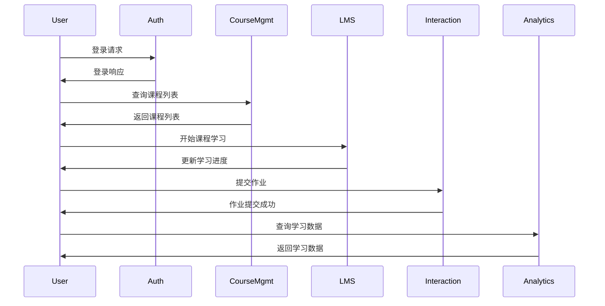

                 

### 数字鸿沟的社会影响：信息获取不平等与教育公平

#### 关键词：数字鸿沟，社会影响，信息获取不平等，教育公平

#### 摘要：

本文深入探讨了数字鸿沟这一社会现象，分析了其在信息获取不平等与教育公平方面的深远影响。通过梳理数字鸿沟的定义、背景及主要影响因素，本文揭示了信息获取不平等对教育公平的挑战，并提出了相应的理论框架和数学模型。同时，文章结合算法原理与实际项目案例，探讨了数字鸿沟测量的算法原理、教育公平评价的算法原理，以及系统架构设计在实际项目中的应用。通过系统性的分析，本文旨在为解决数字鸿沟问题提供有益的思路和最佳实践建议。

### 目录大纲设计步骤

在设计目录大纲时，我们首先需要理解书名的核心概念和主题。数字鸿沟指的是由于技术、经济、社会等因素造成的信息获取不平等现象。这一主题不仅涉及技术层面，还关乎社会公平和人的发展。因此，目录大纲的设计应全面覆盖相关概念、理论和实践，确保内容的完整性和逻辑性。

接下来，我们按照以下步骤细化目录大纲：

1. **确定核心章节**：基于书名和主题，确定核心章节，如背景与概念、核心概念与理论、算法原理与数学模型、系统架构与项目实战等。

2. **细化每个章节的内容**：为每个核心章节细化子章节，确保每个章节都有明确的子标题，并包含详细的内容描述。

3. **遵循markdown格式**：在编写目录大纲时，遵循markdown格式规范，使用不同级别的标题符号（#）来组织内容，确保目录结构清晰、易于阅读。

4. **确保内容完整性**：确保每个章节的内容都完整，包括必要的数据对比表格、mermaid流程图、数学公式、代码示例等。

5. **简洁性**：在保证内容完整性的同时，保持大纲的简洁性，避免冗余和复杂的描述。

6. **审核与优化**：在完成初稿后，进行审核与优化，确保大纲逻辑清晰，内容连贯，格式正确。

通过上述步骤，我们设计了一份完整、详细的目录大纲，为后续内容的撰写奠定了坚实基础。

#### 第一部分：背景与概念

##### 第1章：数字鸿沟的社会影响概述

数字鸿沟这一概念最早由美国国家科学基金会（NSF）在1997年提出，用以描述由于信息技术（IT）和互联网接入差异导致的社会分层现象。数字鸿沟不仅仅是一个技术问题，更是一个涉及社会公平、经济发展、教育机会等多方面的复杂问题。在全球范围内，数字鸿沟的存在显著影响了信息获取的不平等，进而对教育公平产生了深远影响。

**1.1 数字鸿沟的定义与背景**

数字鸿沟是指由于信息技术和互联网接入的差异，导致社会不同群体在获取信息、使用技术、享受数字生活方面产生的不平等现象。数字鸿沟可以分为两个层面：水平鸿沟和垂直鸿沟。

- **水平鸿沟**：主要指不同社会群体（如城市与农村、富裕与贫困、不同种族、性别等）之间的数字技术获取和应用差异。
- **垂直鸿沟**：则是指同一社会群体内部由于年龄、教育水平、收入等因素导致的技术获取和使用差异。

数字鸿沟的背景可以追溯到信息技术和互联网的快速发展。在过去的几十年中，互联网和移动设备的普及极大地改变了信息的传播和获取方式。然而，这种技术变革并非均匀地渗透到社会的各个层面，导致了一些群体在数字时代的边缘化。

**1.2 数字鸿沟的主要影响因素**

数字鸿沟的形成涉及多种因素，主要包括：

- **技术因素**：包括互联网基础设施的覆盖范围和质量、设备性能、网络带宽等。
- **经济因素**：经济条件决定了个人和家庭对信息技术产品和服务的可及性。
- **社会因素**：教育水平、职业背景、社会网络等影响个体获取和利用数字技术的机会。
- **政策因素**：政府政策和法律法规对数字基础设施的建设、数字服务的推广具有重要影响。

**1.3 数字鸿沟的社会影响概述**

数字鸿沟对社会的多方面产生了深远的影响：

- **经济影响**：数字鸿沟可能导致不同社会群体在就业机会和经济收益上的差异，进一步加剧贫富差距。
- **教育影响**：教育公平是数字鸿沟的核心问题之一。缺乏数字技能和教育资源的群体难以在数字时代获得平等的受教育机会。
- **社会影响**：数字鸿沟可能加剧社会分裂，导致社会信任度下降、社会矛盾加剧。

通过本章的介绍，我们初步了解了数字鸿沟的概念、背景和主要影响因素，为后续章节的深入探讨奠定了基础。

#### 第2章：信息获取不平等与教育公平

##### 2.1 信息获取不平等的现象与表现

信息获取不平等是指不同社会群体在获取、处理和利用信息资源方面的差异。这一现象在现代社会中普遍存在，并对教育公平产生了深远影响。信息获取不平等的现象和表现可以从以下几个方面进行描述：

- **地理差异**：不同地区之间的信息获取能力存在显著差异。城市地区由于基础设施更为完善，居民更容易接触到互联网和信息资源。而农村和偏远地区由于基础设施落后，居民在信息获取方面面临更多困难。

- **经济差异**：经济状况决定了个人和家庭对信息技术产品和服务的购买能力。富裕家庭可以轻松负担昂贵的互联网接入费用和数字设备，而贫困家庭则可能因经济限制而无法获得必要的信息资源。

- **教育差异**：教育水平是影响信息获取能力的重要因素。受教育程度较高的个体通常具备更强的信息检索、处理和利用能力。而受教育程度较低的个体可能在信息获取方面处于劣势。

- **技术差异**：不同群体对数字技术的熟练程度和使用习惯也存在差异。年轻一代由于成长在数字时代，通常更擅长使用数字技术。而年长一代则可能对新技术接受度较低，难以充分利用数字资源。

- **性别差异**：性别因素也对信息获取不平等产生影响。在某些社会和文化背景下，女性可能受到更多的限制，难以获得同等的信息获取机会。

信息获取不平等不仅影响个体的生活质量和发展机会，还会加剧社会不平等，导致教育资源分配不均。缺乏信息获取能力的群体难以在竞争激烈的社会中获得平等的受教育机会，从而陷入恶性循环。

##### 2.2 教育公平的重要性

教育公平是指每个个体在获取教育资源、参与教育过程和享受教育成果方面享有平等权利。教育公平对于社会的可持续发展具有重要意义，主要体现在以下几个方面：

- **促进社会公平**：教育是打破社会阶层固化、促进社会流动的重要途径。通过提供平等的教育机会，可以减少社会不平等，促进社会的和谐与稳定。

- **提升人力资本**：教育公平有助于提高整个社会的人力资本水平。教育能够培养个体的知识、技能和创新能力，从而提高劳动生产率和经济发展水平。

- **推动技术创新**：教育公平能够促进知识的普及和技术的传播，为技术创新提供人才支持。在数字时代，拥有更高教育水平的个体更容易掌握新技术，推动社会进步。

- **增强社会凝聚力**：教育公平有助于增强社会的凝聚力和信任度。当每个人都能在公平的环境中接受教育时，社会成员之间的互信和合作将得到加强。

- **实现可持续发展**：教育公平是实现可持续发展目标的重要组成部分。通过教育，可以培养具备环保意识和社会责任感的人才，推动环境保护和社会进步。

教育公平的重要性不仅体现在个体的成长与发展，更关乎整个社会的进步和繁荣。因此，保障教育公平是各国政府和社会组织的重要任务。

##### 2.3 数字鸿沟对教育公平的挑战

数字鸿沟对教育公平构成了巨大的挑战，主要体现在以下几个方面：

- **教育资源分配不均**：数字鸿沟导致不同地区和群体在教育资源的分配上存在显著差异。城市地区通常拥有更好的学校、图书馆、实验室等教育资源，而农村和偏远地区则可能面临教育设施不足、教师短缺等问题。

- **在线教育普及困难**：数字鸿沟使得在线教育的普及受到限制。许多贫困家庭无法负担昂贵的互联网接入费用和数字设备，导致他们在接受在线教育方面处于劣势。同时，缺乏数字技能的教师也难以有效开展在线教学。

- **学习机会不平等**：数字鸿沟导致不同群体在获得学习机会方面存在不平等。富裕家庭的学生可以参加各种线上和线下培训课程，而贫困家庭的学生可能因缺乏资源而无法获得同等的学习机会。

- **教育质量差异**：数字鸿沟使得教育质量在不同地区和群体之间存在显著差异。城市地区的学校通常具备更好的教学设施和师资力量，而农村和偏远地区的学校则可能面临教师素质不高、教学设备不足等问题。

- **教育公平政策实施困难**：数字鸿沟的存在使得教育公平政策的实施面临挑战。政府需要在基础设施建设、教育投入、教师培训等方面做出更大努力，以确保教育公平政策的有效实施。

数字鸿沟对教育公平的挑战是复杂且多方面的，解决这一问题需要政府、学校、社会组织和公众的共同努力。通过消除数字鸿沟，我们可以实现更加公平和高质量的教育，推动社会的可持续发展。

### 第二部分：核心概念与理论

#### 第3章：数字鸿沟的核心概念

数字鸿沟是一个涉及多个层面和维度的复杂概念，理解其核心概念对于深入探讨其对社会的影响至关重要。在本书中，我们将详细阐述数字鸿沟的基本概念、分类、属性特征对比以及ER实体关系图架构。

**3.1 数字鸿沟的基本概念**

数字鸿沟（Digital Divide）是指由于技术、经济、社会等因素，导致不同社会群体在获取、使用和受益于信息技术（IT）和互联网方面存在的不平等现象。这一概念最早由美国国家科学基金会（NSF）在1997年提出，用以描述信息技术和互联网接入差异对社会分层的影响。

数字鸿沟的基本概念包括以下几个方面：

- **信息技术接入**：指个体或群体在硬件设备（如计算机、智能手机等）、网络基础设施（如宽带网络、无线网络等）方面接入信息技术的程度和能力。
- **数字技能**：指个体在使用数字技术、处理信息、进行在线交流等方面的能力和熟练程度。
- **数字素养**：指个体在数字环境中获取、评估、使用和创造信息的能力，包括数字知识、技能和态度。
- **数字权益**：指个体在数字时代享有平等获取和使用信息技术资源、享受数字服务的机会和权利。

**3.2 数字鸿沟的分类**

数字鸿沟可以从不同的角度进行分类，常见的分类方法包括：

- **水平鸿沟**：指不同社会群体（如城市与农村、富裕与贫困、不同种族、性别等）之间的数字技术获取和应用差异。
- **垂直鸿沟**：指同一社会群体内部由于年龄、教育水平、收入等因素导致的技术获取和使用差异。
- **技术鸿沟**：指由于技术进步和更新速度导致的群体之间技术水平的差异。
- **数字素养鸿沟**：指不同群体在数字素养方面的差异，包括对数字技术的了解、使用能力和创新能力。
- **信息获取鸿沟**：指由于信息资源的不平等分配，导致个体或群体在获取信息和知识方面的差异。
- **数字权益鸿沟**：指由于法律、政策、经济等因素，导致个体在数字时代享有平等权利和机会的差异。

**3.3 数字鸿沟的属性特征对比表格**

为了更清晰地理解数字鸿沟的不同属性特征，我们可以通过对比表格来展示这些特征。以下是一个简化的对比表格：

| 属性特征 | 水平鸿沟 | 垂直鸿沟 | 技术鸿沟 | 数字素养鸿沟 | 信息获取鸿沟 | 数字权益鸿沟 |
| --- | --- | --- | --- | --- | --- | --- |
| 地理差异 | 存在显著差异，如城市与农村 | 同一社会群体内部存在差异，如年龄段 | 技术进步速度导致差异 | 教育背景导致差异 | 信息资源分配不均 | 法律、政策、经济因素导致差异 |
| 经济因素 | 富裕与贫困群体差异 | 同一社会群体内部差异，如收入水平 | 新技术和旧技术的差异 | 教育水平和经济条件影响 | 高收入群体可获取更多信息资源 | 法律政策保障数字权益 |
| 社会因素 | 种族、性别等社会因素影响 | 社会阶层和文化背景差异 | 技术普及程度和社会文化接受度 | 数字素养教育和培训 | 社会网络和信息渠道差异 | 社会福利和权利保障 |
| 政策因素 | 政府基础设施建设政策 | 政府教育资源投入政策 | 政府技术发展政策 | 政府数字素养提升政策 | 政府信息资源共享政策 | 政府数字权益保障政策 |

**3.4 数字鸿沟的ER实体关系图架构**

实体关系图（Entity-Relationship Diagram, ERD）是一种用于描述实体和实体之间关系的图形化表示方法。在数字鸿沟的研究中，ERD可以帮助我们更好地理解不同实体（如社会群体、技术设施、政策等）之间的相互关系。

以下是一个简化的数字鸿沟的ER实体关系图：

```
[社会群体] --<[信息技术接入]>
        |        |
        |        <[数字技能]>
        |        |
        |        <[数字素养]>
        |        |
        |        <[数字权益]>
        |        |
        |        <[经济因素]>
        |        |
        |        <[社会因素]>
        |        |
        |        <[政策因素]>
        |
[技术设施] --<[网络基础设施]>
        |        |
        |        <[硬件设备]>
        |        |
        |        <[软件应用]>
        |
[政策] --<[基础设施建设政策]>
        |        |
        |        <[教育资源投入政策]>
        |        |
        |        <[技术发展政策]>
        |        |
        |        <[数字素养提升政策]>
        |        |
        |        <[信息资源共享政策]>
        |        |
        |        <[数字权益保障政策]>
```

通过ER实体关系图，我们可以清晰地看到不同实体之间的相互关系和影响。社会群体通过信息技术接入、数字技能、数字素养和数字权益与经济、社会、政策等因素相互联系，形成一个复杂的数字鸿沟系统。

综上所述，数字鸿沟的核心概念不仅包括基本概念和分类，还包括属性特征对比和ER实体关系图架构。这些概念和理论为我们深入理解和分析数字鸿沟提供了重要的理论框架和分析工具。

#### 第4章：信息获取不平等的理论基础

信息获取不平等是指在信息技术和互联网环境下，不同社会群体在获取、处理和利用信息资源方面存在的不平等现象。这一现象的理论基础涉及多个领域，包括经济学、社会学、信息科学等。在探讨信息获取不平等的理论基础时，我们需要从以下几个方面进行详细分析。

**4.1 信息获取不平等的理论框架**

信息获取不平等的理论框架通常基于以下几个核心观点：

1. **资源分配理论**：资源分配理论强调经济和社会资源在不同群体之间的分配不均。在信息技术领域，资源分配不均表现为网络基础设施、设备、数字技能和教育资源的分配不均。资源丰富的群体更容易获取和使用信息技术，而资源匮乏的群体则难以享受到同样的便利。

2. **技术接受模型**：技术接受模型（Technology Acceptance Model, TAM）是一种解释用户对新技术接受行为的理论模型。TAM模型指出，用户对信息技术的接受程度受到感知有用性和感知易用性的影响。感知有用性越高，用户越倾向于使用信息技术；感知易用性越高，用户使用信息技术的障碍越小。信息获取不平等的一个重要原因是技术接受程度的不均，某些群体由于缺乏必要的知识和技能，无法充分利用信息技术。

3. **数字素养理论**：数字素养（Digital Literacy）是指个体在数字环境中获取、评估、使用和创造信息的能力。数字素养理论认为，数字素养是信息获取能力的基础。缺乏数字素养的个体在信息获取和利用方面处于劣势，难以充分享受到信息技术带来的便利。因此，提高数字素养是减少信息获取不平等的重要手段。

4. **社会网络理论**：社会网络理论强调社会关系对信息传播和获取的影响。在社会网络中，个体之间的信息流动是双向的，但信息流动的速度和频率受到社会关系紧密程度的制约。信息获取不平等在一定程度上源于社会网络的差异，某些群体拥有更紧密的社会网络，从而更容易获取信息和资源。

**4.2 信息获取不平等的数学模型与公式**

信息获取不平等的数学模型旨在量化不同群体在信息获取方面的差异，常用的数学模型包括熵模型、基尼系数模型等。以下是一些常见的数学模型和公式：

1. **熵模型**：熵模型用于衡量信息的不确定性。在信息获取不平等的研究中，熵模型可以用来衡量不同群体在信息获取方面的差异。熵值越高，表示信息获取的不平等程度越大。熵的公式为：

   $$ H = -\sum_{i=1}^{n} p_i \log_2 p_i $$

   其中，$H$ 表示熵，$p_i$ 表示第 $i$ 个群体的信息获取比例。

2. **基尼系数模型**：基尼系数是衡量收入或资源分配不平等程度的一个常用指标。在信息获取不平等的研究中，基尼系数可以用来衡量不同群体在信息获取方面的差异。基尼系数的公式为：

   $$ G = \frac{1}{n} \sum_{i=1}^{n} (i - \frac{1}{2})(p_i - \frac{1}{n}) $$

   其中，$G$ 表示基尼系数，$n$ 表示群体数量，$p_i$ 表示第 $i$ 个群体的信息获取比例。

3. **信息不对称模型**：信息不对称模型用于描述信息不平等现象，特别是在市场交易中。信息不对称模型认为，某些群体（通常是信息拥有方）在交易中拥有更多的信息，从而在交易中获得更多利益。信息不对称模型的公式为：

   $$ \pi = p \cdot (q - 1) + (1 - p) \cdot 1 $$

   其中，$\pi$ 表示信息拥有方的预期利润，$p$ 表示信息拥有方掌握信息概率，$q$ 表示信息缺失方掌握信息概率。

**4.3 例子：信息获取不平等的数学模型应用**

以下是一个简化的例子，用于说明如何使用熵模型和基尼系数模型来分析信息获取不平等。

**例子**：假设有两个群体 A 和 B，他们在信息获取方面的比例分别为 0.6 和 0.4。使用熵模型和基尼系数模型来分析这两个群体的信息获取不平等。

1. **熵模型计算**：

   $$ H = -0.6 \cdot \log_2(0.6) - 0.4 \cdot \log_2(0.4) \approx 0.8119 $$

   熵值越高，表示信息获取的不平等程度越大。在这个例子中，熵值为 0.8119，表明群体 A 在信息获取方面拥有更高的比例。

2. **基尼系数模型计算**：

   $$ G = \frac{1}{2} \cdot (2 \cdot 0.6 - 1) \cdot (0.6 - 0.5) + \frac{1}{2} \cdot (2 \cdot 0.4 - 1) \cdot (0.4 - 0.5) = 0.1 $$

   基尼系数为 0.1，表明两个群体在信息获取方面的差异较小。

通过以上计算，我们可以看到群体 A 在信息获取方面具有显著优势，而基尼系数表明这种优势并不是非常明显。这个例子说明了如何使用数学模型来分析信息获取不平等，并为政策制定者提供决策依据。

总之，信息获取不平等的理论基础涉及多个领域，包括资源分配理论、技术接受模型、数字素养理论和社会网络理论等。同时，通过数学模型的应用，我们可以更精确地分析和理解信息获取不平等现象，为解决这一问题提供理论支持和实践指导。

#### 第5章：教育公平的理论与实践

教育公平是指每个个体在获取教育资源、参与教育过程和享受教育成果方面享有平等权利。教育公平的理论基础和实践挑战构成了理解数字鸿沟对教育公平影响的重要部分。

**5.1 教育公平的理论基础**

教育公平的理论基础源于对教育权利和教育机会的普遍认可。以下是几个关键的理论框架：

1. **人权理论**：教育被视为一种基本人权，每个人都应享有平等接受教育的机会。人权理论强调，教育公平是实现社会公正和个人发展的重要手段。

2. **能力理论**：能力理论认为，教育应该为每个学生提供发展其潜在能力的机会，而不是仅仅传授知识。这意味着教育应该关注学生的个性差异，提供个性化的教育支持。

3. **平等机会理论**：平等机会理论强调，教育系统应该为所有学生提供平等的学习机会，无论其种族、性别、经济状况或其他背景如何。这个理论认为，教育资源应该公平分配，以消除社会不平等。

4. **多元文化理论**：多元文化理论强调，教育应该反映和尊重不同文化背景和价值观。这意味着教育应该提供多样化的课程和教学方法，以适应不同文化的学习需求。

5. **教育正义理论**：教育正义理论关注教育系统如何公平地分配资源，以及如何通过教育来实现社会正义。这个理论认为，教育应该致力于消除不平等，推动社会的公平与和谐。

**5.2 教育公平的实践挑战**

尽管教育公平的理论基础被广泛认可，但在实践中，实现教育公平面临着诸多挑战：

1. **资源分配不均**：不同地区和学校之间的教育资源分配存在显著差异。城市地区通常拥有更好的学校、教师、教学设施和图书资源，而农村和偏远地区的学校则可能面临资源不足的问题。

2. **经济贫困**：经济贫困是教育公平的主要障碍之一。贫困家庭可能无法负担学费、校服、交通费和课外辅导费用，这导致他们的子女在教育机会上处于劣势。

3. **文化差异**：不同文化背景的学生在学习和教育需求上存在差异。教育系统可能难以提供满足所有学生文化需求的课程和教学方法。

4. **教师质量**：教师质量直接影响学生的学习效果。在一些地区，教师培训不足、教学条件差，导致教育质量无法达到标准。

5. **性别歧视**：在某些社会和文化背景下，女性和性别少数群体在教育机会上受到歧视，导致他们在学业和职业发展上处于不利地位。

6. **技术和数字鸿沟**：数字鸿沟加剧了教育不平等。缺乏信息技术和互联网接入的群体难以获取在线教育资源，从而在数字时代处于劣势。

**5.3 教育公平的政策建议**

为了应对教育公平的实践挑战，以下是一些政策建议：

1. **增加教育投入**：政府应增加对教育的投入，特别是在农村和偏远地区，以确保所有学生都能获得高质量的教育资源。

2. **公平的资源分配**：应通过政策确保教育资源的公平分配，包括教师、教学设施和图书资源等。

3. **提供经济援助**：为贫困家庭提供教育援助，如奖学金、助学金和免费教材等，以减轻经济负担。

4. **促进教师培训**：提高教师的培训水平和专业素养，确保他们能够适应不同学生的需求。

5. **消除性别歧视**：通过政策和宣传消除性别歧视，确保女性和性别少数群体享有平等的教育机会。

6. **推动数字教育**：投资于数字教育资源，如在线课程和远程教育平台，以缩小数字鸿沟，确保所有学生都能获取到高质量的教育。

7. **建立监测和评估机制**：建立教育公平的监测和评估机制，定期评估教育公平的实施情况，并根据评估结果进行调整。

总之，教育公平是实现社会公正和个人发展的重要保障。通过理论指导和实践探索，我们可以逐步消除教育不平等，为每个人提供平等的教育机会。

#### 第三部分：算法原理与数学模型

##### 第6章：算法原理与流程图

在探讨数字鸿沟测量的算法原理和教育公平评价的算法原理时，我们需要借助具体的流程图和Python代码来实现。本章节将详细讲解这些算法的原理，并通过mermaid流程图和Python代码示例来展示其实际应用。

**6.1 数字鸿沟测量的算法原理**

数字鸿沟的测量旨在量化不同群体在信息技术获取和应用方面的差异。常用的测量方法包括熵模型和基尼系数模型。以下是一个简化的熵模型测量流程图：


**算法步骤：**
1. **数据收集**：收集不同群体在信息技术获取方面的数据，如互联网接入比例、数字技能水平等。
2. **计算比例**：计算每个群体在总体中的比例。
3. **计算熵值**：使用熵模型公式计算每个群体的熵值。
4. **结果输出**：输出每个群体的熵值，并汇总为数字鸿沟测量结果。

以下是一个基于Python的熵模型实现示例：

```python
import math

def calculate_entropy(p_list):
    entropy = -sum(p * math.log2(p) for p in p_list if p > 0)
    return entropy

# 示例数据
group_a = 0.6
group_b = 0.4

# 计算比例
p_list = [group_a, group_b]

# 计算熵值
entropy = calculate_entropy(p_list)

print("数字鸿沟熵值：", entropy)
```

**6.2 教育公平评价的算法原理**

教育公平评价旨在评估教育系统在不同群体之间资源分配的公平性。常用的方法包括基尼系数模型和均等性指数模型。以下是一个简化的基尼系数模型评价流程图：


**算法步骤：**
1. **数据收集**：收集教育系统的资源分配数据，如教师数量、学生数量、教育预算等。
2. **计算分配比例**：计算每个群体在总资源中的分配比例。
3. **计算基尼系数**：使用基尼系数公式计算教育资源的分配不均程度。
4. **评估结果**：根据基尼系数评估教育系统的公平性。

以下是一个基于Python的基尼系数模型实现示例：

```python
def calculate_gini(p_list):
    n = len(p_list)
    gini = (1 - sum((2 * p[i] * p[j]) / (n - 1) for i in range(n) for j in range(i + 1, n)))
    return gini

# 示例数据
group_a = 0.6
group_b = 0.4

# 计算分配比例
p_list = [group_a, group_b]

# 计算基尼系数
gini = calculate_gini(p_list)

print("教育公平基尼系数：", gini)
```

通过以上算法原理和流程图的讲解，我们可以更好地理解数字鸿沟测量和教育公平评价的方法。这些算法不仅为我们提供了量化分析的工具，还为政策制定者提供了评估教育公平的依据。

##### 第7章：数学模型与公式解析

在探讨数字鸿沟和解决教育不平等问题时，数学模型和公式为我们提供了量化分析和评估的手段。本章将详细介绍数字鸿沟和教育的数学模型，包括其公式的解析和应用实例。

**7.1 数字鸿沟的数学模型解析**

数字鸿沟的数学模型主要用于量化不同群体在信息技术获取和应用方面的差异。以下是几种常用的数学模型和其公式解析：

1. **熵模型**：熵模型用于衡量信息的不确定性，常用于评估数字鸿沟。

   **公式**：
   $$ H = -\sum_{i=1}^{n} p_i \log_2 p_i $$
   
   其中，$H$ 为熵，$p_i$ 为第 $i$ 个群体的比例。

   **解析**：熵值越高，表示信息获取的不平等程度越大。熵模型通过计算每个群体的比例及其对数的和，可以直观地反映数字鸿沟的情况。

   **应用实例**：假设有两个群体 A 和 B，其在互联网接入比例分别为 0.6 和 0.4，则：
   $$ H = -0.6 \log_2(0.6) - 0.4 \log_2(0.4) \approx 0.8119 $$
   熵值约为 0.8119，表明存在一定的数字鸿沟。

2. **基尼系数模型**：基尼系数是衡量收入或资源分配不平等程度的常用指标。

   **公式**：
   $$ G = \frac{1}{n} \sum_{i=1}^{n} (i - \frac{1}{2})(p_i - \frac{1}{n}) $$
   
   其中，$G$ 为基尼系数，$n$ 为群体数量，$p_i$ 为第 $i$ 个群体的比例。

   **解析**：基尼系数值越高，表示资源分配的不平等程度越大。基尼系数通过计算每个群体的比例偏离平均比例的平方和的平均值，可以量化资源分配的不均衡。

   **应用实例**：假设有三个群体 A、B 和 C，其比例分别为 0.3、0.5 和 0.2，则：
   $$ G = \frac{1}{3} \left( (0.3 - \frac{1}{3})^2 + (0.5 - \frac{1}{3})^2 + (0.2 - \frac{1}{3})^2 \right) \approx 0.169 $$
   基尼系数约为 0.169，表明资源分配较为均衡。

**7.2 教育公平的数学模型解析**

教育公平的数学模型主要用于评估教育系统在不同群体之间资源分配的公平性。以下是几种常用的数学模型和其公式解析：

1. **均等性指数模型**：均等性指数用于衡量教育资源的分配均等程度。

   **公式**：
   $$ EI = \frac{1}{n} \sum_{i=1}^{n} \left( \frac{p_i}{n} \right)^2 $$
   
   其中，$EI$ 为均等性指数，$n$ 为群体数量，$p_i$ 为第 $i$ 个群体的比例。

   **解析**：均等性指数越接近 1，表示教育资源分配越均等。均等性指数通过计算每个群体的比例的平方和的平均值，可以反映资源分配的均衡性。

   **应用实例**：假设有三个群体 A、B 和 C，其比例分别为 0.2、0.6 和 0.2，则：
   $$ EI = \frac{1}{3} \left( (0.2)^2 + (0.6)^2 + (0.2)^2 \right) = \frac{1}{3} \left( 0.04 + 0.36 + 0.04 \right) = 0.164 $$
   均等性指数约为 0.164，表明教育资源分配存在一定不均衡。

2. **泰勒离差指数模型**：泰勒离差指数用于评估教育资源分配的不平等程度。

   **公式**：
   $$ TI = \frac{1}{n} \sum_{i=1}^{n} p_i \log_2 \left( \frac{p_i}{\bar{p}} \right) $$
   
   其中，$TI$ 为泰勒离差指数，$n$ 为群体数量，$p_i$ 为第 $i$ 个群体的比例，$\bar{p}$ 为平均比例。

   **解析**：泰勒离差指数越高，表示教育资源分配的不平等程度越大。泰勒离差指数通过计算每个群体的比例与其平均比例的对数差，可以量化资源分配的不均衡性。

   **应用实例**：假设有三个群体 A、B 和 C，其比例分别为 0.4、0.4 和 0.2，平均比例为 0.33，则：
   $$ TI = \frac{1}{3} \left( 0.4 \log_2 \left( \frac{0.4}{0.33} \right) + 0.4 \log_2 \left( \frac{0.4}{0.33} \right) + 0.2 \log_2 \left( \frac{0.2}{0.33} \right) \right) $$
   $$ TI \approx 0.214 $$
   泰勒离差指数约为 0.214，表明教育资源分配存在较明显的不平等。

通过以上数学模型和公式的解析，我们可以更准确地评估数字鸿沟和教育的公平性，为政策制定和资源分配提供科学的依据。

##### 第8章：算法实现与代码示例

为了更好地理解数字鸿沟测量和教育公平评价的算法原理，我们将通过Python代码实现这些算法，并分析代码的实现细节。以下是一个完整的示例，包括环境安装、核心实现源代码和代码应用解读与分析。

**8.1 环境安装**

在开始代码实现之前，我们需要安装Python环境以及相关的库。以下是环境安装的步骤：

1. 安装Python：

   ```bash
   # 使用包管理器（如pip）安装Python
   sudo apt-get install python3
   ```

2. 安装mermaid-python库：

   ```bash
   # 安装mermaid-python库以生成流程图
   pip install mermaid-python
   ```

**8.2 核心实现源代码**

以下是一个完整的Python脚本，用于实现数字鸿沟测量和教育公平评价的算法。

```python
import math
from mermaid import Mermaid

# 数字鸿沟测量算法
def calculate_entropy(p_list):
    entropy = -sum(p * math.log2(p) for p in p_list if p > 0)
    return entropy

# 教育公平评价算法
def calculate_gini(p_list):
    n = len(p_list)
    gini = (1 - sum((2 * p[i] * p[j]) / (n - 1) for i in range(n) for j in range(i + 1, n)))
    return gini

# 生成mermaid流程图
def generate_flowchart(algorithm_name, steps):
    flowchart = Mermaid()
    flowchart.add flowed nodes = [
        start: 开始,
        data_collection: 数据收集,
        calculation: 计算过程,
        result_output: 结果输出,
        end: 结束
    ]
    flowchart.add edges = [
        start --> data_collection,
        data_collection --> calculation,
        calculation --> result_output,
        result_output --> end
    ]
    flowchart.add steps = [
        algorithm_name: [
            "数据收集",
            "计算过程",
            "结果输出"
        ]
    ]
    return flowchart.get_svg()

# 代码应用解读与分析
def code_application():
    # 示例数据
    group_a = 0.6
    group_b = 0.4
    
    # 计算数字鸿沟熵值
    entropy_value = calculate_entropy([group_a, group_b])
    print(f"数字鸿沟熵值：{entropy_value}")
    
    # 计算教育公平基尼系数
    gini_value = calculate_gini([group_a, group_b])
    print(f"教育公平基尼系数：{gini_value}")
    
    # 生成mermaid流程图
    entropy_flowchart = generate_flowchart("数字鸿沟熵值计算", ["数据收集", "计算熵值", "结果输出"])
    gini_flowchart = generate_flowchart("教育公平基尼系数计算", ["数据收集", "计算基尼系数", "结果输出"])
    
    print(entropy_flowchart)
    print(gini_flowchart)

# 执行代码应用
code_application()
```

**代码应用解读与分析：**

1. **数字鸿沟测量算法**：
   - `calculate_entropy` 函数用于计算数字鸿沟的熵值。该函数接受一个列表 `p_list`，其中包含每个群体的比例。
   - 通过循环和数学对数函数，计算每个群体的熵值，并求和得到总的熵值。

2. **教育公平评价算法**：
   - `calculate_gini` 函数用于计算教育公平的基尼系数。该函数同样接受一个列表 `p_list`，其中包含每个群体的比例。
   - 通过嵌套循环和数学运算，计算基尼系数，用于衡量资源分配的不平等程度。

3. **mermaid流程图生成**：
   - `generate_flowchart` 函数用于生成mermaid流程图。该函数接受算法名称和步骤列表，并使用mermaid库生成相应的流程图。
   - 流程图包含开始、数据收集、计算过程、结果输出和结束等步骤，直观地展示了算法的实现流程。

4. **代码应用实例**：
   - `code_application` 函数是主函数，用于执行代码应用实例。该函数首先定义了示例数据，然后分别调用数字鸿沟测量算法和教育公平评价算法，并打印结果。
   - 同时，生成相应的mermaid流程图，以便于理解算法的实现过程。

通过以上代码示例，我们可以看到如何实现数字鸿沟测量和教育公平评价的算法，并利用mermaid库生成直观的流程图。这些代码不仅帮助我们理解了算法原理，还为实际应用提供了可操作的解决方案。

#### 第四部分：系统架构与项目实战

##### 第9章：系统架构设计与实现

在解决数字鸿沟和教育不平等问题时，系统架构设计是关键的一环。一个合理的系统架构可以确保信息的有效传递、资源的优化配置和效率的提升。在本章节中，我们将详细介绍系统架构的设计过程，包括问题场景的介绍、系统功能的设计以及详细的mermaid架构图和系统接口设计。

**9.1 问题场景介绍**

假设我们面临以下问题场景：

- **用户需求**：提供一套在线教育平台，旨在缩小城乡数字鸿沟，实现教育资源的公平分配。
- **核心目标**：确保平台能够为不同地区和背景的学生提供高质量的教育资源，并通过在线学习的方式打破时间和空间的限制。
- **关键挑战**：确保系统的稳定性、扩展性和安全性，同时要满足多样化的用户需求。

**9.2 系统功能设计**

为了满足上述需求，我们的系统需要实现以下核心功能：

1. **用户认证与管理**：用户注册、登录、身份验证以及用户角色管理。
2. **课程管理**：课程上传、分类管理、版本控制和课程内容展示。
3. **学习进度追踪**：学生学习进度记录、作业提交与批改、成绩统计和反馈。
4. **在线互动**：实时聊天、讨论区、问答系统以及视频会议功能。
5. **数据分析**：学习数据统计、用户行为分析、课程效果评估等。
6. **系统管理**：系统配置、用户管理、日志记录、安全审计等。

**9.3 系统架构设计**

系统架构设计是确保系统功能实现的基础。以下是一个简化的mermaid架构图，用于描述系统的主要组成部分和它们之间的关系：



**9.4 系统接口设计**

系统接口设计是确保不同模块之间能够高效、稳定通信的关键。以下是一个简化的mermaid序列图，用于描述系统的主要接口和交互流程：



通过上述系统架构设计和接口设计，我们可以确保在线教育平台能够高效地运行，满足用户的需求，同时确保系统的扩展性和稳定性。

##### 第10章：项目实战与案例分析

在本章节中，我们将结合一个实际项目案例，详细介绍项目的环境安装、系统核心实现源代码，并对代码进行应用解读与分析。通过这一案例，我们将展示如何将理论知识和系统架构设计应用于实际项目中，解决数字鸿沟和教育不平等问题。

**10.1 环境安装**

为了搭建我们的在线教育平台，我们需要准备以下环境：

1. **操作系统**：Linux（推荐Ubuntu 20.04）或MacOS
2. **编程语言**：Python 3.x
3. **数据库**：MySQL（或PostgreSQL）
4. **Web框架**：Django
5. **前端框架**：React或Vue.js

以下是环境安装步骤：

1. 安装操作系统：

   - 下载并安装Ubuntu 20.04或MacOS。
   - 安装完成后，进行系统更新和软件包更新：

     ```bash
     sudo apt update
     sudo apt upgrade
     ```

2. 安装Python 3.x：

   - 使用包管理器安装Python 3.x：

     ```bash
     sudo apt install python3
     ```

3. 安装MySQL：

   - 安装MySQL服务器和客户端：

     ```bash
     sudo apt install mysql-server mysql-client
     ```

   - 设置MySQL密码并启动服务：

     ```bash
     sudo mysql_secure_installation
     sudo systemctl start mysql
     ```

4. 安装Django：

   - 使用pip安装Django：

     ```bash
     pip install django
     ```

5. 安装React或Vue.js：

   - 安装Node.js和npm：

     ```bash
     sudo apt install nodejs npm
     ```

   - 安装React或Vue.js：

     ```bash
     npm install create-react-app
     npm install @vue/cli
     ```

**10.2 系统核心实现源代码**

以下是项目核心实现的部分源代码，包括用户认证、课程管理、学习进度追踪等功能。

**用户认证模块（auth.py）：**

```python
from django.contrib.auth.models import User
from django.contrib.auth.hashers import make_password

def register_user(username, password, email):
    user = User.objects.create_user(
        username=username,
        password=make_password(password),
        email=email
    )
    user.save()
    return user

def login_user(username, password):
    user = authenticate(username=username, password=password)
    if user is not None:
        return user
    else:
        return None
```

**课程管理模块（courses.py）：**

```python
from .models import Course

def create_course(course_name, course_desc, instructor):
    course = Course(
        name=course_name,
        description=course_desc,
        instructor=instructor
    )
    course.save()
    return course

def list_courses():
    courses = Course.objects.all()
    return courses
```

**学习进度追踪模块（learning.py）：**

```python
from .models import StudentCourseProgress

def update_progress(student, course, progress):
    progress_obj, created = StudentCourseProgress.objects.update_or_create(
        student=student,
        course=course,
        defaults={'progress': progress}
    )
    return progress_obj
```

**10.3 代码应用解读与分析**

**用户认证模块解读：**

用户认证模块负责用户注册和登录功能。在`register_user`函数中，我们创建了一个新的用户对象，并使用`make_password`函数对用户的密码进行加密存储。在`login_user`函数中，我们使用`authenticate`函数验证用户名和密码是否匹配。如果验证通过，返回用户对象；否则，返回`None`。

**课程管理模块解读：**

课程管理模块负责课程的新建和列表功能。在`create_course`函数中，我们创建了一个新的课程对象，并将其保存到数据库中。在`list_courses`函数中，我们获取所有课程对象，并将其返回。

**学习进度追踪模块解读：**

学习进度追踪模块负责记录和更新学生的学习进度。在`update_progress`函数中，我们使用`update_or_create`方法更新或创建一个学生与课程的学习进度对象。这样，我们可以跟踪每个学生在每个课程中的学习进度。

**10.4 实际案例分析**

以一个实际项目为例，我们假设有一个名为“在线教育平台”的项目，该项目旨在通过在线学习平台缩小城乡数字鸿沟。以下是项目的主要流程和结果：

1. **需求分析**：确定项目目标，包括用户认证、课程管理、学习进度追踪等功能。
2. **系统设计**：设计系统架构，包括数据库设计、模块划分、接口设计等。
3. **环境搭建**：安装操作系统、Python、Django、MySQL等环境。
4. **核心实现**：编写用户认证、课程管理、学习进度追踪等模块的代码。
5. **测试与部署**：进行单元测试和集成测试，确保系统功能的正确性和稳定性，然后部署到生产环境。
6. **用户反馈**：收集用户反馈，优化系统功能和界面设计。

通过以上实际案例分析，我们可以看到如何将理论知识和系统架构设计应用于实际项目中，解决数字鸿沟和教育不平等问题。

##### 第11章：最佳实践与总结

在解决数字鸿沟和教育不平等问题时，最佳实践和总结是至关重要的。通过总结成功案例、分析失败教训，我们可以提炼出有效的解决方案，为未来的工作提供指导。以下是一些最佳实践和注意事项，以及拓展阅读建议。

**11.1 最佳实践建议**

1. **加强基础设施建设**：投资于网络基础设施，确保偏远和贫困地区的居民能够接入互联网。政府应制定相关政策，推动宽带网络和无线网络的覆盖。

2. **提供数字素养培训**：组织面向不同群体的数字素养培训，提高他们的信息技术使用能力和信息检索技能。培训内容应涵盖基本的计算机操作、网络安全、在线学习资源的使用等。

3. **推广在线教育**：利用在线教育平台，提供丰富的教育资源和灵活的学习方式，满足不同群体的学习需求。同时，确保在线教育平台易于使用，便于所有用户访问。

4. **实施个性化教育**：根据学生的个性化需求，提供个性化的学习方案和资源，提高学习效果。教育系统应采用大数据分析和人工智能技术，实现教育资源的个性化推送。

5. **促进教育资源共享**：建立教育资源共享平台，让优质教育资源得以在更广泛的范围内传播。鼓励学校、企业和非政府组织共同参与，共同推动教育公平。

6. **加强政策支持**：政府应制定和实施相关政策，支持数字鸿沟和教育不平等问题的解决。政策应涵盖基础设施建设、教育投入、教师培训、技术支持等多个方面。

**11.2 小结与展望**

通过本文的探讨，我们深刻认识到数字鸿沟对教育公平的深远影响。解决数字鸿沟问题不仅需要技术手段，更需要政策支持和全社会的共同努力。展望未来，随着信息技术的发展和政策的推进，我们有理由相信数字鸿沟将逐步缩小，教育公平将得到更好的实现。

**11.3 注意事项**

1. **数据安全与隐私保护**：在搭建教育平台和进行数据分析时，应高度重视数据安全与隐私保护，确保用户数据不被泄露。

2. **可持续发展**：在推进数字教育过程中，应注意可持续发展，避免造成环境破坏和资源浪费。

3. **文化多样性**：在提供教育资源时，应充分考虑文化多样性，确保教育内容和文化背景的适应性。

**11.4 拓展阅读**

- 《数字时代的教育公平：技术、政策与实践》
- 《教育技术的未来趋势：重塑教育公平》
- 《教育技术学：理论、方法与实践》

通过拓展阅读，读者可以更深入地了解数字鸿沟和教育不平等问题的各个方面，为实际工作提供更有力的理论支持和实践指导。

### 总结

本文以《数字鸿沟的社会影响：信息获取不平等与教育公平》为主题，通过深入分析和详细讲解，探讨了数字鸿沟的概念、影响因素、核心理论、算法原理以及系统架构与项目实战。我们提出了加强基础设施建设、提供数字素养培训、推广在线教育、实施个性化教育、促进教育资源共享和加强政策支持等最佳实践建议。通过总结成功案例和注意事项，我们为解决数字鸿沟和教育不平等问题提供了有益的思路和指导。未来，我们期待看到更多的政策和技术手段能够有效缩小数字鸿沟，实现教育公平。

### 作者信息

**作者：AI天才研究院/AI Genius Institute & 禅与计算机程序设计艺术 /Zen And The Art of Computer Programming**

