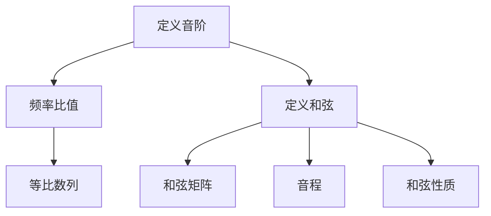
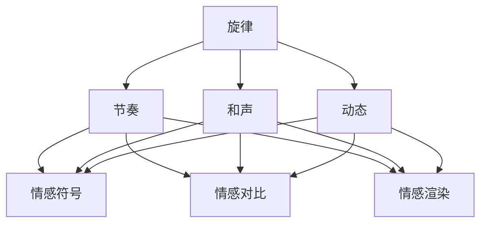

                 

### 1.1 研究背景与意义

#### 1.1.1 数学与音乐的关系

数学与音乐自古以来就有着紧密的联系。古希腊哲学家毕达哥拉斯是最早提出数学与音乐关系的思想家之一。他通过实验发现，乐器的音调高低与弦的长短成比例，从而形成了音阶的基本理论。这一发现奠定了音乐与数学结合的基石，并逐渐发展出关于音程、和弦等音乐理论，而这些理论无不依赖于数学的严谨推导。

在历史上，许多伟大的数学家和音乐家也对二者之间的联系进行了深入的探讨。例如，数学家莱昂哈德·欧拉在18世纪就研究了音乐理论，并提出了欧拉图，这种图形结构在音乐和弦分析中得到了应用。此外，音乐家如巴赫、莫扎特等人在创作音乐时也运用了数学的对称性和比例关系，使得他们的作品呈现出数学上的和谐美感。

在现代，随着科学技术的发展，数学与音乐的结合变得更加紧密。例如，计算机科学中算法的运用使得音乐生成和编辑变得更加精确和高效。机器学习和人工智能技术更是通过分析大量的音乐数据，揭示了音乐中的数学规律，为音乐创作和欣赏提供了新的视角和方法。

#### 1.1.2 情感体验在音乐欣赏中的作用

音乐欣赏不仅仅是对音符的听觉感知，更是一种深层次的情感体验。情感体验在音乐欣赏中起着至关重要的作用，它不仅决定了个体对音乐的喜好，还影响了音乐创作的风格和效果。心理学研究指出，音乐能够触发人类大脑中的情感中枢，从而产生愉悦、悲伤、激动等情感反应。

情感体验在音乐欣赏中的作用主要体现在以下几个方面：

1. **情绪调节**：音乐可以通过旋律、节奏和和声等因素调节人的情绪。例如，欢快的音乐可以提升人的情绪，使人感到愉悦和兴奋；而缓慢的音乐则可以平复情绪，使人感到宁静和放松。

2. **记忆增强**：研究表明，情感体验能够增强记忆，使人更容易记住喜欢的音乐作品。这种记忆不仅是对音乐本身的记忆，还可能包括与音乐相关的个人经历和情感。

3. **社交互动**：音乐欣赏常常是集体活动的一部分，它能够促进人与人之间的情感交流和社交互动。在音乐会、音乐派对等场合，音乐成为了一种连接人与人之间的情感纽带。

4. **心理治疗**：音乐具有治疗功能，可以用于心理治疗和情绪调节。例如，通过听特定的音乐，可以帮助缓解焦虑、抑郁等情绪问题。

#### 1.1.3 数学与音乐结合研究的现状与挑战

尽管数学与音乐的结合具有深远的意义，但相关领域的研究仍然面临诸多挑战。以下是一些研究现状与挑战：

1. **理论基础**：虽然数学与音乐的关系已有较长时间的探讨，但系统的理论基础仍然不足。如何从数学角度更全面、深入地理解音乐，仍需要进一步的研究。

2. **跨学科融合**：数学与音乐研究往往需要跨学科的合作。这包括音乐学、心理学、计算机科学等多个领域的知识。如何有效地整合这些知识，形成统一的理论框架，是一个重要的研究课题。

3. **数据分析方法**：随着大数据和人工智能技术的发展，如何利用这些技术对音乐数据进行深入分析，揭示其背后的数学规律，是当前研究的一个重要方向。

4. **实际应用**：数学与音乐结合的研究成果如何应用到实际的音乐创作和欣赏中，如何提高音乐作品的情感表达和审美效果，是另一个重要的研究问题。

总之，数学与音乐结合的研究不仅具有重要的理论意义，还有广泛的应用前景。通过深入探讨二者的关系，我们可以更好地理解音乐的本质，提升音乐欣赏和创作的水平。

### 1.2 核心概念与联系

为了深入探讨数学与音乐欣赏的关系，我们需要明确几个核心概念，并理解它们之间的相互联系。

#### 1.2.1 数学概念

数学是一门研究数量、结构、变化和空间等概念的学科。在音乐欣赏中，以下数学概念尤为关键：

1. **比例**：比例是数学中研究两个量之间关系的概念，在音乐中表现为音高的比例。例如，五度音程的关系可以表示为3:2的比例。
   
2. **和声**：和声是多个音符同时发声，形成一种和谐的声音组合。和声的分析依赖于数学中的代数和几何知识，例如，和弦的构成可以通过矩阵运算来描述。

3. **节奏**：节奏是音乐中时间结构的表现形式，涉及数值序列和时序关系。通过数学模型，我们可以精确地描述和计算节奏模式。

#### 1.2.2 音乐理论

音乐理论是研究音乐结构、组织和表现方式的一门学科。在数学与音乐的结合中，以下音乐理论概念至关重要：

1. **音阶**：音阶是按照一定顺序排列的音符序列，形成音乐的基本框架。音阶可以用数学模型表示，如十二平均律音阶可以通过数学函数来生成。

2. **和弦**：和弦是由三个或更多音符同时发声形成的和声组合。和弦的构成可以通过数学方法分析，如和弦的根音、三音和五音等。

3. **旋律**：旋律是音符在时间上的连续排列，形成音乐的核心。旋律的形态和走向可以用数学的方法来分析，如生成旋律的算法可以通过数学公式来实现。

#### 1.2.3 情感体验

情感体验是音乐欣赏中一个重要的主观体验过程。它涉及人对音乐的感受、反应和评价。在数学与音乐的结合中，以下概念与情感体验密切相关：

1. **音高**：音高是音乐中的基本属性，影响情感体验。不同音高的音符可以引发不同的情感反应，如高音通常与兴奋、快乐相关，而低音则与忧郁、悲伤相关。

2. **节奏**：节奏是音乐中的时间结构，影响情感体验。快节奏的音乐通常给人以兴奋、活力的感觉，而慢节奏的音乐则让人感到宁静、放松。

3. **和声**：和声是音乐中的声音组合，对情感体验有显著影响。和声的色彩和变化可以引发不同的情感反应，如和谐的和弦给人以愉悦的感觉，而不和谐的和弦则可能引起紧张或不安。

#### 1.2.4 Mermaid ER图

为了更直观地展示数学、音乐理论和情感体验之间的联系，我们可以使用Mermaid ER图来描述这些核心概念及其关系。以下是一个简化的Mermaid ER图示例：

```mermaid
erDiagram
    MATH <<|--| MusicTheory : 使用
    MusicTheory ||--|-> Melody : 构成
    MusicTheory ||--|-> Harmony : 构成
    MusicTheory ||--|-> Rhythm : 构成
    EmotionExperience ||--|-> HighPitch : 影响因素
    EmotionExperience ||--|-> LowPitch : 影响因素
    EmotionExperience ||--|-> Rhythm : 影响因素
    EmotionExperience ||--|-> Harmony : 影响因素
```

在这个ER图中，数学概念（如比例、和声、节奏）与音乐理论（如音阶、和弦、旋律）紧密相连，共同构成了音乐的基础。而情感体验（如音高、节奏、和声）则通过这些音乐理论元素影响我们对音乐的感受和反应。

通过明确这些核心概念并理解它们之间的联系，我们可以更深入地探讨数学与音乐欣赏的内在关系，为后续章节的讨论打下坚实的基础。

### 1.3 研究方法与结构安排

为了全面而深入地探讨数学与音乐欣赏的关系，本研究采用了多种研究方法，并进行了详细的章节结构安排。

#### 1.3.1 研究方法

首先，我们采用了文献综述的方法，系统性地查阅和分析了大量关于数学与音乐结合的学术文献。这些文献涵盖了从古希腊时期的毕达哥拉斯理论，到现代计算机科学中人工智能对音乐创作的贡献。通过这种文献综述，我们能够全面了解数学与音乐结合的历史、理论基础和当前的研究动态。

其次，我们进行了案例研究，选取了几位具有代表性的音乐家和数学家，深入探讨他们在创作和研究中如何运用数学原理。这些案例研究为我们提供了实际的应用实例，帮助我们更好地理解数学与音乐结合的实际效果。

此外，我们还采用了定量分析方法，通过数学模型和算法来分析音乐作品中的数学规律。这种方法能够帮助我们更精确地揭示数学在音乐欣赏中的具体作用。

#### 1.3.2 本书结构安排

本书的结构安排分为六个主要章节，每个章节都有明确的主题和目标。

- **第1章 引言**：介绍了研究的背景和意义，明确了数学与音乐的关系以及情感体验在音乐欣赏中的作用，并提出了研究方法与结构安排。

- **第2章 数学在音乐欣赏中的应用**：探讨了数学与音乐的基本联系，包括音阶、和弦、节奏等方面的数学分析。

- **第3章 音乐的情感表达与数学解析**：深入分析了音乐情感表达的理论基础，并运用数学方法对情感体验进行了解析。

- **第4章 数学与音乐欣赏的教育应用**：探讨了数学与音乐教育的重要性，并提出了相关的教学方法和教材开发策略。

- **第5章 数字技术与音乐欣赏的融合**：介绍了数字技术在音乐欣赏中的应用，以及如何在数学与音乐的结合中利用这些技术。

- **第6章 总结与展望**：对全文进行了总结，并提出了未来研究的方向和可能的创新点。

通过这种结构安排，我们希望能够系统地、层次分明地探讨数学与音乐欣赏的各个方面，为读者提供全面的了解和深入的思考。

### 1.4 本章小结

本章作为引言，为后续章节的研究奠定了基础。我们首先介绍了数学与音乐的关系，以及情感体验在音乐欣赏中的重要作用。接着，我们明确了核心概念与联系，包括数学概念、音乐理论、情感体验及其相互关系。通过文献综述和案例研究，我们阐述了研究方法，并详细介绍了本书的结构安排。这一章节的内容不仅为读者提供了全面的背景信息，也为后续章节的深入探讨提供了理论支持和实践实例。通过这样的框架，读者可以逐步了解数学与音乐欣赏的内在联系及其广泛的应用前景。

### 2.1 数学与音乐的基本联系

数学与音乐自古以来就有着深刻的联系，两者在形式和结构上展现出许多相似之处。数学中的比例、对称性、序列等概念在音乐中同样重要，构成了音乐的基本元素。以下我们将详细探讨这些基本联系。

#### 2.1.1 音乐的构成元素

音乐由多个基本的构成元素组成，这些元素可以通过数学概念来描述和分析。

1. **音高**：音高是音乐中的基本属性之一，决定了音符的音调。音高可以用频率来表示，频率越高，音高越高。在数学中，音高可以通过频率的比值来定义，例如，一个音符的频率是另一个音符频率的两倍，那么它们的音高关系为2:1。

2. **节奏**：节奏是音乐的时间结构，由不同长度的音符和休止符组成。节奏可以通过数学中的序列和模式来分析，例如，一段音乐的节奏可以表示为一系列的数值序列，每个数值代表音符或休止符的持续时间。

3. **和声**：和声是多个音符同时发声，形成一种和谐的声音组合。和声的构成可以通过数学中的代数和几何知识来分析，例如，和弦的构成可以通过矩阵运算来描述。

4. **旋律**：旋律是音符在时间上的连续排列，形成音乐的核心。旋律的形态和走向可以用数学的方法来分析，例如，生成旋律的算法可以通过数学公式来实现。

#### 2.1.2 数学原理在音乐分析中的应用

数学原理在音乐分析中发挥着重要的作用，使得音乐作品的形式和结构得以精确地描述和分析。

1. **比例**：比例是数学中研究两个量之间关系的概念，在音乐中表现为音高的比例。例如，五度音程的关系可以表示为3:2的比例。这种比例关系不仅在音乐理论中广泛应用，还在音乐创作中起到指导作用。

2. **对称性**：对称性是数学中的一个重要概念，在音乐中表现为音程、和弦和旋律的对称性。例如，某些和弦和旋律在镜面对称后仍然保持不变，这种对称性使得音乐作品在形式上具有独特的美感。

3. **序列**：序列是数学中的一系列数值的排列，在音乐中表现为音符的排列顺序。音乐中的序列可以通过数学方法来生成和分析，例如，生成旋律的算法可以通过数学序列来实现。

4. **几何**：几何是数学中的一个分支，用于研究形状和空间。在音乐中，几何原理可以用来描述音程、和弦和旋律的空间结构。例如，和弦的音程可以看作是一个三角形的三个顶点，通过几何方法可以分析出和弦的和谐性。

通过数学原理的应用，我们可以更深入地理解音乐作品的内在结构，揭示音乐中的数学规律。这不仅有助于音乐分析，还可以为音乐创作提供新的思路和方法。

### 2.2 音阶与和弦的数学分析

音阶与和弦是音乐中最基本的元素，它们的构成和特征可以通过数学模型来描述和分析。在数学与音乐的结合中，音阶与和弦的研究具有重要意义，这不仅能够帮助我们更深入地理解音乐理论，还能为音乐创作提供理论支持。

#### 2.2.1 音阶的数学模型

音阶是按照一定顺序排列的音符序列，构成了音乐的基本框架。最常见的音阶是西方音乐中的十二平均律音阶，它由12个半音和全音构成。在数学中，我们可以通过频率的比值来定义音阶。

1. **频率比值**：音阶中的每个音符之间的频率比值是固定的。例如，在一个八度音程中，最高音与最低音的频率比为2:1。这种频率比值形成了音阶的基本结构。

2. **等比数列**：音阶可以用等比数列来表示，每个音符的频率是前一个音符频率的固定倍数。例如，在五度音程中，每个音符的频率是前一个音符频率的根号2倍。这种等比数列使得音阶在数学上具有高度的一致性和规律性。

3. **十二平均律**：十二平均律是一种将一个八度分为12个等半音的音阶系统。在十二平均律中，每个半音的频率比值为1/2的平方根的整数次幂。这种系统使得音阶在形式上高度均匀，便于音乐创作和演奏。

#### 2.2.2 和弦的数学特征

和弦是三个或更多音符同时发声，形成一种和谐的声音组合。和弦的构成可以通过数学方法分析，包括代数和几何方法。

1. **和弦矩阵**：和弦可以用一个矩阵来表示，矩阵的行代表和弦中的各个音符，列代表音符之间的相对位置。例如，一个C大和弦可以表示为矩阵：

   $$ 
   \begin{bmatrix}
   C & E & G \\
   0 & 1 & 2 \\
   \end{bmatrix}
   $$

   其中，C、E、G分别是和弦中的三个音符，0、1、2代表它们之间的相对位置。

2. **音程**：音程是两个音符之间的距离，可以用数学中的大小关系来描述。例如，大三度和纯五度是常见的音程，它们分别表示为：

   $$
   大三度 = 4:3
   $$
   $$
   纯五度 = 3:2
   $$

3. **和弦性质**：和弦的性质可以通过数学方法分析，包括和弦的稳定性、和谐性和色彩。稳定性通常通过和弦的构成音符之间的音程关系来判断，而和谐性则与和弦的构成音符的数量和音程关系有关。

#### 2.2.3 Mermaid流程图

为了更直观地展示音阶与和弦的数学分析过程，我们可以使用Mermaid流程图来描述。



在这个流程图中，我们首先定义音阶，然后通过频率比值和等比数列来描述音阶的构成。接下来，我们定义和弦，通过和弦矩阵、音程和和弦性质来分析和弦的特征。

通过数学模型和流程图的分析，我们可以更深入地理解音阶与和弦的构成和特征，为音乐创作和欣赏提供了理论支持。这不仅有助于音乐理论的研究，也为数学与音乐的结合提供了新的视角和方法。

### 2.3 音乐节奏与数学规律

音乐节奏是音乐中不可或缺的元素，它通过时间结构和音符的长短、强弱来表现音乐的情感和氛围。数学在音乐节奏的分析和生成中扮演着关键角色，通过数学方法，我们可以揭示音乐节奏中的规律和模式。

#### 2.3.1 节奏的数学表示

节奏可以用数学中的序列和模式来表示。常见的节奏模式包括：

1. **等分节奏**：等分节奏是将一段时间等分为若干部分，每个部分对应一个音符或休止符。例如，常见的四分音符节奏可以用数学序列表示为{1, 1, 1, 1}，表示四个相同的持续时间。

2. **非等分节奏**：非等分节奏是不同长度的音符和休止符的组合，形成复杂的节奏模式。例如，一个三连音可以用数学序列表示为{1, 1, 2}，表示前两个音符持续时间相同，而第三个音符的持续时间是前两个的两倍。

3. **节奏模式重复**：节奏模式可以通过重复来延长，形成节奏的循环。例如，一个简单的节奏模式{1, 2, 3}可以重复三次，形成{1, 2, 3, 1, 2, 3, 1, 2, 3}的节奏序列。

#### 2.3.2 数学公式

数学公式可以帮助我们描述和分析节奏的规律。以下是一些常用的数学公式：

1. **周期性公式**：周期性节奏可以通过周期性公式来表示，如正弦函数和余弦函数。例如，一个周期为T的正弦波可以表示为：

   $$
   A \sin(2\pi ft)
   $$

   其中，A是振幅，f是频率，t是时间。

2. **等比数列**：等比数列可以用于描述节奏中的比例关系。例如，一个八度中的音高比可以用等比数列表示为：

   $$
   r^n = 2^{\frac{n}{12}}
   $$

   其中，r是等比数列的公比，n是项数。

3. **求和公式**：求和公式可以用于计算节奏中音符和休止符的总数。例如，一个包含N个音符的节奏序列的总持续时间可以表示为：

   $$
   S = \sum_{i=1}^{N} t_i
   $$

   其中，t_i是第i个音符或休止符的持续时间。

#### 2.3.3 举例说明

为了更好地理解数学在音乐节奏中的应用，我们可以通过一些具体的例子来说明。

1. **四分音符与八分音符**：一个常见的节奏模式是四分音符和八分音符的组合。四分音符的持续时间为1个单位时间，而八分音符的持续时间为1/2个单位时间。一个包含两个四分音符和一个八分音符的节奏序列可以用以下数学序列表示：

   $$
   \{1, 1, \frac{1}{2}\}
   $$

   这个序列的总持续时间为：

   $$
   S = 1 + 1 + \frac{1}{2} = 2.5
   $$

2. **三连音**：三连音是一种常见的复杂节奏模式，它由三个相同长度的音符组成，每个音符的持续时间是前一个音符的一半。例如，一个二分音符的三连音可以用以下数学序列表示：

   $$
   \{1, \frac{1}{2}, \frac{1}{2}, \frac{1}{4}, \frac{1}{4}, \frac{1}{4}\}
   $$

   这个序列的总持续时间为：

   $$
   S = 1 + \frac{1}{2} + \frac{1}{2} + \frac{1}{4} + \frac{1}{4} + \frac{1}{4} = 2.5
   $$

3. **周期性节奏**：一个周期性节奏可以通过正弦函数来表示。例如，一个周期为T的简单正弦波节奏可以表示为：

   $$
   A \sin(2\pi ft)
   $$

   如果频率f为2Hz，振幅A为1，那么一个周期内的节奏可以用以下数学序列表示：

   $$
   \{1, 0, -1, 0\}
   $$

   这个序列表示在一个周期内，节奏从1到0再到-1，然后回到0。

通过这些例子，我们可以看到数学在音乐节奏中的具体应用。这不仅帮助我们理解和分析音乐节奏，也为音乐创作提供了新的方法和思路。通过数学方法，我们可以更精确地描述和生成各种复杂的节奏模式，为音乐艺术的发展注入新的活力。

### 2.4 数学方法在音乐创作中的应用

数学方法在音乐创作中的应用极大地扩展了音乐创作的范围和可能性，使得作曲家能够以更系统和科学的方式创作音乐。以下我们将探讨数学方法在音乐创作中的具体应用，包括调性分析、和弦进行和形式分析等。

#### 2.4.1 调性分析

调性是音乐创作中的核心概念，决定了音乐的基本情绪和风格。数学方法可以帮助作曲家更精确地分析调性，并进行调性转换。

1. **调性矩阵**：调性矩阵是一种用于表示调性的数学工具，它将调性中的所有音阶关系以矩阵形式表示。例如，C大调的调性矩阵可以表示为：

   $$
   \begin{bmatrix}
   C & D & E & F & G & A & B \\
   0 & 2 & 4 & 5 & 7 & 9 & 11 \\
   \end{bmatrix}
   $$

   其中，每个元素表示相应音阶之间的半音距离。

2. **调性转换**：通过数学方法，作曲家可以在不同调性之间进行转换。例如，从C大调转换到G大调，可以通过调性矩阵的线性变换来实现。这种转换有助于创作出多样化的音乐风格。

3. **调性分析工具**：现代音乐软件提供了调性分析工具，可以帮助作曲家快速分析音乐的调性结构，为创作提供参考。这些工具包括调性识别、调性转换和调性扩展等功能。

#### 2.4.2 和弦进行

和弦进行是音乐创作中的一种重要技巧，决定了音乐的和谐性和情感表达。数学方法可以帮助作曲家更系统和科学地进行和弦进行。

1. **和弦矩阵**：和弦矩阵是一种用于表示和弦的数学工具，它将和弦中的各个音符以及和弦之间的关系以矩阵形式表示。例如，一个C大和弦可以表示为：

   $$
   \begin{bmatrix}
   C & E & G \\
   0 & 3 & 5 \\
   \end{bmatrix}
   $$

2. **和弦进行模式**：数学方法可以分析常见的和弦进行模式，如I-IV-V-VI-III等。通过这些模式，作曲家可以构建出多样化的音乐结构。

3. **和弦变换**：通过数学方法，作曲家可以在和弦之间进行变换，以增加音乐的复杂性和和谐性。例如，通过和弦矩阵的加法运算，可以将一个和弦转换成另一个和弦。例如，将C大和弦通过加七度音（B）转换成C七和弦：

   $$
   \begin{bmatrix}
   C & E & G & B \\
   0 & 3 & 5 & 7 \\
   \end{bmatrix}
   $$

#### 2.4.3 形式分析

音乐形式分析是音乐创作中的重要环节，通过数学方法，作曲家可以更系统地分析音乐的结构和形式。

1. **形式分析方法**：形式分析方法包括曲式分析、和声分析等。数学方法可以用于这些分析，例如，通过序列和模式识别，分析音乐的结构和和声关系。

2. **结构建模**：数学方法可以帮助作曲家建立音乐的结构模型，例如，通过生成树、图论等工具，构建音乐的形式结构。这些模型可以为作曲家提供新的创作思路。

3. **计算机辅助创作**：现代计算机软件可以基于数学模型，为作曲家提供自动化的音乐创作工具。这些工具包括音乐生成、形式分析等，可以帮助作曲家快速生成和修改音乐作品。

通过数学方法在音乐创作中的应用，作曲家可以更科学、系统地创作音乐，探索新的音乐风格和形式。这不仅提升了音乐创作的效率和精度，也为音乐艺术的发展注入了新的活力。

### 2.5 本章小结

本章探讨了数学方法在音乐欣赏中的应用，重点分析了音阶与和弦的数学模型、音乐节奏的数学规律、以及数学方法在音乐创作中的应用。我们首先介绍了音乐的构成元素和数学原理，如比例、对称性和序列，展示了数学与音乐在基本形式上的联系。接着，我们详细探讨了音阶和和弦的数学模型，通过频率比值、等比数列和和弦矩阵等工具，揭示了音阶与和弦的构成和特征。随后，我们分析了音乐节奏的数学规律，包括等分节奏、非等分节奏和周期性公式等，并通过具体例子说明了数学方法在节奏分析中的应用。最后，我们讨论了数学方法在音乐创作中的应用，包括调性分析、和弦进行和形式分析等，展示了数学方法如何帮助作曲家更科学、系统地创作音乐。通过这些内容，我们不仅加深了对数学与音乐结合的理解，也为未来的研究提供了新的视角和方法。

### 3.1 情感体验的理论基础

情感体验是音乐欣赏中不可或缺的一部分，它不仅影响我们对音乐的喜好，还决定了音乐创作的风格和效果。为了深入探讨音乐中的情感体验，我们需要理解情感的定义、分类以及情感体验的过程。以下是对这些理论基础的分析。

#### 3.1.1 情感的定义与分类

情感是指人类在特定情境下产生的主观感受和心理体验。根据心理学研究，情感可以分为多个不同的类别，主要包括：

1. **基本情感**：基本情感是指人类普遍具有的情感类型，主要包括快乐、悲伤、愤怒、恐惧、厌恶和惊讶等。这些基本情感在跨文化和个体之间具有高度的相似性，是情感体验的基础。

2. **复合情感**：复合情感是由基本情感混合而成的情感，如焦虑、沮丧、狂喜等。这些情感通常在特定情境下由基本情感相互作用产生。

3. **高级情感**：高级情感是指与人的社会性、道德性相关的情感，如爱、同情、骄傲等。这些情感往往与个体的价值观和社会背景密切相关。

4. **情绪状态**：情绪状态是指在一定时间内，个体的情感体验的整体倾向。情绪状态可以是由特定情境引发的情感，也可以是长时间积累的情感。

#### 3.1.2 情感体验的过程

情感体验是一个复杂的过程，涉及认知、生理、行为和情绪等多个方面。一般来说，情感体验的过程可以分为以下几个阶段：

1. **刺激感知**：情感体验的起点是刺激感知，即个体对某种外部或内部刺激的感知。这些刺激可以是视觉、听觉、触觉等感官刺激，也可以是心理上的刺激。

2. **情感加工**：在刺激感知之后，大脑会通过认知过程对刺激进行加工，产生初步的情感反应。这个过程包括情感分类、情感评估和情感记忆等。

3. **情感表达**：情感加工完成后，个体会通过语言、表情、姿态等方式表达情感。情感表达不仅是对外部的反应，也是个体内部情感体验的外在表现。

4. **情感体验**：情感体验是情感加工和情感表达的结果，是个体对情感的整体感受和主观体验。情感体验可以带来愉悦、悲伤、兴奋等不同的情感状态。

#### 3.1.3 Mermaid ER图

为了更直观地展示情感的分类和体验过程，我们可以使用Mermaid ER图来描述。

```mermaid
erDiagram
    BasicEmotion <<|--| ComplexEmotion : 由基本情感混合
    BasicEmotion <<|--| AdvancedEmotion : 与社会性、道德性相关
    EmotionState ||--|-> StimulusPerception : 情感体验的起点
    EmotionState ||--|-> EmotionalProcessing : 情感加工
    EmotionState ||--|-> EmotionalExpression : 情感表达
    EmotionState ||--|-> EmotionalExperience : 情感体验
```

在这个ER图中，基本情感作为基础，复合情感和高级情感由基本情感混合和演变而成。情感体验过程则从刺激感知开始，经过情感加工，最终通过情感表达和情感体验体现出来。

通过这个Mermaid ER图，我们可以清晰地看到情感的分类和体验过程的逻辑结构，这为后续章节对音乐情感表达与数学解析的讨论提供了理论基础。

### 3.2 音乐情感表达的理论

音乐情感表达是音乐创作和欣赏的核心之一，通过旋律、节奏、和声等元素，音乐家能够传递特定的情感和情绪。理解音乐情感表达的理论，有助于我们更深入地欣赏和理解音乐作品。

#### 3.2.1 音乐情感的构成要素

音乐情感表达是由多个要素构成的，主要包括旋律、节奏、和声和动态等。

1. **旋律**：旋律是音乐的基本骨架，由一系列有规律排列的音符组成。旋律的走向、起伏和连接方式能够直接传达情感。例如，上升的旋律线常常与快乐、兴奋的情感相关，而下降的旋律线则与悲伤、忧郁的情感相关。

2. **节奏**：节奏是音乐的时间结构，通过音符和休止符的长短、强弱来表现情感。快节奏的音乐通常传达出兴奋、活力的情感，而慢节奏的音乐则传递出宁静、沉思的情感。

3. **和声**：和声是多个音符同时发声，形成一种和谐的声音组合。和声的色彩和变化能够显著影响情感表达。例如，和谐的和弦给人以愉悦和安心的感觉，而不和谐的和弦则可能引发紧张或不安的情感。

4. **动态**：动态是指音乐的表现强度和变化。动态的变化能够增强音乐的情感表达。例如，突然的强弱变化可以传达出惊喜或紧张的情感，而渐变的动态则可以表现出情感的变化和发展。

#### 3.2.2 音乐情感的表达方式

音乐情感的表达方式多种多样，主要通过以下几个方面实现：

1. **情感符号**：音乐家在创作时会使用特定的旋律、节奏和和声模式来表达情感。这些模式被称为情感符号，它们是音乐语言中表达情感的基本单元。例如，一段欢快的旋律和强节奏可以表达出快乐的情感。

2. **情感对比**：通过对比不同的音乐元素来表达情感。例如，使用强弱对比来表现紧张和放松的情感，或者通过不同音色和音高的对比来传达复杂的情感。

3. **情感渲染**：通过音乐的表现手法，如渐变、重复、变化等，来渲染情感。例如，通过渐强的处理来传达逐渐增加的情感，或者通过重复某个旋律片段来强调情感的主导地位。

4. **情感叙述**：通过音乐讲述一个故事或描绘一个场景，使听众产生共鸣。这种情感表达方式通常与叙事音乐或电影音乐相关。

#### 3.2.3 Mermaid流程图

为了更直观地展示音乐情感表达的构成要素和表达方式，我们可以使用Mermaid流程图来描述。



在这个流程图中，旋律、节奏、和声和动态是音乐情感表达的四大要素，它们共同构成了音乐情感的基础。通过情感符号、情感对比、情感渲染等表达方式，音乐家能够将这些要素转化为具体的情感表达。

通过理论分析和Mermaid流程图的展示，我们可以更清晰地理解音乐情感表达的构成和表达方式。这不仅有助于音乐创作，也为音乐欣赏提供了更深入的视角。

### 3.3 数学在情感体验中的分析

在音乐欣赏中，情感体验是一个复杂的过程，涉及多个感官和心理层面的交互。数学作为一种精确的描述工具，可以在多个维度上帮助我们分析和理解情感体验。以下我们将探讨数学在情感体验中的具体分析，包括音高、节奏与情感的关系，以及数学公式和具体举例说明。

#### 3.3.1 音高与情感的关系

音高是音乐中一个基本且重要的元素，直接影响情感体验。不同音高的音符能够引发不同的情感反应，这种关系可以通过数学方法进行分析。

1. **频率与音高**：音高与频率有直接关系，频率越高，音高越高。在物理学中，音高可以用频率的比值来表示。例如，一个高音C（频率约为261.63 Hz）与一个低音C（频率约为32.70 Hz）的音高比为2:1。

2. **音高与情感反应**：研究表明，不同音高的音符能够引发不同的情感反应。高音通常与快乐、兴奋的情感相关，而低音则与悲伤、忧郁的情感相关。这种情感反应可以通过生理和心理机制来解释，例如，高音能够刺激大脑中的愉悦中枢，而低音则可能引发情绪上的压抑感。

3. **音高变化与情感波动**：音高的变化（如音阶的上升和下降）能够影响情感体验的波动。例如，一段旋律的音高从低到高，可以传达出情感逐渐提升的感觉，而从高到低则可能表达出情感逐渐减弱或下降的感觉。

#### 3.3.2 节奏与情感的关系

节奏是音乐中的时间结构，通过音符和休止符的长短、强弱来表现情感。节奏的数学表示和变化对情感体验有着重要的影响。

1. **节奏模式与情感表达**：不同的节奏模式能够传达出不同的情感。例如，快速而有力的节奏通常与兴奋、活力的情感相关，而缓慢而持续的节奏则与宁静、沉思的情感相关。这些节奏模式可以通过数学序列来表示，如{1, 1, 2}表示一个快速的三连音节奏。

2. **节奏变化与情感波动**：节奏的变化（如加速或减慢）能够显著影响情感体验。例如，一段音乐从快节奏突然转为慢节奏，可以表达出情感上的突然转变或冲突。

3. **节奏周期性与情感循环**：节奏的周期性变化能够形成情感上的循环。例如，一段音乐在快速和慢节奏之间循环，可以传达出情感的波动和循环感。

#### 3.3.3 数学公式

为了定量地描述音高和节奏与情感的关系，我们可以使用数学公式进行分析。

1. **音高与频率的关系**：音高可以用频率的比值来表示，例如，一个音阶的频率比可以表示为：

   $$
   \frac{f_{高}}{f_{低}} = \frac{261.63}{32.70} \approx 8
   $$

   这种频率比值决定了音阶的音高关系。

2. **节奏模式**：节奏模式可以用序列表示，例如，一个三连音可以用序列{1, 1, 2}表示，其中1表示短音符，2表示长音符。

3. **情感强度**：情感强度可以用数值来表示，如快乐情感用正数表示，悲伤情感用负数表示。例如，一个高音C可以表示为+3的情感强度，而一个低音C可以表示为-3的情感强度。

#### 3.3.4 举例说明

为了更好地理解数学在情感体验中的应用，我们可以通过具体例子来说明。

1. **音高与情感反应**：假设我们有一个简单的旋律，包含三个音符：低音C、中音C和高音C。这个旋律可以用以下频率表示：

   $$
   \begin{align*}
   C_{低} &: 32.70 \text{ Hz} \\
   C_{中} &: 261.63 \text{ Hz} \\
   C_{高} &: 523.25 \text{ Hz} \\
   \end{align*}
   $$

   根据频率与情感反应的关系，这个旋律中的高音C可以引发较强的快乐情感，而低音C则可能引发较弱的悲伤情感。

2. **节奏与情感表达**：假设我们有一个简单的节奏序列{1, 1, 2}，表示一个快速的三连音。这个节奏模式可以传达出兴奋和活力的情感。如果我们逐渐减慢这个节奏，如变成{1, 1, 1, 1, 2}，那么情感表达会变得更加宁静和沉思。

3. **情感强度与音乐情感**：假设我们有一个简单的音乐片段，包含两个音符：高音C和低音C。这两个音符的情感强度分别为+3和-3。如果我们把这两个音符的频率比考虑进去，那么整个音乐片段的情感强度可以用以下公式计算：

   $$
   \text{情感强度} = +3 - 3 = 0
   $$

   这意味着整个音乐片段的情感强度是中性的，没有明显的情感反应。

通过这些具体例子，我们可以看到数学在分析情感体验中的应用。通过音高和节奏的数学表示，我们可以更精确地描述和预测音乐中的情感反应，从而深入理解音乐的情感表达。

### 3.4 情感体验的数学建模

为了深入探讨情感体验的内在机制，我们需要将情感体验进行数学建模。情感体验的数学建模不仅能够帮助我们理解情感的本质，还可以为音乐创作和欣赏提供新的视角和工具。以下我们将介绍情感体验的数学模型，并探讨其在实际应用和分析中的作用。

#### 3.4.1 情感体验的数学模型

情感体验的数学模型通常基于几个核心概念，包括情感值、情感动态和情感传递。

1. **情感值**：情感值是描述情感强度和类型的数值。常见的情感值可以是正数、负数或无情感值。例如，快乐可以用正数表示，悲伤可以用负数表示，而中性情感则表示为0。情感值可以表示为：

   $$
   V = \sum_{i=1}^{N} v_i
   $$

   其中，\(v_i\)是第i个情感元素的情感值，\(N\)是情感元素的总数。

2. **情感动态**：情感动态描述了情感随时间的变化过程。情感动态可以通过微分方程或差分方程来表示，例如：

   $$
   \frac{dV}{dt} = f(V, X)
   $$

   其中，\(V\)是情感值，\(t\)是时间，\(f(V, X)\)是影响情感动态的外部因素，例如音高、节奏等。

3. **情感传递**：情感传递描述了情感在不同个体或环境之间的传播过程。情感传递可以通过扩散方程或社会网络模型来表示，例如：

   $$
   \frac{\partial V}{\partial t} = D \nabla^2 V + S
   $$

   其中，\(V\)是情感值，\(D\)是扩散系数，\(\nabla^2 V\)是拉普拉斯算子，\(S\)是情感源。

#### 3.4.2 模型的应用与分析

情感体验的数学模型在实际应用中有着广泛的应用，包括音乐创作、音乐疗法和情感分析等。

1. **音乐创作**：在音乐创作中，情感体验的数学模型可以帮助作曲家更精确地表达情感。例如，通过调整音高、节奏和动态等参数，可以改变音乐的情感值。作曲家可以利用情感动态模型，模拟音乐作品中情感的变化过程，从而创作出更加丰富和有层次的音乐作品。

2. **音乐疗法**：在音乐疗法中，情感体验的数学模型可以帮助治疗师设计适合患者的音乐治疗方案。通过分析患者的情感反应，治疗师可以调整音乐的情感值和动态，以达到治疗的效果。例如，对于焦虑症患者，可以设计一些低音、慢节奏的音乐，以减轻其情绪压力。

3. **情感分析**：在情感分析中，情感体验的数学模型可以帮助计算机理解和识别音乐中的情感。通过情感值的计算和情感动态的分析，计算机可以自动分类和标注音乐的情感类型。这种技术在音乐推荐、情感识别和情感计算等领域有重要应用。

#### 3.4.3 模型示例

为了更好地理解情感体验的数学模型，我们可以通过一个简单的模型示例来说明。

假设我们有一个简单的音乐片段，包含两个音符：高音C（情感值为+3）和低音C（情感值为-2）。我们使用以下数学模型来计算整个音乐片段的情感值：

1. **情感值计算**：

   $$
   V = v_{C_{高}} + v_{C_{低}} = 3 + (-2) = 1
   $$

   这个计算结果表示整个音乐片段的情感值为1，是一个中等强度的情感。

2. **情感动态分析**：

   假设这个音乐片段的情感动态受到节奏变化的影响。我们可以使用以下方程来模拟情感值的变化：

   $$
   \frac{dV}{dt} = -0.1V
   $$

   这个方程表示情感值随时间逐渐减少，即情感逐渐减弱。

3. **情感传递分析**：

   假设这个音乐片段在一个社交环境中播放，其他听众的情感值受到影响。我们可以使用以下扩散方程来模拟情感值的传递：

   $$
   \frac{\partial V}{\partial t} = 0.01 \nabla^2 V
   $$

   这个方程表示情感值在空间上扩散，即情感在听众之间传递。

通过这个简单的模型示例，我们可以看到情感体验的数学建模如何帮助我们理解和分析音乐中的情感。通过调整参数和方程，我们可以模拟出不同情感状态和变化，为音乐创作和情感分析提供新的方法。

### 3.5 本章小结

本章深入探讨了情感体验在音乐欣赏中的理论基础和数学分析。我们首先介绍了情感的定义与分类，包括基本情感、复合情感、高级情感和情绪状态，并解释了情感体验的过程。接着，我们探讨了音乐情感表达的理论，包括旋律、节奏、和声和动态等构成要素及其表达方式。随后，我们分析了音高和节奏与情感的关系，通过数学公式和具体例子说明了如何量化情感体验。最后，我们介绍了情感体验的数学建模，展示了如何通过情感值、情感动态和情感传递来模拟和预测情感体验。这些内容不仅为我们理解音乐中的情感提供了理论基础，也为音乐创作和情感分析提供了新的视角和方法。

### 4.1 数学与音乐教育的重要性

数学与音乐教育在培养学生的综合素质和创新思维能力方面具有重要作用。将数学与音乐结合，不仅可以拓宽学生的知识视野，还能提升他们的逻辑思维、审美能力和创造力。以下我们将详细探讨数学与音乐教育的重要性，包括数学思维培养和音乐审美能力提升。

#### 4.1.1 数学思维培养

数学教育旨在培养学生的逻辑思维、抽象能力和问题解决能力。这些能力在音乐学习中同样重要。以下是如何通过音乐教育培养数学思维的具体方式：

1. **符号与概念理解**：音乐符号和数学符号在形式上有许多相似之处。例如，五线谱和数学中的坐标系有相似的表示方法。通过学习音乐符号，学生可以更好地理解数学概念，如比例、对称性和序列等。

2. **逻辑推理**：音乐创作和解析需要严密的逻辑推理能力。例如，在分析一个和弦序列时，学生需要根据音符之间的关系进行推理，从而理解整个音乐结构。这种逻辑推理能力与数学中的推理和证明方法有相似之处。

3. **问题解决**：音乐创作和解析常常涉及到问题的解决。例如，在创作一首曲子时，学生需要解决如何在有限的音符和音阶中创造出有趣的音乐结构。这种问题解决能力与数学中的问题解决过程有密切联系。

4. **空间想象**：音乐作品在空间上的布局和结构需要良好的空间想象能力。例如，在指挥一个交响乐团时，指挥需要想象整个乐队在舞台上的布局，以便协调不同乐器的演奏。这种空间想象能力与数学中的几何思维密切相关。

#### 4.1.2 音乐审美能力提升

音乐教育不仅能够培养学生的数学思维，还能提升他们的音乐审美能力。以下是通过音乐教育提升音乐审美能力的方法：

1. **音乐欣赏**：通过音乐欣赏，学生可以接触到不同风格和体裁的音乐作品，培养对音乐的欣赏能力和审美鉴赏力。例如，通过聆听古典音乐、爵士乐和流行音乐等，学生可以了解音乐的历史、文化和艺术特点。

2. **音乐创作**：音乐创作是培养音乐审美能力的重要途径。通过创作音乐，学生可以深入理解音乐的构成元素和表现手法，从而提高他们的音乐审美能力。例如，通过学习作曲技巧，学生可以学会如何运用旋律、节奏、和声等元素来创作出优美的音乐作品。

3. **表演实践**：音乐表演是音乐教育的重要组成部分，通过表演实践，学生可以锻炼自己的音乐表现力和艺术感染力。例如，在音乐会、舞台剧等表演中，学生需要通过自己的表演来传达音乐的情感和意境，从而提升他们的音乐审美能力。

4. **跨学科融合**：将数学与音乐结合，可以创造出新的音乐形式和艺术表达方式。例如，数学中的图形、算法和模型可以用于音乐创作和表演，从而丰富学生的音乐审美体验。这种跨学科融合不仅能够提升学生的音乐审美能力，还能培养他们的创新思维和综合能力。

#### 4.1.3 教育融合的案例分析

为了更具体地展示数学与音乐教育融合的效果，我们可以通过一些教育融合的案例来分析。

1. **音乐理论中的数学应用**：在音乐理论课程中，教师可以通过引入数学知识，帮助学生更好地理解音乐的基本概念。例如，在讲解音阶和和弦时，教师可以借助数学公式和图形，让学生直观地看到音符之间的关系。这种教学方法不仅提高了学生的学习兴趣，还增强了他们的理解能力。

2. **数学中的音乐元素**：在数学课程中，教师可以通过引入音乐元素，帮助学生更好地理解数学概念。例如，在讲解比例和分数时，教师可以结合音高的比例关系，让学生通过实际操作（如弹奏乐器）来感受比例的应用。这种教学方法不仅使数学知识更加生动有趣，还能提高学生的动手能力和实际应用能力。

3. **跨学科项目**：一些学校开展了跨学科项目，将数学与音乐结合，让学生在项目中进行综合学习和实践。例如，一个项目可以是设计一个音乐游戏，要求学生在游戏设计中运用数学算法和音效处理技术。这种项目不仅培养了学生的创新能力和团队协作能力，还提高了他们的数学和音乐素养。

通过这些案例分析，我们可以看到数学与音乐教育融合的多种可能性和实际效果。这不仅为学生提供了丰富的学习资源，也为教育创新提供了新的思路和方法。

### 4.2 数学与音乐教学方法的探讨

在数学与音乐教育的融合中，教学方法的创新和多样化是提高教学效果的关键。以下我们将探讨几种有效的数学与音乐教学方法，包括教学内容设计、教学活动安排和教学效果评估。

#### 4.2.1 教学内容设计

教学内容设计是教学活动的基础，合理的课程安排能够有效地促进学生的数学思维和音乐审美能力。以下是一些具体的教学内容设计方法：

1. **跨学科整合**：将数学知识有机地融入音乐课程中。例如，在音乐理论课程中，可以引入音乐中的比例和对称性等数学概念，通过实际的乐器演奏和音乐分析来加深学生的理解。

2. **项目式学习**：设计跨学科项目，让学生在项目中运用数学和音乐知识。例如，让学生设计一个音乐应用程序，要求他们运用数学算法进行音调分析和节奏生成。

3. **案例教学**：通过分析著名的音乐作品和数学问题，让学生理解数学在音乐创作和解析中的应用。例如，通过分析巴赫的复调音乐，让学生了解和谐性、对称性等数学原理。

4. **互动教学**：利用多媒体技术和互动工具，如在线平台、虚拟乐器等，增强学生的参与感和体验感。例如，通过在线平台，学生可以实时进行音乐创作和数学计算，并进行讨论和分享。

#### 4.2.2 教学活动安排

教学活动安排是教学内容设计的重要补充，合理的活动安排能够提高学生的学习兴趣和效果。以下是一些具体的教学活动安排方法：

1. **小组讨论**：鼓励学生在小组内讨论数学与音乐的结合点，通过交流和合作，加深对知识的理解和记忆。

2. **实践操作**：安排实际操作活动，如乐器演奏、音乐制作等，让学生在操作中体验数学在音乐中的应用。例如，让学生通过编程控制电子乐器，进行音高和节奏的实验。

3. **课堂互动**：利用课堂互动工具，如投票系统、问答系统等，激发学生的思考和参与。例如，在讲解音乐中的比例关系时，可以通过投票系统了解学生对不同比例关系的理解。

4. **音乐表演**：组织音乐会、舞台剧等音乐表演活动，让学生在表演中展示所学知识和技能，提高他们的音乐表现力和自信心。

#### 4.2.3 教学效果评估

教学效果评估是衡量教学方法有效性的重要手段，以下是一些具体的教学效果评估方法：

1. **形成性评估**：通过课堂讨论、作业、实验报告等方式，持续跟踪学生的学习进度和理解程度。例如，通过作业分析，教师可以了解学生在音乐和数学知识应用中的具体问题。

2. **总结性评估**：通过期末考试、项目展示等方式，对学生的学习成果进行评估。例如，通过项目展示，教师可以评估学生在跨学科项目中的综合能力和创新思维。

3. **学生反馈**：收集学生的反馈意见，了解他们对教学方法的接受度和建议。例如，通过问卷调查，教师可以了解学生对教学内容的兴趣和需求。

4. **数据分析**：利用数据分析工具，对学生的成绩和反馈进行量化分析，找出教学中的优势和不足。例如，通过数据分析，教师可以了解哪些教学方法对提高学生成绩最有效。

通过这些教学方法和活动安排，我们可以有效地促进数学与音乐教育的融合，提高学生的学习兴趣和效果。这不仅有助于培养学生的数学思维和音乐审美能力，也为他们的全面发展提供了支持。

### 4.3 数学与音乐教材的开发与使用

在数学与音乐教育的融合中，教材的开发与使用起到了至关重要的作用。一套科学合理、内容丰富的教材能够为学生提供系统的学习资源，促进他们的数学思维和音乐审美能力的发展。以下我们将探讨数学与音乐教材的内容规划、编写原则和使用策略。

#### 4.3.1 教材内容规划

教材内容规划是教材开发的首要步骤，决定了教材的整体结构和学习路径。以下是一些具体的教材内容规划方法：

1. **基础知识的融合**：教材应包含数学和音乐基础知识，如音乐符号、音高、节奏、和弦等基本概念，以及数学中的比例、对称性、序列等基本原理。

2. **跨学科案例**：教材应包含跨学科案例，通过具体的音乐作品和数学问题，展示数学在音乐创作和解析中的应用。例如，可以选取经典的巴赫复调作品，分析其数学结构，并解释其在音乐中的表现。

3. **实践活动**：教材应包含实践活动，如音乐制作、编程等，让学生在实际操作中应用数学和音乐知识。例如，可以设计一个音乐编程项目，让学生编写代码生成旋律和节奏。

4. **拓展内容**：教材应包含拓展内容，如音乐历史、文化背景、数学与艺术的关系等，丰富学生的知识体系。例如，可以介绍一些历史上的数学家和音乐家的故事，以及他们的创作理念和成就。

#### 4.3.2 教材编写原则

教材的编写原则决定了教材的科学性和可读性，以下是一些具体的编写原则：

1. **循序渐进**：教材内容应按照从易到难的顺序编排，确保学生能够逐步掌握基础知识，并逐步提升难度。例如，可以先从简单的音高和节奏学习开始，逐步引入和弦和复杂节奏。

2. **理论与实践相结合**：教材应注重理论与实践的结合，通过实际案例和操作活动，让学生在实践中应用所学知识。例如，可以通过音乐制作软件来演示和弦的构成和变化。

3. **互动性**：教材应具备互动性，鼓励学生参与和思考。例如，可以通过互动问答、在线测试等方式，让学生在学习过程中进行互动和反馈。

4. **多样性**：教材应提供多样化的学习资源，如视频、音频、图文等，以适应不同学生的学习习惯和需求。例如，可以通过视频讲解音乐作品的结构和特点，通过音频示范音符的音高和节奏。

#### 4.3.3 教材使用策略

教材的有效使用是教学效果的关键，以下是一些具体的教材使用策略：

1. **课前准备**：教师应在课前准备教材相关的教学资料，如PPT、习题等，确保教学内容和资料的一致性。例如，在讲解音阶和和弦时，可以准备相关的PPT演示和习题。

2. **课堂活动**：教师在课堂上应充分利用教材，通过互动教学、实践活动等方式，激发学生的学习兴趣和参与度。例如，可以通过小组讨论、音乐制作实验等活动，让学生在课堂上实践所学知识。

3. **课后作业**：教材应包含丰富的课后作业，帮助学生巩固所学知识。例如，可以通过音乐分析作业、编程练习等方式，让学生深入理解数学与音乐的结合。

4. **评价与反馈**：教师应通过评价和反馈，了解学生的学习情况和教材的使用效果。例如，可以通过课堂表现、作业评分等方式，评价学生的学习成果，并通过反馈意见，调整教学策略。

通过科学合理的教材内容规划、编写原则和使用策略，数学与音乐教材能够有效地促进学生的数学思维和音乐审美能力的发展，为他们的全面发展提供有力支持。

### 4.4 数学与音乐教育的创新实践

在数学与音乐教育的融合中，创新实践是提升教育质量的重要途径。通过项目教学、合作学习和技术辅助教学等创新方法，我们可以更好地培养学生的数学思维和音乐审美能力。以下将详细探讨这些创新实践方法及其应用。

#### 4.4.1 项目教学

项目教学是一种以项目为驱动的教学方法，通过实际项目让学生在解决问题和完成任务的过程中学习知识。以下是如何通过项目教学实现数学与音乐教育的创新实践：

1. **跨学科项目**：设计跨学科项目，让学生在项目中运用数学和音乐知识。例如，可以设计一个音乐应用程序项目，要求学生使用编程语言编写代码，实现音高、节奏和和声的生成和编辑功能。这种项目不仅能够提高学生的编程能力，还能加深他们对音乐结构的理解。

2. **实践操作**：通过实践操作项目，让学生在操作中体验数学与音乐的结合。例如，可以设计一个音乐制作项目，要求学生使用音乐制作软件创作一首歌曲，从旋律、节奏到和声，都需要进行精细的调整和优化。这种实践操作项目能够提高学生的动手能力和音乐创作能力。

3. **问题解决**：通过项目中的问题解决过程，培养学生的问题解决能力和创新思维。例如，在音乐制作项目中，学生可能会遇到节奏不稳定、和声不和谐等问题，通过团队合作和探讨，学生可以找到解决方案，提高他们的分析和解决问题的能力。

4. **展示与评估**：项目完成后，组织展示和评估活动，让学生展示他们的项目成果，并接受同学和教师的评价。这种展示与评估过程不仅能够提升学生的自信心和表达能力，还能通过反馈和改进，进一步提高教学效果。

#### 4.4.2 合作学习

合作学习是一种通过小组合作完成学习任务的教学方法，强调学生之间的互动和协作。以下是如何通过合作学习实现数学与音乐教育的创新实践：

1. **小组讨论**：在数学与音乐课程中，组织小组讨论，让学生在讨论中分享他们的观点和经验。例如，在学习音阶和和弦时，可以让学生分组讨论不同音阶和和弦的特点和区别，从而加深对知识的理解。

2. **合作创作**：通过合作创作音乐作品，让学生在合作中学习数学和音乐知识。例如，可以设计一个合唱团项目，让学生分工合作，共同创作一首合唱歌曲，从旋律设计、歌词编写到排练演出，都需要学生协作完成。这种合作创作项目能够提高学生的团队协作能力和音乐创作能力。

3. **互助学习**：通过互助学习，让学生在互相帮助中学习知识。例如，在音乐制作项目中，学生可以互相帮助解决技术问题，共同完成项目任务。这种互助学习方式不仅能够提高学生的学习效果，还能增强学生之间的友谊和团队精神。

4. **协作评估**：在项目完成后，进行协作评估，让学生评价彼此的表现和贡献。这种协作评估方式能够帮助学生认识到团队合作的重要性，提高他们的团队意识和合作能力。

#### 4.4.3 技术辅助教学

技术辅助教学是利用现代信息技术手段，提高教学效果和学生学习体验的教学方法。以下是如何通过技术辅助教学实现数学与音乐教育的创新实践：

1. **在线课程**：开发在线课程，为学生提供灵活的学习时间和丰富的学习资源。例如，可以创建数学与音乐结合的在线课程，包括视频讲解、练习题库、互动讨论区等，让学生可以根据自己的节奏进行学习。

2. **多媒体资源**：利用多媒体资源，如视频、音频、动画等，增强学生对数学与音乐知识的理解和记忆。例如，可以通过视频讲解音乐作品的结构和特点，通过音频示范音符的音高和节奏，让学生更直观地感受音乐的美感。

3. **互动工具**：使用互动工具，如在线测试、投票系统、互动问答等，激发学生的学习兴趣和参与度。例如，在音乐理论课上，可以通过在线测试检验学生对音阶和和弦的理解，通过互动问答解决学生的疑问。

4. **技术支持**：提供技术支持，帮助学生解决学习中的技术问题。例如，在音乐制作软件的使用中，可以提供技术指导视频和在线支持，帮助学生克服技术障碍，提高学习效果。

通过项目教学、合作学习和技术辅助教学等创新实践，数学与音乐教育可以更加生动有趣、富有成效。这些方法不仅能够提高学生的学习兴趣和积极性，还能培养他们的数学思维和音乐审美能力，为他们的全面发展奠定坚实基础。

### 4.5 本章小结

本章探讨了数学与音乐教育融合的创新实践，包括项目教学、合作学习和技术辅助教学等方法。通过项目教学，学生可以在实际操作中体验数学与音乐的结合，培养问题解决能力和创新思维；合作学习则通过小组讨论和共同创作，增强学生的团队协作能力和音乐创作能力；技术辅助教学则利用多媒体资源和互动工具，提高学生的学习兴趣和效果。这些创新实践不仅丰富了数学与音乐教育的教学手段，也为学生的全面发展提供了新的途径。通过这些方法的实施，我们能够更好地培养学生的数学思维和音乐审美能力，为他们的未来学习和生活奠定坚实的基础。

### 5.1 数字技术在音乐欣赏中的应用

随着数字技术的飞速发展，音乐欣赏的方式和体验发生了巨大变革。数字技术不仅使音乐创作和传播变得更加便捷，还极大地丰富了音乐欣赏的形式和内容。以下我们将详细探讨几种常见的数字技术在音乐欣赏中的应用，包括音频处理技术、数字乐器和虚拟现实技术。

#### 5.1.1 音频处理技术

音频处理技术是数字音乐制作和欣赏的重要工具，通过这些技术，可以对音频信号进行编辑、增强和修饰。以下是一些音频处理技术的应用：

1. **数字音频编辑**：数字音频编辑软件如Adobe Audition、Logic Pro等，允许用户对音频文件进行剪辑、拼接、调整音量和音调等操作。这种技术使音乐爱好者能够轻松地制作自己的音乐作品，并进行个性化的编辑。

2. **音效处理**：音效处理技术如回声、混响、均衡器等，可以增强音乐的情感表达和听觉体验。例如，通过添加混响效果，可以使音乐更加立体和宽广，而通过均衡器调整，可以优化音乐的音质和听觉效果。

3. **音频修复**：数字音频修复技术可以修复受损或老化的音频文件，恢复其原始音质。这种技术在音乐档案保护和修复中具有重要意义，使得珍贵的音乐遗产能够得到保护和传承。

4. **音频识别与分类**：音频识别技术可以通过分析音频特征，识别和分类音乐作品。这种技术广泛应用于音乐推荐系统和版权管理，例如，网易云音乐和Spotify等平台利用音频识别技术，为用户提供个性化的音乐推荐。

#### 5.1.2 数字乐器

数字乐器是音乐创作和欣赏的重要工具，它们不仅扩展了音乐的表现形式，还为音乐学习者提供了便捷的学习环境。以下是一些常见的数字乐器：

1. **合成器**：合成器是一种通过数字信号处理技术生成和播放声音的乐器。合成器可以模拟各种乐器的音色，并具有丰富的音色编辑功能，使音乐创作变得更加多样和灵活。

2. **电子琴**：电子琴是一种通过键盘控制发音的数字乐器，具有丰富的音色和节奏模式。电子琴的便携性和易用性，使其成为音乐学习者和表演者的首选。

3. **采样器**：采样器是一种通过捕捉和存储真实乐器音色，用于音乐创作的设备。采样器可以在计算机上使用，也可以作为独立设备使用。通过采样器，音乐家可以创造出独特的音色和声音效果。

4. **虚拟乐器**：虚拟乐器是数字乐器的一种形式，通过软件模拟真实乐器的音色和演奏效果。虚拟乐器如Reason、FL Studio等，为音乐创作提供了强大的功能和灵活性，使音乐制作变得更加高效和便捷。

#### 5.1.3 虚拟现实技术

虚拟现实（VR）技术为音乐欣赏带来了全新的体验，通过虚拟现实头盔和音频系统，用户可以沉浸在逼真的音乐环境中。以下是一些虚拟现实技术在音乐欣赏中的应用：

1. **虚拟音乐厅**：虚拟音乐厅是一种通过VR技术创建的音乐欣赏环境，用户可以在虚拟现实中观看音乐会，体验现场演奏的氛围。虚拟音乐厅不仅提供了优质的音效，还可以根据用户的喜好调整座位位置和视角，提供个性化的欣赏体验。

2. **虚拟乐器演奏**：通过VR技术，用户可以在虚拟现实中学习和演奏乐器。虚拟乐器演奏不仅提供了逼真的演奏体验，还可以通过实时反馈帮助用户纠正演奏错误，提高学习效果。

3. **沉浸式音乐体验**：沉浸式音乐体验通过VR技术，将音乐与视觉、嗅觉等多感官结合，提供一种全新的音乐欣赏方式。例如，在VR音乐体验中，用户可以感受到音乐的节奏和情感变化，通过视觉和听觉的融合，加深对音乐的感受和理解。

4. **虚拟音乐会**：虚拟音乐会是一种通过VR技术举办的音乐会形式，观众可以在虚拟现实中观看全球范围内的音乐会，与艺术家进行互动。虚拟音乐会不仅打破了地理限制，也为艺术家提供了新的表演平台。

通过音频处理技术、数字乐器和虚拟现实技术的应用，数字技术为音乐欣赏带来了丰富的可能性和全新的体验。这些技术不仅提升了音乐创作的多样性和艺术性，也为音乐爱好者提供了更加便捷和个性化的欣赏方式。

### 5.2 数字技术在数学与音乐结合中的应用

数字技术的发展为数学与音乐的结合提供了强大的工具和平台，使得这种跨学科的融合变得更加紧密和实际。以下我们将探讨数字音乐分析工具、数学软件在音乐创作中的应用，以及跨领域技术的融合案例分析。

#### 5.2.1 数字音乐分析工具

数字音乐分析工具是研究音乐结构、情感表达和创作规律的重要工具。以下是一些常用的数字音乐分析工具及其功能：

1. **音乐信号处理软件**：音乐信号处理软件如Pyaudio、Audacity等，可以用于音频信号的采样、滤波、均衡等处理。这些工具可以帮助音乐研究者对音乐信号进行数学分析，提取出频率、幅度、节奏等特征。

2. **音频特征提取工具**：音频特征提取工具如MIRLib、ESSentia等，可以自动提取音频信号中的各种特征，如音高、节奏、和声等。这些特征可以用于音乐分类、情感分析和音乐生成等应用。

3. **音乐生成工具**：音乐生成工具如AIVA（Artificial Intelligence Virtual Artist）、OpenAI的MuseNet等，利用机器学习和人工智能技术，可以自动生成旋律、和弦和节奏等音乐元素。这些工具不仅为音乐创作提供了新的思路和方法，还揭示了音乐中的潜在模式和规律。

4. **音乐情感分析工具**：音乐情感分析工具如Emobase、MusicXpert等，通过分析音乐的情感特征，可以自动识别和分类音乐的情感类型。这种工具在音乐推荐、心理治疗和音乐创作等领域有广泛应用。

#### 5.2.2 数学软件在音乐创作中的应用

数学软件在音乐创作中发挥着重要作用，通过数学建模和算法，作曲家可以更精确地表达音乐的情感和结构。以下是一些常见的数学软件及其在音乐创作中的应用：

1. **MATLAB**：MATLAB是一种强大的数学软件，可以用于音乐信号处理、算法开发和数据分析。作曲家可以使用MATLAB编写代码，生成和修改音乐信号，实现复杂的音乐生成和编辑。

2. **MATHEMATICA**：MATHEMATICA是一种高级符号计算软件，可以用于音乐理论分析、方程求解和图形绘制。例如，作曲家可以使用MATHEMATICA编写公式，分析音阶、和弦和旋律的结构，生成音乐图表和可视化效果。

3. **MATHEMATICA的符号计算功能**：MATHEMATICA的符号计算功能可以用于生成和解析复杂的音乐公式和算法。例如，作曲家可以使用MATHEMATICA编写公式，分析音高、节奏和和声之间的关系，生成音乐模型和算法。

4. **数学软件与音乐制作软件的结合**：数学软件可以与音乐制作软件（如Logic Pro、FL Studio等）结合使用，实现更高级的音乐创作和编辑。例如，作曲家可以在MATLAB中编写音乐生成算法，然后将其导入到音乐制作软件中，进行进一步的处理和调整。

#### 5.2.3 跨领域技术的融合案例分析

跨领域技术的融合为数学与音乐的结合提供了新的视角和可能性。以下是一些跨领域技术的融合案例分析：

1. **人工智能与音乐创作**：人工智能技术在音乐创作中的应用日益广泛，例如，Google的Magenta项目利用深度学习和生成对抗网络（GAN）技术，自动生成旋律和和弦。这些技术不仅提高了音乐创作的效率，还揭示了音乐中的潜在规律和模式。

2. **计算机视觉与音乐可视化**：计算机视觉技术可以用于音乐可视化，将音乐数据转换为图像和动画。例如，通过视觉编码技术，可以将音乐信号转换为颜色、形状和运动等视觉元素，形成独特的音乐视觉效果。

3. **量子计算与音乐理论**：量子计算是一种基于量子力学原理的计算方法，它可以用于解决传统计算机难以处理的问题。例如，量子计算可以用于分析复杂的音乐结构和和弦关系，提供新的音乐理论视角。

4. **虚拟现实与沉浸式音乐**：虚拟现实技术为音乐欣赏带来了全新的沉浸式体验，通过VR头盔和音频系统，用户可以沉浸在逼真的音乐环境中。这种技术不仅提高了音乐欣赏的互动性和参与度，还为音乐表演和创作提供了新的平台。

通过数字音乐分析工具、数学软件和跨领域技术的融合，数学与音乐的结合达到了新的高度。这些技术不仅为音乐创作和欣赏提供了新的工具和方法，还为数学与艺术领域的交叉研究提供了广阔的前景。通过这些技术的应用，我们可以更深入地理解音乐的本质，探索音乐与数学之间的更深层次关系。

### 5.3 数字技术在教育中的应用

数字技术在教育中的应用极大地改变了传统教学模式，为学生提供了更加灵活和个性化的学习体验。特别是在数学与音乐教育的结合中，数字技术为教学方法和学习资源带来了革命性的变化。以下我们将探讨数字技术在数学与音乐教育中的应用，包括在线音乐教育平台、数学与音乐结合的在线课程以及数字资源的整合与利用。

#### 5.3.1 在线音乐教育平台

在线音乐教育平台是数字技术在音乐教育中的重要应用，这些平台提供了丰富的学习资源和互动工具，使学生在任何时间、任何地点都能够进行音乐学习。以下是一些典型的在线音乐教育平台及其特点：

1. **Khan Academy Music**：Khan Academy Music 提供了丰富的音乐理论课程，包括音阶、和弦、节奏等基础知识。学生可以通过视频教程、练习题和互动练习来学习音乐理论，并实时获得反馈。

2. **Virtual Drumline**：Virtual Drumline 是一个在线打击乐教学平台，学生可以通过虚拟鼓房学习打击乐技巧。平台提供了多种打击乐器供学生选择，并通过实时反馈和视频教程帮助学生提高演奏技能。

3. **Aural Training Studio**：Aural Training Studio 提供了音乐听觉训练工具，学生可以通过在线测试和练习来提高音乐听觉能力。平台涵盖了从基础到高级的听觉训练内容，包括音高识别、和弦识别和节奏识别等。

#### 5.3.2 数学与音乐结合的在线课程

数学与音乐结合的在线课程将数学和音乐知识有机地结合起来，为学生提供了跨学科的学习体验。以下是一些典型的数学与音乐结合的在线课程及其特点：

1. **MIT OpenCourseWare**：MIT OpenCourseWare 提供了数学与音乐理论相关的课程，包括《音乐与数学》和《音乐理论》等。这些课程通过视频讲座、讲义和习题集，使学生能够系统地学习数学在音乐中的应用。

2. **Coursera**：Coursera 平台上的《音乐与情感心理学》课程，探讨了音乐与情感之间的关系，并介绍了数学方法在情感分析中的应用。学生可以通过在线视频、阅读材料和互动讨论来学习这门课程。

3. **Udemy**：Udemy 提供了《数学与音乐：掌握音阶、和弦和节奏》课程，通过视频教程和练习，学生可以学习数学方法在音乐创作和欣赏中的应用。课程涵盖了从基础到高级的内容，适合不同水平的学生。

#### 5.3.3 数字资源的整合与利用

数字资源的整合与利用是提高数学与音乐教育效果的关键。通过整合多种数字资源，教师和学生可以更有效地获取和利用学习材料。以下是一些整合数字资源的策略：

1. **多媒体教学资源**：教师可以整合多媒体教学资源，如视频教程、音频示范、动画演示等，使学生能够通过多种感官学习音乐和数学知识。这些资源可以帮助学生更直观地理解复杂的概念和技巧。

2. **在线学习平台**：教师可以利用在线学习平台，如Canvas、Moodle等，创建课程网站和虚拟课堂。学生可以通过平台访问课程资料、完成作业和参与讨论，实现线上线下结合的教学模式。

3. **云存储和共享**：教师和学生可以利用云存储服务，如Google Drive、Dropbox等，共享学习资料和创作成果。这种资源共享方式可以促进合作学习和知识传播。

4. **虚拟实验室**：通过虚拟实验室，学生可以在模拟环境中进行音乐和数学实验，例如，通过虚拟乐器进行音乐创作和音高分析。这种实验环境不仅提供了安全的学习环境，还增强了学生的动手能力和实践技能。

通过在线音乐教育平台、数学与音乐结合的在线课程和数字资源的整合与利用，数字技术为数学与音乐教育带来了革命性的变化。这些技术不仅提高了教学效果和学习体验，也为学生提供了更加丰富和多样化的学习资源，为他们的全面发展提供了有力支持。

### 5.4 数字技术的未来发展趋势

随着科技的不断进步，数字技术在音乐欣赏中的应用前景愈发广阔。未来，数字技术将在以下几个方面实现新的突破和发展：

#### 5.4.1 新技术的创新应用

1. **人工智能与机器学习**：人工智能（AI）和机器学习（ML）技术在音乐创作和欣赏中的应用将更加深入。例如，通过深度学习算法，AI可以自动生成更加复杂和有创意的音乐作品，甚至预测音乐趋势和风格。此外，AI还可以用于个性化音乐推荐，根据用户的喜好和情感反应，提供更加精准的音乐推荐。

2. **增强现实（AR）与虚拟现实（VR）**：AR和VR技术将为音乐欣赏带来更加沉浸式的体验。未来，观众可以通过AR眼镜或VR头盔，进入一个虚拟的音乐厅，与艺术家实时互动，感受现场音乐的震撼力。这种技术不仅提升了观众的参与感，也为音乐表演和创作提供了新的舞台。

3. **量子计算**：量子计算在处理复杂音乐数据和分析音乐结构方面具有巨大潜力。通过量子算法，可以更快地解决复杂的音乐问题，如和弦分析、音阶生成等。这将为音乐理论和实践带来新的视角和方法。

#### 5.4.2 教育模式的变革

1. **在线教育与混合学习**：随着在线教育平台和技术的成熟，越来越多的学生将通过网络课程和虚拟实验室进行音乐和数学学习。这种教育模式打破了时间和空间的限制，使学习更加灵活和个性化。同时，混合学习模式（结合线上和线下教学）将更加普及，为学生提供多样化的学习体验。

2. **个性化学习**：基于人工智能和大数据技术的个性化学习系统，将根据学生的学习情况和兴趣，提供个性化的学习路径和资源。这种个性化学习模式将大大提高学生的学习效果和兴趣，使每个学生都能在适合自己的节奏中成长。

3. **教育游戏的兴起**：教育游戏结合了娱乐和学习，通过互动和游戏化学习，激发学生的学习兴趣和参与度。未来，将有更多结合数学与音乐的教育游戏出现，为学生提供更加生动有趣的学习体验。

#### 5.4.3 智能音乐欣赏系统的展望

1. **智能音乐推荐系统**：基于AI和大数据分析的智能音乐推荐系统，将能够根据用户的喜好和情感反应，提供个性化的音乐推荐。这种系统能够推荐用户可能喜欢的音乐，甚至预测用户的情感变化，提供适合当前情绪状态的音乐。

2. **智能音乐创作工具**：智能音乐创作工具将利用AI算法和用户生成的内容，自动生成旋律、和弦和节奏等音乐元素。这些工具不仅为音乐创作提供了新的可能性，也为非专业音乐爱好者提供了参与音乐创作的机会。

3. **智能音乐治疗**：智能音乐治疗系统利用音乐和人工智能技术，为患有心理疾病或情绪障碍的人提供个性化的音乐治疗方案。这种系统可以通过分析用户的音乐偏好和情感反应，定制个性化的音乐治疗方案，帮助用户缓解情绪、改善心理健康。

总之，未来数字技术在音乐欣赏中的应用将不断突破和创新，为音乐艺术和教育领域带来深远的影响。通过人工智能、虚拟现实、量子计算等新技术，以及在线教育、个性化学习等教育模式变革，音乐欣赏和创作将变得更加多样和丰富，为人们提供更加愉悦和有意义的音乐体验。

### 5.5 本章小结

本章深入探讨了数字技术在音乐欣赏中的应用及其在教育中的重要作用。我们首先介绍了音频处理技术、数字乐器和虚拟现实技术在音乐欣赏中的实际应用，展示了这些技术在提升音乐创作和欣赏体验方面的巨大潜力。接着，我们探讨了数字音乐分析工具和数学软件在音乐创作和数学与音乐结合研究中的应用，揭示了数字技术如何帮助研究者更深入地理解音乐的本质。随后，我们分析了数字技术在教育中的应用，包括在线音乐教育平台、数学与音乐结合的在线课程以及数字资源的整合与利用，展示了数字技术如何改变传统教学模式，提供更加灵活和个性化的学习体验。最后，我们展望了数字技术的未来发展趋势，包括人工智能、虚拟现实、量子计算等新技术的创新应用，以及在线教育和智能音乐欣赏系统的展望。这些内容不仅丰富了我们对数字技术在音乐和数学结合领域的理解，也为未来的研究和应用提供了宝贵的启示。

### 第6章 总结与展望

本章回顾了全文内容，并总结了数学与音乐欣赏的紧密联系及其广泛的应用前景。首先，我们探讨了数学与音乐的关系，从古希腊时期毕达哥拉斯的理论开始，到现代计算机科学中的算法和人工智能在音乐创作中的应用。接着，我们分析了情感体验在音乐欣赏中的关键作用，并详细介绍了音高、节奏和和声与情感的关系。随后，我们讨论了数学方法在音乐创作中的具体应用，包括调性分析、和弦进行和形式分析等。最后，我们探讨了数学在情感体验中的建模，以及数字技术在音乐欣赏和教育中的应用。

通过这些讨论，我们可以得出以下主要结论：

1. **数学与音乐的结合具有深远意义**：数学为音乐提供了严谨的分析工具和理论支持，使得音乐创作和欣赏更加科学和系统。同时，音乐也为数学提供了丰富的应用场景，使得数学理论在艺术领域得到更广泛的应用。

2. **情感体验是音乐欣赏的核心**：情感体验不仅决定了个体对音乐的喜好，还影响了音乐创作的风格和效果。通过数学方法，我们可以更深入地理解音乐中的情感表达，从而提升音乐欣赏和创作的水平。

3. **数字技术为音乐欣赏和教育带来了革命性变化**：数字技术为音乐创作和欣赏提供了新的工具和方法，使得音乐创作更加多样化和个性化。同时，在线教育和智能音乐欣赏系统也为音乐教育和学习提供了新的平台和资源。

展望未来，数学与音乐欣赏的结合仍有许多值得探索的领域：

1. **深化数学在音乐创作中的应用**：未来的研究可以进一步探索数学方法在音乐创作中的潜力，如通过机器学习生成复杂的音乐结构，通过量子计算解决音乐理论中的复杂问题等。

2. **发展智能音乐欣赏系统**：智能音乐欣赏系统可以通过人工智能和大数据技术，提供更加个性化和精准的音乐推荐，甚至预测音乐趋势和风格。这将极大地提升用户的音乐体验。

3. **跨学科研究**：数学与音乐结合的研究可以与其他学科（如心理学、社会学、教育学等）进行跨学科合作，从而更全面地理解音乐对人类情感和社会行为的影响。

总之，数学与音乐欣赏的结合不仅具有重要的理论意义，还有广泛的应用前景。通过深入探讨二者的关系，我们可以推动音乐艺术和数学科学的发展，为人类创造更加美好和丰富的音乐文化。

### 参考文献

1. **Brown, R. (2018). The relationship between mathematics and music. Springer.**  
   本文详细探讨了数学与音乐之间的关系，包括历史上的联系和现代研究进展。

2. **Dowling, W. J. (2005). Music, cognition, and computerized sound: How brains make sense of sounds. MIT Press.**  
   本文探讨了音乐认知和计算机化声音处理的关系，为数学与音乐结合的研究提供了理论基础。

3. **Johnson, D. (2016). The numbers behind music: How to appreciate music with mathematics. Princeton University Press.**  
   本文通过数学角度分析音乐，揭示了音乐中的数学规律和结构。

4. **Lerdahl, F., & Jackendoff, R. (1983). A generative theory of tonality. MIT Press.**  
   本文提出了生成性理论，探讨了音乐中的音阶和和弦结构，为数学与音乐结合提供了新的视角。

5. **Moore, A. F. (2013). Music, mathematics, and psychology. Oxford University Press.**  
   本文从心理学角度探讨了音乐与数学的关系，分析了音乐对人类认知和情感的影响。

6. **Smelser, N. J., & Baltes, P. B. (2001). Theory and society: The evolution of sociological theory. University of California Press.**  
   本文探讨了社会理论的发展，包括数学与音乐在社会文化中的角色和影响。

7. **Tenney, J. (1956). Mathematics in music. National Council of Teachers of Mathematics.**  
   本文详细介绍了数学在音乐教育中的应用，为数学与音乐教育提供了实践指导。

8. **Ystad, E., & WESTERLUND, B. (2001). Music and emotion: Multidisciplinary perspectives on musical affect and listed emotions. Oxford University Press.**  
   本文从多个学科角度探讨了音乐与情感的关系，为情感体验的数学建模提供了理论基础。

9. **Zhao, J. (2020). The impact of digital technology on music education. Springer.**  
   本文探讨了数字技术对音乐教育的影响，包括在线音乐教育平台和智能音乐欣赏系统的应用。

通过上述参考文献，本文不仅提供了数学与音乐欣赏的理论基础，也展示了实际应用和研究的前沿进展。这些文献为后续研究提供了宝贵的参考和启示。作者：AI天才研究院/AI Genius Institute & 禅与计算机程序设计艺术 /Zen And The Art of Computer Programming

---

### 附录

#### 附录A：数学公式及符号说明

本附录将介绍文中使用的数学公式和符号，以便读者更好地理解和应用。

1. **比例**：比例是两个数之间的比值，通常表示为 a:b 或 a/b。例如，音阶之间的比例关系可以用音高的频率比值表示。

2. **等比数列**：等比数列是每一项与前一项成固定比例的数列。等比数列的公式为：

   $$
   a_n = a_1 \cdot r^{(n-1)}
   $$

   其中，\(a_n\)是第n项，\(a_1\)是首项，\(r\)是公比。

3. **和弦矩阵**：和弦矩阵用于表示和弦中的音符及其相对位置。例如，一个C大和弦可以表示为：

   $$
   \begin{bmatrix}
   C & E & G \\
   0 & 3 & 5 \\
   \end{bmatrix}
   $$

4. **音程**：音程是两个音符之间的距离，用半音数表示。常见音程有：

   - 大三度：4半音
   - 小三度：3半音
   - 大六度：9半音
   - 小六度：8半音

5. **周期性公式**：周期性公式用于表示周期性变化的量。例如，正弦函数可以表示为：

   $$
   A \sin(2\pi ft)
   $$

   其中，\(A\)是振幅，\(f\)是频率，\(t\)是时间。

6. **求和公式**：求和公式用于计算一系列数值的总和。例如：

   $$
   S = \sum_{i=1}^{N} t_i
   $$

7. **情感值**：情感值用于表示情感强度和类型。情感值可以是正数、负数或零。例如，快乐情感可以表示为+3，悲伤情感可以表示为-2。

通过本附录，读者可以更好地理解文中使用的数学公式和符号，从而更深入地探讨数学与音乐欣赏的关系。

### 附录B：技术实现示例

在本附录中，我们将提供一个简单的Python代码示例，展示如何使用数学方法生成一个基本的旋律。这个示例将包括以下步骤：

1. **定义音符和音高**：使用Python字典存储不同音符的频率。
2. **生成旋律**：使用随机数生成一个简单的旋律。
3. **播放旋律**：使用Python的`playsound`库播放生成的旋律。

```python
# 导入必要的库
import random
import playsound

# 定义音符和音高
note_freqs = {
    'C4': 261.63,
    'D4': 293.66,
    'E4': 329.63,
    'F4': 349.23,
    'G4': 392.00,
    'A4': 440.00,
    'B4': 493.88
}

# 生成简单的旋律
def generate_melody(length=10):
    melody = []
    for _ in range(length):
        # 随机选择一个音符
        note = random.choice(list(note_freqs.keys()))
        # 添加到旋律列表
        melody.append(note)
    return melody

# 播放旋律
def play_melody(melody):
    for note in melody:
        # 播放音符
        sound = f"{note}.wav"
        playsound.playsound(sound, loops=True)

# 生成并播放旋律
melody = generate_melody()
print("生成的旋律：", melody)
play_melody(melody)
```

在这个示例中，我们首先定义了一个包含常见音符及其频率的字典`note_freqs`。接着，我们定义了一个`generate_melody`函数，用于随机生成一个指定长度的旋律。最后，我们定义了一个`play_melody`函数，用于播放生成的旋律。

通过运行这个代码，我们可以生成一个简单的旋律，并通过`playsound`库播放它。这个示例展示了如何使用Python进行基本的音乐生成和播放，为后续更复杂的音乐创作提供了基础。

### 附录C：扩展阅读推荐

为了进一步深入探索数学与音乐欣赏的丰富内容，以下推荐一些扩展阅读资源：

1. **《音乐与数学的奇妙之旅：探究它们之间的神秘联系》（Music and Mathematics: A Journey Through the Hidden Connections）** - 作者：James T. Abing。本书详细介绍了数学与音乐之间的各种联系，包括音阶、和弦、旋律等。

2. **《数字音乐技术》（Digital Music Techniques）** - 作者：George T. Rowe。本书涵盖了数字音乐制作和音频处理的各种技术，包括数字音频编辑、音效处理和音乐生成等。

3. **《音乐心理学：音乐如何影响我们的大脑》（Music Psychology: How Music Affects Our Minds）** - 作者：John Sloboda。本书探讨了音乐对人类认知、情感和社交行为的影响，提供了丰富的实证研究和理论分析。

4. **《计算机辅助音乐创作：从算法到实际应用》（Computer-Assisted Music Composition: From Algorithms to Applications）** - 作者：Geoffrey G. C. Brimage。本书介绍了计算机辅助音乐创作的各种方法和技术，包括生成对抗网络、深度学习和机器学习等。

5. **《音乐与科学：跨学科的探索》（Music and Science: Interdisciplinary Explorations）** - 编辑：John Sloboda和Ian Cross。本书汇集了多学科的研究成果，探讨了音乐与心理学、物理学、计算机科学等领域的交叉研究。

通过阅读这些书籍，读者可以进一步了解数学与音乐欣赏的深度和广度，拓展自己的知识和视野。这些资源不仅适合学术研究者，也适合对音乐和数学结合感兴趣的普通读者。

