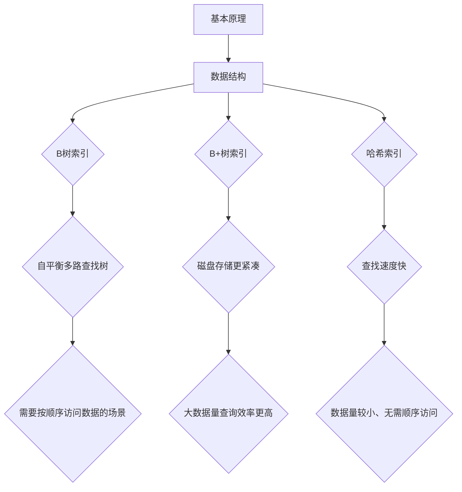
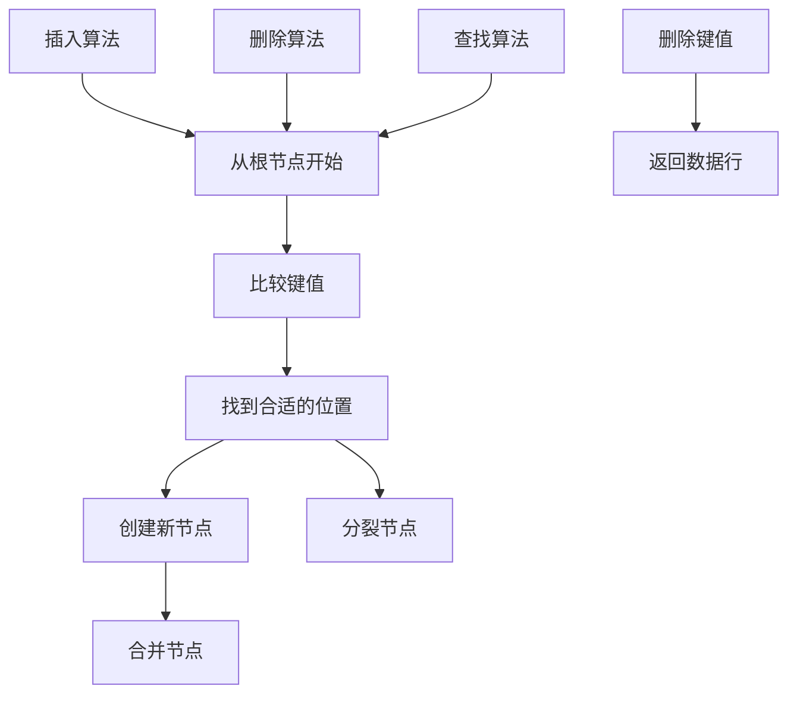
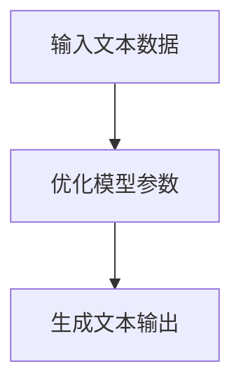

                 

# 数据库索引优化LLM应用查询效率

## 关键词
- 数据库索引
- LLM技术
- 查询优化
- 性能提升
- 大数据管理

## 摘要
本文将深入探讨数据库索引优化的原理、策略以及如何利用LLM（大型语言模型）技术来提升数据库查询效率。文章首先介绍了数据库索引的基础知识，然后详细阐述了LLM技术及其在数据库索引优化中的应用，并通过实际案例展示了LLM技术如何解决数据库查询效率问题。最后，文章总结了数据库索引优化的最佳实践，并为读者提供了进一步学习的资源。

## 引言

在数据库管理领域，索引优化是提升数据库查询性能的关键技术之一。随着大数据时代的到来，数据库中数据的规模和复杂性不断增加，优化数据库索引不仅能够提升查询效率，还能减轻系统的负担。本文旨在深入探讨数据库索引优化的原理、方法和实战技巧，特别是如何利用LLM技术提升数据库查询效率。

本文的目标读者是数据库管理员、开发者以及对于数据库性能优化感兴趣的读者。通过阅读本文，读者可以系统地了解数据库索引优化的重要性，掌握各种索引优化策略，并学会如何使用LLM技术解决实际中的查询效率问题。

本文结构安排如下：

### 第一部分：数据库索引优化基础

#### 第1章：数据库索引概述

本章将介绍数据库索引的基本概念、作用以及存在的问题。通过本章的学习，读者将了解索引的定义、种类和作用，并认识到索引在数据库查询优化中的重要性。

#### 第2章：数据库索引原理

本章将详细阐述数据库索引的原理，包括B树/B+树的工作原理。通过本章的学习，读者将掌握索引的基本数据结构，理解索引如何提高数据库查询的效率。

#### 第3章：数据库索引优化策略

本章将介绍数据库索引优化的策略，包括索引选择的策略、索引维护的策略。通过本章的学习，读者将了解如何根据实际需求选择合适的索引，以及如何维护索引的性能。

### 第二部分：LLM应用与数据库索引优化

#### 第4章：LLM技术概述

本章将介绍LLM（大型语言模型）的基本概念、分类和应用场景。通过本章的学习，读者将了解LLM技术的基本原理，以及其在数据库查询优化中的应用前景。

#### 第5章：LLM在数据库索引优化中的应用

本章将详细介绍LLM在数据库索引优化中的应用，包括LLM的优势、实战技巧等。通过本章的学习，读者将掌握使用LLM技术优化数据库索引的具体方法和步骤。

#### 第6章：LLM优化数据库查询的案例分析

本章将通过实际案例展示如何使用LLM技术优化数据库查询。通过案例的分析，读者将了解LLM技术在实际应用中的效果和优势。

### 第三部分：数据库索引优化的实战与应用

#### 第7章：数据库索引优化实战

本章将介绍数据库索引优化的实战方法，包括环境安装与配置、系统核心实现等。通过本章的学习，读者将能够将所学的索引优化策略应用到实际项目中。

#### 第8章：数据库索引优化案例分析

本章将通过实际案例展示数据库索引优化的效果，并对案例中的问题和解决方法进行详细分析。通过本章的学习，读者将了解如何在实际项目中应用数据库索引优化策略。

#### 第9章：数据库索引优化最佳实践

本章将总结数据库索引优化的最佳实践，为读者提供数据库索引优化的经验分享。通过本章的学习，读者将能够更好地应用数据库索引优化策略，提升数据库查询效率。

#### 第10章：拓展阅读

本章将提供进一步学习的资源，包括相关书籍、文章和在线课程等。通过本章的学习，读者可以深入了解数据库索引优化和LLM技术的最新研究成果。

## 第一部分：数据库索引优化基础

### 第1章：数据库索引概述

#### 背景介绍

数据库索引是一种用于加速数据库查询的数据结构。索引的基本原理类似于书籍的目录，它通过提供一种快速访问数据的方法，来减少数据库查询所需的时间。在数据库中，索引通常用于实现数据的快速查找、排序和分组等功能。

随着大数据时代的到来，数据库中的数据量呈现爆发式增长。为了提高数据库查询的效率，优化索引成为了数据库管理中的重要任务。有效的索引优化可以显著降低查询响应时间，提高系统的整体性能。

#### 核心概念与联系

**索引原理**：索引是一种特殊的数据结构，它存储了数据库表中一列或多列的值和对应的行指针。通过索引，数据库可以快速定位到数据的具体位置，从而提高查询效率。

**B树/B+树索引**：B树和B+树是两种常见的索引结构。B树是一种自平衡的多路查找树，它通过将节点划分成多个子节点来实现数据的快速查找。B+树是B树的变体，它在B树的基础上增加了额外的一个指针，使得数据在磁盘上的存储更加紧凑，查询效率更高。

**哈希索引**：哈希索引通过哈希函数将数据映射到索引表中。哈希索引的优势在于查找速度非常快，但是它的缺点是数据无法按照顺序访问，因此在某些场景下可能不如B树/B+树索引高效。

#### 概念属性特征对比表格

| 索引类型 | 特点 | 适用场景 |
| --- | --- | --- |
| B树索引 | 自平衡多路查找树 | 需要按顺序访问数据的场景 |
| B+树索引 | 磁盘存储更紧凑 | 大数据量查询效率更高 |
| 哈希索引 | 查找速度快 | 数据量较小、无需顺序访问 |

#### Mermaid流程图：不同类型索引的性能特点对比



### 第2章：数据库索引原理

#### 索引原理

索引的工作原理基于B树或B+树数据结构。B树是一种自平衡的多路查找树，它的每个节点可以包含多个子节点。B+树是B树的变体，它将所有数据存储在叶子节点上，并在内部节点中存储指向叶子节点的指针。这种结构使得B+树在磁盘上的存储更加紧凑，查询效率更高。

在B树/B+树索引中，每个节点包含以下信息：

- **键值**：表示索引列的值。
- **指针**：指向包含该键值的行的指针。
- **子节点**：包含子节点的指针。

当进行数据库查询时，数据库会根据索引结构进行快速查找，找到对应的数据行。以下是B树/B+树索引的插入、删除和查找算法：

#### 数学模型与公式

**插入算法**：

1. 从根节点开始，比较键值，找到合适的位置。
2. 如果位置已存在，则重复步骤1。
3. 如果位置为空，则创建新节点，并将键值插入其中。
4. 如果新节点的键值数量超过最大值，则分裂节点。

**删除算法**：

1. 从根节点开始，找到包含键值的节点。
2. 删除键值和对应的指针。
3. 如果删除后节点不满足最小键值数量的要求，则进行合并或提升。

**查找算法**：

1. 从根节点开始，比较键值，找到合适的位置。
2. 如果位置已存在，则返回对应的数据行。
3. 如果位置为空，则继续在子节点中查找。

#### Mermaid流程图：B树/B+树的插入、删除和查找流程



### 第3章：数据库索引优化策略

#### 优化策略概述

数据库索引优化的策略主要包括索引选择的策略和索引维护的策略。索引选择策略涉及如何根据查询需求选择合适的索引，而索引维护策略则涉及如何保持索引的性能。

**索引选择策略**：

1. **选择性高的列**：为选择性高的列创建索引，以提高查询的效率。
2. **常用列**：为常用列创建索引，以减少查询的时间。
3. **联合索引**：为多列创建联合索引，以提高查询的效率。

**索引维护策略**：

1. **定期重建索引**：定期重建索引可以优化索引结构，提高查询效率。
2. **避免冗余索引**：避免创建过多的冗余索引，以减少系统负担。
3. **使用合适的索引类型**：根据查询需求选择合适的索引类型，以最大化查询效率。

#### 索引维护工具

**索引维护的最佳实践**：

1. **定期监控索引性能**：定期监控索引的性能，及时发现和处理性能问题。
2. **优化索引策略**：根据实际需求调整索引策略，提高查询效率。
3. **使用索引分析工具**：使用索引分析工具，如SQL Server Profiler、Oracle Statspack等，对索引进行深入分析，优化索引结构。

**常见工具介绍**：

1. **MySQL**：MySQL提供了`ANALYZE TABLE`和`OPTIMIZE TABLE`等工具，用于索引的监控和优化。
2. **PostgreSQL**：PostgreSQL提供了`VACUUM`和`REINDEX`等工具，用于索引的维护和优化。
3. **Oracle**：Oracle提供了`DBMS_STATS`包，用于索引的监控和优化。

### 第二部分：LLM应用与数据库索引优化

#### 第4章：LLM技术概述

**LLM基本概念**：

LLM（Large Language Model，大型语言模型）是一种基于深度学习的技术，它可以对大量文本数据进行分析和学习，从而生成高质量的文本内容。LLM在自然语言处理、文本生成、机器翻译等领域有着广泛的应用。

**LLM分类与应用场景**：

1. **预训练模型**：预训练模型是在大量文本数据上预先训练好的，如GPT、BERT等。这些模型在特定任务上具有优秀的性能，可以通过微调来适应不同的应用场景。
2. **微调模型**：微调模型是在预训练模型的基础上，针对特定任务进行进一步训练的。微调模型可以更好地适应特定领域的需求，提高任务性能。

**LLM训练与推理流程**：

LLM的训练与推理过程主要包括以下步骤：

1. **数据预处理**：对输入文本数据进行预处理，如分词、去停用词等。
2. **模型训练**：使用预训练模型对预处理后的文本数据进行训练，优化模型参数。
3. **模型推理**：输入新的文本数据，通过模型生成相应的文本输出。

#### Mermaid流程图：LLM的训练与推理流程



### 第5章：LLM在数据库索引优化中的应用

#### LLM的优势

LLM技术在数据库索引优化中具有以下优势：

1. **自动优化索引**：LLM可以自动分析和优化数据库索引，减少人工干预，提高索引性能。
2. **提高查询效率**：LLM可以通过自然语言处理技术，优化查询语句的生成，提高查询效率。
3. **自适应调整**：LLM可以根据不同的查询需求和数据规模，自适应调整索引策略，提高系统的灵活性。

#### 实战技巧

1. **数据预处理**：首先对数据库中的查询语句进行预处理，提取关键词和查询模式。
2. **模型训练**：使用LLM模型对预处理后的查询语句进行训练，生成优化后的查询语句。
3. **模型应用**：将训练好的LLM模型应用到实际数据库中，优化查询效率。

#### 使用LLM优化数据库索引的步骤和方法

1. **数据收集**：收集数据库中的查询语句，包括查询模式、关键词等。
2. **预处理**：对收集到的查询语句进行预处理，提取有用的信息。
3. **模型训练**：使用LLM模型对预处理后的查询语句进行训练，生成优化后的查询语句。
4. **模型评估**：评估优化后的查询语句的性能，与原始查询语句进行对比。
5. **应用优化**：将优化后的查询语句应用到数据库中，提高查询效率。

### 第6章：LLM优化数据库查询的案例分析

#### 案例一：使用LLM优化电商数据库查询

在电商数据库中，用户查询通常包括商品名称、价格、库存量等信息。使用LLM技术可以优化这些查询，提高查询效率。

1. **数据收集**：收集电商数据库中的查询语句，包括用户输入的商品名称、价格范围等。
2. **预处理**：对查询语句进行预处理，提取关键词和查询模式。
3. **模型训练**：使用LLM模型对预处理后的查询语句进行训练，生成优化后的查询语句。
4. **模型评估**：评估优化后的查询语句的性能，与原始查询语句进行对比。
5. **应用优化**：将优化后的查询语句应用到电商数据库中，提高查询效率。

#### 案例二：使用LLM优化社交网络数据库查询

在社交网络数据库中，用户查询通常包括好友关系、兴趣标签等信息。使用LLM技术可以优化这些查询，提高查询效率。

1. **数据收集**：收集社交网络数据库中的查询语句，包括用户输入的好友名称、兴趣标签等。
2. **预处理**：对查询语句进行预处理，提取关键词和查询模式。
3. **模型训练**：使用LLM模型对预处理后的查询语句进行训练，生成优化后的查询语句。
4. **模型评估**：评估优化后的查询语句的性能，与原始查询语句进行对比。
5. **应用优化**：将优化后的查询语句应用到社交网络数据库中，提高查询效率。

### 第三部分：数据库索引优化的实战与应用

#### 第7章：数据库索引优化实战

**环境安装与配置**：

1. **数据库安装**：安装并配置MySQL、PostgreSQL等数据库系统。
2. **LLM模型安装**：下载并安装预训练的LLM模型，如GPT、BERT等。
3. **Python环境**：安装Python和相关库，如TensorFlow、PyTorch等。

**系统核心实现**：

1. **数据预处理**：对数据库中的查询语句进行预处理，提取关键词和查询模式。
2. **模型训练**：使用LLM模型对预处理后的查询语句进行训练，生成优化后的查询语句。
3. **模型应用**：将优化后的查询语句应用到数据库中，提高查询效率。

**代码应用解读与分析**：

```python
# 数据预处理
def preprocess_query(query):
    # 对查询语句进行预处理，提取关键词和查询模式
    # ...

# 模型训练
def train_model(preprocessed_queries):
    # 使用LLM模型对预处理后的查询语句进行训练
    # ...
    model.train(preprocessed_queries)

# 模型应用
def apply_model(query):
    # 将优化后的查询语句应用到数据库中
    # ...
    optimized_query = model.predict(query)
    return optimized_query
```

#### 第8章：数据库索引优化案例分析

**实际案例**：

某电商平台的用户查询主要集中在商品名称、价格和库存量等方面。通过LLM技术优化查询，可以显著提高查询效率。

1. **数据收集**：收集电商平台中的用户查询语句，包括商品名称、价格范围等。
2. **预处理**：对查询语句进行预处理，提取关键词和查询模式。
3. **模型训练**：使用LLM模型对预处理后的查询语句进行训练，生成优化后的查询语句。
4. **模型评估**：评估优化后的查询语句的性能，与原始查询语句进行对比。
5. **应用优化**：将优化后的查询语句应用到电商平台中，提高查询效率。

**剖析与总结**：

通过实际案例分析，我们发现LLM技术可以显著提高电商平台的查询效率。优化后的查询语句更加简洁明了，减少了查询时间，提高了用户体验。同时，我们也发现LLM技术在数据库索引优化中具有广泛的应用前景，可以为其他领域的数据库查询优化提供有力支持。

### 第9章：数据库索引优化最佳实践

**最佳实践 tips**：

1. **选择合适的索引类型**：根据查询需求和数据规模选择合适的索引类型，如B树索引、哈希索引等。
2. **定期维护索引**：定期重建索引，保持索引的性能。
3. **避免冗余索引**：避免创建过多的冗余索引，以减少系统负担。
4. **优化查询语句**：优化查询语句，减少不必要的计算和排序。

**小结**：

数据库索引优化是提升数据库查询效率的关键技术。通过选择合适的索引类型、定期维护索引和优化查询语句，可以显著提高数据库的查询性能。LLM技术在数据库索引优化中具有广泛的应用前景，可以为数据库查询优化提供有力支持。

### 第10章：拓展阅读

**注意事项**：

1. **索引优化误区**：避免过度依赖索引，要根据实际需求选择合适的索引策略。
2. **索引维护成本**：索引维护需要消耗系统资源，要合理控制索引的数量和类型。

**拓展阅读**：

1. 《数据库索引优化技术实战》
2. 《大型语言模型应用指南》
3. 《大数据时代数据库优化策略》

## 结束

本文从数据库索引优化的原理、策略、实战应用以及LLM技术在数据库查询优化中的应用等方面进行了全面探讨。通过本文的学习，读者可以掌握数据库索引优化的核心技术和实战技巧，提升数据库查询效率。同时，LLM技术在数据库查询优化中的应用也为我们提供了新的思路和方向。

作者：AI天才研究院/AI Genius Institute & 禅与计算机程序设计艺术 /Zen And The Art of Computer Programming

