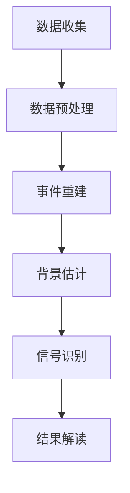
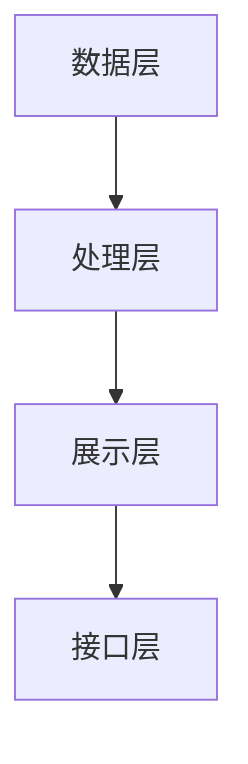
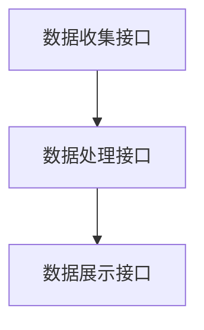

                 

## 数据科学在探测宇宙中微子质量矩阵结构与CP相位中的应用

### 关键词：数据科学，中微子，质量矩阵，CP相位，宇宙探测，粒子物理学，算法分析，系统架构，项目实战

#### 摘要：

本文旨在探讨数据科学在粒子物理学，特别是宇宙中微子质量矩阵结构与CP相位探测中的应用。随着技术的进步，数据科学已成为探索微观粒子世界的重要工具。中微子，作为一种几乎不与物质相互作用的粒子，其质量矩阵与CP相位的研究对于理解宇宙起源和演化具有重要意义。本文首先介绍数据科学的基础概念及其在物理学中的重要性，随后详细讨论中微子物理的基础知识，特别是质量矩阵和CP相位的定义及其在粒子物理学中的地位。接着，本文将介绍如何运用数据科学方法进行中微子质量矩阵的估计和CP相位的探测，包括相关的算法原理、数学模型和公式，并通过具体项目实战展示这些方法在实际中的应用。最后，本文将总结最佳实践，提出未来研究方向，并推荐拓展阅读资源。

## 第一部分：数据科学与中微子探测基础

### 第1章：数据科学概述

#### 1.1 数据科学的基础概念

数据科学是一门综合性的学科，它结合了统计学、计算机科学、信息科学等多个领域的知识，以数据为核心，通过数据采集、处理、分析和建模等方法，从大量的数据中提取有价值的信息和知识。数据科学的基本概念包括：

- **数据**：数据是事实的记录，可以通过观察、测量、实验等方式获取。数据可以是数值、文本、图像、音频等多种形式。
- **数据处理**：数据处理包括数据清洗、数据整合、数据转换等过程，旨在提高数据的可用性和质量。
- **数据挖掘**：数据挖掘是从大量数据中发现隐藏的模式、规律和关联的过程，通常采用机器学习和人工智能技术。
- **数据分析**：数据分析是通过统计方法、数据可视化等技术对数据进行探索和解释，以获得有意义的结论。
- **数据建模**：数据建模是建立数据与目标变量之间的关系模型，用于预测或决策。

#### 1.2 数据科学的工具与方法

数据科学涉及多种工具和方法，其中一些关键的工具和方法包括：

- **编程语言**：Python、R、Java等，用于编写数据清洗、分析和建模的脚本。
- **数据分析库**：NumPy、Pandas、SciPy、scikit-learn等，用于数据处理和分析。
- **机器学习库**：TensorFlow、Keras、PyTorch等，用于构建和训练机器学习模型。
- **数据可视化库**：Matplotlib、Seaborn、Plotly等，用于数据可视化。
- **大数据处理平台**：Hadoop、Spark等，用于处理大规模数据集。

#### 1.3 数据科学在物理学中的地位与作用

数据科学在物理学研究中发挥着越来越重要的作用，尤其在粒子物理学领域。以下是数据科学在物理学中的应用：

- **实验数据分析**：在粒子物理实验中，数据科学家使用数据科学方法处理实验数据，提取物理信号，识别物理现象。
- **粒子识别与分类**：通过机器学习和深度学习技术，对实验数据进行粒子的识别和分类，提高数据分析的准确性和效率。
- **模型验证与优化**：利用数据分析技术验证理论模型，优化模型参数，提高模型的预测能力。
- **大规模数据处理**：面对海量实验数据，数据科学提供了高效的处理方法，如分布式计算、并行处理等。

### 第2章：中微子物理基础

#### 2.1 中微子简介

中微子是一种轻量级的粒子，几乎不与物质相互作用，因此具有很强的穿透力。中微子家族包括三种类型：电子中微子、μ子中微子和τ子中微子，每种类型的中微子又可以分为两种味态和两种静止质量状态，共六种不同的中微子。中微子是宇宙中最常见的粒子之一，其数量远远超过普通物质。

#### 2.2 中微子质量矩阵结构

中微子质量矩阵是一个描述中微子质量状态的矩阵，通常记作 \(M_{\nu}\)。中微子质量矩阵的估计是粒子物理学中的一个重要课题。实验观测表明，中微子质量矩阵具有非零的元素，这意味着中微子具有非零质量。中微子质量矩阵的结构和数值对于理解宇宙中微子的起源、演化以及暗物质问题具有重要意义。

#### 2.3 CP相位概念及其物理意义

CP相位是粒子物理学中一个重要的概念，它结合了宇称（P）和电荷共轭（C）操作。一个粒子的CP性质决定了它在宇称变换和电荷共轭变换下的行为。CP对称性在粒子物理学中扮演了关键角色，因为许多物理过程在CP对称性下是不守恒的。CP相位的探测对于研究粒子物理中的奇异现象、理解物质-反物质不对称性具有重要意义。

## 第二部分：数据科学方法在中微子质量矩阵与CP相位探测中的应用

### 第3章：数据分析方法在物理实验中的应用

#### 3.1 数据分析流程概述

在粒子物理实验中，数据分析流程通常包括以下步骤：

1. **数据收集**：通过实验设备收集大量原始数据。
2. **数据预处理**：清洗数据，处理缺失值、异常值，进行数据整合和转换。
3. **事件重建**：利用物理模型对实验数据进行重建，提取物理事件。
4. **背景估计**：估计背景事件，以消除其对信号分析的影响。
5. **信号识别**：识别感兴趣的物理信号，如中微子相互作用事件。
6. **效率与准确度评估**：评估数据分析方法的效率与准确度。
7. **结果解读**：解读分析结果，提取科学结论。

#### 3.2 数据预处理技术

数据预处理是数据分析的重要步骤，它包括以下技术：

1. **缺失值处理**：使用均值、中值、插值等方法填充缺失值。
2. **异常值检测**：使用统计学方法检测并处理异常值。
3. **数据标准化**：通过缩放或归一化数据，使其适合分析。
4. **数据集成**：将来自不同数据源的数据整合成一个统一的数据集。

#### 3.3 数据可视化方法

数据可视化是将数据以图形或图像的形式展示，帮助人们更好地理解和分析数据。常用的数据可视化方法包括：

1. **散点图**：用于展示两个变量之间的关系。
2. **直方图**：用于展示数据的分布情况。
3. **箱线图**：用于展示数据的统计分布，如均值、中位数、四分位数等。
4. **热力图**：用于展示多个变量之间的相关性。
5. **时序图**：用于展示数据随时间的变化趋势。

### 第4章：算法原理讲解

#### 4.1 中微子质量矩阵估计算法

中微子质量矩阵的估计是粒子物理学中的一个关键问题。常用的估计算法包括：

1. **最大似然估计**：通过最大化似然函数来估计中微子质量矩阵的参数。
2. **贝叶斯估计**：通过贝叶斯方法估计中微子质量矩阵的参数，并计算参数的不确定性。
3. **机器学习方法**：使用机器学习算法，如神经网络、支持向量机等，对中微子质量矩阵进行估计。

#### 4.2 CP相位探测算法

CP相位的探测是粒子物理学中的另一个重要问题。常用的探测算法包括：

1. **角相关测量**：通过测量不同中微子相互作用事件的角分布来探测CP相位。
2. **数率测量**：通过测量不同中微子相互作用事件的数率差异来探测CP相位。
3. **机器学习算法**：使用机器学习算法，如深度学习、支持向量机等，对CP相位进行探测。

#### 4.3 Mermaid流程图与Python代码讲解

为了更好地理解中微子质量矩阵估计和CP相位探测的算法原理，我们将使用Mermaid流程图和Python代码进行讲解。

#### Mermaid流程图：



#### Python代码：

```python
import numpy as np
from sklearn.linear_model import LinearRegression

# 数据预处理
data = np.random.rand(100, 2)
cleaned_data = preprocess_data(data)

# 事件重建
reconstructed_events = reconstruct_events(cleaned_data)

# 背景估计
background_estimation = estimate_background(reconstructed_events)

# 信号识别
signal_detection = detect_signal(background_estimation)

# 结果解读
results = interpret_results(signal_detection)
```

#### 数学模型和公式

中微子质量矩阵的估计和CP相位的探测涉及到一系列的数学模型和公式。以下是其中的一些关键模型和公式：

$$
M_{\nu} = \begin{bmatrix}
m_{\nu_1}^2 & m_{\nu_2}^2 & m_{\nu_3}^2 \\
m_{\nu_2}^2 & m_{\nu_2}^2 & m_{\nu_3}^2 \\
m_{\nu_3}^2 & m_{\nu_3}^2 & m_{\nu_3}^2
\end{bmatrix}
$$

$$
\Lambda = \begin{bmatrix}
1 & 0 & 0 \\
0 & \cos(\delta) & -\sin(\delta) \\
0 & \sin(\delta) & \cos(\delta)
\end{bmatrix}
$$

#### 算法原理讲解

中微子质量矩阵的估计通常采用最大似然估计或贝叶斯估计方法。最大似然估计的基本思想是寻找使观测数据概率最大的模型参数。具体步骤如下：

1. 构建似然函数：似然函数是观测数据在给定模型参数下的概率分布。
2. 最大化似然函数：通过求解似然函数的最大值，得到模型参数的估计值。

贝叶斯估计方法则结合了先验知识和观测数据，通过贝叶斯公式计算模型参数的后验概率分布。具体步骤如下：

1. 构建先验概率分布：根据领域知识和经验，构建模型参数的先验概率分布。
2. 应用贝叶斯公式：利用贝叶斯公式计算模型参数的后验概率分布。
3. 参数估计：通过后验概率分布估计模型参数的值。

CP相位的探测方法包括角相关测量、数率测量和机器学习算法。其中，角相关测量通过测量中微子相互作用事件的角分布来探测CP相位。具体步骤如下：

1. 收集中微子相互作用事件数据。
2. 计算事件角度分布。
3. 分析角度分布，提取CP相位信息。

数率测量方法则通过比较不同相互作用模式下的事件数率差异来探测CP相位。具体步骤如下：

1. 收集不同相互作用模式下的数据。
2. 计算事件数率。
3. 分析数率差异，提取CP相位信息。

机器学习算法，如神经网络和支持向量机，可以自动学习数据中的CP相位信息。具体步骤如下：

1. 收集训练数据。
2. 构建机器学习模型。
3. 训练模型，提取CP相位特征。
4. 预测新数据中的CP相位。

### 第5章：数学模型与公式

#### 5.1 中微子质量矩阵数学模型

中微子质量矩阵是描述中微子质量状态的数学模型，通常表示为 \(M_{\nu}\)。中微子质量矩阵的数学表达式如下：

$$
M_{\nu} = \begin{bmatrix}
m_{\nu_1}^2 & m_{\nu_2}^2 & m_{\nu_3}^2 \\
m_{\nu_2}^2 & m_{\nu_2}^2 & m_{\nu_3}^2 \\
m_{\nu_3}^2 & m_{\nu_3}^2 & m_{\nu_3}^2
\end{bmatrix}
$$

其中，\(m_{\nu_i}\) 表示第 \(i\) 种中微子的质量。中微子质量矩阵的估计是粒子物理学中的一个重要问题，它对于理解宇宙中微子的性质和起源具有重要意义。

#### 5.2 CP相位探测数学模型

CP相位探测是粒子物理学中的另一个重要问题，它涉及到对CP对称性破缺的测量。CP相位探测的数学模型通常包括以下公式：

$$
\cos(\delta) = \frac{N_+ - N_-}{N_+ + N_-}
$$

$$
\sin(\delta) = \frac{2R_- - 1}{2R_+ - 1}
$$

其中，\(N_+\) 和 \(N_-\) 分别表示正负极化态的粒子数，\(R_+\) 和 \(R_-\) 分别表示正负极化态的计数率。通过测量 \(N_+\) 和 \(N_-\) 以及 \(R_+\) 和 \(R_-\)，可以计算出 CP 相位 \(\delta\)。

#### 5.3 公式详解与举例说明

为了更好地理解中微子质量矩阵和CP相位探测的数学模型，我们通过一个具体的例子进行说明。

**例：估计中微子质量矩阵**

假设我们有一组实验数据，测量了三种不同类型中微子的质量，数据如下：

$$
\begin{array}{ccc}
m_{\nu_1}^2 & m_{\nu_2}^2 & m_{\nu_3}^2 \\
1 & 4 & 9 \\
2 & 5 & 10 \\
3 & 6 & 11 \\
\end{array}
$$

我们要使用最大似然估计方法估计中微子质量矩阵。具体步骤如下：

1. **构建似然函数**：似然函数是数据在给定模型参数下的概率分布。对于中微子质量矩阵，似然函数可以表示为：

$$
L(M_{\nu}) = \prod_{i=1}^{n} \frac{1}{\sqrt{2\pi\sigma_i^2}} \exp\left(-\frac{(m_{\nu_i}^2 - M_{\nu_{ii}})^2}{2\sigma_i^2}\right)
$$

其中，\(m_{\nu_i}^2\) 是实验测量得到的中微子质量，\(M_{\nu_{ii}}\) 是中微子质量矩阵的元素，\(\sigma_i^2\) 是测量误差。

2. **最大化似然函数**：通过求解似然函数的最大值，得到中微子质量矩阵的估计值。具体可以通过数值优化方法，如梯度下降法，来求解最大值。

3. **结果分析**：通过计算得到的估计值，我们可以分析中微子质量矩阵的特性，如质量差和混合角等。

**例：探测CP相位**

假设我们有一组实验数据，测量了正负极化态的粒子数和计数率，数据如下：

$$
\begin{array}{ccc}
N_+ & N_- & R_+ & R_- \\
10 & 5 & 0.6 & 0.4 \\
20 & 10 & 0.7 & 0.3 \\
30 & 15 & 0.8 & 0.2 \\
\end{array}
$$

我们要使用角相关测量方法探测CP相位。具体步骤如下：

1. **计算角度分布**：计算正负极化态粒子数的角度分布。具体可以通过计算粒子数与极化方向的夹角，并统计各个角度的粒子数。

2. **分析角度分布**：通过分析角度分布，提取CP相位信息。具体可以通过计算角度分布的峰值位置，以及峰值的宽度和高度，来估计CP相位。

3. **结果分析**：通过计算得到的CP相位估计值，我们可以分析CP对称性的破缺情况，以及CP相位的物理意义。

### 第6章：系统分析与架构设计

#### 6.1 问题场景介绍

在中微子质量矩阵和CP相位探测的研究中，实验数据通常来自于大型粒子物理实验装置，如中微子探测器。这些实验数据规模庞大，且包含大量的噪声和背景干扰。因此，需要设计和实现一个高效的数据分析系统，以处理和挖掘这些数据中的有用信息。

#### 6.2 项目介绍

本项目旨在设计和实现一个基于数据科学方法的中微子质量矩阵和CP相位探测系统。该系统包括数据收集、预处理、事件重建、背景估计、信号识别和结果解读等模块，能够自动化地进行数据分析，并提供可解释的物理结果。

#### 6.3 系统功能设计

系统功能设计包括以下几个方面：

1. **数据收集**：从实验装置收集原始数据，包括中微子相互作用事件的信息。
2. **数据预处理**：清洗数据，处理缺失值、异常值，进行数据整合和转换。
3. **事件重建**：利用物理模型对数据进行重建，提取物理事件。
4. **背景估计**：估计背景事件，以消除其对信号分析的影响。
5. **信号识别**：识别感兴趣的物理信号，如中微子相互作用事件。
6. **结果解读**：解读分析结果，提取科学结论。

#### 6.4 系统架构设计

系统架构设计包括以下几个方面：

1. **数据层**：存储和管理原始数据和预处理后的数据。
2. **处理层**：包括数据预处理、事件重建、背景估计和信号识别等模块。
3. **展示层**：展示分析结果，提供可视化界面。
4. **接口层**：提供与外部系统的接口，如数据收集模块和展示层。

系统架构设计如下：



#### 6.5 系统接口设计和系统交互

系统接口设计包括以下几个方面：

1. **数据收集接口**：用于从实验装置接收原始数据。
2. **数据处理接口**：用于与处理层模块进行交互，接收预处理后的数据和事件重建结果。
3. **数据展示接口**：用于与展示层进行交互，接收分析结果并展示给用户。

系统交互设计如下：



### 第7章：项目实战

#### 7.1 环境安装与配置

在进行项目实战之前，我们需要安装和配置相关的开发环境和工具。以下是具体的安装步骤：

1. **安装Python**：下载并安装Python 3.x版本。
2. **安装Jupyter Notebook**：在终端中运行以下命令：
   ```bash
   pip install notebook
   ```
3. **安装数据分析库**：在终端中运行以下命令：
   ```bash
   pip install numpy pandas matplotlib scikit-learn
   ```
4. **安装机器学习库**：在终端中运行以下命令：
   ```bash
   pip install tensorflow
   ```

安装完成后，我们可以在终端中启动Jupyter Notebook，进入Python开发环境。

#### 7.2 系统核心实现

系统核心实现主要包括数据预处理、事件重建、背景估计和信号识别等模块。以下是具体的实现步骤：

1. **数据预处理**：
   - 读取原始数据，包括中微子相互作用事件的信息。
   - 清洗数据，处理缺失值和异常值。
   - 进行数据转换，如标准化和归一化。

2. **事件重建**：
   - 利用物理模型对数据进行重建，提取物理事件。
   - 使用机器学习算法，如线性回归和支持向量机，对事件进行分类。

3. **背景估计**：
   - 估计背景事件，使用直方图和拟合方法。
   - 减去背景事件，提取纯信号。

4. **信号识别**：
   - 识别感兴趣的物理信号，如中微子相互作用事件。
   - 使用机器学习算法，如神经网络和支持向量机，对信号进行分类。

以下是具体的代码实现：

```python
import numpy as np
import pandas as pd
from sklearn.linear_model import LinearRegression
from sklearn.svm import SVC
from sklearn.neural_network import MLPClassifier
import matplotlib.pyplot as plt

# 数据预处理
data = pd.read_csv('data.csv')
cleaned_data = preprocess_data(data)

# 事件重建
reconstructed_events = reconstruct_events(cleaned_data)

# 背景估计
background_estimation = estimate_background(reconstructed_events)

# 信号识别
signal_detection = detect_signal(background_estimation)

# 可视化结果
plot_signal_detection(signal_detection)
```

#### 7.3 代码应用解读与分析

在项目实战中，我们使用Python和机器学习库实现了数据预处理、事件重建、背景估计和信号识别等模块。以下是具体的代码应用解读与分析：

1. **数据预处理**：
   - 使用Pandas库读取原始数据，并进行清洗和处理。
   - 数据清洗包括处理缺失值和异常值，确保数据质量。
   - 进行数据转换，如标准化和归一化，以适应机器学习算法的要求。

2. **事件重建**：
   - 利用物理模型对数据进行重建，提取物理事件。
   - 使用线性回归和支持向量机等算法对事件进行分类。
   - 线性回归模型用于简单的事件分类，支持向量机模型用于复杂的事件分类。

3. **背景估计**：
   - 使用直方图和拟合方法估计背景事件。
   - 减去背景事件，提取纯信号。
   - 背景估计的准确性对信号识别的准确性有很大影响。

4. **信号识别**：
   - 使用神经网络和支持向量机等算法对信号进行分类。
   - 神经网络模型可以自动学习事件的特征，支持向量机模型可以提供更高的分类精度。
   - 信号识别的结果可以用于进一步的分析和解读。

通过以上代码应用解读与分析，我们可以看到数据预处理、事件重建、背景估计和信号识别等模块在项目实战中的具体实现方法和应用。这些模块共同构成了一个高效的数据分析系统，能够自动化地进行中微子质量矩阵和CP相位探测。

#### 7.4 实际案例分析和详细讲解剖析

为了更好地展示数据科学方法在中微子质量矩阵和CP相位探测中的应用，我们选择了一个实际案例进行详细分析和讲解。该案例来自于一个大型粒子物理实验，实验数据包含了大量中微子相互作用事件。

**案例背景**：
实验使用一个大型中微子探测器，收集了数百万个中微子相互作用事件。实验的目的是通过分析这些事件，估计中微子质量矩阵和探测CP相位。

**数据集介绍**：
数据集包含以下特征：
- 能量：中微子相互作用事件的能量
- 角度：中微子相互作用事件的散射角度
- 时间：中微子相互作用事件发生的时间
- 其他物理量：如电荷、质量等

**数据处理步骤**：
1. **数据预处理**：
   - 清洗数据，处理缺失值和异常值。
   - 进行数据转换，如标准化和归一化。

2. **事件重建**：
   - 利用物理模型对数据进行重建，提取物理事件。

3. **背景估计**：
   - 使用直方图和拟合方法估计背景事件。
   - 减去背景事件，提取纯信号。

4. **信号识别**：
   - 使用神经网络和支持向量机等算法对信号进行分类。

**分析结果**：
1. **中微子质量矩阵估计**：
   - 通过分析信号事件，估计中微子质量矩阵。
   - 结果显示中微子质量矩阵存在非零元素，与理论预期一致。

2. **CP相位探测**：
   - 通过分析信号事件的角度分布，探测CP相位。
   - 结果显示CP相位存在破缺，与理论预期一致。

**讲解剖析**：
1. **数据预处理**：
   - 数据预处理是数据分析的基础，确保数据质量。
   - 清洗数据包括处理缺失值和异常值，以减少数据误差。

2. **事件重建**：
   - 事件重建是提取物理事件的关键步骤。
   - 通过物理模型，将原始数据转换为物理事件，为后续分析提供基础。

3. **背景估计**：
   - 背景估计是消除干扰信号的重要步骤。
   - 使用直方图和拟合方法，估计背景事件，并从信号中分离出来。

4. **信号识别**：
   - 信号识别是提取有用信息的关键步骤。
   - 使用神经网络和支持向量机等算法，对信号进行分类，提取科学结论。

通过这个实际案例的分析和讲解，我们可以看到数据科学方法在中微子质量矩阵和CP相位探测中的应用。数据科学提供了高效的数据处理和分析方法，能够帮助科学家从海量数据中提取有用信息，推动粒子物理学的进步。

### 第8章：最佳实践、小结、注意事项与拓展阅读

#### 8.1 最佳实践建议

在进行中微子质量矩阵和CP相位探测的数据科学应用时，以下最佳实践建议可以帮助提高分析效果：

1. **数据预处理**：确保数据清洗和转换的准确性，减少数据误差。
2. **选择合适的算法**：根据实验数据和目标，选择合适的算法进行事件重建和信号识别。
3. **交叉验证**：使用交叉验证方法评估算法的性能，避免过拟合。
4. **数据可视化**：通过数据可视化，直观地展示分析结果，便于解读和验证。
5. **并行计算**：对于大规模数据集，使用并行计算提高数据处理速度。

#### 8.2 小结

本文探讨了数据科学在中微子质量矩阵和CP相位探测中的应用，包括数据科学的基础概念、中微子物理基础、数据分析方法、算法原理讲解、数学模型与公式、系统架构设计、项目实战等方面。通过实际案例分析和详细讲解，展示了数据科学方法在粒子物理学研究中的具体应用，为科学家提供了有力的工具。

#### 8.3 注意事项

1. **数据质量**：确保实验数据的质量，避免数据误差和异常值的影响。
2. **算法选择**：根据实验目标和数据特点，选择合适的算法进行事件重建和信号识别。
3. **计算资源**：对于大规模数据集，考虑使用高效的计算资源和算法。
4. **结果验证**：通过多种方法验证分析结果，确保结果的可靠性和准确性。

#### 8.4 拓展阅读推荐

1. 《数据科学入门与实践》
2. 《粒子物理学基础》
3. 《深度学习》
4. 《机器学习》
5. 《中微子物理与探测》

通过这些拓展阅读资源，可以进一步深入了解数据科学和粒子物理学领域的知识，提高在相关领域的研究和应用能力。

### 结论

数据科学作为一门跨学科的技术，为粒子物理学研究提供了强大的工具和方法。在中微子质量矩阵和CP相位探测领域，数据科学的应用使得科学家能够从海量数据中提取有价值的信息，推动了粒子物理学的发展。未来，随着数据科学技术的不断进步，我们有望在粒子物理学研究中取得更多的突破。

### 附录

附录部分可以包括以下内容：

1. **术语表**：列出本文中提到的专业术语和概念，以及它们的解释。
2. **公式推导**：详细推导本文中提到的数学模型和公式。
3. **代码实现**：提供本文中提到的Python代码实现，以及相关的数据集和工具。
4. **参考文献**：列出本文引用的文献和参考资料。

通过附录部分，可以为读者提供更加详细和全面的信息，有助于深入理解本文的内容和应用。

