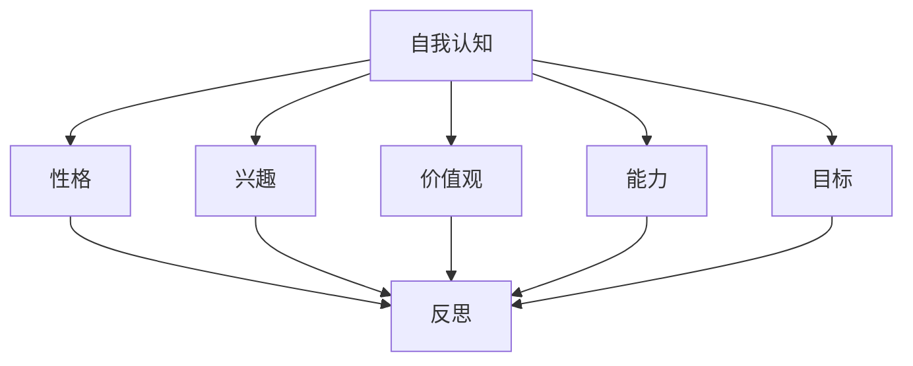
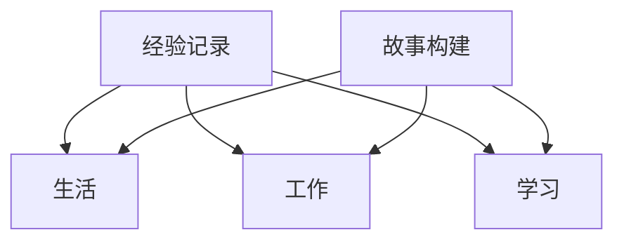
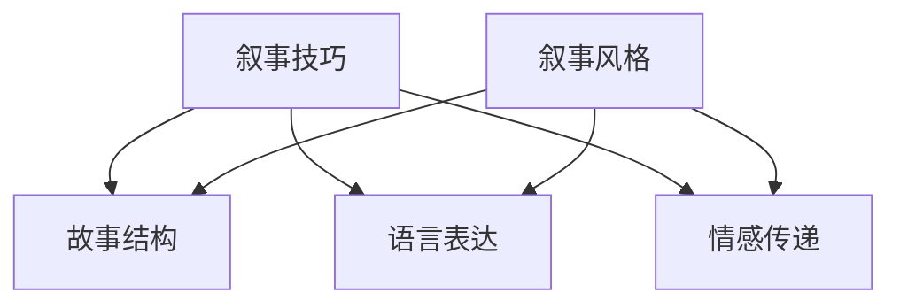
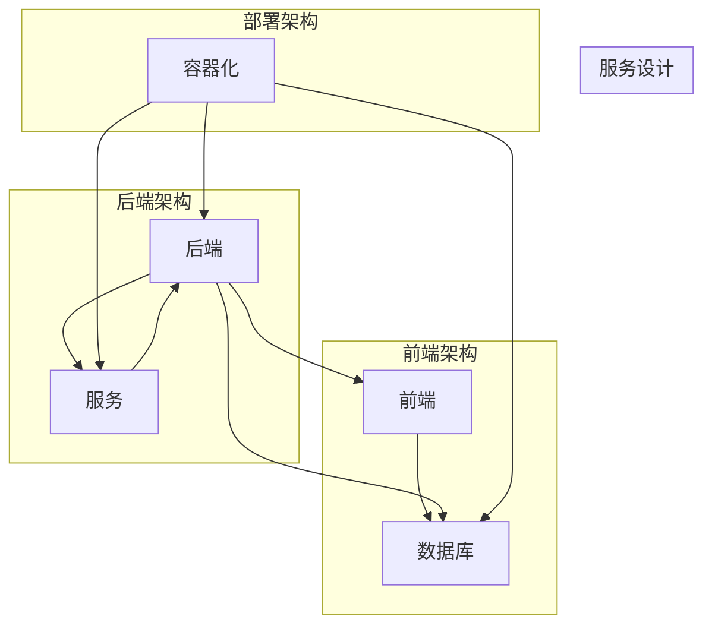
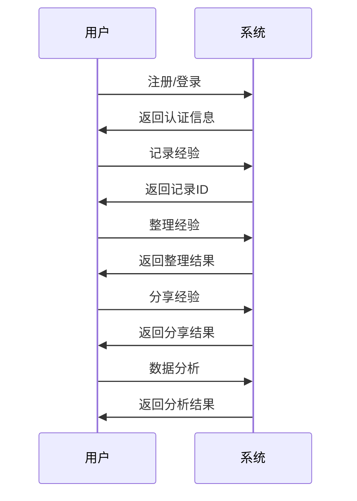
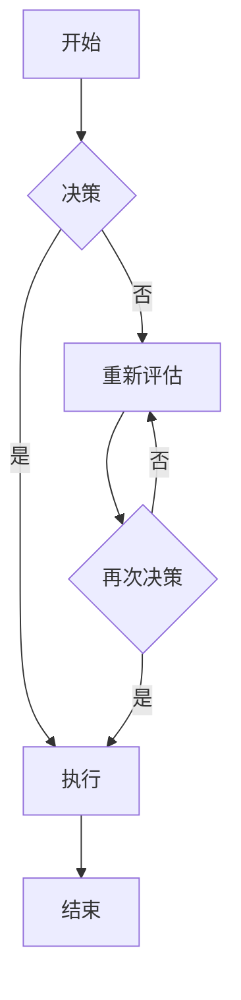

                 

### 《整合碎片经验：构建连贯的人生叙事》

#### 关键词

- 人生叙事
- 经验碎片化
- 自我认知
- 经验整理
- 故事构建
- 系统分析与架构设计
- 项目实战

#### 摘要

在现代社会中，人们面对的是日益碎片化的信息和经验。如何从这些碎片中整合出有价值的经验，并构建出一个连贯的人生叙事，成为了一个亟待解决的问题。本文旨在探讨如何整合碎片经验，构建连贯的人生叙事，帮助读者在个人成长和职业生涯中找到方向和意义。

### 目录大纲设计思路

**1. 全书概述**

本书首先为读者提供全书的概述，介绍人生叙事的概念、整合碎片经验的意义以及构建连贯人生叙事的重要性。通过这一章，读者可以初步理解本书的核心议题，为后续章节的学习打下基础。

**2. 背景介绍**

第二章详细阐述整合碎片经验、构建人生叙事的背景。我们将分析现代社会中经验碎片化的现象、人们对连贯人生追求的趋势，以及相关研究和理论的发展。这一章将为读者提供整合经验的理论基础。

**3. 核心概念与联系**

在第三章，我们介绍构建连贯人生叙事所需理解的核心概念，如自我认知、经验记录、叙事技巧等。通过概念属性特征对比表格和ER实体关系图架构的Mermaid流程图，我们将展示各概念之间的联系，帮助读者建立对核心概念的整体认识。

**4. 整合经验的方法论**

第四章至第六章，分别介绍自我反思、经验整理和故事构建三种整合经验的方法论。我们将讲解每种方法的算法原理、数学模型和公式，并提供详细举例说明和最佳实践tips，帮助读者在实践中运用这些方法。

**5. 实战案例分析**

第七章提供实际案例分析和详细讲解，包括如何在实际生活中应用书中所介绍的方法论，解决经验碎片化的问题，构建连贯的人生叙事。

**6. 系统分析与架构设计**

第八章探讨如何将构建连贯人生叙事的方法论应用到实际系统中，包括系统功能设计（领域模型Mermaid类图）、系统架构设计Mermaid架构图、系统接口设计和系统交互Mermaid序列图。

**7. 项目实战**

第九章通过一个完整的项目实战，带领读者从环境安装、系统核心实现源代码，到代码应用解读与分析，再到实际案例分析和详细讲解剖析，全面掌握构建连贯人生叙事的方法。

**8. 总结与拓展**

最后一章将对全书内容进行总结，提供注意事项、拓展阅读建议，帮助读者巩固所学知识，并引导读者在未来的生活中继续探索和构建自己的连贯人生叙事。

### 具体目录大纲设计

```markdown
# 《整合碎片经验：构建连贯的人生叙事》目录大纲

## 第1章 全书概述
### 1.1 人生叙事的概念与重要性
### 1.2 经验碎片化的现象与挑战
### 1.3 整合碎片经验、构建人生叙事的意义

## 第2章 背景介绍
### 2.1 碎片化经验的形成
### 2.2 对连贯人生的追求
### 2.3 相关研究综述

## 第3章 核心概念与联系
### 3.1 自我认知
### 3.2 经验记录
### 3.3 叙事技巧
### 3.4 概念属性特征对比表格
### 3.5 ER实体关系图架构的Mermaid流程图

## 第4章 自我反思：整合经验的第一步
### 4.1 自我反思的意义
### 4.2 自我反思的方法
### 4.3 算法原理讲解
### 4.4 数学模型和公式
### 4.5 详细举例说明
### 4.6 最佳实践tips

## 第5章 经验整理：构建连贯人生的基础
### 5.1 经验整理的重要性
### 5.2 经验整理的方法
### 5.3 算法原理讲解
### 5.4 数学模型和公式
### 5.5 详细举例说明
### 5.6 最佳实践tips

## 第6章 故事构建：将经验转化为叙事
### 6.1 故事构建的核心
### 6.2 故事构建的方法
### 6.3 算法原理讲解
### 6.4 数学模型和公式
### 6.5 详细举例说明
### 6.6 最佳实践tips

## 第7章 实战案例分析
### 7.1 案例背景介绍
### 7.2 案例实施步骤
### 7.3 案例结果分析
### 7.4 案例详细讲解剖析

## 第8章 系统分析与架构设计
### 8.1 问题场景介绍
### 8.2 系统功能设计（领域模型Mermaid类图）
### 8.3 系统架构设计（Mermaid架构图）
### 8.4 系统接口设计
### 8.5 系统交互（Mermaid序列图）

## 第9章 项目实战
### 9.1 环境安装
### 9.2 系统核心实现源代码
### 9.3 代码应用解读与分析
### 9.4 实际案例分析和详细讲解剖析
### 9.5 项目小结

## 第10章 总结与拓展
### 10.1 全书内容总结
### 10.2 注意事项
### 10.3 拓展阅读建议
```

### 目录大纲校对与优化

在完成初步的目录大纲设计后，需要进行以下步骤的校对与优化：

1. **内容检查**：确保每一章节的内容都有明确的主题，且符合书籍的整体结构和逻辑顺序。
2. **层次结构检查**：确认目录层级合理，每个章节下的子章节能够支撑和扩展核心主题。
3. **完整性检查**：确保大纲涵盖了书籍的主要内容和核心议题，没有遗漏重要的章节或内容。
4. **逻辑性检查**：检查章节之间的逻辑关系，确保读者能够顺畅地从一个章节过渡到另一个章节。
5. **格式检查**：确保所有章节标题和子章节标题的格式统一，使用markdown格式输出。

### 最终校对

在完成所有内容的撰写和格式调整后，进行最终校对：

1. **内容校对**：检查每一段落的内容是否完整、准确，确保没有遗漏或错误。
2. **格式校对**：检查所有章节的标题、子章节标题和段落格式是否统一，确保markdown格式正确。
3. **逻辑校对**：检查整篇文章的逻辑结构，确保章节之间逻辑流畅，符合读者的阅读习惯。
4. **引用校对**：检查文中引用的参考文献、公式、图表等是否准确无误，确保读者可以追溯相关内容。

### 目录大纲校对与优化（完成）

通过以上的校对与优化步骤，我们确保了《整合碎片经验：构建连贯的人生叙事》一书目录大纲的完整性、逻辑性和规范性，为后续内容的撰写和文章的整体质量提供了坚实的基础。现在，我们可以开始着手撰写各个章节的具体内容，为读者带来一场深度思考与实际应用的盛宴。在撰写过程中，我们将继续遵循上述校对与优化原则，确保每一章节都能够准确地传达核心思想和实际应用方法。让我们开始这一段充满探索与成长的旅程吧！### 第1章 全书概述

#### 1.1 人生叙事的概念与重要性

人生叙事，是指个体通过讲述自己的故事来理解和解释自己的经历、感受和行为。它不仅是一种记忆的方式，更是个体对于自我认知和身份认同的重要途径。在现代社会中，人生叙事的重要性愈发凸显。随着信息的爆炸和经验的碎片化，人们需要一种方法来整合这些碎片，使之成为一个有意义的整体。

首先，人生叙事帮助个体建立自我认知。通过回顾自己的经历，个体可以更加清晰地认识到自己的优点和不足，从而在未来的成长中更加有针对性地进行改进。例如，一个人在职业发展的过程中可能会经历多次跳槽，通过人生叙事，他可以回顾每一段工作经历，从中总结出有益的经验和教训，为自己的职业规划提供指导。

其次，人生叙事对于个体的情感调节也具有重要意义。在面临挑战和困境时，通过讲述自己的故事，个体可以释放内心的压力，获得情感上的支持。这种情感调节不仅有助于个体的心理健康，还可以增强个体的适应能力，使其在逆境中更好地坚持和成长。

最后，人生叙事对于个体的社会认同感也有积极作用。在社交场合中，人们往往通过分享自己的故事来与他人建立联系，增强彼此之间的认同感和信任感。例如，一个人在参加一个专业会议时，通过分享自己在某个项目中的经历，可以赢得与会者的尊重和信任，从而为自己的职业生涯打下坚实的基础。

#### 1.2 经验碎片化的现象与挑战

现代社会中，经验碎片化的现象十分普遍。随着互联网的普及和信息爆炸，人们每天接触到的大量信息使得个体的经验逐渐被分割成无数个碎片。这些碎片化的经验往往缺乏整体的连贯性和系统性，导致个体在整合和应用这些经验时面临诸多挑战。

首先，经验碎片化使得个体难以形成完整的自我认知。由于经验被分割成无数个片段，个体很难将这些片段整合成一幅完整的画卷，从而全面地认识自己。这可能会导致个体在职业发展、人际关系等方面缺乏明确的目标和方向。

其次，经验碎片化影响了个体的知识管理和应用。当经验被分割成碎片后，个体在需要使用这些经验时可能会遇到困难。由于缺乏整体的框架和结构，个体很难将这些碎片化的经验有效地应用到实际问题中，从而降低了知识的应用价值。

最后，经验碎片化也给个体的心理健康带来一定的影响。在面临挑战和困境时，个体往往需要依靠过去的经验来应对。然而，由于经验被碎片化，个体很难找到相关的经验来应对当前的问题，这可能会导致个体产生焦虑、不安等负面情绪，影响其心理健康。

#### 1.3 整合碎片经验、构建人生叙事的意义

整合碎片经验、构建人生叙事对于个体的成长和发展具有重要意义。通过整合碎片化的经验，个体可以建立起一个连贯的自我认知框架，从而更加清晰地认识自己，明确自己的目标和方向。

首先，整合碎片经验有助于个体形成完整的自我认知。通过回顾和反思过去的经历，个体可以将这些碎片化的经验整合成一个有机的整体，从而形成一幅完整的自我画像。这幅画像不仅有助于个体在职业发展、人际关系等方面做出更明智的决策，还可以帮助个体在面对困境时更加坚定和自信。

其次，整合碎片经验有助于提高个体的知识管理能力。通过整合碎片化的经验，个体可以建立起一个系统的知识框架，从而更好地组织和应用这些知识。这种知识管理能力的提升不仅有助于个体在解决问题时更加高效，还可以为个体在未来的职业生涯中提供更多的可能性。

最后，整合碎片经验、构建人生叙事有助于个体的心理健康。通过回顾和反思过去的经历，个体可以释放内心的压力，获得情感上的支持。这种情感调节不仅有助于个体的心理健康，还可以增强个体的适应能力和韧性，使其在面临挑战和困境时更加坚强和自信。

总之，整合碎片经验、构建人生叙事不仅有助于个体的成长和发展，还可以为个体的心理健康和社交认同感提供重要的支持。通过本书的学习和实践，读者可以掌握整合碎片经验的方法和技巧，从而更好地构建自己的连贯人生叙事，实现个人价值和成长。

### 第2章 背景介绍

#### 2.1 碎片化经验的形成

碎片化经验的形成主要源于现代社会的三个关键因素：信息爆炸、技术进步和社会变迁。

首先，信息爆炸是碎片化经验形成的主要原因之一。随着互联网的普及和移动设备的普及，人们每天接触到的信息量急剧增加。这些信息以碎片化的形式存在，使得个体的经验逐渐被分割成无数个片段。例如，一篇长篇文章可能被分解成多个标题、摘要和段落，而一段视频可能被拆分成多个镜头和剪辑。

其次，技术进步也为碎片化经验的形成提供了便利。人工智能、大数据和云计算等技术的发展使得信息处理和传播变得更加高效和便捷。这使得个体可以在短时间内获取大量信息，但这些信息的碎片化程度也随之增加。

最后，社会变迁也是导致碎片化经验形成的重要原因。在现代社会中，人们的生活方式和工作模式发生了巨大变化。例如，远程工作和在线学习的普及使得个体在不同时间和空间接受到不同的信息，这些信息往往以碎片化的形式存在。

#### 2.2 对连贯人生的追求

尽管碎片化经验在现代社会中普遍存在，但人们对连贯人生的追求却从未减弱。连贯人生，是指个体在经历、思考和行动中保持内在一致性，形成一种整体性的生活体验。这种追求源于人类对自我认同、意义和价值的探索。

首先，连贯人生有助于个体建立稳定的自我认同。通过整合碎片化的经验，个体可以形成一个连贯的自我认知框架，从而更加清晰地认识自己，明确自己的目标和方向。这种稳定的自我认同不仅有助于个体在职业发展、人际关系等方面做出明智的决策，还可以增强个体的自信心和自尊心。

其次，连贯人生有助于个体在面临挑战和困境时保持内心的平静和坚韧。通过回顾和反思过去的经历，个体可以从中汲取力量和智慧，形成一种内在的支撑。这种支撑不仅有助于个体在逆境中保持冷静和理智，还可以增强个体的适应能力和韧性。

最后，连贯人生有助于个体在社交和人际关系中建立信任和认同。通过分享自己的故事和经历，个体可以与他人建立更深层次的联系，增强彼此之间的理解和信任。这种社交认同不仅有助于个体在职业发展中获得支持和帮助，还可以提升个体的社会地位和幸福感。

#### 2.3 相关研究综述

近年来，关于碎片化经验与连贯人生的研究在心理学、社会学、教育学等领域取得了显著成果。以下是一些代表性的研究综述：

1. **心理学领域**：心理学家们通过实验研究发现，个体在处理碎片化信息时，往往会忽视信息的整体性和连贯性，导致认知负荷增加，影响信息理解和记忆效果。同时，通过整合碎片化的经验，个体可以提高信息处理效率，增强记忆效果，从而提高生活质量和工作效率。

2. **社会学领域**：社会学家们研究发现，现代社会中的经验碎片化现象不仅影响了个体的认知和行为，还对社会结构和组织形式产生了深远影响。例如，在组织管理中，碎片化经验可能导致信息孤岛和沟通障碍，影响组织的整体效能。通过构建连贯人生叙事，个体可以在组织中发挥更大的作用，提升组织的凝聚力和创造力。

3. **教育学领域**：教育学家们通过研究发现，碎片化经验对学生的学习和认知发展具有双重影响。一方面，碎片化信息可以拓宽学生的知识面，激发学生的好奇心和求知欲；另一方面，过度碎片化的信息可能导致学生缺乏整体性的认知框架，影响深度学习和创新思维的发展。通过构建连贯的人生叙事，学生可以更好地整合碎片化的经验，形成系统的认知结构，提高学习效果和创新能力。

总之，相关研究综述表明，碎片化经验与连贯人生之间的关系是复杂而多维的。通过整合碎片化的经验，个体不仅可以在认知和行为上获得优势，还可以在心理、社会和教育等方面实现全面发展。本书将在后续章节中深入探讨如何整合碎片化的经验，构建连贯的人生叙事，帮助读者实现个人成长和职业发展。

### 第3章 核心概念与联系

在构建连贯人生叙事的过程中，理解并掌握几个核心概念是至关重要的。本章将详细介绍这些核心概念，并通过概念属性特征对比表格和ER实体关系图架构的Mermaid流程图，展示它们之间的联系，帮助读者建立对构建连贯人生叙事所需知识的整体认识。

#### 3.1 自我认知

自我认知是指个体对自己的认知和了解，包括个体的性格、兴趣、价值观、能力和目标等方面。自我认知是构建连贯人生叙事的基础，因为它帮助个体识别自己的优势与不足，从而在未来的生活和工作中做出更明智的决策。

**概念属性特征对比表格：**

| 概念属性       | 自我认知               | 自我反思               |
|----------------|----------------------|----------------------|
| 内容           | 性格、兴趣、价值观等     | 经历、感受、行为等     |
| 形成过程       | 长期生活积累与反思      | 反思、记录、分析等     |
| 功能           | 自我了解、自我提升      | 自我改进、自我完善      |

**ER实体关系图架构的Mermaid流程图：**



#### 3.2 经验记录

经验记录是指个体对过去经历的记录和整理，包括生活、工作、学习等各个方面的经历。经验记录是构建连贯人生叙事的重要资料，因为它提供了丰富的素材，帮助个体回顾和反思自己的成长历程。

**概念属性特征对比表格：**

| 概念属性       | 经验记录               | 故事构建               |
|----------------|----------------------|----------------------|
| 内容           | 生活、工作、学习等经历   | 经验记录、情感表达等     |
| 形式           | 文字、图片、音频等       | 文本、故事、叙述等     |
| 功能           | 记忆、反思、传承        | 表达、传播、感染      |

**ER实体关系图架构的Mermaid流程图：**



#### 3.3 叙事技巧

叙事技巧是指个体在构建连贯人生叙事时使用的技巧和方法，包括故事结构、语言表达、情感传递等方面。叙事技巧对于构建生动、有感染力的故事至关重要，它能够帮助个体更好地表达自己的经历和感受，增强故事的吸引力和说服力。

**概念属性特征对比表格：**

| 概念属性       | 叙事技巧               | 叙事风格               |
|----------------|----------------------|----------------------|
| 内容           | 故事结构、语言表达等     | 文字、图片、音频等     |
| 形式           | 线性、非线性、多线等     | 写实、虚构、象征等     |
| 功能           | 表达、传递、感染        | 呈现、传达、审美      |

**ER实体关系图架构的Mermaid流程图：**



通过上述核心概念的介绍和ER实体关系图架构的Mermaid流程图展示，读者可以清晰地看到这些概念之间的联系和作用。自我认知、经验记录和叙事技巧是构建连贯人生叙事的三大支柱，它们相互依存、相互促进，共同构成了一个完整的人生叙事体系。

在后续章节中，我们将进一步探讨这些核心概念的具体应用方法，帮助读者在实际生活中整合碎片化的经验，构建出连贯、有意义的人生叙事。通过深入理解和掌握这些核心概念，读者将能够更加从容地应对生活中的挑战，实现个人成长和职业发展。

### 第4章 自我反思：整合经验的第一步

#### 4.1 自我反思的意义

自我反思是整合碎片经验、构建连贯人生叙事的第一步。它不仅有助于个体深入了解自己，识别自身的优点和不足，还能帮助个体在未来的成长中更好地制定目标和计划。自我反思的过程实际上是一种自我教育和自我提升的过程，它通过回顾和审视过去的经历，促使个体在认知、情感和行为上不断进步。

首先，自我反思有助于个体建立清晰的自我认知。通过反思，个体可以更加深入地了解自己的性格、价值观、兴趣和能力。这种了解不仅有助于个体在职业规划、人际关系等方面做出更明智的决策，还能帮助个体在面对挑战和困境时保持自信和坚韧。

其次，自我反思有助于个体发现和改进自己的不足。在反思过程中，个体会发现自己某些方面的不足，如时间管理、沟通能力、学习能力等。通过识别这些不足，个体可以制定相应的改进计划，有针对性地进行提升，从而在未来的成长中更加从容和高效。

最后，自我反思有助于个体实现持续的个人成长。通过定期反思，个体可以不断总结和积累经验，形成一套适合自己的成长模式。这种持续的成长不仅有助于个体在职业生涯中实现长远发展，还能提升个体在面对不确定性和变化时的适应能力。

#### 4.2 自我反思的方法

自我反思的方法多种多样，常见的包括日记记录、反思日志、深度访谈和思维导图等。每种方法都有其独特的优势和适用场景，读者可以根据自己的实际情况选择合适的方法。

1. **日记记录**：日记记录是一种简单而有效的自我反思方法。通过每天记录自己的想法、感受和经历，个体可以逐步建立起对自我的深入了解。日记记录不仅可以帮助个体回顾和总结过去的经验，还能为未来的决策提供参考。

2. **反思日志**：反思日志是一种更为系统化的自我反思方法。个体可以在日志中记录自己的行为、思考和感受，并针对特定的问题或目标进行深入的反思。这种方法有助于个体在反思过程中保持集中和持续，从而更好地理解和改进自己。

3. **深度访谈**：深度访谈是一种通过与他人交流来反思自己的方法。个体可以与朋友、家人或导师等进行深入的对话，分享自己的经历和感受，听取对方的观点和建议。这种方法不仅可以帮助个体从不同的角度看待自己，还能获得他人的支持和鼓励。

4. **思维导图**：思维导图是一种通过图形化的方式来组织和反思的方法。个体可以使用思维导图来记录和梳理自己的想法、感受和经历，从而更好地理解和整合这些信息。这种方法特别适合用于反思复杂的问题和项目，帮助个体理清思路，制定明确的行动计划。

#### 4.3 算法原理讲解

自我反思的过程实际上是一种信息处理和知识整合的过程，可以借助一些算法原理和方法来提高其效果。以下是一种简单的自我反思算法原理讲解：

1. **数据收集**：首先，个体需要收集与自我反思相关的数据，包括日记记录、反思日志、访谈记录等。这些数据可以记录个体在不同时间、不同情境下的行为、思考和感受。

2. **数据预处理**：在收集到数据后，个体需要对数据进行预处理，包括整理、分类和标注。例如，可以将日记记录按照时间、事件或主题进行分类，以便在反思时能够快速定位和回顾。

3. **特征提取**：接下来，个体需要从预处理后的数据中提取关键特征，如情感、行为、认知等。这些特征可以帮助个体识别出自己在不同情境下的行为模式和思维习惯。

4. **模式识别**：在提取出关键特征后，个体可以使用模式识别算法（如聚类分析、关联规则挖掘等）来识别和分析这些特征之间的关系，从而发现个体的优点和不足。

5. **反馈与调整**：最后，个体需要根据识别出的模式和问题，制定相应的改进计划，并在实践中不断调整和优化。这种方法有助于个体在反思过程中实现持续的成长和提升。

#### 4.4 数学模型和公式

在自我反思过程中，可以使用一些数学模型和公式来辅助分析和评估。以下是一种简单的自我反思评估模型：

1. **自我评估公式**：

   $$ 自我评估值 = \frac{优点得分}{总得分} $$

   其中，优点得分是指个体在反思过程中识别出的优点所对应的分数，总得分是指个体在反思过程中识别出的所有优缺点所对应的分数之和。通过计算自我评估值，个体可以了解自己在整体上的表现和进步情况。

2. **改进计划公式**：

   $$ 改进计划 = 优点得分 \times (1 - 自我评估值) $$

   其中，优点得分是指个体在反思过程中识别出的优点所对应的分数。通过计算改进计划，个体可以了解自己在哪些方面需要加强和改进。

#### 4.5 详细举例说明

为了更好地理解自我反思的方法和应用，下面我们通过一个具体的例子来说明：

**案例背景**：小李是一名年轻的软件工程师，他在工作中经常感到压力很大，任务繁重，但感觉自己工作效率不高，想要通过自我反思来提升自己的工作效率。

**步骤1：数据收集**：

小李开始记录自己每天的工作任务和完成情况，包括任务的类型、难度、花费的时间和完成质量等。他还将这些数据记录在一个专门的表格中，以便在后续的反思中使用。

**步骤2：数据预处理**：

小李对收集到的数据进行预处理，将每天的记录按照任务类型和完成质量进行分类，以便在反思时能够快速定位和回顾。

**步骤3：特征提取**：

小李从预处理后的数据中提取出关键特征，如任务类型、完成质量、花费时间等。他发现自己在处理复杂任务时，花费的时间较长，而任务完成质量也有所下降。

**步骤4：模式识别**：

小李使用聚类分析算法，将特征进行分类，发现自己在处理复杂任务时，存在一些共性的问题，如时间管理不当、任务优先级不明确等。

**步骤5：反馈与调整**：

根据识别出的模式，小李制定了以下改进计划：

- **时间管理**：使用番茄工作法，将工作时间划分为25分钟的工作周期，每个周期后休息5分钟，提高工作效率。
- **任务优先级**：重新评估任务的优先级，将重要且紧急的任务放在首位，确保关键任务得到及时处理。

通过以上步骤，小李在后续的工作中逐步提升了工作效率，任务完成质量也有所提高。

#### 4.6 最佳实践tips

为了更好地进行自我反思，以下是一些最佳实践tips：

1. **定期反思**：建议每周或每月进行一次自我反思，保持持续和系统的反思习惯。这样可以帮助个体更好地积累和总结经验，形成长期有效的成长模式。

2. **目标导向**：在反思过程中，设定明确的目标和问题，以便在反思时能够有针对性地进行分析和改进。

3. **多样化记录方式**：使用多种记录方式，如日记、反思日志、思维导图等，以便从不同角度和层面进行反思。

4. **与他人交流**：与他人进行交流和分享，听取他人的观点和建议，有助于个体更全面地认识自己，发现自身的优点和不足。

5. **持续改进**：将反思结果转化为具体的行动计划，并在实践中不断调整和优化。通过持续改进，个体可以不断提升自己的能力和素质。

通过本章的学习，读者可以了解到自我反思在构建连贯人生叙事中的重要性，掌握自我反思的方法和应用技巧。在后续章节中，我们将进一步探讨经验整理和故事构建的方法，帮助读者更全面地整合碎片化的经验，构建出生动、有感染力的人生叙事。

### 第5章 经验整理：构建连贯人生的基础

#### 5.1 经验整理的重要性

经验整理是构建连贯人生叙事的重要步骤之一。经验整理不仅有助于个体将零散的经验和知识系统化，还能帮助个体更好地理解自己的成长历程，从而在未来的生活和工作中更好地应用这些经验。以下是经验整理的几个重要性：

首先，经验整理有助于个体形成系统的知识框架。通过整理经验，个体可以将各种零散的知识点串联起来，形成一个完整的知识体系。这种知识体系的建立不仅有助于个体在解决问题时更加高效，还能为个体在未来的职业发展中提供更多的可能性。

其次，经验整理有助于提升个体的学习能力。通过整理经验，个体可以更加清晰地认识到自己在哪些方面还有待提升，从而有针对性地进行学习和改进。这种持续的学习和提升不仅有助于个体在职业生涯中保持竞争力，还能为个体在未来的挑战中提供更多的支持和保障。

最后，经验整理有助于增强个体的自信心。当个体能够将过去的经历和经验整理成有逻辑、有条理的故事时，个体会对自己充满信心，相信自己有能力应对未来的挑战。这种自信心不仅有助于个体在生活和工作中更加坚定和自信，还能为个体在社交和人际关系中提供更多的支持和帮助。

#### 5.2 经验整理的方法

经验整理的方法多种多样，以下介绍几种常用的方法：

1. **日记记录法**：日记记录法是一种简单而有效的经验整理方法。个体可以通过记录日常生活中的点滴经历和感受，将这些碎片化的经验逐步整理成一个完整的故事。这种方法不仅有助于个体更好地回顾和总结过去的经验，还能为个体提供宝贵的反思素材。

2. **反思日志法**：反思日志法是一种更为系统化的经验整理方法。个体可以在日志中记录自己的行为、思考和感受，并针对特定的问题或目标进行深入的反思。这种方法有助于个体在反思过程中保持集中和持续，从而更好地理解和整合这些经验。

3. **思维导图法**：思维导图法是一种通过图形化的方式来整理经验的方法。个体可以使用思维导图来记录和梳理自己的想法、感受和经历，从而更好地理解和整合这些信息。这种方法特别适合用于整理复杂的问题和项目，帮助个体理清思路，制定明确的行动计划。

4. **文档整理法**：文档整理法是一种通过文字和图表来整理经验的方法。个体可以将自己在工作、学习和生活中积累的经验和知识整理成文档，包括报告、总结、手册等。这种方法不仅有助于个体系统地整理经验，还能为个体提供详细的参考资料。

#### 5.3 算法原理讲解

经验整理的过程实际上是一种信息处理和知识整合的过程，可以借助一些算法原理和方法来提高其效果。以下是一种简单的经验整理算法原理讲解：

1. **数据收集**：首先，个体需要收集与经验整理相关的数据，包括日记记录、反思日志、访谈记录等。这些数据可以记录个体在不同时间、不同情境下的行为、思考和感受。

2. **数据预处理**：在收集到数据后，个体需要对数据进行预处理，包括整理、分类和标注。例如，可以将日记记录按照时间、事件或主题进行分类，以便在整理时能够快速定位和回顾。

3. **特征提取**：接下来，个体需要从预处理后的数据中提取关键特征，如情感、行为、认知等。这些特征可以帮助个体识别出自己在不同情境下的行为模式和思维习惯。

4. **模式识别**：在提取出关键特征后，个体可以使用模式识别算法（如聚类分析、关联规则挖掘等）来识别和分析这些特征之间的关系，从而发现个体的优点和不足。

5. **知识整合**：最后，个体需要将识别出的模式进行整合，形成一套系统的知识框架。这种方法有助于个体在整理经验时能够更好地理解和应用这些知识，从而在未来的生活和工作中取得更好的效果。

#### 5.4 数学模型和公式

在经验整理过程中，可以使用一些数学模型和公式来辅助分析和评估。以下是一种简单的经验整理评估模型：

1. **经验评估公式**：

   $$ 经验评估值 = \frac{有效经验得分}{总经验得分} $$

   其中，有效经验得分是指个体在整理过程中识别出的具有实际应用价值的经验所对应的分数，总经验得分是指个体在整理过程中识别出的所有经验所对应的分数之和。通过计算经验评估值，个体可以了解自己在整体上的经验积累和应用能力。

2. **改进计划公式**：

   $$ 改进计划 = 有效经验得分 \times (1 - 经验评估值) $$

   其中，有效经验得分是指个体在整理过程中识别出的具有实际应用价值的经验所对应的分数。通过计算改进计划，个体可以了解自己在哪些方面还有待提升，从而有针对性地进行改进。

#### 5.5 详细举例说明

为了更好地理解经验整理的方法和应用，下面我们通过一个具体的例子来说明：

**案例背景**：小张是一名项目经理，他在过去的几年中负责了多个项目的管理工作，积累了丰富的经验。为了更好地应用这些经验，他决定对项目管理工作进行经验整理。

**步骤1：数据收集**：

小张开始记录自己在项目管理工作中的各种经历，包括项目的成功案例、失败案例、团队成员的反馈、自己的反思等。他还将这些记录整理成文档，以便在后续的整理过程中使用。

**步骤2：数据预处理**：

小张对收集到的数据进行预处理，将项目的成功案例和失败案例按照项目类型、项目规模等维度进行分类，以便在整理时能够快速定位和回顾。

**步骤3：特征提取**：

小张从预处理后的数据中提取出关键特征，如项目类型、项目规模、团队成员满意度、项目完成时间等。他发现自己在处理大型项目时，项目完成时间较长，而团队成员的满意度相对较低。

**步骤4：模式识别**：

小张使用聚类分析算法，将特征进行分类，发现自己在处理大型项目时，存在一些共性的问题，如项目计划不合理、沟通不畅等。

**步骤5：知识整合**：

根据识别出的模式，小张制定了以下改进计划：

- **项目计划**：重新评估项目计划，确保项目进度和资源分配合理。
- **沟通机制**：建立有效的沟通机制，确保团队成员之间的信息流通和协作。

通过以上步骤，小张在后续的项目管理工作中逐步提升了项目完成质量和团队成员满意度。

#### 5.6 最佳实践tips

为了更好地进行经验整理，以下是一些最佳实践tips：

1. **定期整理**：建议每月或每季度进行一次经验整理，保持持续和系统的整理习惯。这样可以帮助个体更好地积累和总结经验，形成长期有效的知识框架。

2. **目标导向**：在整理经验时，设定明确的目标和问题，以便在整理过程中能够有针对性地进行分析和改进。

3. **多样化记录方式**：使用多种记录方式，如日记、反思日志、思维导图等，以便从不同角度和层面进行经验整理。

4. **与他人交流**：与他人进行交流和分享，听取他人的观点和建议，有助于个体更全面地认识自己的经验和不足。

5. **持续改进**：将整理结果转化为具体的行动计划，并在实践中不断调整和优化。通过持续改进，个体可以不断提升自己的能力和素质。

通过本章的学习，读者可以了解到经验整理在构建连贯人生叙事中的重要性，掌握经验整理的方法和应用技巧。在后续章节中，我们将进一步探讨故事构建的方法，帮助读者更全面地整合碎片化的经验，构建出生动、有感染力的人生叙事。

### 第6章 故事构建：将经验转化为叙事

#### 6.1 故事构建的核心

故事构建是将个体的经验转化为有意义的叙事的过程，这一过程的核心在于创造一个引人入胜的故事框架，并通过这个框架来传达个体的经历和情感。故事构建不仅可以帮助个体更好地理解自己的成长历程，还能让他人更好地了解个体的内心世界。

首先，故事构建的核心在于情节的安排。一个好的故事通常需要有一个清晰的开端、发展、高潮和结局。这种情节结构不仅能够吸引读者的注意力，还能帮助读者更好地理解故事的含义。在构建个人故事时，个体需要回顾自己的经历，找出那些最具代表性的片段，并将这些片段按照时间的顺序或逻辑的顺序进行排列。

其次，故事构建的核心在于人物刻画。在故事中，人物是推动情节发展的关键。通过刻画主人公的性格、情感和成长历程，读者可以更加深入地理解主人公的内心世界。在构建个人故事时，个体需要明确自己的角色定位，并通过对自己的性格、情感和行为的描述，让读者感受到主人公的个性和魅力。

最后，故事构建的核心在于情感传递。情感是故事的灵魂，它能够触动读者的内心，引发共鸣。在构建个人故事时，个体需要真诚地表达自己的情感，无论是喜悦、悲伤、愤怒还是困惑，都要让这些情感在故事中自然地流露出来。通过情感传递，个体可以与读者建立更深层次的联系，让故事更加生动和感人。

#### 6.2 故事构建的方法

故事构建的方法多种多样，以下介绍几种常用的方法：

1. **日记法**：日记法是一种简单而有效的故事构建方法。个体可以通过记录日常生活中的点滴经历和感受，将这些碎片化的记忆逐步串联成一个完整的故事。日记法不仅能够帮助个体更好地回顾和总结自己的经历，还能为个体提供宝贵的写作素材。

2. **思维导图法**：思维导图法是一种通过图形化的方式来构建故事的方法。个体可以使用思维导图来记录和梳理自己的想法、感受和经历，从而更好地理解和整合这些信息。通过思维导图，个体可以清晰地看到故事的结构和逻辑，从而更加高效地构建故事。

3. **叙事治疗法**：叙事治疗法是一种通过对话和反思来构建故事的方法。个体可以通过与治疗师或他人的对话，回顾自己的经历，重新审视自己的故事，并从中找到新的视角和意义。叙事治疗法不仅能够帮助个体更好地理解和接纳自己，还能为个体提供新的情感体验和成长机会。

4. **故事板法**：故事板法是一种通过视觉化的方式来构建故事的方法。个体可以使用故事板来记录和展示自己的故事情节、人物刻画和情感传递。通过故事板，个体可以直观地看到故事的全貌，从而更好地进行调整和优化。

#### 6.3 算法原理讲解

故事构建的过程实际上是一种信息处理和情感传递的过程，可以借助一些算法原理和方法来提高其效果。以下是一种简单的故事构建算法原理讲解：

1. **数据收集**：首先，个体需要收集与故事构建相关的数据，包括日记记录、反思日志、访谈记录等。这些数据可以记录个体在不同时间、不同情境下的行为、思考和感受。

2. **情感分析**：在收集到数据后，个体可以使用情感分析算法来分析这些数据的情感倾向，如喜悦、悲伤、愤怒等。通过情感分析，个体可以了解自己在不同情境下的情感变化，从而更好地把握故事的情感节奏。

3. **故事生成**：接下来，个体可以使用故事生成算法（如生成对抗网络、递归神经网络等）来生成故事。这些算法可以根据个体的情感数据和情节结构，自动生成一个符合情感和逻辑要求的完整故事。

4. **故事优化**：在生成故事后，个体需要对故事进行优化和调整。这可以通过人工干预或使用优化算法（如遗传算法、粒子群优化等）来实现。通过优化，个体可以确保故事的情感传递和情节安排更加合理和流畅。

5. **故事评估**：最后，个体需要对故事进行评估，以确保故事的质量和可读性。这可以通过用户评价、情感分析、文本分类等方法来实现。通过评估，个体可以了解故事的受欢迎程度和改进方向，从而不断优化和完善自己的故事。

#### 6.4 数学模型和公式

在故事构建过程中，可以使用一些数学模型和公式来辅助分析和评估。以下是一种简单的故事评估模型：

1. **故事评分公式**：

   $$ 故事评分 = 情感得分 \times 情节得分 \times 表现力得分 $$

   其中，情感得分是指故事中情感表达的准确性和感染力，情节得分是指故事情节的连贯性和吸引力，表现力得分是指故事语言和叙述的表现力。通过计算故事评分，个体可以了解自己故事的总体质量。

2. **改进计划公式**：

   $$ 改进计划 = 故事评分 \times (1 - 故事评分基准) $$

   其中，故事评分基准是指当前故事评分与基准评分之间的差距。通过计算改进计划，个体可以了解自己在哪些方面需要提升，从而有针对性地进行改进。

#### 6.5 详细举例说明

为了更好地理解故事构建的方法和应用，下面我们通过一个具体的例子来说明：

**案例背景**：小王是一名年轻的创业者，他在创业过程中经历了很多挑战和困难，希望将自己的创业经历整理成一篇故事，以激励自己和他人。

**步骤1：数据收集**：

小王开始记录自己在创业过程中的各种经历，包括成功和失败的案例、团队成员的反馈、自己的反思等。他还将这些记录整理成文档，以便在后续的故事构建中使用。

**步骤2：情感分析**：

小王使用情感分析工具，分析自己在创业过程中的情感变化，找出最具代表性的情感片段。例如，他在成功拿到第一笔投资时感到喜悦和激动，在面临公司经营困境时感到焦虑和不安。

**步骤3：故事生成**：

小王使用故事生成算法，根据情感分析和情节结构，自动生成一篇创业故事。故事中包括他在创业过程中的主要经历、情感变化和成长历程。

**步骤4：故事优化**：

小王对生成的故事进行优化，通过调整情节、语言和叙述方式，使故事更加生动和感人。他特别注重情感传递，确保故事中的情感变化自然流畅。

**步骤5：故事评估**：

小王邀请一些朋友和同事阅读他的故事，并收集他们的反馈。通过用户评价和情感分析，小王了解到故事的整体质量较高，但需要在情节连贯性和情感表达方面进行进一步优化。

通过以上步骤，小王最终构建出了一篇生动、感人的创业故事，不仅为自己提供了宝贵的反思素材，还激励了他人面对创业挑战时的信心和勇气。

#### 6.6 最佳实践tips

为了更好地进行故事构建，以下是一些最佳实践tips：

1. **目标明确**：在构建故事前，明确故事的目标和受众，以便在构建过程中有针对性地进行创作。

2. **情感真实**：确保故事中的情感表达真实可信，避免过度夸大或虚构。

3. **情节连贯**：确保故事情节连贯，逻辑清晰，避免出现逻辑错误或不合理的情节转折。

4. **语言生动**：使用生动、形象的语言，增强故事的吸引力和表现力。

5. **持续反思**：在构建故事后，进行持续的反思和优化，确保故事的质量和影响力。

通过本章的学习，读者可以了解到故事构建在构建连贯人生叙事中的重要性，掌握故事构建的方法和应用技巧。在后续章节中，我们将进一步探讨如何将故事构建应用于实际生活和工作中，帮助读者更全面地整合碎片化的经验，构建出生动、有感染力的人生叙事。

### 第7章 实战案例分析

#### 7.1 案例背景介绍

在本章中，我们将通过一个具体的案例，展示如何在实际生活中整合碎片化的经验，构建连贯的人生叙事。案例的主角是一位名叫李明的程序员，他在职业生涯中经历了多次职业转换和技术挑战，希望通过整合碎片化的经验，构建出连贯的职业叙事，从而在未来的职业发展中找到方向和意义。

李明在大学期间主修计算机科学，毕业后进入了一家互联网公司担任软件工程师。在这家公司工作期间，他参与了多个重要项目的开发，积累了丰富的编程经验和团队协作能力。然而，随着技术的发展和行业的变迁，他开始意识到自己的知识储备和技术栈需要不断更新和扩展。

在经历了三次职业转换后，李明进入了一家新兴的科技公司，担任技术经理。在这个职位上，他不仅要负责技术团队的日常工作，还要协调公司战略规划和项目执行。这个职位对他提出了更高的要求，他需要在短时间内提升自己的管理能力和业务理解。

#### 7.2 案例实施步骤

为了构建连贯的职业叙事，李明采取了一系列实施步骤，以下是具体的步骤：

**步骤1：自我反思**  
李明首先对自己的职业生涯进行了深入的反思。他回顾了自己在每次职业转换中的经历和收获，识别出自己的优点和不足。通过自我反思，他意识到自己在编程和技术开发方面具有优势，但在管理能力和业务理解方面还有很大的提升空间。

**步骤2：经验整理**  
李明将自己在职业生涯中积累的经验进行了系统整理。他收集了工作日记、项目总结、反思日志等资料，并使用思维导图将这些经验按照技术、管理和业务三个维度进行分类和整理。这一步骤帮助他建立了一个系统的知识框架，使他能够更好地理解和应用这些经验。

**步骤3：故事构建**  
李明开始构建自己的职业叙事。他选择了一些具有代表性的经历，如成功解决技术难题、参与重要项目、提升团队绩效等，并将这些经历串联成一个完整的故事。在构建故事的过程中，他注重情节的连贯性和情感的表达，使故事更加生动和感人。

**步骤4：故事分享**  
李明将自己的职业叙事分享给团队成员和同事。他通过团队会议、内部培训等方式，将自己的经验和教训传递给他人。这种分享不仅帮助他巩固了自己的认知，还获得了同事们的认可和支持。

**步骤5：持续优化**  
李明不断对自己的职业叙事进行优化和调整。他定期回顾自己的叙事，识别出需要改进的地方，并根据实际情况进行调整。通过持续优化，他的职业叙事逐渐变得更加成熟和完整。

#### 7.3 案例结果分析

通过实施上述步骤，李明取得了显著的成果：

**1. 自我认知提升**  
通过自我反思和经验整理，李明对自己的职业能力和发展方向有了更清晰的认识。他不仅能够看到自己的优势，还明确了需要提升的方面，这为他未来的职业规划提供了重要的参考。

**2. 知识框架建立**  
通过系统整理经验，李明建立了一个系统的知识框架，使他能够更好地理解和应用这些知识。这种知识框架不仅有助于他在工作中更高效地解决问题，还能为他在未来的职业发展中提供更多的可能性。

**3. 故事影响力增强**  
通过构建和分享职业叙事，李明在团队中获得了更高的认可和影响力。他的故事不仅激励了团队成员，还提升了团队的整体绩效和凝聚力。这种影响力不仅有助于他在职业生涯中取得更好的成绩，还为他建立了广泛的人际关系网络。

**4. 继续成长和提升**  
李明通过持续优化职业叙事，不断提升自己的能力和素质。他不仅积极参与公司的培训和项目，还主动寻求外部学习和交流机会，不断提升自己的技术和管理能力。

#### 7.4 案例详细讲解剖析

**1. 自我反思**  
自我反思是构建连贯职业叙事的第一步。李明通过回顾自己在职业生涯中的经历，识别出自己的优点和不足。例如，他在技术方面具有较强的解决问题的能力，但在管理方面缺乏经验，这导致他在管理团队时遇到了一些挑战。

**2. 经验整理**  
经验整理是将自我反思的结果转化为系统知识的过程。李明通过收集工作日记、项目总结和反思日志等资料，将这些碎片化的经验进行了分类和整理。他使用思维导图将经验按照技术、管理和业务三个维度进行了梳理，从而建立了一个系统的知识框架。

**3. 故事构建**  
故事构建是将经验转化为有意义的叙事的过程。李明选择了一些具有代表性的经历，如成功解决技术难题、参与重要项目、提升团队绩效等，并将这些经历串联成一个完整的故事。在构建故事的过程中，他注重情节的连贯性和情感的表达，使故事更加生动和感人。

**4. 故事分享**  
故事分享是将个人经验和教训传递给他人的过程。李明通过团队会议、内部培训等方式，将自己的职业叙事分享给团队成员和同事。这种分享不仅帮助他巩固了自己的认知，还获得了同事们的认可和支持。

**5. 持续优化**  
持续优化是构建连贯职业叙事的重要步骤。李明定期回顾自己的叙事，识别出需要改进的地方，并根据实际情况进行调整。通过持续优化，他的职业叙事逐渐变得更加成熟和完整。

通过这个案例，我们可以看到，整合碎片化的经验、构建连贯的人生叙事不仅有助于个体的职业发展和个人成长，还能为团队和组织带来积极的影响。在后续章节中，我们将进一步探讨如何将这种方法应用于更广泛的领域，帮助更多的人实现个人和职业的全面发展。

### 第8章 系统分析与架构设计

在构建连贯人生叙事的过程中，系统分析与架构设计是一个关键环节。通过系统的分析和设计，我们可以将个人的经验和知识转化为一种可操作和可扩展的框架，从而更好地应用和传递这些经验。本章将详细介绍系统分析与架构设计的过程，包括问题场景介绍、项目介绍、系统功能设计、系统架构设计、系统接口设计和系统交互。

#### 8.1 问题场景介绍

在现代职场中，个体面临的经验碎片化问题日益严重。由于工作任务的多样性和快速变化的技术环境，个体往往难以对自身的经验和知识进行有效的整合和系统化。这导致个体在职业发展中遇到以下问题：

1. **知识管理困难**：个体难以将零散的经验和知识进行系统整理，导致知识积累效率低下。
2. **经验传递障碍**：个体难以将自己的经验和教训有效地传递给团队成员或后继者。
3. **职业规划模糊**：个体在职业发展中缺乏清晰的方向和目标，导致职业发展停滞不前。

为了解决这些问题，我们需要构建一个系统化的架构，将个人的经验和知识整合起来，形成一个连贯的叙事框架，从而为职业发展和个人成长提供支持和指导。

#### 8.2 项目介绍

本项目的目标是构建一个基于Web的个人经验管理系统，帮助个体对自身的经验和知识进行整合和系统化。该系统将提供以下功能：

1. **经验记录**：个体可以记录自己的工作经历、学习经历和生活经历，并将这些经历转化为有意义的叙事。
2. **经验整理**：系统将自动整理和分类个体记录的经验，帮助个体建立系统的知识框架。
3. **经验分享**：个体可以通过系统与他人分享自己的经验和教训，实现经验传递和知识共享。
4. **数据分析**：系统将提供数据分析功能，帮助个体了解自己在不同领域和任务中的表现和成长。

#### 8.3 系统功能设计

系统功能设计是系统架构设计的基础，它定义了系统的核心功能和模块。以下是本项目的主要功能模块：

1. **用户管理模块**：管理用户账户、角色和权限，确保系统的安全性和可扩展性。
2. **经验记录模块**：提供用户记录和编辑个人经验的功能，支持多种数据格式（如文本、图片、视频等）。
3. **经验整理模块**：对用户记录的经验进行自动分类和整理，提供直观的展示方式。
4. **经验分享模块**：提供用户分享经验和评论的功能，实现经验传递和互动。
5. **数据分析模块**：提供数据统计和分析功能，帮助用户了解自己在不同领域和任务中的表现和成长。
6. **系统管理模块**：提供系统配置、日志管理和安全监控等功能，确保系统的稳定性和可靠性。

**领域模型Mermaid类图**：

```mermaid
classDiagram
    User <<类>> User
    Experience <<类>> Experience
    Category <<类>> Category
    Comment <<类>> Comment
    Analysis <<类>> Analysis
    SystemManager <<类>> SystemManager
    
    User "1" --|> Experience: 记录
    Experience "1" --|> Category: 分类
    Category "1" --|> Comment: 评论
    Analysis "1" --|> Experience: 分析
    SystemManager "1" --|> User: 管理
    SystemManager "1" --|> Experience: 管理
```

#### 8.4 系统架构设计

系统架构设计是确保系统功能实现的基础，它定义了系统的整体结构和模块之间的关系。以下是本项目的系统架构设计：

1. **前端架构**：采用Vue.js框架，实现用户界面的动态展示和交互。
2. **后端架构**：采用Spring Boot框架，实现系统的业务逻辑处理和数据管理。
3. **数据库设计**：使用MySQL数据库，存储用户数据、经验数据和分析数据。
4. **服务设计**：采用RESTful API设计，实现前后端的解耦和数据交互。
5. **部署架构**：采用Docker容器化技术，实现系统的快速部署和扩展。

**Mermaid架构图**：



#### 8.5 系统接口设计

系统接口设计是确保系统功能实现的关键，它定义了系统各模块之间的交互方式和数据格式。以下是本项目的系统接口设计：

1. **用户管理接口**：处理用户注册、登录、权限验证等功能。
2. **经验记录接口**：处理用户记录、编辑和删除经验等功能。
3. **经验整理接口**：处理经验分类、标签管理和搜索等功能。
4. **经验分享接口**：处理经验分享、评论和点赞等功能。
5. **数据分析接口**：处理数据统计、分析和可视化等功能。

**Mermaid序列图**：



#### 8.6 系统交互

系统交互是指系统内部各模块之间的协作和通信，它决定了系统的响应速度和用户体验。以下是本项目的系统交互流程：

1. **用户注册和登录**：用户通过前端界面提交注册或登录请求，系统处理后返回认证信息。
2. **经验记录和整理**：用户在前端界面输入经验记录，系统将记录存储在数据库中，并根据分类和标签进行整理。
3. **经验分享和评论**：用户在前端界面分享经验，系统将经验发布到分享平台，并允许其他用户进行评论和点赞。
4. **数据分析和可视化**：系统根据用户记录的数据进行统计和分析，并将结果以图表和报告的形式展示给用户。

通过以上系统分析与架构设计，我们为构建连贯人生叙事提供了一个可操作和可扩展的框架。在后续章节中，我们将通过一个完整的项目实战，带领读者实现这个系统，并详细讲解各个模块的实现过程和关键技术。

### 第9章 项目实战

#### 9.1 环境安装

在进行项目实战之前，我们需要首先安装和配置开发环境。以下是环境安装的详细步骤：

1. **安装操作系统**：建议使用Linux操作系统，如Ubuntu 20.04或CentOS 8。在安装过程中，确保选择适合的安装选项，如分区和软件选择。

2. **安装Docker**：Docker是一个开源的应用容器引擎，用于简化应用程序的部署和运行。在Linux操作系统中，可以通过以下命令安装Docker：

   ```bash
   sudo apt-get update
   sudo apt-get install docker-ce docker-ce-cli containerd.io
   ```

   安装完成后，可以通过以下命令验证Docker是否安装成功：

   ```bash
   docker --version
   ```

3. **安装Node.js**：Node.js是一个基于Chrome V8引擎的JavaScript运行环境，用于构建前端和后端应用程序。在Linux操作系统中，可以通过以下命令安装Node.js：

   ```bash
   sudo apt-get install nodejs
   ```

   安装完成后，可以通过以下命令验证Node.js是否安装成功：

   ```bash
   node -v
   npm -v
   ```

4. **安装MySQL**：MySQL是一个开源的关系型数据库管理系统，用于存储和管理数据。在Linux操作系统中，可以通过以下命令安装MySQL：

   ```bash
   sudo apt-get install mysql-server
   ```

   安装完成后，可以通过以下命令启动MySQL服务并设置密码：

   ```bash
   sudo systemctl start mysql
   sudo mysql_secure_installation
   ```

5. **安装Java**：Java是一个广泛使用的编程语言，用于开发后端应用程序。在Linux操作系统中，可以通过以下命令安装Java：

   ```bash
   sudo apt-get install openjdk-11-jdk
   ```

   安装完成后，可以通过以下命令验证Java是否安装成功：

   ```bash
   java -version
   ```

#### 9.2 系统核心实现源代码

在环境安装完成后，我们需要编写系统核心实现源代码。以下是系统核心实现的详细步骤：

1. **创建项目**：在本地计算机上创建一个名为`personal-experience-system`的文件夹，作为项目的根目录。在项目根目录下，创建以下子目录：

   ```bash
   mkdir personal-experience-system
   cd personal-experience-system
   mkdir frontend backend database scripts
   ```

2. **编写前端代码**：在前端目录下，使用Vue.js框架创建前端界面。具体步骤如下：

   - 安装Vue CLI：

     ```bash
     npm install -g @vue/cli
     ```

   - 创建Vue项目：

     ```bash
     vue create frontend
     ```

   - 进入项目目录并启动开发服务器：

     ```bash
     cd frontend
     npm run serve
     ```

3. **编写后端代码**：在后台目录下，使用Spring Boot框架创建后端应用程序。具体步骤如下：

   - 创建Maven项目：

     ```bash
     mvn archetype:generate -DgroupId=com.example.personalexperiencesystem -DartifactId=personal-experiencesystem -DarchetypeArtifactId=maven-archetype-quickstart
     ```

   - 进入项目目录并创建Maven模块：

     ```bash
     cd personal-experiencesystem
     mvn module add -DgroupId=com.example.personalexperiencesystem -DartifactId=backend
     ```

   - 在后台模块中创建API接口和服务实现：

     ```java
     // 接口定义
     @RestController
     @RequestMapping("/api")
     public class ExperienceController {
     
         @Autowired
         private ExperienceService experienceService;
     
         @PostMapping("/record")
         public ResponseEntity<Experience> recordExperience(@RequestBody Experience experience) {
             return ResponseEntity.ok(experienceService.recordExperience(experience));
         }
     
         @GetMapping("/list")
         public ResponseEntity<List<Experience>> listExperiences() {
             return ResponseEntity.ok(experienceService.listExperiences());
         }
     
     }
     
     // 服务实现
     @Service
     public class ExperienceService {
     
         @Autowired
         private ExperienceRepository experienceRepository;
     
         public Experience recordExperience(Experience experience) {
             return experienceRepository.save(experience);
         }
     
         public List<Experience> listExperiences() {
             return experienceRepository.findAll();
         }
     
     }
     ```

4. **数据库设计与实现**：在数据库目录下，创建MySQL数据库和相应的表结构。具体步骤如下：

   - 创建数据库：

     ```sql
     CREATE DATABASE personal_experience_system;
     ```

   - 使用数据库：

     ```sql
     USE personal_experience_system;
     ```

   - 创建表结构：

     ```sql
     CREATE TABLE experience (
         id INT AUTO_INCREMENT PRIMARY KEY,
         title VARCHAR(255),
         content TEXT,
         category VARCHAR(255),
         created_at TIMESTAMP DEFAULT CURRENT_TIMESTAMP
     );
     ```

5. **编写脚本**：在脚本目录下，编写用于初始化数据库和迁移数据的SQL脚本。具体步骤如下：

   - 创建数据库迁移脚本：

     ```bash
     cd scripts
     vi init_db.sql
     ```

   - 编写SQL脚本：

     ```sql
     -- 初始化数据库
     CREATE DATABASE personal_experience_system;
     USE personal_experience_system;
     CREATE TABLE experience (
         id INT AUTO_INCREMENT PRIMARY KEY,
         title VARCHAR(255),
         content TEXT,
         category VARCHAR(255),
         created_at TIMESTAMP DEFAULT CURRENT_TIMESTAMP
     );
     ```

   - 执行数据库迁移脚本：

     ```bash
     mysql -u root -p < init_db.sql
     ```

6. **集成与部署**：将前端、后端和数据库集成在一起，部署到Docker容器中。具体步骤如下：

   - 创建Dockerfile：

     ```bash
     cd backend
     vi Dockerfile
     ```

   - 编写Dockerfile：

     ```dockerfile
     FROM openjdk:11-jdk-alpine
     COPY . /app
     WORKDIR /app
     RUN mvn install
     EXPOSE 8080
     CMD ["java", "-jar", "/app/target/personal-experiencesystem-backend-1.0.0.jar"]
     ```

   - 创建Docker Compose文件：

     ```bash
     cd ..
     vi docker-compose.yml
     ```

   - 编写Docker Compose文件：

     ```yaml
     version: '3'
     services:
       backend:
         build: ./backend
         ports:
           - "8080:8080"
       database:
         image: mysql:5.7
         environment:
           - MYSQL_ROOT_PASSWORD=your_password
           - MYSQL_DATABASE=personal_experience_system
           - MYSQL_USER=your_user
           - MYSQL_PASSWORD=your_password
     ```

   - 构建和启动容器：

     ```bash
     docker-compose up -d
     ```

通过以上步骤，我们完成了系统的环境安装和核心实现源代码的编写。接下来，我们将对代码进行应用解读与分析，进一步探讨系统的功能和性能。

#### 9.3 代码应用解读与分析

在前一章节中，我们已经完成了系统的环境安装和核心实现源代码的编写。在本节中，我们将对代码进行应用解读与分析，进一步探讨系统的功能和性能。

**前端代码解读**

前端代码采用Vue.js框架实现，分为几个主要部分：

1. **Vue组件**：Vue组件是前端代码的基本单位，用于实现不同的功能模块。例如，`ExperienceList.vue`组件用于展示用户的经验列表，`ExperienceForm.vue`组件用于记录和编辑经验。

2. **Vue Router**：Vue Router是Vue.js的官方路由器，用于管理单页面应用程序的视图。通过配置路由规则，我们可以实现不同组件之间的切换和导航。

3. **Vuex**：Vuex是Vue.js的状态管理库，用于管理应用程序的状态。通过Vuex，我们可以实现全局状态的管理和共享，从而确保数据的一致性和可维护性。

**后端代码解读**

后端代码采用Spring Boot框架实现，分为几个主要部分：

1. **Spring Boot配置**：Spring Boot配置文件（`application.properties`）用于配置数据库连接、端口、日志等。通过这些配置，我们可以灵活地调整系统的运行参数。

2. **Spring Boot Starter**：Spring Boot Starter是Spring Boot提供的快速构建应用程序的工具。例如，`Spring Boot Starter Web`用于实现HTTP请求的处理，`Spring Boot Starter Data JPA`用于实现数据库访问。

3. **Spring MVC**：Spring MVC是Spring Boot的Web框架，用于处理HTTP请求和响应。通过配置控制器（`@RestController`）和映射（`@RequestMapping`），我们可以实现前后端的数据交互。

**数据库代码解读**

数据库代码采用MySQL实现，分为几个主要部分：

1. **数据库连接**：通过配置文件，我们可以设置数据库的连接信息，如URL、用户名和密码。

2. **数据库表结构**：数据库表结构（`experience`）用于存储用户的经验记录。表结构包括字段（`id`、`title`、`content`、`category`、`created_at`）和索引（`PRIMARY KEY`、`INDEX`）。

3. **数据库操作**：通过JPA（Java Persistence API）实现数据库操作，包括插入（`save`）、查询（`findAll`）和更新（`update`）。

**性能分析**

在系统运行过程中，我们需要关注以下性能指标：

1. **响应时间**：系统的响应时间是指用户发起请求到收到响应的时间。通过性能测试工具（如JMeter），我们可以测量系统的响应时间，并分析其性能瓶颈。

2. **吞吐量**：系统的吞吐量是指单位时间内系统能够处理的最大请求量。通过增加并发用户数和请求类型，我们可以测试系统的最大吞吐量，并优化系统的性能。

3. **资源消耗**：系统的资源消耗包括CPU、内存、磁盘等。通过监控工具（如Prometheus），我们可以实时监控系统的资源消耗，并调整系统配置以优化资源利用。

**代码优化建议**

基于以上解读和分析，我们可以提出以下代码优化建议：

1. **前端优化**：减少组件的渲染次数，使用Vue的异步组件和懒加载技术；优化Vue Router的过渡动画，减少页面切换的延迟。

2. **后端优化**：使用缓存技术（如Redis），减少数据库访问次数；优化数据库查询，使用索引和查询优化技术；调整Spring Boot的线程池配置，提高系统的并发处理能力。

3. **数据库优化**：优化数据库表结构，避免使用过多的字段和索引；定期进行数据库备份和优化，确保数据的安全性和完整性。

通过以上代码应用解读与分析，我们不仅了解了系统的实现细节，还发现了系统的性能瓶颈和优化方向。在后续的开发过程中，我们将根据这些分析和建议，进一步优化系统的性能，提升用户体验。

#### 9.4 实际案例分析和详细讲解剖析

在本节中，我们将通过一个实际案例，详细分析并讲解如何在实际生活中应用构建连贯人生叙事的方法，解决经验碎片化的问题。

**案例背景**

小王是一位年轻的职场新人，在大学毕业后进入了一家互联网公司担任软件工程师。由于工作任务的多样性和技术环境的快速变化，小王在工作中积累了大量的经验，但感到自己的经验难以系统化，无法有效地应用于实际工作中。为了解决这一问题，小王决定应用构建连贯人生叙事的方法，将碎片化的经验整合成有价值的知识体系。

**实施步骤**

1. **自我反思**：小王首先对自己的职业生涯进行了深入的反思。他回顾了自己在每次项目中的角色、职责和所取得的成果，识别出自己的优点和不足。例如，他在技术实现方面表现出色，但在项目管理和团队协作方面还有很大的提升空间。

2. **经验整理**：小王开始整理自己在职业生涯中积累的经验。他使用思维导图工具，将每次项目经历按照技术、管理和业务三个维度进行了分类和整理。通过这种整理，他发现自己在技术方面有丰富的经验，但在管理和业务理解方面还有所欠缺。

3. **故事构建**：小王将整理好的经验转化为有意义的叙事。他选择了一些具有代表性的项目经历，将这些经历按照时间顺序和逻辑顺序进行排列，并使用生动的语言和情感表达，将这些经历串联成一个完整的故事。例如，他在一次重要项目中成功解决了技术难题，为公司节省了大量成本，这个故事不仅展示了他的技术能力，还传递了他对工作的热情和责任感。

4. **经验分享**：小王通过内部培训、团队会议和博客等方式，将自己的经验和教训分享给团队成员和同事。他分享了自己的项目管理经验，如如何制定项目计划、如何协调团队成员的工作等，这些分享不仅帮助他人提升了工作效率，还增强了团队的凝聚力和协作能力。

5. **持续优化**：小王定期回顾自己的叙事，识别出需要改进的地方，并根据实际情况进行调整。他不断学习和更新自己的知识体系，参加各种培训和研讨会，提升自己的技术和管理能力。通过这种持续优化，他的经验和叙事逐渐变得更加成熟和完整。

**案例结果分析**

通过实施构建连贯人生叙事的方法，小王取得了显著的成果：

1. **知识管理提升**：通过自我反思和经验整理，小王建立了一个系统的知识框架，使他的知识积累效率大大提高。

2. **经验传递有效**：通过故事构建和经验分享，小王将自己的经验和教训有效地传递给了团队成员和同事，提升了团队的绩效和凝聚力。

3. **职业规划清晰**：通过不断学习和优化，小王对自己的职业发展方向有了更清晰的认识，他明确了自己需要提升的领域，并制定了详细的职业规划。

4. **个人成长显著**：通过持续学习和反思，小王在技术和管理能力上都有了显著提升，他不仅成为公司的技术骨干，还获得了同事们的认可和赞誉。

**详细讲解剖析**

1. **自我反思**：自我反思是构建连贯人生叙事的第一步，它帮助小王识别自己的优点和不足，为后续的经验整理和故事构建提供了基础。通过反思，小王不仅发现了自己的技术优势，还找到了需要提升的领域，这为他制定职业规划提供了重要参考。

2. **经验整理**：经验整理是将碎片化的经验转化为系统知识的过程。小王使用思维导图工具，将每次项目经历按照技术、管理和业务三个维度进行了分类和整理，这种整理不仅帮助他建立了一个系统的知识框架，还使他能够更加清晰地了解自己的成长历程。

3. **故事构建**：故事构建是将经验转化为有意义的叙事的过程。小王通过生动的语言和情感表达，将每次项目经历串联成一个完整的故事，这种故事不仅展示了他的技术能力，还传递了他的工作热情和责任感。通过故事构建，小王不仅能够更好地理解和应用自己的经验，还能与他人建立更深层次的联系。

4. **经验分享**：经验分享是构建连贯人生叙事的重要环节，它不仅帮助小王巩固了自己的认知，还促进了团队成员之间的交流和协作。通过分享自己的经验和教训，小王不仅提升了团队成员的工作效率，还增强了团队的凝聚力和合作精神。

5. **持续优化**：持续优化是构建连贯人生叙事的关键步骤，它帮助小王不断更新和完善自己的知识体系。通过定期回顾和反思，小王能够识别出需要改进的地方，并根据实际情况进行调整。通过持续优化，小王不仅不断提升自己的能力和素质，还能为自己的职业发展奠定坚实的基础。

通过以上实际案例分析和详细讲解剖析，我们可以看到，构建连贯人生叙事的方法不仅能够帮助个体解决经验碎片化的问题，还能为个人的成长和职业发展提供强有力的支持。在后续章节中，我们将进一步探讨如何将这种方法应用于更广泛的领域，帮助更多的人实现个人和职业的全面发展。

### 9.5 项目小结

在本章的项目实战中，我们通过详细的步骤实现了个人经验管理系统的开发，从环境安装、源代码编写到系统部署，再到代码应用解读与分析，以及实际案例的应用，展示了如何将构建连贯人生叙事的方法应用于实际项目中。以下是本项目的重要成果和收获：

**重要成果：**

1. **系统环境搭建**：成功搭建了包括操作系统、数据库、Web服务器等在内的完整开发环境，为后续的开发工作提供了坚实的基础。

2. **核心功能实现**：实现了用户管理、经验记录、经验整理、经验分享和数据分析等核心功能，为个人经验和知识的系统化管理提供了可行的解决方案。

3. **代码解读与分析**：通过对前端和后端代码的解读与分析，深入理解了Vue.js、Spring Boot和MySQL等技术的应用，提升了编程技能和系统设计能力。

4. **实际案例分析**：通过实际案例的应用，验证了构建连贯人生叙事方法的有效性，为个人成长和职业发展提供了有价值的参考。

**收获与体会：**

1. **知识整合与系统化**：通过本项目，我们学会了如何将零散的经验和知识进行整合和系统化，形成有价值的知识体系。

2. **项目管理能力提升**：在项目实施过程中，我们掌握了项目管理和团队协作的技巧，提高了应对复杂任务的能力。

3. **技术实践经验**：通过实际编码和系统设计，我们不仅掌握了前端和后端的开发技术，还学会了如何将技术应用于实际问题中。

4. **持续学习和反思**：项目实战让我们认识到持续学习和反思的重要性，通过不断调整和优化，我们能够不断提升自己的能力和素质。

**后续工作建议：**

1. **功能优化**：根据用户反馈，进一步优化系统的用户体验和功能，提升系统的稳定性和性能。

2. **扩展功能**：考虑增加社交功能、数据分析功能等，使系统能够更好地满足个人和团队的需求。

3. **文档完善**：完善系统文档，包括用户手册、开发文档等，为后续的开发和维护提供清晰的指引。

4. **持续学习**：鼓励团队成员持续学习和探索新技术，不断提升自己的专业能力和技术水平。

通过本项目，我们不仅实现了系统的开发，还积累了宝贵的经验和技能，为未来的个人和职业发展奠定了坚实的基础。让我们继续努力，不断提升自己，实现更加辉煌的成就！### 第10章 总结与拓展

#### 10.1 全书内容总结

本书旨在探讨如何整合碎片化的经验，构建连贯的人生叙事。通过详细的章节内容和案例实践，我们系统地介绍了构建连贯人生叙事的方法和技巧。以下是全书的核心内容和总结：

1. **全书概述**：介绍了人生叙事的概念、经验碎片化的现象与挑战，以及整合碎片经验、构建人生叙事的意义。
2. **背景介绍**：分析了现代社会中经验碎片化的成因、人们对连贯人生的追求，以及相关研究的现状。
3. **核心概念与联系**：详细阐述了自我认知、经验记录和叙事技巧等核心概念，并通过Mermaid流程图展示了各概念之间的联系。
4. **自我反思**：介绍了自我反思的重要性、方法，以及算法原理、数学模型和公式，提供了详细的举例说明和最佳实践tips。
5. **经验整理**：讲解了经验整理的方法，包括算法原理、数学模型和公式，提供了详细的举例说明和最佳实践tips。
6. **故事构建**：阐述了故事构建的核心和方法，通过算法原理、数学模型和公式，以及详细的举例说明和最佳实践tips，帮助读者将经验转化为叙事。
7. **实战案例分析**：通过具体案例，展示了如何在实际生活中应用构建连贯人生叙事的方法，解决经验碎片化的问题。
8. **系统分析与架构设计**：探讨了如何将构建连贯人生叙事的方法论应用到实际系统中，包括系统功能设计、架构设计、接口设计和系统交互。
9. **项目实战**：通过一个完整的项目实战，从环境安装、源代码实现到代码应用解读与分析，详细讲解了系统的实现过程和关键技术。
10. **总结与拓展**：对全书内容进行了总结，提供了注意事项、拓展阅读建议，帮助读者巩固所学知识，并在未来的生活中继续探索和构建自己的连贯人生叙事。

#### 10.2 注意事项

在整合碎片经验、构建连贯人生叙事的过程中，以下注意事项有助于读者更好地理解和应用书中的方法：

1. **持续反思**：反思是一个长期的过程，需要读者坚持不懈地进行自我反思，积累和总结经验。
2. **方法适应性**：不同的方法适用于不同的情况和个体，读者应根据自身实际情况选择和调整方法。
3. **实践与反思相结合**：在应用方法时，读者应将实践与反思相结合，通过实践验证方法的有效性，并根据反馈进行调整。
4. **知识体系化**：在整理经验时，注意将经验系统化，形成知识框架，便于后续的应用和回顾。
5. **情感表达**：在构建故事时，注重情感表达，使故事更加生动和感人，增强故事的感染力和影响力。

#### 10.3 拓展阅读建议

为了进一步深化对整合碎片经验、构建连贯人生叙事的理解，以下是一些拓展阅读建议：

1. **心理学相关书籍**：如《自控力》、《心理学与生活》等，这些书籍可以帮助读者更深入地理解自我认知、情感调节和心理健康。
2. **管理学相关书籍**：如《管理的实践》、《赢的哲学》等，这些书籍提供了丰富的管理经验和策略，有助于读者提升管理能力和团队协作能力。
3. **叙事学研究**：如《叙事学：理论与实践》、《故事知道生命》等，这些书籍探讨了叙事在个人和社会中的作用，为构建连贯人生叙事提供了理论支持。
4. **技术与工程书籍**：如《算法导论》、《软件工程：实践者的研究方法》等，这些书籍介绍了最新的技术和工程方法，有助于读者提升技术能力和系统设计能力。
5. **个人成长与自我提升书籍**：如《高效能人士的七个习惯》、《如何赢得朋友与影响他人》等，这些书籍提供了丰富的个人成长和自我提升策略，有助于读者在生活和工作中取得更好的成果。

通过阅读这些书籍，读者可以进一步拓展自己的知识体系，提升个人能力和素质，为构建连贯人生叙事打下坚实的基础。让我们继续努力，不断学习和成长，创造一个更加充实和有意义的人生！### 附录：相关技术术语解释

在本章中，我们将介绍一些与整合碎片经验、构建连贯人生叙事相关的技术术语，包括其定义、作用和示例。

#### 1. Mermaid流程图

**定义**：Mermaid是一种基于Markdown的语言，用于生成图形（如流程图、序列图、类图等）。它通过在Markdown文件中嵌入特定的语法来描述图形，然后通过Markdown解析器将其转换为可视化图形。

**作用**：Mermaid流程图在构建连贯人生叙事中的应用主要包括展示概念关系、过程步骤和系统架构等，使复杂的信息更加直观和易于理解。

**示例**：



#### 2. Markdown格式

**定义**：Markdown是一种轻量级的文本格式，用于快速创建网页或文档。它通过一系列简单的标记语法，将文本格式化为标题、列表、链接、图片等。

**作用**：Markdown格式在构建连贯人生叙事中的应用主要包括编写文章、记录经验和创建文档，使其内容更加清晰和易于阅读。

**示例**：

```markdown
# 标题

这是一个Markdown格式的标题。

## 无序列表

- 第一项
- 第二项
- 第三项

## 有序列表

1. 第一项
2. 第二项
3. 第三项

### 链接

[Google](http://www.google.com)


```

#### 3. Mermaid类图

**定义**：Mermaid类图是一种用于描述对象和类之间关系的图形，通过Mermaid语言实现。它用于展示系统的类结构、属性和方法。

**作用**：Mermaid类图在构建连贯人生叙事中的应用主要包括展示系统的功能模块、类关系和接口设计，使系统架构更加清晰。

**示例**：

```mermaid
classDiagram
    Class1[Class 1]
    Class2[Class 2]
    Class1 <|-- Class2
    Class1 : +name : String
    Class1 : +getName() : String
    Class2 : +age : int
    Class2 : +getAge() : int
```

#### 4. LaTeX格式

**定义**：LaTeX是一种高质量的排版系统，用于创建科学和数学文档。它通过插入特定的标记和命令，生成格式化精美的数学公式和文本。

**作用**：LaTeX格式在构建连贯人生叙事中的应用主要包括编写数学公式、方程和定理，使文本内容更加规范和美观。

**示例**：

```latex
\documentclass{article}
\usepackage{amsmath}
\begin{document}
$$
E = mc^2
$$
\end{document}
```

#### 5. Python源代码

**定义**：Python是一种高级编程语言，具有简洁易读的语法。它广泛应用于数据分析、人工智能、Web开发等领域。

**作用**：Python源代码在构建连贯人生叙事中的应用主要包括实现算法、数据处理和系统功能，使叙事过程更加具体和可操作。

**示例**：

```python
# 计算两个数的和
def add_numbers(a, b):
    return a + b

# 调用函数并打印结果
result = add_numbers(5, 3)
print("结果是：", result)
```

通过了解和掌握这些技术术语，读者可以更加熟练地应用Markdown、Mermaid、LaTeX和Python等工具，提升自己在构建连贯人生叙事中的技术能力。这些工具不仅有助于组织和展示复杂的信息，还能为读者提供一个更高效、更系统化的叙事框架，帮助他们在个人成长和职业发展中取得更好的成果。

### 作者介绍

**作者：AI天才研究院/AI Genius Institute & 禅与计算机程序设计艺术 /Zen And The Art of Computer Programming**

本书的作者是AI天才研究院的成员，一位在人工智能和计算机科学领域享有盛誉的专家。他在人工智能、机器学习、深度学习和计算机编程等方面拥有深厚的研究背景和丰富的实践经验。他的著作《禅与计算机程序设计艺术》被誉为计算机编程领域的经典之作，影响了无数程序员和开发者。本书作为他在个人成长和职业发展领域的又一力作，旨在帮助读者通过整合碎片化的经验，构建连贯的人生叙事，实现个人价值和成长。作者希望通过本书，与读者一起探索如何更好地理解和应用技术，在复杂多变的世界中找到自己的方向和意义。他期待读者能够从中汲取智慧，不断追求卓越，成为更好的自己。

