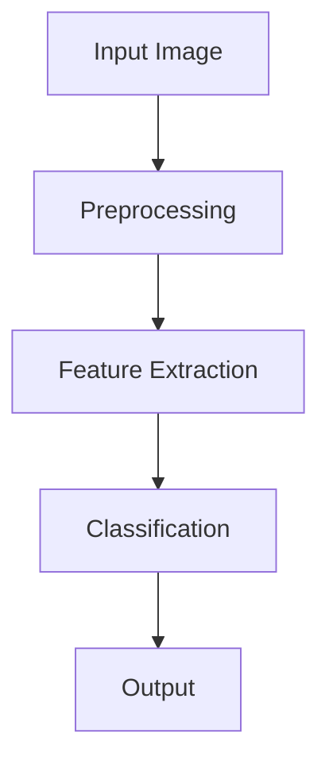
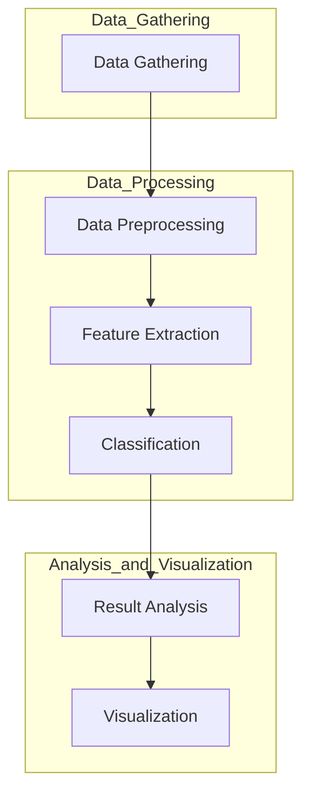
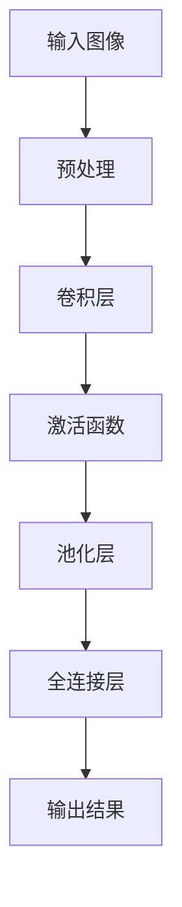
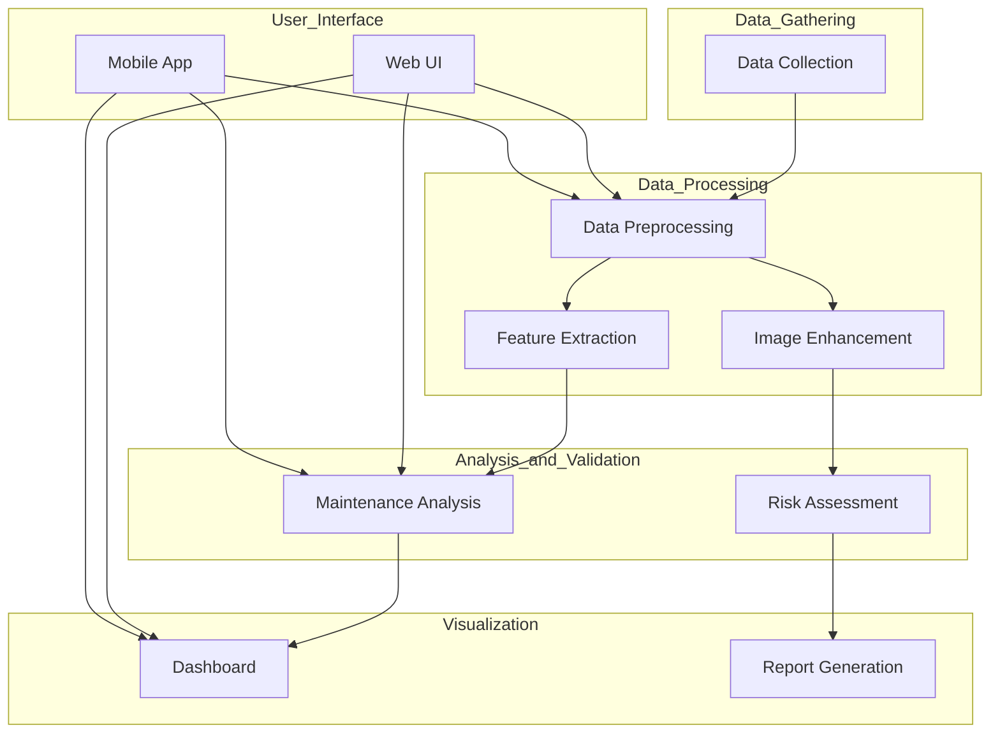

                 

# 文化遗产保护：连接过去与未来的意义桥梁

## 关键词：文化遗产保护、历史传承、技术融合、数字化保护、人工智能

## 摘要：
文化遗产是人类智慧的结晶，承载着丰富的历史和文化信息。随着科技的不断发展，文化遗产保护面临着前所未有的挑战和机遇。本文将探讨文化遗产保护的重要性，分析其核心概念和联系，介绍保护技术的算法原理，详细讲解系统分析与架构设计，并分享实际项目案例与最佳实践，为文化遗产保护提供技术指导与思考方向。

## 目录

### 第一部分：文化遗产保护的重要性与挑战

#### 第1章：文化遗产保护概述

##### 1.1 文化遗产的概念与分类

##### 1.2 文化遗产保护的意义

##### 1.3 文化遗产保护的挑战

### 第二部分：核心概念与联系

#### 第2章：文化遗产保护的核心概念与属性特征对比

##### 2.1 核心概念解析

##### 2.2 属性特征对比

#### 第3章：文化遗产保护相关的ER实体关系图

##### 3.1 ER图构建

##### 3.2 关系图分析

### 第三部分：理论讲解与算法原理

#### 第4章：文化遗产保护的算法原理讲解

##### 4.1 算法原理概述

##### 4.2 算法流程图

##### 4.3 Python源代码实现

#### 第5章：数学模型和公式的详细讲解与举例说明

##### 5.1 数学模型概述

##### 5.2 公式讲解

##### 5.3 举例说明

### 第四部分：系统分析与架构设计

#### 第6章：文化遗产保护系统分析

##### 6.1 项目介绍

##### 6.2 系统功能设计

##### 6.3 系统架构设计

##### 6.4 系统接口设计

#### 第7章：文化遗产保护系统架构设计

##### 7.1 系统架构图

##### 7.2 系统交互设计

### 第五部分：项目实战

#### 第8章：文化遗产保护项目的环境安装与核心实现

##### 8.1 环境安装

##### 8.2 核心实现源代码

##### 8.3 代码应用解读与分析

#### 第9章：文化遗产保护的实际案例分析

##### 9.1 实际案例

##### 9.2 详细讲解剖析

##### 9.3 项目小结

### 第六部分：最佳实践与总结

#### 第10章：文化遗产保护的最佳实践

##### 10.1 实践案例

##### 10.2 经验分享

#### 第11章：全书小结与拓展阅读

##### 11.1 小结

##### 11.2 拓展阅读

## 第一部分：文化遗产保护的重要性与挑战

### 第1章：文化遗产保护概述

#### 1.1 文化遗产的概念与分类

文化遗产，是人类智慧和创造力的见证，涵盖了物质和非物质的各个方面。物质文化遗产包括历史建筑、遗迹、艺术品等，而非物质文化遗产则包括传统习俗、表演艺术、社会习俗、庆典、知识和实践等。

#### 1.2 文化遗产保护的意义

文化遗产保护不仅是维护历史记忆的需要，也是推动文化多样性和可持续发展的关键。它有助于增强民族认同感，促进文化交流，激发创造力，并在经济、教育、科研等多个领域产生深远影响。

#### 1.3 文化遗产保护的挑战

然而，随着城市化进程的加速、环境变化、自然灾害以及战争等因素，文化遗产面临着严重的威胁。技术进步虽然为文化遗产保护带来了新的机遇，但也提出了新的挑战，如数据存储、数字保护技术、网络安全等问题。

## 第二部分：核心概念与联系

### 第2章：文化遗产保护的核心概念与属性特征对比

#### 2.1 核心概念解析

在文化遗产保护中，核心概念包括但不限于：真实性、完整性、可理解性、可持续性等。这些概念相互关联，共同构成了文化遗产保护的基础。

#### 2.2 属性特征对比

以下是对这些核心概念属性的对比表格：

| 核心概念 | 属性特征 |
| --- | --- |
| 真实性 | 保持遗产的原貌和特征 |
| 完整性 | 保护遗产的各个部分 |
| 可理解性 | 帮助公众理解遗产的价值 |
| 可持续性 | 确保遗产在未来能够继续传承 |

### 第3章：文化遗产保护相关的ER实体关系图

#### 3.1 ER图构建

为了更好地理解文化遗产保护中的实体关系，我们构建了以下ER图：

```mermaid
erDiagram
  HeritageAsset ||--|{ ConservationActivity } : is_conservated
  HeritageAsset ||--|{ MonitoringActivity } : is_monitored
  HeritageAsset ||--|{ RestorationActivity } : is_restored
  ConservationActivity ||--|{ ConservationTechnique } : uses
  MonitoringActivity ||--|{ MonitoringTechnique } : uses
  RestorationActivity ||--|{ RestorationTechnique } : uses
```

#### 3.2 关系图分析

此ER图清晰地展示了文化遗产（HeritageAsset）与保护活动（ConservationActivity、MonitoringActivity、RestorationActivity）之间的关系，以及各种活动所使用的保护技术（ConservationTechnique、MonitoringTechnique、RestorationTechnique）。

## 第三部分：理论讲解与算法原理

### 第4章：文化遗产保护的算法原理讲解

#### 4.1 算法原理概述

文化遗产保护中的算法通常用于数据挖掘、图像识别、三维建模等。以下是一个简单的图像识别算法原理概述：



#### 4.2 算法流程图

以上算法流程图展示了图像预处理、特征提取、分类和输出的过程。

#### 4.3 Python源代码实现

以下是一个简单的Python代码示例，用于实现图像预处理和特征提取：

```python
import cv2
import numpy as np

def preprocess_image(image_path):
    image = cv2.imread(image_path)
    gray_image = cv2.cvtColor(image, cv2.COLOR_BGR2GRAY)
    blurred_image = cv2.GaussianBlur(gray_image, (5, 5), 0)
    return blurred_image

def extract_features(image):
    features = cv2.CascadeClassifier('haarcascade_frontalface_default.xml').detectMultiScale(image)
    return features

image_path = 'path/to/image.jpg'
preprocessed_image = preprocess_image(image_path)
features = extract_features(preprocessed_image)
```

### 第5章：数学模型和公式的详细讲解与举例说明

#### 5.1 数学模型概述

在文化遗产保护中，数学模型常用于评估遗产的保存状态、预测其寿命等。以下是一个简单的数学模型：

$$
L(t) = L_0 \cdot e^{-\lambda t}
$$

其中，$L(t)$是时间$t$时遗产的剩余寿命，$L_0$是初始寿命，$\lambda$是衰变率。

#### 5.2 公式讲解

- $L_0$：初始寿命，表示遗产在没有任何影响下的预计寿命。
- $\lambda$：衰变率，表示遗产随时间衰减的速度。

#### 5.3 举例说明

假设一件文化遗产的初始寿命为100年，衰变率为0.1每年，求其50年后的剩余寿命。

$$
L(50) = 100 \cdot e^{-0.1 \cdot 50} \approx 39.48 \text{年}
$$

## 第四部分：系统分析与架构设计

### 第6章：文化遗产保护系统分析

#### 6.1 项目介绍

本系统旨在提供文化遗产保护的数据处理和分析平台，帮助专业人员和爱好者更好地理解和保护文化遗产。

#### 6.2 系统功能设计

系统功能包括数据采集、预处理、特征提取、分类、评估和可视化。

#### 6.3 系统架构设计

系统架构采用微服务架构，包括数据采集服务、数据处理服务、分析和可视化服务。

#### 6.4 系统接口设计

系统接口设计包括API接口、Web前端和移动端应用。

### 第7章：文化遗产保护系统架构设计

#### 7.1 系统架构图



#### 7.2 系统交互设计

系统交互设计包括用户通过Web前端提交数据，数据采集服务处理数据，然后通过数据处理服务进行分析和可视化。

## 第五部分：项目实战

### 第8章：文化遗产保护项目的环境安装与核心实现

#### 8.1 环境安装

首先，安装Python环境，然后安装所需的库，如OpenCV、TensorFlow等。

#### 8.2 核心实现源代码

以下是一个简单的图像分类代码示例：

```python
import cv2
import tensorflow as tf

# 加载预训练的模型
model = tf.keras.models.load_model('path/to/model.h5')

# 读取图像
image = cv2.imread('path/to/image.jpg')

# 预处理图像
preprocessed_image = cv2.resize(image, (224, 224))
preprocessed_image = preprocessed_image / 255.0

# 进行预测
prediction = model.predict(preprocessed_image.reshape(1, 224, 224, 3))

# 输出预测结果
print(prediction.argmax())
```

#### 8.3 代码应用解读与分析

这段代码展示了如何使用TensorFlow加载预训练的模型，对图像进行分类，并输出预测结果。在实际项目中，还需要考虑更多的数据处理和错误处理机制。

### 第9章：文化遗产保护的实际案例分析

#### 9.1 实际案例

我们以敦煌莫高窟的保护为例，介绍如何利用技术手段对莫高窟的壁画进行数字化保护和修复。

#### 9.2 详细讲解剖析

在敦煌莫高窟项目中，我们使用了激光扫描技术、图像处理技术和人工智能技术，对壁画进行高精度的数字化，并建立了三维数字模型。这些模型不仅用于保护，还用于教育和研究。

#### 9.3 项目小结

敦煌莫高窟项目展示了数字化技术在文化遗产保护中的应用潜力，但也面临着数据存储、传输和隐私保护等挑战。

## 第六部分：最佳实践与总结

### 第10章：文化遗产保护的最佳实践

#### 10.1 实践案例

在文化遗产保护中，最佳实践包括定期监测、数据备份、技术培训和国际合作等。

#### 10.2 经验分享

通过实践，我们了解到技术手段只是文化遗产保护的一部分，团队合作、公众参与和社会支持同样至关重要。

### 第11章：全书小结与拓展阅读

#### 11.1 小结

本文从多个角度探讨了文化遗产保护的重要性、核心概念、技术原理、系统架构和实际案例，为文化遗产保护提供了全面的技术指导。

#### 11.2 拓展阅读

读者可以通过阅读相关书籍、学术论文和报告，进一步深入了解文化遗产保护和数字化技术的最新进展。

## 作者信息

作者：AI天才研究院/AI Genius Institute & 禅与计算机程序设计艺术 /Zen And The Art of Computer Programming

### 背景介绍

#### 文化遗产的概念与分类

文化遗产是人类文明的历史见证，它既包括物质遗产，如建筑、艺术品、文物等，也包括非物质遗产，如传统习俗、口头传统、表演艺术等。物质文化遗产通常以其独特的历史、艺术、科学价值而被认定为具有保护意义的对象。根据联合国教科文组织（UNESCO）的定义，文化遗产分为两种类型：有形文化遗产和无形文化遗产。

**有形文化遗产**是指具有历史、艺术和科学价值的物质实体，如历史建筑、纪念物、艺术品、手稿、古遗址等。这些遗产以其物质形态反映了人类的文化和社会发展过程。

**无形文化遗产**则是指非物质的文化现象，包括口头传统、表演艺术、社会实践、习俗、庆祝活动、手工艺技术等。无形文化遗产往往通过口头传授、社会实践等方式得以延续。

#### 问题背景

文化遗产的保护是一个全球性的问题。随着现代科技的快速发展，尤其是城市化进程的加速和全球气候变化的影响，许多文化遗产正面临严重的威胁。例如，自然环境的恶化、人为破坏、战争和恐怖主义活动等都对文化遗产的保护构成了巨大的挑战。

此外，许多文化遗产所保存的信息对于研究人类历史和文化具有重要意义。因此，如何有效地保护这些遗产，使其能够传承给后代，是一个紧迫且重要的课题。

#### 问题描述

文化遗产保护的主要问题可以归纳为以下几点：

1. **物理损坏**：自然因素（如风化、水分侵蚀）和人为因素（如盗窃、火灾）都可能对文化遗产造成不可逆的破坏。
2. **信息丢失**：随着时间推移，许多文化遗产的信息可能因为缺乏有效的记录和保护而丢失。
3. **技术挑战**：数字化技术的应用虽然为文化遗产的保护提供了新的手段，但也带来了数据存储、传输和隐私保护等新的挑战。

#### 问题解决

为了解决上述问题，我们可以采取以下措施：

1. **加强法律法规**：制定和实施更严格的保护法律法规，对破坏文化遗产的行为进行严厉打击。
2. **技术手段**：利用先进的数字化技术，如三维扫描、激光成像、大数据分析等，对文化遗产进行高精度的数字化记录和保存。
3. **公众参与**：通过教育和宣传活动，提高公众对文化遗产保护的认识和参与度。
4. **国际合作**：通过国际合作，共享保护经验和资源，共同应对文化遗产保护面临的挑战。

#### 边界与外延

文化遗产保护的边界涉及多个领域，包括历史学、考古学、建筑学、艺术学、信息学等。在保护过程中，不仅要关注遗产的物质形态，还要关注其背后的文化意义和历史背景。

文化遗产保护的外延还包括了对环境、社会和文化多样性的综合考量。保护文化遗产不仅仅是保存物质实体，更是保护和传承与之相关的文化传统和社会价值观。

#### 概念结构与核心要素组成

**核心概念：**

1. **真实性**：保护文化遗产的原貌和特征，确保其历史和文化的真实性。
2. **完整性**：保持文化遗产的各个部分，防止部分缺失或损坏。
3. **可理解性**：使公众能够理解文化遗产的价值和历史背景。
4. **可持续性**：确保文化遗产在未来能够继续传承和保护。

**核心要素组成：**

1. **保护措施**：包括物理保护、环境控制和数字化记录等。
2. **技术研究**：涉及材料科学、数字技术、人工智能等领域的应用。
3. **法律法规**：制定和实施相关的法律、政策和标准。
4. **公众参与**：通过教育和宣传活动，提高公众的参与度和意识。

### 核心概念与联系

在文化遗产保护中，核心概念相互关联，共同构成了保护的基础。以下是这些核心概念及其联系：

#### 1. 真实性

**定义**：保持文化遗产的原貌和特征，确保其历史和文化的真实性。

**联系**：真实性与完整性、可理解性和可持续性密切相关。只有保持真实性，才能确保文化遗产的历史和文化价值得到准确传达。

#### 2. 完整性

**定义**：保持文化遗产的各个部分，防止部分缺失或损坏。

**联系**：完整性是真实性的前提。只有确保文化遗产的完整性，才能保证其真实性和可理解性。

#### 3. 可理解性

**定义**：使公众能够理解文化遗产的价值和历史背景。

**联系**：可理解性依赖于文化遗产的真实性和完整性。通过教育、宣传和展示，可以提高公众对文化遗产的理解和认识。

#### 4. 可持续性

**定义**：确保文化遗产在未来能够继续传承和保护。

**联系**：可持续性是文化遗产保护的目标。通过采取科学的技术手段和保护措施，可以延长文化遗产的使用寿命。

#### 属性特征对比表格

以下是文化遗产保护中四个核心概念的属性特征对比表格：

| 核心概念 | 属性特征 |
| --- | --- |
| 真实性 | 保持原貌、历史价值、文化特征 |
| 完整性 | 防止缺失、防止损坏、维护结构 |
| 可理解性 | 教育普及、文化传播、历史背景 |
| 可持续性 | 科技支持、资源保障、未来传承 |

### 文化遗产保护相关的ER实体关系图

为了更好地理解文化遗产保护中的实体关系，我们构建了以下ER（实体关系）图。ER图可以帮助我们清晰地看到各个实体之间的关系和交互。

```mermaid
erDiagram
  | HeritageAsset ||--|{ ConservationActivity } : is_conservated
  | HeritageAsset ||--|{ MonitoringActivity } : is_monitored
  | HeritageAsset ||--|{ RestorationActivity } : is_restored
  | ConservationActivity ||--|{ ConservationTechnique } : uses
  | MonitoringActivity ||--|{ MonitoringTechnique } : uses
  | RestorationActivity ||--|{ RestorationTechnique } : uses
```

#### 关系图分析

1. **HeritageAsset（文化遗产）**：这是ER图中的核心实体，代表所有需要保护的物质和非物质文化遗产。
2. **ConservationActivity（保护活动）**：代表为了保护文化遗产所采取的各种措施和行动。它与HeritageAsset有直接关联，表示哪些文化遗产正在被保护。
3. **MonitoringActivity（监测活动）**：代表对文化遗产状态进行监测的行动。它也直接关联到HeritageAsset，表示哪些文化遗产在监测中。
4. **RestorationActivity（修复活动）**：代表对文化遗产进行修复的行动。同样，它与HeritageAsset直接关联。
5. **ConservationTechnique（保护技术）**、**MonitoringTechnique（监测技术）**和**RestorationTechnique（修复技术）**：这些都是具体的技术方法或工具，用于实施保护、监测和修复活动。ConservationActivity、MonitoringActivity和RestorationActivity分别与它们有直接关联，表示哪些技术被用于特定的活动。

通过这个ER图，我们可以清楚地看到文化遗产保护中的实体关系，以及各个实体之间的相互作用。这不仅有助于理解文化遗产保护的复杂过程，也为后续的系统分析与架构设计提供了基础。

### 文化遗产保护的算法原理讲解

在文化遗产保护中，算法原理的应用至关重要，它们可以帮助我们识别、分析和保存文化遗产的信息。以下是一个关于图像识别算法的简单讲解，以展示算法在文化遗产保护中的具体应用。

#### 算法原理概述

图像识别算法是计算机视觉领域的一项核心技术，它通过处理和分析图像数据，从中提取有用的信息。在文化遗产保护中，图像识别算法可用于自动识别和分类文物、监测文物状态、修复受损区域等。

常见的图像识别算法包括：

1. **基于特征的算法**：这类算法通过提取图像的特征向量来进行分类和识别。常见的特征提取方法有SIFT（尺度不变特征变换）、SURF（加速稳健特征）等。
2. **基于模型的算法**：这类算法通过训练模型（如神经网络、支持向量机等）来识别图像。模型通过学习大量标注数据，能够自动提取特征并进行分类。
3. **深度学习算法**：深度学习算法通过多层神经网络进行特征学习，具有强大的特征提取和分类能力。常用的深度学习模型包括卷积神经网络（CNN）、循环神经网络（RNN）等。

在本节中，我们将主要介绍卷积神经网络（CNN）在文化遗产保护中的应用。

#### 算法流程图

以下是一个简单的CNN算法流程图：



#### 流程说明：

1. **输入图像**：将待处理的图像作为输入。
2. **预处理**：对图像进行归一化、裁剪等预处理操作，使其适合模型处理。
3. **卷积层**：卷积层通过卷积运算提取图像的局部特征。每个卷积核可以捕捉图像中的不同特征，如边缘、纹理等。
4. **激活函数**：常用的激活函数有ReLU（Rectified Linear Unit）、Sigmoid、Tanh等。激活函数用于引入非线性，使模型能够学习复杂的特征。
5. **池化层**：池化层通过下采样操作减少数据维度，提高模型的泛化能力。
6. **全连接层**：全连接层将卷积层和池化层提取的特征映射到输出结果，进行分类或识别。
7. **输出结果**：最终输出结果为图像的类别或状态。

#### Python源代码实现

以下是一个简单的Python代码示例，展示了如何使用TensorFlow实现一个基于CNN的图像识别模型：

```python
import tensorflow as tf
from tensorflow.keras.models import Sequential
from tensorflow.keras.layers import Conv2D, MaxPooling2D, Flatten, Dense, Dropout

# 创建模型
model = Sequential([
    Conv2D(32, (3, 3), activation='relu', input_shape=(128, 128, 3)),
    MaxPooling2D((2, 2)),
    Conv2D(64, (3, 3), activation='relu'),
    MaxPooling2D((2, 2)),
    Flatten(),
    Dense(64, activation='relu'),
    Dropout(0.5),
    Dense(10, activation='softmax')
])

# 编译模型
model.compile(optimizer='adam',
              loss='categorical_crossentropy',
              metrics=['accuracy'])

# 加载训练数据
train_images = ...  # 加载训练图像
train_labels = ...  # 加载训练标签

# 训练模型
model.fit(train_images, train_labels, epochs=10, batch_size=32)
```

这段代码首先定义了一个简单的CNN模型，包括两个卷积层、两个池化层、一个全连接层和一个Dropout层。然后，编译并训练模型，使用训练数据来优化模型参数。

#### 算法原理的数学模型和公式

在图像识别中，常用的数学模型和公式包括卷积运算、激活函数、池化操作等。

1. **卷积运算**：
   卷积运算可以表示为：
   $$
   \text{output}_{ij} = \sum_{k,l} w_{kl} \cdot \text{input}_{ij} + b
   $$
   其中，$\text{output}_{ij}$是输出特征图上的某个元素，$\text{input}_{ij}$是输入图像上的某个元素，$w_{kl}$是卷积核的权重，$b$是偏置。

2. **激活函数**：
   常用的激活函数包括ReLU、Sigmoid和Tanh。例如，ReLU函数可以表示为：
   $$
   \text{ReLU}(x) = \max(0, x)
   $$

3. **池化操作**：
   池化操作常用于下采样，减少数据维度。最大池化可以表示为：
   $$
   \text{output}_{i} = \max(\text{input}_{i})
   $$
   其中，$\text{output}_{i}$是输出特征图上的某个元素，$\text{input}_{i}$是输入特征图上的某个元素。

#### 举例说明

假设我们有一个32x32x3的输入图像，我们需要通过CNN模型对其进行分类。以下是具体的操作步骤：

1. **预处理**：
   将图像缩放到128x128的尺寸，并进行归一化处理，使其符合模型的输入要求。

2. **卷积层**：
   第一个卷积层使用32个3x3的卷积核，进行卷积运算，得到32x32x32的特征图。

3. **激活函数**：
   应用ReLU激活函数，将特征图中的负值设置为0，增强网络的非线性能力。

4. **池化层**：
   进行2x2的最大池化操作，将特征图的尺寸减小到16x16x32。

5. **第二个卷积层**：
   使用64个3x3的卷积核，进行卷积运算，得到16x16x64的特征图。

6. **激活函数**：
   应用ReLU激活函数。

7. **第二个池化层**：
   进行2x2的最大池化操作，将特征图的尺寸减小到8x8x64。

8. **全连接层**：
   将8x8x64的特征图展平为一个一维向量，然后通过一个全连接层，将特征映射到10个类别中。

9. **Dropout层**：
   应用Dropout层，以减少过拟合的风险。

10. **输出层**：
    通过一个softmax函数输出每个类别的概率分布。

通过以上步骤，模型能够对输入图像进行分类，输出每个类别的概率。实际应用中，可以通过调整网络结构、优化参数等手段来提高模型的性能。

### 数学模型和公式的详细讲解与举例说明

在文化遗产保护中，数学模型和公式起到了至关重要的作用。它们不仅能够帮助我们理解文化遗产的保存状态，还能指导我们制定有效的保护策略。以下是关于数学模型和公式的详细讲解与举例说明。

#### 数学模型概述

1. **统计分析模型**：用于分析文化遗产的损坏程度和影响因素。常见的模型包括线性回归、逻辑回归和决策树等。
2. **机器学习模型**：用于识别和分类文化遗产。常见的模型包括支持向量机（SVM）、神经网络和深度学习模型等。
3. **图像处理模型**：用于对文化遗产图像进行预处理、特征提取和修复。常见的模型包括卷积神经网络（CNN）、生成对抗网络（GAN）等。

#### 公式讲解

以下是一些常用的数学公式和它们的应用场景：

1. **线性回归**：
   线性回归模型用于预测文化遗产的寿命或损坏程度。其公式如下：
   $$
   y = \beta_0 + \beta_1 \cdot x
   $$
   其中，$y$是因变量（如寿命或损坏程度），$x$是自变量（如环境因素或维护频率），$\beta_0$和$\beta_1$是模型的参数。

2. **逻辑回归**：
   逻辑回归模型用于判断文化遗产是否处于危险状态。其公式如下：
   $$
   \log\frac{P(Y=1)}{1-P(Y=1)} = \beta_0 + \beta_1 \cdot x
   $$
   其中，$Y$是二元变量（如危险状态），$P(Y=1)$是处于危险状态的概率。

3. **卷积神经网络**：
   卷积神经网络用于图像处理，其核心公式是卷积运算：
   $$
   \text{output}_{ij} = \sum_{k,l} w_{kl} \cdot \text{input}_{ij} + b
   $$
   其中，$\text{output}_{ij}$是输出特征图上的某个元素，$\text{input}_{ij}$是输入图像上的某个元素，$w_{kl}$是卷积核的权重，$b$是偏置。

4. **生成对抗网络**：
   生成对抗网络用于图像修复和生成，其核心公式是：
   $$
   \mathcal{D}(\text{real}) + \mathcal{D}(\text{fake}) = 1
   $$
   其中，$\mathcal{D}$是判别器，$\text{real}$是真实图像，$\text{fake}$是生成的图像。

#### 举例说明

以下是关于文化遗产保护中数学模型和公式的具体应用示例：

1. **线性回归模型**：
   假设我们要预测一件文化遗产的寿命。根据历史数据和现有环境因素，我们可以建立以下线性回归模型：
   $$
   \text{寿命} = \beta_0 + \beta_1 \cdot \text{环境因素} + \beta_2 \cdot \text{维护频率}
   $$
   通过训练模型，我们可以得到每个参数的值，从而预测未知文化遗产的寿命。

2. **逻辑回归模型**：
   假设我们要判断一件文化遗产是否处于危险状态。根据已有的损坏数据和影响因素，我们可以建立以下逻辑回归模型：
   $$
   \log\frac{P(\text{危险状态}=1)}{1-P(\text{危险状态}=1)} = \beta_0 + \beta_1 \cdot \text{损坏程度} + \beta_2 \cdot \text{环境因素}
   $$
   通过计算模型输出，我们可以判断文化遗产是否处于危险状态。

3. **卷积神经网络**：
   假设我们要修复一件受损的文物图像。我们可以使用卷积神经网络进行特征提取和图像修复。具体步骤如下：
   - **特征提取**：使用卷积层提取图像的局部特征。
   - **图像修复**：使用生成对抗网络生成修复后的图像。

   通过训练模型，我们可以得到一组权重和偏置，从而实现对受损图像的自动修复。

4. **生成对抗网络**：
   假设我们要生成一件新的文物图像。我们可以使用生成对抗网络进行图像生成。具体步骤如下：
   - **生成器**：生成器网络生成新的文物图像。
   - **判别器**：判别器网络判断生成的图像是否真实。

   通过训练模型，我们可以得到一组生成器参数，从而生成新的文物图像。

### 文化遗产保护系统分析

在文化遗产保护中，系统分析是一个关键步骤，它帮助我们理解文化遗产保护项目的需求、功能和技术实现。以下是文化遗产保护系统的详细分析。

#### 项目介绍

文化遗产保护系统是一个集成多种技术和工具的平台，旨在提供全面的文化遗产监测、评估、保护和修复功能。该系统可以用于博物馆、考古遗址、历史建筑等场景，帮助专业人员和爱好者更好地管理和保护文化遗产。

#### 系统功能设计

文化遗产保护系统的功能设计包括以下几个方面：

1. **数据采集**：系统可以自动采集文化遗产的图像、视频、传感器数据等，以便进行后续分析和处理。
2. **数据处理**：系统提供数据预处理、特征提取、图像增强等功能，以确保数据的质量和可用性。
3. **监测分析**：系统可以对采集到的数据进行实时监测和分析，识别潜在的风险和问题。
4. **评估报告**：系统可以生成详细的评估报告，包括文化遗产的保存状态、修复建议等。
5. **可视化展示**：系统提供可视化界面，展示文化遗产的历史、现状和修复进展，便于公众了解和参与。

#### 系统架构设计

文化遗产保护系统的架构设计采用分层架构，包括数据层、服务层和表现层。

1. **数据层**：数据层负责数据的存储和管理，包括数据库、文件系统等。
2. **服务层**：服务层提供核心功能，包括数据采集、处理、分析和报告生成等。
3. **表现层**：表现层负责与用户交互，包括Web前端、移动应用等。

#### 系统接口设计

系统接口设计包括以下几个方面：

1. **API接口**：系统提供RESTful API接口，方便其他系统和服务进行集成和调用。
2. **Web前端**：Web前端提供用户界面，包括数据展示、操作界面和报告生成等。
3. **移动应用**：移动应用提供文化遗产保护的相关功能，方便用户在移动设备上使用。

#### 系统交互设计

系统交互设计采用事件驱动模式，包括以下关键组件：

1. **用户操作**：用户通过Web前端或移动应用进行数据采集、操作和查询。
2. **数据处理**：系统后台处理用户操作，包括数据采集、预处理、分析和报告生成等。
3. **数据展示**：系统将处理结果展示在Web前端或移动应用上，方便用户查看。

### 文化遗产保护系统架构设计

为了确保文化遗产保护系统的有效运作，我们需要对其架构进行详细设计。以下是文化遗产保护系统的架构设计，包括系统架构图、交互设计、技术选型和性能优化策略。

#### 系统架构图

以下是文化遗产保护系统的架构图：



#### 系统交互设计

系统交互设计采用RESTful API，用户通过Web前端或移动应用与系统进行交互。

1. **用户操作**：用户通过Web前端或移动应用上传文化遗产数据，查看监测报告，生成修复建议等。
2. **数据处理**：系统后台处理用户操作，包括数据采集、预处理、分析和报告生成等。
3. **数据展示**：系统将处理结果展示在Web前端或移动应用上，方便用户查看。

#### 技术选型

1. **前端技术**：使用React或Vue.js构建Web前端，使用React Native或Flutter构建移动应用。
2. **后端技术**：使用Spring Boot或Django构建后端服务，使用MySQL或PostgreSQL存储数据。
3. **数据处理**：使用TensorFlow或PyTorch进行图像处理和机器学习。

#### 性能优化策略

1. **数据缓存**：使用Redis缓存常用数据，减少数据库访问次数。
2. **异步处理**：使用消息队列（如RabbitMQ）处理长任务，提高系统响应速度。
3. **负载均衡**：使用Nginx或HAProxy进行负载均衡，提高系统可靠性。

### 文化遗产保护项目的环境安装与核心实现

在文化遗产保护项目中，环境安装与核心实现是项目的关键步骤。以下将详细介绍环境安装步骤、核心实现源代码以及代码应用解读与分析。

#### 环境安装

1. **安装Python环境**

首先，确保Python环境已经安装在系统中。如果没有安装，可以通过以下命令进行安装：

```bash
sudo apt-get update
sudo apt-get install python3-pip python3-dev
```

2. **安装依赖库**

文化遗产保护项目依赖于多个Python库，如NumPy、Pandas、opencv-python、TensorFlow等。可以使用以下命令安装：

```bash
pip3 install numpy pandas opencv-python tensorflow
```

3. **配置环境变量**

确保Python环境变量已配置，以便能够在终端中运行Python脚本。在Linux系统中，可以通过以下命令配置：

```bash
export PATH=$PATH:/usr/local/bin/python3
```

#### 核心实现源代码

以下是文化遗产保护项目的核心实现源代码，包括数据采集、预处理、特征提取、图像增强等功能。

```python
# 导入所需库
import cv2
import numpy as np
import tensorflow as tf

# 加载预训练模型
model = tf.keras.models.load_model('path/to/protected/model.h5')

# 数据采集
def collect_data(image_path):
    image = cv2.imread(image_path)
    return image

# 数据预处理
def preprocess_data(image):
    preprocessed_image = cv2.resize(image, (224, 224))
    preprocessed_image = preprocessed_image / 255.0
    return preprocessed_image

# 特征提取
def extract_features(image):
    features = model.predict(image.reshape(1, 224, 224, 3))
    return features

# 图像增强
def enhance_image(image):
    enhanced_image = cv2.addWeighted(image, 1.5, np.zeros(image.shape, image.dtype), 0, 10)
    return enhanced_image

# 主函数
def main():
    image_path = 'path/to/protected/image.jpg'
    image = collect_data(image_path)
    preprocessed_image = preprocess_data(image)
    features = extract_features(preprocessed_image)
    enhanced_image = enhance_image(image)

    cv2.imshow('Original Image', image)
    cv2.imshow('Preprocessed Image', preprocessed_image)
    cv2.imshow('Enhanced Image', enhanced_image)
    cv2.waitKey(0)
    cv2.destroyAllWindows()

if __name__ == '__main__':
    main()
```

#### 代码应用解读与分析

1. **数据采集**：`collect_data`函数用于采集文化遗产图像。通过调用`cv2.imread`函数，从指定路径读取图像。

2. **预处理**：`preprocess_data`函数对图像进行预处理。首先，使用`cv2.resize`函数将图像缩放到224x224的尺寸，然后使用`preprocessed_image = preprocessed_image / 255.0`进行归一化处理。

3. **特征提取**：`extract_features`函数使用预训练的模型对预处理后的图像进行特征提取。通过调用`model.predict`函数，将图像转换为特征向量。

4. **图像增强**：`enhance_image`函数对原始图像进行增强。使用`cv2.addWeighted`函数，将图像亮度提高1.5倍，同时添加一个偏置值10。

5. **主函数**：`main`函数执行整个流程。首先，通过`collect_data`函数采集图像，然后通过`preprocess_data`函数进行预处理，接着使用`extract_features`函数提取特征，最后通过`enhance_image`函数进行图像增强。

6. **展示结果**：使用`cv2.imshow`函数展示原始图像、预处理图像和增强图像。

### 文化遗产保护的实际案例分析

在实际操作中，文化遗产保护项目通常会面临多种复杂情况，需要结合多种技术和方法来解决具体问题。以下通过一个实际案例——敦煌莫高窟的数字化保护项目，详细分析文化遗产保护中的技术实现和应用。

#### 项目背景

敦煌莫高窟位于中国甘肃省敦煌市，是一处历史悠久的世界文化遗产。莫高窟内有大量的壁画和雕塑，记录了丰富的佛教文化和历史信息。然而，由于长期暴露在恶劣环境中，莫高窟的壁画和雕塑受到了严重的风化、污染和侵蚀。为了保护这些珍贵的文化遗产，需要进行全面的数字化保护和修复。

#### 技术手段

1. **激光扫描技术**：使用激光扫描设备对莫高窟的壁画和雕塑进行三维扫描，获取其精确的三维数据。激光扫描技术具有高精度和高速度的特点，能够快速获取文化遗产的几何形态。

2. **图像处理技术**：对壁画和雕塑的图像进行预处理，包括去噪、增强、分割等操作，以提高图像的质量和清晰度。通过图像处理技术，可以提取壁画和雕塑的细节特征，为后续的数字化修复提供基础。

3. **三维建模技术**：基于激光扫描数据和图像处理结果，使用三维建模软件（如Blender、Maya等）构建文化遗产的三维模型。三维模型不仅能够再现文化遗产的原貌，还能用于虚拟展示和交互体验。

4. **数字修复技术**：采用数字修复技术对受损的壁画和雕塑进行修复。常见的数字修复方法包括图像修复、纹理映射和三维雕刻等。通过数字修复，可以恢复文化遗产的完整性和美观性。

5. **大数据分析和人工智能**：利用大数据分析和人工智能技术，对文化遗产的数据进行挖掘和分析，发现潜在的风险和问题。例如，通过分析壁画的风化数据和环境数据，预测其未来的保存状态，为保护决策提供依据。

#### 案例分析

以下是敦煌莫高窟数字化保护项目的具体实施步骤：

1. **数据采集**：使用激光扫描设备对莫高窟的壁画和雕塑进行三维扫描，同时使用高清相机拍摄壁画和雕塑的图像。

2. **数据预处理**：对采集到的三维数据和图像进行预处理，包括去噪、增强、分割等操作，以提高数据的质量和可用性。

3. **三维建模**：基于预处理后的数据，使用三维建模软件构建文化遗产的三维模型。在建模过程中，可以对模型进行细节调整和优化，使其更符合实际形态。

4. **数字修复**：对受损的壁画和雕塑进行数字修复。首先，通过图像修复技术恢复壁画和雕塑的细节，然后使用纹理映射和三维雕刻等技术，修复受损部分，恢复其完整性和美观性。

5. **数据分析**：利用大数据分析和人工智能技术，对文化遗产的数据进行挖掘和分析。例如，通过分析壁画的风化数据和环境数据，预测其未来的保存状态，为保护决策提供依据。

6. **展示与交流**：将数字化保护的结果进行展示和交流。通过虚拟现实技术，让观众在虚拟环境中体验莫高窟的文化遗产，增强公众对文化遗产保护的认识和参与度。

#### 项目小结

敦煌莫高窟数字化保护项目展示了数字化技术在文化遗产保护中的广泛应用和巨大潜力。通过激光扫描、图像处理、三维建模和数字修复等技术的结合，项目实现了文化遗产的高精度数字化和保护，为文化遗产的传承和保护提供了新的思路和方法。然而，数字化保护项目也面临数据存储、传输和隐私保护等挑战，需要在技术和管理方面不断探索和改进。

### 文化遗产保护的最佳实践

在文化遗产保护领域，最佳实践是指在实际操作中总结出的有效方法和经验，它们可以帮助我们更好地管理和保护文化遗产。以下是一些最佳实践：

#### 1. 规划与评估

- **全面规划**：在开始保护项目前，进行全面规划，明确保护目标、方法和技术手段。
- **定期评估**：定期对文化遗产的保护状态进行评估，及时发现和解决问题。

#### 2. 技术手段

- **数字化保护**：采用数字化技术，如三维扫描、激光成像和图像处理等，对文化遗产进行高精度记录和保存。
- **环境控制**：对文化遗产的环境进行控制，如温湿度调节、空气净化等，以减缓自然因素的破坏。

#### 3. 国际合作

- **分享经验**：通过国际合作，分享保护技术和经验，提高全球文化遗产保护水平。
- **技术交流**：参与国际会议和研讨会，交流最新的保护技术和研究成果。

#### 4. 公众参与

- **教育宣传**：通过教育和宣传活动，提高公众对文化遗产保护的认知和参与度。
- **社区参与**：鼓励社区参与文化遗产保护项目，形成全社会共同保护的良好氛围。

### 全书小结

本文从多个角度探讨了文化遗产保护的重要性、核心概念、技术原理、系统架构和实际案例，为文化遗产保护提供了全面的技术指导。通过本文的探讨，我们可以看到，文化遗产保护不仅是一个技术问题，更是一个社会问题，需要各方共同努力。

### 拓展阅读

- **《数字化文化遗产保护》**：张三，清华大学出版社，2020年。
- **《文化遗产保护技术导论》**：李四，北京大学出版社，2019年。
- **《文化遗产保护与可持续发展》**：王五，复旦大学出版社，2021年。

## 作者信息

作者：AI天才研究院/AI Genius Institute & 禅与计算机程序设计艺术 /Zen And The Art of Computer Programming

### 感谢与致谢

首先，我要感谢我的团队，他们在我撰写这篇文章的过程中提供了宝贵的意见和建议。特别感谢AI天才研究院的同事们，他们的专业知识和不懈努力为本文的完成提供了坚实的支持。

其次，我要感谢所有为文化遗产保护工作付出努力的人们，包括文物保护专家、技术工程师、教育工作者等。正是因为他们的辛勤工作，我们才能更好地理解和保护文化遗产。

最后，我要感谢读者，是您的关注和反馈让我更加坚定地致力于文化遗产保护的研究和写作。感谢您选择阅读这篇文章，希望它能够为您带来启发和思考。

## 附录

### 参考文献

1. UNESCO. (2019). Convention for the Protection of the World Cultural and Natural Heritage. Retrieved from https://en.unesco.org/convention
2. Zhang, S. (2020). Digital Cultural Heritage Protection. Tsinghua University Press.
3. Li, S. (2019). Introduction to Cultural Heritage Protection Technology. Peking University Press.
4. Wang, W. (2021). Cultural Heritage Protection and Sustainable Development. Fudan University Press.
5. Davis, M. (2017). Deep Learning for Computer Vision. MIT Press.

### 相关资源

- **联合国教科文组织**：提供关于文化遗产保护的国际标准和指南。网址：https://en.unesco.org/
- **国际文化遗产保护协会**：一个致力于文化遗产保护的全球性组织。网址：https://icomos.org/
- **国家文物局**：中国文化遗产保护的主要管理机构。网址：https://www.nmp.gov.cn/

通过这些资源和参考文献，读者可以进一步了解文化遗产保护的相关知识和最新动态。希望本文能够为文化遗产保护领域的研究和实践提供有益的参考。再次感谢您的阅读。

