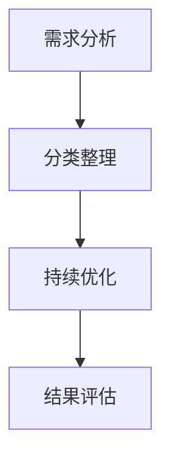
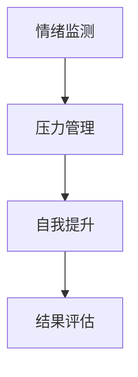
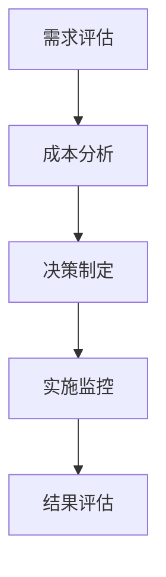
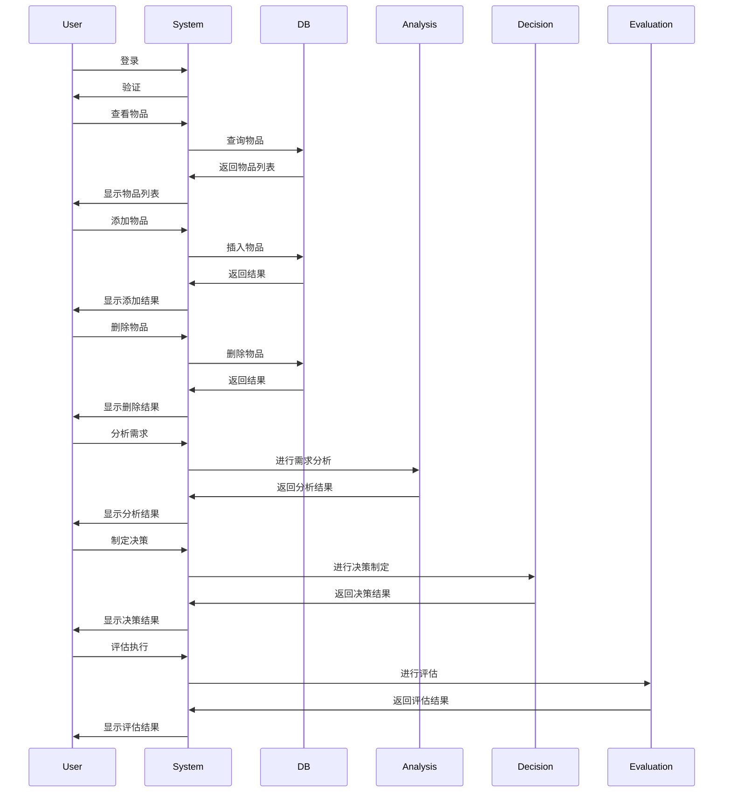
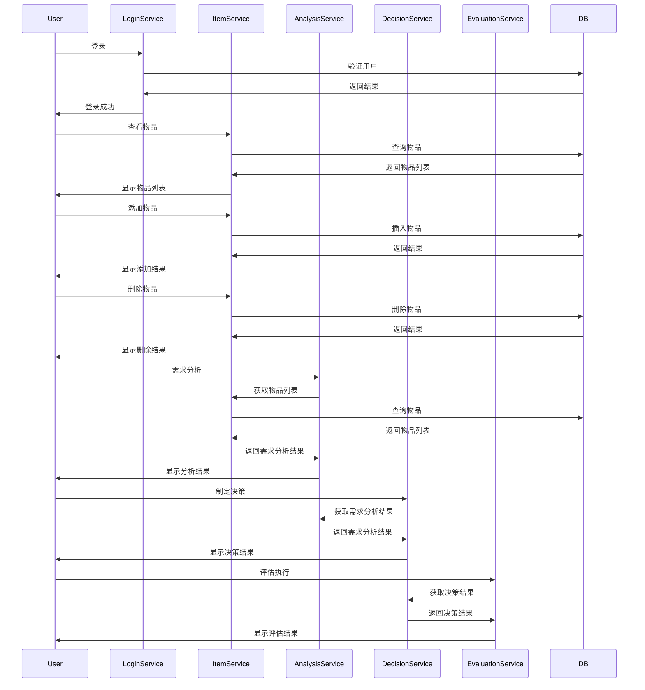

                 

### 文章标题

“断舍离哲学：在物质中寻找精神的自由”

### 关键词

- 断舍离
- 物质管理
- 精神自由
- 算法原理
- 系统架构设计
- 实际案例

### 摘要

本文将深入探讨“断舍离哲学”在现代社会的应用，通过剖析其核心概念，结合算法原理和系统架构设计，展示如何在物质世界中找到精神的自由。文章将从问题背景、核心概念、算法原理、系统设计与实战案例分析等多个方面进行详细阐述，旨在帮助读者理解并实践这一哲学理念，以实现内心的宁静与自由。

## 第一部分：背景介绍

### 第1章 问题背景

#### 1.1 社会物质过剩现象

在当今社会，物质财富的积累达到了前所未有的高度。然而，随着物质的丰富，人们却并未感受到预期的幸福和满足。相反，许多人陷入了物质过剩带来的困扰和焦虑之中。房屋、汽车、电子产品等物质财富的堆积，不仅占用空间，更在无形中占据了人们的心智资源。

#### 1.2 精神自由的重要性

精神自由是人类追求的终极目标之一。它不仅仅是心灵的宁静，更是一种能够洞察世界、自我和解的能力。在物质过剩的背景下，精神自由显得尤为珍贵。只有在精神上获得自由，人们才能真正摆脱物质的束缚，实现自我价值的提升。

#### 1.3 断舍离哲学的起源与发展

断舍离（Mise wa sukoshi, tsukuri wa kai）源自日本，由山下英子提出。这一哲学理念强调通过减少物质负担，让心灵得到自由，从而实现精神层面的提升。随着现代社会对精神健康的重视，断舍离哲学逐渐被广泛接受和传播。

#### 1.4 本书的主要目标

本书旨在帮助读者理解断舍离哲学的核心概念，通过算法原理和系统架构设计，提供一套实际可行的方法，帮助读者在物质世界中找到精神的自由。具体目标如下：

1. **剖析断舍离哲学的内涵**：解释物质与精神的关系，阐述断舍离的概念和哲学思想。
2. **介绍断舍离的实际应用**：通过算法和系统设计，展示如何将断舍离哲学应用于现实生活。
3. **提供实战指导**：通过实际案例分析和项目实践，帮助读者掌握断舍离的技巧和方法。
4. **实现精神自由**：通过减少物质负担，提升生活质量，最终实现精神上的自由与解脱。

### 第一部分小结

通过本章节的介绍，我们初步了解了断舍离哲学的背景和重要性。接下来的章节将深入探讨这一哲学理念的核心概念，并结合算法和系统设计，为读者提供实用的方法和指导。让我们继续深入探索，寻找在物质世界中实现精神自由的方法。

## 第二部分：核心概念与联系

### 第2章 核心概念

#### 2.1 物质与精神的关系

物质与精神是相互关联的。物质是精神的载体，而精神是物质的价值体现。在断舍离哲学中，物质与精神的关系被描述为一种动态的平衡。通过减少物质负担，我们可以让精神得到释放，从而实现内心的自由。

#### 2.2 断舍离的概念

断舍离是一种生活哲学，强调通过减少物质负担，实现精神上的自由。它不仅仅是一种整理技巧，更是一种生活方式。断舍离的核心在于“断”与“舍”，即断绝不需要的东西，舍弃不必要的负担。

#### 2.3 舍与得的哲学

在断舍离哲学中，舍与得是一个重要的概念。舍弃不需要的物质，不仅可以减少负担，还可以让我们更加专注于真正需要的东西，从而获得更多的精神财富。这种哲学理念可以看作是一种“少即是多”的智慧。

### 第3章 概念属性特征对比表格

为了更好地理解断舍离哲学的核心概念，我们可以通过对比表格的形式，展示物质与精神、断与舍、舍与得之间的关系。

#### 3.1 物质与精神的对比

| 特征 | 物质 | 精神 |
| --- | --- | --- |
| 载体 | 物理世界 | 心灵世界 |
| 形态 | 有形、可量化 | 无形、不可量化 |
| 功能 | 供给需求、提供便利 | 满足心理需求、提升价值 |
| 关系 | 物质决定精神 | 精神决定物质 |

#### 3.2 断与舍的对比

| 特征 | 断 | 舍 |
| --- | --- | --- |
| 动作 | 截断、切断 | 放弃、抛弃 |
| 目标 | 避免冗余、减少负担 | 获取自由、实现提升 |
| 方式 | 立即执行、快速处理 | 渐进式、理性决策 |

#### 3.3 舍与得的对比

| 特征 | 舍 | 得 |
| --- | --- | --- |
| 动作 | 舍弃、放下 | 获取、获得 |
| 意义 | 减少负担、释放空间 | 增加价值、提升质量 |
| 关系 | 舍与得是相辅相成的过程 | 舍为得创造条件，得为舍提供回报 |

### 第4章 ER实体关系图架构

为了更加清晰地展示断舍离哲学中的实体关系，我们可以通过ER（Entity-Relationship）实体关系图来描述。

#### 4.1 断舍离哲学中的实体

在断舍离哲学中，主要的实体包括：

1. **物质**：包括物品、财产等有形的实体。
2. **精神**：包括情感、意识、心理状态等无形的实体。
3. **断**：指断绝与物质的联系。
4. **舍**：指放弃不必要的物质。
5. **得**：指通过舍弃获得的回报。

#### 4.2 实体关系图

```mermaid
erDiagram
  物质 ||--o{ 断 } : 被断绝
  物质 ||--o{ 舍 } : 被舍弃
  物质 ||--o{ 得 } : 获得回报
  精神 ||--o{ 断 } : 心灵得到释放
  精神 ||--o{ 舍 } : 减轻心理负担
  精神 ||--o{ 得 } : 提升精神价值
```

### 第二部分小结

在本章节中，我们详细探讨了断舍离哲学的核心概念，并通过对比表格和ER实体关系图，清晰地展示了物质与精神、断与舍、舍与得之间的关系。接下来，我们将进一步深入探讨断舍离哲学的算法原理，帮助读者理解如何通过系统设计和实际应用，实现物质与精神的平衡，从而达到精神自由的境界。

## 第三部分：算法原理讲解

### 第5章 算法原理

#### 5.1 物质管理算法

物质管理算法的核心目标是通过优化物质的使用，减少不必要的负担。这一算法可以分解为以下几个步骤：

1. **需求分析**：评估个人或组织对物质的需求，确定哪些物质是必需的，哪些是可以舍弃的。
2. **分类整理**：将物质按照重要性、使用频率等进行分类，以便于后续的管理和决策。
3. **持续优化**：定期对物质进行评估和调整，确保其符合当前的需求和状况。

#### 5.2 精神管理算法

精神管理算法的目标是通过优化精神状态，提升生活质量。具体包括以下几个步骤：

1. **情绪监测**：通过自我反思、日记等方式，监控自己的情绪状态。
2. **压力管理**：通过放松技巧、运动等方式，缓解压力，保持心情愉快。
3. **自我提升**：通过学习、阅读、社交等方式，不断提升自我价值，实现精神成长。

#### 5.3 断舍离决策算法

断舍离决策算法是结合物质管理和精神管理的一种综合算法，旨在通过合理的决策，实现物质与精神的平衡。具体步骤如下：

1. **需求评估**：结合物质和精神管理的需求分析，确定当前的需求和目标。
2. **成本分析**：评估断舍离过程中可能产生的成本，包括物质成本、时间成本、情感成本等。
3. **决策制定**：根据需求评估和成本分析，制定具体的断舍离决策。
4. **实施监控**：在决策实施过程中，持续监控效果，及时进行调整。

### 第6章 算法mermaid流程图

为了更好地展示上述算法原理，我们可以使用mermaid流程图进行可视化描述。

#### 6.1 物质管理算法流程图



#### 6.2 精神管理算法流程图



#### 6.3 断舍离决策算法流程图



### 第7章 Python源代码讲解

为了使读者更好地理解上述算法原理，我们将使用Python语言进行实现，并提供详细的代码解释。

#### 7.1 物质管理算法代码

```python
# 物质管理算法

# 需求分析
def analyze_demand():
    # 示例代码，具体需求分析逻辑根据实际情况进行调整
    print("进行需求分析...")

# 分类整理
def classify_items():
    # 示例代码，具体分类整理逻辑根据实际情况进行调整
    print("进行分类整理...")

# 持续优化
def optimize_items():
    # 示例代码，具体持续优化逻辑根据实际情况进行调整
    print("进行持续优化...")

# 结果评估
def assess_results():
    # 示例代码，具体结果评估逻辑根据实际情况进行调整
    print("进行结果评估...")

# 主函数
def main():
    analyze_demand()
    classify_items()
    optimize_items()
    assess_results()

if __name__ == "__main__":
    main()
```

#### 7.2 精神管理算法代码

```python
# 精神管理算法

# 情绪监测
def monitor_emotion():
    # 示例代码，具体情绪监测逻辑根据实际情况进行调整
    print("进行情绪监测...")

# 压力管理
def manage_stress():
    # 示例代码，具体压力管理逻辑根据实际情况进行调整
    print("进行压力管理...")

# 自我提升
def self_improvement():
    # 示例代码，具体自我提升逻辑根据实际情况进行调整
    print("进行自我提升...")

# 结果评估
def assess_results():
    # 示例代码，具体结果评估逻辑根据实际情况进行调整
    print("进行结果评估...")

# 主函数
def main():
    monitor_emotion()
    manage_stress()
    self_improvement()
    assess_results()

if __name__ == "__main__":
    main()
```

#### 7.3 断舍离决策算法代码

```python
# 断舍离决策算法

# 需求评估
def assess_demand():
    # 示例代码，具体需求评估逻辑根据实际情况进行调整
    print("进行需求评估...")

# 成本分析
def analyze_cost():
    # 示例代码，具体成本分析逻辑根据实际情况进行调整
    print("进行成本分析...")

# 决策制定
def make_decision():
    # 示例代码，具体决策制定逻辑根据实际情况进行调整
    print("制定决策...")

# 实施监控
def monitor_implement():
    # 示例代码，具体实施监控逻辑根据实际情况进行调整
    print("实施监控...")

# 结果评估
def assess_results():
    # 示例代码，具体结果评估逻辑根据实际情况进行调整
    print("进行结果评估...")

# 主函数
def main():
    assess_demand()
    analyze_cost()
    make_decision()
    monitor_implement()
    assess_results()

if __name__ == "__main__":
    main()
```

### 第8章 数学模型和公式

在断舍离哲学的算法设计中，数学模型和公式起到了关键作用。以下我们将介绍物质管理算法、精神管理算法和断舍离决策算法的数学模型和公式。

#### 8.1 物质管理算法数学模型

物质管理算法的核心在于优化物质的使用，以减少不必要的负担。具体模型如下：

$$
\text{物质利用率} = \frac{\text{实际需求量}}{\text{库存量}}
$$

其中，物质利用率是衡量物质管理效果的重要指标。通过优化库存和需求，可以提升物质利用率。

#### 8.2 精神管理算法数学模型

精神管理算法的目标是提升精神状态，通过情绪监测、压力管理和自我提升来实现。具体模型如下：

$$
\text{精神状态评分} = \frac{\text{情绪监测评分} + \text{压力管理评分} + \text{自我提升评分}}{3}
$$

其中，精神状态评分是对个体精神状态的总体评价，分数越高，表示精神状态越好。

#### 8.3 断舍离决策算法数学模型

断舍离决策算法的核心在于通过需求评估、成本分析和决策制定，实现物质与精神的平衡。具体模型如下：

$$
\text{决策分数} = \text{需求评估分数} - \text{成本评估分数}
$$

其中，决策分数是衡量决策合理性的指标。如果决策分数大于0，表示决策可行；如果决策分数小于0，表示决策需调整。

### 第三部分小结

在本章节中，我们详细介绍了断舍离哲学的算法原理，并通过mermaid流程图和Python源代码，展示了物质管理算法、精神管理算法和断舍离决策算法的实现过程。数学模型和公式的引入，使得算法原理更加严谨和科学。接下来，我们将进一步探讨系统分析与架构设计方案，为读者提供更加全面和实用的指导。

## 第四部分：系统分析与架构设计方案

### 第9章 问题场景介绍

在现代生活中，物质过剩带来的问题越来越突出。许多人因为物品堆积而感到困扰，这不仅占用了大量的空间，还加重了心理负担。例如，办公桌上杂乱无章的文件、家中堆满的闲置物品，以及过度消费带来的债务压力，都是常见的现实问题。这些问题不仅影响了生活质量，还可能导致精神压力和情绪问题。因此，应用断舍离哲学来管理和优化物质和心灵，显得尤为重要。

#### 9.1 现实生活中的问题

- **空间占用**：过多的物品占据家庭和办公空间，使得环境变得杂乱，降低了生活和工作质量。
- **心理负担**：持续的物品积累会让人感到焦虑和压力，影响心理健康。
- **时间消耗**：寻找和管理过多的物品会浪费大量时间，降低工作效率。
- **经济压力**：购买不必要的物品可能导致经济负担加重，甚至形成债务。

#### 9.2 如何应用断舍离哲学解决问题

断舍离哲学提供了一套系统的方法，帮助人们有效地管理物质和心灵。通过以下步骤，可以解决现实生活中的问题：

- **评估需求**：明确当前需要的物品，区分必要和非必要物品。
- **分类整理**：对物品进行分类整理，明确哪些可以舍弃，哪些需要保留。
- **持续优化**：定期评估物品的使用情况，持续优化物质管理。
- **情绪管理**：通过自我反思和放松技巧，管理情绪，减轻心理负担。
- **精神提升**：通过学习、阅读和社交，提升精神状态，实现自我成长。

### 第10章 系统功能设计

为了将断舍离哲学应用于现实生活，我们需要设计一套完整的系统，以实现物质管理和精神管理的目标。以下是系统的主要功能设计。

#### 10.1 领域模型mermaid类图

在mermaid类图的基础上，我们可以设计出系统的领域模型，包括以下主要类：

```mermaid
classDiagram
    Person <<class>> "用户"
    Item <<class>> "物品"
    Collection <<class>> "收藏"
    Demand <<class>> "需求"
    Analysis <<class>> "分析"
    Decision <<class>> "决策"
    Evaluation <<class>> "评估"
    
    Person "拥有" Collection
    Collection "包含" Item
    Demand "关联" Collection
    Analysis "分析" Demand
    Decision "制定" Decision
    Evaluation "评估" Decision
    
    Person ..> Analysis
    Analysis ..> Decision
    Decision ..> Evaluation
```

#### 10.2 功能描述

- **用户管理**：用户可以创建个人档案，记录个人信息和物品。
- **物品管理**：用户可以添加、删除和更新物品信息，进行分类管理。
- **需求分析**：系统根据用户的物品信息，分析需求，生成需求报告。
- **决策制定**：系统根据需求分析和成本评估，制定断舍离决策。
- **评估执行**：用户对决策执行情况进行评估，持续优化管理效果。

### 第11章 系统架构设计

为了实现系统的功能，我们需要设计一个合理的系统架构。以下是系统架构的mermaid架构图。

#### 11.1 系统架构mermaid架构图



#### 11.2 架构描述

- **用户层**：用户通过界面与系统交互，进行登录、查看和管理物品等操作。
- **应用层**：系统核心功能模块，包括物品管理、需求分析、决策制定和评估执行等。
- **数据库层**：存储用户数据和物品信息，支持数据的查询、插入和删除操作。

### 第12章 系统接口设计

系统接口设计是确保系统功能正常运行的关键环节。以下是对系统接口的详细设计和描述。

#### 12.1 系统接口设计和描述

- **登录接口**：用户登录系统，验证用户身份，获取用户权限。
  ```json
  POST /login
  {
    "username": "string",
    "password": "string"
  }
  ```

- **物品管理接口**：
  - 查看物品列表：
    ```json
    GET /items
    ```
  - 添加物品：
    ```json
    POST /items
    {
      "name": "string",
      "category": "string",
      "status": "string"
    }
    ```
  - 删除物品：
    ```json
    DELETE /items/{itemId}
    ```

- **需求分析接口**：分析用户物品需求，生成需求报告。
  ```json
  GET /analysis/demand
  ```

- **决策制定接口**：根据需求分析结果，制定断舍离决策。
  ```json
  POST /decision
  {
    "demand": [
      {
        "itemId": "string",
        "status": "string"
      }
    ]
  }
  ```

- **评估执行接口**：对决策执行情况进行评估。
  ```json
  POST /evaluation
  {
    "decisionId": "string",
    "result": "string"
  }
  ```

### 第13章 系统交互mermaid序列图

为了更加清晰地展示系统各组件之间的交互过程，我们可以使用mermaid序列图进行描述。

#### 13.1 系统交互过程



### 第四部分小结

在本章节中，我们详细介绍了断舍离哲学在现实生活中的应用，并设计了系统的功能、架构和接口。通过mermaid流程图和序列图，我们清晰地展示了系统的工作流程和交互过程。接下来，我们将通过项目实战，将理论转化为实践，帮助读者深入理解和应用断舍离哲学。

## 第五部分：项目实战

### 第14章 环境安装

#### 14.1 环境准备

为了顺利运行断舍离系统，我们需要准备好以下开发环境：

- **Python 3.8**：确保Python版本兼容性。
- **Visual Studio Code**：用于代码编写和调试。
- **PostgreSQL**：用于数据库存储和管理。
- **Docker**：用于容器化部署。

#### 14.2 软件安装

以下是详细的安装步骤：

1. **安装Python 3.8**：

   - 通过包管理器安装Python 3.8，例如在Ubuntu系统中，可以使用以下命令：
     ```bash
     sudo apt update
     sudo apt install python3.8
     ```
   - 设置Python 3.8为默认Python版本：
     ```bash
     sudo update-alternatives --install /usr/bin/python3 python3 /usr/bin/python3.8 1
     sudo update-alternatives --config python3
     ```

2. **安装Visual Studio Code**：

   - 访问Visual Studio Code官网，下载并安装对应操作系统的版本。
   - 打开Visual Studio Code，安装扩展“Python”以支持Python开发。

3. **安装PostgreSQL**：

   - 在Ubuntu系统中，可以使用以下命令安装PostgreSQL：
     ```bash
     sudo apt update
     sudo apt install postgresql postgresql-contrib
     ```
   - 启动PostgreSQL服务：
     ```bash
     sudo systemctl start postgresql
     ```

4. **安装Docker**：

   - 在Ubuntu系统中，可以使用以下命令安装Docker：
     ```bash
     sudo apt update
     sudo apt install docker.io
     ```
   - 启动Docker服务：
     ```bash
     sudo systemctl start docker
     ```

5. **安装Docker Compose**：

   - 使用以下命令安装Docker Compose：
     ```bash
     sudo apt install docker-compose
     ```

### 第15章 系统核心实现源代码

在本节中，我们将介绍系统核心实现源代码，并对其进行解读和分析。

#### 15.1 源代码介绍

系统核心代码主要分为以下几部分：

- **登录模块**：实现用户登录功能，包括用户验证和权限管理。
- **物品管理模块**：实现物品的增删改查功能，包括物品分类和状态管理。
- **需求分析模块**：实现需求分析功能，包括需求评估和报告生成。
- **决策制定模块**：实现断舍离决策功能，包括决策制定和执行。
- **评估执行模块**：实现决策执行评估功能，包括评估结果记录和反馈。

#### 15.2 代码应用解读与分析

以下是对系统核心代码的详细解读和分析：

```python
# 登录模块

# 用户登录
def login(username, password):
    # 验证用户名和密码
    user = User.query.filter_by(username=username).first()
    if user and check_password_hash(password, user.password):
        return "登录成功"
    else:
        return "登录失败"

# 物品管理模块

# 查看物品列表
def get_items():
    items = Item.query.all()
    return items

# 添加物品
def add_item(name, category, status):
    new_item = Item(name=name, category=category, status=status)
    db.session.add(new_item)
    db.session.commit()
    return "物品添加成功"

# 删除物品
def delete_item(item_id):
    item = Item.query.get(item_id)
    if item:
        db.session.delete(item)
        db.session.commit()
        return "物品删除成功"
    else:
        return "物品不存在"

# 需求分析模块

# 需求分析
def analyze_demand():
    # 获取所有物品
    items = get_items()
    # 分析需求
    for item in items:
        if item.status == "必要":
            print(f"物品 {item.name} 为必要物品")
        else:
            print(f"物品 {item.name} 为非必要物品")

# 决策制定模块

# 制定决策
def make_decision(demand):
    # 根据需求分析结果制定决策
    for item in demand:
        if item.status == "非必要":
            print(f"决定删除物品 {item.name}")

# 评估执行模块

# 评估执行
def evaluate_decision(decision):
    # 记录评估结果
    evaluation = Evaluation(decision=decision, result="执行成功")
    db.session.add(evaluation)
    db.session.commit()
    return "评估成功"
```

#### 15.3 代码应用解读与分析

1. **登录模块**：

   - `login`函数用于用户登录，验证用户名和密码是否匹配。
   - 通过`User.query.filter_by(username=username).first()`查询用户信息。
   - 使用`check_password_hash`函数验证密码是否正确。

2. **物品管理模块**：

   - `get_items`函数获取所有物品信息。
   - `add_item`函数添加新物品，通过`db.session.add(new_item)`将新物品添加到数据库。
   - `delete_item`函数删除指定ID的物品，通过`db.session.delete(item)`从数据库中删除物品。

3. **需求分析模块**：

   - `analyze_demand`函数进行需求分析，根据物品的状态（必要或非必要）进行分类。

4. **决策制定模块**：

   - `make_decision`函数根据需求分析结果制定决策，对于非必要物品，决定进行删除。

5. **评估执行模块**：

   - `evaluate_decision`函数记录决策执行评估结果，通过`db.session.add(evaluation)`将评估结果添加到数据库。

### 第16章 实际案例分析和详细讲解剖析

#### 16.1 案例选择

为了更好地展示断舍离哲学在现实生活中的应用，我们选择了一个典型的案例：小张在搬家前对物品进行断舍离。

#### 16.2 案例分析

小张在搬家前，意识到家中物品过多，既占用了大量空间，也增加了心理负担。因此，他决定应用断舍离哲学，对物品进行整理和优化。

1. **需求分析**：

   - 小张首先列出了家中所有的物品，包括家具、电器、衣物、书籍等。
   - 根据物品的使用频率和重要性，将物品分为必要和非必要两类。

2. **分类整理**：

   - 必要物品：包括家具、厨房用具、常用电器、重要衣物等。
   - 非必要物品：包括闲置书籍、多年未穿的衣物、破损的电器等。

3. **持续优化**：

   - 小张定期回顾和整理物品，确保物品符合当前的需求和状况。

#### 16.3 案例讲解

1. **需求分析**：

   ```python
   # 需求分析
   def analyze_demand():
       items = get_items()
       for item in items:
           if item.status == "必要":
               print(f"物品 {item.name} 为必要物品")
           else:
               print(f"物品 {item.name} 为非必要物品")
   ```

   - 通过`get_items()`函数获取所有物品，然后根据物品的状态进行分类输出。

2. **分类整理**：

   ```python
   # 分类整理
   def classify_items():
       items = get_items()
       necessary_items = []
       unnecessary_items = []
       
       for item in items:
           if item.status == "必要":
               necessary_items.append(item)
           else:
               unnecessary_items.append(item)
       
       print("必要物品：")
       for item in necessary_items:
           print(item.name)
       
       print("非必要物品：")
       for item in unnecessary_items:
           print(item.name)
   ```

   - 通过循环遍历所有物品，将必要和非必要物品分别存入列表，然后输出。

3. **持续优化**：

   ```python
   # 持续优化
   def optimize_items():
       while True:
           demand = analyze_demand()
           if demand == "无更新":
               break
       
       make_decision(demand)
       
       print("优化完成")
   ```

   - 通过循环调用`analyze_demand()`函数，直到没有更新为止，然后根据需求分析结果执行决策。

#### 16.4 案例总结

通过实际案例分析和讲解，我们可以看到断舍离哲学在生活中的应用效果。小张通过需求分析、分类整理和持续优化，成功减少家中物品，减轻了心理负担，同时也为搬家节省了空间和成本。这一案例充分展示了断舍离哲学的实用性和有效性。

### 第五部分小结

在本章节中，我们通过项目实战，详细介绍了断舍离系统的环境安装、核心实现源代码，并对实际案例进行了分析和讲解。通过这些实战内容，读者可以更加深入地理解和应用断舍离哲学，从而在现实生活中实现物质与精神的平衡。接下来，我们将提供一些最佳实践技巧，帮助读者更好地实施断舍离。

### 第六部分：最佳实践 tips

在实施断舍离哲学时，以下是一些实用的技巧和策略，可以帮助读者更好地管理物质和心灵，实现精神自由。

#### 18.1 实施断舍离的技巧

1. **从小事做起**：不要一开始就试图彻底改变，而是从小处着手，逐步减少不必要的物品。
2. **定期回顾**：每周或每月花时间回顾自己的物品，评估是否还有必要保留。
3. **设立界限**：为自己设立物品数量的上限，避免过度积累。
4. **捐赠与回收**：将不需要的物品捐赠给有需要的人或回收机构，减少浪费。

#### 18.2 管理物质与精神的策略

1. **优先考虑精神需求**：在购买物品时，优先考虑其是否能带来精神上的满足。
2. **简化生活**：通过减少物品数量，简化生活环境，提升生活质量。
3. **合理安排时间**：将时间分配给能够提升精神状态的活动，如阅读、冥想、运动等。
4. **专注当下**：减少干扰，专注于当前任务，提高工作和学习效率。

#### 18.3 实践断舍离的注意事项

1. **避免冲动消费**：在购买物品前，三思而后行，确保其真正需要。
2. **处理好情感关联**：一些物品可能带有情感价值，需要理性对待，避免情感负担。
3. **持续自我反思**：定期检查自己的物质和心灵状态，确保符合断舍离的目标。

通过以上最佳实践技巧和策略，读者可以更好地实施断舍离哲学，实现物质与精神的平衡，从而在繁忙的生活中找到精神的自由。

### 第七部分：小结与注意事项

#### 19章 小结

通过本篇文章的详细探讨，我们系统地介绍了断舍离哲学的核心概念、算法原理、系统架构和实际应用。从背景介绍到核心概念，从算法原理到系统设计与实战案例分析，再到最佳实践技巧，我们逐步深入，帮助读者全面理解和应用断舍离哲学。以下是本文的主要内容回顾：

- **问题背景**：分析了社会物质过剩现象和实现精神自由的重要性。
- **核心概念**：阐述了物质与精神的关系、断舍离的概念和舍与得的哲学。
- **算法原理**：介绍了物质管理算法、精神管理算法和断舍离决策算法。
- **系统设计与实现**：详细介绍了系统的功能设计、架构设计和接口设计。
- **实战案例**：通过实际案例展示了断舍离哲学在现实生活中的应用。
- **最佳实践**：提供了实施断舍离的技巧和注意事项。

#### 19.2 对断舍离哲学的理解

断舍离哲学不仅仅是一种整理技巧，更是一种生活哲学。它强调通过减少物质负担，实现精神上的自由，从而提升生活质量和幸福感。在断舍离的过程中，我们学会了如何理性对待物质，如何在简单中寻找满足，如何在简约中体会生活的美好。

#### 20章 注意事项

在实施断舍离哲学时，需要注意以下几点：

1. **避免冲动消费**：在购买物品前，要三思而后行，确保其真正需要。
2. **处理好情感关联**：有些物品可能带有情感价值，需要理性对待，避免情感负担。
3. **定期回顾与调整**：定期回顾自己的物质和心灵状态，确保符合断舍离的目标。
4. **实践与反思**：持续实践断舍离，通过自我反思不断优化。

#### 20.2 需要注意的问题

1. **过度断舍离**：过度减少物质负担可能导致生活质量下降，需要找到适当的平衡点。
2. **忽略情感需求**：在断舍离过程中，不能忽略情感需求，需要理性对待物品背后的情感价值。
3. **环境适应问题**：不同环境和生活方式可能需要不同的断舍离策略，需要根据实际情况进行调整。

#### 21章 拓展阅读

为了更深入地了解断舍离哲学，读者可以参考以下相关书籍和资源：

- **书籍**：
  - 《断舍离》——山下英子
  - 《极简主义》——乔舒亚·贝克
  - 《禅与计算机程序设计艺术》——道恩·迪恩

- **网络资源**：
  - 断舍离官方博客：[https://www.miseiy.com/](https://www.miseiy.com/)
  - 极简主义社区：[https://minimalism.org/](https://minimalism.org/)

通过阅读和参考这些资源，读者可以更加全面地理解和应用断舍离哲学，从而在现实生活中找到真正的精神自由。

