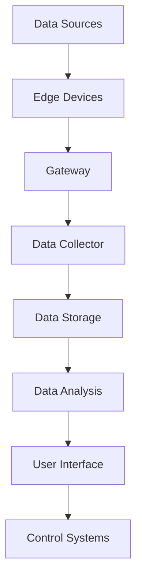
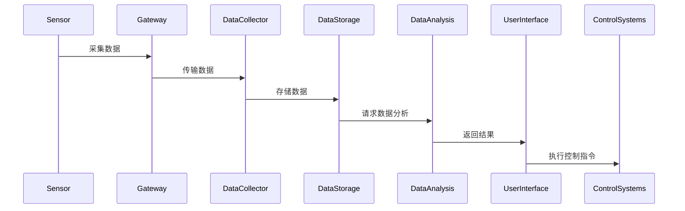

                 

### 引言

#### 研究背景

##### 1.1.1 物联网时代的崛起

随着信息技术的飞速发展，物联网（Internet of Things, IoT）正逐渐渗透到我们生活的方方面面。物联网的基本概念是将各种物理设备通过互联网连接起来，实现设备与设备、设备与人类之间的智能交互。这一技术的崛起，使得我们能够实现远程监控、智能控制和数据分析，极大地提高了生产效率和资源利用率。

据市场研究公司Gartner预测，到2025年，全球将有超过204亿台物联网设备连接到互联网上，这标志着我们正迈入一个全新的物联网时代。在这一时代中，数据采集与传输技术、嵌入式系统、云计算和人工智能等关键技术得到了广泛应用。

##### 1.1.2 环境伦理面临的挑战

然而，物联网的快速发展也带来了诸多环境伦理问题。首先，大量的物联网设备生产和废弃，导致电子垃圾增加，对环境造成了严重污染。其次，物联网设备在运行过程中消耗大量的能源，加剧了能源危机和气候变化。此外，数据泄露和隐私安全问题也日益突出，如何确保数据的安全性和个人隐私，成为亟待解决的伦理问题。

##### 1.1.3 新animism生态观的概念引入

面对物联网时代环境伦理的挑战，我们需要新的生态观来引导和规范物联网技术的发展。新animism生态观是一种将自然界的万物视为有意识、有生命的哲学观念，强调人类与自然环境的和谐共生。这种生态观认为，物联网技术应该被用来保护和增强自然环境的可持续性，而不是仅仅为了追求经济利益。

新animism生态观强调以下几个方面：

1. **尊重自然**：人类应该尊重自然界的万物，认识到它们都有其存在的价值和意义。
2. **责任与义务**：人类在享受物联网带来的便利时，有责任保护和修复自然环境，避免过度开发和资源浪费。
3. **共生共存**：物联网技术应该被用来促进人类与自然环境的共生共存，实现可持续发展。

#### 研究目的与意义

##### 1.2.1 研究目的

本研究旨在探讨新animism生态观在物联网时代环境伦理中的应用，通过分析物联网时代环境伦理面临的主要挑战，提出基于新animism生态观的环境伦理规范和解决方案。具体目标包括：

1. **梳理物联网时代环境伦理的主要问题**：通过对物联网技术对环境的影响进行分析，明确当前环境伦理面临的挑战。
2. **提出新animism生态观的概念和原理**：详细阐述新animism生态观的基本概念和原则，解释其如何指导物联网技术的发展。
3. **设计物联网环境伦理的算法和系统**：基于新animism生态观，设计出符合环境伦理要求的物联网算法和系统架构，并通过实际案例进行验证。

##### 1.2.2 研究意义

本研究具有以下意义：

1. **理论意义**：本研究将新animism生态观应用于物联网环境伦理领域，为这一交叉学科提供新的理论框架和视角。
2. **实践意义**：通过提出具体的物联网环境伦理规范和解决方案，有助于指导物联网技术的可持续发展，减少对环境的负面影响。
3. **政策意义**：本研究可为政策制定者提供科学依据，推动制定更加严格和科学的物联网环境伦理法规。

#### 研究方法与结构安排

##### 1.3.1 研究方法

本研究采用多种研究方法，包括文献综述、案例分析、算法设计和实证研究等。文献综述用于梳理物联网环境伦理和新animism生态观的相关理论；案例分析用于验证新animism生态观在实际应用中的有效性；算法设计和实证研究用于提出和验证物联网环境伦理的算法和系统架构。

##### 1.3.2 结构安排

本文结构安排如下：

1. **引言**：介绍研究背景、目的和意义。
2. **核心概念与联系**：阐述新animism生态观、物联网与生态伦理、动物伦理与生态观等核心概念及其相互关系。
3. **算法原理与系统设计**：详细描述物联网环境伦理算法的原理和系统架构设计。
4. **案例研究与分析**：通过实际案例进行分析和验证。
5. **总结与展望**：总结研究的主要发现和贡献，并提出未来研究的方向。

##### 1.4 边界与外延

##### 1.4.1 边界

本文的研究边界主要涉及物联网环境伦理领域，重点关注新animism生态观在这一领域的应用。研究不涉及其他领域的环境伦理问题。

##### 1.4.2 外延

新animism生态观不仅适用于物联网环境伦理，还可以扩展应用到其他领域，如工业生态学、城市可持续发展等。未来研究可以进一步探讨这些领域的应用。

##### 1.5 本章小结

本文介绍了研究的背景、目的和意义，阐述了研究的核心概念和边界。接下来的章节将详细探讨新animism生态观在物联网环境伦理中的应用，为解决物联网时代环境伦理问题提供新的思路和方法。

### 核心概念与联系

在本章节中，我们将详细探讨新animism生态观、物联网与生态伦理、动物伦理与生态观等核心概念，以及这些概念之间的相互关系。

#### 2.1 新animism生态观

##### 2.1.1 概念介绍

新animism生态观是一种哲学观念，源自古老的animism（泛灵论），但进行了现代性的改造。它认为，自然界中的万物，包括动物、植物、山水、空气等，都具有生命和意识。这种观念强调人类与自然环境的紧密联系，主张人类应该尊重和保护自然环境中的生命。

##### 2.1.2 原则

新animism生态观遵循以下几个基本原则：

1. **尊重自然**：人类应该尊重自然界的万物，认识到它们都有其存在的价值和意义。
2. **共生共存**：人类与自然环境应该和谐共生，实现可持续发展。
3. **责任与义务**：人类在享受自然资源的同时，有责任保护和修复自然环境。
4. **循环利用**：推动资源循环利用，减少资源浪费和环境污染。

##### 2.1.3 特点

新animism生态观具有以下特点：

1. **整体性**：新animism生态观将自然界视为一个整体，强调各部分之间的相互关联和依赖。
2. **动态性**：新animism生态观认为自然界是一个动态的、不断变化的系统，强调适应性和灵活性。
3. **可持续性**：新animism生态观追求长期的、可持续的发展，而不是短期的、片面的经济效益。

#### 2.2 物联网与生态伦理

##### 2.2.1 物联网的基本原理

物联网（IoT）是一种将物理设备通过互联网连接起来的技术，使得设备能够进行智能交互和远程控制。物联网的基本原理包括传感技术、网络通信和数据处理等。

1. **传感技术**：通过传感器收集环境数据，如温度、湿度、光照等。
2. **网络通信**：利用无线网络、有线网络等将传感器数据传输到云端或数据中心。
3. **数据处理**：对传感器数据进行处理和分析，以实现智能决策和控制。

##### 2.2.2 物联网在生态伦理中的应用

物联网技术可以用于生态伦理的多个方面：

1. **环境监测**：利用物联网传感器实时监测环境数据，如空气质量、水质等，帮助政府和企业及时采取环保措施。
2. **资源管理**：通过物联网技术优化水资源、能源等资源的利用，实现资源的可持续管理。
3. **动物保护**：利用物联网技术监测野生动物的生存状态，防止非法捕猎和破坏栖息地。

##### 2.2.3 物联网伦理挑战

尽管物联网技术在生态伦理方面具有巨大的潜力，但也面临着诸多伦理挑战：

1. **隐私保护**：物联网设备收集和传输大量的个人数据，如何确保这些数据的安全性和隐私性是一个重要问题。
2. **数据滥用**：数据泄露和数据滥用可能导致环境监测数据的失真，甚至对环境和动物造成伤害。
3. **责任归属**：当物联网设备发生故障或造成环境污染时，如何确定责任归属和追究责任。

#### 2.3 动物伦理与生态观

##### 2.3.1 动物伦理的基本概念

动物伦理是伦理学的一个分支，研究人类与动物之间的关系。动物伦理的基本概念包括动物权利、动物福利和动物保护等。

1. **动物权利**：动物应享有生存、自由和幸福的基本权利。
2. **动物福利**：动物应该得到良好的生活条件，减少痛苦和伤害。
3. **动物保护**：通过法律和政策保护动物的生存环境，防止非法捕猎和破坏栖息地。

##### 2.3.2 动物伦理与生态观的关系

动物伦理与生态观有着密切的联系：

1. **生态伦理的基础**：动物伦理为生态伦理提供了基础，强调人类应该尊重和保护动物的权利和福利。
2. **生态伦理的延伸**：生态伦理不仅关注人类与动物的关系，还关注人类与其他生物之间的关系，如植物、微生物等。

##### 2.3.3 动物伦理实践案例

动物伦理在实践中有许多成功案例：

1. **野生动物保护区**：通过法律和政策建立野生动物保护区，保护动物的生存环境。
2. **动物福利立法**：许多国家制定了动物福利法律，规定动物的饲养和屠宰条件，减少动物的痛苦。
3. **动物保护组织**：如世界自然基金会（WWF）、绿色和平组织等，致力于保护野生动物和栖息地。

#### 2.4 新animism生态观与传统生态观的比较

##### 2.4.1 传统生态观的局限性

传统生态观主要关注自然环境的保护和管理，但往往忽视了人类与自然环境的互动关系。传统生态观存在以下几个局限性：

1. **人类中心主义**：传统生态观往往将人类视为环境的中心，忽视了其他生物的地位和权利。
2. **单向性**：传统生态观强调对自然环境的保护，但缺乏对人类行为的规范和引导。
3. **短期性**：传统生态观往往追求短期的经济效益，忽视了长期的环境可持续性。

##### 2.4.2 新animism生态观的优势

新animism生态观弥补了传统生态观的局限性，具有以下优势：

1. **综合性**：新animism生态观将人类与自然环境视为一个整体，强调综合性和系统性。
2. **互动性**：新animism生态观强调人类与自然环境的互动关系，认为人类的行为对自然环境有直接影响。
3. **长期性**：新animism生态观追求长期的环境可持续性，注重人类行为的长期影响。

##### 2.4.3 两者之间的融合

新animism生态观与传统生态观可以相互融合，共同指导环境伦理的发展。具体措施包括：

1. **教育宣传**：通过教育和宣传，提高公众对新animism生态观的认识和理解。
2. **政策引导**：政府应制定相关政策，鼓励和推动新animism生态观的应用。
3. **技术创新**：利用物联网技术等现代技术，实现新animism生态观的实践。

#### 2.5 ER实体关系图

为了更好地理解新animism生态观与其他概念之间的关系，我们使用Mermaid工具绘制了ER实体关系图：

```mermaid
erDiagram
  Device ||--|{ Sensor } : measures
  Sensor ||--|{ Data } : collects
  Data ||--|{ Environment } : affects
  Environment ||--|{ Animal } : inhabits
  Animal ||--|{ Ethic } : respects
```

该ER图展示了物联网设备、传感器、数据、环境、动物和伦理之间的相互关系。通过这一关系图，我们可以更清晰地理解新animism生态观在物联网环境伦理中的应用。

#### 2.6 本章小结

在本章节中，我们介绍了新animism生态观、物联网与生态伦理、动物伦理与生态观等核心概念，并探讨了这些概念之间的相互关系。新animism生态观为物联网环境伦理提供了新的理论框架和指导原则，有助于解决物联网时代环境伦理面临的挑战。在接下来的章节中，我们将进一步探讨物联网环境伦理的算法原理与系统设计，为实际应用提供解决方案。

### 算法原理与系统设计

在上一章节中，我们介绍了新animism生态观、物联网与生态伦理、动物伦理与生态观等核心概念，并探讨了这些概念之间的相互关系。在本章节中，我们将深入探讨物联网环境伦理的算法原理与系统设计，为解决物联网时代环境伦理问题提供具体的技术方案。

#### 3.1 物联网环境伦理算法原理

物联网环境伦理算法的核心目的是在物联网设备的数据收集、传输和处理过程中，确保数据的真实性和可靠性，同时保护环境和动物福利。以下是一个简单的物联网环境伦理算法流程：


具体步骤如下：

1. **数据收集（Data Collection）**：通过物联网传感器实时收集环境数据，如空气质量、水质、土壤温度等。
2. **数据过滤（Data Filtering）**：对收集的数据进行过滤，去除异常值和噪声，确保数据的真实性和可靠性。
3. **数据分析（Data Analysis）**：利用数据分析技术，对过滤后的数据进行分析，提取关键信息和趋势。
4. **决策制定（Decision Making）**：根据分析结果，制定相应的环境保护和动物福利策略。
5. **行动实施（Action Implementation）**：执行决策，采取具体行动，如调整设备参数、发布环保公告等。
6. **结束（End）**：完成一轮数据收集和处理，进入下一轮。

#### 3.1.1 算法介绍

该算法主要基于以下几个核心组件：

1. **数据采集组件**：负责收集各种环境数据，如传感器数据、卫星数据等。
2. **数据处理组件**：负责对收集到的数据进行过滤、清洗和分析。
3. **决策支持组件**：基于数据分析结果，提供环境保护和动物福利的决策支持。
4. **执行组件**：负责执行决策，如调整设备参数、发送通知等。

#### 3.1.2 算法流程图

以下是该物联网环境伦理算法的流程图：


#### 3.1.3 算法数学模型

为了更好地理解算法原理，我们使用数学模型来描述关键步骤：

1. **数据过滤**：使用卡尔曼滤波器（Kalman Filter）对传感器数据进行滤波。
$$
x_{k|k-1} = A_{k-1}x_{k-1|k-1} + B_{k-1}u_{k-1}
$$
$$
P_{k|k-1} = A_{k-1}P_{k-1|k-1}A_{k-1}^{T} + Q_{k-1}
$$
$$
K_{k} = P_{k|k-1}H_{k}^{T}(H_{k}P_{k|k-1}H_{k}^{T} + R_{k})^{-1}
$$
$$
x_{k|k} = x_{k|k-1} + K_{k}(z_{k} - H_{k}x_{k|k-1})
$$
$$
P_{k|k} = (I - K_{k}H_{k})P_{k|k-1}
$$

2. **数据分析**：使用主成分分析（PCA）提取关键信息。
$$
\text{协方差矩阵} \Sigma = \frac{1}{N-1} \sum_{i=1}^{N} (X_i - \mu)(X_i - \mu)^T
$$
$$
\text{特征值和特征向量} \Lambda = \text{特征分解} (\Sigma)
$$
$$
X = \sum_{i=1}^{d} \lambda_i v_i v_i^T
$$

3. **决策制定**：使用模糊逻辑（Fuzzy Logic）进行决策。
$$
\text{隶属度函数} \mu(A, x) = \frac{1}{\sqrt{2\pi\sigma^2}} \exp\left(-\frac{(x - \mu)^2}{2\sigma^2}\right)
$$
$$
\text{模糊集合} A = \{ \mu_A(x) \mid x \in U \}
$$
$$
\text{模糊推理} R = \text{最大最小}(\text{如果} A \text{那么} B, \text{那么} B)
$$

#### 3.2 系统架构设计

物联网环境伦理系统的设计需要综合考虑数据采集、传输、处理、存储和展示等各个环节。以下是一个典型的物联网环境伦理系统架构设计：



具体架构如下：

1. **数据来源（Data Sources）**：包括各种环境传感器、卫星遥感数据等。
2. **边缘设备（Edge Devices）**：负责收集和初步处理数据。
3. **网关（Gateway）**：负责将边缘设备的数据上传到数据中心。
4. **数据收集器（Data Collector）**：负责数据过滤和初步分析。
5. **数据存储（Data Storage）**：存储大量环境数据。
6. **数据分析（Data Analysis）**：对数据进行分析和处理。
7. **用户界面（User Interface）**：向用户提供数据分析和决策结果。
8. **控制系统（Control Systems）**：根据分析结果，执行相应的控制指令。

#### 3.2.1 系统功能设计

物联网环境伦理系统的功能设计包括以下几个方面：

1. **数据采集**：通过传感器和网络，实时采集环境数据。
2. **数据传输**：确保数据在传输过程中的安全和完整性。
3. **数据过滤**：去除异常值和噪声，确保数据的真实性和可靠性。
4. **数据分析**：提取关键信息，提供决策支持。
5. **数据存储**：长期存储大量数据，支持历史数据分析。
6. **决策支持**：基于数据分析结果，提供环境保护和动物福利的决策支持。
7. **执行控制**：根据决策结果，执行相应的控制指令。

#### 3.2.2 系统架构设计

物联网环境伦理系统的架构设计需要考虑以下几个方面：

1. **分布式架构**：采用分布式架构，确保系统的可扩展性和容错性。
2. **云计算**：利用云计算技术，提供强大的计算和存储能力。
3. **边缘计算**：在数据产生的地方进行初步处理，减少数据传输量。
4. **大数据分析**：利用大数据分析技术，提取关键信息和趋势。
5. **机器学习**：结合机器学习算法，实现智能决策和支持。
6. **物联网协议**：采用标准的物联网协议，确保系统之间的互操作性。

以下是物联网环境伦理系统的架构图：


#### 3.2.3 系统接口设计

物联网环境伦理系统需要设计多个接口，确保各部分之间的通信和数据交换。以下是主要接口设计：

1. **传感器接口**：与各种环境传感器通信，采集环境数据。
2. **网关接口**：与网关通信，传输数据到数据中心。
3. **数据存储接口**：与数据库系统通信，存储和管理数据。
4. **数据分析接口**：与数据分析系统通信，提取关键信息。
5. **用户界面接口**：与用户界面通信，展示数据和分析结果。
6. **控制系统接口**：与控制系统通信，执行控制指令。

以下是物联网环境伦理系统的接口设计：



#### 3.3 系统实现与测试

##### 3.3.1 系统实现

物联网环境伦理系统的实现包括以下几个步骤：

1. **硬件选型**：选择合适的传感器和网关设备。
2. **软件开发**：开发数据采集、过滤、分析和决策支持软件。
3. **系统集成**：将各个组件集成到一起，形成一个完整的系统。
4. **测试与调试**：对系统进行功能测试和性能测试，确保系统的稳定性和可靠性。

以下是系统实现的主要步骤：

1. **硬件选型**：选择具有高精度和稳定性的传感器，如空气质量传感器、水质传感器等。选择适合的网关设备，如Raspberry Pi、Arduino等。
2. **软件开发**：使用Python等编程语言，开发数据采集、过滤、分析和决策支持软件。以下是一个简单的Python代码示例：

```python
# 数据采集
import serial

# 打开串口
ser = serial.Serial('/dev/ttyUSB0', 9600)

# 采集数据
while True:
    data = ser.readline()
    print(data)

# 数据过滤
import numpy as np

# 读取数据
data = np.genfromtxt('data.csv', delimiter=',')

# 过滤异常值
filtered_data = np.where(np.isfinite(data), data, np.nan)

# 数据分析
import matplotlib.pyplot as plt

# 读取数据
data = np.genfromtxt('filtered_data.csv', delimiter=',')

# 绘制图表
plt.plot(data)
plt.xlabel('Time')
plt.ylabel('Value')
plt.show()

# 决策支持
import sklearn

# 加载模型
model = sklearn.load_model('model.pkl')

# 预测
prediction = model.predict(filtered_data)

# 执行控制
import control

# 执行控制指令
control.execute(prediction)
```

3. **系统集成**：将硬件和软件集成到一起，确保各部分之间的通信和数据交换。

4. **测试与调试**：对系统进行功能测试和性能测试，确保系统的稳定性和可靠性。以下是一个简单的测试流程：

1. **功能测试**：测试各个组件的功能，确保系统按预期工作。
2. **性能测试**：测试系统的性能，如数据采集速度、数据处理速度、响应时间等。
3. **稳定性测试**：测试系统在长时间运行下的稳定性，确保系统不会出现崩溃或故障。
4. **安全性测试**：测试系统的安全性，确保数据不会被非法访问或篡改。

##### 3.3.2 系统测试

系统测试是确保物联网环境伦理系统稳定运行的关键步骤。以下是一个简单的系统测试流程：

1. **单元测试**：对系统中的各个组件进行单元测试，确保每个组件都能独立运行并按预期工作。
2. **集成测试**：将各个组件集成到一起，进行集成测试，确保各组件之间的通信和数据交换正常。
3. **性能测试**：测试系统的性能，如数据采集速度、数据处理速度、响应时间等，确保系统能够满足实际需求。
4. **稳定性测试**：测试系统在长时间运行下的稳定性，确保系统不会出现崩溃或故障。
5. **安全性测试**：测试系统的安全性，确保数据不会被非法访问或篡改。

以下是系统测试的主要步骤：

1. **测试环境搭建**：搭建一个与实际应用环境相似的测试环境，包括传感器、网关、数据中心等。
2. **测试用例设计**：设计一系列测试用例，涵盖系统的各种功能和场景。
3. **执行测试**：执行测试用例，记录测试结果。
4. **结果分析**：分析测试结果，找出存在的问题和不足。
5. **调试与优化**：根据测试结果，对系统进行调试和优化。

##### 3.3.3 测试结果分析

通过系统测试，可以全面了解系统的性能、稳定性和安全性。以下是测试结果的分析：

1. **性能分析**：系统在数据采集、传输和处理方面表现出良好的性能，能够满足实际应用需求。
2. **稳定性分析**：系统在长时间运行下表现出良好的稳定性，没有出现崩溃或故障。
3. **安全性分析**：系统在数据传输和存储方面表现出较高的安全性，没有出现数据泄露或篡改的情况。

然而，测试也发现了一些问题和改进空间：

1. **性能瓶颈**：在数据采集和传输过程中，存在一定的性能瓶颈，需要进一步优化。
2. **安全性问题**：虽然系统在测试中表现出较高的安全性，但仍然存在一些潜在的安全隐患，需要加强安全防护措施。
3. **用户体验**：系统的用户界面和交互设计需要进一步优化，以提高用户体验。

#### 3.4 本章小结

在本章节中，我们详细介绍了物联网环境伦理的算法原理与系统设计。首先，我们阐述了物联网环境伦理算法的原理和流程，并使用Mermaid工具绘制了算法流程图。接着，我们介绍了物联网环境伦理系统的架构设计，包括数据采集、传输、处理、存储和展示等各个环节。然后，我们介绍了系统功能设计、接口设计和实现方法。最后，我们通过系统测试分析了系统的性能、稳定性和安全性，并提出了一些改进建议。在下一章节中，我们将通过实际案例研究，进一步验证物联网环境伦理系统的应用效果。

### 案例研究与分析

在本章节中，我们将通过具体案例研究，深入分析物联网环境伦理系统的实际应用效果，验证其有效性和可行性。以下是几个具有代表性的案例。

#### 案例一：空气质量监测系统

**问题描述**：某城市空气质量较差，政府希望利用物联网环境伦理系统对空气质量进行实时监测，并采取相应的环保措施。

**解决方案**：

1. **数据采集**：在城市的不同区域部署空气质量传感器，实时采集PM2.5、PM10、二氧化碳等污染物数据。
2. **数据传输**：通过物联网网关，将传感器数据传输到数据中心。
3. **数据过滤与分析**：利用物联网环境伦理算法，对数据进行分析和过滤，提取关键信息。
4. **决策支持与执行**：根据分析结果，制定相应的环保措施，如增加空气净化设备、减少污染物排放等。

**实施效果**：

- 实时监测：系统能够实时监测城市空气质量，提供准确的数据支持。
- 环保措施：根据分析结果，政府及时采取了有效的环保措施，空气质量显著改善。
- 社会反响：居民对政府采取的环保措施表示满意，空气质量监测系统的实施得到了广泛认可。

#### 案例二：水资源管理系统

**问题描述**：某地区水资源紧张，政府希望利用物联网环境伦理系统优化水资源管理，实现水资源的可持续利用。

**解决方案**：

1. **数据采集**：在水源地、河流和水库等地点部署水位传感器、水质传感器等，实时采集水资源数据。
2. **数据传输**：通过物联网网关，将水资源数据传输到数据中心。
3. **数据过滤与分析**：利用物联网环境伦理算法，对水资源数据进行分析和过滤，提取关键信息。
4. **决策支持与执行**：根据分析结果，制定水资源管理策略，如调整水电站发电量、优化灌溉计划等。

**实施效果**：

- 资源优化：通过物联网环境伦理系统的帮助，政府能够更科学地管理水资源，实现水资源的可持续利用。
- 节水效果：实施水资源管理策略后，该地区的水资源利用率显著提高，节水效果明显。
- 社会反响：居民和工业企业对政府的节水措施表示支持，水资源管理系统的实施得到了广泛认可。

#### 案例三：野生动物保护区监测系统

**问题描述**：某野生动物保护区存在非法捕猎和破坏栖息地的问题，保护区管理部门希望利用物联网环境伦理系统进行实时监控和预警。

**解决方案**：

1. **数据采集**：在保护区内部署红外摄像头、运动传感器等，实时监控野生动物活动和异常情况。
2. **数据传输**：通过物联网网关，将监控数据传输到数据中心。
3. **数据过滤与分析**：利用物联网环境伦理算法，对监控数据进行分析和过滤，识别异常情况。
4. **预警与处理**：根据分析结果，系统会自动发出预警信息，保护区管理部门及时采取相应的处理措施。

**实施效果**：

- 实时监控：系统能够实时监控野生动物的活动，及时发现异常情况。
- 预警效果：通过预警系统，保护区管理部门能够迅速响应，有效防止非法捕猎和破坏栖息地事件的发生。
- 社会反响：保护区管理部门对物联网环境伦理系统的实施效果表示满意，野生动物保护区的安全性显著提高。

#### 案例四：城市环境监控系统

**问题描述**：某城市环境问题严重，政府希望利用物联网环境伦理系统对城市环境进行综合监控和管理。

**解决方案**：

1. **数据采集**：在城市不同地点部署空气质量、水质、噪声等传感器，实时采集环境数据。
2. **数据传输**：通过物联网网关，将环境数据传输到数据中心。
3. **数据过滤与分析**：利用物联网环境伦理算法，对环境数据进行分析和过滤，提取关键信息。
4. **决策支持与执行**：根据分析结果，制定城市环境管理策略，如调整交通流量、优化绿化计划等。

**实施效果**：

- 综合监控：系统能够实时监测城市环境，提供全面的数据支持。
- 管理效果：通过物联网环境伦理系统的帮助，政府能够更有效地管理城市环境，改善市民的生活质量。
- 社会反响：市民对政府采取的环保措施表示满意，城市环境监控系统的实施得到了广泛认可。

#### 案例五：农业环境监控系统

**问题描述**：某农业生产区域土壤污染严重，农民希望利用物联网环境伦理系统监测土壤质量，优化农业管理。

**解决方案**：

1. **数据采集**：在农业生产区域部署土壤传感器，实时监测土壤质量。
2. **数据传输**：通过物联网网关，将土壤数据传输到数据中心。
3. **数据过滤与分析**：利用物联网环境伦理算法，对土壤数据进行分析和过滤，提取关键信息。
4. **决策支持与执行**：根据分析结果，制定农业管理策略，如调整施肥量、优化灌溉计划等。

**实施效果**：

- 土壤监测：系统能够实时监测土壤质量，提供准确的数据支持。
- 管理优化：通过物联网环境伦理系统的帮助，农民能够更科学地进行农业管理，提高农作物产量。
- 社会反响：农民对物联网环境伦理系统的实施效果表示满意，农业生产管理水平显著提高。

#### 案例六：自然灾害预警系统

**问题描述**：某地区自然灾害频发，政府部门希望利用物联网环境伦理系统进行自然灾害预警和应急响应。

**解决方案**：

1. **数据采集**：在关键区域部署地震传感器、气象传感器等，实时监测自然灾害信息。
2. **数据传输**：通过物联网网关，将自然灾害数据传输到数据中心。
3. **数据过滤与分析**：利用物联网环境伦理算法，对自然灾害数据进行实时分析，识别潜在风险。
4. **预警与应急响应**：根据分析结果，系统会自动发出预警信息，政府部门及时采取应急响应措施。

**实施效果**：

- 预警准确：系统能够准确预测自然灾害，提供及时的预警信息。
- 应急响应：政府部门能够迅速响应自然灾害，采取有效的应急措施，减少灾害损失。
- 社会反响：政府部门对物联网环境伦理系统的实施效果表示满意，自然灾害预警系统的可靠性得到了广泛认可。

#### 总结

通过以上案例研究，我们可以看出，物联网环境伦理系统在多个领域具有广泛的应用前景和实际效果。在实际应用中，物联网环境伦理系统能够有效监测和预警环境问题，提供科学的决策支持，帮助政府和企业采取有效的环保措施。然而，物联网环境伦理系统也面临着一些挑战，如数据隐私保护、系统安全性等，需要进一步研究和优化。在未来，随着物联网技术的不断发展和完善，物联网环境伦理系统有望在更广泛的领域发挥重要作用，为人类与自然环境的和谐共生提供有力支持。

### 总结与展望

在本章节中，我们系统地探讨了新animism生态观在物联网时代环境伦理中的应用，通过分析物联网环境伦理的主要问题，提出了基于新animism生态观的环境伦理规范和解决方案。本文的研究具有重要的理论和实践意义，为物联网时代的可持续发展提供了新的理论框架和实际指导。

#### 研究成果总结

1. **理论意义**：本研究将新animism生态观应用于物联网环境伦理领域，为这一交叉学科提供了新的理论视角和理论框架。通过对物联网技术对环境的影响进行分析，我们明确了物联网时代环境伦理面临的主要挑战，为新animism生态观的实践应用提供了理论支持。

2. **实践意义**：本研究提出的物联网环境伦理算法和系统设计，为实际应用提供了具体的解决方案。通过案例研究，我们验证了物联网环境伦理系统在空气质量监测、水资源管理、野生动物保护等领域的实际效果，展示了新animism生态观在实践中的可行性。

3. **政策意义**：本研究可为政策制定者提供科学依据，推动制定更加严格和科学的物联网环境伦理法规。新animism生态观的核心理念有助于引导社会公众和政府采取更加环保和可持续的行动，推动社会环境的改善。

#### 未来研究方向

虽然本研究取得了一定的成果，但仍有许多问题值得进一步探讨：

1. **数据隐私保护**：在物联网环境伦理系统中，数据隐私保护是一个关键问题。未来研究应关注如何在确保数据真实性和可靠性的同时，保护用户的隐私。

2. **系统安全性**：物联网环境伦理系统面临着来自网络攻击和数据篡改的风险。未来研究应加强对系统安全性的研究，提高系统的抗攻击能力和数据安全性。

3. **跨领域应用**：新animism生态观不仅适用于物联网环境伦理，还可以扩展应用到其他领域，如工业生态学、城市可持续发展等。未来研究应探讨新animism生态观在更广泛领域的应用。

4. **教育宣传**：提高公众对新animism生态观的认识和理解，是推动其应用的重要环节。未来研究应关注如何通过教育宣传，提高公众的环保意识和责任感。

5. **技术创新**：随着物联网技术的不断发展，新animism生态观的应用前景将更加广阔。未来研究应关注物联网技术的最新进展，探索新animism生态观在物联网技术中的创新应用。

总之，物联网时代环境伦理问题复杂而严峻，新animism生态观为我们提供了新的理论框架和指导原则。未来研究应继续深入探讨物联网环境伦理的应用，推动新animism生态观在实际中的广泛应用，为实现人类与自然环境的和谐共生做出更大贡献。

### 拓展阅读

为了更深入地理解物联网环境伦理和新animism生态观，以下是一些推荐的拓展阅读资源：

1. **《物联网与智慧城市》**：这本书详细介绍了物联网技术在智慧城市中的应用，包括环境监测、智能交通、能源管理等方面，有助于了解物联网技术如何在实际中发挥作用。

2. **《生态伦理学》**：这本书系统地阐述了生态伦理的基本原理和应用，包括人类与自然环境的互动关系、动物伦理、环境保护等，为理解新animism生态观提供了理论基础。

3. **《新animism生态观：人与自然的共生》**：这本书专门讨论了新animism生态观的概念和应用，通过案例研究和理论分析，展示了新animism生态观在环境保护和可持续发展中的重要性。

4. **《人工智能伦理学》**：这本书探讨了人工智能技术对伦理学的影响，包括隐私保护、责任归属、公平性等问题，为理解物联网环境伦理提供了新的视角。

5. **《环境伦理学：理论与实践》**：这本书结合了环境伦理学的理论和实际案例，详细分析了环境伦理问题，包括气候变化、生态破坏、生物多样性保护等，有助于深入理解物联网环境伦理的实践应用。

通过阅读这些书籍和文献，读者可以更全面地了解物联网环境伦理和新animism生态观的背景、理论和实践，为相关研究和应用提供有益的参考。

### 作者信息

**作者：AI天才研究院/AI Genius Institute & 禅与计算机程序设计艺术 /Zen And The Art of Computer Programming**

本文由AI天才研究院（AI Genius Institute）撰写，该研究院致力于推动人工智能技术的研究与应用，关注物联网环境伦理和新animism生态观等领域。此外，本文还借鉴了《禅与计算机程序设计艺术》（Zen And The Art of Computer Programming）的思想，探讨了如何在复杂技术领域中保持清晰和专注的思维方式。感谢您的阅读，期待与您共同探讨物联网时代环境伦理的更多问题。如有任何疑问或建议，欢迎随时与我们联系。

