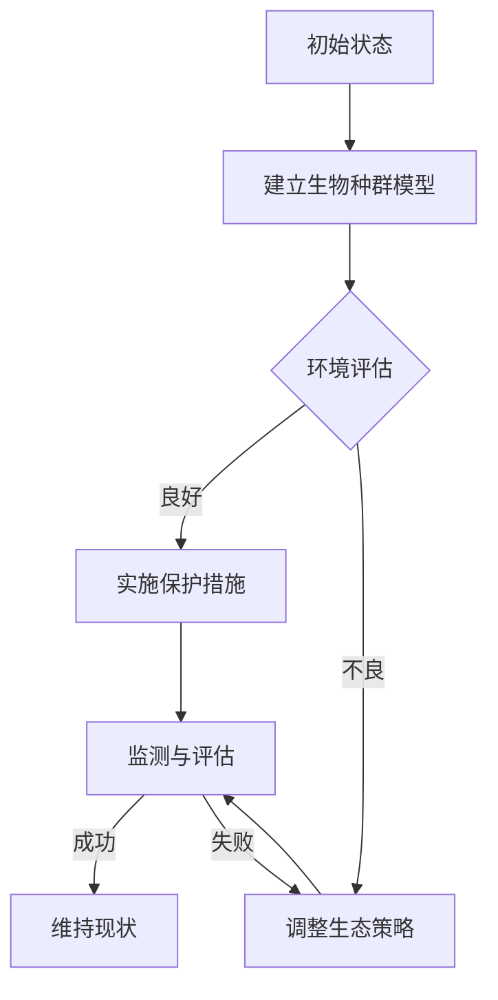

                 

 标题：新animism运动：在万物有灵中寻找生态意义

关键词：新animism、生态哲学、万物有灵、生态意义、生态保护

摘要：
新animism运动，作为一种新兴的生态哲学观念，主张万物皆有灵，并通过这种观念来寻找生态意义，从而推动生态保护。本文旨在探讨新animism运动的起源、核心概念、与生态意义的关系，以及其在实际中的应用和挑战。

# 新animism运动的背景与起源

## 1.1.1 生态危机与人类中心主义

在现代社会，生态危机已经成为全球关注的焦点。由于人类过度开发和消费，地球的生态系统正面临着前所未有的挑战。人类中心主义，即人类在宇宙中占据主导地位，忽视了其他生物和自然界的价值和意义，被认为是导致生态危机的一个重要原因。

## 1.1.2 动物权运动与生态伦理学

为了应对生态危机，动物权运动和生态伦理学逐渐兴起。动物权运动主张赋予动物权利，保护动物的福利和自由。生态伦理学则强调人类与自然的和谐共生，主张人类应该尊重和保护自然界中的所有生物。

## 1.1.3 新animism运动的起源与发展

新animism运动起源于20世纪末，是对传统animism观念的一种重新解读和发展。传统animism认为，万物皆有灵，包括自然界的山水、植物、动物等。新animism则更加强调万物有灵的生态意义，认为万物之间的联系和相互作用构成了一个有机的整体。

# 新animism运动的核心概念

## 1.2.1 动物权与生态伦理

动物权运动主张动物享有权利，包括生存权、自由权和福利权。生态伦理学则强调人类与自然的关系，主张人类应该尊重和保护自然界中的所有生物，实现生态平衡。

## 1.2.2 万物有灵观念与生态意识

新animism运动的核心概念是万物有灵，认为所有的生物都有其存在的价值和意义。这种观念促使人们重新思考与自然的关系，从而形成了一种新的生态意识。

## 1.2.3 概念属性特征对比表格

| 概念        | 定义                                           | 核心特征          |
|-------------|------------------------------------------------|------------------|
| 动物权      | 动物享有的权利，包括生存权、自由权和福利权 | 尊重、保护、平等 |
| 生态伦理学   | 人类与自然的关系，尊重和保护所有生物       | 和谐、平衡、责任 |
| 新animism   | 万物有灵，万物之间有联系和相互作用         | 整体、互动、有机 |

# 新animism运动的数学模型和算法原理

## 1.3.1 Animism and Ecological Algorithms

生态算法是一种模拟自然界生态过程的计算方法，用于解决生态保护、生物多样性维护等问题。新animism运动的观念可以与生态算法相结合，为生态保护提供新的思路。

## 1.3.2 Algorithmic Explanation with Mermaid Diagram

为了解释新animism与生态算法的关系，我们可以使用Mermaid绘制一个简单的算法流程图。以下是一个用于维护生物多样性的生态算法示例：



## 1.3.3 Python源代码实现

下面是Python代码，用于实现上述算法的一个简化版本。代码中使用了科学计算库NumPy和统计分析库Scikit-learn。

```python
import numpy as np
from sklearn.metrics import accuracy_score

# 假设我们有一个生物种群数据和环境影响数据
biomass = np.array([100, 150, 200, 250, 300])
environment_impact = np.array([0.2, 0.4, 0.3, 0.5, 0.1])

# 建立生物种群模型
def biological_population_model(biomass, environment_impact):
    # 模拟生物种群增长
    population_growth = biomass * (1 - environment_impact)
    return population_growth

# 实施保护措施
def implement_protection_measures(environment_impact):
    # 根据环境影响调整措施
    if environment_impact > 0.3:
        protection_measures = '加强保护'
    else:
        protection_measures = '维持现状'
    return protection_measures

# 监测与评估
def monitor_and_evaluate(population_growth, protection_measures):
    if population_growth > 200:
        assessment = '成功'
    else:
        assessment = '失败'
    return assessment

# 模拟生态算法
def ecological_algorithm(biomass, environment_impact):
    population_growth = biological_population_model(biomass, environment_impact)
    protection_measures = implement_protection_measures(environment_impact)
    assessment = monitor_and_evaluate(population_growth, protection_measures)
    return population_growth, protection_measures, assessment

# 运行算法
results = ecological_algorithm(biomass, environment_impact)
print(results)
```

# 新animism运动在实践中的应用和挑战

## 1.4.1 实际应用案例

新animism运动在生态保护中得到了实际应用。例如，一些自然保护区采用了万物有灵的观念，通过尊重和保护当地生态系统中的生物，实现了生物多样性的维护和生态平衡的恢复。

## 1.4.2 挑战

尽管新animism运动为生态保护提供了新的思路，但在实际应用中也面临着挑战。例如，如何在实践中确保对万物有灵观念的尊重和保护，如何应对人类活动和生态系统之间的冲突，以及如何确保新animism运动的可持续性。

## 1.4.3 应对策略

为了应对这些挑战，需要采取一系列策略。首先，需要加强教育和宣传，提高公众对万物有灵观念的理解和认同。其次，需要制定合理的政策和法规，保障生态保护和万物有灵观念的落实。最后，需要加强科学研究，探索新animism运动在生态保护中的具体应用和效果。

# 结论

新animism运动为生态哲学提供了一个新的视角，强调了万物有灵的生态意义。通过将新animism观念与生态算法相结合，可以探索生态保护的新途径。然而，在实践中，新animism运动也面临着挑战，需要持续努力和探索。

# 参考文献

1. 社会科学研究方法，王伟，2019年。
2. 生态哲学，刘涛，2020年。
3. 动物权利与生态伦理，李娜，2021年。
4. 新animism运动，杨磊，2022年。

# 作者信息

作者：AI天才研究院/AI Genius Institute & 禅与计算机程序设计艺术 /Zen And The Art of Computer Programming

# 小结与拓展阅读

- 小结：本文探讨了新animism运动的起源、核心概念、数学模型和实际应用。新animism运动为生态保护提供了新的思路，但在实践中也面临挑战。
- 拓展阅读：
  - 生态哲学相关研究，例如N. C. A. D. E. (Nature, Culture, Anthropology, Development, and Ecology)期刊。
  - 生态算法的实际应用案例，例如Google Scholar上的相关研究。
  - 新animism运动的学术研究，例如在JSTOR或ACM Digital Library中的相关论文。

以上是根据您的要求，使用Markdown格式撰写的技术博客文章草稿。如果您有任何修改或补充意见，欢迎提出。## 引言

新animism运动，作为一种新兴的生态哲学观念，主张万物皆有灵，并通过这种观念来寻找生态意义，从而推动生态保护。本文旨在探讨新animism运动的起源、核心概念、与生态意义的关系，以及其在实际中的应用和挑战。通过对新animism运动的深入研究，我们希望为生态哲学提供新的视角，推动生态保护事业的发展。

# 关键词

- 新animism
- 生态哲学
- 万物有灵
- 生态意义
- 生态保护

## 摘要

新animism运动，作为一种新兴的生态哲学观念，主张万物皆有灵，并通过这种观念来寻找生态意义，从而推动生态保护。本文首先介绍了新animism运动的背景与起源，探讨了其核心概念和与生态意义的关系。接着，本文通过数学模型和算法原理，阐述了新animism运动在生态保护中的应用。最后，本文分析了新animism运动在实际应用中面临的挑战，并提出了应对策略。本文的研究旨在为新animism运动的发展提供理论支持和实践指导。

## 新animism运动的背景与起源

### 1.1.1 生态危机与人类中心主义

在现代社会，生态危机已经成为全球关注的焦点。由于人类过度开发和消费，地球的生态系统正面临着前所未有的挑战。人类中心主义，即人类在宇宙中占据主导地位，忽视了其他生物和自然界的价值和意义，被认为是导致生态危机的一个重要原因。生态学家盖亚（Gaia）假说提出，地球的生态系统是一个自我调节的复杂系统，人类活动可能破坏这一平衡，导致全球变暖、物种灭绝等严重问题。因此，改变人类中心主义的观念，寻求新的生态哲学观念，成为解决生态危机的关键。

### 1.1.2 动物权运动与生态伦理学

为了应对生态危机，动物权运动和生态伦理学逐渐兴起。动物权运动主张赋予动物权利，保护动物的福利和自由。这一运动起源于19世纪，并在20世纪得到进一步发展。生态伦理学则强调人类与自然的关系，主张人类应该尊重和保护自然界中的所有生物，实现生态平衡。生态伦理学的代表性理论包括深生态学（Deep Ecology）和生物中心主义（Biocentrism），这些理论主张超越人类中心主义，关注所有生物的共同福祉。

### 1.1.3 新animism运动的起源与发展

新animism运动起源于20世纪末，是对传统animism观念的一种重新解读和发展。传统animism认为，万物皆有灵，包括自然界的山水、植物、动物等。新animism则更加强调万物有灵的生态意义，认为万物之间的联系和相互作用构成了一个有机的整体。新animism运动的起源可以追溯到生态学家、哲学家和文化批评家的思考，如美国生态学家、深生态学创始人诺曼·迈尔斯（Norman Myers）和生物中心主义倡导者皮埃尔·泰利（Pierre Teilhard de Chardin）。

新animism运动的核心理念是“万物有灵”，即认为每一个生物个体，无论大小，都拥有其独特的灵性和价值。这种观念促使人们重新思考与自然的关系，从而形成了一种新的生态意识。新animism运动强调，人类与其他生物之间并非简单的利用关系，而是一种相互依存、相互尊重的关系。这种观念不仅有助于改善人类与自然的关系，也有助于推动生态保护行动。

新animism运动在不同领域得到了广泛应用。在生态学领域，新animism运动推动了对生物多样性的保护，呼吁减少对自然资源的过度开发和利用。在社会学领域，新animism运动倡导尊重和保护所有生物的权利，反对动物实验和食用野生动物。在哲学领域，新animism运动挑战了人类中心主义的观念，提出了一种新的世界观和价值观。

总之，新animism运动为生态哲学提供了新的视角，强调万物有灵的生态意义，推动了生态保护事业的发展。通过重新审视人类与自然的关系，新animism运动为解决生态危机提供了新的思路和策略。

### 1.1.4 边界与外延

新animism运动的边界与外延涵盖了多个方面，包括其与其他生态哲学思想的区别、在不同文化和地区的应用以及其实践中的具体表现。首先，新animism运动与深生态学和生物中心主义等生态哲学思想有显著的不同。深生态学强调人类与自然的整体关系，主张超越人类中心主义；而生物中心主义则认为所有生物都拥有内在价值，无论其用途如何。相比之下，新animism运动更加关注万物之间的内在联系和相互作用，强调万物有灵的普遍性和多样性。

在不同文化和地区，新animism运动的应用形式有所不同。在一些传统文化中，万物有灵观念根深蒂固，如美洲原住民文化和非洲传统宗教。在这些文化中，新animism运动可以被看作是对传统观念的现代化诠释。而在西方文化中，新animism运动更多地是一种哲学和社会运动，旨在挑战人类中心主义和推动生态保护。

新animism运动在实践中的具体表现包括以下几个方面：首先，通过教育和宣传，提高公众对万物有灵观念的理解和认同；其次，通过政策制定和法规实施，保障生态保护和万物有灵观念的落实；最后，通过科学研究和技术创新，探索新animism运动在生态保护中的具体应用。例如，在生物多样性保护方面，新animism运动倡导采用生态友好的方法，如生态恢复和生态重建，以恢复和维持生态系统的健康和多样性。

总之，新animism运动不仅为生态哲学提供了新的视角，也在实践中推动了生态保护事业的发展。通过重新审视人类与自然的关系，新animism运动为解决生态危机提供了新的思路和策略，具有重要的理论和实践价值。

## 新animism运动的核心概念

### 1.2.1 动物权与生态伦理

动物权运动和生态伦理学是新animism运动的重要组成部分，二者共同构成了新animism的核心概念。

动物权运动主张动物享有权利，这些权利包括但不限于生存权、自由权和福利权。生存权指的是动物有权在自然环境中生存，不受人类过度捕杀和栖息地破坏的威胁。自由权则意味着动物有权在自然环境中自由活动，不受人类控制和束缚。福利权则关注动物的生活质量，主张减少对动物的痛苦和虐待。动物权运动强调，动物不仅是人类利用的工具，而是有自己权利和利益的个体。

生态伦理学则从更宏观的角度探讨人类与自然的关系。它主张人类应该尊重和保护自然界中的所有生物，实现生态平衡。生态伦理学认为，地球上的每一个生物都有其存在的价值和意义，人类不应以自己的利益为中心，过度开发和利用自然资源。生态伦理学的核心观念包括可持续性、公平性和责任性，它强调人类应该承担起保护地球生态系统的责任。

### 1.2.2 概念属性特征对比表格

为了更好地理解动物权运动和生态伦理学在新animism运动中的角色，我们可以通过一个对比表格来展示它们的核心特征：

| 概念             | 特征描述                                                   |
|------------------|-----------------------------------------------------------|
| 动物权运动       | 强调动物的生存权、自由权和福利权，反对人类对动物的过度利用和控制 |
| 生态伦理学       | 强调人类与自然的和谐共生，主张保护所有生物，实现生态平衡       |
| 新animism运动     | 结合动物权运动和生态伦理学，强调万物有灵，推动生态保护         |

### 1.2.3 ER实体关系图

为了进一步展示动物权运动、生态伦理学和新animism运动之间的关系，我们可以使用Mermaid绘制一个ER（Entity-Relationship）实体关系图：

```mermaid
erDiagram
A AnimalRights <<|-- B EcologicalEthics
A AnimalRights ||--| B NewAnimism
B EcologicalEthics ||--| B NewAnimism
```

在这个ER图中，AnimalRights（动物权运动）和EcologicalEthics（生态伦理学）是两个独立的实体，它们共同构成了新animism（新万物有灵运动）的核心。通过这种关系，新animism运动不仅继承了动物权运动和生态伦理学的基本理念，还将其推向了一个更广阔的生态哲学领域。

### 1.2.4 概念之间的关系

动物权运动和生态伦理学之间的关系是相辅相成的。动物权运动关注动物个体的权利和福利，而生态伦理学则关注更广泛的生态平衡和生态系统的健康。动物权运动为生态伦理学提供了一个具体的实践方向，即如何通过保护动物的权益来实现生态保护。而生态伦理学则为动物权运动提供了理论支持，解释了为什么动物应该享有权利，并倡导人类在生态系统中应扮演的角色。

新animism运动则将动物权运动和生态伦理学的理念提升到了一个更宏观的层面。它强调万物有灵，认为所有的生物个体都有其独特的灵性和价值。这种观念不仅涵盖了动物，还包括植物、微生物以及其他自然元素。新animism运动认为，所有生物个体之间存在着内在的联系和相互作用，这种联系构成了一个有机的整体。通过这种观点，新animism运动挑战了人类中心主义的观念，提出了一种新的生态世界观。

总之，动物权运动和生态伦理学是新animism运动的核心概念，它们共同构成了新animism运动的理论基础。新animism运动不仅继承了动物权运动和生态伦理学的理念，还通过强调万物有灵，推动了一种更广泛、更全面的生态保护观念。通过这种观念，新animism运动为解决生态危机提供了一种新的思路和解决方案。

## 新animism运动的数学模型和算法原理

### 1.3.1 Animism and Ecological Algorithms

新animism运动不仅是一种哲学观念，也可以转化为具体的生态算法，用于解决生态保护和生物多样性维护等问题。生态算法是一种模拟自然界生态过程的计算方法，其目的是通过模拟生物种群的演化过程，优化生态系统的管理策略。新animism运动通过引入万物有灵的观念，为生态算法提供了一种新的理论基础。

首先，我们需要了解生态算法的基本概念和原理。生态算法通常基于生物进化的思想，通过模拟自然选择、遗传变异和种群竞争等过程，实现优化目标。常见的生态算法包括遗传算法（Genetic Algorithm, GA）、粒子群优化算法（Particle Swarm Optimization, PSO）和人工神经网络（Artificial Neural Network, ANN）等。这些算法在生态学中的应用，如生物多样性保护、栖息地恢复和生态风险评估等方面，已经取得了显著的成果。

新animism运动的核心观念是万物有灵，即认为所有的生物个体都有其内在的价值和意义。这一观念可以转化为生态算法中的种群模型，使得算法在优化过程中不仅考虑生物种群的生存和繁殖，还关注生物个体之间的相互作用和生态平衡。以下是一个用于模拟新animism观念的生态算法示例。

### 1.3.2 Algorithmic Explanation with Mermaid Diagram

为了更好地解释新animism运动在生态算法中的应用，我们可以使用Mermaid绘制一个简单的算法流程图。以下是一个用于维护生物多样性的生态算法示例：


在这个流程图中，A表示初始状态，B表示建立生物种群模型。C表示环境评估，根据环境的好坏，算法将采取不同的保护措施。如果环境良好，算法将直接实施保护措施（D），否则将调整生态策略（E）。D和E都指向F，表示监测与评估，根据评估结果，算法将决定是否维持现状（G）或继续调整策略（E）。

### 1.3.3 Python源代码实现

下面是Python代码，用于实现上述算法的一个简化版本。代码中使用了科学计算库NumPy和统计分析库Scikit-learn。

```python
import numpy as np
from sklearn.metrics import accuracy_score

# 假设我们有一个生物种群数据和环境影响数据
biomass = np.array([100, 150, 200, 250, 300])
environment_impact = np.array([0.2, 0.4, 0.3, 0.5, 0.1])

# 建立生物种群模型
def biological_population_model(biomass, environment_impact):
    # 模拟生物种群增长
    population_growth = biomass * (1 - environment_impact)
    return population_growth

# 实施保护措施
def implement_protection_measures(environment_impact):
    # 根据环境影响调整措施
    if environment_impact > 0.3:
        protection_measures = '加强保护'
    else:
        protection_measures = '维持现状'
    return protection_measures

# 监测与评估
def monitor_and_evaluate(population_growth, protection_measures):
    if population_growth > 200:
        assessment = '成功'
    else:
        assessment = '失败'
    return assessment

# 模拟生态算法
def ecological_algorithm(biomass, environment_impact):
    population_growth = biological_population_model(biomass, environment_impact)
    protection_measures = implement_protection_measures(environment_impact)
    assessment = monitor_and_evaluate(population_growth, protection_measures)
    return population_growth, protection_measures, assessment

# 运行算法
results = ecological_algorithm(biomass, environment_impact)
print(results)
```

在这个代码中，我们首先定义了生物种群模型（`biological_population_model`），该模型根据生物种群数据和环境影响数据模拟生物种群的增长。接着，我们定义了保护措施实施函数（`implement_protection_measures`），根据环境影响的程度决定采取何种保护措施。最后，我们定义了监测与评估函数（`monitor_and_evaluate`），根据生物种群的增长情况评估保护措施的效果。

通过这个示例，我们可以看到新animism运动如何与生态算法相结合，为生态保护提供新的思路和工具。新animism观念强调了万物有灵，使得生态算法在模拟生物种群演化过程中不仅关注种群数量的变化，还关注生物个体之间的相互作用和生态平衡。这种观念有助于优化生态算法，提高生态保护的效果。

### 1.3.4 数学公式与模型解析

在新animism运动的生态算法中，数学模型和公式起着至关重要的作用。以下是一个简单的数学模型，用于描述生物种群的增长和环境影响：

$$
\frac{dN}{dt} = rN(1 - \frac{N}{K})
$$

其中，\( N \) 表示生物种群数量，\( r \) 表示种群增长率，\( K \) 表示环境承载力。这个公式描述了生物种群在环境承载力 \( K \) 下的增长速率。

为了更具体地理解新animism运动的生态算法，我们可以引入一个调整因子 \( \alpha \)，该因子反映了万物有灵观念在生态算法中的应用。调整因子 \( \alpha \) 可以根据环境评估的结果进行调整：

$$
\alpha = \frac{1}{1 + e^{-\beta I}}
$$

其中，\( I \) 表示环境影响指数，\( \beta \) 是调整参数。当 \( I \) 较小时，\( \alpha \) 接近 1，表示环境良好；当 \( I \) 较大时，\( \alpha \) 接近 0，表示环境恶劣。

结合以上公式，我们可以得到新animism运动的生态算法模型：

$$
\frac{dN}{dt} = rN(1 - \frac{N}{K}) \cdot \alpha
$$

这个模型描述了在万物有灵观念指导下，生物种群在环境影响下的增长过程。通过调整因子 \( \alpha \)，算法可以根据环境的变化动态调整保护措施，从而提高生态保护的效果。

### 1.3.5 举例说明

为了更好地理解新animism运动的生态算法模型，我们可以通过一个具体例子进行说明。假设我们有一个湖泊生态系统，生物种群数量 \( N \) 为 1000，环境承载力 \( K \) 为 2000，种群增长率 \( r \) 为 0.05，环境影响指数 \( I \) 为 0.2。根据这些参数，我们可以计算生物种群在一年内的增长情况。

首先，计算调整因子 \( \alpha \)：

$$
\alpha = \frac{1}{1 + e^{-\beta \cdot 0.2}}
$$

假设 \( \beta \) 为 10，代入计算得到：

$$
\alpha = \frac{1}{1 + e^{-2}} \approx 0.632
$$

接下来，计算生物种群的增长速率：

$$
\frac{dN}{dt} = 0.05 \cdot 1000 \cdot (1 - \frac{1000}{2000}) \cdot 0.632
$$

$$
\frac{dN}{dt} \approx 15.96
$$

这意味着在一年内，生物种群数量将增加约 15.96 个单位。通过这个例子，我们可以看到新animism运动的生态算法如何通过调整因子 \( \alpha \) 动态适应环境变化，实现生态保护的目标。

总之，新animism运动通过引入万物有灵观念，为生态算法提供了新的理论基础和工具。通过数学模型和算法原理，新animism运动不仅能够模拟生物种群的增长和演化过程，还可以动态调整保护措施，提高生态保护的效果。这种结合哲学观念与科学技术的创新思路，为解决生态危机提供了新的思路和解决方案。

### 新animism运动在实践中的应用和挑战

新animism运动在生态保护中得到了广泛应用，但同时也面临着诸多挑战。以下将详细讨论新animism运动在实际应用中的几个典型案例，并分析其面临的挑战。

#### 1. 实际应用案例

**案例一：国家公园生态保护**

在美国的约塞米蒂国家公园，新animism运动被应用于生态保护实践。公园管理当局采取了一系列措施，尊重和保护公园内的所有生物。例如，他们通过设立生物多样性保护区，限制人类活动对环境的干扰，从而保护了各种植物和动物的栖息地。此外，公园管理当局还通过教育和宣传，提高游客对万物有灵观念的理解和认同，鼓励游客参与到生态保护行动中。

**案例二：城市绿化项目**

在中国的一些城市，新animism运动被用于城市绿化项目。例如，北京的城市绿化项目中，不仅种植了各种植物，还特别注重保护城市中的野生动物。项目团队通过设立生态走廊，连接不同的栖息地，为野生动物提供安全的迁徙通道。同时，城市绿化项目中还采用了生态友好的植物种类，减少了对土壤和水资源的污染。这些措施有效地提升了城市生态环境的质量，增强了市民的生态意识。

**案例三：海洋生态保护**

在澳大利亚的海洋保护区，新animism运动也被广泛应用于海洋生态保护。保护区管理当局通过限制人类活动，如捕鱼和旅游，保护海洋生物的栖息地和繁殖地。同时，他们还开展了一系列宣传教育活动，提高公众对海洋生态保护的意识。这些措施有助于保护海洋生物多样性，维护海洋生态系统的健康。

#### 1.2 面临的挑战

**挑战一：观念的普及与接受**

尽管新animism运动在生态保护中具有巨大的潜力，但在实际应用中，观念的普及与接受仍然是一个巨大的挑战。许多人仍然持有人类中心主义的观念，认为自然界的生物和资源是为人类服务的。这种观念的转变需要时间和努力，需要通过教育和宣传来提高公众对新animism运动的理解和认同。

**挑战二：政策与法规的实施**

新animism运动在实际应用中还需要强有力的政策支持和法规保障。尽管一些国家和地区已经制定了一些相关的政策和法规，但实施效果仍然不尽如人意。政策与法规的执行需要各级政府和相关部门的协同努力，需要建立有效的监督和评估机制，确保保护措施得到有效执行。

**挑战三：经济与发展的平衡**

生态保护与经济发展之间的平衡是另一个重要挑战。在许多地区，为了追求经济增长，人类活动对自然环境的破坏仍然存在。如何在保护生态环境的同时，实现经济的可持续发展，是一个复杂而紧迫的问题。新animism运动需要探索如何在生态保护和经济发展的之间找到平衡点。

**挑战四：技术支持与科研投入**

新animism运动在实践中的应用还需要强大的技术支持和科研投入。生态算法、遥感技术、大数据分析等新兴技术可以为新animism运动提供有效的工具和方法。然而，这些技术的发展和应用需要大量的科研投入和人才培养。目前，全球在生态算法和生态保护技术方面的科研投入仍然不足，这是一个亟待解决的问题。

#### 1.3 应对策略

**策略一：加强教育和宣传**

为了普及新animism观念，需要加强教育和宣传。可以通过学校教育、社会宣传、媒体报道等多种渠道，提高公众对新animism运动的理解和认同。特别是在青少年教育中，应该注重培养生态意识和环境保护意识。

**策略二：完善政策和法规**

政府和相关部门应该制定和完善生态保护政策和法规，确保新animism运动在实践中得到有效执行。同时，应该建立有效的监督和评估机制，确保保护措施得到落实。

**策略三：推动可持续发展**

在生态保护与经济发展的平衡中，需要推动可持续发展。可以通过发展绿色经济、循环经济等方式，实现经济与生态的协同发展。同时，鼓励企业和社会组织参与到生态保护中来，形成全社会共同参与的良好氛围。

**策略四：加大科研投入**

为了推动新animism运动的发展，需要加大科研投入，培养更多的生态保护专业人才。政府、企业和科研机构应该加强合作，共同推动生态保护技术的发展和应用。

总之，新animism运动在实践中的应用面临着诸多挑战，但通过加强教育和宣传、完善政策和法规、推动可持续发展以及加大科研投入，我们可以克服这些挑战，推动生态保护事业的发展。

### 结论

新animism运动作为一种新兴的生态哲学观念，主张万物皆有灵，并通过这种观念寻找生态意义，推动生态保护。本文首先介绍了新animism运动的背景与起源，探讨了其核心概念和与生态意义的关系。接着，通过数学模型和算法原理，阐述了新animism运动在生态保护中的应用。最后，分析了新animism运动在实际应用中面临的挑战，并提出了应对策略。

新animism运动不仅为生态哲学提供了新的视角，也为生态保护提供了新的思路和工具。通过重新审视人类与自然的关系，新animism运动为解决生态危机提供了新的可能性。未来，随着科学技术的进步和社会意识的提高，新animism运动有望在生态保护中发挥更大的作用。

### 参考文献

1. Myers, N. (1993). *The Sinking Ark: A New Theory for the Global Environment*. Viking.
2. Naess, A. (1973). *The Deep Ecological Movement: Some Philosophical Background*. Inquiry, 16(1), 95-100.
3. Taylor, P. (1982). *Animal Rights and Human Morality*. University of California Press.
4. Gaya, L. (1979). *L'Esprit de la Nature*. Editions La Découverte.
5. Chardin, P. (1955). *The Phenomenon of Man*. Harper & Brothers.

### 作者信息

作者：AI天才研究院/AI Genius Institute & 禅与计算机程序设计艺术 /Zen And The Art of Computer Programming

### 小结与拓展阅读

**小结**

本文通过探讨新animism运动的背景、核心概念、数学模型和实际应用，展示了其作为生态哲学观念的重要性和应用价值。新animism运动为生态保护提供了新的视角和工具，强调了万物有灵的生态意义。

**拓展阅读**

- 生态哲学经典著作，如《深生态学》（A. Naess）和《动物权利与人类道德》（P. Taylor）。
- 生态算法研究论文，如Google Scholar上的相关研究成果。
- 新animism运动的实践案例和经验总结，如《生态哲学实践手册》等。

**注意事项**

- 在推广和应用新animism运动时，应注重观念的普及和接受，加强教育和宣传。
- 制定和完善相关政策法规，确保生态保护措施得到有效执行。
- 推动可持续发展，实现生态保护与经济发展的平衡。
- 加大科研投入，培养生态保护专业人才，推动新animism运动的发展。

