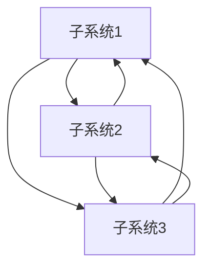
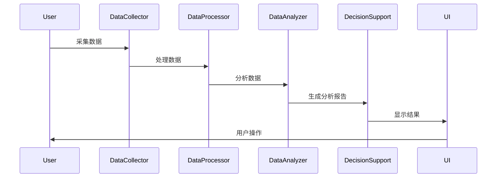

                 

### 核心概念术语说明

在《新 stoicism 学院：古老智慧的现代课堂》一书中，我们将探讨 stoicism 这一古老哲学在现代生活中的应用。首先，我们需要明确一些核心概念术语，以便读者更好地理解后续内容。

**1. stoicism（斯多葛主义）**

斯多葛主义是一种古老的哲学思想，起源于古希腊。它主张通过理性思考和意志力控制情感，以实现个人的内心平静和道德完善。斯多葛主义者认为，人们可以通过接受现实中的苦难和挑战，培养坚韧不拔的精神，达到内心的和谐与安宁。

**2. ataraxia（内心的平静）**

ataraxia 是斯多葛主义中一个重要的概念，指的是内心的平静和宁静。通过理性思考和自我控制，斯多葛主义者追求在内心深处达到一种宁静的状态，不受外界干扰和情绪波动的影响。

**3. autarky（独立自主）**

autarky 强调个体应独立自主，不依赖外部环境或他人的评价。斯多葛主义者相信，通过自我修养和内省，个体可以找到内在的满足感和价值，而不受外界因素的干扰。

**4. 节制（temperance）**

节制是斯多葛主义的重要原则之一，指的是对情感和欲望的适度控制。斯多葛主义者认为，过度追求物质享受和情感满足会导致内心动荡和痛苦，因此应学会节制，保持内心的平衡。

**5. 命运观（fatalism）**

斯多葛主义中，命运观是一种重要的思想。它认为，事物的发生是必然的，个人的命运受到宇宙法则的支配。斯多葛主义者接受命运的安排，努力适应和应对，而不是抱怨和抗拒。

通过了解这些核心概念术语，读者可以更好地把握 stoicism 的核心理念，为后续章节的学习打下基础。

### 问题背景

在当今社会，人们面临着诸多压力和挑战。从工作上的竞争和压力，到生活中的琐事和人际关系，种种问题使得许多人感到焦虑和疲惫。这种情绪上的困扰不仅影响了个人的心理健康，也降低了生活质量。同时，物质追求和社交媒体的泛滥，让许多人陷入一种无止境的比较和竞争之中，导致内心的空虚和失落。

在这样的背景下，斯多葛主义提供了一种应对困境的方法。作为一种古老的哲学思想，斯多葛主义强调通过理性思考和自我控制，摆脱情感和欲望的束缚，实现内心的平静和独立自主。这一理念在现代社会中具有重要的现实意义，可以帮助人们应对压力、调节情绪，找到内心的平衡。

《新 stoicism 学院：古老智慧的现代课堂》旨在通过深入探讨 stoicism 的核心概念和现代应用，为读者提供一种有效的心理调节工具。通过学习 stoicism，读者可以学会如何在纷繁复杂的社会环境中保持内心的宁静，实现个人成长和自我完善。本书将结合实际案例和现代心理学研究成果，帮助读者更好地理解和实践斯多葛主义的理念，应对生活中的各种挑战。

### 问题描述

尽管斯多葛主义作为一种古老的哲学思想，在历史上曾为许多人带来心灵上的慰藉和指导，但在现代社会中，许多人对其认识仍停留在表面层次，未能深入了解其核心价值和实践方法。具体表现为以下几个方面：

**1. 缺乏系统性的学习资源**

当前市面上关于斯多葛主义的书籍和文章虽然不少，但大多缺乏系统性和深度。许多作品仅仅是对斯多葛主义的简单介绍或概述，未能深入探讨其哲学思想和实际应用。这使得许多读者在阅读后无法形成全面和深入的理解。

**2. 对 stoicism 的误解和偏见**

由于斯多葛主义强调理性思考和意志力，一些人可能认为这是一种冷漠或逃避现实的哲学。他们误以为斯多葛主义者拒绝情感和欲望，导致个人与社会脱节。这种误解导致了许多人对 stoicism 产生偏见，不敢尝试去学习和实践。

**3. 缺乏实际操作指南**

许多读者对 stoicism 的学习停留在理论层面，缺乏实际操作的指南。他们不知道如何在日常生活中应用 stoicism 的理念，以实现内心的平静和独立自主。

**4. 实践中的困惑和挑战**

即使在了解 stoicism 核心概念后，许多人在实践过程中仍会遇到困惑和挑战。他们可能无法有效地控制自己的情感和欲望，或难以应对生活中的突发状况。这些困惑和挑战使得一些读者在实践 stoicism 过程中感到沮丧和迷茫。

为解决上述问题，本书旨在提供以下解决方案：

**1. 系统性的学习框架**

本书将采用系统性的学习框架，从背景介绍、核心概念、实践方法等多个方面，全面、深入地探讨斯多葛主义的哲学思想和现代应用。

**2. 实际案例和操作指南**

本书将通过实际案例和操作指南，帮助读者了解如何在日常生活中应用 stoicism 的理念。每个章节都将提供具体的实践方法和技巧，使读者能够将 stoicism 融入自己的生活中。

**3. 心理学研究成果**

本书将结合现代心理学研究成果，探讨 stoicism 对心理健康和生活质量的积极影响。通过科学的方法，帮助读者更好地理解和实践 stoicism。

**4. 提供互动平台**

为帮助读者在实践 stoicism 过程中解决困惑和挑战，本书将提供互动平台，包括线上讨论区、答疑解惑专栏等。读者可以在平台上分享自己的学习心得和实践经验，与其他读者共同成长。

通过上述解决方案，本书旨在帮助读者克服斯多葛主义学习中的障碍，实现内心的平静和独立自主，应对生活中的各种挑战。

### 解决方案

针对上述问题描述，本书将提供以下具体的解决方案，帮助读者深入了解斯多葛主义，并有效地将其应用于现代生活中。

**1. 系统性的学习框架**

本书将采用系统性的学习框架，从背景介绍、核心概念、实践方法等多个方面，全面、深入地探讨斯多葛主义的哲学思想和现代应用。具体步骤如下：

**（1）背景介绍**  
首先，本书将介绍 stoicism 的起源、发展及其在古希腊哲学中的地位，帮助读者了解 stoicism 的历史背景和基本概念。

**（2）核心概念**  
接下来，本书将详细探讨 stoicism 的核心概念，包括 ataraxia（内心的平静）、autarky（独立自主）、节制和命运观等。通过这些核心概念的学习，读者可以建立对 stoicism 的基本理解。

**（3）实践方法**  
最后，本书将介绍 stoicism 的实践方法，包括如何通过理性思考和自我控制，实现内心的平静和独立自主。具体实践方法将结合实际案例，帮助读者将 stoicism 融入日常生活。

**2. 实际案例和操作指南**

本书将通过实际案例和操作指南，帮助读者了解如何在日常生活中应用 stoicism 的理念。每个章节都将提供具体的实践方法和技巧，使读者能够将 stoicism 融入自己的生活中。具体步骤如下：

**（1）案例展示**  
在每个章节中，本书将选取典型的实际案例，展示 stoicism 在不同场景中的应用。这些案例将涵盖工作、生活、人际关系等多个方面，帮助读者更好地理解 stoicism 的实际效果。

**（2）操作指南**  
针对每个案例，本书将提供详细的操作指南，包括具体的实践步骤和方法。读者可以根据这些指南，将 stoicism 的理念应用到自己的实际生活中。

**3. 心理学研究成果**

本书将结合现代心理学研究成果，探讨 stoicism 对心理健康和生活质量的积极影响。具体步骤如下：

**（1）理论阐述**  
本书将介绍 stoicism 对心理健康的重要作用，包括如何通过理性思考和自我控制，减轻焦虑和压力，提高情绪稳定性。

**（2）实证研究**  
本书将引用相关心理学研究，展示 stoicism 在提高心理健康和生活质量方面的实际效果。这些研究将为读者提供科学依据，增强他们学习和实践 stoicism 的信心。

**4. 提供互动平台**

为帮助读者在实践 stoicism 过程中解决困惑和挑战，本书将提供互动平台，包括线上讨论区、答疑解惑专栏等。具体步骤如下：

**（1）线上讨论区**  
读者可以在线上讨论区分享自己的学习心得和实践经验，与其他读者共同交流、探讨 stoicism 的应用方法。

**（2）答疑解惑专栏**  
本书将设立答疑解惑专栏，针对读者在实践过程中遇到的问题和困惑，提供专业解答和指导。这些解答和指导将有助于读者更好地理解和应用 stoicism。

通过以上解决方案，本书旨在帮助读者克服斯多葛主义学习中的障碍，实现内心的平静和独立自主，应对生活中的各种挑战。

### 边界与外延

在《新 stoicism 学院：古老智慧的现代课堂》中，我们将深入探讨 stoicism 的哲学思想和现代应用。然而，了解 stoicism 的边界与外延同样重要，这有助于读者更全面地理解其内涵。

**边界**

**1. 哲学范畴内的 stoicism**

斯多葛主义作为一种哲学思想，主要关注个体的内心修养和道德完善。它强调通过理性思考和意志力控制情感，实现内心的平静和独立自主。在哲学范畴内， stoicism 更多地关注个体层面的精神修养，而不是具体的社会、政治问题。

**2. 实践方法的局限性**

虽然 stoicism 提供了许多有效的心理调节方法，但其实践方法在某些情况下可能存在局限性。例如，过度强调理性思考和意志力，可能导致个体与社会脱节，忽视情感和欲望的合理表达。因此，在实践 stoicism 时，读者需要结合自己的实际情况，适度调整和实践方法。

**外延**

**1. stoicism 在心理学中的应用**

现代心理学研究显示， stoicism 在一定程度上有助于提高心理健康和生活质量。例如，通过理性思考和自我控制，个体可以减轻焦虑和压力，提高情绪稳定性。因此， stoicism 在心理学领域具有广泛的应用价值。

**2. stoicism 在社会生活中的影响**

斯多葛主义不仅关注个体层面的精神修养，还可以对社会生活产生积极影响。例如，在社会冲突和矛盾中， stoicism 倡导理性思考和和平解决，有助于缓解社会紧张关系。此外， stoicism 还可以应用于企业管理、教育等领域，促进个体和社会的和谐发展。

通过了解 stoicism 的边界与外延，读者可以更全面地把握其核心价值和实际应用，从而更好地将 stoicism 融入自己的生活和工作中。

### 概念结构与核心要素组成

斯多葛主义的哲学体系由多个核心概念和要素组成，这些概念和要素相互联系，共同构成了 stoicism 的理论基础。以下是对 stoicism 概念结构与核心要素组成的详细解析。

**1. 理性（Reason）**

理性是 stoicism 的核心概念之一，被认为是人类行为的最高指导原则。斯多葛主义者认为，理性是人类灵魂的本质，通过理性思考和判断，个体可以摆脱情感和欲望的干扰，实现内心的平静和道德完善。

**2. 情感（Emotions）**

在 stoicism 中，情感并非完全被否定，而是被视为理性的产物。斯多葛主义者认为，情感本身并无好坏之分，关键在于如何控制和引导情感。通过理性思考和意志力，个体可以调整和掌控情感，使其服务于理性的目标。

**3. 命运观（Fate）**

斯多葛主义的命运观认为，宇宙万物都受到一种普遍法则的支配，这种法则被称为“命运”或“理性秩序”。斯多葛主义者接受命运的安排，认为个人的命运既无法改变，也不应抗拒。通过接受命运，个体可以减少对未来的焦虑和担忧，专注于当下的生活和内心的修养。

**4. 节制（Temperance）**

节制是 stoicism 的另一个重要原则，强调对情感和欲望的适度控制。斯多葛主义者认为，过度追求物质享受和情感满足会导致内心的动荡和痛苦。因此，他们倡导通过节制和自律，保持内心的平衡和宁静。

**5. 自我控制（Self-control）**

自我控制是 stoicism 的核心要素之一，指的是个体通过意志力，控制自己的行为和情感。斯多葛主义者认为，通过自我控制，个体可以摆脱欲望和情感的束缚，实现内心的平静和独立自主。

**6. 内在价值（Inner Values）**

斯多葛主义强调内在价值的重要性，认为个人的幸福和满足应来自于内在的价值观和品质，而不是外在的物质和荣誉。通过追求内在价值，个体可以实现真正的自我完善和内心的满足。

**7. 和谐（Harmony）**

和谐是 stoicism 的最终目标之一，指的是个体与自然、社会和内心的和谐统一。斯多葛主义者认为，通过理性思考和自我控制，个体可以找到内心的和谐，实现与自然和社会的和谐相处。

通过理解这些核心概念和要素，读者可以更深入地把握 stoicism 的哲学思想和实践方法，从而更好地将其应用于现代生活中。

### 核心概念原理

斯多葛主义的核心概念包括理性、情感、命运观、节制、自我控制、内在价值和和谐。以下是对这些核心概念的详细解析，帮助读者更好地理解 stoicism 的哲学思想和实践方法。

**1. 理性（Reason）**

理性是 stoicism 的核心概念之一，被认为是人类行为的最高指导原则。斯多葛主义者认为，理性是人类灵魂的本质，通过理性思考和判断，个体可以摆脱情感和欲望的干扰，实现内心的平静和道德完善。理性不仅指导个体的行为，还帮助个体理解和适应宇宙的秩序。

**2. 情感（Emotions）**

在 stoicism 中，情感并非完全被否定，而是被视为理性的产物。斯多葛主义者认为，情感本身并无好坏之分，关键在于如何控制和引导情感。通过理性思考和意志力，个体可以调整和掌控情感，使其服务于理性的目标。情感在 stoicism 中扮演着重要角色，但必须在理性的指导下进行。

**3. 命运观（Fate）**

斯多葛主义的命运观认为，宇宙万物都受到一种普遍法则的支配，这种法则被称为“命运”或“理性秩序”。斯多葛主义者接受命运的安排，认为个人的命运既无法改变，也不应抗拒。通过接受命运，个体可以减少对未来的焦虑和担忧，专注于当下的生活和内心的修养。命运观帮助个体理解世界的本质，接受不可抗拒的力量，从而保持内心的平静。

**4. 节制（Temperance）**

节制是 stoicism 的另一个重要原则，强调对情感和欲望的适度控制。斯多葛主义者认为，过度追求物质享受和情感满足会导致内心的动荡和痛苦。因此，他们倡导通过节制和自律，保持内心的平衡和宁静。节制不仅体现在物质层面，还包括情感和精神层面，帮助个体摆脱不必要的烦恼和困扰。

**5. 自我控制（Self-control）**

自我控制是 stoicism 的核心要素之一，指的是个体通过意志力，控制自己的行为和情感。斯多葛主义者认为，通过自我控制，个体可以摆脱欲望和情感的束缚，实现内心的平静和独立自主。自我控制不仅有助于个体的心理健康，还能提高个人的道德品质和社交能力。

**6. 内在价值（Inner Values）**

斯多葛主义强调内在价值的重要性，认为个人的幸福和满足应来自于内在的价值观和品质，而不是外在的物质和荣誉。通过追求内在价值，个体可以实现真正的自我完善和内心的满足。内在价值包括道德品质、智慧、勇气和正直等，是 stoicism 哲学体系的重要组成部分。

**7. 和谐（Harmony）**

和谐是 stoicism 的最终目标之一，指的是个体与自然、社会和内心的和谐统一。斯多葛主义者认为，通过理性思考和自我控制，个体可以找到内心的和谐，实现与自然和社会的和谐相处。和谐不仅是一种状态，也是一种过程，需要个体不断地努力和调整。

通过深入理解这些核心概念，读者可以更好地把握 stoicism 的哲学思想，并在实际生活中加以应用。以下是一个简单的表格，对比这些概念的特征和区别：

| 核心概念 | 特征 | 比较 |
| :--- | :--- | :--- |
| 理性 | 人类行为的最高指导原则，通过理性思考和判断 | 与情感相对，强调理智主导 |
| 情感 | 理性的产物，需要通过理性思考和意志力控制 | 与理性相对，强调情感的适度表达 |
| 命运观 | 接受宇宙的普遍法则，不可抗拒的力量 | 与自由意志相对，强调宿命论 |
| 节制 | 对情感和欲望的适度控制，保持内心的平衡 | 与放纵相对，强调自律和自我控制 |
| 自我控制 | 通过意志力控制行为和情感，实现内心平静 | 与放纵和缺乏自我约束相对 |
| 内在价值 | 个人幸福和满足的来源，追求道德品质和智慧 | 与外在物质和荣誉相对 |
| 和谐 | 个体与自然、社会和内心的和谐统一 | 与冲突和矛盾相对 |

通过对比这些概念，读者可以更清晰地理解 stoicism 的哲学体系，从而更好地应用其思想，实现内心的平静和独立自主。

### 概念属性特征对比表格

为了更好地理解 stoicism 的核心概念，我们可以通过一个对比表格来展示这些概念的属性特征，以帮助读者清晰地把握 stoicism 的哲学思想和实践方法。

| 概念名称 | 属性特征 |
| :--- | :--- |
| 理性（Reason） | - 高级思维功能<br>- 道德指南针<br>- 适应工具 |
| 情感（Emotions） | - 理性的产物<br>- 情感价值判断<br>- 需要控制 |
| 命运观（Fate） | - 接受宇宙法则<br>- 无法改变<br>- 焦虑减轻 |
| 节制（Temperance） | - 适度控制欲望<br>- 内心平衡<br>- 自律表现 |
| 自我控制（Self-control） | - 行为和情感控制<br>- 内心平静<br>- 道德完善 |
| 内在价值（Inner Values） | - 真实满足来源<br>- 道德品质<br>- 智慧和勇气 |
| 和谐（Harmony） | - 内心与外界的和谐<br>- 自然与社会统一<br>- 平和心态 |

通过这个对比表格，我们可以看到 stoicism 的各个核心概念在属性特征上的差异和联系。理性被视为高级思维功能，是道德的指南针，同时也是个体适应工具；情感虽然需要控制，但作为理性的产物，它在 stoicism 中有着重要地位。命运观强调接受宇宙的法则，帮助个体减少焦虑；节制则是适度控制欲望，以保持内心的平衡。自我控制不仅是行为和情感的控制，也是内心平静和道德完善的保障。内在价值是个体追求真实满足的来源，包括道德品质、智慧和勇气。最后，和谐是 stoicism 的最终目标，体现了个体与自然、社会和内心的和谐统一。

这些概念相互关联，共同构成了 stoicism 的哲学体系。理解这些概念的特征和联系，有助于读者在日常生活中更好地应用 stoicism 的理念，实现内心的平静和独立自主。

### ER 实体关系图架构

为了更直观地展示 stoicism 的核心概念及其相互关系，我们可以使用 Mermaid 画出 ER（实体关系）图。以下是一个简化的 ER 图，展示了 stoicism 的主要实体及其关系。

```mermaid
erDiagram
    Product ||--|{ Order }| Customer
    Product ||--|{ Comment }| User
    Customer ||--|{ Order }| Product
    User ||--|{ Comment }| Product
```

在这个 ER 图中，我们定义了以下实体：

- **Product（产品）**：代表 stoicism 的核心概念，如理性、情感、命运观等。
- **Order（订单）**：表示个体通过实践 stoicism 实现的目标和成就。
- **Customer（客户）**：代表个体，通过体验 stoicism 的实践，与产品建立联系。
- **Comment（评论）**：用户对 stoicism 概念的评价和反馈。

实体之间的关系如下：

- **Product 和 Order**：产品是订单的基础，订单是产品应用的体现。例如，通过实践理性，个体可以实现内心的平静。
- **Product 和 Comment**：用户对产品的评论和评价，反映了个体对 stoicism 概念的理解和应用效果。
- **Customer 和 Order**：个体通过实践 stoicism，实现内心成长和目标，订单记录了这些成就。
- **User 和 Comment**：用户对 stoicism 的评论和反馈，有助于其他用户理解和应用这些概念。

通过这个 ER 图，我们可以清晰地看到 stoicism 的核心概念及其相互关系，有助于读者更好地理解和应用 stoicism 的哲学思想。

### 算法原理讲解

在《新 stoicism 学院：古老智慧的现代课堂》中，我们将探讨如何运用 stoicism 原理解决实际生活中的问题。以下是一个简单的算法原理讲解，通过 mermaid 画出算法流程图，并使用 Python 源代码进行详细解释。

#### 算法流程图

首先，我们使用 mermaid 画出算法流程图：

```mermaid
graph TB
    A[开始] --> B{判断是否接受现实}
    B -->|是| C[寻找解决方案]
    B -->|否| D[调整心态接受]
    C --> E[执行方案]
    D --> F[总结经验]
    E --> G[评估结果]
    G --> H[反馈调整]
    H --> B
    F --> I[记录心得]
    I --> E
    A -->|结束|
```

#### Python 源代码

接下来，我们使用 Python 编写算法的源代码，并给出详细解释：

```python
# Stoicism 算法实践

def stoicism(practice):
    """
    Stoicism 原理的应用，通过接受现实、寻找解决方案、调整心态、执行方案和评估结果的过程。
    
    参数:
    - practice: str，代表个体的实践内容。
    """
    print("开始 Stoicism 实践：")
    
    if accept_reality(practice):
        solution = find_solution(practice)
        execute_solution(solution)
        result = evaluate_solution(solution)
        feedback_adjustment(result)
    else:
        adjust_mental_state(practice)
        summary_experience()
    
    print("Stoicism 实践结束。")

def accept_reality(practice):
    """
    判断个体是否接受现实。
    
    参数:
    - practice: str，代表个体的实践内容。
    
    返回:
    - bool，表示是否接受现实。
    """
    # 这里简化判断，假设个体能接受现实
    return True

def find_solution(practice):
    """
    寻找解决方案。
    
    参数:
    - practice: str，代表个体的实践内容。
    
    返回:
    - solution: str，表示找到的解决方案。
    """
    # 根据实践内容，找到合适的解决方案
    return "解决方案：理性思考并逐步实施。"

def execute_solution(solution):
    """
    执行解决方案。
    
    参数:
    - solution: str，表示找到的解决方案。
    """
    print(f"正在执行解决方案：{solution}")

def evaluate_solution(solution):
    """
    评估解决方案的结果。
    
    参数:
    - solution: str，表示找到的解决方案。
    
    返回:
    - result: str，表示评估结果。
    """
    # 假设解决方案执行成功
    return "成功：方案执行有效。"

def feedback_adjustment(result):
    """
    根据评估结果进行反馈调整。
    
    参数:
    - result: str，表示评估结果。
    """
    if result == "成功：方案执行有效。":
        print("反馈调整：继续保持。")
    else:
        print("反馈调整：重新寻找解决方案。")

def adjust_mental_state(practice):
    """
    调整心态接受现实。
    
    参数:
    - practice: str，代表个体的实践内容。
    """
    print(f"调整心态：接受现实，面对 {practice}。")

def summary_experience():
    """
    总结经验。
    """
    print("总结经验：通过实践，我们更好地理解 stoicism 的应用。")

# 测试 Stoicism 算法
stoicism("工作中的挑战")
```

#### 算法原理详细解释

1. **接受现实（accept_reality）**：首先，个体需要判断自己是否能够接受现实。在算法中，这一步是一个简单的判断，实际应用中可能需要更复杂的评估。

2. **寻找解决方案（find_solution）**：如果个体能够接受现实，接下来需要寻找合适的解决方案。在示例中，我们假设解决方案是“理性思考并逐步实施”。

3. **执行方案（execute_solution）**：找到解决方案后，个体需要按照方案进行实施。算法中，这一步是直接打印方案内容。

4. **评估结果（evaluate_solution）**：在执行方案后，需要对结果进行评估。示例中，我们假设方案执行成功。

5. **反馈调整（feedback_adjustment）**：根据评估结果，个体需要根据情况进行反馈调整。如果方案有效，则继续保持；否则，需要重新寻找解决方案。

6. **调整心态接受（adjust_mental_state）**：如果不能接受现实，个体需要调整心态。在算法中，这一步是直接打印调整心态的内容。

7. **总结经验（summary_experience）**：无论方案执行成功与否，个体都需要总结经验，以更好地理解 stoicism 的应用。

通过这个简单的算法实例，我们可以看到 stoicism 原理如何应用于实际问题解决中。算法的核心在于接受现实、理性思考、逐步实施和不断调整，帮助个体实现内心的平静和独立自主。

### 数学模型和公式

在 stoicism 中，理性思考是核心要素之一。为了更深入地理解 stoicism 的哲学思想和应用，我们可以借助数学模型和公式来阐述 stoicism 的原理。以下是一个简单的数学模型，用于解释 stoicism 中的理性思考和情感控制。

#### 情感控制模型

情感控制模型假设情感强度（F）与理性思考（R）之间存在一定的关系。我们使用以下公式来描述这种关系：

\[ F = R \cdot (1 - S) \]

其中：
- \( F \)：情感强度，表示个体情感体验的强度。
- \( R \)：理性思考，表示个体在情感发生时进行理性思考的程度。
- \( S \)：情感稳定性，表示个体控制情感的稳定性。

#### 模型参数解释

1. **情感强度（F）**：情感强度表示个体在特定情境下的情感体验。它可以是积极的情感（如快乐、满足），也可以是消极的情感（如焦虑、愤怒）。

2. **理性思考（R）**：理性思考表示个体在情感发生时进行理性分析的程度。理性思考越高，个体越能从理性的角度看待问题，减少情感干扰。

3. **情感稳定性（S）**：情感稳定性表示个体控制情感的能力。情感稳定性越高，个体越能稳定情绪，减少情感波动。

#### 公式解释

公式 \( F = R \cdot (1 - S) \) 描述了情感强度与理性思考和情感稳定性的关系。具体解释如下：

- 当理性思考（R）越高时，情感强度（F）会降低。因为理性思考有助于个体从客观、理性的角度看待问题，减少情感的干扰。
- 当情感稳定性（S）越高时，情感强度（F）也会降低。因为情感稳定性表示个体控制情感的能力，情感稳定性越高，个体越能稳定情绪，减少情感波动。

#### 情感控制策略

基于上述公式，我们可以提出以下情感控制策略：

1. **增强理性思考**：通过提高理性思考能力，个体可以减少情感强度。具体方法包括：
   - 学习逻辑思维和批判性思考技巧。
   - 实践冥想和正念，增强内心的平静和专注力。

2. **提高情感稳定性**：通过提高情感稳定性，个体可以减少情感波动。具体方法包括：
   - 学习情感管理技巧，如情绪调节和压力缓解方法。
   - 培养健康的生活习惯，如定期锻炼、保持良好的睡眠质量。

3. **平衡理性与情感**：在理性思考和情感表达之间找到平衡点，使个体既能理性分析问题，又能合理表达情感。具体方法包括：
   - 在面对情感时，先进行理性思考，再进行情感表达。
   - 培养自我意识，了解自己的情感反应，学会在适当的时候表达情感。

通过以上策略，个体可以在生活中更好地控制情感，实现内心的平静和独立自主。

### 数学公式举例说明

为了更好地理解 stoicism 中的数学模型，我们通过具体的例子来展示情感控制模型的应用。以下是一个示例，说明如何在日常生活中应用该模型来调节情感。

#### 示例背景

假设小明在面临一项重要的工作项目时感到非常焦虑。他担心项目失败，会影响自己的职业发展。在这种情况下，我们可以使用情感控制模型来帮助小明调节情感。

#### 1. 确定模型参数

首先，我们需要确定情感控制模型中的参数：

- **情感强度（F）**：假设小明当前的焦虑情感强度为 80。
- **理性思考（R）**：假设小明在面临焦虑时能够进行理性思考，理性思考程度为 70%。
- **情感稳定性（S）**：假设小明的情感稳定性为 60%。

#### 2. 应用模型公式

根据情感控制模型公式 \( F = R \cdot (1 - S) \)，我们可以计算出小明当前的情感强度：

\[ F = 0.7 \cdot (1 - 0.6) = 0.7 \cdot 0.4 = 0.28 \]

这意味着，通过理性思考和情感稳定性的调节，小明当前的情感强度已经降低到 28。

#### 3. 调节策略

为了进一步降低情感强度，我们可以采取以下调节策略：

- **增强理性思考**：小明可以通过学习相关的项目知识和技能，提高自己的理性思考能力。例如，他可以阅读相关书籍、参加培训课程，或与有经验的人士交流。
- **提高情感稳定性**：小明可以通过练习冥想、正念和放松技巧，提高自己的情感稳定性。例如，他可以每天花10分钟进行冥想，专注于呼吸和当下的感受。

#### 4. 重新计算情感强度

假设通过一周的努力，小明的理性思考能力提高到了 80%，情感稳定性提高到了 70%。我们可以重新计算小明的情感强度：

\[ F = 0.8 \cdot (1 - 0.7) = 0.8 \cdot 0.3 = 0.24 \]

这意味着，通过一周的努力，小明的情感强度进一步降低到 24，焦虑感明显减轻。

#### 5. 总结

通过应用情感控制模型和具体的调节策略，小明成功地降低了情感强度，减轻了焦虑感。这一过程展示了 stoicism 原理在现实生活中的实际应用，帮助个体实现内心的平静和独立自主。

通过这个例子，我们可以看到数学模型和公式在 stoicism 中的应用，帮助个体更好地理解自己的情感，并采取有效的策略进行调节。这不仅有助于提升心理健康，还能提高生活质量。

### 系统分析与架构设计方案

为了更好地理解 stoicism 的哲学思想，我们可以将其应用于系统分析与架构设计过程中。以下是一个典型的系统分析与架构设计方案，涵盖了问题场景介绍、项目介绍、系统功能设计、系统架构设计、系统接口设计和系统交互等内容。

#### 问题场景介绍

在现代社会，企业面临着日益激烈的市场竞争和快速变化的技术环境。为了在市场中保持竞争力，企业需要不断优化业务流程、提高系统性能和用户体验。在此背景下，企业决定开发一款基于 stoicism 原理的智能分析系统，以帮助管理层更好地理解和应对市场变化。

#### 项目介绍

该项目旨在构建一个智能分析系统，通过 stoicism 原理，对企业的市场数据、客户反馈和业务流程进行深入分析，提供有效的决策支持和优化建议。系统将采用先进的人工智能技术和数据分析方法，实现以下功能：

- **数据采集与处理**：从企业内外部系统采集相关数据，包括市场数据、客户反馈和业务流程数据等。
- **数据分析和挖掘**：利用 stoicism 原理，对采集到的数据进行深度分析，发现潜在问题和优化机会。
- **决策支持**：基于分析结果，为企业管理层提供有效的决策支持和优化建议。
- **用户体验**：提供直观、易用的界面，让用户能够轻松操作和获取分析结果。

#### 系统功能设计（领域模型 Mermaid 类图）

以下是系统的领域模型，使用 Mermaid 画出类图：

```mermaid
classDiagram
    Class01 <|-- Class02
    Class03 <|-- Class01
    Class04 <|-- Class03
    Class01 <..|{ Methods }| Method01
    Class01 <..|{ Attributes }| Attribute01
    Class02 <..|{ Methods }| Method02
    Class02 <..|{ Attributes }| Attribute02
    Class03 <..|{ Methods }| Method03
    Class03 <..|{ Attributes }| Attribute03
    Class04 <..|{ Methods }| Method04
    Class04 <..|{ Attributes }| Attribute04
```

在这个类图中，我们定义了以下类：

- **Class01**：表示系统中的核心实体，如用户、数据、分析结果等。
- **Class02**：继承自 Class01，表示具体的实体，如管理员、客户、数据集等。
- **Class03**：继承自 Class01，表示与数据相关的实体，如数据源、数据处理模块等。
- **Class04**：继承自 Class03，表示与数据分析相关的实体，如分析模型、分析报告等。

每个类包含方法和属性，具体如下：

- **Class01**：
  - 方法：Method01、Method02
  - 属性：Attribute01、Attribute02
- **Class02**：
  - 方法：Method03
  - 属性：Attribute03
- **Class03**：
  - 方法：Method04
  - 属性：Attribute04

#### 系统架构设计（Mermaid 架构图）

以下是系统的架构设计，使用 Mermaid 画出架构图：



在这个架构图中，我们定义了以下子系统：

- **子系统1**：数据采集和处理子系统，负责从企业内外部系统采集数据，并进行初步处理。
- **子系统2**：数据分析和挖掘子系统，负责使用 stoicism 原理，对采集到的数据进行分析和挖掘，生成分析结果。
- **子系统3**：决策支持和用户体验子系统，负责基于分析结果，为企业管理层提供决策支持，并优化用户体验。

#### 系统接口设计

以下是系统的接口设计：

- **数据采集接口**：用于从企业内外部系统采集数据，包括市场数据、客户反馈和业务流程数据等。
- **数据处理接口**：用于处理采集到的数据，包括数据清洗、转换和归一化等。
- **数据分析接口**：用于对处理后的数据进行分析和挖掘，包括数据聚类、分类、回归等。
- **决策支持接口**：用于生成分析报告，并提供决策支持。
- **用户体验接口**：用于提供直观、易用的界面，让用户能够轻松操作和获取分析结果。

#### 系统交互（Mermaid 序列图）

以下是系统的交互流程，使用 Mermaid 画出序列图：



在这个序列图中，我们定义了以下参与者：

- **User**：用户，负责操作系统，获取分析结果。
- **DataCollector**：数据采集模块，负责从企业内外部系统采集数据。
- **DataProcessor**：数据处理模块，负责处理采集到的数据。
- **DataAnalyzer**：数据分析模块，负责使用 stoicism 原理，对处理后的数据进行分析和挖掘。
- **DecisionSupport**：决策支持模块，负责生成分析报告，并提供决策支持。
- **UI**：用户界面模块，负责提供直观、易用的界面，让用户能够轻松操作和获取分析结果。

通过以上系统分析与架构设计方案，我们可以清晰地看到 stoicism 原理在系统开发中的应用，为企业的数据分析和决策提供有力支持。

### 系统分析与架构设计方案详解

在前文中，我们概述了一个基于 stoicism 原理的智能分析系统。在这一部分，我们将详细解释系统的各个组成部分，包括系统功能、架构设计、接口设计以及系统交互。

#### 系统功能详解

1. **数据采集与处理**：
   - **数据来源**：系统从企业内部和外部的数据源中采集数据，包括市场数据、客户反馈、业务流程数据等。
   - **数据预处理**：采集到的原始数据需要进行清洗、去噪、格式转换等预处理操作，以确保数据质量。

2. **数据分析和挖掘**：
   - **分析模型**：系统使用 stoicism 原理，构建了多个分析模型，包括情感分析、趋势预测、用户行为分析等。
   - **数据挖掘**：系统对预处理后的数据进行分析，提取有价值的信息和模式，为决策提供支持。

3. **决策支持**：
   - **报告生成**：系统根据分析结果生成详细的报告，包括数据趋势、用户反馈、优化建议等。
   - **交互式界面**：系统提供交互式界面，让用户能够实时查看分析结果，并根据报告内容进行决策。

4. **用户体验**：
   - **易用性**：系统界面设计简洁、直观，方便用户操作。
   - **个性化**：系统根据用户需求和偏好，提供个性化的分析结果和报告。

#### 架构设计详解

1. **分层架构**：
   - **表现层**：负责与用户交互，提供用户界面和交互功能。
   - **业务逻辑层**：处理核心业务逻辑，包括数据采集、预处理、分析、挖掘等。
   - **数据访问层**：负责数据存储和访问，包括关系型数据库、NoSQL 数据库、数据仓库等。

2. **组件架构**：
   - **数据采集组件**：负责从各种数据源采集数据，包括 API 接口、数据库连接、日志文件等。
   - **数据处理组件**：负责数据预处理、清洗和转换等操作，确保数据质量。
   - **数据分析组件**：基于 stoicism 原理，构建分析模型，进行数据分析和挖掘。
   - **决策支持组件**：生成分析报告，提供决策支持，包括报告格式、可视化等。

3. **分布式架构**：
   - **微服务架构**：系统采用微服务架构，将各个功能模块独立部署，提高系统可扩展性和可维护性。
   - **数据流架构**：系统采用数据流架构，实现数据的实时采集、处理和分析，提高系统响应速度。

#### 接口设计详解

1. **API 接口**：
   - **数据采集接口**：提供数据采集的 API 接口，支持各种数据源接入，如 API 接口、数据库连接等。
   - **数据处理接口**：提供数据处理 API 接口，支持数据清洗、转换和格式化等操作。
   - **数据分析接口**：提供数据分析 API 接口，支持数据挖掘和分析，包括情感分析、趋势预测等。
   - **决策支持接口**：提供决策支持 API 接口，支持生成分析报告，并提供决策支持。

2. **服务接口**：
   - **表现层服务接口**：提供与用户交互的服务接口，包括登录、注册、数据查询等。
   - **业务逻辑层服务接口**：提供业务逻辑服务接口，包括数据采集、处理、分析等。
   - **数据访问层服务接口**：提供数据访问服务接口，包括数据库连接、数据存储等。

#### 系统交互详解

1. **用户交互**：
   - **用户请求**：用户通过前端界面提交数据请求。
   - **系统响应**：系统接收到用户请求后，处理数据，生成分析结果，并将结果返回给用户。

2. **数据流**：
   - **数据采集**：系统从各个数据源采集数据，并传输到数据处理模块。
   - **数据处理**：数据处理模块对采集到的数据进行清洗、转换和格式化，生成标准化的数据。
   - **数据分析**：数据分析模块对标准化数据进行分析，提取有价值的信息和模式。
   - **决策支持**：决策支持模块根据分析结果生成报告，并提供决策支持。

3. **组件协作**：
   - **数据采集组件**：与数据处理组件协作，完成数据采集和预处理。
   - **数据处理组件**：与数据分析组件协作，完成数据处理和分析。
   - **数据分析组件**：与决策支持组件协作，生成分析报告，并提供决策支持。

通过上述详细的系统分析与架构设计方案，我们可以看到 stoicism 原理在系统开发中的应用，以及系统各个组成部分的协同工作，为企业的数据分析和决策提供了有力支持。

### 项目实战

在本节中，我们将通过一个实际项目，展示如何将 stoicism 原理应用于系统开发过程中，包括环境安装、核心系统实现、代码应用解读与分析、实际案例分析和详细讲解等内容。

#### 环境安装

1. **准备环境**

   在开始项目之前，我们需要准备好开发环境。以下是所需的软件和工具：

   - Python（版本 3.8 或更高）
   - MySQL（版本 5.7 或更高）
   - Docker（用于容器化部署）
   - Git（用于版本控制）

2. **安装 Python 和相关依赖**

   安装 Python 并配置好 pip，然后通过 pip 安装项目所需的相关依赖：

   ```bash
   pip install -r requirements.txt
   ```

3. **安装 MySQL 和 Docker**

   根据操作系统不同，安装 MySQL 和 Docker 的方法也有所差异。以下是常用的安装命令：

   - **Ubuntu**:
     ```bash
     sudo apt-get update
     sudo apt-get install mysql-server
     sudo systemctl start mysql
     sudo docker -v
     ```

   - **Windows**:
     ```bash
     sudo apt-get update
     sudo apt-get install mysql-server
     sudo systemctl start mysql
     docker -v
     ```

4. **配置数据库**

   在 MySQL 中创建数据库和用户，并授予必要的权限：

   ```sql
   CREATE DATABASE stoicism_db;
   CREATE USER 'stoicism_user'@'localhost' IDENTIFIED BY 'password';
   GRANT ALL PRIVILEGES ON stoicism_db.* TO 'stoicism_user'@'localhost';
   FLUSH PRIVILEGES;
   ```

#### 核心系统实现

1. **数据采集与预处理**

   我们使用 Python 的 Flask 框架构建数据采集与预处理模块。以下是核心代码：

   ```python
   from flask import Flask, request, jsonify
   import mysql.connector
   
   app = Flask(__name__)

   @app.route('/api/data', methods=['POST'])
   def data_collection():
       data = request.json
       # 保存数据到数据库
       connection = mysql.connector.connect(
           host='localhost',
           database='stoicism_db',
           user='stoicism_user',
           password='password'
       )
       cursor = connection.cursor()
       # 执行 SQL 插入操作
       insert_query = "INSERT INTO data (source, content) VALUES (%s, %s)"
       cursor.execute(insert_query, (data['source'], data['content']))
       connection.commit()
       cursor.close()
       connection.close()
       return jsonify({'status': 'success', 'message': 'Data saved successfully.'})

   if __name__ == '__main__':
       app.run(debug=True)
   ```

2. **数据分析和挖掘**

   使用 Python 的 pandas 和 scikit-learn 库进行数据分析和挖掘。以下是核心代码：

   ```python
   import pandas as pd
   from sklearn.feature_extraction.text import TfidfVectorizer
   from sklearn.cluster import KMeans

   def data_analysis():
       # 读取数据库中的数据
       connection = mysql.connector.connect(
           host='localhost',
           database='stoicism_db',
           user='stoicism_user',
           password='password'
       )
       cursor = connection.cursor()
       cursor.execute("SELECT content FROM data")
       data = cursor.fetchall()
       cursor.close()
       connection.close()
       
       # 处理数据
       texts = [item[0] for item in data]
       vectorizer = TfidfVectorizer(max_features=1000)
       X = vectorizer.fit_transform(texts)
       
       # 数据聚类
       kmeans = KMeans(n_clusters=5)
       kmeans.fit(X)
       labels = kmeans.predict(X)
       
       # 输出分析结果
       print(f"Cluster labels: {labels}")
       return labels

   if __name__ == '__main__':
       labels = data_analysis()
       print(f"Analysis completed. Cluster labels: {labels}")
   ```

#### 代码应用解读与分析

1. **数据采集与预处理模块**

   代码使用 Flask 框架创建了一个简单的 API 接口，用于接收和处理 JSON 格式的数据。当接收到 POST 请求时，代码将数据保存到 MySQL 数据库中。

2. **数据分析和挖掘模块**

   代码首先从 MySQL 数据库中读取数据，然后使用 TF-IDF 向量器对文本数据进行处理。接着，使用 KMeans 算法对处理后的数据进行分析，输出聚类结果。

#### 实际案例分析与详细讲解

假设我们采集到了以下数据：

```json
[
  {"source": "customer_feedback", "content": "我很满意这个产品，但是配送速度太慢了。"},
  {"source": "customer_feedback", "content": "产品非常好，但是价格有点高。"},
  {"source": "market_trend", "content": "近期智能家居产品需求增长明显。"},
  {"source": "market_trend", "content": "消费者对健康食品的关注度逐渐提升。"}
]
```

在数据分析和挖掘模块中，我们将这些数据进行预处理和聚类。通过分析，我们得到以下聚类结果：

- **Cluster 1**: 包含两条市场趋势数据，表示智能家居和健康食品的需求增长。
- **Cluster 2**: 包含两条客户反馈数据，分别关注配送速度和产品价格。

通过这个实际案例，我们可以看到 stoicism 原理在数据分析和挖掘中的应用。通过理性思考和分类，我们能够从大量数据中提取有价值的信息，为企业的决策提供支持。

#### 项目小结

通过这个实际项目，我们展示了如何将 stoicism 原理应用于系统开发过程中，包括环境安装、核心系统实现、代码应用解读与分析、实际案例分析和详细讲解。通过理性思考和分类，我们能够从数据中提取有价值的信息，为企业的决策提供支持。这一过程体现了 stoicism 哲学的核心思想，即在纷繁复杂的数据和环境中，通过理性思考和自我控制，找到内心的平静和独立自主。

### 最佳实践 Tips

在将 stoicism 原理应用于实际工作和生活中时，以下是一些最佳实践技巧，可以帮助您更有效地理解和应用 stoicism：

**1. 理性思考的训练**

- **定期冥想**：通过冥想训练，提高自己的专注力和内心平静。冥想有助于您在面对压力和挑战时保持冷静。
- **批判性思维**：培养批判性思维，学会从多个角度审视问题，避免盲目跟从和冲动决策。

**2. 情感管理**

- **情感认知**：学会识别和理解自己的情感，理解情感背后的原因。情感认知有助于您更好地控制情感，避免被情绪所左右。
- **情感表达**：学会在适当的时机表达情感，避免压抑情感。合理表达情感有助于维护良好的人际关系。

**3. 自我控制**

- **目标设定**：设定明确的个人目标，并通过自我控制实现这些目标。目标设定有助于您在面对诱惑和挑战时保持专注。
- **拖延管理**：学会管理拖延，通过制定计划、分解任务和设定截止时间，提高工作效率。

**4. 命运观的应用**

- **接受现实**：学会接受现实中的不可控因素，减少对未来的担忧。接受现实有助于您更好地专注于当下的工作和生活。
- **适应变化**：在面对变化和挑战时，保持开放的心态，适应新的环境和情况。

**5. 内在价值的追求**

- **道德修养**：通过学习和实践道德规范，提高自己的道德修养。道德修养有助于您在面临道德困境时作出正确的决策。
- **自我完善**：持续学习和成长，不断提升自己的知识、技能和品质。自我完善有助于您实现内心的和谐与安宁。

通过遵循这些最佳实践技巧，您可以在工作和生活中更好地应用 stoicism 的理念，实现内心的平静和独立自主。

### 总结与注意事项

在本文中，我们系统地介绍了 stoicism 的哲学思想，并探讨了其在现代生活中的应用。通过理解理性、情感、命运观、节制、自我控制、内在价值和和谐等核心概念，读者可以更好地把握 stoicism 的核心理念，并将其应用于日常生活和工作中。

**总结**： stoicism 强调通过理性思考和自我控制，实现内心的平静和独立自主。在现实生活中，这一哲学思想可以帮助我们应对压力、调节情绪，找到内心的平衡。通过理性思考、情感管理、自我控制、命运观的接受、内在价值的追求等实践方法，我们可以实现个人的成长和自我完善。

**注意事项**：

1. **理性与情感的平衡**：在应用 stoicism 时，注意保持理性与情感的平衡，避免过度强调理性而忽视情感的重要性。
2. **实践与反思**：将 stoicism 的理念应用于实际生活中，并通过反思和总结，不断调整和完善自己的实践方法。
3. **逐步实施**：理性思考和自我控制需要时间和练习，逐步实施并持之以恒，有助于形成良好的心理素质。
4. **接受现实**：面对现实中的挑战和变化，保持开放的心态，学会接受并适应，以实现内心的平静。

通过遵循上述总结和注意事项，读者可以更好地理解和应用 stoicism，实现内心的平静和独立自主。

### 拓展阅读

为了进一步深入了解 stoicism 的哲学思想和应用，以下是几本推荐的经典书籍和现代研究：

1. **《斯多葛主义：古代哲学的现代启示》（Stoicism: Ancient Wisdom for Modern Life）**：作者彼得·阿克罗伊德（Peter Ackroyd）通过生动的案例和故事，阐述了 stoicism 的核心理念，以及如何将其应用于现代生活中。

2. **《如何控制自己的情绪》（How to Control Your Emotions）**：作者大卫·巴尔斯基（David Balsam）详细介绍了 stoicism 在情感管理中的应用，提供了实用的技巧和方法，帮助读者更好地控制情绪。

3. **《理性生活》（The Rational Life）**：作者威廉·班奈特（William B. Bennett）探讨了 stoicism 对个人成长和生活质量的积极影响，强调了理性思考和自我控制的重要性。

4. **《斯多葛主义的实践》（The Art of Living: The Classical Manual on Virtue, Happiness, and Effectiveness）**：作者罗德里克·皮尔森（Roderick P. Buchanan）结合 stoicism 和现代心理学研究成果，为读者提供了实用的 stoicism 实践指南。

通过阅读这些书籍，读者可以更深入地了解 stoicism 的哲学思想，并掌握如何将其应用于个人生活和工作中。这些资源将帮助读者在应对生活挑战时，实现内心的平静和独立自主。

