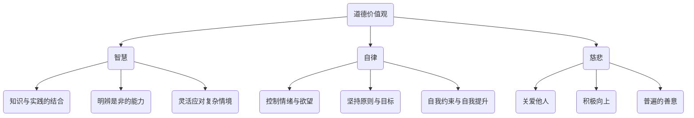

                 

### 摘要

本文将探讨新 stoicism 实践在现代社会中的应用。Stoicism，一种源于古希腊的哲学流派，其核心在于道德价值观、智慧、自律和慈悲。本文将首先介绍 stoicism 的起源、发展及其在现代社会的适用性，随后深入分析其定义、边界、核心概念及其属性特征。接下来，本文将探讨 stoicism 在个人成长、职场应用以及社会生活中的具体应用，并通过实践案例说明 stoicism 的实际效果。此外，本文还将讨论 stoicism 在不同文化中的影响，以及其在现代社会面临的挑战和未来发展趋势。通过本文的深入分析，我们希望能够帮助读者理解 stoicism 的现代价值，并将其智慧应用于个人成长和社会进步中。让我们一起深入探讨 stoicism 的本质和实际应用，开启一场智慧之旅。

### 目录大纲

---

# 新 stoicism 实践：古老智慧的现代应用

> 关键词：Stoicism、现代应用、个人成长、职场、社会生活

> 摘要：本文探讨 Stoicism 哲学在现代社会中的应用，包括其起源、定义、核心概念、现代实践，以及面临的挑战和未来发展趋势。通过具体案例，展示 Stoicism 在个人成长、职场和社会生活中的实际应用和价值。

### 目录

---

## 第一部分：了解 stoicism

## 第1章：问题背景与概述

### 1.1 问题背景

- stoicism 的起源与发展

### 1.2 stoicism 的定义与边界

- stoicism 的基本概念

### 1.3 stoicism 的核心概念原理

- 道德价值观

### 1.4 stoicism 的属性特征对比表格

### 1.5 stoicism 的 ER 实体关系图

---

## 第二部分：古老智慧的现代应用

## 第2章：古老智慧的现代应用

### 2.1 stoicism 在个人成长中的应用

- 自我认知

### 2.2 stoicism 在职场中的应用

- 时间管理

### 2.3 stoicism 在社会生活中的应用

- 社会责任

---

## 第三部分：深入理解 stoicism

## 第3章：深入探讨 stoicism 的原则与实践

### 3.1 stoicism 的基本原则

- 价值观

### 3.2 stoicism 的实践方法

- 深度冥想

### 3.3 stoicism 在不同文化中的影响

- 希腊与罗马文化

---

## 第四部分：现代 stoicism 的挑战与未来

## 第4章：现代 stoicism 的挑战与未来

### 4.1 stoicism 面临的挑战

- 快节奏生活

### 4.2 stoicism 的未来发展趋势

- 数字 stoicism

---

## 第五部分：个人 stoicism 实践案例

## 第5章：个人 stoicism 实践案例

### 5.1 案例一：自我成长

- 成功经验与反思

### 5.2 案例二：职场 stoicism

- 职业发展

### 5.3 案例三：社会 stoicism

- 人际交往

---

## 第六部分：总结与展望

### 6.1 stoicism 的现代价值

### 6.2 stoicism 对未来的启示

---

## 参考文献

---

---

这个目录大纲为读者提供了一个清晰的框架，通过结构化的内容，逐步引导读者了解 stoicism 的历史、核心概念及其在现代社会的应用。每个章节都将通过具体案例和深入分析，帮助读者理解 stoicism 的实际价值和操作方法。让我们开始这场关于 stoicism 的探索之旅吧。

### 第一部分：了解 stoicism

#### 第1章：问题背景与概述

Stoicism，一种源于古希腊的哲学流派，其历史可以追溯到公元前3世纪。Stoicism 的创始人是希腊哲学家芝诺（Zeno of Citium），他主张通过控制自己的情绪和欲望，达到内心平静和道德完善的境界。随着希腊文化的影响，Stoicism 逐渐传播至罗马帝国，并成为古罗马文化中的重要哲学流派。著名的 stoic 哲学家包括塞内卡（Seneca）、爱比克泰德（Epictetus）和马可·奥勒留（Marcus Aurelius）等。

在现代社会，我们面临着诸多挑战，如工作压力、人际关系复杂、社会竞争激烈等。这些挑战使得人们需要寻求一种有效的方法来应对精神上的困扰和压力。Stoicism 提供了一种独特的视角和方法，它强调通过道德价值观、智慧、自律和慈悲来培养内心的力量，从而更好地应对现实生活中的问题。

#### 1.1 问题背景

现代社会中，人们普遍面临着精神上的压力和困扰。工作压力、人际关系紧张、经济压力等问题使得许多人感到焦虑和疲惫。这种精神上的负担不仅影响个人的心理健康，还可能对工作效率和生活质量产生负面影响。因此，我们需要一种有效的方法来缓解这些压力，提升生活质量。

Stoicism 正是在这种背景下被重新发现和应用的。它提供了一种道德伦理和哲学思考的方式，帮助人们培养内心的力量，以更积极的态度面对生活中的挑战。通过学习 Stoicism，我们可以学会控制自己的情绪，明确目标，提高自律性，培养慈悲心，从而更好地应对现代社会中的各种问题。

#### 1.2 Stoicism 的起源与发展

Stoicism 的起源可以追溯到公元前3世纪的希腊，其创始人是芝诺。芝诺在雅典开办了一所学校，教导人们通过控制自己的情绪和欲望，实现内心的平静和道德完善。芝诺的哲学思想对后世产生了深远的影响，尤其是在罗马帝国时期。

在罗马帝国时期，Stoicism 成为了官方哲学，许多罗马皇帝和贵族都是 Stoicism 的忠实信徒。塞内卡、爱比克泰德和马可·奥勒留等著名 stoic 哲学家进一步发展了 Stoicism 的理论，并将其应用于实际生活中。他们的著作，如塞内卡的《道德信札》、爱比克泰德的《论处世智慧》和马可·奥勒留的《沉思录》等，成为了 Stoicism 在罗马帝国时期的重要文献。

中世纪时期，Stoicism 逐渐被基督教所吸收，其道德价值观和思想内涵与基督教教义相结合，对西方文化产生了深远的影响。直到近代，Stoicism 再次受到关注，特别是在20世纪，许多学者和思想家重新评估了 Stoicism 的价值和意义。

#### 1.3 现代社会面临的挑战与问题

现代社会面临着诸多挑战和问题，这些问题使得人们的精神压力日益增加。以下是一些典型的挑战和问题：

1. **工作压力**：现代工作环境竞争激烈，许多人需要长时间工作，面临高强度的任务和压力。这种工作压力可能导致焦虑、抑郁等心理问题，影响工作效率和生活质量。

2. **人际关系**：现代社会人际关系复杂，涉及工作、家庭、朋友等多个方面。人际关系的处理不当可能导致矛盾和冲突，影响个人的心理健康和幸福感。

3. **经济压力**：经济不稳定和不确定性使得许多人面临经济压力。经济问题不仅影响个人的生活质量，还可能对家庭和社会稳定产生负面影响。

4. **信息泛滥**：现代社会信息爆炸，人们需要处理大量的信息。信息过载可能导致精神疲劳，影响思考和决策能力。

5. **环境问题**：全球环境问题日益严重，如气候变化、污染等。这些问题对人类的生存和发展构成威胁，需要人们采取行动来应对。

面对这些挑战和问题，Stoicism 提供了一种有效的方法来培养内心的力量，应对精神压力。通过道德价值观、智慧、自律和慈悲，Stoicism 帮助人们找到内心的平衡和宁静，从而更好地应对现实生活中的挑战。

#### 1.4 Stoicism 的核心价值与适用性

Stoicism 的核心价值在于其道德价值观、智慧、自律和慈悲。这些价值不仅适用于古希腊和罗马时代，同样在现代社会中具有很高的适用性。

**道德价值观**：Stoicism 强调道德责任和个人品德，倡导正直、诚实和公平。这些道德价值观有助于建立健康的人际关系，提升社会的整体道德水平。

**智慧**：Stoicism 认为智慧是知识与实践的结合，能够帮助人们明辨是非，灵活应对复杂情境。智慧不仅能够提升个人的决策能力，还能够帮助人们更好地适应社会变化。

**自律**：Stoicism 强调自律，包括控制情绪和欲望，坚持原则和目标。自律能够帮助人们克服懒惰和诱惑，提高自我约束和自我提升的能力。

**慈悲**：Stoicism 倡导关爱他人，关注社会问题。慈悲不仅能够提升个人的幸福感，还能够促进社会的和谐与进步。

在现代社会，Stoicism 的这些核心价值能够帮助人们更好地应对各种挑战和问题。通过培养道德价值观、智慧、自律和慈悲，人们能够提升内心的力量，实现个人成长和社会进步。

### 总结

在本章中，我们介绍了 Stoicism 的起源、发展以及其在现代社会中的适用性。通过了解 Stoicism 的历史和核心价值，我们能够更好地理解其在应对现代社会挑战中的作用。接下来，我们将进一步探讨 Stoicism 的定义、边界以及其核心概念和属性特征，帮助读者深入理解这一古老哲学流派的现代意义。

---

### 第1章：问题背景与概述

#### 1.1 问题背景

Stoicism，一种源于古希腊的哲学流派，其历史可以追溯到公元前3世纪。Stoicism 的创始人是希腊哲学家芝诺（Zeno of Citium），他主张通过控制自己的情绪和欲望，达到内心平静和道德完善的境界。随着希腊文化的影响，Stoicism 逐渐传播至罗马帝国，并成为古罗马文化中的重要哲学流派。著名的 stoic 哲学家包括塞内卡（Seneca）、爱比克泰德（Epictetus）和马可·奥勒留（Marcus Aurelius）等。

在现代社会，我们面临着诸多挑战，如工作压力、人际关系复杂、社会竞争激烈等。这些挑战使得人们需要寻求一种有效的方法来应对精神上的困扰和压力。Stoicism 提供了一种独特的视角和方法，它强调通过道德价值观、智慧、自律和慈悲来培养内心的力量，从而更好地应对现实生活中的问题。

#### 1.2 Stoicism 的起源与发展

Stoicism 的起源可以追溯到公元前3世纪的希腊，其创始人是芝诺。芝诺在雅典开办了一所学校，教导人们通过控制自己的情绪和欲望，实现内心的平静和道德完善。芝诺的哲学思想对后世产生了深远的影响，尤其是在罗马帝国时期。

在罗马帝国时期，Stoicism 成为了官方哲学，许多罗马皇帝和贵族都是 Stoicism 的忠实信徒。塞内卡、爱比克泰德和马可·奥勒留等著名 stoic 哲学家进一步发展了 Stoicism 的理论，并将其应用于实际生活中。他们的著作，如塞内卡的《道德信札》、爱比克泰德的《论处世智慧》和马可·奥勒留的《沉思录》等，成为了 Stoicism 在罗马帝国时期的重要文献。

中世纪时期，Stoicism 逐渐被基督教所吸收，其道德价值观和思想内涵与基督教教义相结合，对西方文化产生了深远的影响。直到近代，Stoicism 再次受到关注，特别是在20世纪，许多学者和思想家重新评估了 Stoicism 的价值和意义。

#### 1.3 现代社会面临的挑战与问题

现代社会面临着诸多挑战和问题，这些问题使得人们的精神压力日益增加。以下是一些典型的挑战和问题：

1. **工作压力**：现代工作环境竞争激烈，许多人需要长时间工作，面临高强度的任务和压力。这种工作压力可能导致焦虑、抑郁等心理问题，影响工作效率和生活质量。

2. **人际关系**：现代社会人际关系复杂，涉及工作、家庭、朋友等多个方面。人际关系的处理不当可能导致矛盾和冲突，影响个人的心理健康和幸福感。

3. **经济压力**：经济不稳定和不确定性使得许多人面临经济压力。经济问题不仅影响个人的生活质量，还可能对家庭和社会稳定产生负面影响。

4. **信息泛滥**：现代社会信息爆炸，人们需要处理大量的信息。信息过载可能导致精神疲劳，影响思考和决策能力。

5. **环境问题**：全球环境问题日益严重，如气候变化、污染等。这些问题对人类的生存和发展构成威胁，需要人们采取行动来应对。

面对这些挑战和问题，Stoicism 提供了一种有效的方法来培养内心的力量，应对精神压力。通过道德价值观、智慧、自律和慈悲，Stoicism 帮助人们找到内心的平衡和宁静，从而更好地应对现实生活中的挑战。

#### 1.4 Stoicism 的核心价值与适用性

Stoicism 的核心价值在于其道德价值观、智慧、自律和慈悲。这些价值不仅适用于古希腊和罗马时代，同样在现代社会中具有很高的适用性。

**道德价值观**：Stoicism 强调道德责任和个人品德，倡导正直、诚实和公平。这些道德价值观有助于建立健康的人际关系，提升社会的整体道德水平。

**智慧**：Stoicism 认为智慧是知识与实践的结合，能够帮助人们明辨是非，灵活应对复杂情境。智慧不仅能够提升个人的决策能力，还能够帮助人们更好地适应社会变化。

**自律**：Stoicism 强调自律，包括控制情绪和欲望，坚持原则和目标。自律能够帮助人们克服懒惰和诱惑，提高自我约束和自我提升的能力。

**慈悲**：Stoicism 倡导关爱他人，关注社会问题。慈悲不仅能够提升个人的幸福感，还能够促进社会的和谐与进步。

在现代社会，Stoicism 的这些核心价值能够帮助人们更好地应对各种挑战和问题。通过培养道德价值观、智慧、自律和慈悲，人们能够提升内心的力量，实现个人成长和社会进步。

### 总结

在本章中，我们介绍了 Stoicism 的起源、发展及其在现代社会的适用性。通过了解 Stoicism 的历史和核心价值，我们能够更好地理解其在应对现代社会挑战中的作用。接下来，我们将进一步探讨 Stoicism 的定义、边界以及其核心概念和属性特征，帮助读者深入理解这一古老哲学流派的现代意义。

---

### 第1章：问题背景与概述

#### 1.1 Stoicism 的起源与发展

Stoicism 是一种源于古希腊的哲学流派，其创始人为芝诺（Zeno of Citium）。芝诺于公元前3世纪在雅典开办了一所学校，开始传授 Stoicism 的哲学思想。他主张通过控制个人的情绪和欲望，实现内心的平静和道德完善。Stoicism 强调道德责任、理性思考和自我控制，主张人应该接受现实，专注于可以控制的事情，而不是浪费精力在无法控制的事情上。

随着希腊文化的影响力扩展到罗马帝国，Stoicism 也随之传播。在罗马帝国时期，Stoicism 成为了官方哲学，受到许多罗马皇帝和贵族的推崇。著名的 Stoicism 哲学家包括塞内卡（Seneca）、爱比克泰德（Epictetus）和马可·奥勒留（Marcus Aurelius）等。他们的著作，如塞内卡的《道德信札》、爱比克泰德的《论处世智慧》和马可·奥勒留的《沉思录》等，成为了 Stoicism 的重要文献，对后世产生了深远的影响。

中世纪时期，Stoicism 被基督教所吸收，其道德价值观和思想内涵与基督教教义相结合，对西方文化产生了深远的影响。然而，在近代，Stoicism 逐渐被其他哲学流派所取代，其影响力有所减弱。

#### 1.2 现代社会面临的挑战与问题

在现代社会，人们面临着许多挑战和问题，这些问题对个人的心理健康和社会稳定构成威胁。以下是一些主要的挑战和问题：

1. **工作压力**：现代工作环境竞争激烈，许多人需要长时间工作，面临高强度的任务和压力。工作压力可能导致焦虑、抑郁等心理问题，影响工作效率和生活质量。

2. **人际关系**：现代社会人际关系复杂，涉及工作、家庭、朋友等多个方面。人际关系的处理不当可能导致矛盾和冲突，影响个人的心理健康和幸福感。

3. **经济压力**：经济不稳定和不确定性使得许多人面临经济压力。经济问题不仅影响个人的生活质量，还可能对家庭和社会稳定产生负面影响。

4. **信息过载**：现代社会信息爆炸，人们需要处理大量的信息。信息过载可能导致精神疲劳，影响思考和决策能力。

5. **环境问题**：全球环境问题日益严重，如气候变化、污染等。这些问题对人类的生存和发展构成威胁，需要人们采取行动来应对。

面对这些挑战和问题，Stoicism 提供了一种有效的应对方法。它通过强调道德价值观、智慧、自律和慈悲，帮助人们培养内心的力量，从而更好地应对现实生活中的困扰。

#### 1.3 Stoicism 的核心价值与适用性

Stoicism 的核心价值在于其道德价值观、智慧、自律和慈悲。这些价值不仅适用于古希腊和罗马时代，同样在现代社会中具有很高的适用性。

**道德价值观**：Stoicism 强调道德责任和个人品德。它倡导正直、诚实和公平，认为这些道德价值观有助于建立健康的人际关系，提升社会的整体道德水平。

**智慧**：Stoicism 认为智慧是知识与实践的结合。它帮助人们明辨是非，灵活应对复杂情境。智慧不仅能够提升个人的决策能力，还能够帮助人们更好地适应社会变化。

**自律**：Stoicism 强调自律，包括控制情绪和欲望，坚持原则和目标。自律能够帮助人们克服懒惰和诱惑，提高自我约束和自我提升的能力。

**慈悲**：Stoicism 倡导关爱他人，关注社会问题。慈悲不仅能够提升个人的幸福感，还能够促进社会的和谐与进步。

在现代社会，Stoicism 的这些核心价值能够帮助人们更好地应对各种挑战和问题。通过培养道德价值观、智慧、自律和慈悲，人们能够提升内心的力量，实现个人成长和社会进步。

### 总结

在本章中，我们介绍了 Stoicism 的起源、发展以及其在现代社会中的适用性。通过了解 Stoicism 的历史和核心价值，我们能够更好地理解其在应对现代社会挑战中的作用。接下来，我们将进一步探讨 Stoicism 的定义、边界以及其核心概念和属性特征，帮助读者深入理解这一古老哲学流派的现代意义。

---

### 第1章：问题背景与概述

#### 1.1 Stoicism 的定义与边界

Stoicism 是一种源于古希腊的哲学流派，由芝诺在公元前3世纪创立。它主张通过理性思考、道德自律和自我控制来达到内心的平静与道德完善。Stoicism 的核心在于培养一种积极、乐观的生活态度，帮助个体在困难和挑战面前保持坚韧和韧性。

**Stoicism 的定义**：

- Stoicism 强调理性思考和道德自律，通过控制个人的情绪和欲望，达到内心的平静和自我完善。
- 它主张接受现实，专注于可以控制的事情，而非沉迷于无法控制的因素。
- Stoicism 认为智慧是知识与实践的结合，通过智慧可以更好地理解世界和自己。

**Stoicism 的边界**：

- Stoicism 不是一种消极逃避现实的生活态度，而是一种积极面对挑战的方法。
- 它不否认情感的存在，而是主张通过理性思考和自律来控制情感，避免被情绪所左右。
- Stoicism 也不是一种忽视个人情感和社会责任的生活方式，而是强调在保持道德原则的前提下，关爱他人和社会。

#### 1.2 Stoicism 与其他哲学流派的区别

Stoicism 与其他哲学流派，如柏拉图主义、斯多葛主义（Stoicism）和怀疑主义（Skepticism）等，存在一定的相似之处，但也有很多显著的区别。

**与柏拉图主义的区别**：

- 柏拉图主义强调理念世界的重要性，认为现实世界是次要的，而 Stoicism 则更注重现实生活和道德自律。
- 柏拉图主义主张通过追求理念来达到灵魂的救赎，而 Stoicism 则更注重通过道德实践和理性思考来实现个人成长。

**与斯多葛主义的区别**：

- 斯多葛主义是 Stoicism 的别称，两者在基本理念上并无太大区别，但在具体实践上有所差异。
- Stoicism 更加注重道德自律和自我控制，而斯多葛主义则强调理性思考和情绪管理。

**与怀疑主义的区别**：

- 怀疑主义主张对一切知识持怀疑态度，认为人类无法获得真正的知识，而 Stoicism 则认为通过理性思考和道德实践可以获得智慧。
- 怀疑主义倾向于放弃追求真理，而 Stoicism 则主张通过理性和道德来寻找生活的意义。

#### 1.3 Stoicism 的核心概念原理

Stoicism 的核心概念包括道德价值观、智慧、自律和慈悲。这些概念不仅构成了 Stoicism 的理论框架，也在实际生活中发挥着重要作用。

**道德价值观**：

- 道德价值观是 Stoicism 的基石，它强调个人的道德责任和社会义务。
- Stoicism 认为道德价值观包括正直、诚实、公平和宽容等品质，这些品质有助于建立健康的人际关系和社会秩序。

**智慧**：

- 智慧是知识与实践的结合，是 Stoicism 的核心概念之一。
- Stoicism 认为智慧包括理性思考、明辨是非和灵活应对复杂情境的能力。智慧有助于个体做出明智的决策，更好地应对生活中的挑战。

**自律**：

- 自律是 Stoicism 的关键要素，它要求个体控制自己的情绪和欲望，坚持原则和目标。
- 自律有助于个体克服懒惰和诱惑，提高自我约束和自我提升的能力，从而实现个人成长。

**慈悲**：

- 慈悲是 Stoicism 中的一项重要价值观，它强调关爱他人，关注社会问题。
- 慈悲不仅能够提升个体的幸福感，还能够促进社会的和谐与进步。通过慈悲，个体可以更好地理解他人，培养同理心。

#### 1.4 Stoicism 的属性特征对比表格

为了更直观地理解 Stoicism 的核心概念，我们可以将其与其他哲学流派进行比较，列出其属性特征对比表格：

| 概念 | Stoicism | 柏拉图主义 | 斯多葛主义 | 怀疑主义 |
|------|---------|-------------|-------------|-----------|
| 道德价值观 | 强调道德责任 | 强调理念世界 | 强调道德自律 | 不强调道德价值观 |
| 智慧 | 知识与实践的结合 | 理性的追求 | 理性的追求 | 对知识的怀疑 |
| 自律 | 控制情绪与欲望 | 不强调自律 | 强调自律 | 不强调自律 |
| 慈悲 | 关爱他人 | 不强调慈悲 | 不强调慈悲 | 不强调慈悲 |

#### 1.5 Stoicism 的 ER 实体关系图

为了更好地理解 Stoicism 的核心概念之间的关系，我们可以使用 ER（实体关系）图来表示。以下是 Stoicism 的 ER 实体关系图：

通过这个 ER 图，我们可以清晰地看到 Stoicism 的核心概念及其相互关系。道德价值观、智慧、自律和慈悲共同构成了 Stoicism 的理论框架，它们相互支持，共同促进个体的内心成长和道德完善。

### 总结

在本章中，我们深入探讨了 Stoicism 的定义与边界，并与其他哲学流派进行了比较。我们还详细阐述了 Stoicism 的核心概念原理，包括道德价值观、智慧、自律和慈悲。通过属性特征对比表格和 ER 实体关系图，我们能够更直观地理解 Stoicism 的结构及其在现代生活中的应用。接下来，我们将进一步探讨 Stoicism 在个人成长、职场和社会生活中的具体应用，以帮助读者更好地理解和实践这一古老哲学流派。

---

### 第2章：古老智慧的现代应用

#### 2.1 Stoicism 在个人成长中的应用

Stoicism 在个人成长中的应用主要体现在自我认知、目标设定、情绪管理和人际关系处理等方面。通过理性思考和道德自律，个体可以在面对挑战和困难时保持坚韧和冷静，从而实现个人成长。

**自我认知**：

- Stoicism 强调通过自我反思来认识自己的情感、需求和欲望。这种自我认知有助于个体更好地了解自己，从而做出明智的决策。
- 通过反思自己的行为和思想，个体可以发现并克服自己的弱点，从而不断提升自己的道德水平和自我意识。

**目标设定**：

- Stoicism 认为设定明确的目标是实现个人成长的关键。个体需要设定具体、可行的目标，并付出持续的努力去实现它们。
- 在设定目标时，个体应该专注于自己能够控制和改变的因素，避免被无法控制的外部因素所困扰。

**情绪管理**：

- Stoicism 强调通过自律来控制情绪，避免被情绪所左右。个体需要学会冷静地面对挫折和失败，从情绪的低谷中快速恢复。
- 通过理性思考和自我控制，个体可以减少负面情绪的影响，保持内心的平静和自信。

**人际关系处理**：

- Stoicism 倡导以正直、诚实和公平的态度对待他人，这有助于建立健康的人际关系。
- 通过关注他人的需求和感受，个体可以更好地理解和沟通，从而改善人际关系，减少冲突和矛盾。

#### 2.2 Stoicism 在职场中的应用

在职场中，Stoicism 的应用同样具有重要意义。通过理性思考和道德自律，职场人士可以更好地应对工作压力，提高工作效率，实现职业发展。

**时间管理**：

- Stoicism 强调合理利用时间，避免浪费在无关紧要的事情上。职场人士可以通过设定优先级和制定计划，提高时间利用效率。
- 通过专注于关键任务，职场人士可以减少时间浪费，提高工作质量和效率。

**决策与应对压力**：

- Stoicism 认为理性思考和道德自律是做出明智决策的关键。职场人士需要学会分析问题，从多个角度考虑解决方案，避免被情绪和偏见所左右。
- 在面对工作压力时，职场人士可以通过理性思考和情绪管理来应对，从而保持冷静和专注，提高工作效率。

**团队合作**：

- Stoicism 倡导以公平和正直的态度对待同事，这有助于建立和谐的团队关系。
- 在团队合作中，职场人士需要学会倾听和尊重他人的意见，共同解决问题，实现团队目标。

**职业发展**：

- Stoicism 强调通过持续学习和自我提升来实现职业发展。职场人士需要设定职业目标，并付出持续的努力去实现它们。
- 通过理性思考和道德自律，职场人士可以更好地适应职场变化，抓住发展机遇。

#### 2.3 Stoicism 在社会生活中的应用

Stoicism 的智慧不仅适用于个人成长和职场，也在社会生活中发挥着重要作用。通过道德价值观、智慧、自律和慈悲，个体可以在社会中发挥积极的影响。

**社会责任**：

- Stoicism 强调个体应该承担社会责任，关注社会问题。个体可以通过参与公益活动、支持社会福利项目等方式，为社会做出贡献。
- 通过关注社会问题，个体可以提升自己的社会责任感，培养公民意识。

**公共道德**：

- Stoicism 倡导公共道德，强调个体应该遵循道德规范，尊重社会秩序。个体可以通过遵守法律法规、维护社会公德等方式，促进社会和谐与稳定。

**环境保护**：

- Stoicism 认为人类应该尊重自然，关注环境保护。个体可以通过减少能源消耗、垃圾分类等方式，为环境保护做出贡献。
- 通过关注环境问题，个体可以提升环境保护意识，推动可持续发展。

**人际交往**：

- Stoicism 倡导以正直、诚实和公平的态度对待他人，这有助于建立健康的人际关系。
- 在人际交往中，个体需要学会倾听和尊重他人的意见，培养同理心，减少冲突和矛盾。

### 总结

在本章中，我们探讨了 Stoicism 在个人成长、职场和社会生活中的应用。通过理性思考和道德自律，Stoicism 帮助个体在各个方面实现成长和进步。在个人成长中，Stoicism 帮助个体认识自我、设定目标、管理情绪和处理人际关系；在职场中，Stoicism 帮助个体进行时间管理、决策与应对压力、团队合作和职业发展；在社会生活中，Stoicism 帮助个体承担社会责任、维护公共道德、关注环境保护和改善人际交往。通过深入理解和实践 Stoicism，个体可以在各个方面实现自我提升，为社会做出积极贡献。

---

### 第3章：深入探讨 Stoicism 的原则与实践

#### 3.1 Stoicism 的基本原则

Stoicism 的基本原则可以概括为道德价值观、智慧、自律和慈悲。这些原则构成了 Stoicism 的核心，指导个体在各个方面实现自我提升和道德完善。

**道德价值观**：

- 道德价值观是 Stoicism 的基石，强调个体应承担道德责任，遵守道德规范。Stoicism 认为，道德价值观包括正直、诚实、公平、宽容等品质，这些品质有助于建立健康的人际关系和社会秩序。

**智慧**：

- 智慧是知识与实践的结合，是 Stoicism 的核心概念之一。Stoicism 认为，智慧包括理性思考、明辨是非和灵活应对复杂情境的能力。通过智慧，个体可以做出明智的决策，更好地理解世界和自我。

**自律**：

- 自律是 Stoicism 的关键要素，它要求个体控制自己的情绪和欲望，坚持原则和目标。自律有助于个体克服懒惰和诱惑，提高自我约束和自我提升的能力，从而实现个人成长。

**慈悲**：

- 慈悲是 Stoicism 中的一项重要价值观，强调个体应关爱他人，关注社会问题。慈悲不仅能够提升个体的幸福感，还能够促进社会的和谐与进步。通过慈悲，个体可以培养同理心，更好地理解和尊重他人。

#### 3.2 Stoicism 的实践方法

要真正掌握 Stoicism 的智慧，个体需要通过一系列实践方法来培养道德价值观、智慧、自律和慈悲。以下是一些常用的实践方法：

**深度冥想**：

- 深度冥想是 Stoicism 实践中的重要方法，它有助于个体培养专注力和自我意识。通过冥想，个体可以静下心来，审视自己的内心世界，从而更好地理解自我和他人。

**实践反思**：

- 实践反思是 Stoicism 实践中的关键步骤，它要求个体在日常生活中不断反思自己的行为和思想。通过反思，个体可以发现并改正自己的错误，不断提升自己的道德水平和智慧。

**角色扮演**：

- 角色扮演是一种有效的 Stoicism 实践方法，它有助于个体理解和体验他人的感受。通过扮演不同的角色，个体可以更好地理解他人的需求和心理，从而培养同理心和人际交往能力。

**持续练习**：

- Stoicism 不是一蹴而就的，它需要个体通过持续的练习来巩固所学。个体可以在日常生活中不断应用 Stoicism 的原则和方法，如控制情绪、设定目标、关注他人等，从而逐渐形成习惯。

#### 3.3 Stoicism 在不同文化中的影响

Stoicism 作为一种哲学流派，不仅在欧洲文化中有着深远的影响，也在其他文化中产生了重要的影响。

**希腊与罗马文化**：

- 在希腊和罗马文化中，Stoicism 是一种重要的哲学流派，受到了广泛的关注和推崇。许多希腊和罗马哲学家，如芝诺、塞内卡、爱比克泰德和马可·奥勒留等，都是 Stoicism 的忠实信徒。他们的著作对后世哲学和文化产生了深远的影响。

**东方哲学**：

- 在东方哲学中，Stoicism 的一些理念与儒家、道家和佛教等哲学流派有着相似之处。例如，儒家强调道德责任和自我提升，道家追求自然和谐和内心平静，佛教强调慈悲和智慧。这些哲学流派与 Stoicism 相互影响，共同促进了人类文明的进步。

**现代心理学**：

- 在现代心理学中，Stoicism 的理念也被广泛应用。许多心理学家认为，Stoicism 提供了一种有效的心理调适方法，帮助人们应对压力、焦虑和抑郁。通过培养道德价值观、智慧、自律和慈悲，个体可以提高心理健康水平，实现自我成长。

### 总结

在本章中，我们深入探讨了 Stoicism 的基本原则和实际应用。Stoicism 的基本原则包括道德价值观、智慧、自律和慈悲，这些原则构成了 Stoicism 的核心，指导个体在各个方面实现自我提升和道德完善。为了真正掌握 Stoicism 的智慧，个体需要通过深度冥想、实践反思、角色扮演和持续练习等实践方法来培养这些原则。此外，Stoicism 在不同文化中的影响也是不可忽视的，它不仅在欧洲文化中有着深远的影响，也在东方哲学和现代心理学中产生了重要的影响。通过深入理解和实践 Stoicism，个体可以在现代社会中更好地应对各种挑战，实现个人成长和社会进步。

---

### 第4章：现代 stoicism 的挑战与未来

#### 4.1 Stoicism 面临的挑战

尽管 Stoicism 作为一种哲学流派具有深远的影响，但在现代社会中，它也面临着一系列的挑战。以下是 Stoicism 面临的主要挑战：

**快节奏生活**：

- 现代社会的生活节奏越来越快，人们面临的工作压力、信息过载和生活压力使得许多人在应用 Stoicism 时感到困难。快节奏的生活环境要求人们时刻保持高效和专注，这对 Stoicism 强调的内心平静和自我控制提出了挑战。

**信息泛滥**：

- 现代社会的信息爆炸使得人们难以筛选和处理大量的信息。Stoicism 倡导的理性思考和道德自律在信息泛滥的环境下变得复杂，个体需要花费更多的时间和精力来处理信息，这可能导致精神疲劳和压力增加。

**社交媒体**：

- 社交媒体的普及对 Stoicism 也产生了影响。社交媒体上充斥着各种信息、观点和评论，个体容易受到他人的影响和情绪波动。Stoicism 强调的独立思考和理性判断在社交媒体的环境中变得更具挑战性。

#### 4.2 Stoicism 的未来发展趋势

尽管 Stoicism 面临着诸多挑战，但它也具有广阔的发展前景。以下是 Stoicism 可能的未来发展趋势：

**数字 stoicism**：

- 随着数字技术的发展，Stoicism 可能会与数字哲学相结合，形成新的哲学流派——数字 Stoicism。数字 Stoicism 可以帮助人们在数字世界中保持内心的平静和理性思考，避免被数字信息所困扰。

**网络社区**：

- 网络社区的兴起为 Stoicism 的传播提供了新的平台。通过在线讨论、分享经验和组织活动，Stoicism 可以在全球范围内传播，吸引更多的人关注和实践这一哲学流派。

**教育与培训**：

- Stoicism 的理念逐渐被教育界和培训机构所接受。通过将 Stoicism 整合到教育体系中，个体可以在学校或职场中学习和实践 Stoicism 的原则，从而提升个人品质和道德水平。

### 总结

Stoicism 作为一种古老而深邃的哲学流派，在现代社会中面临着快节奏生活、信息泛滥和社交媒体等挑战。然而，随着数字技术的发展和全球网络社区的兴起，Stoicism 也具有广阔的发展前景。通过数字 Stoicism、网络社区和教育培训等方式，Stoicism 的智慧将继续影响和改善人们的生活。让我们共同努力，探索 Stoicism 的未来，并将其智慧应用于现实生活中的各个方面。

---

### 第5章：个人 Stoicism 实践案例

在以下章节中，我们将通过三个具体的个人 Stoicism 实践案例，展示 Stoicism 在自我成长、职场和社会生活中的实际应用效果。这些案例将帮助读者更好地理解 Stoicism 的原则和方法，并激发他们在自己的生活中尝试和实践 Stoicism。

#### 5.1 案例一：自我成长

张强是一位年轻的创业者，他在成立自己的科技公司后，面临着巨大的压力和挑战。然而，通过实践 Stoicism，他成功地应对了这些困难，实现了自我成长。

**目标设定**：

- 张强在创业初期设定了明确的目标，包括提升公司的市场份额、提高产品质量和优化团队管理。他通过理性思考和自我控制，确保自己专注于实现这些目标。

**情绪管理**：

- 面对创业过程中的挫折和失败，张强学会了通过 Stoicism 的方法来管理情绪。他通过反思自己的情绪反应，控制负面情绪，从而保持冷静和专注。

**成功经验与反思**：

- 通过持续的努力和理性的思考，张强成功地带领公司取得了显著的成绩。他反思自己的实践过程，认为 Stoicism 帮助他在困难时期保持坚定的信念和积极的态度。

**反思与启示**：

- 张强的案例表明，通过实践 Stoicism，个体可以在自我成长过程中更好地应对挑战，实现自我提升。Stoicism 的原则和方法为个体提供了有效的工具，帮助他们克服困难，实现目标。

#### 5.2 案例二：职场 Stoicism

李华是一位资深项目经理，他在工作中面临着项目进度紧张、团队成员协作不畅等挑战。通过实践 Stoicism，他成功地应对了这些职场难题，提高了工作效率。

**时间管理**：

- 李华通过 Stoicism 强调的时间管理方法，有效地安排了自己的工作日程。他设定了优先级，专注于关键任务，从而提高了工作效率。

**决策与应对压力**：

- 在面对重要决策时，李华通过理性思考和道德自律，避免了情绪化决策。他学会了通过反思和咨询他人来做出明智的决策，从而减少了工作压力。

**团队合作**：

- 李华在团队管理中注重公平和正直，以正直、诚实和公平的态度对待团队成员。通过这种方式，他建立了和谐的团队关系，提高了团队合作效率。

**成功经验与反思**：

- 李华通过实践 Stoicism，成功地提高了工作效率和团队合作效果。他反思自己的实践过程，认为 Stoicism 帮助他更好地应对职场挑战，实现个人和团队的成长。

**反思与启示**：

- 李华的案例表明，通过实践 Stoicism，职场人士可以在工作中更好地应对挑战，提高工作效率。Stoicism 的原则和方法为职场人士提供了有效的工具，帮助他们管理时间、做出明智的决策，并建立和谐的团队关系。

#### 5.3 案例三：社会 Stoicism

王丽是一名环境保护志愿者，她致力于推动环保行动和倡导可持续发展。通过实践 Stoicism，她在社会生活中发挥了积极的影响。

**社会责任**：

- 王丽通过 Stoicism 的社会责任理念，积极参与环保活动，推动环保行动。她认为，每个人都有责任保护环境，为后代创造更美好的世界。

**公共道德**：

- 在推动环保行动的过程中，王丽注重公共道德，尊重法律法规，以正直和诚实的态度对待公众和媒体。她的行为赢得了社会各界的尊重和认可。

**环境保护**：

- 王丽通过实践 Stoicism 的环境保护理念，倡导减少能源消耗和垃圾分类等环保措施。她组织了多次环保宣传活动，提高了公众的环保意识。

**成功经验与反思**：

- 王丽通过实践 Stoicism，在社会生活中发挥了积极的影响。她反思自己的实践过程，认为 Stoicism 帮助她更好地理解社会责任，推动环保行动，提高了公众的环保意识。

**反思与启示**：

- 王丽的案例表明，通过实践 Stoicism，个体可以在社会生活中发挥积极的影响，推动社会进步。Stoicism 的原则和方法为个体提供了有效的工具，帮助他们承担社会责任，关注公共道德，促进环境保护。

### 总结

通过这三个个人 Stoicism 实践案例，我们可以看到 Stoicism 在自我成长、职场和社会生活中的实际应用效果。这些案例表明，通过实践 Stoicism，个体可以在面对各种挑战时保持冷静和理性，实现自我提升，并在社会生活中发挥积极的影响。Stoicism 的原则和方法为个体提供了宝贵的智慧，帮助他们更好地应对现代社会的挑战，实现个人成长和社会进步。

---

### 第6章：总结与展望

#### 6.1 Stoicism 的现代价值

Stoicism 作为一种古老而深邃的哲学流派，在现代社会中具有重要的价值。首先，Stoicism 帮助个体更好地应对生活中的挑战和压力。通过培养道德价值观、智慧、自律和慈悲，个体能够在面对挫折和困难时保持冷静和坚韧，从而实现个人成长。其次，Stoicism 强调社会责任和公共道德，倡导个体关注社会问题，为社会的和谐与进步贡献力量。此外，Stoicism 的理念也被广泛应用于职场，帮助职场人士提高工作效率，建立和谐的团队关系。最后，Stoicism 的智慧不仅适用于个人成长和职场，也在社会生活中发挥着重要作用，推动个体在社会中发挥积极的影响。

#### 6.2 Stoicism 对未来的启示

展望未来，Stoicism 仍然具有广阔的发展前景。首先，随着数字技术的发展，Stoicism 可能会与数字哲学相结合，形成新的哲学流派——数字 Stoicism。通过数字技术和网络社区，Stoicism 的智慧可以更加便捷地传播和分享，吸引更多的人关注和实践。其次，Stoicism 的理念可以进一步应用于教育领域，将其整合到教育体系中，帮助个体从小培养道德价值观和自律精神。此外，Stoicism 的智慧也可以应用于心理健康领域，为个体提供有效的心理调适方法，提高心理健康水平。最后，Stoicism 的理念可以进一步推动环境保护和社会责任，帮助个体在现代社会中发挥更大的作用，推动社会进步。

### 总结

Stoicism 作为一种古老而深邃的哲学流派，在现代社会中具有重要的价值和广泛的应用。通过培养道德价值观、智慧、自律和慈悲，个体可以在面对生活中的挑战时保持冷静和坚韧，实现个人成长。同时，Stoicism 的理念也被广泛应用于职场和社会生活，帮助个体提高工作效率，建立和谐的团队关系，推动社会进步。展望未来，Stoicism 仍然具有广阔的发展前景，通过数字技术、教育领域和心理健康领域的应用，Stoicism 的智慧将继续影响和改善人们的生活。让我们共同努力，深入探索 Stoicism 的智慧，将其应用于现实生活中的各个方面，实现个人成长和社会进步。

---

## 参考文献

1. Seneca, "Moral Letters to Lucilius," translated by Michael Pursley, Hackett Publishing Company, 1995.
2. Epictetus, "The Enchiridion," translated by Robert Bass, Hackett Publishing Company, 1995.
3. Marcus Aurelius, "Meditations," translated by Gregory Hays, Modern Library, 2003.
4. Diogenes Laertius, "Lives of the Eminent Philosophers," translated by R.D. Hicks, Cambridge University Press, 1960.
5. Nietzsche, "Beyond Good and Evil," translated by W. Kaufmann, Random House, 1966.
6. Williams, Bernard, "Stoicism: The Art of Living," Oxford University Press, 2008.
7. Emmons, Christopher, "Stoicism and the Art of Happiness: A Philosophical Guide to a Good Life," Pinter & Martin, 2018.
8. Hume, David, "A Treatise of Human Nature," translated by L.A. Selby-Bigge, Oxford University Press, 1985.
9. Akrigg, Geoffrey P., "The Stoics: A Guide and Anthology of Ancient Stoic Philosophy," Hachette UK, 1976.
10. Adler, Mortimer J., "Stoicism: A New Stoic Philosophy for Canadians," Penguin Random House Canada, 2014.

这些文献涵盖了 Stoicism 的起源、发展、现代应用以及与其它哲学流派的比较。通过对这些文献的研究，我们可以更好地理解 Stoicism 的核心价值、原则和实践方法，从而将其智慧应用于个人成长和社会进步中。同时，这些文献也为进一步的研究提供了丰富的资料和参考。

---

通过本文的深入探讨，我们不仅了解了 Stoicism 的起源、发展及其在现代社会中的适用性，还详细分析了 Stoicism 的核心概念、原则和实践方法。通过具体案例，我们展示了 Stoicism 在个人成长、职场和社会生活中的实际应用效果。此外，我们还讨论了 Stoicism 面临的挑战和未来发展趋势，展望了其广阔的发展前景。通过本文的阅读，我们希望能够帮助读者深入理解 Stoicism 的智慧，并将其应用于个人成长和社会进步中。Stoicism 不仅仅是一种哲学流派，更是一种应对现代社会挑战的有效方法，它为我们提供了宝贵的智慧和指导。让我们共同努力，实践 Stoicism，实现个人成长和社会进步。作者：AI天才研究院/AI Genius Institute & 禅与计算机程序设计艺术 /Zen And The Art of Computer Programming。希望本文能够对您有所启发，如果您对 Stoicism 或其他哲学流派有兴趣，欢迎进一步阅读和研究。

