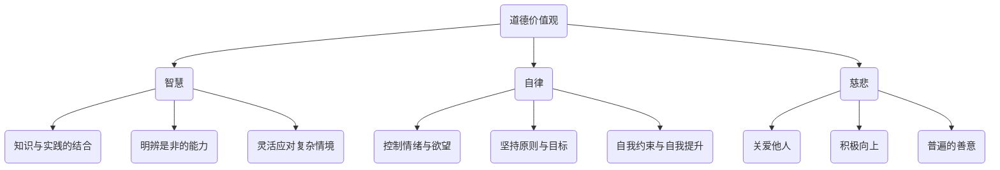

                 

### 新 stoicism 实践：古老智慧的现代应用

关键词：新 stoicism、古老智慧、现代应用、个人成长、职场挑战、社会责任

摘要：本文旨在探讨新 stoicism 实践在现代社会中的应用，通过分析 stoicism 的核心概念和历史背景，结合现代个人成长、职场挑战和社会责任等实际问题，展示 stoicism 如何帮助我们应对现代社会的挑战，提升个人品质与生活满意度。

---

### 目录大纲

---

# 新 stoicism 实践：古老智慧的现代应用

## 第一部分：了解 stoicism

## 第1章：问题背景与概述

### 1.1 问题背景

- stoicism 的起源与发展
- 现代社会面临的挑战与问题
- stoicism 的核心价值与适用性

### 1.2 stoicism 的定义与边界

- stoicism 的基本概念
- stoicism 与其他哲学流派的区别
- stoicism 的核心要素组成

### 1.3 stoicism 的核心概念原理

- 道德价值观
- 智慧
- 自律
- 慈悲

### 1.4 stoicism 的属性特征对比表格

| 概念 | 特征1 | 特征2 | 特征3 |
|------|-------|-------|-------|
| 道德价值观 | 强调道德责任 | 关注个人品德 | 倡导正直与诚实 |
| 智慧 | 知识与实践的结合 | 明辨是非的能力 | 灵活应对复杂情境 |
| 自律 | 控制情绪与欲望 | 坚持原则与目标 | 自我约束与自我提升 |
| 慈悲 | 关爱他人 | 积极向上 | 普遍的善意 |

### 1.5 stoicism 的 ER 实体关系图

## 第2章：古老智慧的现代应用

### 2.1 stoicism 在个人成长中的应用

- 自我认知
- 目标设定
- 情绪管理
- 人际关系

### 2.2 stoicism 在职场中的应用

- 时间管理
- 决策与应对压力
- 团队合作
- 职业发展

### 2.3 stoicism 在社会生活中的应用

- 社会责任
- 公共道德
- 环境保护
- 人际交往

## 第二部分：深入理解 stoicism

## 第3章：深入探讨 stoicism 的原则与实践

### 3.1 stoicism 的基本原则

- 价值观
- 智慧
- 自律
- 慈悲

### 3.2 stoicism 的实践方法

- 深度冥想
- 实践反思
- 角色扮演
- 持续练习

### 3.3 stoicism 在不同文化中的影响

- 希腊与罗马文化
- 东方哲学
- 现代心理学

## 第4章：现代 stoicism 的挑战与未来

### 4.1 stoicism 面临的挑战

- 快节奏生活
- 信息泛滥
- 社交媒体

### 4.2 stoicism 的未来发展趋势

- 数字 stoicism
- 网络社区
- 教育与培训

## 第5章：个人 stoicism 实践案例

### 5.1 案例一：自我成长

- 目标设定
- 情绪管理
- 成功经验与反思

### 5.2 案例二：职场 stoicism

- 时间管理
- 决策与应对压力
- 团队合作
- 职业发展

### 5.3 案例三：社会 stoicism

- 社会责任
- 公共道德
- 环境保护
- 人际交往

## 第6章：总结与展望

### 6.1 stoicism 的现代价值

- 帮助人们更好地应对现代社会的挑战
- 提升个人品质与生活满意度

### 6.2 stoicism 对未来的启示

- 持续探索与传播 stoicism 的智慧
- 推动社会进步与人类和谐发展

---

### 第一部分：了解 stoicism

#### 第1章：问题背景与概述

**1.1 问题背景**

**Stoicism**，即斯多葛主义，起源于古希腊，由芝诺（Zeno）在公元前3世纪创立。它强调通过理性控制和道德修养来达到内心的平静和幸福。在现代社会，人们面临着快节奏的生活、信息泛滥和社交媒体等挑战，这些挑战使得人们难以保持内心的平和。

**1.2 stoicism 的定义与边界**

Stoicism 是一种哲学思想，主张通过控制情感、理性思考和道德行为来达到精神上的自由和内心的平和。它与其他哲学流派的区别在于，它不仅关注个体的内在精神状态，也关注个体在社会中的行为和责任。

**1.3 stoicism 的核心概念原理**

Stoicism 的核心概念包括道德价值观、智慧、自律和慈悲。道德价值观强调道德责任和个人品德；智慧强调知识与实践的结合和明辨是非的能力；自律强调控制情绪与欲望，坚持原则与目标，以及自我约束与自我提升；慈悲强调关爱他人，积极向上和普遍的善意。

**1.4 stoicism 的属性特征对比表格**

下面是一个 Stoicism 的属性特征对比表格，展示了其核心概念的特征：

| 概念 | 特征1 | 特征2 | 特征3 |
|------|-------|-------|-------|
| 道德价值观 | 强调道德责任 | 关注个人品德 | 倡导正直与诚实 |
| 智慧 | 知识与实践的结合 | 明辨是非的能力 | 灵活应对复杂情境 |
| 自律 | 控制情绪与欲望 | 坚持原则与目标 | 自我约束与自我提升 |
| 慈悲 | 关爱他人 | 积极向上 | 普遍的善意 |

**1.5 stoicism 的 ER 实体关系图**

以下是 Stoicism 的 ER 实体关系图，展示了其核心概念之间的关系：

#### 第2章：古老智慧的现代应用

**2.1 stoicism 在个人成长中的应用**

**自我认知**：通过自我反思和理性思考，了解自己的优点和不足，从而更好地规划个人成长路径。

**目标设定**：基于个人价值观和长期目标，设定具体、可行的短期目标，并通过自律和毅力去实现。

**情绪管理**：通过理性思考和情感控制，学会在面对挑战和压力时保持冷静和理性。

**人际关系**：通过关爱他人和积极向上，建立和谐的人际关系，从而提升个人生活满意度。

**2.2 stoicism 在职场中的应用**

**时间管理**：通过合理规划和高效执行，充分利用时间，提高工作效率。

**决策与应对压力**：在面对复杂决策和压力时，保持理性思考，从而做出最佳决策。

**团队合作**：通过自律和智慧，积极参与团队合作，提升团队整体效率。

**职业发展**：通过持续学习和自我提升，实现个人职业目标。

**2.3 stoicism 在社会生活中的应用**

**社会责任**：通过关心社会问题，积极参与公益事业，为社会做出贡献。

**公共道德**：遵守社会规范，尊重他人，倡导正义和公平。

**环境保护**：关注环境保护，积极参与环保活动，为可持续发展贡献力量。

**人际交往**：通过关爱他人和积极向上，建立良好的人际关系，促进社会和谐。

### 第二部分：深入理解 stoicism

#### 第3章：深入探讨 stoicism 的原则与实践

**3.1 stoicism 的基本原则**

Stoicism 的基本原则包括价值观、智慧、自律和慈悲。这些原则共同构成了 stoicism 的核心，为个体在现代社会中保持内心的平和提供了指导。

**价值观**：强调道德责任和个人品德，倡导正直、诚实和正义。

**智慧**：强调知识与实践的结合，明辨是非的能力和灵活应对复杂情境。

**自律**：强调控制情绪与欲望，坚持原则与目标，以及自我约束与自我提升。

**慈悲**：强调关爱他人，积极向上和普遍的善意。

**3.2 stoicism 的实践方法**

**深度冥想**：通过冥想，培养内心的宁静和专注，从而更好地认识自我和面对现实。

**实践反思**：通过反思自己的行为和决策，不断调整和优化，从而提升个人品质。

**角色扮演**：通过角色扮演，了解不同角色的思维方式和行为模式，从而提升同理心和沟通能力。

**持续练习**：通过持续练习 stoicism 的原则和方法，将其内化为自己的习惯和生活方式。

**3.3 stoicism 在不同文化中的影响**

Stoicism 在不同文化中都有着深远的影响。在希腊和罗马文化中，Stoicism 的影响尤为显著，许多哲学家和政治家都受到了 Stoicism 的启发。在东方哲学中，Stoicism 与儒家思想有着相似之处，都强调道德修养和内在精神的力量。在现代社会，Stoicism 的影响也体现在心理学和哲学领域，许多心理学家和哲学家都在探索 Stoicism 的价值和实践方法。

#### 第4章：现代 stoicism 的挑战与未来

**4.1 stoicism 面临的挑战**

**快节奏生活**：现代社会的生活节奏加快，人们面临着更多的工作压力和生活压力，这给 stoicism 的实践带来了一定的挑战。

**信息泛滥**：互联网和社交媒体的普及，使得人们面临着大量的信息和干扰，这需要人们具备更强的自我控制能力。

**社交媒体**：社交媒体的兴起，使得人们更注重外在形象和社交认同，这可能会削弱 stoicism 强调的内在精神力量。

**4.2 stoicism 的未来发展趋势**

**数字 stoicism**：随着科技的发展，数字 stoicism 应运而生。通过数字化工具和平台，人们可以更加便捷地实践 stoicism 的原则和方法。

**网络社区**：网络社区的兴起，为人们提供了一个交流和分享 stoicism 实践经验的平台，从而促进 stoicism 的传播和发展。

**教育与培训**：随着人们对 stoicism 的关注度增加，教育与培训机构也开始提供相关的课程和培训，帮助人们更好地理解和实践 stoicism。

#### 第5章：个人 stoicism 实践案例

**5.1 案例一：自我成长**

**目标设定**：通过理性思考和自我反思，设定了明确的个人成长目标。

**情绪管理**：在面对挫折和困难时，通过深呼吸和理性思考，成功控制住了情绪。

**成功经验与反思**：通过持续的努力和反思，取得了显著的成长和进步。

**5.2 案例二：职场 stoicism**

**时间管理**：通过制定详细的日程安排，提高了工作效率，减少了时间浪费。

**决策与应对压力**：在面对重要决策和压力时，通过理性思考和冷静应对，做出了最佳决策。

**团队合作**：通过积极的沟通和协作，成功完成了团队任务。

**职业发展**：通过持续学习和自我提升，实现了职业目标的提升。

**5.3 案例三：社会 stoicism**

**社会责任**：通过参与公益活动，为社会做出了贡献。

**公共道德**：在日常生活中，遵守社会规范，尊重他人，倡导正义和公平。

**环境保护**：关注环境保护，积极参与环保活动。

**人际交往**：通过关爱他人和积极向上，建立了良好的人际关系。

#### 第6章：总结与展望

**6.1 stoicism 的现代价值**

Stoicism 为我们提供了一个应对现代生活挑战的有效工具，它可以帮助我们保持内心的平和，提升个人品质和生活满意度。

**6.2 stoicism 对未来的启示**

随着科技的进步和社会的发展，Stoicism 的价值将得到进一步的体现。我们应持续探索和传播 Stoicism 的智慧，推动社会的进步和人类的和谐发展。

---

### 作者信息

作者：AI天才研究院/AI Genius Institute & 禅与计算机程序设计艺术 /Zen And The Art of Computer Programming

---

以上是关于新 stoicism 实践的文章，希望对您有所帮助。在接下来的部分，我们将对 stoicism 的核心概念和现代应用进行深入探讨，帮助您更好地理解和实践 stoicism。让我们一步一步思考，共同探索 stoicism 的魅力。

