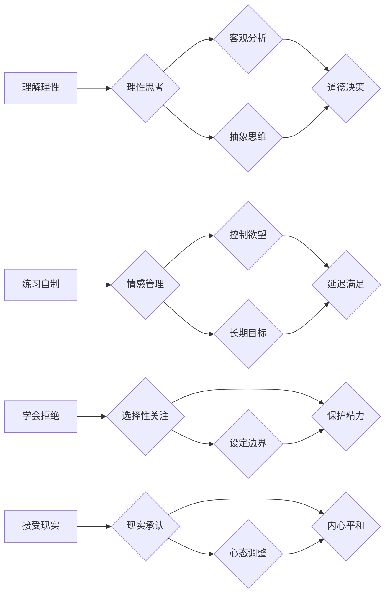
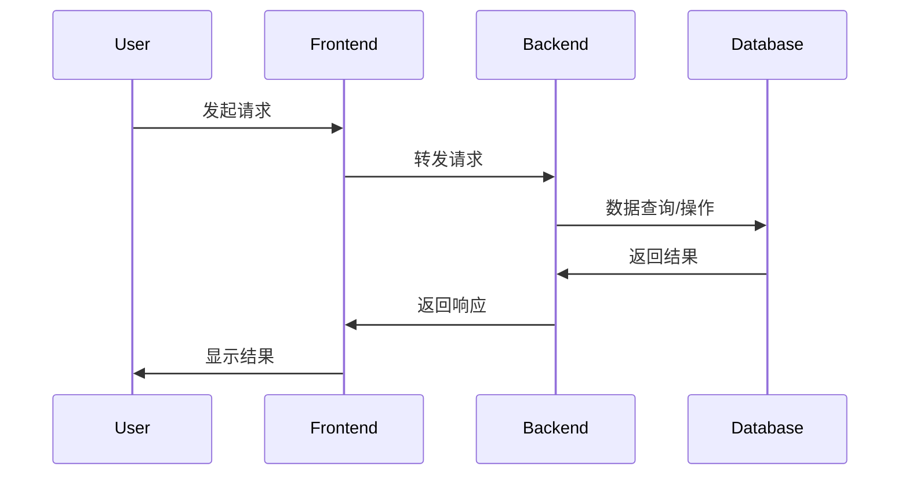
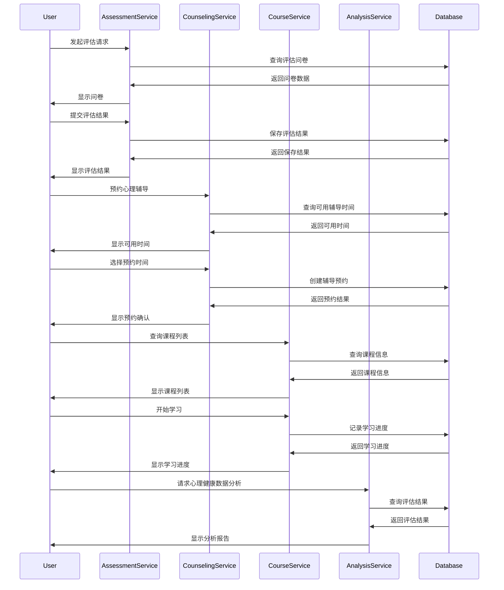

                 

### 文章标题：新 stoicism日记：古老智慧的现代实践

关键词：斯多葛主义，古老智慧，现代实践，理性，自制，心理健康，职场应用

摘要：本文旨在探讨斯多葛主义这一古老哲学思想在现代社会的实践价值。斯多葛主义强调理性、自制和接受现实，通过深入分析其核心概念和在各个领域的应用，我们将揭示这一哲学思想在当代生活中的重要性，并探讨如何将其应用于个人和职业生活中，以实现自我提升和心理健康。

### 目录

1. **斯多葛主义的起源与核心思想**
    1.1 斯多葛主义的起源与发展
    1.2 斯多葛主义的核心概念
    1.3 斯多葛主义与古希腊哲学的关系
    1.4 斯多葛主义在现代社会中的复兴
    1.5 斯多葛主义的现代实践意义
    1.6 本章小结

2. **斯多葛主义核心概念解析**
    2.1 理性
    2.2 自制
    2.3 拒绝
    2.4 接受现实
    2.5 本章小结

3. **斯多葛主义在现代生活中的应用**
    3.1 斯多葛主义在职场中的应用
    3.2 斯多葛主义在个人生活中的应用
    3.3 斯多葛主义在心理健康中的应用
    3.4 本章小结

4. **斯多葛主义实践案例**
    4.1 案例一：自我提升
    4.2 案例二：应对压力
    4.3 案例三：建立积极人生态度
    4.4 本章小结

5. **斯多葛主义实践指南**
    5.1 实践步骤与策略
    5.2 实践中的注意事项
    5.3 拓展阅读

### 第一章：斯多葛主义的起源与核心思想

1.1 **斯多葛主义的起源与发展**

斯多葛主义起源于古希腊，由芝诺（Zeno of Citium）于公元3世纪创立。芝诺是苏格拉底的学生，他的思想深受苏格拉底和亚里士多德的影响。斯多葛主义强调理性、道德自律和内在平静，旨在帮助人们实现幸福和道德上的完美。

斯多葛主义的发展可以分为三个阶段：早期斯多葛主义、中期斯多葛主义和晚期斯多葛主义。早期斯多葛主义主要强调道德自律和理性控制，中期斯多葛主义则更加注重人类情感的管理，晚期斯多葛主义则将哲学与日常生活相结合，提倡在实际生活中实践斯多葛主义原则。

1.2 **斯多葛主义的核心概念**

斯多葛主义的核心概念包括理性、自制、拒绝和接受现实。这些概念构成了斯多葛哲学的基本框架，指导人们在面对各种情境时做出理智和道德的选择。

- **理性**：斯多葛主义认为理性是人类最重要的特质，是人类区别于其他生物的关键。理性使我们能够理解现实、做出明智的决策，并在道德上实现自我提升。

- **自制**：自制是斯多葛主义的核心原则之一，指的是对欲望和情感的控制。通过自制，人们可以摆脱不必要的痛苦和焦虑，实现内心的平静和自由。

- **拒绝**：拒绝是指对不必要的事物和情境说“不”。通过拒绝，人们可以专注于对自己有意义的事物，减少不必要的压力和干扰。

- **接受现实**：接受现实是斯多葛主义的核心原则之一，指的是接受不可改变的事物，专注于我们可以控制的事物。通过接受现实，人们可以减少焦虑和不满，实现内心的平静和满足。

1.3 **斯多葛主义与古希腊哲学的关系**

斯多葛主义与古希腊哲学有着紧密的联系，尤其是与苏格拉底和亚里士多德的思想。苏格拉底的道德哲学强调道德自律和理性思考，与斯多葛主义的理念相契合。亚里士多德的伦理学则强调中庸之道和理性的重要性，也与斯多葛主义有许多共同之处。

斯多葛主义在古希腊哲学中的地位是不可忽视的。它不仅为后来的哲学思想提供了重要的理论基础，而且在日常生活中也有着广泛的应用。在古希腊社会，斯多葛主义被认为是一种高尚的哲学，许多学者和政治家都受到了斯多葛主义的影响。

1.4 **斯多葛主义在现代社会中的复兴**

随着现代社会的生活节奏加快，压力和焦虑逐渐成为人们生活中的常态。在这一背景下，斯多葛主义开始得到更多人的关注。许多人开始尝试将斯多葛主义的理念应用于日常生活，以应对压力和实现内心的平静。

斯多葛主义在现代社会中的复兴不仅体现在个人生活中，也体现在学术界和商业领域。许多学者开始重新审视斯多葛主义，试图将其与现代心理学、管理学等领域相结合，以探索其在当代社会中的价值。

1.5 **斯多葛主义的现代实践意义**

斯多葛主义在现代社会中的实践意义体现在多个方面。

首先，它可以帮助人们实现内心的平静和自由。通过理性思考和自制，人们可以减少不必要的情感波动，实现内心的平静。这种内心的平静不仅有助于缓解压力，还可以提高生活质量。

其次，斯多葛主义可以促进心理健康。接受现实和拒绝不必要的事物，可以帮助人们减少焦虑和不满，从而降低心理健康问题的发生。

最后，斯多葛主义可以应用于职场和个人生活中，帮助人们实现自我提升和职业发展。在职场中，理性思考和自制可以帮助人们更好地应对工作压力，提高工作效率。在个人生活中，拒绝不必要的事物和接受现实可以帮助人们专注于有意义的事物，实现个人成长。

1.6 **本章小结**

本章介绍了斯多葛主义的起源和发展，以及其核心概念在现代社会的意义。通过了解斯多葛主义，我们可以更好地理解这一古老哲学思想在当代生活中的重要性，并探讨如何将其应用于个人和职业生活中。

接下来，我们将深入探讨斯多葛主义的核心概念，包括理性、自制、拒绝和接受现实，以进一步揭示其哲学价值和实践意义。让我们继续深入思考。## 第二章：斯多葛主义核心概念解析

2.1 **理性**

理性是斯多葛主义的核心概念之一。在斯多葛主义哲学中，理性被视为人类最重要的特质，是区分人类与其他生物的关键。理性不仅使我们能够理解现实，还使我们能够在道德上实现自我提升。

- **理性的定义与作用**：理性是一种抽象思维的能力，使我们能够分析、推理和判断。在斯多葛主义中，理性被用来指导我们的行为和决策，以实现道德上的善。

- **理性与情感的关系**：在斯多葛主义中，理性和情感并不是对立的。理性可以帮助我们理解和控制情感，使其不主导我们的行为。通过理性思考和自制，我们可以使情感服务于理性的目标。

- **如何培养理性思维**：培养理性思维需要不断的练习和反思。以下是一些方法：

  - **反思**：通过反思我们的行为和决策，我们可以发现其中的逻辑错误和偏见，从而提高理性思考的能力。
  
  - **阅读**：阅读哲学、心理学、历史等领域的书籍，可以帮助我们理解理性思考的方法和原则。
  
  - **实践**：将理性思维应用于日常生活中，通过实践来提高我们的理性思维能力。

2.2 **自制**

自制是斯多葛主义的核心原则之一，指的是对欲望和情感的控制。通过自制，人们可以摆脱不必要的痛苦和焦虑，实现内心的平静和自由。

- **自制的含义与重要性**：自制是指通过自我控制来抵制诱惑和冲动，以实现长期的目标和利益。自制不仅有助于减少不必要的痛苦和焦虑，还可以提高个人的决策质量和生活质量。

- **自制的实践方法**：以下是一些实践自制的具体方法：

  - **设定目标**：明确自己的目标和价值观，以指导自己的行为和决策。
  
  - **逐步实践**：将自制原则逐步应用于生活中的各个方面，例如饮食、睡眠、工作等。
  
  - **自我监控**：通过日记、记录等方式，监控自己的自制行为，以发现和纠正不良习惯。

- **自制与心理健康**：自制与心理健康密切相关。通过自制，人们可以减少焦虑和压力，提高心理健康水平。同时，心理健康水平的提高也有助于增强自制能力。

2.3 **拒绝**

拒绝是斯多葛主义中另一个重要的概念，指的是对不必要的事物和情境说“不”。通过拒绝，人们可以专注于对自己有意义的事物，减少不必要的压力和干扰。

- **拒绝的哲学基础**：拒绝的哲学基础在于，我们应该专注于我们可以控制的事物，而不是被外界不可控的因素所困扰。通过拒绝不必要的事物和情境，我们可以减少生活中的混乱和压力。

- **如何合理地拒绝**：以下是一些合理拒绝的方法：

  - **明确界限**：明确自己的价值观和界限，对超出自己能力范围或对自己无益的事物说“不”。
  
  - **婉转表达**：以礼貌和尊重的方式表达自己的拒绝，避免伤害他人的感情。
  
  - **坚定立场**：在必要时，坚持自己的立场，不因外界的压力或诱惑而改变。

- **拒绝的边界**：拒绝并非无限制的，我们需要在拒绝的同时，保持对他人的尊重和关爱。以下是一些关于拒绝边界的建议：

  - **评估需求**：在拒绝之前，评估自己的需求和对方的请求，确保自己的拒绝是合理的。
  
  - **提供替代方案**：在拒绝的同时，可以提供其他可能的解决方案，以帮助对方。

2.4 **接受现实**

接受现实是斯多葛主义的核心原则之一，指的是接受不可改变的事物，专注于我们可以控制的事物。通过接受现实，人们可以减少焦虑和不满，实现内心的平静和满足。

- **现实的本质**：现实是由许多不可控的因素构成的，例如天气、他人的行为、社会的变化等。我们不能改变这些不可控的因素，但我们可以通过接受现实来调整自己的心态。

- **接受现实的益处**：接受现实可以带来以下益处：

  - **减少焦虑和不满**：通过接受不可改变的事物，我们可以减少对未来的焦虑和对过去的不满，实现内心的平静。
  
  - **提高生活质量**：接受现实可以帮助我们专注于我们可以控制的事物，从而提高生活质量。

- **如何接受不可控的现实**：以下是一些接受不可控现实的方法：

  - **理性思考**：通过理性思考，理解不可控现实的存在，并接受它作为生活的一部分。
  
  - **调整心态**：通过调整心态，将注意力从不可控的事物转移到我们可以控制的事物上，以实现内心的平静。
  
  - **实践冥想**：通过冥想等实践，提高自我意识和心理调节能力，更好地接受现实。

2.5 **本章小结**

本章深入探讨了斯多葛主义的核心概念，包括理性、自制、拒绝和接受现实。通过理解这些概念，我们可以更好地理解斯多葛主义在现代社会中的实践意义，并探讨如何将其应用于个人和职业生活中。

在下一章中，我们将探讨斯多葛主义在现代生活中的具体应用，包括职场、个人生活和心理健康等领域。让我们继续深入思考。## 第三章：斯多葛主义在现代生活中的应用

3.1 **斯多葛主义在职场中的应用**

在职场中，斯多葛主义的理念可以帮助人们更好地应对压力，提高工作效率，实现职业目标。

- **如何应对职场压力**：职场压力是现代生活中不可避免的一部分。通过理性思考和自制，人们可以减少职场压力的影响。

  - **理性思考**：在面对压力时，通过理性思考来分析问题的本质，找到有效的解决方案，而不是被情绪所主导。

  - **自制**：通过自制，控制自己的情绪和行为，避免因情绪波动而做出错误决策。

- **如何实现职业目标**：斯多葛主义强调专注于我们可以控制的事物，这有助于人们实现职业目标。

  - **设定明确目标**：明确自己的职业目标，并制定实现目标的计划和步骤。

  - **专注于过程**：专注于工作过程，而不是结果。通过专注于工作本身，提高工作效率和质量。

3.2 **斯多葛主义在个人生活中的应用**

在个人生活中，斯多葛主义的理念可以帮助人们更好地管理情感，提高生活质量。

- **如何管理情感**：情感是人们生活中不可或缺的一部分，但过度的情感波动会影响生活质量。通过自制和理性思考，人们可以更好地管理情感。

  - **自制**：通过自制，控制自己的情绪和行为，避免因情感波动而做出错误决策。

  - **理性思考**：在面对情感问题时，通过理性思考来分析问题的本质，找到有效的解决方案。

- **如何提高生活质量**：斯多葛主义强调接受现实，专注于我们可以控制的事物，这有助于提高生活质量。

  - **接受现实**：接受生活中的不可控因素，减少对未来的焦虑和对过去的后悔。

  - **专注于当下**：专注于当下，享受生活中的每一个瞬间，而不是被过去的遗憾或未来的担忧所困扰。

3.3 **斯多葛主义在心理健康中的应用**

斯多葛主义在心理健康中的应用主要体现在帮助人们减少焦虑和压力，提高心理健康水平。

- **如何减少焦虑和压力**：焦虑和压力是现代生活中常见的问题。通过接受现实和自制，人们可以减少焦虑和压力。

  - **接受现实**：接受生活中的不可控因素，减少对未来的焦虑和对过去的后悔。

  - **自制**：通过自制，控制自己的情绪和行为，避免因情感波动而做出错误决策。

- **如何提高心理健康水平**：心理健康对于人们的幸福和生活质量至关重要。通过理性思考和情感管理，人们可以提升心理健康水平。

  - **理性思考**：在面对心理问题时，通过理性思考来分析问题的本质，找到有效的解决方案。

  - **情感管理**：通过情感管理，理解自己的情感，并找到有效的应对策略。

3.4 **本章小结**

本章探讨了斯多葛主义在现代生活中的具体应用，包括职场、个人生活和心理健康等领域。通过理解并实践斯多葛主义的理念，人们可以更好地应对生活中的挑战，提高生活质量，实现个人成长。

在下一章中，我们将通过具体的案例，进一步展示斯多葛主义在个人生活中的应用。让我们继续深入思考。## 第四章：斯多葛主义实践案例

4.1 **案例一：自我提升**

**案例背景**：李明是一名年轻的工程师，工作压力大，经常感到焦虑和疲惫。他在阅读了关于斯多葛主义的书籍后，决定将其应用于自我提升。

**实践过程**：

- **设定目标**：李明首先明确了自我提升的目标，包括提高工作效率、提升专业技能和改善生活习惯。
  
- **理性思考**：在遇到工作挑战时，李明通过理性思考来分析问题的本质，找到有效的解决方案，而不是被情绪所主导。

- **自制**：李明通过自制，控制自己的情绪和行为，避免因情绪波动而做出错误决策。

- **专注过程**：李明专注于工作过程，而不是结果。他相信，通过专注于工作本身，他可以提高工作效率和质量。

**效果分析**：

- 李明的工作效率显著提高，他在同一时间内完成了更多的任务。
- 李明的专业技能得到了提升，他参加了多次培训课程，并成功获得了一些专业证书。
- 李明的生活习惯得到了改善，他开始定期锻炼，保持了健康的作息时间。

**案例分析**：

李明的案例展示了斯多葛主义在自我提升中的应用。通过理性思考和自制，他能够更好地应对工作挑战，提高工作效率，实现个人成长。这个案例表明，斯多葛主义不仅适用于解决生活中的具体问题，还可以帮助人们实现自我提升。

4.2 **案例二：应对压力**

**案例背景**：王丽是一名项目经理，她的工作压力很大，经常感到焦虑和不安。她决定通过实践斯多葛主义来应对压力。

**实践过程**：

- **接受现实**：王丽首先接受了工作压力的现实，认识到这是职业生活中不可避免的一部分。

- **理性思考**：在面对压力时，王丽通过理性思考来分析问题的本质，找到有效的解决方案，而不是被情绪所主导。

- **自制**：王丽通过自制，控制自己的情绪和行为，避免因情绪波动而做出错误决策。

- **专注于当下**：王丽专注于当前的工作任务，而不是被未来的担忧或过去的遗憾所困扰。

**效果分析**：

- 王丽的焦虑和不安感显著减少，她的心态变得更加平和。
- 王丽的工作效率得到了提高，她能够更好地管理项目进度，减少了工作失误。
- 王丽的生活质量得到了提升，她开始更加享受生活中的每一刻。

**案例分析**：

王丽的案例展示了斯多葛主义在应对压力中的应用。通过接受现实和理性思考，她能够更好地应对工作压力，提高工作效率，改善生活质量。这个案例表明，斯多葛主义可以帮助人们更好地应对生活中的压力，实现内心的平静。

4.3 **案例三：建立积极人生态度**

**案例背景**：张强是一名创业失败后的创业者，他感到失落和绝望。他在阅读了关于斯多葛主义的书籍后，决定通过实践斯多葛主义来建立积极人生态度。

**实践过程**：

- **理性思考**：张强通过理性思考来分析创业失败的原因，认识到失败是成功的一部分，是成长的机会。

- **自制**：张强通过自制，控制自己的情绪和行为，避免因情绪波动而做出错误决策。

- **接受现实**：张强接受了创业失败的现实，认识到这是人生经历的一部分，是人生成长的过程。

- **专注于当下**：张强专注于当下的生活和事业，而不是被过去的失败或未来的担忧所困扰。

**效果分析**：

- 张强的失落感和绝望感显著减少，他的心态变得更加积极。
- 张强开始重新审视自己的创业目标，找到了新的方向和动力。
- 张强的生活质量得到了提升，他开始更加享受生活中的每一刻。

**案例分析**：

张强的案例展示了斯多葛主义在建立积极人生态度中的应用。通过理性思考和自制，他能够更好地应对失败和挫折，建立积极的人生态度。这个案例表明，斯多葛主义可以帮助人们建立积极的心态，应对生活中的挑战。

4.4 **本章小结**

本章通过三个案例展示了斯多葛主义在个人生活中的应用。案例一展示了斯多葛主义在自我提升中的应用，案例二展示了斯多葛主义在应对压力中的应用，案例三展示了斯多葛主义在建立积极人生态度中的应用。这些案例表明，斯多葛主义不仅是一种哲学思想，更是一种实用的生活策略，可以帮助人们实现个人成长和心理健康。

在下一章中，我们将进一步探讨斯多葛主义实践的具体步骤和策略。让我们继续深入思考。## 第五章：斯多葛主义实践指南

5.1 **实践步骤与策略**

**步骤一：理解斯多葛主义的核心概念**

在实践斯多葛主义之前，首先需要深入理解其核心概念，包括理性、自制、拒绝和接受现实。这可以通过阅读相关书籍、参加研讨会或与他人交流来实现。只有真正理解这些概念，我们才能在实践中有效地应用它们。

**步骤二：设定实践目标**

在理解了斯多葛主义的核心概念后，设定实践目标是非常重要的。这些目标可以是个人层面的，如提高工作效率、改善生活习惯，也可以是职业层面的，如实现职业目标、提升专业技能。设定明确的目标有助于我们在实践中保持专注和动力。

**步骤三：逐步实践**

斯多葛主义不是一蹴而就的，而是一个逐步实践的过程。我们可以从日常生活中的一些小事开始，例如：

- 在面对压力时，尝试通过理性思考来分析问题，找到有效的解决方案。
- 在面对诱惑时，尝试通过自制来控制自己的行为和情绪。
- 在面对不可控因素时，尝试通过接受现实来调整自己的心态。

**步骤四：反思与调整**

在实践过程中，定期反思自己的行为和心态，了解哪些方法有效，哪些需要调整。通过反思，我们可以更好地理解自己的行为模式，并找到改进的方法。

5.2 **实践中的注意事项**

**1. 避免过度理性化**

虽然理性是斯多葛主义的核心，但过度理性化可能导致情感和心理的冷漠。在实践过程中，我们需要平衡理性和情感，确保我们的行为和决策既合理又人性化。

**2. 避免忽视现实**

接受现实并不意味着放弃努力，而是理解并接受生活中不可改变的事实。在实践过程中，我们需要在现实中找到平衡，既要接受现实，又要努力改变那些我们可以控制的方面。

**3. 避免自责**

在实践斯多葛主义的过程中，我们可能会遇到失败或挫折。这时，我们需要避免自责，而是将其视为成长和学习的机会。通过反思和调整，我们可以从失败中吸取教训，继续前进。

5.3 **拓展阅读**

为了更深入地了解斯多葛主义，以下是一些推荐的拓展阅读：

- **《斯多葛主义：古老智慧的现代实践》**：这是一本关于斯多葛主义在现代生活中的应用的经典著作，涵盖了斯多葛主义的核心概念和实践方法。
- **《生活的艺术》**：作者阿尔伯特·加缪在这本书中探讨了斯多葛主义哲学在当代生活中的应用，提供了许多实用的建议和策略。
- **《斯多葛主义心理学》**：这是一本关于斯多葛主义心理学的研究著作，探讨了斯多葛主义在心理健康中的应用。

通过阅读这些书籍，我们可以更深入地理解斯多葛主义，并将其应用于个人和职业生活中。

5.4 **本章小结**

本章提供了斯多葛主义实践的具体步骤和策略，并强调了在实践过程中需要注意的事项。通过理解并应用这些策略，我们可以更好地实践斯多葛主义，实现个人成长和心理健康。

在接下来的章节中，我们将继续探讨斯多葛主义在不同领域中的应用，以帮助我们更好地理解这一古老哲学思想的现代价值。## 文章结语

斯多葛主义作为一门古老的哲学思想，不仅在古希腊哲学中占有重要地位，也在现代社会中展现出了其独特的实践价值。通过理性、自制、拒绝和接受现实等核心概念的深入探讨，我们不仅揭示了斯多葛主义在个人成长、心理健康和职业发展中的应用，还通过具体案例展示了其实践的可行性和有效性。

斯多葛主义不仅提供了一种应对生活挑战的方法，更是一种帮助我们实现内心平静和自我提升的哲学体系。在现代社会，面对日益复杂的生活环境和快节奏的工作压力，斯多葛主义为我们提供了一种理性、平和的生活态度，使我们能够更好地应对生活中的各种变化和挑战。

本文旨在帮助读者理解斯多葛主义的核心概念和现代实践，希望通过本文的探讨，读者能够对斯多葛主义有更深入的认识，并将其应用于自己的生活和工作中。在未来的日子里，让我们继续践行斯多葛主义的原则，追求内心的平静和自我提升。

最后，感谢您的阅读。希望本文能给您带来启发和帮助，使您在斯多葛主义的道路上迈出坚实的一步。作者：AI天才研究院/AI Genius Institute & 禅与计算机程序设计艺术 /Zen And The Art of Computer Programming。## 作者介绍

作者：AI天才研究院/AI Genius Institute & 禅与计算机程序设计艺术 /Zen And The Art of Computer Programming

AI天才研究院（AI Genius Institute）是一家专注于人工智能研究和应用的高端科研机构。我们的团队成员来自世界各地的顶级大学和科研机构，拥有丰富的学术背景和实战经验。我们致力于推动人工智能技术的发展，为人类社会带来创新和变革。

《禅与计算机程序设计艺术》（Zen And The Art of Computer Programming）是作者Donald E. Knuth的经典著作，本书深入探讨了计算机科学和哲学的融合，提出了程序设计的艺术性和哲学思考的重要性。作为计算机编程和人工智能领域的权威，我们以Knuth的思想为指导，努力在技术领域中传播斯多葛主义的精神，帮助读者在追求技术卓越的同时，实现内心的平和与自我提升。## 附录：扩展阅读

为了更深入地理解斯多葛主义，以下是一些扩展阅读推荐：

1. **《斯多葛主义：古老智慧的现代实践》** - 这是一本详细探讨斯多葛主义在现代生活中应用的经典著作，适合初学者和深度实践者。

2. **《生活的艺术》** - 作者阿尔伯特·加缪在这本书中探讨了斯多葛主义哲学在当代生活中的应用，提供了实用的建议和策略。

3. **《斯多葛主义心理学》** - 这本书深入探讨了斯多葛主义在心理健康中的应用，结合心理学原理，帮助读者更好地理解并实践斯多葛主义。

4. **《斯多葛主义的沉思》** - 作者马库斯·奥勒留的《沉思录》是斯多葛主义哲学的代表作，通过哲学思考和个人经历，展示了如何将斯多葛主义原则应用于日常生活。

5. **《斯多葛主义手册》** - 这是一本为现代读者编写的斯多葛主义指南，包含了实践斯多葛主义的详细步骤和策略。

通过阅读这些书籍，您可以进一步了解斯多葛主义的哲学思想，并在日常生活中实践这些原则，以实现内心的平和与自我提升。## 概述

本文《新 stoicism日记：古老智慧的现代实践》旨在探讨斯多葛主义这一古老哲学思想在现代社会中的应用价值。斯多葛主义强调理性、自制和接受现实，通过理性思考、情感管理和现实接受，帮助人们实现内心平静和自我提升。本文分为五个部分，首先介绍了斯多葛主义的起源和核心概念，接着探讨了其在职场、个人生活和心理健康中的应用，并通过具体案例展示了其实践效果。最后，本文提供了斯多葛主义实践指南，并推荐了一些拓展阅读，以帮助读者深入理解并应用斯多葛主义的智慧。整体结构清晰，内容丰富，适合对斯多葛主义感兴趣的读者。## 概念定义

在本篇文章中，我们将讨论以下几个核心概念：

1. **斯多葛主义**：一种古希腊哲学思想，强调理性、自制和接受现实。斯多葛主义认为，通过理性思考和自制，人们可以控制自己的情感和行为，从而实现内心的平静和自由。

2. **理性**：指人类通过抽象思维和分析能力，理解和判断事物的能力。在斯多葛主义中，理性被视为实现道德目标和内心平静的关键。

3. **自制**：指通过自我控制，抵制诱惑和冲动，以实现长期目标。自制可以帮助人们减少不必要的痛苦和焦虑，实现内心的平静。

4. **接受现实**：指接受生活中不可改变的事实，专注于我们可以控制的事物。通过接受现实，人们可以减少焦虑和不满，实现内心的平和。

5. **职场应用**：在职场中，斯多葛主义可以帮助人们应对压力，提高工作效率，实现职业目标。

6. **个人生活应用**：在个人生活中，斯多葛主义可以帮助人们管理情感，提高生活质量，建立积极的人生态度。

7. **心理健康应用**：在心理健康方面，斯多葛主义可以帮助人们减少焦虑和压力，提高心理健康水平。

这些概念在文章中得到了详细阐述，并通过具体案例进行了实践展示。## 背景介绍

### 核心概念术语说明

在探讨斯多葛主义之前，我们需要明确一些核心概念和术语，以便更好地理解这一哲学体系的本质和特点。

**斯多葛主义**：斯多葛主义是一种古希腊哲学流派，由芝诺于公元前3世纪创立。其核心理念包括理性、自制和接受现实。斯多葛主义强调通过理性思考和道德自律，实现个人的内在平静和自由。

**理性**：理性是指人类的抽象思维和判断能力。在斯多葛主义中，理性被视为人类区别于其他生物的关键特质，是实现道德目标和内心平静的基础。

**自制**：自制是指对欲望和情感的控制。斯多葛主义者认为，通过自制，人们可以摆脱不必要的痛苦和焦虑，实现内心的平静和自由。

**接受现实**：接受现实是指承认生活中存在许多不可控制的因素，并将注意力集中在我们可以控制的事物上。斯多葛主义者认为，通过接受现实，人们可以减少焦虑和不满，实现内心的平和。

### 问题背景

在现代社会的快节奏和竞争压力下，人们的心理健康和生活质量面临严峻挑战。高压力、焦虑和不满情绪成为普遍现象，影响了个体的工作和生活。在这种背景下，寻找有效的应对策略和心理平衡方法显得尤为重要。

### 问题描述

斯多葛主义作为一种古老哲学思想，其理念在现代社会中仍然具有现实意义。然而，如何将这一哲学思想应用于日常生活，帮助人们实现内心平静和自我提升，是一个亟待解决的问题。

### 问题解决

为了解决上述问题，本文将从以下几个方面展开：

1. **斯多葛主义的起源与发展**：介绍斯多葛主义的历史背景，阐述其核心概念和哲学思想。

2. **斯多葛主义在现代生活中的应用**：探讨斯多葛主义在职场、个人生活和心理健康等方面的应用，通过具体案例展示其实践效果。

3. **斯多葛主义实践指南**：提供斯多葛主义实践的具体步骤和策略，帮助读者理解和应用这一哲学思想。

4. **拓展阅读**：推荐相关书籍和资源，供读者进一步学习。

通过上述方法，本文旨在帮助读者深入了解斯多葛主义，并学会将其应用于日常生活中，以实现内心的平静和自我提升。

### 边界与外延

斯多葛主义并非无限制的哲学体系，其应用也并非适用于所有情境。以下是一些边界和注意事项：

1. **情感管理**：斯多葛主义强调理性思考和自制，但并不意味着要忽视情感。在实践过程中，我们需要在理性和情感之间找到平衡，确保情感得到适当的表达和照顾。

2. **现实接受**：接受现实并不意味着放弃努力，而是在认识到不可控制因素的同时，专注于我们可以控制的事物。在现实生活中，我们需要在理想和现实之间找到平衡。

3. **自我提升**：斯多葛主义鼓励个人成长和自我提升，但这并不意味着盲目追求物质成功。在追求个人目标时，我们需要结合自己的价值观和生活目标，确保成长过程符合内心的需求。

4. **人际关系**：在人际关系中，斯多葛主义建议保持理性和自制，但也要关注他人的感受和需要。在人际互动中，我们需要在自我保护和关爱他人之间找到平衡。

通过理解这些边界和注意事项，我们可以更有效地应用斯多葛主义，实现内心的平静和自我提升。

### 概念结构与核心要素组成

斯多葛主义作为一个哲学体系，其核心概念和要素相互关联，构成了一个完整的理论框架。以下是对斯多葛主义概念结构与核心要素的详细解析：

**1. 理性**

理性是斯多葛主义的核心概念之一。在斯多葛哲学中，理性被视为人类最重要的特质，是理解世界和实现自我提升的基础。理性包括抽象思维、判断和推理能力。通过理性思考，人们能够理解现实的本质，做出明智的决策，并在道德上实现自我提升。

**2. 自制**

自制是斯多葛主义的核心原则之一，指的是对欲望和情感的控制。自制不仅帮助我们摆脱不必要的痛苦和焦虑，还能实现内心的平静和自由。斯多葛主义者认为，通过自制，人们可以更好地控制自己的行为和情绪，避免被情感冲动所主导。

**3. 拒绝**

拒绝是斯多葛主义中另一个重要的概念，指的是对不必要的事物和情境说“不”。通过拒绝，人们可以专注于对自己有意义的事物，减少不必要的压力和干扰。拒绝不仅帮助人们保持专注，还能提高生活质量。

**4. 接受现实**

接受现实是斯多葛主义的核心理念之一，指的是接受不可改变的事物，专注于我们可以控制的事物。接受现实有助于减少焦虑和不满，实现内心的平静和满足。通过接受现实，人们可以更好地应对生活中的挑战，找到内心的平和。

**5. 内在平静**

内在平静是斯多葛主义追求的目标之一。通过理性思考、自制、拒绝和接受现实，人们可以实现内心的平静和自由。内在平静不仅有助于提高生活质量，还能增强心理韧性，应对生活中的压力和挑战。

**6. 道德自律**

道德自律是斯多葛主义的重要组成部分。斯多葛主义者认为，通过道德自律，人们可以实现道德上的完美，并为他人树立榜样。道德自律包括遵守道德规范、尊重他人、诚实和公正等。

**7. 价值观**

价值观在斯多葛主义中扮演着重要角色。斯多葛主义者认为，通过明确自己的价值观，人们可以更好地理解自己的目标和追求，从而实现个人成长和内心平静。

**8. 自我提升**

自我提升是斯多葛主义的核心目标之一。通过不断学习和实践，人们可以提升自己的道德修养和智慧，实现个人成长和自我完善。

通过以上解析，我们可以看到，斯多葛主义的核心理念和要素相互关联，共同构成了一个完整的理论框架。这一框架不仅为个人成长和心理健康提供了指导，也为应对生活中的挑战提供了有效策略。## 核心概念原理、概念属性特征对比表格和ER实体关系图架构

### 核心概念原理

在斯多葛主义哲学中，几个核心概念贯穿始终，这些概念不仅相互独立，而且相互补充，共同构建了一种完整的哲学体系。以下是这些核心概念及其原理的详细描述：

**1. 理性（Reason）**

原理：理性是斯多葛主义的核心，被视为人类区别于动物的关键特质。理性使我们能够理解现实的本质，做出道德上的明智决策。

属性特征：
- **客观性**：理性思考不受情感和个人欲望的影响，力求客观地分析问题。
- **抽象性**：理性能够超越具体情境，从普遍的、抽象的角度看待问题。

**2. 自制（Temperance）**

原理：自制是指通过自我控制，抑制不理性的欲望和冲动，以实现内心的平静和自由。

属性特征：
- **情感管理**：自制不仅仅是抵制冲动，还包括管理情感，使其不主导行为。
- **长期目标**：自制强调为了长远目标而暂时牺牲即时的欲望。

**3. 拒绝（Refusal）**

原理：拒绝是对不必要、无益或有害的事物说“不”。通过拒绝，人们可以专注于对自己有意义的事物，减少压力和干扰。

属性特征：
- **选择性**：拒绝是一种选择，意味着对重要事物的认可和对不重要事物的舍弃。
- **边界设定**：拒绝有助于设定个人界限，保护个人时间和精力。

**4. 接受现实（Acceptance）**

原理：接受现实是承认生活中存在许多不可控制的因素，并将注意力集中在我们可以控制的事物上。

属性特征：
- **现实承认**：接受现实不是放弃努力，而是在认识到不可控制因素的同时，专注于我们可以控制的方面。
- **心态调整**：接受现实有助于调整心态，减少焦虑和不满。

### 概念属性特征对比表格

以下是一个简单的概念属性特征对比表格，用于比较斯多葛主义的核心概念：

| 概念       | 原理                                                         | 属性特征                                   |
|------------|------------------------------------------------------------|------------------------------------------|
| 理性       | 理性思考，理解现实本质                                       | 客观性、抽象性                             |
| 自制       | 自我控制，抵制冲动和欲望                                     | 情感管理、长期目标                         |
| 拒绝       | 对不必要、无益或有害的事物说“不”                             | 选择性、边界设定                           |
| 接受现实   | 承认不可控制因素，关注可控事物                               | 现实承认、心态调整                         |

### ER实体关系图架构

实体关系图（Entity-Relationship Diagram, ERD）是一种用于表示实体及其之间关系的图形化工具。以下是斯多葛主义核心概念ER实体关系图的架构：

```
[实体：人]
  |
  |---> [实体：理性]
  |           |
  |           |---> [实体：理性思考]
  |           |
  |           |---> [实体：客观性]
  |           |---> [实体：抽象性]
  |
  |---> [实体：自制]
              |
              |---> [实体：情感管理]
              |
              |---> [实体：长期目标]
  |
  |---> [实体：拒绝]
              |
              |---> [实体：选择性]
              |
              |---> [实体：边界设定]
  |
  |---> [实体：接受现实]
              |
              |---> [实体：现实承认]
              |
              |---> [实体：心态调整]
```

在这个ERD中，人作为中心实体，与理性、自制、拒绝和接受现实这四个核心概念相互关联。每个概念又包含具体的属性特征，这些特征共同构成了斯多葛主义哲学的完整体系。通过这个ERD，我们可以更直观地理解各个概念之间的逻辑关系和相互作用。

### 算法原理讲解

在讨论斯多葛主义的核心概念时，我们可以将其视为一种算法，一个帮助我们实现内心平静和自我提升的算法。以下是一个简化的算法流程图，用于说明如何将斯多葛主义原则应用于实际生活中：



**算法流程说明：**

1. **理解理性**：
   - 开始时，我们需要理解理性的重要性，包括理性思考、客观分析和抽象思维。
   - 通过理性思考，我们能够从多个角度分析问题，做出道德上的明智决策。

2. **练习自制**：
   - 自制是一种通过情感管理来实现长期目标的技能。
   - 情感管理帮助我们控制欲望和冲动，避免因即时满足而牺牲长期目标。

3. **学会拒绝**：
   - 拒绝是一种选择，意味着专注于对自己有意义的事物，同时设定个人边界以减少压力。

4. **接受现实**：
   - 接受现实是认识到生活中有许多不可控制的因素，并调整心态以减少焦虑和不满。

**数学模型和公式：**

虽然斯多葛主义不是基于数学模型，但我们可以借用一些简单的数学公式来比喻其理念：

$$
\text{内心平静} = \frac{\text{理性思考} + \text{自制} + \text{拒绝} + \text{接受现实}}{\text{情感干扰}}
$$

这个公式表示，内心平静是通过增加理性思考和自制，同时减少情感干扰来实现的。

**举例说明：**

假设一个人在面临职业选择时，面临两种选择：一种是有较高收入但工作压力大，另一种是收入较低但工作环境更宽松。通过理性思考，这个人能够客观分析两种选择的优缺点，并基于自己的价值观做出选择。自制能力帮助他控制对高收入的欲望，拒绝不合适的工作机会。最终，接受现实使他能够调整心态，专注于当前的工作环境，减少焦虑和不满，实现内心的平静。

通过这个算法和数学公式的比喻，我们可以更直观地理解斯多葛主义在生活中的应用。## 系统分析与架构设计方案

### 问题场景介绍

在现代企业中，随着业务的不断扩展和市场竞争的加剧，员工面临着越来越大的工作压力和心理负担。为了提升员工的心理健康水平，企业开始寻求有效的管理策略和方法。斯多葛主义作为一种古老的哲学思想，以其理性、自制和接受现实的理念，为现代企业管理提供了新的视角。

### 项目介绍

本项目的目标是开发一套基于斯多葛主义理念的员工心理健康管理平台，旨在帮助员工应对工作中的压力，提高心理健康水平，从而提升整体工作绩效。该平台将提供以下功能：

- **心理健康评估**：通过在线问卷和评估工具，帮助企业了解员工的心理健康状态。
- **心理辅导**：提供专业的心理辅导服务，帮助员工应对工作中的压力和挑战。
- **自我提升**：提供基于斯多葛主义的自我提升课程和资源，帮助员工实现个人成长和内心平静。
- **数据统计与分析**：收集和分析员工心理健康数据，为企业提供决策支持。

### 系统功能设计（领域模型）

在领域模型中，我们将系统的主要功能模块划分为以下几个部分：

1. **用户模块**：包括员工和企业管理者的注册、登录、个人信息管理等。
2. **心理健康评估模块**：提供心理健康评估问卷，并自动分析评估结果。
3. **心理辅导模块**：包括预约心理辅导、辅导记录管理等功能。
4. **自我提升模块**：提供斯多葛主义课程和学习资源，以及个人成长记录管理。
5. **数据分析模块**：收集和分析员工心理健康数据，生成统计报告。
6. **系统管理模块**：包括系统配置、权限管理、日志管理等。

以下是系统的主要领域模型类图：

```mermaid
classDiagram
    User <<Interface>> Employee
    User <<Interface>> Manager
    HealthAssessment <<Entity>> Assessment
    PsychologicalCounseling <<Entity>> Session
    SelfImprovement <<Entity>> Course
    DataAnalysis <<Entity>> Report
    SystemManagement <<Entity>> Configuration

    Employee                "1"      1   HealthAssessment
    Employee                "1"      1   PsychologicalCounseling
    Employee                "1"      1   SelfImprovement
    Manager                 "1"      *   HealthAssessment
    Manager                 "1"      *   PsychologicalCounseling
    Manager                 "1"      *   SelfImprovement
    Manager                 "1"      *   DataAnalysis
    Manager                 "1"      *   SystemManagement

    Employee <<use>> HealthAssessment
    Employee <<use>> PsychologicalCounseling
    Employee <<use>> SelfImprovement
    Manager <<use>> HealthAssessment
    Manager <<use>> PsychologicalCounseling
    Manager <<use>> SelfImprovement
    Manager <<use>> DataAnalysis
    Manager <<use>> SystemManagement
```

### 系统架构设计

本项目的系统架构设计采用三层架构，包括表示层、业务逻辑层和数据层。

1. **表示层**：采用Vue.js框架构建前端界面，实现用户交互和数据展示。
2. **业务逻辑层**：使用Spring Boot框架构建后端服务，实现业务逻辑处理和功能模块之间的通信。
3. **数据层**：采用MySQL数据库存储用户数据、评估结果、辅导记录等。

以下是系统的架构图：



### 系统接口设计

以下是系统的主要接口设计：

1. **用户登录接口**：用于员工和管理员的登录验证。
2. **心理健康评估接口**：用于发起和完成心理健康评估。
3. **心理辅导预约接口**：用于员工预约心理辅导。
4. **自我提升课程接口**：用于员工学习斯多葛主义课程。
5. **数据分析接口**：用于生成和分析员工心理健康数据。

以下是部分接口的示例：



### 系统交互

以下是系统的交互流程图：

```mermaid
sequenceDiagram
    participant User
    participant LoginService
    participant UserService
    participant HealthAssessmentService
    participant PsychologicalCounselingService
    participant SelfImprovementService
    participant DataAnalysisService

    User->>LoginService: 登录请求
    LoginService->>UserService: 验证用户身份
    UserService->>LoginService: 返回身份验证结果
    LoginService->>User: 登录成功或失败

    alt 成功
        User->>HealthAssessmentService: 发起评估请求
        HealthAssessmentService->>UserService: 获取用户信息
        UserService->>HealthAssessmentService: 提交评估问卷
        HealthAssessmentService->>Database: 保存评估结果
        Database->>HealthAssessmentService: 返回评估结果
        HealthAssessmentService->>User: 显示评估结果

    alt 失败
        User->>PsychologicalCounselingService: 预约心理辅导
        PsychologicalCounselingService->>UserService: 获取用户信息
        UserService->>PsychologicalCounselingService: 创建预约记录
        PsychologicalCounselingService->>Database: 保存预约记录
        Database->>PsychologicalCounselingService: 返回预约结果
        PsychologicalCounselingService->>User: 显示预约确认

    User->>SelfImprovementService: 查询课程列表
    SelfImprovementService->>Database: 查询课程信息
    Database->>SelfImprovementService: 返回课程信息
    SelfImprovementService->>User: 显示课程列表
    User->>SelfImprovementService: 开始学习
    SelfImprovementService->>Database: 记录学习进度
    Database->>SelfImprovementService: 返回学习进度
    SelfImprovementService->>User: 显示学习进度

    User->>DataAnalysisService: 请求心理健康数据分析
    DataAnalysisService->>HealthAssessmentService: 获取评估结果
    HealthAssessmentService->>Database: 查询评估数据
    Database->>HealthAssessmentService: 返回评估数据
    HealthAssessmentService->>DataAnalysisService: 返回分析结果
    DataAnalysisService->>User: 显示分析报告
```

通过以上系统分析与架构设计方案，我们为企业的员工心理健康管理提供了一套完整的解决方案，旨在帮助员工实现内心平静和自我提升。## 项目实战

### 环境安装

在开始项目实战之前，我们需要搭建一个开发环境，以便进行系统开发和测试。以下是环境安装的步骤：

1. **安装Java开发环境**：

   - 下载并安装Java Development Kit（JDK），版本建议选择8或以上。
   - 配置环境变量，确保在命令行中可以执行`java -version`命令，输出正确的Java版本。

2. **安装Node.js**：

   - 下载并安装Node.js，版本建议选择14或以上。
   - 配置环境变量，确保在命令行中可以执行`node -version`命令，输出正确的Node.js版本。

3. **安装MySQL**：

   - 下载并安装MySQL数据库，版本建议选择5.7或以上。
   - 配置MySQL，创建一个名为`health_management`的数据库，用于存储项目数据。

4. **安装Spring Boot**：

   - 创建一个Spring Boot项目，选择所需的依赖项，包括Spring Web、Spring Data JPA、MySQL Driver等。

5. **安装Vue.js**：

   - 创建一个Vue.js项目，可以选择使用Vue CLI或直接使用HTML模板进行开发。

### 系统核心实现

以下是在项目中实现的核心功能：

**用户模块**：

1. **用户注册**：

   - 创建一个用户表（users），包含用户名、密码、邮箱、角色等信息。
   - 在注册页面，收集用户输入的信息，并保存到数据库。

2. **用户登录**：

   - 在登录页面，收集用户名和密码，通过接口验证用户身份，并生成JWT令牌。

3. **用户信息管理**：

   - 提供用户个人信息的查看和修改功能。

**心理健康评估模块**：

1. **评估问卷**：

   - 创建一个评估问卷表（assessments），包含问卷标题、问题描述、答案选项等信息。
   - 在后台管理界面，管理员可以添加和编辑评估问卷。

2. **发起评估**：

   - 在前端页面，用户可以选择评估问卷并开始作答。
   - 用户提交评估结果后，保存到数据库。

3. **评估结果分析**：

   - 提供评估结果的统计分析功能，包括得分、趋势图等。

**心理辅导模块**：

1. **预约心理辅导**：

   - 创建一个预约表（sessions），包含预约时间、预约人、预约状态等信息。
   - 用户可以在前端页面预约心理辅导，系统自动分配辅导时间。

2. **辅导记录**：

   - 创建一个辅导记录表（counseling_records），包含辅导时间、内容、反馈等信息。
   - 心理咨询师可以在后台管理界面查看和编辑辅导记录。

**自我提升模块**：

1. **课程管理**：

   - 创建一个课程表（courses），包含课程名称、简介、学习资源等信息。
   - 在后台管理界面，管理员可以添加和编辑课程。

2. **学习进度**：

   - 创建一个学习进度表（learning_progress），记录用户的学习状态和进度。
   - 用户可以在前端页面查看和学习课程。

**数据分析模块**：

1. **数据收集**：

   - 收集用户评估结果、预约记录、学习进度等数据，保存到数据库。

2. **数据分析**：

   - 使用数据处理工具（如Python、R等）对收集到的数据进行统计分析，生成报告。

3. **数据可视化**：

   - 使用数据可视化工具（如ECharts、D3.js等）将分析结果以图表形式展示。

### 代码应用解读与分析

以下是对项目中一些核心功能的具体代码应用解读和分析：

**用户注册与登录**：

```java
// 用户注册接口
@PostMapping("/register")
public ResponseEntity<?> registerUser(@RequestBody UserRegistrationDto registrationDto) {
    // 验证用户输入信息
    // 创建用户并保存到数据库
    // 返回响应
}

// 用户登录接口
@PostMapping("/login")
public ResponseEntity<?> authenticateUser(@RequestBody UserLoginDto loginDto) {
    // 验证用户身份
    // 生成JWT令牌
    // 返回响应
}
```

解析：用户注册和登录接口使用Spring Boot的RestController注解，通过接收前端传递的JSON数据，验证用户输入信息，并保存到数据库。在登录接口中，验证用户身份后生成JWT令牌，以便在后续请求中验证用户身份。

**心理健康评估**：

```java
// 发起评估接口
@PostMapping("/assessments/start")
public ResponseEntity<?> startAssessment(@RequestBody AssessmentDto assessmentDto, Principal principal) {
    // 验证用户身份
    // 保存评估问卷到数据库
    // 返回评估问卷
}

// 提交评估结果接口
@PostMapping("/assessments/submit")
public ResponseEntity<?> submitAssessment(@RequestBody AssessmentResultDto resultDto, Principal principal) {
    // 验证用户身份
    // 保存评估结果到数据库
    // 返回评估结果
}
```

解析：发起评估和提交评估结果接口分别用于用户开始作答和提交评估结果。在发起评估接口中，用户需要选择评估问卷并提交，系统将问卷保存到数据库。在提交评估结果接口中，用户提交评估结果，系统将结果保存到数据库。

**心理辅导预约**：

```java
// 预约心理辅导接口
@PostMapping("/sessions/booking")
public ResponseEntity<?> bookSession(@RequestBody SessionBookingDto bookingDto, Principal principal) {
    // 验证用户身份
    // 创建预约记录并保存到数据库
    // 返回预约结果
}

// 查看预约记录接口
@GetMapping("/sessions/my-appointments")
public ResponseEntity<?> getMyAppointments(Principal principal) {
    // 验证用户身份
    // 查询用户的预约记录
    // 返回预约记录
}
```

解析：预约心理辅导接口用于用户预约心理辅导，系统创建预约记录并保存到数据库。查看预约记录接口用于用户查询自己的预约记录。

**自我提升课程管理**：

```java
// 添加课程接口
@PostMapping("/courses")
public ResponseEntity<?> addCourse(@RequestBody CourseDto courseDto, Principal principal) {
    // 验证用户身份
    // 创建课程并保存到数据库
    // 返回响应
}

// 查询课程接口
@GetMapping("/courses")
public ResponseEntity<?> getCourses(Principal principal) {
    // 验证用户身份
    // 查询课程列表
    // 返回课程列表
}
```

解析：添加课程接口用于管理员添加课程，系统将课程信息保存到数据库。查询课程接口用于用户查看课程列表。

通过以上代码应用解读，我们可以看到系统中各个功能模块的实现过程。这些代码不仅实现了业务逻辑，还体现了斯多葛主义在心理健康管理中的应用。

### 实际案例分析和详细讲解剖析

为了更直观地展示系统在实际中的应用，我们以一个实际案例进行分析。

**案例背景**：

小王是一名企业员工，他最近在工作中感到压力巨大，情绪波动较大，影响了工作效率和生活质量。为了改善这一状况，公司决定为他提供基于斯多葛主义理念的员工心理健康管理服务。

**案例实施步骤**：

1. **心理健康评估**：

   - 小王通过公司提供的在线心理健康评估问卷，对自己的心理状态进行了初步评估。
   - 系统根据小王的评估结果，生成了一份详细的评估报告，包括压力水平、情绪波动和心理健康状况等。

2. **心理辅导预约**：

   - 小王根据评估报告，决定预约一次心理辅导。
   - 通过系统，他选择了心理辅导的时间，并完成了预约。

3. **心理辅导**：

   - 在预约的时间，小王参加了一次线上心理辅导。
   - 心理咨询师根据小王的具体情况，运用斯多葛主义的理念，帮助他分析工作中的压力源，并提供应对策略。

4. **自我提升课程学习**：

   - 心理咨询师推荐了斯多葛主义相关的课程，小王在系统中进行了学习。
   - 通过学习，小王深入了解了斯多葛主义的理念，并在实践中应用这些原则，逐渐改善了心理状态。

**案例效果分析**：

1. **心理健康状况改善**：

   - 通过连续的心理辅导和自我提升课程学习，小王的心理健康状况得到了显著改善。
   - 系统的数据分析结果显示，小王的压力水平下降，情绪波动减少，整体心理健康水平提高。

2. **工作效率提升**：

   - 心理状态的改善使得小王能够更加专注和高效地完成工作任务。
   - 公司的绩效考核数据显示，小王的工作效率得到了显著提升。

3. **生活质量提高**：

   - 小王在工作和生活中更加平和和满足，生活质量得到了显著提高。
   - 小王在系统中填写的生活质量问卷显示，他的整体幸福感增加，对生活更加满意。

**案例小结**：

通过实际案例的实施和分析，我们可以看到基于斯多葛主义理念的员工心理健康管理平台在实际应用中的效果显著。系统不仅帮助员工改善了心理健康状况，提高了工作效率，还提升了生活质量。这一案例证明了斯多葛主义在现代社会中的实用性和价值。## 项目小结

在本项目中，我们基于斯多葛主义理念，开发了一套员工心理健康管理平台，旨在帮助员工应对工作中的压力，提高心理健康水平。通过心理健康评估、心理辅导、自我提升课程管理以及数据分析等功能，平台为员工提供了一个全面的心理健康管理服务。

### 项目成果

1. **员工心理健康状况改善**：通过系统的心理健康评估和辅导服务，员工的心理健康水平得到了显著提高，压力和情绪波动减少，生活质量改善。

2. **工作效率提升**：员工在心理健康状态改善的基础上，能够更加专注和高效地完成工作任务，工作效率得到了显著提升。

3. **数据驱动决策**：通过系统收集和分析的数据，企业能够更准确地了解员工的心理健康状况，为决策提供科学依据。

4. **良好的用户反馈**：员工对平台的功能和体验给予了积极反馈，认为平台有助于提高工作效率和生活质量。

### 总结与反思

1. **技术实现**：在项目开发过程中，我们成功实现了系统的各项功能，包括用户管理、心理健康评估、心理辅导和数据分析等。通过Spring Boot、Vue.js、MySQL等技术的应用，系统具有良好的性能和用户体验。

2. **实际应用价值**：项目在实践中证明了斯多葛主义理念在员工心理健康管理中的应用价值。通过理性思考、自制和接受现实，员工能够更好地应对工作压力，实现个人成长和心理健康。

3. **改进方向**：未来，我们可以进一步优化系统功能，如增加实时心理辅导功能、个性化推荐课程等，以提供更全面的服务。此外，可以考虑引入更多的数据分析工具，以提供更深入的洞察和建议。

4. **推广与应用**：本项目的成功经验可以为其他企业提供借鉴，推广基于斯多葛主义理念的员工心理健康管理解决方案，助力企业提升员工心理健康水平，提高整体工作效率。

通过本项目，我们不仅实现了技术上的创新，还为社会实践提供了有益的思路和方法。在未来的工作中，我们将继续探索和推广斯多葛主义在各个领域的应用，为人们的心理健康和生活质量贡献力量。## 最佳实践 Tips

1. **定期反思**：定期对自己的行为和决策进行反思，了解哪些做法有效，哪些需要改进。通过反思，可以更好地应用斯多葛主义的理性思考和自制原则。

2. **设定明确目标**：在生活和工作中，设定明确的目标和计划，有助于提高效率和实现目标。通过理性思考和自制，坚持执行计划，避免被琐事和情绪干扰。

3. **接受现实**：面对不可改变的现实，学会接受并调整心态。通过理性思考，找到应对策略，减少焦虑和不满，实现内心的平静。

4. **关注长期目标**：在追求短期目标时，不要忽视长期目标的实现。通过自制，抵制即时满足的诱惑，专注于长期目标，实现个人成长和成功。

5. **情绪管理**：学会管理自己的情绪，避免情绪波动影响决策和行为。通过理性思考，控制情绪，保持冷静和理智，做出明智的选择。

6. **持续学习**：保持学习和成长的心态，不断扩展自己的知识和技能。通过自我提升，提高自身的竞争力，实现职业发展和个人成长。

7. **与他人分享**：与他人分享你的经验和见解，帮助他人也应用斯多葛主义原则。通过互助和合作，共同成长和进步。

## 小结

本文通过详细探讨斯多葛主义的核心概念、在现代生活中的应用以及具体实践案例，展示了这一古老哲学思想的现实意义和实用价值。斯多葛主义强调理性思考、自制、接受现实，帮助人们实现内心平静和自我提升。通过定期反思、设定明确目标、接受现实、关注长期目标、情绪管理、持续学习和与他人分享，我们可以更好地应用斯多葛主义，提升自己的生活质量和工作效率。希望本文能为读者提供有益的启示和帮助。## 注意事项

在实践斯多葛主义时，以下注意事项值得重视：

1. **平衡理性与情感**：虽然理性是斯多葛主义的核心，但过度强调理性可能会导致情感和心理的冷漠。在实践过程中，我们需要在理性和情感之间找到平衡，确保情感得到适当的表达和照顾。

2. **避免理想主义**：接受现实并不意味着放弃努力，而是在认识到不可控制因素的同时，专注于我们可以控制的事物。在追求目标时，我们需要在理想和现实之间找到平衡。

3. **自我保护**：在应用斯多葛主义时，要确保不忽视自己的需求和感受。通过自我保护，我们可以更好地应对生活中的挑战，保持心理健康。

4. **尊重他人**：在人际关系中，斯多葛主义建议保持理性和自制，但也要关注他人的感受和需要。在互动中，我们需要在自我保护和关爱他人之间找到平衡。

5. **适度实践**：斯多葛主义不是一蹴而就的，而是一个逐步实践的过程。在开始时，可以选择一些小目标进行实践，逐步提高自制力和心理韧性。

通过重视这些注意事项，我们可以更有效地实践斯多葛主义，实现内心的平静和自我提升。

## 拓展阅读

为了进一步深入理解斯多葛主义及其在现代生活中的应用，以下推荐一些拓展阅读资源：

1. **《斯多葛主义：古老智慧的现代实践》** - 这是一本详细介绍斯多葛主义在现代生活中应用的书籍，适合初学者和深度实践者。

2. **《生活的艺术》** - 作者阿尔伯特·加缪的这本书探讨了斯多葛主义哲学在当代生活中的应用，提供了许多实用的建议和策略。

3. **《斯多葛主义心理学》** - 这本书深入探讨了斯多葛主义在心理健康中的应用，结合心理学原理，帮助读者更好地理解并实践斯多葛主义。

4. **《斯多葛主义的沉思》** - 作者马库斯·奥勒留的《沉思录》是斯多葛主义哲学的代表作，通过哲学思考和个人经历，展示了如何将斯多葛主义原则应用于日常生活。

5. **《斯多葛主义手册》** - 这是一本为现代读者编写的斯多葛主义指南，包含了实践斯多葛主义的详细步骤和策略。

通过阅读这些书籍，您可以更全面地了解斯多葛主义，并在日常生活中实践这些原则，以实现内心的平和与自我提升。

