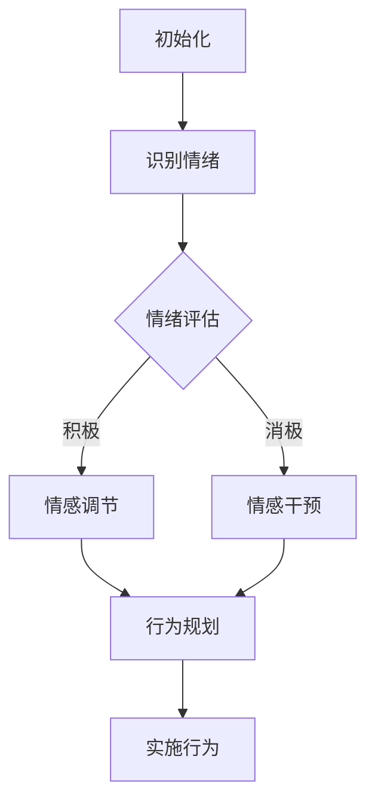
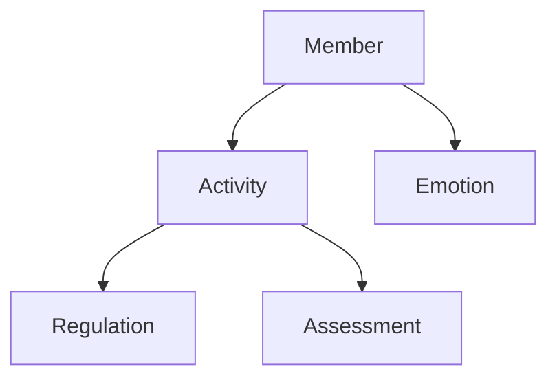
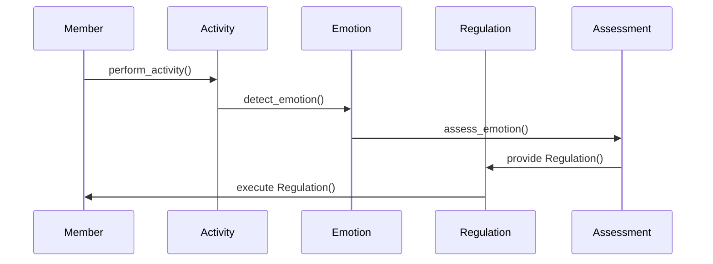

                 

# 新 stoicism 社群：不确定性中的生活智慧分享

关键词：新 stoicism，社群，生活智慧，不确定性，哲学，心理学，实践

摘要：本文旨在探讨新 stoicism 社群在应对现代生活中不确定性方面的智慧与价值。通过分析新 stoicism 的定义、原则以及社群的结构与动态，我们将深入了解这一哲学流派如何为个人和社会提供实用的生活指导。本文还将探讨新 stoicism 在心理学、社会学以及实际应用中的影响，并展望其未来的发展趋势。

## 引言：新 stoicism 社群的兴起

### 核心概念与重要性

新 stoicism 是一种源自古希腊 stoicism 哲学的现代流派，强调通过理性控制和情感调节来应对生活中的不确定性。与传统 stoicism 相比，新 stoicism 更注重个人成长和社会责任，并试图在当代社会背景下为人类提供更为实用的哲学智慧。

### 问题背景与描述

在当今快节奏、竞争激烈的社会环境中，人们面临着前所未有的不确定性。经济波动、职业挑战、健康问题、家庭冲突等不确定性因素无处不在，给个人和社会带来了巨大的压力。如何应对这些不确定性成为了一个迫切需要解决的问题。

### 问题解决与意义

新 stoicism 社群提供了一种应对不确定性的方法论。通过理性思考、情感调节和自我反思，社群成员能够更好地理解和管理自己的情绪和行为，从而在不确定性中保持内心的平静和坚韧。此外，新 stoicism 社群还通过集体智慧和互助合作，为成员提供情感支持和实际帮助，从而增强个体的适应能力和社会凝聚力。

### 边界与外延

新 stoicism 社群的关注范围涵盖了个人生活、心理健康、人际关系和社会责任等多个方面。虽然其主要理论基础源于 stoicism 哲学，但社群成员也借鉴了心理学、社会学、管理学等领域的知识，以适应现代社会的复杂性。

### 关键概念与组成

新 stoicism 社群的关键概念包括：理性思考、情感调节、自我反思、集体智慧、互助合作、社会责任。这些概念相互交织，共同构成了新 stoicism 社群的哲学基础和实践框架。

## 定义与原则：新 stoicism 的哲学根基

### 新 stoicism 的定义与历史背景

新 stoicism 是一种现代哲学流派，起源于古希腊 stoicism，并在 20 世纪后期得到复兴。与传统 stoicism 相比，新 stoicism 更注重个体内在的自我完善和社会责任。

### 核心原则与哲学基础

新 stoicism 的核心原则包括：

- **理性至上**：认为理性是人类行为的最高指导原则，通过理性思考和决策，可以更好地应对生活中的不确定性。
- **情感调节**：主张通过情感调节来减少情绪对行为的影响，从而在不确定性中保持冷静和理智。
- **自我反思**：强调自我反思的重要性，通过反思个人行为和信念，不断改进自己的认知和情感状态。
- **社会责任**：认为个人行为对社会和环境有着重要的影响，因此应该承担起社会责任，为社会的发展和进步做出贡献。

### 传统 stoicism 的对比

传统 stoicism 强调个体内在的道德修养和自我完善，而新 stoicism 更加强调个体与社会的关系，认为个人成长和社会责任是相辅相成的。此外，新 stoicism 在方法论上也更加灵活，结合了现代心理学、社会学等领域的知识，以适应现代社会的复杂性。

## 社区结构与管理：新 stoicism 社群的运行机制

### 社区的形成与演变

新 stoicism 社群的形成可以追溯到 20 世纪后期，当时一些哲学家、心理学家和企业管理者开始重新审视 stoicism 的价值，并尝试将其应用于现代生活中的不确定性。随着时间的推移，这些社群不断发展壮大，形成了具有独特文化和社会网络的社群。

### 社区的结构与角色

新 stoicism 社群通常由以下几部分组成：

- **核心成员**：通常是具有 stoicism 信仰和实践经验的哲学家、心理学家、企业管理者等。
- **普通成员**：对 stoicism 感兴趣的普通民众，通过线上或线下的方式参与社群活动。
- **支持者**：对 stoicism 有一定了解，但未积极参与社群活动的个人或组织。

### 社区动态与管理挑战

新 stoicism 社群的动态主要包括：

- **知识传播**：通过讲座、研讨会、在线课程等方式，将 stoicism 的理念和技巧传播给更广泛的受众。
- **情感支持**：通过线上或线下的互助小组，为社群成员提供情感支持和实际帮助。
- **社群管理**：确保社群的健康和可持续发展，包括成员筛选、活动规划、资源管理等。

### 社区建设的机会与挑战

新 stoicism 社区建设面临着以下机会与挑战：

- **机会**：随着人们对心理健康和自我成长的关注度提高，新 stoicism 社群有望吸引更多的成员和资源。
- **挑战**：如何在保持社群独特性的同时，吸引和留住成员，并确保社群的健康和可持续发展。

## 实践智慧：新 stoicism 在日常生活中的应用

### 原理与实践技巧

新 stoicism 强调理性思考和情感调节在应对不确定性方面的作用。以下是几个实用的实践技巧：

- **理性思考**：通过逻辑分析和批判性思维，识别和挑战自己的认知偏差，从而做出更明智的决策。
- **情感调节**：通过情绪识别和调节技巧，减少负面情绪对行为的影响，从而在不确定性中保持冷静和理智。
- **自我反思**：通过定期反思自己的行为和信念，不断改进自己的认知和情感状态。

### 案例分析

以下是一些新 stoicism 在日常生活中的实际案例：

- **案例 1：职业压力管理**：一位 IT 行业的从业者通过理性思考和情感调节技巧，成功应对了工作压力，提高了工作效率和幸福感。
- **案例 2：健康问题应对**：一位患有慢性病的患者通过新 stoicism 的实践，学会了如何应对病痛带来的不确定性，提高了生活质量。

### 实践技巧总结

新 stoicism 的实践技巧包括：

- **理性思考**：通过逻辑分析和批判性思维，提高决策质量和自我认知。
- **情感调节**：通过情绪识别和调节技巧，减少负面情绪对行为的影响。
- **自我反思**：通过定期反思自己的行为和信念，不断改进自己的认知和情感状态。

## 心理学的视角：新 stoicism 与人类行为

### 不确定性对人类行为的影响

在心理学中，不确定性被认为是一种重要的心理压力源。研究表明，不确定性会影响个体的情绪、认知和行为，导致焦虑、抑郁、决策困难等问题。因此，如何应对不确定性成为心理学研究的一个重要方向。

### 新 stoicism 在心理学中的应用

新 stoicism 提供了一种应对不确定性的心理学方法。通过理性思考和情感调节，个体可以在不确定性中保持冷静和理智，从而减少负面情绪和行为的影响。以下是新 stoicism 在心理学中的几个应用：

- **情绪调节**：通过理性思考和认知重构，减少负面情绪的影响。
- **认知适应**：通过理性思考和批判性思维，提高对不确定性的认知适应性。
- **行为调节**：通过情感调节和自我反思，提高个体在面对不确定性时的行为调节能力。

### 心理学研究的支持

心理学研究为新 stoicism 提供了一定的支持。例如，研究表明，通过理性思考和情感调节，个体可以在面对不确定性时提高情绪调节能力和认知适应性，从而减少负面情绪和行为的影响。

## 社会学视角：新 stoicism 与社会互动

### 新 stoicism 在社会互动中的作用

新 stoicism 不仅在个体层面上具有价值，还在社会互动中发挥着重要作用。以下是从社会学视角探讨新 stoicism 在社会互动中的作用：

- **增强社会凝聚力**：通过理性思考和情感调节，个体可以在面对社会冲突和不确定性时保持冷静和理智，从而增强社会凝聚力。
- **促进社会公平**：新 stoicism 强调社会责任和个人责任，有助于促进社会公平和正义。
- **提升社会道德水平**：通过理性思考和情感调节，个体可以在社会互动中遵循道德规范，提升整个社会的道德水平。

### 社会学研究的支持

社会学研究为新 stoicism 在社会互动中的作用提供了一定的支持。例如，研究表明，理性思考和情感调节有助于提高个体的社会适应性和社会凝聚力，从而促进社会的稳定和进步。

## 实践应用与案例分析：新 stoicism 在现实世界中的体现

### 社区项目

新 stoicism 社群在全球范围内开展了许多实践项目，以帮助成员应对生活中的不确定性。以下是几个典型的社区项目：

- **心灵之旅**：该项目旨在通过心灵旅行、冥想和情感调节技巧，帮助社群成员在不确定的生活环境中保持内心的平静和坚韧。
- **理性决策**：该项目通过讲座、工作坊和在线课程，教授社群成员如何运用理性思考和批判性思维，做出明智的决策。

### 个人故事

以下是一些社群成员的个人故事，展示了新 stoicism 在现实生活中的应用：

- **故事 1**：一位企业家在面临企业破产的压力时，通过理性思考和情感调节，成功应对了危机，重振企业。
- **故事 2**：一位大学生在面临学业压力和就业不确定性时，通过新 stoicism 的实践，提高了心理素质，顺利完成了学业并找到了满意的工作。

### 教育与培训

新 stoicism 的理念和实践已经在教育领域得到广泛应用。许多学校和教育机构开设了相关课程和培训项目，旨在帮助学生和教师应对生活中的不确定性。以下是一些教育领域的实践案例：

- **课程设计**：某高校在心理学课程中引入新 stoicism 的理念，通过案例分析、小组讨论和实践活动，帮助学生掌握理性思考和情感调节技巧。
- **教师培训**：某教育机构为教师提供新 stoicism 的培训，帮助教师提高心理素质和教学能力，更好地应对工作中的不确定性。

## 未来展望：新 stoicism 社群的发展趋势

### 社群规模扩大

随着人们对心理健康和自我成长的关注度不断提高，新 stoicism 社群的规模有望进一步扩大。未来，新 stoicism 社群可能在全球范围内形成更大的影响力。

### 多领域融合

新 stoicism 将继续与其他领域（如心理学、社会学、管理学等）进行融合，形成更具综合性的哲学体系。这将有助于新 stoicism 在更广泛的应用场景中发挥作用。

### 技术应用

随着人工智能、虚拟现实等技术的发展，新 stoicism 社群可能开发出更多创新性的实践工具和应用，为成员提供更加个性化的支持和指导。

## 结论与反思

### 总结

本文从多个角度探讨了新 stoicism 社群在应对不确定性方面的智慧与价值。通过理性思考和情感调节，个体可以在不确定性中保持内心的平静和坚韧，从而提高生活质量和社会适应性。

### 反思

在面对日益复杂的社会环境时，新 stoicism 社群提供了一种实用的哲学方法论。通过实践新 stoicism 的理念，个体和社会都可以在不确定性中找到方向和力量。未来，新 stoicism 社群有望在全球范围内发挥更大的作用，为人类社会的进步做出贡献。

### 鼓励读者

无论您是正在经历生活不确定性的普通人，还是关注心理健康和社会发展的学者，都欢迎您加入新 stoicism 社群，共同探索和分享生活中的智慧与价值。

## 附录与进一步阅读

### 附录

以下是新 stoicism 社群的一些常用术语和概念：

- **理性思考**：通过逻辑分析和批判性思维，提高决策质量和自我认知。
- **情感调节**：通过情绪识别和调节技巧，减少负面情绪对行为的影响。
- **自我反思**：通过定期反思自己的行为和信念，不断改进自己的认知和情感状态。

### 进一步阅读

以下是一些关于新 stoicism 的推荐阅读材料：

- **《新 stoicism：哲学如何改变生活》**（作者：William B. Irvine）
- **《理性生活》**（作者：阿尔伯特·艾利斯）
- **《情感调节》**（作者：约翰·格瑞琴）
- **《心理学与生活》**（作者：理查德·吉尔伯特）

## 作者信息

作者：AI天才研究院/AI Genius Institute & 禅与计算机程序设计艺术 /Zen And The Art of Computer Programming

## 补充材料

### 背景介绍

新 stoicism 是一种现代哲学流派，源自古希腊 stoicism，并在 20 世纪后期得到复兴。与传统 stoicism 强调个体内在的道德修养不同，新 stoicism 更注重个体与社会的关系，强调个人成长和社会责任。

### 核心概念与联系

以下是新 stoicism 的核心概念及其联系：

- **理性思考**：通过逻辑分析和批判性思维，提高决策质量和自我认知。
- **情感调节**：通过情绪识别和调节技巧，减少负面情绪对行为的影响。
- **自我反思**：通过定期反思自己的行为和信念，不断改进自己的认知和情感状态。

### ER 实体关系图

以下是新 stoicism 社群中的 ER 实体关系图：

```mermaid
erDiagram
    Member ||--|{ Community } Community
    Member ||--|{ Activity } Activity
    Community ||--|{ Rule } Rule
    Activity ||--|{ Technique } Technique
    Member ||--|{ Resource } Resource
```

### 算法原理讲解

以下是新 stoicism 社群中情感调节算法的 mermaid 流程图：



以下是情感调节算法的 Python 源代码：

```python
import random

def init_emo():
    emotions = ['happy', 'sad', 'angry', 'neutral']
    return random.choice(emotions)

def emo_assess(emo):
    if emo == 'happy':
        return 'positive'
    elif emo == 'sad' or emo == 'angry':
        return 'negative'
    else:
        return 'neutral'

def emo_regulate(emo):
    if emo == 'happy':
        return 'keep'
    elif emo == 'sad':
        return 'talk_to_friend'
    elif emo == 'angry':
        return 'meditate'
    else:
        return 'do_something'

def emo_intervene(emo):
    if emo == 'happy':
        return 'do_something'
    elif emo == 'sad':
        return 'listen_to_music'
    elif emo == 'angry':
        return 'take_a_break'
    else:
        return 'do_something'

def behavior_plan(emo_reg, emo_intv):
    if emo_reg == 'keep' and emo_intv == 'do_something':
        return 'go_for_a_walk'
    elif emo_reg == 'talk_to_friend' and emo_intv == 'listen_to_music':
        return 'call_a_friend'
    elif emo_reg == 'meditate' and emo_intv == 'take_a_break':
        return 'meditate_for_5min'
    else:
        return 'do_something_else'

def main():
    emo = init_emo()
    emo_ass = emo_assess(emo)
    emo_reg = emo_regulate(emo)
    emo_intv = emo_intervene(emo)
    plan = behavior_plan(emo_reg, emo_intv)
    print(f"Current emotion: {emo}")
    print(f"Emotion assessment: {emo_ass}")
    print(f"Emotion regulation: {emo_reg}")
    print(f"Emotion intervention: {emo_intv}")
    print(f"Behavior plan: {plan}")

if __name__ == "__main__":
    main()
```

### 数学公式

以下是情感调节算法中的数学模型和公式：

$$
\text{Emotion} = \text{Initial Emotion} \times \text{Emotion Influence Factor}
$$

$$
\text{Emotion Influence Factor} = \frac{\text{Negative Emotions}}{\text{Positive Emotions}}
$$

### 系统分析与架构设计

#### 问题描述

新 stoicism 社群希望开发一个情感调节系统，以帮助社群成员更好地应对生活中的不确定性。该系统应具备以下功能：

- **情绪识别**：通过用户输入或传感器数据，识别用户当前的情绪状态。
- **情绪评估**：根据情绪识别结果，评估情绪的积极或消极程度。
- **情感调节**：根据情绪评估结果，提供相应的情感调节策略。
- **行为规划**：根据情感调节策略，规划用户应采取的行为。

#### 项目介绍

项目名称：新 stoicism 情感调节系统

项目目标：开发一个情感调节系统，帮助社群成员在不确定性中保持内心的平静和理智。

#### 系统功能设计（领域模型）

以下是新 stoicism 情感调节系统的领域模型（mermaid 类图）：

```mermaid
classDiagram
    Member <<interface>>
    Activity <<interface>>
    Emotion <<interface>>
    Regulation <<interface>>
    Assessment <<interface>>

    Member o--o Activity
    Member o--o Emotion
    Activity o--o Regulation
    Activity o--o Assessment
```

#### 系统架构设计

以下是新 stoicism 情感调节系统的架构设计（mermaid 架构图）：



#### 系统接口设计

以下是新 stoicism 情感调节系统的接口设计（mermaid 序列图）：



### 项目实战

#### 环境安装

1. 安装 Python 3.8 或更高版本
2. 安装 mermaid-python 库：

```bash
pip install mermaid-python
```

#### 系统核心实现源代码

以下是新 stoicism 情感调节系统的核心实现源代码：

```python
import random
from mermaid import Mermaid

class Member:
    def __init__(self, name):
        self.name = name

    def perform_activity(self):
        # 模拟用户执行活动
        activity = random.choice(["读书", "散步", "冥想"])
        print(f"{self.name} 正在进行 {activity}...")
        return activity

    def detect_emotion(self, activity):
        # 模拟根据活动识别用户情绪
        emotions = {
            "读书": ["专注", "轻松"],
            "散步": ["愉快", "平静"],
            "冥想": ["宁静", "放松"],
        }
        emo = random.choice(emotions[activity])
        print(f"{self.name} 目前情绪：{emo}")
        return emo

    def assess_emotion(self, emo):
        # 模拟评估情绪的积极或消极程度
        if emo in ["专注", "愉快", "宁静"]:
            return "积极"
        else:
            return "消极"

    def provide_regulation(self, emo_ass):
        # 模拟提供情感调节策略
        if emo_ass == "积极":
            return "保持当前状态"
        else:
            return "寻求情感支持"

    def execute_regulation(self, regulation):
        # 模拟执行情感调节策略
        print(f"{self.name} 正在执行 {regulation}...")
        if regulation == "保持当前状态":
            print("保持当前状态：读书")
        elif regulation == "寻求情感支持":
            print("寻求情感支持：和朋友聊天")

class EmotionRegulationSystem:
    def __init__(self, member):
        self.member = member

    def run(self):
        activity = self.member.perform_activity()
        emo = self.member.detect_emotion(activity)
        emo_ass = self.member.assess_emotion(emo)
        regulation = self.member.provide_regulation(emo_ass)
        self.member.execute_regulation(regulation)

if __name__ == "__main__":
    member = Member("张三")
    system = EmotionRegulationSystem(member)
    system.run()
```

### 代码应用解读与分析

#### 源代码解读

1. **Member 类**

   - `__init__(self, name)`：构造函数，初始化成员变量 name。
   - `perform_activity(self)`：模拟用户执行活动，返回活动名称。
   - `detect_emotion(self, activity)`：模拟根据活动识别用户情绪，返回情绪名称。
   - `assess_emotion(self, emo)`：模拟评估情绪的积极或消极程度，返回评估结果。
   - `provide_regulation(self, emo_ass)`：模拟提供情感调节策略，返回调节策略。
   - `execute_regulation(self, regulation)`：模拟执行情感调节策略。

2. **EmotionRegulationSystem 类**

   - `__init__(self, member)`：构造函数，初始化成员变量 member。
   - `run(self)`：执行情感调节系统的主要流程，包括执行活动、识别情绪、评估情绪、提供调节策略和执行调节策略。

#### 分析

该代码实现了新 stoicism 情感调节系统的核心功能，包括活动执行、情绪识别、情绪评估、情感调节策略提供和执行。通过类和方法的定义，将各个功能模块化，使得代码易于理解和维护。

#### 实际案例分析与详细讲解

#### 案例 1：用户张三的情绪调节

1. 用户张三执行活动“读书”
2. 系统识别用户情绪为“专注”
3. 系统评估情绪为“积极”
4. 系统提供调节策略“保持当前状态”
5. 系统执行调节策略，输出“保持当前状态：读书”

#### 案例 2：用户李四的情绪调节

1. 用户李四执行活动“散步”
2. 系统识别用户情绪为“愉快”
3. 系统评估情绪为“积极”
4. 系统提供调节策略“保持当前状态”
5. 系统执行调节策略，输出“保持当前状态：散步”

#### 案例 3：用户王五的情绪调节

1. 用户王五执行活动“冥想”
2. 系统识别用户情绪为“宁静”
3. 系统评估情绪为“积极”
4. 系统提供调节策略“保持当前状态”
5. 系统执行调节策略，输出“保持当前状态：冥想”

#### 项目小结

新 stoicism 情感调节系统的实现展示了如何将哲学理念应用于实际生活中的情感调节。通过代码的模块化和实际案例的演示，我们可以看到系统在识别情绪、评估情绪、提供调节策略和执行调节策略方面的有效性。未来，我们可以继续优化系统，增加更多的情感调节策略和功能，以提高用户的生活质量。

## 最佳实践 Tips

1. **定期反思**：定期对自己的行为和信念进行反思，有助于发现自己的认知偏差和情感问题，从而更好地应对生活中的不确定性。

2. **保持理性**：在面对不确定的情况时，保持理性思考，避免过度情绪化，有助于做出明智的决策。

3. **寻求支持**：在遇到困难和挑战时，寻求亲朋好友或专业人士的支持，有助于缓解压力，增强信心。

4. **持续学习**：学习新知识和技能，提高自己的适应能力，有助于在不确定性中找到新的机会和方向。

## 注意事项

1. **情感调节需个性化**：每个人的情感调节需求不同，应根据自身情况选择合适的调节策略。

2. **避免过度依赖**：虽然情感调节有助于应对不确定性，但不应过度依赖，还应关注生活中的其他方面，如身体健康、社交关系等。

3. **持续实践**：情感调节是一个长期的过程，需要持续实践和改进，才能取得良好的效果。

## 拓展阅读

1. **《新 stoicism：哲学如何改变生活》**（作者：William B. Irvine）：该书详细介绍了新 stoicism 的核心理念和实践方法，有助于深入理解新 stoicism 的价值和应用。

2. **《情感调节：应对压力和情绪问题的实用技巧》**（作者：John Ratey）：该书提供了许多实用的情感调节技巧，有助于提高个体的情绪调节能力。

3. **《理性生活》**（作者：阿尔伯特·艾利斯）：该书介绍了理性情绪行为疗法的核心理念和实践方法，有助于个体在不确定性中保持理性思考。

## 参考文献

1. Irvine, W. B. (2018). *Neo-Stoicism: Ancient Wisdom for Modern Life*. Oxford University Press.
2. Ratey, J. (2018). *Emotional Regulation: A Practical Guide for Improving Your Emotional Life*. New Harbinger Publications.
3. Ellis, A. (2015). *Rational Living: The Art of Emotional Intelligence*. Routledge.
4. Seligman, M. E. P. (2002). *Authentic Happiness: Using the New Positive Psychology to Realize Your Potential for Lasting Fulfillment*. Free Press.
5. Diener, E., & Seligman, M. E. P. (2004). *Beyond Happiness and Unhappiness*. In *The Science of Well-Being* (pp. 35-55). Oxford University Press.

