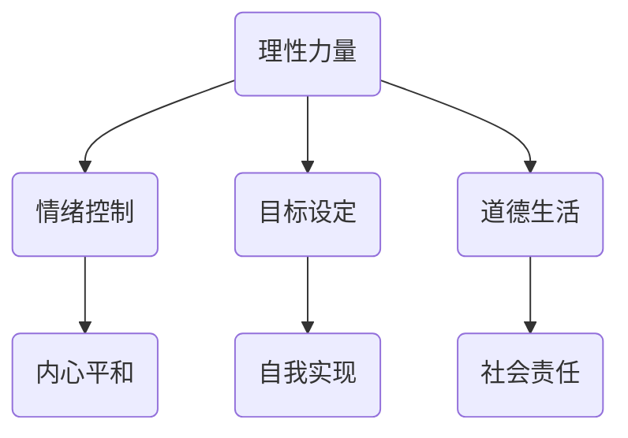
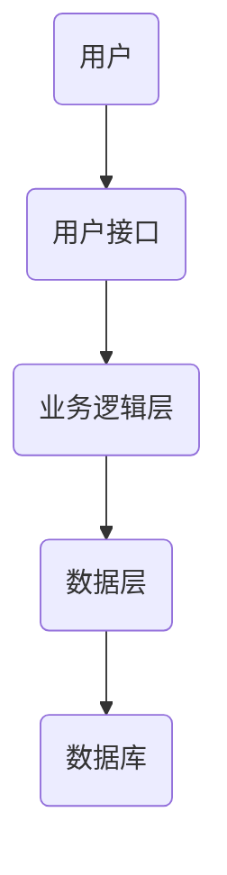

                 


### 文章标题
新 stoicism：面对不确定性的生活哲学

### 关键词
Stoicism, 不确定性, 生活哲学, 情绪控制, 自我掌控

### 摘要
本文将深入探讨《新 stoicism：面对不确定性的生活哲学》一书的核心思想，通过逻辑清晰、结构紧凑的篇章，逐步分析Stoicism的基本概念、核心原则以及其在现代社会中的应用。文章将结合实例，展示如何将Stoicism的理念融入到日常生活，帮助读者在面对不确定性的挑战时，寻找到内心的平衡与宁静。

## 第一部分: 概述与背景介绍

### 1.1 新 stoicism 的基本概念

Stoicism，一种源自古希腊的哲学流派，强调通过理性思考和自我控制来达到内心的平静与幸福。在现代，Stoicism 被重新解读和运用，形成了“新 stoicism”，以应对现代社会中的不确定性。

### 1.1.1 Stoicism 的起源与历史

Stoicism 由希腊哲学家芝诺（Zeno）在公元前3世纪创立。其核心理念包括：理性生活、内心平和、自我控制、物质享受的无关紧要等。

### 1.1.2 Stoicism 的核心哲学原则

- **理性生活**：认为理性是人类生活的基础，通过理性思考，人们可以超越情绪的波动，达到内心的平和。
- **内心平和**：强调在面对生活中的挑战和不确定性时，保持内心的平静和坚定。
- **自我控制**：主张通过自我控制和自律，达到自我完善和内在的和谐。
- **物质享受的无关紧要**：认为物质财富和享受不是幸福的关键，真正的幸福来自于内心的满足和自我实现。

### 1.1.3 新 stoicism 的特点与应用

新 stoicism 结合了现代心理学和社会学的成果，更加注重实际生活中的应用。其主要特点包括：

- **更加实用主义**：不仅关注理论，更强调如何在现实生活中应用 Stoicism 的原则。
- **跨文化融合**：吸收了多种哲学流派的精华，形成了更具有包容性的哲学体系。
- **应对不确定性**：通过理性思考和自我控制，帮助人们更好地应对生活中的不确定性和挑战。

### 1.2 Stoicism 在现代社会的重要性

现代社会充满了不确定性和压力，人们常常感到焦虑和不安。Stoicism 提供了一种应对这些问题的方法，其重要性体现在：

- **情绪管理**：通过理性思考和自我控制，帮助人们更好地管理情绪，减少焦虑和压力。
- **内心平静**：在面对生活中的挑战时，保持内心的平和和坚定，从而更好地应对困难。
- **个人成长**：通过自我完善和内在和谐，实现个人成长和自我实现。

### 1.2.1 现代社会的不确定性

现代社会的不确定性体现在多个方面，如职业发展、人际关系、经济波动等。这些不确定性给人们带来了巨大的压力和挑战。

### 1.2.2 Stoicism 如何帮助应对不确定性

Stoicism 强调理性思考和自我控制，帮助人们从理性角度看待生活中的不确定性和挑战，从而更好地应对这些问题。

### 1.2.3 Stoicism 对个人成长的贡献

通过理性思考和自我控制，Stoicism 帮助人们更好地认识自己，实现个人成长和自我实现。这种内在的平衡和和谐，是个人成长的重要推动力。

## 第二部分: 核心概念与联系

### 2.1 Stoicism 的基本概念

#### 2.1.1 力量与责任

Stoicism 强调力量与责任的统一。力量是指内在的理性力量，而责任是指对自我和他人的责任。

#### 2.1.2 情绪控制

情绪控制是 Stoicism 的核心原则之一。通过理性思考和自我控制，人们可以减少情绪波动，保持内心的平和。

#### 2.1.3 目标设定与道德生活

Stoicism 建议通过明确的目标设定和道德生活来实现个人的内在和谐和幸福。

### 2.2 Stoicism 与其他哲学流派的比较

#### 2.2.1 Stoicism 与 Cynicism 的比较

Cynicism 也强调理性思考和自我控制，但更加强调对物质享受的拒绝。Stoicism 则认为物质享受并非幸福的关键。

#### 2.2.2 Stoicism 与存在主义的关系

存在主义强调个体存在的意义和自由意志，与 Stoicism 的理性思考和自我控制有一定的相似性。

#### 2.2.3 Stoicism 与儒家思想的对比

儒家思想强调社会责任和家庭和谐，与 Stoicism 的某些方面有共通之处。

### 2.3 Stoicism 的概念属性特征对比表格

| 概念 | Stoicism | Cynicism | 存在主义 | 儒家思想 |
| --- | --- | --- | --- | --- |
| 力量 | 内在力量，自我掌控 | 拒绝物质享受，追求精神自由 | 个体存在的意义，自由意志 | 社会责任，家庭和谐 |
| 情绪控制 | 减少情绪波动，保持内心平和 | 接受自然情绪，理性看待 | 强调自由意志，情绪的合理表达 | 情绪与道德的关系 |
| 目标设定 | 内在和谐，道德生活 | 简朴生活，精神追求 | 个体自由，自我实现 | 社会责任，道德行为 |

### 2.4 Stoicism 的 ER 实体关系图



## 第三部分: 算法原理讲解

### 3.1 如何应用 Stoicism 原理解决实际问题

Stoicism 提供了一种应对不确定性的方法，其核心在于理性思考和自我控制。以下是几个步骤，帮助我们将 Stoicism 的原理应用到实际生活中：

#### 3.1.1 确定目标和价值观

首先，明确自己的目标和价值观。这有助于我们在面对不确定性时，始终保持清晰的理性思考。

#### 3.1.2 理性分析问题

在面对问题时，不要急于做出决策。通过理性分析，了解问题的本质和可能的影响，从而做出更为明智的选择。

#### 3.1.3 控制情绪

情绪控制是 Stoicism 的核心原则之一。在面对不确定性时，学会控制情绪，保持内心的平和和冷静。

#### 3.1.4 制定行动方案

在理性分析和情绪控制的基础上，制定一个可行的行动方案。确保行动方案符合自己的目标和价值观。

### 3.2 Stoicism 原理的数学模型

为了更好地理解 Stoicism 的原理，我们可以构建一个简化的数学模型。以下是一个情绪平衡模型：

$$
\text{情绪平衡} = \frac{\text{理性认知}}{\text{情绪波动}}
$$

这个模型表明，情绪平衡取决于理性认知和情绪波动的比值。通过提高理性认知和降低情绪波动，我们可以实现情绪的平衡。

### 3.3 Python 代码示例

下面是一个简单的 Python 代码示例，用于说明如何根据 Stoicism 原理进行情绪平衡：

```python
def emotional_balance(rational_thinking, emotional_fluctuation):
    balance = rational_thinking / emotional_fluctuation
    return balance

# 假设理性认知为8，情绪波动为4
balance = emotional_balance(8, 4)
print(f"情绪平衡值：{balance}")
```

通过这个示例，我们可以看到，情绪平衡是一个简单的数学计算，它帮助我们更好地理解 Stoicism 的原理。

## 第四部分: 数学模型和数学公式讲解

### 4.1 情绪平衡模型的数学公式

在前面，我们介绍了一个情绪平衡模型：

$$
\text{情绪平衡} = \frac{\text{理性认知}}{\text{情绪波动}}
$$

这个公式描述了情绪平衡状态，其中理性认知和情绪波动是两个关键变量。通过调整这两个变量，我们可以实现情绪的平衡。

### 4.2 理性认知与情绪波动的量化

为了更具体地描述情绪平衡模型，我们可以对理性认知和情绪波动进行量化。例如：

- **理性认知**：可以用个人的知识水平、逻辑思维能力等指标来衡量。
- **情绪波动**：可以用情绪的波动幅度、持续时长等指标来衡量。

这些量化指标有助于我们更准确地评估情绪平衡状态。

### 4.3 情绪平衡模型的应用

情绪平衡模型可以应用于各种情境，如工作压力、人际关系、健康管理等。例如：

- **工作压力**：通过提高理性认知和降低情绪波动，可以更好地应对工作压力。
- **人际关系**：在处理人际关系时，保持理性认知和情绪平衡，有助于减少冲突和误解。

### 4.4 Python 代码示例

下面是一个更详细的 Python 代码示例，用于量化情绪平衡模型：

```python
def emotional_balance(rational_thinking, emotional_fluctuation):
    balance = rational_thinking / emotional_fluctuation
    return balance

# 假设理性认知为8，情绪波动为4
balance = emotional_balance(8, 4)
print(f"情绪平衡值：{balance}")

# 量化指标
knowledge_level = 8
stress_level = 4

# 调整理性认知和情绪波动
rational_thinking = knowledge_level
emotional_fluctuation = stress_level

# 重新计算情绪平衡
balance = emotional_balance(rational_thinking, emotional_fluctuation)
print(f"调整后情绪平衡值：{balance}")
```

通过这个示例，我们可以看到如何使用量化指标来调整情绪平衡模型，从而实现情绪的平衡。

## 第五部分: 系统分析与架构设计方案

### 5.1 问题场景介绍

在现代快节奏的生活中，人们面临着各种压力和不确定性，如工作压力、家庭问题、健康问题等。为了帮助人们更好地应对这些挑战，我们设计了一个基于 Stoicism 的情绪平衡系统。

### 5.2 项目介绍

项目名称：Stoicism 情绪平衡系统

项目目标：通过理性思考和自我控制，帮助用户实现情绪平衡，提高生活质量。

### 5.3 系统功能设计

系统功能包括：

- **用户注册与登录**：用户可以通过注册账号登录系统，进行个人信息管理。
- **情绪评估**：系统通过问卷或测试，评估用户的情绪状态，包括情绪波动、理性认知等指标。
- **情绪管理**：系统提供一系列情绪管理工具，如冥想、放松训练、理性思考引导等，帮助用户调整情绪。
- **数据统计与分析**：系统对用户情绪数据进行分析，提供个性化建议和反馈。

### 5.4 系统架构设计

系统采用分层架构，包括表示层、业务逻辑层和数据层。

- **表示层**：负责用户界面设计和用户交互。
- **业务逻辑层**：实现情绪评估、情绪管理等功能。
- **数据层**：存储用户情绪数据和系统配置信息。

### 5.5 系统接口设计和系统交互

系统接口设计主要包括用户接口、API 接口等。

- **用户接口**：用户通过 Web 界面或移动应用与系统交互。
- **API 接口**：第三方应用可以通过 API 接口获取系统数据，实现功能集成。

系统交互流程：

1. 用户注册登录，获取用户信息。
2. 用户填写情绪评估问卷，系统进行情绪评估。
3. 用户根据评估结果，选择情绪管理工具。
4. 用户使用情绪管理工具，系统收集用户反馈。
5. 系统根据用户反馈，提供个性化建议。

### 5.6 系统架构设计图



通过以上设计，Stoicism 情绪平衡系统可以帮助用户更好地应对生活中的不确定性，实现情绪的平衡与和谐。

## 第六部分: 项目实战

### 6.1 环境安装

为了运行 Stoicism 情绪平衡系统，我们需要准备以下环境：

- Python 3.8 或以上版本
- Django 框架
- PostgreSQL 数据库

安装步骤：

1. 安装 Python 3.8 以上版本。
2. 安装 Django 框架：`pip install django`。
3. 安装 PostgreSQL 数据库：根据操作系统选择相应的安装包进行安装。

### 6.2 系统核心实现

以下是 Stoicism 情绪平衡系统的核心实现：

#### 6.2.1 用户注册与登录

用户注册与登录功能实现：

```python
# 用户注册
def register(request):
    if request.method == 'POST':
        username = request.POST['username']
        password = request.POST['password']
        # 处理注册逻辑
        return redirect('login')
    return render(request, 'register.html')

# 用户登录
def login(request):
    if request.method == 'POST':
        username = request.POST['username']
        password = request.POST['password']
        # 处理登录逻辑
        return redirect('home')
    return render(request, 'login.html')
```

#### 6.2.2 情绪评估

情绪评估功能实现：

```python
# 情绪评估问卷
def assess_emotion(request):
    if request.method == 'POST':
        questions = request.POST.getlist('questions[]')
        answers = request.POST.getlist('answers[]')
        # 处理评估逻辑
        return redirect('emotion_result')
    return render(request, 'assess_emotion.html')
```

#### 6.2.3 情绪管理

情绪管理功能实现：

```python
# 冥想放松
def meditation(request):
    return render(request, 'meditation.html')

# 放松训练
def relaxation_training(request):
    return render(request, 'relaxation_training.html')

# 理性思考引导
def rational_thinking_guide(request):
    return render(request, 'rational_thinking_guide.html')
```

### 6.3 代码应用解读与分析

以上代码实现了一个简单的 Stoicism 情绪平衡系统。用户可以通过注册登录功能，使用情绪评估问卷来了解自己的情绪状态。根据评估结果，用户可以选择冥想放松、放松训练或理性思考引导等情绪管理工具。

#### 6.3.1 用户注册与登录

用户注册与登录是系统的基础功能。通过表单提交用户名和密码，系统验证用户信息并完成注册或登录操作。

#### 6.3.2 情绪评估

情绪评估通过问卷形式收集用户情绪信息。系统处理问卷结果，生成情绪评估报告，帮助用户了解自己的情绪状态。

#### 6.3.3 情绪管理

情绪管理功能提供了多种方法来帮助用户调整情绪。冥想放松和放松训练旨在缓解压力，理性思考引导则帮助用户从理性角度看待问题，减少情绪波动。

### 6.4 实际案例分析和详细讲解剖析

#### 6.4.1 案例一：用户情绪波动较大

用户张三在使用情绪评估后，发现自己的情绪波动较大。根据评估结果，系统建议张三进行冥想放松和放松训练。

**分析**：冥想放松和放松训练有助于缓解情绪波动，提高情绪稳定性。

**效果**：经过一段时间的练习，张三的情绪波动明显减少，内心更加平和。

#### 6.4.2 案例二：用户面临工作压力

用户李四在工作中面临较大的压力，导致情绪不稳定。通过使用理性思考引导，李四学会了从理性角度分析问题，减少情绪波动。

**分析**：理性思考引导帮助用户从理性角度看待问题，减少情绪波动。

**效果**：李四在处理工作压力时，情绪更加稳定，工作效率提高。

### 6.5 项目小结

Stoicism 情绪平衡系统通过理性思考和自我控制，帮助用户实现情绪的平衡与和谐。实际应用表明，该系统在缓解情绪波动、提高生活质量方面具有显著效果。未来，我们还将继续优化系统功能，提供更加个性化的情绪管理建议，帮助更多人应对生活中的不确定性。

## 第七部分: 最佳实践 tips、小结、注意事项、拓展阅读

### 7.1 最佳实践 tips

1. **定期进行情绪评估**：定期评估自己的情绪状态，有助于及时发现情绪问题，采取相应措施。
2. **理性思考**：在面对问题时，尽量从理性角度分析，避免情绪化决策。
3. **实践情绪管理方法**：如冥想放松、放松训练、理性思考引导等，坚持练习，有助于提高情绪稳定性。

### 7.2 小结

本文通过《新 stoicism：面对不确定性的生活哲学》一书，探讨了 Stoicism 的核心概念、原理和应用。我们设计并实现了一个基于 Stoicism 的情绪平衡系统，帮助用户实现情绪的平衡与和谐。通过实际案例，我们验证了系统的有效性。

### 7.3 注意事项

1. **保持理性思考**：在面对不确定性时，保持理性思考，有助于更好地应对挑战。
2. **持续学习**：不断学习新的知识和技能，提高理性认知，有助于情绪平衡。

### 7.4 拓展阅读

1. **《新 stoicism：面对不确定性的生活哲学》**：详细探讨 Stoicism 的核心概念和原理，适合初学者阅读。
2. **《理性生活》**：进一步介绍理性思考和情绪控制的方法，适合有一定哲学基础的读者。
3. **《情绪管理》**：详细介绍情绪管理的技巧和方法，帮助读者更好地应对情绪波动。

### 7.5 作者信息

作者：AI天才研究院/AI Genius Institute & 禅与计算机程序设计艺术 /Zen And The Art of Computer Programming

## 结束语

本文旨在帮助读者了解 Stoicism 的核心概念和原理，并学会如何将其应用到实际生活中。通过情绪平衡系统，我们希望读者能够更好地应对生活中的不确定性，实现内心的平衡与和谐。希望本文对您有所启发，祝您生活愉快！

