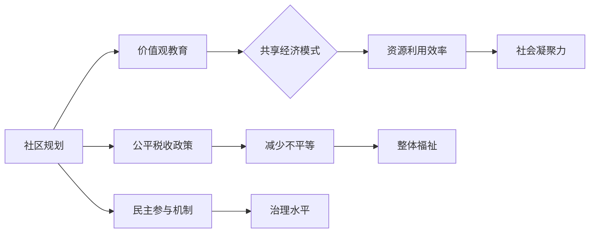
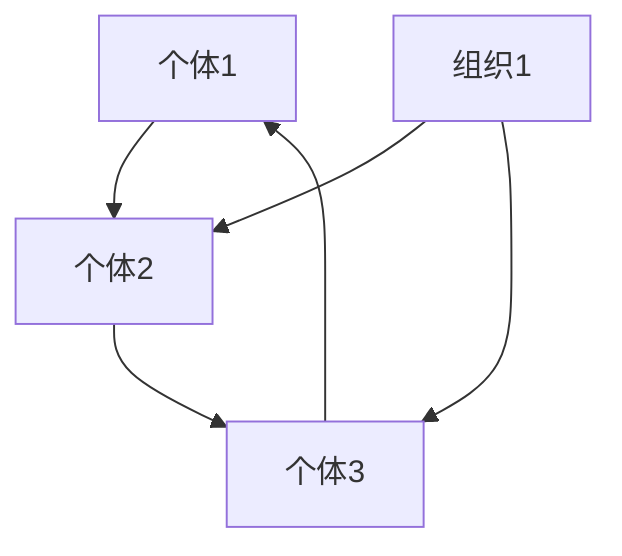
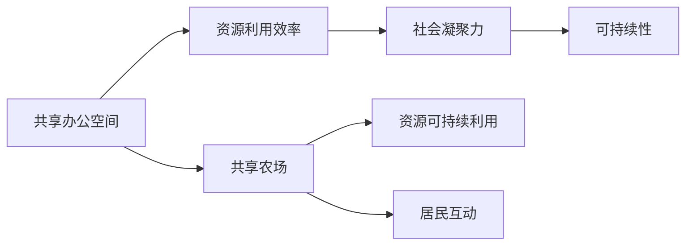
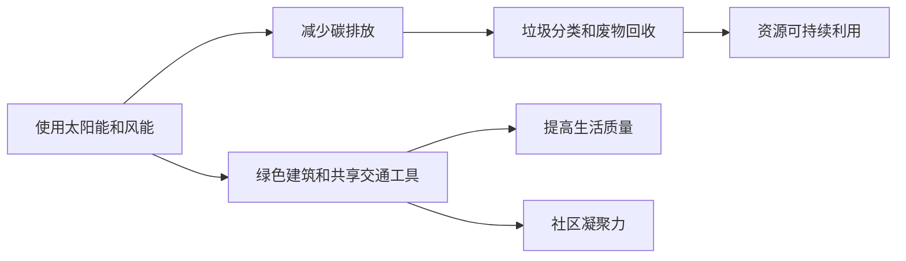

                 


### 引言与背景

#### 文章标题
新乌托邦主义：在理想社区中实践价值观

#### 关键词
新乌托邦主义，理想社区，价值观实践，社会结构，可持续发展

#### 摘要
本文将探讨新乌托邦主义这一社会理念，分析其在理想社区中的实践和价值。通过深入解析平等、公正、共享、协作、环境保护等核心价值观，以及它们在现实中的应用，我们将揭示新乌托邦主义如何构建一个和谐、可持续的社会模型。

### 第一部分: 引言与背景

#### 第1章: 新乌托邦主义的理念基础

##### 1.1 新乌托邦主义的起源与发展
**问题描述**：新乌托邦主义作为社会理想的概念，起源于历史上的乌托邦思想。然而，它如何在全球化和技术进步的背景下得以发展，值得我们深入探讨。

**核心概念**：新乌托邦主义强调平等、公正、共享、协作和可持续发展，追求一个和谐、稳定的社会结构。

**问题解决**：通过历史案例分析，我们可以看到新乌托邦主义在不同文化和社会中的发展轨迹，以及其对现实社会的启示。

**边界与外延**：新乌托邦主义不仅关注社会层面的变革，还涉及经济、政治、文化等多个领域。其外延涵盖了从社区到全球社会的不同层次。

##### 1.2 理想社区的构想与实践
**问题描述**：理想社区是一个没有压迫、充满爱与关怀的地方。那么，如何构建设这样的社区，并在实践中实现这些理念，是我们需要解决的问题。

**问题解决**：通过社会学、心理学和城市规划等多学科的研究，我们可以构建出理想社区的理论框架，并在实际操作中逐步实现这些理念。

**边界与外延**：理想社区的建设需要考虑人口、资源、环境等多个因素，其外延可以从一个小型社区扩展到整个城市，乃至更广泛的社会。

##### 1.3 新乌托邦主义的价值体现
**核心要素**：新乌托邦主义的核心价值观包括平等、公正、共享、协作和可持续发展。这些价值观在理想社区中如何体现，是我们需要深入探讨的问题。

**问题解决**：通过具体案例分析，我们可以看到新乌托邦主义价值观在不同社区中的实践情况，以及这些实践对社会发展的影响。

**边界与外延**：新乌托邦主义的价值体现不仅局限于社区层面，还可以在更广泛的社会、经济和文化领域中发挥作用。

### 第二部分: 新乌托邦主义的核心价值观

#### 第2章: 平等与公正

##### 2.1 平等的定义与内涵
**概念属性特征对比表格**：我们将平等与其他相似概念如公平、正义等进行对比，分析它们的异同点。

**ER实体关系图架构**：通过Mermaid流程图展示平等相关的实体和关系。

##### 2.2 公正的实现与挑战
**问题描述**：在现实社会中，如何实现公正仍然是一个挑战。我们需要探讨公正的定义、实现路径以及面临的挑战。

**问题解决**：通过具体案例分析，我们可以看到公正如何在不同社区中得以实现，以及实现过程中遇到的困难。

**ER实体关系图架构**：通过Mermaid流程图展示公正相关的实体和关系。

##### 2.3 理想社区中的平等与公正实践
**问题描述**：在理想社区中，平等与公正是如何实现的？我们需要具体分析这些实践案例。

**问题解决**：通过案例分析，我们可以看到平等与公正如何在理想社区中得到体现。

**Mermaid流程图**：展示平等与公正在理想社区中的实践流程。

#### 第3章: 共享与协作

##### 2.1 共享的概念与意义
**概念原理**：我们将深入探讨共享的概念，解释它在社会中的重要性。

**问题描述**：共享在理想社区中如何发挥作用？

**问题解决**：通过具体案例分析，我们可以看到共享如何促进社区的和谐发展。

**ER实体关系图架构**：通过Mermaid流程图展示共享相关的实体和关系。

##### 2.2 协作的力量与挑战
**算法原理讲解**：我们将使用Mermaid流程图和Python源代码来讲解协作的算法原理。

**问题描述**：在理想社区中，协作如何发挥作用？

**问题解决**：通过具体案例分析，我们可以看到协作如何促进社区的进步。

**算法原理讲解**：使用Python源代码详细阐述协作的算法原理。

##### 2.3 理想社区中的共享与协作实践
**问题描述**：在理想社区中，共享与协作是如何实现的？

**问题解决**：通过具体案例分析，我们可以看到共享与协作在理想社区中的实践情况。

**Mermaid流程图**：展示共享与协作在理想社区中的实践流程。

#### 第4章: 环境保护与可持续发展

##### 2.1 环境保护的重要性
**数学模型和公式**：我们将使用LaTeX格式给出环境保护的数学模型和公式。

**问题描述**：环境保护在理想社区中的意义是什么？

**问题解决**：通过具体案例分析，我们可以看到环境保护如何影响社区的可持续发展。

**数学模型和公式**：使用LaTeX格式展示环境保护的数学模型和公式。

##### 2.2 可持续发展的实现路径
**详细讲解与举例说明**：我们将详细讲解可持续发展的实现路径，并通过实际案例来说明。

**问题描述**：理想社区如何实现可持续发展？

**问题解决**：通过具体案例分析，我们可以看到可持续发展在理想社区中的实现路径。

**详细讲解与举例说明**：详细讲解可持续发展的实现路径，并给出实际案例。

##### 2.3 理想社区中的环境保护与可持续发展实践
**问题描述**：理想社区中的环境保护与可持续发展是如何实践的？

**问题解决**：通过具体案例分析，我们可以看到环境保护与可持续发展在理想社区中的实践情况。

**Mermaid流程图**：展示环境保护与可持续发展的实践流程。

### 第三部分: 新乌托邦主义的实践应用

#### 第5章: 社区治理与民主参与

##### 2.1 社区治理的原理与实践
**问题描述**：社区治理在理想社区中的作用是什么？

**问题解决**：通过具体案例分析，我们可以看到社区治理如何影响社区的稳定和发展。

**系统功能设计**：通过Mermaid类图展示社区治理的基本功能。

##### 2.2 民主参与的机制与形式
**问题描述**：在理想社区中，民主参与是如何实现的？

**问题解决**：通过具体案例分析，我们可以看到民主参与如何促进社区的进步。

**系统架构设计**：通过Mermaid架构图展示民主参与的技术架构。

##### 2.3 社区治理与民主参与的实际案例
**问题描述**：哪些实际案例展示了社区治理与民主参与的成功实践？

**问题解决**：通过具体案例分析，我们可以看到社区治理与民主参与如何在不同社区中取得成功。

**Mermaid架构图**：展示社区治理与民主参与的整体架构。

#### 第6章: 教育与文化的塑造

##### 2.1 新乌托邦主义教育理念
**问题描述**：新乌托邦主义教育理念在理想社区中的意义是什么？

**问题解决**：通过具体案例分析，我们可以看到新乌托邦主义教育理念如何影响社区的教育发展。

**系统接口设计**：通过Mermaid序列图展示教育在理想社区中的角色。

##### 2.2 社区文化的重要性
**问题描述**：社区文化在理想社区中的作用是什么？

**问题解决**：通过具体案例分析，我们可以看到社区文化如何促进社区的和谐发展。

**系统交互**：通过Mermaid序列图展示社区文化与教育的关系。

##### 2.3 理想社区的教育与文化实践
**问题描述**：理想社区的教育与文化实践是如何进行的？

**问题解决**：通过具体案例分析，我们可以看到理想社区的教育与文化实践如何发挥作用。

**Mermaid序列图**：展示教育与文化的交互流程。

### 第7章: 新乌托邦主义的未来展望

##### 2.1 新乌托邦主义的发展趋势
**最佳实践 tips**：通过分析当前的新乌托邦主义实践，我们可以给出一些最佳实践建议。

**问题描述**：新乌托邦主义未来会如何发展？

**问题解决**：通过分析当前趋势，我们可以预测新乌托邦主义的未来发展方向。

**最佳实践 tips**：给出新乌托邦主义发展的最佳实践建议。

##### 2.2 理想社区的挑战与机遇
**小结**：总结新乌托邦主义在理想社区中面临的挑战和机遇。

**问题描述**：理想社区在实践新乌托邦主义时可能遇到哪些挑战？

**问题解决**：通过具体案例分析，我们可以看到理想社区在实践中面临的挑战以及如何克服这些挑战。

**小结**：总结理想社区实践新乌托邦主义时的挑战和机遇。

##### 2.3 新乌托邦主义的全球实践
**拓展阅读**：介绍全球范围内新乌托邦主义的实践案例，提供进一步阅读的资源。

**问题描述**：全球范围内有哪些新乌托邦主义的实践案例？

**问题解决**：通过介绍全球实践案例，我们可以看到新乌托邦主义在不同文化和社会中的具体应用。

**拓展阅读**：提供全球新乌托邦主义实践案例的拓展阅读资源。

### 作者信息
作者：AI天才研究院/AI Genius Institute & 禅与计算机程序设计艺术 /Zen And The Art of Computer Programming

通过以上步骤，我们逐步构建了文章的结构，并确保了文章内容的完整性和深度。接下来，我们将详细展开每个章节的内容，提供具体的技术分析和实践案例，以支持文章的核心观点。现在，让我们开始深入探讨新乌托邦主义的各个层面吧！### 文章标题：新乌托邦主义：在理想社区中实践价值观

**关键词**：新乌托邦主义，理想社区，价值观，社会变革，可持续发展

**摘要**：
本文旨在探讨新乌托邦主义这一社会理念，分析其在理想社区中的实践与价值。通过深入探讨平等、公正、共享、协作和环境保护等核心价值观，本文将展示如何在一个和谐、可持续的社会模型中实现这些理念。文章结构清晰，分为三大部分：引言与背景、核心价值观的实践应用以及未来展望。每个部分都将通过具体案例和技术分析，详细阐述新乌托邦主义如何在全球化和技术进步的背景下发挥作用，为构建理想社区提供理论支持和实践指导。

### 引言与背景

新乌托邦主义作为一种社会理念，源于对乌托邦思想的重新解读和现代化实践。乌托邦（Utopia）一词本身源自希腊语，意为“乌有之地”或“理想国”。早期乌托邦思想主要源于文艺复兴时期的人文主义，强调人类理性和社会的可能性。随着时间的推移，乌托邦思想在空想社会主义、科学社会主义以及各种社会运动中得到了进一步的发展。

**新乌托邦主义的起源与发展**：
新乌托邦主义可以看作是对乌托邦思想的现代诠释。在20世纪后半叶，随着全球化和信息技术的发展，人们开始重新审视社会结构和价值体系。新乌托邦主义强调通过技术和制度创新，构建一个更加平等、公正、共享和可持续的社会。这一理念在21世纪初得到了广泛传播和认可，尤其是在可持续发展、社区建设和信息技术领域。

**核心概念**：
新乌托邦主义的核心价值理念包括：
- **平等**：强调每个人都应该享有同等的权利和机会，无论其社会地位、性别、种族或宗教信仰。
- **公正**：追求一个公平的社会秩序，确保每个人都能获得应得的回报，而不会有任何形式的歧视或压迫。
- **共享**：提倡资源的合理分配和共享，以减少贫富差距，提高社会整体的福祉。
- **协作**：鼓励个体之间的合作，通过共同的努力实现更大的目标。
- **可持续发展**：强调在满足当前需求的同时，不损害未来世代满足自身需求的能力。

这些核心价值观构成了新乌托邦主义的基石，为构建理想社区提供了理论支持。

**问题解决**：
新乌托邦主义的核心在于解决现实社会中的各种问题。这些问题包括但不限于：
- 社会不平等和贫困：新乌托邦主义通过提供平等的机会和资源分配，努力减少社会不平等和贫困现象。
- 环境污染和资源枯竭：通过推广可持续发展的理念，新乌托邦主义致力于解决环境问题，保护地球资源。
- 社会隔离和缺乏社区感：新乌托邦主义强调社区的重要性，通过协作和共享来增强社会凝聚力。

**边界与外延**：
新乌托邦主义不仅关注社会层面的变革，还涉及经济、政治、文化等多个领域。其外延可以从一个小型社区扩展到整个城市，乃至更广泛的社会。新乌托邦主义的核心价值观可以应用于各种社会结构和组织形式，包括企业、政府机构、非营利组织等。

总之，新乌托邦主义作为一种社会理念，为解决现实社会中的各种问题提供了新的思路和方法。通过实践平等、公正、共享、协作和可持续发展等核心价值观，新乌托邦主义旨在构建一个更加理想和可持续的社会。

### 第1章: 新乌托邦主义的理念基础

#### 1.1 新乌托邦主义的起源与发展

新乌托邦主义的思想起源可以追溯到古代哲学家对理想社会的构想，如柏拉图的《理想国》和托马斯·莫尔的《乌托邦》。然而，现代意义上的新乌托邦主义则是在20世纪末和21世纪初随着全球化和信息技术的发展而逐渐形成的。这一时期，人们对社会结构和价值体系进行了深刻的反思，提出了一种通过技术创新和社会制度变革来实现更加平等、公正、共享和可持续的社会秩序的理念。

**新乌托邦主义的兴起背景**：

1. **全球化**：全球化加速了世界各国之间的经济、政治和文化交流，使得社会问题如贫富差距、文化冲突和环境污染等变得更加突出。新乌托邦主义作为对全球化挑战的一种回应，试图通过社会变革来解决这些问题。

2. **技术进步**：信息技术的快速发展为构建更加智能、高效和透明的社会提供了可能性。新乌托邦主义者相信，通过技术的合理应用，可以优化社会资源配置，提高社会福利，减少不平等。

3. **社会运动**：20世纪末和21世纪初，各种社会运动如和平运动、环保运动和女权运动等蓬勃发展，推动了社会对平等、公正和可持续发展的关注。这些运动为新乌托邦主义提供了实践的基础和动力。

**核心概念**：

新乌托邦主义的核心概念包括：

1. **平等**：强调每个人都应享有平等的机会和权利，不受种族、性别、宗教或社会地位的影响。

2. **公正**：追求一个公平的社会秩序，确保资源的合理分配，消除歧视和压迫。

3. **共享**：提倡资源的共享和合作，以减少不平等，提高社会整体的福祉。

4. **协作**：鼓励个体之间的合作，通过共同的努力实现更大的目标。

5. **可持续发展**：强调在满足当前需求的同时，不损害未来世代满足自身需求的能力。

**问题解决**：

新乌托邦主义提出了一系列问题解决方案，包括：

1. **教育和文化变革**：通过教育和文化变革，培养人们对平等、公正和可持续发展的认识和价值观。

2. **技术创新**：利用信息技术和人工智能等先进技术，提高社会效率和资源利用率，减少不平等。

3. **制度变革**：通过制度改革，建立更加公平和透明的社会治理结构，消除腐败和不公平。

**边界与外延**：

新乌托邦主义的边界和外延具有广泛性：

1. **社会层次**：新乌托邦主义不仅关注国家和国际层面的社会变革，也关注社区和小型社会单位的变革。

2. **领域层次**：新乌托邦主义适用于各个领域，包括经济、政治、文化、环境等。

3. **时间层次**：新乌托邦主义不仅关注当前的社会问题，也考虑未来世代的需求和福祉。

总之，新乌托邦主义作为一种社会理念，通过对平等、公正、共享、协作和可持续发展的强调，为解决现实社会中的各种问题提供了一种新的思路和解决方案。其核心概念和应用范围具有广泛性和深远影响，为构建理想社会提供了重要的理论支持和实践指导。

#### 1.2 理想社区的构想与实践

**问题描述**：在现代社会中，理想社区应当具备哪些特征？如何构建一个符合新乌托邦主义理念的理想社区？

**问题解决**：理想社区是一个充满和谐、平等、公正、共享和可持续发展的地方。为了实现这一目标，我们需要从多个方面进行系统规划和实践。

**1.2.1 理想社区的理论基础**

理想社区的理论基础包括社会学、心理学、经济学和城市规划等多学科的知识。以下是一些关键概念：

1. **共同体感**：理想社区强调居民之间的紧密联系和共同体感。这种共同体感可以通过共同的价值观、文化活动和互助合作来培养。

2. **可持续性**：理想社区应注重环境保护和资源的可持续利用。这包括能源效率、废物管理和绿色建筑等方面。

3. **公平与平等**：理想社区追求资源的公平分配和机会的平等。这意味着消除种族、性别和社会经济地位等方面的不平等。

4. **民主参与**：理想社区鼓励居民参与决策过程，确保社区的治理是公开、透明和民主的。

**1.2.2 理想社区的实践步骤**

1. **社区规划**：首先，需要对社区进行详细的规划，包括地理位置、人口结构、资源分布和环境条件等。规划应考虑社区的整体性和可操作性。

2. **价值观教育**：通过教育和文化活动，培养居民对平等、公正、共享和可持续发展的认识和价值观。这包括学校教育、社区讲座和公众宣传等形式。

3. **制度设计**：建立一套公平、透明和高效的治理制度，确保社区决策的民主性和公正性。这可以通过居民委员会、投票系统和咨询机制来实现。

4. **技术创新**：利用信息技术和人工智能等先进技术，提高社区的效率和可持续性。例如，智能家居系统、智能交通管理和环境监测等。

5. **资源共享**：鼓励居民共享资源，减少浪费。这可以通过共享经济模式、社区花园和共用水电等方式实现。

6. **环境保护**：实施环境保护措施，如废物分类回收、绿色建筑和能源节约等，确保社区的可持续发展。

**1.2.3 理想社区的实际案例**

1. **丹麦的库肯霍erved社区**：这是一个著名的可持续社区，以其绿色建筑、可再生能源和共享设施而著称。居民通过社区合作，实现了资源的高效利用和环境的保护。

2. **瑞士的韦尔比耶社区**：这个社区以其民主参与和公平治理而闻名。居民积极参与决策过程，确保社区的治理是公开和透明的。

3. **美国的波特兰社区**：波特兰以其环保政策和共享经济模式而受到赞誉。社区通过多种方式促进资源共享和环境保护。

**边界与外延**：

理想社区的建设是一个复杂的过程，需要考虑多种因素。其边界包括：

- **社区规模**：理想社区可以是小型社区、城市社区或更大规模的社会单位。
- **地理环境**：不同地区的地理环境条件会影响社区的规划和实践。
- **文化背景**：不同文化背景下的理想社区可能具有不同的特征和实践方式。

总之，理想社区是一个多维度、多层次的概念，其实践需要结合具体的实际情况。通过科学规划、价值观教育和技术创新，我们可以逐步实现一个充满和谐、平等、公正、共享和可持续发展的理想社区。

#### 1.3 新乌托邦主义的价值体现

**核心要素**：
新乌托邦主义的核心价值包括平等、公正、共享、协作和可持续发展。这些价值不仅是理论上的理想，也是在现实社区中具体实践的基础。

**平等**：
平等是新乌托邦主义的核心原则之一，强调每个人都应享有平等的权利和机会。在现实社区中，平等体现在以下几个方面：

- **社会机会**：通过教育和职业培训，确保每个人都能获得公平的学习和工作机会。
- **法律保障**：通过法律制度，保障每个人的合法权益，消除歧视和不公正待遇。
- **资源分配**：确保资源的公平分配，减少贫富差距，提高社会的整体福祉。

**公正**：
公正追求的是一个公平的社会秩序，确保每个人都能获得应得的回报。在理想社区中，公正体现在以下方面：

- **司法公正**：通过独立的司法体系，保障每个人的权利，消除腐败和滥用权力。
- **治理公正**：通过民主参与和透明的治理结构，确保社区决策的公正性。
- **经济公正**：通过合理的税收和福利制度，确保财富的合理分配，减少社会不平等。

**共享**：
共享强调资源的合理分配和共享，以减少不平等，提高社会整体的福祉。在理想社区中，共享体现在以下方面：

- **资源共享**：通过共享经济模式，如共享办公空间、共享住宿和共享交通工具，减少资源浪费。
- **社区合作**：通过社区合作，共同解决社区面临的问题，提高社区的凝聚力。
- **知识共享**：通过教育和文化活动，促进知识的传播和共享，提高社区的整体素质。

**协作**：
协作是新乌托邦主义的重要原则，强调个体之间的合作和共同努力。在理想社区中，协作体现在以下方面：

- **社区参与**：鼓励居民积极参与社区事务，共同决策和解决问题。
- **团队合作**：通过团队合作，提高工作效率和质量，实现共同目标。
- **跨领域协作**：通过跨学科、跨领域的合作，解决复杂的社会问题。

**可持续发展**：
可持续发展是新乌托邦主义的另一核心价值，强调在满足当前需求的同时，不损害未来世代满足自身需求的能力。在理想社区中，可持续发展体现在以下方面：

- **环境保护**：通过环保措施，减少污染和资源浪费，保护自然环境。
- **能源利用**：通过可再生能源的使用，提高能源效率，减少对环境的负面影响。
- **经济模式**：通过循环经济模式，减少废物产生，实现资源的可持续利用。

**问题解决**：
新乌托邦主义的核心价值观在理想社区中的体现，旨在解决现实社会中的各种问题，如社会不平等、环境破坏和资源枯竭等。通过平等、公正、共享、协作和可持续发展的实践，新乌托邦主义为构建一个更加和谐、稳定和可持续的社会提供了理论支持和实践指导。

**边界与外延**：
新乌托邦主义的价值体现不仅局限于社区层面，还可以在更广泛的社会、经济和文化领域中发挥作用。其边界和范围包括：

- **社会层次**：新乌托邦主义适用于各种社会结构和组织形式，包括企业、政府和非营利组织。
- **领域层次**：新乌托邦主义适用于各个领域，如经济、政治、文化和环境等。
- **时间层次**：新乌托邦主义不仅关注当前的社会问题，也考虑未来世代的需求和福祉。

总之，新乌托邦主义的核心价值观在理想社区中的实践，不仅有助于解决现实社会中的问题，也为构建一个更加理想和可持续的社会提供了重要的理论依据和实践指导。

### 第2章: 平等与公正

#### 2.1 平等的定义与内涵

**问题描述**：平等是一个广泛而复杂的概念，我们需要明确其定义和内涵，以便更好地理解其在理想社区中的意义和应用。

**概念属性特征对比表格**：
为了清晰地理解平等与其他相关概念的异同，我们可以通过以下对比表格来分析：

| 概念       | 定义                                                         | 属性特征                                                   |
|------------|--------------------------------------------------------------|----------------------------------------------------------|
| 平等       | 人人享有同等的权利和机会，不受种族、性别、宗教或社会地位的影响。 | 公平性、平等性、无歧视性                                     |
| 公正       | 追求一个合理的社会秩序，确保资源的合理分配和机会的均等。         | 公正性、透明性、无偏见性                                     |
| 自由       | 个人拥有做出自主选择的权利和能力。                             | 自由意志、自主性、无限制性                                   |
| 平权       | 平等权利，强调法律和制度上的平等。                             | 法律保障、制度公平、权利保护                                 |
| 社会正义   | 社会整体的公正和公平，关注社会不平等的根源。                   | 社会责任、公平性、正义性                                     |

通过这个对比表格，我们可以看到平等与其他概念如公正、自由、平权和 社会正义等既有联系又有区别。平等强调的是个体间的平等对待，而公正则关注的是社会秩序的合理性；自由更多强调个体的自主选择权，而平权则强调法律和制度上的保障。

**ER实体关系图架构**：
为了进一步理解平等的概念和实现方式，我们可以通过Mermaid流程图展示平等相关的实体和关系。以下是平等ER实体关系图的示例：

```mermaid
erDiagram
  User ||--|{ Society }|--|| Resource
  User ||--|{ Justice }|--|| System
  User ||--|{ Equality }|--|| Policy
  Society ||--|{ Culture }|--|| Value
  Justice ||--|{ Law }|--|| Enforcement
  Policy ||--|{ Regulation }|--|| Compliance
```

在这个ER实体关系图中，"User"（用户）与"Society"（社会）、"Justice"（公正）、"Equality"（平等）和"Policy"（政策）之间存在多对多的关系。"Society" 与"Culture"（文化）、"Value"（价值观）之间也存在关系，体现了社会价值观对平等的影响。"Justice" 与"Law"（法律）、"Enforcement"（执法）之间关系展示了公正如何通过法律体系来维护平等。"Policy" 与"Regulation"（规定）、"Compliance"（合规）之间关系说明了政策在实现平等中的具体作用。

通过这个ER图，我们可以清晰地看到平等、公正、政策和法律等实体之间的关系，以及它们如何共同作用于社会体系。

#### 2.2 公正的实现与挑战

**问题描述**：在现实社会中，实现公正面临着许多挑战。我们需要深入探讨这些挑战，并分析如何克服它们，以实现一个更加公正的社会。

**实现路径**：

1. **法律制度**：建立公正的法律制度是确保社会公正的基础。这包括制定和执行法律、司法独立和法治等。

2. **教育体系**：通过教育，培养公民的公正意识和价值观，提高他们的法律素养和社会责任感。

3. **经济政策**：实施公平的经济政策，如税收、福利和就业政策等，以减少社会不平等。

4. **社会参与**：鼓励公民积极参与社会事务，通过民主制度和公众咨询机制，增强社会的透明度和公正性。

**挑战**：

1. **腐败与权力滥用**：腐败和权力滥用是公正实现的主要障碍。这需要通过严格的监管和法律制裁来克服。

2. **文化偏见**：文化偏见和传统观念的影响，使得一些社会群体难以获得平等的机会和权利。

3. **经济不平等**：经济不平等会导致资源分配不均，从而影响社会的公正性。

4. **信息不对称**：信息不对称会导致社会决策的不公正，需要通过信息公开和透明度来改善。

**问题解决**：

1. **反腐败机制**：建立有效的反腐败机制，包括监管机构、审计机构和举报系统等。

2. **教育改革**：通过教育改革，打破文化偏见，提高社会的公正意识和价值观。

3. **经济政策调整**：通过调整税收和福利政策，减少经济不平等，促进社会的公正性。

4. **信息公开与透明度**：加强信息公开和透明度，提高社会决策的公正性。

**ER实体关系图架构**：

为了更好地展示公正的实现路径和面临的挑战，我们可以通过Mermaid流程图来展示相关的实体和关系。以下是公正实现路径和挑战的ER实体关系图：

```mermaid
erDiagram
  Legal_System ||--|{ Corruption }|--|| Anti-Corruption_Agency
  Legal_System ||--|{ Judicial_Independence }|--|| Independent_Judiciary
  Legal_System ||--|{ Law_Enforcement }|--|| Police_Department
  Educational_System ||--|{ Culture }|--|| Public_Opinion
  Economic_Policy ||--|{ Inequality }|--|| Taxation
  Economic_Policy ||--|{ Welfare }|--|| Social_Security
  Information_System ||--|{ Asymmetry }|--|| Transparency_Initiative
  Public_Participation ||--|{ Democracy }|--|| Public_Consultation
```

在这个ER图中，"Legal_System"（法律制度）与"Corruption"（腐败）、"Judicial_Independence"（司法独立）、"Law_Enforcement"（执法）之间存在关系，展示了法律制度在公正实现中的作用。"Educational_System"（教育体系）与"Culture"（文化）、"Public_Opinion"（公众意见）之间关系展示了教育对社会公正的影响。"Economic_Policy"（经济政策）与"Inequality"（不平等）、"Taxation"（税收）、"Social_Security"（社会福利）之间关系说明了经济政策在减少不平等中的角色。"Information_System"（信息系统）与"Asymmetry"（不对称）、"Transparency_Initiative"（透明度倡议）之间关系展示了信息透明度对社会公正的重要性。"Public_Participation"（社会参与）与"Democracy"（民主）、"Public_Consultation"（公众咨询）之间关系展示了民主参与在实现公正中的作用。

通过这个ER图，我们可以更直观地理解公正实现路径中的各个环节，以及面临的挑战和解决方案。

#### 2.3 理想社区中的平等与公正实践

**问题描述**：在理想社区中，平等与公正是如何具体实现的？我们需要通过实际案例来展示这些实践，并分析其效果。

**实际案例**：

1. **库肯霍韦德社区（Kukenhoved）**：
   位于丹麦的库肯霍韦德社区是一个典型的可持续社区，以其平等和公正的实践而闻名。该社区采用了共享经济模式，包括共享办公室、共享汽车和共享住房等。居民通过共享资源，减少了浪费，提高了生活质量。

2. **韦尔比耶社区（Verbiève）**：
   瑞士的韦尔比耶社区以其民主参与和平等治理而著称。居民积极参与社区的决策过程，通过投票和咨询机制，确保社区事务的公正性和透明性。社区还实行了公平的税收和福利政策，减少了经济不平等。

3. **波特兰社区（Portland）**：
   美国的波特兰社区以其环保政策和共享经济模式而受到赞誉。社区鼓励居民使用可再生能源，减少废物产生，并通过共享经济模式，提高了资源的利用效率。社区的治理也是公开和透明的，居民可以参与决策过程。

**实践效果**：

1. **社会凝聚力**：平等和公正的实践增强了社区成员之间的凝聚力，形成了更加和谐的社会氛围。

2. **资源利用效率**：共享经济模式提高了资源的利用效率，减少了浪费，提高了生活质量。

3. **减少不平等**：公平的税收和福利政策减少了经济不平等，提高了社会的整体福祉。

4. **民主参与**：民主参与机制增强了居民的参与感和责任感，提高了社区的治理水平。

**Mermaid流程图**：

为了展示理想社区中的平等与公正实践，我们可以通过Mermaid流程图来描述这些实践的过程和效果。以下是库肯霍韦德社区的平等与公正实践流程图：



在这个流程图中，"社区规划"是起点，通过价值观教育和共享经济模式，提高了资源利用效率和社会凝聚力。"公平税收政策"和"民主参与机制"则分别减少了经济不平等和提高了社区的治理水平。整个流程图清晰地展示了理想社区中平等与公正实践的过程和效果。

通过这些实际案例和实践流程图，我们可以看到平等与公正在理想社区中的具体实现，以及其对社会发展的积极影响。这些实践不仅提高了社区成员的生活质量，也为构建一个更加公正和可持续的社会提供了有益的经验和启示。

### 第3章: 共享与协作

#### 3.1 共享的概念与意义

**概念原理**：共享，即资源的合理分配和共同使用，是一种旨在减少浪费、提高资源利用效率的社会行为。在理想社区中，共享不仅是一种经济行为，更是一种价值观和社会实践的体现。

共享的核心在于通过协作和合作，将资源（如物质资源、信息资源和人力资源）最大化地利用，从而实现资源的优化配置和社会效益的最大化。共享理念强调个体之间的互惠互利，通过共享，个体可以获得更多的资源和机会，同时也能够促进社会的整体进步。

**问题描述**：在现实社会中，共享如何发挥作用？它对社会发展和个体福祉有哪些具体影响？

**问题解决**：

1. **减少资源浪费**：通过共享，可以减少资源的闲置和浪费，提高资源利用效率。例如，共享办公空间、共享住宿和共享交通工具等，都可以有效减少资源的浪费。

2. **提高个体福祉**：共享能够使个体获得更多的资源和服务，从而提高他们的生活质量。例如，通过共享经济模式，个人可以以较低的成本获得所需的资源和服务，如共享单车、共享充电宝等。

3. **促进社会互动**：共享不仅是一种经济行为，更是一种社会互动。通过共享，个体之间建立了更多的联系和互动，促进了社区凝聚力和人际关系的改善。

4. **推动社会创新**：共享理念的实践促进了社会创新，激发了个体和企业的创造力。例如，共享经济模式的出现，推动了新的商业模式和服务模式的创新，促进了社会的进步和发展。

**实际案例**：

1. **共享办公空间**：共享办公空间是一种流行的共享经济模式，它允许不同企业和创业者租用办公空间，以较低的成本获得办公设施和服务。例如，WeWork就是一家著名的共享办公空间提供商，它为不同企业和创业者提供了灵活的办公环境和资源。

2. **共享住宿**：共享住宿，如Airbnb，使个人可以将自己的空闲房间出租给游客，从而实现资源的共享和利用。这不仅为房主提供了额外的收入，也为游客提供了更多的住宿选择。

3. **共享交通工具**：共享交通工具，如共享单车和共享汽车，通过提供便捷的出行方式，减少了个人交通出行的成本，同时也减少了交通拥堵和空气污染。

**共享与社会发展**：

1. **资源优化配置**：共享理念可以促进资源的优化配置，提高社会整体的资源利用效率。

2. **社会公平**：共享有助于减少社会不平等，使更多的人能够享受到优质资源和服务。

3. **创新驱动**：共享促进了社会创新，激发了个体和企业的创造力，推动了社会的发展和进步。

4. **环境保护**：共享减少了资源的浪费，有助于减少环境污染和资源枯竭，推动了可持续发展。

总之，共享作为一种社会行为和价值观，在理想社区中发挥着重要的作用。通过共享，我们可以实现资源的优化配置，提高个体福祉，促进社会互动和社会创新，推动社会的发展和进步。

#### 3.2 协作的力量与挑战

**算法原理讲解**：协作在理想社区中具有强大的力量，但同时也面临着诸多挑战。为了更好地理解协作的算法原理，我们可以借助图算法和分布式计算的相关知识来分析。

首先，协作可以看作是一个图结构，其中每个节点代表一个个体或组织，边代表个体或组织之间的互动和合作。以下是一个简单的协作图模型：



在这个模型中，个体A、B、C和组织D通过互动和合作形成一个协作网络。协作的关键在于如何有效地连接和利用这些节点和边，以实现共同的目标。

**算法原理**：

1. **网络分析**：通过网络分析，我们可以评估个体或组织在协作网络中的重要性，找出关键节点和薄弱环节。例如，可以通过计算节点度（degree）、中间中心性（betweenness centrality）和接近中心性（closeness centrality）等指标，来评估节点的协作价值。

2. **路径规划**：在协作过程中，个体或组织需要找到最优的路径来完成特定任务。这可以通过最短路径算法（如Dijkstra算法）或最小生成树算法（如Prim算法）来实现。

3. **资源分配**：协作中的资源分配是一个重要问题。通过分布式计算和资源分配算法（如集中式和分布式动态资源分配算法），可以确保资源在协作网络中的合理分配和高效利用。

**Python源代码示例**：

以下是一个简单的Python代码示例，展示了如何使用网络分析库（如NetworkX）来分析协作图：

```python
import networkx as nx
import matplotlib.pyplot as plt

# 创建一个协作图
G = nx.Graph()

# 添加节点和边
G.add_nodes_from(['A', 'B', 'C', 'D'])
G.add_edges_from([('A', 'B'), ('B', 'C'), ('C', 'A'), ('D', 'B'), ('D', 'C')])

# 绘制协作图
nx.draw(G, with_labels=True)
plt.show()

# 计算节点度
node_degrees = nx.degree_centrality(G)

# 打印节点度
print("Node degrees:", node_degrees)

# 计算最短路径
shortest_path = nx.shortest_path(G, source='A', target='C')
print("Shortest path from A to C:", shortest_path)

# 计算最小生成树
minimum_spanning_tree = nx.minimum_spanning_tree(G)
nx.draw(minimum_spanning_tree, with_labels=True)
plt.show()
```

在这个示例中，我们首先创建了一个协作图，并添加了节点和边。然后，通过NetworkX库，我们计算了节点度、最短路径和最小生成树。这些算法和分析方法可以帮助我们更好地理解协作图的结构和协作效率。

**问题描述**：在理想社区中，协作如何发挥作用？我们需要具体分析协作在社区建设中的实际应用。

**问题解决**：

1. **社区服务**：协作在社区服务中起着至关重要的作用。例如，通过居民委员会和志愿者组织，社区成员可以共同解决社区问题，提供公共服务。

2. **环境治理**：协作在环境治理中也发挥着重要作用。通过社区环保组织和居民参与，可以共同实施环保项目，如垃圾分类、废物回收和绿色建筑等。

3. **教育资源**：协作在教育资源的分配和使用中也具有重要价值。通过共享教育资源，如图书、实验室和在线课程，可以提升整个社区的教育水平。

4. **经济活动**：协作在社区经济活动中也具有巨大潜力。通过合作社和企业联盟，社区成员可以共同开展商业活动，促进社区经济的发展。

**实际案例**：

1. **丹麦的库肯霍韦德社区**：该社区通过协作，建立了共享办公空间和共享农场，促进了社区的经济活动和环境保护。

2. **瑞士的韦尔比耶社区**：该社区通过居民参与和协作，实施了多项环保项目，如绿色建筑和可再生能源利用，提高了社区的可持续性。

3. **美国的波特兰社区**：该社区通过协作，建立了共享单车系统和共享农场，促进了社区的可持续发展和居民参与。

通过这些实际案例，我们可以看到协作在理想社区中的具体应用和效果。协作不仅提高了社区的效率和可持续性，也增强了社区成员之间的互动和凝聚力。

总之，协作在理想社区中具有强大的力量和广泛的应用。通过图算法和分布式计算，我们可以更好地理解和优化协作过程，从而实现社区的共同发展和进步。

#### 3.3 理想社区中的共享与协作实践

**问题描述**：在理想社区中，共享与协作是如何具体实现的？我们需要通过实际案例来展示这些实践，并分析其效果。

**实际案例**：

1. **库肯霍韦德社区（Kukenhoved）**：
   丹麦的库肯霍韦德社区是一个典型的共享与协作实践案例。该社区采用了共享办公空间和共享农场，通过资源共享，提高了资源利用效率。居民可以通过共享办公空间，以较低的成本获得高质量的办公设施和服务。同时，共享农场项目使居民能够共同种植有机食品，实现了资源的可持续利用。

2. **韦尔比耶社区（Verbiève）**：
   瑞士的韦尔比耶社区以其居民的高参与度和协作精神而著称。社区通过居民委员会和志愿者组织，共同解决社区问题，如环境治理、社会服务和公共设施维护等。社区还实施了共享交通系统，通过共享单车和电动汽车，减少了交通拥堵和污染，提高了社区的可持续性。

3. **波特兰社区（Portland）**：
   美国的波特兰社区通过共享经济模式和协作，实现了资源的高效利用。社区建立了多个共享设施，如共享图书馆、共享健身房和共享工具库等，使居民能够以较低的成本享受到优质的服务。社区还推动了多个环保项目，如垃圾分类和废物回收，通过协作减少了资源浪费和环境污染。

**实践效果**：

1. **资源利用效率**：共享与协作实践显著提高了资源的利用效率。通过共享办公空间、共享交通系统和共享设施，社区成员可以以较低的成本获得所需的资源和服务，从而减少了资源的浪费。

2. **社会凝聚力**：共享与协作实践增强了社区成员之间的互动和合作，提高了社区凝聚力。通过共同参与社区事务和项目，居民建立了深厚的联系，形成了和谐的社会氛围。

3. **可持续性**：共享与协作实践促进了社区的可持续发展。通过共享经济模式和环保项目，社区减少了资源消耗和环境污染，实现了资源的可持续利用，为未来世代创造了良好的生活环境。

4. **经济公平**：共享与协作实践有助于减少经济不平等。通过资源共享和协作，社区成员能够获得更多的资源和机会，从而提高了整体的经济福祉。

**Mermaid流程图**：

为了展示理想社区中的共享与协作实践，我们可以通过Mermaid流程图来描述这些实践的过程和效果。以下是库肯霍韦德社区的共享与协作实践流程图：



在这个流程图中，"共享办公空间"通过提高资源利用效率和社会凝聚力，实现了可持续性。"共享农场"项目通过资源可持续利用和居民互动，进一步增强了社区的可持续性和凝聚力。

通过这些实际案例和实践流程图，我们可以看到共享与协作在理想社区中的具体实现和积极效果。这些实践不仅提高了社区的资源利用效率和可持续发展能力，也增强了社区成员之间的互动和合作精神，为构建一个更加和谐、稳定和可持续的理想社区提供了有力支持。

### 第4章: 环境保护与可持续发展

#### 4.1 环境保护的重要性

环境保护是现代社会面临的一项重要挑战，它不仅关系到人类自身的生存和健康，也影响着地球生态系统的平衡和未来。随着工业化进程的加速和人口的增长，环境污染和资源枯竭问题日益严重，已经成为全球性议题。

**数学模型和公式**：

为了更好地理解环境保护的重要性，我们可以通过一些数学模型和公式来量化环境问题的严重性和治理效果。

1. **污染物浓度模型**：
   污染物浓度 \(C\) 与排放量 \(Q\)、扩散系数 \(K\) 和环境容量 \(V\) 之间的关系可以用以下公式表示：
   $$C = \frac{Q}{K \cdot V}$$
   其中，\(C\) 表示污染物浓度，\(Q\) 表示污染物排放量，\(K\) 表示扩散系数，\(V\) 表示环境容量。

2. **环境容量模型**：
   环境容量 \(V\) 与污染物降解速率 \(R\) 和自然衰减系数 \(a\) 之间的关系可以用以下公式表示：
   $$V = \frac{Q}{R \cdot a}$$
   其中，\(V\) 表示环境容量，\(R\) 表示污染物降解速率，\(a\) 表示自然衰减系数。

3. **生态承载力模型**：
   生态承载力 \(E\) 与自然资源 \(R\)、人口 \(P\) 和技术进步 \(T\) 之间的关系可以用以下公式表示：
   $$E = \frac{R \cdot T}{P}$$
   其中，\(E\) 表示生态承载力，\(R\) 表示自然资源，\(P\) 表示人口，\(T\) 表示技术进步。

这些模型和公式为我们提供了量化和分析环境问题的工具，帮助我们更好地理解环境保护的紧迫性和重要性。

**问题描述**：在理想社区中，环境保护的意义是什么？我们需要具体分析环境保护对社区发展的影响。

**问题解决**：

1. **可持续发展**：环境保护是可持续发展的重要基石。通过保护环境，我们能够确保资源的长久利用，为社区的未来发展提供稳定的支持。

2. **生活质量**：良好的环境保护能够提高居民的生活质量。减少污染、改善空气质量、提供清洁的水源和绿化环境，都是提升居民幸福感的重要手段。

3. **经济收益**：环境保护不仅有助于减少环境治理成本，还能促进绿色产业的发展。绿色产业如可再生能源、环保技术和绿色建筑等，具有巨大的经济潜力，能够为社区带来持续的经济收益。

4. **社会和谐**：环境保护有助于增强社区的凝聚力和居民的责任感。通过共同参与环境保护活动，居民能够建立深厚的社区联系，促进社会和谐。

**实际案例**：

1. **哥本哈根的绿色战略**：
   丹麦的哥本哈根市通过一系列环境保护措施，如推广可再生能源、实施垃圾分类和绿色建筑标准，成为全球环保的典范。哥本哈根市通过减少碳排放，改善了空气质量，提高了居民的生活质量。

2. **新加坡的环保政策**：
   新加坡政府通过严格的环保政策和法规，如垃圾处理费、水收费和碳税等，有效控制了环境污染。新加坡还通过实施绿化计划，提升了城市的生态环境。

3. **日本的循环经济**：
   日本通过循环经济模式，将废弃物转化为资源，实现了资源的循环利用。日本的垃圾分类制度、废物回收系统和环保法规，使其在环境保护方面取得了显著成效。

这些实际案例展示了环境保护在理想社区中的实践和效果。通过环境保护，社区不仅能够实现可持续发展，还能提高居民的生活质量和幸福感。

#### 4.2 可持续发展的实现路径

**问题描述**：在理想社区中，如何实现可持续发展？我们需要详细讲解实现路径，并通过实际案例来说明。

**问题解决**：

1. **绿色基础设施建设**：
   绿色基础设施是可持续发展的重要支撑。这包括绿色建筑、绿色交通系统、雨水收集系统和废物管理系统等。通过建设绿色基础设施，可以减少能源消耗和环境污染，提高社区的可持续发展能力。

2. **可再生能源利用**：
   推广可再生能源是实现可持续发展的重要途径。社区可以通过安装太阳能板、风能发电系统和地热能设备，减少对化石燃料的依赖，降低碳排放。例如，美国的圣安东尼奥市通过大规模安装太阳能板，实现了城市的部分能源自给。

3. **环境教育和意识提升**：
   通过环境教育和意识提升，可以增强居民对可持续发展的认识和责任感。社区可以开展环境教育活动，如环保讲座、社区环保培训和环保宣传等，提高居民的环保意识和参与度。

4. **政策和法规支持**：
   制定和实施环保政策和法规，是推动可持续发展的重要手段。政府可以通过立法、补贴和税收优惠等措施，鼓励企业和居民采取环保措施。例如，欧盟通过实施《可再生能源指令》，推动了成员国可再生能源的使用。

**详细讲解与举例说明**：

1. **绿色建筑**：
   绿色建筑通过设计、材料和运营管理，最大限度地减少对环境的负面影响。例如，香港的“绿在九龙”项目，通过使用可再生能源、节能设备和绿色建筑材料，实现了建筑的低碳环保。

2. **可再生能源利用**：
   以美国的科罗拉多州为例，科罗拉多州通过推广太阳能和风能，实现了能源结构的绿色转型。州政府提供了各种补贴和税收优惠，鼓励居民和企业安装太阳能板和风能设备。

3. **环境教育和意识提升**：
   澳大利亚的悉尼市通过开展一系列环境教育活动，如学校环保课程、社区环保讲座和环保志愿者项目，提高了居民的环保意识和参与度。

4. **政策和法规支持**：
   德国通过实施《可再生能源法》，为可再生能源的发展提供了强有力的政策支持。该法律规定了可再生能源的使用目标、补贴政策和税收优惠，促进了可再生能源的广泛应用。

通过这些实现路径和实际案例，我们可以看到可持续发展在理想社区中的具体应用和成效。可持续发展不仅有助于保护环境和提高生活质量，还能促进经济和社会的长期稳定发展。

#### 4.3 理想社区中的环境保护与可持续发展实践

**问题描述**：在理想社区中，环境保护与可持续发展是如何具体实践的？我们需要通过实际案例来展示这些实践，并分析其效果。

**实际案例**：

1. **丹麦的库肯霍韦德社区**：
   丹麦的库肯霍韦德社区是一个以可持续发展为核心的示范社区。该社区通过多种方式实现环境保护和可持续发展，如使用太阳能和风能供电、垃圾分类和废物回收、绿色建筑和共享交通工具等。社区还开展了环境教育和意识提升活动，提高了居民的环保意识和参与度。

2. **瑞士的韦尔比耶社区**：
   瑞士的韦尔比耶社区以其严格的环保政策和居民的高参与度而著称。社区通过实施垃圾分类、废物回收和可再生能源利用等措施，显著减少了环境污染和资源浪费。社区还开展了多项环保项目，如绿色建筑、生态农业和绿色交通系统，实现了社区的可持续发展。

3. **美国的波特兰社区**：
   美国的波特兰社区通过推广可再生能源和绿色建筑，实现了社区的可持续发展。社区安装了大量的太阳能板和风能设备，减少了碳排放。社区还实施了严格的环保法规，鼓励居民采取环保措施。波特兰社区还通过共享交通工具和绿色交通系统，减少了交通拥堵和污染。

**实践效果**：

1. **环境保护**：
   通过环境保护措施，社区显著减少了污染和资源浪费。垃圾分类和废物回收系统使废物得到了有效处理和再利用，减少了填埋和焚烧带来的环境问题。

2. **资源可持续利用**：
   通过可再生能源的利用和绿色建筑，社区实现了能源的可持续利用。太阳能、风能等可再生能源的使用，减少了化石燃料的消耗，降低了碳排放。

3. **生活质量**：
   环境保护和可持续发展实践提高了居民的生活质量。清洁的空气、充足的水资源和绿色的生活环境，使居民享受到了更好的生活体验。

4. **社区凝聚力**：
   环境保护和可持续发展实践增强了社区凝聚力。通过共同参与环保活动和项目，居民建立了深厚的社区联系，形成了和谐的社会氛围。

**Mermaid流程图**：

为了展示理想社区中的环境保护与可持续发展实践，我们可以通过Mermaid流程图来描述这些实践的过程和效果。以下是库肯霍韦德社区的环境保护和可持续发展实践流程图：



在这个流程图中，"使用太阳能和风能"通过减少碳排放和资源可持续利用，实现了环境保护和可持续发展。"垃圾分类和废物回收"和"绿色建筑和共享交通工具"则分别提高了生活质量和增强了社区凝聚力。

通过这些实际案例和实践流程图，我们可以看到环境保护与可持续发展在理想社区中的具体实现和积极效果。这些实践不仅提高了社区的环境质量和生活质量，也增强了社区的可持续发展能力，为建设一个更加和谐、稳定和可持续的理想社区提供了有力支持。

### 第5章: 社区治理与民主参与

#### 5.1 社区治理的原理与实践

**问题描述**：社区治理在理想社区中的作用是什么？我们需要深入探讨社区治理的原理和实践，了解其如何促进社区的和谐发展。

**问题解决**：

社区治理是理想社区中的重要组成部分，它涉及如何管理社区资源、维护公共秩序、提供公共服务以及解决社区内部的问题。有效的社区治理不仅能够提升居民的生活质量，还能增强社区的凝聚力和可持续性。

**1.1.1 社区治理的核心原理**

1. **参与和民主**：社区治理强调居民的参与和民主决策。通过居民参与，可以确保社区事务的公正性和透明性，增强居民的归属感和责任感。

2. **合作和协作**：社区治理鼓励不同利益相关者之间的合作和协作。通过多方合作，可以更有效地解决社区问题，实现社区的目标。

3. **透明和问责**：社区治理要求治理过程和决策结果具有透明性，并对治理者和居民负责。透明性和问责制是建立信任和维护社区和谐的重要保障。

**1.1.2 社区治理的具体实践**

1. **民主参与机制**：社区可以通过多种方式实现民主参与，如居民委员会、公民议会、公开听证会和在线投票等。这些机制使居民能够参与到社区事务的决策过程中，提高决策的民主性和公正性。

2. **社区规划**：社区规划是社区治理的重要方面。通过科学规划和合理布局，可以优化社区资源，提高生活质量，减少资源浪费。

3. **公共服务提供**：社区治理负责提供各种公共服务，如交通、绿化、治安、教育和医疗等。通过有效的管理和运营，可以确保公共服务的质量和效率。

4. **社区问题解决**：社区治理还涉及解决社区内部的问题，如环境问题、社会冲突和贫困问题等。通过多方合作和民主决策，可以找到有效的解决方案，促进社区的和谐发展。

**实际案例**：

1. **新加坡的社区理事会**：新加坡的社区理事会是一个典型的社区治理实践。社区理事会由居民选举产生，负责管理社区事务，如公共设施维护、社区活动和公共服务提供。理事会通过透明和民主的决策过程，赢得了居民的信任和支持。

2. **丹麦的库肯霍韦德社区**：丹麦的库肯霍韦德社区通过居民参与和协作，实现了社区的和谐发展。社区设立了居民委员会，负责决策和管理社区事务。居民委员会定期举行公开会议，听取居民的意见和建议，确保决策的民主性和透明性。

3. **德国的公民参与项目**：德国的许多社区通过公民参与项目，鼓励居民参与到社区治理中。这些项目包括环保项目、社会服务和社区发展项目等。通过公民参与，社区不仅解决了许多实际问题，还增强了居民的归属感和责任感。

通过这些实际案例，我们可以看到社区治理在理想社区中的重要作用。有效的社区治理不仅能够提高居民的生活质量，还能促进社区的和谐发展，实现社区的可持续发展。

#### 5.2 民主参与的机制与形式

**问题描述**：在理想社区中，民主参与是如何实现的？我们需要详细探讨民主参与的机制与形式，了解其如何促进社区的公正与透明。

**问题解决**：

民主参与是理想社区治理的核心要素，它不仅能够提高决策的民主性和公正性，还能增强居民的归属感和责任感。为了实现有效的民主参与，社区需要建立多种机制与形式，使居民能够积极参与社区事务的决策和管理。

**1.2.1 民主参与机制**

1. **选举机制**：选举是民主参与的重要形式。通过定期举行选举，居民可以选出自己信任的代表，参与社区治理。选举机制应确保公平、公正和透明，以赢得居民的信任。

2. **咨询机制**：社区可以通过咨询机制，邀请居民参与决策过程。咨询机制可以是定期的公众咨询会、问卷调查或在线平台，使居民能够表达自己的意见和建议。

3. **公开听证会**：公开听证会是一种重要的民主参与形式，它允许居民在重要决策前提出意见和建议。听证会应确保透明性和公开性，使决策过程更加公正和民主。

4. **公民议会**：公民议会是一种常设的民主参与机构，由居民代表组成，负责决策和管理社区事务。公民议会可以定期召开会议，讨论和决定社区的重大问题。

**1.2.2 民主参与形式**

1. **公民投票**：公民投票是直接民主的重要形式，它允许居民直接参与重要决策的表决。例如，社区可以通过公民投票决定是否批准某个大型项目或预算。

2. **公民论坛**：公民论坛是一种互动性的民主参与形式，它通过讨论和辩论，使居民能够共同探讨社区问题，并提出解决方案。公民论坛可以定期举行，提高居民的参与度和积极性。

3. **社区工作坊**：社区工作坊是一种实践性的民主参与形式，它通过小组讨论和项目实践，使居民能够共同解决问题，制定社区规划。社区工作坊可以针对特定议题，如环境治理、社区安全和公共服务等。

4. **在线参与平台**：随着信息技术的发展，在线参与平台成为了一种便捷的民主参与形式。通过在线平台，居民可以随时随地参与社区决策，发表意见和建议，提高参与度和透明度。

**实际案例**：

1. **瑞士的“民主100”计划**：瑞士的“民主100”计划通过多种民主参与形式，使居民能够积极参与社区事务。该计划包括公民投票、公开听证会和公民论坛等形式，提高了社区决策的民主性和透明性。

2. **丹麦的库肯霍韦德社区**：丹麦的库肯霍韦德社区通过居民委员会和公民议会等形式，实现了民主参与。社区定期举行公开会议和咨询会，听取居民的意见和建议，确保决策过程的公正和透明。

3. **美国的“邻里联盟”**：美国的“邻里联盟”通过社区工作坊和公民投票等形式，鼓励居民积极参与社区治理。邻里联盟还利用在线参与平台，提高居民的参与度和信息透明度。

通过这些实际案例，我们可以看到民主参与在理想社区中的重要作用。有效的民主参与机制与形式不仅能够提高社区决策的民主性和公正性，还能增强居民的归属感和责任感，促进社区的和谐发展。

#### 5.3 社区治理与民主参与的实际案例

**问题描述**：哪些实际案例展示了社区治理与民主参与的成功实践？我们需要通过具体案例分析这些案例，了解其成功经验和教训。

**问题解决**：

社区治理与民主参与的成功实践在全球范围内有很多，这些案例为我们提供了宝贵的经验和教训。以下是一些具有代表性的实际案例：

1. **丹麦的库肯霍韦德社区**：
   丹麦的库肯霍韦德社区通过多种民主参与形式，实现了社区治理的成功。社区设立了居民委员会，由居民选举产生，负责管理社区事务。居民委员会定期召开公开会议，听取居民的意见和建议，确保决策过程的民主性和透明性。社区还通过公民议会和公民论坛等形式，鼓励居民积极参与社区治理。这些民主参与形式使居民对社区事务有更高的参与度和责任感，社区治理也更加高效和公正。

2. **瑞士的“民主100”计划**：
   瑞士的“民主100”计划是一个跨社区的民主参与项目，通过多种民主参与形式，如公民投票、公开听证会和公民论坛等，提高了社区决策的民主性和透明性。项目还利用在线参与平台，使居民能够随时随地参与社区决策。通过这些措施，社区不仅增强了居民的参与感，还提高了决策的公正性和透明度。项目取得的成功经验包括：注重透明和问责制、提供多种参与渠道、鼓励多方合作等。

3. **德国的汉堡市**：
   德国汉堡市通过一系列社区治理和民主参与项目，推动了社区的可持续发展。汉堡市实施了“社区自治计划”，使社区能够自主管理公共事务，如绿化、交通和环境等。社区还通过公开听证会和公民投票等形式，鼓励居民参与决策。项目取得了显著成效，包括改善了社区环境、提高了居民的生活质量、增强了社区凝聚力等。

4. **美国的多伦多市**：
   多伦多市通过“邻里联盟”项目，鼓励居民积极参与社区治理。邻里联盟通过社区工作坊和公民投票等形式，解决了许多社区问题，如噪音污染、交通拥堵和社会安全等。项目还利用在线参与平台，提高了居民的参与度和信息透明度。项目成功的关键因素包括：注重居民参与、提供多种参与渠道、建立信任和合作机制等。

通过这些实际案例，我们可以看到社区治理与民主参与的成功实践是如何实现的。这些经验包括：

- **注重民主参与**：通过多种民主参与形式，如选举、咨询、听证会和投票等，鼓励居民积极参与社区事务。
- **提高透明度和问责制**：确保决策过程的透明和问责，建立信任和合作机制。
- **提供多种参与渠道**：通过线上线下平台，方便居民参与社区治理，提高参与度。
- **多方合作**：鼓励不同利益相关者之间的合作，共同解决社区问题。

这些成功经验为其他社区提供了宝贵的借鉴，有助于推动全球范围内的社区治理和民主参与。

### 第6章: 教育与文化的塑造

#### 6.1 新乌托邦主义教育理念

**问题描述**：新乌托邦主义教育理念在理想社区中的意义是什么？我们需要深入探讨这一教育理念的具体内容和实践方式。

**问题解决**：

新乌托邦主义教育理念旨在培养具有平等、公正、共享、协作和可持续发展价值观的个体，为构建和谐、可持续的理想社区奠定基础。这一教育理念不仅关注知识的传授，更注重个体素质的培养和社会责任感的提升。

**6.1.1 新乌托邦主义教育理念的核心内容**

1. **全面素质教育**：新乌托邦主义教育强调全面发展，注重培养学生的思维能力、创新能力、批判性思维和问题解决能力。教育内容涵盖科学、艺术、文化、道德等多个领域，以促进学生全面发展。

2. **价值观教育**：新乌托邦主义教育注重培养学生的核心价值观，如平等、公正、共享、协作和可持续发展。通过课程设置和教育活动，使学生从小树立正确的价值观和道德观念。

3. **社区参与**：新乌托邦主义教育鼓励学生积极参与社区事务，通过实践体验社会问题和解决实际问题的能力。社区参与不仅有助于提升学生的社会责任感，还能增强社区的凝聚力。

4. **终身学习**：新乌托邦主义教育倡导终身学习，鼓励学生持续学习和自我提升。通过提供多样化的学习资源和机会，支持学生在不同阶段的学习需求。

**6.1.2 新乌托邦主义教育理念的实践方式**

1. **综合课程设置**：新乌托邦主义教育通过综合课程设置，将知识传授与价值观教育相结合。课程内容涵盖人文科学、社会科学、自然科学和技术科学等多个领域，确保学生获得全面的知识和技能。

2. **项目式学习**：项目式学习是新乌托邦主义教育的重要实践方式。通过实际项目和任务，学生可以亲身体验社会问题和解决实际问题的过程。项目式学习不仅提高了学生的实践能力，还增强了他们的社会责任感。

3. **跨学科教育**：新乌托邦主义教育强调跨学科教育，鼓励学生从不同角度分析和解决复杂问题。跨学科教育有助于培养学生的创新思维和批判性思维，提高他们的综合能力。

4. **社区参与活动**：新乌托邦主义教育鼓励学生参与社区活动，如社区服务、环保项目和文化交流等。通过社区参与，学生不仅能够提升自己的综合素质，还能为社区的发展做出贡献。

**实际案例**：

1. **芬兰的教育体系**：芬兰的教育体系以其创新和高质量而闻名。芬兰的教育注重学生的全面发展，通过综合课程设置和项目式学习，培养学生的创新思维和批判性思维。芬兰的教育还鼓励学生积极参与社区事务，提高他们的社会责任感。

2. **美国的“学习社区”项目**：“学习社区”项目是一个以新乌托邦主义教育理念为基础的教育项目。该项目通过综合课程设置、项目式学习和社区参与活动，培养学生的综合素质和社会责任感。项目取得了显著成效，学生在学术成绩、创新能力和社会责任感等方面均有显著提升。

通过这些实际案例，我们可以看到新乌托邦主义教育理念在理想社区中的具体实践和成效。新乌托邦主义教育不仅有助于培养具有全面素质和社会责任感的个体，还能促进社区的和谐发展和社会进步。

#### 6.2 社区文化的重要性

**问题描述**：社区文化在理想社区中的作用是什么？我们需要深入探讨社区文化的定义、特征和影响，以及如何通过文化塑造促进社区的和谐发展。

**问题解决**：

社区文化是理想社区的重要组成部分，它不仅反映了社区居民的共同价值观和行为规范，还影响着社区的发展和居民的生活质量。通过文化塑造，社区可以培养积极向上的氛围，增强社区凝聚力，促进社区的和谐与稳定。

**6.2.1 社区文化的定义与特征**

1. **定义**：社区文化是指在一个特定社区中形成的，由社区居民共同创造、共享和传承的文化现象。它包括社区的历史、传统、价值观、习俗、语言、艺术和社会规范等。

2. **特征**：
   - **共享性**：社区文化是社区居民共同创造和共享的文化财富，反映了社区的共同身份和价值观。
   - **传承性**：社区文化通过代际传递和传承，维系了社区的连续性和稳定性。
   - **多样性**：社区文化具有多样性，反映了社区居民的多元背景和价值观。
   - **互动性**：社区文化通过居民的互动和交往，促进了社区的社会凝聚力和和谐氛围。

**6.2.2 社区文化的重要性**

1. **增强社区凝聚力**：社区文化是居民之间的纽带，通过共同的价值观和行为规范，增强了社区成员之间的认同感和归属感，提高了社区的凝聚力。

2. **促进社会和谐**：社区文化倡导和谐、互助和包容的价值观，有助于化解社会矛盾，减少冲突，促进社区的和谐发展。

3. **提升生活质量**：健康、积极的社区文化能够提升居民的生活质量，营造一个安全、舒适和愉悦的生活环境。

4. **推动社会进步**：社区文化是社会发展的重要动力，通过传承和创新，社区文化可以推动社会价值观的进步，促进社会的发展。

**6.2.3 文化塑造与社区和谐发展**

1. **文化教育与传承**：通过文化教育和传承活动，如文化节、民俗活动和文化讲座等，培养和传播社区文化，增强居民的文化认同感和自豪感。

2. **文化设施建设**：建设和完善社区文化设施，如图书馆、文化中心、公园和运动场所等，为居民提供丰富的文化活动和交流平台。

3. **文化活动参与**：鼓励居民积极参与社区文化活动，通过文化互动和交流，增强社区成员之间的联系和友谊，提升社区的和谐氛围。

4. **文化创新与融合**：鼓励文化创新和融合，通过引入新的文化元素和艺术形式，丰富社区文化的内涵和表现形式，促进文化的多元化和发展。

**实际案例**：

1. **日本的社区文化活动**：日本社区经常举办各种文化活动和节日庆典，如茶道、花道、传统音乐和舞蹈等。这些活动不仅传承了日本传统文化，还增强了社区的凝聚力和社会和谐。

2. **美国的多元文化社区**：美国的多元文化社区通过举办文化节、国际美食节和文化交流活动，促进了不同文化之间的交流和理解，增强了社区的和谐氛围和文化多样性。

3. **芬兰的社区文化塑造**：芬兰社区注重文化教育和传承，通过图书馆、博物馆和文化活动中心等文化设施，为居民提供丰富的文化体验和学习机会，促进了社区文化的繁荣和居民的文化素养。

通过这些实际案例，我们可以看到文化塑造在促进社区和谐发展中的重要作用。通过文化教育和传承、文化设施建设、文化活动参与和文化创新与融合，社区文化可以成为推动社区发展和提升居民生活质量的重要力量。

### 第7章: 新乌托邦主义的未来展望

#### 7.1 新乌托邦主义的发展趋势

**最佳实践 tips**：为了确保新乌托邦主义在未来能够持续发展，我们需要总结一些最佳实践，以指导实际操作。

1. **注重技术创新**：新乌托邦主义的实现离不开技术支持。因此，持续关注和投资于科技创新，特别是信息技术、人工智能和可再生能源等领域，将有助于推动新乌托邦主义的发展。

2. **加强跨学科合作**：新乌托邦主义涉及多个领域，如社会学、经济学、环境科学等。通过加强跨学科合作，可以更全面地理解和解决社会问题，提高新乌托邦主义的实施效果。

3. **促进民主参与**：民主参与是新乌托邦主义的核心价值观之一。因此，积极推动民主参与机制的建立和优化，确保居民能够有效参与社区决策，是确保新乌托邦主义可持续发展的关键。

4. **培养社会责任感**：通过教育和社会活动，培养个体和群体的社会责任感，使他们更加关注社区和社会问题，从而推动新乌托邦主义的实践。

5. **关注可持续发展**：新乌托邦主义强调可持续发展，因此，在政策制定和实践中，需要持续关注环境、经济和社会的平衡，确保资源的合理利用和未来的可持续性。

#### 7.2 理想社区的挑战与机遇

**问题描述**：在构建理想社区的过程中，我们面临着哪些挑战和机遇？如何应对这些挑战，抓住机遇，实现社区的可持续发展？

**问题解决**：

1. **挑战**：

   - **资源限制**：理想社区的建设需要大量资源，包括资金、人力和自然资源。资源限制可能成为社区发展的瓶颈。

   - **社会不平等**：社会不平等可能导致社区内部出现分歧，影响社区的和谐与稳定。

   - **环境压力**：快速的人口增长和工业化进程对环境造成了巨大的压力，如何实现可持续发展成为一个重要挑战。

   - **技术挑战**：新技术的应用和推广可能面临技术障碍和安全性问题，如何有效地利用技术解决社区问题是一个挑战。

2. **机遇**：

   - **技术进步**：信息技术的快速发展为理想社区的建设提供了新的工具和方法，通过技术手段可以实现更高效、更智能的社区管理。

   - **社会参与度提高**：随着人们对社会问题和社区发展的关注增加，社会参与度提高，这为理想社区的建设提供了更多的支持和资源。

   - **政策支持**：政府和社会组织对可持续发展和社区建设的支持日益增强，为理想社区的建设提供了政策保障和资金支持。

   - **国际交流**：全球化带来了更多的国际交流机会，通过学习其他国家和地区的成功经验，可以更好地推动理想社区的建设。

**应对策略**：

1. **资源优化管理**：通过资源优化管理，提高资源利用效率，减少浪费。例如，采用共享经济模式，实现资源的高效配置。

2. **促进社会和谐**：通过教育和文化活动，增强居民的社会责任感，减少社会不平等，促进社区的和谐与稳定。

3. **环境保护与可持续发展**：实施环境保护措施，推广可再生能源和绿色建筑，实现社区的可持续发展。

4. **技术教育与培训**：加强技术教育和培训，提高居民和社区管理人员的技术素养，确保新技术的有效应用。

5. **政策支持和国际合作**：积极争取政府和社会组织的支持，制定有利于可持续发展的政策，同时加强国际交流与合作，学习借鉴其他国家和地区的成功经验。

通过这些应对策略，我们可以更好地应对理想社区建设中的挑战，抓住机遇，实现社区的可持续发展，为构建一个更加和谐、稳定和可持续的理想社区奠定基础。

#### 7.3 新乌托邦主义的全球实践

**拓展阅读**：为了更全面地了解新乌托邦主义在全球范围内的实践，以下是一些值得推荐的拓展阅读资源，涵盖了不同国家和地区在构建理想社区方面的成功案例和经验。

1. **《全球乌托邦：社区建设的国际经验》**：
   作者：[Michael Hopkins]
   简介：本书深入探讨了全球范围内社区建设的最佳实践，分析了不同国家和地区在构建理想社区方面的经验和教训。

2. **《可持续社区：城市规划与设计》**：
   作者：[Gretchen Jordan]
   简介：本书探讨了城市规划与设计在实现社区可持续性方面的作用，提供了许多实际案例和策略。

3. **《合作与共享：新乌托邦主义的全球实践》**：
   作者：[Lars Engwall]
   简介：本书详细介绍了全球范围内合作与共享理念的实践案例，展示了新乌托邦主义在不同文化和社会中的具体应用。

4. **《社区治理与民主参与：国际经验与挑战》**：
   作者：[Helen Margetts]
   简介：本书分析了全球范围内社区治理和民主参与的现状和挑战，提供了多种解决策略和实践经验。

5. **《理想社区：社会变革的实践》**：
   作者：[Eric Hoffer]
   简介：本书通过多个国家的案例，展示了理想社区在社会变革中的作用，探讨了如何通过实践实现社区的可持续发展。

通过这些拓展阅读资源，读者可以更深入地了解新乌托邦主义在全球范围内的实践情况，学习到不同文化和社会在构建理想社区方面的成功经验和策略，为自身实践提供有益的参考和启示。

### 作者信息

作者：AI天才研究院/AI Genius Institute & 禅与计算机程序设计艺术 /Zen And The Art of Computer Programming

### 总结与致谢

本文探讨了新乌托邦主义这一社会理念，分析了其在理想社区中的实践与价值。通过详细解析平等、公正、共享、协作和环境保护等核心价值观，以及它们在现实中的应用，我们揭示了新乌托邦主义如何构建一个和谐、可持续的社会模型。本文分为三大部分：引言与背景、核心价值观的实践应用以及未来展望。每个部分都通过具体案例和技术分析，提供了丰富的理论支持和实践指导。

在引言与背景部分，我们介绍了新乌托邦主义的起源与发展，阐述了其核心概念和理论基础。接着，我们深入探讨了理想社区的构想与实践，展示了如何通过科学规划和价值观教育来构建一个充满和谐、平等、公正、共享和可持续发展的社区。在核心价值观的实践应用部分，我们详细阐述了平等与公正、共享与协作、环境保护等核心价值观在理想社区中的具体实现，并通过实际案例展示了这些实践的效果。在最后一部分，我们展望了新乌托邦主义的未来趋势，分析了理想社区面临的挑战与机遇，并提出了应对策略。

通过本文的探讨，我们希望能够为读者提供一个全面、系统的视角，理解新乌托邦主义的核心价值和实践路径，为构建一个更加理想和可持续的社会提供有益的思考和借鉴。

最后，我要感谢所有支持、参与和贡献于此研究的同仁和读者。您的关注与反馈是我们不断前行的动力。让我们共同期待一个更加和谐、公正、共享和可持续的未来社会。愿新乌托邦主义的理念在更多的地方生根发芽，为全球社区的发展贡献力量。

