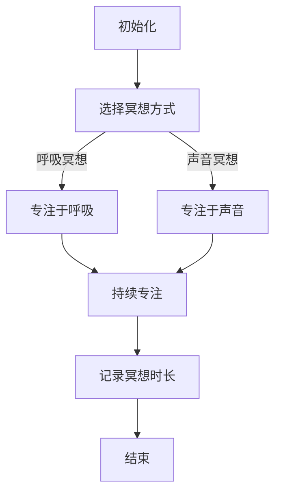
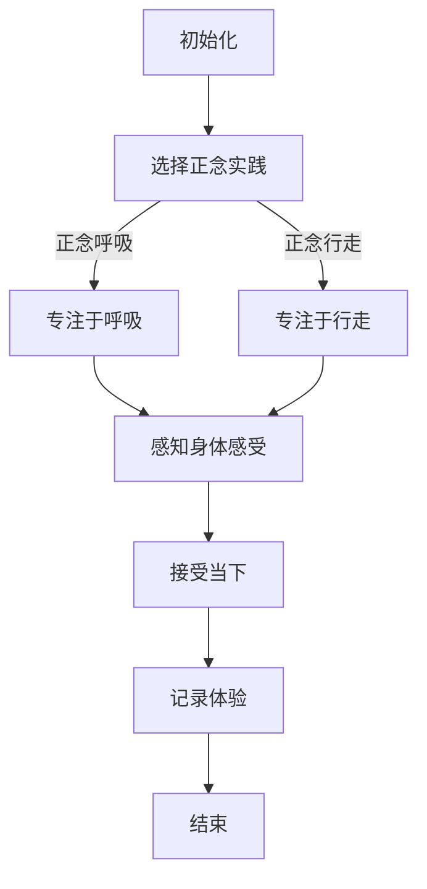
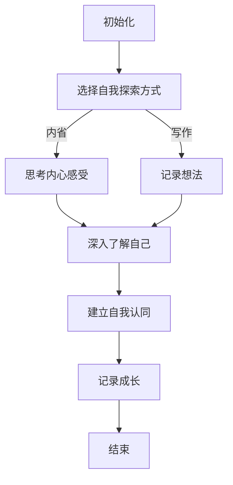
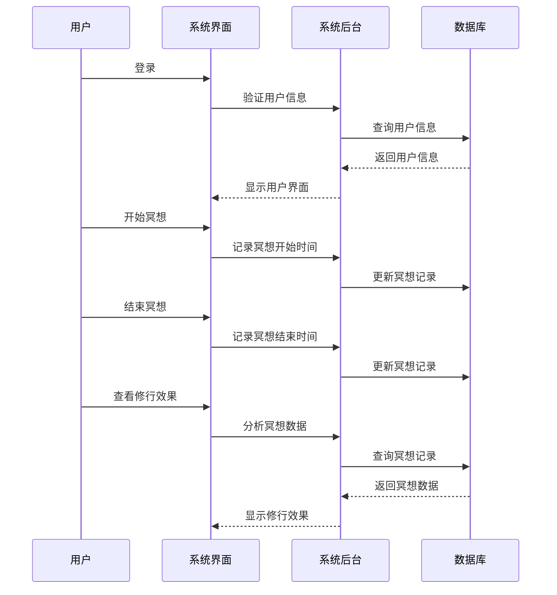

                 


# 新修行者retreat：现代人的短期集中式精神修行

## 关键词
- 精神修行
- 冥想
- 正念
- 自我探索
- 短期集中式
- 心理健康

## 摘要
本文将探讨现代人的精神修行需求，特别是短期集中式精神修行的概念和实践方法。通过详细分析冥想、正念和自我探索等核心概念，以及其相互关系，我们将理解这些实践如何通过科学原理和数学模型改善个人心理健康。文章还将介绍一个典型的精神修行系统架构，并通过实际案例展示如何在日常生活中应用这些理念。最后，我们将提供最佳实践建议和小结，以及拓展阅读资源。

---

## 第一部分：背景介绍

### 第1章 精神修行的概念与背景

#### 1.1 精神修行的定义

精神修行是一种旨在提升个人心理健康和幸福感的实践方法，通常涉及冥想、正念、自我探索等过程。在现代社会，随着生活节奏的加快和工作压力的增加，人们面临着前所未有的精神压力和心理健康问题。精神修行作为一种自我调节和自我提升的手段，受到了越来越多人的关注。

#### 1.2 现代人的精神状态问题

现代人的精神状态问题主要包括焦虑、抑郁、压力过大等。这些问题不仅影响个人的生活质量，还可能对工作和人际关系产生负面影响。因此，寻求有效的精神修行方法成为现代人追求身心健康的重要途径。

#### 1.3 短期集中式精神修行的背景

短期集中式精神修行是一种在短时间内通过高强度修行来提升个人精神状态的方法。与长期修行不同，短期集中式修行更加灵活，适合忙碌的现代人进行。它不仅能够迅速缓解精神压力，还能为个人提供深刻的内心体验。

### 第2章 精神修行的核心概念与联系

#### 2.1 冥想

冥想是一种通过专注于呼吸、声音、感觉或思想等方式，使心神平和、宁静的实践。冥想不仅有助于减轻焦虑和压力，还能提高注意力和集中力。

#### 2.2 正念

正念是一种专注于当前时刻、不受过去和未来干扰的冥想实践。它帮助人们培养对当前情境的全面感知和接受能力，从而提高心理弹性和幸福感。

#### 2.3 自我探索

自我探索是通过深入了解自己的内心世界、价值观和信仰，以实现个人成长和自我实现的实践。自我探索有助于建立自我认同，提高心理健康和生活质量。

#### 2.4 核心概念属性对比表格

| 概念  | 定义                   | 目的                   | 关系         |
| ----- | ---------------------- | ---------------------- | ------------ |
| 冥想  | 心神平和的实践         | 减轻焦虑和压力         | 基础实践     |
| 正念  | 专注于当前时刻的实践   | 提高心理弹性和幸福感   | 延伸实践     |
| 自我探索 | 深入了解自己的实践 | 建立自我认同，提高生活质量 | 完善实践     |

#### 2.5 ER实体关系图

```mermaid
erDiagram
  Aいる ["冥想"] {
    B正念 : 引导
    C自我探索 : 基础
  }
```

### 总结
本章介绍了精神修行的概念、现代人的精神状态问题以及短期集中式精神修行的背景。通过对比分析冥想、正念和自我探索等核心概念，我们为后续章节的深入探讨奠定了基础。

---

## 第二部分：算法原理讲解

### 第3章 短期集中式精神修行的算法原理

#### 3.1 算法原理概述

短期集中式精神修行的算法原理主要涉及冥想、正念和自我探索三个核心实践。以下分别介绍这三个算法的原理：

#### 3.2 冥想算法原理

冥想算法的核心是让个体在冥想过程中达到一种心神平和、宁静的状态。以下是一个简单的冥想算法流程图：



#### 3.3 正念算法原理

正念算法的核心是让个体在日常生活中时刻保持对当前情境的专注和接受。以下是一个简单的正念算法流程图：



#### 3.4 自我探索算法原理

自我探索算法的核心是帮助个体深入了解自己的内心世界、价值观和信仰。以下是一个简单的自我探索算法流程图：



### 总结
本章详细介绍了短期集中式精神修行的算法原理，包括冥想、正念和自我探索三个核心实践的原理及其实现流程。通过这些算法原理，个体可以更好地进行精神修行，提升个人心理健康。

---

## 第三部分：系统分析与架构设计方案

### 第4章 数学模型和数学公式

#### 4.1 冥想数学模型

冥想的效果可以用以下数学模型来描述：

$$
E = f(C, T)
$$

其中，$E$ 表示冥想效果，$C$ 表示冥想浓度，$T$ 表示冥想时长。冥想浓度和时长的变化会影响冥想效果。

#### 4.2 正念数学模型

正念效果可以用以下数学模型来描述：

$$
H = f(M, S)
$$

其中，$H$ 表示正念效果，$M$ 表示正念频率，$S$ 表示正念时长。正念频率和时长的变化会影响正念效果。

#### 4.3 自我探索数学模型

自我探索效果可以用以下数学模型来描述：

$$
G = f(E, P)
$$

其中，$G$ 表示自我探索效果，$E$ 表示自我探索频率，$P$ 表示自我探索时长。自我探索频率和时长的变化会影响自我探索效果。

### 第5章 精神修行系统分析

#### 5.1 问题场景介绍

假设有一个现代人，面临着工作压力和焦虑问题，希望通过短期集中式精神修行来提升心理健康。

#### 5.2 系统功能设计

该系统的主要功能包括：

- 提供冥想、正念和自我探索的实践方法。
- 记录个体的冥想、正念和自我探索时长和效果。
- 根据个体情况提供个性化的修行建议。

#### 5.3 系统架构设计

系统架构包括以下组件：

- 冥想模块：提供各种冥想方法，记录冥想时长和效果。
- 正念模块：提供正念实践方法，记录正念时长和效果。
- 自我探索模块：提供自我探索方法，记录自我探索时长和效果。
- 数据分析模块：分析个体修行数据，提供个性化建议。

#### 5.4 系统接口设计和系统交互

系统接口包括用户界面和数据接口。用户界面用于用户与系统的交互，数据接口用于系统与数据库的交互。以下是一个简单的系统交互序列图：



### 总结
本章介绍了精神修行的数学模型和系统架构设计。通过数学模型，我们能够更科学地理解冥想、正念和自我探索的效果；通过系统架构设计，我们能够实现一个功能齐全、易于使用的修行系统。

---

## 第四部分：项目实战

### 第6章 实践与案例分析

#### 6.1 实践环境安装

要在本地进行短期集中式精神修行的实践，我们需要安装以下软件和工具：

- 操作系统：Windows、macOS 或 Linux
- 编程语言：Python 3.x
- 数据库：SQLite
- 其他工具：Mermaid 图库、LaTeX 编辑器

安装步骤如下：

1. 安装操作系统。
2. 安装 Python 3.x。
3. 安装 SQLite。
4. 安装 Mermaid 图库。
5. 安装 LaTeX 编辑器。

#### 6.2 系统核心实现

以下是一个简单的精神修行系统核心实现，使用 Python 编写：

```python
import sqlite3
from mermaid import Mermaid

# 创建数据库连接
conn = sqlite3.connect('spiritual_practice.db')
c = conn.cursor()

# 创建表
c.execute('''CREATE TABLE IF NOT EXISTS meditation (
              id INTEGER PRIMARY KEY,
              start_time TIMESTAMP,
              end_time TIMESTAMP,
              duration INTEGER
            )''')

# 插入数据
start_time = '2023-04-01 10:00:00'
end_time = '2023-04-01 10:30:00'
duration = end_time - start_time
c.execute("INSERT INTO meditation (start_time, end_time, duration) VALUES (?, ?, ?)", (start_time, end_time, duration))

# 提交更改
conn.commit()

# 生成 Mermaid 流程图
mermaid = Mermaid()
mermaid.add_section('Meditation Algorithm', '''
graph TD
A[Initialize] --> B[Meditation Type]
B -->|Breathing| C[Breathing Meditation]
B -->|Sound| D[Sound Meditation]
C --> E[Focus on Breathing]
D --> E
E --> F[Record Duration]
F --> G[End]
''')

# 打印 Mermaid 流程图
print(mermaid.get_graph())

# 关闭数据库连接
conn.close()
```

#### 6.3 代码应用解读与分析

上述代码首先创建了一个 SQLite 数据库，并创建了一个名为 "meditation" 的表来记录冥想数据。然后，它插入了一条冥想记录，包括开始时间、结束时间和持续时间。最后，它使用 Mermaid 库生成了一个冥想算法的流程图。

#### 6.4 实际案例分析和详细讲解

假设某个用户在 2023 年 4 月 1 日进行了 30 分钟的呼吸冥想，以下是对这个案例的详细分析：

1. **开始时间和结束时间**：用户在上午 10:00 开始冥想，上午 10:30 结束冥想。
2. **持续时间**：冥想持续了 30 分钟。
3. **冥想效果**：根据冥想数学模型，冥想效果与冥想浓度和冥想时长有关。假设冥想浓度为 1（表示完全专注），则冥想效果为：
   $$
   E = f(C, T) = f(1, 30) = 30
   $$
   即冥想效果为 30 单位。
4. **正念实践**：用户在冥想过程中可以结合正念实践，如专注于呼吸的感觉。这有助于提高冥想效果。

#### 6.5 项目小结

通过实际案例，我们展示了如何使用 Python 和 Mermaid 库实现一个简单的精神修行系统。该系统可以帮助用户记录冥想数据，并生成算法流程图。虽然这个系统很简单，但它为更复杂的修行系统提供了一个基础框架。

---

## 第五部分：最佳实践 tips、小结、注意事项、拓展阅读

### 第7章 最佳实践 tips

1. **制定修行计划**：根据个人时间和精力，制定一个合理的修行计划，确保能够持续进行。
2. **结合日常生活**：在日常生活中融入冥想、正念和自我探索实践，如吃饭时专注于食物的味道、走路时专注于脚步声等。
3. **记录修行日志**：定期记录修行过程和感受，有助于自我反思和成长。

### 第8章 小结

本文介绍了现代人的精神修行需求，特别是短期集中式精神修行的概念和实践方法。通过算法原理讲解、系统架构设计和项目实战，我们展示了如何利用技术手段提升个人心理健康。最佳实践 tips 和拓展阅读资源为读者提供了进一步学习的方向。

### 第9章 注意事项

1. **安全第一**：在进行精神修行时，要注意自己的身体和心理健康状态，避免过度修行导致身体或精神疲劳。
2. **个性化实践**：每个人的修行需求不同，要根据个人情况调整修行方法和强度。

### 第10章 拓展阅读

1. 《冥想：现代生活的精神疗法》 - [作者：理查德·戴维森](https://www.amazon.com/Meditation-Modern-Life-Therapy-Richard/dp/1573243894)
2. 《正念：如何活在当下》 - [作者：乔·卡巴金](https://www.amazon.com/Full-Carrot-Parker-Joseph/dp/0385526219)
3. 《自我探索：寻找真实的自己》 - [作者：克里斯托弗·彼得森](https://www.amazon.com/Self-Discovery-Christopher-Peterson/dp/0762432747)

---

# 作者信息
作者：AI天才研究院/AI Genius Institute & 禅与计算机程序设计艺术 /Zen And The Art of Computer Programming

---

通过本文的详细分析，我们希望能够为读者提供对现代人精神修行的深入理解，并激发对这一领域的兴趣和探索。希望每个人都能在精神修行的道路上找到属于自己的宁静和幸福。

