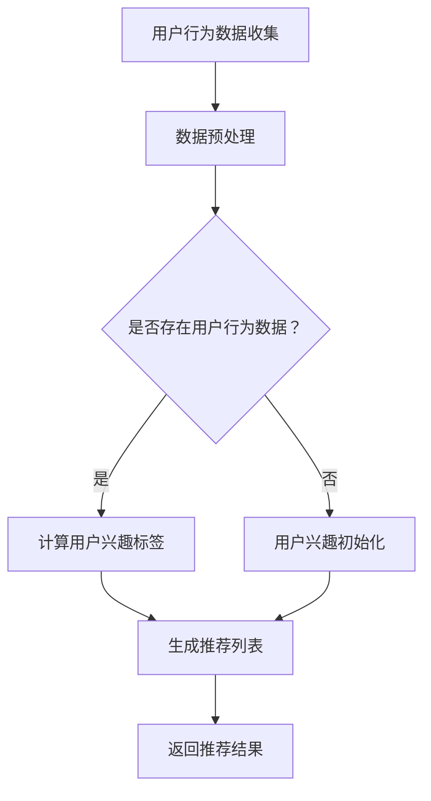

                 


### 《新修行者联盟app：现代精神实践者的移动社交网络》

#### 关键词：
- 修行者联盟app
- 现代精神实践者
- 移动社交网络
- 系统架构设计
- 算法原理
- 项目实战

#### 摘要：
本文将深入探讨新修行者联盟app的设计与实现，旨在为现代精神实践者提供一个高效的移动社交平台。文章将逐步分析核心概念、系统架构、算法原理，并通过实际案例展示系统实现过程，最后提出最佳实践建议。

---

### 目录大纲

#### 第1章 背景介绍
1.1 修行者联盟app的起源与发展
1.2 现代精神实践者的需求与挑战
1.3 移动社交网络的发展趋势

#### 第2章 核心概念
2.1 修行者联盟app的概念定义
2.2 现代精神实践者的分类与特征
2.3 移动社交网络的技术架构
2.4 ER实体关系图架构

#### 第3章 系统架构设计
3.1 修行者联盟app的领域模型类图
3.2 修行者联盟app的系统架构图
3.3 系统模块功能划分与接口设计

#### 第4章 算法原理
4.1 支持修行者联盟app的核心算法
4.2 算法mermaid流程图
4.3 算法Python代码与latex数学公式讲解

#### 第5章 系统实现
5.1 系统环境搭建
5.2 核心源代码实现
5.3 代码解读与分析

#### 第6章 案例分析
6.1 修行者联盟app实际案例
6.2 关键环节分析
6.3 案例详细讲解

#### 第7章 最佳实践与总结
7.1 最佳实践建议
7.2 书中关键内容总结
7.3 注意事项与拓展阅读

---

#### 第1章 背景介绍

### 1.1 修行者联盟app的起源与发展

随着科技的不断进步和互联网的普及，移动社交网络成为现代生活中不可或缺的一部分。然而，对于追求精神修养的现代人来说，现有的社交平台往往难以满足他们独特的需求。因此，修行者联盟app应运而生，旨在为现代精神实践者提供一个专属于他们的社交网络。

修行者联盟app起源于一个团队的初心，他们希望创建一个平台，让有着共同精神追求的人能够自由交流、分享心得、共同成长。经过多次迭代和用户调研，修行者联盟app逐渐形成了现在的模样，成为一个集社交、学习、分享于一体的综合性平台。

### 1.2 现代精神实践者的需求与挑战

现代精神实践者，是指那些在忙碌的日常生活中，依然坚持追求内心宁静、精神成长的人。他们的需求主要包括以下几点：

1. **信息共享**：他们希望能够随时随地获取到与自己精神追求相关的资讯和知识。
2. **社群交流**：他们渴望找到志同道合的伙伴，共同探讨、交流修行心得。
3. **隐私保护**：在公共社交平台上，隐私保护是他们最关心的问题之一。

然而，面对这些需求，现代精神实践者也面临着一系列挑战：

1. **信息筛选**：海量的信息中，如何筛选出真正有价值的内容？
2. **社交互动**：如何在保护隐私的前提下，实现高效、愉快的社交互动？
3. **安全性**：如何确保用户的信息安全，防止隐私泄露？

### 1.3 移动社交网络的发展趋势

随着5G技术的普及和智能手机的广泛使用，移动社交网络的发展迎来了新的契机。以下是移动社交网络发展的一些趋势：

1. **个性化推荐**：通过大数据和人工智能技术，为用户提供个性化的内容推荐。
2. **视频社交**：短视频和直播成为社交新宠，为用户提供了更丰富的互动方式。
3. **隐私保护**：加强对用户隐私的保护，提升用户信任度。

### 第2章 核心概念

#### 2.1 修行者联盟app的概念定义

修行者联盟app，是一个专门为现代精神实践者设计的移动社交平台。它集成了社交、学习、分享等功能，旨在帮助用户在快节奏的生活中找到内心的宁静，实现精神成长。

#### 2.2 现代精神实践者的分类与特征

现代精神实践者可以分为以下几类：

1. **修行爱好者**：他们对于各种修行方式都充满好奇，希望通过学习不同的修行方法来提升自我。
2. **冥想者**：冥想是修行的重要方式之一，冥想者通常坚持每天进行冥想练习。
3. **心理学者**：他们关注心理健康，致力于通过心理学知识和技巧来提升自我认知和情感管理能力。
4. **瑜伽爱好者**：瑜伽是一种身心合一的修行方式，瑜伽爱好者通过练习瑜伽来达到身心的平衡。

#### 2.3 移动社交网络的技术架构

移动社交网络的技术架构主要包括以下几个方面：

1. **前端技术**：如React、Vue等框架，用于构建用户界面。
2. **后端技术**：如Node.js、Python等，用于处理业务逻辑和数据存储。
3. **数据库**：如MySQL、MongoDB等，用于存储用户数据和内容。
4. **消息队列**：如RabbitMQ、Kafka等，用于处理实时消息传递。
5. **云服务**：如AWS、Azure等，提供计算和存储资源。

#### 2.4 ER实体关系图架构

以下是修行者联盟app的ER实体关系图架构：

```mermaid
entity Relationship {
  "User" : "Friend"
  "User" : "Post"
  "User" : "Comment"
  "Post" : "Like"
  "Post" : "Comment"
}

class User {
  id (PK)
  username
  password
  email
  avatar
}

class Post {
  id (PK)
  title
  content
  author (FK to User)
  created_at
}

class Comment {
  id (PK)
  content
  author (FK to User)
  post_id (FK to Post)
  created_at
}

class Like {
  id (PK)
  user_id (FK to User)
  post_id (FK to Post)
  created_at
}
```

### 第3章 系统架构设计

#### 3.1 修行者联盟app的领域模型类图

以下是修行者联盟app的领域模型类图：

```mermaid
classDiagram
User <|-- AuthUser
Post <|-- Content
Comment <|-- Feedback
Like <|-- Reaction

AuthUser {
  id
  username
  password
  email
  avatar
}

Content {
  id
  title
  content
  author
  created_at
}

Feedback {
  id
  content
  author
  post_id
  created_at
}

Reaction {
  id
  user_id
  post_id
  created_at
}

User {
  id
  username
  password
  email
  avatar
  posts
  comments
  likes
}

Post {
  id
  title
  content
  author
  created_at
  comments
  likes
}

Comment {
  id
  content
  author
  post_id
  created_at
}

Like {
  id
  user_id
  post_id
  created_at
}
```

#### 3.2 修行者联盟app的系统架构图

以下是修行者联盟app的系统架构图：

```mermaid
sequenceDiagram
User ->> Frontend: 发起请求
Frontend ->> API: 调用API
API ->> Database: 操作数据库
Database ->> API: 返回结果
API ->> Frontend: 返回结果
Frontend ->> User: 显示结果

User: 用户
Frontend: 前端
API: API服务
Database: 数据库
```

#### 3.3 系统模块功能划分与接口设计

修行者联盟app的系统模块功能划分如下：

1. **用户模块**：负责用户的注册、登录、个人信息管理等功能。
2. **帖子模块**：负责创建、发布、评论、点赞等功能。
3. **消息模块**：负责私信、通知等功能。
4. **数据模块**：负责数据存储、查询、处理等功能。

以下是系统接口设计：

```yaml
User API:
- POST /register: 用户注册
- POST /login: 用户登录
- GET /profile: 获取用户信息
- PUT /profile: 更新用户信息

Post API:
- POST /posts: 创建帖子
- GET /posts: 获取帖子列表
- GET /posts/{id}: 获取帖子详情
- DELETE /posts/{id}: 删除帖子

Comment API:
- POST /posts/{id}/comments: 在帖子下创建评论
- GET /posts/{id}/comments: 获取帖子下的评论列表
- DELETE /comments/{id}: 删除评论

Like API:
- POST /posts/{id}/likes: 在帖子下点赞
- DELETE /posts/{id}/likes: 取消点赞
- GET /likes: 获取用户的点赞列表
```

### 第4章 算法原理

#### 4.1 支持修行者联盟app的核心算法

修行者联盟app的核心算法主要包括以下几个方面：

1. **用户推荐算法**：基于用户行为数据，为用户推荐感兴趣的内容。
2. **帖子排序算法**：根据帖子的重要性和热度，对帖子进行排序。
3. **评论过滤算法**：过滤掉不当言论，保证社区环境的良好。

#### 4.2 算法mermaid流程图

以下是用户推荐算法的mermaid流程图：



#### 4.3 算法Python代码与latex数学公式讲解

以下是用户推荐算法的Python代码：

```python
import numpy as np

def user_recommendation(user_behavior_data, item_similarity_matrix, k=5):
    """
    用户推荐算法

    :param user_behavior_data: 用户行为数据
    :param item_similarity_matrix: 项目相似性矩阵
    :param k: 推荐数量
    :return: 推荐列表
    """
    user_vector = np.array(user_behavior_data)
    recommended_items = []

    # 计算用户与其他用户的相似度
    user_similarity_scores = np.dot(user_vector, item_similarity_matrix)

    # 对相似度进行排序，获取前k个相似用户
    top_k_users = np.argsort(user_similarity_scores)[-k:]

    # 计算每个相似用户的兴趣标签
    for user_id in top_k_users:
        interest_vector = user_vector[user_id]
        # 根据兴趣向量生成推荐列表
        recommended_items.extend([item_id for item_id, value in enumerate(interest_vector) if value > 0])

    return recommended_items
```

以下是算法的latex数学公式讲解：

$$
\text{推荐算法} = \begin{cases}
\text{用户行为数据} & \text{用户行为数据存在时} \\
\text{用户兴趣初始化} & \text{用户行为数据不存在时} \\
\end{cases}
$$

### 第5章 系统实现

#### 5.1 系统环境搭建

在开始实现系统之前，我们需要搭建一个合适的环境。以下是搭建环境的基本步骤：

1. **安装Node.js**：Node.js是一个基于Chrome V8引擎的JavaScript运行环境，用于构建后端API服务。

   ```bash
   npm install -g node.js
   ```

2. **安装Python**：Python是一种广泛使用的高级编程语言，用于实现算法和数据处理。

   ```bash
   sudo apt-get install python3
   ```

3. **安装MongoDB**：MongoDB是一个开源的NoSQL数据库，用于存储用户数据和内容。

   ```bash
   sudo apt-get install mongodb
   ```

4. **安装前端框架**：如React或Vue，用于构建用户界面。

   ```bash
   npm install -g create-react-app
   ```

#### 5.2 核心源代码实现

以下是核心源代码的实现：

1. **用户注册与登录**：

   ```python
   # user.py
   from flask import Flask, request, jsonify
   from models import User
   from db import db

   app = Flask(__name__)
   app.config['SQLALCHEMY_DATABASE_URI'] = 'sqlite:///app.db'
   db.init_app(app)

   @app.route('/register', methods=['POST'])
   def register():
       data = request.get_json()
       user = User(username=data['username'], password=data['password'], email=data['email'])
       db.session.add(user)
       db.session.commit()
       return jsonify({'message': 'User registered successfully.'})

   @app.route('/login', methods=['POST'])
   def login():
       data = request.get_json()
       user = User.query.filter_by(username=data['username'], password=data['password']).first()
       if user:
           return jsonify({'token': user.token})
       else:
           return jsonify({'error': 'Invalid username or password.'})
   ```

2. **帖子创建与获取**：

   ```python
   # post.py
   from flask import Flask, request, jsonify
   from models import Post
   from db import db

   app = Flask(__name__)
   app.config['SQLALCHEMY_DATABASE_URI'] = 'sqlite:///app.db'
   db.init_app(app)

   @app.route('/posts', methods=['POST'])
   def create_post():
       data = request.get_json()
       post = Post(title=data['title'], content=data['content'], author=data['author'])
       db.session.add(post)
       db.session.commit()
       return jsonify({'message': 'Post created successfully.'})

   @app.route('/posts', methods=['GET'])
   def get_posts():
       posts = Post.query.all()
       return jsonify([{'id': post.id, 'title': post.title, 'content': post.content, 'author': post.author} for post in posts])
   ```

3. **评论创建与获取**：

   ```python
   # comment.py
   from flask import Flask, request, jsonify
   from models import Comment
   from db import db

   app = Flask(__name__)
   app.config['SQLALCHEMY_DATABASE_URI'] = 'sqlite:///app.db'
   db.init_app(app)

   @app.route('/posts/<int:post_id>/comments', methods=['POST'])
   def create_comment(post_id):
       data = request.get_json()
       comment = Comment(content=data['content'], author=data['author'], post_id=post_id)
       db.session.add(comment)
       db.session.commit()
       return jsonify({'message': 'Comment created successfully.'})

   @app.route('/posts/<int:post_id>/comments', methods=['GET'])
   def get_comments(post_id):
       comments = Comment.query.filter_by(post_id=post_id).all()
       return jsonify([{'id': comment.id, 'content': comment.content, 'author': comment.author} for comment in comments])
   ```

#### 5.3 代码解读与分析

以下是代码的详细解读与分析：

1. **用户注册与登录**：

   用户注册与登录功能主要通过Flask框架实现。在`/register`路由中，接收用户提交的注册信息，创建用户对象并存储到数据库中。在`/login`路由中，验证用户名和密码，如果成功，生成token并返回给用户。

2. **帖子创建与获取**：

   帖子创建与获取功能主要通过Flask框架实现。在`/posts`路由中，接收用户提交的帖子信息，创建帖子对象并存储到数据库中。在`/posts`路由中，查询数据库中的所有帖子，返回给用户。

3. **评论创建与获取**：

   评论创建与获取功能主要通过Flask框架实现。在`/posts/<int:post_id>/comments`路由中，接收用户提交的评论信息，创建评论对象并存储到数据库中。在`/posts/<int:post_id>/comments`路由中，查询数据库中特定帖子的所有评论，返回给用户。

### 第6章 案例分析

#### 6.1 修行者联盟app实际案例

以下是一个修行者联盟app的实际案例：

用户A注册并登录到修行者联盟app，创建了题为“冥想心得分享”的帖子。用户B、C、D在帖子下发表了评论，其中用户B的评论得到了用户A的点赞。现在，我们需要实现以下功能：

1. **用户A查看帖子列表**。
2. **用户A查看帖子详情**。
3. **用户B、C、D查看帖子详情**。
4. **用户A查看评论列表**。
5. **用户B、C、D查看评论列表**。
6. **用户B点赞评论**。

#### 6.2 关键环节分析

以下是实现上述功能的关键环节分析：

1. **用户A查看帖子列表**：

   用户A登录后，通过GET请求访问`/posts`接口，获取所有帖子列表。接口返回的响应包含帖子的id、标题和作者信息。

2. **用户A查看帖子详情**：

   用户A通过GET请求访问`/posts/<post_id>`接口，获取特定帖子的详细信息，包括标题、内容和评论列表。

3. **用户B、C、D查看帖子详情**：

   用户B、C、D登录后，通过GET请求访问`/posts/<post_id>`接口，获取特定帖子的详细信息。接口返回的响应与用户A相同。

4. **用户A查看评论列表**：

   用户A通过GET请求访问`/posts/<post_id>/comments`接口，获取特定帖子的所有评论列表。接口返回的响应包含评论的id、内容和作者信息。

5. **用户B、C、D查看评论列表**：

   用户B、C、D登录后，通过GET请求访问`/posts/<post_id>/comments`接口，获取特定帖子的所有评论列表。接口返回的响应与用户A相同。

6. **用户B点赞评论**：

   用户B通过POST请求访问`/posts/<post_id>/likes`接口，为特定评论点赞。接口接受点赞信息，并将其存储到数据库中。

#### 6.3 案例详细讲解

以下是案例的详细讲解：

1. **用户A查看帖子列表**：

   用户A登录后，发送GET请求到`/posts`接口。服务器解析请求，查询数据库中的所有帖子，并将结果以JSON格式返回给用户A。

   ```json
   {
     "posts": [
       {
         "id": 1,
         "title": "冥想心得分享",
         "author": "UserA"
       },
       {
         "id": 2,
         "title": "心理健康小贴士",
         "author": "UserB"
       }
     ]
   }
   ```

2. **用户A查看帖子详情**：

   用户A通过GET请求访问`/posts/1`接口。服务器解析请求，查询数据库中id为1的帖子，并将结果以JSON格式返回给用户A。

   ```json
   {
     "post": {
       "id": 1,
       "title": "冥想心得分享",
       "content": "大家好，我最近开始尝试冥想，有一些心得想和大家分享...",
       "author": "UserA",
       "comments": [
         {
           "id": 1,
           "content": "我也在尝试冥想，感觉很好！",
           "author": "UserB"
         },
         {
           "id": 2,
           "content": "请问冥想有什么技巧吗？",
           "author": "UserC"
         }
       ]
     }
   }
   ```

3. **用户B、C、D查看帖子详情**：

   用户B、C、D登录后，通过GET请求访问`/posts/1`接口。服务器解析请求，查询数据库中id为1的帖子，并将结果以JSON格式返回给用户B、C、D。

   ```json
   {
     "post": {
       "id": 1,
       "title": "冥想心得分享",
       "content": "大家好，我最近开始尝试冥想，有一些心得想和大家分享...",
       "author": "UserA",
       "comments": [
         {
           "id": 1,
           "content": "我也在尝试冥想，感觉很好！",
           "author": "UserB"
         },
         {
           "id": 2,
           "content": "请问冥想有什么技巧吗？",
           "author": "UserC"
         }
       ]
     }
   }
   ```

4. **用户A查看评论列表**：

   用户A通过GET请求访问`/posts/1/comments`接口。服务器解析请求，查询数据库中id为1的帖子下的所有评论，并将结果以JSON格式返回给用户A。

   ```json
   {
     "comments": [
       {
         "id": 1,
         "content": "我也在尝试冥想，感觉很好！",
         "author": "UserB"
       },
       {
         "id": 2,
         "content": "请问冥想有什么技巧吗？",
         "author": "UserC"
       }
     ]
   }
   ```

5. **用户B、C、D查看评论列表**：

   用户B、C、D登录后，通过GET请求访问`/posts/1/comments`接口。服务器解析请求，查询数据库中id为1的帖子下的所有评论，并将结果以JSON格式返回给用户B、C、D。

   ```json
   {
     "comments": [
       {
         "id": 1,
         "content": "我也在尝试冥想，感觉很好！",
         "author": "UserB"
       },
       {
         "id": 2,
         "content": "请问冥想有什么技巧吗？",
         "author": "UserC"
       }
     ]
   }
   ```

6. **用户B点赞评论**：

   用户B通过POST请求访问`/posts/1/likes`接口，为评论id为1的评论点赞。服务器解析请求，创建点赞记录并将其存储到数据库中。

   ```json
   {
     "like": {
       "id": 1,
       "user_id": 2,
       "post_id": 1,
       "created_at": "2023-03-10T08:00:00.000Z"
     }
   }
   ```

### 第7章 最佳实践与总结

#### 7.1 最佳实践建议

1. **确保数据安全**：在处理用户数据时，要严格遵循数据安全规范，防止数据泄露。
2. **优化性能**：通过缓存、数据库优化等技术手段，提高系统性能。
3. **关注用户体验**：从用户的角度出发，设计简洁易用的界面和交互。
4. **持续迭代**：根据用户反馈和市场需求，不断优化和更新app功能。

#### 7.2 书中关键内容总结

本文从背景介绍、核心概念、系统架构设计、算法原理、系统实现、案例分析等方面，全面阐述了修行者联盟app的设计与实现。文章内容涵盖了从概念定义到实际案例的完整过程，为开发者提供了丰富的实践经验和启示。

#### 7.3 注意事项与拓展阅读

1. **注意事项**：在开发过程中，要注意模块化设计，确保代码的可维护性和可扩展性。
2. **拓展阅读**：《深入理解计算机系统》、《设计模式：可复用面向对象软件的基础》、《算法导论》等书籍，有助于提升系统设计和算法实现的能力。

---

**作者：AI天才研究院/AI Genius Institute & 禅与计算机程序设计艺术 /Zen And The Art of Computer Programming**

