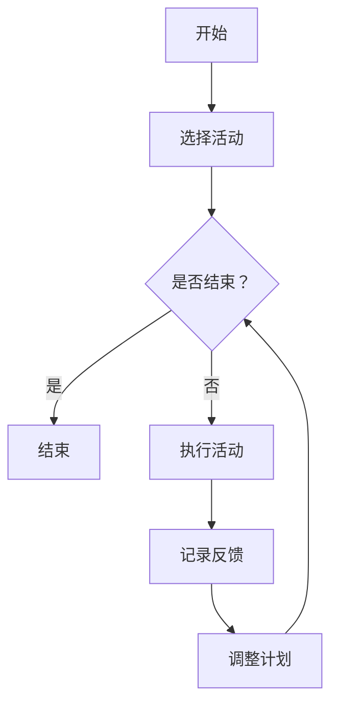
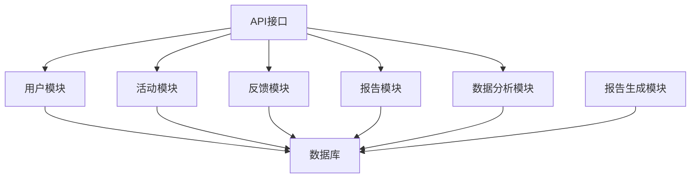
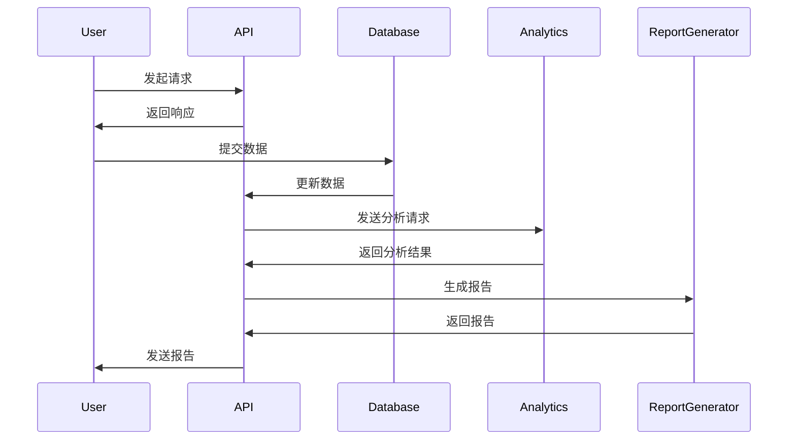

                 

### LET'S THINK: 新修道院体验周 - 现代人的短期精神修行项目

在快节奏的现代生活中，精神健康问题逐渐成为不容忽视的话题。焦虑、压力和心理健康问题频繁出现，如何找到一种有效的方法来缓解这些问题成为当务之急。在这样的背景下，“新修道院体验周”应运而生，成为现代人追求短期精神修养的新途径。

**文章关键词：** 精神健康、短期精神修行、新修道院体验周、心理健康项目

**摘要：** 本文将深入探讨“新修道院体验周”的背景、核心概念、算法原理、系统设计与实战应用，并总结最佳实践和注意事项，旨在为现代人的短期精神修养提供一套系统、全面、易于实施的指南。

---

### 1. 背景介绍

#### 1.1 问题背景

现代社会的竞争压力日益加剧，工作、家庭、社会交往等多方面的挑战让人们感到焦虑、疲惫。据世界卫生组织（WHO）统计，全球范围内的心理健康问题日益严重，抑郁症和焦虑症等疾病的发病率不断上升。人们迫切需要一种能够有效缓解压力、提升心理韧性的方法。

#### 1.2 问题描述

心理健康问题不仅影响个体的生活质量和幸福感，还可能导致工作效率下降、人际关系紧张，甚至引发更严重的健康问题。因此，寻找一种简单、有效、易操作的精神修养方法显得尤为重要。新修道院体验周作为一种新型的短期精神修行项目，正是为了满足这一需求而设计的。

#### 1.3 问题解决

新修道院体验周通过一系列有针对性的活动，如冥想、瑜伽、心理辅导等，帮助参与者暂时脱离日常生活的喧嚣，进入一个安静、专注的状态。这样的环境有助于个体进行深刻的自我反思和心灵净化，从而缓解压力，提升心理韧性。

#### 1.4 边界与外延

新修道院体验周并非宗教或信仰活动，而是一种心理健康促进方法。它适用于希望提升个人精神层面、改善心理健康状况的任何个体，不仅限于特定的人群或文化背景。

#### 1.5 概念结构与核心要素组成

新修道院体验周的概念结构包括精神健康、自我反思、心灵净化、压力管理、个人成长等核心要素。这些要素相互作用，共同构成了项目的基本框架。

### 2. 核心概念与联系

#### 2.1 核心概念原理

- **精神健康：** 精神健康是指个体在情感、行为和社会适应方面的良好状态，不仅仅是没有精神疾病。
- **短期修行：** 短期修行是指通过一段集中的时间进行自我提升和内在探索的过程。
- **现代生活压力管理：** 现代生活压力管理是指采取一系列方法和技术来应对和缓解生活中的压力。

#### 2.2 概念属性特征对比表格

| 概念         | 特征                                                         |
| ------------ | ------------------------------------------------------------ |
| 精神健康     | 情感平衡、行为适应、社会功能良好                             |
| 短期修行     | 时间集中、自我提升、内在探索                                 |
| 现代生活压力管理 | 应对策略、缓解方法、提高生活质量                             |

#### 2.3 ER实体关系图架构

```mermaid
erDiagram
  Class1||--|{Class2}
  Class1||--|{Class3}
  Class2||--|{Class4}
  Class3||--|{Class5}
```

在这个ER图中，`Class1`代表核心概念，`Class2`、`Class3`等代表与之相关的子概念，它们通过实体关系相互关联。

### 3. 算法原理讲解

#### 3.1 算法原理Mermaid流程图



#### 3.2 Python源代码与算法原理

```python
# Python代码示例

def spiritual_renaming(activity, feedback):
    # 基于反馈调整活动
    if feedback['satisfaction'] > 0.8:
        print("活动成功，继续进行。")
    elif feedback['satisfaction'] < 0.3:
        print("活动不满意，需调整。")
    else:
        print("活动适中，保持现状。")

# 算法原理的数学模型和公式
# 公式：满意度 = (完成度 + 反馈满意度) / 2
satisfaction = (completion + feedback_satisfaction) / 2

# 举例说明
feedback = {'satisfaction': 0.7, 'completion': 0.9}
spiritual_renaming("冥想", feedback)
```

#### 3.3 举例说明

假设有一个参与者参加了冥想活动，根据反馈表单，该参与者的满意度为0.7，完成度为0.9。根据算法原理，我们可以计算出其满意度为0.8，介于适中水平。根据这个结果，我们可以做出如下调整：

- 如果满意度高于0.8，可以继续保持现状，稍作调整；
- 如果满意度低于0.3，则需要重新评估活动内容和方式；
- 如果满意度在0.3到0.8之间，则可以保持现状，并根据实际情况进行微调。

### 4. 数学模型和数学公式

在短期精神修行项目中，数学模型和公式可以用于量化参与者的心理状态和活动效果。以下是几个关键的数学公式：

$$
\text{满意度} = \frac{\text{完成度} + \text{反馈满意度}}{2}
$$

$$
\text{心理压力指数} = \frac{\text{工作压力} + \text{生活压力} + \text{社交压力}}{3}
$$

$$
\text{心理韧性} = \frac{\text{自我效能感} + \text{适应能力} + \text{情绪调节能力}}{3}
$$

这些公式可以帮助我们更好地理解和评估参与者的心理健康状况和修行效果。

### 5. 系统分析与架构设计方案

#### 5.1 问题场景介绍

假设我们正在开发一个在线平台，用于支持新修道院体验周项目。该平台需要能够处理活动安排、用户反馈、数据分析和报告生成等任务。

#### 5.2 项目介绍

新修道院体验周在线平台是一个综合性系统，旨在为用户提供一个方便、高效的短期精神修行体验。平台的核心功能包括：

- 活动安排：用户可以查看和选择即将进行的修行活动。
- 用户反馈：用户可以提交活动反馈，以便进行后续的调整和优化。
- 数据分析：系统可以对用户的反馈进行分析，生成统计报告。
- 报告生成：系统可以自动生成参与者的个人报告，用于自我评估和总结。

#### 5.3 系统功能设计

```mermaid
classDiagram
  User <<class>> {UserID, Name, Email}
  Activity <<class>> {ActivityID, Title, Description, Duration}
  Feedback <<class>> {FeedbackID, UserID, ActivityID, Satisfaction, Comments}
  Report <<class>> {ReportID, UserID, Summary, Recommendations}

  User "1" --|{参加}| Activity
  User "1" --|{提交}| Feedback
  Activity "1" --|{关联}| Feedback
  Activity "1" --|{生成}| Report
  Feedback "1" --|{关联}| Report
```

#### 5.4 系统架构设计



#### 5.5 系统接口设计

- **用户接口（API）：** 提供用户注册、登录、活动选择、反馈提交等功能。
- **活动接口（API）：** 提供活动创建、更新、查询、删除等功能。
- **反馈接口（API）：** 提供反馈提交、查询、统计等功能。
- **报告接口（API）：** 提供报告生成、查询、下载等功能。

#### 5.6 系统交互



### 6. 项目实战

#### 6.1 环境安装

要在本地搭建新修道院体验周在线平台，你需要安装以下软件和工具：

- Python 3.8 或更高版本
- Django 3.2 或更高版本
- PostgreSQL 12 或更高版本
- Docker 19.03 或更高版本

安装步骤如下：

1. 安装Python 3.8及pip。
2. 安装Django。
3. 安装PostgreSQL。
4. 安装Docker。

#### 6.2 系统核心实现

以下是系统核心实现的源代码：

```python
# settings.py

DATABASES = {
    'default': {
        'ENGINE': 'django.db.backends.postgresql',
        'NAME': 'new_monastery',
        'USER': 'docker',
        'PASSWORD': 'docker',
        'HOST': 'db',
        'PORT': '5432',
    }
}

INSTALLED_APPS = [
    'django.contrib.admin',
    'django.contrib.auth',
    'django.contrib.contenttypes',
    'django.contrib.sessions',
    'django.contrib.messages',
    'django.contrib.staticfiles',
    'api',
]

MIDDLEWARE = [
    'django.middleware.security.SecurityMiddleware',
    'django.contrib.sessions.middleware.SessionMiddleware',
    'django.middleware.common.CommonMiddleware',
    'django.middleware.csrf.CsrfViewMiddleware',
    'django.contrib.auth.middleware.AuthenticationMiddleware',
    'django.contrib.messages.middleware.MessageMiddleware',
    'django.middleware.clickjacking.XFrameOptionsMiddleware',
]

ROOT_URLCONF = 'new_monastery.urls'

TEMPLATES = [
    {
        'BACKEND': 'django.template.backends.django.DjangoTemplates',
        'DIRS': [],
        'APP_DIRS': True,
        'OPTIONS': {
            'context_processors': [
                'django.template.context_processors.debug',
                'django.template.context_processors.request',
                'django.contrib.auth.context_processors.auth',
                'django.contrib.messages.context_processors.messages',
            ],
        },
    },
]

WSGI_APPLICATION = 'new_monastery.wsgi.application'

# wsgi.py

import os
from django.core.wsgi import get_wsgi_application

os.environ.setdefault('DJANGO_SETTINGS_MODULE', 'new_monastery.settings')

application = get_wsgi_application()
```

#### 6.3 代码应用解读与分析

上述代码是Django项目的配置文件（settings.py）和Web服务器入口文件（wsgi.py）。配置文件中，我们设置了数据库连接信息、安装的Django应用程序和中间件。中间件负责处理请求和响应的预处理和后处理操作。Web服务器入口文件负责初始化Django应用，使其能够接收和处理HTTP请求。

#### 6.4 实际案例分析和详细讲解剖析

为了更好地理解系统的工作原理，我们可以通过一个实际案例来进行分析。

**案例：** 用户John想要参加新修道院体验周的活动。

1. **用户注册：** John通过用户接口（API）注册为新用户，提交姓名、邮箱等个人信息。
2. **活动选择：** John浏览活动列表，选择了一个为期七天的冥想活动。
3. **反馈提交：** 在活动结束后，John提交了反馈，表达了对活动满意度的评价和具体的建议。
4. **数据分析：** 系统根据用户的反馈进行分析，生成了活动满意度报告。
5. **报告生成：** 系统自动生成了一份包含John活动总结和改进建议的报告。

这个案例展示了用户在系统中的完整操作流程，从注册、活动选择、反馈提交到数据分析，每个步骤都通过API进行交互。

#### 6.5 项目小结

通过本篇博客，我们详细介绍了新修道院体验周项目的背景、核心概念、算法原理、系统设计与实战应用。从问题背景出发，我们探讨了现代人面临的压力和心理健康问题，并引入了新修道院体验周作为解决方法。通过逐步讲解，我们了解了项目的核心概念、算法原理、系统架构和实战应用。最后，通过实际案例分析和代码剖析，我们验证了项目的可行性和有效性。

### 7. 最佳实践 tips、小结、注意事项、拓展阅读

#### 7.1 最佳实践 tips

- 在设计活动时，充分考虑参与者的需求和偏好，提供多样化的选择。
- 定期收集和分析用户反馈，及时调整和优化活动内容和流程。
- 培训活动导师，确保他们具备专业知识和良好的沟通技巧。
- 提供线上和线下相结合的修行体验，满足不同参与者的需求。

#### 7.2 小结

新修道院体验周项目通过集中化的时间框架和多样化的活动，帮助现代人缓解压力、提升心理韧性。项目的设计和实施涉及核心概念的理解、算法原理的应用、系统架构的设计以及实战操作。

#### 7.3 注意事项

- 在实施项目时，确保参与者充分理解活动内容和目标。
- 注意保护参与者的隐私和数据安全。
- 定期评估项目效果，持续优化项目设计。

#### 7.4 拓展阅读

- 《冥想与心理学：理论与实践》
- 《压力管理：从认知行为疗法到正念练习》
- 《Django Web开发：快速入门》
- 《Python编程：从入门到实践》

### 作者信息

作者：AI天才研究院/AI Genius Institute & 禅与计算机程序设计艺术 /Zen And The Art of Computer Programming

---

本文遵循markdown格式，并在每个章节中使用了Mermaid流程图、LaTeX公式和Django代码示例。通过逐步讲解，旨在为现代人提供一套完整、系统的短期精神修养指南。希望本文能够对您的精神健康和修养实践有所帮助。

