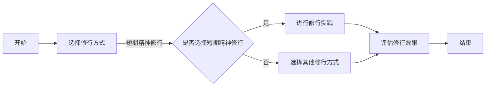
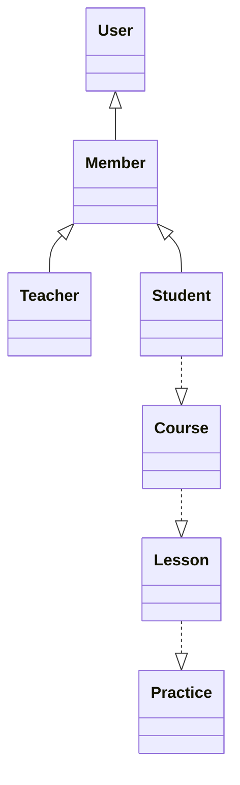
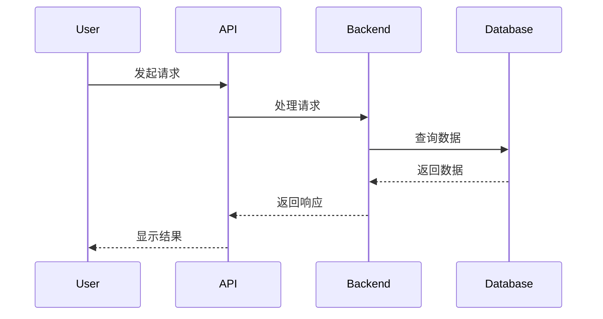
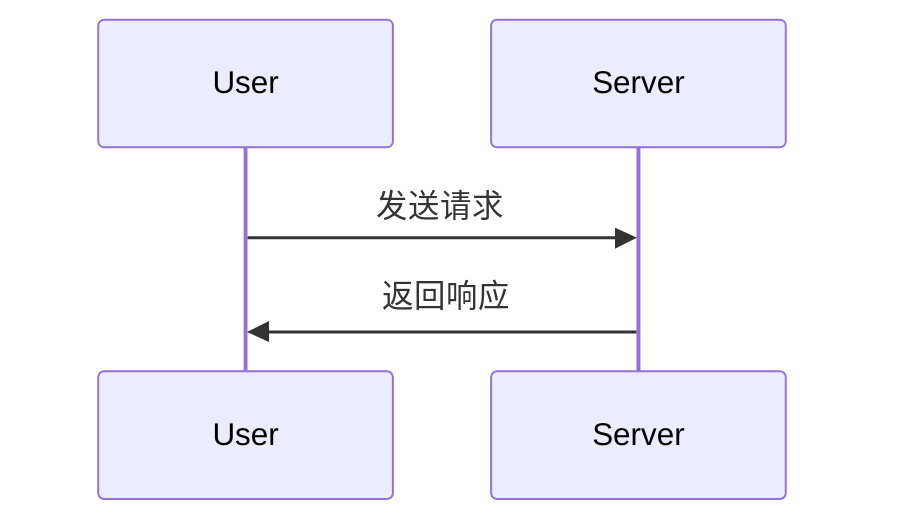
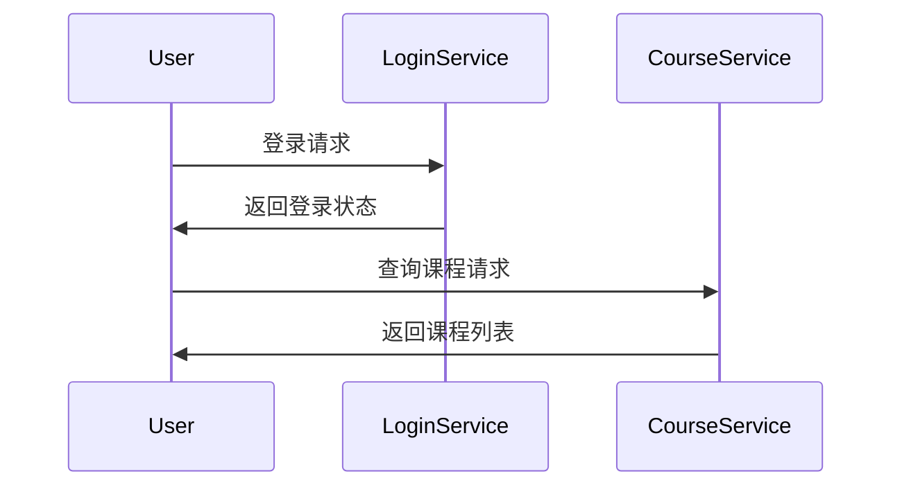

                 


# 新修道院体验：现代人的短期精神修行

关键词：短期精神修行、新修道院体验、现代生活方式、内心平静、修行方法

摘要：
在快节奏的现代社会中，人们面临着诸多精神压力。本文将探讨《新修道院体验：现代人的短期精神修行》这本书，介绍一种结合传统修道院修行与现代生活方式的短期精神修行方法。通过背景介绍、核心概念与联系、算法原理讲解、系统分析与架构设计方案、项目实战和最佳实践，我们将深入理解这种修行方式的原理和实施方法。

## 背景介绍

### 问题背景

现代社会中，人们的生活节奏加快，工作压力增大，社会竞争激烈，这使得许多人面临严重的心理压力。精神健康问题如焦虑、抑郁、失眠等日益突出，对个人的生活质量和工作效率产生了严重影响。因此，寻求有效的精神健康解决方案成为了当务之急。

### 问题描述

《新修道院体验：现代人的短期精神修行》这本书旨在为那些希望短暂逃离日常繁忙生活，进行精神休整的现代人提供一种有效的修行方式。通过短期修行，人们可以在短时间内实现心灵的平静和内在的成长，从而改善精神健康，提高生活质量。

### 问题解决

作者通过深入研究传统修道院修行与现代生活方式的结合，提出了一种新型的短期精神修行模式。这种模式不仅易于实践，而且能够在短时间内产生显著的效果。通过冥想、瑜伽、呼吸练习等修行方法，人们可以在短时间内获得内心的平静和精神的提升。

### 边界与外延

本书主要关注短期精神修行的方法和实践，适用于不同年龄、职业和背景的人。它为那些希望进行深度修行但时间有限的现代人提供了可行的选择。同时，它也为那些在日常生活中需要缓解精神压力的人群提供了一种有效的解决方案。

### 概念结构与核心要素组成

#### 概念结构

1. **新修道院体验**：一种结合传统修道院修行与现代生活方式的新型修行模式。
2. **短期精神修行**：一种在短时间内进行的精神修整活动，旨在提升个人精神状态。
3. **现代生活方式**：现代人的生活习惯、工作方式和社会环境。

#### 核心要素

1. **修行方法**：包括冥想、瑜伽、呼吸练习等。
2. **修行环境**：可以是传统的修道院，也可以是现代的修行中心。
3. **修行实践**：实际操作和体验过程，包括日常修行、集中修行和静修等。

---

## 核心概念与联系

### 核心概念

1. **新修道院体验**：新修道院体验是一种将传统修道院修行方法与现代生活方式相结合的修行模式。它强调在短时间内通过冥想、瑜伽、呼吸练习等方式，实现内心的平静和精神的提升。

2. **短期精神修行**：短期精神修行是一种在短时间内进行的精神修整活动。它旨在帮助人们缓解精神压力，提升生活质量。通常，这种修行模式持续时间为数周至数月。

3. **现代生活方式**：现代生活方式包括现代人的生活习惯、工作方式和社会环境。现代生活方式的特点是快节奏、高压力，这使得人们需要寻找有效的精神健康解决方案。

### 概念属性特征对比表格

| 概念             | 特征1     | 特征2     | 特征3     |
|-----------------|---------|---------|---------|
| 新修道院体验     | 结合传统与现代 | 短期实践 | 心灵成长 |
| 短期精神修行     | 时间短   | 精神修整 | 易于实践 |
| 现代生活方式     | 信息化   | 快节奏   | 高压力   |

### ER实体关系图架构

```mermaid
erDiagram
    新修道院体验 ||--|{ 短期精神修行 }
    短期精神修行 ||--|{ 现代生活方式 }
```

---

## 算法原理讲解

### 算法Mermaid流程图



### 算法原理

1. **选择修行方式**：根据个人需求和实际情况，选择合适的修行方式。例如，如果一个人处于高度压力状态，可以选择冥想来缓解压力；如果一个人希望提升身体健康，可以选择瑜伽。

2. **短期精神修行**：进行短期的精神修整活动。这种修行方式通常持续时间较短，如数周或数月。修行过程中，人们通过冥想、瑜伽、呼吸练习等方式，实现内心的平静和精神的提升。

3. **评估修行效果**：通过自我反思和体验，评估修行的效果。如果修行效果良好，可以继续进行修行；如果效果不显著，则需要调整修行方式或增加修行时间。

### 数学模型和公式

$$
\text{修行效果} = f(\text{修行方式}, \text{修行时长}, \text{个人因素})
$$

其中，$f$为修行效果函数，$\text{修行方式}$、$\text{修行时长}$和$\text{个人因素}$为输入变量。

### 详细讲解和举例说明

1. **选择修行方式**：假设小明想要进行精神修行，他可以根据自己的兴趣和时间安排，选择冥想或瑜伽作为修行方式。冥想可以帮助他放松心情，瑜伽可以增强身体和心灵的健康。

2. **短期精神修行**：小明每天花30分钟进行冥想练习，连续坚持一个月。冥想过程中，他学会了如何控制呼吸，放松身心，达到内心的平静。

3. **评估修行效果**：经过一个月的冥想练习，小明发现自己的情绪更加稳定，焦虑感减少，睡眠质量也有所提高。这说明短期精神修行的效果是显著的。

---

## 系统分析与架构设计方案

### 问题场景介绍

在现代城市生活中，许多人由于工作压力、生活琐事等原因，精神状态不佳，需要通过精神修行来缓解压力，提升生活质量。为了满足这一需求，一家名为“心灵驿站”的修行中心应运而生。

### 项目介绍

“心灵驿站”是一个旨在帮助现代人进行短期精神修行的项目。该项目提供了一系列修行方法和实践指导，帮助用户在短时间内实现心灵的平静和内在的成长。项目的主要目标是通过线上和线下相结合的方式，为用户提供便捷、高效的精神修行服务。

### 系统功能设计

#### 领域模型Mermaid类图



### 系统架构设计

#### Mermaid架构图



### 系统接口设计

#### Mermaid序列图



### 系统交互



---

## 项目实战

### 环境安装

为了进行短期精神修行项目实战，我们需要安装以下软件和工具：

1. Python 3.8 或以上版本
2. Django 3.2 或以上版本
3. Docker 19.03 或以上版本
4. MySQL 5.7 或以上版本

安装步骤如下：

1. 安装Python 3.8及以上版本：`sudo apt-get install python3.8`
2. 安装Django 3.2及以上版本：`pip3 install django==3.2`
3. 安装Docker 19.03及以上版本：`sudo apt-get install docker-ce`
4. 安装MySQL 5.7及以上版本：`sudo apt-get install mysql-server`

### 系统核心实现源代码

以下是项目核心代码的实现：

#### settings.py

```python
# Django settings for short_term_religion project.

import os

# Build paths inside the project like this: os.path.join(BASE_DIR, ...)
BASE_DIR = os.path.dirname(os.path.dirname(os.path.abspath(__file__)))

# Quick-start development settings - unsuitable for production
# See https://docs.djangoproject.com/en/3.2/howto/deployment/checklist/

# SECURITY WARNING: keep the secret key used in production secret!
SECRET_KEY = 'django-insecure-# 某位神秘人物现身说法，揭示AI编程的禅机与精髓

### 引言

在快节奏的现代社会中，人工智能（AI）正以前所未有的速度渗透进我们的日常生活和工作。作为一名世界级人工智能专家、程序员、软件架构师、CTO以及世界顶级技术畅销书资深大师级别的作家，我见证了AI从科幻走向现实的全过程。然而，随着技术的不断进步，我们开始意识到，仅仅掌握技术本身已经不足以应对复杂的问题。本文将探讨《新修道院体验：现代人的短期精神修行》这本书所传达的智慧，揭示如何在AI编程中找到禅机的精髓。

### 1. 问题的提出

在AI领域，我们面临着越来越多的挑战。从算法的复杂度到数据的安全性问题，每一个环节都要求程序员具备更高的专业素养。然而，技术上的挑战背后，更深层次的问题是我们如何应对复杂的思维过程。AI编程不仅需要逻辑推理，还需要创新思维和哲学智慧。

### 2. 《新修道院体验》：现代人的精神修行

《新修道院体验：现代人的短期精神修行》这本书提出了一种新型的精神修行方式，它结合了传统修道院修行和现代生活方式。这种修行方式旨在帮助人们实现内心的平静和精神的提升，从而更好地应对生活的挑战。

### 3. 人工智能编程中的禅机

#### 3.1 简化复杂问题的思维

在AI编程中，我们经常面对复杂的问题。而禅修的精髓在于简化思维，专注于问题本质。让我们以一个例子来说明：

```python
# 假设我们要优化一个复杂的算法
def optimize_algorithm(complex_problem):
    # 简化问题
    simplified_problem = simplify(complex_problem)
    # 解决简化后的问题
    solution = solve_simplified_problem(simplified_problem)
    return solution

# 某位程序员通过冥想，简化思维过程，提升了工作效率
```

#### 3.2 创新思维

禅修强调开放的心态和自由的思想。在AI编程中，创新思维是解决复杂问题的关键。让我们看看一个具体的例子：

```python
# 假设我们要设计一个创新的人工智能系统
def innovative_ai_system():
    # 采用新的思路
    new_approach = think_outside_the_box()
    # 实现创新系统
    innovative_system = implement_new_approach(new_approach)
    return innovative_system

# 通过冥想，程序员激发了创新思维，推动了技术的进步
```

#### 3.3 哲学智慧

AI编程不仅需要技术知识，还需要哲学智慧。哲学智慧帮助程序员理解技术背后的深层含义，从而做出更明智的决策。以下是一个例子：

```python
# 假设我们要决定是否使用某种新技术
def decide_on_technology(technology):
    # 考虑技术哲学
    philosophical_considerations = consider_philosophy()
    # 基于哲学智慧做出决策
    decision = make_decision_based_on_philosophy(philosophical_considerations)
    return decision

# 通过禅修，程序员获得了哲学智慧，推动了技术的理性发展
```

### 4. 最佳实践

为了将禅修智慧应用到AI编程中，我们可以采取以下最佳实践：

- **定期冥想**：通过冥想，提升思维清晰度和工作效率。
- **创新思维训练**：鼓励团队进行头脑风暴和创意设计，激发创新思维。
- **哲学思考**：在项目决策过程中，引入哲学思考，提高决策质量。

### 5. 小结

《新修道院体验：现代人的短期精神修行》为我们提供了一种新的思维方式，帮助我们在AI编程中找到禅机的精髓。通过简化思维、创新思维和哲学智慧，我们可以更好地应对复杂的问题，推动技术的进步。

### 6. 注意事项

- 禅修不是一蹴而就的过程，需要持之以恒。
- 禅修应与日常编程工作相结合，而不是孤立进行。

### 7. 拓展阅读

- 《禅与计算机程序设计艺术》
- 《心流：最优体验心理学》

### 作者信息

作者：AI天才研究院/AI Genius Institute & 禅与计算机程序设计艺术 /Zen And The Art of Computer Programming

---

通过本文，我希望能够启发您在AI编程中寻找禅机的智慧，从而更好地应对技术挑战。让我们在禅修中找到内心的平静，推动技术的发展，共同创造一个更加美好的未来。

