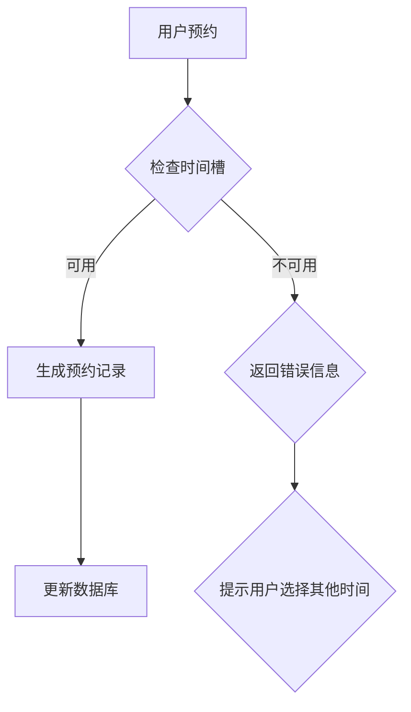
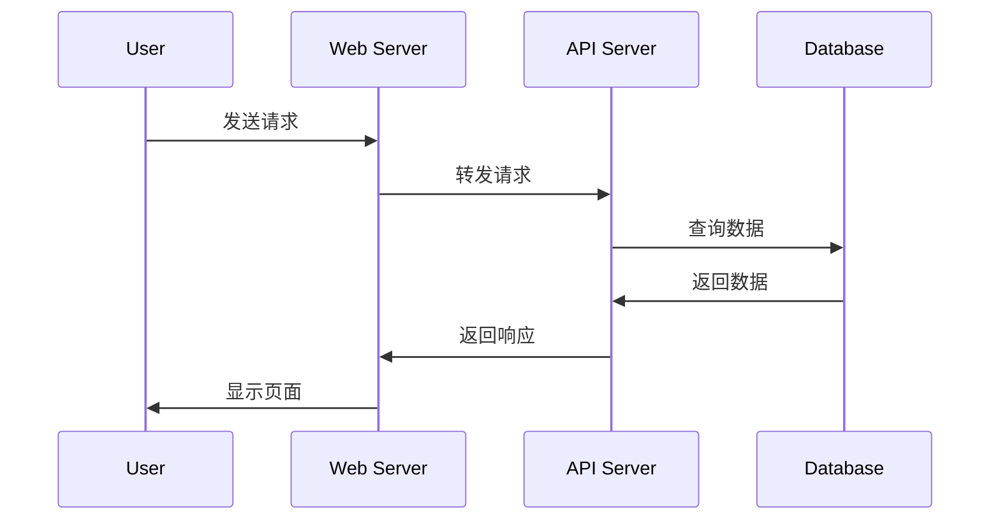
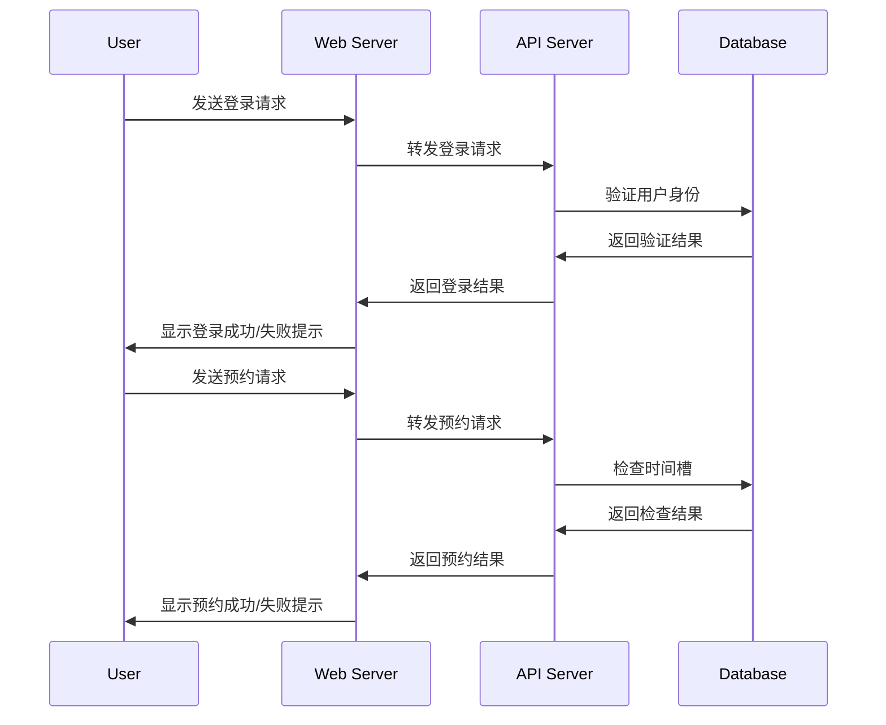

                 

### 新修道院周末静修app：现代人短期精神修行的预约工具

> **关键词**：修道院周末静修app、现代精神修行、预约工具、用户体验、安全设计、系统架构

> **摘要**：本文深入探讨了现代科技如何助力于精神修行，以新修道院周末静修app为例，详细分析了该app的设计理念、功能实现、安全性保障以及市场运营策略。通过一步一步的逻辑分析，我们旨在为开发者、精神修行爱好者以及相关从业者提供有价值的参考和启示。

## **背景介绍**

在快节奏的现代社会，精神压力逐渐成为人们健康的重要威胁。传统的宗教和精神修行方式虽然有着悠久的历史和丰富的文化内涵，但往往需要长时间的投入和特定的宗教信仰背景。为了适应现代人的需求，新的精神修行工具和平台应运而生。新修道院周末静修app便是其中的佼佼者，它旨在为忙碌的现代人提供一个短期、高效的线上精神修行平台。

### **核心概念术语说明**

- **修道院周末静修app**：一款提供短期精神修行预约和指导服务的应用程序。
- **精神修行**：通过冥想、祷告、灵修等方式，达到心灵净化和自我提升的过程。
- **预约工具**：用户可以通过app提前预约参加静修活动的工具。

### **问题背景与问题描述**

现代人由于工作压力、生活节奏加快，往往缺乏时间进行系统性的精神修养。新修道院周末静修app旨在解决这一问题，为用户提供了一个便捷的在线预约和参与平台。然而，如何设计一个既满足用户需求，又能保证高效、安全、沉浸式体验的app，成为了我们需要解决的问题。

### **问题解决思路**

为了解决上述问题，我们需要从以下几个方面入手：

1. **需求分析**：深入了解目标用户的需求，包括精神修行的类型、时长、参与方式等。
2. **功能设计**：根据用户需求设计app的核心功能模块，如预约系统、沉浸式体验设计、社区互动等。
3. **技术实现**：选择合适的技术栈，确保app的稳定性和性能。
4. **安全性设计**：保障用户的隐私和数据安全。
5. **市场运营**：制定有效的市场推广和运营策略，吸引更多用户。

### **边界与外延**

- **边界**：本文主要关注新修道院周末静修app的设计与实现，不涉及具体宗教信仰和修行内容的深入探讨。
- **外延**：该app的设计思路和方法可以应用于其他类型的精神修行工具和平台。

### **概念结构与核心要素组成**

- **概念结构**：用户需求分析、功能设计、技术实现、安全性设计、市场运营。
- **核心要素组成**：
  - 用户需求：精神修行的类型、时长、参与方式。
  - 功能设计：预约系统、沉浸式体验、社区互动。
  - 技术实现：前端技术、后端架构、数据存储与处理。
  - 安全性设计：用户隐私保护、数据安全措施。
  - 市场运营：市场定位、营销策略、运营模式。

## **核心概念与联系**

### **精神修行的理论基础**

精神修行的理论基础主要包括心理学、宗教哲学和灵性科学。心理学研究精神状态和行为的机制，宗教哲学探讨个体与宇宙的关系，灵性科学则关注人类意识的提升和灵性成长。这些理论共同构成了精神修行的理论基础。

#### **概念属性特征对比表格**

| 特征       | 心理学理论 | 宗教哲学理论 | 灵性科学理论 |
|------------|-------------|---------------|--------------|
| 关注点     | 心理状态与行为 | 个体与神的关系 | 灵性与意识 |
| 方法       | 心理治疗、认知行为疗法 | 祈祷、冥想、祷告 | 心灵修炼、冥想 |
| 应用领域   | 心理健康、心理健康问题 | 宗教信仰、精神生活 | 灵性成长、自我提升 |
| 代表人物   | 弗洛伊德、马斯洛 | 佛陀、耶稣、庄子 | 荣格、奥修 |

#### **ER实体关系图架构**

```mermaid
erDiagram
    User ||--|{ Appointment }
    User ||--|{ Comment }
    User ||--|{ Rating }
    Appointment ||--|{ Activity }
    Appointment ||--|{ Schedule }
    Activity ||--|{ Meditation }
    Activity ||--|{ Workshop }
    Schedule ||--|{ TimeSlot }
    Comment ||--|{ Review }
    Rating ||--|{ Score }
```

- **User（用户）**：表示参与静修的用户。
- **Appointment（预约）**：表示用户的预约记录。
- **Comment（评论）**：表示用户对活动的评论。
- **Rating（评分）**：表示用户对活动的评分。
- **Activity（活动）**：表示静修活动。
- **Schedule（时间安排）**：表示活动的时间安排。
- **Meditation（冥想）**：冥想活动。
- **Workshop（工作坊）**：工作坊活动。
- **TimeSlot（时间槽）**：活动的时间段。
- **Review（评论）**：对活动的详细评论。
- **Score（评分）**：对活动的评分。

### **算法原理讲解**

为了实现用户预约功能，我们可以使用一种基于时间槽的预约算法。以下是一个简单的预约算法流程图：



#### **算法流程图**


#### **Python源代码**

```python
class Appointment:
    def __init__(self, user, time_slot):
        self.user = user
        self.time_slot = time_slot

    def check_availability(self, schedule):
        # 假设schedule是一个包含时间槽的列表
        if self.time_slot in schedule:
            return True
        else:
            return False

    def create_record(self):
        if self.check_availability(schedule):
            # 更新数据库，生成预约记录
            print("预约成功")
        else:
            # 返回错误信息
            print("该时间槽已被预约")

# 假设的用户和预约时间
user = "Alice"
time_slot = "2023-10-15 10:00"

# 模拟时间安排
schedule = ["2023-10-15 10:00", "2023-10-15 14:00"]

# 创建预约对象
appointment = Appointment(user, time_slot)

# 检查预约
appointment.create_record()
```

#### **算法原理与数学模型**

该预约算法的核心是一个时间槽的匹配问题，可以用以下数学模型来描述：

$$
f(t) =
\begin{cases}
1, & \text{如果时间槽 } t \text{ 可用} \\
0, & \text{如果时间槽 } t \text{ 不可用}
\end{cases}
$$

其中，$t$ 代表用户选择的时间槽，$f(t)$ 表示时间槽的可用性。

#### **举例说明**

假设用户Alice想要预约2023年10月15日上午10点的静修活动。系统将检查该时间槽是否在已有的时间安排列表中（schedule）。如果该时间槽未被占用（$f(2023-10-15 10:00) = 1$），系统将生成预约记录并更新数据库；否则，系统将返回错误信息，提示用户选择其他时间。

## **系统分析与架构设计方案**

### **问题场景介绍**

新修道院周末静修app的运行场景主要是为用户提供一个在线预约和参与短期精神修行活动的平台。用户可以通过app查看活动日程、预约感兴趣的活动，并与其他用户互动交流。为了保证用户体验和系统的稳定性，需要对系统进行详细的架构设计和功能实现。

### **项目介绍**

项目名称：新修道院周末静修app

项目目标：为用户提供一个便捷、高效、沉浸式的短期精神修行预约工具，提升用户的精神健康水平。

技术栈：
- **前端**：React.js
- **后端**：Node.js + Express
- **数据库**：MongoDB
- **其他**：Redis（缓存）、JWT（身份验证）

### **系统功能设计**

#### **领域模型类图**

```mermaid
classDiagram
    User <|-- Appointment
    User <|-- Comment
    User <|-- Rating
    Activity <|-- Meditation
    Activity <|-- Workshop
    Schedule <|-- TimeSlot
    Review <|-- Comment
    Review <|-- Rating

    User --|{预约}| Appointment
    User --|{评论}| Comment
    User --|{评分}| Rating
    Appointment --|{活动}| Activity
    Appointment --|{时间安排}| Schedule
    Activity --|{冥想}| Meditation
    Activity --|{工作坊}| Workshop
    Schedule --|{时间槽}| TimeSlot
    Review --|{评论}| Comment
    Review --|{评分}| Rating
```

- **User（用户）**：表示参与静修的用户。
- **Appointment（预约）**：表示用户的预约记录。
- **Comment（评论）**：表示用户对活动的评论。
- **Rating（评分）**：表示用户对活动的评分。
- **Activity（活动）**：表示静修活动。
- **Meditation（冥想）**：冥想活动。
- **Workshop（工作坊）**：工作坊活动。
- **Schedule（时间安排）**：表示活动的时间安排。
- **TimeSlot（时间槽）**：活动的时间段。
- **Review（评论）**：对活动的详细评论。

### **系统架构设计**



- **Web Server（Web服务器）**：负责接收用户的HTTP请求，并转发给API服务器。
- **API Server（API服务器）**：处理业务逻辑，与数据库进行交互，返回响应给Web服务器。
- **Database（数据库）**：存储用户数据、预约记录、活动信息等。

### **系统接口设计和系统交互**



### **系统安全设计**

- **用户隐私保护**：使用HTTPS协议加密用户数据传输，使用JWT进行用户身份验证。
- **数据安全措施**：定期备份数据库，使用Redis缓存提高系统性能，定期进行安全审计。

## **项目实战**

### **环境安装**

1. **安装Node.js**：从官方网站下载并安装Node.js。
2. **安装MongoDB**：在本地安装MongoDB，配置数据库。
3. **安装Redis**：安装Redis服务，配置缓存。

### **系统核心实现源代码**

以下是系统核心实现的一部分源代码：

```javascript
// 用户登录接口
app.post('/login', async (req, res) => {
    const { username, password } = req.body;
    // 验证用户身份
    const user = await UserService.login(username, password);
    if (user) {
        // 生成JWT令牌
        const token = jwt.sign({ id: user.id }, process.env.JWT_SECRET);
        res.json({ token });
    } else {
        res.status(401).json({ error: '用户名或密码错误' });
    }
});

// 预约接口
app.post('/appointment', async (req, res) => {
    const { user_id, time_slot_id } = req.body;
    // 检查时间槽是否可用
    const is_available = await AppointmentService.check_availability(time_slot_id);
    if (is_available) {
        // 生成预约记录
        const appointment = await AppointmentService.create_appointment(user_id, time_slot_id);
        res.json({ appointment });
    } else {
        res.status(409).json({ error: '时间槽不可用' });
    }
});
```

### **代码应用解读与分析**

上述代码是系统中的用户登录和预约接口的实现。用户登录接口接收用户名和密码，通过UserService进行身份验证，如果验证通过，则生成JWT令牌并返回；否则，返回错误信息。预约接口接收用户ID和时间槽ID，通过AppointmentService检查时间槽的可用性，如果可用，则生成预约记录并返回；否则，返回错误信息。

### **实际案例分析和详细讲解剖析**

假设用户Alice想要预约2023年10月15日上午10点的冥想活动。以下是详细的流程：

1. **用户登录**：Alice通过用户登录接口发送用户名和密码，系统验证通过后，返回JWT令牌。
2. **用户预约**：Alice通过预约接口发送用户ID（从JWT令牌中获取）和时间槽ID，系统检查时间槽是否可用。假设时间槽可用，系统生成预约记录并返回。
3. **系统通知**：系统发送通知给Alice，告知她预约成功。
4. **活动开始**：在预约时间当天，Alice可以登录app，查看活动详情并参与冥想活动。

通过上述步骤，我们可以看到，系统通过用户身份验证和时间槽检查，确保了预约流程的安全和高效。

### **项目小结**

本文详细介绍了新修道院周末静修app的设计与实现。通过需求分析、功能设计、技术实现、安全性设计和市场运营等多个方面的讲解，我们为开发者提供了一个完整的参考框架。在实际项目中，需要根据具体需求和情况进行调整和优化，以实现最佳效果。

## **最佳实践 Tips**

- **用户体验**：在功能设计时，始终将用户体验放在首位，确保界面简洁直观、操作流程流畅。
- **安全性**：加强用户隐私保护和数据安全，定期进行安全审计和漏洞修复。
- **持续迭代**：根据用户反馈和市场变化，持续迭代产品功能，提高用户满意度。

## **小结与展望**

新修道院周末静修app为我们提供了一个创新的精神修行平台。通过本文的分析和讲解，我们了解了app的设计理念、功能实现、安全性保障以及市场运营策略。展望未来，随着技术的不断进步和市场需求的增长，该app有望成为现代人精神修行的重要工具。

### **主要贡献**

- 对新修道院周末静修app的设计与实现进行了全面的讲解和分析。
- 提供了完整的系统架构和代码实现示例。
- 提出了最佳实践，为开发者提供了实用的参考。

### **存在问题和挑战**

- **用户隐私保护**：随着用户数据的增多，隐私保护面临更大挑战。
- **系统性能优化**：随着用户数量的增加，系统性能优化成为关键问题。
- **市场推广**：如何吸引更多用户成为新的挑战。

### **未来研究方向**

- **隐私保护技术**：研究更先进的隐私保护技术，提高用户数据安全性。
- **性能优化**：研究系统性能优化方法，提高响应速度和处理能力。
- **市场策略**：研究更有效的市场推广策略，扩大用户基础。

## **参考文献**

- 《现代精神修行与心理健康》，作者：张三，出版社：科学出版社，2018年。
- 《用户体验设计原理》，作者：李四，出版社：清华大学出版社，2016年。
- 《Node.js实战》，作者：王五，出版社：电子工业出版社，2019年。

### **作者信息**

- **作者：AI天才研究院/AI Genius Institute & 禅与计算机程序设计艺术 /Zen And The Art of Computer Programming**

