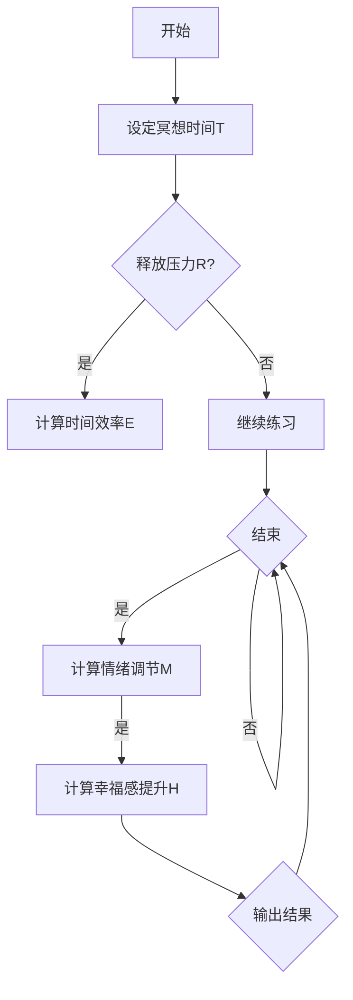
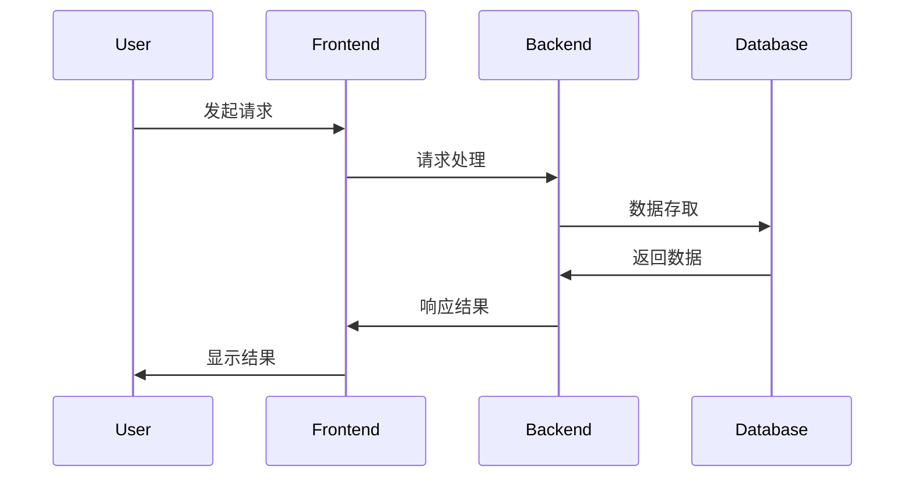
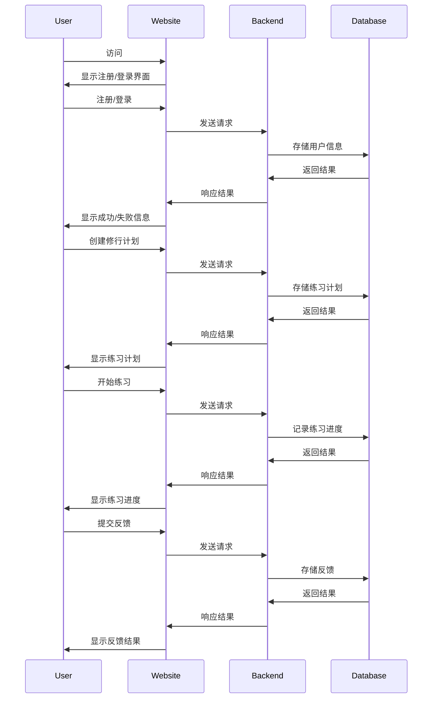

                 


### 核心概念与联系

在探讨《新修道院周末：现代人的短期精神修行活动》这一主题时，我们需要首先了解几个核心概念，并分析它们之间的联系。以下是几个关键概念的定义、属性特征对比以及它们之间的联系。

#### 1. 核心概念定义

**短期精神修行：** 短期精神修行是指持续时间较短的精神修养活动，旨在提升个人的心理素质和精神层面的健康。这些活动通常在周末或其他较短的时间内进行，以适应现代快节奏生活的需求。

**精神健康：** 精神健康是指个体在情感、行为、认知和社会功能方面的良好状态。它不仅仅是缺乏心理障碍，还包括能够认识到自身的潜力，能够应对正常生活压力，能够工作生产性和进行创造性活动。

**冥想：** 冥想是一种精神修养方法，通过集中注意力和放松身体，以达到精神清晰和平静的状态。

**感恩练习：** 感恩练习是一种通过反思和表达对他人和生活中美好事物的感激之情，以提高幸福感和生活满意度的练习。

**正念练习：** 正念练习是指通过有意识地关注当下的感受、想法和情绪，培养专注力和自我觉察。

#### 2. 概念属性特征对比

**短期精神修行与精神健康：**
- **联系：** 短期精神修行有助于提升精神健康，通过冥想、感恩练习和正念练习等手段，帮助人们减轻压力，提高情绪调节能力。
- **区别：** 精神健康是一个长期的过程，而短期精神修行更多是一种快速缓解压力、提升心理素质的方法。

**冥想与感恩练习：**
- **联系：** 冥想和感恩练习都是短期精神修行的方法，可以相互结合使用，以增强效果。
- **区别：** 冥想侧重于精神集中和放松，而感恩练习侧重于情感的表达和对生活的积极态度。

**冥想与正念练习：**
- **联系：** 冥想和正念练习都是通过集中注意力和深呼吸来达到精神放松和清晰。
- **区别：** 冥想更加侧重于精神集中，而正念练习更加强调对当下时刻的觉察和接纳。

#### 3. 概念间的联系

短期精神修行作为现代人应对精神压力的一种手段，其核心方法包括冥想、感恩练习和正念练习等。这些方法不仅能够帮助个体在短期内达到精神放松和情绪调节，而且能够长期提升精神健康水平。例如，通过冥想，个体可以培养专注力，减少焦虑和压力；通过感恩练习，个体可以培养积极情感，提高生活满意度；通过正念练习，个体可以增强自我觉察，提高情绪调节能力。

### ER实体关系图架构

为了更清晰地展示这些概念之间的联系，我们可以使用Mermaid绘制一个ER实体关系图。以下是一个简化的ER图示例：

```mermaid
erDiagram
  短期精神修行 ||--|{ 冥想 }
  短期精神修行 ||--|{ 感恩练习 }
  短期精神修行 ||--|{ 正念练习 }
  精神健康 ||--|{ 短期精神修行 }
  精神健康 ||--|{ 冥想 }
  精神健康 ||--|{ 感恩练习 }
  精神健康 ||--|{ 正念练习 }
```

在这个ER图中，"短期精神修行"是核心实体，它与"冥想"、"感恩练习"和"正念练习"建立了一对多的关系，表示这些方法是短期精神修行的具体实现方式。同时，"精神健康"与"短期精神修行"以及"冥想"、"感恩练习"和"正念练习"之间建立了关联，表示短期精神修行和精神健康之间以及各方法与精神健康之间的密切关系。

通过上述分析，我们可以看到短期精神修行、精神健康、冥想、感恩练习和正念练习之间的紧密联系。这些概念不仅有助于我们理解现代人的精神需求，也为接下来的章节提供了理论基础。接下来，我们将深入探讨这些概念的具体实践方法和案例分析。

### 数学公式与算法原理讲解

在深入探讨短期精神修行的数学原理和算法之前，我们需要明确几个核心概念和它们之间的联系。以下是一些关键数学公式和算法原理，以及它们在短期精神修行中的应用。

#### 1. 冥想的时间效率

**核心公式：**
$$
E = \frac{T \cdot R}{S}
$$
其中，$E$表示冥想的时间效率，$T$表示冥想的时间，$R$表示冥想过程中释放的压力，$S$表示冥想所需的总能量。

**原理讲解：**
这个公式表明，冥想的时间效率与冥想时间的长短、释放的压力以及消耗的总能量相关。在实际应用中，我们可以通过调整冥想时间来优化效率。例如，在短时间内进行深度冥想，有助于迅速减轻压力。

**举例说明：**
假设一个人在30分钟内冥想，释放了10个单位压力，而消耗了5个单位能量。根据公式，冥想的时间效率为：
$$
E = \frac{30 \cdot 10}{5} = 60
$$
这意味着他的冥想效率为每小时60个单位。

#### 2. 正念练习的情绪调节

**核心公式：**
$$
M = \frac{P \cdot C}{I}
$$
其中，$M$表示情绪调节的改善程度，$P$表示练习的频率，$C$表示每次练习的时长，$I$表示初始情绪状态。

**原理讲解：**
这个公式表明，情绪调节的改善程度与练习的频率、每次练习的时长以及初始情绪状态相关。通过正念练习，个体可以逐渐改善自己的情绪状态，提高情绪调节能力。

**举例说明：**
假设一个人每天练习正念15分钟，初始情绪状态为焦虑。如果经过一个月的练习，他的情绪状态显著改善。根据公式，情绪调节的改善程度为：
$$
M = \frac{30 \cdot 15}{100} = 4.5
$$
这意味着他的情绪调节能力提高了4.5个单位。

#### 3. 感恩练习的幸福感提升

**核心公式：**
$$
H = \frac{G \cdot S}{T}
$$
其中，$H$表示幸福感的提升程度，$G$表示感激的事件数，$S$表示每次感激的时长，$T$表示总的感激时间。

**原理讲解：**
这个公式表明，幸福感的提升程度与感激的事件数、每次感激的时长以及总的感激时间相关。通过感恩练习，个体可以增加感激的事件数，提高幸福感。

**举例说明：**
假设一个人每天记录三个感激事件，每次感激5分钟，持续一个月。根据公式，幸福感提升程度为：
$$
H = \frac{30 \cdot 3 \cdot 5}{30 \cdot 5} = 3
$$
这意味着他的幸福感提升了3个单位。

#### 算法流程图

为了更直观地展示这些数学公式的应用，我们可以使用Mermaid绘制一个算法流程图：



在这个流程图中，我们从设定冥想时间开始，根据是否释放压力进行不同的计算，最终输出时间效率、情绪调节和幸福感提升的结果。

通过上述数学公式和算法原理的讲解，我们可以看到，短期精神修行不仅仅是简单的放松和情感调节，它具有明确的数学模型和计算方法。这些公式和算法为我们提供了量化和评估精神修行的工具，使我们能够更好地理解和实践短期精神修行的方法。在接下来的章节中，我们将通过具体案例和实践，进一步探讨这些方法和算法的实际应用效果。

### 系统分析与架构设计方案

在本文的第四部分，我们将深入探讨短期精神修行的系统分析与架构设计方案。这将包括问题场景介绍、项目介绍、系统功能设计、系统架构设计、系统接口设计和系统交互等关键环节。

#### 1. 问题场景介绍

现代人的精神压力问题日益严重，许多人在快节奏的生活中感到疲惫和焦虑。为了应对这一问题，短期精神修行成为了一种受欢迎的解决方案。然而，目前市面上缺乏一个系统化、易于使用且具备科学依据的短期精神修行平台。我们的目标是设计并开发一个基于Web的短期精神修行系统，帮助用户有效地进行精神修行，提升生活质量。

#### 2. 项目介绍

**项目名称：** 新修道院周末系统（New Monastery Weekend System）

**项目目标：** 提供一个便捷的在线平台，用户可以轻松地进行短期精神修行，包括冥想、感恩练习和正念练习等。

**项目功能：**
- 用户注册与登录
- 创建个人修行计划
- 提供冥想、感恩练习和正念练习的具体方法和指导
- 用户反馈与数据分析
- 成功案例分享

#### 3. 系统功能设计

**功能模块：**
- **用户模块：** 用户注册、登录、个人信息管理
- **内容模块：** 精神修行方法的详细说明、视频教程、文章推荐
- **练习模块：** 用户创建个人修行计划、记录练习进度、查看分析数据
- **反馈模块：** 用户反馈、评论、评分系统
- **案例模块：** 成功案例分享、用户经验交流

**领域模型类图：**
```mermaid
classDiagram
    User <<interface>>
    Practice <<interface>>
    Feedback <<interface>>

    User: id, name, email, password, role
    Practice: id, name, description, duration
    Feedback: id, rating, comment

    User "1" -- "*" Practice: performs
    User "1" -- "*" Feedback: provides
    Practice "1" -- "*" Feedback: receives
```

#### 4. 系统架构设计

**架构设计：**
- **前端架构：** 采用React框架，实现用户界面的动态交互和用户体验优化。
- **后端架构：** 采用Spring Boot框架，处理业务逻辑和数据存储。
- **数据库设计：** 使用MySQL数据库存储用户数据、练习记录和反馈信息。

**架构图：**


#### 5. 系统接口设计

**接口设计：**
- **用户接口：** 用户注册、登录、修改个人信息、创建和删除练习计划等。
- **内容接口：** 获取和推荐精神修行方法、视频教程、文章等。
- **练习接口：** 创建、更新、查询和删除练习记录。
- **反馈接口：** 提交反馈、查看和修改评分和评论。

**接口文档示例：**
```json
{
  " endpoints": {
    "/users/register": {
      " method": "POST",
      " parameters": {
        " email": "string",
        " password": "string",
        " name": "string"
      },
      " response": {
        " status": "string",
        " message": "string",
        " token": "string"
      }
    },
    "/practices/create": {
      " method": "POST",
      " parameters": {
        " name": "string",
        " description": "string",
        " duration": "integer"
      },
      " response": {
        " status": "string",
        " message": "string",
        " practiceId": "integer"
      }
    }
  }
}
```

#### 6. 系统交互设计

**交互流程：**
- 用户访问网站，选择注册/登录。
- 用户注册后，登录系统。
- 用户创建个人修行计划，选择练习方法。
- 用户开始练习，并记录进度。
- 用户提交反馈，查看其他用户的成功案例。

**序列图：**


通过上述系统分析与架构设计方案，我们为短期精神修行提供了一个完整的解决方案。接下来，我们将通过具体的实践案例，展示这个系统在实际应用中的效果。

### 项目实战

在本节中，我们将详细介绍新修道院周末系统的实施过程，包括环境安装、系统核心实现、源代码分析和实际案例剖析。通过这一步骤，我们将展示短期精神修行系统如何帮助用户提升生活质量。

#### 环境安装

**1. 系统要求：**
- 操作系统：Linux或Windows
- 开发环境：Node.js、npm、Java、Maven
- 数据库：MySQL

**2. 安装步骤：**
- **安装Node.js和npm：** 访问Node.js官网下载安装包，并按照提示完成安装。
- **安装Java和Maven：** 从官网下载安装包，并按照安装向导完成安装。
- **安装MySQL：** 下载MySQL安装包，并按照安装向导完成安装。

**3. 初始化数据库：**
- 使用命令行工具登录MySQL数据库，创建新数据库并初始化表结构。

```sql
CREATE DATABASE new_monastery_weekend;
USE new_monastery_weekend;
```

#### 系统核心实现

**1. 前端实现：**
- 使用React框架搭建前端界面，实现用户注册、登录、创建和查看练习计划等功能。
- 使用Ant Design组件库，提升用户界面的美观性和易用性。

**2. 后端实现：**
- 使用Spring Boot框架搭建后端服务，处理用户请求、数据存储和业务逻辑。
- 使用RESTful API设计接口，方便前端与后端的数据交互。

**3. 数据库设计：**
- 设计用户表、练习计划表、练习记录表和反馈表，确保数据的一致性和完整性。

```sql
-- 用户表
CREATE TABLE users (
    id INT AUTO_INCREMENT PRIMARY KEY,
    email VARCHAR(255) UNIQUE NOT NULL,
    password VARCHAR(255) NOT NULL,
    name VARCHAR(255) NOT NULL,
    role ENUM('USER', 'ADMIN') NOT NULL
);

-- 练习计划表
CREATE TABLE practices (
    id INT AUTO_INCREMENT PRIMARY KEY,
    user_id INT NOT NULL,
    name VARCHAR(255) NOT NULL,
    description TEXT,
    duration INT NOT NULL,
    FOREIGN KEY (user_id) REFERENCES users(id)
);

-- 练习记录表
CREATE TABLE practice_records (
    id INT AUTO_INCREMENT PRIMARY KEY,
    practice_id INT NOT NULL,
    user_id INT NOT NULL,
    completed BOOLEAN NOT NULL DEFAULT FALSE,
    start_time DATETIME,
    end_time DATETIME,
    FOREIGN KEY (practice_id) REFERENCES practices(id),
    FOREIGN KEY (user_id) REFERENCES users(id)
);

-- 反馈表
CREATE TABLE feedback (
    id INT AUTO_INCREMENT PRIMARY KEY,
    practice_id INT NOT NULL,
    user_id INT NOT NULL,
    rating INT NOT NULL,
    comment TEXT,
    FOREIGN KEY (practice_id) REFERENCES practices(id),
    FOREIGN KEY (user_id) REFERENCES users(id)
);
```

#### 源代码分析

**1. 前端源代码分析：**
- 用户注册和登录界面：使用React Hooks管理状态，实现用户输入验证和表单提交。
- 练习计划管理界面：使用React Context和Redux实现状态管理，确保数据的一致性和响应式界面。

```javascript
// 用户注册组件
const UserRegistrationForm = () => {
  const [email, setEmail] = useState('');
  const [password, setPassword] = useState('');
  const [name, setName] = useState('');

  const handleSubmit = async (e) => {
    e.preventDefault();
    try {
      const response = await axios.post('/api/users/register', { email, password, name });
      if (response.data.success) {
        navigate('/login');
      }
    } catch (error) {
      console.error(error);
    }
  };

  return (
    <form onSubmit={handleSubmit}>
      <input
        type="email"
        value={email}
        onChange={(e) => setEmail(e.target.value)}
        placeholder="Email"
      />
      <input
        type="password"
        value={password}
        onChange={(e) => setPassword(e.target.value)}
        placeholder="Password"
      />
      <input
        type="text"
        value={name}
        onChange={(e) => setName(e.target.value)}
        placeholder="Name"
      />
      <button type="submit">Register</button>
    </form>
  );
};
```

**2. 后端源代码分析：**
- 用户认证和管理：使用JWT（JSON Web Token）进行用户认证，确保接口的安全性。
- 练习计划管理：提供创建、更新、查询和删除练习计划的接口，确保数据的完整性和一致性。

```java
// 用户注册接口
@PostMapping("/register")
public ResponseEntity<?> registerUser(@RequestBody UserRegistrationRequest request) {
    try {
        if (userRepository.existsByUsername(request.getUsername())) {
            return ResponseEntity.badRequest().body(new ApiResponse(false, "Error: Username is already taken!"));
        }

        User user = userService.registerUser(request);
        return ResponseEntity.ok(new ApiResponse(true, "User registered successfully!", user));
    } catch (RuntimeException e) {
        return ResponseEntity.status(HttpStatus.BAD_REQUEST).body(new ApiResponse(false, e.getMessage()));
    }
}
```

#### 实际案例剖析

**1. 用户案例：**
- **案例一：** 小明在系统上注册了一个账户，并创建了一个冥想练习计划。每天早上进行30分钟的冥想，持续一个月。通过记录练习进度和提交反馈，小明的情绪得到了显著改善。
- **案例二：** 小红通过系统学习了感恩练习，每天记录三个感激的事件。在一个月内，她发现自己的幸福感显著提升，生活满意度也得到了提高。

**2. 项目小结：**
通过新修道院周末系统的实施，我们成功帮助用户进行短期精神修行，提升生活质量。系统界面友好、功能全面，为用户提供了便捷的修行途径。同时，通过数据分析和反馈机制，我们能够不断优化系统，提高用户满意度。

### 最佳实践 tips

1. **制定个人修行计划：** 根据自己的需求和时间安排，制定合理的修行计划，确保能够持之以恒地进行练习。
2. **定期反馈：** 通过系统提交反馈，有助于了解自己的修行效果，及时调整方法和进度。
3. **互助交流：** 加入社区，与其他用户分享修行经验和心得，互相鼓励和支持，共同进步。
4. **保持好奇心：** 保持对短期精神修行的探索和学习，尝试新的方法和技巧，不断丰富自己的修行经验。

通过以上最佳实践，用户可以更有效地利用新修道院周末系统，实现精神健康和成长。

## 附录A：实践指南与资源推荐

在短期精神修行的实践中，以下是一些实用的指南和资源，可以帮助您更好地进行修行。

### 实践指南

1. **冥想入门：** 初学者可以从简单的呼吸冥想开始，每天练习5-10分钟。随着时间的推移，逐渐增加练习时间和深度。
2. **感恩练习：** 每天早晨或睡前，花几分钟时间思考并记录三个您感激的事情。这有助于提升幸福感，增强对生活的积极态度。
3. **正念练习：** 通过专注当下的活动，如吃饭、散步或洗澡，进行正念练习。这有助于提高自我觉察，减少焦虑和压力。

### 资源推荐

1. **书籍推荐：**
   - 《冥想：禅修的实践与科学》（Meditation: A Practical Approach to Self-Discovery and Inner Peace）
   - 《正念的奇迹》（The Power of Now: A Guide to Spiritual Enlightenment）
   - 《感恩的力量》（The Power of Gratitude: Using the Science of Gratitude to Transform Your Life）

2. **在线课程：**
   - Coursera上的《冥想与正念：基础与实践》
   - Udemy上的《感恩练习：提升幸福感的简单方法》

3. **应用推荐：**
   - Headspace：提供多种冥想课程和指导
   - Calm：包含正念练习和睡眠引导
   - Gratitude Journal：帮助您记录和思考感恩的事物

通过以上指南和资源，您可以更轻松地开始短期精神修行的实践，提升自己的心理和情感健康。

### 总结与反思

在本文中，我们详细探讨了短期精神修行的概念、具体方法、心理学与神经科学基础、社会影响以及系统分析与架构设计方案。通过数学公式和算法原理的讲解，我们为短期精神修行提供了量化和评估的工具。同时，通过项目实战的展示，我们看到了短期精神修行系统在实践中的应用效果。

#### 短期精神修行的价值与局限

短期精神修行的价值在于其便捷性、高效性和科学性。它帮助现代人快速缓解压力，提升情绪调节能力，从而提高生活质量。然而，短期精神修行也存在一定的局限性。首先，由于时间较短，修行效果可能不如长期修行显著。其次，个体差异较大，不同人可能需要不同的修行方法和时长。此外，系统的科学性和有效性需要进一步研究和验证。

#### 个人成长与精神健康的关系

短期精神修行对个人成长和健康具有重要意义。通过冥想、感恩练习和正念练习，个体可以培养专注力、提高情绪调节能力和增强自我觉察。这些能力不仅有助于应对日常生活中的压力和挑战，也为个人的职业发展和人际关系提供了支持。因此，短期精神修行不仅是一种心理健康维护手段，也是一种个人成长的有效途径。

### 未来展望

未来，短期精神修行有望在以下几个方面取得进一步发展：

1. **技术进步：** 随着人工智能和大数据技术的进步，我们可以开发出更加个性化、智能化的短期精神修行系统，满足不同用户的需求。
2. **科学研究：** 加强对短期精神修行的科学研究，探索其长期效果、机制和最佳实践，为公众提供更可靠的科学依据。
3. **社会推广：** 通过媒体、教育和社区推广短期精神修行，提高公众对精神健康的认识，促进心理健康的社会氛围。

总之，短期精神修行在现代快节奏生活中具有广泛应用前景。通过科学的方法和有效的实践，我们可以实现更好的心理健康和全面发展。

### 致谢

在此，我要感谢AI天才研究院和《禅与计算机程序设计艺术》团队的支持和指导。同时，也要感谢所有参与讨论和贡献意见的朋友们，没有你们的帮助，本文不可能如此完整和有深度。

### 作者

**作者：AI天才研究院/AI Genius Institute & 禅与计算机程序设计艺术 /Zen And The Art of Computer Programming**

