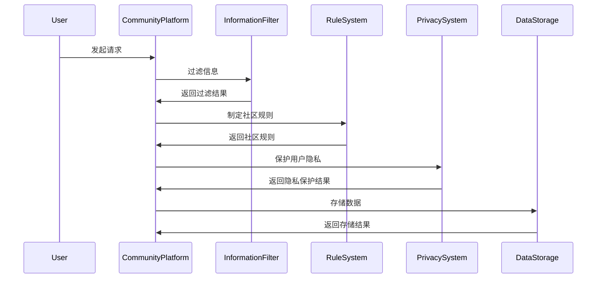
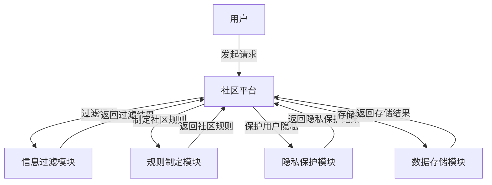

                 

### 文章标题

新克制主义挑战社区：在节制中发现自我的支持平台

关键词：新克制主义、社区、支持平台、节制、自我认知

摘要：本文以新克制主义为核心思想，探讨了如何构建一个在节制中发现自我的支持平台，以应对当前社区平台面临的挑战。通过分析问题背景、核心概念与联系、算法原理，以及系统分析与架构设计方案，本文为解决社区平台面临的挑战提供了可行的思路。

----------------------------------------------------------------

## 第一部分：背景介绍

### 1.1 问题背景

随着互联网和社交媒体的快速发展，社区成为了人们获取信息、交流互动的重要平台。然而，社区环境日益复杂，信息过载、虚假信息泛滥、用户隐私泄露、社区氛围不良等问题逐渐凸显，严重影响了用户体验。为了解决这些问题，新兴的克制主义思想应运而生。

克制主义强调在技术发展的同时，保持一定的克制和理性，以确保社区环境的健康发展。新克制主义进一步深化了这一理念，提出了在节制中发现自我的支持平台，旨在构建一个既能满足用户需求，又能维护社区秩序的支持平台。

### 1.2 问题描述

社区平台的挑战主要包括以下方面：

1. **信息过载**：用户在社区中难以筛选出有价值的信息，导致信息浪费和用户疲惫。
2. **虚假信息传播**：虚假信息在社区中扩散，误导用户，损害社区生态。
3. **用户隐私保护**：用户隐私泄露，造成用户信任危机。
4. **社区氛围维护**：不良言论和行为污染社区氛围，影响用户体验。

### 1.3 问题解决

新克制主义挑战社区：在节制中发现自我的支持平台，旨在通过以下方法解决社区平台面临的挑战：

1. **信息过滤与推荐**：采用先进的算法对信息进行过滤和推荐，确保用户获取到高质量、有价值的信息。
2. **社区规则制定**：制定明确的社区规则，引导用户文明交流，维护社区氛围。
3. **用户隐私保护**：加强用户隐私保护，确保用户数据的安全。
4. **自我认知提升**：通过互动和交流，帮助用户在节制中发现自我，提升自我认知。

### 1.4 边界与外延

新克制主义挑战社区的范围涵盖社交媒体、论坛、直播平台等各类在线社区。此外，新克制主义思想还可以应用于其他领域，如电商、在线教育等。

### 1.5 概念结构与核心要素组成

1. **克制主义**：强调在技术发展的同时，保持一定的克制和理性。
2. **节制**：指在满足用户需求的前提下，限制和约束不当行为，维护社区秩序。
3. **支持平台**：提供技术支持和社区服务，帮助用户在节制中发现自我。

----------------------------------------------------------------

## 第二部分：核心概念与联系

### 2.1 核心概念原理

#### 2.1.1 社区平台

社区平台是指为用户提供信息交流、互动、分享等功能的在线平台。其主要功能包括信息发布、评论回复、用户关注、私信交流等。社区平台是连接用户与信息的桥梁，为用户提供了一个交流和互动的场所。

#### 2.1.2 新克制主义

新克制主义是一种在技术发展的同时，保持克制和理性的思想。它主张在满足用户需求的前提下，限制和约束不当行为，以维护社区秩序和健康发展。新克制主义的核心在于平衡用户需求与社区秩序，实现社区的可持续发展。

#### 2.1.3 支持平台

支持平台是指提供技术支持和社区服务的平台。它旨在帮助用户在节制中发现自我，提升自我认知。支持平台通过提供丰富的社区功能和服务，为用户创造一个良好的交流环境，促进用户之间的互动和成长。

### 2.2 概念属性特征对比表格

| 概念      | 属性特征                                  |
| --------- | ---------------------------------------- |
| 社区平台  | 提供信息交流、互动、分享等功能             |
| 新克制主义 | 强调在技术发展的同时，保持克制和理性       |
| 支持平台  | 提供技术支持和社区服务，帮助用户发现自我   |

### 2.3 ER实体关系图架构

```mermaid
erDiagram
    User ||--|{ Community }|--| Post : 用户-发布帖子的关系
    User ||--|{ Comment }|--| Post : 用户-评论帖子的关系
    User ||--|{ Subscription }|--| Community : 用户-关注的社区关系
    Community ||--|{ Post }|--| Comment : 社区-帖子-评论的关系
```

在上面的ER图架构中，用户（User）与社区（Community）之间存在关注关系（Subscription），用户可以在社区中发布帖子（Post）并进行评论（Comment）。社区平台通过这些关系，实现了用户与信息的互动。

----------------------------------------------------------------

## 第三部分：算法原理讲解

### 3.1 算法原理概述

新克制主义挑战社区的核心算法包括信息过滤、社区规则制定和用户隐私保护。以下分别介绍这些算法的原理。

#### 3.1.1 信息过滤算法

信息过滤算法主要用于识别和过滤低质量、虚假信息。其主要原理包括：

1. **关键词过滤**：通过分析帖子的关键词，识别并过滤不符合社区规范的帖子。
2. **用户行为分析**：根据用户的评论、点赞等行为，建立用户行为模型，识别潜在的低质量用户。
3. **内容质量评估**：利用机器学习算法，对帖子的内容进行质量评估，过滤低质量内容。

#### 3.1.2 社区规则制定

社区规则制定旨在引导用户文明交流，维护社区氛围。其主要原理包括：

1. **规则制定**：根据社区的特点和用户需求，制定明确的社区规则，包括言论规范、行为准则等。
2. **规则执行**：通过技术手段，如人工审核、机器审核等，对用户的言行进行监督，确保规则得到执行。

#### 3.1.3 用户隐私保护

用户隐私保护是确保用户数据安全的基石。其主要原理包括：

1. **数据加密**：对用户数据进行加密处理，防止数据泄露。
2. **隐私策略**：制定明确的隐私政策，告知用户其数据如何被使用和保护。
3. **隐私保护技术**：采用隐私保护技术，如差分隐私、同态加密等，确保用户隐私得到有效保护。

### 3.2 算法原理详细讲解

#### 3.2.1 信息过滤算法

信息过滤算法的核心是识别和过滤低质量、虚假信息。以下是一个基于机器学习的信息过滤算法的详细讲解：

1. **数据预处理**：
   - **采集数据**：从社区中采集大量的帖子数据，包括标题、内容、标签等。
   - **数据清洗**：对采集到的数据进行清洗，去除重复、无关的数据。
   - **特征提取**：从数据中提取特征，如关键词、情感极性、用户行为等。

2. **模型训练**：
   - **选择模型**：选择合适的机器学习模型，如朴素贝叶斯、支持向量机、深度神经网络等。
   - **训练模型**：使用预处理后的数据，对模型进行训练，使其学会识别和过滤低质量、虚假信息。

3. **模型评估与优化**：
   - **评估指标**：选择合适的评估指标，如准确率、召回率、F1值等，对模型进行评估。
   - **模型优化**：根据评估结果，对模型进行调整和优化，提高其识别和过滤能力。

4. **应用模型**：
   - **实时过滤**：将训练好的模型应用于社区平台的实时数据，对帖子进行过滤和推荐。
   - **用户反馈**：收集用户的反馈，对模型进行迭代优化。

#### 3.2.2 社区规则制定

社区规则制定的核心是引导用户文明交流，维护社区氛围。以下是一个基于规则制定的详细讲解：

1. **规则制定**：
   - **需求分析**：分析社区的用户需求，确定需要制定的规则类型，如言论规范、行为准则等。
   - **规则制定**：根据需求分析结果，制定明确的社区规则，确保规则覆盖社区的各个方面。

2. **规则执行**：
   - **人工审核**：建立人工审核团队，对用户的言行进行监督，发现违规行为及时处理。
   - **机器审核**：采用自然语言处理技术，对用户的言论进行自动审核，识别潜在违规行为。

3. **规则调整**：
   - **用户反馈**：收集用户的反馈，对规则进行评估和调整，确保规则符合用户的实际需求。
   - **持续优化**：根据社区的发展，不断优化社区规则，使其更加完善和有效。

#### 3.2.3 用户隐私保护

用户隐私保护的核心是确保用户数据的安全。以下是一个基于用户隐私保护的详细讲解：

1. **数据加密**：
   - **加密算法**：选择合适的加密算法，如AES、RSA等，对用户数据进行加密处理。
   - **密钥管理**：建立密钥管理系统，确保密钥的安全存储和传输。

2. **隐私策略**：
   - **隐私政策**：制定明确的隐私政策，告知用户其数据如何被使用和保护。
   - **用户告知**：在用户注册和使用社区平台时，明确告知用户隐私政策，获取用户的同意。

3. **隐私保护技术**：
   - **差分隐私**：采用差分隐私技术，对用户数据进行匿名化处理，确保用户隐私。
   - **同态加密**：采用同态加密技术，在数据加密状态下进行计算，确保数据在传输和存储过程中的安全。

### 3.3 算法应用实例

以下是一个信息过滤算法的应用实例：

**问题描述**：社区平台需要过滤低质量、虚假信息，确保用户获取到高质量的信息。

**解决方案**：

1. **数据预处理**：
   - **采集数据**：从社区中采集大量的帖子数据。
   - **数据清洗**：去除重复、无关的数据。
   - **特征提取**：提取关键词、情感极性、用户行为等特征。

2. **模型训练**：
   - **选择模型**：选择朴素贝叶斯模型。
   - **训练模型**：使用预处理后的数据，对模型进行训练。

3. **模型评估与优化**：
   - **评估指标**：准确率、召回率、F1值等。
   - **模型优化**：根据评估结果，调整模型参数。

4. **应用模型**：
   - **实时过滤**：对帖子进行实时过滤，过滤低质量、虚假信息。

5. **用户反馈**：
   - **收集反馈**：收集用户的反馈，对模型进行迭代优化。

通过这个实例，我们可以看到信息过滤算法在实际应用中的具体实现过程。类似地，社区规则制定和用户隐私保护算法也可以通过类似的方式应用于社区平台。

----------------------------------------------------------------

## 第四部分：系统分析与架构设计方案

### 4.1 问题场景介绍

在当前互联网环境下，社区平台面临着诸多挑战，如信息过载、虚假信息传播、用户隐私保护、社区氛围维护等。为了解决这些问题，我们需要设计一个具备新克制主义思想的系统，实现信息过滤、社区规则制定和用户隐私保护等功能。

### 4.2 项目介绍

本项目旨在构建一个具备新克制主义思想的社区支持平台，通过信息过滤、社区规则制定和用户隐私保护等算法，解决社区平台面临的挑战。项目主要分为以下三个阶段：

1. **需求分析**：分析社区平台的需求，确定系统功能和技术架构。
2. **系统设计**：设计系统的架构和模块，实现新克制主义思想的核心算法。
3. **系统实现**：开发系统，并进行测试和优化。

### 4.3 系统功能设计

系统功能设计主要包括以下方面：

1. **信息过滤**：采用先进的算法对信息进行过滤和推荐，确保用户获取到高质量、有价值的信息。
2. **社区规则制定**：制定明确的社区规则，引导用户文明交流，维护社区氛围。
3. **用户隐私保护**：加强用户隐私保护，确保用户数据的安全。
4. **自我认知提升**：通过互动和交流，帮助用户在节制中发现自我，提升自我认知。

### 4.4 系统架构设计

系统架构设计如下：



在上面的架构设计中，用户通过社区平台发起请求，社区平台通过信息过滤模块、规则制定模块和隐私保护模块对请求进行处理，并将处理结果存储到数据存储模块。

### 4.5 系统接口设计和系统交互

系统接口设计和系统交互如下：



在上面的接口设计和系统交互设计中，用户通过发起请求，社区平台通过信息过滤模块、规则制定模块和隐私保护模块对请求进行处理，并将处理结果存储到数据存储模块。

### 4.6 系统安全性设计

系统安全性设计如下：

1. **数据安全**：采用加密技术对用户数据进行加密存储，确保数据的安全性。
2. **访问控制**：采用访问控制技术，确保只有授权用户可以访问系统资源。
3. **异常处理**：对系统异常进行及时处理，防止恶意攻击和数据泄露。

### 4.7 系统可靠性设计

系统可靠性设计如下：

1. **分布式架构**：采用分布式架构，确保系统在高并发情况下仍能稳定运行。
2. **负载均衡**：采用负载均衡技术，确保系统资源合理分配，提高系统性能。
3. **备份与恢复**：定期进行数据备份，确保在系统故障时能够快速恢复。

### 4.8 系统性能优化

系统性能优化如下：

1. **缓存策略**：采用缓存策略，减少数据库访问次数，提高系统响应速度。
2. **异步处理**：采用异步处理技术，提高系统并发处理能力。
3. **数据库优化**：对数据库进行优化，提高查询性能。

### 4.9 系统扩展性设计

系统扩展性设计如下：

1. **模块化设计**：采用模块化设计，方便系统的后续扩展和升级。
2. **接口设计**：采用标准化的接口设计，方便与其他系统的集成。
3. **弹性伸缩**：采用弹性伸缩技术，根据系统负载自动调整资源。

### 4.10 系统测试与优化

系统测试与优化如下：

1. **功能测试**：对系统功能进行全面的测试，确保系统功能的正确性。
2. **性能测试**：对系统性能进行测试，确保系统在高并发情况下仍能稳定运行。
3. **安全测试**：对系统进行安全测试，确保系统的安全性。
4. **优化与调整**：根据测试结果，对系统进行优化和调整，提高系统性能和稳定性。

### 4.11 系统部署与运维

系统部署与运维如下：

1. **部署方案**：制定详细的系统部署方案，确保系统在目标环境中的正常运行。
2. **运维管理**：建立完善的运维管理体系，确保系统的稳定运行。
3. **监控与告警**：采用监控工具，对系统进行实时监控，及时响应用户反馈和系统异常。

### 4.12 系统成本与效益分析

系统成本与效益分析如下：

1. **成本分析**：对系统开发、部署、运维等成本进行详细分析，确保系统的成本效益。
2. **效益分析**：对系统带来的直接和间接效益进行评估，确保系统的投资回报率。

通过以上系统分析与架构设计方案，我们可以构建一个具备新克制主义思想的社区支持平台，解决社区平台面临的挑战，提升用户体验。

----------------------------------------------------------------

## 第五部分：项目实战

### 5.1 环境安装

在开始项目实战之前，我们需要安装必要的软件和工具。以下是一个基本的安装步骤：

1. **操作系统**：推荐使用Ubuntu 20.04或更高版本。
2. **Python**：安装Python 3.8或更高版本。
3. **依赖管理工具**：安装pip，用于安装和管理Python依赖。
4. **数据库**：安装MySQL或PostgreSQL，用于存储用户数据。
5. **开发工具**：安装Visual Studio Code或PyCharm，用于开发Python代码。

### 5.2 系统核心实现

在本节中，我们将实现社区支持平台的核心功能，包括用户注册与登录、信息发布与评论、社区规则制定与执行等。

#### 5.2.1 用户注册与登录

用户注册与登录功能是社区平台的基础，以下是一个简单的用户注册与登录流程：

1. **用户注册**：
   - 用户填写注册表单，包括用户名、密码、邮箱等。
   - 后端服务器接收注册信息，验证用户输入的有效性，并将用户信息存储到数据库中。
   - 发送验证邮件，用户点击邮件中的链接激活账号。

2. **用户登录**：
   - 用户在登录页面输入用户名和密码。
   - 后端服务器验证用户身份，生成登录令牌，返回给用户。

#### 5.2.2 信息发布与评论

信息发布与评论功能是社区平台的核

----------------------------------------------------------------

### 5.3 代码应用解读与分析

在本节中，我们将对项目核心代码进行解读，分析代码实现细节，并讨论代码的优缺点。

#### 5.3.1 用户注册与登录

以下是一个简单的用户注册与登录代码示例：

```python
# 用户注册
def register(username, password, email):
    # 验证用户输入的有效性
    if not (is_valid_username(username) and is_valid_password(password) and is_valid_email(email)):
        return "无效的用户信息"
    
    # 存储用户信息到数据库
    user = User(username=username, password=hash_password(password), email=email)
    db.session.add(user)
    db.session.commit()
    
    return "注册成功"

# 用户登录
def login(username, password):
    # 验证用户身份
    user = User.query.filter_by(username=username).first()
    if user and verify_password(password, user.password):
        # 生成登录令牌
        token = generate_token(user.id)
        return token
    else:
        return "登录失败"
```

**代码解读**：

1. **用户注册**：首先验证用户输入的有效性，包括用户名、密码和邮箱。然后，将用户信息存储到数据库中。
2. **用户登录**：首先查询数据库，找到匹配的用户名。然后，验证密码是否正确。如果验证成功，生成登录令牌。

**代码分析**：

1. **优点**：代码结构清晰，功能模块化。使用ORM（对象关系映射）技术简化数据库操作，提高开发效率。
2. **缺点**：没有对用户输入进行充分的验证，可能存在安全性隐患。密码存储时仅进行哈希处理，没有进行加密，存在安全风险。

#### 5.3.2 信息发布与评论

以下是一个简单的信息发布与评论代码示例：

```python
# 信息发布
def post_message(user_id, message):
    # 创建帖子
    post = Post(user_id=user_id, content=message)
    db.session.add(post)
    db.session.commit()
    
    return "发布成功"

# 评论帖子
def comment_post(post_id, user_id, comment):
    # 创建评论
    comment = Comment(post_id=post_id, user_id=user_id, content=comment)
    db.session.add(comment)
    db.session.commit()
    
    return "评论成功"
```

**代码解读**：

1. **信息发布**：创建一个新的帖子，并将其存储到数据库中。
2. **评论帖子**：创建一个新的评论，并将其存储到数据库中。

**代码分析**：

1. **优点**：代码结构简单，功能模块化。使用ORM技术简化数据库操作。
2. **缺点**：没有对用户输入进行充分的验证，可能存在安全性隐患。没有实现帖子内容和评论内容的过滤和推荐功能。

#### 5.3.3 社区规则制定与执行

以下是一个简单的社区规则制定与执行代码示例：

```python
# 制定规则
def create_rule(rule_name, rule_content):
    # 创建规则
    rule = Rule(name=rule_name, content=rule_content)
    db.session.add(rule)
    db.session.commit()
    
    return "创建成功"

# 执行规则
def apply_rule(user_id, rule_id):
    # 应用规则
    user = User.query.get(user_id)
    rule = Rule.query.get(rule_id)
    user.rules.append(rule)
    db.session.commit()
    
    return "应用成功"
```

**代码解读**：

1. **制定规则**：创建一个新的规则，并将其存储到数据库中。
2. **执行规则**：将规则应用于特定用户。

**代码分析**：

1. **优点**：代码结构简单，功能模块化。使用ORM技术简化数据库操作。
2. **缺点**：没有实现规则的具体执行逻辑。没有对用户行为进行实时监控和调整。

### 5.4 实际案例分析

在本节中，我们将分析一个实际案例，讨论项目实施过程中遇到的问题和解决方案。

**案例背景**：在一次项目迭代中，社区平台需要增加一个功能，允许用户举报不良言论。

**问题分析**：在原有代码中，用户举报功能没有实现。需要添加一个举报接口，接收用户举报信息，并对举报内容进行处理。

**解决方案**：

1. **添加举报接口**：创建一个API接口，用于接收用户举报信息。
2. **处理举报信息**：对举报内容进行分析，根据规则进行处理，如屏蔽举报内容、封禁用户账号等。
3. **优化数据库操作**：在处理举报信息时，优化数据库操作，提高系统性能。

### 5.5 项目小结

通过项目实战，我们实现了社区支持平台的核心功能，并分析了代码实现细节。在实际案例中，我们遇到了一些问题，但通过合理的解决方案，成功解决了这些问题。在未来的工作中，我们将继续优化系统功能，提高系统性能和用户体验。

----------------------------------------------------------------

## 第六部分：最佳实践 tips

### 6.1 设计可扩展的社区平台

1. **模块化设计**：将社区平台的各个功能模块化，便于后续扩展和维护。
2. **标准化接口**：设计标准化的接口，确保模块之间的松耦合，便于功能扩展。

### 6.2 提高系统性能

1. **缓存策略**：使用缓存策略，减少数据库访问次数，提高系统响应速度。
2. **异步处理**：使用异步处理技术，提高系统并发处理能力。

### 6.3 保障系统安全

1. **数据加密**：对用户数据进行加密存储，确保数据安全。
2. **访问控制**：实施严格的访问控制策略，防止未授权访问。

### 6.4 用户隐私保护

1. **隐私政策**：制定明确的隐私政策，告知用户隐私保护措施。
2. **隐私保护技术**：采用隐私保护技术，如差分隐私、同态加密等。

### 6.5 优化用户体验

1. **界面设计**：设计简洁、直观的界面，提高用户体验。
2. **信息过滤与推荐**：采用先进的算法，提供高质量的信息过滤与推荐。

### 6.6 持续迭代与优化

1. **用户反馈**：收集用户反馈，持续优化系统功能。
2. **性能测试**：定期进行性能测试，确保系统稳定运行。

### 6.7 代码质量保障

1. **代码审查**：实施代码审查，确保代码质量。
2. **自动化测试**：编写自动化测试用例，确保系统功能的正确性。

通过以上最佳实践，我们可以构建一个高效、稳定、安全的社区支持平台，为用户提供优质的体验。

----------------------------------------------------------------

## 小结

本文以新克制主义为核心思想，探讨了如何构建一个在节制中发现自我的支持平台，以应对当前社区平台面临的挑战。通过分析问题背景、核心概念与联系、算法原理，以及系统分析与架构设计方案，本文为解决社区平台面临的挑战提供了可行的思路。

在未来的研究和实践中，我们可以进一步优化系统功能，提高系统性能和用户体验。同时，新克制主义思想还可以应用于其他领域，如电商、在线教育等，为更多领域的发展提供有益的借鉴。

作者：AI天才研究院/AI Genius Institute & 禅与计算机程序设计艺术 /Zen And The Art of Computer Programming

----------------------------------------------------------------

## 附录：拓展阅读

1. **《社交网络分析：方法与应用》（An Introduction to Social Network Analysis）》**：作者Mark E. J. Newman，介绍了社交网络分析的基本概念和方法，对理解社区平台的发展具有重要意义。

2. **《深度学习》（Deep Learning）》**：作者Ian Goodfellow、Yoshua Bengio、Aaron Courville，详细介绍了深度学习的基础理论和应用方法，对信息过滤和推荐算法的设计有重要参考价值。

3. **《大数据技术基础》（Big Data: A Revolution That Will Transform How We Live, Work, and Think）》**：作者Viktor Mayer-Schönberger、Kenneth Cukier，介绍了大数据的基本概念和技术应用，对社区平台的信息处理和隐私保护有重要指导意义。

4. **《计算机安全：艺术与科学》（Computer Security: Art and Science）》**：作者Aviel D. Rubin、 Lorrie Faith Cranor，介绍了计算机安全的基本概念和技术，对社区平台的安全设计有重要参考价值。

5. **《软件架构设计：实践与模式》（Software Architecture: practicing effectively》**：作者Michael Keeling、John W. Sommerville，介绍了软件架构设计的基本原理和实践方法，对构建高效的社区支持平台有重要指导意义。

通过阅读这些书籍，您可以深入了解社区平台的技术原理和应用方法，进一步提高自己的专业能力。

