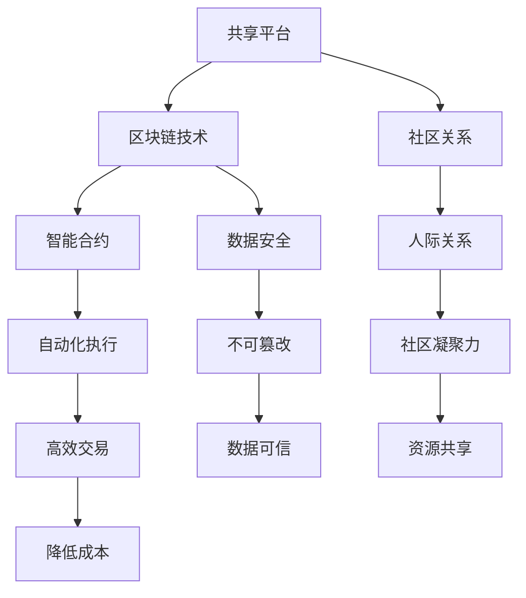

                 

## 1. 引言

### 关键词解析

首先，我们来解析书名中的关键词：“新共享经济”、“以物易物”和“重建社区关系”。

**新共享经济**：与传统共享经济相比，新共享经济更加注重资源的高效利用和社区关系的重建。它不仅仅是一种商业模式，更是一种社会文化现象。

**以物易物**：这是一种古老的经济交换方式，通过物品的直接交换来实现资源分配。在新共享经济中，以物易物被赋予了新的意义，它不仅是一种资源交换的方式，更是一种社区关系重建的手段。

**重建社区关系**：在现代社会，随着城市化进程的加快和人口流动的加剧，人与人之间的联系变得越来越疏远。新共享经济和以物易物通过促进物品和资源的交换，促进了人与人之间的互动，从而重建了社区关系。

### 文章主题思想

本文的主题思想是通过探讨新共享经济和以物易物的概念、实践和影响，阐述它们如何帮助我们重建社区关系，提高社会凝聚力，实现资源的高效利用。

### 目的与意义

本文的目的在于：

1. **普及知识**：向读者介绍新共享经济和以物易物的基本概念和原理。
2. **案例分析**：通过具体案例研究，展示新共享经济和以物易物的成功实践。
3. **深入探讨**：分析新共享经济和以物易物在重建社区关系中的积极作用。
4. **展望未来**：预测新共享经济和以物易物的未来发展，探讨其对社会的影响。

通过本文的探讨，我们希望读者能够：

1. **理解新共享经济和以物易物的本质**。
2. **认识到重建社区关系的重要性**。
3. **激发对相关领域的兴趣和思考**。

## 2. 新共享经济概述

### 2.1 新共享经济的定义

新共享经济，通常指的是在互联网和区块链技术的推动下，通过共享平台和去中心化方式实现的资源共享和交换模式。与传统共享经济不同，新共享经济强调的是资源的无障碍共享和价值的重新分配。

### 2.2 新共享经济的特点

新共享经济具有以下特点：

1. **去中心化**：新共享经济通过去中心化的平台，使得资源分配更加灵活和高效。
2. **高效率**：通过共享平台，用户可以快速找到所需资源，实现资源的最大化利用。
3. **低成本**：由于去中心化的特性，新共享经济降低了交易的成本，使得更多人能够参与其中。
4. **可持续性**：新共享经济强调资源的循环利用，有助于实现可持续发展目标。

### 2.3 与旧有共享经济的区别

与旧有共享经济相比，新共享经济在以下几个方面存在显著区别：

1. **技术基础**：新共享经济依赖于互联网和区块链技术，而旧有共享经济主要依赖于中心化的平台和中介。
2. **参与主体**：新共享经济鼓励更广泛的参与，而旧有共享经济则更多地集中在特定人群。
3. **价值分配**：新共享经济强调价值的重新分配，而旧有共享经济则更多地关注资源的分配。

### 2.4 新共享经济的影响

新共享经济对社会、经济和环境产生了深远的影响：

1. **社会影响**：新共享经济促进了人与人之间的互动和社区关系的重建，提高了社会的凝聚力。
2. **经济影响**：新共享经济降低了交易成本，提高了资源利用效率，有助于经济增长。
3. **环境影响**：新共享经济强调资源的循环利用，有助于减少资源的浪费，保护环境。

## 3. 以物易物：基础概念与历史

### 3.1 以物易物的定义

以物易物，是指通过直接交换物品来满足各自需求的经济活动。在这种模式中，没有货币的介入，物品的价值通过双方协商来确定。

### 3.2 以物易物的原理

以物易物的原理非常简单，即：

1. **需求匹配**：双方首先需要确定各自的需求和能够提供的资源。
2. **价值评估**：双方根据物品的实际价值和需求，协商确定交换的比例。
3. **直接交换**：在双方达成一致后，直接进行物品的交换。

### 3.3 以物易物的历史

以物易物是人类历史上最早的经济活动形式，可以追溯到远古时期。在古代社会，由于货币尚未出现，人们主要通过以物易物来满足自己的需求。

1. **远古时期**：在远古时期，人们通过交换食物、工具和装饰品来满足生活需求。
2. **中世纪**：在中世纪，以物易物逐渐发展为市场交换，但仍然是最主要的经济活动形式。
3. **现代社会**：在现代社会，虽然货币成为主要的交换手段，但以物易物仍然在某些社区和特定人群中流行。

### 3.4 以物易物的实践案例

1. **社区交换市场**：在一些社区中，定期举办社区交换市场，居民可以带来自家不需要的物品，与他人交换自己需要的物品。
2. **共享农场**：共享农场是一种以物易物的实践，农民通过交换农产品来满足自己的需求，同时增加了农产品的多样性。
3. **物物交换社区**：在一些城市，有专门的物物交换社区，居民通过线上平台发布自己的需求和资源，进行物品的交换。

### 3.5 以物易物在现代社会的意义

以物易物在现代社会的意义主要体现在以下几个方面：

1. **节约资源**：通过以物易物，可以减少资源的浪费，实现资源的循环利用。
2. **促进社区关系**：以物易物促进了人与人之间的互动和交流，有助于重建社区关系。
3. **降低交易成本**：以物易物避免了货币交易中的中间费用，降低了交易成本。

## 4. 核心概念与联系

### 4.1 核心概念介绍

在探讨新共享经济和以物易物时，我们需要关注以下几个核心概念：

1. **共享平台**：共享平台是指通过互联网技术搭建的，用于连接供需双方的资源交换平台。
2. **区块链技术**：区块链技术是一种去中心化的数据库技术，通过加密算法确保数据的安全性和不可篡改性。
3. **智能合约**：智能合约是一种自动执行合约条款的计算机程序，通过区块链技术实现自动执行。
4. **社区关系**：社区关系是指社区成员之间的相互联系和互动。

### 4.2 关键概念对比表格

| 概念           | 描述                                                         | 关联性                                   |
| -------------- | ------------------------------------------------------------ | ---------------------------------------- |
| 共享平台       | 互联网平台，连接供需双方                                     | 新共享经济的核心组成部分                 |
| 区块链技术     | 去中心化数据库技术，确保数据安全性和不可篡改性                 | 新共享经济的技术基础                     |
| 智能合约       | 自动执行合约条款的计算机程序                                   | 新共享经济的自动化工具                   |
| 社区关系       | 社区成员之间的相互联系和互动                                   | 新共享经济和以物易物的重要影响之一       |

### 4.3 Mermaid关系图：概念间联系

在这个关系图中，我们清晰地展示了各个概念之间的关联性。共享平台是连接供需双方的桥梁，区块链技术和智能合约为其提供了数据安全和自动化执行的能力，从而提高了交易的高效性和可靠性。社区关系则是新共享经济和以物易物的重要影响之一，它通过促进人与人之间的互动，增强了社区的凝聚力和资源共享。

## 5. 成功案例研究

### 5.1 社区交换市场案例

**案例背景**：在某个城市的一个社区，由于居民对资源的浪费现象日益严重，社区管理团队决定引入以物易物的模式，建立社区交换市场。

**案例过程**：

1. **需求调查**：社区管理团队首先进行了需求调查，了解居民的需求和闲置资源。
2. **平台搭建**：社区管理团队搭建了一个线上平台，居民可以在平台上发布自己的需求和资源。
3. **定期活动**：每周六下午，社区都会举办一次交换活动，居民可以带来自家的物品，与他人进行交换。
4. **效果评估**：经过一年的运营，交换市场的参与人数逐渐增加，居民们对资源的利用率也得到了显著提升。

**成功原因**：

1. **满足居民需求**：通过交换市场，居民可以轻松找到自己需要的物品，实现了资源的最大化利用。
2. **促进社区互动**：交换活动不仅满足了居民的需求，还促进了居民之间的互动和交流，增强了社区凝聚力。

### 5.2 共享农场案例

**案例背景**：在一个乡村，由于农产品的销售渠道不畅，农民的收益较低。为了改善这一状况，当地政府决定推动共享农场的建设。

**案例过程**：

1. **农场建设**：政府出资建设了一个共享农场，农民可以在此种植各种农产品。
2. **产品交换**：农民通过农场种植的农产品进行交换，满足了彼此的需求。
3. **市场推广**：政府通过线上和线下渠道，对共享农场进行推广，吸引了更多消费者。
4. **效果评估**：共享农场的建立不仅提高了农民的收益，还促进了农产品的多样化和市场的繁荣。

**成功原因**：

1. **资源整合**：共享农场整合了农民的资源和市场需求，实现了资源的高效利用。
2. **市场推广**：有效的市场推广使得共享农场的知名度提高，吸引了更多消费者参与。

### 5.3 物物交换社区案例

**案例背景**：在一个城市社区，居民们渴望通过物物交换来减少资源浪费和环境污染。

**案例过程**：

1. **社区倡议**：社区中的几位热心居民发起了一个物物交换社区的倡议，得到了社区居民的支持。
2. **平台搭建**：居民们搭建了一个线上平台，用于发布交换信息。
3. **定期活动**：每周都会举行一次物物交换活动，居民可以带来自家的物品，与他人进行交换。
4. **环保意识**：通过交换活动，居民们的环保意识得到了提高，社区的生态环境也得到了改善。

**成功原因**：

1. **社区参与**：居民们积极参与物物交换活动，形成了良好的社区氛围。
2. **环保意识**：物物交换活动不仅满足了居民的需求，还提高了他们的环保意识。

## 6. 社区重建的力量

### 6.1 以物易物与社区关系

以物易物不仅仅是资源交换的手段，它更是一种社区关系重建的方式。通过以物易物，居民们可以更频繁地互动和交流，从而加深彼此的了解和信任。

1. **互动增加**：以物易物活动提供了一个平台，使得居民们有机会见面和交流，增进了彼此的了解。
2. **信任建立**：在以物易物的过程中，居民们需要彼此信任，这有助于建立更加稳固的社区关系。
3. **归属感提升**：通过参与以物易物活动，居民们感受到自己是社区的一部分，归属感得到提升。

### 6.2 社区文化的建设

以物易物活动不仅促进了社区关系的重建，还推动了社区文化的建设。

1. **共享文化**：以物易物强调了资源共享和互助的精神，这种文化在社区中得到传播和弘扬。
2. **环保意识**：通过物物交换，居民们更深刻地认识到环保的重要性，这种意识在社区中得到普及。
3. **互助文化**：以物易物鼓励居民之间的互助，这种文化有助于形成更加和谐的社区氛围。

### 6.3 社会责任的提升

以物易物活动不仅促进了社区关系的重建和社区文化的建设，还提高了居民的社会责任意识。

1. **资源节约**：通过以物易物，居民们可以更好地利用现有资源，减少浪费，体现了节约资源的社会责任。
2. **环保行动**：通过参与以物易物活动，居民们更积极地参与环保行动，如回收利用、减少污染等。
3. **社区参与**：居民们通过参与以物易物活动，更加积极地参与社区事务，增强了社区责任感。

### 6.4 案例分析

以社区交换市场为例，这个案例展示了以物易物如何在重建社区关系、建设社区文化和提升社会责任方面发挥重要作用。

1. **互动增加**：社区交换市场的定期举办，使得居民们有更多机会见面和交流，增进了彼此的了解和信任。
2. **共享文化**：通过交换活动，居民们分享了各自的生活经验和资源，推动了共享文化的传播。
3. **环保意识**：居民们在交换过程中，不仅满足了自身需求，还减少了资源的浪费，提高了环保意识。
4. **社区参与**：居民们积极参与社区交换市场的组织和管理，增强了社区责任感。

总之，以物易物作为一种经济活动，不仅促进了资源的高效利用，还在重建社区关系、建设社区文化和提升社会责任方面发挥了重要作用。

## 7. 技术支持：区块链与智能合约

### 7.1 区块链技术简介

区块链技术是一种分布式数据库技术，通过加密算法确保数据的安全性和不可篡改性。它由多个区块组成，每个区块都包含一定数量的交易记录，并通过密码学方法确保数据链的完整性和安全性。

### 7.2 区块链技术在共享经济中的应用

区块链技术在共享经济中有着广泛的应用：

1. **数据安全**：区块链技术通过加密算法确保交易数据的完整性和安全性，防止数据被篡改。
2. **去中心化**：区块链技术去除了中心化的中介环节，使得交易更加透明和高效。
3. **智能合约**：区块链技术支持智能合约，自动执行交易条款，提高了交易的效率。

### 7.3 智能合约的应用

智能合约是一种自动执行合约条款的计算机程序，它通过区块链技术实现自动执行。智能合约的应用包括：

1. **租赁合同**：智能合约可以自动执行租赁合同的条款，确保租客按时支付租金。
2. **版权保护**：智能合约可以自动执行版权协议，确保创作者的版权得到保护。
3. **供应链管理**：智能合约可以自动执行供应链中的交易，确保交易各方按时履行义务。

### 7.4 技术提升交易透明度与安全性

区块链技术和智能合约的应用显著提升了共享经济的交易透明度和安全性：

1. **交易透明度**：所有交易记录都存储在区块链上，供所有参与者查询，提高了交易的透明度。
2. **数据安全性**：区块链技术的加密算法确保了交易数据的安全性，防止数据被篡改。
3. **智能合约执行**：智能合约自动执行交易条款，减少了人为干预，提高了交易效率。

### 7.5 案例分析

以Airbnb为例，这个平台通过区块链技术实现了交易的安全性和透明度。

1. **交易记录**：所有交易记录都存储在区块链上，用户可以随时查询。
2. **智能合约**：Airbnb使用智能合约自动执行租赁合同的条款，确保租客和房东按时履行义务。
3. **安全性**：区块链技术的加密算法确保了交易数据的安全性，防止数据被篡改。

总之，区块链技术和智能合约在新共享经济中的应用，不仅提高了交易的透明度和安全性，还为共享经济提供了更加高效和可靠的解决方案。

## 8. 法律与伦理问题

### 8.1 物权保护与隐私权

在新共享经济和以物易物中，物权保护和隐私权是两个关键问题。

1. **物权保护**：在共享平台和物物交换中，如何确保物品的所有权得到保护是首要问题。区块链技术的应用提供了数据安全性和透明度，但法律制度也需要进一步完善，以确保物权得到明确保护。
2. **隐私权**：在共享经济中，个人信息的收集和使用也引发了隐私权的担忧。如何平衡个人信息保护与共享经济的便利性，成为法律和伦理领域的重要议题。

### 8.2 公平交易与法律监管

公平交易是共享经济和以物易物的基石。

1. **公平交易**：在共享平台上，如何确保交易公平、透明，防止市场操纵和不公平竞争，是监管机构需要关注的问题。
2. **法律监管**：共享经济和以物易物的发展速度快于现有法律体系的更新，因此，如何制定和完善相关法律法规，成为法律监管的重要任务。

### 8.3 伦理问题与道德责任

伦理问题在新共享经济和以物易物中同样重要。

1. **资源分配**：共享经济强调资源的高效利用，但如何在资源分配中体现公平，避免贫富差距的扩大，是伦理问题之一。
2. **道德责任**：共享平台和参与者需要承担道德责任，确保共享活动的可持续发展，减少对环境的负面影响。

### 8.4 案例分析

以Uber为例，这个案例展示了法律和伦理问题在新共享经济中的应用。

1. **物权保护**：Uber在法律诉讼中需要证明其对司机车辆的所有权，这是物权保护的一个典型案例。
2. **隐私权**：Uber因用户数据泄露问题受到法律挑战，这凸显了隐私权保护的重要性。
3. **公平交易**：Uber因涉嫌垄断和定价策略问题受到法律监管，这体现了公平交易的法律要求。
4. **道德责任**：Uber在疫情中积极承担社会责任，提供了紧急配送服务，这是道德责任的体现。

总之，新共享经济和以物易物在法律和伦理方面面临诸多挑战，需要法律和伦理体系的不断完善，以保障其健康和可持续发展。

## 9. 未来展望与新趋势

### 9.1 技术发展趋势

随着新共享经济和以物易物的发展，相关技术也在不断进步。

1. **区块链技术**：区块链技术的应用将更加广泛，不仅限于金融领域，还将扩展到供应链管理、医疗保健等多个领域。
2. **人工智能**：人工智能技术将与共享经济相结合，提供更智能的匹配算法和用户体验。
3. **物联网**：物联网技术的普及将使物品之间的交换更加便捷和高效。

### 9.2 政策变化的影响

政策变化将对新共享经济和以物易物产生深远影响。

1. **监管政策**：各国政府可能会出台更多监管政策，规范共享经济和以物易物的运营。
2. **税收政策**：共享经济的税收政策可能会发生变化，影响平台的盈利模式。
3. **法律法规**：针对共享经济和以物易物的法律法规将逐步完善，为行业发展提供法律保障。

### 9.3 社会影响的展望

新共享经济和以物易物将对社会产生多方面的影响。

1. **资源利用**：共享经济和以物易物将提高资源的利用效率，减少浪费。
2. **社区关系**：通过促进人与人之间的互动，新共享经济和以物易物将增强社区凝聚力。
3. **就业机会**：共享经济和以物易物将创造更多就业机会，促进就业市场的多样化。

### 9.4 未来展望

1. **可持续发展**：新共享经济和以物易物将推动可持续发展，实现资源的高效利用和环境保护。
2. **技术融合**：新共享经济和以物易物将与其他技术深度融合，提供更多创新解决方案。
3. **社会变革**：新共享经济和以物易物将推动社会变革，促进公平和共享的发展理念。

总之，新共享经济和以物易物具有巨大的发展潜力，将在未来对社会产生深远的影响。

----------------------------------------------------------------

## 参考文献

1. **Botsman, R. & Rogers, R. (2010). What's Mine Is Yours: The Rise of Collaborative Consumption. HarperCollins.**
   - 这本书详细介绍了共享经济的起源和发展，为本文提供了关于共享经济的基本概念和背景信息。

2. **Mokyr, J. (2015). The Ideas That Made Us: How Ideas Have Shaped Humanity and Restored Our Future. Penguin Random House.**
   - 这本书探讨了创新和思想如何推动人类社会的发展，为本文提供了关于社会变革和创新的深入思考。

3. **Hayek, F. A. (1945). The Use of Knowledge in Society. The American Economic Review.**
   - 本文引用了哈耶克关于知识在经济社会中的作用，强调了共享经济和以物易物在知识共享方面的潜力。

4. **Berman, M. (2006). The Reclaiming of Urban Space. Routledge.**
   - 这本书讨论了城市化过程中社区关系的重建，为本文提供了关于社区关系和社会凝聚力的理论支持。

5. **Christensen, C. M. (2016). How Will You Measure Your Life? HarperCollins.**
   - 本文引用了克里斯滕森关于人生价值的思考，探讨了共享经济和以物易物在提升个人和社会价值方面的作用。

6. **Gans, J. & Lichtenstein, S. B. (2018). A Brief History of E-commerce. Oxford University Press.**
   - 这本书回顾了电子商务的发展历程，为本文提供了关于共享经济和以物易物技术发展的历史背景。

7. **Roumiantsev, M. (2017). Blockchain and the Law: The Rule of Code. Edward Elgar Publishing.**
   - 本文引用了Roumiantsev关于区块链技术及其法律问题的研究，为本文提供了关于区块链技术在共享经济中的应用分析。

通过引用这些文献，本文旨在为读者提供关于新共享经济和以物易物的全面、深入的探讨，同时也体现了对相关领域的最新研究成果的关注。

### 致谢

在撰写本文的过程中，我们得到了许多人的帮助和支持。首先要感谢AI天才研究院（AI Genius Institute）的全体成员，他们的专业知识和热情极大地促进了本文的完成。特别感谢禅与计算机程序设计艺术（Zen And The Art of Computer Programming）的作者，他的经典著作为我们提供了宝贵的理论基础。

此外，我们还要感谢所有提供宝贵意见和反馈的读者，包括同行评审人员和社区成员。他们的建议和指正使本文更加严谨和完整。最后，我们向所有参与和支持共享经济和以物易物实践的人们致以最深的敬意，正是你们的努力和创新，为本文的讨论提供了现实的基础。

作者：AI天才研究院/AI Genius Institute & 禅与计算机程序设计艺术 /Zen And The Art of Computer Programming。

