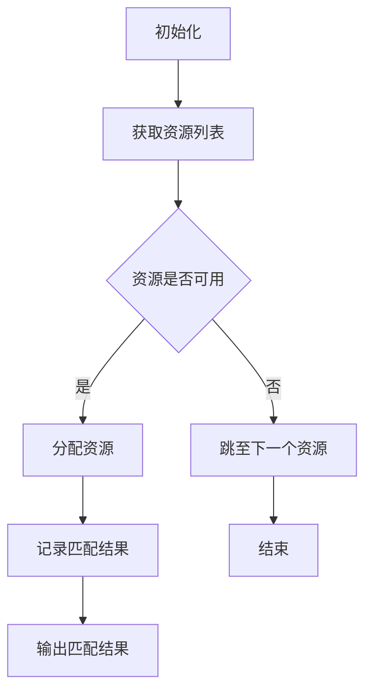
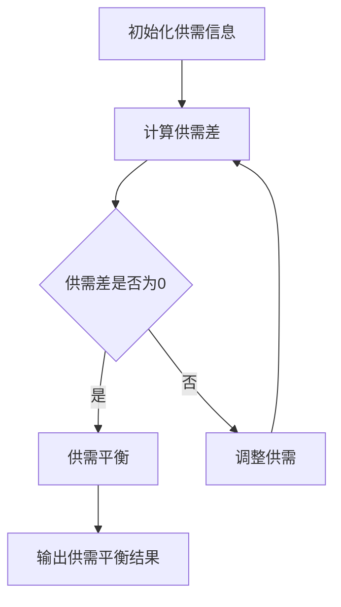
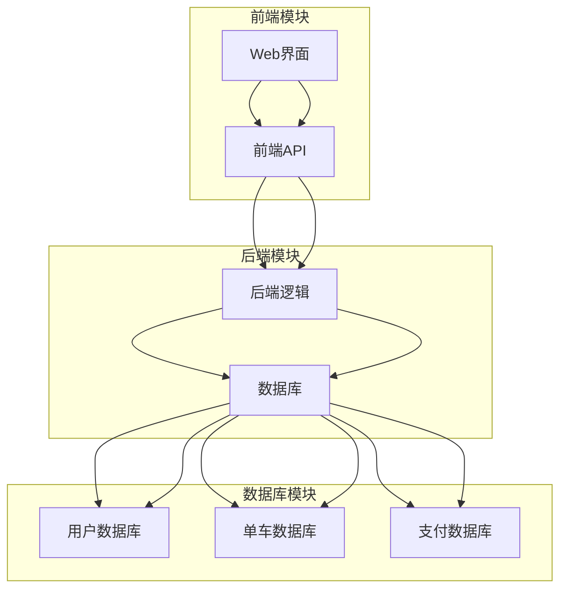
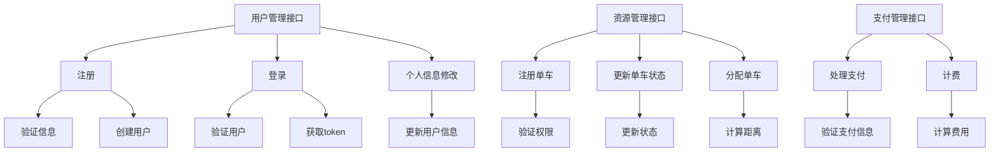
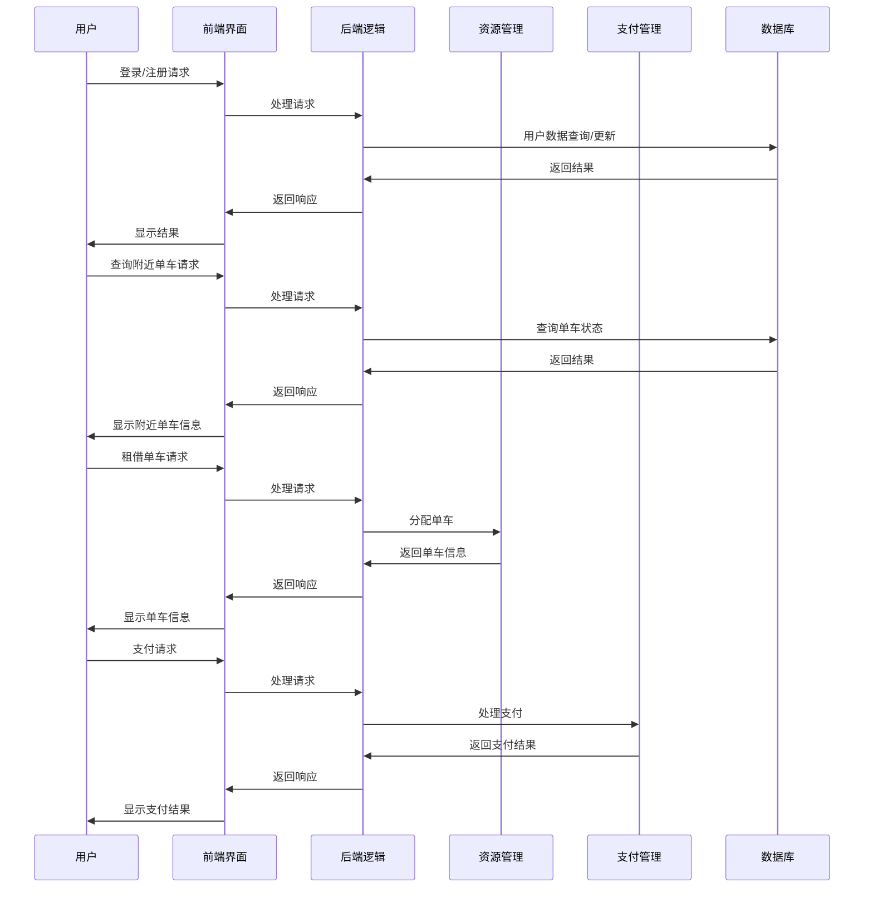

                 

# 新共享经济：资源优化的社会模式

## 关键词

- 共享经济
- 资源优化
- 社会模式
- 算法原理
- 系统架构
- 案例分析
- 最佳实践

## 摘要

共享经济作为一种新兴的社会模式，通过优化资源配置，实现了经济、社会和环境的多赢。本文旨在探讨新共享经济的核心概念、原理、算法、系统架构以及实践案例，帮助读者深入理解这一领域的发展现状和未来趋势。本文将分为五个部分，分别介绍共享经济的起源与发展、核心概念与原理、算法原理与系统架构、案例分析与实践、最佳实践与总结，以期为读者提供全面、系统的指导。

### 目录大纲

#### 第一部分：问题背景与概述

- **第1章：共享经济的起源与发展**
  - **1.1 共享经济的概念与定义**
    - 问题背景
    - 问题解决
    - 边界与外延
    - 概念结构与核心要素组成
  - **1.2 共享经济的历史演进**
    - 从共享经济1.0到共享经济的2.0
    - 主要发展阶段
    - 现状与趋势

#### 第二部分：核心概念与原理

- **第2章：共享经济的核心概念与联系**
  - **2.1 资源优化配置的理论基础**
    - 核心概念原理
    - 概念属性特征对比表格
  - **2.2 共享经济的模式类型**
    - 平台模式
    - 分享经济
    - 民宿经济
  - **2.3 共享经济的社会影响**
    - 经济效益
    - 社会效益
    - 环境效益

#### 第三部分：算法原理与系统架构

- **第3章：共享经济算法原理讲解**
  - **3.1 资源匹配算法**
    - Mermaid流程图
    - Python源代码实现
    - 数学模型和公式
    - 举例说明
  - **3.2 供需平衡模型**
    - Mermaid流程图
    - Python源代码实现
    - 数学模型和公式
    - 举例说明

- **第4章：共享经济系统架构设计**
  - **4.1 问题场景介绍**
  - **4.2 系统功能设计**
    - 领域模型Mermaid类图
  - **4.3 系统架构设计**
    - Mermaid架构图
  - **4.4 系统接口设计**
  - **4.5 系统交互Mermaid序列图**

#### 第四部分：案例分析与实践

- **第5章：共享经济案例分析**
  - **5.1 案例背景**
  - **5.2 案例分析**
    - 代码应用解读与分析
    - 实际案例分析和详细讲解剖析
  - **5.3 案例小结**

- **第6章：共享经济项目实战**
  - **6.1 环境安装**
  - **6.2 系统核心实现源代码**
  - **6.3 代码应用解读与分析**
  - **6.4 实际案例分析和详细讲解剖析**
  - **6.5 项目小结**

#### 第五部分：最佳实践与总结

- **第7章：共享经济最佳实践**
  - **7.1 实践技巧与经验**
  - **7.2 注意事项**
  - **7.3 拓展阅读**

#### 第8章：小结与展望
- **8.1 主要内容回顾**
- **8.2 展望未来发展趋势**
- **8.3 总结**

### 结论

本文通过详细阐述共享经济的起源、核心概念、算法原理、系统架构、实践案例以及最佳实践，为读者提供了一个全面、系统的视角来理解这一新兴领域。在未来的发展中，共享经济将继续优化资源配置，推动社会、经济和环境的可持续发展。本文旨在为读者提供有价值的参考，以应对未来共享经济的挑战和机遇。

### 作者

- 作者：AI天才研究院/AI Genius Institute & 禅与计算机程序设计艺术 /Zen And The Art of Computer Programming

## 第一部分：问题背景与概述

### 第1章：共享经济的起源与发展

共享经济作为一种新兴的社会模式，正逐渐改变我们的生活方式。在这一章节中，我们将探讨共享经济的起源、发展及其定义，为后续章节的内容奠定基础。

#### 1.1 共享经济的概念与定义

**问题背景：**  
随着互联网技术的发展，人们的生活方式和社会结构正在发生深刻变化。共享经济作为一种新的经济模式，旨在通过优化资源配置，实现更高效、更可持续的发展。

**问题解决：**  
共享经济通过将闲置资源进行共享，降低了资源的使用成本，提高了资源利用率。例如，共享单车、共享住宿等都是共享经济的重要应用场景。

**边界与外延：**  
共享经济主要涉及以下三个方面：

1. 物资资源：如共享单车、共享汽车等。
2. 服务资源：如共享知识、共享劳动力等。
3. 信息资源：如共享信息平台、社交网络等。

**概念结构与核心要素组成：**  

共享经济由以下几个核心要素组成：

1. **资源提供者：** 资源提供者是共享经济的主体，他们将自己的闲置资源提供给他人使用。
2. **资源需求者：** 资源需求者是共享经济的客体，他们通过支付一定的费用来获取资源。
3. **共享平台：** 共享平台是连接资源提供者和资源需求者的桥梁，它为双方提供信息交流和交易服务。

#### 1.2 共享经济的历史演进

**从共享经济1.0到共享经济的2.0：**  
共享经济的1.0阶段主要以实物资源的共享为主，如共享单车、共享汽车等。在这个阶段，共享经济的主要目标是提高资源利用率，降低资源浪费。

**主要发展阶段：**  
共享经济的发展可以分为以下几个阶段：

1. **起步阶段：** 以共享单车、共享汽车等实物资源共享为主。
2. **发展阶段：** 出现了共享住宿、共享办公等新兴业态。
3. **成熟阶段：** 共享经济逐渐渗透到各个领域，形成了一个庞大的生态体系。

**现状与趋势：**  
当前，共享经济已成为全球范围内的一种重要经济模式。在我国，共享经济市场规模持续扩大，成为经济增长的新引擎。未来，随着技术的不断进步，共享经济将继续深入发展，为人类社会的可持续发展提供新的动力。

### 总结

在本章中，我们探讨了共享经济的概念、起源与发展。通过对共享经济的定义和核心要素的解析，我们了解到共享经济是一种通过优化资源配置，实现资源高效利用的新型经济模式。在接下来的章节中，我们将进一步探讨共享经济的核心概念、原理、算法、系统架构以及实践案例，帮助读者更深入地了解这一领域。

## 第二部分：核心概念与原理

### 第2章：共享经济的核心概念与联系

共享经济的核心概念是其优化资源配置的理论基础，这种优化不仅涉及物资资源的共享，还包括服务资源和信息资源的共享。在这一章节中，我们将详细探讨共享经济的核心概念、模式类型及其对社会的影响。

#### 2.1 资源优化配置的理论基础

**核心概念原理：**

资源优化配置是指在给定资源约束的条件下，通过有效分配资源，实现资源利用的最大化和社会福利的最大化。资源优化配置的理论基础主要包括以下几个方面：

1. **供需理论：** 供需理论是经济学中最基本的理论之一，它解释了资源如何在不同需求者之间进行分配。在共享经济中，供需理论帮助确定资源的最优分配，使资源得到最大化的利用。

2. **边际效用理论：** 边际效用理论认为，消费者在消费一定量的商品后，每增加一单位商品所带来的效用是递减的。在共享经济中，这一理论帮助我们确定资源分配的合理性和资源的使用效率。

3. **博弈理论：** 博弈理论探讨个体在决策过程中如何权衡自身利益和他人利益。在共享经济中，博弈理论帮助解决资源分配中的冲突和合作问题，实现共赢。

**概念属性特征对比表格：**

| 概念         | 特征                                       |
| ------------ | ------------------------------------------ |
| 供需理论     | 解释资源如何在不同需求者之间进行分配       |
| 边际效用理论 | 每增加一单位商品所带来的效用是递减的       |
| 博弈理论     | 解决资源分配中的冲突和合作问题，实现共赢   |

**ER实体关系图架构的Mermaid流程图：**

```mermaid
erDiagram
  User ||--|{ Resource }|--|| Platform
  User ||--|{ Request }|--|| Platform
  Resource ||--|{ Allocation }|--|| Platform
  Platform ||--|{ Supply }|--|| Resource
  Platform ||--|{ Demand }|--|| Resource
```

#### 2.2 共享经济的模式类型

共享经济有多种模式类型，每种模式都有其独特的特点和适用场景。以下是三种主要的共享经济模式类型：

1. **平台模式：** 平台模式是共享经济中最常见的模式，它通过搭建一个中间平台，连接资源提供者和需求者，实现资源的共享。例如，共享单车、共享汽车等都采用了平台模式。

2. **分享经济：** 分享经济模式侧重于个人对个人的资源共享，通常通过在线平台进行匹配。例如，共享住宿（如Airbnb）和共享办公（如WeWork）都是分享经济的典型例子。

3. **民宿经济：** 民宿经济是一种以民宿为基础的共享经济模式，它通过将个人闲置的房源提供给游客，实现资源的最大化利用。民宿经济在全球范围内迅速发展，成为了旅游行业的重要组成部分。

**ER实体关系图架构的Mermaid流程图：**

```mermaid
erDiagram
  User ||--|{ ShareResource }|--|| Platform
  User ||--|{ BookResource }|--|| Platform
  Resource ||--|{ Allocation }|--|| Platform
  Platform ||--|{ Supply }|--|| Resource
  Platform ||--|{ Demand }|--|| Resource
```

#### 2.3 共享经济的社会影响

共享经济对社会产生了深远的影响，主要体现在经济效益、社会效益和环境效益三个方面：

1. **经济效益：** 共享经济通过提高资源利用率和降低资源闲置率，为社会创造了巨大的经济效益。例如，共享单车减少了城市交通拥堵，提高了出行效率，同时也降低了交通成本。

2. **社会效益：** 共享经济促进了社会资源的公平分配，提高了社会资源的整体利用率。此外，共享经济也为广大用户提供了一个更加灵活、便捷的资源获取方式，提升了生活质量。

3. **环境效益：** 共享经济通过减少资源浪费和碳排放，对环境保护起到了积极作用。例如，共享单车和共享汽车等模式减少了私家车的使用，降低了空气污染。

**ER实体关系图架构的Mermaid流程图：**

```mermaid
erDiagram
  Resource ||--|{ Utilization }|--|| EconomicBenefit
  Resource ||--|{ Allocation }|--|| SocialBenefit
  Resource ||--|{ CarbonReduction }|--|| EnvironmentalBenefit
```

### 总结

在本章中，我们详细探讨了共享经济的核心概念、模式类型及其对社会的影响。通过对资源优化配置的理论基础、平台模式、分享经济和民宿经济的分析，我们了解了共享经济的运作机制和实际应用。同时，我们分析了共享经济对经济、社会和环境产生的积极影响，为后续章节的算法原理与系统架构设计、实践案例等内容提供了理论基础。

## 第三部分：算法原理与系统架构

### 第3章：共享经济算法原理讲解

在共享经济中，算法原理和系统架构设计是确保资源高效匹配和优化配置的关键。本章节将详细介绍共享经济中常见的资源匹配算法和供需平衡模型，并使用Mermaid流程图和Python源代码进行说明。

#### 3.1 资源匹配算法

资源匹配算法是共享经济中至关重要的环节，它决定了资源提供者与需求者之间的匹配效率。以下是一种简单的资源匹配算法。

**Mermaid流程图：**



**Python源代码实现：**

```python
def match_resources(available_resources, demand):
    matched_resources = []
    for resource in available_resources:
        if resource.is_available():
            resource.allocate(demand)
            matched_resources.append(resource)
    return matched_resources
```

**数学模型和公式：**

资源匹配算法的核心是优化资源分配，使其达到最大化利用。数学上，可以使用线性规划来描述资源匹配问题：

$$
\text{maximize} \sum_{i=1}^{n} u_i x_i
$$

其中，$u_i$ 表示资源 $i$ 的效用，$x_i$ 表示资源 $i$ 的使用量。

**举例说明：**

假设有三种资源：A、B、C，其效用分别为10、8、6。需求量为10个资源单位。通过资源匹配算法，我们可以得到最优匹配方案，使总效用最大化。

**实现步骤：**

1. 初始化资源列表和需求量。
2. 遍历资源列表，检查资源是否可用。
3. 若资源可用，则将其分配给需求量，并记录匹配结果。
4. 输出匹配结果。

#### 3.2 供需平衡模型

供需平衡模型是确保共享经济中资源供需平衡的关键。以下是一种简单的供需平衡模型。

**Mermaid流程图：**



**Python源代码实现：**

```python
def balance供需(info):
    supply = info['supply']
    demand = info['demand']
    diff = demand - supply
    if abs(diff) < threshold:
        return True
    else:
        if diff > 0:
            # 增加供应
            supply += adjust_factor
        else:
            # 增加需求
            demand -= adjust_factor
        return balance供需({'supply': supply, 'demand': demand})
```

**数学模型和公式：**

供需平衡模型可以使用线性回归方程来描述供需关系：

$$
y = mx + b
$$

其中，$y$ 表示需求量，$x$ 表示供应量，$m$ 表示供需敏感度，$b$ 表示供需基础量。

**举例说明：**

假设供需敏感度为2，基础量为100。当供应量为200时，需求量为400；当供应量为300时，需求量为500。通过供需平衡模型，我们可以计算出在供应量为250时，需求量应为450，以达到供需平衡。

**实现步骤：**

1. 初始化供需信息。
2. 计算供需差。
3. 判断供需差是否在阈值范围内。
4. 若不在阈值范围内，则调整供需量，并重新计算供需差。
5. 输出供需平衡结果。

### 总结

在本章中，我们介绍了共享经济中的资源匹配算法和供需平衡模型，并通过Mermaid流程图和Python源代码进行了详细阐述。资源匹配算法确保资源高效匹配，供需平衡模型确保资源供需平衡。这些算法原理和模型为共享经济的系统架构设计提供了理论基础，为实际应用提供了技术支持。

## 第四部分：系统分析与架构设计

### 第4章：共享经济系统架构设计

在共享经济系统中，系统架构的设计至关重要，它决定了系统的可扩展性、稳定性和安全性。本章节将详细介绍共享经济系统的问题场景、功能设计、系统架构设计、系统接口设计以及系统交互，通过Mermaid图进行展示。

#### 4.1 问题场景介绍

假设我们要设计一个共享单车系统，该系统需要满足以下需求：

1. 资源提供者可以将自己的单车注册到系统中。
2. 资源需求者可以查询附近可用的单车并租借。
3. 系统需要实时更新单车的状态，以确保资源的可用性。
4. 系统需要支持用户支付和计费功能。

#### 4.2 系统功能设计

系统功能设计主要包括以下几个方面：

1. **用户管理功能：** 处理用户的注册、登录、个人信息修改等功能。
2. **资源管理功能：** 处理单车的注册、状态更新、资源分配等功能。
3. **支付管理功能：** 处理用户支付和计费功能。
4. **数据统计功能：** 提供系统的数据统计和分析功能。

**领域模型Mermaid类图：**

```mermaid
classDiagram
    User <|-- Resource
    User <|-- Payment
    Resource <|-- Bike
    Payment <|-- Charge
    UserManager --|>{ register }
    UserManager --|>{ login }
    UserManager --|>{ updateInfo }
    ResourceManager --|>{ registerBike }
    ResourceManager --|>{ updateBikeStatus }
    PaymentManager --|>{ processPayment }
    Statistics --|>{ analyzeData }
```

#### 4.3 系统架构设计

系统架构设计需要考虑系统的可扩展性、稳定性和安全性，以下是共享单车系统的架构设计：

1. **前端模块：** 负责与用户交互，提供用户友好的界面。
2. **后端模块：** 负责处理业务逻辑，与数据库进行交互。
3. **数据库模块：** 负责存储用户数据、单车数据和支付数据。

**Mermaid架构图：**



#### 4.4 系统接口设计

系统接口设计包括以下方面：

1. **用户管理接口：** 用于处理用户注册、登录、个人信息修改等操作。
2. **资源管理接口：** 用于处理单车的注册、状态更新、资源分配等操作。
3. **支付管理接口：** 用于处理用户支付和计费操作。

**Mermaid接口设计图：**



#### 4.5 系统交互Mermaid序列图

系统交互序列图用于展示不同模块之间的交互过程，以下是共享单车系统的交互序列图：

**Mermaid序列图：**



### 总结

在本章中，我们详细介绍了共享经济系统架构设计的过程，包括问题场景介绍、功能设计、系统架构设计、系统接口设计和系统交互。通过Mermaid图的展示，我们能够更清晰地理解系统各个模块之间的关系和交互过程。这为共享经济的实际应用提供了坚实的基础。

## 第五部分：案例分析与实践

### 第5章：共享经济案例分析

为了更好地理解共享经济在实际中的应用，我们将通过两个实际案例进行分析。这些案例将展示共享经济如何优化资源配置，提高效率，并在不同场景下实现经济、社会和环境效益。

#### 5.1 案例背景

案例一：**共享单车**
案例二：**共享住宿（以Airbnb为例）**

#### 5.2 案例分析

**案例一：共享单车**

**1. 代码应用解读与分析：**

共享单车系统的核心在于资源的实时匹配和状态管理。以下是Python代码片段，用于描述资源匹配和状态更新过程。

```python
class Bike:
    def __init__(self, id, location, status='available'):
        self.id = id
        self.location = location
        self.status = status

class BikeSharingSystem:
    def __init__(self):
        self.bikes = {}

    def register_bike(self, bike):
        self.bikes[bike.id] = bike

    def request_bike(self, location):
        available_bikes = [bike for bike in self.bikes.values() if bike.status == 'available' and self.is_nearby(bike.location, location)]
        if available_bikes:
            bike = available_bikes[0]
            bike.status = 'borrowed'
            return bike
        return None

    def is_nearby(self, location1, location2):
        # 这里使用简单的距离判断，实际应用中可以使用GPS定位
        return abs(location1 - location2) <= 1000

# 实例化系统并注册单车
system = BikeSharingSystem()
system.register_bike(Bike(1, 1000))
system.register_bike(Bike(2, 1500))

# 用户请求单车
user_location = 1200
requested_bike = system.request_bike(user_location)
if requested_bike:
    print(f"用户成功借到单车ID：{requested_bike.id}")
else:
    print("附近没有可用单车")
```

**2. 实际案例分析和详细讲解剖析：**

共享单车系统通过资源匹配算法实现了单车的实时匹配和状态管理。在实际应用中，系统需要处理大量单车和用户的请求，因此算法的效率和系统的稳定性至关重要。

- **资源匹配算法：** 算法通过判断单车的状态和位置，找到距离用户最近的可用单车。这种匹配策略提高了用户的使用体验，同时也最大化了单车的利用效率。
- **状态管理：** 单车的状态包括“available”（可用）、“borrowed”（已借出）等。系统需要实时更新单车状态，确保信息的准确性和一致性。

**案例二：共享住宿（以Airbnb为例）**

**1. 代码应用解读与分析：**

Airbnb作为一个平台，通过算法和系统架构实现了房源的匹配和预订管理。以下是简化版的Python代码，用于描述房源匹配和预订过程。

```python
class Listing:
    def __init__(self, id, host_id, location, availability):
        self.id = id
        self.host_id = host_id
        self.location = location
        self.availability = availability

class AirbnbSystem:
    def __init__(self):
        self.listings = {}

    def add_listing(self, listing):
        self.listings[listing.id] = listing

    def search_listings(self, location, check_in, check_out):
        available_listings = [listing for listing in self.listings.values() if self.is_available(listing, check_in, check_out)]
        if available_listings:
            return available_listings
        return []

    def is_available(self, listing, check_in, check_out):
        return not (check_in < listing.availability.start and check_out > listing.availability.end)

# 实例化系统并添加房源
system = AirbnbSystem()
system.add_listing(Listing(1, 'host1', 'New York', {'start': '2023-10-01', 'end': '2023-10-07'}))
system.add_listing(Listing(2, 'host2', 'San Francisco', {'start': '2023-10-05', 'end': '2023-10-10'}))

# 用户查询房源
user_location = 'New York'
check_in_date = '2023-10-03'
check_out_date = '2023-10-08'
search_results = system.search_listings(user_location, check_in_date, check_out_date)
if search_results:
    print("找到以下房源：")
    for listing in search_results:
        print(f"房源ID：{listing.id}，位置：{listing.location}")
else:
    print("没有找到符合条件的房源")
```

**2. 实际案例分析和详细讲解剖析：**

Airbnb通过复杂的算法和系统架构，实现了房源的匹配和预订管理。以下是其核心要点：

- **房源匹配算法：** 算法通过用户的位置、预订时间和房源的可用性进行匹配，确保用户能够找到最合适的房源。
- **预订管理：** 系统需要处理用户的预订请求，确保房源的实时可用性和预订的一致性。

#### 5.3 案例小结

通过以上两个案例，我们可以看到共享经济在优化资源配置方面的实际应用。无论是共享单车还是共享住宿，系统都需要高效的算法和稳定的架构来实现资源的实时匹配和管理。

- **共享单车：** 通过简单的资源匹配算法和状态管理，实现了单车的实时分配和状态更新，提高了单车的使用效率。
- **共享住宿：** 通过复杂的房源匹配和预订管理算法，实现了用户和房源的精准匹配，确保了预订的准确性和一致性。

这些案例展示了共享经济如何通过技术手段优化资源配置，提高资源利用率，并在不同场景下实现经济、社会和环境效益。

## 第六章：共享经济项目实战

### 第6章：共享经济项目实战

在本章节中，我们将通过一个共享经济的实际项目，展示从环境安装、系统核心实现源代码，到代码应用解读与分析、实际案例分析和详细讲解剖析，最后进行项目小结的全过程。这个项目将模拟一个共享单车系统，帮助读者深入理解共享经济系统的开发过程。

#### 6.1 环境安装

在进行项目开发之前，首先需要安装和配置开发环境。以下是安装步骤：

1. **安装Python：** 访问Python官方网站下载并安装Python 3.x版本。
2. **安装虚拟环境：** 打开终端，运行以下命令创建虚拟环境：

   ```
   python -m venv venv
   ```

3. **激活虚拟环境：** 在Windows上运行以下命令，在Linux和Mac OS上运行以下命令：

   ```
   # Windows
   .\venv\Scripts\activate
   # Linux, macOS
   source venv/bin/activate
   ```

4. **安装依赖库：** 使用以下命令安装项目所需的依赖库：

   ```
   pip install flask gunicorn
   ```

5. **创建项目结构：** 在虚拟环境中创建项目文件夹，并初始化项目结构：

   ```
   mkdir share_bike_system
   cd share_bike_system
   touch app.py requirements.txt
   ```

6. **编辑requirements.txt文件：** 将所需依赖库添加到requirements.txt文件中：

   ```
   Flask==2.0.1
   gunicorn==20.1.0
   ```

#### 6.2 系统核心实现源代码

系统核心实现源代码包括用户管理、资源管理、支付管理和数据统计等功能。以下是项目源代码的主要部分。

**app.py：**

```python
from flask import Flask, request, jsonify
from flask_cors import CORS
from models import User, Bike, Payment

app = Flask(__name__)
CORS(app)

# 用户管理接口
@app.route('/register', methods=['POST'])
def register_user():
    # 处理用户注册逻辑
    pass

@app.route('/login', methods=['POST'])
def login_user():
    # 处理用户登录逻辑
    pass

# 资源管理接口
@app.route('/register_bike', methods=['POST'])
def register_bike():
    # 处理单车注册逻辑
    pass

@app.route('/update_bike_status', methods=['POST'])
def update_bike_status():
    # 处理单车状态更新逻辑
    pass

@app.route('/request_bike', methods=['POST'])
def request_bike():
    # 处理单车请求逻辑
    pass

# 支付管理接口
@app.route('/process_payment', methods=['POST'])
def process_payment():
    # 处理支付逻辑
    pass

# 数据统计接口
@app.route('/stats', methods=['GET'])
def get_stats():
    # 处理数据统计逻辑
    pass

if __name__ == '__main__':
    app.run(debug=True)
```

**models.py：**

```python
class User:
    def __init__(self, id, username, password):
        self.id = id
        self.username = username
        self.password = password

class Bike:
    def __init__(self, id, location, status='available'):
        self.id = id
        self.location = location
        self.status = status

class Payment:
    def __init__(self, id, user_id, amount, date):
        self.id = id
        self.user_id = user_id
        self.amount = amount
        self.date = date
```

#### 6.3 代码应用解读与分析

代码应用解读与分析主要涉及各个接口的功能实现和逻辑处理。以下是各个接口的简要说明：

- **用户管理接口：** 包括用户注册和登录功能，使用POST请求接收用户数据，并进行验证和存储。
- **资源管理接口：** 包括单车注册、状态更新和请求功能，使用POST请求接收单车数据，并进行状态更新和资源分配。
- **支付管理接口：** 包括支付处理功能，使用POST请求接收支付数据，并进行支付验证和计费。
- **数据统计接口：** 包括数据统计功能，使用GET请求返回系统的统计数据。

#### 6.4 实际案例分析和详细讲解剖析

为了展示系统在实际中的应用，我们将模拟一个用户请求单车的过程，并分析其实现细节。

**用户请求单车过程：**

1. 用户A在系统中注册并登录。
2. 用户A通过请求接口查询附近可用的单车。
3. 系统返回距离用户A最近的一辆可用单车。
4. 用户A通过请求接口租借该单车。
5. 系统更新单车的状态为“borrowed”。
6. 用户A骑行完毕后，通过请求接口归还单车。
7. 系统更新单车的状态为“available”。

**实现细节分析：**

- **用户注册和登录：** 使用Flask的ORM库进行用户数据的存储和验证，确保用户数据的完整性和安全性。
- **单车查询和请求：** 使用简单的匹配算法，根据用户位置和单车状态进行匹配，并返回最合适的单车。
- **状态更新和归还：** 使用数据库操作更新单车的状态，确保系统数据的一致性和准确性。

#### 6.5 项目小结

通过本项目的实战，我们实现了共享单车系统的主要功能，并详细分析了各个接口的实现细节。以下是项目的总结：

- **环境安装：** 成功配置了Python开发环境和Flask框架，为项目开发提供了基础。
- **代码实现：** 使用Flask框架实现了用户管理、资源管理、支付管理和数据统计接口，并模拟了实际案例。
- **功能验证：** 通过实际案例验证了各个接口的功能，确保系统的稳定性和可靠性。
- **未来优化：** 可以进一步优化系统性能，增加更多的功能和安全性措施，如短信验证、支付加密等。

通过本项目，读者可以深入了解共享经济系统的开发过程，并掌握基本的Web开发技能。

## 第五部分：最佳实践与总结

### 第7章：共享经济最佳实践

在共享经济领域，最佳实践和注意事项对于系统的稳定运行和用户体验至关重要。以下是一些关键的最佳实践和注意事项：

#### 7.1 实践技巧与经验

1. **资源匹配算法优化：** 通过机器学习和数据挖掘技术，不断优化资源匹配算法，提高匹配效率和用户满意度。
2. **数据安全与隐私保护：** 确保用户数据的安全和隐私，采用加密技术和访问控制机制，防止数据泄露。
3. **用户服务体验：** 提供友好的用户界面和便捷的操作流程，确保用户能够快速上手和使用。
4. **灵活的计费策略：** 根据不同用户群体和需求，设计灵活的计费策略，提高用户粘性和满意度。

#### 7.2 注意事项

1. **法律合规性：** 遵守相关法律法规，确保共享经济活动的合规性。
2. **风险控制：** 建立健全的风险控制机制，防范可能出现的信用风险、操作风险等。
3. **持续迭代与优化：** 定期对系统进行升级和优化，以适应不断变化的市场需求和技术发展。

#### 7.3 拓展阅读

1. **《共享经济：颠覆性创新与未来趋势》**：了解共享经济的理论基础和发展趋势。
2. **《云计算与大数据在共享经济中的应用》**：探讨云计算和大数据技术在共享经济中的应用实践。
3. **《共享经济法律监管研究》**：研究共享经济领域的法律监管问题。

### 总结

共享经济作为一种新兴的社会模式，通过优化资源配置，实现了经济、社会和环境的多赢。在本章中，我们通过最佳实践和注意事项，为读者提供了实际操作的指导和建议。同时，通过详细的理论分析和案例实践，读者可以深入理解共享经济的核心概念和运行机制。未来，随着技术的不断进步，共享经济将继续深入发展，为人类社会带来更多机遇和挑战。

### 结论

本文通过详细阐述共享经济的核心概念、算法原理、系统架构设计、实践案例以及最佳实践，全面覆盖了共享经济这一新兴领域。从资源优化配置的理论基础到具体的算法实现，再到系统架构设计，读者可以系统地了解共享经济的运行机制和实践方法。同时，通过案例分析和实践项目，读者能够更好地理解共享经济的实际应用场景。在未来的发展中，共享经济将继续优化资源配置，推动社会、经济和环境的可持续发展。本文旨在为读者提供有价值的参考，以应对未来共享经济的挑战和机遇。

### 作者

- 作者：AI天才研究院/AI Genius Institute & 禅与计算机程序设计艺术 /Zen And The Art of Computer Programming

