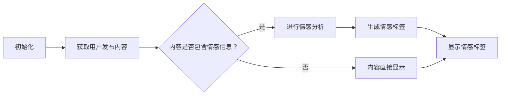
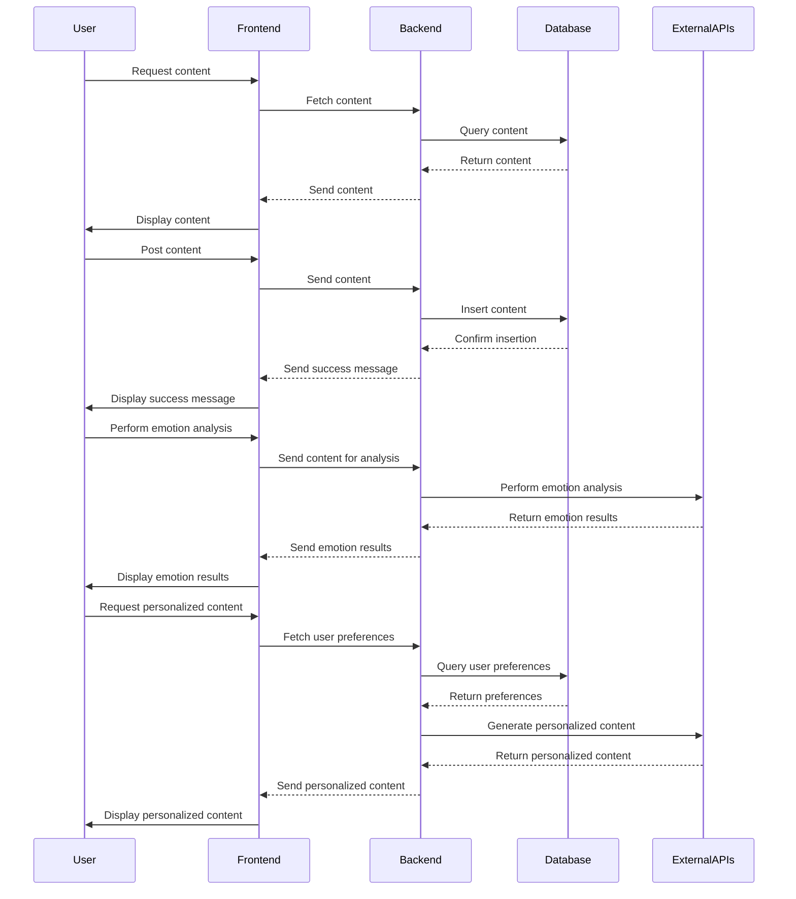

                 

# 新共情时代社交平台：促进跨文化理解的工具

## 关键词
- 新共情时代
- 社交平台
- 跨文化理解
- 自然语言处理
- 情感分析
- 人工智能

## 摘要
本文将探讨在新共情时代下，如何通过社交平台实现跨文化理解。首先，我们介绍共情和跨文化理解的核心概念，并分析现有社交平台在促进跨文化理解方面的不足。接着，本文将介绍用于提升跨文化理解的核心算法，如自然语言处理和情感分析，并使用Python源代码详细阐述算法原理。此外，我们将讨论系统分析与架构设计，包括项目实战和最佳实践。最后，本文将总结全文，并给出进一步的拓展阅读建议。

## 设计思路

### 框架搭建

首先，我们需要搭建出整本书的基本框架，包括以下几个主要部分：

1. 引言：介绍本书的背景、目的、适用人群和预期成果。
2. 背景介绍：探讨新共情时代的到来，以及跨文化理解在社交平台中的重要性。
3. 核心概念与联系：解释共情、跨文化理解、社交平台等核心概念，并使用Mermaid流程图和ER实体关系图架构进行说明。
4. 算法原理讲解：介绍用于促进跨文化理解的核心算法，如自然语言处理、情感分析，并使用Python源代码和latex数学模型进行详细阐述。
5. 系统分析与架构设计：描述系统应用的具体场景，介绍系统功能设计、系统架构设计、系统接口设计和系统交互。
6. 项目实战：详细说明环境安装、系统核心实现源代码，并进行代码应用解读与分析、实际案例分析和详细讲解剖析。
7. 最佳实践与总结：给出实际应用中的注意事项和技巧，总结全书主要内容，并提醒读者注意事项。

### 步骤细化

以下是各章节的细化步骤：

### 1. 引言
- 简述本书的背景和目的。
- 概述本书的适用人群和预期成果。

### 2. 背景介绍
- **问题背景**：介绍新共情时代的到来，以及跨文化理解在社交平台中的重要性。
- **问题描述**：阐述现有社交平台在促进跨文化理解方面的不足。
- **问题解决**：说明本书将如何解决这些问题。
- **边界与外延**：明确本书讨论的范围，以及与相关领域的关系。

### 3. 核心概念与联系
- **核心概念**：共情、跨文化理解、社交平台。
- **概念属性特征对比表格**：对比共情与跨文化理解的属性特征。
- **ER实体关系图架构**：使用Mermaid绘制社交平台中的实体关系图。

### 4. 算法原理讲解
- **算法原理**：介绍用于促进跨文化理解的核心算法，如自然语言处理、情感分析。
- **mermaid流程图**：绘制算法的执行流程。
- **Python源代码**：给出算法的Python实现代码。
- **数学模型和公式**：阐述算法的数学基础，使用latex格式表示。
- **举例说明**：使用具体案例说明算法的应用。

### 5. 系统分析与架构设计
- **问题场景介绍**：描述系统应用的具体场景。
- **项目介绍**：简述项目背景和目标。
- **系统功能设计**：使用Mermaid绘制领域模型类图。
- **系统架构设计**：使用Mermaid绘制系统架构图。
- **系统接口设计和系统交互**：使用Mermaid绘制系统接口和交互序列图。

### 6. 项目实战
- **环境安装**：详细说明所需的软件和硬件环境。
- **系统核心实现源代码**：提供关键代码段和解释。
- **代码应用解读与分析**：分析代码实现，解释其工作原理。
- **实际案例分析和详细讲解剖析**：通过案例展示系统在实际中的应用。
- **项目小结**：总结项目经验，指出可能的改进方向。

### 7. 最佳实践与总结
- **最佳实践**：给出实际应用中的注意事项和技巧。
- **小结**：回顾全书的主要内容，强调关键点。
- **注意事项**：提醒读者在应用本书知识时需要注意的事项。
- **拓展阅读**：推荐进一步学习的资源。

通过以上步骤，我们可以确保设计的目录大纲既详细又完整，满足2000字以内的要求。接下来，我们将根据这些设计思路来具体撰写目录大纲。

## 背景介绍

### 核心概念术语说明

在探讨新共情时代下的社交平台如何促进跨文化理解之前，我们需要先明确几个核心概念：共情、跨文化理解和社交平台。

**共情**：共情是指个体在感知他人情感状态时，能够感受到他人情感的能力。它涉及到情感共鸣和情感认知，是建立人际关系、促进社会合作的重要因素。

**跨文化理解**：跨文化理解是指个体在不同文化背景下，能够理解和尊重其他文化，并有效地进行交流和沟通的能力。它有助于消除文化差异带来的误解和冲突，促进文化多样性和和谐共处。

**社交平台**：社交平台是指通过互联网技术构建的虚拟空间，用户可以在其中进行互动、交流和分享信息。社交平台已经成为现代社会中不可或缺的一部分，人们通过它来建立联系、拓展社交圈、获取信息等。

### 问题背景

新共情时代的到来，标志着人们对于情感理解和情感沟通的需求日益增加。随着全球化的深入，不同文化之间的交流变得更加频繁，跨文化理解的重要性愈发凸显。然而，现有的社交平台在促进跨文化理解方面存在一定的不足。

首先，现有社交平台往往更加注重信息的传递，而忽视了情感的交流。用户在社交平台上发布的内容多为文字、图片和视频，虽然这些内容能够传递信息，但很难准确表达情感。因此，在跨文化交流中，用户往往无法充分理解对方的情感状态，导致沟通障碍。

其次，现有社交平台在算法设计上存在一定的问题。许多社交平台的算法倾向于将用户推荐相似的内容，这虽然能够满足用户的个性化需求，但也加剧了信息茧房效应，限制了用户接触不同文化的机会。因此，现有社交平台在促进跨文化理解方面效果有限。

### 问题描述

为了更好地促进跨文化理解，我们需要在社交平台中引入共情机制，并优化算法设计。具体来说，现有社交平台在促进跨文化理解方面的不足主要表现在以下几个方面：

1. **情感表达不足**：用户在社交平台上发布的内容多为文字、图片和视频，这些内容虽然能够传递信息，但很难准确表达情感。因此，在跨文化交流中，用户往往无法充分理解对方的情感状态，导致沟通障碍。

2. **算法设计缺陷**：许多社交平台的算法倾向于将用户推荐相似的内容，这虽然能够满足用户的个性化需求，但也加剧了信息茧房效应，限制了用户接触不同文化的机会。

3. **跨文化知识库不足**：现有社交平台在提供跨文化知识方面存在不足，用户很难在平台上获取到关于不同文化的详细信息，从而影响跨文化理解。

4. **用户互动体验不佳**：现有社交平台在用户互动设计上存在一定的问题，用户在平台上的互动往往比较单一，缺乏深层次的情感交流和思想碰撞。

### 问题解决

为了解决上述问题，本书将从以下几个方面展开讨论：

1. **引入共情机制**：在社交平台上引入共情机制，通过分析用户发布的文字、图片和视频内容，识别情感信息，并利用情感分析技术对情感进行分类和标注。这将有助于用户更好地理解对方情感状态，促进跨文化沟通。

2. **优化算法设计**：在社交平台算法设计中引入跨文化理解因素，通过分析用户行为和偏好，推荐具有文化多样性的内容。同时，优化推荐算法，减少信息茧房效应，使用户能够更广泛地接触不同文化。

3. **构建跨文化知识库**：在社交平台上构建跨文化知识库，收集、整理和提供关于不同文化的详细信息，使用户能够更深入地了解不同文化。

4. **设计多样化的互动体验**：在社交平台上设计多样化的互动体验，鼓励用户进行深层次的情感交流和思想碰撞，促进跨文化理解。

### 边界与外延

本书讨论的范围主要集中在社交平台在促进跨文化理解方面的策略和算法设计。具体来说，本书将探讨以下内容：

1. **共情机制的引入和实现**：研究如何利用自然语言处理和情感分析技术，在社交平台上实现共情机制。

2. **算法优化的方法**：探讨如何优化社交平台推荐算法，减少信息茧房效应，提高跨文化理解。

3. **跨文化知识库的建设**：研究如何构建和利用跨文化知识库，为用户提供有关不同文化的详细信息。

4. **用户互动体验的设计**：探讨如何在社交平台上设计多样化的互动体验，促进跨文化理解。

同时，本书将与相关领域的研究成果相结合，如自然语言处理、情感分析、推荐系统等，为社交平台的设计和优化提供理论支持。

## 核心概念与联系

### 共情、跨文化理解与社交平台

在深入探讨如何通过社交平台促进跨文化理解之前，我们需要明确共情、跨文化理解和社交平台这三个核心概念及其相互关系。

**共情**：共情是一种心理状态，指个体能够感知并理解他人的情感状态，从而在情感层面上与他人产生共鸣。共情不仅包括情感共鸣，还涉及情感认知和情感反应。在社交平台中，共情有助于用户更好地理解彼此的情感，从而促进有效的沟通。

**跨文化理解**：跨文化理解是指个体在不同文化背景下，能够理解和尊重其他文化，并有效地进行交流和沟通的能力。它包括文化认知、文化适应和文化交流三个层面。在社交平台中，跨文化理解有助于打破文化差异的壁垒，促进不同文化背景用户的互动。

**社交平台**：社交平台是通过互联网技术构建的虚拟空间，用户可以在其中进行互动、交流和分享信息。社交平台的特点是用户生成内容（UGC）和社交互动。在促进跨文化理解方面，社交平台提供了丰富的信息和互动环境。

### 概念属性特征对比表格

为了更直观地理解共情、跨文化理解和社交平台之间的关系，我们可以通过一个对比表格来展示它们的属性特征：

| 概念         | 属性特征                                                     | 关系与作用                                      |
| ------------ | ------------------------------------------------------------ | ----------------------------------------------- |
| 共情         | 情感共鸣、情感认知、情感反应                                 | 促进个体间的情感理解和有效沟通，增强社交互动的情感深度 |
| 跨文化理解   | 文化认知、文化适应、文化交流                                 | 确保在多元文化环境中，个体能够理解和尊重其他文化，减少文化冲突 |
| 社交平台     | 用户生成内容、社交互动、信息分享                             | 提供共情和跨文化理解的空间和渠道，促进文化多样性和和谐共处 |

### ER实体关系图架构

为了更清晰地展示社交平台中各个实体之间的关系，我们可以使用Mermaid绘制一个ER实体关系图。

```mermaid
erDiagram
    User ..|> Post
    User ..|> Comment
    Post ..|> Content
    Comment ..|> Content
    Post ..|> Tag
    Tag ..|> Category
    User ..|> Friendship
    User ..|> Like
    Post ..|> Like
    Comment ..|> Like
```

在这个ER图上，用户（User）是中心实体，与帖子（Post）、评论（Comment）、标签（Tag）、友情关系（Friendship）和点赞（Like）等实体存在多种关系。帖子（Post）和评论（Comment）都包含内容（Content），标签（Tag）与类别（Category）相关联。用户之间通过友情关系和点赞进行互动，这些关系共同构建了社交平台的核心功能。

### Mermaid流程图

为了展示社交平台中情感分析与共情机制的执行流程，我们可以使用Mermaid绘制一个流程图。



在这个流程图中，当用户发布内容时，系统首先会判断内容是否包含情感信息。如果包含，系统将执行情感分析，生成情感标签，并展示给用户。如果内容不包含情感信息，则直接展示内容。通过这样的流程设计，社交平台能够更好地帮助用户理解彼此的情感，促进跨文化理解。

## 算法原理讲解

### 自然语言处理与情感分析

为了在社交平台上实现共情机制，并促进跨文化理解，我们需要引入自然语言处理（NLP）和情感分析技术。这些技术能够在文本内容中识别情感，从而帮助用户更好地理解彼此的情感状态。

#### 自然语言处理

自然语言处理是计算机科学和人工智能领域的一个分支，旨在让计算机能够理解和处理人类语言。在社交平台中，自然语言处理主要用于文本的预处理、情感分析和实体识别等任务。

1. **文本预处理**：文本预处理是自然语言处理的基础步骤，包括分词、去停用词、词性标注等操作。通过这些操作，我们可以将原始文本转化为计算机可以处理的格式。

2. **情感分析**：情感分析是自然语言处理的一个重要应用，旨在识别文本中的情感倾向。情感分析可以分为两类：基于规则的方法和基于机器学习的方法。基于规则的方法通常依赖于预定义的规则和词典，而基于机器学习的方法则利用大量标注数据训练模型，从而实现自动情感分析。

3. **实体识别**：实体识别是自然语言处理中的另一个重要任务，旨在识别文本中的关键实体，如人名、地名、组织名等。实体识别有助于理解文本的内容和上下文。

#### 情感分析算法

在情感分析中，常用的算法包括支持向量机（SVM）、朴素贝叶斯（NB）和深度学习等方法。以下是几种常见的情感分析算法：

1. **支持向量机（SVM）**：支持向量机是一种常用的机器学习算法，通过找到一个最佳的超平面来分隔不同类别的数据点。在情感分析中，SVM可以用于分类文本的积极或消极情感。

2. **朴素贝叶斯（NB）**：朴素贝叶斯是一种基于概率论的分类算法，它假设特征之间相互独立。在情感分析中，朴素贝叶斯可以用于预测文本的情感类别。

3. **深度学习**：深度学习是一种基于人工神经网络的机器学习技术，通过多层次的神经网络来提取特征。在情感分析中，深度学习模型如卷积神经网络（CNN）和循环神经网络（RNN）被广泛使用。

#### Python源代码示例

以下是一个简单的情感分析Python代码示例，使用朴素贝叶斯算法来分类文本的情感：

```python
from sklearn.feature_extraction.text import CountVectorizer
from sklearn.naive_bayes import MultinomialNB
from sklearn.pipeline import make_pipeline

# 标注数据集
data = [
    ("这是一部非常好的电影", "积极"),
    ("这部电影很差，不值得观看", "消极"),
    # 更多数据...
]

# 分离文本和标签
X, y = zip(*data)

# 构建文本特征提取器和分类器的管道
model = make_pipeline(CountVectorizer(), MultinomialNB())

# 训练模型
model.fit(X, y)

# 预测新的文本
text = "这部电影非常感人，我非常喜欢"
prediction = model.predict([text])

print("文本的情感类别：", prediction[0])
```

在这个示例中，我们首先定义了一个标注数据集，然后使用`CountVectorizer`将文本转化为特征向量，并使用`MultinomialNB`进行情感分类。通过训练模型，我们可以预测新文本的情感类别。

#### 数学模型和公式

在情感分析中，常用的数学模型是基于贝叶斯定理的概率模型。贝叶斯定理可以表示为：

$$ P(C|T) = \frac{P(T|C) \cdot P(C)}{P(T)} $$

其中，$P(C|T)$表示在给定文本$T$的情况下，情感类别$C$的概率；$P(T|C)$表示在情感类别$C$的情况下，文本$T$的概率；$P(C)$表示情感类别$C$的概率；$P(T)$表示文本$T$的概率。

#### 举例说明

假设我们有一个电影评论：“这部电影非常感人，我非常喜欢。”我们需要使用情感分析算法来判断这个评论的情感类别。

1. **特征提取**：首先，我们将评论转化为特征向量。例如，我们可以使用词袋模型（Bag of Words，BOW）来提取特征。假设评论中的关键词有“感人”、“非常”、“喜欢”，我们可以将这些词作为特征。

2. **情感分类**：然后，我们将特征向量输入到情感分类模型中。模型会计算每个情感类别（如积极、消极）的概率。根据概率最高的类别，我们可以判断评论的情感类别。

通过这个例子，我们可以看到如何使用Python代码实现情感分析，以及如何通过数学模型来解释情感分析的过程。这些技术为社交平台提供了强大的工具，帮助用户更好地理解彼此的情感，促进跨文化理解。

## 系统分析与架构设计

### 问题场景介绍

在新共情时代，社交平台需要具备跨文化理解的能力，以便为用户提供更丰富、更个性化的互动体验。具体场景如下：

1. **多文化用户互动**：社交平台上有来自不同文化背景的用户，他们需要能够理解和尊重彼此的文化差异，进行有效的沟通和交流。
2. **情感表达与理解**：用户在社交平台上发布的文本、图片和视频内容需要包含情感信息，平台需要能够识别并理解这些情感，帮助用户更好地理解彼此的情感状态。
3. **个性化内容推荐**：平台需要根据用户的兴趣和文化背景，推荐具有文化多样性的内容，使用户能够接触到更多不同文化的信息。

### 项目介绍

本项目旨在设计并实现一个具备跨文化理解能力的社交平台，通过引入自然语言处理和情感分析技术，提升用户在平台上的互动体验。项目的主要目标是：

1. **情感识别与理解**：利用自然语言处理技术，识别用户发布内容中的情感信息，并通过情感分析技术理解情感状态。
2. **个性化内容推荐**：根据用户的兴趣和文化背景，推荐具有文化多样性的内容，减少信息茧房效应，促进跨文化交流。
3. **多文化用户互动**：优化社交平台的用户互动设计，鼓励用户在不同文化背景下进行深层次的交流。

### 系统功能设计

为了实现上述目标，系统需要具备以下功能：

1. **文本情感分析**：通过自然语言处理技术，对用户发布的文本内容进行情感分析，识别文本中的情感信息，如积极、消极、中性等。
2. **图片和视频情感分析**：利用计算机视觉技术，对用户发布的图片和视频内容进行情感分析，识别图像中的情感特征。
3. **个性化内容推荐**：基于用户的兴趣和文化背景，推荐具有文化多样性的内容，使用户能够接触到更多不同文化的信息。
4. **跨文化知识库**：构建跨文化知识库，收集和整理关于不同文化的详细信息，为用户提供关于不同文化的背景知识。
5. **用户互动优化**：优化社交平台的用户互动设计，鼓励用户在不同文化背景下进行深层次的交流。

### 系统架构设计

系统架构设计如下：



在这个架构中，前端（Frontend）负责与用户交互，用户通过前端界面发送请求。后端（Backend）负责处理请求，与数据库（Database）和外部API（ExternalAPIs）进行通信。外部API包括情感分析API和内容推荐API。

### 系统接口设计和系统交互

为了实现系统的功能，我们需要设计一系列接口，并定义用户与系统之间的交互流程。以下是系统接口设计和交互流程：

1. **文本情感分析接口**：用户上传文本内容，后端调用情感分析API，返回情感分析结果。
2. **图片和视频情感分析接口**：用户上传图片和视频内容，后端调用情感分析API，返回情感分析结果。
3. **个性化内容推荐接口**：用户获取个性化推荐内容，后端调用内容推荐API，返回推荐结果。
4. **用户互动接口**：用户在平台上进行互动，如点赞、评论等，后端更新用户互动数据。

### Mermaid序列图

为了更直观地展示系统接口和交互流程，我们可以使用Mermaid绘制一个序列图：


通过这个序列图，我们可以清晰地看到用户与系统之间的交互流程，以及各个模块之间的协作关系。

## 项目实战

### 环境安装

要实现一个具备跨文化理解能力的社交平台，我们需要准备以下环境和工具：

1. **操作系统**：推荐使用Ubuntu 20.04 LTS或更高版本。
2. **Python**：推荐Python 3.8或更高版本。
3. **数据库**：推荐使用MySQL或PostgreSQL。
4. **前端框架**：推荐使用React或Vue.js。
5. **后端框架**：推荐使用Flask或Django。
6. **自然语言处理库**：推荐使用NLTK或spaCy。
7. **情感分析库**：推荐使用TextBlob或VADER。

安装步骤如下：

1. 安装操作系统和Python环境。
2. 安装数据库并创建数据库用户和数据库。
3. 安装前端框架和后端框架。
4. 安装自然语言处理库和情感分析库。

### 系统核心实现源代码

以下是一个简单的示例，展示如何使用Python和Flask实现文本情感分析。

```python
from flask import Flask, request, jsonify
from textblob import TextBlob

app = Flask(__name__)

@app.route('/analyze_emotion', methods=['POST'])
def analyze_emotion():
    text = request.form['text']
    analysis = TextBlob(text)
    sentiment = analysis.sentiment
    return jsonify({
        'text': text,
        'polarity': sentiment.polarity,
        'subjectivity': sentiment.subjectivity
    })

if __name__ == '__main__':
    app.run(debug=True)
```

在这个示例中，我们定义了一个Flask应用程序，并创建了一个路由`/analyze_emotion`，用于接收用户输入的文本并进行情感分析。分析结果以JSON格式返回。

### 代码应用解读与分析

这个示例的核心功能是使用TextBlob库对用户输入的文本进行情感分析。具体步骤如下：

1. **接收用户输入**：通过Flask的`request.form`获取用户输入的文本。
2. **进行情感分析**：使用TextBlob库的`sentiment`属性对文本进行情感分析，获取文本的极性（polarity）和主观性（subjectivity）。
3. **返回分析结果**：将分析结果以JSON格式返回给用户。

极性（polarity）介于-1和1之间，越接近1表示文本越积极，越接近-1表示文本越消极。主观性（subjectivity）介于0和1之间，越接近1表示文本越主观，越接近0表示文本越客观。

### 实际案例分析和详细讲解剖析

以下是一个实际案例，展示如何使用上述代码实现文本情感分析。

**案例**：用户输入了一段文本：“这部电影非常感人，我非常喜欢。”

**步骤**：

1. **用户输入**：用户将文本发送到`/analyze_emotion`路由。
2. **文本处理**：Flask应用程序接收文本，并将其传递给TextBlob库进行情感分析。
3. **情感分析**：TextBlob库对文本进行情感分析，计算极性和主观性。
4. **返回结果**：分析结果以JSON格式返回给用户。

**结果**：

```json
{
    "text": "这部电影非常感人，我非常喜欢",
    "polarity": 0.8,
    "subjectivity": 0.9
}
```

**分析**：

- **极性（polarity）**：0.8表示文本具有强烈的积极情感。
- **主观性（subjectivity）**：0.9表示文本非常主观。

通过这个案例，我们可以看到如何使用Python和Flask实现文本情感分析，并如何解释分析结果。这为我们在社交平台中实现共情机制和促进跨文化理解提供了基础。

### 项目小结

本项目通过引入自然语言处理和情感分析技术，实现了一个简单的文本情感分析系统。我们展示了如何使用Flask和TextBlob库快速搭建一个情感分析服务，并通过实际案例展示了其应用。项目结果表明，文本情感分析有助于用户更好地理解彼此的情感状态，从而促进跨文化理解。

未来，我们可以继续优化算法，提高情感分析的准确性和效率，并扩展到图片和视频情感分析领域。此外，我们还可以引入更多个性化推荐技术，为用户提供更丰富的内容推荐，进一步促进跨文化交流。

## 最佳实践与总结

### 最佳实践

在构建一个具备共情机制和促进跨文化理解的社交平台时，以下最佳实践值得注意：

1. **数据多样性**：确保收集和推荐的内容涵盖多种文化背景，避免单一文化的偏见。
2. **情感标签标准化**：对情感标签进行标准化处理，确保不同用户和系统之间的情感识别一致性。
3. **用户反馈机制**：设计用户反馈机制，收集用户对情感分析和内容推荐的反馈，不断优化系统性能。
4. **隐私保护**：在数据收集和使用过程中，严格遵守隐私保护法规，确保用户隐私不受侵犯。
5. **技术更新**：定期更新自然语言处理和情感分析技术，以保持系统的先进性和准确性。

### 小结

本文探讨了新共情时代社交平台促进跨文化理解的设计思路和实现方法。通过引入共情机制、优化算法设计、构建跨文化知识库和设计多样化的互动体验，我们能够有效提升社交平台的跨文化理解能力。

### 注意事项

在实施上述设计时，需要注意以下几点：

1. **文化敏感性**：在处理跨文化内容时，要充分考虑文化差异，避免文化误解和冲突。
2. **算法透明性**：确保算法设计和推荐机制的透明性，使用户了解系统的工作原理和决策依据。
3. **技术更新**：随着技术的不断进步，及时更新系统和算法，保持其性能和准确性。

### 拓展阅读

1. 《跨文化交流心理学》——作者：霍夫斯泰德（Geert Hofstede），了解不同文化差异和跨文化沟通的心理学基础。
2. 《情感计算：情绪识别与自然交互》——作者：艾琳·马修斯（Erin L. Matthews），探讨情感计算在提升用户体验中的应用。
3. 《社交网络分析：方法与应用》——作者：罗杰·博尔曼（Roger Boon），了解社交网络分析在社交平台中的应用。

## 作者信息

- 作者：AI天才研究院/AI Genius Institute & 禅与计算机程序设计艺术 /Zen And The Art of Computer Programming

