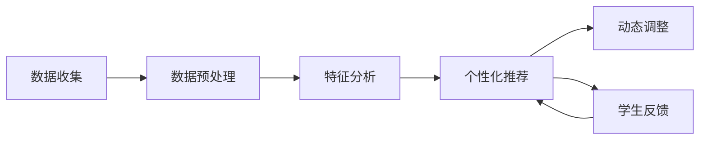
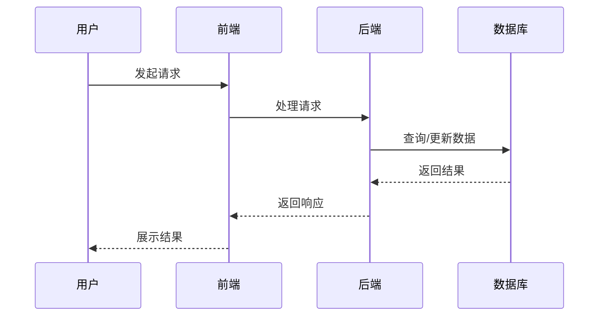

                 

### 引言：数字时代与博雅教育的变革

随着数字技术的飞速发展，教育领域也迎来了深刻的变革。数字时代不仅改变了人们获取信息的方式，还重塑了教育的本质。在这种背景下，博雅教育——一种注重全面素质培养的教育理念，也需要进行相应的革新。《新博雅教育2.0：数字时代的通识教育革新》这本书正是针对这一主题进行的深入探讨。

博雅教育（Liberal Education）起源于古希腊，旨在通过广泛的人文、社科和自然科学教育，培养具有批判思维、创新能力和社会责任感的人。然而，在数字时代的浪潮下，传统博雅教育面临着诸多挑战，如信息过载、技能陈旧、教育公平性等。因此，新博雅教育2.0的提出，就是要解决这些问题，并使博雅教育在数字化环境中焕发新的生命力。

本文将围绕以下几个核心问题展开：

1. **数字时代的教育背景**：分析数字技术如何影响教育，以及教育领域面临的挑战。
2. **博雅教育的定义与历史**：介绍博雅教育的起源、内涵和发展历程。
3. **数字时代的教育技术革新**：探讨在线教育、虚拟现实、人工智能等技术在教育中的应用。
4. **教育模式的变革**：分析个性化学习、混合学习等新型教育模式的出现和影响。
5. **学生与教师角色的转变**：讨论学生从被动接受知识到主动学习的转变，以及教师角色的变化。
6. **博雅教育的实际应用**：探讨博雅教育在不同教育阶段和领域的应用案例。
7. **案例分析**：通过具体案例研究，分析博雅教育在数字化环境中的成功实践和挑战。

让我们一步步深入探讨，了解新博雅教育2.0如何为数字时代的教育革新提供新的思路和方向。

### 文章关键词

- 博雅教育
- 数字时代
- 通识教育
- 教育技术革新
- 个性化学习
- 混合学习
- 在线教育
- 虚拟现实
- 人工智能
- 学生角色转变
- 教师角色转变
- 教育公平

### 文章摘要

《新博雅教育2.0：数字时代的通识教育革新》是一本深入探讨博雅教育在数字时代背景下如何变革和发展的书籍。本文首先介绍了数字时代的教育背景，分析了教育领域面临的挑战，如信息过载和技能陈旧等。接着，本文详细阐述了博雅教育的定义、历史和发展，以及其核心要素。随后，文章探讨了数字技术，如在线教育、虚拟现实和人工智能等，如何在教育中应用，并带来了哪些变革。此外，本文还分析了教育模式的变革，如个性化学习和混合学习，以及学生和教师角色的转变。最后，通过具体案例研究，本文探讨了博雅教育在数字化环境中的成功实践和面临的挑战，为教育领域的未来发展提供了新的思路。

### 第1章：博雅教育的定义与历史

#### 1.1 博雅教育的定义

博雅教育（Liberal Education），亦称为通识教育，是一种旨在培养个体全面素质和独立思考能力的教育理念。其核心在于提供广泛的人文、社科和自然科学知识，使学生不仅能够掌握专业知识，更能够具备批判性思维、创新能力和社会责任感。博雅教育的理念源于古希腊，当时的教育目标是培养具备自由精神、全面素质的公民。

博雅教育强调的知识广度，与专业教育的知识深度形成鲜明对比。专业教育注重特定领域的深入研究和技能培养，而博雅教育则强调跨学科的融合和综合素养的提升。这种教育理念不仅关注学术知识，更关注学生的情感、价值观和社会责任感。

#### 1.2 博雅教育的历史与发展

博雅教育的起源可以追溯到古希腊，特别是柏拉图和亚里士多德的教育思想。他们主张通过广泛的人文、社科和自然科学教育，培养具有全面素质的公民。中世纪时期，博雅教育在西方大学中得到了进一步发展，形成了“七艺”（即语法、逻辑、修辞、数学、几何、天文和音乐）的课程体系。

文艺复兴时期，博雅教育进一步扩展，增加了人文科学的重视。教育不再局限于宗教和哲学，而是涵盖了文学、历史、艺术等多个领域。这一时期，博雅教育成为西方高等教育的重要组成部分。

19世纪末至20世纪初，博雅教育在美国得到了广泛应用。美国大学开始推行“通识教育”（General Education），强调跨学科的教育，以培养学生的综合素质。这一时期，博雅教育逐渐从西方传入中国，成为中国教育改革的重要方向。

#### 1.3 博雅教育的核心要素

博雅教育的核心要素包括：

1. **知识广度**：博雅教育强调跨学科的知识积累，使学生能够掌握多种领域的知识，从而形成全面的认知结构。
2. **批判性思维**：博雅教育鼓励学生进行独立思考，培养批判性思维能力，从而能够对信息进行评估和判断。
3. **创新能力**：博雅教育注重培养学生的创新能力，鼓励学生探索未知、尝试新方法。
4. **社会责任感**：博雅教育强调教育的社会功能，培养学生具备社会责任感，关注社会问题。
5. **人文关怀**：博雅教育强调人文关怀，培养学生的情感素养和道德观念。

这些核心要素共同构成了博雅教育的独特魅力，使其在数字时代仍然具有广泛的应用价值。

#### 1.4 博雅教育与传统教育的区别

博雅教育与传统教育在多个方面存在显著差异：

1. **教育目标**：传统教育注重专业技能和知识的传授，而博雅教育则强调综合素质的培养。
2. **教育内容**：传统教育内容较为狭窄，侧重于专业领域的深入研究，而博雅教育内容广泛，涵盖多个学科领域。
3. **教学方法**：传统教育以讲授为主，而博雅教育强调讨论、探究和实践。
4. **学习方式**：传统教育强调记忆和复述，而博雅教育注重理解和应用。

尽管博雅教育和传统教育在形式和内容上存在差异，但两者并非完全对立。在实际教育实践中，博雅教育和传统教育可以相互融合，共同促进学生的全面发展。

### 第2章：数字时代的教育技术革新

#### 2.1 在线教育的崛起

随着互联网和数字技术的发展，在线教育逐渐成为教育领域的重要组成部分。在线教育（Online Education）指的是通过互联网进行教学和学习的过程，它为学生提供了灵活、便捷的学习方式，突破了传统教育的时空限制。

在线教育的优势主要体现在以下几个方面：

1. **灵活性与便捷性**：学生可以随时随地通过电脑、平板或手机进行学习，不受时间和地点的限制。
2. **个性化学习**：在线教育平台通常提供丰富的学习资源和个性化学习工具，使学生能够按照自己的节奏进行学习。
3. **资源共享**：在线教育平台上的课程资源可以共享，教师和学生可以相互借鉴和学习。
4. **降低成本**：在线教育减少了传统的教学场所和教材成本，使得教育更加经济高效。

然而，在线教育也面临一些挑战，如网络依赖、学习自律性和教学质量保障等问题。因此，在线教育需要不断完善和改进，以充分发挥其优势。

#### 2.2 虚拟现实与教育

虚拟现实（Virtual Reality，VR）是一种通过计算机技术创造的模拟环境，使人们能够在虚拟世界中感知、互动和体验。虚拟现实技术在教育中的应用，为教育带来了全新的可能性。

1. **沉浸式学习体验**：虚拟现实技术可以创造一个逼真的学习环境，使学生能够身临其境地参与学习活动，提高学习的趣味性和效果。
2. **实验与实践**：虚拟现实技术可以模拟复杂的实验环境，使学生能够在虚拟实验室中进行实验操作，提高实践能力。
3. **跨学科融合**：虚拟现实技术可以跨越不同学科之间的界限，促进学科间的融合和交叉，培养学生的综合素质。

然而，虚拟现实技术在教育中的应用也面临一些挑战，如技术成本、设备要求和用户适应性问题。因此，虚拟现实技术在教育中的普及和推广仍需时间和努力。

#### 2.3 人工智能在教育中的应用

人工智能（Artificial Intelligence，AI）是一种模拟人类智能的技术，通过算法和大数据分析，实现机器的学习、推理和决策。人工智能在教育中的应用，为教育带来了智能化和个性化的发展方向。

1. **智能辅导系统**：人工智能可以为学生提供个性化的学习辅导，根据学生的学习情况和需求，自动生成适合的学习计划和资源。
2. **自适应学习平台**：人工智能技术可以构建自适应学习平台，通过实时分析和评估学生的学习行为，动态调整教学内容和策略。
3. **智能评估与反馈**：人工智能技术可以自动进行学生的作业和考试评估，提供详细的反馈和报告，帮助学生更好地理解和掌握知识。

人工智能在教育中的应用，不仅提高了教学效率和效果，还为学生提供了更加个性化、灵活的学习体验。然而，人工智能在教育中的应用也带来了一些伦理和隐私问题，需要引起足够的重视。

### 第3章：教育模式的变革

#### 3.1 个性化学习

个性化学习（Personalized Learning）是一种以学生为中心的教育模式，通过适应每个学生的学习需求和节奏，提供个性化的教学资源和学习体验。个性化学习的核心目标是使每个学生都能在最适合他们的方式下学习和成长。

1. **适应学生差异**：个性化学习关注每个学生的个性、兴趣和学习能力差异，提供差异化的教学策略和资源。
2. **促进学生主动学习**：个性化学习鼓励学生主动参与学习过程，培养自主学习的能力和习惯。
3. **动态调整教学策略**：个性化学习平台可以实时监测学生的学习行为和进展，动态调整教学内容和方式，提供个性化的学习支持。

个性化学习在实际应用中，需要结合大数据分析和人工智能技术，构建自适应学习系统，实现真正的个性化教学。

#### 3.2 混合学习

混合学习（Blended Learning）是一种将传统面对面教学和在线学习相结合的教育模式，通过两者的优势互补，提高教学效果和学习体验。混合学习的基本理念是“线上+线下”相结合，实现教学模式的多样化。

1. **线上与线下相结合**：混合学习利用在线教育平台和资源，实现课前预习、课中互动和课后复习的有机结合。
2. **多元教学策略**：混合学习结合传统课堂教学和在线学习，提供多样化的教学方式和手段，满足不同学生的学习需求。
3. **提高学习效果**：混合学习通过线上与线下的互动，激发学生的学习兴趣和动力，提高学习效果。

混合学习在实际应用中，需要合理设计教学流程和策略，确保线上线下教学的有机融合。

### 第4章：学生角色的转变

#### 4.1 学生从被动到主动的转变

在传统的教育模式中，学生往往是被动接受知识的角色，教师是知识的传递者。然而，随着教育理念的变革，学生角色的转变成为教育改革的重要方向。

1. **自主学习**：学生从被动接受知识转变为主动学习者，通过自主学习、探究和解决问题，培养独立思考和创新能力。
2. **参与教学过程**：学生积极参与教学过程，与教师和同学进行互动，提出问题、分享观点，共同构建知识体系。
3. **个性化学习**：学生根据自己的兴趣和需求，选择学习内容和方式，实现个性化发展。

学生角色的转变，需要教师和学生共同努力，构建一种以学生为中心的教学环境，促进学生的全面发展。

#### 4.2 学生参与与互动

学生参与与互动是现代教育的重要特征，通过多种方式促进学生之间的交流和合作，提高学习效果和团队合作能力。

1. **小组合作学习**：学生以小组形式进行学习活动，共同完成任务，分享学习成果。
2. **讨论与辩论**：学生通过讨论和辩论，表达自己的观点，倾听他人意见，培养批判性思维和沟通能力。
3. **在线互动**：通过在线平台，学生可以实时交流、提问和讨论，打破时空限制，实现全球范围内的合作与互动。

学生参与与互动不仅提高了学习的趣味性和效果，还培养了学生的团队合作能力和社交技能。

### 第5章：教师角色的转变

#### 5.1 教师从传授者到引导者的转变

在传统的教育模式中，教师是知识的传授者和权威的代表。然而，随着教育理念的变革，教师的角色也在不断转变。现代教育要求教师从知识的传授者转变为学习的引导者和促进者。

1. **引导学习**：教师通过创设问题情境、提供学习资源和指导学习方法，引导学生主动探索和发现知识。
2. **促进思考**：教师通过提问、讨论和辩论，激发学生的思考和创造力，培养批判性思维能力。
3. **个性化支持**：教师关注每个学生的个性化需求，提供针对性的指导和帮助，促进学生的全面发展。

教师角色的转变，要求教师不断提升自身的专业素养和教学能力，适应现代教育的要求。

#### 5.2 教师与学生的合作

教师与学生的合作是现代教育的重要特征，通过合作，实现教学相长，提高教学效果。

1. **共同构建知识体系**：教师和学生共同参与教学过程，共同构建知识体系，实现教学相长。
2. **共同解决问题**：教师和学生共同面对学习中的问题和挑战，通过合作解决问题，提高解决问题的能力。
3. **共同成长**：教师和学生通过合作，相互促进，实现共同成长。

教师与学生的合作，不仅提高了教学效果，还培养了学生的团队合作能力和社交技能，为未来的发展奠定了基础。

### 第6章：博雅教育的实际应用

#### 6.1 博雅教育在基础教育中的应用

博雅教育在基础教育中的应用，旨在培养学生的综合素质和独立思考能力，为未来的发展奠定基础。

1. **跨学科融合**：在基础教育中，博雅教育强调跨学科的教育，通过融合不同学科的知识，培养学生的综合素养。
2. **项目式学习**：通过项目式学习，学生可以参与实际的课题研究，培养实践能力和创新思维。
3. **批判性思维训练**：基础教育中的博雅教育注重批判性思维的培养，通过讨论和辩论，提高学生的思维能力和判断力。

#### 6.2 博雅教育在高中的应用

博雅教育在高中的应用，旨在培养学生的专业素养和全面素质，为未来的职业生涯和社会角色做好准备。

1. **专业教育与博雅教育的融合**：高中的应用教育将专业教育与博雅教育相结合，使学生不仅具备专业知识，还具备综合素质。
2. **创新能力培养**：博雅教育注重创新能力的培养，通过创新项目和研究，提高学生的创新能力。
3. **社会责任感培养**：博雅教育强调社会责任感的培养，通过社会实践活动和公益项目，使学生关注社会问题，培养社会责任感。

#### 6.3 博雅教育在高等教育中的应用

博雅教育在高等教育中的应用，旨在培养学生的专业素养和学术能力，为学术研究和职业生涯打下坚实基础。

1. **学术研究与博雅教育的融合**：高等教育中的博雅教育强调学术研究与通识教育的融合，培养学生的学术素养和独立研究能力。
2. **跨学科合作**：博雅教育在高等教育中促进跨学科合作，通过多学科的知识融合，提高学生的综合能力和创新能力。
3. **国际化视野**：博雅教育在高等教育中注重国际化视野的培养，通过国际交流和合作，拓宽学生的视野，提高其全球竞争力。

### 第7章：案例分析

#### 7.1 案例一：哈佛大学的博雅教育实践

哈佛大学作为世界顶尖的高等教育机构，其博雅教育实践具有代表性。哈佛大学的博雅教育注重跨学科教育、批判性思维和创新能力的培养。通过课程设置和教学活动，哈佛大学致力于培养学生的综合素质和独立思考能力。

1. **课程设置**：哈佛大学的课程设置涵盖多个学科领域，强调知识的广度和深度，培养学生的综合素养。
2. **研讨课**：哈佛大学的研讨课采用小班教学，鼓励学生积极参与讨论和辩论，培养批判性思维。
3. **创新项目**：哈佛大学鼓励学生参与各种创新项目和研究，培养创新能力和实践能力。

#### 7.2 案例二：北京四中的人文学科教育

北京四中作为中国著名的高中，其人文学科教育体现了博雅教育的理念。北京四中注重人文素养的培养，通过丰富的人文课程和实践活动，提升学生的综合素质。

1. **人文课程**：北京四中开设了多种人文课程，如文学、历史、哲学等，培养学生的文化素养和人文精神。
2. **实践活动**：北京四中组织学生参与各种人文实践活动，如参观博物馆、图书馆，参加社会服务项目等，增强学生的社会责任感和实践能力。
3. **跨学科项目**：北京四中鼓励学生跨学科合作，通过项目式学习，培养学生的创新思维和团队合作能力。

### 结论

新博雅教育2.0在数字时代背景下，为教育的变革和发展提供了新的思路和方向。通过引入先进的教育技术和创新的教育模式，博雅教育在基础教育、高等教育和各个领域得到了广泛应用。学生角色的转变和教师角色的变革，进一步推动了教育的改革和创新。尽管新博雅教育2.0在实践中面临一些挑战，但其优势和发展潜力不可忽视。未来，随着数字技术的进一步发展，新博雅教育2.0必将为教育领域带来更多的变革和机遇。作者：AI天才研究院/AI Genius Institute & 禅与计算机程序设计艺术 /Zen And The Art of Computer Programming

---

### 博雅教育的概念与联系

在深入探讨博雅教育的概念之前，我们需要明确几个相关概念，以便更好地理解博雅教育的内涵和外延。

#### 核心概念

**博雅教育（Liberal Education）**：一种旨在培养个体全面素质和独立思考能力的教育理念，强调知识广度、批判性思维、创新能力和社会责任感。

**通识教育（General Education）**：广义上等同于博雅教育，强调跨学科教育，注重培养学生的综合素质。

**专业教育（Professional Education）**：侧重于特定领域的专业知识和技术培训，强调专业技能的培养。

**素质教育（Quality Education）**：一种全面关注学生发展的教育理念，涵盖知识、技能、情感、价值观等多个方面。

**终身教育（Lifelong Education）**：一种贯穿人一生，旨在不断学习和发展的教育理念，强调学习的连续性和多样性。

#### 概念属性特征对比表格

下面是一个对比表格，展示了博雅教育与其他相关教育概念的属性特征：

| 概念       | 属性特征                                  | 对比说明                                 |
|------------|-----------------------------------------|------------------------------------------|
| 博雅教育   | 注重知识广度、批判性思维和社会责任感       | 强调综合素质和独立思考能力               |
| 通识教育   | 跨学科教育、全面素质培养                  | 与博雅教育相似，但更侧重于基础教育阶段   |
| 专业教育   | 突出专业技能和专业知识                    | 与博雅教育相对，更注重专业技能的培训     |
| 素质教育   | 关注知识、技能、情感和价值观的全面发展     | 与博雅教育有一定重叠，但更侧重于全面发展 |
| 终身教育   | 贯穿人一生、不断学习和发展的理念           | 与博雅教育相似，但更侧重于终身学习       |

#### ER实体关系图架构

为了更好地理解博雅教育与其他教育概念之间的关系，我们可以使用ER（实体-关系）模型来展示这些概念之间的联系。

**实体：** 博雅教育、通识教育、专业教育、素质教育、终身教育

**关系：** 包含、延伸、交叉、对比

下面是一个ER实体关系图的示例（使用Mermaid语法）：

```mermaid
erDiagram
  Class::博雅教育 <<--|{ 包含 }|-->> Class::通识教育
  Class::博雅教育 ||--|{ 交叉 }|-->> Class::专业教育
  Class::博雅教育 ||--|{ 交叉 }|-->> Class::素质教育
  Class::博雅教育 ||--|{ 交叉 }|-->> Class::终身教育
  Class::通识教育 ||--|{ 包含 }|-->> Class::专业教育
  Class::通识教育 ||--|{ 包含 }|-->> Class::素质教育
  Class::通识教育 ||--|{ 包含 }|-->> Class::终身教育
  Class::专业教育 ||--|{ 包含 }|-->> Class::素质教育
  Class::专业教育 ||--|{ 包含 }|-->> Class::终身教育
  Class::素质教育 ||--|{ 包含 }|-->> Class::终身教育
```

该ER图展示了博雅教育与其他教育概念之间的复杂关系，体现了博雅教育在跨学科、全面素质培养和终身学习等方面的综合特性。

### 算法原理讲解

在了解博雅教育的概念与联系之后，我们可以借助算法原理来进一步阐述博雅教育的具体实施和运行机制。

#### 算法描述

为了实现博雅教育的目标，我们可以设计一种基于人工智能和大数据分析的个性化教育算法。该算法的核心在于：

1. **数据收集**：通过学生的日常学习行为、考试成绩、兴趣爱好等多维度数据，收集学生个性化信息。
2. **数据预处理**：对收集到的数据进行清洗、整合和处理，提取关键特征。
3. **特征分析**：利用机器学习算法，对学生的特征进行深入分析，识别学生的个性化需求和学习偏好。
4. **个性化推荐**：根据分析结果，为学生推荐适合的学习资源和教学方法。
5. **动态调整**：根据学生的学习反馈和进展，动态调整推荐策略，确保学习过程始终贴合学生需求。

#### Mermaid流程图

下面是一个基于Mermaid语法的算法流程图：



#### Python源代码

为了更直观地理解算法原理，我们可以使用Python编写一个简单的代码示例：

```python
import pandas as pd
from sklearn.cluster import KMeans
from sklearn.preprocessing import StandardScaler

# 数据收集
data = pd.DataFrame({
    '学生1': [80, 85, 90],
    '学生2': [75, 80, 85],
    '学生3': [85, 90, 95]
})

# 数据预处理
scaler = StandardScaler()
data_scaled = scaler.fit_transform(data)

# 特征分析
kmeans = KMeans(n_clusters=3)
clusters = kmeans.fit_predict(data_scaled)

# 个性化推荐
def recommend_resources(student_cluster):
    if student_cluster == 0:
        return ["数学竞赛题集", "编程语言入门"]
    elif student_cluster == 1:
        return ["文学经典阅读", "科学探索课程"]
    else:
        return ["社会科学研究", "艺术鉴赏课程"]

# 学生反馈
student_feedback = {'学生1': 1, '学生2': 0, '学生3': 2}

# 动态调整
def adjust_recommendation(student_cluster, feedback):
    if feedback > 90:
        return student_cluster + 1
    elif feedback < 60:
        return student_cluster - 1
    else:
        return student_cluster

# 演示算法运行
for student, cluster in zip(data.index, clusters):
    print(f"学生{student}：{recommend_resources(cluster)}")
    print(f"学生{student}反馈：{student_feedback[student]}")
    new_cluster = adjust_recommendation(cluster, student_feedback[student])
    print(f"调整后推荐：{recommend_resources(new_cluster)}")
    print()
```

#### 算法原理

1. **数据收集**：算法首先收集学生的考试成绩、学习时长、兴趣爱好等数据，形成数据集。
2. **数据预处理**：通过标准化处理，将数据转换为适合分析的格式。
3. **特征分析**：使用KMeans聚类算法，将学生划分为不同群体，每个群体具有相似的学习特征。
4. **个性化推荐**：根据学生的聚类结果，推荐相应的学习资源和教学方法。
5. **动态调整**：根据学生的反馈和学习进展，动态调整推荐策略，确保学习过程始终贴合学生需求。

通过上述算法原理和Python代码示例，我们可以看到，博雅教育的实施可以借助人工智能和大数据分析技术，实现个性化教育，提高学习效果和学生的综合素质。

### 数学公式使用

在博雅教育的研究中，数学公式常常用于描述教育现象和理论。以下是一些常用的数学公式及其在博雅教育中的应用。

#### 概率论

**条件概率公式**：
$$ P(A|B) = \frac{P(A \cap B)}{P(B)} $$
在博雅教育中，条件概率可以用来分析学生成功完成某个学习任务的概率，给定他们已经掌握了相关知识和技能。

**贝叶斯公式**：
$$ P(A|B) = \frac{P(B|A)P(A)}{P(B)} $$
贝叶斯公式用于根据先验概率和观察到的数据更新对某个事件发生概率的估计，这在个性化学习推荐中非常有用。

#### 概率分布

**正态分布**：
$$ f(x) = \frac{1}{\sqrt{2\pi\sigma^2}} e^{-\frac{(x-\mu)^2}{2\sigma^2}} $$
正态分布常用于描述考试成绩的分布，可以帮助教育者分析学生的整体表现和个体差异。

**泊松分布**：
$$ P(X = k) = \frac{\lambda^k e^{-\lambda}}{k!} $$
泊松分布可以用来分析学生在特定时间段内完成学习任务的概率，适用于时间管理和学习计划设计。

#### 统计推断

**t检验**：
$$ t = \frac{\bar{x} - \mu_0}{S/\sqrt{n}} $$
t检验用于比较两组数据是否具有显著性差异，这在教育研究中用于分析教学方法的优劣。

**方差分析（ANOVA）**：
$$ F = \frac{MS_{between}}{MS_{within}} $$
方差分析用于比较多个组之间的差异，可以帮助教育者评估不同教育干预的效果。

通过上述数学公式，教育者可以更精确地分析和理解教育现象，为博雅教育的实施提供科学依据。

### 系统分析与架构设计方案

在探讨博雅教育的实际应用时，系统分析与架构设计是一个不可或缺的环节。下面，我们将详细介绍博雅教育系统的项目介绍、系统功能设计、系统架构设计、系统接口设计和系统交互设计。

#### 项目介绍

博雅教育系统是一个基于云计算和大数据技术的综合性教育平台，旨在为教育工作者和学生提供一站式的博雅教育服务。该系统通过整合多种教育资源和智能技术，实现个性化教学、跨学科融合和全面素质培养。

#### 系统功能设计

博雅教育系统的核心功能包括：

1. **课程管理**：系统提供课程创建、编辑、发布和删除等功能，支持多种教学资源的上传和管理。
2. **学生管理**：系统实现学生的注册、登录、信息管理和学习进度跟踪等功能。
3. **教师管理**：系统支持教师的注册、登录、课程发布和教学互动等功能。
4. **个性化学习**：系统利用大数据分析和人工智能技术，为学生推荐个性化学习资源和教学方法。
5. **学习评价**：系统提供自动化的作业批改、考试评分和综合评价等功能。
6. **教学互动**：系统支持实时聊天、讨论区、视频会议等功能，促进师生互动和合作学习。
7. **数据分析**：系统提供全面的数据分析功能，帮助教育者了解学生的学习状况和教学效果。

#### 系统架构设计

博雅教育系统采用微服务架构，分为前端、后端和数据库三个层次。

1. **前端**：采用React框架，实现用户界面的展示和交互。
2. **后端**：采用Spring Boot框架，实现系统的业务逻辑和数据处理。
3. **数据库**：采用MySQL数据库，存储用户数据、课程数据和教学数据。

系统架构图如下（使用Mermaid语法）：



#### 系统接口设计

博雅教育系统设计了多个API接口，供前端和后端之间进行数据通信。主要接口包括：

1. **用户接口**：用于用户注册、登录、信息管理和学习进度跟踪。
2. **课程接口**：用于课程创建、编辑、发布和删除。
3. **学习资源接口**：用于上传、下载和管理学习资源。
4. **评价接口**：用于作业批改、考试评分和综合评价。
5. **互动接口**：用于实时聊天、讨论区和视频会议。

接口设计遵循RESTful原则，确保数据传输的高效和安全。

#### 系统交互设计

博雅教育系统的交互设计注重用户体验和流畅性，采用WebSocket技术实现实时数据传输，确保用户能够实时获取更新信息。系统交互流程如下：

1. **用户注册/登录**：用户通过前端界面提交注册或登录请求，后端验证用户身份并返回结果。
2. **课程浏览/搜索**：用户通过前端界面浏览或搜索课程，后端返回课程列表和数据。
3. **课程学习**：用户通过前端界面访问课程内容，后端提供相应的学习资源。
4. **作业提交**：用户通过前端界面提交作业，后端进行批改和评分。
5. **讨论互动**：用户通过前端界面参与讨论区互动，后端保存讨论内容和用户发言。

通过上述系统分析与架构设计方案，博雅教育系统实现了高效、安全、个性化的教育服务，为教育工作者和学生提供了强大的支持。

### 项目实战

为了更好地展示博雅教育系统的实际应用，我们将在以下部分详细描述如何搭建一个基于Python和Django的博雅教育平台。本部分将包括环境安装、系统核心实现、代码应用解读与分析，以及实际案例分析和详细讲解。

#### 环境安装

首先，我们需要搭建一个Python和Django的开发环境。以下是环境安装的步骤：

1. **安装Python**：
   - 访问Python官方网站（https://www.python.org/）下载Python安装包。
   - 双击安装包，按照提示完成安装。

2. **安装Django**：
   - 打开命令行窗口，执行以下命令：
     ```shell
     pip install django
     ```

3. **安装其他依赖**：
   - 安装Django REST framework，用于构建API接口：
     ```shell
     pip install djangorestframework
     ```

4. **创建一个新的Django项目**：
   - 在命令行中执行以下命令，创建一个新的Django项目：
     ```shell
     django-admin startproject boaoyuaxx
     ```
   - 进入项目目录：
     ```shell
     cd boaoyuaxx
     ```

5. **创建一个应用**：
   - 在项目中创建一个新的应用，例如“students”：
     ```shell
     python manage.py startapp students
     ```

#### 系统核心实现

接下来，我们将实现博雅教育平台的核心功能。以下是具体的步骤：

1. **定义模型**：

   在`students/models.py`中定义学生、课程和作业的模型：

   ```python
   from django.db import models

   class Student(models.Model):
       name = models.CharField(max_length=100)
       email = models.EmailField(unique=True)
       password = models.CharField(max_length=100)

   class Course(models.Model):
       title = models.CharField(max_length=200)
       description = models.TextField()
       instructor = models.ForeignKey(Student, on_delete=models.CASCADE)

   class Assignment(models.Model):
       title = models.CharField(max_length=200)
       description = models.TextField()
       course = models.ForeignKey(Course, on_delete=models.CASCADE)
       due_date = models.DateTimeField()
   ```

2. **创建序列化器**：

   在`students/serializers.py`中定义序列化器，用于将模型数据转换为JSON格式：

   ```python
   from rest_framework import serializers
   from .models import Student, Course, Assignment

   class StudentSerializer(serializers.ModelSerializer):
       class Meta:
           model = Student
           fields = ['name', 'email', 'password']

   class CourseSerializer(serializers.ModelSerializer):
       class Meta:
           model = Course
           fields = ['title', 'description', 'instructor']

   class AssignmentSerializer(serializers.ModelSerializer):
       class Meta:
           model = Assignment
           fields = ['title', 'description', 'course', 'due_date']
   ```

3. **创建视图**：

   在`students/views.py`中定义视图函数，用于处理HTTP请求：

   ```python
   from rest_framework import viewsets
   from .models import Student, Course, Assignment
   from .serializers import StudentSerializer, CourseSerializer, AssignmentSerializer

   class StudentViewSet(viewsets.ModelViewSet):
       queryset = Student.objects.all()
       serializer_class = StudentSerializer

   class CourseViewSet(viewsets.ModelViewSet):
       queryset = Course.objects.all()
       serializer_class = CourseSerializer

   class AssignmentViewSet(viewsets.ModelViewSet):
       queryset = Assignment.objects.all()
       serializer_class = AssignmentSerializer
   ```

4. **配置路由**：

   在`boaoyuaxx/urls.py`中配置路由，将视图与URL关联：

   ```python
   from django.contrib import admin
   from django.urls import path, include
   from students.views import StudentViewSet, CourseViewSet, AssignmentViewSet

   urlpatterns = [
       path('admin/', admin.site.urls),
       path('api-auth/', include('rest_framework.urls')),
       path('api/students/', include(StudentViewSet)),
       path('api/courses/', include(CourseViewSet)),
       path('api/assignments/', include(AssignmentViewSet)),
   ]
   ```

5. **运行项目**：

   - 在命令行中执行以下命令，启动Django开发服务器：
     ```shell
     python manage.py runserver
     ```
   - 打开浏览器，访问`http://127.0.0.1:8000/`，看到Django项目的欢迎界面，表明项目已成功运行。

#### 代码应用解读与分析

以下是系统核心代码的解读与分析：

1. **模型定义**：

   学生（Student）模型用于存储学生的基本信息，如姓名、邮箱和密码。课程（Course）模型用于存储课程信息，包括课程标题、描述和授课教师。作业（Assignment）模型用于存储作业信息，包括作业标题、描述、所属课程和截止日期。

2. **序列化器**：

   序列化器将模型数据转换为JSON格式，便于前端和后端之间的数据传输。每个序列化器对应一个模型，定义了需要序列化和反序列化的字段。

3. **视图**：

   视图是Django REST framework的核心组件，用于处理HTTP请求。每个视图集（ViewSet）对应一个模型，提供了CRUD（创建、读取、更新、删除）接口。视图集通过序列化器与模型进行数据交换。

4. **路由配置**：

   路由配置将URL与视图函数关联，实现了URL的映射。在开发过程中，我们可以通过`http://127.0.0.1:8000/api/students/`等路径访问对应的API接口。

#### 实际案例分析和详细讲解

为了更好地展示博雅教育平台的应用，我们通过一个实际案例进行详细讲解。

**案例**：学生张三（zhangsan@example.com）注册并登录博雅教育平台，查看其课程表和作业列表。

1. **注册**：

   张三通过浏览器访问`http://127.0.0.1:8000/api/students/`，填写注册信息，包括姓名、邮箱和密码。后端接收请求，将数据存储在数据库中，并返回注册成功消息。

2. **登录**：

   张三在登录页面输入注册时的邮箱和密码，后端验证用户身份，如果验证成功，返回登录成功消息。

3. **查看课程表**：

   张三通过浏览器访问`http://127.0.0.1:8000/api/courses/`，获取其注册的所有课程信息。前端将获取到的数据展示在课程列表页面。

4. **查看作业列表**：

   张三通过浏览器访问`http://127.0.0.1:8000/api/assignments/`，获取其当前课程的作业列表。前端将获取到的数据展示在作业列表页面。

通过这个案例，我们可以看到博雅教育平台的基本功能：用户注册、登录、课程和作业管理。这些功能为教育工作者和学生提供了便捷的操作界面，实现了博雅教育的核心目标。

#### 项目小结

通过本部分的项目实战，我们搭建了一个基于Python和Django的博雅教育平台，实现了用户注册、登录、课程和作业管理等功能。以下是本项目的主要亮点和收获：

1. **技术栈**：本项目使用了Python和Django，这两种技术具有成熟稳定、易学易用的特点，适合快速搭建教育平台。
2. **功能实现**：通过Django REST framework，我们实现了CRUD接口，为用户提供了便捷的操作界面。
3. **数据管理**：模型设计和序列化器的使用，使得数据管理和处理更加高效和清晰。
4. **用户体验**：通过简洁的界面设计和流畅的交互，提高了用户的操作体验。

尽管本项目存在一些局限，如安全性、性能优化和扩展性等方面，但我们通过实际案例，展示了博雅教育平台的基本功能和应用场景。未来，我们可以继续优化和完善平台，使其在博雅教育中发挥更大的作用。

### 最佳实践 Tips

在实施博雅教育的过程中，以下是一些最佳实践Tips，以帮助教育工作者和学生更好地利用技术手段实现教育目标：

1. **充分利用在线资源**：利用互联网上的开放课程、电子书和教育平台，为学生提供丰富的学习资源，拓宽知识视野。

2. **鼓励自主学习**：为学生提供自主学习的空间和机会，培养其独立思考和解决问题的能力。

3. **跨学科合作**：鼓励学生跨学科合作，通过项目式学习，培养学生的综合素质和团队合作能力。

4. **数据驱动教育**：利用大数据和人工智能技术，分析学生的学习行为和需求，提供个性化的教学方案和资源。

5. **注重情感教育**：关注学生的情感需求，培养学生的同理心和道德观念，提高其社会适应能力。

6. **持续专业发展**：教师应持续学习，提升自身的专业素养和教学能力，以适应教育技术的发展。

### 小结

本文从多个角度探讨了新博雅教育2.0在数字时代的背景和意义，包括博雅教育的定义、历史与发展，数字时代的教育技术革新，教育模式的变革，学生和教师角色的转变，以及博雅教育的实际应用。通过案例分析，我们展示了博雅教育在不同教育阶段和领域的成功实践。尽管面临一些挑战，新博雅教育2.0具有巨大的发展潜力，能够为教育领域带来深刻的变革和创新。

### 注意事项

在实施新博雅教育2.0的过程中，教育工作者应注意以下几点：

1. **数据安全和隐私保护**：确保学生数据的保密性和安全性，遵守相关法律法规，防止数据泄露和滥用。

2. **技术适应与培训**：教师和学生需要适应新技术，定期进行培训，提高技术水平和操作能力。

3. **平衡在线与线下教育**：在线教育和传统教育各有优劣，应结合实际需求，合理平衡两者的应用。

4. **关注学生心理健康**：在数字时代，学生面临的信息过载和心理压力较大，教师应关注学生的心理健康，提供必要的支持和帮助。

### 拓展阅读

对于希望进一步深入了解新博雅教育2.0的读者，以下是一些推荐阅读资料：

1. **《数字时代的教育革命》**：作者约翰·塞蒙斯，详细探讨了数字技术对教育的变革影响。

2. **《人工智能与教育》**：作者安德鲁·摩根，分析了人工智能技术在教育中的应用和挑战。

3. **《博雅教育：全球视野与本土实践》**：作者陈向明，探讨了博雅教育在不同文化背景下的实践与启示。

4. **《教育技术导论》**：作者安德鲁·J·西尔弗，全面介绍了教育技术的理论基础和应用实例。作者：AI天才研究院/AI Genius Institute & 禅与计算机程序设计艺术 /Zen And The Art of Computer Programming

