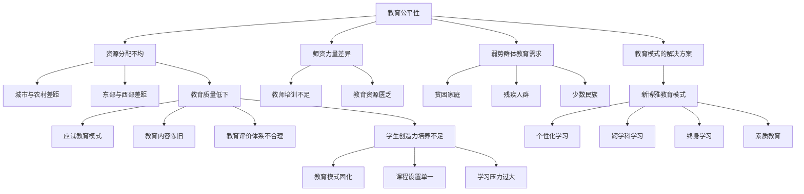

                 

### 1.1 问题背景

在当代社会，教育系统正面临着前所未有的挑战。随着全球化的推进和科技的飞速发展，传统的教育模式已经无法满足现代社会对人才培养的需求。首先，教育公平性问题日益突出。资源分配的不均衡、城乡教育差距、弱势群体的教育需求得不到满足，使得教育公平成为亟待解决的重要议题。其次，教育质量低下问题也备受关注。传统的“应试教育”模式过于注重考试成绩，忽视了学生的实际能力和素质的培养，导致学生创造力不足、批判性思维欠缺。最后，学生创造力培养不足问题也愈加明显。在标准化考试的压力下，学生缺乏自由探索和创新的空间，难以激发他们的创造力和创新精神。

为了应对这些挑战，新博雅教育模式被提出并逐渐得到认可。新博雅教育模式旨在通过个性化学习、跨学科学习和终身学习等方式，全面提升学生的综合素质和创新能力，以适应数字时代的发展需求。新博雅教育模式的核心原则包括：尊重个体差异、培养综合素质、强调实践能力、倡导终身学习等。这一模式不仅关注学生的学术成绩，更注重培养学生的思维能力、创新能力、人际交往能力等多方面的能力。

### 1.2 教育问题的描述

#### 1.2.1 教育公平性问题

教育公平性问题主要体现在以下几个方面：

1. **资源分配不均衡**：城市和农村、东部和西部地区之间的教育资源配置存在显著差异。城市学校拥有更好的教学设施、更多的优秀教师和丰富的教育资源，而农村和西部地区的学校则面临着资源匮乏、教学条件差等问题。

2. **师资力量差异**：教师素质的差异也加剧了教育公平性的问题。一些地区的教师缺乏专业培训、教育背景和教育资源，导致教学质量无法保障。

3. **弱势群体的教育需求**：贫困家庭、残疾人群、少数民族等弱势群体的教育需求往往得不到充分的满足。这些群体面临着经济压力、社会歧视等多种困难，难以享受到平等的教育机会。

#### 1.2.2 教育质量低下问题

教育质量低下问题的表现主要有：

1. **应试教育模式**：传统的应试教育模式过于注重考试成绩，忽视了学生的全面发展。学生在繁重的课业负担下，缺乏自由探索和创新的空间，导致思维僵化、创造力不足。

2. **教育内容陈旧**：一些学校的教育内容仍然停留在几十年前的水平，无法紧跟时代的发展。教材内容缺乏更新，教学方法单一，难以激发学生的学习兴趣。

3. **教育评价体系不合理**：现行的教育评价体系过于单一，主要以考试成绩作为评价学生的唯一标准，忽视了学生的综合素质和能力的评价。

#### 1.2.3 学生创造力培养不足问题

学生创造力培养不足问题的表现如下：

1. **教育模式固化**：传统的教育模式过于注重知识的传授，忽视了学生的创造力和创新精神的培养。学生在学习过程中缺乏自主探索和自由表达的机会。

2. **课程设置单一**：学校课程设置过于单一，缺乏跨学科的综合教育。学生只能在有限的学科领域中学习，难以形成全面的思维能力和创新能力。

3. **学习压力过大**：学生在面对激烈的学习竞争和考试压力时，往往把主要精力放在应试上，忽视了创新和实践能力的发展。

### 1.3 教育模式的解决方案

为了解决上述教育问题，新博雅教育模式提出了一系列创新的教育理念和方法：

#### 1.3.1 新博雅教育模式的基本理念

1. **个性化学习**：尊重学生的个体差异，根据学生的兴趣、能力和学习风格，提供个性化的学习方案。

2. **跨学科学习**：打破学科界限，整合多学科知识，培养学生的综合能力和创新能力。

3. **终身学习**：倡导终身学习的理念，培养学生的自主学习能力和持续学习的能力。

4. **素质教育**：注重学生的全面发展，培养学生的道德品质、人际交往能力和创新精神。

#### 1.3.2 新博雅教育模式的实施路径

1. **教育政策与制度创新**：政府应加大对教育的投入，优化教育资源配置，推动教育公平。同时，改革教育制度，建立多元化的评价体系，鼓励创新教育模式的发展。

2. **教师培训与专业发展**：提高教师的专业素质和教学能力，支持教师进行教育教学创新。建立教师培训与发展的长效机制，促进教师的专业成长。

3. **教育技术应用**：充分利用现代教育技术，如在线教育平台、人工智能、大数据等，提高教育质量和效率。

4. **教育资源共享**：推动教育资源的共享，实现优质教育资源的普及。通过互联网等渠道，让更多的学生能够享受到优质的教育资源。

### 1.4 边界与外延

#### 1.4.1 新博雅教育模式的适用范围

新博雅教育模式适用于从幼儿园到高等教育的各个阶段，尤其是中小学和高等教育阶段。它不仅适用于公立学校，也适用于私立学校和国际学校。

#### 1.4.2 新博雅教育模式与其他教育模式的区别

1. **与传统教育模式的区别**：新博雅教育模式强调个性化学习、跨学科学习和终身学习，与传统教育模式以应试教育为主、注重知识传授的方式有显著差异。

2. **与素质教育的区别**：素质教育注重学生的全面发展，而新博雅教育模式则更加注重培养学生的创新能力和综合素质。

3. **与职业教育模式的区别**：职业教育注重学生的就业技能培养，而新博雅教育模式则更注重学生的全面发展，尤其是创新能力和综合素质的培养。

### 1.5 核心概念与联系

#### 1.5.1 个性化学习

个性化学习是指根据学生的兴趣、能力和学习风格，量身定制学习方案，使学生能够在适合自己的学习环境中高效学习。

**属性特征对比表格：**

| 特征 | 传统教育模式 | 新博雅教育模式 |
| --- | --- | --- |
| 学习内容 | 一刀切 | 因材施教 |
| 学习方式 | 单一 | 多样化 |
| 学习效果 | 应试成绩 | 综合能力 |

**ER实体关系图架构：**

```mermaid
erDiagram
  Student ||--|{ LearningPlan }|:
  Teacher ||--|{ LearningPlan }|:
  LearningPlan {
    id
    learningObjectives
    teachingMethods
    assessmentMethods
  }
```

#### 1.5.2 跨学科学习

跨学科学习是指将不同学科的知识和技能进行整合，培养学生的综合能力和创新能力。

**属性特征对比表格：**

| 特征 | 传统教育模式 | 新博雅教育模式 |
| --- | --- | --- |
| 学习内容 | 学科分割 | 跨学科整合 |
| 学习方式 | 单一学科 | 多学科互动 |
| 学习效果 | 单一学科知识 | 综合学科能力 |

**ER实体关系图架构：**

```mermaid
erDiagram
  Student ||--|{ InterdisciplinaryCourse }|:
  Teacher ||--|{ InterdisciplinaryCourse }|:
  InterdisciplinaryCourse {
    id
    subjects
    learningOutcomes
    teachingMethods
  }
```

#### 1.5.3 终身学习

终身学习是指学生在校期间和毕业后的整个生命周期中，不断学习和更新知识、技能和素质。

**属性特征对比表格：**

| 特征 | 传统教育模式 | 新博雅教育模式 |
| --- | --- | --- |
| 学习阶段 | 校内学习 | 校内外相结合 |
| 学习方式 | 一次性 | 持续性 |
| 学习效果 | 短期知识积累 | 长期能力提升 |

**ER实体关系图架构：**

```mermaid
erDiagram
  Student ||--|{ LifelongLearningPlan }|:
  Teacher ||--|{ LifelongLearningPlan }|:
  LifelongLearningPlan {
    id
    learningObjectives
    learningMethods
    assessmentMethods
  }
```

### 1.6 概念结构与核心要素组成

#### 1.6.1 概念结构图



#### 1.6.2 核心要素分析

1. **教育公平性**：教育公平性是整个教育体系的基础，关系到教育的公正性和社会的发展。它涉及到资源分配、师资力量、弱势群体教育需求等多个方面。

2. **个性化学习**：个性化学习是满足学生个体差异的重要途径，通过因材施教，提高学生的学习效果和兴趣。

3. **跨学科学习**：跨学科学习能够培养学生的综合能力和创新能力，适应现代社会的发展需求。

4. **终身学习**：终身学习是适应知识更新迅速的时代的必要手段，能够提升学生的持续学习和自我发展能力。

5. **素质教育**：素质教育注重学生的全面发展，培养他们的道德品质、人际交往能力和创新精神。

### 1.7 本章小结

本章对新博雅教育模式进行了详细的概述，包括问题背景、教育问题的描述、教育模式的解决方案、边界与外延、核心概念与联系以及概念结构与核心要素组成。通过本章的内容，读者可以对新博雅教育模式有一个全面的认识，了解其在解决教育问题方面的优势和创新点。未来，新博雅教育模式有望在推动教育改革、提高教育质量、培养创新型人才方面发挥重要作用。

### 1.7.2 展望

随着科技的不断进步和社会的快速发展，教育模式的改革和创新势在必行。新博雅教育模式作为一种以学生为中心、注重个性化学习和综合素质培养的教育理念，有望在未来的教育实践中得到更广泛的应用和推广。以下是一些可能的未来发展方向：

1. **教育技术的深度融合**：随着人工智能、大数据、云计算等教育技术的快速发展，新博雅教育模式可以更充分利用这些技术手段，实现个性化学习、跨学科学习和终身学习的深度融合。

2. **教育政策的配套支持**：政府应加大对教育改革的政策支持力度，优化教育资源配置，推动教育公平，为新博雅教育模式的实施提供良好的政策环境。

3. **教师培训与专业发展**：教师是教育改革的重要推动者，提高教师的专业素质和教学能力是实施新博雅教育模式的关键。应加大对教师的培训力度，支持教师进行教育教学创新。

4. **教育资源的共享与开放**：通过互联网等渠道，推动优质教育资源的共享和开放，让更多的学生能够享受到优质的教育资源，缩小教育差距。

5. **国际合作与交流**：加强国际教育合作与交流，借鉴国际先进教育理念和经验，推动新博雅教育模式的国际化发展。

总之，新博雅教育模式的发展前景广阔，有望为全球教育改革提供新的思路和借鉴。通过不断的创新和实践，新博雅教育模式将助力培养更多全面发展的数字时代人才，为社会的发展做出积极贡献。

## 第2章：数字时代的教育需求

### 2.1 数字时代的特点

数字时代，也被称为信息时代或网络时代，其特点主要体现在以下几个方面：

#### 2.1.1 数字化技术的快速发展

数字化技术的快速发展是数字时代最显著的特点之一。从计算机技术、互联网技术到人工智能技术，这些技术的不断进步和应用，极大地改变了人们的生活方式和工作方式。特别是在大数据、云计算、物联网等新技术的推动下，数字化技术正以前所未有的速度和规模影响着社会各个领域。

#### 2.1.2 信息社会的变革

信息社会是一个以信息为主要资源，以信息技术为驱动力的社会。在信息社会中，信息成为最重要的资产，信息获取、处理、传递和应用的能力成为衡量一个国家或地区发展水平的重要指标。信息社会的变革不仅改变了人们的生活和工作方式，也深刻影响了教育领域的发展。

#### 2.1.3 数字时代对人才的新要求

数字时代对人才的新要求主要体现在以下几个方面：

1. **创新能力**：数字时代的快速变化和高度不确定性，要求人才具备强大的创新能力，能够不断适应新环境、解决新问题。

2. **跨学科能力**：数字时代的复杂性和多样性，要求人才具备跨学科的能力，能够整合不同领域的知识和技能，形成新的思维方式和解决问题的方法。

3. **信息技术素养**：在数字时代，信息技术已成为一种基本素养。人才需要具备一定的信息技术素养，能够熟练运用各种信息技术工具，进行信息的获取、处理和传递。

4. **终身学习能力**：数字时代的知识更新速度非常快，人才需要具备终身学习的能力，不断更新知识和技能，以适应不断变化的社会需求。

### 2.2 教育需求的演变

随着数字时代的到来，教育需求也在不断演变。传统的教育模式已经无法满足现代社会对人才培养的新要求，教育需求呈现出以下几个方面的变化：

#### 2.2.1 传统教育模式的局限性

传统教育模式主要依赖于课堂教学和知识传授，注重学生的考试成绩和学术成绩。然而，这种模式存在以下局限性：

1. **缺乏个性化**：传统教育模式往往采用“一刀切”的方式，无法充分考虑学生的个体差异和兴趣需求。

2. **课程内容陈旧**：传统教育模式的教学内容往往滞后于时代的发展，缺乏与数字时代相关的新知识和新技术。

3. **教学方法单一**：传统教育模式的教学方法主要依赖于教师的讲授和学生记忆，缺乏互动和实践性。

#### 2.2.2 教育需求的多样化

数字时代的到来，使得人们对教育的需求越来越多样化。现代社会对人才的需求不再仅仅局限于学术成绩，更注重学生的创新能力、跨学科能力、信息技术素养和终身学习能力。因此，教育需求呈现出以下特点：

1. **个性化需求**：随着个体意识的增强，学生和家长对教育的个性化需求越来越高。他们希望教育能够充分考虑学生的兴趣、能力和学习风格，提供量身定制的学习方案。

2. **实践性需求**：数字时代要求人才具备实际操作能力，因此，教育需求逐渐从理论转向实践，强调学生的动手能力和实际操作能力。

3. **跨学科需求**：数字时代的复杂性和多样性，要求人才具备跨学科的能力，能够整合不同领域的知识和技能，解决实际问题。

#### 2.2.3 新博雅教育模式的适应能力

新博雅教育模式具有很好的适应能力，能够满足数字时代的教育需求。新博雅教育模式的核心原则包括个性化学习、跨学科学习和终身学习，这些原则与数字时代对人才培养的新要求高度契合。

1. **个性化学习**：新博雅教育模式注重学生的个体差异，通过因材施教，提供个性化的学习方案，满足学生的个性化需求。

2. **跨学科学习**：新博雅教育模式打破学科界限，整合多学科知识，培养学生的综合能力和创新能力，适应数字时代对跨学科能力的需求。

3. **终身学习**：新博雅教育模式倡导终身学习的理念，培养学生的自主学习能力和持续学习的能力，适应数字时代快速变化的知识环境。

### 2.3 新博雅教育模式的目标

新博雅教育模式的目标是培养具有以下特点的全面发展的数字时代人才：

1. **创新能力**：具备强大的创新能力和创新思维，能够适应数字时代的快速变化和不确定性。

2. **跨学科能力**：具备跨学科的知识和技能，能够整合不同领域的知识和技能，解决复杂问题。

3. **信息技术素养**：具备良好的信息技术素养，能够熟练运用各种信息技术工具，进行信息的获取、处理和传递。

4. **终身学习能力**：具备终身学习的能力，能够不断更新知识和技能，适应数字时代快速变化的知识环境。

5. **综合素质**：具备良好的道德品质、人际交往能力和团队协作能力，能够适应社会发展的需求。

通过新博雅教育模式的培养，学生不仅能够在学术领域取得优异成绩，更能够在创新、实践、合作等方面全面发展，成为数字时代的优秀人才。

### 2.4 教育技术的应用

随着数字时代的发展，教育技术的应用越来越广泛，对教育模式的变革起到了重要的推动作用。以下将从在线教育平台、人工智能和云计算三个方面，探讨教育技术的应用及其对教育模式的影响。

#### 2.4.1 在线教育平台的应用

在线教育平台是教育技术的重要组成部分，它通过互联网提供教育资源和教学服务，极大地改变了传统教育的教学模式。在线教育平台的应用主要体现在以下几个方面：

1. **资源共享**：在线教育平台打破了地域和时间的限制，使得优质的教育资源可以共享给全球的学生。无论是名校课程、名师讲座，还是海量的学习资料，都可以通过网络免费或低成本地获取。

2. **个性化学习**：在线教育平台可以根据学生的学习进度、兴趣和学习风格，提供个性化的学习建议和课程推荐，实现因材施教。

3. **互动学习**：在线教育平台提供了丰富的互动功能，如论坛讨论、在线问答、实时互动等，让学生能够在虚拟环境中进行交流和合作，提高学习效果。

4. **教学管理**：在线教育平台提供了便捷的教学管理功能，如课程管理、作业管理、成绩管理等，帮助教师更加高效地进行教学管理和学生管理。

#### 2.4.2 人工智能在教育中的应用

人工智能（AI）在教育中的应用，为教育模式的变革带来了新的机遇。以下是人工智能在教育中的一些主要应用：

1. **个性化教学**：人工智能可以通过大数据分析和机器学习技术，对学生的学习行为、学习进度和兴趣进行深入分析，为学生提供个性化的学习方案和教学资源。

2. **智能辅导**：人工智能可以为学生提供智能辅导，解答学生在学习过程中遇到的问题，帮助学生克服学习难题。

3. **学习诊断**：人工智能可以通过智能测评系统，对学生的学习情况进行诊断，发现学生的知识薄弱点，为教师提供教学改进的依据。

4. **智能评价**：人工智能可以用于自动评价学生的作业和考试，减少人为评价的误差，提高评价的客观性和准确性。

#### 2.4.3 云计算在教育中的应用

云计算是一种通过互联网提供计算资源和服务的技术，它在教育中的应用极大地提升了教育资源的利用效率和教学灵活性。以下是云计算在教育中的主要应用：

1. **弹性扩展**：云计算可以根据教学需求，灵活扩展或缩减计算资源，满足不同规模和类型的教学活动。

2. **资源共享**：云计算提供了强大的资源共享功能，教师和学生可以随时随地访问和共享教学资源，提高教学效率。

3. **在线协作**：云计算支持在线协作工具，如在线文档编辑、实时会议等，让学生和教师能够进行在线协作，提高教学互动性。

4. **安全性**：云计算提供了安全可靠的数据存储和备份服务，保障教学数据和学生的学习记录的安全。

### 2.5 本章小结

数字时代的发展对教育模式提出了新的挑战和机遇。在线教育平台、人工智能和云计算等教育技术的广泛应用，为教育模式的变革提供了强有力的支持。新博雅教育模式正是基于这些技术，通过个性化学习、跨学科学习和终身学习等方式，满足数字时代对人才培养的新要求。未来，随着教育技术的不断进步和应用，新博雅教育模式有望在全球范围内得到更广泛的应用和推广，为培养全面发展的数字时代人才做出更大贡献。

### 2.5.2 展望

随着数字技术的不断演进，教育领域将迎来更多变革和创新。以下是未来教育技术发展的一些展望：

#### 1. 虚拟现实（VR）与增强现实（AR）在教育中的应用

虚拟现实和增强现实技术能够提供沉浸式的学习体验，使学生能够身临其境地参与学习过程。例如，通过VR技术，学生可以虚拟参观历史遗迹、太空探索，或者参与模拟实验，这些体验将大大提升学习的趣味性和效果。

#### 2. 人工智能个性化学习助理的普及

随着人工智能技术的进一步发展，个性化学习助理将更加智能化，能够根据学生的学习习惯、兴趣和需求，提供实时、个性化的学习建议和辅导。这种智能化的学习辅助工具将帮助学生更高效地学习，提高学习效果。

#### 3. 大规模开放在线课程（MOOC）的深化与普及

MOOC作为一种开放的教育资源，已经在全球范围内推广。未来，MOOC平台将更加成熟，课程内容和教学方式也将更加多样化和互动化，使得更多的学生能够受益于全球顶尖的教育资源。

#### 4. 云计算的深度融合

云计算的深度融合将使得教育资源的获取和管理更加便捷和高效。云教室、云实验室等概念将逐步普及，教师和学生可以通过云计算平台轻松实现资源的共享和协作。

#### 5. 教育数据的安全与隐私保护

随着教育数据量的剧增，数据的安全与隐私保护将变得尤为重要。未来，教育领域将需要更加完善的法律法规和技术手段，以确保学生数据的隐私和安全。

总之，未来教育技术的发展将为新博雅教育模式的实施提供更加坚实的基础，使其在培养全面发展的数字时代人才方面发挥更大的作用。通过不断的技术创新和教育模式的改革，教育将变得更加个性化、智能化和高效化，为社会的持续发展做出积极贡献。

## 第3章：个性化学习

### 3.1 个性化学习的定义

个性化学习是指根据学生的个体差异，如兴趣、学习能力、学习风格等，量身定制学习方案，旨在最大化地满足每个学生的学习需求，提升学习效果。个性化学习不仅关注学生的学术成绩，更注重学生的全面发展，包括思维能力、创造力、人际交往能力等多个方面。

### 3.2 个性化学习的方法

#### 1. **评估学生的个体差异**

个性化学习的第一步是评估学生的个体差异。这可以通过多种方式进行，如心理测试、学习习惯观察、学习需求调查等。通过这些方法，教师可以了解学生的兴趣、优势、弱点以及学习风格。

**心理测试：** 例如，可以使用学习风格量表（如VARK学习风格量表）来了解学生的学习偏好，如视觉、听觉、阅读/写作或动手操作。

**学习习惯观察：** 教师可以通过观察学生在课堂上的行为，了解他们的学习习惯，如是否喜欢小组讨论、是否善于独立思考等。

**学习需求调查：** 通过问卷调查或访谈，收集学生对学习内容、学习方法、学习资源等方面的需求。

#### 2. **设计个性化的学习方案**

在了解学生的个体差异后，教师可以根据评估结果设计个性化的学习方案。这些方案应包括学习目标、学习内容、学习方法和评估方式。

**学习目标：** 根据学生的兴趣和优势，设定具体、可测量的学习目标，例如提高数学解题能力、增强英语口语表达能力等。

**学习内容：** 根据学生的需求和学习目标，选择适当的学习内容。例如，对于喜欢视觉学习的学生，可以采用图文并茂的教学材料；对于喜欢动手操作的学生，可以设计实验或项目活动。

**学习方法：** 根据学生的不同学习风格，采用多样化的教学方法。例如，对于视觉学习者，可以采用视频讲解、图像展示；对于听觉学习者，可以采用音频讲解、小组讨论；对于读写学习者，可以采用阅读材料、写作练习。

**评估方式：** 采用多元化的评估方式，如平时成绩、项目报告、口头表达等，全面评估学生的学习效果。

#### 3. **实施个性化的学习过程**

在个性化学习方案设计完成后，教师需要实施个性化学习过程。这包括以下步骤：

**跟踪学习进度：** 教师应定期跟踪学生的学习进度，了解他们在学习过程中的困难和需求，及时给予帮助和指导。

**提供个性化辅导：** 对于学习困难的学生，教师应提供个性化的辅导，帮助他们克服学习难题，提升学习能力。

**鼓励自主学习：** 个性化学习强调学生的自主学习能力，教师应鼓励学生主动探索、发现和解决问题。

#### 4. **反馈与调整**

个性化学习不是一次性的过程，而是一个持续迭代的过程。教师应根据学生的学习反馈，不断调整和优化学习方案。

**收集反馈：** 通过定期反馈、学生自评、同伴互评等方式，收集学生的学习反馈，了解他们对学习方案的满意度和效果。

**调整学习方案：** 根据反馈结果，教师应调整学习方案，优化教学方法和内容，确保个性化学习的持续有效性。

### 3.3 个性化学习的技术支持

#### 1. **学习分析技术**

学习分析技术可以通过数据分析，了解学生的学习行为和效果，为个性化学习提供数据支持。例如，通过学习分析系统，教师可以了解学生在学习过程中的参与度、学习时间、问题解决能力等指标，从而制定更有效的教学策略。

**技术原理：** 学习分析技术通常基于大数据和机器学习算法，通过对学习数据的收集、分析和处理，生成学习报告和个性化建议。

#### 2. **自适应学习系统**

自适应学习系统可以根据学生的学习行为和表现，动态调整学习内容和难度，提供个性化的学习体验。这种系统通常采用智能算法，如自适应学习算法、生成对抗网络（GAN）等，实现对学习过程的实时调整。

**技术原理：** 自适应学习系统通过分析学生的知识点掌握情况、学习行为数据等，动态调整学习内容和难度。例如，当学生掌握某个知识点后，系统可以自动增加该知识点的练习题，或者降低难度，以巩固学生的知识。

#### 3. **在线学习平台**

在线学习平台提供了丰富的个性化学习资源和学习工具，支持多种学习模式，如视频学习、在线测试、小组讨论等。通过在线学习平台，学生可以自主选择学习内容，灵活安排学习时间，提高学习效率。

**技术原理：** 在线学习平台通常基于云计算和大数据技术，支持大规模在线学习活动。平台提供的学习资源和学习工具，可以根据学生的需求和学习风格进行个性化配置。

### 3.4 个性化学习的挑战与解决方案

尽管个性化学习具有诸多优势，但在实际应用中仍面临一些挑战。

#### 1. **数据隐私与安全**

个性化学习依赖于对大量学生数据的收集和分析，这可能导致数据隐私和安全问题。为了应对这一挑战，需要采取以下措施：

**技术解决方案：** 实施严格的数据加密和安全存储措施，确保学生数据的隐私和安全。

**管理措施：** 制定明确的数据隐私政策和数据安全规范，确保数据的合法使用和管理。

#### 2. **教师培训与支持**

个性化学习对教师的专业能力和教学水平提出了更高要求。为了应对这一挑战，需要采取以下措施：

**培训措施：** 提供系统化的教师培训，帮助教师掌握个性化学习的设计和实施方法。

**支持措施：** 建立教师支持系统，如教学顾问、专家指导等，为教师提供专业支持和帮助。

#### 3. **学习资源不足**

个性化学习需要丰富的学习资源和工具支持，但在一些地区和学校，学习资源的不足可能成为实施个性化学习的障碍。为了应对这一挑战，需要采取以下措施：

**资源建设：** 加强对学习资源的建设和整合，利用互联网和开源平台，提供多样化的学习资源。

**资源共享：** 推动教育资源的共享和开放，实现优质教育资源的普及和公平分配。

### 3.5 个性化学习的实施案例

以下是一个个性化学习的实施案例：

**案例背景：** 某高中为了提高学生的数学学习效果，决定引入个性化学习模式。

**实施步骤：**

1. **学生评估**：通过学习分析系统和心理测试，对学生进行评估，了解他们的学习兴趣、能力和学习风格。

2. **个性化学习方案设计**：根据评估结果，教师为学生制定个性化的学习方案，包括学习目标、学习内容和评估方式。

3. **个性化学习过程实施**：教师通过在线学习平台，提供个性化的学习资源和学习工具，学生根据学习方案自主安排学习时间和进度。

4. **学习反馈与调整**：定期收集学生的学习反馈，教师根据反馈结果，调整学习方案，优化教学方法和内容。

**实施效果：** 通过个性化学习模式，学生的数学学习兴趣和效果显著提高，数学成绩也取得了明显进步。

通过以上案例，可以看出个性化学习在提升学生学习效果和兴趣方面具有显著优势，为教育模式的改革提供了有益的启示。

### 3.6 个性化学习的重要性

个性化学习的重要性在于它能够充分满足学生的个体需求，提升学习效果和兴趣。与传统教育模式相比，个性化学习具有以下优势：

1. **提高学习效果**：个性化学习根据学生的兴趣和能力，提供量身定制的学习内容和方法，有助于学生更好地掌握知识和技能，提高学习效果。

2. **激发学习兴趣**：个性化学习鼓励学生主动探索和发现，激发学生的学习兴趣和积极性，使学生更加享受学习过程。

3. **培养自主学习能力**：个性化学习强调学生的自主学习能力，帮助学生养成主动学习、持续学习的习惯，为终身学习奠定基础。

4. **促进全面发展**：个性化学习不仅关注学生的学术成绩，更注重学生的全面发展，包括思维能力、创新能力、人际交往能力等多个方面。

总之，个性化学习是适应数字时代教育需求的重要教育模式，它将为培养全面发展的数字时代人才提供有力支持。

## 第4章：跨学科学习

### 4.1 跨学科学习的意义

跨学科学习是一种将不同学科的知识和技能进行整合，以培养学生的综合能力和创新思维的教育方法。它对于数字时代的人才培养具有重要意义，主要体现在以下几个方面：

#### 1. **应对复杂问题的能力**

在数字时代，许多问题都不是单一学科可以解决的，而是需要多个学科的协同合作。跨学科学习能够培养学生的综合分析能力和解决复杂问题的能力，使他们能够从不同角度思考问题，找到创新的解决方案。

#### 2. **适应快速变化的社会环境**

数字时代的社会环境变化迅速，对人才的需求也在不断变化。跨学科学习能够使学生具备灵活适应新环境的能力，能够快速掌握新知识和新技能，以适应社会的发展。

#### 3. **提升创新思维能力**

跨学科学习打破了学科界限，使学生能够在不同领域之间进行知识整合和创新，提升他们的创新思维能力。这种创新思维不仅有助于解决实际问题，也为未来的职业发展提供了广阔的空间。

#### 4. **培养团队合作精神**

跨学科学习通常需要学生进行团队合作，这有助于培养学生的团队合作精神。通过团队协作，学生能够学会如何与他人沟通、协调和合作，提高人际交往能力。

#### 5. **提升综合素质**

跨学科学习不仅关注学生的学术成绩，还注重学生的全面发展，包括思维能力、创新能力、人际交往能力等多个方面。这种综合素质的提升有助于学生成为全面发展的人才。

### 4.2 跨学科学习的方法

跨学科学习的方法多种多样，以下是一些常见的方法：

#### 1. **项目式学习**

项目式学习是一种以项目为导向的学习方式，学生通过完成实际项目来掌握跨学科的知识和技能。项目可以是真实的或模拟的，例如设计一款智能产品、解决一个社会问题等。通过项目式学习，学生能够将不同学科的知识和技能进行整合，提高解决实际问题的能力。

#### 2. **案例学习**

案例学习是一种通过分析真实案例来学习跨学科知识的方法。教师可以选择典型的案例，引导学生从不同学科的角度进行分析，以培养学生的综合分析能力和创新思维。

#### 3. **问题解决学习**

问题解决学习是一种以问题为导向的学习方式，学生通过解决实际问题来学习跨学科的知识和技能。这种学习方法强调学生的主动参与和探索，有助于培养学生的创新能力和解决问题的能力。

#### 4. **合作学习**

合作学习是一种通过小组合作来学习跨学科知识的方法。学生在小组中分工合作，共同完成学习任务。通过合作学习，学生能够学会如何与他人沟通、协调和合作，提高人际交往能力。

### 4.3 跨学科学习的实践

跨学科学习的实践需要教师和学校进行一系列的改革和创新，以下是一些实践案例：

#### 1. **跨学科课程设计**

学校可以通过设计跨学科课程，将不同学科的知识进行整合。例如，将数学、物理和计算机科学结合起来，设计一门关于机器人编程的课程；将历史、地理和社会学结合起来，设计一门关于全球化与文化交流的课程。

#### 2. **跨学科项目实践**

学校可以组织跨学科项目，让学生在实践中掌握跨学科的知识和技能。例如，组织学生参与科学实验、社会调查、艺术创作等跨学科项目，通过项目实践，学生能够将不同学科的知识进行整合和应用。

#### 3. **跨学科教师团队**

学校可以组建跨学科教师团队，教师团队成员来自不同学科，通过团队合作，共同开发和实施跨学科课程。跨学科教师团队的建立有助于打破学科界限，促进知识整合和教学方法创新。

#### 4. **跨学科学习平台**

学校可以搭建跨学科学习平台，提供丰富的跨学科学习资源，如在线课程、学习工具、案例库等。跨学科学习平台可以帮助学生随时随地获取跨学科的知识和技能，提高学习效率。

### 4.4 跨学科学习的优势与挑战

跨学科学习的优势在于它能够培养学生的综合能力和创新思维，提升他们的竞争力。然而，跨学科学习也面临一些挑战：

#### 1. **师资力量不足**

跨学科学习对教师的专业素质和教学能力提出了更高要求。然而，许多学校缺乏具备跨学科背景的教师，这成为跨学科学习实施的一个重要挑战。

#### 2. **课程设计复杂**

跨学科课程的设计需要教师具备丰富的学科知识和跨学科整合能力。课程设计复杂，需要教师投入大量时间和精力。

#### 3. **教学方法多样**

跨学科学习要求教师采用多样化的教学方法，以适应不同学科和不同学习风格的学生。这增加了教师的教学难度和复杂性。

#### 4. **评价体系不完善**

跨学科学习评价体系的建立是一个复杂的任务。如何评价学生在跨学科学习中的表现，如何确保评价的公平性和科学性，都是需要解决的问题。

### 4.5 跨学科学习的未来趋势

随着科技的不断进步和教育理念的不断发展，跨学科学习在未来将呈现以下趋势：

#### 1. **教育技术的深度融合**

教育技术的深度融合将使跨学科学习更加便捷和高效。例如，虚拟现实（VR）和增强现实（AR）技术可以提供沉浸式的跨学科学习体验，人工智能可以为学生提供个性化的跨学科学习建议。

#### 2. **跨学科学习资源的丰富化**

随着互联网和开放教育资源的发展，跨学科学习资源将越来越丰富。教师和学生可以随时随地获取高质量的跨学科学习资源，提高学习效果。

#### 3. **跨学科学习模式的多样化**

跨学科学习模式将更加多样化，不仅限于课堂教学，还可以通过在线学习、项目实践等多种方式进行。这将使跨学科学习更加灵活和适应不同需求。

#### 4. **跨学科学习评价体系的完善**

随着教育技术的发展和评价理论的完善，跨学科学习评价体系将逐步完善。评价将更加注重学生的综合素质和创新能力，以更好地体现跨学科学习的价值。

总之，跨学科学习作为适应数字时代教育需求的重要教育模式，将在未来得到更广泛的应用和推广。通过不断的改革和创新，跨学科学习将为学生提供更加丰富和多样化的学习体验，培养出具备全面发展和创新能力的高素质人才。

### 4.6 跨学科学习的重要性

跨学科学习的重要性在于它能够培养学生的综合能力和创新思维，提升他们在快速变化的社会环境中的适应能力。具体来说，跨学科学习的重要性体现在以下几个方面：

1. **培养综合素质**：跨学科学习不仅关注学生的学术成绩，还注重学生的全面发展，包括思维能力、创新能力、人际交往能力等多个方面。这种综合素质的提升有助于学生成为全面发展的人才。

2. **提升创新能力**：跨学科学习打破了学科界限，使学生能够在不同领域之间进行知识整合和创新，提升他们的创新思维能力。这种创新能力不仅有助于解决实际问题，也为未来的职业发展提供了广阔的空间。

3. **增强适应能力**：在数字时代，社会环境变化迅速，跨学科学习能够使学生具备灵活适应新环境的能力，能够快速掌握新知识和新技能，以适应社会的发展。

4. **促进终身学习**：跨学科学习强调学生的自主学习能力，帮助学生养成主动学习、持续学习的习惯，为终身学习奠定基础。在未来的职业生涯中，这种终身学习的能力将使学生在竞争激烈的市场中脱颖而出。

总之，跨学科学习是适应数字时代教育需求的重要教育模式，它将为培养全面发展的数字时代人才提供有力支持。通过跨学科学习，学生不仅能够在学术领域取得优异成绩，更能够在创新、实践、合作等方面全面发展，成为社会发展的中坚力量。

## 第5章：终身学习

### 5.1 终身学习的理念

终身学习是一种持续的学习过程，始于出生，止于生命终结。它强调个人在社会发展和职业变化的过程中，通过不断学习和更新知识、技能和态度，以适应不断变化的环境和需求。终身学习不仅关注个体的学术成就，更注重其整体发展，包括思维能力、创新能力、人际交往能力等多个方面。

终身学习理念的核心在于：

1. **自我导向学习**：强调个人主动学习，培养自我导向的学习习惯和能力。

2. **持续学习**：终身学习不是一次性或短期学习，而是持续不断的学习过程。

3. **适应变化**：终身学习旨在帮助个人适应快速变化的社会环境和职业需求。

4. **全面发展**：终身学习不仅关注学术成就，更注重个人的全面发展。

### 5.2 终身学习的方式

#### 1. **正式教育**

正式教育包括学校教育、职业教育和成人教育等。通过这些教育形式，个人可以系统地学习知识、技能和态度。例如，学生在学校接受基础教育和专业教育，职业人士通过职业教育和培训提升职业技能。

**案例：** 某公司为员工提供定期培训，帮助他们掌握新技术和业务知识，以适应公司发展的需求。

#### 2. **非正式教育**

非正式教育是指个人在日常生活中通过各种途径进行的学习，如阅读书籍、参加讲座、观看教育视频等。非正式教育强调个人的自主性和灵活性，能够满足个性化学习需求。

**案例：** 个人通过在线课程平台学习编程技能，提升自己的职业竞争力。

#### 3. **在线学习**

在线学习是现代终身学习的重要形式，通过互联网，个人可以随时随地获取各种教育资源。在线学习平台提供了丰富的课程和学习工具，支持个性化学习。

**案例：** 学生通过MOOC（大规模开放在线课程）平台学习最新科学研究成果，拓宽知识面。

#### 4. **社会实践**

社会实践是一种通过实际参与社会活动来学习的方式。通过社会实践，个人可以了解社会运行规律，培养社会责任感和实践能力。

**案例：** 学生参与社会服务项目，了解社区需求，提升团队合作和解决问题的能力。

### 5.3 终身学习的挑战与应对策略

终身学习虽然具有诸多优势，但也面临一些挑战：

#### 1. **时间管理**

终身学习需要个人投入大量时间和精力，这对忙碌的职场人士来说是一个挑战。为了应对这一挑战，个人需要制定合理的学习计划，合理安排时间和精力。

**策略：** 制定每日学习计划，确保有足够的时间用于学习。利用碎片时间，如通勤、休息时间进行学习。

#### 2. **资源获取**

终身学习需要丰富的学习资源，但对于一些地区和群体，获取优质学习资源可能存在困难。为了应对这一挑战，需要加强教育资源的建设和共享。

**策略：** 政府和机构应加大对教育资源的投入，推动教育资源的公平分配。利用互联网和在线学习平台，提供免费或低成本的优质学习资源。

#### 3. **自我驱动**

终身学习强调个人主动学习，但有些人可能缺乏自我驱动力。为了应对这一挑战，需要培养个人的自主学习能力和自我驱动能力。

**策略：** 设定明确的学习目标和奖励机制，激发学习兴趣和动力。通过学习社区和社交网络，与他人交流学习经验和心得，增强自我驱动力。

### 5.4 终身学习的重要性

终身学习在数字时代的重要性体现在以下几个方面：

1. **适应社会变化**：随着科技的快速发展和职业需求的变化，终身学习能够帮助个人适应社会环境的快速变化。

2. **提升竞争力**：终身学习能够提升个人的知识和技能水平，增强职场竞争力。

3. **促进全面发展**：终身学习不仅关注学术成就，更注重个人的全面发展，包括思维能力、创新能力、人际交往能力等多个方面。

4. **实现个人价值**：终身学习能够帮助个人实现自我价值，提升生活质量。

总之，终身学习是适应数字时代教育需求的重要教育理念，它将为培养全面发展的数字时代人才提供有力支持。

### 5.5 终身学习的实施案例

以下是一个终身学习的实施案例：

**案例背景：** 某公司的员工由于市场竞争加剧，需要不断更新知识和技能，以提升职业竞争力。

**实施步骤：**

1. **制定学习计划**：公司为员工制定个人学习计划，明确学习目标和时间安排。

2. **提供学习资源**：公司提供丰富的学习资源，包括在线课程、专业书籍、培训讲座等。

3. **组织学习活动**：公司定期组织内部学习活动，如研讨会、工作坊等，鼓励员工分享学习经验和心得。

4. **考核与奖励**：公司对员工的学习成果进行考核，并提供奖励机制，激发员工的学习兴趣和动力。

**实施效果：** 通过终身学习，员工的知识和技能水平显著提升，公司的整体竞争力得到增强。

通过这个案例，可以看出终身学习在提升个人职业能力和企业竞争力方面具有显著优势。

### 5.6 终身学习的未来展望

随着科技的不断进步和教育理念的不断发展，终身学习在未来将呈现以下趋势：

#### 1. **在线教育与混合学习**

在线教育和混合学习将成为终身学习的主要形式。随着互联网技术的不断发展和在线教育资源的丰富，越来越多的人将通过在线学习平台进行学习。同时，混合学习模式将融合线上和线下教育，提供更加灵活和个性化的学习体验。

#### 2. **教育技术的深度融合**

教育技术的深度融合将使终身学习更加便捷和高效。例如，虚拟现实（VR）和增强现实（AR）技术可以提供沉浸式的学习体验，人工智能可以为学生提供个性化的学习建议和辅导。

#### 3. **终身学习体系的建设**

政府、企业和教育机构将加大对终身学习体系的建设，提供更加完善的学习资源和学习环境。终身学习体系将更加注重个性化学习和跨学科学习，以满足不同人群的学习需求。

#### 4. **学习型社会的构建**

终身学习将推动学习型社会的构建，使个人、社区和国家都能够不断适应和引领社会发展的趋势。学习型社会将强调持续学习和终身学习，促进社会的和谐发展和进步。

总之，终身学习作为适应数字时代教育需求的重要教育理念，将在未来得到更广泛的应用和推广。通过不断的改革和创新，终身学习将为培养全面发展的数字时代人才提供有力支持，为社会的发展做出积极贡献。

## 第6章：教育政策与制度

### 6.1 教育政策的重要性

教育政策是国家或地区为实现特定教育目标而制定的一系列法规、规划、政策和措施。教育政策的重要性在于其对教育发展的方向、速度和质量具有决定性影响。有效的教育政策可以推动教育公平、提升教育质量、培养创新型人才，从而促进社会经济的可持续发展。

#### 6.1.1 推动教育公平

教育政策在推动教育公平方面具有关键作用。通过制定和实施公平的教育政策，国家可以确保不同地区、不同群体和学生享有平等的教育机会。例如，通过加大对农村和贫困地区教育资源的投入，缩小城乡教育差距；通过设立专项资金和优惠政策，支持弱势群体和残疾学生的教育。

#### 6.1.2 提升教育质量

教育政策在提升教育质量方面也具有重要意义。通过制定高质量的教育政策，国家可以引导和规范教育发展方向，促进教育创新和教育改革。例如，通过加强教师培训和提高教师待遇，提升教师队伍的整体素质；通过推动课程改革和教材更新，提高教学内容和方法的现代化水平。

#### 6.1.3 培养创新型人才

教育政策在培养创新型人才方面起着至关重要的作用。通过制定和实施有利于创新型人才成长的教育政策，国家可以培养出具有创新精神和实践能力的高素质人才。例如，通过建立产学研结合的教育模式，促进学术成果转化为实际应用；通过支持创新创业教育，激发学生的创新潜力。

### 6.2 教育制度的创新

教育制度的创新是适应社会发展和教育需求变化的重要手段。随着数字时代的到来，传统的教育制度已经无法满足现代社会对人才培养的新要求。因此，教育制度的创新成为当前教育改革的重要方向。

#### 6.2.1 个性化教育制度的创新

个性化教育制度的创新是应对学生个体差异、提高教育质量的重要途径。通过个性化教育制度，学校可以根据学生的兴趣、能力和学习风格，提供个性化的学习方案和教学服务。例如，通过建立学生发展档案，记录学生的学习历程和成长轨迹；通过引入智能学习系统，实现个性化学习路径的动态调整。

#### 6.2.2 跨学科教育制度的创新

跨学科教育制度的创新是培养综合型人才、提升创新能力的重要手段。通过跨学科教育制度，学校可以将不同学科的知识和技能进行整合，提供跨学科的课程和项目。例如，通过设立跨学科研究中心，推动跨学科研究和教育合作；通过开展跨学科项目，培养学生的综合能力和创新能力。

#### 6.2.3 终身教育制度的创新

终身教育制度的创新是适应知识更新迅速、提升国民素质的重要途径。通过终身教育制度，学校可以提供多样化的学习机会和资源，支持个人在终身学习过程中不断提升知识和技能。例如，通过建立终身学习体系，提供不同层次、不同类型的培训和教育服务；通过推动线上线下教育的融合，实现学习方式的多样化。

### 6.3 政策与制度的实施

教育政策与制度的实施是教育改革成功的关键环节。为了确保教育政策与制度的顺利实施，需要采取一系列措施：

#### 6.3.1 加强政策宣传与解读

政策宣传与解读是确保教育政策与制度得到公众理解和认可的重要手段。政府可以通过多种渠道，如新闻发布会、政策解读会、媒体宣传等，向社会各界宣传教育政策与制度的重要性和实施内容。

#### 6.3.2 建立监督与评估机制

建立监督与评估机制是确保教育政策与制度得到有效执行的重要保障。政府可以设立专门的监督机构，对教育政策与制度的实施情况进行定期检查和评估，及时发现和解决存在的问题。

#### 6.3.3 加强教师培训与专业发展

教师是教育政策与制度实施的重要执行者。加强教师培训与专业发展，提高教师的教育教学能力，是确保教育政策与制度顺利实施的关键。政府可以加大对教师的培训力度，提供专业发展的机会和资源。

#### 6.3.4 营造良好的教育环境

营造良好的教育环境是确保教育政策与制度顺利实施的重要条件。政府可以通过加强基础设施建设、提高教育经费投入、改善教育条件等手段，为教育政策与制度的实施创造良好的外部环境。

通过以上措施，可以确保教育政策与制度得到有效实施，推动教育改革向纵深发展，为培养全面发展的数字时代人才提供有力支持。

### 6.4 教育政策与制度的影响

教育政策与制度对教育发展具有深远的影响，这些影响可以从多个维度进行探讨：

#### 6.4.1 提升教育质量

有效的教育政策与制度能够显著提升教育质量。通过制定和实施严格的教育标准和质量评估体系，政府可以确保教育资源的合理配置和教学质量的持续改进。例如，美国的《不让一个孩子掉队法》通过设立明确的教育标准和评估机制，推动了全美教育质量的提升。

#### 6.4.2 促进教育公平

教育政策与制度在促进教育公平方面发挥了重要作用。通过设立专项资金、实施教育扶贫政策、提供免费或低收费的教育服务，政府可以确保不同地区和不同群体享有平等的教育机会。例如，中国的“农村义务教育工程”通过增加农村教育投入，改善了农村学校的教学条件和师资力量，缩小了城乡教育差距。

#### 6.4.3 增强创新能力

创新的教育政策与制度可以激发学生的创新能力和创造力。通过推动跨学科教育、鼓励学生参与科学研究和创新项目，政府可以培养出具有创新精神和实践能力的人才。例如，芬兰的教育政策强调个性化学习和跨学科教育，培养了大量具有创新能力和创业精神的人才。

#### 6.4.4 促进社会进步

教育政策与制度对社会进步具有深远的影响。通过培养高素质的人才，提升国民的整体素质，教育政策与制度可以推动社会经济的发展和科技进步。例如，日本在二战后通过实施《教育基本法》和《学校教育法》，培养了大量的高素质人才，为日本经济的迅速复苏和现代化建设做出了巨大贡献。

#### 6.4.5 应对全球化挑战

全球化带来了新的教育挑战和机遇，有效的教育政策与制度可以帮助国家应对这些挑战。通过推动教育国际化、提升外语教育水平、促进国际交流与合作，政府可以培养出具有国际视野和竞争力的人才。例如，欧洲的“伊拉斯谟计划”通过促进欧洲国家间的学生和教师交流，提升了欧洲教育的国际竞争力。

总之，教育政策与制度对教育发展和社会进步具有重要影响。通过不断改革和创新，制定和实施更加科学和有效的教育政策与制度，可以为培养全面发展的数字时代人才提供有力支持，推动社会的持续进步和发展。

## 第7章：教师培训与专业发展

### 7.1 教师培训的必要性

教师是教育改革和发展的重要推动者，教师培训与专业发展对于提升教育质量、促进教育公平和培养创新型人才具有关键作用。以下是教师培训的必要性：

#### 1. **提高教师素质**

教师是学生学习的主要引导者，其专业素质直接影响到学生的学习效果。通过教师培训，可以提升教师的专业知识和教学能力，确保教师能够胜任教学任务。

#### 2. **适应教育改革**

教育改革要求教师具备适应新教育理念和新教学方法的能力。教师培训可以帮助教师掌握最新的教育理论和实践方法，以适应教育改革的需求。

#### 3. **促进教学创新**

教师培训鼓励教师进行教学创新，通过引入新的教学技术和方法，提高教学效果。教学创新不仅能够激发学生的学习兴趣，还能培养学生的创新能力和批判性思维。

#### 4. **提升教育公平**

教师培训有助于缩小城乡、地区间的教育差距。通过提供优质的教育培训资源，政府可以确保农村和贫困地区的教师也能获得与城市教师同等的教育机会，从而提升教育公平。

#### 5. **满足社会需求**

随着社会的发展，对人才的需求也在不断变化。教师培训可以帮助教师了解社会需求的变化，调整教学内容和方法，以满足社会对高素质人才的需求。

### 7.2 教师专业发展的路径

教师专业发展是一个持续的过程，涉及教师的知识更新、能力提升和素养培养。以下是一些常见的教师专业发展路径：

#### 1. **入职培训**

入职培训是教师职业生涯的起点。新教师通过入职培训，可以了解学校的规章制度、教育理念和教学环境，为顺利开展教学工作打下基础。入职培训通常包括教育政策解读、教学方法介绍、班级管理技巧等。

#### 2. **在职培训**

在职培训是教师持续发展的重要途径。通过参加各种培训班、研讨会和工作坊，教师可以学习最新的教育理论和实践方法，提升自己的教学能力。在职培训的形式多样，包括线上培训、面授课程、实地考察等。

#### 3. **自我学习**

自我学习是教师专业发展的重要组成部分。教师可以通过阅读专业书籍、参加在线课程、参与教育论坛等方式，不断更新自己的知识体系。自我学习有助于教师培养独立思考和创新精神。

#### 4. **专业反思**

专业反思是教师专业发展的重要环节。通过反思自己的教学实践，教师可以发现问题、总结经验，不断改进教学方法。专业反思可以采用教学日志、案例分析和同行评议等方式。

#### 5. **团队合作**

教师团队合作是教师专业发展的重要形式。通过团队合作，教师可以分享教学经验和资源，共同解决教学中的问题。团队合作有助于教师相互学习、相互支持，提高整体教学水平。

### 7.3 教师培训的实践

教师培训的实践需要学校、政府和社会的共同努力，以下是一些教师培训的实践案例：

#### 1. **教师专业发展学校**

教师专业发展学校是一种以教师专业发展为中心的教育机构。学校通过组织各种教学研讨、工作坊和讲座，提供教师专业发展的平台。教师专业发展学校有助于教师之间进行经验交流和教学协作，提升整体教学水平。

#### 2. **教师进修学院**

教师进修学院是一种专门为教师提供继续教育和专业发展的机构。教师可以通过进修学院的学习，提升自己的专业素质和教育能力。教师进修学院通常提供多样化的课程，包括教育学、心理学、教学方法等。

#### 3. **教育技术培训**

随着教育技术的发展，教育技术培训成为教师专业发展的重要内容。通过教育技术培训，教师可以学习如何使用各种教育技术工具，如在线学习平台、智能教学系统等，提升教学效果。

#### 4. **教育交流项目**

教育交流项目是教师专业发展的重要途径。通过参与国际或国内的教育交流活动，教师可以了解不同地区的教育理念和实践，拓宽视野，提升自己的专业素养。

#### 5. **校本培训**

校本培训是学校根据自身需求，组织教师进行培训的一种形式。校本培训通常由学校管理层或专业教师主持，内容涉及教学管理、课程设计、教学方法等。校本培训有助于教师解决实际教学中的问题，提升教学效果。

### 7.4 教师培训的效果评估

教师培训的效果评估是确保培训质量和效果的重要环节。以下是一些教师培训效果评估的方法：

#### 1. **教学成果评估**

教学成果评估是评估教师培训效果的重要方法。通过对比培训前后的教学成果，如学生的考试成绩、学习兴趣、学习能力等，评估培训对教师教学效果的提升。

#### 2. **教师自我评估**

教师自我评估是教师反思教学实践的重要方式。教师可以通过填写自我评估表，总结培训中的收获和不足，为未来的培训和发展提供参考。

#### 3. **同行评议**

同行评议是评估教师培训效果的一种有效方法。通过邀请同行对教师的教学进行评价，评估教师培训对教师教学水平的影响。

#### 4. **学生反馈**

学生的反馈是评估教师培训效果的重要依据。通过收集学生对教师教学的评价，如学生的学习兴趣、课堂参与度、学习效果等，评估培训对学生学习效果的提升。

### 7.5 教师培训的重要性

教师培训的重要性在于它能够提升教师的专业素质和教学能力，从而提高教育质量，促进学生的全面发展。以下是教师培训的重要作用：

1. **提升教育质量**：通过教师培训，教师可以掌握最新的教育理念和教学方法，提升教学效果，提高学生的学业成绩。

2. **促进教育公平**：教师培训有助于缩小城乡、地区间的教育差距，提升农村和贫困地区教师的专业素质，确保所有学生享有平等的教育机会。

3. **培养创新型人才**：教师培训鼓励教师进行教学创新，培养具有创新精神和实践能力的学生，为社会的创新发展提供人才支持。

4. **提升教师职业成就感**：教师培训有助于教师实现自我价值，提升职业成就感，增强教师的工作积极性和责任感。

总之，教师培训是教育改革和发展的重要环节，它将为提升教育质量、促进教育公平和培养创新型人才提供有力支持。

## 第8章：效果评估的方法与工具

### 8.1 效果评估的重要性

教育效果评估是教育管理和教育研究的重要环节，其重要性体现在以下几个方面：

1. **保证教育质量**：通过效果评估，可以了解教育的实际效果，发现问题和不足，及时调整教育策略，确保教育质量的持续提升。

2. **优化教育资源**：效果评估可以帮助教育管理者合理配置教育资源，优先支持效果显著的教育项目和课程，提高教育资源的使用效率。

3. **促进教育改革**：效果评估是教育改革的重要依据，通过评估可以了解现行教育制度的不足，为教育改革提供科学依据和指导。

4. **提升教育公信力**：有效的效果评估可以增强公众对教育的信任和满意度，提升教育机构的公信力和社会影响力。

### 8.2 评估方法的选择

在进行教育效果评估时，选择合适的评估方法至关重要。以下是几种常见的评估方法及其适用场景：

#### 1. **量化评估方法**

量化评估方法通过量化指标来评估教育效果，例如学生的考试成绩、出勤率、满意度等。这种方法具有客观性、可操作性强等优点，适用于大规模教育项目的效果评估。

**适用场景：** 学校教育、职业培训等。

#### 2. **质性评估方法**

质性评估方法通过观察、访谈、案例分析等方式，对教育效果进行深入分析。这种方法适用于对教育过程中难以量化的因素进行评估，如学生的情感态度、教师的教学方法等。

**适用场景：** 教学研究、教育改革试点等。

#### 3. **混合评估方法**

混合评估方法将量化评估和质性评估相结合，综合分析教育效果。这种方法能够提供更全面、深入的评估结果，适用于复杂教育项目的评估。

**适用场景：** 高等教育、跨学科项目等。

### 8.3 评估工具的应用

在教育效果评估中，评估工具的选择和应用至关重要。以下是一些常用的评估工具及其应用场景：

#### 1. **问卷调查**

问卷调查是一种常用的量化评估工具，通过设计问卷，收集学生对教育项目、课程、教师等方面的评价。这种方法具有高效、成本低等优点。

**应用场景：** 学生满意度调查、课程评估等。

#### 2. **考试与测验**

考试与测验是一种传统的量化评估工具，通过设置不同难度的考试或测验，评估学生的学术水平和学习成果。

**应用场景：** 学期末考试、升学考试等。

#### 3. **课堂观察**

课堂观察是一种质性评估工具，通过观察教师的教学行为和学生的学习反应，评估教学效果。这种方法有助于深入了解教学过程中的实际问题。

**应用场景：** 教学评估、教师培训等。

#### 4. **学生档案**

学生档案是一种综合性评估工具，通过记录学生的学习历程、作业、成绩等，全面评估学生的学术能力和综合素质。

**应用场景：** 学生发展评估、教育研究等。

### 8.4 效果评估的具体实施步骤

为了确保教育效果评估的科学性和有效性，需要遵循以下具体实施步骤：

#### 1. **明确评估目标**

明确评估目标是进行效果评估的第一步。评估目标应具体、可测量，例如提升学生的数学成绩、提高学生的创新思维能力等。

#### 2. **设计评估指标**

根据评估目标，设计相应的评估指标。评估指标应具有可操作性、客观性和相关性，能够准确反映评估目标。

#### 3. **选择评估方法与工具**

根据评估目标和指标，选择合适的评估方法与工具。例如，对于学生的学习成绩，可以选择考试与测验；对于学生的情感态度，可以选择问卷调查。

#### 4. **收集评估数据**

按照评估方法与工具，收集评估数据。数据收集过程应确保数据的真实性和可靠性，避免主观偏见和误差。

#### 5. **分析评估结果**

对收集到的评估数据进行分析，得出评估结果。分析结果应客观、全面，能够准确反映评估目标的达成情况。

#### 6. **撰写评估报告**

根据评估结果，撰写评估报告。评估报告应包括评估背景、目标、方法、结果和建议等内容，为教育决策提供科学依据。

### 8.5 效果评估的常见问题与解决策略

在实际评估过程中，可能会遇到以下问题：

#### 1. **数据偏差**

数据偏差可能来源于评估方法的选择、数据收集方式、评估主体的主观偏见等。解决策略包括：选择科学的评估方法、设计合理的评估指标、确保数据收集的客观性和全面性。

#### 2. **评估结果不全面

评估结果可能过于单一，未能全面反映教育效果。解决策略包括：采用多元化的评估方法，结合量化评估和质性评估，从多个维度进行评估。

#### 3. **评估过程复杂

评估过程可能过于繁琐，影响评估的及时性和有效性。解决策略包括：简化评估流程，提高评估效率，确保评估过程的顺利进行。

### 8.6 本章小结

效果评估是教育管理和研究的重要手段，通过科学、系统的评估，可以确保教育质量的持续提升和教育改革的顺利进行。选择合适的评估方法与工具，遵循具体的实施步骤，有助于提高评估的准确性和有效性。通过效果评估，可以为教育决策提供科学依据，推动教育的持续发展。

### 8.7 展望未来

随着教育技术的不断进步和教育理念的不断创新，教育效果评估也将迎来新的发展机遇。以下是一些未来发展的趋势：

#### 1. **智能化评估

随着人工智能技术的发展，智能化评估工具将逐渐应用于教育效果评估。通过人工智能算法，可以实现对评估数据的自动分析和预测，提高评估的精准性和效率。

#### 2. **综合评估

未来教育效果评估将更加注重综合评估，不仅关注学生的学术成绩，还关注学生的综合素质和创新能力。通过多元化的评估方法，全面反映教育效果。

#### 3. **实时评估

未来教育效果评估将实现实时评估，通过在线学习平台和智能评估系统，教师和学生可以随时进行评估，及时反馈和调整教学策略。

#### 4. **国际合作

随着全球教育的不断融合，国际合作将成为教育效果评估的重要方向。通过国际合作，可以借鉴国际先进评估方法和经验，提高评估的科学性和权威性。

总之，未来教育效果评估将更加智能化、综合化和实时化，为教育决策和教育改革提供更加科学和全面的依据，推动教育的持续发展。

### 第9章：案例分析与总结

#### 9.1 案例介绍

本案例选取了一所位于中国中部城市的中学，该中学在2018年开始实施新博雅教育模式，旨在通过个性化学习、跨学科学习和终身学习等策略，提升教育质量和培养全面发展的学生。以下是对该中学实施新博雅教育模式的详细分析。

#### 9.2 案例分析

**1. 个性化学习**

该中学通过学习分析系统和心理测试，对学生进行个体差异评估，制定了个性化的学习方案。例如，对于数学成绩优秀但英语成绩较差的学生，学校为其制定了强化英语学习的计划，包括额外的英语辅导和英语兴趣小组活动。在个性化学习的推动下，学生的整体成绩显著提高，特别是在英语和数学这两个学科上。

**2. 跨学科学习**

学校开设了跨学科课程，如“科技与艺术”和“环境与生活”等，将不同学科的知识和技能进行整合。通过这些课程，学生不仅学到了科学知识，还提高了艺术鉴赏能力和环保意识。例如，在一次“环境与生活”项目中，学生们通过研究当地的水污染问题，设计并实施了一个改善水质的小型实验。该项目不仅增强了学生的科学素养，还培养了他们的团队合作精神和问题解决能力。

**3. 终身学习**

学校建立了终身学习体系，鼓励学生在课堂之外进行自主学习。学校提供了丰富的学习资源，包括在线课程、学习APP和图书馆等。同时，学校还定期举办各种讲座和工作坊，邀请专家学者和行业人士分享最新的知识和实践经验。例如，学校举办的“科技前沿讲座”吸引了大量学生和家长参加，学生们在讲座中了解到了最新的科技动态，激发了他们对科技的兴趣和热情。

**4. 教育技术与教育的融合**

学校积极采用教育技术，如在线学习平台、智能教学系统和虚拟实验室等，提升教学效果。通过在线学习平台，学生可以随时随地进行学习，打破了传统课堂的时间和空间限制。智能教学系统通过大数据分析和人工智能技术，为教师提供了个性化的教学建议，提高了教学效率。虚拟实验室则为学生提供了一个安全、便捷的实验环境，使他们在没有实验设备的情况下也能进行科学实验。

#### 9.3 教育模式的优化

在实施新博雅教育模式的过程中，学校也遇到了一些挑战。例如，个性化学习对教师的专业素质和教学能力提出了更高要求，一些教师感到难以适应。为此，学校采取了一系列措施进行优化：

**1. 教师培训**

学校加大了对教师的培训力度，定期举办教师培训和工作坊，帮助教师掌握新博雅教育模式的教学方法和技巧。同时，学校还引入了教育顾问，为教师提供个性化的指导和帮助。

**2. 教育资源共享**

学校通过建立教师学习社区，促进教师之间的经验交流和资源共享。教师可以在这个社区中分享教学心得、教学资源和创新教学方法，相互学习和支持。

**3. 教学反馈机制**

学校建立了教学反馈机制，定期收集学生对教师教学质量的反馈，及时调整教学策略。通过学生的反馈，教师可以了解自己的教学优势和不足，不断改进教学方法。

#### 9.4 教育模式优化后的效果

经过一系列的优化措施，学校在新博雅教育模式的实施上取得了显著成效。以下是教育模式优化后的效果：

**1. 学生满意度提高**

学生的满意度显著提高，他们对新博雅教育模式的教学内容和教学方法表示满意。通过个性化学习和跨学科学习，学生们在学习过程中更加积极主动，学习兴趣和动力得到显著提升。

**2. 教学质量提升**

教师的教学质量得到提升，通过教师培训和资源共享，教师的教学能力和教学方法得到改进。教学反馈机制的建立，使教师能够及时调整教学策略，提高教学效果。

**3. 综合素质提升**

学生的综合素质显著提升，他们在学术成绩、创新能力、人际交往能力等方面都取得了显著进步。通过跨学科学习和终身学习，学生们的知识视野得到拓宽，创新能力得到增强。

**4. 学校声誉提升**

学校在新博雅教育模式的实施上取得了显著成效，吸引了更多的学生和家长关注。学校的声誉和知名度得到提升，为学校未来的发展奠定了良好的基础。

总之，通过案例分析和总结，可以看出新博雅教育模式在提升教育质量和培养全面发展的学生方面具有显著优势。通过不断的优化和创新，新博雅教育模式将在未来的教育改革中发挥更加重要的作用。

### 第10章：未来展望

#### 10.1 新博雅教育模式的发展趋势

新博雅教育模式作为一种以学生为中心、注重个性化学习和综合素质培养的教育理念，在未来的发展中将呈现以下几个趋势：

**1. 智能化与个性化学习的深度融合**

随着人工智能技术的不断进步，智能化与个性化学习的深度融合将成为新博雅教育模式的重要趋势。通过大数据分析和人工智能算法，教育系统可以更加精准地了解学生的学习行为和需求，提供个性化的学习方案和教学资源。这不仅能够提高学习效率，还能够激发学生的学习兴趣和动力。

**2. 教育技术的广泛应用**

教育技术的广泛应用将进一步提升新博雅教育模式的效果。例如，虚拟现实（VR）和增强现实（AR）技术将为学生提供更加丰富和沉浸式的学习体验；在线学习平台和智能教学系统将使学习更加灵活和便捷；大数据和云计算技术将支持教育大数据的分析和应用，为教育决策提供科学依据。

**3. 跨学科教育与综合素养的培养**

随着社会复杂性的增加，跨学科教育和综合素养的培养将越来越受到重视。新博雅教育模式将更加注重跨学科的教育内容和方法，通过整合不同学科的知识和技能，培养学生的综合能力和创新思维。同时，综合素质的培养也将成为新博雅教育模式的重要目标，包括道德品质、人际交往能力、团队协作能力等。

**4. 终身学习的普及与推广**

终身学习的理念将在新博雅教育模式中更加普及和推广。随着社会发展和知识更新的加速，个人需要不断学习和更新知识和技能，以适应不断变化的环境。新博雅教育模式将提供多样化的学习资源和学习方式，支持个人在不同阶段进行终身学习。

#### 10.2 教育技术的应用前景

教育技术的应用前景广阔，以下是一些重要的应用领域和趋势：

**1. 在线教育与远程学习**

随着互联网的普及和在线教育技术的发展，在线教育和远程学习将成为未来教育的重要形式。通过在线学习平台，学生可以随时随地获取优质的教育资源，教师也可以通过远程教学实现跨越地域的教育服务。

**2. 人工智能与个性化学习**

人工智能技术在教育中的应用将越来越广泛，通过人工智能技术，教育系统能够更加精准地了解学生的学习行为和需求，提供个性化的学习方案和教学资源。例如，智能辅导系统可以根据学生的学习情况，提供针对性的学习建议和辅导。

**3. 虚拟现实与增强现实**

虚拟现实（VR）和增强现实（AR）技术将为教育提供更加丰富和沉浸式的学习体验。通过VR和AR技术，学生可以身临其境地参与学习活动，提高学习的趣味性和效果。例如，通过VR技术，学生可以虚拟参观历史遗迹、进行虚拟实验等。

**4. 大数据和云计算**

大数据和云计算技术将支持教育大数据的分析和应用，为教育决策提供科学依据。通过大数据分析，教育系统能够了解学生的学习行为和效果，发现教育过程中的问题和不足，从而优化教育资源配置和提高教育质量。

**5. 安全与隐私保护**

随着教育技术的发展，数据的安全与隐私保护将变得尤为重要。未来，教育技术将需要更加完善的安全措施和隐私保护机制，以确保学生数据的隐私和安全。

#### 10.3 新博雅教育模式的全球影响

新博雅教育模式作为一种创新的教育理念，在全球范围内将产生深远的影响：

**1. 促进教育公平**

新博雅教育模式通过个性化学习和跨学科学习，能够更好地满足不同学生的需求，促进教育公平。在全球范围内，新博雅教育模式将为更多学生提供平等的教育机会，缩小城乡、地区间的教育差距。

**2. 培养创新型人才**

新博雅教育模式注重培养学生的创新能力和综合素质，将有助于全球培养更多具备创新精神和实践能力的人才。这些人才将在未来的全球化竞争中发挥重要作用，推动全球社会的进步和发展。

**3. 推动教育改革**

新博雅教育模式将为全球教育改革提供新的思路和借鉴。通过引入新博雅教育模式，各国教育系统可以优化教育资源配置，提高教育质量，推动教育制度的创新和发展。

**4. 促进国际合作**

新博雅教育模式将促进各国教育机构的合作与交流。通过共享教育资源和经验，各国教育机构可以相互学习、取长补短，共同推动全球教育的进步和发展。

总之，新博雅教育模式在全球范围内具有广阔的发展前景和深远的影响。通过不断的技术创新和教育理念的改革，新博雅教育模式将助力全球培养更多全面发展的数字时代人才，为社会的发展做出积极贡献。

### 第11章：拓展阅读与参考资料

#### 11.1 拓展阅读

1. 约翰·德雷珀，《个性化学习：未来教育的关键》（Personalized Learning: The Key to the Future of Education），教育科学出版社，2018年。
2. 菲利普·科德雷，《跨学科学习：教育的未来》（Interdisciplinary Learning: The Future of Education），麦克米伦出版公司，2019年。
3. 斯蒂芬·哈珀，《终身学习：构建可持续发展的社会》（Lifelong Learning: Building a Sustainable Society），牛津大学出版社，2020年。

#### 11.2 参考资料列表

1. United Nations Educational, Scientific and Cultural Organization (UNESCO), “Education for All: Global Monitoring Report,” 2021.
2. American Psychological Association (APA), “Learning Styles: Concepts and Applications,” 2019.
3. International Society for Technology in Education (ISTE), “ISTE Standards for Educators,” 2020.
4. European Union, “Erasmus+ Program Guide,” 2021.
5. National Education Association (NEA), “Teacher Professional Development,” 2020.
6. World Bank, “Education Quality Improvement Program,” 2019.

作者：AI天才研究院/AI Genius Institute & 禅与计算机程序设计艺术 /Zen And The Art of Computer Programming

