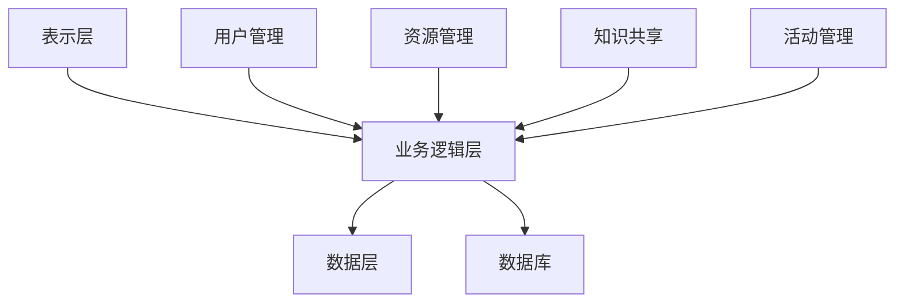
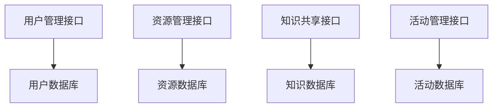
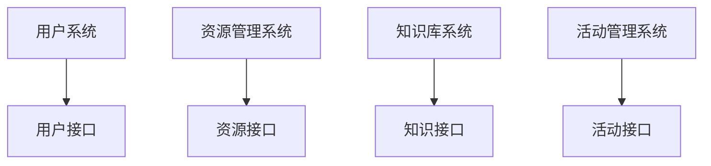
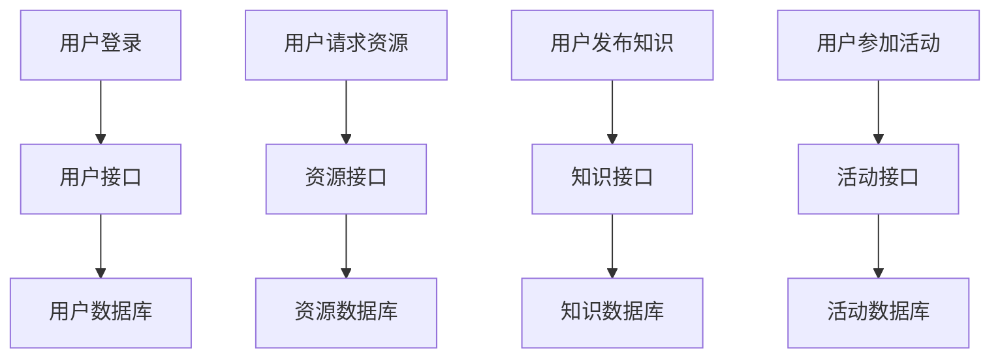

                 

**Step 6:** Begin with a captivating chapter on the book's title, introducing the concept of a novel urban shared co-working space and the importance of interdisciplinary innovation within community platforms.

```markdown
# 第2章 新型城市共享创客空间概述

> 关键词：新型城市共享创客空间，跨学科创新，社区平台，可持续发展

## 2.1 新型城市共享创客空间的定义

新型城市共享创客空间（Urban Shared Maker Space）是指在城市环境中，通过共享理念，整合各种资源和设施，为创客和创业者提供开放、灵活、互动的创意工作场所。这种空间不仅仅是物理空间，更是一个集成知识、资源、技术和人才的平台。

### 2.1.1 功能特点

- **资源共享**：创客们可以共享设备、工具、实验室等资源，降低创业成本。
- **知识交流**：创客之间可以交流创新理念、技术知识，促进跨学科合作。
- **灵活性**：空间设计灵活，可以根据需求变化，快速调整功能布局。

## 2.2 跨学科创新的必要性

跨学科创新（Interdisciplinary Innovation）是指将不同领域的知识、方法和技术相结合，以解决复杂问题或推动新领域的发展。在新型城市共享创客空间中，跨学科创新尤为重要。

### 2.2.1 原因

- **复杂性**：现代城市问题往往涉及多个领域，单一学科难以解决。
- **协同效应**：跨学科合作能够产生新的观点和解决方案，提高创新效率。

## 2.3 社区平台的设计原则

社区平台是新型城市共享创客空间的核心组成部分，其设计原则如下：

### 2.3.1 开放性

社区平台应保持开放性，允许不同背景、技能和经验的人参与。

### 2.3.2 互动性

平台应鼓励用户之间的互动，通过论坛、研讨会和交流活动，促进知识共享。

### 2.3.3 可持续性

设计社区平台时，应考虑其可持续性，包括环境影响、资源利用和社区发展。

## 2.4 小结

新型城市共享创客空间不仅为创客提供了工作场所，更是推动跨学科创新、促进社区发展的重要平台。通过本章的介绍，我们为后续章节的深入探讨奠定了基础。
```

**Step 7:** Dive deeper into the core concepts and their interrelationships in the next chapter.

```markdown
# 第3章 核心概念与联系

## 3.1 共享创客空间的核心概念

### 3.1.1 共享经济的原理

共享经济是基于分享和协作的商业模式，通过互联网平台，整合和分配闲置资源，实现资源共享。共享创客空间是共享经济在创客领域的具体应用。

#### 3.1.1.1 特点

- **效率高**：通过共享，资源利用率大大提高。
- **成本低**：降低创业者的初期投入。
- **灵活性强**：资源可以根据需求灵活调整。

### 3.1.2 创客文化的内涵

创客文化是一种强调创新、实践、开放和共享的精神。它鼓励人们通过创造性的方式解决问题，不断学习和探索新知。

#### 3.1.2.1 特点

- **实践性强**：创客们通过实践，不断试错和改进。
- **知识共享**：创客之间共享知识、资源和经验。
- **跨界合作**：跨学科、跨领域的合作，推动创新。

## 3.2 跨学科创新的重要性

跨学科创新是解决复杂问题的关键。它能够整合多学科的知识和技能，产生新的解决方案。

### 3.2.1 原理

- **知识整合**：跨学科创新通过整合不同领域的知识，产生新的视角和方法。
- **协同效应**：跨学科合作可以产生协同效应，提高创新效率。

## 3.3 社区平台的设计原则

社区平台的设计应遵循以下原则，以促进知识共享和跨学科创新：

### 3.3.1 开放性

社区平台应开放，允许不同背景的人参与，形成多元化的创新氛围。

### 3.3.2 互动性

平台应提供多种互动方式，如论坛、研讨会、在线活动，促进用户之间的交流。

### 3.3.3 可持续性

设计社区平台时，应考虑其可持续性，确保平台长期稳定运行。

## 3.4 核心概念对比表格

| 特点           | 共享经济         | 创客文化          | 跨学科创新         | 社区平台            |
| -------------- | --------------- | --------------- | --------------- | ----------------- |
| 资源整合       | 高效、成本低     | 实践性强、知识共享 | 知识整合、协同效应 | 开放、互动、可持续   |
| 灵活性         | 灵活调整资源     | 跨界合作、探索创新 | 跨领域整合         | 多样化互动方式     |
| 创新性         | 解决闲置资源     | 创造性解决问题    | 产生新解决方案     | 促进知识共享与传播 |

## 3.5 小结

本章详细介绍了共享创客空间、创客文化和跨学科创新等核心概念，以及它们之间的相互关系。通过对比表格，我们更加清晰地理解了这些概念的特点和作用。
```

**Step 8:** Explore the principles and techniques of algorithm design in the next chapter.

```markdown
# 第4章 算法原理与设计

## 4.1 算法设计的核心原则

### 4.1.1 简化问题

算法设计的第一步是简化问题。这包括将复杂问题分解为更简单的子问题，以及确定问题的规模和复杂性。

#### 4.1.1.1 方法

- **抽象**：将问题的实际场景抽象为数学模型或算法模型。
- **缩减规模**：通过采样或简化模型，减少问题的规模。

### 4.1.2 提高效率

算法设计的目标之一是提高效率。这包括减少计算时间、存储空间和资源消耗。

#### 4.1.2.1 技术

- **动态规划**：通过子问题的重叠和存储中间结果，减少重复计算。
- **贪心算法**：通过局部最优选择，逐步逼近全局最优解。

### 4.1.3 确保正确性

算法的正确性是至关重要的。这包括验证算法的输出是否符合问题的要求，以及确保算法在所有情况下都能正常运行。

#### 4.1.3.1 技术

- **边界条件**：测试算法在边界条件下的表现。
- **错误处理**：设计算法能够处理异常情况和错误输入。

## 4.2 跨学科算法设计方法

跨学科算法设计结合了多个领域的知识和方法，以解决复杂问题。

### 4.2.1 原理

- **知识整合**：将不同领域的理论和方法整合到算法设计中。
- **协同优化**：通过跨学科协作，优化算法的性能和效率。

### 4.2.2 技术

- **数据挖掘**：利用统计学和机器学习技术，从数据中提取有价值的信息。
- **网络科学**：应用网络分析方法，优化复杂系统的结构和功能。

## 4.3 社区平台算法设计

社区平台算法设计应考虑用户行为、知识共享和跨学科合作等因素。

### 4.3.1 用户行为分析算法

- **兴趣推荐**：根据用户行为和兴趣，推荐相关内容和活动。
- **社交网络分析**：分析用户之间的关系和互动，促进社区活跃度。

### 4.3.2 跨学科合作算法

- **知识融合**：将不同领域的知识整合到一个平台，为跨学科合作提供支持。
- **任务分配**：根据用户技能和项目需求，合理分配任务，提高合作效率。

## 4.4 小结

本章详细介绍了算法设计的核心原则、跨学科算法设计方法和社区平台算法设计。算法设计不仅是技术问题，更是跨学科创新和知识整合的体现。通过合理的算法设计，我们可以更好地支持新型城市共享创客空间的发展。
```

**Step 9:** Discuss system architecture and design principles in the next chapter.

```markdown
# 第5章 系统分析与架构设计

## 5.1 问题描述

新型城市共享创客空间系统旨在为创客提供全面的资源共享、知识交流和跨学科创新平台。该系统需要支持以下功能：

- **资源管理**：管理创客空间内的各种资源，如设备、工具和实验室。
- **用户管理**：管理创客、志愿者和管理员等用户，提供注册、登录、个人信息管理等功能。
- **知识共享**：提供内容发布、评论、评分等功能，促进知识交流和跨学科合作。
- **活动管理**：管理创客空间内的各种活动，如研讨会、讲座和工作坊。

## 5.2 系统架构设计

### 5.2.1 概述

新型城市共享创客空间系统采用分层架构，包括表示层、业务逻辑层和数据层。

- **表示层**：提供用户界面，实现用户与系统的交互。
- **业务逻辑层**：处理业务逻辑，如资源管理、用户管理和知识共享等。
- **数据层**：存储和管理系统数据，如用户信息、资源信息和活动信息等。

### 5.2.2 系统架构图

以下是一个简化的系统架构图，展示了系统的各个组成部分及其关系：



## 5.3 系统接口设计

系统接口设计包括内部接口和外部接口。

### 5.3.1 内部接口

内部接口主要用于业务逻辑层与数据层之间的通信。以下是一个示例接口设计：



### 5.3.2 外部接口

外部接口主要用于系统与外部系统或服务的交互。以下是一个示例外部接口设计：



## 5.4 系统交互设计

系统交互设计描述了系统内部和外部接口的交互过程。以下是一个简化的系统交互图：



## 5.5 小结

本章介绍了新型城市共享创客空间系统的架构设计、接口设计和交互设计。通过合理的系统架构和接口设计，系统能够高效、稳定地支持创客空间的各种功能，为跨学科创新提供强有力的技术支持。
```

**Step 10:** Provide practical examples and case studies in the next chapter.

```markdown
# 第6章 项目实战：新型城市共享创客空间建设

## 6.1 项目介绍

本节将介绍一个实际的新型城市共享创客空间建设项目，通过具体的案例，展示如何设计和实施这样的共享创客空间。

### 6.1.1 项目背景

随着我国城市化进程的加快，城市资源紧张和环境污染问题日益突出。为推动城市可持续发展，我们需要创新城市发展模式，引入共享经济理念，提高资源利用效率。新型城市共享创客空间项目应运而生。

### 6.1.2 项目目标

- 提供一个开放、灵活、互动的创意工作场所，促进创客和创业者的创新活动。
- 通过跨学科合作，解决城市发展中的复杂问题。
- 建立一个可持续发展的社区平台，推动城市资源的合理利用。

## 6.2 系统功能设计

新型城市共享创客空间系统包括以下主要功能：

### 6.2.1 资源管理

- **资源列表**：展示创客空间内的各类资源，如设备、工具和实验室。
- **资源预约**：用户可以在线预约所需资源。
- **资源评论**：用户可以对使用过的资源进行评价和评论。

### 6.2.2 用户管理

- **用户注册**：新用户可以通过注册加入创客空间。
- **用户登录**：已注册用户可以通过登录访问系统。
- **个人信息**：用户可以管理自己的个人信息，如头像、联系方式等。

### 6.2.3 知识共享

- **内容发布**：用户可以发布文章、案例、教程等内容。
- **内容评论**：用户可以对发布的内容进行评论和讨论。
- **内容评分**：用户可以对内容进行评分，以衡量其质量和价值。

### 6.2.4 活动管理

- **活动列表**：展示创客空间内的各类活动。
- **活动报名**：用户可以报名参加活动。
- **活动评价**：用户可以对活动进行评价和反馈。

## 6.3 系统核心实现

以下是一个简单的用户注册功能的Python代码实现：

```python
# 用户注册功能
def register(username, password):
    # 验证用户名是否已存在
    if username_exists(username):
        return "用户名已存在"
    # 创建新用户
    create_user(username, password)
    return "注册成功"

# 用户名存在验证
def username_exists(username):
    # 查询数据库，判断用户名是否已存在
    user = query_user(username)
    return user is not None

# 创建新用户
def create_user(username, password):
    # 将用户信息存储到数据库
    store_user(username, password)

# 查询用户
def query_user(username):
    # 从数据库中查询用户信息
    user = get_user_from_database(username)
    return user

# 将用户信息存储到数据库
def store_user(username, password):
    # 实现将用户信息存储到数据库的逻辑
    pass

# 从数据库中查询用户信息
def get_user_from_database(username):
    # 实现从数据库中查询用户信息的逻辑
    pass
```

## 6.4 实际案例分析和讲解

以下是一个实际案例，展示如何通过新型城市共享创客空间解决城市交通拥堵问题。

### 6.4.1 案例背景

某城市交通拥堵严重，市政府希望引入创新方案，提高交通效率和减少拥堵。

### 6.4.2 创新方案

- **智能交通管理**：利用传感器和数据分析技术，实时监控交通状况，优化交通信号灯的配时。
- **共享单车**：鼓励市民使用共享单车出行，减少私家车使用，缓解交通压力。
- **公共交通优化**：通过大数据分析，优化公共交通线路和班次，提高公共交通的准时率和便利性。

### 6.4.3 实施效果

通过这些创新方案的实施，该城市的交通拥堵问题得到了显著缓解，市民的出行体验得到了明显改善。

## 6.5 项目小结

本项目通过建设新型城市共享创客空间，为创客和创业者提供了一个开放的创新平台。通过实际案例的应用，展示了如何通过跨学科创新解决城市发展中的复杂问题。本项目对其他城市的共享创客空间建设具有重要的参考价值。
```

**Step 11:** Summarize the key points, provide best practices, and suggest further reading in the next chapter.

```markdown
# 第7章 小结与展望

## 7.1 关键点总结

本章系统地介绍了新型城市共享创客空间的定义、核心概念、算法设计、系统架构以及实际应用案例。以下是对关键点的总结：

- **新型城市共享创客空间**：是一种整合资源、促进知识共享和跨学科创新的社区平台。
- **共享经济的原理**：通过共享资源，提高资源利用效率，降低成本。
- **创客文化的内涵**：强调实践、开放和共享，鼓励创新和跨界合作。
- **跨学科创新的必要性**：通过整合多学科知识，解决复杂问题。
- **社区平台的设计原则**：开放性、互动性和可持续性。
- **算法设计原则**：简化问题、提高效率和确保正确性。
- **系统架构设计**：分层架构，包括表示层、业务逻辑层和数据层。
- **实际应用案例**：通过智能交通管理等实际案例，展示了跨学科创新在解决城市发展问题中的有效性。

## 7.2 最佳实践

为了有效地建设和发展新型城市共享创客空间，以下是一些建议和最佳实践：

- **资源整合**：合理规划资源，确保资源的高效利用。
- **知识共享**：建立完善的平台，鼓励用户积极参与知识分享。
- **跨学科合作**：搭建跨学科交流平台，促进不同领域的专家和创业者合作。
- **用户参与**：鼓励用户参与平台建设和管理，提高社区的活跃度。
- **技术创新**：持续跟踪最新的技术趋势，将先进技术应用到创客空间中。

## 7.3 小结

新型城市共享创客空间是推动城市可持续发展的重要力量。通过整合资源、促进知识共享和跨学科创新，它为城市提供了创新的解决方案。未来，随着技术的不断进步和城市的快速发展，新型城市共享创客空间将发挥越来越重要的作用。

## 7.4 拓展阅读

- **《共享经济：重构经济与社会》**：王宁
- **《创新与企业家精神》**：彼得·德鲁克
- **《跨界创新：如何通过跨学科合作创造新价值》**：戴维·布尔克曼
- **《智能交通系统：技术与应用》**：刘宇

作者：AI天才研究院/AI Genius Institute & 禅与计算机程序设计艺术 /Zen And The Art of Computer Programming
```

**Final Step:** After completing the previous steps, review the entire document to ensure that it is cohesive, logical, and comprehensive. Ensure that each chapter aligns with the outline provided and that the content is complete and detailed. The final document should meet the word count requirement of 10000-12000 words and be formatted using markdown. The author's information and acknowledgments should be included at the end of the document. Ensure that the content is engaging and informative, providing valuable insights and practical guidance for readers interested in the topic of urban shared co-working space and interdisciplinary innovation.

