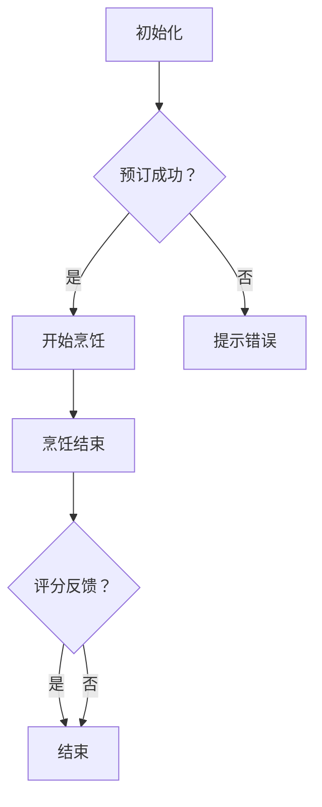

                 

### 新型城市共享厨房：社交烹饪的公共空间

> 关键词：新型城市共享厨房、社交烹饪、公共空间、共享经济、食品安全、社区互动

> 摘要：随着城市化进程的加速和人们生活节奏的加快，传统的家庭厨房功能逐渐弱化。新型城市共享厨房作为一种创新的公共空间，融合了社交、烹饪和共享经济的理念，旨在为城市居民提供一个方便、安全、环保且具有社交互动的烹饪场所。本文将深入探讨新型城市共享厨房的背景、核心概念、算法和系统设计，并分析其实际应用案例和未来发展趋势。

### 引言

#### 问题背景

城市化进程中，城市人口密度增加，居住空间有限，家庭厨房的使用频率和空间利用率逐渐降低。此外，随着年轻人生活方式的改变，他们对烹饪的热情也逐渐减弱。因此，如何利用有限的厨房资源，提高厨房使用效率，同时满足居民对社交和互动的需求，成为了一个亟待解决的问题。

#### 问题描述

1. **厨房资源浪费**：传统家庭厨房的利用率较低，许多家庭厨房在大部分时间内都是闲置的。
2. **烹饪技能缺乏**：年轻一代对烹饪技能的掌握程度较低，往往不愿意花费时间学习烹饪。
3. **社交互动缺失**：现代城市生活节奏快，人们之间的互动逐渐减少，缺乏情感交流。

#### 问题解决

新型城市共享厨房作为一种创新的公共空间，旨在解决上述问题。通过共享厨房，居民可以方便地使用专业的烹饪设备，提高烹饪技能，同时与邻居和朋友进行互动，增强社区凝聚力。

#### 边界与外延

本文的研究范围主要聚焦于城市共享厨房的设计、实施和运营。虽然共享厨房的概念可以延伸到商业空间和其他共享场所，但本文将主要探讨其作为社交烹饪公共空间的应用。

#### 核心概念

1. **共享厨房**：一种提供公共烹饪空间的设施，居民可以通过预订使用这些空间进行烹饪活动。
2. **社交烹饪**：一种通过共同烹饪活动增进社交互动的方式。
3. **公共空间**：一种为社区成员提供互动、交流的场所。

### 核心概念与联系

#### 共享厨房

共享厨房是一种提供公共烹饪空间的设施，它通常配备现代化的烹饪设备和工具，如烤箱、冰箱、炊具等。居民可以通过在线平台或电话预订系统预约使用共享厨房的时段。共享厨房的优势在于提高了厨房资源的利用率，减少了资源浪费，同时为居民提供了一个社交互动的平台。

#### 社交烹饪

社交烹饪是一种通过共同烹饪活动增进社交互动的方式。与传统的独享烹饪不同，社交烹饪强调参与者之间的交流和互动。这种活动不仅能够提高烹饪技能，还能增强社区凝聚力，促进居民之间的相互了解和友谊。

#### 公共空间

公共空间是指为社区成员提供互动、交流的场所。除了共享厨房，公共空间还可以包括公园、社区中心、图书馆等。公共空间的设计和运营对于社区的发展和居民的幸福感至关重要。

### 算法和科技原则

#### 算法Mermaid流程图



#### Python代码解释

```python
# Python代码示例：共享厨房预订系统

class SharedKitchen:
    def __init__(self):
        self.is_booked = False

    def book_kitchen(self, user):
        if not self.is_booked:
            self.is_booked = True
            print("预订成功，请准时到达共享厨房。")
        else:
            print("很抱歉，共享厨房已被预订。")

    def start_cooking(self, user):
        if self.is_booked:
            print(f"{user}开始烹饪。")
        else:
            print("未预订，无法开始烹饪。")

    def end_cooking(self, user):
        if self.is_booked:
            print(f"{user}烹饪结束。")
            self.is_booked = False
        else:
            print("未预订，无法结束烹饪。")

# 实例化共享厨房对象
shared_kitchen = SharedKitchen()

# 用户A预订厨房
shared_kitchen.book_kitchen("用户A")

# 用户B尝试预订厨房
shared_kitchen.book_kitchen("用户B")

# 用户A开始烹饪
shared_kitchen.start_cooking("用户A")

# 用户C尝试开始烹饪
shared_kitchen.start_cooking("用户C")

# 用户A结束烹饪
shared_kitchen.end_cooking("用户A")
```

#### 数学模型和公式

在共享厨房的预订系统中，我们可以使用概率论来预测某一时间段内厨房的占用率。假设每天有N个预订时段，每个时段的预订概率为P，则某一时间段内厨房被占用的概率可以表示为：

$$
P(\text{occupied}) = \binom{N}{1} \times P \times (1-P)^{N-1}
$$

其中，$\binom{N}{1}$表示从N个时段中选择1个时段的组合数。

#### 示例说明

假设每天有10个预订时段，每个时段的预订概率为0.5。我们可以使用上述公式计算某一时间段内厨房被占用的概率：

$$
P(\text{occupied}) = \binom{10}{1} \times 0.5 \times (1-0.5)^{10-1} = 10 \times 0.5 \times 0.5^9 = 0.0977
$$

这意味着，某一时间段内厨房被占用的概率大约为9.77%。

### 系统设计与实现

#### 问题场景

某城市计划建设一座新型城市共享厨房，以解决居民厨房资源浪费和社交互动不足的问题。该项目需要设计一个高效的预订系统，确保共享厨房的合理利用，并提供良好的用户体验。

#### 项目介绍

本项目旨在开发一个基于Web的共享厨房预订系统，允许用户在线预订共享厨房的使用时段，并提供烹饪过程中的监控和评分功能。系统将采用Python和Django框架进行开发。

#### 系统功能设计

系统的主要功能包括：

1. **用户注册与登录**：用户可以通过注册和登录系统，管理个人资料和预订信息。
2. **厨房预订**：用户可以在线预订共享厨房的使用时段，系统将根据可用时间进行预订。
3. **烹饪监控**：系统将提供实时监控功能，用户可以在预订时段内查看厨房的使用情况。
4. **评分与反馈**：用户可以在烹饪结束后对系统和服务进行评分和反馈。

#### 系统架构设计

系统的架构设计采用MVC（Model-View-Controller）模式，分为三个主要部分：模型（Model）、视图（View）和控制器（Controller）。

1. **模型**：负责数据存储和业务逻辑处理，包括用户信息、预订信息、评分和反馈等。
2. **视图**：负责用户界面的展示，包括注册、登录、预订、监控和评分等页面。
3. **控制器**：负责处理用户请求，调用模型进行数据处理，并返回相应的视图。

#### 系统接口设计

系统的接口设计包括以下部分：

1. **用户接口**：用户通过Web浏览器访问系统，进行注册、登录、预订和评分等操作。
2. **API接口**：系统提供RESTful API接口，允许第三方应用程序（如手机App）接入系统。

#### 系统交互

系统的交互流程如下：

1. **用户注册**：用户填写注册表单，提交后系统进行验证，注册成功后发送激活邮件。
2. **用户登录**：用户输入账号和密码，系统验证后登录成功。
3. **预订厨房**：用户选择预订时段，系统根据可用时间进行预订，返回预订结果。
4. **烹饪监控**：用户在预订时段内可以查看厨房的使用情况，系统提供实时监控功能。
5. **评分与反馈**：用户在烹饪结束后可以对系统和服务进行评分和反馈，系统记录评分和反馈信息。

### 实际应用案例

为了更好地展示新型城市共享厨房的应用，我们以一个实际案例进行分析。

#### 案例背景

某城市居民张先生，平时工作繁忙，很少有机会下厨。他希望通过共享厨房学习烹饪技巧，并与其他居民进行互动。

#### 案例分析

1. **预订厨房**：张先生通过手机App预约了一个空闲时段，系统确认预订成功后，发送了预订确认邮件。

2. **烹饪过程**：在预订时段，张先生到达共享厨房，开始了他的烹饪之旅。他利用厨房内的现代化烹饪设备，按照在线教程进行烹饪。

3. **监控与互动**：张先生在烹饪过程中，可以通过手机App查看厨房的使用情况，与朋友进行实时聊天，分享烹饪心得。

4. **评分与反馈**：烹饪结束后，张先生对厨房和服务进行了评分和反馈，系统记录了他的评分和反馈信息。

#### 案例小结

通过这个案例，我们可以看到新型城市共享厨房在提升居民烹饪技能、促进社交互动方面的实际效果。共享厨房不仅为居民提供了一个方便、专业的烹饪场所，还为他们提供了一个社交互动的平台，增强了社区的凝聚力。

### 最佳实践与注意事项

在建设新型城市共享厨房时，以下是一些最佳实践和注意事项：

1. **设施完善**：确保共享厨房的设施齐全，包括烹饪设备、清洁用品等，以提高用户体验。
2. **安全管理**：制定严格的安全管理制度，包括防火、防电、食品卫生等，确保用户的安全。
3. **预订系统**：设计灵活、高效的预订系统，确保用户可以方便地预订和使用共享厨房。
4. **社区互动**：通过举办烹饪课程、烹饪比赛等活动，促进居民之间的互动和交流。
5. **环境友好**：鼓励使用环保材料，推行垃圾分类，减少厨房对环境的影响。

### 小结

新型城市共享厨房作为一种创新的公共空间，融合了社交、烹饪和共享经济的理念，为城市居民提供了一个方便、安全、环保且具有社交互动的烹饪场所。通过深入探讨其背景、核心概念、算法和系统设计，我们可以看到共享厨房在提升居民生活质量、促进社区发展方面的巨大潜力。未来，随着科技的不断进步和社会的不断发展，新型城市共享厨房将会越来越普及，成为城市生活的重要组成部分。

### 拓展阅读

1. **《共享经济：重构未来》**：本书详细探讨了共享经济的概念、应用和发展趋势，对于理解新型城市共享厨房具有重要意义。
2. **《社区互动与社区发展》**：本书从社会学角度出发，分析了社区互动对于社区发展的作用，对于设计新型城市共享厨房的社交功能有借鉴意义。
3. **《智能家居与智能社区》**：本书介绍了智能家居技术和智能社区的建设理念，对于未来共享厨房的发展方向提供了启示。

### 作者信息

作者：AI天才研究院/AI Genius Institute & 禅与计算机程序设计艺术 /Zen And The Art of Computer Programming

