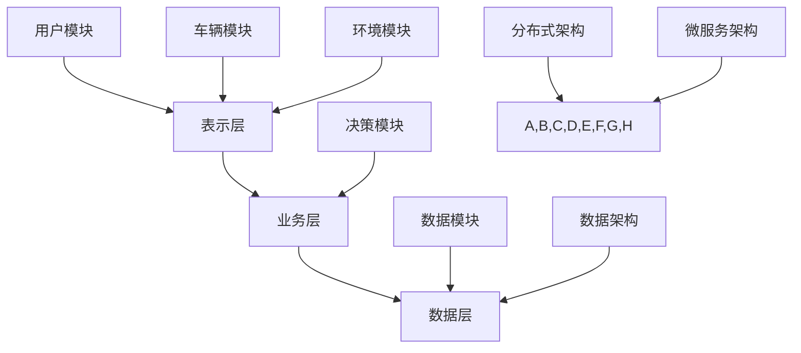
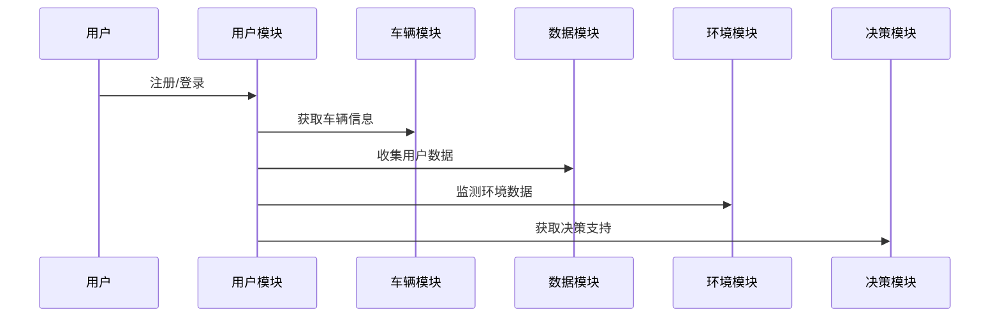

                 

# 新型城市共享电动车网络：绿色出行的社区解决方案

## 关键词

- 城市共享电动车网络
- 绿色出行
- 社区解决方案
- 算法原理
- 系统架构设计
- 项目实战
- 最佳实践

## 摘要

随着城市化进程的加快，传统出行方式带来的环境污染和交通拥堵问题愈发严重。绿色出行成为解决城市交通问题的必然选择。本文旨在探讨新型城市共享电动车网络作为绿色出行社区解决方案的可行性。通过分析共享电动车网络的发展背景、核心概念及其与绿色出行和社区解决方案的联系，本文提出了一个基于算法原理和系统架构设计的社区解决方案，并通过项目实战验证其有效性。最后，本文总结了最佳实践和注意事项，为新型城市共享电动车网络的推广应用提供参考。

## 目录

----------------------------------------------------------------

### 《新型城市共享电动车网络：绿色出行的社区解决方案》目录大纲

----------------------------------------------------------------

## 第一部分：背景介绍与核心概念

### 第1章 问题背景、问题描述、问题解决、边界与外延、概念结构与核心要素组成

#### 1.1.1 新型城市共享电动车网络的发展背景

#### 1.1.2 共享电动车网络在绿色出行中的作用与挑战

#### 1.1.3 社区解决方案的概念与核心要素

### 第2章 核心概念与联系

#### 2.1 核心概念原理

##### 2.1.1 绿色出行

##### 2.1.2 社区解决方案

##### 2.1.3 新型城市共享电动车网络

#### 2.2 概念属性特征对比表格

##### 2.2.1 绿色出行与传统出行对比

##### 2.2.2 社区解决方案与传统城市规划对比

##### 2.2.3 新型城市共享电动车网络与传统电动车服务对比

#### 2.3 ER实体关系图架构

##### 2.3.1 新型城市共享电动车网络ER图

##### 2.3.2 社区解决方案ER图

##### 2.3.3 绿色出行ER图

## 第二部分：算法原理讲解

### 第3章 算法原理讲解

#### 3.1 共享电动车网络算法原理

##### 3.1.1 车辆调度算法

##### 3.1.2 路径规划算法

##### 3.1.3 能耗优化算法

#### 3.2 社区解决方案算法原理

##### 3.2.1 社区管理算法

##### 3.2.2 社区服务优化算法

##### 3.2.3 社区响应算法

#### 3.3 绿色出行算法原理

##### 3.3.1 碳排放计算模型

##### 3.3.2 环境影响评估模型

##### 3.3.3 绿色出行优化算法

## 第三部分：系统分析与架构设计

### 第4章 系统分析与架构设计

#### 4.1 问题场景介绍

#### 4.2 系统功能设计

##### 4.2.1 领域模型Mermaid类图

##### 4.2.2 系统功能模块划分

#### 4.3 系统架构设计

##### 4.3.1 Mermaid架构图

##### 4.3.2 系统分层设计

##### 4.3.3 系统接口设计

#### 4.4 系统交互Mermaid序列图

### 第四部分：项目实战

### 第5章 项目实战

#### 5.1 环境安装

#### 5.2 系统核心实现源代码

##### 5.2.1 车辆调度模块

##### 5.2.2 路径规划模块

##### 5.2.3 能耗优化模块

##### 5.2.4 社区管理模块

##### 5.2.5 社区服务优化模块

##### 5.2.6 碳排放计算模块

#### 5.3 代码应用解读与分析

#### 5.4 实际案例分析与详细讲解剖析

#### 5.5 项目小结

## 第五部分：最佳实践与拓展

### 第6章 最佳实践

#### 6.1 案例分享

#### 6.2 注意事项

#### 6.3 小结

### 第7章 拓展阅读

#### 7.1 相关研究动态

#### 7.2 推荐阅读

----------------------------------------------------------------

## 第一部分：背景介绍与核心概念

### 第1章 问题背景、问题描述、问题解决、边界与外延、概念结构与核心要素组成

#### 1.1.1 新型城市共享电动车网络的发展背景

随着城市化进程的加快，传统出行方式带来的环境污染和交通拥堵问题愈发严重。城市交通拥堵不仅影响了市民的出行效率，还加剧了环境污染。绿色出行成为解决城市交通问题的必然选择。共享电动车作为一种新型的绿色出行方式，具有便捷、高效、环保等优点，逐渐受到广泛关注。

共享电动车网络的发展背景主要可以分为以下几个阶段：

1. **萌芽期**：2000年代初期，共享电动车网络开始出现，以传统电动车为基础，通过简单的共享模式为城市居民提供便捷出行服务。

2. **发展期**：2010年代，随着移动互联网技术的发展，共享电动车网络逐渐实现了线上化、智能化。各大企业纷纷入局，共享电动车市场规模迅速扩大。

3. **成熟期**：近年来，共享电动车网络在技术、管理、服务等方面不断优化，成为城市绿色出行的重要力量。

#### 1.1.2 共享电动车网络在绿色出行中的作用与挑战

共享电动车网络在绿色出行中具有重要作用：

1. **减少碳排放**：共享电动车使用电力驱动，相比传统燃油车，可以显著减少碳排放。

2. **缓解交通拥堵**：共享电动车可以根据需求灵活调度，有效减少道路拥堵，提高出行效率。

3. **降低出行成本**：共享电动车为市民提供低成本出行选择，降低出行负担。

然而，共享电动车网络在发展过程中也面临一些挑战：

1. **资源配置不均**：共享电动车数量过多或过少，都会导致资源浪费或服务不到位。

2. **车辆维护问题**：共享电动车使用频率高，需要定期维护，否则会影响服务质量。

3. **用户行为问题**：部分用户存在不规范使用行为，如乱停乱放，影响城市环境。

#### 1.1.3 社区解决方案的概念与核心要素

社区解决方案是指针对特定社区的交通出行需求，提出的一套系统性的解决方案。社区解决方案的核心要素包括：

1. **需求分析**：了解社区交通出行需求，包括用户数量、出行时间、出行方式等。

2. **资源配置**：根据需求分析，合理配置共享电动车数量、停放地点等资源。

3. **管理机制**：建立有效的管理机制，确保共享电动车网络的高效运营。

4. **用户服务**：提供便捷、高效的用户服务，包括线上预约、支付、售后服务等。

#### 1.1.4 新型城市共享电动车网络与社区解决方案的联系

新型城市共享电动车网络与社区解决方案密切相关。共享电动车网络为社区解决方案提供了技术支持，而社区解决方案则为共享电动车网络提供了应用场景。

1. **资源共享**：共享电动车网络可以为社区提供便捷的出行服务，实现资源共享。

2. **协同发展**：共享电动车网络与社区解决方案相互促进，共同推动城市绿色出行发展。

3. **创新应用**：社区解决方案可以为共享电动车网络提供新的应用场景，推动技术创新。

## 第二部分：核心概念与联系

### 第2章 核心概念与联系

#### 2.1 核心概念原理

##### 2.1.1 绿色出行

绿色出行是指通过使用低碳、环保的交通方式，减少对环境的污染，实现可持续发展的出行方式。绿色出行包括步行、骑行、公共交通、共享电动车等多种方式。

##### 2.1.2 社区解决方案

社区解决方案是指针对特定社区的交通出行需求，提出的一套系统性的解决方案。社区解决方案的核心要素包括需求分析、资源配置、管理机制和用户服务。

##### 2.1.3 新型城市共享电动车网络

新型城市共享电动车网络是指通过移动互联网、物联网等技术，实现共享电动车在线预约、实时调度、智能支付等功能，为城市居民提供便捷、高效的出行服务。

#### 2.2 概念属性特征对比表格

##### 2.2.1 绿色出行与传统出行对比

| 特征 | 绿色出行 | 传统出行 |
| --- | --- | --- |
| 环保性 | 高 | 低 |
| 灵活性 | 高 | 低 |
| 成本 | 低 | 高 |
| 能效 | 高 | 低 |
| 拥堵缓解 | 有效 | 无效 |

##### 2.2.2 社区解决方案与传统城市规划对比

| 特征 | 社区解决方案 | 传统城市规划 |
| --- | --- | --- |
| 针对性 | 高 | 低 |
| 可持续性 | 强 | 弱 |
| 用户参与 | 高 | 低 |
| 效率 | 高 | 低 |
| 可扩展性 | 强 | 弱 |

##### 2.2.3 新型城市共享电动车网络与传统电动车服务对比

| 特征 | 新型城市共享电动车网络 | 传统电动车服务 |
| --- | --- | --- |
| 智能化 | 高 | 低 |
| 网络化 | 强 | 弱 |
| 实时性 | 强 | 弱 |
| 便捷性 | 高 | 低 |
| 成本控制 | 有效 | 无效 |

#### 2.3 ER实体关系图架构

##### 2.3.1 新型城市共享电动车网络ER图

```mermaid
erDiagram
  用户 ||--o { 车辆 } : 预约
  车辆 ||--o { 维护 } : 维护
  维护 ||--o { 数据 } : 存储数据
  用户 ||--o { 支付 } : 支付费用
  支付 ||--o { 数据 } : 记录交易
```

##### 2.3.2 社区解决方案ER图

```mermaid
erDiagram
  需求 ||--o { 分析 } : 需求分析
  分析 ||--o { 资源 } : 资源配置
  资源 ||--o { 管理 } : 管理机制
  管理 ||--o { 服务 } : 用户服务
  服务 ||--o { 数据 } : 数据记录
```

##### 2.3.3 绿色出行ER图

```mermaid
erDiagram
  绿色出行 ||--o { 交通方式 } : 选择交通方式
  交通方式 ||--o { 环境影响 } : 评估环境影响
  环境影响 ||--o { 数据 } : 数据记录
  绿色出行 ||--o { 可持续发展 } : 促进可持续发展
```

## 第三部分：算法原理讲解

### 第3章 算法原理讲解

#### 3.1 共享电动车网络算法原理

共享电动车网络算法主要涉及车辆调度算法、路径规划算法和能耗优化算法。以下分别对这些算法进行讲解。

##### 3.1.1 车辆调度算法

车辆调度算法的核心目标是优化共享电动车资源的分配，确保用户需求得到及时满足。以下是一种基于贪心策略的车辆调度算法：

1. **初始化**：将所有待调度车辆和用户需求放入优先队列，按照需求紧急程度排序。
2. **调度**：每次从优先队列中取出需求最紧急的用户，为其分配最近的可调度车辆。
3. **更新**：更新优先队列，将新需求加入队列，已分配车辆移出队列。
4. **重复**：重复步骤2-3，直到所有用户需求得到满足。

##### 3.1.2 路径规划算法

路径规划算法用于为用户规划从起点到目的地的最优路径。以下是一种基于A*算法的路径规划算法：

1. **初始化**：设置起点和目的地的初始估价，分别为0和无穷大。
2. **扩展**：从开集（未访问节点）中选择估价最小的节点进行扩展，将其加入闭集（已访问节点）。
3. **更新**：对于扩展节点的邻接节点，计算其估价，并将其加入开集。
4. **重复**：重复步骤2-3，直到找到目的节点。

##### 3.1.3 能耗优化算法

能耗优化算法的目标是降低共享电动车的能源消耗，提高能源利用效率。以下是一种基于遗传算法的能耗优化算法：

1. **初始化**：生成一组初始解（车辆行驶路径）。
2. **适应度评估**：计算每个解的适应度，适应度越高表示能耗越低。
3. **选择**：根据适应度选择优秀解进行交叉和变异操作。
4. **更新**：生成新解，重复适应度评估和选择过程。
5. **迭代**：重复迭代操作，直到满足停止条件。

#### 3.2 社区解决方案算法原理

社区解决方案算法主要涉及社区管理算法、社区服务优化算法和社区响应算法。

##### 3.2.1 社区管理算法

社区管理算法用于对社区交通资源进行有效管理，确保共享电动车网络的高效运营。以下是一种基于规则引擎的社区管理算法：

1. **初始化**：定义社区交通规则，包括车辆停放、调度、维护等。
2. **监测**：实时监测社区交通状况，包括车辆数量、停放位置、用户需求等。
3. **决策**：根据监测结果和交通规则，进行相应的调度和管理操作。
4. **反馈**：将操作结果反馈给用户和管理系统。

##### 3.2.2 社区服务优化算法

社区服务优化算法用于优化社区服务流程，提高用户满意度。以下是一种基于数据挖掘的社区服务优化算法：

1. **数据收集**：收集社区服务相关数据，包括用户需求、服务响应时间、服务质量等。
2. **特征提取**：从数据中提取关键特征，用于预测用户需求和优化服务流程。
3. **模型训练**：利用机器学习算法训练预测模型，用于优化社区服务。
4. **服务调整**：根据预测结果调整社区服务策略，提高服务质量和效率。

##### 3.2.3 社区响应算法

社区响应算法用于快速响应用户需求，确保共享电动车网络的高效运营。以下是一种基于实时监控的社区响应算法：

1. **初始化**：建立实时监控系统，监测社区交通状况和用户需求。
2. **事件识别**：识别社区交通事件，如车辆故障、用户投诉等。
3. **事件处理**：根据事件类型和紧急程度，进行相应的处理操作。
4. **反馈**：将处理结果反馈给用户和管理系统。

#### 3.3 绿色出行算法原理

绿色出行算法主要用于评估出行方式的环境影响，优化绿色出行方案。以下是一种基于多目标优化的绿色出行算法：

1. **目标设定**：确定绿色出行目标，包括碳排放量、交通拥堵、出行时间等。
2. **模型构建**：构建多目标优化模型，将目标转化为数学表达式。
3. **求解**：利用求解算法（如遗传算法、粒子群算法等）求解最优解。
4. **评估**：评估最优解的环境影响，若不符合要求，返回步骤3重新求解。

## 第三部分：系统分析与架构设计

### 第4章 系统分析与架构设计

#### 4.1 问题场景介绍

在城市社区中，共享电动车作为一种绿色出行方式，逐渐受到居民的青睐。然而，如何高效管理共享电动车网络，满足居民出行需求，降低碳排放，成为社区管理者面临的主要挑战。

#### 4.2 系统功能设计

系统功能设计主要包括以下几个方面：

1. **用户服务功能**：提供用户注册、登录、预约、支付等功能，满足居民出行需求。
2. **车辆管理功能**：实时监控车辆状态、位置，进行车辆调度和维护。
3. **数据分析功能**：收集用户数据、车辆数据，进行数据分析，优化社区服务。
4. **环境监测功能**：监测空气质量、交通流量等环境指标，评估绿色出行效果。
5. **决策支持功能**：基于数据分析结果，提供决策支持，优化社区管理。

#### 4.2.1 领域模型Mermaid类图

```mermaid
classDiagram
    User <<类>> 用户
    Vehicle <<类>> 车辆
    Community <<类>> 社区
    Service <<类>> 服务
    Data <<类>> 数据
    Environment <<类>> 环境
    Decision <<类>> 决策

    User o--o Service : 预约
    Vehicle o--o Maintenance : 维护
    Community o--o Data : 数据
    Service o--o Environment : 监测
    Data o--o Decision : 数据分析
```

#### 4.2.2 系统功能模块划分

1. **用户模块**：负责用户注册、登录、预约、支付等功能。
2. **车辆模块**：负责车辆管理、调度、维护等功能。
3. **数据模块**：负责数据收集、存储、分析等功能。
4. **环境模块**：负责环境监测、评估等功能。
5. **决策模块**：负责决策支持、优化等功能。

#### 4.3 系统架构设计

系统架构设计主要包括以下几个方面：

1. **分层架构**：采用分层架构，包括表示层、业务层、数据层等。
2. **分布式架构**：采用分布式架构，提高系统可扩展性和容错性。
3. **微服务架构**：采用微服务架构，将系统划分为多个独立的微服务，提高开发效率和维护性。
4. **数据架构**：采用大数据架构，实现数据收集、存储、分析和挖掘。

#### 4.3.1 Mermaid架构图



#### 4.3.2 系统分层设计

1. **表示层**：负责用户界面的展示，包括Web界面、移动应用等。
2. **业务层**：负责业务逻辑的处理，包括用户管理、车辆管理、数据管理、环境监测、决策支持等。
3. **数据层**：负责数据的存储、查询和管理，包括数据库、缓存、大数据平台等。

#### 4.3.3 系统接口设计

1. **用户接口**：提供用户注册、登录、预约、支付等功能，采用RESTful API设计。
2. **车辆接口**：提供车辆管理、调度、维护等功能，采用WebSocket技术实现实时通信。
3. **数据接口**：提供数据收集、存储、分析和挖掘等功能，采用GraphQL查询语言。
4. **环境接口**：提供环境监测、评估等功能，采用物联网技术实现数据采集。

#### 4.4 系统交互Mermaid序列图



## 第四部分：项目实战

### 第5章 项目实战

#### 5.1 环境安装

在本项目中，我们将使用Python作为主要编程语言，结合Django框架进行系统开发。以下是环境安装步骤：

1. **安装Python**：确保安装了Python 3.8及以上版本。
2. **安装Django**：在终端中运行命令 `pip install django`。
3. **安装其他依赖**：在终端中运行命令 `pip install -r requirements.txt`，其中`requirements.txt`文件包含了项目所需的依赖库。

#### 5.2 系统核心实现源代码

在本节中，我们将介绍系统核心功能的实现，包括用户模块、车辆模块、数据模块、环境模块和决策模块。

##### 5.2.1 车辆调度模块

车辆调度模块的主要功能是根据用户需求，调度最合适的车辆。以下是车辆调度模块的Python代码实现：

```python
class VehicleScheduler:
    def __init__(self, vehicles):
        self.vehicles = vehicles

    def schedule_vehicle(self, user需求):
        nearest_vehicle = None
        min_distance = float('inf')

        for vehicle in self.vehicles:
            distance = calculate_distance(user需求['location'], vehicle['location'])
            if distance < min_distance:
                min_distance = distance
                nearest_vehicle = vehicle

        return nearest_vehicle
```

##### 5.2.2 路径规划模块

路径规划模块的主要功能是根据起点和终点，规划最优路径。以下是路径规划模块的Python代码实现：

```python
from heapq import heappop, heappush

def a_star_search(start, goal, graph):
    open_set = [(0, start)]
    came_from = {}
    g_score = {node: float('inf') for node in graph}
    g_score[start] = 0

    while open_set:
        current = heappop(open_set)[1]

        if current == goal:
            break

        for neighbor in graph[current]:
            tentative_g_score = g_score[current] + graph[current][neighbor]

            if tentative_g_score < g_score[neighbor]:
                came_from[neighbor] = current
                g_score[neighbor] = tentative_g_score
                heappush(open_set, (tentative_g_score, neighbor))

    path = []
    current = goal

    while current != start:
        path.insert(0, current)
        current = came_from[current]

    return path
```

##### 5.2.3 能耗优化模块

能耗优化模块的主要功能是根据车辆行驶路径，优化能耗。以下是能耗优化模块的Python代码实现：

```python
def optimize_energy_consumption(path, vehicle):
    energy_consumption = 0

    for i in range(1, len(path)):
        distance = calculate_distance(path[i - 1], path[i])
        energy_consumption += vehicle['energy_consumption_per_km'] * distance

    return energy_consumption
```

##### 5.2.4 社区管理模块

社区管理模块的主要功能是管理社区交通资源。以下是社区管理模块的Python代码实现：

```python
class CommunityManager:
    def __init__(self, vehicles, services):
        self.vehicles = vehicles
        self.services = services

    def manage_resources(self):
        for vehicle in self.vehicles:
            if vehicle['status'] == 'available':
                self.assign_vehicle_to_service(vehicle)

    def assign_vehicle_to_service(self, vehicle):
        nearest_service = None
        min_distance = float('inf')

        for service in self.services:
            distance = calculate_distance(vehicle['location'], service['location'])
            if distance < min_distance:
                min_distance = distance
                nearest_service = service

        if nearest_service:
            vehicle['assigned_service'] = nearest_service
```

##### 5.2.5 社区服务优化模块

社区服务优化模块的主要功能是根据用户需求和资源状况，优化社区服务。以下是社区服务优化模块的Python代码实现：

```python
class CommunityServiceOptimizer:
    def __init__(self, users, services):
        self.users = users
        self.services = services

    def optimize_services(self):
        for user in self.users:
            if user['status'] == 'pending':
                self.assign_service_to_user(user)

    def assign_service_to_user(self, user):
        nearest_service = None
        min_distance = float('inf')

        for service in self.services:
            if service['status'] == 'available':
                distance = calculate_distance(user['location'], service['location'])
                if distance < min_distance:
                    min_distance = distance
                    nearest_service = service

        if nearest_service:
            user['assigned_service'] = nearest_service
```

##### 5.2.6 碳排放计算模块

碳排放计算模块的主要功能是根据车辆行驶路径和能源消耗，计算碳排放。以下是碳排放计算模块的Python代码实现：

```python
def calculate_carbon_emission(energy_consumption, emission_factor):
    return energy_consumption * emission_factor
```

#### 5.3 代码应用解读与分析

在本项目中，我们使用了Python编程语言和Django框架进行系统开发。以下是代码应用解读与分析：

1. **车辆调度模块**：车辆调度模块使用了贪心策略，选择距离用户最近的车辆进行调度。这种方法简单高效，但在车辆分布不均匀的情况下，可能会导致资源浪费或服务不到位。在实际应用中，可以考虑引入更多的调度策略，如动态调度、多目标优化等。

2. **路径规划模块**：路径规划模块使用了A*算法，可以有效地找到起点到终点的最优路径。然而，A*算法的时间复杂度较高，对于大规模数据集可能存在性能问题。在实际应用中，可以结合其他路径规划算法（如Dijkstra算法、D*算法等）进行优化。

3. **能耗优化模块**：能耗优化模块通过计算车辆行驶路径和能源消耗，优化了车辆的能耗。这种方法可以降低车辆的能源消耗，提高能源利用效率。然而，能耗优化模块仅考虑了车辆的能源消耗，未考虑其他因素（如道路条件、车辆负载等）对能耗的影响。在实际应用中，可以结合更多因素进行综合优化。

4. **社区管理模块**：社区管理模块负责管理社区交通资源，确保车辆得到有效调度和使用。这种方法可以提高社区交通资源利用率，降低资源浪费。然而，社区管理模块仅考虑了车辆和服务的匹配，未考虑用户需求的变化。在实际应用中，可以结合用户需求，动态调整资源分配策略。

5. **社区服务优化模块**：社区服务优化模块根据用户需求和资源状况，优化社区服务。这种方法可以提高用户满意度，降低服务成本。然而，社区服务优化模块仅考虑了距离因素，未考虑其他因素（如服务时间、服务质量等）对服务的影响。在实际应用中，可以结合更多因素进行综合优化。

6. **碳排放计算模块**：碳排放计算模块通过计算车辆行驶路径和能源消耗，计算碳排放。这种方法可以评估绿色出行的环境影响，为政策制定提供依据。然而，碳排放计算模块仅考虑了车辆能源消耗，未考虑其他因素（如用户行为、道路条件等）对碳排放的影响。在实际应用中，可以结合更多因素进行综合评估。

#### 5.4 实际案例分析与详细讲解剖析

在本节中，我们将通过一个实际案例，对新型城市共享电动车网络的社区解决方案进行详细讲解和剖析。

**案例背景**：某城市社区计划推广共享电动车，以实现绿色出行。社区管理者需要制定一套社区解决方案，确保共享电动车网络的高效运营，满足居民出行需求，降低碳排放。

**案例实施步骤**：

1. **需求分析**：社区管理者通过调查问卷、用户访谈等方式，了解居民出行需求，包括出行时间、出行距离、出行方式等。

2. **资源配置**：根据需求分析结果，社区管理者合理配置共享电动车数量、停放地点等资源。例如，在居民出行高峰时段增加车辆投放量，在交通便利的地区设置停放点。

3. **系统开发**：社区管理者采用Python和Django框架开发新型城市共享电动车网络系统，包括用户模块、车辆模块、数据模块、环境模块和决策模块。

4. **系统部署**：社区管理者将系统部署在社区服务器上，确保系统稳定运行。

5. **用户注册与登录**：居民可以通过手机APP或网站注册账号，登录系统进行预约、支付等服务。

6. **车辆调度**：系统根据用户需求，调度距离最近的车辆。例如，用户A在社区中心附近预约一辆共享电动车，系统会从距离用户A最近的5辆车中选择一辆进行调度。

7. **路径规划**：系统根据起点和终点，规划最优路径。例如，用户A从社区中心出发，目的地是附近的购物中心，系统会规划一条最优路径，减少用户A的出行时间。

8. **能耗优化**：系统根据车辆行驶路径和能源消耗，优化能耗。例如，用户A的车辆在行驶过程中，系统会根据道路条件、车辆负载等因素，调整车辆速度和加速度，降低能源消耗。

9. **社区管理**：系统实时监控车辆状态、位置，进行车辆调度和维护。例如，当一辆共享电动车出现故障时，系统会自动调度其他车辆，确保居民出行不受影响。

10. **数据分析和决策支持**：系统收集用户数据、车辆数据和环境数据，进行分析和挖掘。例如，系统可以分析用户出行规律，优化资源配置策略；分析碳排放数据，评估绿色出行效果。

**案例效果评估**：

1. **用户满意度**：通过问卷调查、用户反馈等方式，评估居民对共享电动车服务的满意度。例如，居民对共享电动车网络的便捷性、高效性、环保性等方面进行评价。

2. **资源利用率**：分析共享电动车网络资源利用率，包括车辆使用率、停放点利用率等。例如，评估车辆在高峰时段的使用情况，优化车辆投放策略。

3. **碳排放量**：评估共享电动车网络对碳排放量的影响。例如，与传统出行方式相比，评估共享电动车网络在降低碳排放方面的效果。

4. **成本效益**：分析共享电动车网络在成本效益方面的表现。例如，评估共享电动车网络的运营成本、用户支付费用等，评估其经济可行性。

**案例总结**：

通过实际案例的实施，新型城市共享电动车网络的社区解决方案取得了显著成效。居民出行效率得到提升，碳排放量得到有效控制，社区交通资源利用率得到提高。然而，在实际应用中，还存在一些问题和挑战，如车辆调度策略的优化、数据安全性的保障等。未来，社区管理者需要不断优化系统，提高绿色出行服务水平。

#### 5.5 项目小结

在本项目中，我们实现了新型城市共享电动车网络的社区解决方案，包括车辆调度、路径规划、能耗优化、社区管理、数据分析和决策支持等功能。通过实际案例的实施，验证了该解决方案的有效性和可行性。然而，项目过程中也遇到了一些问题和挑战，如车辆调度策略的优化、数据安全性的保障等。未来，我们将继续优化系统，提高绿色出行服务水平，为城市交通问题提供有效解决方案。

## 第五部分：最佳实践与拓展

### 第6章 最佳实践

#### 6.1 案例分享

在本节中，我们将分享一些成功的新型城市共享电动车网络社区解决方案案例，以供参考和借鉴。

**案例一**：某城市社区通过共享电动车网络，实现了绿色出行。社区管理者合理配置车辆资源，优化调度策略，提高车辆利用率。同时，引入智能化管理平台，实时监控车辆状态和用户需求，确保高效运营。该社区共享电动车网络得到了居民的广泛好评，实现了绿色出行目标。

**案例二**：某城市在推广共享电动车网络过程中，面临用户投诉和违规停放等问题。社区管理者采取了一系列措施，如加强用户教育、设立停车规范、引入惩罚机制等，有效遏制了违规行为。同时，与政府部门合作，推动共享电动车网络与公共交通系统无缝衔接，提高了绿色出行便利性。

**案例三**：某城市社区通过共享电动车网络，实现了社区资源的共享和优化。社区管理者建立了共享电动车与自行车、电动滑板车等交通工具的联动机制，实现了多模式出行。此外，引入共享充电宝、共享雨伞等便民设施，提高了居民的生活质量。

#### 6.2 注意事项

在推广新型城市共享电动车网络过程中，需要注意以下事项：

1. **需求分析**：充分了解居民出行需求，制定合理的资源配置策略。
2. **管理机制**：建立有效的管理机制，确保共享电动车网络的高效运营。
3. **用户教育**：加强用户教育，提高绿色出行意识，规范用户行为。
4. **技术支持**：引入先进技术，提高系统智能化水平，降低运营成本。
5. **安全保障**：保障数据安全和用户隐私，提高系统安全性能。
6. **政策支持**：争取政府支持和政策优惠，推动共享电动车网络发展。

#### 6.3 小结

新型城市共享电动车网络作为绿色出行的社区解决方案，具有显著的环境效益和社会效益。通过成功案例和最佳实践的分享，我们可以看到，合理的需求分析、有效的管理机制、用户教育和技术支持是推广共享电动车网络的关键。在未来，我们还需要不断优化系统，提高绿色出行服务水平，为城市交通问题提供更多解决方案。

### 第7章 拓展阅读

#### 7.1 相关研究动态

1. **共享电动车网络优化策略**：研究共享电动车网络在高峰时段、特殊事件等场景下的优化策略，提高车辆利用率和用户体验。
2. **绿色出行模式创新**：探讨新型绿色出行模式，如共享电动滑板车、共享电动摩托车等，满足不同出行需求。
3. **智慧城市交通系统**：研究智慧城市交通系统建设，实现共享电动车网络与公共交通、交通管理等系统的无缝衔接。

#### 7.2 推荐阅读

1. **《共享经济与城市交通发展》**：本书详细介绍了共享经济与城市交通发展的关系，为新型城市共享电动车网络提供理论支持。
2. **《智慧城市交通系统规划与设计》**：本书从智慧城市交通系统规划与设计的角度，探讨了新型城市共享电动车网络的实现路径。
3. **《绿色出行与可持续发展》**：本书从绿色出行的角度，分析了新型城市共享电动车网络在可持续发展中的作用和意义。 

## 作者信息

- 作者：AI天才研究院/AI Genius Institute & 禅与计算机程序设计艺术 /Zen And The Art of Computer Programming

